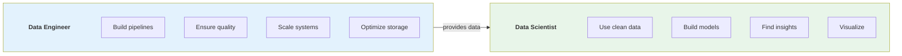
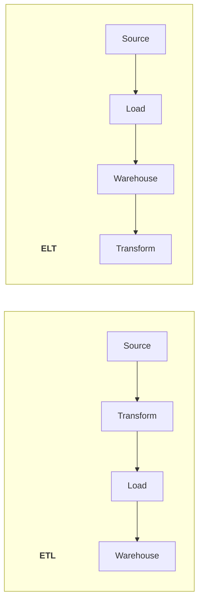
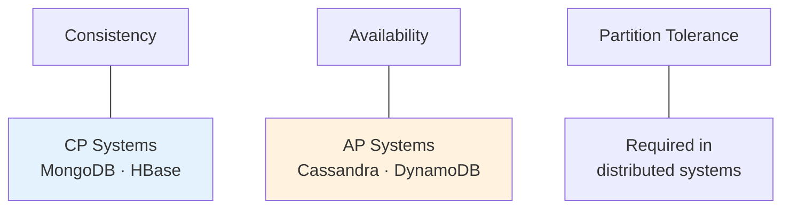
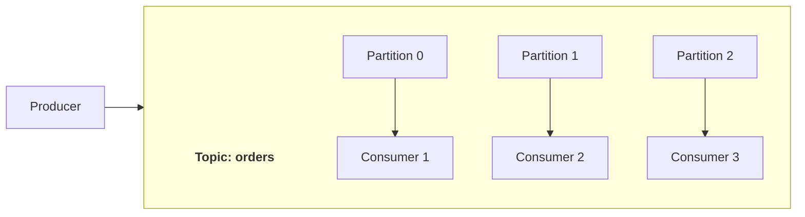
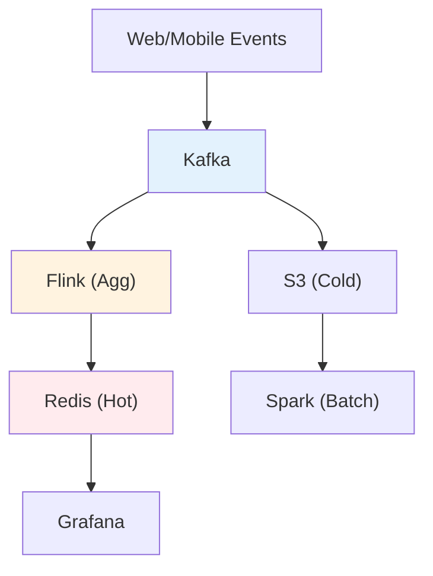
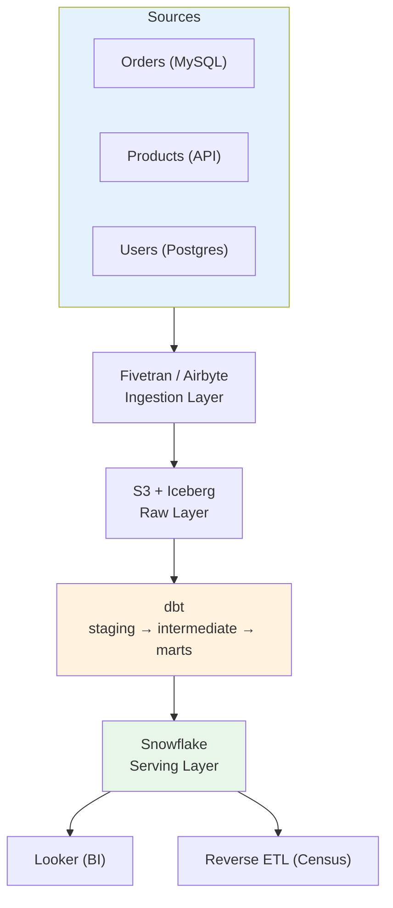

# 🎯 Data Engineering Interview Preparation

> Câu hỏi phỏng vấn phổ biến và cách trả lời cho Data Engineer

---

## 📚 Mục Lục

1. [Câu Hỏi Cơ Bản](#-câu-hỏi-cơ-bản)
2. [SQL & Data Modeling](#-sql--data-modeling)
3. [Distributed Systems](#-distributed-systems)
4. [Data Pipeline & ETL](#-data-pipeline--etl)
5. [Streaming & Real-time](#-streaming--real-time)
6. [System Design](#-system-design)
7. [Behavioral Questions](#-behavioral-questions)

---

## 📌 Câu Hỏi Cơ Bản

### Q1: Data Engineer làm gì? Khác gì với Data Scientist?

**Answer:**
- **Data Engineer:** Xây dựng và maintain data infrastructure, pipelines, đảm bảo data reliable và accessible
- **Data Scientist:** Sử dụng data để build models, analyze, tìm insights



### Q2: ETL vs ELT - Khi nào dùng cái nào?

**Answer:**

**ETL (Extract-Transform-Load):**
- Transform trước khi load vào destination
- Use case: Legacy systems, on-premise DWH
- Pros: Data clean trước khi vào warehouse
- Cons: Slower, less flexible

**ELT (Extract-Load-Transform):**
- Load raw data trước, transform trong warehouse
- Use case: Cloud DWH (Snowflake, BigQuery)
- Pros: Faster load, flexible transformation
- Cons: Need powerful warehouse



**Best Practice 2025:** ELT với dbt cho transformation

### Q3: OLTP vs OLAP - Giải thích và ví dụ

**Answer:**

**OLTP (Online Transaction Processing):**
- Purpose: Handle daily transactions
- Examples: MySQL, PostgreSQL, Oracle
- Characteristics:
  - Many short transactions
  - INSERT, UPDATE, DELETE heavy
  - Normalized data
  - Low latency required

**OLAP (Online Analytical Processing):**
- Purpose: Analytics, reporting
- Examples: Snowflake, BigQuery, Redshift
- Characteristics:
  - Complex queries, aggregations
  - SELECT heavy, read-optimized
  - Denormalized data
  - Columnar storage

### Q4: Data Lake vs Data Warehouse vs Lakehouse

**Answer:**

```
Data Warehouse:
- Structured data only
- Schema-on-write
- SQL access
- Example: Snowflake, Redshift

Data Lake:
- Any data (structured, semi, unstructured)
- Schema-on-read
- Cheap storage
- Problem: "Data Swamp" if not managed

Lakehouse:
- Best of both worlds
- Table formats (Iceberg, Delta, Hudi)
- ACID on data lake
- Example: Databricks Lakehouse
```

---

## 💾 SQL & Data Modeling

### Q5: Giải thích các Normal Forms (1NF, 2NF, 3NF)

**Answer:**

**1NF (First Normal Form):**
- No repeating groups
- Atomic values only
- Has primary key

```sql
-- Violates 1NF
| id | name  | phones              |
| 1  | John  | 123-456, 789-012    |  -- Multiple values!

-- 1NF compliant
| id | name  | phone    |
| 1  | John  | 123-456  |
| 1  | John  | 789-012  |
```

**2NF:**
- Must be 1NF
- No partial dependencies
- All non-key columns depend on entire primary key

**3NF:**
- Must be 2NF
- No transitive dependencies
- Non-key columns don't depend on other non-key columns

### Q6: Star Schema vs Snowflake Schema

**Answer:**

**Star Schema:**
- Fact table in center
- Dimension tables around (denormalized)
- Fewer joins = faster queries
- More storage

**Snowflake Schema:**
- Dimensions are normalized
- More joins = slower queries
- Less storage
- Easier maintenance

**When to use:**
- Star: Most analytics use cases (recommended)
- Snowflake: When storage is concern, dimensions change frequently

### Q7: Viết SQL window function

**Question:** Tính running total và rank theo department

**Answer:**
```sql
SELECT 
    employee_id,
    department,
    salary,
    -- Running total salary by department
    SUM(salary) OVER (
        PARTITION BY department 
        ORDER BY hire_date
        ROWS BETWEEN UNBOUNDED PRECEDING AND CURRENT ROW
    ) AS running_total,
    -- Rank within department
    RANK() OVER (
        PARTITION BY department 
        ORDER BY salary DESC
    ) AS salary_rank,
    -- Dense rank (no gaps)
    DENSE_RANK() OVER (
        PARTITION BY department 
        ORDER BY salary DESC
    ) AS salary_dense_rank,
    -- Row number
    ROW_NUMBER() OVER (
        PARTITION BY department 
        ORDER BY salary DESC
    ) AS row_num
FROM employees;
```

### Q8: SCD Type 1, 2, 3 là gì?

**Answer:**

**SCD (Slowly Changing Dimension):**

**Type 1 - Overwrite:**
- Ghi đè giá trị cũ
- Mất history
- Simple

**Type 2 - Add Row:**
- Thêm row mới với version mới
- Giữ full history
- Most common

```sql
-- Type 2 Example
| customer_key | customer_id | city        | effective_date | expiry_date  | is_current |
| 1001         | C123        | New York    | 2020-01-01     | 2024-06-30   | FALSE      |
| 1002         | C123        | Los Angeles | 2024-07-01     | 9999-12-31   | TRUE       |
```

**Type 3 - Add Column:**
- Thêm column cho previous value
- Limited history (1-2 versions only)

---

## 🌐 Distributed Systems

### Q9: CAP Theorem là gì?

**Answer:**

**CAP = Consistency, Availability, Partition Tolerance**

Trong distributed system, chỉ có thể đạt 2/3:



**Trade-offs:**
- **CP (Consistency + Partition):** MongoDB, HBase
- **AP (Availability + Partition):** Cassandra, DynamoDB
- **CA:** Không thực tế trong distributed systems

**Real-world:** Hầu hết chọn AP với eventual consistency

### Q10: Kafka giải quyết vấn đề gì?

**Answer:**

**Problems Kafka solves:**
1. **Decoupling:** Producers và consumers độc lập
2. **Buffering:** Handle traffic spikes
3. **Reliability:** Durable storage, replication
4. **Scalability:** Horizontal scaling với partitions

**Key concepts:**


**When to use:**
- Event streaming
- Log aggregation
- Microservices communication
- Real-time analytics

### Q11: Giải thích Partitioning strategies

**Answer:**

**Horizontal Partitioning (Sharding):**
- Chia rows across nodes
- Example: User 1-1M → Shard 1, User 1M-2M → Shard 2

**Strategies:**
1. **Hash Partitioning:**
   - partition = hash(key) % num_partitions
   - Even distribution
   - Problem: Adding nodes = reshuffling

2. **Range Partitioning:**
   - Ranges of values
   - Good for range queries
   - Problem: Hotspots

3. **Consistent Hashing:**
   - Minimize reshuffling when adding/removing nodes
   - Used by: Cassandra, DynamoDB

```
Range Partitioning:
A-M → Node 1
N-Z → Node 2

Hash Partitioning:
hash("John") % 3 = 1 → Node 1
hash("Jane") % 3 = 2 → Node 2
```

---

## 🔄 Data Pipeline & ETL

### Q12: Làm sao handle late-arriving data?

**Answer:**

**Strategies:**
1. **Watermark:** Define how late is acceptable
2. **Reprocessing:** Re-run pipeline for affected windows
3. **Lambda Architecture:** Batch corrects streaming results
4. **Delta/Upsert:** Update existing records

```python
# Flink watermark example
.assign_timestamps_and_watermarks(
    WatermarkStrategy
        .for_bounded_out_of_orderness(Duration.of_minutes(5))
        .with_timestamp_assigner(lambda e, _: e.event_time)
)
```

### Q13: Idempotency trong data pipeline là gì?

**Answer:**

**Idempotency:** Chạy pipeline nhiều lần với cùng input → cùng output

**Why important:**
- Pipeline có thể fail và retry
- Duplicate events từ source
- Ensure data correctness

**How to achieve:**
```sql
-- Use MERGE/UPSERT instead of INSERT
MERGE INTO target t
USING source s ON t.id = s.id
WHEN MATCHED THEN UPDATE SET t.value = s.value
WHEN NOT MATCHED THEN INSERT (id, value) VALUES (s.id, s.value);

-- Or use unique constraints + ON CONFLICT
INSERT INTO table (id, value) 
VALUES (1, 'data')
ON CONFLICT (id) DO UPDATE SET value = EXCLUDED.value;
```

### Q14: Data Quality checks nào cần có?

**Answer:**

**Essential checks:**
```yaml
Completeness:
  - No NULL in required fields
  - Row count within expected range

Uniqueness:
  - Primary keys are unique
  - No duplicate records

Validity:
  - Values in expected range
  - Correct data types
  - Valid formats (email, phone)

Consistency:
  - Referential integrity
  - Cross-table consistency

Timeliness:
  - Data freshness
  - SLA compliance
```

**Tools:** Great Expectations, dbt tests, Soda

---

## ⚡ Streaming & Real-time

### Q15: Exactly-once processing hoạt động như thế nào?

**Answer:**

**Delivery semantics:**
- **At-most-once:** May lose messages
- **At-least-once:** May have duplicates
- **Exactly-once:** No loss, no duplicates

**How to achieve exactly-once:**
1. **Idempotent producers:** Kafka producer config
2. **Transactional writes:** Kafka transactions
3. **Consumer offset management:** Commit after processing

```
Producer → Kafka (idempotent) → Consumer (transactional)
    ↓                              ↓
  Assign ID                    Commit offset
  Dedupe on                    atomically with
  broker side                  output write
```

### Q16: Khi nào dùng Kafka vs Flink vs Spark Streaming?

**Answer:**

```
Use Case                        | Tool
--------------------------------|------------------
Message queue, event bus        | Kafka
Simple transformations          | Kafka Streams
Complex event processing        | Flink
Low latency (< 100ms)           | Flink
Batch + Stream unified          | Spark Structured Streaming
ML on streaming                 | Spark + MLlib
Stateful processing             | Flink (best), Spark
```

**Rule of thumb:**
- Pure streaming, low latency → Flink
- Batch-first, add streaming → Spark
- Event-driven microservices → Kafka Streams

---

## 🏗️ System Design

### Q17: Design a real-time analytics dashboard

**Question:** Design system để hiển thị real-time metrics (page views, conversions)

**Answer:**



**Components:**
1. Event Collection: JavaScript SDK → Kafka
2. Stream Processing: Flink aggregates per minute
3. Hot Storage: Redis for last 24h
4. Cold Storage: S3 + Iceberg for historical
5. Visualization: Grafana real-time dashboards

### Q18: Design a data pipeline for e-commerce

**Question:** Design ETL pipeline cho e-commerce với orders, products, customers

**Answer:**



---

## 💬 Behavioral Questions

### Q19: Tell me about a challenging data pipeline you built

**Framework: STAR**

**Situation:** "At company X, we needed to migrate from batch to real-time processing for fraud detection. Legacy system had 4-hour delay."

**Task:** "I was responsible for designing and implementing the new streaming pipeline."

**Action:**
- "Analyzed requirements, chose Kafka + Flink stack"
- "Designed exactly-once processing with checkpointing"
- "Implemented gradual migration with shadow mode"
- "Set up monitoring and alerting"

**Result:**
- "Reduced detection time from 4 hours to 30 seconds"
- "Prevented $2M in fraud first quarter"
- "99.9% uptime since launch"

### Q20: How do you handle disagreements with team members?

**Answer:**
1. **Listen first:** Understand their perspective
2. **Data-driven:** Use metrics/evidence to support decisions
3. **Prototype:** When in doubt, build POC to compare
4. **Escalate appropriately:** If needed, involve senior/architect
5. **Document decisions:** ADR (Architecture Decision Records)

---

## 📝 Interview Tips

**Before Interview:**
- Review fundamentals (SQL, distributed systems)
- Practice coding on whiteboard/shared doc
- Prepare 3-5 projects to discuss in detail
- Research company's tech stack

**During Interview:**
- Ask clarifying questions
- Think out loud
- Consider trade-offs
- Mention monitoring/error handling

**System Design Format:**
1. Clarify requirements (5 min)
2. High-level design (10 min)
3. Deep dive components (15 min)
4. Handle edge cases (5 min)
5. Discuss trade-offs (5 min)

---

## 🔗 Liên Kết

- [Fundamentals](../fundamentals/) - Ôn tập kiến thức
- [Tools](../tools/) - Hiểu sâu các tool
- [Mindset](../mindset/) - Tư duy Senior DE

---

*Cập nhật: February 2026*
