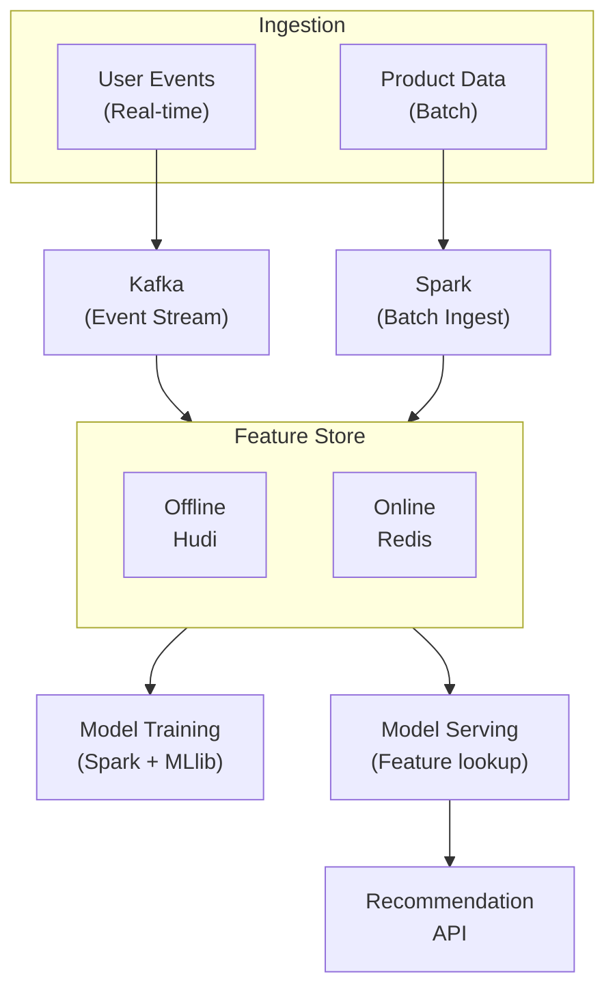
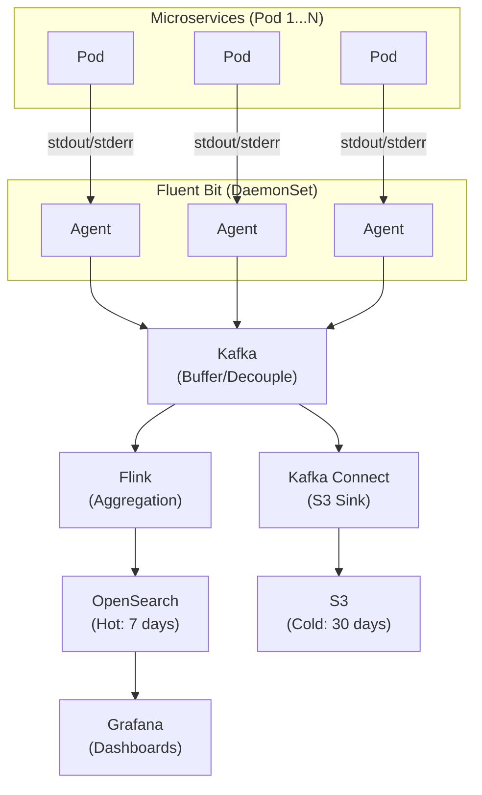
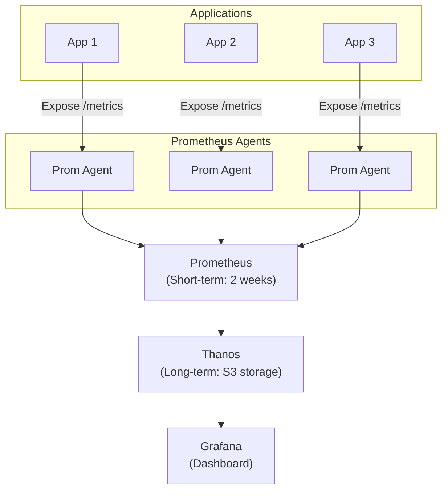

# 🏗️ System Design Interview - Data Engineering

> Các bài toán System Design thường gặp trong phỏng vấn Senior/Staff DE

---

## 📚 Mục Lục

1. [Framework Trả Lời](#-framework-trả-lời)
2. [Design Data Pipeline](#-design-data-pipeline)
3. [Design Real-time Analytics](#-design-real-time-analytics)
4. [Design Data Warehouse](#-design-data-warehouse)
5. [Design Recommendation System Backend](#-design-recommendation-system-backend)
6. [Design Log Aggregation System](#-design-log-aggregation-system)
7. [Design Metrics Collection System](#-design-metrics-collection-system)

---

## 📋 Framework Trả Lời

### RADIO Framework

Sử dụng framework này cho mỗi system design question:

**R - Requirements Clarification** (5 min)
- Functional requirements
- Non-functional requirements (scale, latency, availability)
- Data characteristics

**A - API Design** (5 min)
- Input/output formats
- Data models

**D - Data Flow & High-Level Design** (10 min)
- Components và connections
- End-to-end flow

**I - Implementation Deep Dive** (15 min)
- Choose 2-3 components để dive deep
- Trade-offs

**O - Observability & Operations** (5 min)
- Monitoring
- Error handling
- Maintenance

---

## 🔄 Design Data Pipeline

### Question

> "Design a scalable data pipeline that ingests data from multiple sources, transforms it, and loads into a data warehouse. Handle 100GB/day, support both batch and real-time."

### Requirements Clarification

**Functional:**
- Ingest from: APIs, databases, file uploads
- Transformations: Cleaning, deduplication, aggregation
- Load into: Cloud data warehouse
- Support both batch (hourly) và real-time

**Non-Functional:**
- Scale: 100GB/day, peak 1000 events/sec
- Latency: Real-time < 5 min, batch < 1 hour
- Availability: 99.9%
- Data quality: No data loss, handle duplicates

### High-Level Design

**DATA PIPELINE ARCHITECTURE**

  - DATA SOURCES             INGESTION                STORAGE
  - APIs  ------------->  API Gateway
  - Kafka                    v
  - TRANSFORMATION             SERVING              CONSUMERS

### Deep Dive: Key Components

#### 1. Ingestion Layer

**Choice: Kafka**
```
Reasons:
- Decoupling sources from consumers
- Durability (configurable retention)
- Replayability
- Horizontal scaling

Configuration:
- 3 brokers minimum
- Replication factor: 3
- Partitions: Based on throughput needs
- Retention: 7 days
```

**CDC cho databases:**
```
Debezium → Kafka → S3
- Captures all changes (INSERT, UPDATE, DELETE)
- Minimal impact on source DB
- Exactly-once with Kafka transactions
```

#### 2. Storage Layer

**Why Iceberg on S3:**
```
Benefits:
- ACID transactions on data lake
- Time travel (query historical data)
- Schema evolution
- Partition evolution (no rewrite)
- Works with Spark, Flink, Trino

Structure:
s3://data-lake/
├── raw/              # Immutable landing zone
│   └── source=api/
│       └── date=2024-01-01/
├── staging/          # Cleaned, deduplicated
├── curated/          # Business logic applied
└── iceberg-metadata/ # Table metadata
```

#### 3. Transformation Layer

**Batch: Spark + dbt**
```
Spark: Heavy lifting
- Large-scale transformations
- Complex joins
- Deduplication

dbt: Business logic
- Incremental models
- Data quality tests
- Documentation
```

**Real-time: Flink**
```
Use cases:
- Windowed aggregations
- Event deduplication
- Late event handling

Checkpointing:
- Exactly-once processing
- 5-minute checkpoint interval
- RocksDB state backend
```

### Error Handling & Monitoring

| Observability |
|---|
| Data Quality: |
| - Great Expectations in pipeline |
| - dbt tests after transforms |
| - Row count assertions |
| Monitoring: |
| - Datadog/Prometheus metrics |
| - Pipeline latency |
| - Data freshness |
| - Error rates |
| Alerting: |
| - PagerDuty for critical |
| - Slack for warnings |
| Dead Letter Queue: |
| - Failed events → DLQ topic |
| - Manual review & replay |

### Trade-offs Discussed

| Decision | Option A | Option B | Chosen |
|----------|----------|----------|--------|
| Message Queue | Kafka | Pulsar | Kafka (ecosystem) |
| Storage Format | Parquet | ORC | Parquet + Iceberg |
| Batch Processing | Spark | Trino | Spark (flexibility) |
| Orchestration | Airflow | Dagster | Dagster (modern) |

---

## ⚡ Design Real-time Analytics

### Question

> "Design a real-time analytics dashboard showing website metrics: page views, unique visitors, conversions. Should update every 10 seconds."

### Requirements

**Functional:**
- Track: Page views, unique visitors, conversions
- Dimensions: Page, country, device, referrer
- Time granularity: Per minute, per hour, per day
- Dashboard updates every 10 seconds

**Non-Functional:**
- Scale: 10,000 events/sec peak
- Latency: Event to dashboard < 10 seconds
- Storage: 30 days hot, 1 year cold
- Availability: 99.9%

### High-Level Design

**REAL-TIME ANALYTICS**

  - Web         Kafka        Flink        Redis
  - Events ---->        ---->        ---->
  - S3           Grafana
  - (Cold)
  - ClickHouse
  - (OLAP)

### Deep Dive: Stream Processing

**Flink Aggregation Logic:**
```
Event Schema:
{
    event_id: string
    user_id: string
    session_id: string
    timestamp: long
    event_type: "page_view" | "click" | "conversion"
    page_url: string
    referrer: string
    country: string
    device: string
}

Aggregation Windows:
- Tumbling: 1 minute windows
- Sliding: 10 second slide for dashboard

Output:
{
    window_start: timestamp
    window_end: timestamp
    page_url: string
    country: string
    page_views: long
    unique_visitors: long (HyperLogLog)
    conversions: long
}
```

**HyperLogLog for Unique Counting:**
```
Why:
- Counting unique visitors exactly = expensive
- HLL gives ~2% error with tiny memory
- 12KB per counter vs potentially GBs

Redis HLL:
PFADD visitors:2024-01-01 user123
PFCOUNT visitors:2024-01-01
```

### Deep Dive: Storage Tiers

| HOT | WARM | COLD |
|---|---|---|
| Redis | ClickHouse | S3 + Parquet |
| Last 24 hours | Last 30 days | 1+ year |
| Pre-aggregated | Ad-hoc queries | Archive |
| O(1) lookup | OLAP analytics | Batch analysis |

### Error Handling

**Late Events:**
```
Strategy:
1. Watermark: Accept events up to 5 min late
2. Side output: Events > 5 min → separate topic
3. Batch correction: Hourly job fixes aggregates
```

**Exactly-once:**
```
Flink:
- Kafka source with committed offsets
- Checkpointing every 30 seconds
- Redis sink with idempotent writes

Idempotent Redis:
- Use HSET with composite key
- Key: metric:window_start:dimensions
- Flink can reprocess safely
```

---

## 🏢 Design Data Warehouse

### Question

> "Design a data warehouse for an e-commerce company. Should support analytics, reporting, and ML feature store."

### Requirements

**Data Sources:**
- Transactional DB: Orders, products, customers
- Event streams: Clickstream, search logs
- External: Marketing, CRM

**Use Cases:**
- Business reporting (Tableau/Looker)
- Self-service analytics
- ML feature serving
- Reverse ETL to marketing tools

**Scale:**
- 10TB current size
- 100GB/day growth
- 1000 daily active users

### High-Level Design

**DATA WAREHOUSE ARCHITECTURE**

  - DATA SOURCES
  - MySQL   Kafka  APIs
  - INGESTION LAYER
  - Fivetran       Kafka         Airbyte
  - (SaaS DBs)     Connect       (APIs)
  - RAW LAYER (Bronze)
  - S3 + Iceberg
  - raw.orders    raw.events    raw.crm
  - STAGING LAYER (Silver)
  - dbt Models
  - stg_orders     stg_events     stg_users
  - - Cleaned      - Deduped      - Merged
  - MARTS LAYER (Gold)
  - Business Logic
  - Finance          Marketing        Product
  - - Revenue        - Attribution    - Usage
  - - Costs          - Cohorts        - Funnel
  - Snowflake     Feature       Reverse
  - (BI)          Store         ETL

### Data Modeling Approach

**Dimensional Modeling (Kimball):**
```
Fact Tables:
- fact_orders: Order transactions
- fact_page_views: Clickstream events
- fact_inventory: Inventory snapshots

Dimension Tables:
- dim_customers: SCD Type 2
- dim_products: SCD Type 1
- dim_date: Pre-generated calendar
- dim_geography: Countries, regions

Metrics Layer:
- Semantic layer on top (dbt metrics, Looker)
- Consistent metric definitions
```

**Example: Customer 360 Model:**
```sql
-- Intermediate: customer behaviors
SELECT
    customer_id,
    COUNT(DISTINCT order_id) AS lifetime_orders,
    SUM(order_total) AS lifetime_value,
    DATEDIFF(
        day, 
        first_order_date, 
        last_order_date
    ) AS customer_tenure_days,
    DATEDIFF(
        day, 
        last_order_date, 
        CURRENT_DATE
    ) AS days_since_last_order
FROM {{ ref('stg_orders') }}
GROUP BY customer_id
```

### Performance Optimization

**Clustering (Snowflake):**
```sql
-- Cluster on frequently filtered columns
ALTER TABLE fact_orders CLUSTER BY (order_date, customer_id);
```

**Materialized Views:**
```sql
-- For expensive aggregations
CREATE MATERIALIZED VIEW daily_sales_summary AS
SELECT 
    date_trunc('day', order_date) AS order_day,
    product_category,
    SUM(revenue) AS total_revenue
FROM fact_orders
GROUP BY 1, 2;
```

---

## 🎯 Design Recommendation System Backend

### Question

> "Design the data infrastructure for a recommendation system. Support real-time personalization và batch model training."

### Requirements

**Functional:**
- Collect user interactions (views, clicks, purchases)
- Feature store for ML models
- Serve recommendations in < 50ms
- Train models on historical data daily

**Scale:**
- 10M daily active users
- 100M products
- 1B events/day

### Architecture



**Real-time Flow:**
1. User action → Kafka
2. Flink updates online features → Redis
3. Recommendation API queries Redis
4. Model inference → personalized results

**Batch Flow:**
1. Daily Spark job reads Kafka/S3
2. Compute aggregated features
3. Store in Hudi (offline store)
4. Train ML model
5. Deploy model

### Feature Store Design

**Online Features (Redis):**
```
Key Design:
- user:{user_id}:features → user features
- user:{user_id}:recent_views → last 50 viewed items
- item:{item_id}:features → item features

TTL: 24 hours (refresh daily)

Example Features:
- user_click_rate_7d
- user_category_preferences
- user_price_range
- item_popularity_score
- item_category_vector
```

**Offline Features (Hudi/Iceberg):**
```
Tables:
- user_features_daily
  - user_id
  - feature_timestamp
  - lifetime_orders
  - avg_order_value
  - category_affinity_vector
  - ...100+ features

- item_features_daily
  - item_id
  - feature_timestamp
  - view_count_30d
  - conversion_rate
  - similar_items_vector
  - ...50+ features

Point-in-time Correct:
- Join features as of training time
- Avoid future data leakage
```

---

## 📊 Design Log Aggregation System

### Question

> "Design a centralized logging system for a microservices architecture. Handle 100K logs/sec, support full-text search."

### Requirements

**Functional:**
- Collect logs from 500+ services
- Structured logging (JSON)
- Full-text search
- Alerting on error patterns
- 30-day retention

**Non-Functional:**
- 100K logs/sec peak
- Search latency < 1 second
- 99.9% availability
- Cost-effective storage

### Architecture



### Key Design Decisions

**Why Fluent Bit over Fluentd:**
```
Fluent Bit:
- Lightweight (450KB vs 40MB)
- Lower memory footprint
- Designed for Kubernetes

Config:
- Tail container logs
- Parse JSON/multiline
- Buffer locally
- Forward to Kafka
```

**Why Kafka in the middle:**
```
Benefits:
- Buffer during spikes
- Decouple collectors from storage
- Replayability
- Multiple consumers

Not directly to OpenSearch:
- OpenSearch can't handle burst
- Would lose logs during outages
```

**Storage Tiering:**
```
Hot (OpenSearch): 7 days
- Full-text search
- Fast queries
- Expensive storage

Cold (S3 + Parquet): 30 days
- Compressed storage
- Query with Athena if needed
- 10x cheaper than OpenSearch
```

---

## 📈 Design Metrics Collection System

### Question

> "Design a system to collect and query application metrics (latency, error rates, CPU). Support thousands of metrics, 1-minute granularity, 1-year retention."

### Architecture



**Components:**
1. Prometheus scrapes metrics from apps
2. Prometheus stores 2 weeks locally
3. Thanos ships to S3 for long-term
4. Thanos Querier for unified query
5. Grafana dashboards + alerts

### Prometheus Design

**Metric Types:**
```
Counter: request_total
Gauge: cpu_usage_percent
Histogram: request_duration_seconds
Summary: Similar to histogram (pre-calculated percentiles)
```

**Cardinality Management:**
```
Problem: High cardinality = OOM
- user_id as label = millions of time series

Solution:
- Limit label values
- Use recording rules for pre-aggregation
- Drop unused labels at ingestion

Recording Rules:
- Pre-compute expensive queries
- Store as new metric
- Query is instant
```

### Long-term Storage with Thanos

```
Thanos Components:
1. Sidecar: Ships blocks to S3
2. Store: Queries S3 data
3. Compactor: Downsamples old data
4. Query: Unified query interface

Downsampling:
- Raw: 2 weeks
- 5-minute: 3 months
- 1-hour: 1 year

Benefits:
- Unlimited retention
- Cheap S3 storage
- Single query interface
```

---

## 📐 Back-of-Envelope Estimation

> "How much storage do we need?" — Câu hỏi phải trả lời TRƯỚC khi design

### Storage Estimation Framework

```
Step 1: Estimate input rate
Step 2: Calculate single record size
Step 3: Multiply for daily/monthly/yearly
Step 4: Add compression ratio
Step 5: Add replication factor
```

### Example 1: E-commerce Click Events

```
Given:
- 10M DAU (daily active users)
- Average 50 clicks per user per day
- Each click event: ~500 bytes (JSON)

Calculation:
Daily events = 10M × 50 = 500M events/day
Daily raw size = 500M × 500 bytes = 250 GB/day
Monthly = 250 × 30 = 7.5 TB/month
Yearly = 7.5 × 12 = 90 TB/year

With compression (Parquet ~5x):
Yearly compressed = 90 / 5 = 18 TB/year

With 3x replication:
Total storage = 18 × 3 = 54 TB/year

Events per second (peak):
Average: 500M / 86400 ≈ 5,800 events/sec
Peak (3x): ~17,400 events/sec
```

### Example 2: Cost Estimation

```
Cloud Data Warehouse cost:
- Storage: $23/TB/month (BigQuery)
- Query: $5/TB scanned
- Streaming insert: $0.01/200MB

Monthly cost for 18TB stored:
Storage: 18 × $23 = $414/month
Queries (assume 50TB scanned): 50 × $5 = $250/month
Insert: (250GB × 30) / 200MB × $0.01 = $375/month
Total: ~$1,039/month

vs On-prem equivalent:
Server: $5K/month (3 nodes)
License: $0 (open source)
Ops: 0.5 FTE = $3K/month
Total: ~$8K/month

→ Cloud 8x cheaper + no ops burden
```

### Common Estimation Numbers

```
Useful to memorize:
├── 1 day = 86,400 seconds ≈ 100K seconds
├── 1 year ≈ 30M seconds
├── 1 KB JSON ≈ 1 moderate event record
├── 1 MB ≈ 1 small image or 1K events
├── 1 GB ≈ 1M events or 1K images
├── 1 TB ≈ 1B events
├── Parquet compression: 5-10x vs JSON
├── Network: 1 Gbps = 125 MB/s
├── SSD read: 500 MB/s
├── HDD read: 100 MB/s
└── Cross-region latency: 50-200ms
```

---

## 💡 System Design Tips

**General Framework:**
1. Always clarify requirements first
2. Start with high-level, then deep dive
3. Discuss trade-offs openly
4. Mention monitoring/observability
5. Consider failure modes

**Common Patterns:**
- Kafka for decoupling
- Redis for hot data
- S3 for cold storage
- Flink for stream processing
- dbt for transformations

**Red Flags to Avoid:**
- Single point of failure
- No error handling
- Ignoring scale requirements
- Over-engineering for small scale

---

## 🔗 Liên Kết

- [Common Questions](01_Common_Interview_Questions.md)
- [SQL Deep Dive](02_SQL_Deep_Dive.md)
- [Tools Reference](../tools/)

---

*Cập nhật: February 2026*
