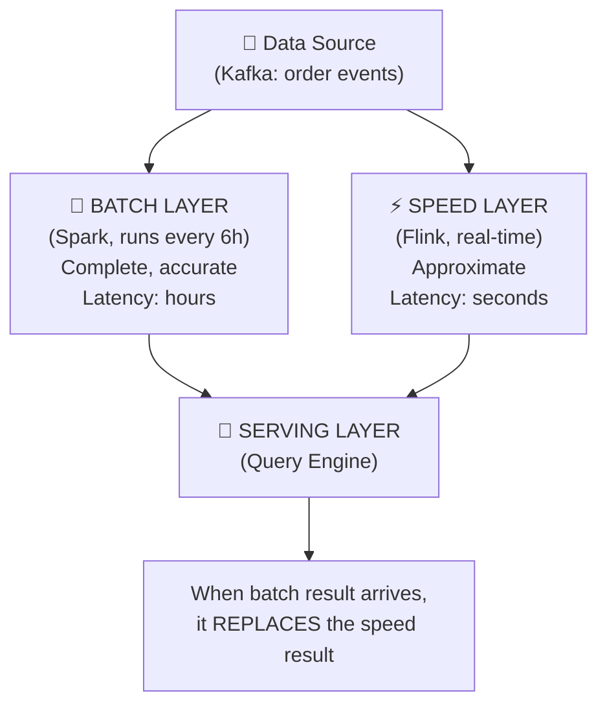
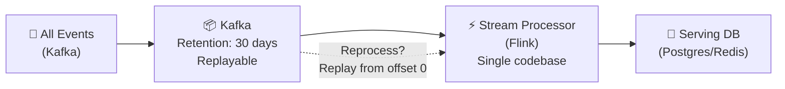
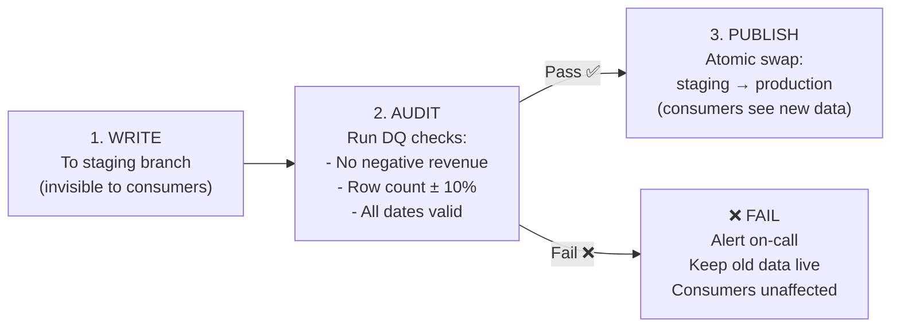
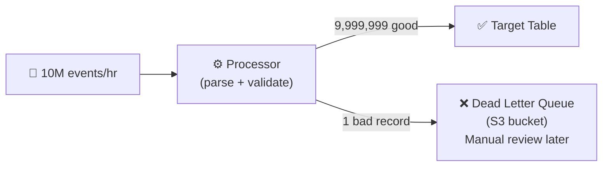

# Data Engineering Design Patterns — Complete Guide

> Every pattern taught through a real scenario, implemented in Python/SQL, with explicit guidance on when to use — and when NOT to use.

(Mỗi pattern được giải thích qua scenario thực tế, có code Python/SQL, và nói rõ khi nào KHÔNG nên dùng)

---

## 📋 Mục Lục

1. [Pipeline Architecture Patterns](#-pipeline-architecture-patterns)
2. [Storage Patterns](#-storage-patterns)
3. [Processing Patterns](#-processing-patterns)
4. [Integration Patterns](#-integration-patterns)
5. [Error Handling Patterns](#-error-handling-patterns)
6. [Pattern Decision Matrix](#-pattern-decision-matrix)

---

## 🔄 Pipeline Architecture Patterns

### Pattern 1: Lambda Architecture

#### Scenario: E-commerce Analytics

You run an e-commerce platform. You need two things simultaneously:
- **Real-time dashboard** showing orders per minute (for the ops team monitoring Black Friday)
- **Accurate daily report** showing total revenue (for the finance team, must be penny-accurate)

The problem: stream processing gives you speed but approximate numbers (late events, out-of-order data). Batch processing gives you accuracy but 6-hour delay.

Lambda Architecture solves this by running **both paths in parallel**:



#### Implementation: Batch Layer (Spark)

```python
# batch_layer.py — runs every 6 hours via Airflow
from pyspark.sql import SparkSession
from pyspark.sql import functions as F

spark = SparkSession.builder.appName("lambda_batch").getOrCreate()

# Read ALL events from the last 24 hours (complete, accurate)
orders = (
    spark.read.format("iceberg")
    .load("catalog.raw.order_events")
    .filter(F.col("event_date") == "2024-11-29")  # Black Friday
)

# Accurate aggregation — handles late events, dedupes, validates
daily_revenue = (
    orders
    .dropDuplicates(["order_id"])  # Remove duplicate events
    .filter(F.col("status") == "completed")
    .groupBy("product_category")
    .agg(
        F.sum("amount").alias("total_revenue"),
        F.countDistinct("order_id").alias("order_count"),
        F.avg("amount").alias("avg_order_value"),
    )
)

# Write to serving layer — this OVERWRITES the speed layer's approximation
daily_revenue.writeTo("catalog.serving.daily_revenue").overwritePartitions()
```

#### Implementation: Speed Layer (Flink-style with Spark Structured Streaming)

```python
# speed_layer.py — runs continuously
from pyspark.sql import SparkSession
from pyspark.sql import functions as F

spark = SparkSession.builder.appName("lambda_speed").getOrCreate()

# Real-time stream from Kafka
order_stream = (
    spark.readStream
    .format("kafka")
    .option("kafka.bootstrap.servers", "broker:9092")
    .option("subscribe", "order-events")
    .load()
    .select(F.from_json(F.col("value").cast("string"), schema).alias("data"))
    .select("data.*")
)

# Approximate aggregation — fast, but may miss late events
realtime_revenue = (
    order_stream
    .withWatermark("event_time", "10 minutes")  # Accept 10 min late
    .groupBy(
        F.window("event_time", "1 minute"),
        "product_category"
    )
    .agg(F.sum("amount").alias("revenue_approx"))
)

# Write to serving layer — will be replaced when batch catches up
(
    realtime_revenue.writeStream
    .outputMode("update")
    .format("iceberg")
    .option("checkpointLocation", "/checkpoints/speed_layer")
    .toTable("catalog.serving.realtime_revenue")
)
```

#### When to Use Lambda

- ✅ You need both real-time monitoring AND accurate historical reports
- ✅ Your business can't wait 6 hours for data (ops teams, fraud detection)
- ✅ You have budget for maintaining two separate codepaths

#### When NOT to Use Lambda

- ❌ **Your team is 1-3 people** — maintaining two codepaths (batch + stream) doubles your work. Use Kappa instead
- ❌ **Near-real-time is good enough** — if 15-minute delay is acceptable, micro-batch solves it simpler
- ❌ **Your data fits in memory** — don't over-architect. Use DuckDB with incremental loads

> 💡 **Ghi chú thực tế:** LinkedIn invented Lambda Architecture (Nathan Marz, 2011). Irony: most companies who adopt it today would be better served by Kappa. Lambda is only justified when you truly need penny-accurate reports AND sub-second updates simultaneously.

---

### Pattern 2: Kappa Architecture

#### Scenario: Fraud Detection at a Fintech

You run a fintech company. Every transaction must be scored for fraud in real-time. There is no "batch job at midnight" — by then the stolen money is gone.

Kappa says: **treat everything as a stream**, even historical data. If you need to reprocess, replay the stream from the beginning.



#### Why it's simpler than Lambda

```
Lambda: 2 codepaths (batch Spark job + streaming Flink job)
        — bug in batch? Fix in 2 places. Test in 2 places.
        
Kappa:  1 codebase (streaming Flink job only)
        — need to reprocess? Replay Kafka from offset 0
        — same code processes both real-time and historical data
```

#### Implementation: Fraud Scoring with Flink (via PyFlink)

```python
# fraud_scorer.py — single codebase for both real-time and reprocessing
from pyflink.datastream import StreamExecutionEnvironment
from pyflink.table import StreamTableEnvironment

env = StreamExecutionEnvironment.get_execution_environment()
t_env = StreamTableEnvironment.create(env)

# Single source: Kafka (replay from earliest for reprocessing)
t_env.execute_sql("""
    CREATE TABLE transactions (
        txn_id STRING,
        user_id STRING,
        amount DECIMAL(10,2),
        merchant_id STRING,
        country STRING,
        event_time TIMESTAMP(3),
        WATERMARK FOR event_time AS event_time - INTERVAL '5' SECOND
    ) WITH (
        'connector' = 'kafka',
        'topic' = 'transactions',
        'properties.bootstrap.servers' = 'broker:9092',
        'scan.startup.mode' = 'earliest-offset',  -- Replay all history
        'format' = 'json'
    )
""")

# Fraud detection: flag transactions > 3x user's average
t_env.execute_sql("""
    INSERT INTO fraud_alerts
    SELECT 
        txn_id,
        user_id,
        amount,
        avg_amount,
        CASE 
            WHEN amount > avg_amount * 3 THEN 'HIGH_RISK'
            WHEN amount > avg_amount * 2 THEN 'MEDIUM_RISK'
            ELSE 'LOW_RISK'
        END AS risk_level,
        event_time
    FROM (
        SELECT 
            *,
            AVG(amount) OVER (
                PARTITION BY user_id 
                ORDER BY event_time 
                RANGE BETWEEN INTERVAL '30' DAY PRECEDING AND CURRENT ROW
            ) AS avg_amount
        FROM transactions
    )
    WHERE amount > avg_amount * 2
""")
```

#### When to Use Kappa

- ✅ Real-time is the primary requirement (fraud, alerting, live dashboards)
- ✅ Your team is small and can't maintain two codepaths
- ✅ Your message broker supports replay (Kafka with sufficient retention)

#### When NOT to Use Kappa

- ❌ **You need complex aggregations over years of data** — replaying 3 years of Kafka to compute annual revenue is insane. Use batch for that
- ❌ **Kafka retention is expensive** — at 100TB/day, keeping 90 days in Kafka costs $$$
- ❌ **Your queries are exploratory** — data scientists doing ad-hoc SQL don't want to write Flink jobs

---

### Pattern 3: Medallion Architecture (Bronze → Silver → Gold)

#### Scenario: Healthcare Data Platform

A hospital system receives data from 15 different sources: EHR systems, lab results, insurance claims, IoT patient monitors. Each source has different formats, quality levels, and update frequencies.

Medallion gives you a systematic way to progressively clean and enrich data through 3 layers:

```mermaid
flowchart LR
    subgraph BRONZE["🥉 BRONZE — Raw Land"]
        B1["Raw JSON as-is"]
        B2["Append-only"]
        B3["No transformations"]
        B4["Full history kept"]
    end
    
    subgraph SILVER["🥈 SILVER — Cleaned"]
        S1["Deduplicated"]
        S2["Schema enforced"]
        S3["NULL handling"]
        S4["Joined across sources"]
    end
    
    subgraph GOLD["🥇 GOLD — Business-Ready"]
        G1["Star schema"]
        G2["Pre-aggregated"]
        G3["Business metrics"]
        G4["SLA-backed"]
    end
    
    BRONZE -->|"Clean + validate"| SILVER
    SILVER -->|"Model + aggregate"| GOLD
```



#### Implementation: Full Medallion Pipeline in PySpark

```python
# === BRONZE LAYER ===
# Rule: NEVER modify incoming data. Store raw, append-only.

def ingest_to_bronze(spark, source_path: str, table_name: str):
    """Ingest raw data without any transformation."""
    raw_df = (
        spark.read.format("json")
        .option("mode", "PERMISSIVE")  # Don't fail on bad records
        .option("columnNameOfCorruptRecord", "_corrupt_record")
        .load(source_path)
    )
    
    # Add metadata columns — ONLY addition allowed in Bronze
    bronze_df = (
        raw_df
        .withColumn("_ingested_at", F.current_timestamp())
        .withColumn("_source_file", F.input_file_name())
        .withColumn("_ingestion_id", F.lit(str(uuid.uuid4())))
    )
    
    bronze_df.writeTo(f"catalog.bronze.{table_name}").append()


# === SILVER LAYER ===
# Rule: Clean, validate, deduplicate. No business logic yet.

def bronze_to_silver_patients(spark):
    """Clean patient data: dedup, type cast, null handling."""
    bronze = spark.read.format("iceberg").load("catalog.bronze.patient_records")
    
    silver = (
        bronze
        # 1. Remove corrupt records
        .filter(F.col("_corrupt_record").isNull())
        
        # 2. Deduplicate: keep latest record per patient
        .withColumn("row_num", F.row_number().over(
            Window.partitionBy("patient_id")
            .orderBy(F.col("_ingested_at").desc())
        ))
        .filter(F.col("row_num") == 1)
        .drop("row_num")
        
        # 3. Type enforcement
        .withColumn("date_of_birth", F.to_date("date_of_birth", "yyyy-MM-dd"))
        .withColumn("weight_kg", F.col("weight_kg").cast("double"))
        
        # 4. NULL handling — explicit defaults, not silent NULLs
        .withColumn("blood_type", F.coalesce(
            F.col("blood_type"), F.lit("UNKNOWN")
        ))
        
        # 5. PII masking for non-privileged queries
        .withColumn("ssn_masked", F.concat(
            F.lit("***-**-"), F.substring("ssn", 8, 4)
        ))
    )
    
    silver.writeTo("catalog.silver.patients").overwritePartitions()


# === GOLD LAYER ===
# Rule: Business logic lives HERE and only here.

def silver_to_gold_patient_risk(spark):
    """Build patient risk scores — this IS business logic."""
    patients = spark.read.format("iceberg").load("catalog.silver.patients")
    lab_results = spark.read.format("iceberg").load("catalog.silver.lab_results")
    visits = spark.read.format("iceberg").load("catalog.silver.visit_history")
    
    # Join across Silver tables + apply business rules
    patient_risk = (
        patients
        .join(lab_results, "patient_id", "left")
        .join(
            visits.groupBy("patient_id").agg(
                F.count("*").alias("visit_count_12m"),
                F.max("visit_date").alias("last_visit_date"),
            ),
            "patient_id", "left"
        )
        .withColumn("risk_score", 
            F.when(F.col("a1c_level") > 9.0, 90)        # Severe diabetes
            .when(F.col("a1c_level") > 7.0, 60)          # Moderate
            .when(F.col("visit_count_12m") == 0, 70)     # No visits = risk
            .when(F.col("bmi") > 35, 50)                 # Obesity
            .otherwise(20)                                 # Low risk
        )
    )
    
    patient_risk.writeTo("catalog.gold.patient_risk_scores").overwritePartitions()
```

#### The Key Rule People Get Wrong

```
WRONG: Business logic in Silver → Gold becomes just a copy
RIGHT: Bronze = raw facts, Silver = clean facts, Gold = business interpretation

Example:
- Bronze: {"temp": "98.6", "unit": "F"}
- Silver: {"temp_celsius": 37.0}           ← unit conversion is cleaning, not business logic
- Gold:   {"fever_flag": false}             ← "fever = > 38°C" IS business logic
```

#### When to Use Medallion

- ✅ Multiple data sources with different quality levels
- ✅ Multiple teams consuming data at different levels of refinement
- ✅ You need data lineage and reproducibility (replay from Bronze)

#### When NOT to Use Medallion

- ❌ **Single source, single consumer** — 3 layers is overkill. Direct ETL is fine
- ❌ **Real-time only use case** — Medallion implies batch materialization. For real-time, use streaming with a single transformation
- ❌ **Your Gold = just Silver with a WHERE clause** — if you're not adding business logic, you don't need a Gold layer

---

### Pattern 4: Event Sourcing

#### Scenario: Fintech Transaction History

Your payment system uses a traditional `balances` table:

```sql
-- Traditional: Current state only
SELECT balance FROM accounts WHERE user_id = 'U001';
-- Result: 500.00
-- Question: HOW did we get to 500? Nobody knows.
```

One day, a customer disputes: "I was charged $200 twice on Tuesday." You query the balances table — it says $500. You have no way to verify what happened Tuesday.

Event Sourcing stores every state change as an immutable event:

```sql
-- Event Sourcing: Complete history
SELECT * FROM account_events WHERE user_id = 'U001' ORDER BY event_time;

-- event_id | event_type      | amount  | balance_after | event_time
-- 1        | ACCOUNT_CREATED | 0.00    | 0.00          | 2024-01-01 10:00
-- 2        | DEPOSIT         | 1000.00 | 1000.00       | 2024-01-01 10:05
-- 3        | PURCHASE        | -200.00 | 800.00        | 2024-01-15 14:30
-- 4        | PURCHASE        | -200.00 | 600.00        | 2024-01-15 14:31  ← DUPLICATE!
-- 5        | REFUND          | +100.00 | 700.00        | 2024-01-16 09:00
-- 6        | PURCHASE        | -200.00 | 500.00        | 2024-01-20 11:00

-- NOW you can see: yes, there were 2 charges of $200 on Jan 15, 1 minute apart.
-- Event #4 was a duplicate. Issue a refund.
```

#### Implementation: Event Sourcing in Python

```python
# event_store.py
from dataclasses import dataclass, field
from datetime import datetime
from typing import List
import json

@dataclass(frozen=True)  # Immutable — events can NEVER be modified
class Event:
    event_id: str
    event_type: str
    aggregate_id: str  # e.g., user_id or order_id
    data: dict
    timestamp: datetime
    version: int

class EventStore:
    """Append-only event store. Events are NEVER updated or deleted."""
    
    def __init__(self, db_connection):
        self.db = db_connection
    
    def append(self, event: Event):
        """Append an event. This is the ONLY write operation."""
        self.db.execute("""
            INSERT INTO events (event_id, event_type, aggregate_id, data, timestamp, version)
            VALUES (%s, %s, %s, %s, %s, %s)
        """, (event.event_id, event.event_type, event.aggregate_id,
              json.dumps(event.data), event.timestamp, event.version))
    
    def get_events(self, aggregate_id: str, since_version: int = 0) -> List[Event]:
        """Replay events from a specific version (for rebuilding state)."""
        rows = self.db.execute("""
            SELECT * FROM events 
            WHERE aggregate_id = %s AND version > %s
            ORDER BY version ASC
        """, (aggregate_id, since_version))
        return [Event(**row) for row in rows]
    
    def rebuild_state(self, aggregate_id: str) -> dict:
        """Replay all events to rebuild current state. This is time travel."""
        events = self.get_events(aggregate_id)
        state = {"balance": 0, "status": "active", "history": []}
        
        for event in events:
            if event.event_type == "DEPOSIT":
                state["balance"] += event.data["amount"]
            elif event.event_type == "PURCHASE":
                state["balance"] -= event.data["amount"]
            elif event.event_type == "ACCOUNT_FROZEN":
                state["status"] = "frozen"
            
            state["history"].append({
                "type": event.event_type,
                "amount": event.data.get("amount"),
                "balance_after": state["balance"],
                "time": event.timestamp.isoformat(),
            })
        
        return state

# Usage:
# state = store.rebuild_state("U001")
# state_at_tuesday = store.rebuild_state("U001", before=tuesday)  # Time travel!
```

#### When to Use Event Sourcing

- ✅ **Audit trail is a legal requirement** (banking, healthcare, insurance)
- ✅ **You need time travel** — "What was the state at Tuesday 2:30 PM?"
- ✅ **Debugging requires replaying history** — reproduce bugs by replaying events

#### When NOT to Use Event Sourcing

- ❌ **Simple CRUD apps** — a blog doesn't need an event store. Use a normal database
- ❌ **High-volume, low-value events** — clickstream data (billions/day) should NOT be event-sourced. Just append to Kafka/S3
- ❌ **Your team doesn't understand CQRS** — Event Sourcing almost always requires CQRS (separate read/write models). If your team can't explain CQRS, they'll build an unmaintainable mess

---

## 💾 Storage Patterns

### Pattern 1: Hot/Warm/Cold Tiering

#### Scenario: SaaS Analytics Platform

Your SaaS product stores user activity logs. Storage costs are killing your budget:

```
Current state:
- ALL data in Snowflake: 50TB
- Monthly cost: $15,000
  
Breakdown:
- Last 7 days (1TB): queried 500 times/day  → MUST be fast
- Last 90 days (10TB): queried 20 times/day  → fast-ish is fine
- Older than 90 days (39TB): queried 1 time/month → can be slow
```

After applying Hot/Warm/Cold tiering:

```
After tiering:
- HOT  (Redis + Snowflake): 1TB   → $2,000/mo  ← 500 queries/day
- WARM (Snowflake):         10TB  → $3,000/mo  ← 20 queries/day  
- COLD (S3 + Iceberg):      39TB → $900/mo    ← 1 query/month
                                    ─────────
                            Total:  $5,900/mo  (was $15,000!)
```

#### Implementation: Automated Tiering with Lifecycle Policies

```python
# tiering_manager.py
import boto3
from datetime import datetime, timedelta

class DataTieringManager:
    """Automatically moves data between tiers based on age and access patterns."""
    
    def __init__(self, spark, s3_client):
        self.spark = spark
        self.s3 = s3_client
    
    def tier_down(self, table: str, hot_days: int = 7, warm_days: int = 90):
        """Move data from HOT → WARM → COLD based on partition date."""
        
        today = datetime.now().date()
        warm_cutoff = today - timedelta(days=hot_days)
        cold_cutoff = today - timedelta(days=warm_days)
        
        # HOT → WARM: Remove from Snowflake cache, keep in Snowflake storage
        self.spark.sql(f"""
            ALTER TABLE {table} 
            SET TBLPROPERTIES ('auto-cache.exclude' = 
                'date < {warm_cutoff.isoformat()}')
        """)
        
        # WARM → COLD: Move to S3 Iceberg, drop from Snowflake
        cold_data = self.spark.sql(f"""
            SELECT * FROM {table}
            WHERE date < '{cold_cutoff.isoformat()}'
        """)
        
        cold_data.writeTo(f"iceberg.cold.{table}").append()
        
        self.spark.sql(f"""
            DELETE FROM {table}
            WHERE date < '{cold_cutoff.isoformat()}'
        """)
        
        print(f"Tiered down: {cold_data.count()} rows moved to COLD")
    
    def query_across_tiers(self, sql: str) -> "DataFrame":
        """Transparently query across all tiers using Iceberg federated views."""
        # Union HOT + WARM + COLD behind a single view
        return self.spark.sql(f"""
            WITH all_tiers AS (
                SELECT *, 'hot' as _tier FROM snowflake.hot.orders
                UNION ALL
                SELECT *, 'warm' as _tier FROM snowflake.warm.orders
                UNION ALL
                SELECT *, 'cold' as _tier FROM iceberg.cold.orders
            )
            {sql.replace('orders', 'all_tiers')}
        """)
```

#### When NOT to Use Tiering

- ❌ **Total data < 1TB** — the complexity isn't worth the savings
- ❌ **Access patterns are uniform** — if everything is queried equally, there are no tiers
- ❌ **Compliance requires instant access to all data** — some regulations (GDPR) require quick retrieval of any record

---

### Pattern 2: Write-Audit-Publish (WAP)

#### Scenario: Financial Reporting Pipeline

Your pipeline writes daily revenue data to a table that the CFO's dashboard reads from. One day, a bug in your extraction logic produces negative revenue numbers. The dashboard shows "$-2M revenue" before anyone notices. The CFO calls an emergency board meeting. Embarrassing.

WAP prevents this by inserting a **quality gate between write and publish**:



#### Implementation with Apache Iceberg Branching

```python
# wap_pipeline.py — Write-Audit-Publish with Iceberg branches
from pyspark.sql import SparkSession
from pyspark.sql import functions as F
from datetime import datetime

class WAPPipeline:
    def __init__(self, spark: SparkSession, table: str):
        self.spark = spark
        self.table = table
        self.audit_branch = f"audit_{datetime.now().strftime('%Y%m%d_%H%M%S')}"
    
    # Step 1: WRITE — to an isolated branch, invisible to consumers
    def write(self, df):
        # Create an Iceberg branch (like a git branch for data)
        self.spark.sql(f"""
            ALTER TABLE {self.table}
            CREATE BRANCH {self.audit_branch}
        """)
        
        # Write to the branch — main table is UNTOUCHED
        df.writeTo(f"{self.table}.branch_{self.audit_branch}").append()
        print(f"Written {df.count()} rows to branch '{self.audit_branch}'")
    
    # Step 2: AUDIT — run quality checks on the branch
    def audit(self) -> bool:
        branch_data = self.spark.read.format("iceberg") \
            .option("branch", self.audit_branch) \
            .load(self.table)
        
        checks = {
            "no_negative_revenue": branch_data.filter(
                F.col("revenue") < 0
            ).count() == 0,
            
            "row_count_reasonable": 1000 < branch_data.count() < 1_000_000,
            
            "no_future_dates": branch_data.filter(
                F.col("order_date") > F.current_date()
            ).count() == 0,
            
            "no_null_keys": branch_data.filter(
                F.col("order_id").isNull()
            ).count() == 0,
        }
        
        for check_name, passed in checks.items():
            status = "✅ PASS" if passed else "❌ FAIL"
            print(f"  {status}: {check_name}")
        
        return all(checks.values())
    
    # Step 3: PUBLISH — atomic swap, or abort
    def publish(self):
        if self.audit():
            # Fast-forward main to the audited branch (atomic operation)
            self.spark.sql(f"""
                ALTER TABLE {self.table}
                EXECUTE fast_forward('{self.audit_branch}', 'main')
            """)
            print(f"✅ Published! Consumers now see new data.")
        else:
            # Drop the branch — consumers never saw bad data
            self.spark.sql(f"""
                ALTER TABLE {self.table}
                DROP BRANCH {self.audit_branch}
            """)
            print(f"❌ Audit FAILED. Branch dropped. Consumers see old (good) data.")
            raise DataQualityError("Pipeline audit failed — bad data NOT published")

# Usage:
pipeline = WAPPipeline(spark, "catalog.gold.daily_revenue")
pipeline.write(new_revenue_df)
pipeline.publish()  # Automatically audits before publishing
```

#### When to Use WAP

- ✅ **Consumer-facing data** — dashboards, APIs, reports that humans read
- ✅ **Financial data** — wrong numbers have legal consequences
- ✅ **You have Iceberg/Delta** — both support branching natively

#### When NOT to Use WAP

- ❌ **Internal staging tables** — nobody reads Bronze; no need to audit it
- ❌ **Real-time streams** — WAP adds latency; not suitable for sub-second pipelines
- ❌ **Your table format doesn't support branching** — without Iceberg/Delta/Hudi, WAP requires double storage (staging + production tables)

---

## ⚙️ Processing Patterns

### Pattern 1: Idempotent Processing

#### Scenario: The Pipeline That Ran Twice

It's 3 AM. Your Airflow DAG processing daily orders fails halfway through. Airflow retries it automatically. Now you have **duplicate rows** in your fact table because the pipeline INSERT'd rows on the first run, then INSERT'd them AGAIN on the retry.

Finance reports double revenue. Your boss is not happy.

Idempotent processing means: **run it once or run it 100 times, same result.**

#### The 4 Idempotency Strategies

```python
# === Strategy 1: MERGE / UPSERT ===
# Best for: dimension tables, slowly changing data

MERGE_SQL = """
MERGE INTO orders_fact AS target
USING staging_orders AS source
ON target.order_id = source.order_id
WHEN MATCHED THEN UPDATE SET
    status = source.status,
    amount = source.amount,
    updated_at = source.updated_at
WHEN NOT MATCHED THEN INSERT (order_id, status, amount, created_at, updated_at)
    VALUES (source.order_id, source.status, source.amount, 
            source.created_at, source.updated_at)
"""


# === Strategy 2: DELETE + INSERT (by partition) ===
# Best for: fact tables with date partitions

DELETE_INSERT_SQL = """
-- Step 1: Delete the entire partition
DELETE FROM orders_fact 
WHERE order_date = '{{ ds }}';

-- Step 2: Re-insert from source
INSERT INTO orders_fact
SELECT * FROM staging_orders 
WHERE order_date = '{{ ds }}';

-- Run this 1x or 100x → same result.
-- The key: DELETE entire partition first, so no duplicates possible.
"""


# === Strategy 3: INSERT OVERWRITE (partition swap) ===
# Best for: Spark/Hive/Iceberg — most efficient

def idempotent_spark_write(spark, df, table: str, partition_col: str):
    """Overwrite the entire partition — atomic and idempotent."""
    (
        df.writeTo(table)
        .partitionedBy(partition_col)
        .overwritePartitions()  # Atomic: old data replaced in one operation
    )


# === Strategy 4: Deduplication on read ===
# Best for: when you CAN'T control the write path

DEDUP_SQL = """
WITH ranked AS (
    SELECT *,
        ROW_NUMBER() OVER (
            PARTITION BY order_id 
            ORDER BY _ingested_at DESC  -- Keep latest version
        ) AS rn
    FROM orders_raw
)
SELECT * FROM ranked WHERE rn = 1
"""
```

#### Common Idempotency Mistakes

```python
# ❌ WRONG: Appending without dedup — NOT idempotent
df.writeTo("catalog.orders").append()
# Run twice → DOUBLE the data!

# ❌ WRONG: DELETE without WHERE — destroys all data
spark.sql("DELETE FROM orders")  # Deletes EVERYTHING, not just today
spark.sql("INSERT INTO orders SELECT * FROM staging")  # Only today's data back
# You just lost all historical data!

# ✅ RIGHT: DELETE with partition predicate
spark.sql("DELETE FROM orders WHERE order_date = '2024-01-15'")
spark.sql("INSERT INTO orders SELECT * FROM staging WHERE order_date = '2024-01-15'")
```

---

### Pattern 2: Backfill Pattern

#### Scenario: The Metric That Was Wrong for 3 Months

You discover that your revenue calculation has been excluding tax for 3 months. Every daily aggregate since October is wrong. You need to reprocess 90 days of data.

Naive approach: reprocess 90 days in one giant Spark job → **OOM crash** (too much data).

Smart approach: **incremental backfill with checkpointing.**

#### Implementation: Resumable Backfill Framework

```python
# backfill.py — Production-grade backfill with progress tracking
from datetime import date, timedelta
from typing import Callable
import logging

logger = logging.getLogger(__name__)

class BackfillManager:
    """Backfill historical data day-by-day with resume capability."""
    
    def __init__(self, spark, state_table: str = "catalog.meta.backfill_state"):
        self.spark = spark
        self.state_table = state_table
    
    def run_backfill(
        self,
        backfill_id: str,
        start_date: date,
        end_date: date,
        process_fn: Callable,
        parallel_days: int = 4,
    ):
        """
        Run a backfill from start_date to end_date.
        
        - Processes one day at a time
        - Tracks progress in state_table
        - Resumes from last successful day if interrupted
        - Validates each day before moving to next
        """
        # Resume from last checkpoint
        last_completed = self._get_last_completed(backfill_id)
        if last_completed:
            start_date = last_completed + timedelta(days=1)
            logger.info(f"Resuming backfill from {start_date} (last completed: {last_completed})")
        
        current = start_date
        total_days = (end_date - start_date).days
        completed = 0
        
        while current <= end_date:
            try:
                logger.info(f"[{completed}/{total_days}] Processing {current}...")
                
                # Process one day using the provided function
                process_fn(self.spark, current)
                
                # Mark as completed
                self._save_checkpoint(backfill_id, current, "COMPLETED")
                completed += 1
                
                logger.info(f"  ✅ {current} done ({completed}/{total_days})")
                
            except Exception as e:
                self._save_checkpoint(backfill_id, current, f"FAILED: {e}")
                logger.error(f"  ❌ {current} failed: {e}")
                logger.error(f"  Backfill paused. Re-run to resume from {current}")
                raise  # Stop and let operator investigate
            
            current += timedelta(days=1)
        
        logger.info(f"🎉 Backfill complete! Processed {completed} days.")
    
    def _get_last_completed(self, backfill_id: str):
        result = self.spark.sql(f"""
            SELECT MAX(process_date) as last_date 
            FROM {self.state_table}
            WHERE backfill_id = '{backfill_id}' AND status = 'COMPLETED'
        """).collect()
        return result[0]["last_date"] if result[0]["last_date"] else None
    
    def _save_checkpoint(self, backfill_id: str, process_date: date, status: str):
        self.spark.sql(f"""
            MERGE INTO {self.state_table} t
            USING (SELECT '{backfill_id}' as backfill_id, 
                          '{process_date}' as process_date,
                          '{status}' as status,
                          current_timestamp() as updated_at) s
            ON t.backfill_id = s.backfill_id AND t.process_date = s.process_date
            WHEN MATCHED THEN UPDATE SET status = s.status, updated_at = s.updated_at
            WHEN NOT MATCHED THEN INSERT *
        """)


# Usage:
def fix_revenue_calculation(spark, day: date):
    """The actual fix: include tax in revenue."""
    spark.sql(f"""
        INSERT OVERWRITE catalog.gold.daily_revenue
        PARTITION (order_date = '{day}')
        SELECT 
            product_id,
            SUM(amount + tax) as revenue,  -- FIX: was SUM(amount), now includes tax
            COUNT(*) as order_count
        FROM catalog.silver.orders
        WHERE order_date = '{day}'
        GROUP BY product_id
    """)

backfill = BackfillManager(spark)
backfill.run_backfill(
    backfill_id="fix_revenue_tax_2024",
    start_date=date(2024, 10, 1),
    end_date=date(2024, 12, 31),
    process_fn=fix_revenue_calculation,
)
```

---

## 🔌 Integration Patterns

### Pattern 1: Change Data Capture (CDC)

#### Scenario: Syncing MySQL → Data Lake Without Full Loads

Your e-commerce app runs on MySQL. Every night, you do a `SELECT * FROM orders` and dump 50 million rows to S3. This takes 4 hours and puts heavy load on the production database.

CDC captures only the **changes** (inserts, updates, deletes) from the MySQL binlog and streams them to Kafka:

```
Full Load: 50M rows × every night = 50M rows transferred
CDC:        ~100K changes/day      = 100K rows transferred
            
Speedup: 500x less data. No impact on production DB.
```

#### Implementation: Debezium CDC → Kafka → Iceberg

```python
# cdc_sink.py — Consume CDC events from Debezium and merge into Iceberg
from pyspark.sql import SparkSession, functions as F

def process_cdc_events(spark: SparkSession):
    """Read Debezium CDC events from Kafka and apply to Iceberg table."""
    
    # Read CDC events from Kafka (Debezium format)
    cdc_stream = (
        spark.readStream
        .format("kafka")
        .option("kafka.bootstrap.servers", "broker:9092")
        .option("subscribe", "dbserver1.inventory.orders")
        .option("startingOffsets", "latest")
        .load()
    )
    
    # Parse Debezium envelope
    parsed = (
        cdc_stream
        .select(F.from_json(
            F.col("value").cast("string"), 
            debezium_schema
        ).alias("cdc"))
        .select(
            F.col("cdc.op").alias("operation"),        # c=create, u=update, d=delete
            F.col("cdc.after.order_id").alias("order_id"),
            F.col("cdc.after.customer_id").alias("customer_id"),
            F.col("cdc.after.amount").alias("amount"),
            F.col("cdc.after.status").alias("status"),
            F.col("cdc.ts_ms").alias("event_timestamp"),
        )
    )
    
    # Apply CDC to Iceberg using foreachBatch
    def merge_to_iceberg(batch_df, batch_id):
        batch_df.createOrReplaceTempView("cdc_batch")
        
        spark.sql("""
            MERGE INTO catalog.silver.orders target
            USING cdc_batch source
            ON target.order_id = source.order_id
            
            WHEN MATCHED AND source.operation = 'd' THEN DELETE
            
            WHEN MATCHED AND source.operation = 'u' THEN UPDATE SET
                customer_id = source.customer_id,
                amount = source.amount,
                status = source.status,
                _cdc_updated_at = source.event_timestamp
            
            WHEN NOT MATCHED AND source.operation = 'c' THEN INSERT (
                order_id, customer_id, amount, status, _cdc_updated_at
            ) VALUES (
                source.order_id, source.customer_id, source.amount, 
                source.status, source.event_timestamp
            )
        """)
    
    (
        parsed.writeStream
        .foreachBatch(merge_to_iceberg)
        .option("checkpointLocation", "/checkpoints/cdc_orders")
        .trigger(processingTime="30 seconds")
        .start()
    )
```

---

## ⚠️ Error Handling Patterns

### Pattern 1: Dead Letter Queue (DLQ)

#### Scenario: 1 Bad Record Kills Your Entire Pipeline

Your pipeline processes 10 million customer events per hour. One event has a malformed JSON. Your pipeline crashes. 9,999,999 good events are stuck behind 1 bad one.

DLQ solves this: route bad records to a separate queue, process good records normally:



#### Implementation

```python
# dlq_processor.py
import json
import logging
from datetime import datetime
from typing import Tuple, List
import boto3

logger = logging.getLogger(__name__)

class DLQProcessor:
    """Process records with Dead Letter Queue for failures."""
    
    def __init__(self, dlq_bucket: str = "my-pipeline-dlq"):
        self.dlq_bucket = dlq_bucket
        self.s3 = boto3.client("s3")
        self.stats = {"processed": 0, "failed": 0}
    
    def process_batch(self, records: List[dict]) -> List[dict]:
        """Process records, routing failures to DLQ. Returns only good records."""
        good_records = []
        
        for record in records:
            try:
                validated = self._validate_and_transform(record)
                good_records.append(validated)
                self.stats["processed"] += 1
            except Exception as e:
                self._send_to_dlq(record, error=str(e))
                self.stats["failed"] += 1
        
        fail_rate = self.stats["failed"] / max(1, self.stats["processed"] + self.stats["failed"])
        
        # Circuit breaker: if > 5% records fail, something is systemically wrong
        if fail_rate > 0.05 and self.stats["failed"] > 100:
            raise SystemicFailure(
                f"DLQ rate {fail_rate:.1%} exceeds 5% threshold. "
                f"({self.stats['failed']} failures out of {self.stats['processed'] + self.stats['failed']}). "
                f"Stopping pipeline — this is not a bad-record problem, it's a bug."
            )
        
        logger.info(f"Processed: {self.stats['processed']}, DLQ'd: {self.stats['failed']}")
        return good_records
    
    def _validate_and_transform(self, record: dict) -> dict:
        """Validate a single record. Raises exception on failure."""
        assert "user_id" in record, "Missing user_id"
        assert isinstance(record.get("amount"), (int, float)), f"Bad amount: {record.get('amount')}"
        assert record["amount"] >= 0, f"Negative amount: {record['amount']}"
        return record
    
    def _send_to_dlq(self, record: dict, error: str):
        """Write failed record to S3 DLQ with error context."""
        dlq_entry = {
            "original_record": record,
            "error": error,
            "timestamp": datetime.utcnow().isoformat(),
            "pipeline": "order_processing",
        }
        
        key = f"dlq/{datetime.utcnow().strftime('%Y/%m/%d/%H')}/{record.get('event_id', 'unknown')}.json"
        self.s3.put_object(
            Bucket=self.dlq_bucket,
            Key=key,
            Body=json.dumps(dlq_entry),
        )
```

> 💡 **Critical design choice:** The 5% circuit breaker threshold. Without it, your DLQ silently swallows thousands of records and you don't notice until someone asks "where did 30% of our data go?" The threshold forces the pipeline to STOP and alert you when failures are systemic, not isolated.

---

### Pattern 2: Circuit Breaker

#### Scenario: Stripe API Outage at 2 AM

Your pipeline runs hourly and calls the Stripe API to fetch payment data. On Monday at 2 AM, Stripe has an outage. Your pipeline:

```
Without Circuit Breaker:
  02:00 — Attempt 1: Stripe timeout (30s) → retry
  02:00 — Attempt 2: Stripe timeout (30s) → retry
  02:01 — Attempt 3: Stripe timeout (30s) → retry
  ... repeats for 4 hours, 480 timeout errors
  06:00 — Stripe recovers. But your pipeline is still stuck retrying 02:00's batch.
  06:00 — Finance team: "WHERE IS MY DATA?!"
  
Total impact: 4+ hours pipeline delay. 480 wasted API calls. Angry stakeholders.
```

```
With Circuit Breaker:
  02:00 — Attempt 1: Stripe timeout → failure_count = 1
  02:00 — Attempt 2: Stripe timeout → failure_count = 2
  02:01 — Attempt 3: Stripe timeout → failure_count = 3
  02:01 — Attempt 4: Stripe timeout → failure_count = 4
  02:01 — Attempt 5: Stripe timeout → failure_count = 5 → CIRCUIT OPENS
  02:01 — Alert sent: "Stripe API unreachable. Circuit OPEN. Will retry in 5min."
  02:06 — Half-open: try 1 request → still failing → OPEN again, retry in 10min
  02:16 — Half-open: try 1 request → SUCCESS! → Circuit CLOSED
  02:16 — Resume normal processing. Process 02:00-02:16 backlog.
  
Total impact: 16 minutes delay. 7 API calls. Alert sent immediately.
```

#### Implementation

```python
# circuit_breaker.py
import time
import logging
from enum import Enum
from typing import Callable, Any

logger = logging.getLogger(__name__)

class CircuitState(Enum):
    CLOSED = "closed"        # Normal operation
    OPEN = "open"            # Blocking all calls
    HALF_OPEN = "half_open"  # Testing with one call

class CircuitBreaker:
    """
    Prevents cascading failures by stopping calls to failing services.
    
    State machine:
        CLOSED --[5 failures]--> OPEN --[timeout]--> HALF_OPEN
        HALF_OPEN --[1 success]--> CLOSED
        HALF_OPEN --[1 failure]--> OPEN
    """
    
    def __init__(
        self,
        failure_threshold: int = 5,
        recovery_timeout: int = 60,
        half_open_max_calls: int = 1,
        on_open: Callable = None,       # Alert callback
    ):
        self.failure_threshold = failure_threshold
        self.recovery_timeout = recovery_timeout
        self.half_open_max_calls = half_open_max_calls
        self.on_open = on_open
        
        self.state = CircuitState.CLOSED
        self.failure_count = 0
        self.last_failure_time = 0
        self.half_open_calls = 0
    
    def call(self, func: Callable, *args, **kwargs) -> Any:
        """Execute func through the circuit breaker."""
        
        if self.state == CircuitState.OPEN:
            if time.time() - self.last_failure_time >= self.recovery_timeout:
                logger.info("Circuit HALF_OPEN: testing with one call...")
                self.state = CircuitState.HALF_OPEN
                self.half_open_calls = 0
            else:
                wait_remaining = self.recovery_timeout - (time.time() - self.last_failure_time)
                raise CircuitOpenError(
                    f"Circuit is OPEN. Retry in {wait_remaining:.0f}s. "
                    f"Last failure: {self.failure_count} consecutive failures."
                )
        
        if self.state == CircuitState.HALF_OPEN:
            if self.half_open_calls >= self.half_open_max_calls:
                raise CircuitOpenError("Half-open call limit reached")
            self.half_open_calls += 1
        
        try:
            result = func(*args, **kwargs)
            self._on_success()
            return result
        except Exception as e:
            self._on_failure(e)
            raise
    
    def _on_success(self):
        if self.state == CircuitState.HALF_OPEN:
            logger.info("✅ Circuit CLOSED: service recovered!")
            self.state = CircuitState.CLOSED
        self.failure_count = 0
    
    def _on_failure(self, error: Exception):
        self.failure_count += 1
        self.last_failure_time = time.time()
        
        if self.state == CircuitState.HALF_OPEN:
            logger.warning(f"Circuit back to OPEN: half-open test failed ({error})")
            self.state = CircuitState.OPEN
        elif self.failure_count >= self.failure_threshold:
            logger.error(f"Circuit OPEN: {self.failure_count} consecutive failures")
            self.state = CircuitState.OPEN
            if self.on_open:
                self.on_open(self.failure_count, error)  # Send alert


class CircuitOpenError(Exception):
    pass


# === Usage in a real pipeline ===

import requests

def alert_oncall(failure_count, error):
    """Send PagerDuty alert when circuit opens."""
    requests.post("https://events.pagerduty.com/v2/enqueue", json={
        "routing_key": "YOUR_PD_KEY",
        "event_action": "trigger",
        "payload": {
            "summary": f"Stripe API circuit OPEN after {failure_count} failures: {error}",
            "severity": "critical",
            "source": "payment_pipeline",
        }
    })

# Create circuit breaker for Stripe API
stripe_cb = CircuitBreaker(
    failure_threshold=5, 
    recovery_timeout=300,  # 5 min before retrying
    on_open=alert_oncall,
)

def fetch_payments(date: str) -> list:
    """Fetch payments from Stripe, protected by circuit breaker."""
    def _call_stripe():
        response = requests.get(
            f"https://api.stripe.com/v1/charges",
            params={"created[gte]": date},
            headers={"Authorization": f"Bearer {STRIPE_KEY}"},
            timeout=30,
        )
        response.raise_for_status()
        return response.json()["data"]
    
    return stripe_cb.call(_call_stripe)
```

---

### Pattern 3: Retry with Exponential Backoff + Jitter

#### Why Not Just Retry Immediately?

```
Scenario: 100 Airflow tasks all call the same API at 02:00.
API is briefly overloaded.

Without backoff:
  02:00:01 — 100 tasks retry simultaneously → API more overloaded
  02:00:02 — 100 tasks retry simultaneously → API crashes completely
  02:00:03 — 100 tasks retry simultaneously → API still dead
  Result: "Thundering herd" — retries CAUSE the outage to last longer

With exponential backoff + jitter:
  02:00:01 — 100 tasks wait random(1-2s) each
  02:00:02 — 50 tasks retry, spread over 2 seconds → API recovers  
  02:00:04 — 30 tasks retry, spread over 4 seconds → more recover
  02:00:08 — 10 tasks retry → all succeed
  Result: Gradual recovery. API survives.
```

#### Implementation

```python
# retry.py — Production retry with exponential backoff + jitter
import time
import random
import logging
from functools import wraps
from typing import Tuple, Type

logger = logging.getLogger(__name__)

def retry_with_backoff(
    max_attempts: int = 5,
    base_delay: float = 1.0,
    max_delay: float = 60.0,
    jitter: bool = True,
    retryable_exceptions: Tuple[Type[Exception], ...] = (Exception,),
):
    """
    Decorator for retry with exponential backoff.
    
    Delay formula: min(max_delay, base_delay * 2^attempt) + random_jitter
    
    Example with defaults:
      Attempt 1: wait ~1s   (1 * 2^0 + jitter)
      Attempt 2: wait ~2s   (1 * 2^1 + jitter)
      Attempt 3: wait ~4s   (1 * 2^2 + jitter)
      Attempt 4: wait ~8s   (1 * 2^3 + jitter)
      Attempt 5: FAIL (max attempts reached)
    """
    def decorator(func):
        @wraps(func)
        def wrapper(*args, **kwargs):
            last_exception = None
            
            for attempt in range(max_attempts):
                try:
                    return func(*args, **kwargs)
                except retryable_exceptions as e:
                    last_exception = e
                    
                    if attempt == max_attempts - 1:
                        logger.error(f"All {max_attempts} attempts failed for {func.__name__}")
                        raise
                    
                    # Exponential backoff
                    delay = min(max_delay, base_delay * (2 ** attempt))
                    
                    # Add jitter to prevent thundering herd
                    if jitter:
                        delay = delay * (0.5 + random.random())  # 50%-150% of delay
                    
                    logger.warning(
                        f"{func.__name__} attempt {attempt + 1}/{max_attempts} failed: {e}. "
                        f"Retrying in {delay:.1f}s..."
                    )
                    time.sleep(delay)
                except Exception as e:
                    # Non-retryable exception — fail immediately
                    logger.error(f"{func.__name__} hit non-retryable error: {e}")
                    raise
            
            raise last_exception
        return wrapper
    return decorator


# === Usage ===

@retry_with_backoff(
    max_attempts=5,
    base_delay=2.0,
    max_delay=60.0,
    retryable_exceptions=(requests.ConnectionError, requests.Timeout),
)
def call_stripe_api(date: str):
    """Fetch payments — retries on connection/timeout errors only."""
    response = requests.get(
        f"https://api.stripe.com/v1/charges",
        params={"created[gte]": date},
        timeout=30,
    )
    response.raise_for_status()  # 4xx/5xx raises HTTPError — NOT retried (it's a bug, not transient)
    return response.json()
```

> 💡 **Key insight:** Never retry 4xx errors (400, 401, 403). Those are bugs in YOUR code. Only retry 5xx and connection errors — those are transient failures on the other side.

---

## 🎯 Pattern Decision Matrix

When you face a design decision, use this matrix:

| Situation | Pattern | Why |
|-----------|---------|-----|
| Need real-time + accurate historical | Lambda | Two paths optimize for different needs |
| Small team, real-time primary | Kappa | One codebase, less maintenance |
| Multiple sources, progressive cleaning | Medallion | Bronze→Silver→Gold layers |
| Legal audit trail required | Event Sourcing | Immutable event history |
| Storage costs too high | Hot/Warm/Cold Tiering | Match cost to access pattern |
| Can't afford bad data in production | Write-Audit-Publish (WAP) | Quality gate before consumers |
| Pipeline retries cause duplicates | Idempotent Processing | Same result regardless of run count |
| Need to fix 90 days of wrong data | Backfill with Checkpointing | Day-by-day, resumable |
| Real-time database sync to data lake | CDC (Debezium) | Binlog capture, minimal DB impact |
| 1 bad record shouldn't crash pipeline | Dead Letter Queue | Route failures, process good data |
| External API unreliable | Circuit Breaker | Stop calling, alert, auto-recover |
| Transient failures (network, timeout) | Retry with Backoff + Jitter | Gradual recovery, prevent thundering herd |

---

## 🔗 Related Files

- [Architectural Thinking](02_Architectural_Thinking.md) — how to combine patterns into a complete architecture
- [Problem Solving](03_Problem_Solving.md) — debugging when patterns don't work as expected
- [05_Distributed_Systems](../fundamentals/05_Distributed_Systems.md) — CAP theorem, consistency models underlying these patterns
- [07_Batch_vs_Streaming](../fundamentals/07_Batch_vs_Streaming.md) — deep dive into Lambda/Kappa implementations
- [08_Data_Integration](../fundamentals/08_Data_Integration_APIs.md) — CDC and API integration patterns in detail

---

*Updated: February 2026*
