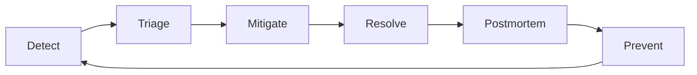

# 🔥 Day-2 Operations: Run It Like You Built It

> Build mất 1 tháng. Run và maintain mất cả năm. Day-2 mới là game thật.

---

## 📋 Mục Lục

1. [Day-1 vs Day-2](#day-1-vs-day-2)
2. [On-Call cho Data Engineer](#on-call-cho-data-engineer)
3. [Runbook Writing](#runbook-writing)
4. [Incident Management](#incident-management)
5. [SLA/SLO cho Data Pipelines](#slaslo-cho-data-pipelines)
6. [Capacity Planning](#capacity-planning)
7. [Operational Excellence](#operational-excellence)

---

## Day-1 vs Day-2

```
Day-1 (Build):               Day-2 (Run):
"It works!"                   "It works at 3 AM on Sunday"
"Tests pass"                  "Alert fires, who responds?"
"Deploy to prod"              "Rollback when broken"
"Data flows"                  "Data is CORRECT and ON TIME"
"Pipeline handles 1M rows"    "Pipeline handles 100M rows next quarter"
"Dashboard looks good"        "Dashboard shows RIGHT numbers EVERY DAY"
```

### Tại Sao Day-2 Quan Trọng Hơn?

| | Day-1 | Day-2 |
|--|-------|-------|
| **Thời gian** | 1-3 tháng | Vĩnh viễn |
| **Visibility** | High (mới, exciting) | Low (boring, maintenance) |
| **Impact khi fail** | "Chưa xong" | "Revenue report sai, CEO angry" |
| **Career impact** | Build portfolio | Build TRUST |
| **Kỹ năng cần** | Coding, design | Communication, process, judgment |

> **Harsh truth:** Manager không nhớ bạn build pipeline tốt. Manager nhớ pipeline KHÔNG BAO GIỜ down.

---

## On-Call cho Data Engineer

### On-Call Rotation Setup

```
Typical rotation:
├── Primary on-call (1 week)
│   └── Respond within 15 min (SEV1/2)
│       Respond within 1 hour (SEV3)
├── Secondary backup
│   └── Escalation nếu primary unavailable
└── Rotate weekly (fair distribution)

On-call tools:
├── PagerDuty / Opsgenie → Alert routing
├── Slack #data-incidents → Communication
├── Runbook wiki → Step-by-step fixes
└── Dashboard → System health overview
```

### On-Call Best Practices

```python
on_call_rules = {
    "golden_rules": [
        "Acknowledge alert within 5 minutes",
        "Don't fix root cause at 3AM — stabilize first",
        "Document everything you do (incident log)",
        "Escalate early if stuck (15 min rule)",
        "Never silence an alert without investigation",
    ],
    
    "before_shift": [
        "Check recent deploys and known issues",
        "Verify your laptop/VPN/access works",
        "Know escalation contacts (phone numbers)",
        "Review open incidents from previous shift",
    ],
    
    "after_shift": [
        "Handoff to next person (verbal + written)",
        "File tickets for anything not resolved",
        "Note patterns (same alert 3x = needs fix)",
        "Suggest improvements to reduce alert noise",
    ],
    
    "self_care": [
        "Compensatory time off after heavy on-call",
        "Don't check alerts when not on-call",
        "Automate repetitive fixes → Reduce future burden",
    ],
}
```

### Alert Design

```python
# ❌ BAD alerts: Too noisy, no context
# "Pipeline failed" → Which pipeline? What error? Who cares?

# ✅ GOOD alerts: Actionable, contextual
class AlertTemplate:
    def create_alert(self, pipeline, error, impact):
        return {
            "title": f"🔴 {pipeline} FAILED — {error.category}",
            "severity": self.assess_severity(pipeline, error),
            "body": f"""
**What happened:** {pipeline} failed at {error.step}
**Error:** {error.message}
**Since:** {error.first_occurrence} ({error.duration} ago)
**Impact:** {impact.affected_dashboards} dashboards, 
            {impact.affected_teams} teams waiting
**Last success:** {pipeline.last_success}
**Runbook:** {pipeline.runbook_url}
**Recent changes:** {pipeline.recent_deploys}

**Quick fix options:**
1. Retry: `airflow dags trigger {pipeline.dag_id}`
2. Skip: Mark success and investigate tomorrow
3. Rollback: `git revert {pipeline.last_deploy_sha}`
            """,
        }
```

### Giảm Alert Fatigue

```
Problem: 50 alerts/day → Ignore all → Miss real issue

Solution:
1. CATEGORIZE alerts:
   ├── Page (wake up): Data loss, pipeline down >1 hr
   ├── Ticket (next day): Warning, degraded performance
   └── Log (review weekly): Info, expected failures

2. DEDUPLICATE: Same alert within 1 hour → Group

3. AUTO-RESOLVE: Retry 3 times → If success, auto-close

4. REVIEW monthly: Remove alerts nobody acts on

Target: <5 pages/week per person
If more → System needs fixing, not alert threshold
```

---

## Runbook Writing

### Tại Sao Cần Runbook?

```
Scenario: Pipeline breaks at 2 AM
Without runbook: 45 min investigate + 30 min fix = 75 min
With runbook: 5 min read + 10 min execute = 15 min

Runbook = Insurance for your on-call rotation
```

### Runbook Template

```markdown
# Runbook: [Pipeline Name]

## Overview
- **Owner:** @team-data
- **Schedule:** Daily 6:00 AM UTC
- **SLA:** Must complete by 8:00 AM UTC
- **Downstream:** Finance dashboard, CFO daily report

## Architecture
[Simple diagram showing data flow]
Source API → Airflow → dbt → Snowflake → Looker

## Common Failures

### Failure 1: Source API timeout
**Symptoms:** Task "extract" fails with ConnectionTimeout
**Likely cause:** Source API is slow or down
**Fix:**
1. Check source API status: `curl -v https://api.source.com/health`
2. If API is down → Wait and retry: `airflow tasks run dag_id extract 2024-01-01`
3. If API is slow → Increase timeout in config: `EXTRACT_TIMEOUT=120`
4. If still failing → Contact source team: #team-source in Slack

### Failure 2: dbt model fails
**Symptoms:** Task "transform" fails with SQL error
**Likely cause:** Schema change in source data
**Fix:**
1. Check dbt logs: `airflow tasks logs dag_id transform 2024-01-01`
2. Identify failing model from error message
3. If schema change → Update model SQL → PR → Deploy
4. If data quality → Check source: `SELECT * FROM raw.table LIMIT 10`

### Failure 3: Out of memory
**Symptoms:** OOM killer terminates process
**Fix:**
1. Check data volume: `SELECT COUNT(*) FROM source WHERE date = today`
2. If volume spike → Investigate source (duplicate data?)
3. If gradual growth → Increase memory: update k8s resource limits
4. Long-term → Implement incremental processing

## Contacts
- Data team: #team-data (Slack), @oncall-data (PagerDuty)
- Source API team: #team-backend, API lead: Minh (ext. 1234)
- Infrastructure: #platform-eng
```

### Runbook Rules

```
1. Write for someone who has NEVER seen this pipeline
2. Include EXACT commands — not "check logs" but "kubectl logs -f pod-name"
3. Include expected output for each step
4. Update after every incident (if runbook was wrong/incomplete)
5. Test runbook quarterly (have someone else follow it)
6. Link from alert directly to relevant runbook section
```

---

## Incident Management

### Incident Lifecycle



### Postmortem Template (Blameless)

```markdown
# Postmortem: Revenue Dashboard Showed Wrong Numbers

**Date:** 2026-02-10
**Duration:** 3 hours (06:00 - 09:00 UTC)
**Severity:** SEV2
**Author:** @your-name
**Reviewers:** @team-lead, @pm

## Summary
Revenue dashboard showed $0 for today because ETL pipeline
silently dropped records with new currency "USDT" (crypto).

## Impact
- CFO reported wrong numbers in board meeting
- Finance team manually reconciled for 2 hours
- Trust in data team decreased

## Timeline (UTC)
- 05:00 — Pipeline ran successfully (no errors)
- 06:15 — Finance pinged #data-help: "Revenue is $0 today?"
- 06:20 — On-call acknowledged, started investigation
- 06:45 — Found: new currency "USDT" caused CAST failure
- 07:00 — Hotfix: Added USDT to currency mapping
- 07:30 — Backfill completed, dashboard corrected
- 09:00 — Finance confirmed numbers correct

## Root Cause
Payment team added cryptocurrency support (USDT, USDC)
without notifying data team. Our pipeline had hardcoded
currency list: ['USD', 'EUR', 'VND', ...] and silently
dropped unknown currencies.

## What Went Well
- Finance detected quickly (< 1 hour)
- Fix was straightforward once identified

## What Went Wrong
- No cross-team communication about schema changes
- Pipeline silently dropped records (should have FAILED)
- No data quality check on expected revenue range

## Action Items
| Action | Owner | Priority | Due |
|--------|-------|----------|-----|
| Add DQ check: daily revenue within 50-200% of 7-day avg | @de-1 | P0 | 2/12 |
| Change pipeline to FAIL on unknown currency | @de-2 | P0 | 2/12 |
| Setup data contract with payment team | @de-lead | P1 | 2/17 |
| Add schema change notification process | @pm | P2 | 2/28 |

## Lessons Learned
Never silently DROP data. Always FAIL LOUD on unexpected input.
```

---

## SLA/SLO cho Data Pipelines

### SLA vs SLO vs SLI

```
SLI (Service Level Indicator) = Metric đo
  → Pipeline completion time, data freshness, error rate

SLO (Service Level Objective) = Target nội bộ  
  → "Pipeline completes within 2 hours, 99% of the time"
  
SLA (Service Level Agreement) = Contract với stakeholder
  → "Dashboard updated by 8 AM, if miss → escalation"
```

### Common SLOs cho Data Pipelines

```python
data_slos = {
    "freshness": {
        "tier_1_critical": "Data refreshed within 1 hour",
        "tier_2_important": "Data refreshed within 4 hours", 
        "tier_3_normal": "Data refreshed within 24 hours",
        "example": "Revenue dashboard = Tier 1, Ad-hoc reports = Tier 3",
    },
    
    "completeness": {
        "target": "99.9% of expected records present",
        "measure": "row_count_today / expected_based_on_7day_avg",
        "alert_if": "< 95%",
    },
    
    "accuracy": {
        "target": "99.99% of values match source",
        "measure": "Regular reconciliation with source",
        "alert_if": "Any mismatch in financial data",
    },
    
    "availability": {
        "target": "99.5% uptime (allows ~1.8 days downtime/year)",
        "measure": "Pipeline success rate over 30 days",
        "alert_if": "3 consecutive failures",
    },
}
```

### SLO Dashboard

```sql
-- Track pipeline SLOs
CREATE TABLE pipeline_slo_tracking (
    pipeline_name VARCHAR(100),
    run_date DATE,
    started_at TIMESTAMP,
    completed_at TIMESTAMP,
    duration_minutes INT,
    slo_target_minutes INT,
    slo_met BOOLEAN,
    row_count INT,
    expected_row_count INT,
    error_count INT
);

-- Monthly SLO report
SELECT 
    pipeline_name,
    COUNT(*) AS total_runs,
    SUM(CASE WHEN slo_met THEN 1 ELSE 0 END) AS met_count,
    ROUND(100.0 * SUM(CASE WHEN slo_met THEN 1 ELSE 0 END) / COUNT(*), 2) AS slo_percentage,
    AVG(duration_minutes) AS avg_duration,
    PERCENTILE_CONT(0.95) WITHIN GROUP (ORDER BY duration_minutes) AS p95_duration
FROM pipeline_slo_tracking
WHERE run_date >= CURRENT_DATE - INTERVAL '30 days'
GROUP BY pipeline_name
ORDER BY slo_percentage ASC;  -- Worst performers first
```

---

## Capacity Planning

### Khi Nào Scale?

```
Monitoring thresholds:

WATCH (70%):
  CPU/Memory/Disk at 70% → Start planning
  Plan capacity in next sprint

WARN (80%):
  At 80% → Active planning required
  Need capacity in 2-4 weeks

CRITICAL (90%):
  At 90% → Emergency expansion
  Risk of failure imminent
```

### Growth Prediction

```python
import numpy as np

def predict_capacity_needs(
    current_usage_gb: float,
    daily_growth_gb: float, 
    max_capacity_gb: float
) -> dict:
    """Predict when we'll hit capacity limits"""
    remaining = max_capacity_gb - current_usage_gb
    days_until_full = remaining / daily_growth_gb
    
    return {
        "current_usage_pct": current_usage_gb / max_capacity_gb * 100,
        "days_until_full": int(days_until_full),
        "date_at_capacity": datetime.now() + timedelta(days=days_until_full),
        "recommendation": (
            "CRITICAL: Scale NOW" if days_until_full < 14
            else "PLAN: Scale within month" if days_until_full < 60
            else "MONITOR: Revisit next quarter"
        ),
        "growth_rate_monthly_pct": (daily_growth_gb * 30 / current_usage_gb) * 100,
    }

# Example
print(predict_capacity_needs(
    current_usage_gb=700,
    daily_growth_gb=5,
    max_capacity_gb=1000
))
# → days_until_full=60, recommendation="PLAN: Scale within month"
```

### Cost Per Pipeline

```sql
-- Track cost per pipeline to find optimization opportunities
SELECT 
    pipeline_name,
    AVG(compute_cost_usd) AS avg_daily_cost,
    AVG(storage_cost_usd) AS avg_storage_cost,
    AVG(compute_cost_usd + storage_cost_usd) AS total_avg_cost,
    COUNT(DISTINCT downstream_consumer) AS num_consumers,
    -- Cost per consumer (lower = more efficient)
    ROUND(AVG(compute_cost_usd + storage_cost_usd) / 
          NULLIF(COUNT(DISTINCT downstream_consumer), 0), 2) AS cost_per_consumer
FROM pipeline_costs
WHERE date >= CURRENT_DATE - INTERVAL '30 days'
GROUP BY pipeline_name
ORDER BY total_avg_cost DESC
LIMIT 20;
```

---

## Operational Excellence

### Toil Elimination

```
Toil = Manual, repetitive, automatable work
 
Common DE toil:
1. Manually restarting failed pipelines → Auto-retry
2. Manually backfilling data → Self-healing pipeline
3. Manually granting access → Self-serve catalog
4. Manually checking data quality → Automated DQ
5. Manually creating reports → Self-serve BI

Goal: <30% toil. If >50%, stop building new and automate.
```

### Operational Maturity Model

```
Level 1 - REACTIVE:
  "Pipeline broke, someone noticed, we fixed it"
  - No monitoring
  - Fix when users complain
  
Level 2 - PROACTIVE:
  "Alert fired, on-call responded, fixed in SLA"
  - Basic monitoring
  - On-call rotation
  - Runbooks exist
  
Level 3 - AUTOMATED:
  "Pipeline self-healed, on-call just verified"
  - Auto-retry, circuit breakers
  - Self-healing pipelines
  - Automated backfill
  
Level 4 - PREDICTIVE:
  "We scaled up BEFORE peak, prevented outage"
  - Capacity planning
  - Anomaly detection
  - Chaos engineering for data

Most teams are Level 1-2. Target Level 3.
Level 4 = Staff+ territory.
```

### Weekly Ops Review

```markdown
## Weekly Data Ops Review

### Metrics
- Pipeline success rate: 98.5% (target: 99%)
- P50 latency: 12 min (target: 15 min) ✅
- P99 latency: 45 min (target: 60 min) ✅
- Incidents: 2 SEV3, 0 SEV1/2
- On-call pages: 7 (target: <5) ⚠️

### Top Issues This Week
1. Pipeline X failed 3 times (same root cause) → Ticket created
2. Storage growing 20% faster than expected → Capacity review

### Action Items
- [ ] Fix recurring Pipeline X failure
- [ ] Review storage growth with infrastructure team
- [ ] Update runbook for Pipeline Y (incomplete)

### Wins
- Auto-retry reduced manual interventions by 40%
```

---

## Checklist

- [ ] Có on-call rotation và escalation path
- [ ] Mỗi pipeline có runbook
- [ ] Có postmortem process
- [ ] Có SLO/SLA defined và tracked
- [ ] Có capacity planning process
- [ ] Alert noise < 5 pages/week/person
- [ ] Toil < 30% of time
- [ ] Weekly ops review

---

## Liên Kết

- [12_Monitoring_Observability](../fundamentals/12_Monitoring_Observability.md) - Setup monitoring
- [21_Debugging_Troubleshooting](../fundamentals/21_Debugging_Troubleshooting.md) - Debug production issues
- [03_Problem_Solving](03_Problem_Solving.md) - Systematic problem solving
- [04_Career_Growth](04_Career_Growth.md) - Operations skills for career

---

*"You build it, you run it." — Werner Vogels, CTO Amazon*
