# Distributed Systems Foundational Papers

## Những Paper Nền Tảng Cho Hệ Thống Phân Tán và Big Data

---

## 📋 Mục Lục

1. [Google File System (GFS)](#1-google-file-system-gfs---2003)
2. [MapReduce](#2-mapreduce---2004)
3. [Bigtable](#3-bigtable---2006)
4. [Dynamo](#4-dynamo---2007)
5. [Chubby](#5-chubby---2006)
6. [Spanner](#6-spanner---2012)
7. [Dremel](#7-dremel---2010)
8. [Megastore](#8-megastore---2011)
9. [F1](#9-f1---2013)
10. [Borg](#10-borg---2015)
11. [Tổng Kết & Timeline](#11-tổng-kết--timeline)

---

## 1. GOOGLE FILE SYSTEM (GFS) - 2003

### Paper Info
- **Title:** The Google File System
- **Authors:** Sanjay Ghemawat, Howard Gobioff, Shun-Tak Leung
- **Conference:** SOSP 2003
- **Link:** https://research.google/pubs/pub51/
- **PDF:** https://static.googleusercontent.com/media/research.google.com/en//archive/gfs-sosp2003.pdf

### Key Contributions
- Distributed file system for large-scale data processing
- Master-chunkserver architecture
- 64MB chunk size design decision
- Relaxed consistency model
- Append-optimized operations

### Core Architecture

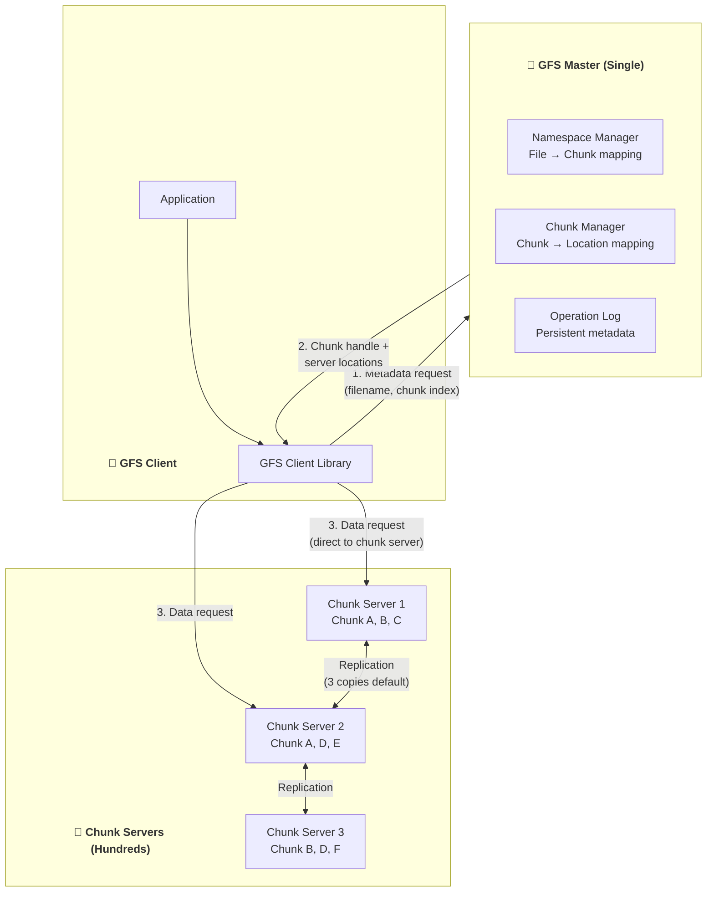
```mermaid
graph TB
    subgraph Client[" "]
        Client_title["📱 GFS Client"]
        style Client_title fill:none,stroke:none,color:#333,font-weight:bold
        App[Application]
        Lib[GFS Client Library]
    end

    subgraph Master[" "]
        Master_title["🧠 GFS Master (Single)"]
        style Master_title fill:none,stroke:none,color:#333,font-weight:bold
        NS[Namespace Manager<br/>File → Chunk mapping]
        CM[Chunk Manager<br/>Chunk → Location mapping]
        OP[Operation Log<br/>Persistent metadata]
    end

    subgraph ChunkServers[" "]
        ChunkServers_title["💾 Chunk Servers (Hundreds)"]
        style ChunkServers_title fill:none,stroke:none,color:#333,font-weight:bold
        CS1[Chunk Server 1<br/>Chunk A, B, C]
        CS2[Chunk Server 2<br/>Chunk A, D, E]
        CS3[Chunk Server 3<br/>Chunk B, D, F]
    end

    App --> Lib
    Lib -->|"1. Metadata request<br/>(filename, chunk index)"| Master
    Master -->|"2. Chunk handle +<br/>server locations"| Lib
    Lib -->|"3. Data request<br/>(direct to chunk server)"| CS1
    Lib -->|"3. Data request"| CS2

    CS1 <-->|"Replication<br/>(3 copies default)"| CS2
    CS2 <-->|"Replication"| CS3
```

### Design Decisions Explained

| Decision | Rationale |
|----------|-----------|
| **64 MB chunk size** | Reduces metadata on master; files are large (multi-GB) |
| **Single master** | Simplicity; master only handles metadata, not data |
| **Append-optimized** | >95% of mutations are appends (log files, web crawl) |
| **Relaxed consistency** | Application-level checksums; defined vs. undefined regions |
| **Component failure is norm** | Built with 1000s of commodity machines; expect failures |

### Read vs Write Flow

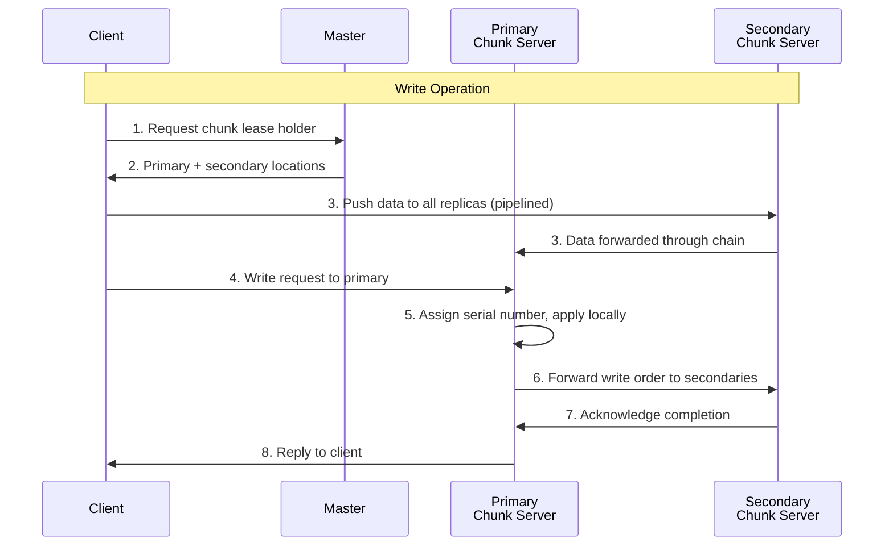
```mermaid
sequenceDiagram
    participant C as Client
    participant M as Master
    participant P as Primary<br/>Chunk Server
    participant S as Secondary<br/>Chunk Server

    Note over C,S: Write Operation
    C->>M: 1. Request chunk lease holder
    M->>C: 2. Primary + secondary locations
    C->>S: 3. Push data to all replicas (pipelined)
    S->>P: 3. Data forwarded through chain
    C->>P: 4. Write request to primary
    P->>P: 5. Assign serial number, apply locally
    P->>S: 6. Forward write order to secondaries
    S->>P: 7. Acknowledge completion
    P->>C: 8. Reply to client
```

### Consistency Model

| Mutation Type | Consistent? | Defined? |
|---------------|------------|----------|
| Write (serial) | ✅ Yes | ✅ Yes |
| Write (concurrent) | ✅ Yes | ❌ No (mixed) |
| Record append | ❌ Possibly not | ✅ "Defined interspersed" |
| Failed mutation | ❌ No | ❌ No |

**Application handles inconsistency:**
- Checksums to detect corruption
- Unique record IDs for deduplication
- Self-validating records

### Impact on Modern Tools
- **HDFS (Hadoop)** — Direct implementation of GFS concepts
- **Cloud Object Storage** — S3, GCS, ADLS follow similar patterns
- **Data Lake architecture** — Large file, append-only patterns
- **Colossus** — Google's successor to GFS (2010+)

---

## 2. MAPREDUCE - 2004

### Paper Info
- **Title:** MapReduce: Simplified Data Processing on Large Clusters
- **Authors:** Jeffrey Dean, Sanjay Ghemawat
- **Conference:** OSDI 2004
- **Link:** https://research.google/pubs/pub62/
- **PDF:** https://static.googleusercontent.com/media/research.google.com/en//archive/mapreduce-osdi04.pdf

### Key Contributions
- Programming model for distributed processing
- Automatic parallelization
- Fault tolerance through re-execution
- Data locality optimization

### Execution Model

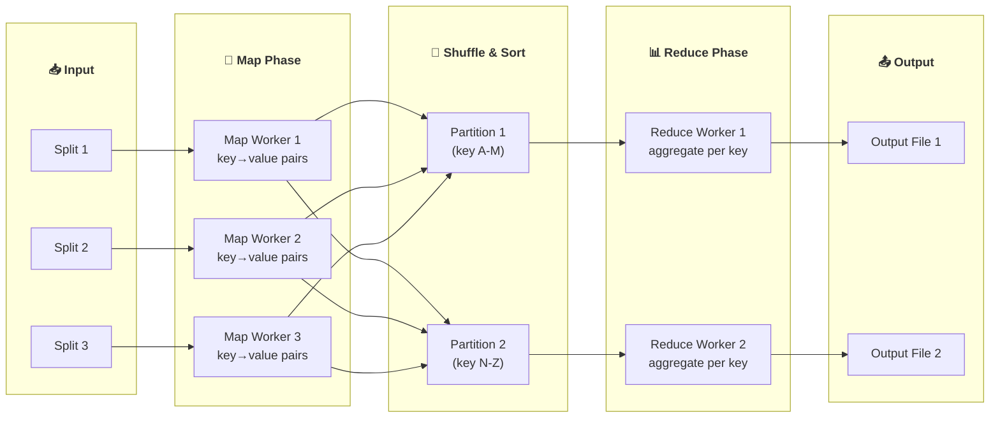
```mermaid
graph LR
    subgraph Input[" "]
        Input_title["📥 Input"]
        style Input_title fill:none,stroke:none,color:#333,font-weight:bold
        S1[Split 1]
        S2[Split 2]
        S3[Split 3]
    end

    subgraph Map[" "]
        Map_title["🔄 Map Phase"]
        style Map_title fill:none,stroke:none,color:#333,font-weight:bold
        M1[Map Worker 1<br/>key→value pairs]
        M2[Map Worker 2<br/>key→value pairs]
        M3[Map Worker 3<br/>key→value pairs]
    end

    subgraph Shuffle[" "]
        Shuffle_title["🔀 Shuffle & Sort"]
        style Shuffle_title fill:none,stroke:none,color:#333,font-weight:bold
        P1["Partition 1<br/>(key A-M)"]
        P2["Partition 2<br/>(key N-Z)"]
    end

    subgraph Reduce[" "]
        Reduce_title["📊 Reduce Phase"]
        style Reduce_title fill:none,stroke:none,color:#333,font-weight:bold
        R1[Reduce Worker 1<br/>aggregate per key]
        R2[Reduce Worker 2<br/>aggregate per key]
    end

    subgraph Output[" "]
        Output_title["📤 Output"]
        style Output_title fill:none,stroke:none,color:#333,font-weight:bold
        O1[Output File 1]
        O2[Output File 2]
    end

    S1 --> M1
    S2 --> M2
    S3 --> M3
    M1 --> P1
    M1 --> P2
    M2 --> P1
    M2 --> P2
    M3 --> P1
    M3 --> P2
    P1 --> R1
    P2 --> R2
    R1 --> O1
    R2 --> O2
```

### Word Count Example

```python
# MAP function
def map(key, value):
    # key: document name, value: document contents
    for word in value.split():
        emit(word, 1)

# REDUCE function
def reduce(key, values):
    # key: word, values: list of counts
    emit(key, sum(values))

# Input: "hello world hello"
# Map output:    ("hello", 1), ("world", 1), ("hello", 1)
# Shuffle:       "hello" → [1, 1],  "world" → [1]
# Reduce output: ("hello", 2), ("world", 1)
```

### Fault Tolerance

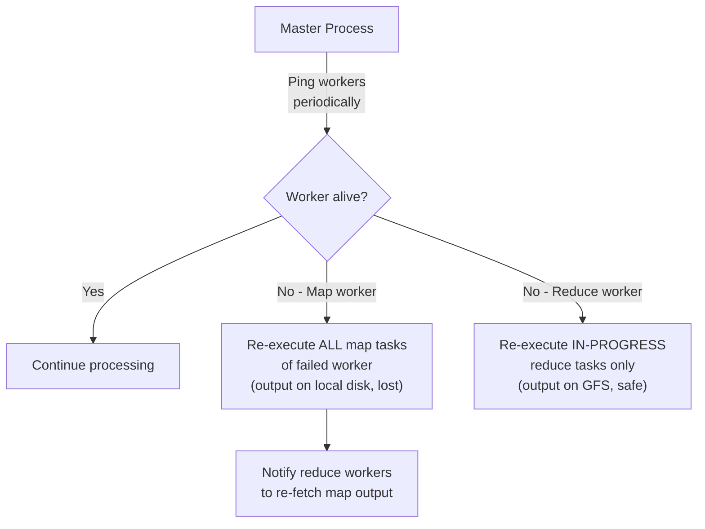
```mermaid
graph TD
    Master[Master Process] -->|"Ping workers<br/>periodically"| Check{Worker alive?}
    
    Check -->|Yes| Continue[Continue processing]
    Check -->|No - Map worker| ReMap["Re-execute ALL map tasks<br/>of failed worker<br/>(output on local disk, lost)"]
    Check -->|No - Reduce worker| ReReduce["Re-execute IN-PROGRESS<br/>reduce tasks only<br/>(output on GFS, safe)"]
    
    ReMap --> Notify["Notify reduce workers<br/>to re-fetch map output"]
```

**Key insight:** Map output is stored on local disk → lost if worker dies. Reduce output is on GFS → survives worker failure.

### Optimizations in the Paper
- **Combiner function** — Local reduce before shuffle (reduces network I/O)
- **Backup tasks** — Run duplicate of slow tasks ("stragglers")
- **Data locality** — Schedule map tasks near input data
- **Partitioning function** — Custom hash for reduce key distribution
- **Ordering guarantees** — Within each partition, keys are sorted

### Impact on Modern Tools
- **Apache Hadoop MapReduce** — Open-source implementation
- **Apache Spark** — Extended model (DAG, in-memory, iterative)
- **Apache Flink** — Stream-first, batch as special case
- **All batch processing** — map() and reduce() are universal concepts

---

## 3. BIGTABLE - 2006

### Paper Info
- **Title:** Bigtable: A Distributed Storage System for Structured Data
- **Authors:** Fay Chang, Jeffrey Dean, Sanjay Ghemawat, et al.
- **Conference:** OSDI 2006
- **Link:** https://research.google/pubs/pub27898/
- **PDF:** https://static.googleusercontent.com/media/research.google.com/en//archive/bigtable-osdi06.pdf

### Key Contributions
- Wide-column store model
- Row key, column family, timestamp design
- SSTable and memtable architecture
- Tablet-based sharding

### Data Model

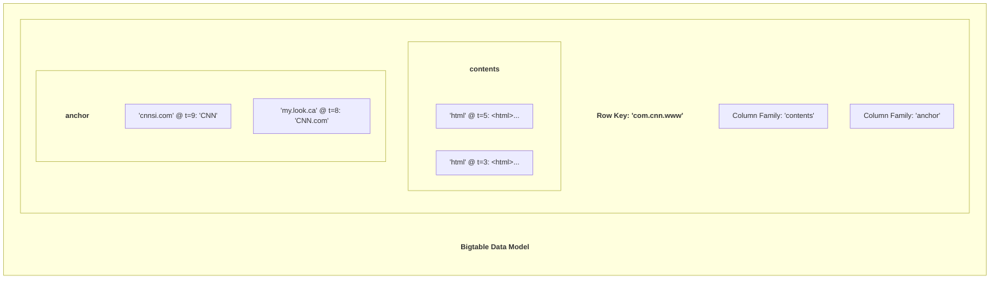
```mermaid
graph TB
    subgraph DataModel[" "]
        DataModel_title["Bigtable Data Model"]
        style DataModel_title fill:none,stroke:none,color:#333,font-weight:bold
        subgraph Row1[" "]
            Row1_title["Row Key: 'com.cnn.www'"]
            style Row1_title fill:none,stroke:none,color:#333,font-weight:bold
            CF1["Column Family: 'contents'"]
            CF2["Column Family: 'anchor'"]
            
            subgraph CF1Detail[" "]
                CF1Detail_title["contents"]
                style CF1Detail_title fill:none,stroke:none,color:#333,font-weight:bold
                C1["'html' @ t=5: &lt;html&gt;..."]
                C2["'html' @ t=3: &lt;html&gt;..."]
            end
            
            subgraph CF2Detail[" "]
                CF2Detail_title["anchor"]
                style CF2Detail_title fill:none,stroke:none,color:#333,font-weight:bold
                C3["'cnnsi.com' @ t=9: 'CNN'"]
                C4["'my.look.ca' @ t=8: 'CNN.com'"]
            end
        end
    end
```

**Data model = (row key, column family:qualifier, timestamp) → value**

- **Row key** — Sorted lexicographically, enables range scans
- **Column family** — Group of columns, unit of access control
- **Column qualifier** — Individual column within family (dynamic)
- **Timestamp** — Multiple versions per cell, auto garbage collected

### Architecture

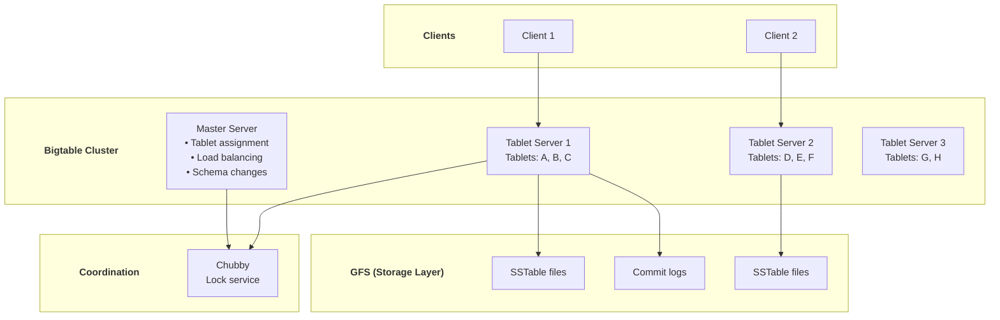
```mermaid
graph TB
    subgraph Clients[" "]
        Clients_title["Clients"]
        style Clients_title fill:none,stroke:none,color:#333,font-weight:bold
        C1[Client 1]
        C2[Client 2]
    end

    subgraph Bigtable[" "]
        Bigtable_title["Bigtable Cluster"]
        style Bigtable_title fill:none,stroke:none,color:#333,font-weight:bold
        Master["Master Server<br/>• Tablet assignment<br/>• Load balancing<br/>• Schema changes"]
        
        TS1["Tablet Server 1<br/>Tablets: A, B, C"]
        TS2["Tablet Server 2<br/>Tablets: D, E, F"]
        TS3["Tablet Server 3<br/>Tablets: G, H"]
    end

    subgraph Storage[" "]
        Storage_title["GFS (Storage Layer)"]
        style Storage_title fill:none,stroke:none,color:#333,font-weight:bold
        SS1[SSTable files]
        SS2[SSTable files]
        Log1[Commit logs]
    end

    subgraph Coord[" "]
        Coord_title["Coordination"]
        style Coord_title fill:none,stroke:none,color:#333,font-weight:bold
        Chubby["Chubby<br/>Lock service"]
    end

    C1 --> TS1
    C2 --> TS2
    Master --> Chubby
    TS1 --> Chubby
    TS1 --> SS1
    TS2 --> SS2
    TS1 --> Log1
```

### Read/Write Path

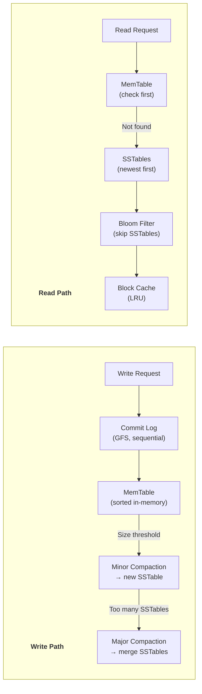
```mermaid
graph LR
    subgraph Write[" "]
        Write_title["Write Path"]
        style Write_title fill:none,stroke:none,color:#333,font-weight:bold
        W1["Write Request"] --> W2["Commit Log<br/>(GFS, sequential)"]
        W2 --> W3["MemTable<br/>(sorted in-memory)"]
        W3 -->|"Size threshold"| W4["Minor Compaction<br/>→ new SSTable"]
        W4 -->|"Too many SSTables"| W5["Major Compaction<br/>→ merge SSTables"]
    end

    subgraph Read[" "]
        Read_title["Read Path"]
        style Read_title fill:none,stroke:none,color:#333,font-weight:bold
        R1["Read Request"] --> R2["MemTable<br/>(check first)"]
        R2 -->|"Not found"| R3["SSTables<br/>(newest first)"]
        R3 --> R4["Bloom Filter<br/>(skip SSTables)"]
        R4 --> R5["Block Cache<br/>(LRU)"]
    end
```

### Tablet Splitting

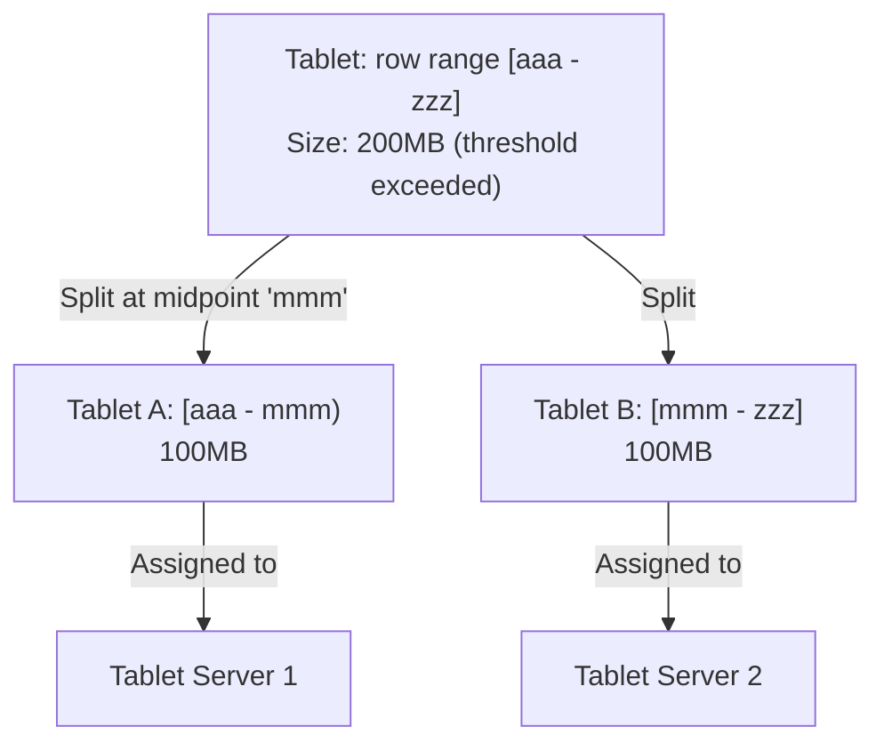
```mermaid
graph TB
    Before["Tablet: row range [aaa - zzz]<br/>Size: 200MB (threshold exceeded)"]
    Before -->|"Split at midpoint 'mmm'"| After1["Tablet A: [aaa - mmm)<br/>100MB"]
    Before -->|"Split"| After2["Tablet B: [mmm - zzz]<br/>100MB"]
    
    After1 -->|"Assigned to"| TS1[Tablet Server 1]
    After2 -->|"Assigned to"| TS2[Tablet Server 2]
```

### Performance Optimizations
- **Bloom filters** — Skip SSTables that definitely don't contain key
- **Compression** — Per-SSTable block compression (BMDiff, Zippy)
- **Caching** — Scan cache (key-value) + block cache (SSTable blocks)
- **Commit log** — Single log per tablet server (not per tablet)
- **Locality groups** — Co-locate related column families on disk

### Impact on Modern Tools
- **Apache HBase** — Direct open-source clone of Bigtable
- **Apache Cassandra** — Influenced by Bigtable + Dynamo
- **Google Cloud Bigtable** — Managed Bigtable service
- **LSM-tree databases** — RocksDB, LevelDB, ScyllaDB

---

## 4. DYNAMO - 2007

### Paper Info
- **Title:** Dynamo: Amazon's Highly Available Key-value Store
- **Authors:** Giuseppe DeCandia, Deniz Hastorun, Madan Jampani, et al.
- **Conference:** SOSP 2007
- **Link:** https://www.amazon.science/publications/dynamo-amazons-highly-available-key-value-store
- **PDF:** https://www.allthingsdistributed.com/files/amazon-dynamo-sosp2007.pdf

### Key Contributions
- Eventually consistent storage
- Consistent hashing with virtual nodes
- Vector clocks for conflict resolution
- Sloppy quorum and hinted handoff
- Anti-entropy with Merkle trees

### Consistent Hashing

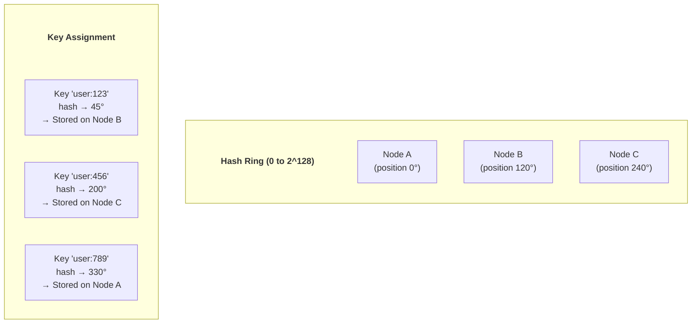
```mermaid
graph TB
    subgraph Ring[" "]
        Ring_title["Hash Ring (0 to 2^128)"]
        style Ring_title fill:none,stroke:none,color:#333,font-weight:bold
        direction TB
        NA["Node A<br/>(position 0°)"]
        NB["Node B<br/>(position 120°)"]
        NC["Node C<br/>(position 240°)"]
    end
    
    subgraph Keys[" "]
        Keys_title["Key Assignment"]
        style Keys_title fill:none,stroke:none,color:#333,font-weight:bold
        K1["Key 'user:123'<br/>hash → 45°<br/>→ Stored on Node B"]
        K2["Key 'user:456'<br/>hash → 200°<br/>→ Stored on Node C"]
        K3["Key 'user:789'<br/>hash → 330°<br/>→ Stored on Node A"]
    end
```

**Virtual nodes:** Each physical node gets multiple positions on ring → better distribution.

### Replication & Quorum

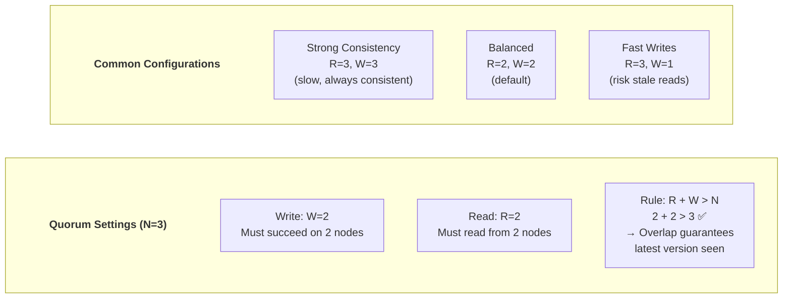
```mermaid
graph LR
    subgraph Quorum[" "]
        Quorum_title["Quorum Settings (N=3)"]
        style Quorum_title fill:none,stroke:none,color:#333,font-weight:bold
        Write["Write: W=2<br/>Must succeed on 2 nodes"]
        Read["Read: R=2<br/>Must read from 2 nodes"]
        Rule["Rule: R + W > N<br/>2 + 2 > 3 ✅<br/>→ Overlap guarantees<br/>latest version seen"]
    end

    subgraph Configs[" "]
        Configs_title["Common Configurations"]
        style Configs_title fill:none,stroke:none,color:#333,font-weight:bold
        Strong["Strong Consistency<br/>R=3, W=3<br/>(slow, always consistent)"]
        Balanced["Balanced<br/>R=2, W=2<br/>(default)"]
        Fast["Fast Writes<br/>R=3, W=1<br/>(risk stale reads)"]
    end
```

### Vector Clocks & Conflict Resolution

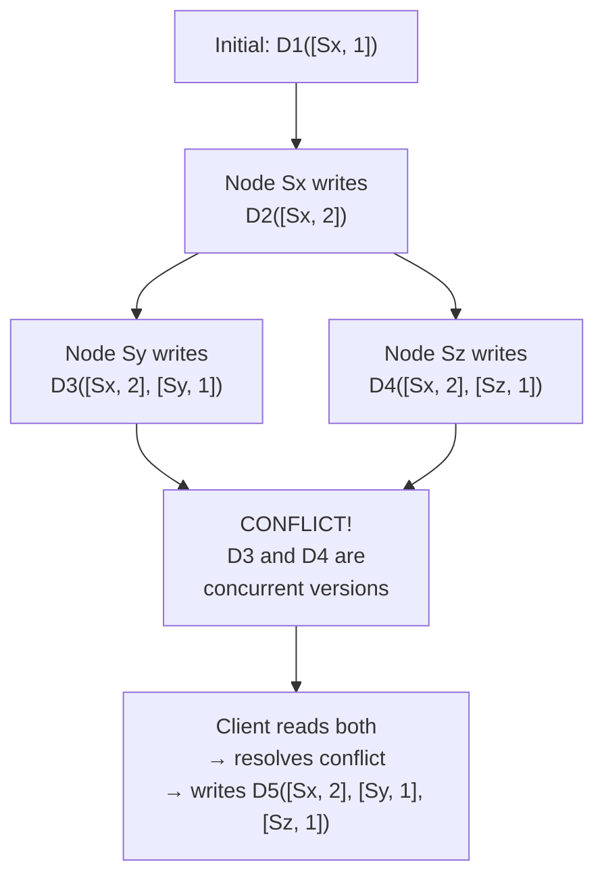
```mermaid
graph TD
    V0["Initial: D1([Sx, 1])"] --> Write1["Node Sx writes<br/>D2([Sx, 2])"]
    Write1 --> Branch1["Node Sy writes<br/>D3([Sx, 2], [Sy, 1])"]
    Write1 --> Branch2["Node Sz writes<br/>D4([Sx, 2], [Sz, 1])"]
    Branch1 --> Conflict["CONFLICT!<br/>D3 and D4 are<br/>concurrent versions"]
    Branch2 --> Conflict
    Conflict --> Resolve["Client reads both<br/>→ resolves conflict<br/>→ writes D5([Sx, 2], [Sy, 1], [Sz, 1])"]
```

### Hinted Handoff

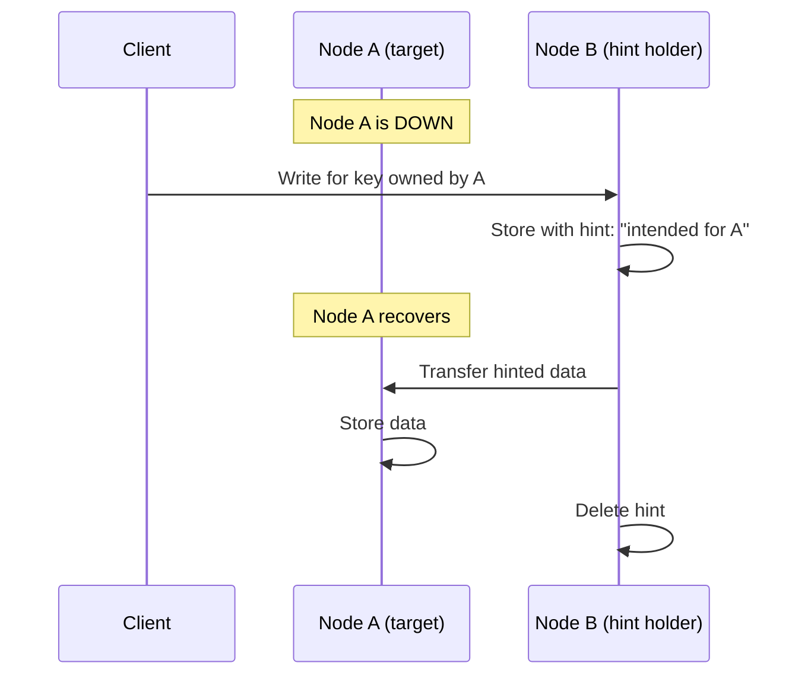
```mermaid
sequenceDiagram
    participant C as Client
    participant A as Node A (target)
    participant B as Node B (hint holder)

    Note over A: Node A is DOWN
    C->>B: Write for key owned by A
    B->>B: Store with hint: "intended for A"
    Note over A: Node A recovers
    B->>A: Transfer hinted data
    A->>A: Store data
    B->>B: Delete hint
```

### Anti-Entropy with Merkle Trees

```
Merkle Tree for Node A:          Merkle Tree for Node B:

      H(1234)                          H(1234')
      /    \                            /    \
   H(12)   H(34)                   H(12)   H(34')  ← Different!
   /  \    /  \                    /  \     /  \
 H1  H2  H3  H4                 H1  H2   H3'  H4
                                           ↑
                                     Key 3 differs → sync only key 3
```

### Impact on Modern Tools
- **Amazon DynamoDB** — Managed Dynamo service
- **Apache Cassandra** — Combines Dynamo + Bigtable concepts
- **Riak** — Dynamo-inspired database
- **Voldemort** — LinkedIn's Dynamo implementation

---

## 5. CHUBBY - 2006

### Paper Info
- **Title:** The Chubby lock service for loosely-coupled distributed systems
- **Authors:** Mike Burrows
- **Conference:** OSDI 2006
- **Link:** https://research.google/pubs/pub27897/
- **PDF:** https://static.googleusercontent.com/media/research.google.com/en//archive/chubby-osdi06.pdf

### Key Contributions
- Distributed lock service
- Leader election mechanism
- Small file storage
- Event notification system

### Architecture

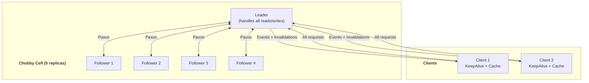
```mermaid
graph TB
    subgraph ChubbyCell[" "]
        ChubbyCell_title["Chubby Cell (5 replicas)"]
        style ChubbyCell_title fill:none,stroke:none,color:#333,font-weight:bold
        Leader["Leader<br/>(handles all reads/writes)"]
        F1["Follower 1"]
        F2["Follower 2"]
        F3["Follower 3"]
        F4["Follower 4"]
        
        Leader <-->|Paxos| F1
        Leader <-->|Paxos| F2
        Leader <-->|Paxos| F3
        Leader <-->|Paxos| F4
    end

    subgraph Clients[" "]
        Clients_title["Clients"]
        style Clients_title fill:none,stroke:none,color:#333,font-weight:bold
        C1[Client 1<br/>KeepAlive + Cache]
        C2[Client 2<br/>KeepAlive + Cache]
    end

    C1 -->|"All requests"| Leader
    C2 -->|"All requests"| Leader
    Leader -->|"Events + Invalidations"| C1
    Leader -->|"Events + Invalidations"| C2
```

### Use Cases

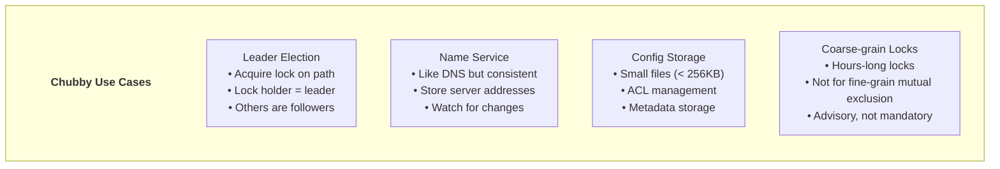
```mermaid
graph LR
    subgraph UseCases[" "]
        UseCases_title["Chubby Use Cases"]
        style UseCases_title fill:none,stroke:none,color:#333,font-weight:bold
        LE["Leader Election<br/>• Acquire lock on path<br/>• Lock holder = leader<br/>• Others are followers"]
        
        NS["Name Service<br/>• Like DNS but consistent<br/>• Store server addresses<br/>• Watch for changes"]
        
        Config["Config Storage<br/>• Small files (< 256KB)<br/>• ACL management<br/>• Metadata storage"]
        
        Lock["Coarse-grain Locks<br/>• Hours-long locks<br/>• Not for fine-grain mutual exclusion<br/>• Advisory, not mandatory"]
    end
```

### Lock Sequencer (Preventing Stale Locks)

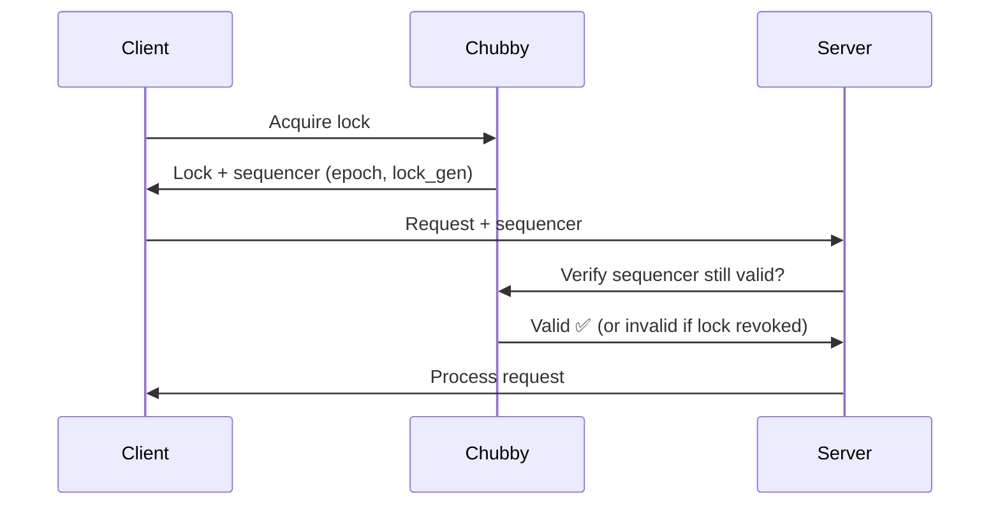
```mermaid
sequenceDiagram
    participant C as Client
    participant Ch as Chubby
    participant S as Server

    C->>Ch: Acquire lock
    Ch->>C: Lock + sequencer (epoch, lock_gen)
    C->>S: Request + sequencer
    S->>Ch: Verify sequencer still valid?
    Ch->>S: Valid ✅ (or invalid if lock revoked)
    S->>C: Process request
```

### Impact on Modern Tools
- **Apache ZooKeeper** — Open-source Chubby implementation
- **etcd** — Kubernetes coordination (Raft-based)
- **Consul** — HashiCorp's service mesh + coordination
- **Kafka, HBase, HDFS** — All originally used ZooKeeper

---

## 6. SPANNER - 2012

### Paper Info
- **Title:** Spanner: Google's Globally-Distributed Database
- **Authors:** James C. Corbett, Jeffrey Dean, et al.
- **Conference:** OSDI 2012
- **Link:** https://research.google/pubs/pub39966/
- **PDF:** https://static.googleusercontent.com/media/research.google.com/en//archive/spanner-osdi2012.pdf

### Key Contributions
- Globally distributed SQL database
- TrueTime API using atomic clocks + GPS
- External consistency (linearizability)
- Schematized semi-relational data model

### TrueTime API

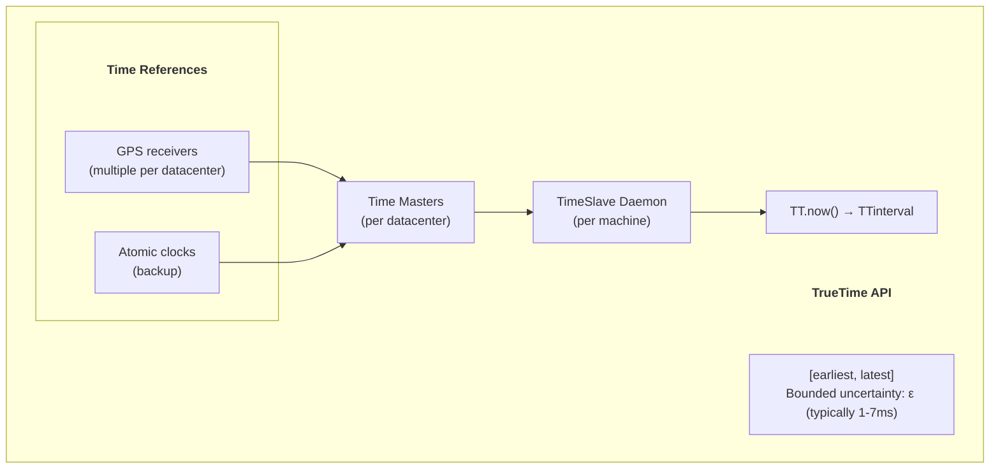
```mermaid
graph TB
    subgraph TrueTime[" "]
        TrueTime_title["TrueTime API"]
        style TrueTime_title fill:none,stroke:none,color:#333,font-weight:bold
        Now["TT.now() → TTinterval"]
        Interval["[earliest, latest]<br/>Bounded uncertainty: ε (typically 1-7ms)"]
        
        subgraph Hardware[" "]
            Hardware_title["Time References"]
            style Hardware_title fill:none,stroke:none,color:#333,font-weight:bold
            GPS["GPS receivers<br/>(multiple per datacenter)"]
            Atomic["Atomic clocks<br/>(backup)"]
        end
        
        GPS --> TimeMaster["Time Masters<br/>(per datacenter)"]
        Atomic --> TimeMaster
        TimeMaster --> Daemon["TimeSlave Daemon<br/>(per machine)"]
        Daemon --> Now
    end
```

### Why TrueTime Enables External Consistency

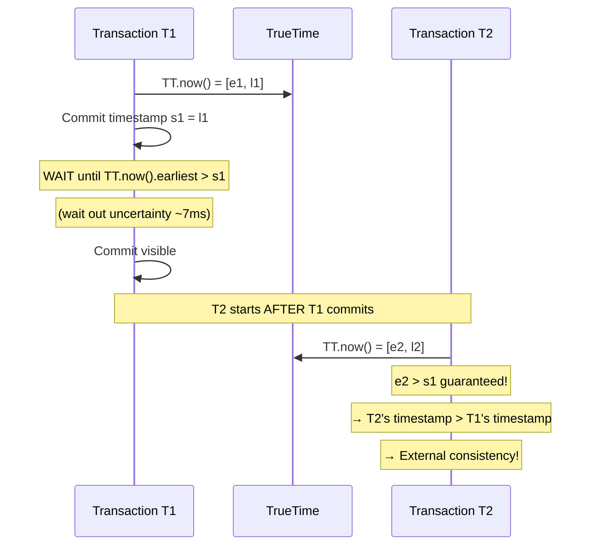
```mermaid
sequenceDiagram
    participant T1 as Transaction T1
    participant TT as TrueTime
    participant T2 as Transaction T2

    T1->>TT: TT.now() = [e1, l1]
    T1->>T1: Commit timestamp s1 = l1
    Note over T1: WAIT until TT.now().earliest > s1
    Note over T1: (wait out uncertainty ~7ms)
    T1->>T1: Commit visible

    Note over T1,T2: T2 starts AFTER T1 commits
    T2->>TT: TT.now() = [e2, l2]
    Note over T2: e2 > s1 guaranteed!
    Note over T2: → T2's timestamp > T1's timestamp
    Note over T2: → External consistency!
```

### Architecture

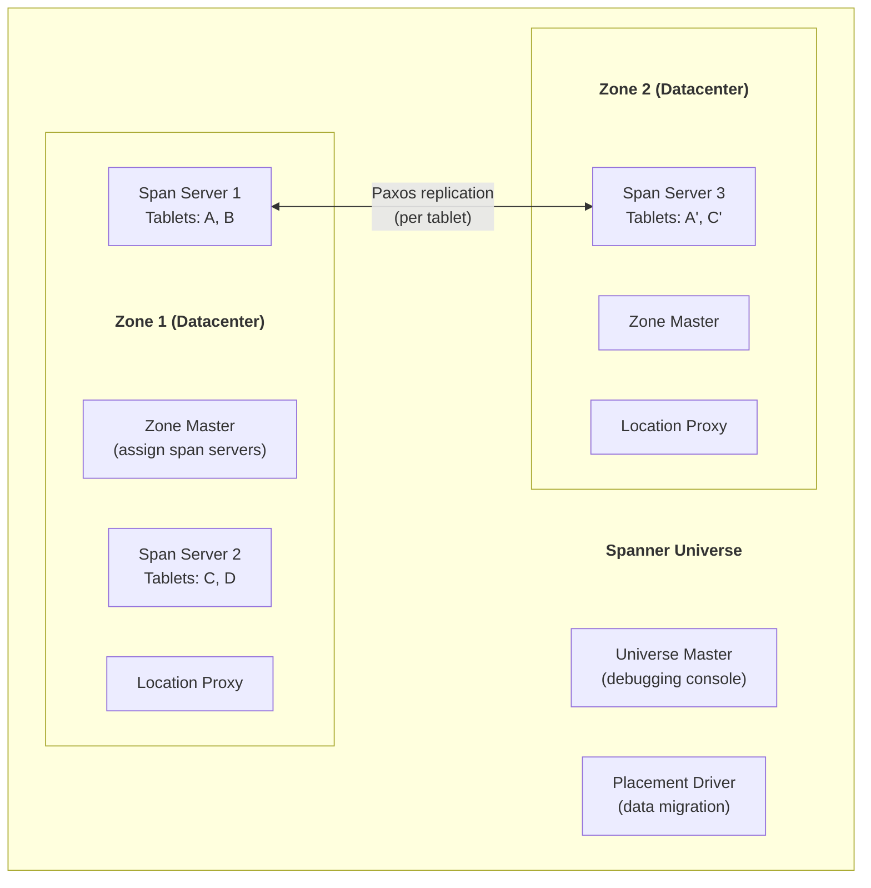
```mermaid
graph TB
    subgraph Universe[" "]
        Universe_title["Spanner Universe"]
        style Universe_title fill:none,stroke:none,color:#333,font-weight:bold
        UP["Universe Master<br/>(debugging console)"]
        PM["Placement Driver<br/>(data migration)"]
        
        subgraph Zone1[" "]
            Zone1_title["Zone 1 (Datacenter)"]
            style Zone1_title fill:none,stroke:none,color:#333,font-weight:bold
            ZM1["Zone Master<br/>(assign span servers)"]
            SS1["Span Server 1<br/>Tablets: A, B"]
            SS2["Span Server 2<br/>Tablets: C, D"]
            LK1["Location Proxy"]
        end
        
        subgraph Zone2[" "]
            Zone2_title["Zone 2 (Datacenter)"]
            style Zone2_title fill:none,stroke:none,color:#333,font-weight:bold
            ZM2["Zone Master"]
            SS3["Span Server 3<br/>Tablets: A', C'"]
            LK2["Location Proxy"]
        end
    end

    SS1 <-->|"Paxos replication<br/>(per tablet)"| SS3
```

### Transaction Types

| Transaction Type | Description | Latency |
|-----------------|-------------|---------|
| **Read-Write** | Full 2PC + Paxos, TrueTime wait | ~10-15ms |
| **Read-Only** | No locks, snapshot at timestamp | ~1-5ms |
| **Snapshot Read** | Read at specific timestamp | ~1ms |
| **Schema Change** | Non-blocking, background | Minutes |

### Impact on Modern Tools
- **Google Cloud Spanner** — Managed Spanner service
- **CockroachDB** — Open-source Spanner-inspired (uses HLC instead of TrueTime)
- **YugabyteDB** — Distributed SQL (Hybrid Logical Clocks)
- **TiDB** — PingCAP's Spanner-inspired database

---

## 7. DREMEL - 2010

### Paper Info
- **Title:** Dremel: Interactive Analysis of Web-Scale Datasets
- **Authors:** Sergey Melnik, Andrey Gubarev, et al.
- **Conference:** VLDB 2010
- **Link:** https://research.google/pubs/pub36632/
- **PDF:** https://static.googleusercontent.com/media/research.google.com/en//pubs/archive/36632.pdf

### Key Contributions
- Columnar storage for nested data
- Record shredding and assembly (repetition/definition levels)
- Tree-structured query execution
- Interactive query on petabytes

### Nested Column Representation

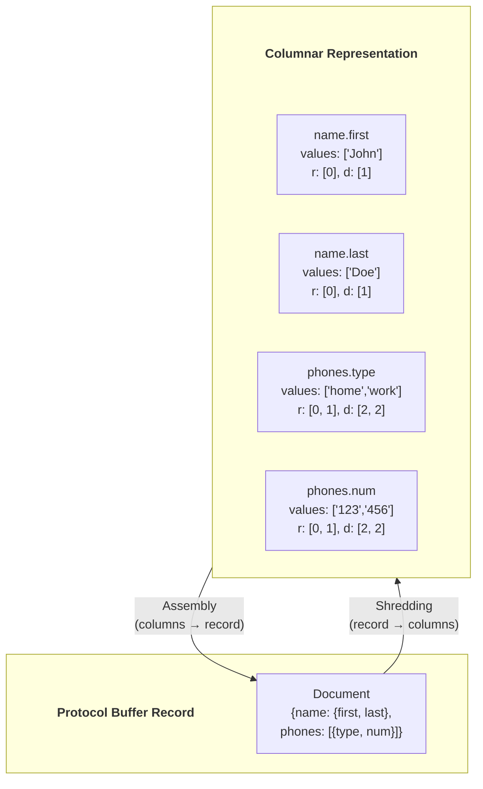
```mermaid
graph TB
    subgraph Record[" "]
        Record_title["Protocol Buffer Record"]
        style Record_title fill:none,stroke:none,color:#333,font-weight:bold
        Doc["Document<br/>{name: {first, last},<br/> phones: [{type, num}]}"]
    end

    subgraph Columnar[" "]
        Columnar_title["Columnar Representation"]
        style Columnar_title fill:none,stroke:none,color:#333,font-weight:bold
        C1["name.first<br/>values: ['John']<br/>r: [0], d: [1]"]
        C2["name.last<br/>values: ['Doe']<br/>r: [0], d: [1]"]
        C3["phones.type<br/>values: ['home','work']<br/>r: [0, 1], d: [2, 2]"]
        C4["phones.num<br/>values: ['123','456']<br/>r: [0, 1], d: [2, 2]"]
    end

    Doc -->|"Shredding<br/>(record → columns)"| Columnar
    Columnar -->|"Assembly<br/>(columns → record)"| Doc
```

**Repetition level (r):** How many repeated fields were repeated to produce this value
**Definition level (d):** How many optional/repeated fields are actually present

### Tree Execution Model

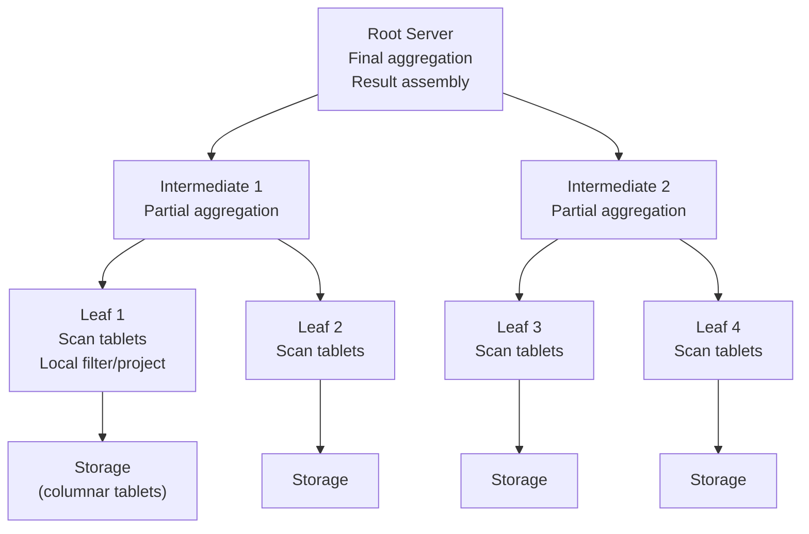
```mermaid
graph TB
    Root["Root Server<br/>Final aggregation<br/>Result assembly"]
    
    I1["Intermediate 1<br/>Partial aggregation"]
    I2["Intermediate 2<br/>Partial aggregation"]
    
    L1["Leaf 1<br/>Scan tablets<br/>Local filter/project"]
    L2["Leaf 2<br/>Scan tablets"]
    L3["Leaf 3<br/>Scan tablets"]
    L4["Leaf 4<br/>Scan tablets"]
    
    Root --> I1
    Root --> I2
    I1 --> L1
    I1 --> L2
    I2 --> L3
    I2 --> L4
    
    L1 --> D1["Storage<br/>(columnar tablets)"]
    L2 --> D2["Storage"]
    L3 --> D3["Storage"]
    L4 --> D4["Storage"]
```

### Performance Numbers from Paper
- **1 trillion records** scanned in ~10 seconds
- **100 billion records** aggregated in < 3 seconds
- **Column pruning** — Read only relevant columns (huge speedup for wide tables)
- **Multi-level serving tree** — Fan-out reduces latency

### Impact on Modern Tools
- **Google BigQuery** — Managed Dremel service (renamed)
- **Apache Parquet** — File format based on Dremel paper's columnar representation
- **Apache Drill** — Open-source Dremel implementation
- **Presto/Trino** — Similar tree-structured query execution

---

## 8. MEGASTORE - 2011

### Paper Info
- **Title:** Megastore: Providing Scalable, Highly Available Storage for Interactive Services
- **Authors:** Jason Baker, Chris Bond, et al.
- **Conference:** CIDR 2011
- **Link:** https://research.google/pubs/pub36971/
- **PDF:** https://storage.googleapis.com/pub-tools-public-publication-data/pdf/36971.pdf

### Key Contributions
- ACID semantics across datacenters
- Entity groups for local transactions
- Paxos-based replication across datacenters
- Synchronous replication with low latency

### Entity Group Model

```mermaid
graph TB
    subgraph EG1[" "]
        EG1_title["Entity Group: User 'alice'"]
        style EG1_title fill:none,stroke:none,color:#333,font-weight:bold
        U1["User Record<br/>name: Alice, email: ..."]
        P1["Photo 1<br/>url: ..., size: ..."]
        P2["Photo 2<br/>url: ..., size: ..."]
        C1["Comment 1<br/>text: ..., author: ..."]
    end

    subgraph EG2[" "]
        EG2_title["Entity Group: User 'bob'"]
        style EG2_title fill:none,stroke:none,color:#333,font-weight:bold
        U2["User Record<br/>name: Bob, email: ..."]
        P3["Photo 1<br/>url: ..., size: ..."]
    end

    subgraph Transactions[" "]
        Transactions_title["Transaction Types"]
        style Transactions_title fill:none,stroke:none,color:#333,font-weight:bold
        Local["Within Entity Group<br/>→ ACID (single Paxos)"]
        Cross["Across Entity Groups<br/>→ 2PC or Message Queue"]
    end
```

### Replication

```mermaid
sequenceDiagram
    participant App as Application
    participant DC1 as Datacenter 1
    participant DC2 as Datacenter 2
    participant DC3 as Datacenter 3

    App->>DC1: Write to entity group
    DC1->>DC1: Prepare (local Bigtable)
    DC1->>DC2: Paxos Accept
    DC1->>DC3: Paxos Accept
    DC2->>DC1: Accept OK
    DC3->>DC1: Accept OK
    Note over DC1: Majority (2/3) → Committed
    DC1->>App: Write acknowledged
    DC1->>DC2: Apply (async)
    DC1->>DC3: Apply (async)
```

### Impact on Modern Tools
- Bridge between Bigtable (scalable, no ACID) and Spanner (global ACID)
- Entity group concept used in Cloud Datastore/Firestore
- Influenced distributed transaction patterns

---

## 9. F1 - 2013

### Paper Info
- **Title:** F1: A Distributed SQL Database That Scales
- **Authors:** Jeff Shute, Radek Vingralek, et al.
- **Conference:** VLDB 2013
- **Link:** https://research.google/pubs/pub41344/
- **PDF:** https://static.googleusercontent.com/media/research.google.com/en//pubs/archive/41344.pdf

### Key Contributions
- SQL interface on top of Spanner storage
- Hierarchical schema design
- Protocol buffer column type
- Online, asynchronous schema changes
- Change history tracking

### Architecture

```mermaid
graph TB
    subgraph F1Layer[" "]
        F1Layer_title["F1 Layer (Stateless)"]
        style F1Layer_title fill:none,stroke:none,color:#333,font-weight:bold
        F1S1["F1 Server 1<br/>SQL parsing,<br/>query planning"]
        F1S2["F1 Server 2"]
        F1S3["F1 Server 3"]
    end

    subgraph SpannerLayer[" "]
        SpannerLayer_title["Spanner Layer (Storage)"]
        style SpannerLayer_title fill:none,stroke:none,color:#333,font-weight:bold
        SP1["Spanner Server 1<br/>Data storage,<br/>transactions"]
        SP2["Spanner Server 2"]
    end

    LB["Load Balancer"] --> F1S1
    LB --> F1S2
    LB --> F1S3
    
    F1S1 --> SP1
    F1S1 --> SP2
    F1S2 --> SP1
    F1S3 --> SP2
```

### Hierarchical Schema

```sql
-- F1 hierarchical schema example
-- Customer is root table
CREATE TABLE Customer (
    customer_id INT64 NOT NULL,
    name STRING(MAX),
    ...
) PRIMARY KEY (customer_id);

-- Campaign is child of Customer (co-located)
CREATE TABLE Campaign (
    customer_id INT64 NOT NULL,
    campaign_id INT64 NOT NULL,
    budget FLOAT64,
    ...
) PRIMARY KEY (customer_id, campaign_id),
  INTERLEAVE IN PARENT Customer;

-- AdGroup is child of Campaign
CREATE TABLE AdGroup (
    customer_id INT64 NOT NULL,
    campaign_id INT64 NOT NULL,
    adgroup_id INT64 NOT NULL,
    ...
) PRIMARY KEY (customer_id, campaign_id, adgroup_id),
  INTERLEAVE IN PARENT Campaign;
```

**Why hierarchical?**
- Customer + all campaigns + all ad groups stored together in Spanner
- Queries within one customer → single Spanner shard → fast
- Cross-customer queries → distributed but rare in AdWords

### Online Schema Changes

```mermaid
graph LR
    S1["State 1: absent<br/>(schema element<br/>doesn't exist)"]
    S2["State 2: delete-only<br/>(can delete,<br/>can't read/insert)"]
    S3["State 3: write-only<br/>(can delete/insert,<br/>can't read)"]
    S4["State 4: public<br/>(fully available)"]
    
    S1 -->|"Add index"| S2
    S2 -->|"Backfill"| S3
    S3 -->|"Verify"| S4
```

### Impact on Modern Tools
- **Cloud Spanner SQL** — Direct descendant
- **CockroachDB** — Similar SQL on distributed KV
- **Online schema changes** — Pattern adopted by many databases (gh-ost, pt-osc)

---

## 10. BORG - 2015

### Paper Info
- **Title:** Large-scale cluster management at Google with Borg
- **Authors:** Abhishek Verma, Luis Pedrosa, et al.
- **Conference:** EuroSys 2015
- **Link:** https://research.google/pubs/pub43438/
- **PDF:** https://static.googleusercontent.com/media/research.google.com/en//pubs/archive/43438.pdf

### Key Contributions
- Large-scale cluster management
- Job scheduling and resource allocation
- Container isolation (pre-Docker)
- High utilization through bin-packing

### Architecture

```mermaid
graph TB
    subgraph BorgCell[" "]
        BorgCell_title["Borg Cell (~10,000 machines)"]
        style BorgCell_title fill:none,stroke:none,color:#333,font-weight:bold
        subgraph Master[" "]
            Master_title["Borgmaster (Paxos replicated, 5 replicas)"]
            style Master_title fill:none,stroke:none,color:#333,font-weight:bold
            Scheduler["Scheduler<br/>Feasibility checking<br/>Scoring"]
            Controller["Controller<br/>Job state machine<br/>Health monitoring"]
        end

        subgraph Workers[" "]
            Workers_title["Worker Nodes"]
            style Workers_title fill:none,stroke:none,color:#333,font-weight:bold
            B1["Borglet 1<br/>Start/stop tasks<br/>Report status"]
            B2["Borglet 2"]
            B3["Borglet 3"]
            BN["Borglet N<br/>..."]
        end
    end

    User["User (BCL config)"] --> Master
    Master -->|"Task placement"| Workers
    Workers -->|"Status updates"| Master

    subgraph Jobs[" "]
        Jobs_title["Job Types"]
        style Jobs_title fill:none,stroke:none,color:#333,font-weight:bold
        Prod["Production (long-running)<br/>• Web servers<br/>• MapReduce masters<br/>• Storage servers<br/>Priority: high, latency-sensitive"]
        Batch["Non-production (batch)<br/>• MapReduce workers<br/>• Analysis jobs<br/>Priority: low, can be preempted"]
    end
```

### Resource Management

```mermaid
graph TB
    subgraph Alloc[" "]
        Alloc_title["Resource Allocation"]
        style Alloc_title fill:none,stroke:none,color:#333,font-weight:bold
        Request["Task Resource Request<br/>CPU: 0.5 cores<br/>RAM: 2 GB<br/>Disk: 10 GB"]
        
        Limit["Resource Limit<br/>(hard cap)"]
        Reservation["Resource Reservation<br/>(expected usage)"]
        
        Reclaim["Reclamation<br/>Unused reservation<br/>→ available for batch"]
    end

    subgraph Scheduling[" "]
        Scheduling_title["Scheduling Algorithm"]
        style Scheduling_title fill:none,stroke:none,color:#333,font-weight:bold
        Feasibility["1. Feasibility Check<br/>Filter machines that<br/>have enough resources"]
        Scoring["2. Scoring<br/>• Minimize preemptions<br/>• Spread tasks<br/>• Pack machines<br/>• Data locality"]
        Place["3. Placement<br/>Best scoring machine wins"]
        
        Feasibility --> Scoring --> Place
    end
```

### Priority & Preemption

| Priority Band | Examples | Preemptible? |
|---------------|----------|-------------|
| **Monitoring** | Borg itself | No |
| **Production** | Gmail, Search | No |
| **Batch** | MapReduce workers | Yes, by production |
| **Best-effort** | Test jobs | Yes, by anything |

### Impact on Modern Tools
- **Kubernetes** — Borg successor, open-sourced by Google
- **Apache Mesos** — Similar cluster manager (Twitter, Apple)
- **Docker Swarm** — Container orchestration
- **Nomad** — HashiCorp's workload orchestrator
- **Omega** — Google's next-gen after Borg (shared state)

---

## 11. TỔNG KẾT & TIMELINE

### Evolution Timeline

```mermaid
timeline
    title Google/Amazon Distributed Systems Papers
    2003 : GFS
         : Distributed file system
    2004 : MapReduce
         : Batch processing model
    2006 : Bigtable
         : Wide-column store
         : Chubby
         : Distributed coordination
    2007 : Dynamo (Amazon)
         : Eventually consistent KV
    2010 : Dremel
         : Interactive analytics
         : Pregel (Graph processing)
    2011 : Megastore
         : Cross-DC transactions
    2012 : Spanner
         : Global SQL database
    2013 : F1
         : SQL on Spanner
         : Borg paper (2015)
         : Container orchestration
```

### Dependency Graph

```mermaid
graph TB
    GFS["GFS (2003)"] --> HDFS["HDFS"]
    GFS --> MapReduce["MapReduce (2004)"]
    GFS --> Bigtable["Bigtable (2006)"]
    
    MapReduce --> Hadoop["Apache Hadoop"]
    MapReduce --> Spark["Apache Spark"]
    
    Bigtable --> HBase["Apache HBase"]
    Bigtable --> Megastore["Megastore (2011)"]
    Bigtable --> Cassandra["Apache Cassandra"]
    
    Dynamo["Dynamo (2007)"] --> DynamoDB["Amazon DynamoDB"]
    Dynamo --> Cassandra
    
    Chubby["Chubby (2006)"] --> ZK["Apache ZooKeeper"]
    ZK --> etcd["etcd"]
    
    Megastore --> Spanner["Spanner (2012)"]
    Spanner --> F1["F1 (2013)"]
    Spanner --> CRDB["CockroachDB"]
    Spanner --> CloudSpanner["Cloud Spanner"]
    
    Dremel["Dremel (2010)"] --> BQ["BigQuery"]
    Dremel --> Parquet["Apache Parquet"]
    Dremel --> Drill["Apache Drill"]
    
    Borg["Borg (2015)"] --> K8s["Kubernetes"]
```

### Summary Table

| Paper | Year | Company | Key Innovation | Modern Tools |
|-------|------|---------|----------------|--------------|
| GFS | 2003 | Google | Distributed filesystem | HDFS, S3 |
| MapReduce | 2004 | Google | Batch processing model | Hadoop, Spark |
| Bigtable | 2006 | Google | Wide-column store | HBase, Cassandra |
| Chubby | 2006 | Google | Distributed coordination | ZooKeeper, etcd |
| Dynamo | 2007 | Amazon | Eventually consistent KV | DynamoDB, Cassandra |
| Dremel | 2010 | Google | Columnar nested data | BigQuery, Parquet |
| Megastore | 2011 | Google | Cross-DC transactions | Cloud Datastore |
| Spanner | 2012 | Google | Global SQL database | CockroachDB, Cloud Spanner |
| F1 | 2013 | Google | SQL on Spanner | Cloud Spanner SQL |
| Borg | 2015 | Google | Container orchestration | Kubernetes |

### Reading Order Recommendation

```mermaid
graph LR
    Start["Start Here"] --> GFS["1. GFS<br/>(foundation)"]
    GFS --> MR["2. MapReduce<br/>(processing)"]
    MR --> BT["3. Bigtable<br/>(storage)"]
    BT --> Dynamo["4. Dynamo<br/>(availability)"]
    Dynamo --> Chubby["5. Chubby<br/>(coordination)"]
    Chubby --> Dremel["6. Dremel<br/>(analytics)"]
    Dremel --> Spanner["7. Spanner<br/>(global DB)"]
    Spanner --> F1["8. F1<br/>(SQL layer)"]
    F1 --> Borg["9. Borg<br/>(orchestration)"]
```

---

## 📦 Verified Resources

| Resource | Link | Note |
|----------|------|------|
| Google Research Papers | [research.google](https://research.google/pubs/) | Official paper repository |
| Amazon Science | [amazon.science](https://www.amazon.science/publications) | Dynamo paper source |
| Papers We Love | [papers-we-love/papers-we-love](https://github.com/papers-we-love/papers-we-love) | 90k⭐ Community |
| DDIA Book | [dataintensive.net](https://dataintensive.net/) | M. Kleppmann's book |
| The Morning Paper | [blog.acolyer.org](https://blog.acolyer.org/) | Paper summaries (archive) |

---

## 🔗 Liên Kết Nội Bộ

- [[05_Consensus_Papers|Consensus Papers]] — Paxos, Raft deep dive
- [[06_Database_Internals_Papers|Database Internals]] — LSM-tree, B-tree
- [[../fundamentals/05_Distributed_Systems_Fundamentals|Distributed Systems Fundamentals]]
- [[../tools/06_Apache_Spark_Complete_Guide|Apache Spark]] — MapReduce successor
- [[../tools/05_Apache_Kafka_Complete_Guide|Apache Kafka]] — Distributed streaming

---

*Document Version: 2.0*
*Last Updated: February 2026*
*Coverage: GFS, MapReduce, Bigtable, Dynamo, Chubby, Spanner, Dremel, Megastore, F1, Borg*
