# Distributed Systems Foundational Papers

## Những Paper Nền Tảng Cho Hệ Thống Phân Tán và Big Data

---

## 📋 Mục Lục

1. [Google File System (GFS)](#1-google-file-system-gfs---2003)
2. [MapReduce](#2-mapreduce---2004)
3. [Bigtable](#3-bigtable---2006)
4. [Dynamo](#4-dynamo---2007)
5. [Chubby](#5-chubby---2006)
6. [Spanner](#6-spanner---2012)
7. [Dremel](#7-dremel---2010)
8. [Megastore](#8-megastore---2011)
9. [F1](#9-f1---2013)
10. [Borg](#10-borg---2015)
11. [Tổng Kết & Timeline](#11-tổng-kết--timeline)

---

## 1. GOOGLE FILE SYSTEM (GFS) - 2003

### Paper Info
- **Title:** The Google File System
- **Authors:** Sanjay Ghemawat, Howard Gobioff, Shun-Tak Leung
- **Conference:** SOSP 2003
- **Link:** https://research.google/pubs/pub51/
- **PDF:** https://static.googleusercontent.com/media/research.google.com/en//archive/gfs-sosp2003.pdf

### Key Contributions
- Distributed file system for large-scale data processing
- Master-chunkserver architecture
- 64MB chunk size design decision
- Relaxed consistency model
- Append-optimized operations

### Core Architecture

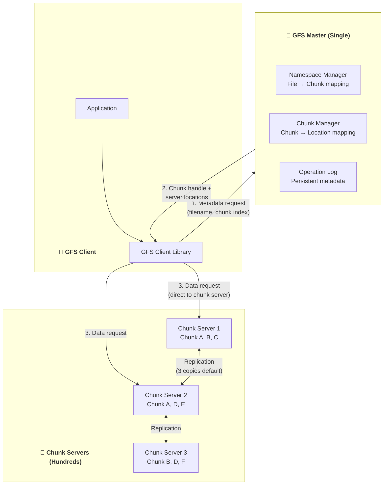
```mermaid
graph TB
    subgraph Client[" "]
        Client_title["📱 GFS Client"]
        style Client_title fill:none,stroke:none,color:#333,font-weight:bold
        App[Application]
        Lib[GFS Client Library]
    end

    subgraph Master[" "]
        Master_title["🧠 GFS Master (Single)"]
        style Master_title fill:none,stroke:none,color:#333,font-weight:bold
        NS[Namespace Manager<br/>File → Chunk mapping]
        CM[Chunk Manager<br/>Chunk → Location mapping]
        OP[Operation Log<br/>Persistent metadata]
    end

    subgraph ChunkServers[" "]
        ChunkServers_title["💾 Chunk Servers (Hundreds)"]
        style ChunkServers_title fill:none,stroke:none,color:#333,font-weight:bold
        CS1[Chunk Server 1<br/>Chunk A, B, C]
        CS2[Chunk Server 2<br/>Chunk A, D, E]
        CS3[Chunk Server 3<br/>Chunk B, D, F]
    end

    App --> Lib
    Lib -->|"1. Metadata request<br/>(filename, chunk index)"| Master
    Master -->|"2. Chunk handle +<br/>server locations"| Lib
    Lib -->|"3. Data request<br/>(direct to chunk server)"| CS1
    Lib -->|"3. Data request"| CS2

    CS1 <-->|"Replication<br/>(3 copies default)"| CS2
    CS2 <-->|"Replication"| CS3
```

### Design Decisions Explained

| Decision | Rationale |
|----------|-----------|
| **64 MB chunk size** | Reduces metadata on master; files are large (multi-GB) |
| **Single master** | Simplicity; master only handles metadata, not data |
| **Append-optimized** | >95% of mutations are appends (log files, web crawl) |
| **Relaxed consistency** | Application-level checksums; defined vs. undefined regions |
| **Component failure is norm** | Built with 1000s of commodity machines; expect failures |

### Read vs Write Flow

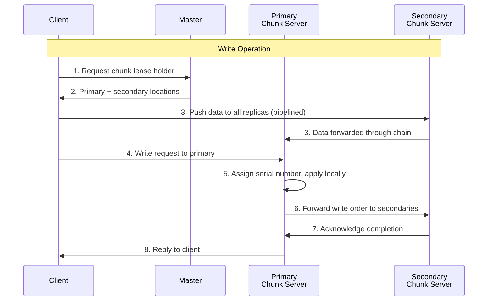
```mermaid
sequenceDiagram
    participant C as Client
    participant M as Master
    participant P as Primary<br/>Chunk Server
    participant S as Secondary<br/>Chunk Server

    Note over C,S: Write Operation
    C->>M: 1. Request chunk lease holder
    M->>C: 2. Primary + secondary locations
    C->>S: 3. Push data to all replicas (pipelined)
    S->>P: 3. Data forwarded through chain
    C->>P: 4. Write request to primary
    P->>P: 5. Assign serial number, apply locally
    P->>S: 6. Forward write order to secondaries
    S->>P: 7. Acknowledge completion
    P->>C: 8. Reply to client
```

### Consistency Model

| Mutation Type | Consistent? | Defined? |
|---------------|------------|----------|
| Write (serial) | ✅ Yes | ✅ Yes |
| Write (concurrent) | ✅ Yes | ❌ No (mixed) |
| Record append | ❌ Possibly not | ✅ "Defined interspersed" |
| Failed mutation | ❌ No | ❌ No |

**Application handles inconsistency:**
- Checksums to detect corruption
- Unique record IDs for deduplication
- Self-validating records

### Impact on Modern Tools
- **HDFS (Hadoop)** — Direct implementation of GFS concepts
- **Cloud Object Storage** — S3, GCS, ADLS follow similar patterns
- **Data Lake architecture** — Large file, append-only patterns
- **Colossus** — Google's successor to GFS (2010+)

### Limitations & Evolution (Sự thật phũ phàng)
- **Single master bottleneck**: metadata hot-spot và SPOF logic (dù có recovery).
- **Weak consistency** làm app layer phải gánh complexity dedup/checksum.
- **Evolution:** Colossus, HDFS HA + federation, object storage metadata services tách riêng control plane/data plane.

### War Stories & Troubleshooting
- **Small files explosion** làm master metadata phình to, RPC queue tăng mạnh.
- **Fix nhanh:** compaction job (merge files), enforce min file size trong pipeline, cảnh báo khi file count/partition vượt ngưỡng.

### Metrics & Order of Magnitude
- Chunk size lớn (64MB trong paper; thực tế thường 128MB+ ở hệ mới) giúp giảm metadata entries theo bậc độ lớn.
- Replication factor 3 thường đánh đổi ~3x storage để lấy durability/availability.
- Throughput sequential read/write thường cao hơn random I/O từ 1-2 bậc độ lớn.

### Micro-Lab
```bash
# Tạo nhanh vài file nhỏ + 1 file lớn để mô phỏng small-files issue
mkdir -p /tmp/gfs_lab && seq 1 200 | xargs -I{} sh -c 'dd if=/dev/zero of=/tmp/gfs_lab/f_{}.bin bs=64K count=1 status=none'
dd if=/dev/zero of=/tmp/gfs_lab/big.bin bs=1M count=128 status=none
# Đếm số file nhỏ (<32MB) và tổng dung lượng
find /tmp/gfs_lab -type f -size -32M | wc -l
du -sh /tmp/gfs_lab
```

--- 
> 💡 **Gemini Feedback**
> **Góc nhìn Thực chiến (Senior to Junior)**
1. **Limitations & Evolution (Sự thật phũ phàng):** GFS (và HDFS) có một điểm nghẽn cổ chai cực kỳ tồi tệ: **Single Master Architecture**. Cục Master (NameNode) phải lưu toàn bộ metadata của mọi file trên RAM. Nếu user đẩy lên hàng triệu file nhỏ (Small File Problem), RAM của NameNode sẽ nổ tung (OOM) dù ổ cứng (DataNode) vẫn còn trống trơn. Giải pháp tiến hóa sau này là Colossus (Google) chia nhỏ Master ra, hoặc dùng Object Storage (S3/MinIO).
    
2. **War Stories & Troubleshooting:** Anh từng cứu một cụm Hadoop bị sập hoàn toàn chỉ vì team Data Scientist lưu log model mỗi phút thành 1 file text 1KB. NameNode bị quá tải rác metadata. Cách fix: Viết một job Spark đọc hàng triệu file nhỏ đó và `coalesce()` lại thành các file Parquet 128MB.
    
3. **Metrics & Order of Magnitude:** Block size mặc định của GFS là 64MB (HDFS thường là 128MB hoặc 256MB). Chạy query analytic trên file 10GB chia thành các block 128MB sẽ nhanh hơn gấp chục lần so với quét 10.000 file 1MB.
    
4. **Micro-Lab:** Khởi tạo một bucket MinIO (S3-compatible) bằng Docker để thay thế HDFS trên local: `docker run -p 9000:9000 -p 9001:9001 minio/minio server /data`

---

## 2. MAPREDUCE - 2004

### Paper Info
- **Title:** MapReduce: Simplified Data Processing on Large Clusters
- **Authors:** Jeffrey Dean, Sanjay Ghemawat
- **Conference:** OSDI 2004
- **Link:** https://research.google/pubs/pub62/
- **PDF:** https://static.googleusercontent.com/media/research.google.com/en//archive/mapreduce-osdi04.pdf

### Key Contributions
- Programming model for distributed processing
- Automatic parallelization
- Fault tolerance through re-execution
- Data locality optimization

### Execution Model

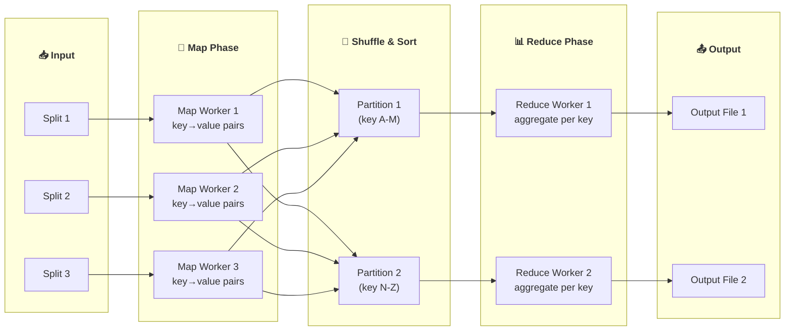
```mermaid
graph LR
    subgraph Input[" "]
        Input_title["📥 Input"]
        style Input_title fill:none,stroke:none,color:#333,font-weight:bold
        S1[Split 1]
        S2[Split 2]
        S3[Split 3]
    end

    subgraph Map[" "]
        Map_title["🔄 Map Phase"]
        style Map_title fill:none,stroke:none,color:#333,font-weight:bold
        M1[Map Worker 1<br/>key→value pairs]
        M2[Map Worker 2<br/>key→value pairs]
        M3[Map Worker 3<br/>key→value pairs]
    end

    subgraph Shuffle[" "]
        Shuffle_title["🔀 Shuffle & Sort"]
        style Shuffle_title fill:none,stroke:none,color:#333,font-weight:bold
        P1["Partition 1<br/>(key A-M)"]
        P2["Partition 2<br/>(key N-Z)"]
    end

    subgraph Reduce[" "]
        Reduce_title["📊 Reduce Phase"]
        style Reduce_title fill:none,stroke:none,color:#333,font-weight:bold
        R1[Reduce Worker 1<br/>aggregate per key]
        R2[Reduce Worker 2<br/>aggregate per key]
    end

    subgraph Output[" "]
        Output_title["📤 Output"]
        style Output_title fill:none,stroke:none,color:#333,font-weight:bold
        O1[Output File 1]
        O2[Output File 2]
    end

    S1 --> M1
    S2 --> M2
    S3 --> M3
    M1 --> P1
    M1 --> P2
    M2 --> P1
    M2 --> P2
    M3 --> P1
    M3 --> P2
    P1 --> R1
    P2 --> R2
    R1 --> O1
    R2 --> O2
```

### Word Count Example

```python
# MAP function
def map(key, value):
    # key: document name, value: document contents
    for word in value.split():
        emit(word, 1)

# REDUCE function
def reduce(key, values):
    # key: word, values: list of counts
    emit(key, sum(values))

# Input: "hello world hello"
# Map output:    ("hello", 1), ("world", 1), ("hello", 1)
# Shuffle:       "hello" → [1, 1],  "world" → [1]
# Reduce output: ("hello", 2), ("world", 1)
```

### Fault Tolerance

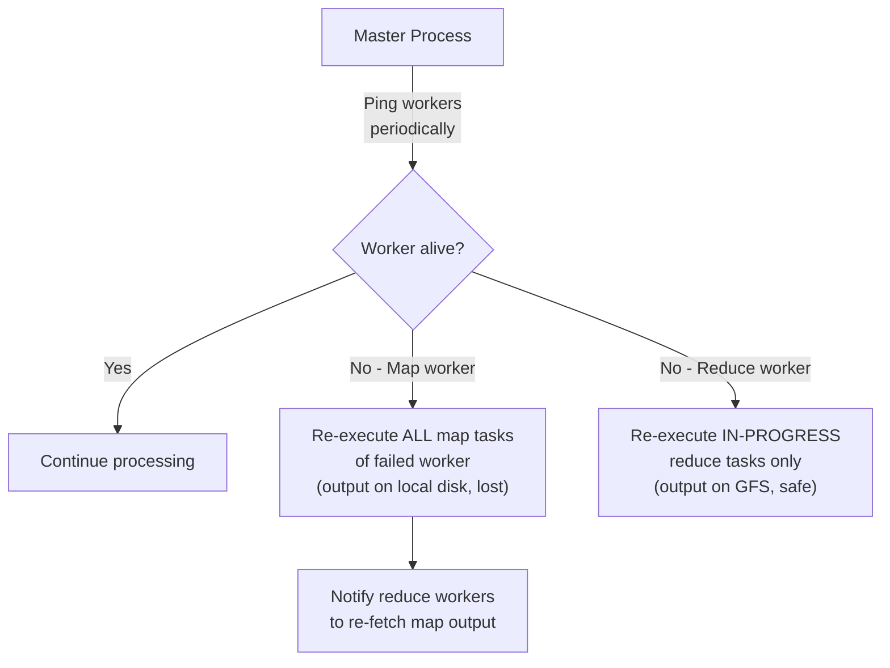
```mermaid
graph TD
    Master[Master Process] -->|"Ping workers<br/>periodically"| Check{Worker alive?}
    
    Check -->|Yes| Continue[Continue processing]
    Check -->|No - Map worker| ReMap["Re-execute ALL map tasks<br/>of failed worker<br/>(output on local disk, lost)"]
    Check -->|No - Reduce worker| ReReduce["Re-execute IN-PROGRESS<br/>reduce tasks only<br/>(output on GFS, safe)"]
    
    ReMap --> Notify["Notify reduce workers<br/>to re-fetch map output"]
```

**Key insight:** Map output is stored on local disk → lost if worker dies. Reduce output is on GFS → survives worker failure.

### Optimizations in the Paper
- **Combiner function** — Local reduce before shuffle (reduces network I/O)
- **Backup tasks** — Run duplicate of slow tasks ("stragglers")
- **Data locality** — Schedule map tasks near input data
- **Partitioning function** — Custom hash for reduce key distribution
- **Ordering guarantees** — Within each partition, keys are sorted

### Impact on Modern Tools
- **Apache Hadoop MapReduce** — Open-source implementation
- **Apache Spark** — Extended model (DAG, in-memory, iterative)
- **Apache Flink** — Stream-first, batch as special case
- **All batch processing** — map() and reduce() are universal concepts

### Limitations & Evolution (Sự thật phũ phàng)
- **High latency** do materialize giữa stages + disk-heavy shuffle.
- **Poor fit for iterative workloads** (ML/graph) vì re-read/recompute nhiều lần.
- **Evolution:** Spark DAG engine, Flink unified stream-batch, Beam/Dataflow model.

### War Stories & Troubleshooting
- **Straggler tasks** kéo dài tail latency toàn job.
- **Fix nhanh:** bật speculative execution, tăng parallelism hợp lý, xử lý skew key trước shuffle.

### Metrics & Order of Magnitude
- Batch SLA thường ở mức phút-giờ, không phù hợp use case < vài giây.
- Shuffle thường chiếm 50%+ job time ở workload join/aggregation lớn.
- Combiner tốt có thể giảm network shuffle traffic theo bậc 2-10x tùy cardinality.


### Micro-Lab
```python
# Demo skew gây straggler: 1 key chiếm áp đảo
from collections import Counter
records = ['hot'] * 100000 + ['cold'] * 100 + ['warm'] * 80
dist = Counter(records)
print(dist.most_common())
print("hot_ratio=", round(dist['hot'] / sum(dist.values()), 4))
```

--- 
> 💡 **Gemini Feedback**
> **Góc nhìn Thực chiến (Senior to Junior)**
_Bản thân MapReduce đã chết, cần giải thích rõ cho Junior tại sao nó chết để tôn vinh Spark._

1. **Limitations & Evolution (Sự thật phũ phàng):** MapReduce quá lạm dụng I/O ổ cứng. Cứ xong phase Map là nó phải ghi data tạm (spill) xuống disk để chống lỗi, rồi phase Reduce lại đọc lên. Chạy một chuỗi pipeline dài sẽ tốn 80% thời gian chỉ để đọc/ghi disk. Đó là lý do Spark ra đời và đập chết MapReduce bằng việc giữ data in-memory (RDD).
    
2. **War Stories & Troubleshooting:** Lỗi kinh điển nhất là **Straggler (Kẻ tụt hậu) & Data Skew**. Cả job 100 task, 99 task chạy xong trong 2 phút, task cuối cùng chứa cái key bị nghiêng data (ví dụ key `null` hoặc key `user_id = bot`) chạy mất 2 tiếng. Cách fix: Thêm salt key (tạo random id) để phá vỡ data skew trước khi group by/reduce.
    
3. **Metrics & Order of Magnitude:** MapReduce setup overhead rất cao (mất 10-30s chỉ để khởi tạo JVM container trên YARN). Do đó, dùng MapReduce/Hive để chạy query real-time là thảm họa.
    
4. **Micro-Lab:** Để hiểu MapReduce, không cần cài Hadoop, chỉ cần xài pipe của Linux: `cat data.txt | tr ' ' '\n' | sort | uniq -c | sort -nr` (Đây chính là logic Map -> Shuffle/Sort -> Reduce của bài toán Word Count kinh điển).

---

## 3. BIGTABLE - 2006

### Paper Info
- **Title:** Bigtable: A Distributed Storage System for Structured Data
- **Authors:** Fay Chang, Jeffrey Dean, Sanjay Ghemawat, et al.
- **Conference:** OSDI 2006
- **Link:** https://research.google/pubs/pub27898/
- **PDF:** https://static.googleusercontent.com/media/research.google.com/en//archive/bigtable-osdi06.pdf

### Key Contributions
- Wide-column store model
- Row key, column family, timestamp design
- SSTable and memtable architecture
- Tablet-based sharding

### Data Model

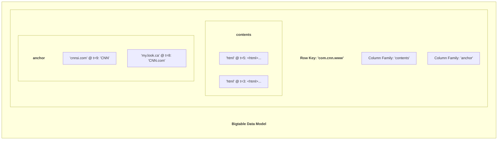
```mermaid
graph TB
    subgraph DataModel[" "]
        DataModel_title["Bigtable Data Model"]
        style DataModel_title fill:none,stroke:none,color:#333,font-weight:bold
        subgraph Row1[" "]
            Row1_title["Row Key: 'com.cnn.www'"]
            style Row1_title fill:none,stroke:none,color:#333,font-weight:bold
            CF1["Column Family: 'contents'"]
            CF2["Column Family: 'anchor'"]
            
            subgraph CF1Detail[" "]
                CF1Detail_title["contents"]
                style CF1Detail_title fill:none,stroke:none,color:#333,font-weight:bold
                C1["'html' @ t=5: &lt;html&gt;..."]
                C2["'html' @ t=3: &lt;html&gt;..."]
            end
            
            subgraph CF2Detail[" "]
                CF2Detail_title["anchor"]
                style CF2Detail_title fill:none,stroke:none,color:#333,font-weight:bold
                C3["'cnnsi.com' @ t=9: 'CNN'"]
                C4["'my.look.ca' @ t=8: 'CNN.com'"]
            end
        end
    end
```

**Data model = (row key, column family:qualifier, timestamp) → value**

- **Row key** — Sorted lexicographically, enables range scans
- **Column family** — Group of columns, unit of access control
- **Column qualifier** — Individual column within family (dynamic)
- **Timestamp** — Multiple versions per cell, auto garbage collected

### Architecture

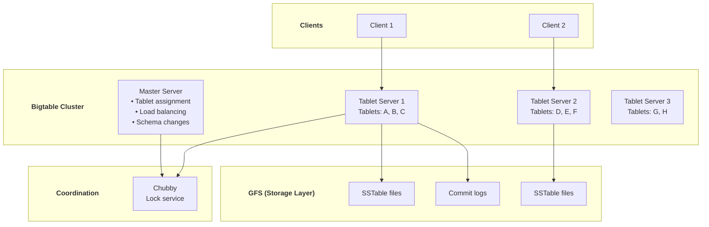
```mermaid
graph TB
    subgraph Clients[" "]
        Clients_title["Clients"]
        style Clients_title fill:none,stroke:none,color:#333,font-weight:bold
        C1[Client 1]
        C2[Client 2]
    end

    subgraph Bigtable[" "]
        Bigtable_title["Bigtable Cluster"]
        style Bigtable_title fill:none,stroke:none,color:#333,font-weight:bold
        Master["Master Server<br/>• Tablet assignment<br/>• Load balancing<br/>• Schema changes"]
        
        TS1["Tablet Server 1<br/>Tablets: A, B, C"]
        TS2["Tablet Server 2<br/>Tablets: D, E, F"]
        TS3["Tablet Server 3<br/>Tablets: G, H"]
    end

    subgraph Storage[" "]
        Storage_title["GFS (Storage Layer)"]
        style Storage_title fill:none,stroke:none,color:#333,font-weight:bold
        SS1[SSTable files]
        SS2[SSTable files]
        Log1[Commit logs]
    end

    subgraph Coord[" "]
        Coord_title["Coordination"]
        style Coord_title fill:none,stroke:none,color:#333,font-weight:bold
        Chubby["Chubby<br/>Lock service"]
    end

    C1 --> TS1
    C2 --> TS2
    Master --> Chubby
    TS1 --> Chubby
    TS1 --> SS1
    TS2 --> SS2
    TS1 --> Log1
```

### Read/Write Path

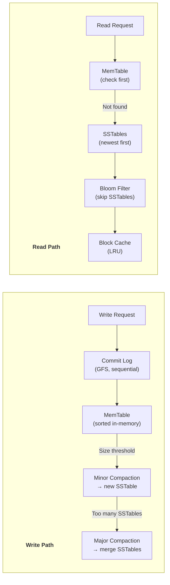
```mermaid
graph LR
    subgraph Write[" "]
        Write_title["Write Path"]
        style Write_title fill:none,stroke:none,color:#333,font-weight:bold
        W1["Write Request"] --> W2["Commit Log<br/>(GFS, sequential)"]
        W2 --> W3["MemTable<br/>(sorted in-memory)"]
        W3 -->|"Size threshold"| W4["Minor Compaction<br/>→ new SSTable"]
        W4 -->|"Too many SSTables"| W5["Major Compaction<br/>→ merge SSTables"]
    end

    subgraph Read[" "]
        Read_title["Read Path"]
        style Read_title fill:none,stroke:none,color:#333,font-weight:bold
        R1["Read Request"] --> R2["MemTable<br/>(check first)"]
        R2 -->|"Not found"| R3["SSTables<br/>(newest first)"]
        R3 --> R4["Bloom Filter<br/>(skip SSTables)"]
        R4 --> R5["Block Cache<br/>(LRU)"]
    end
```

### Tablet Splitting

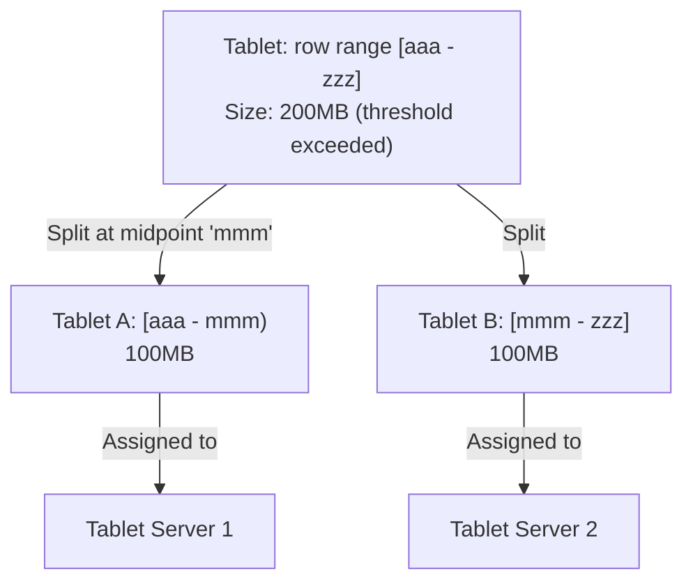
```mermaid
graph TB
    Before["Tablet: row range [aaa - zzz]<br/>Size: 200MB (threshold exceeded)"]
    Before -->|"Split at midpoint 'mmm'"| After1["Tablet A: [aaa - mmm)<br/>100MB"]
    Before -->|"Split"| After2["Tablet B: [mmm - zzz]<br/>100MB"]
    
    After1 -->|"Assigned to"| TS1[Tablet Server 1]
    After2 -->|"Assigned to"| TS2[Tablet Server 2]
```

### Performance Optimizations
- **Bloom filters** — Skip SSTables that definitely don't contain key
- **Compression** — Per-SSTable block compression (BMDiff, Zippy)
- **Caching** — Scan cache (key-value) + block cache (SSTable blocks)
- **Commit log** — Single log per tablet server (not per tablet)
- **Locality groups** — Co-locate related column families on disk

### Impact on Modern Tools
- **Apache HBase** — Direct open-source clone of Bigtable
- **Apache Cassandra** — Influenced by Bigtable + Dynamo
- **Google Cloud Bigtable** — Managed Bigtable service
- **LSM-tree databases** — RocksDB, LevelDB, ScyllaDB

### Limitations & Evolution (Sự thật phũ phàng)
- **Schema design khó sửa** khi row-key sai (hot partition, scan kém).
- **Compaction debt** tăng mạnh khi write-heavy.
- **Evolution:** adaptive sharding, tiered storage, managed autoscaling Bigtable/HBase ecosystems.

### War Stories & Troubleshooting
- **Hot tablet/hotspot** do key tăng tuần tự (timestamp raw).
- **Fix nhanh:** salt/bucket key, đảo thứ tự key (reverse timestamp), pre-split tablets.

### Metrics & Order of Magnitude
- Point read thường ở mức ms–tens of ms khi key design tốt.
- Compaction có thể ăn 20-40% disk I/O nếu tuning kém.
- Bloom filter tốt giảm read amplification đáng kể (thường nhiều lần trên negative lookups).

### Micro-Lab
```sql
-- Kiểm tra phân phối key để phát hiện hotspot
SELECT key_prefix, COUNT(*) AS c
FROM events
GROUP BY key_prefix
ORDER BY c DESC
LIMIT 10;

-- Nếu top 1 key vượt xa median key count => cần salting/bucketing
```

---
> 💡 **Gemini Feedback**
> **Góc nhìn Thực chiến (Senior to Junior)**
> _Lưu ý: Bigtable chính là nguồn cảm hứng trực tiếp cho Apache HBase và Cassandra._

1. **Limitations & Evolution (Sự thật phũ phàng):** Yếu điểm chí mạng của Bigtable (và HBase) là thiết kế **Row Key Hotspotting**. Nếu em thiết kế Row Key là `timestamp` tăng dần, toàn bộ request ghi data sẽ đổ dồn vào đúng một node (Region Server) duy nhất, làm node đó chết ngắc trong khi các node khác ngồi chơi. Khắc phục bằng cách phải "salt" (thêm chuỗi hash ngẫu nhiên) vào đầu Row Key.
    
2. **War Stories & Troubleshooting:** Lỗi "Region in Transition" vĩnh viễn trong HBase. Khi một node sập (ví dụ khi chạy ép tải trên con HP Z440), Master cố gắng gán lại vùng dữ liệu (Region) cho node khác nhưng file WAL bị hỏng hoặc Zookeeper bị trễ, dẫn đến data bị khóa hoàn toàn không thể đọc ghi. Cách fix thường phải can thiệp bằng tool `hbase hbck` để vá metadata.
    
3. **Metrics & Order of Magnitude:** Bigtable sinh ra cho Point-Lookup (đọc một dòng cụ thể) và Scan theo dải (Range Scan), tốc độ đọc/ghi đo bằng millisecond (dưới 10ms). Nhưng nếu em dùng nó để chạy `SELECT COUNT(*)` (Full table scan), nó sẽ chậm hơn cả RDBMS truyền thống.
    
4. **Micro-Lab:** Tự mở local HBase shell và thử tạo bảng, thiết kế Row Key để thấy NoSQL không có quan hệ (JOIN) như thế nào: `create 'users', 'info'` `put 'users', 'user_123', 'info:name', 'John'` `scan 'users'`


---

## 4. DYNAMO - 2007

### Paper Info
- **Title:** Dynamo: Amazon's Highly Available Key-value Store
- **Authors:** Giuseppe DeCandia, Deniz Hastorun, Madan Jampani, et al.
- **Conference:** SOSP 2007
- **Link:** https://www.amazon.science/publications/dynamo-amazons-highly-available-key-value-store
- **PDF:** https://www.allthingsdistributed.com/files/amazon-dynamo-sosp2007.pdf

### Key Contributions
- Eventually consistent storage
- Consistent hashing with virtual nodes
- Vector clocks for conflict resolution
- Sloppy quorum and hinted handoff
- Anti-entropy with Merkle trees

### Consistent Hashing

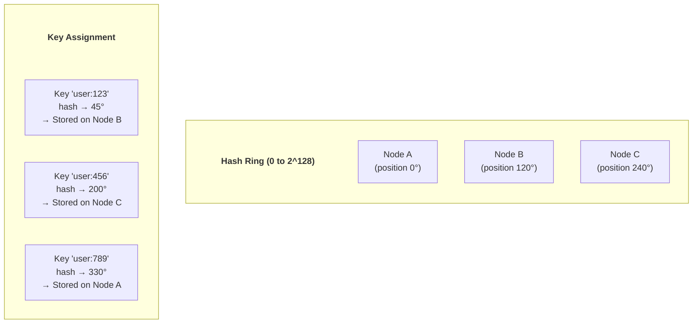
```mermaid
graph TB
    subgraph Ring[" "]
        Ring_title["Hash Ring (0 to 2^128)"]
        style Ring_title fill:none,stroke:none,color:#333,font-weight:bold
        direction TB
        NA["Node A<br/>(position 0°)"]
        NB["Node B<br/>(position 120°)"]
        NC["Node C<br/>(position 240°)"]
    end
    
    subgraph Keys[" "]
        Keys_title["Key Assignment"]
        style Keys_title fill:none,stroke:none,color:#333,font-weight:bold
        K1["Key 'user:123'<br/>hash → 45°<br/>→ Stored on Node B"]
        K2["Key 'user:456'<br/>hash → 200°<br/>→ Stored on Node C"]
        K3["Key 'user:789'<br/>hash → 330°<br/>→ Stored on Node A"]
    end
```

**Virtual nodes:** Each physical node gets multiple positions on ring → better distribution.

### Replication & Quorum

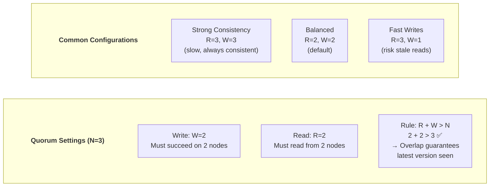
```mermaid
graph LR
    subgraph Quorum[" "]
        Quorum_title["Quorum Settings (N=3)"]
        style Quorum_title fill:none,stroke:none,color:#333,font-weight:bold
        Write["Write: W=2<br/>Must succeed on 2 nodes"]
        Read["Read: R=2<br/>Must read from 2 nodes"]
        Rule["Rule: R + W > N<br/>2 + 2 > 3 ✅<br/>→ Overlap guarantees<br/>latest version seen"]
    end

    subgraph Configs[" "]
        Configs_title["Common Configurations"]
        style Configs_title fill:none,stroke:none,color:#333,font-weight:bold
        Strong["Strong Consistency<br/>R=3, W=3<br/>(slow, always consistent)"]
        Balanced["Balanced<br/>R=2, W=2<br/>(default)"]
        Fast["Fast Writes<br/>R=3, W=1<br/>(risk stale reads)"]
    end
```

### Vector Clocks & Conflict Resolution

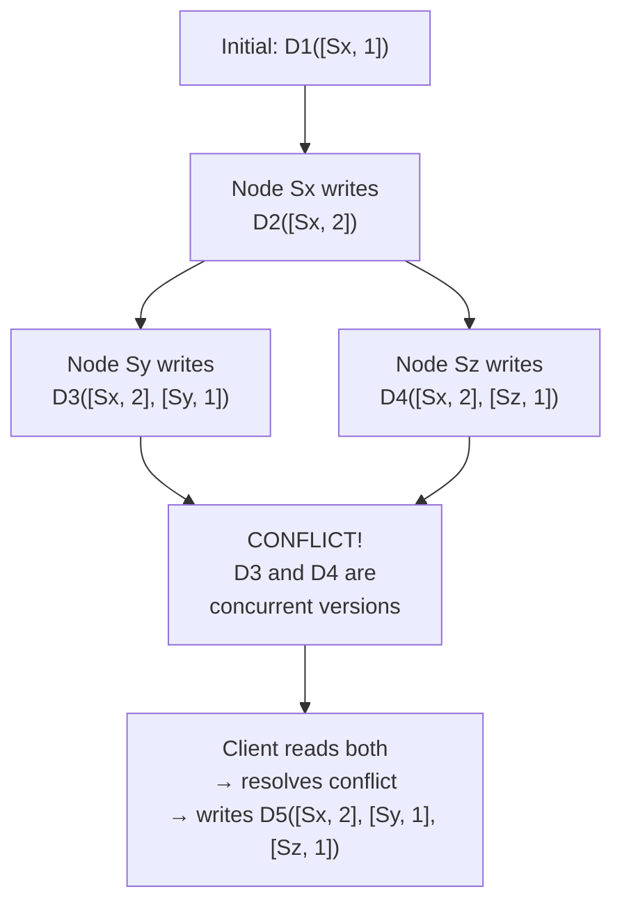
```mermaid
graph TD
    V0["Initial: D1([Sx, 1])"] --> Write1["Node Sx writes<br/>D2([Sx, 2])"]
    Write1 --> Branch1["Node Sy writes<br/>D3([Sx, 2], [Sy, 1])"]
    Write1 --> Branch2["Node Sz writes<br/>D4([Sx, 2], [Sz, 1])"]
    Branch1 --> Conflict["CONFLICT!<br/>D3 and D4 are<br/>concurrent versions"]
    Branch2 --> Conflict
    Conflict --> Resolve["Client reads both<br/>→ resolves conflict<br/>→ writes D5([Sx, 2], [Sy, 1], [Sz, 1])"]
```

### Hinted Handoff

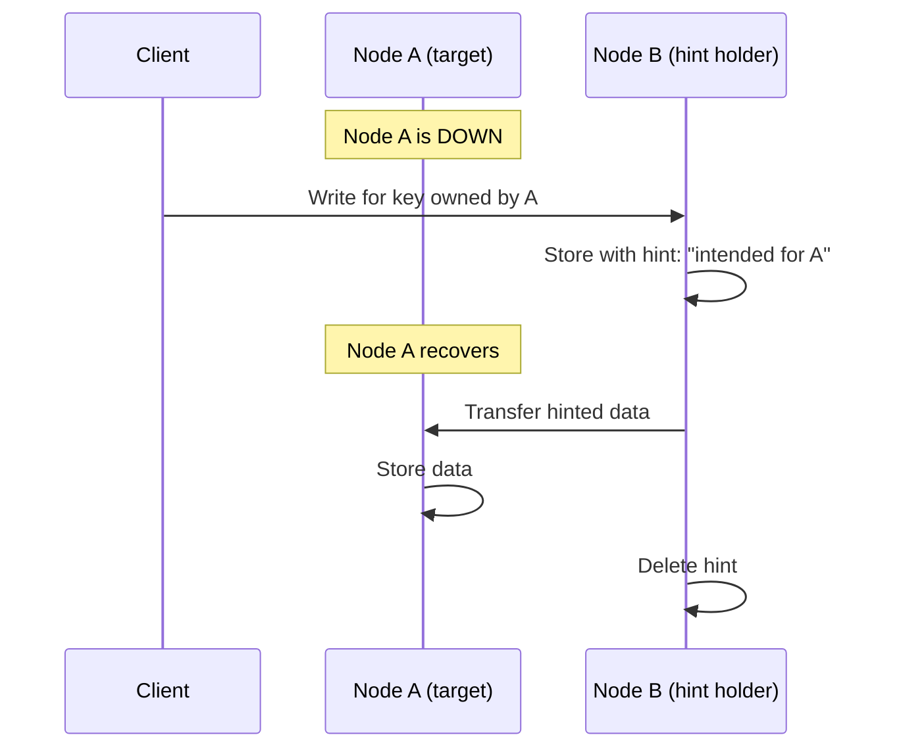
```mermaid
sequenceDiagram
    participant C as Client
    participant A as Node A (target)
    participant B as Node B (hint holder)

    Note over A: Node A is DOWN
    C->>B: Write for key owned by A
    B->>B: Store with hint: "intended for A"
    Note over A: Node A recovers
    B->>A: Transfer hinted data
    A->>A: Store data
    B->>B: Delete hint
```

### Anti-Entropy with Merkle Trees

```
Merkle Tree for Node A:          Merkle Tree for Node B:

      H(1234)                          H(1234')
      /    \                            /    \
   H(12)   H(34)                   H(12)   H(34')  ← Different!
   /  \    /  \                    /  \     /  \
 H1  H2  H3  H4                 H1  H2   H3'  H4
                                           ↑
                                     Key 3 differs → sync only key 3
```

### Impact on Modern Tools
- **Amazon DynamoDB** — Managed Dynamo service
- **Apache Cassandra** — Combines Dynamo + Bigtable concepts
- **Riak** — Dynamo-inspired database
- **Voldemort** — LinkedIn's Dynamo implementation

### Limitations & Evolution (Sự thật phũ phàng)
- **Eventual consistency** gây conflict resolution phức tạp ở application.
- **Operational complexity** với repair/hinted handoff/vector clock.
- **Evolution:** DynamoDB transactions, CRDT patterns, managed repair/autoscaling.

### War Stories & Troubleshooting
- **Anti-entropy backlog** làm replica lệch dữ liệu kéo dài.
- **Fix nhanh:** tăng cadence repair theo token range, theo dõi hint queue, giới hạn write burst khi node degraded.

### Metrics & Order of Magnitude
- p99 write/read thường tăng mạnh khi R/W cấu hình không cân bằng với failure mode.
- RF=3 + quorum (R=2/W=2) là điểm cân bằng phổ biến cho durability/latency.
- Repair full cluster có thể kéo dài từ giờ đến ngày tùy dung lượng.

### Micro-Lab
```python
# Kiểm tra quorum overlap cho nhiều cấu hình
configs = [(3,2,2), (3,1,1), (5,3,2), (5,2,2)]
for N, R, W in configs:
    overlap = R + W > N
    print(f"N={N}, R={R}, W={W}, overlap={overlap}")
```
---
> 💡 **Gemini Feedback**
> **Góc nhìn Thực chiến (Senior to Junior)**
> _Lưu ý: Dynamo là tổ tiên của các hệ thống Eventual Consistency như Cassandra, Riak._

1. **Limitations & Evolution (Sự thật phũ phàng):** Đánh đổi lớn nhất của Dynamo là bắt Application (code của lập trình viên) phải tự giải quyết xung đột dữ liệu (Conflict Resolution) khi có nhiều node trả về kết quả khác nhau do **Eventual Consistency**. Lập trình viên rất ghét điều này. Cassandra sau này đã phải thêm cơ chế LWW (Last Write Wins) dựa trên timestamp để giấu sự phức tạp này đi.
    
2. **War Stories & Troubleshooting:** Hiện tượng "Ghost Data". Khi em xóa một bản ghi, Cassandra không xóa thật mà tạo ra một cái cờ báo tử gọi là **Tombstone**. Nếu em setup thời gian `gc_grace_seconds` sai, node chết sống lại sẽ làm dữ liệu đã xóa... hiện hình trở lại (Zombie data).
    
3. **Metrics & Order of Magnitude:** Luôn nhớ công thức cấu hình Quorum: `W (Write) + R (Read) > N (Replication Factor)`. Nếu N=3, set W=2, R=2 thì em có Strong Consistency (chắc chắn đọc được data mới nhất) nhưng hy sinh chút Latency.
    
4. **Micro-Lab:** Chạy Cassandra bằng Docker và thử cấu hình Consistency Level để thấy sự khác biệt: `docker run -d --name cass -p 9042:9042 cassandra:latest` (Vào `cqlsh` gõ: `CONSISTENCY QUORUM;`)


---

## 5. CHUBBY - 2006

### Paper Info
- **Title:** The Chubby lock service for loosely-coupled distributed systems
- **Authors:** Mike Burrows
- **Conference:** OSDI 2006
- **Link:** https://research.google/pubs/pub27897/
- **PDF:** https://static.googleusercontent.com/media/research.google.com/en//archive/chubby-osdi06.pdf

### Key Contributions
- Distributed lock service
- Leader election mechanism
- Small file storage
- Event notification system

### Architecture

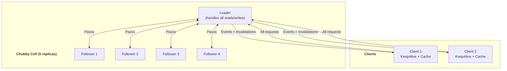
```mermaid
graph TB
    subgraph ChubbyCell[" "]
        ChubbyCell_title["Chubby Cell (5 replicas)"]
        style ChubbyCell_title fill:none,stroke:none,color:#333,font-weight:bold
        Leader["Leader<br/>(handles all reads/writes)"]
        F1["Follower 1"]
        F2["Follower 2"]
        F3["Follower 3"]
        F4["Follower 4"]
        
        Leader <-->|Paxos| F1
        Leader <-->|Paxos| F2
        Leader <-->|Paxos| F3
        Leader <-->|Paxos| F4
    end

    subgraph Clients[" "]
        Clients_title["Clients"]
        style Clients_title fill:none,stroke:none,color:#333,font-weight:bold
        C1[Client 1<br/>KeepAlive + Cache]
        C2[Client 2<br/>KeepAlive + Cache]
    end

    C1 -->|"All requests"| Leader
    C2 -->|"All requests"| Leader
    Leader -->|"Events + Invalidations"| C1
    Leader -->|"Events + Invalidations"| C2
```

### Use Cases

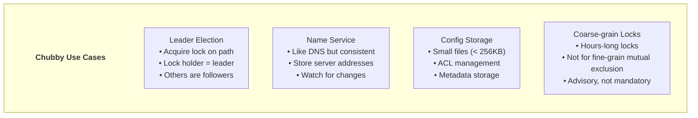
```mermaid
graph LR
    subgraph UseCases[" "]
        UseCases_title["Chubby Use Cases"]
        style UseCases_title fill:none,stroke:none,color:#333,font-weight:bold
        LE["Leader Election<br/>• Acquire lock on path<br/>• Lock holder = leader<br/>• Others are followers"]
        
        NS["Name Service<br/>• Like DNS but consistent<br/>• Store server addresses<br/>• Watch for changes"]
        
        Config["Config Storage<br/>• Small files (< 256KB)<br/>• ACL management<br/>• Metadata storage"]
        
        Lock["Coarse-grain Locks<br/>• Hours-long locks<br/>• Not for fine-grain mutual exclusion<br/>• Advisory, not mandatory"]
    end
```

### Lock Sequencer (Preventing Stale Locks)

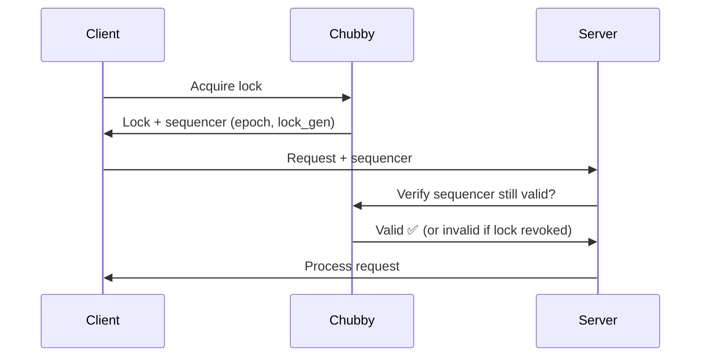
```mermaid
sequenceDiagram
    participant C as Client
    participant Ch as Chubby
    participant S as Server

    C->>Ch: Acquire lock
    Ch->>C: Lock + sequencer (epoch, lock_gen)
    C->>S: Request + sequencer
    S->>Ch: Verify sequencer still valid?
    Ch->>S: Valid ✅ (or invalid if lock revoked)
    S->>C: Process request
```

### Impact on Modern Tools
- **Apache ZooKeeper** — Open-source Chubby implementation
- **etcd** — Kubernetes coordination (Raft-based)
- **Consul** — HashiCorp's service mesh + coordination
- **Kafka, HBase, HDFS** — All originally used ZooKeeper

### Limitations & Evolution (Sự thật phũ phàng)
- **Not for high-QPS data plane**: phù hợp coordination, không phải serving store.
- **Watcher storm** dễ nghẽn khi fan-out lớn.
- **Evolution:** etcd/Consul với API đơn giản hơn, tốt hơn cho cloud-native control plane.

### War Stories & Troubleshooting
- **Session timeout flapping** gây leader election liên tục.
- **Fix nhanh:** tách network plane ổn định, tăng timeout hợp lý, giảm số watch không cần thiết.

### Metrics & Order of Magnitude
- Cụm coordination thường 3-5 nodes; latency write nên giữ ở mức low-ms để control plane ổn định.
- Tần suất thay đổi config càng cao càng cần batching/debouncing watcher events.
- Snapshot + log compaction định kỳ giúp tránh phình WAL.

### Micro-Lab
```bash
# Kiểm tra nhanh endpoint health (ví dụ etcd)
etcdctl endpoint health -w table
# Kiểm tra thêm độ trễ endpoint để phát hiện node chậm
etcdctl endpoint status -w table
```
---
> 💡 **Gemini Feedback**
> **Góc nhìn Thực chiến (Senior to Junior)**
> _Lưu ý: Chubby đẻ ra Apache ZooKeeper và etcd._

1. **Limitations & Evolution (Sự thật phũ phàng):** Chubby (hay Zookeeper) là một **Lock Service** (hệ thống giữ khóa), KHÔNG phải là một Database. Rất nhiều Junior nhầm lẫn và nhét cả cục config file vài MB vào Zookeeper. Hậu quả là Zookeeper nổ RAM và sập toàn bộ cluster vì nó phải đồng bộ cục data đó qua tất cả các node.
    
2. **War Stories & Troubleshooting:** Lỗi **"Split Brain"** và **"Session Expired"**. Khi có một node (như Spark Driver) bận dọn rác bộ nhớ (GC Pause) quá lâu, nó không gửi được heartbeat (nhịp tim) cho Zookeeper. Zookeeper tưởng nó chết nên tước quyền Master, nhưng bản thân node đó vẫn nghĩ mình là Master. Xảy ra hiện tượng 2 thằng cùng ghi đè dữ liệu phá nát hệ thống.
    
3. **Metrics & Order of Magnitude:** Một cụm Zookeeper/etcd chỉ nên có số node lẻ (3, 5, hoặc 7 node). Nhiều hơn 7 node thì tốc độ Write sẽ tụt thê thảm vì phải chờ đồng thuận qua mạng.
    
4. **Micro-Lab:** Dùng etcdctl (hoặc zkCli) để tạo một khóa (ephemeral node) tự động bốc hơi khi ngắt kết nối: `etcdctl put /my_lock "locked" --lease=12345`
---

## 6. SPANNER - 2012

### Paper Info
- **Title:** Spanner: Google's Globally-Distributed Database
- **Authors:** James C. Corbett, Jeffrey Dean, et al.
- **Conference:** OSDI 2012
- **Link:** https://research.google/pubs/pub39966/
- **PDF:** https://static.googleusercontent.com/media/research.google.com/en//archive/spanner-osdi2012.pdf

### Key Contributions
- Globally distributed SQL database
- TrueTime API using atomic clocks + GPS
- External consistency (linearizability)
- Schematized semi-relational data model

### TrueTime API

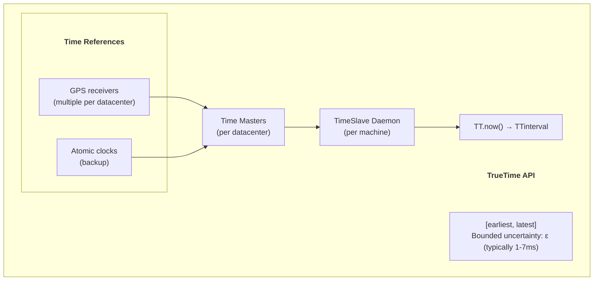
```mermaid
graph TB
    subgraph TrueTime[" "]
        TrueTime_title["TrueTime API"]
        style TrueTime_title fill:none,stroke:none,color:#333,font-weight:bold
        Now["TT.now() → TTinterval"]
        Interval["[earliest, latest]<br/>Bounded uncertainty: ε (typically 1-7ms)"]
        
        subgraph Hardware[" "]
            Hardware_title["Time References"]
            style Hardware_title fill:none,stroke:none,color:#333,font-weight:bold
            GPS["GPS receivers<br/>(multiple per datacenter)"]
            Atomic["Atomic clocks<br/>(backup)"]
        end
        
        GPS --> TimeMaster["Time Masters<br/>(per datacenter)"]
        Atomic --> TimeMaster
        TimeMaster --> Daemon["TimeSlave Daemon<br/>(per machine)"]
        Daemon --> Now
    end
```

### Why TrueTime Enables External Consistency

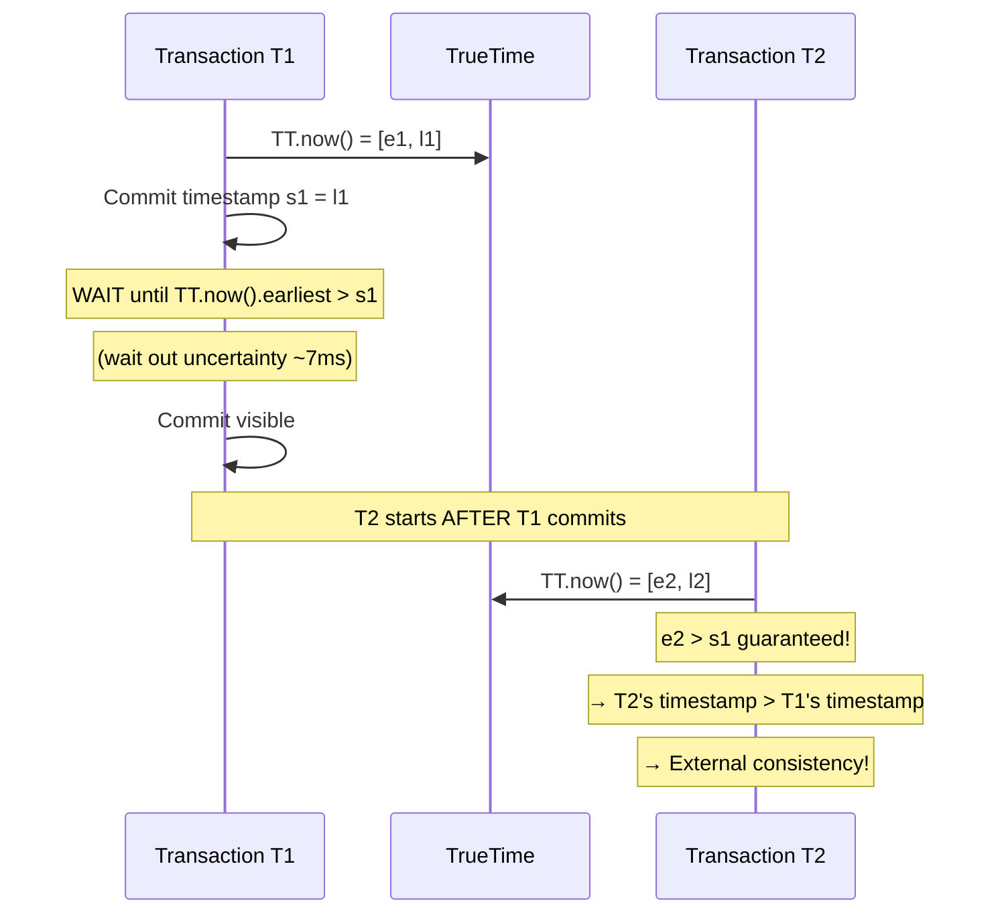
```mermaid
sequenceDiagram
    participant T1 as Transaction T1
    participant TT as TrueTime
    participant T2 as Transaction T2

    T1->>TT: TT.now() = [e1, l1]
    T1->>T1: Commit timestamp s1 = l1
    Note over T1: WAIT until TT.now().earliest > s1
    Note over T1: (wait out uncertainty ~7ms)
    T1->>T1: Commit visible

    Note over T1,T2: T2 starts AFTER T1 commits
    T2->>TT: TT.now() = [e2, l2]
    Note over T2: e2 > s1 guaranteed!
    Note over T2: → T2's timestamp > T1's timestamp
    Note over T2: → External consistency!
```

### Architecture

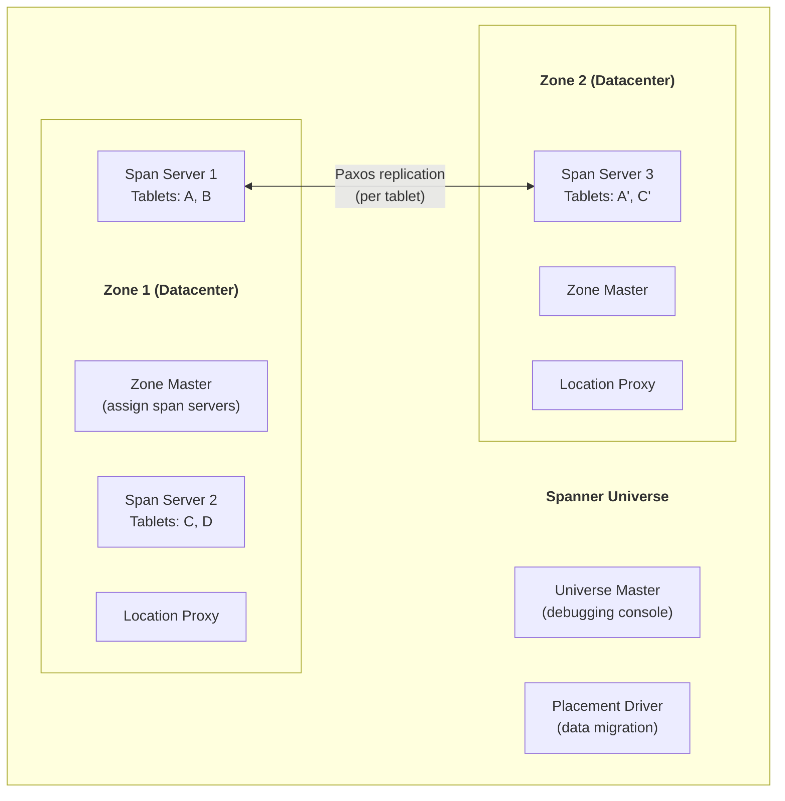
```mermaid
graph TB
    subgraph Universe[" "]
        Universe_title["Spanner Universe"]
        style Universe_title fill:none,stroke:none,color:#333,font-weight:bold
        UP["Universe Master<br/>(debugging console)"]
        PM["Placement Driver<br/>(data migration)"]
        
        subgraph Zone1[" "]
            Zone1_title["Zone 1 (Datacenter)"]
            style Zone1_title fill:none,stroke:none,color:#333,font-weight:bold
            ZM1["Zone Master<br/>(assign span servers)"]
            SS1["Span Server 1<br/>Tablets: A, B"]
            SS2["Span Server 2<br/>Tablets: C, D"]
            LK1["Location Proxy"]
        end
        
        subgraph Zone2[" "]
            Zone2_title["Zone 2 (Datacenter)"]
            style Zone2_title fill:none,stroke:none,color:#333,font-weight:bold
            ZM2["Zone Master"]
            SS3["Span Server 3<br/>Tablets: A', C'"]
            LK2["Location Proxy"]
        end
    end

    SS1 <-->|"Paxos replication<br/>(per tablet)"| SS3
```

### Transaction Types

| Transaction Type | Description | Latency |
|-----------------|-------------|---------|
| **Read-Write** | Full 2PC + Paxos, TrueTime wait | ~10-15ms |
| **Read-Only** | No locks, snapshot at timestamp | ~1-5ms |
| **Snapshot Read** | Read at specific timestamp | ~1ms |
| **Schema Change** | Non-blocking, background | Minutes |

### Impact on Modern Tools
- **Google Cloud Spanner** — Managed Spanner service
- **CockroachDB** — Open-source Spanner-inspired (uses HLC instead of TrueTime)
- **YugabyteDB** — Distributed SQL (Hybrid Logical Clocks)
- **TiDB** — PingCAP's Spanner-inspired database

### Limitations & Evolution (Sự thật phũ phàng)
- **Commit-wait tax**: external consistency đổi bằng latency cộng thêm.
- **Cross-region cost** cao (network + quorum + replication).
- **Evolution:** HLC-based systems (Cockroach/Yugabyte) giảm phụ thuộc clock infra chuyên dụng.

### War Stories & Troubleshooting
- **Leader placement sai** làm p99 tăng đột biến cho traffic đa vùng.
- **Fix nhanh:** đặt leader gần write-heavy region, pin locality theo workload, tách hot ranges.

### Metrics & Order of Magnitude
- Read-write tx đa vùng thường cao hơn local tx theo bậc nhiều ms đến hàng chục ms.
- Read-only/snapshot read rẻ hơn đáng kể và phù hợp analytic/serving mixed workloads.
- Replication đa region thường kéo chi phí egress đáng kể (cần budget guardrail).

### Micro-Lab
```sql
-- Snapshot read để giảm contention với read-write tx
SELECT COUNT(*)
FROM orders AS OF SYSTEM TIME '-5s';

-- So sánh với current read để thấy chênh lệch nhanh
SELECT COUNT(*) FROM orders;
```

---
> 💡 **Gemini Feedback**
> **Góc nhìn Thực chiến (Senior to Junior)**
>_Lưu ý: Đây là Database vĩ đại nhất của Google._

1. **Limitations & Evolution (Sự thật phũ phàng):** Spanner cam kết tính nhất quán phân tán toàn cầu (Global Serializable) bằng cách sử dụng **TrueTime API** (đồng hồ nguyên tử GPS). Nếu em mang Spanner ra khỏi trung tâm dữ liệu của Google (chạy open-source như CockroachDB), do không có phần cứng TrueTime, độ trễ cho mỗi giao dịch (Transaction Latency) qua các lục địa sẽ cực kỳ cao do phải cộng thêm sai số đồng hồ.
    
2. **War Stories & Troubleshooting:** Khách hàng migrate từ MySQL lên Cloud Spanner giữ nguyên thói quen viết các Transaction siêu to, khóa (lock) hàng nghìn dòng. Kết quả là transaction bị Abort (hủy) liên tục do contention (tranh chấp khóa phân tán). Với Spanner, phải chia nhỏ transaction và tối ưu lại Data Interleaving.
    
3. **Metrics & Order of Magnitude:** Nhờ TrueTime, sai số đồng hồ (epsilon) ở Google được ép xuống dưới 7ms. Do đó khi commit một transaction, hệ thống chỉ cần chờ đợi (Commit Wait) đúng 7ms là chắc chắn an toàn.
    
4. **Micro-Lab:** Chạy Google Cloud Spanner Emulator cục bộ để test SQL dialect của nó: `docker run -p 9010:9010 -p 9020:9020 gcr.io/cloud-spanner-emulator/emulator`
---

## 7. DREMEL - 2010

### Paper Info
- **Title:** Dremel: Interactive Analysis of Web-Scale Datasets
- **Authors:** Sergey Melnik, Andrey Gubarev, et al.
- **Conference:** VLDB 2010
- **Link:** https://research.google/pubs/pub36632/
- **PDF:** https://static.googleusercontent.com/media/research.google.com/en//pubs/archive/36632.pdf

### Key Contributions
- Columnar storage for nested data
- Record shredding and assembly (repetition/definition levels)
- Tree-structured query execution
- Interactive query on petabytes

### Nested Column Representation

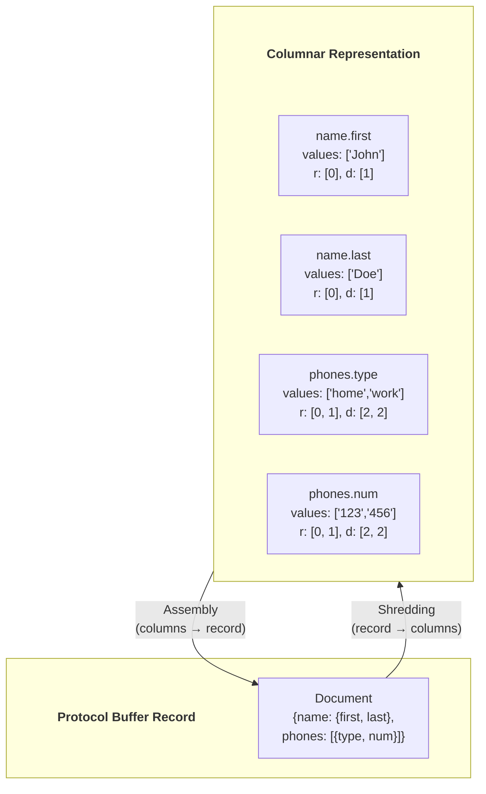
```mermaid
graph TB
    subgraph Record[" "]
        Record_title["Protocol Buffer Record"]
        style Record_title fill:none,stroke:none,color:#333,font-weight:bold
        Doc["Document<br/>{name: {first, last},<br/> phones: [{type, num}]}"]
    end

    subgraph Columnar[" "]
        Columnar_title["Columnar Representation"]
        style Columnar_title fill:none,stroke:none,color:#333,font-weight:bold
        C1["name.first<br/>values: ['John']<br/>r: [0], d: [1]"]
        C2["name.last<br/>values: ['Doe']<br/>r: [0], d: [1]"]
        C3["phones.type<br/>values: ['home','work']<br/>r: [0, 1], d: [2, 2]"]
        C4["phones.num<br/>values: ['123','456']<br/>r: [0, 1], d: [2, 2]"]
    end

    Doc -->|"Shredding<br/>(record → columns)"| Columnar
    Columnar -->|"Assembly<br/>(columns → record)"| Doc
```

**Repetition level (r):** How many repeated fields were repeated to produce this value
**Definition level (d):** How many optional/repeated fields are actually present

### Tree Execution Model

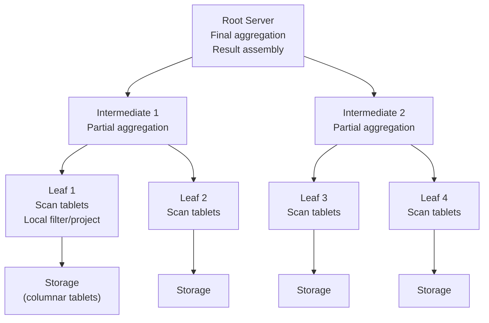
```mermaid
graph TB
    Root["Root Server<br/>Final aggregation<br/>Result assembly"]
    
    I1["Intermediate 1<br/>Partial aggregation"]
    I2["Intermediate 2<br/>Partial aggregation"]
    
    L1["Leaf 1<br/>Scan tablets<br/>Local filter/project"]
    L2["Leaf 2<br/>Scan tablets"]
    L3["Leaf 3<br/>Scan tablets"]
    L4["Leaf 4<br/>Scan tablets"]
    
    Root --> I1
    Root --> I2
    I1 --> L1
    I1 --> L2
    I2 --> L3
    I2 --> L4
    
    L1 --> D1["Storage<br/>(columnar tablets)"]
    L2 --> D2["Storage"]
    L3 --> D3["Storage"]
    L4 --> D4["Storage"]
```

### Performance Numbers from Paper
- **1 trillion records** scanned in ~10 seconds
- **100 billion records** aggregated in < 3 seconds
- **Column pruning** — Read only relevant columns (huge speedup for wide tables)
- **Multi-level serving tree** — Fan-out reduces latency

### Impact on Modern Tools
- **Google BigQuery** — Managed Dremel service (renamed)
- **Apache Parquet** — File format based on Dremel paper's columnar representation
- **Apache Drill** — Open-source Dremel implementation
- **Presto/Trino** — Similar tree-structured query execution

### Limitations & Evolution (Sự thật phũ phàng)
- **Best-effort interactive** vẫn có tail latency khi query skew hoặc metadata quá lớn.
- **Nested schema complexity** dễ gây query khó optimize nếu modeling kém.
- **Evolution:** serverless autoscaling warehouse, adaptive execution, vectorized engines.

### War Stories & Troubleshooting
- **SELECT *** trên bảng wide gây scan cost/latency bùng nổ.
- **Fix nhanh:** ép column pruning, partition + clustering đúng cột filter, materialized view cho query nóng.

### Metrics & Order of Magnitude
- Column pruning có thể giảm bytes scanned từ 5-50x trên wide tables.
- Query interactive tốt thường giữ p50 ở giây thấp, nhưng p99 phụ thuộc mạnh vào skew.
- Nested data đúng mô hình giúp giảm join cost đáng kể.

### Micro-Lab
```sql
-- So sánh plan/cost giữa SELECT * và column pruning
EXPLAIN SELECT * FROM events WHERE event_date='2026-03-20';
EXPLAIN SELECT user_id, event_time FROM events WHERE event_date='2026-03-20';

-- Quan sát khác biệt ở bytes scanned / columns read
```
---
> 💡 **Gemini Feedback**
> **Góc nhìn Thực chiến (Senior to Junior)**
> _Lưu ý: Dremel là tiền thân của Google BigQuery, Apache Drill và Trino (Presto)._

1. **Limitations & Evolution (Sự thật phũ phàng):** Dremel thay thế MapReduce cho các câu query Ad-hoc bằng **Execution Tree** (Cây thực thi), bắn query xuống hàng ngàn node cùng lúc. Nhưng vì nó không có cơ chế Fault-Tolerance ở cấp độ Task như MapReduce, nếu 1 node đang chạy mà sập, toàn bộ câu query đó phải chạy lại từ đầu. Nó đánh đổi sự bền bỉ lấy tốc độ sub-second.
    
2. **War Stories & Troubleshooting:** Lỗi kinh điển khi xài BigQuery/Trino: Một Junior gõ `SELECT * FROM log_table` mà quên thêm điều kiện `WHERE partition_date = ...`. Dremel sẽ quét toàn bộ Petabyte dữ liệu dạng Columnar, khiến công ty mất luôn hàng ngàn đô la chỉ trong 10 giây.
    
3. **Metrics & Order of Magnitude:** Dremel có thể xử lý hàng tỷ row trong vài giây nhờ thiết kế Nested Columnar. Thay vì làm phẳng data (Flatten), nó nén nguyên cấu trúc mảng (Array) và JSON xuống ổ cứng cực kỳ tối ưu.
    
4. **Micro-Lab:** Hiểu tư duy Nested Columnar của Dremel bằng cách tập dùng `UNNEST` trong SQL (cú pháp BigQuery/Trino) để phá vỡ các cột chứa mảng.

---

## 8. MEGASTORE - 2011

### Paper Info
- **Title:** Megastore: Providing Scalable, Highly Available Storage for Interactive Services
- **Authors:** Jason Baker, Chris Bond, et al.
- **Conference:** CIDR 2011
- **Link:** https://research.google/pubs/pub36971/
- **PDF:** https://storage.googleapis.com/pub-tools-public-publication-data/pdf/36971.pdf

### Key Contributions
- ACID semantics across datacenters
- Entity groups for local transactions
- Paxos-based replication across datacenters
- Synchronous replication with low latency

### Entity Group Model

```mermaid
graph TB
    subgraph EG1[" "]
        EG1_title["Entity Group: User 'alice'"]
        style EG1_title fill:none,stroke:none,color:#333,font-weight:bold
        U1["User Record<br/>name: Alice, email: ..."]
        P1["Photo 1<br/>url: ..., size: ..."]
        P2["Photo 2<br/>url: ..., size: ..."]
        C1["Comment 1<br/>text: ..., author: ..."]
    end

    subgraph EG2[" "]
        EG2_title["Entity Group: User 'bob'"]
        style EG2_title fill:none,stroke:none,color:#333,font-weight:bold
        U2["User Record<br/>name: Bob, email: ..."]
        P3["Photo 1<br/>url: ..., size: ..."]
    end

    subgraph Transactions[" "]
        Transactions_title["Transaction Types"]
        style Transactions_title fill:none,stroke:none,color:#333,font-weight:bold
        Local["Within Entity Group<br/>→ ACID (single Paxos)"]
        Cross["Across Entity Groups<br/>→ 2PC or Message Queue"]
    end
```

### Replication

```mermaid
sequenceDiagram
    participant App as Application
    participant DC1 as Datacenter 1
    participant DC2 as Datacenter 2
    participant DC3 as Datacenter 3

    App->>DC1: Write to entity group
    DC1->>DC1: Prepare (local Bigtable)
    DC1->>DC2: Paxos Accept
    DC1->>DC3: Paxos Accept
    DC2->>DC1: Accept OK
    DC3->>DC1: Accept OK
    Note over DC1: Majority (2/3) → Committed
    DC1->>App: Write acknowledged
    DC1->>DC2: Apply (async)
    DC1->>DC3: Apply (async)
```

### Impact on Modern Tools
- Bridge between Bigtable (scalable, no ACID) and Spanner (global ACID)
- Entity group concept used in Cloud Datastore/Firestore
- Influenced distributed transaction patterns

### Limitations & Evolution (Sự thật phũ phàng)
- **Entity group write throughput hạn chế** do consensus scope nhỏ.
- **Cross-group transaction phức tạp** và đắt.
- **Evolution:** Spanner mở rộng transactional model toàn cục với SQL mạnh hơn.

### War Stories & Troubleshooting
- **Bad entity group design** gây contention và retry storm.
- **Fix nhanh:** tách aggregate roots hợp lý, tránh gom quá nhiều write vào cùng group.

### Metrics & Order of Magnitude
- Local (single-group) tx nhanh hơn đáng kể so với cross-group.
- Tỷ lệ retry tăng mạnh khi hotspot group bị write burst.
- Latency đa DC phụ thuộc quorum path và placement.

### Micro-Lab
```python
# Mô phỏng contention theo entity group
from collections import Counter
writes = ['groupA'] * 10000 + ['groupB'] * 500 + ['groupC'] * 300
c = Counter(writes)
print(c)
print("groupA_share=", round(c['groupA'] / sum(c.values()), 4))
```


---

## 9. F1 - 2013

### Paper Info
- **Title:** F1: A Distributed SQL Database That Scales
- **Authors:** Jeff Shute, Radek Vingralek, et al.
- **Conference:** VLDB 2013
- **Link:** https://research.google/pubs/pub41344/
- **PDF:** https://static.googleusercontent.com/media/research.google.com/en//pubs/archive/41344.pdf

### Key Contributions
- SQL interface on top of Spanner storage
- Hierarchical schema design
- Protocol buffer column type
- Online, asynchronous schema changes
- Change history tracking

### Architecture

```mermaid
graph TB
    subgraph F1Layer[" "]
        F1Layer_title["F1 Layer (Stateless)"]
        style F1Layer_title fill:none,stroke:none,color:#333,font-weight:bold
        F1S1["F1 Server 1<br/>SQL parsing,<br/>query planning"]
        F1S2["F1 Server 2"]
        F1S3["F1 Server 3"]
    end

    subgraph SpannerLayer[" "]
        SpannerLayer_title["Spanner Layer (Storage)"]
        style SpannerLayer_title fill:none,stroke:none,color:#333,font-weight:bold
        SP1["Spanner Server 1<br/>Data storage,<br/>transactions"]
        SP2["Spanner Server 2"]
    end

    LB["Load Balancer"] --> F1S1
    LB --> F1S2
    LB --> F1S3
    
    F1S1 --> SP1
    F1S1 --> SP2
    F1S2 --> SP1
    F1S3 --> SP2
```

### Hierarchical Schema

```sql
-- F1 hierarchical schema example
-- Customer is root table
CREATE TABLE Customer (
    customer_id INT64 NOT NULL,
    name STRING(MAX),
    ...
) PRIMARY KEY (customer_id);

-- Campaign is child of Customer (co-located)
CREATE TABLE Campaign (
    customer_id INT64 NOT NULL,
    campaign_id INT64 NOT NULL,
    budget FLOAT64,
    ...
) PRIMARY KEY (customer_id, campaign_id),
  INTERLEAVE IN PARENT Customer;

-- AdGroup is child of Campaign
CREATE TABLE AdGroup (
    customer_id INT64 NOT NULL,
    campaign_id INT64 NOT NULL,
    adgroup_id INT64 NOT NULL,
    ...
) PRIMARY KEY (customer_id, campaign_id, adgroup_id),
  INTERLEAVE IN PARENT Campaign;
```

**Why hierarchical?**
- Customer + all campaigns + all ad groups stored together in Spanner
- Queries within one customer → single Spanner shard → fast
- Cross-customer queries → distributed but rare in AdWords

### Online Schema Changes

```mermaid
graph LR
    S1["State 1: absent<br/>(schema element<br/>doesn't exist)"]
    S2["State 2: delete-only<br/>(can delete,<br/>can't read/insert)"]
    S3["State 3: write-only<br/>(can delete/insert,<br/>can't read)"]
    S4["State 4: public<br/>(fully available)"]
    
    S1 -->|"Add index"| S2
    S2 -->|"Backfill"| S3
    S3 -->|"Verify"| S4
```

### Impact on Modern Tools
- **Cloud Spanner SQL** — Direct descendant
- **CockroachDB** — Similar SQL on distributed KV
- **Online schema changes** — Pattern adopted by many databases (gh-ost, pt-osc)

### Limitations & Evolution (Sự thật phũ phàng)
- **Hierarchical/interleaved schema** tối ưu locality nhưng có thể khóa chặt mô hình dữ liệu.
- **Online schema change** vẫn cần backfill cost lớn trên bảng khổng lồ.
- **Evolution:** online DDL frameworks, progressive rollout/backfill throttling.

### War Stories & Troubleshooting
- **Backfill quá nhanh** làm ảnh hưởng query prod.
- **Fix nhanh:** throttle backfill, chạy theo window thấp tải, monitor replication lag + lock wait.

### Metrics & Order of Magnitude
- Online index build/backfill có thể chạy từ phút đến giờ/ngày tùy cardinality.
- Co-location tốt giảm join latency rõ rệt cho access pattern theo tenant.
- DDL rollout an toàn thường cần canary + staged validation.

### Micro-Lab
```sql
-- Bước 1: additive change (nullable)
ALTER TABLE campaign ADD COLUMN new_flag BOOL;

-- Bước 2: backfill theo batch nhỏ (pseudo)
UPDATE campaign SET new_flag = FALSE WHERE new_flag IS NULL;
```
---
> 💡 **Gemini Feedback**
> **Góc nhìn Thực chiến (Senior to Junior)**
>_Lưu ý: Hai paper này có tính lịch sử cao, là "vật tế thần" trước khi Spanner hoàn thiện._

1. **Limitations & Evolution (Sự thật phũ phàng):** Megastore cố gắng mang Transaction của SQL đắp lên trên Bigtable (dùng Paxos cho mọi lượt ghi). Hậu quả: Write latency tồi tệ, throughput cực thấp. F1 sinh ra để thay MySQL cho hệ thống Google Ads, nó giải quyết được việc scale out (mở rộng ngang) nhưng đọc 1 dòng dữ liệu bằng F1 chậm hơn gấp hàng chục lần so với MySQL truyền thống.
    
2. **War Stories & Troubleshooting:** Bài học ở đây là "Đừng ép một hệ thống NoSQL đóng giả thành RDBMS". Việc cố gắng code thêm một layer SQL phức tạp phía trên nền tảng Key-Value dẫn đến việc debug cực hình vì Query Plan không phản ánh đúng I/O thực tế dưới đĩa. Hiện tại, Spanner đã thay thế hoàn toàn kiến trúc chắp vá này.
---

## 10. BORG - 2015

### Paper Info
- **Title:** Large-scale cluster management at Google with Borg
- **Authors:** Abhishek Verma, Luis Pedrosa, et al.
- **Conference:** EuroSys 2015
- **Link:** https://research.google/pubs/pub43438/
- **PDF:** https://static.googleusercontent.com/media/research.google.com/en//pubs/archive/43438.pdf

### Key Contributions
- Large-scale cluster management
- Job scheduling and resource allocation
- Container isolation (pre-Docker)
- High utilization through bin-packing

### Architecture

```mermaid
graph TB
    subgraph BorgCell[" "]
        BorgCell_title["Borg Cell (~10,000 machines)"]
        style BorgCell_title fill:none,stroke:none,color:#333,font-weight:bold
        subgraph Master[" "]
            Master_title["Borgmaster (Paxos replicated, 5 replicas)"]
            style Master_title fill:none,stroke:none,color:#333,font-weight:bold
            Scheduler["Scheduler<br/>Feasibility checking<br/>Scoring"]
            Controller["Controller<br/>Job state machine<br/>Health monitoring"]
        end

        subgraph Workers[" "]
            Workers_title["Worker Nodes"]
            style Workers_title fill:none,stroke:none,color:#333,font-weight:bold
            B1["Borglet 1<br/>Start/stop tasks<br/>Report status"]
            B2["Borglet 2"]
            B3["Borglet 3"]
            BN["Borglet N<br/>..."]
        end
    end

    User["User (BCL config)"] --> Master
    Master -->|"Task placement"| Workers
    Workers -->|"Status updates"| Master

    subgraph Jobs[" "]
        Jobs_title["Job Types"]
        style Jobs_title fill:none,stroke:none,color:#333,font-weight:bold
        Prod["Production (long-running)<br/>• Web servers<br/>• MapReduce masters<br/>• Storage servers<br/>Priority: high, latency-sensitive"]
        Batch["Non-production (batch)<br/>• MapReduce workers<br/>• Analysis jobs<br/>Priority: low, can be preempted"]
    end
```

### Resource Management

```mermaid
graph TB
    subgraph Alloc[" "]
        Alloc_title["Resource Allocation"]
        style Alloc_title fill:none,stroke:none,color:#333,font-weight:bold
        Request["Task Resource Request<br/>CPU: 0.5 cores<br/>RAM: 2 GB<br/>Disk: 10 GB"]
        
        Limit["Resource Limit<br/>(hard cap)"]
        Reservation["Resource Reservation<br/>(expected usage)"]
        
        Reclaim["Reclamation<br/>Unused reservation<br/>→ available for batch"]
    end

    subgraph Scheduling[" "]
        Scheduling_title["Scheduling Algorithm"]
        style Scheduling_title fill:none,stroke:none,color:#333,font-weight:bold
        Feasibility["1. Feasibility Check<br/>Filter machines that<br/>have enough resources"]
        Scoring["2. Scoring<br/>• Minimize preemptions<br/>• Spread tasks<br/>• Pack machines<br/>• Data locality"]
        Place["3. Placement<br/>Best scoring machine wins"]
        
        Feasibility --> Scoring --> Place
    end
```

### Priority & Preemption

| Priority Band | Examples | Preemptible? |
|---------------|----------|-------------|
| **Monitoring** | Borg itself | No |
| **Production** | Gmail, Search | No |
| **Batch** | MapReduce workers | Yes, by production |
| **Best-effort** | Test jobs | Yes, by anything |

### Impact on Modern Tools
- **Kubernetes** — Borg successor, open-sourced by Google
- **Apache Mesos** — Similar cluster manager (Twitter, Apple)
- **Docker Swarm** — Container orchestration
- **Nomad** — HashiCorp's workload orchestrator
- **Omega** — Google's next-gen after Borg (shared state)

### Limitations & Evolution (Sự thật phũ phàng)
- **Centralized scheduler pressure** tăng mạnh ở scale cực lớn.
- **Resource overcommit tuning khó**: sai là OOM kill hoặc underutilization.
- **Evolution:** Kubernetes ecosystem + autoscaler + scheduler plugins, workload isolation tốt hơn.

### War Stories & Troubleshooting
- **Noisy neighbor** làm latency service production tăng.
- **Fix nhanh:** tách node pool theo QoS, đặt requests/limits đúng, anti-affinity cho critical workloads.

### Metrics & Order of Magnitude
- Bin-packing tốt thường đẩy utilization cluster lên cao hơn đáng kể (thường +20-40% so với reserve cứng).
- p99 scheduling latency cần theo dõi khi burst deployment.
- Preemption rate tăng là tín hiệu overcommit sai hoặc priority policy chưa hợp lý.

### Micro-Lab
```bash
# Check allocatable vs requested để bắt đầu debug noisy-neighbor
kubectl top nodes
kubectl describe node <node-name> | egrep "Allocatable|cpu|memory"
# Quan sát pod requests/limits trên node đó
kubectl get pods -A -o wide | grep <node-name>
```
---
> 💡 **Gemini Feedback**
> **Góc nhìn Thực chiến (Senior to Junior)**
>_Lưu ý: Tổ tiên của Kubernetes (K8s)._

1. **Limitations & Evolution (Sự thật phũ phàng):** Kiến trúc tập trung của BorgMaster (giống Kube-apiserver) sẽ bị quá tải nếu số lượng worker node vượt qua con số hàng ngàn. Ngoài ra, việc học Kubernetes hiện tại để quản lý Data Platform là một Overkill (dùng dao mổ trâu giết gà) nếu team chỉ có 1-2 người, chi phí bảo trì K8s đôi khi lớn hơn cả lợi ích nó mang lại.
    
2. **War Stories & Troubleshooting:** Sự cố kinh hoàng nhất luôn là **"OOMKilled"** (Out Of Memory Killed) và **Eviction**. Lập trình viên không set chuẩn `limits` và `requests` cho CPU/RAM. Dẫn đến một con container xử lý data ăn sạch RAM của node vật lý (ví dụ ăn hết RAM của con máy trạm), khiến K8s hoảng loạn và kill hàng loạt các service hệ thống khác để sinh tồn.
    
3. **Metrics & Order of Magnitude:** Borg scheduling hàng trăm nghìn job mỗi ngày. Tuy nhiên độ trễ khi spin-up (khởi tạo) một container mới có thể mất từ vài giây đến vài phút nếu image lớn. Không bao giờ thiết kế hệ thống realtime phụ thuộc vào thời gian khởi tạo pod.
    
4. **Micro-Lab:** Hiểu cơ chế cấp phát tài nguyên bằng cách tạo một pod có giới hạn RAM: `kubectl run test-pod --image=nginx --requests=memory=64Mi --limits=memory=128Mi`
---

## 11. TỔNG KẾT & TIMELINE

### Evolution Timeline

```mermaid
timeline
    title Google/Amazon Distributed Systems Papers
    2003 : GFS
         : Distributed file system
    2004 : MapReduce
         : Batch processing model
    2006 : Bigtable
         : Wide-column store
         : Chubby
         : Distributed coordination
    2007 : Dynamo (Amazon)
         : Eventually consistent KV
    2010 : Dremel
         : Interactive analytics
         : Pregel (Graph processing)
    2011 : Megastore
         : Cross-DC transactions
    2012 : Spanner
         : Global SQL database
    2013 : F1
         : SQL on Spanner
         : Borg paper (2015)
         : Container orchestration
```

### Dependency Graph

```mermaid
graph TB
    GFS["GFS (2003)"] --> HDFS["HDFS"]
    GFS --> MapReduce["MapReduce (2004)"]
    GFS --> Bigtable["Bigtable (2006)"]
    
    MapReduce --> Hadoop["Apache Hadoop"]
    MapReduce --> Spark["Apache Spark"]
    
    Bigtable --> HBase["Apache HBase"]
    Bigtable --> Megastore["Megastore (2011)"]
    Bigtable --> Cassandra["Apache Cassandra"]
    
    Dynamo["Dynamo (2007)"] --> DynamoDB["Amazon DynamoDB"]
    Dynamo --> Cassandra
    
    Chubby["Chubby (2006)"] --> ZK["Apache ZooKeeper"]
    ZK --> etcd["etcd"]
    
    Megastore --> Spanner["Spanner (2012)"]
    Spanner --> F1["F1 (2013)"]
    Spanner --> CRDB["CockroachDB"]
    Spanner --> CloudSpanner["Cloud Spanner"]
    
    Dremel["Dremel (2010)"] --> BQ["BigQuery"]
    Dremel --> Parquet["Apache Parquet"]
    Dremel --> Drill["Apache Drill"]
    
    Borg["Borg (2015)"] --> K8s["Kubernetes"]
```

### Summary Table

| Paper | Year | Company | Key Innovation | Modern Tools |
|-------|------|---------|----------------|--------------|
| GFS | 2003 | Google | Distributed filesystem | HDFS, S3 |
| MapReduce | 2004 | Google | Batch processing model | Hadoop, Spark |
| Bigtable | 2006 | Google | Wide-column store | HBase, Cassandra |
| Chubby | 2006 | Google | Distributed coordination | ZooKeeper, etcd |
| Dynamo | 2007 | Amazon | Eventually consistent KV | DynamoDB, Cassandra |
| Dremel | 2010 | Google | Columnar nested data | BigQuery, Parquet |
| Megastore | 2011 | Google | Cross-DC transactions | Cloud Datastore |
| Spanner | 2012 | Google | Global SQL database | CockroachDB, Cloud Spanner |
| F1 | 2013 | Google | SQL on Spanner | Cloud Spanner SQL |
| Borg | 2015 | Google | Container orchestration | Kubernetes |

### Reading Order Recommendation

```mermaid
graph LR
    Start["Start Here"] --> GFS["1\. GFS<br/>(foundation)"]
    GFS --> MR["2\. MapReduce<br/>(processing)"]
    MR --> BT["3\. Bigtable<br/>(storage)"]
    BT --> Dynamo["4\. Dynamo<br/>(availability)"]
    Dynamo --> Chubby["5\. Chubby<br/>(coordination)"]
    Chubby --> Dremel["6\. Dremel<br/>(analytics)"]
    Dremel --> Spanner["7\. Spanner<br/>(global DB)"]
    Spanner --> F1["8\. F1<br/>(SQL layer)"]
    F1 --> Borg["9\. Borg<br/>(orchestration)"]
```

---

## 📦 Verified Resources

| Resource | Link | Note |
|----------|------|------|
| Google Research Papers | [research.google](https://research.google/pubs/) | Official paper repository |
| Amazon Science | [amazon.science](https://www.amazon.science/publications) | Dynamo paper source |
| Papers We Love | [papers-we-love/papers-we-love](https://github.com/papers-we-love/papers-we-love) | 90k⭐ Community |
| DDIA Book | [dataintensive.net](https://dataintensive.net/) | M. Kleppmann's book |
| The Morning Paper | [blog.acolyer.org](https://blog.acolyer.org/) | Paper summaries (archive) |

---
<mark style="background: #BBFABBA6;">💡 **Gemini Message**</mark>
Từ sau 2015 trở đi, giới công nghệ không "phát minh lại bánh xe" nữa, mà họ lấy những viên gạch đó xây lên các **Hệ sinh thái Cloud-Native** và **Tách rời kiến trúc**.

Thực tế, các paper từ 2015 - 2026 đã được người soạn tài liệu chia nhỏ rải rác sang các file khác (02, 03, 04, 07...). Nếu hệ thống lại bức tranh Data Engineering 10 năm đổ lại đây dưới góc nhìn kiến trúc, đây là những gì đã diễn ra:

### 1. Kỷ nguyên Tách rời (Compute-Storage Separation) (2015 - 2018)

Thời Hadoop (trước 2015), Storage và Compute nằm chung trên một máy. Nếu hết dung lượng, em phải mua cả CPU lẫn RAM đi kèm ổ cứng, cực kỳ lãng phí.

- **Sự thật phũ phàng:** Kiến trúc này quá cồng kềnh và đắt đỏ.

- **Kẻ thay đổi cuộc chơi:** **Snowflake (2016 Paper - Nằm ở file 03)** và **Amazon Aurora (2017 Paper)**. Chúng xé toạc Compute và Storage ra.

- **💡 Góc nhìn thực chiến:** Nếu em đang tự tay dựng một Data Platform từ những server secondhand (như việc ghép các con máy trạm HP Z440 lại với nhau), em sẽ thấy kiến trúc hiện đại này cứu rỗi túi tiền thế nào. Em có thể dùng ổ cứng giá rẻ (như MinIO/S3) làm Storage dùng chung, và chỉ bật các node CPU (Compute) lên khi nào cần chạy job nặng, chạy xong thì tắt đi. Đây là khái niệm _Multi-tenancy_ và _Elasticity_ cốt lõi của thập kỷ này.


### 2. Kỷ nguyên Lakehouse & Format Wars (2017 - 2021)

S3/Object Storage quá rẻ, nhưng nó bị "mù" (không có ACID transaction như Database).

- **Sự thật phũ phàng:** Dữ liệu ném lên S3 biến thành một bãi lầy (Data Swamp), đụng ai người nấy ghi đè, hỏng hóc không biết đường nào mà lần.

- **Kẻ thay đổi cuộc chơi:** Sự ra đời của các Open Table Formats như **Apache Iceberg (2017 - Netflix)** và **Delta Lake (2020 - Databricks)** (Nằm ở file 04). Chúng mang Transaction, Time-travel, và Schema Evolution của Database truyền thống áp lên trên các file Parquet vô tri nằm dưới S3.


### 3. Kỷ nguyên Phân quyền & Quản trị (Decentralization) (2019 - 2022)

Khi mọi công ty đều có Data Lakehouse khổng lồ, một team Data Centralized (tập trung) không thể nào gánh nổi việc dọn rác cho cả tập đoàn.

- **Sự thật phũ phàng:** Data Engineer biến thành "thợ sửa ống nước", suốt ngày đi fix lỗi data từ team Sale, team Marketing đẩy sang.

- **Kẻ thay đổi cuộc chơi:** Kiến trúc **Data Mesh (2019 - Zhamak Dehghani)** (Nằm ở file 07). Nó không phải là một công nghệ, mà là một cú xoay trục về tổ chức: Trả data về cho các domain (phòng ban) tự quản lý, coi dữ liệu như một "Product", kèm theo khái niệm **Data Contracts** (2022).


### 4. Kỷ nguyên Agentic & AI-Infused Platforms (2023 - 2026)

Hệ thống không còn chỉ phục vụ BI Dashboard hay Machine Learning truyền thống nữa.

- **Sự thật phũ phàng:** Các Data Warehouse truyền thống quá cứng nhắc để xử lý hàng tỷ unstructured text/pdf cho GenAI.

- **Kẻ thay đổi cuộc chơi:** Sự bùng nổ của **Vector Databases** (Milvus, Qdrant) và các nền tảng phân tán phục vụ Python/AI workflow như **Ray (2017 - UC Berkeley)**. Hệ thống dữ liệu bắt đầu tích hợp LLM sâu vào bên trong để tự động hóa việc thu thập, dọn dẹp và theo dõi chất lượng.


**Tóm lại:** File `01_Distributed_Systems` kết thúc ở 2015 vì nó hoàn thành sứ mệnh cung cấp "Nền móng vật lý". Nếu em nắm chắc những nguyên lý ngầm về bộ nhớ, network, consensus trước 2015 ở file 01, thì việc em tiếp cận các công cụ hào nhoáng từ 2015 đến 2026 ở các file sau chỉ là chuyện đọc Docs trong vài giờ, vì bản chất chúng chỉ là những "lớp bọc" (abstractions) thông minh hơn mà thôi!


---
## 🔗 Liên Kết Nội Bộ

- [[05_Consensus_Papers|Consensus Papers]] — Paxos, Raft deep dive
- [[06_Database_Internals_Papers|Database Internals]] — LSM-tree, B-tree
- [[../fundamentals/05_Distributed_Systems_Fundamentals|Distributed Systems Fundamentals]]
- [[../tools/06_Apache_Spark_Complete_Guide|Apache Spark]] — MapReduce successor
- [[../tools/05_Apache_Kafka_Complete_Guide|Apache Kafka]] — Distributed streaming

---

*Document Version: 2.0*
*Last Updated: February 2026*
*Coverage: GFS, MapReduce, Bigtable, Dynamo, Chubby, Spanner, Dremel, Megastore, F1, Borg*


