# Stream Processing Foundational Papers

## Những Paper Nền Tảng Cho Xử Lý Luồng Dữ Liệu Real-time

---

## 📋 Mục Lục

1. [Kafka](#1-kafka---2011)
2. [Dataflow Model](#2-dataflow-model---2015)
3. [Flink Snapshots](#3-flink-lightweight-asynchronous-snapshots---2015)
4. [MillWheel](#4-millwheel---2013)
5. [Storm](#5-storm---2014)
6. [Spark Streaming](#6-spark-streaming---2013)
7. [Samza](#7-samza---2017)
8. [Kafka Streams](#8-kafka-streams---2016)
9. [One SQL to Rule Them All](#9-one-sql-to-rule-them-all---2019)
10. [Tổng Kết](#10-tổng-kết--evolution)

---

## 1. KAFKA - 2011

### Paper Info
- **Title:** Kafka: a Distributed Messaging System for Log Processing
- **Authors:** Jay Kreps, Neha Narkhede, Jun Rao
- **Conference:** NetDB Workshop 2011
- **Link:** https://www.microsoft.com/en-us/research/wp-content/uploads/2017/09/Kafka.pdf
- **PDF:** http://notes.stephenholiday.com/Kafka.pdf

### Key Contributions
- Distributed commit log
- High-throughput message system
- Consumer groups for scaling
- Log compaction

### Architecture

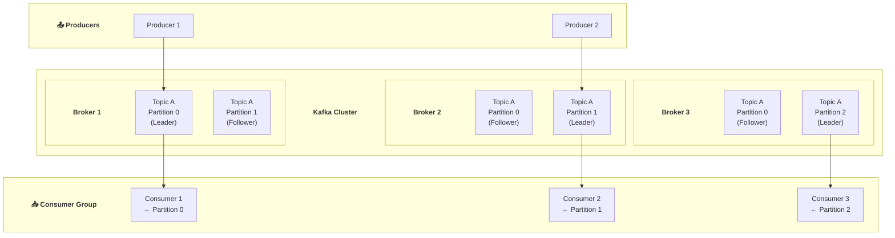

### Log Structure & Offset

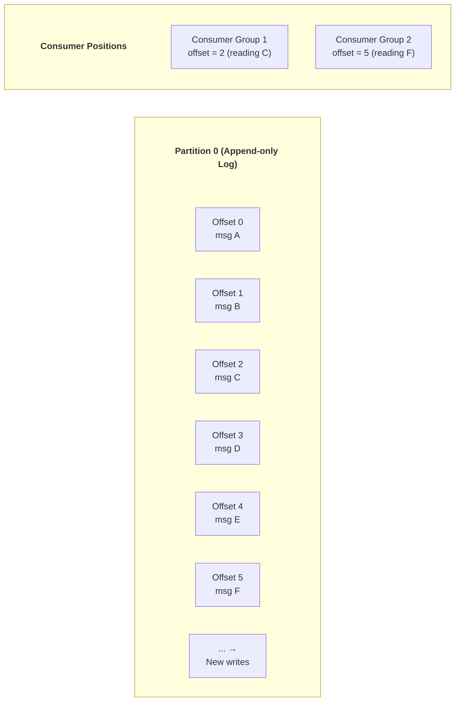

### Key Design Decisions

| Decision | Rationale |
|----------|-----------|
| **Sequential disk I/O** | Faster than random RAM access (page cache) |
| **sendfile() zero-copy** | Kernel sends directly from page cache → NIC |
| **Batching** | Amortize network overhead |
| **Pull-based consumers** | Consumer controls pace (backpressure) |
| **Simple broker** | No per-message state; offset managed by consumer |
| **Partition = parallelism** | More partitions = more consumer parallelism |

### Delivery Guarantees

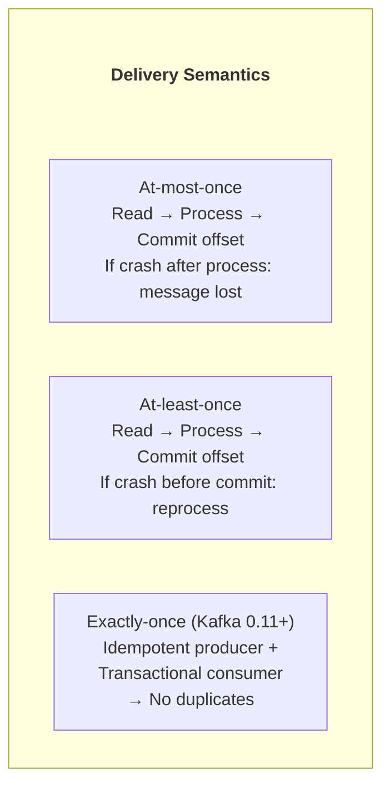

### Impact on Modern Tools
- **Apache Kafka** — De facto standard for event streaming
- **Apache Pulsar** — Next-gen with tiered storage
- **Amazon Kinesis** — AWS managed streaming
- **Azure Event Hubs** — Azure's Kafka-compatible service
- **Redpanda** — Kafka-compatible, C++ implementation
- **Confluent** — Commercial Kafka platform

---

## 2. DATAFLOW MODEL - 2015

### Paper Info
- **Title:** The Dataflow Model: A Practical Approach to Balancing Correctness, Latency, and Cost in Massive-Scale, Unbounded, Out-of-Order Data Processing
- **Authors:** Tyler Akidau, Robert Bradshaw, et al.
- **Conference:** VLDB 2015
- **Link:** https://research.google/pubs/pub43864/
- **PDF:** https://static.googleusercontent.com/media/research.google.com/en//pubs/archive/43864.pdf

### Key Contributions
- Unified batch and streaming model
- Event time vs processing time
- Windowing semantics (fixed, sliding, session)
- Triggers and watermarks
- Accumulation modes

### The Four Questions

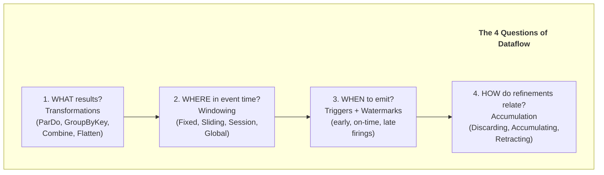

### Windowing Types

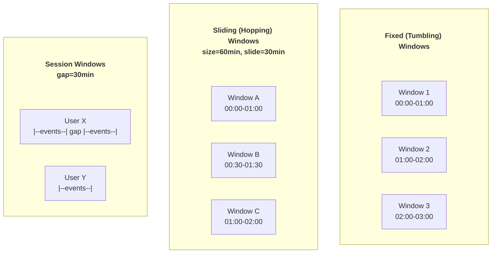

### Watermarks & Late Data

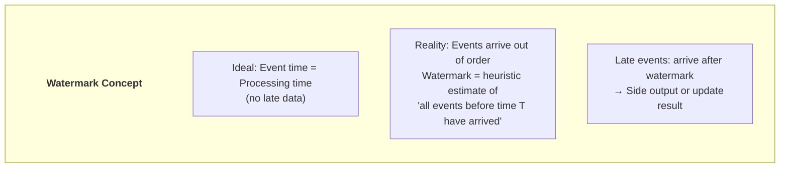

### Triggers & Accumulation

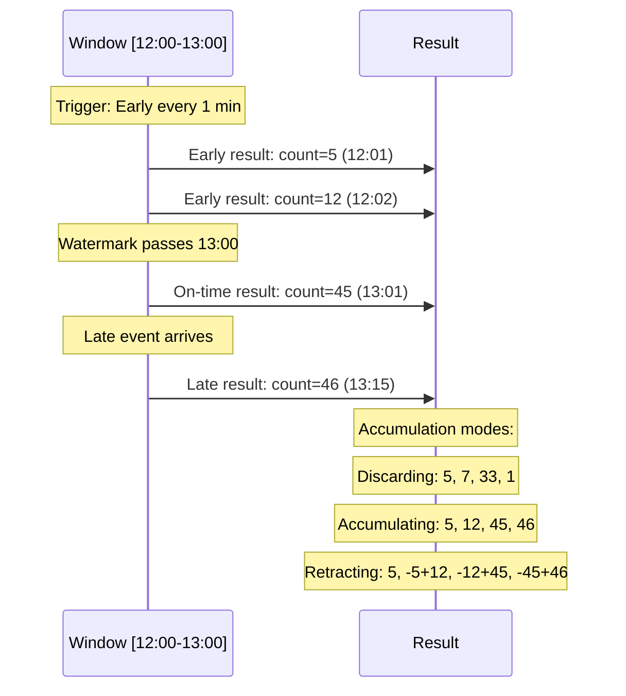

### Beam Code Example

```python
import apache_beam as beam
from apache_beam.transforms.window import FixedWindows
from apache_beam.transforms.trigger import AfterWatermark, AfterCount, AccumulationMode

(
    pipeline
    | "Read" >> beam.io.ReadFromPubSub(topic="events")
    | "Parse" >> beam.Map(parse_event)
    | "Window" >> beam.WindowInto(
        FixedWindows(60),  # 60-second windows
        trigger=AfterWatermark(
            early=AfterCount(10),      # Emit after 10 elements
            late=AfterCount(1)         # Emit per late element
        ),
        accumulation_mode=AccumulationMode.ACCUMULATING,
        allowed_lateness=3600  # Accept 1 hour late
    )
    | "Count" >> beam.CombinePerKey(sum)
    | "Write" >> beam.io.WriteToBigQuery("output_table")
)
```

### Impact on Modern Tools
- **Apache Beam** — Direct implementation of Dataflow model
- **Google Cloud Dataflow** — Managed Beam service
- **Apache Flink** — Adopted many concepts
- **Apache Spark Structured Streaming** — Influenced by Dataflow
- **Kafka Streams** — Window semantics from Dataflow

---

## 3. FLINK (LIGHTWEIGHT ASYNCHRONOUS SNAPSHOTS) - 2015

### Paper Info
- **Title:** Lightweight Asynchronous Snapshots for Distributed Dataflows
- **Authors:** Paris Carbone, Gyula Fóra, Stephan Ewen, et al.
- **Conference:** arXiv 2015
- **Link:** https://arxiv.org/abs/1506.08603
- **PDF:** https://arxiv.org/pdf/1506.08603.pdf

### Key Contributions
- Asynchronous barrier snapshotting (ABS)
- Exactly-once semantics via checkpointing
- Low-overhead distributed snapshots
- Based on Chandy-Lamport algorithm

### Chandy-Lamport vs Flink ABS

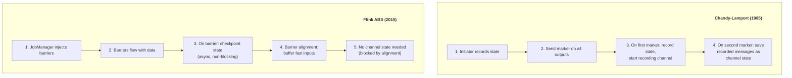

### Barrier Alignment

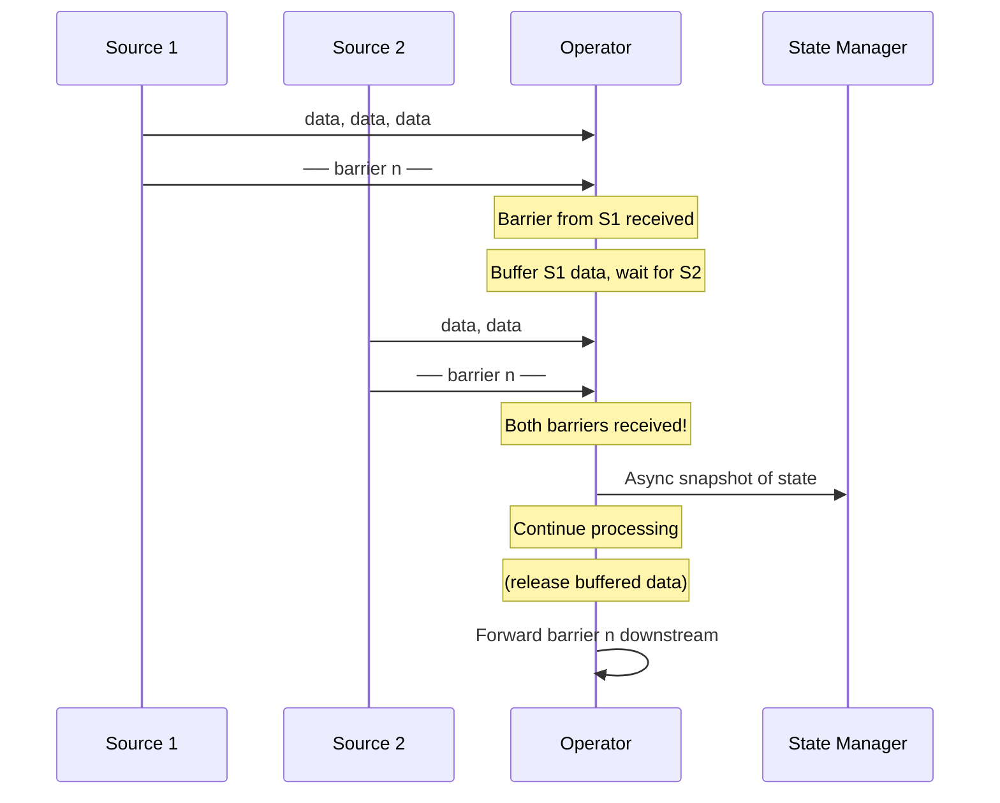

### Unaligned Checkpoints (Flink 1.11+)

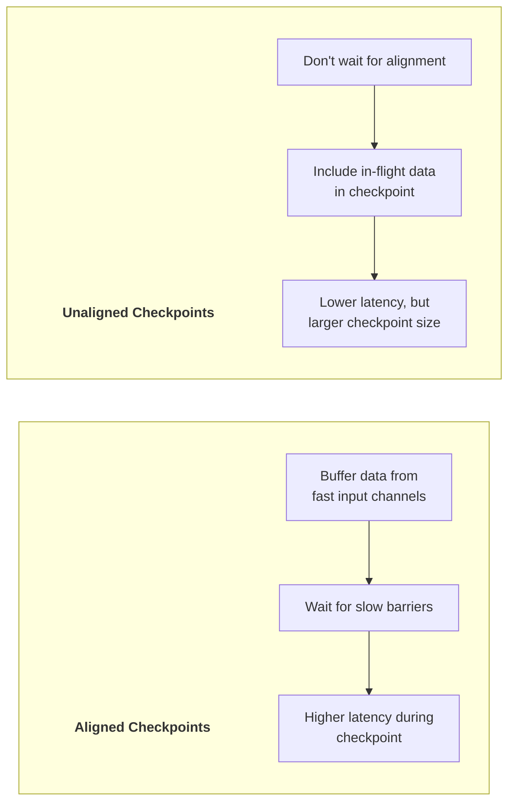

### Recovery Process

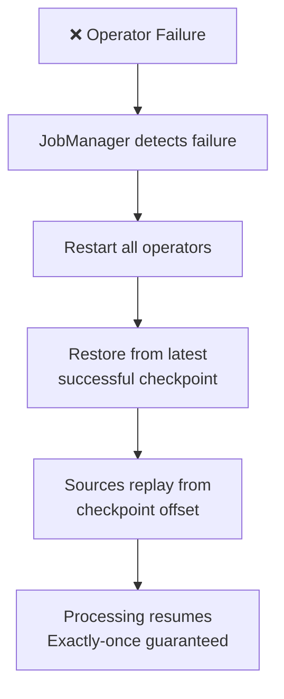

### Impact on Modern Tools
- **Apache Flink** — Core checkpointing mechanism
- **Spark Structured Streaming** — Influenced checkpoint design
- **Standard** — For exactly-once stream processing
- **Flink CDC** — Change data capture using same engine

---

## 4. MILLWHEEL - 2013

### Paper Info
- **Title:** MillWheel: Fault-Tolerant Stream Processing at Internet Scale
- **Authors:** Tyler Akidau, Alex Balikov, et al.
- **Conference:** VLDB 2013
- **Link:** https://research.google/pubs/pub41378/
- **PDF:** https://static.googleusercontent.com/media/research.google.com/en//pubs/archive/41378.pdf

### Key Contributions
- Exactly-once delivery in streaming
- Low watermarks for completeness tracking
- Persistent per-key state
- Timer-based processing

### Architecture

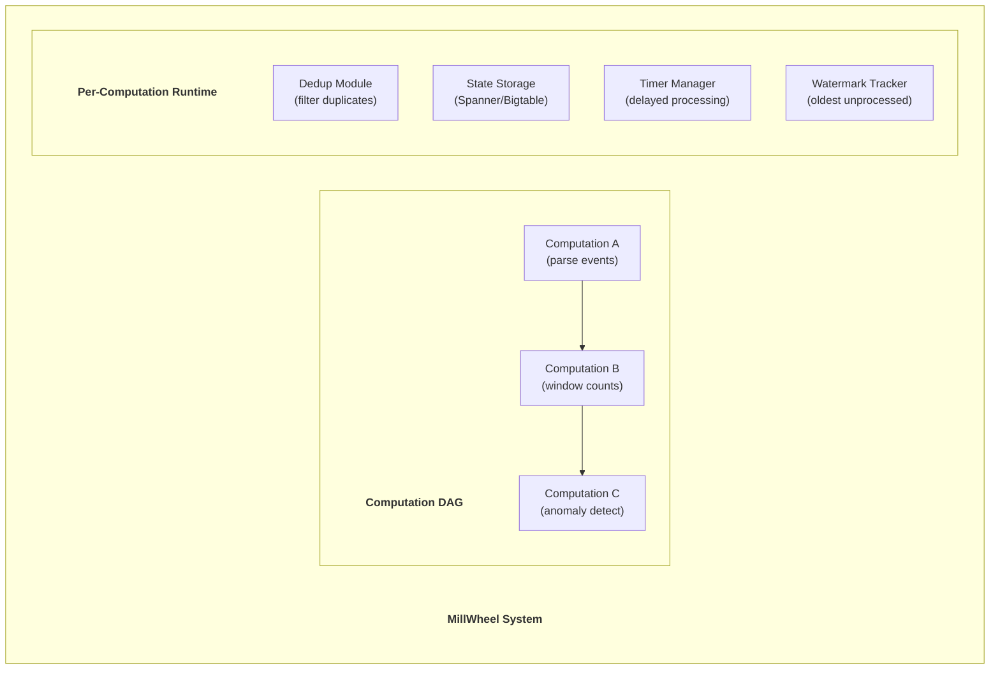

### Exactly-Once Delivery

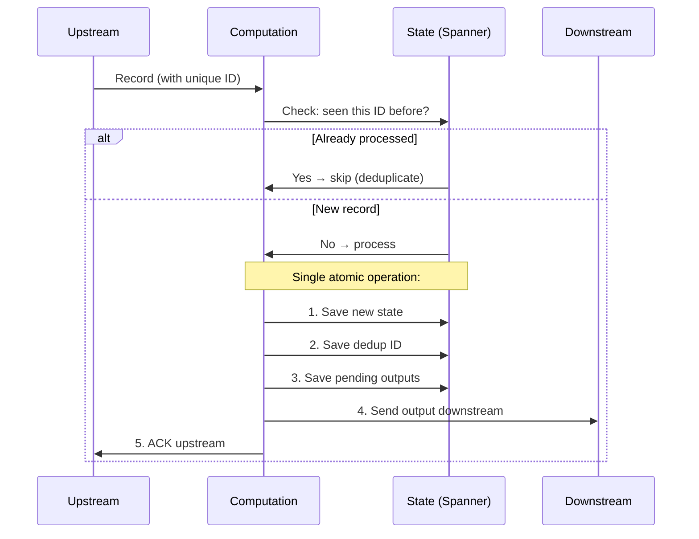

### Low Watermarks

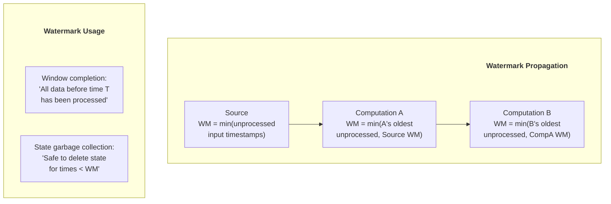

### Use Cases at Google
- **Zeitgeist** — Trending queries detection
- **Billing** — Ad serving revenue computation
- **Abuse detection** — Real-time spam/fraud detection
- **Recommendations** — Real-time personalization

### Impact on Modern Tools
- **Google Cloud Dataflow** — Successor to MillWheel
- **Apache Flink** — Many similar concepts (watermarks, timers)
- **Watermark concept** — Now standard in all streaming systems

---

## 5. STORM - 2014

### Paper Info
- **Title:** Storm @Twitter
- **Authors:** Ankit Toshniwal, Siddarth Taneja, et al.
- **Conference:** SIGMOD 2014
- **Link:** https://dl.acm.org/doi/10.1145/2588555.2595641
- **PDF:** https://cs.brown.edu/courses/cs227/archives/2015/papers/ss-twitter.pdf

### Key Contributions
- First widely-adopted open-source stream processor
- Topology abstraction (spouts/bolts)
- At-least-once processing guarantee
- Nimbus/Supervisor architecture

### Topology Model

```mermaid
graph LR
    subgraph Topology[" "]
        Topology_title["Storm Topology"]
        style Topology_title fill:none,stroke:none,color:#333,font-weight:bold
        Spout1["Spout<br/>(Kafka Reader)"]
        Spout2["Spout<br/>(Twitter API)"]
        
        Bolt1["Bolt: Parse<br/>(extract fields)"]
        Bolt2["Bolt: Filter<br/>(remove noise)"]
        Bolt3["Bolt: Count<br/>(word count)"]
        Bolt4["Bolt: Aggregate<br/>(top-N)"]
        Bolt5["Bolt: Store<br/>(write to DB)"]
        
        Spout1 -->|shuffle| Bolt1
        Spout2 -->|shuffle| Bolt1
        Bolt1 -->|fields(word)| Bolt3
        Bolt1 -->|shuffle| Bolt2
        Bolt2 -->|shuffle| Bolt4
        Bolt3 -->|fields(word)| Bolt4
        Bolt4 -->|global| Bolt5
    end
```

### Stream Groupings

| Grouping | Description | Use Case |
|----------|-------------|----------|
| **Shuffle** | Random distribution | Stateless processing |
| **Fields** | Hash by field value | Stateful (count per key) |
| **All** | Broadcast to all bolts | Config updates |
| **Global** | Single bolt receives all | Final aggregation |
| **Direct** | Sender chooses target | Custom routing |
| **Local/Shuffle** | Prefer same worker | Reduce network |

### Architecture

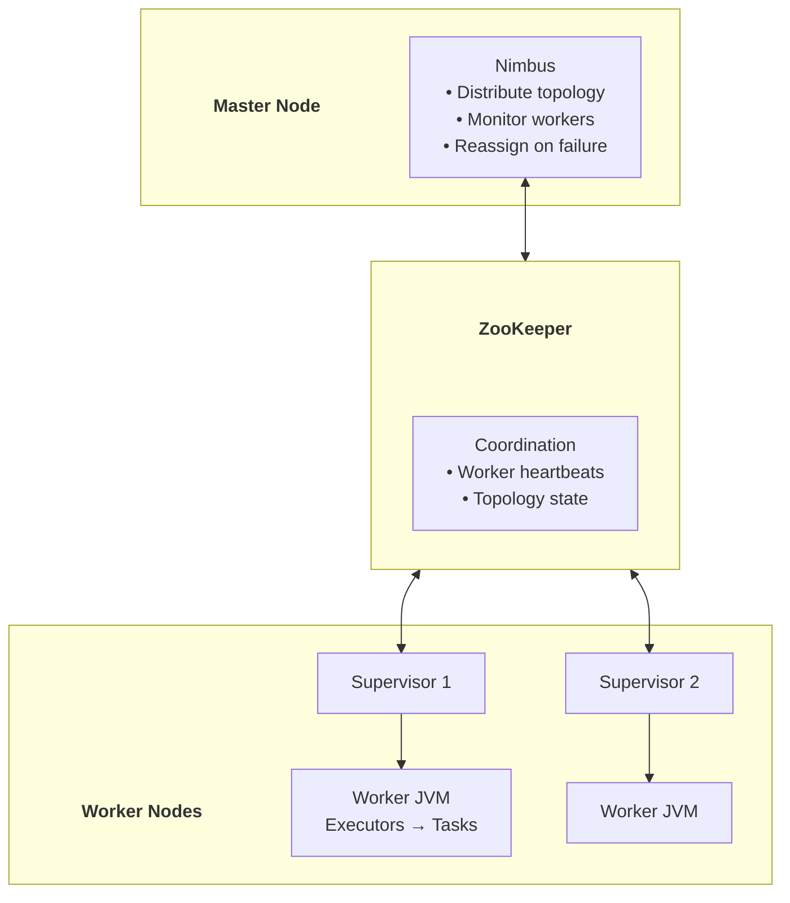

### Impact on Modern Tools
- **Apache Storm** — Original implementation (now maintenance mode)
- **Twitter Heron** — Storm successor (better performance)
- Pioneered real-time processing for industry
- Largely replaced by Flink and Spark Structured Streaming

---

## 6. SPARK STREAMING - 2013

### Paper Info
- **Title:** Discretized Streams: Fault-Tolerant Streaming Computation at Scale
- **Authors:** Matei Zaharia, Tathagata Das, et al.
- **Conference:** SOSP 2013
- **Link:** https://www.usenix.org/conference/nsdi12/technical-sessions/presentation/zaharia
- **PDF:** https://people.csail.mit.edu/matei/papers/2013/sosp_spark_streaming.pdf

### Key Contributions
- Micro-batch streaming model (D-Streams)
- RDD lineage for fault tolerance
- Unified batch and streaming API
- Stateful operators with checkpointing

### Micro-Batch Model

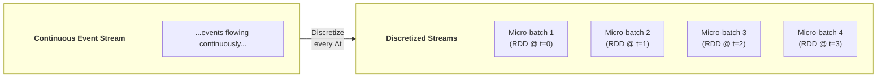

### Fault Tolerance via Lineage

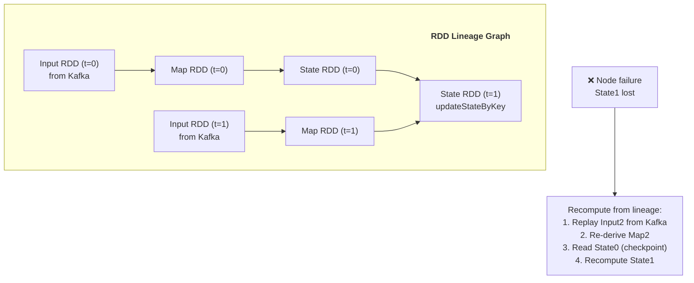

### Trade-offs: Micro-batch vs True Streaming

| Aspect | Micro-batch (Spark) | True Streaming (Flink) |
|--------|-------------------|---------------------|
| **Latency** | 100ms-seconds | Milliseconds |
| **Throughput** | Very high (batching) | High |
| **Fault tolerance** | Simple (RDD lineage) | Complex (checkpoints) |
| **API** | Same as batch Spark | Separate stream API |
| **Exactly-once** | Easy | Harder |
| **State management** | External | Built-in |

### Evolution: DStreams → Structured Streaming

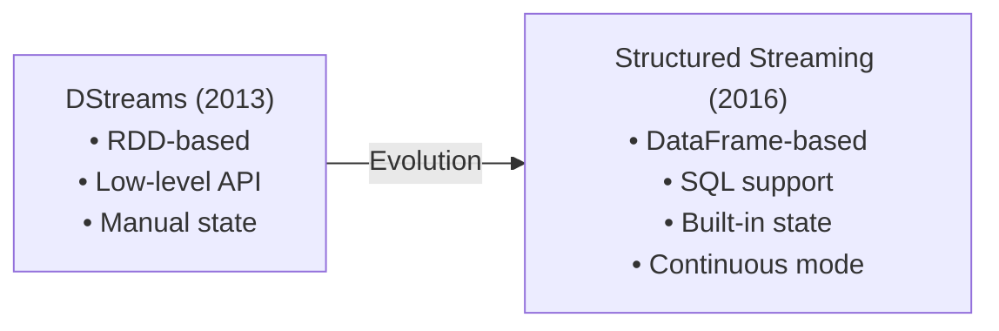

### Impact on Modern Tools
- **Spark Streaming (DStreams)** — Original micro-batch API (legacy)
- **Spark Structured Streaming** — SQL-based evolution (active)
- Micro-batch model: simple but higher latency trade-off

---

## 7. SAMZA - 2017

### Paper Info
- **Title:** Samza: Stateful Scalable Stream Processing at LinkedIn
- **Authors:** Shadi A. Noghabi, Kartik Paramasivam, et al.
- **Conference:** VLDB 2017
- **Link:** https://www.vldb.org/pvldb/vol10/p1634-noghabi.pdf
- **PDF:** https://www.vldb.org/pvldb/vol10/p1634-noghabi.pdf

### Key Contributions
- Kafka-native stream processing
- Local state with RocksDB
- Changelog-based fault tolerance
- Host affinity for state locality

### Architecture

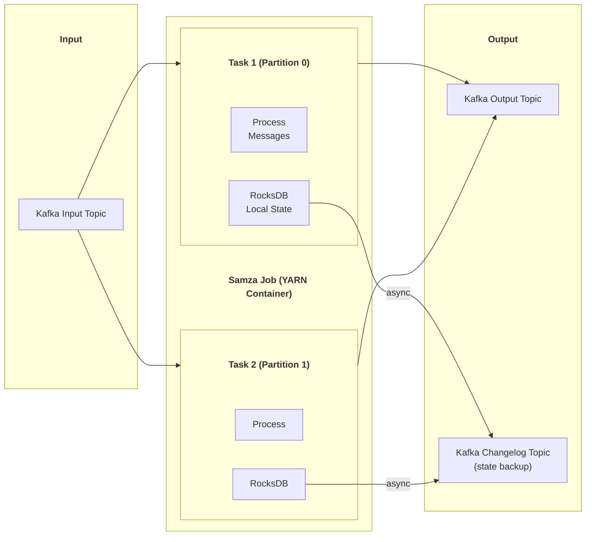

### State Recovery

```mermaid
sequenceDiagram
    participant T as Task (Failed)
    participant CL as Changelog Topic
    participant NT as New Task Instance

    Note over T: Task crashes!
    Note over NT: New task started (preferably same host)
    
    alt Same Host (Host Affinity)
        NT->>NT: RocksDB still on disk
        NT->>CL: Replay only recent changelog
        Note over NT: Fast recovery (~seconds)
    else Different Host
        NT->>CL: Replay full changelog
        NT->>NT: Rebuild RocksDB from scratch
        Note over NT: Slower recovery (~minutes)
    end
    
    NT->>NT: Resume processing
```

### Impact on Modern Tools
- **Apache Samza** — LinkedIn's stream processor
- **Kafka Streams** — Adopted changelog pattern
- Influenced stateful streaming designs

---

## 8. KAFKA STREAMS - 2016

### Paper Info
- **Title:** Kafka Streams (Confluent Documentation & Design)
- **Authors:** Confluent Engineering
- **Source:** Confluent Blog & Documentation
- **Link:** https://www.confluent.io/blog/introducing-kafka-streams-stream-processing-made-simple/
- **Design Docs:** https://cwiki.apache.org/confluence/display/KAFKA/Kafka+Streams

### Key Contributions
- Library-based stream processing (no separate cluster)
- Kafka-native (input, output, state all in Kafka)
- Exactly-once with Kafka transactions
- KStream and KTable abstractions

### KStream vs KTable

```mermaid
graph TB
    subgraph KStream[" "]
        KStream_title["KStream (Event Stream)"]
        style KStream_title fill:none,stroke:none,color:#333,font-weight:bold
        direction LR
        KS1["(key=A, val=1)"]
        KS2["(key=B, val=2)"]
        KS3["(key=A, val=3)"]
        KS4["(key=A, val=5)"]
    end
    
    subgraph KTable[" "]
        KTable_title["KTable (Changelog → latest state)"]
        style KTable_title fill:none,stroke:none,color:#333,font-weight:bold
        KT["Key | Value<br/>----|------<br/>A   | 5  (latest)<br/>B   | 2"]
    end

    KStream -->|"Aggregate/<br/>reduce"| KTable
    KTable -->|"toStream()"| KStream
```

### Architecture: Library, Not Cluster

```mermaid
graph TB
    subgraph App1[" "]
        App1_title["Application Instance 1"]
        style App1_title fill:none,stroke:none,color:#333,font-weight:bold
        KS1["Kafka Streams Library<br/>Tasks: P0, P1"]
        RS1["RocksDB State Store"]
    end

    subgraph App2[" "]
        App2_title["Application Instance 2"]
        style App2_title fill:none,stroke:none,color:#333,font-weight:bold
        KS2["Kafka Streams Library<br/>Tasks: P2, P3"]
        RS2["RocksDB State Store"]
    end

    subgraph Kafka[" "]
        Kafka_title["Kafka Cluster"]
        style Kafka_title fill:none,stroke:none,color:#333,font-weight:bold
        Input["Input Topic<br/>(4 partitions)"]
        Output["Output Topic"]
        CL["Changelog Topic<br/>(state backup)"]
    end

    Input -->|"P0, P1"| KS1
    Input -->|"P2, P3"| KS2
    KS1 --> Output
    KS2 --> Output
    RS1 -->|"async"| CL
    RS2 -->|"async"| CL
```

### Exactly-Once Semantics

```mermaid
sequenceDiagram
    participant KS as Kafka Streams Task
    participant KB as Kafka Broker

    KS->>KB: init_transactions()
    
    loop For each batch
        KS->>KB: begin_transaction()
        KS->>KB: produce(output_records)
        KS->>KB: produce(changelog_records)
        KS->>KB: send_offsets_to_transaction(consumer_offsets)
        KS->>KB: commit_transaction()
        Note over KS,KB: All or nothing:<br/>output + state + offsets<br/>atomically committed
    end
```

### Processor Topology

```java
StreamsBuilder builder = new StreamsBuilder();

// KStream: event stream
KStream<String, String> source = builder.stream("input-topic");

// Processing pipeline
source
    .filter((key, value) -> value != null)
    .mapValues(value -> value.toUpperCase())
    .groupByKey()
    .windowedBy(TimeWindows.ofSizeWithNoGrace(Duration.ofMinutes(5)))
    .count()
    .toStream()
    .to("output-topic");
```

### Impact on Modern Tools
- **Kafka Streams** — Embedded stream processing in any JVM app
- **ksqlDB** — SQL layer on Kafka Streams
- Pattern: stream processing as library (no separate cluster)

---

## 9. ONE SQL TO RULE THEM ALL - 2019

### Paper Info
- **Title:** One SQL to Rule Them All (Apache Calcite)
- **Authors:** Edmon Begoli, Jesús Camacho-Rodríguez, et al.
- **Conference:** SIGMOD 2019
- **Link:** https://dl.acm.org/doi/10.1145/3299869.3314040
- **PDF:** https://arxiv.org/pdf/1905.12133.pdf

### Key Contributions
- Streaming SQL extensions
- Time-varying relations
- Stream-table duality
- Unified query semantics for batch + streaming

### Time-Varying Relations

```mermaid
graph TB
    subgraph TVR[" "]
        TVR_title["Time-Varying Relation"]
        style TVR_title fill:none,stroke:none,color:#333,font-weight:bold
        T1["t=10: {(1,'a'), (2,'b')}"]
        T2["t=20: {(1,'a'), (2,'b'), (3,'c')} ← INSERT"]
        T3["t=30: {(1,'a'), (2,'x'), (3,'c')} ← UPDATE"]
        T4["t=40: {(1,'a'), (3,'c')} ← DELETE"]
        
        T1 --> T2 --> T3 --> T4
    end

    subgraph Duality[" "]
        Duality_title["Stream ↔ Table Duality"]
        style Duality_title fill:none,stroke:none,color:#333,font-weight:bold
        Stream["Stream<br/>(append-only changes)"]
        Table["Table<br/>(point-in-time snapshot)"]
        
        Stream -->|"Aggregate<br/>over time"| Table
        Table -->|"Emit<br/>changes"| Stream
    end
```

### Streaming SQL Syntax

```sql
-- Fixed (tumbling) window
SELECT
    user_id,
    TUMBLE_START(event_time, INTERVAL '1' HOUR) AS window_start,
    COUNT(*) AS click_count
FROM clicks
GROUP BY
    user_id,
    TUMBLE(event_time, INTERVAL '1' HOUR);

-- Sliding (hopping) window
SELECT
    user_id,
    HOP_START(event_time, INTERVAL '5' MINUTE, INTERVAL '1' HOUR) AS window_start,
    AVG(duration) AS avg_duration
FROM sessions
GROUP BY
    user_id,
    HOP(event_time, INTERVAL '5' MINUTE, INTERVAL '1' HOUR);

-- Session window
SELECT
    user_id,
    SESSION_START(event_time, INTERVAL '30' MINUTE) AS session_start,
    COUNT(*) AS event_count
FROM events
GROUP BY
    user_id,
    SESSION(event_time, INTERVAL '30' MINUTE);

-- Stream-table join
SELECT
    e.user_id,
    e.event_type,
    u.name,
    u.tier
FROM events e
JOIN users_table FOR SYSTEM_TIME AS OF e.event_time u
    ON e.user_id = u.user_id;
```

### Impact on Modern Tools
- **Apache Calcite** — Query planning framework (used by many)
- **Apache Flink SQL** — Streaming SQL implementation
- **ksqlDB** — Kafka-native streaming SQL
- **Spark Structured Streaming SQL** — Spark's implementation
- Standard for streaming SQL syntax

---

## 10. TỔNG KẾT & EVOLUTION

### Timeline

```mermaid
timeline
    title Stream Processing Papers Evolution
    2011 : Kafka (LinkedIn)
         : Distributed commit log
    2013 : MillWheel (Google)
         : Exactly-once streaming
         : Spark Streaming (Berkeley)
         : Micro-batch model
    2014 : Storm @Twitter
         : First open-source stream processor
    2015 : Dataflow Model (Google)
         : Unified batch+streaming
         : Flink ABS Snapshots
         : Lightweight checkpointing
    2016 : Kafka Streams (Confluent)
         : Library-based processing
    2017 : Samza (LinkedIn)
         : Kafka-native stateful
    2019 : Streaming SQL (Calcite)
         : One SQL to Rule Them All
```

### Evolution of Processing Guarantees

```mermaid
graph LR
    AtMost["At-most-once<br/>(Storm, early Kafka)"]
    AtLeast["At-least-once<br/>(Storm, Samza)"]
    Exactly["Exactly-once<br/>(Flink, Kafka 0.11+,<br/>Dataflow, Spark)"]
    
    AtMost -->|"2011-2013"| AtLeast
    AtLeast -->|"2013-2016"| Exactly
```

### Comparison of All Systems

| System | Model | Latency | Guarantee | State | API |
|--------|-------|---------|-----------|-------|-----|
| **Kafka** | Message bus | ~1ms | Exactly-once (0.11+) | — | Producer/Consumer |
| **Storm** | Record-by-record | Low | At-least-once | Bolt state | Spout/Bolt |
| **Spark Streaming** | Micro-batch | 100ms+ | Exactly-once | RDD state | DStream/SQL |
| **MillWheel** | Record-by-record | Low | Exactly-once | Spanner | Computation |
| **Flink** | Record-by-record | Low | Exactly-once | RocksDB | DataStream/SQL |
| **Samza** | Record-by-record | Low | At-least-once | RocksDB | Task |
| **Kafka Streams** | Record-by-record | Low | Exactly-once | RocksDB | KStream/KTable |
| **Beam/Dataflow** | Unified | Varies | Exactly-once | Runner | PCollection |

### Key Concepts Introduced by Each Paper

```mermaid
graph TB
    subgraph Concepts[" "]
        Concepts_title["Lasting Contributions"]
        style Concepts_title fill:none,stroke:none,color:#333,font-weight:bold
        Kafka["Kafka: Commit log<br/>as universal data backbone"]
        Mill["MillWheel: Watermarks<br/>and exactly-once"]
        DF["Dataflow: The 4 Questions<br/>What/Where/When/How"]
        Flink["Flink: ABS checkpointing<br/>for fault tolerance"]
        KS["Kafka Streams: Stream<br/>processing as a library"]
        SQL["Streaming SQL: Unified<br/>batch + stream SQL"]
    end
```

---

## 📦 Verified Resources

| Resource | Link | Note |
|----------|------|------|
| Streaming Systems Book | [oreilly.com](https://www.oreilly.com/library/view/streaming-systems/9781491983867/) | Tyler Akidau et al. |
| Kafka: The Definitive Guide | [confluent.io](https://www.confluent.io/resources/kafka-the-definitive-guide-v2/) | Free ebook |
| Flink Documentation | [flink.apache.org](https://flink.apache.org/docs/) | Official docs |
| Beam Programming Guide | [beam.apache.org](https://beam.apache.org/documentation/programming-guide/) | Dataflow implementation |
| Papers We Love | [papers-we-love/papers-we-love](https://github.com/papers-we-love/papers-we-love) | 90k⭐ Paper discussions |

---

## 🔗 Liên Kết Nội Bộ

- [[01_Distributed_Systems_Papers|Distributed Systems Papers]] — Foundation papers
- [[../tools/05_Apache_Kafka_Complete_Guide|Apache Kafka]] — Kafka deep dive
- [[../tools/04_Apache_Flink_Complete_Guide|Apache Flink]] — Flink deep dive
- [[../fundamentals/07_Batch_vs_Streaming|Batch vs Streaming]] — Processing patterns
- [[../tools/06_Apache_Spark_Complete_Guide|Apache Spark]] — Spark Streaming

---

*Document Version: 2.0*
*Last Updated: February 2026*
*Coverage: Kafka, Dataflow, Flink ABS, MillWheel, Storm, Spark Streaming, Samza, Kafka Streams, Streaming SQL*
