# Data Warehouse & Analytics Foundational Papers

## Những Paper Nền Tảng Cho Data Warehousing và Columnar Storage

---

## 📋 Mục Lục

1. [Kimball Toolkit](#1-the-data-warehouse-toolkit-kimball---1996)
2. [Inmon Data Warehouse](#2-building-the-data-warehouse-inmon---1992)
3. [C-Store](#3-c-store-a-column-oriented-dbms---2005)
4. [MonetDB/X100](#4-monetdbx100---2005)
5. [Data Vault](#5-data-vault-modeling---2000s)
6. [Amazon Redshift](#6-amazon-redshift---2012)
7. [Snowflake](#7-snowflake-elastic-data-warehouse---2016)
8. [Spark SQL](#8-spark-sql---2015)
9. [Presto (Trino)](#9-presto-trino---2019)
10. [Apache Arrow](#10-apache-arrow---2016)
11. [Tổng Kết](#11-tổng-kết--evolution)

---

## 1. THE DATA WAREHOUSE TOOLKIT (Kimball) - 1996

### Book/Paper Info
- **Title:** The Data Warehouse Toolkit: Practical Techniques for Building Dimensional Data Warehouses
- **Author:** Ralph Kimball
- **Publisher:** Wiley, 1996 (First Edition)
- **Link:** https://www.kimballgroup.com/data-warehouse-business-intelligence-resources/books/

### Key Contributions
- Dimensional modeling methodology
- Star and snowflake schemas
- Slowly Changing Dimensions (SCD)
- Conformed dimensions
- Bus architecture

### Star Schema

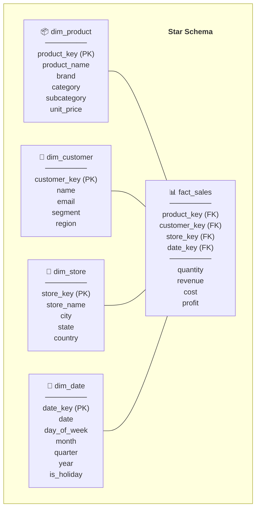

### Fact Table Types

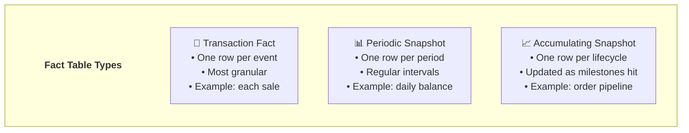

### Slowly Changing Dimensions (SCD)

| SCD Type | Strategy | History | Example |
|----------|----------|---------|---------|
| **Type 0** | Retain original | No | Date of birth |
| **Type 1** | Overwrite | No | Fix typo in name |
| **Type 2** | New row + versioning | Full | Address change |
| **Type 3** | New column | Limited (prev/curr) | Category reclassification |
| **Type 4** | Mini-dimension | Rapid changes | Customer demographics |
| **Type 6** | Hybrid 1+2+3 | Full + current | Complex tracking |

### SCD Type 2 Example

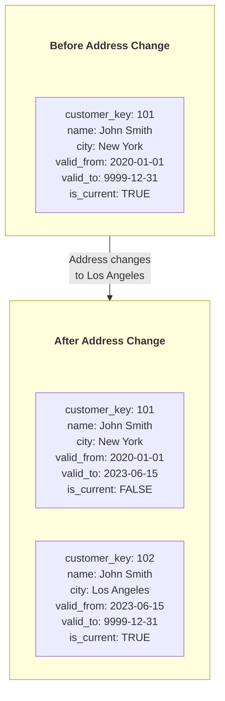

### Impact on Modern Tools
- **All data warehouses** — Snowflake, Redshift, BigQuery use dimensional models
- **dbt** — Dimensional modeling with SQL + snapshots for SCD2
- **Industry standard** — For BI and analytics

### Limitations & Evolution (Sự thật phũ phàng)
- Kimball scale tốt cho BI nhưng dễ tạo **semantic drift** khi mỗi team tự làm mart.
- SCD2 đúng lịch sử nhưng tăng storage + join complexity theo thời gian.
- **Evolution:** metrics layer, semantic models tập trung và data contracts để giữ nghĩa business nhất quán.

### War Stories & Troubleshooting
- Lỗi phổ biến: dimension duplicate key do ETL retry không idempotent.
- Fix nhanh: dùng natural key + hash diff, `MERGE` idempotent, thêm unique test ở CI.

### Metrics & Order of Magnitude
- Star schema thường giảm độ phức tạp query BI từ nhiều join 3NF xuống 1 fact + vài dim.
- SCD2 có thể tăng số bản ghi dim theo bậc nhiều lần sau 1-2 năm.
- Snapshot fact table thường chiếm phần lớn storage ở workload dashboard lịch sử.

### Micro-Lab
```sql
-- Detect duplicate business key trong dimension
SELECT customer_id, COUNT(*) c
FROM dim_customer
GROUP BY customer_id
HAVING COUNT(*) > 1;

-- Kiểm tra SCD2 current row uniqueness
SELECT customer_id
FROM dim_customer
WHERE is_current = TRUE
GROUP BY customer_id
HAVING COUNT(*) > 1;
```

---

## 2. BUILDING THE DATA WAREHOUSE (Inmon) - 1992

### Book/Paper Info
- **Title:** Building the Data Warehouse
- **Author:** Bill Inmon
- **Publisher:** Wiley, 1992 (First Edition)
- **Link:** https://www.wiley.com/en-us/Building+the+Data+Warehouse-p-9780471141617

### Key Contributions
- Data warehouse definition: Subject-oriented, Integrated, Time-variant, Non-volatile
- Corporate Information Factory (CIF)
- Enterprise Data Warehouse (EDW)
- Top-down methodology

### Inmon Architecture

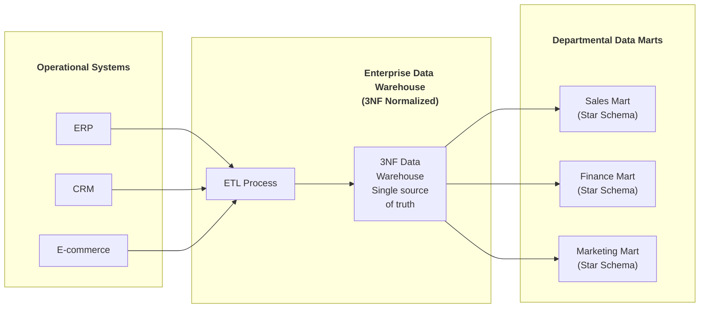

### Inmon vs Kimball

| Aspect | Inmon (Top-Down) | Kimball (Bottom-Up) |
|--------|-----------------|-------------------|
| **Approach** | Build EDW first → Data Marts | Build Data Marts → integrate |
| **EDW Schema** | 3NF (normalized) | Dimensional (star/snowflake) |
| **Data Marts** | Derived from EDW | Conformed dimensions |
| **Build Time** | Longer (full EDW first) | Faster (mart by mart) |
| **Maintenance** | Easier (single source) | Harder (many marts) |
| **Query** | Complex joins | Simple star joins |
| **Best For** | Large enterprise | Agile, smaller teams |

### Impact on Modern Tools
- **Enterprise data warehouses** — Traditional approach
- **Data Vault** — Evolution of Inmon ideas
- **Modern Lakehouse** — Hybrid approaches combine both

### Limitations & Evolution (Sự thật phũ phàng)
- 3NF EDW cho governance mạnh nhưng **time-to-value chậm** với team nhỏ.
- Query analytics ad-hoc thường nặng join, khó đạt UX BI tốt nếu thiếu marts.
- **Evolution:** hybrid architecture (raw normalized core + serving marts/lakehouse semantic layer).

### War Stories & Troubleshooting
- Lỗi phổ biến: ETL bottleneck do phụ thuộc chuỗi dài từ source → EDW → mart.
- Fix nhanh: tách pipeline theo domain, incremental load, CDC cho bảng lớn.

### Metrics & Order of Magnitude
- Top-down EDW thường có lead time triển khai dài hơn nhiều so với mart-first.
- Query latency trên 3NF có thể cao hơn đáng kể so với star schema cho dashboard.
- CDC incremental thường giảm dữ liệu scan mỗi run theo bậc 10-100x so với full reload.

### Micro-Lab
```sql
-- So sánh đơn giản: row count raw -> edw -> mart
SELECT 'raw_orders' AS t, COUNT(*) FROM raw.orders
UNION ALL
SELECT 'edw_orders', COUNT(*) FROM edw.orders
UNION ALL
SELECT 'mart_sales', COUNT(*) FROM mart.sales;
```


---

> 💡 **Gemini Feedback**
> **Góc nhìn Thực chiến (Senior to Junior)**
> _(Có thể gộp chung góc nhìn cho 2 ông tổ ngành Data Modeling này)_
 

1. **Limitations & Evolution (Sự thật phũ phàng):** Mô hình Star Schema của Kimball cực kỳ tuyệt vời cho BI Dashboard truyền thống. Nhưng trong kỷ nguyên Cloud Data Warehouse (như BigQuery, Snowflake), việc `JOIN` hàng chục bảng Dimension với Fact lại tốn nhiều compute (CPU) hơn là lưu trữ. Xu hướng hiện tại là **OBT (One Big Table)** - phi chuẩn hóa hoàn toàn (Denormalized) thành một bảng khổng lồ chứa mọi cột, tận dụng định dạng Columnar để quét với tốc độ bàn thờ thay vì tốn tiền chạy phép `JOIN`.

2. **War Stories & Troubleshooting:** Cơn ác mộng **SCD Type 2 (Slowly Changing Dimensions)**. Junior thiết kế bảng lưu lịch sử thay đổi của User với cột `valid_from` và `valid_to`. Sau 1 năm, bảng phình to từ 1 triệu lên 100 triệu dòng vì các thay đổi vặt vãnh. Khi query lấy "trạng thái hiện tại", vì quên gắn index hoặc partition trên cờ `is_current = TRUE`, câu query quét sạch 100 triệu dòng và báo lỗi Timeout.

3. **Metrics & Order of Magnitude:** Storage trên Cloud (S3/GCS) giá chỉ khoảng $23/TB/tháng, cực kỳ rẻ. Nhưng Compute thì tính bằng giây và rất đắt. Do đó, thà lặp lại dữ liệu (Data redundancy) để đỡ tốn compute khi đọc, còn hơn là thiết kế chuẩn hóa (3NF) cực đẹp rồi trả tiền tỷ cho hóa đơn CPU.

4. **Micro-Lab:** Thử sức viết một câu query lấy trạng thái mới nhất của SCD Type 2 kinh điển: `SELECT * FROM dim_user WHERE current_date BETWEEN valid_from AND valid_to;`

---

## 3. C-STORE: A COLUMN-ORIENTED DBMS - 2005

### Paper Info
- **Title:** C-Store: A Column-oriented DBMS
- **Authors:** Mike Stonebraker, Daniel J. Abadi, et al.
- **Conference:** VLDB 2005
- **Link:** https://dl.acm.org/doi/10.5555/1083592.1083658
- **PDF:** http://db.csail.mit.edu/projects/cstore/vldb.pdf

### Key Contributions
- Column-oriented storage architecture
- Read-optimized store (RS) + Write store (WS)
- Projection-based storage
- Tuple mover between WS and RS

### Row vs Column Storage

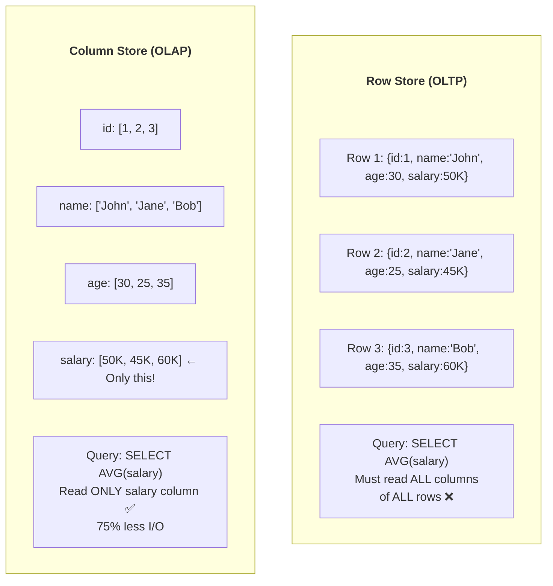

### C-Store Architecture

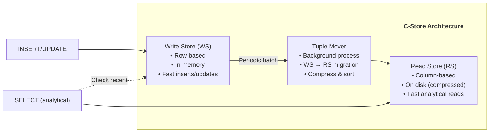

### Column Compression Techniques

| Technique | Best For | Example |
|-----------|----------|---------|
| **Run-Length Encoding** | Sorted, repeated values | [A,A,A,B,B] → [(A,3),(B,2)] |
| **Dictionary** | Low cardinality | ['red','blue','red'] → {0:'red',1:'blue'} → [0,1,0] |
| **Bit-packing** | Small integers | Values 0-15 → 4 bits each |
| **Delta encoding** | Sorted sequences | [100,101,103,106] → [100,1,2,3] |
| **Null suppression** | Sparse data | Skip null storage |

### Impact on Modern Tools
- **Vertica** — Commercial C-Store (Stonebraker founded)
- **Amazon Redshift** — Based on ParAccel (C-Store influenced)
- **All columnar DBs** — Snowflake, BigQuery, ClickHouse
- **Parquet, ORC** — Columnar file formats

### Limitations & Evolution (Sự thật phũ phàng)
- Write path phức tạp do cần cân bằng read-store/write-store + compaction.
- Workload update-heavy sẽ chịu write amplification cao.
- **Evolution:** MPP cloud warehouses + automatic clustering/compaction.

### War Stories & Troubleshooting
- Lỗi phổ biến: table bloat/small files sau nhiều upsert batch nhỏ.
- Fix nhanh: gom batch lớn hơn, chạy compaction định kỳ, enforce target file size.

### Metrics & Order of Magnitude
- Columnar scan cho query chỉ vài cột thường tiết kiệm I/O theo bậc lớn so với row store.
- Compression ratio cột low-cardinality thường cao hơn rõ rệt.
- Read-heavy OLAP thường được lợi lớn nhất, còn write-heavy thì trade-off mạnh.

### Micro-Lab
```sql
-- So sánh bytes scanned giữa SELECT * và chỉ cột cần thiết
EXPLAIN SELECT * FROM sales;
EXPLAIN SELECT revenue FROM sales;
```

---

## 4. MONETDB/X100 - 2005

### Paper Info
- **Title:** MonetDB/X100: Hyper-Pipelining Query Execution
- **Authors:** Peter Boncz, Marcin Zukowski, Niels Nes
- **Conference:** CIDR 2005
- **Link:** https://www.cidrdb.org/cidr2005/papers/P19.pdf

### Key Contributions
- Vectorized query execution
- CPU cache optimization
- Batch processing for modern CPUs
- Eliminate interpretation overhead

### Tuple-at-a-time vs Vectorized

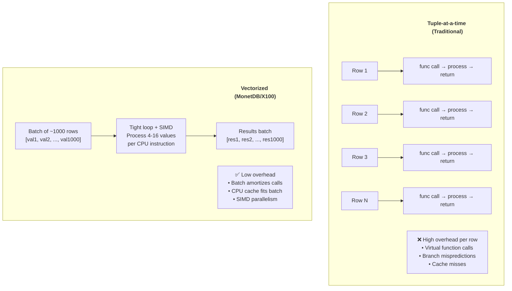

### Why Vectorization Works

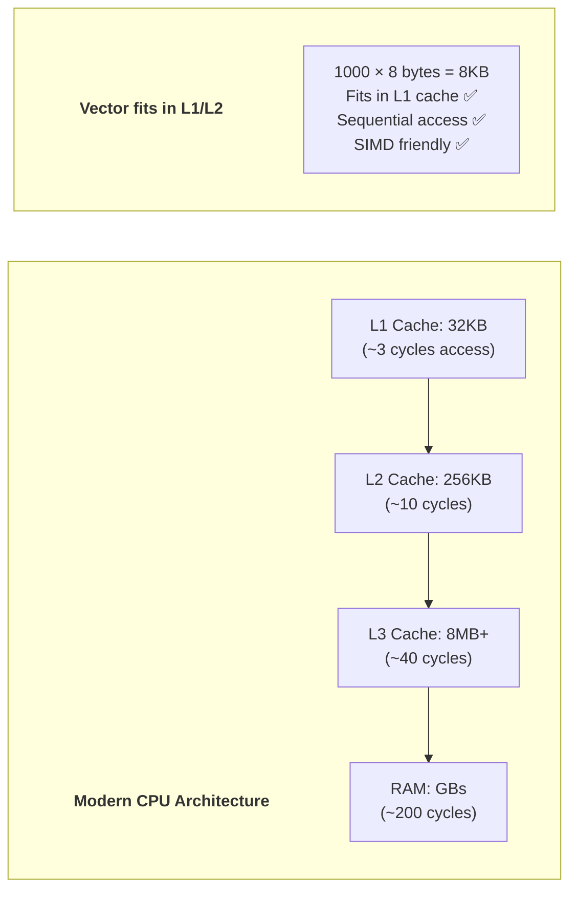

### Impact on Modern Tools
- **DuckDB** — Direct descendant, in-process OLAP vectorized engine
- **ClickHouse** — Vectorized execution engine
- **Apache Arrow** — Columnar format designed for vectorized processing
- **Velox (Meta)** — Vectorized execution library
- **All modern OLAP** — Vectorized processing is now standard

### Limitations & Evolution (Sự thật phũ phàng)
- Vectorization mạnh cho analytics nhưng không tự giải quyết tối ưu join skew/distribution.
- Batch size tuning sai có thể làm cache miss tăng thay vì giảm.
- **Evolution:** vectorized + codegen hybrid engines (Photon, Velox, DuckDB internals).

### War Stories & Troubleshooting
- Lỗi phổ biến: CPU cao nhưng throughput không tăng vì batch size không phù hợp.
- Fix nhanh: tune vector size, bật profile operator-level, kiểm tra memory locality/NUMA.

### Metrics & Order of Magnitude
- Vectorized execution thường giảm function-call overhead theo bậc đáng kể.
- SIMD-friendly workloads có thể tăng throughput nhiều lần so với tuple-at-a-time.
- Tail latency vẫn phụ thuộc join strategy và data skew.

### Micro-Lab
```python
import duckdb, time
con = duckdb.connect()
con.execute("CREATE TABLE t AS SELECT i AS x, i%100 AS g FROM range(5000000) t(i)")
t0=time.time(); con.execute("SELECT g, SUM(x) FROM t GROUP BY g").fetchall(); print(round(time.time()-t0,2),"s")
```


---
> 💡 **Gemini Feedback**
> **Góc nhìn Thực chiến (Senior to Junior)**
>_(Columnar & Vectorized Execution - Trái tim của mọi Data Warehouse hiện đại)_

1. **Limitations & Evolution (Sự thật phũ phàng):** Column-oriented Database (như ClickHouse, Redshift) quét dữ liệu phân tích cực nhanh, nhưng nó là thảm họa nếu em dùng để ghi dữ liệu từng dòng một (Row-by-row Insert) hoặc Update thường xuyên (OLTP). Để update một dòng trong C-Store, hệ thống phải mở lại hàng loạt file vật lý của từng cột, ghi đè lại, cực kỳ tốn I/O đĩa.

2. **War Stories & Troubleshooting:** Lỗi "chết nhát" của Junior khi mới dùng Data Warehouse: Code một vòng lặp For chạy 10.000 lần lệnh `INSERT INTO dw_table VALUES (...)` từ app Kafka sang. Hậu quả là Redshift/ClickHouse bị treo cứng và sập toàn bộ cluster vì sinh ra quá nhiều file rác và khóa (lock). Cách fix: LUÔN LUÔN dùng **Bulk Load / Micro-batch** (Gom 10.000 dòng thành 1 file CSV/Parquet rồi dùng lệnh `COPY` đẩy vào 1 lần).

3. **Metrics & Order of Magnitude:** Chạy lệnh `SELECT SUM(revenue) FROM sales` trên bảng 100 cột dung lượng 1TB. Row-based DB (MySQL, Postgres) sẽ phải đọc cả 1TB từ đĩa lên RAM. Column-based DB (ClickHouse, Snowflake) chỉ đọc đúng 1 cột revenue, tốn vỏn vẹn 10GB I/O. Nhanh hơn 100 lần.

---

## 5. DATA VAULT MODELING - 2000s

### Paper/Book Info
- **Title:** Building a Scalable Data Warehouse with Data Vault 2.0
- **Author:** Dan Linstedt, Michael Olschimke
- **Publisher:** Morgan Kaufmann, 2015
- **Link:** https://danlinstedt.com/about/books/

### Key Contributions
- Hub-Link-Satellite model
- Business key focus
- Full historical tracking
- Parallel loading capability

### Data Vault Components

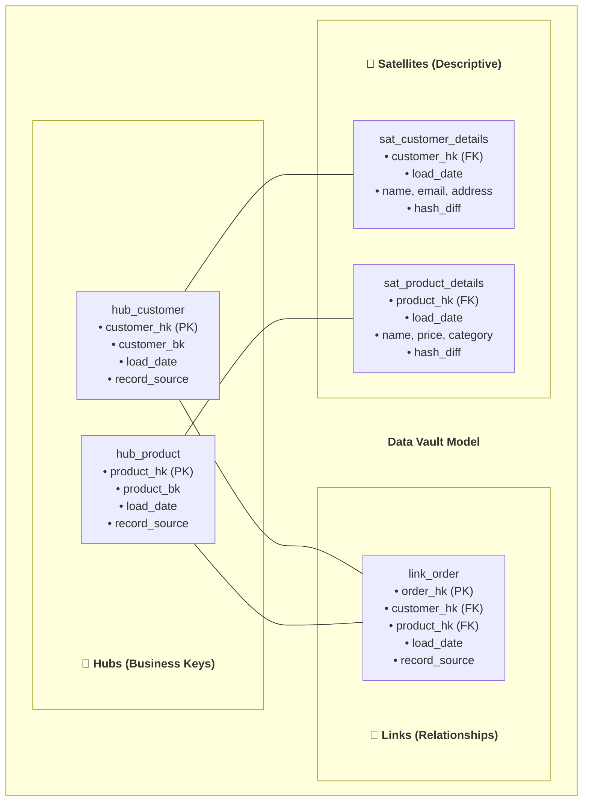

### Data Vault Pipeline

```mermaid
graph LR
    subgraph Stage[" "]
        Stage_title["Stage Layer"]
        style Stage_title fill:none,stroke:none,color:#333,font-weight:bold
        Raw["Raw data from sources<br/>(as-is, hash keys added)"]
    end

    subgraph RawVault[" "]
        RawVault_title["Raw Vault"]
        style RawVault_title fill:none,stroke:none,color:#333,font-weight:bold
        RV["Hubs + Links + Satellites<br/>• No business logic<br/>• Audit trail<br/>• Parallel loadable"]
    end

    subgraph BizVault[" "]
        BizVault_title["Business Vault"]
        style BizVault_title fill:none,stroke:none,color:#333,font-weight:bold
        BV["Derived data<br/>• Business rules applied<br/>• Calculated fields<br/>• Same-as links"]
    end

    subgraph InfoMart[" "]
        InfoMart_title["Information Marts"]
        style InfoMart_title fill:none,stroke:none,color:#333,font-weight:bold
        IM["Star schemas for BI<br/>• Dimensional models<br/>• Aggregations<br/>• User-facing"]
    end

    Stage --> RawVault --> BizVault --> InfoMart
```

### When Data Vault vs Kimball

| Scenario | Recommended |
|----------|-------------|
| Many source systems, complex integrations | Data Vault |
| Small team, quick BI delivery | Kimball |
| Regulatory / audit requirements | Data Vault |
| Simple star schema sufficient | Kimball |
| Agile, iterative development | Data Vault (parallel loads) |
| Legacy BI tools (need star schema) | Kimball (or DV + marts) |

### Impact on Modern Tools
- **dbt** — Data Vault packages (dbtvault, automate-dv)
- **Snowflake, Databricks** — Commonly implemented
- **Enterprise DW** — Alternative to Kimball for complex sources

### Limitations & Evolution (Sự thật phũ phàng)
- Data Vault linh hoạt nhưng **độ phức tạp modeling cao** cho junior teams.
- Query trực tiếp raw vault không thân thiện BI (thường vẫn cần marts).
- **Evolution:** metadata-driven DV automation + semantic marts phía trên.

### War Stories & Troubleshooting
- Lỗi phổ biến: hash key inconsistency do khác chuẩn normalize giữa pipeline.
- Fix nhanh: chuẩn hóa canonicalization function dùng chung cho mọi loader.

### Metrics & Order of Magnitude
- Số bảng trong DV thường tăng nhanh (hub/link/sat) so với star schema.
- Parallel load mạnh cho ingestion nhiều nguồn đồng thời.
- Chi phí compute query ad-hoc trên raw vault thường cao hơn serving marts.

### Micro-Lab
```sql
-- Verify hash key deterministic
SELECT customer_bk,
       MD5(LOWER(TRIM(customer_bk))) AS hk_check
FROM stg_customer
LIMIT 20;
```

---
> 💡 **Gemini Feedback**
> **Góc nhìn Thực chiến (Senior to Junior)**
1. **Limitations & Evolution (Sự thật phũ phàng):** Data Vault được quảng cáo là "Agile", thích ứng tốt với thay đổi hệ thống nguồn. Nhưng sự thật: Nó đẻ ra một lượng bảng khổng lồ (Hub, Link, Satellite). Một query đơn giản có thể yêu cầu `JOIN` 10-15 bảng. Nó là một sự "Over-engineering" (làm phức tạp hóa vấn đề) khủng khiếp đối với các công ty startup hoặc vừa và nhỏ. Chỉ nên dùng ở các tập đoàn tài chính/ngân hàng siêu lớn với hàng trăm hệ thống nguồn phức tạp.

2. **War Stories & Troubleshooting:** Công ty triển khai Data Vault trên Postgres, sau vài tháng số lượng bảng vọt lên 3.000 bảng. Khi chạy dbt để build model, Query Planner của Postgres bị "ngu" hoàn toàn khi phải tính toán đường đi cho lệnh `JOIN` 20 bảng Data Vault với nhau, dẫn đến treo RAM.
---

## 6. AMAZON REDSHIFT - 2012

### Paper Info
- **Title:** Amazon Redshift and the Case for Simpler Data Warehouses
- **Authors:** Anurag Gupta, Deepak Agarwal, et al.
- **Conference:** SIGMOD 2015
- **Link:** https://dl.acm.org/doi/10.1145/2723372.2742795

### Key Contributions
- Cloud-native data warehouse
- Columnar storage + MPP (Massively Parallel Processing)
- Automatic workload management
- Zone maps for data skipping

### Architecture

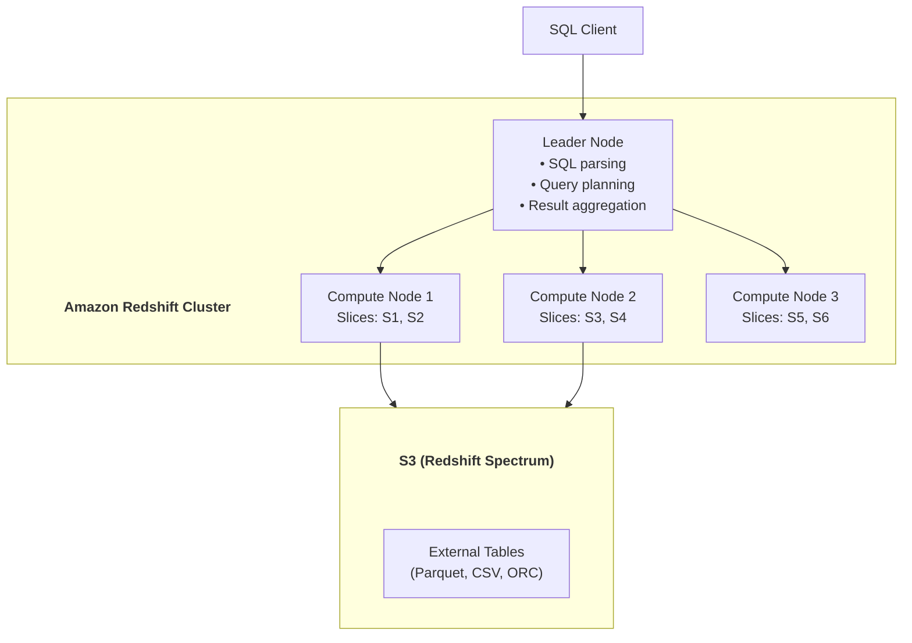

### Distribution Styles

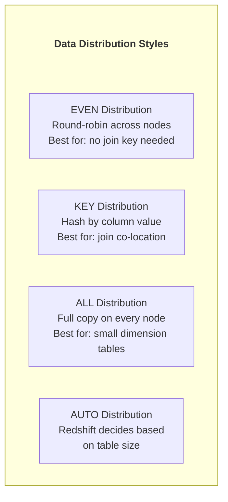

### Zone Maps (Data Skipping)

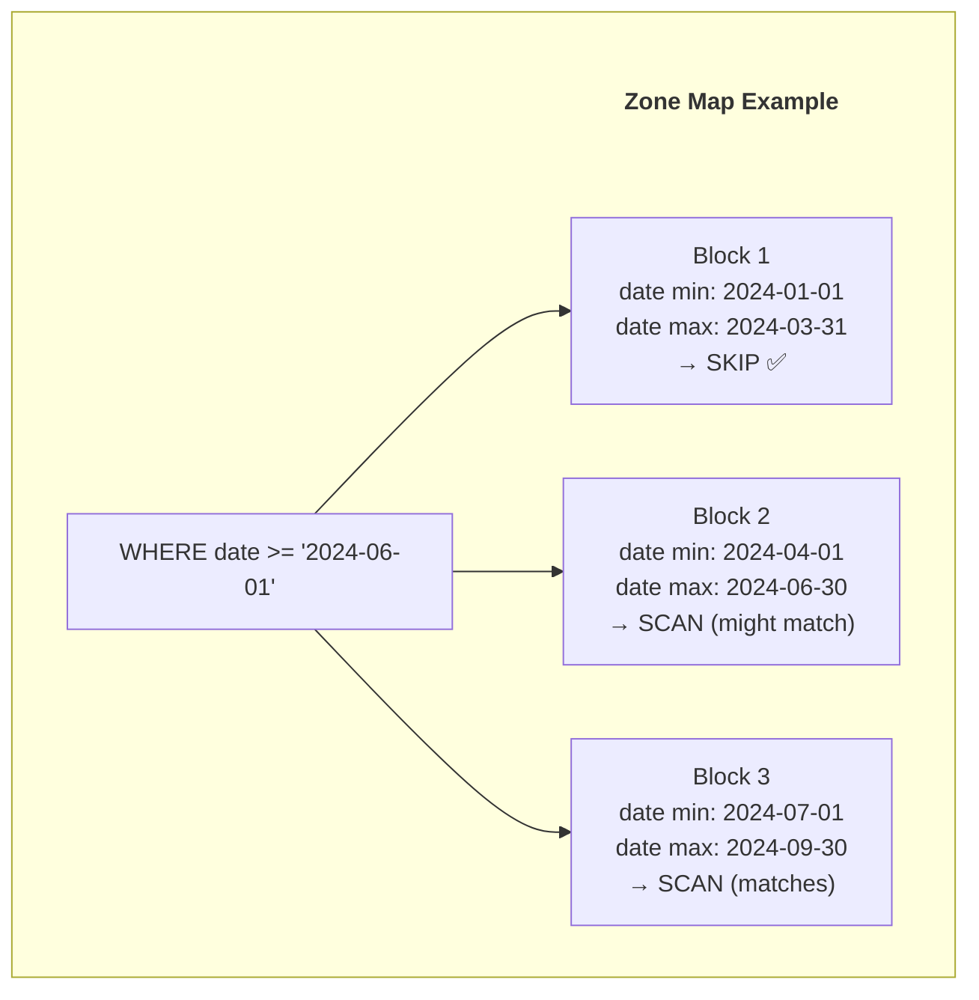

### Impact on Modern Tools
- **Amazon Redshift** — First major cloud MPP warehouse
- Influenced **Snowflake**, **BigQuery** design approaches
- Established cloud data warehousing as standard practice

### Limitations & Evolution (Sự thật phũ phàng)
- Cluster sizing tĩnh dễ gây over/under-provision ở workload biến động.
- Join/distribution key chọn sai gây data movement cost lớn.
- **Evolution:** RA3 + spectrum/lakehouse hybrid, serverless warehouse models.

### War Stories & Troubleshooting
- Lỗi phổ biến: query chậm do skew distribution (`DISTKEY` lệch).
- Fix nhanh: đổi dist/sort key theo access pattern, VACUUM/ANALYZE định kỳ.

### Metrics & Order of Magnitude
- Data movement giữa nodes là cost lớn nhất trong nhiều query join.
- Zone map tốt có thể giảm scan blocks đáng kể với cột sort phù hợp.
- VACUUM/ANALYZE đều đặn ảnh hưởng trực tiếp plan quality.

### Micro-Lab
```sql
-- Kiểm tra skew theo dist key
SELECT distkey_col, COUNT(*) c
FROM fact_sales
GROUP BY distkey_col
ORDER BY c DESC
LIMIT 20;
```

---


> 💡 **Gemini Feedback**
> **Góc nhìn Thực chiến (Senior to Junior)**
1. **Limitations & Evolution (Sự thật phũ phàng):** Kiến trúc gốc của Redshift (và Hadoop thời đầu) là khóa cứng Compute và Storage chung một máy. Khi em lưu data đầy ổ cứng, em buộc phải nâng cấp cả cụm (mua thêm CPU + RAM + Disk) dù em chả cần tính toán gì thêm. Đây là lỗ hổng chí mạng để Snowflake (tách rời Compute-Storage) đè bẹp Redshift sau này. (Gần đây Redshift đã ra mắt RA3 nodes để sửa sai).

2. **War Stories & Troubleshooting:** Quên chạy `VACUUM` và `ANALYZE`. Data Warehouse bị chậm đi gấp 10 lần sau vài tháng hoạt động. Khi em `DELETE` hoặc `UPDATE` data trong Redshift, nó không xóa thật mà chỉ đánh dấu ẩn. Ổ cứng rác cứ thế phình to, query quét qua rác liên tục. Phải set up job tự động chạy `VACUUM` ban đêm để dọn rác vật lý và `ANALYZE` để update lại thống kê (statistics) cho Query Planner.

---

## 7. SNOWFLAKE ELASTIC DATA WAREHOUSE - 2016

### Paper Info
- **Title:** The Snowflake Elastic Data Warehouse
- **Authors:** Benoit Dageville, Thierry Cruanes, et al.
- **Conference:** SIGMOD 2016
- **Link:** https://dl.acm.org/doi/10.1145/2882903.2903741
- **PDF:** https://event.cwi.nl/lsde/papers/p215-dageville-snowflake.pdf

### Key Contributions
- Separation of storage and compute
- Virtual warehouses (independent compute clusters)
- Multi-cluster shared data architecture
- Automatic scaling, suspension, and concurrency

### Architecture

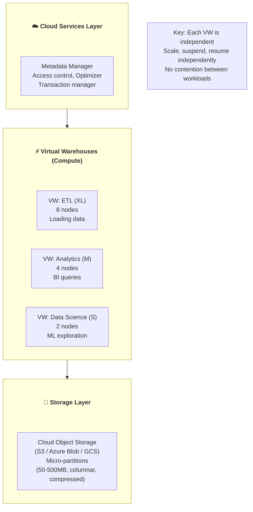

### Micro-Partitions

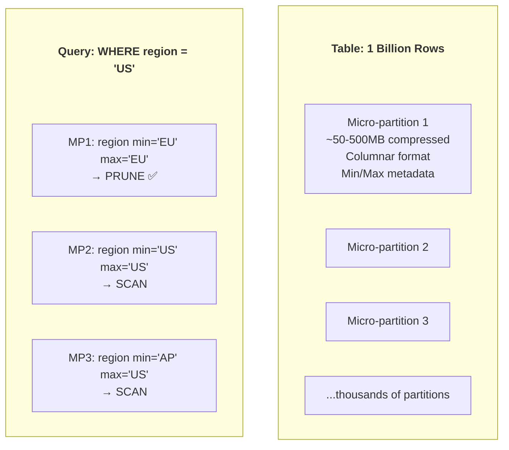

### Key Innovations

| Feature | Description |
|---------|-------------|
| **Storage-Compute Separation** | Scale independently; pay for what you use |
| **Multi-cluster Warehouses** | Auto-scale compute for concurrency |
| **Zero-copy Cloning** | Clone databases/tables instantly (metadata only) |
| **Time Travel** | Access historical data up to 90 days |
| **Data Sharing** | Share live data across accounts (no copy) |
| **Automatic Clustering** | Auto-organize micro-partitions |

### Impact on Modern Tools
- **Snowflake** — Market leader in cloud data warehousing
- Storage-compute separation now **industry standard**
- Influenced **Databricks Lakehouse**, **BigQuery** evolution

### Limitations & Evolution (Sự thật phũ phàng)
- Dễ phát sinh cost nếu nhiều warehouse chạy song song thiếu governance.
- Auto features tiện nhưng có thể che khuất root cause performance.
- **Evolution:** workload isolation + resource monitors + query acceleration services.

### War Stories & Troubleshooting
- Lỗi phổ biến: credit burn đột biến do BI dashboard polling quá dày.
- Fix nhanh: auto-suspend ngắn, tách warehouse theo workload, giới hạn concurrency theo role.

### Metrics & Order of Magnitude
- Scale up/down warehouse ảnh hưởng latency theo bậc rõ rệt cho heavy joins.
- Pruning micro-partition tốt có thể giảm scan cost nhiều lần.
- Clone zero-copy gần như tức thì ở metadata layer.

### Micro-Lab
```sql
-- Tìm query tốn credit/scan cao gần đây
SELECT query_id, total_elapsed_time, bytes_scanned
FROM table(information_schema.query_history())
ORDER BY start_time DESC
LIMIT 20;
```

---

> 💡 **Gemini Feedback**
> **Góc nhìn Thực chiến (Senior to Junior)**
1. **Limitations & Evolution (Sự thật phũ phàng):** Snowflake giải quyết hoàn hảo bài toán tách rời Compute và Storage. Nhưng nó tạo ra một nỗi đau mới: **Chi phí (Cloud Cost)**. Vì nó quá dễ dùng, scale quá dễ, Junior thường không tối ưu SQL mà dùng tiền (đẩy Virtual Warehouse lên size XL) để mua tốc độ.

2. **War Stories & Troubleshooting:** Câu chuyện dở khóc dở cười có thật ở nhiều công ty: Một bạn Data Analyst viết query chạy report lúc 6h chiều thứ Sáu, bật Warehouse size 2X-Large (tốn vài chục $/giờ). Do query bị lỗi logic (Cartesian Join), nó chạy mãi không ra kết quả và treo lửng lơ suốt 2 ngày cuối tuần. Sáng thứ Hai công ty nhận bill Snowflake gần 10.000 USD cho một query rác.

3. **Micro-Lab:** Khắc cốt ghi tâm dòng lệnh Auto-suspend bảo vệ túi tiền khi tạo compute node trên Snowflake: `CREATE WAREHOUSE my_wh WITH WAREHOUSE_SIZE = 'SMALL' AUTO_SUSPEND = 60 AUTO_RESUME = TRUE;` (Tự động tắt sau 60 giây không có query).


---
## 8. SPARK SQL - 2015

### Paper Info
- **Title:** Spark SQL: Relational Data Processing in Spark
- **Authors:** Michael Armbrust, Reynold S. Xin, et al.
- **Conference:** SIGMOD 2015
- **Link:** https://dl.acm.org/doi/10.1145/2723372.2742797
- **PDF:** https://people.csail.mit.edu/matei/papers/2015/sigmod_spark_sql.pdf

### Key Contributions
- DataFrame abstraction for structured data
- Catalyst optimizer (extensible, rule + cost-based)
- Data source API for pluggable connectors
- Unified batch and streaming API

### Catalyst Optimizer Pipeline

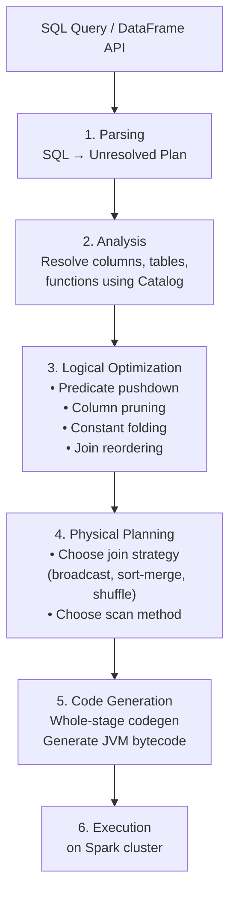

### Catalyst Optimization Rules

| Rule | Before | After |
|------|--------|-------|
| **Predicate Pushdown** | `scan → filter` | `scan(with filter)` |
| **Column Pruning** | `scan(all cols) → project` | `scan(needed cols)` |
| **Constant Folding** | `1 + 2 + col` | `3 + col` |
| **Boolean Simplification** | `true AND x` | `x` |
| **Join Reordering** | `big ⋈ small ⋈ medium` | `small ⋈ medium ⋈ big` |

### Impact on Modern Tools
- **Apache Spark** — Standard for big data processing
- **Databricks** — Commercial Spark platform
- **Delta Lake** — Built on Spark
- **Photon (Databricks)** — Vectorized C++ engine extending Catalyst

### Limitations & Evolution (Sự thật phũ phàng)
- Catalyst mạnh nhưng vẫn phụ thuộc stats; stats sai dẫn đến plan tệ.
- Shuffle-heavy query vẫn là điểm đau lớn ở scale.
- **Evolution:** AQE, cost model tốt hơn, vectorized backends.

### War Stories & Troubleshooting
- Lỗi phổ biến: OOM ở join/aggregation do skew + broadcast sai.
- Fix nhanh: bật AQE, skew join handling, giới hạn auto broadcast hợp lý.

### Metrics & Order of Magnitude
- Shuffle bytes là chỉ số quan trọng nhất để dự đoán runtime/cost.
- Predicate pushdown + column pruning thường giảm I/O theo bậc lớn.
- Whole-stage codegen giúp giảm CPU overhead đáng kể.

### Micro-Lab
```python
df = spark.read.parquet("s3://bucket/fact_sales")
df.filter("dt='2026-03-20'").select("customer_id","revenue").explain("formatted")
# Quan sát pushdown + số stage/shuffle
```
---

> 💡 **Gemini Feedback**
> **Góc nhìn Thực chiến (Senior to Junior)**
1. **Limitations & Evolution (Sự thật phũ phàng):** Spark SQL dùng bộ tối ưu Catalyst rất thông minh. Nhưng khi em nhét data quá lớn vào, JVM (Java Virtual Machine) của Spark lại là điểm yếu. Việc dọn rác bộ nhớ (Garbage Collection - GC) của Java sẽ làm job Spark bị khựng (pause) liên tục, gây ra độ trễ cực lớn. Xu hướng hiện tại đang dịch chuyển dần sang các Engine viết bằng C++/Rust (như Photon của Databricks, hay DataFusion/Polars) để bỏ qua JVM.
 
2. **War Stories & Troubleshooting:** Lỗi kinh điển **OOM (Out Of Memory) do Broadcast Join**. Spark cố gắng đẩy (broadcast) một bảng nhỏ sang toàn bộ các node để join cho nhanh (tránh shuffle qua mạng). Nhưng Junior vô tình truyền một bảng 10GB thay vì bảng 10MB. Toàn bộ các node Worker cố gắng nhét bảng 10GB này vào RAM, nổ tung và chết dây chuyền. Cách fix: Kiểm tra kỹ data size trước khi xài `broadcast()`, hoặc set `spark.sql.autoBroadcastJoinThreshold` hợp lý.


---

## 9. PRESTO (TRINO) - 2019

### Paper Info
- **Title:** Presto: SQL on Everything
- **Authors:** Raghav Sethi, Martin Traverso, et al.
- **Conference:** ICDE 2019
- **Link:** https://trino.io/Presto_SQL_on_Everything.pdf

### Key Contributions
- Federated query engine (SQL on anything)
- Pluggable connector architecture
- In-memory pipelined execution
- Low-latency interactive queries

### Architecture

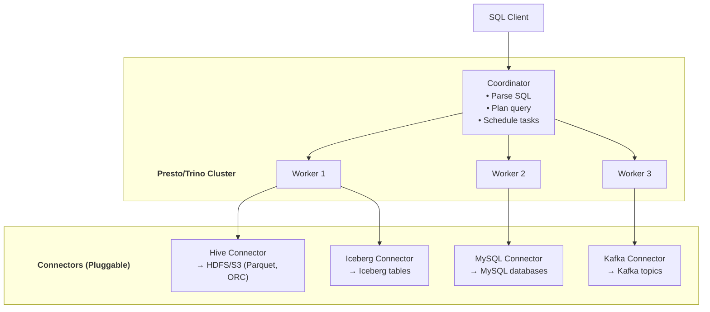

### Federated Query Example

```sql
-- Join data from 3 different systems in one query!
SELECT
    c.name,
    c.email,
    o.total_orders,
    e.recent_events
FROM mysql.app.customers c
JOIN (
    SELECT customer_id, COUNT(*) AS total_orders
    FROM hive.warehouse.orders
    GROUP BY customer_id
) o ON c.id = o.customer_id
JOIN (
    SELECT user_id, COUNT(*) AS recent_events
    FROM kafka.events.user_activity
    GROUP BY user_id
) e ON c.id = e.user_id
ORDER BY o.total_orders DESC
LIMIT 100;
```

### Impact on Modern Tools
- **Trino** (formerly PrestoSQL) — Open-source fork by original creators
- **AWS Athena** — Managed Presto/Trino service
- **Starburst** — Enterprise Trino
- Federated query pattern adopted widely

### Limitations & Evolution (Sự thật phũ phàng)
- Federated SQL rất tiện nhưng **cross-source join** dễ thành bottleneck nặng.
- Governance/security đồng nhất across connectors là bài toán khó.
- **Evolution:** lakehouse table formats + query acceleration/caching layers.

### War Stories & Troubleshooting
- Lỗi phổ biến: query treo lâu vì kéo data lớn từ source OLTP qua network.
- Fix nhanh: pushdown tối đa về source, pre-aggregate tại nguồn, materialize dataset trung gian.

### Metrics & Order of Magnitude
- Network shuffle và remote source latency quyết định p95/p99 cho federated query.
- Query interactive thường cần giới hạn data scanned bằng partition/filter chặt.
- Connector quality khác nhau tạo chênh lệch hiệu năng rất lớn.

### Micro-Lab
```sql
-- So sánh plan trước/sau khi push filter xuống source
EXPLAIN SELECT * FROM mysql.app.orders WHERE order_date >= DATE '2026-03-01';
```

---

> 💡 **Gemini Feedback**
> **Góc nhìn Thực chiến (Senior to Junior)**
1. **Limitations & Evolution (Sự thật phũ phàng):** Trino là công cụ Federated Query tuyệt đỉnh (cho phép `JOIN` 1 bảng từ Postgres với 1 bảng từ S3 Parquet). Nhưng em phải nhớ: **Trino KHÔNG CÓ ổ cứng lưu trữ**. Nó kéo dữ liệu qua dây mạng. Nếu em dùng Trino để chạy các batch job ETL khổng lồ (chạy vài tiếng, quét hàng Terabyte), chỉ cần đứt mạng 1 giây hoặc sập 1 node worker, toàn bộ job đó sẽ tạch và phải chạy lại từ đầu. Trino sinh ra cho _Interactive Query_ (truy vấn nhanh), còn ETL nặng hãy dùng Spark.

2. **War Stories & Troubleshooting:** Hiện tượng "Nghẽn cổ chai mạng (Network Bottleneck)". Khi tự tay cấu hình Trino trên các server vật lý (ví dụ trên một dàn máy trạm cày cuốc cũ), I/O ổ đĩa SSD có thể lên tới 3000MB/s, nhưng tốc độ card mạng nội bộ chỉ có 1Gbps (~125MB/s). Trino cố gắng kéo data từ Storage Node lên Compute Node và bị thắt cổ chai ở dây mạng, CPU ngồi chơi xơi nước chờ data đến mòn mỏi.


---

## 10. APACHE ARROW - 2016

Trong bối cảnh data warehousing, Apache Arrow là lớp in-memory columnar giúp trao đổi dữ liệu giữa warehouse engine và compute libraries nhanh hơn, đặc biệt cho UDF/Python interoperability. Nó được dùng như cầu nối execution giữa hệ sinh thái SQL engine, DataFrame engine và transport protocols.

> 📖 **Chi tiết kỹ thuật (memory layout, zero-copy, Arrow Flight, IPC formats):** xem [[10_Serialization_Format_Papers#5-apache-arrow---2016]]

### Limitations & Evolution (Sự thật phũ phàng)
- Arrow mạnh ở in-memory interchange nhưng không thay thế hoàn toàn storage/table format.
- Version/compatibility giữa libraries có thể gây friction trong production.
- **Evolution:** Arrow Flight SQL, ADBC và chuẩn hóa connector layer.

### War Stories & Troubleshooting
- Lỗi phổ biến: fallback sang serialization cũ làm mất lợi ích zero-copy.
- Fix nhanh: pin phiên bản PyArrow/engine tương thích, benchmark pipeline trước/sau khi bật Arrow.

### Metrics & Order of Magnitude
- Data interchange dùng Arrow thường giảm overhead copy/serialization đáng kể.
- UDF path Python thường hưởng lợi rõ nhất khi tránh row-by-row conversion.
- Throughput end-to-end phụ thuộc cả compute operator chứ không chỉ transport format.

### Micro-Lab
```python
import pyarrow as pa, pandas as pd
t = pa.table({'id':[1,2,3], 'v':[10.0,20.0,30.0]})
df = t.to_pandas(types_mapper=pd.ArrowDtype)
print(df.dtypes)
```
---

> 💡 **Gemini Feedback**
> **Góc nhìn Thực chiến (Senior to Junior)**
> _(Lưu ý nhỏ: Nếu theo đúng lộ trình refactor, mục Arrow này sau này sẽ gộp về file `10_Serialization`. Nhưng cứ gắn tạm note này ở đây để hiểu mạch DW)_

 1. **Limitations & Evolution (Sự thật phũ phàng):** Arrow là In-memory Format (trên RAM), Parquet là On-disk Format (trên ổ đĩa). Rất nhiều người nhầm lẫn đem lưu file Arrow xuống đĩa rồi hỏi sao nó to thế. Bản chất Arrow sinh ra để các hệ thống (như Python Pandas, Spark, JVM) ném data cho nhau qua RAM mà không phải dịch lại định dạng (Zero-copy serialization).
 
 2. **War Stories & Troubleshooting:** Trước khi có Arrow, dùng hàm UDF (User Defined Function) bằng Python trong Spark SQL là một cực hình. Spark (Java) phải serialize data ra, đẩy qua Python xử lý, rồi deserialize ngược lại Java. Tốc độ chậm như rùa. Khi bật `spark.sql.execution.arrow.pyspark.enabled = true`, data được giữ nguyên format Arrow ném thẳng vào bộ nhớ Python (tạo ra Pandas DataFrame/Vectorized UDF), tốc độ tăng vọt hàng chục lần. Chữ "Vectorized" ở đây chính thức tạo ra ma thuật.


---

## 11. TỔNG KẾT & EVOLUTION

### Timeline

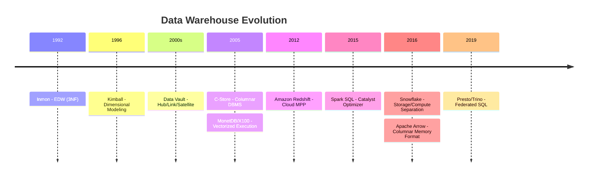

### Evolution Flow

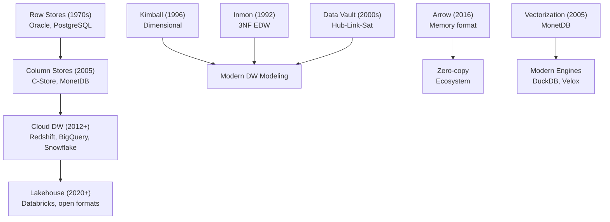

### Summary Table

| Paper/Book      | Year  | Key Innovation             | Modern Tools           |
| --------------- | ----- | -------------------------- | ---------------------- |
| Inmon DW        | 1992  | EDW architecture           | Enterprise DW          |
| Kimball Toolkit | 1996  | Dimensional modeling       | All DW, dbt            |
| Data Vault      | 2000s | Hub-Link-Satellite         | dbt, Enterprise        |
| C-Store         | 2005  | Columnar DBMS              | Vertica, Redshift      |
| MonetDB/X100    | 2005  | Vectorized execution       | DuckDB, ClickHouse     |
| Redshift        | 2012  | Cloud MPP                  | Redshift               |
| Spark SQL       | 2015  | Catalyst optimizer         | Spark, Databricks      |
| Snowflake       | 2016  | Storage-compute separation | Snowflake              |
| Arrow           | 2016  | Columnar memory format     | Pandas, Polars, DuckDB |
| Presto          | 2019  | Federated queries          | Trino, Athena          |

---

## 📦 Verified Resources

| Resource | Link | Note |
|----------|------|------|
| Kimball Group | [kimballgroup.com](https://www.kimballgroup.com/) | Dimensional modeling |
| Data Vault Alliance | [datavaultalliance.com](https://datavaultalliance.com/) | DV methodology |
| Apache Arrow | [arrow.apache.org](https://arrow.apache.org/) | Format spec + tools |
| Trino Documentation | [trino.io](https://trino.io/docs/current/) | Presto fork docs |
| DDIA Book | [dataintensive.net](https://dataintensive.net/) | Comprehensive reference |

---

<mark style="background: #BBFABBA6;">💡 **Gemini Message**</mark>
Đúng là sau năm 2019 (với sự xuất hiện của Presto/Trino), giới Data Engineering dường như ngừng đẻ ra các "Động cơ Data Warehouse khổng lồ" mới.

Lý do cực kỳ phũ phàng: **Thế giới đã quá ngán ngẩm với hóa đơn Cloud đắt đỏ và sự cồng kềnh của các hệ thống phân tán khổng lồ.** Từ năm 2019 đến 2026, thay vì xây thêm những tòa lâu đài nguyên khối (Monolithic), giới công nghệ tập trung vào **"Đập đi xây lại" (Unbundling)** và **"Tối ưu cục bộ"**. Dưới đây là những biến chuyển lớn nhất định hình bức tranh Data Warehouse 5 năm qua mà em phải nắm chắc để thiết kế con Data-Keeper cho chuẩn:

### 1. Sự trỗi dậy của In-Process OLAP (2019 - nay): DuckDB xưng vương

- **Sự thật phũ phàng:** Trào lưu Big Data khiến công ty nào cũng tưởng mình có "dữ liệu lớn" và cắm đầu mua Snowflake/BigQuery. Nhưng thực tế 90% các công ty chỉ có vài chục GB đến vài trăm GB data. Dùng cụm Spark/Trino để xử lý 10GB data là đem dao mổ trâu đi giết gà, vừa chậm vừa tốn tiền setup mạng.

- **Kẻ thay đổi cuộc chơi:** **DuckDB (ra mắt 2019, bùng nổ 2022-2026)**. Nó làm cho Data Warehouse y hệt những gì SQLite làm cho Database truyền thống. Em không cần cài cắm server, không cần mạng. Nó nằm gọn trong 1 file chạy trực tiếp trên Python/Rust. Nếu em chạy DuckDB trên con máy trạm HP Z440 nhiều nhân CPU, nó có thể quét vài chục triệu dòng Parquet trong chưa tới nửa giây — nhanh hơn cả việc gọi API lên Cloud Data Warehouse. Trào lưu **"Local is the new Cloud"** (Mang data về chạy local) đang cực kỳ thịnh hành nhờ DuckDB.

### 2. Sự tan chảy ranh giới (The Convergence): Lakehouse vs Warehouse

- **Sự thật phũ phàng:** Khoảng 2020, các công ty nhận ra việc copy data từ Data Lake (S3) sang Data Warehouse (Redshift) là một sự ngu ngốc tốn kém.

- **Kẻ thay đổi cuộc chơi:** Databricks tung ra **Lakehouse** (kết hợp sức mạnh tính toán của Warehouse lên trên ổ đĩa rẻ tiền của Data Lake). Ngay lập tức, Snowflake cũng phản đòn bằng cách cho phép query trực tiếp file Iceberg trên S3 mà không cần nạp vào hệ thống của họ.

- **💡 Góc nhìn thực chiến:** Data Warehouse từ 2022 trở đi không còn là "một cái kho lưu trữ có tính toán". Nó đã bị xé nhỏ ra. Tính toán (Compute) là chuyện của Snowflake/Trino, còn Lưu trữ (Storage) trả về hết cho các Open Table Formats như Iceberg/Delta.

### 3. Kỷ nguyên dbt & Kỹ nghệ hóa SQL (Modern Data Stack)

- **Sự thật phũ phàng:** Dù engine có mạnh đến đâu, nhưng file SQL 3000 dòng `JOIN` chằng chịt do Junior viết vẫn là rác. Việc maintain (bảo trì) code SQL trong các Data Warehouse cũ là địa ngục vì không có version control, không có testing.

- **Kẻ thay đổi cuộc chơi:** **dbt (Data Build Tool)** trở thành chuẩn mực công nghiệp từ 2020. Mọi logic biến đổi dữ liệu (Transform) bên trong Warehouse giờ được viết như software engineering: chia nhỏ thành từng file, dùng biến (Jinja), có kiểm thử (test) và CI/CD rõ ràng.

### 4. Modular Data Engine (Lắp ráp Database bằng C++/Rust)

- **Sự thật phũ phàng:** Tạo ra một Database mới từ đầu (như viết lại trình phân tích cú pháp SQL, viết lại bộ tối ưu query) tốn mất 10 năm. Java (cốt lõi của Hadoop/Spark) thì lại quá ngốn RAM do cơ chế dọn rác (GC).

- **Kẻ thay đổi cuộc chơi:** Các dự án mã nguồn mở như **Apache DataFusion (viết bằng Rust)** hoặc **Velox (viết bằng C++ của Meta)**. Thay vì làm một cái DB hoàn chỉnh, họ làm ra các "bộ lòng" siêu tốc độ. Giờ đây, để build một hệ thống phân tích mới, các kỹ sư chỉ cần lấy bộ parse của Calcite, gắn với engine của DataFusion, và dùng chuẩn bộ nhớ của Arrow.


**Tổng kết lại:** Từ 2019 đến nay, Data Warehouse không sinh ra thêm paper nào kiểu "Sáng tạo chấn động" vì cả ngành đang bận rộn **rã đông** những thiết kế cũ, viết lại bằng **Rust/C++** để bòn rút tối đa hiệu năng phần cứng, và đưa mọi thứ chạy thẳng trên **Object Storage (S3)**. Khi thiết kế Data-Keeper, em không cần phải cố mô phỏng lại một cụm Redshift hay Hadoop làm gì, chỉ cần kết hợp S3 (MinIO) + Iceberg + DuckDB/Trino là em đã có một kiến trúc hiện đại ngang ngửa các công ty công nghệ năm 2026 rồi!

---
## 🔗 Liên Kết Nội Bộ

- [[01_Distributed_Systems_Papers|Distributed Systems Papers]] — Infrastructure papers
- [[06_Database_Internals_Papers|Database Internals]] — Storage engine papers
- [[09_Query_Optimization_Papers|Query Optimization]] — Optimizer papers
- [[../fundamentals/03_Data_Warehousing_Concepts|Data Warehousing Concepts]]
- [[../tools/02_Delta_Lake_Complete_Guide|Delta Lake]] — Open table format

---

*Document Version: 2.0*
*Last Updated: February 2026*
*Coverage: Kimball, Inmon, C-Store, MonetDB, Data Vault, Redshift, Snowflake, Spark SQL, Presto, Arrow*
