# Data Warehouse & Analytics Foundational Papers

## Những Paper Nền Tảng Cho Data Warehousing và Columnar Storage

---

## 📋 Mục Lục

1. [Kimball Toolkit](#1-the-data-warehouse-toolkit-kimball---1996)
2. [Inmon Data Warehouse](#2-building-the-data-warehouse-inmon---1992)
3. [C-Store](#3-c-store-a-column-oriented-dbms---2005)
4. [MonetDB/X100](#4-monetdbx100---2005)
5. [Data Vault](#5-data-vault-modeling---2000s)
6. [Amazon Redshift](#6-amazon-redshift---2012)
7. [Snowflake](#7-snowflake-elastic-data-warehouse---2016)
8. [Spark SQL](#8-spark-sql---2015)
9. [Presto (Trino)](#9-presto-trino---2019)
10. [Apache Arrow](#10-apache-arrow---2016)
11. [Tổng Kết](#11-tổng-kết--evolution)

---

## 1. THE DATA WAREHOUSE TOOLKIT (Kimball) - 1996

### Book/Paper Info
- **Title:** The Data Warehouse Toolkit: Practical Techniques for Building Dimensional Data Warehouses
- **Author:** Ralph Kimball
- **Publisher:** Wiley, 1996 (First Edition)
- **Link:** https://www.kimballgroup.com/data-warehouse-business-intelligence-resources/books/

### Key Contributions
- Dimensional modeling methodology
- Star and snowflake schemas
- Slowly Changing Dimensions (SCD)
- Conformed dimensions
- Bus architecture

### Star Schema

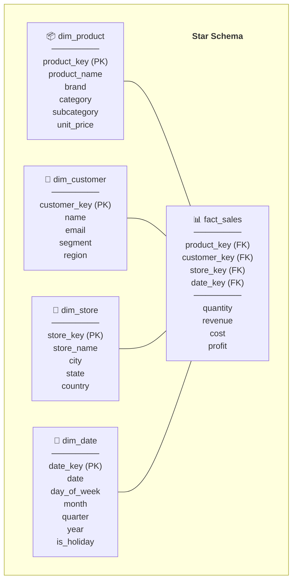
```mermaid
graph TB
    subgraph StarSchema[" "]
        StarSchema_title["Star Schema"]
        style StarSchema_title fill:none,stroke:none,color:#333,font-weight:bold
        Fact["📊 fact_sales<br/>────────<br/>product_key (FK)<br/>customer_key (FK)<br/>store_key (FK)<br/>date_key (FK)<br/>────────<br/>quantity<br/>revenue<br/>cost<br/>profit"]
        
        DimProduct["📦 dim_product<br/>────────<br/>product_key (PK)<br/>product_name<br/>brand<br/>category<br/>subcategory<br/>unit_price"]
        
        DimCustomer["👤 dim_customer<br/>────────<br/>customer_key (PK)<br/>name<br/>email<br/>segment<br/>region"]
        
        DimStore["🏪 dim_store<br/>────────<br/>store_key (PK)<br/>store_name<br/>city<br/>state<br/>country"]
        
        DimDate["📅 dim_date<br/>────────<br/>date_key (PK)<br/>date<br/>day_of_week<br/>month<br/>quarter<br/>year<br/>is_holiday"]
    end

    DimProduct --- Fact
    DimCustomer --- Fact
    DimStore --- Fact
    DimDate --- Fact
```

### Fact Table Types

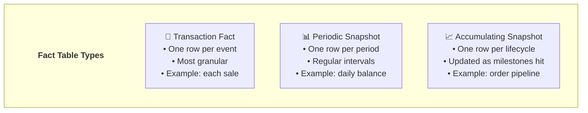
```mermaid
graph LR
    subgraph FactTypes[" "]
        FactTypes_title["Fact Table Types"]
        style FactTypes_title fill:none,stroke:none,color:#333,font-weight:bold
        Transaction["📝 Transaction Fact<br/>• One row per event<br/>• Most granular<br/>• Example: each sale"]
        Periodic["📊 Periodic Snapshot<br/>• One row per period<br/>• Regular intervals<br/>• Example: daily balance"]
        Accumulating["📈 Accumulating Snapshot<br/>• One row per lifecycle<br/>• Updated as milestones hit<br/>• Example: order pipeline"]
    end
```

### Slowly Changing Dimensions (SCD)

| SCD Type | Strategy | History | Example |
|----------|----------|---------|---------|
| **Type 0** | Retain original | No | Date of birth |
| **Type 1** | Overwrite | No | Fix typo in name |
| **Type 2** | New row + versioning | Full | Address change |
| **Type 3** | New column | Limited (prev/curr) | Category reclassification |
| **Type 4** | Mini-dimension | Rapid changes | Customer demographics |
| **Type 6** | Hybrid 1+2+3 | Full + current | Complex tracking |

### SCD Type 2 Example

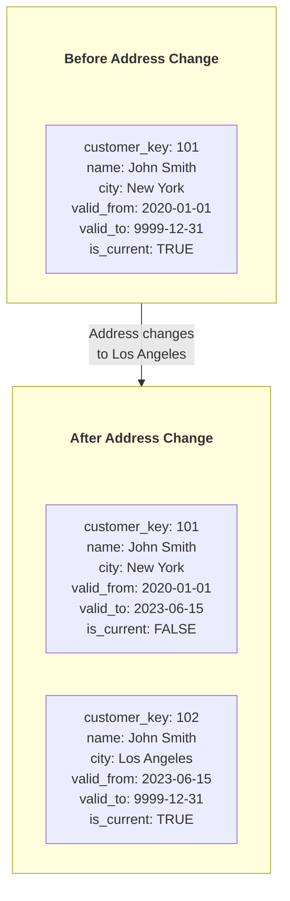
```mermaid
graph TB
    subgraph Before[" "]
        Before_title["Before Address Change"]
        style Before_title fill:none,stroke:none,color:#333,font-weight:bold
        R1["customer_key: 101<br/>name: John Smith<br/>city: New York<br/>valid_from: 2020-01-01<br/>valid_to: 9999-12-31<br/>is_current: TRUE"]
    end

    subgraph After[" "]
        After_title["After Address Change"]
        style After_title fill:none,stroke:none,color:#333,font-weight:bold
        R2["customer_key: 101<br/>name: John Smith<br/>city: New York<br/>valid_from: 2020-01-01<br/>valid_to: 2023-06-15<br/>is_current: FALSE"]
        R3["customer_key: 102<br/>name: John Smith<br/>city: Los Angeles<br/>valid_from: 2023-06-15<br/>valid_to: 9999-12-31<br/>is_current: TRUE"]
    end
    
    Before -->|"Address changes<br/>to Los Angeles"| After
```

### Impact on Modern Tools
- **All data warehouses** — Snowflake, Redshift, BigQuery use dimensional models
- **dbt** — Dimensional modeling with SQL + snapshots for SCD2
- **Industry standard** — For BI and analytics

---

## 2. BUILDING THE DATA WAREHOUSE (Inmon) - 1992

### Book/Paper Info
- **Title:** Building the Data Warehouse
- **Author:** Bill Inmon
- **Publisher:** Wiley, 1992 (First Edition)
- **Link:** https://www.wiley.com/en-us/Building+the+Data+Warehouse-p-9780471141617

### Key Contributions
- Data warehouse definition: Subject-oriented, Integrated, Time-variant, Non-volatile
- Corporate Information Factory (CIF)
- Enterprise Data Warehouse (EDW)
- Top-down methodology

### Inmon Architecture

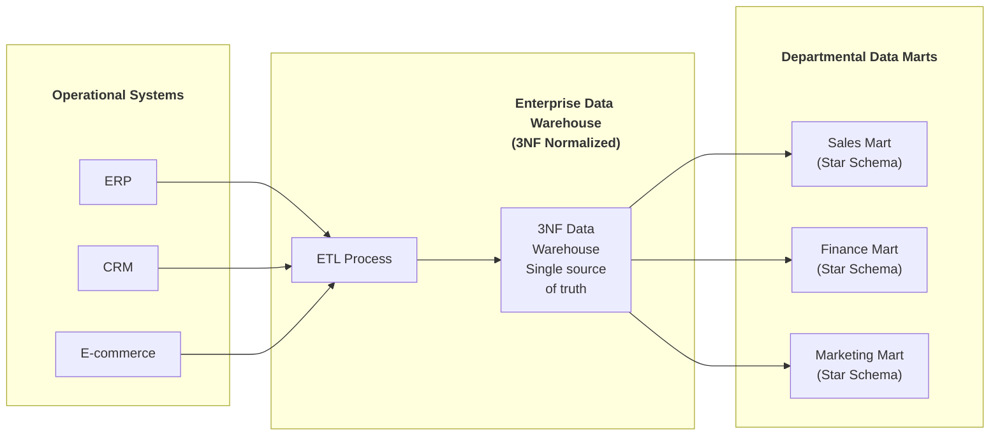
```mermaid
graph LR
    subgraph Sources[" "]
        Sources_title["Operational Systems"]
        style Sources_title fill:none,stroke:none,color:#333,font-weight:bold
        S1["ERP"]
        S2["CRM"]
        S3["E-commerce"]
    end

    subgraph EDW[" "]
        EDW_title["Enterprise Data Warehouse<br/>(3NF Normalized)"]
        style EDW_title fill:none,stroke:none,color:#333,font-weight:bold
        ETL1["ETL Process"]
        DW["3NF Data<br/>Warehouse<br/>Single source<br/>of truth"]
    end

    subgraph Marts[" "]
        Marts_title["Departmental Data Marts"]
        style Marts_title fill:none,stroke:none,color:#333,font-weight:bold
        M1["Sales Mart<br/>(Star Schema)"]
        M2["Finance Mart<br/>(Star Schema)"]
        M3["Marketing Mart<br/>(Star Schema)"]
    end

    S1 --> ETL1
    S2 --> ETL1
    S3 --> ETL1
    ETL1 --> DW
    DW --> M1
    DW --> M2
    DW --> M3
```

### Inmon vs Kimball

| Aspect | Inmon (Top-Down) | Kimball (Bottom-Up) |
|--------|-----------------|-------------------|
| **Approach** | Build EDW first → Data Marts | Build Data Marts → integrate |
| **EDW Schema** | 3NF (normalized) | Dimensional (star/snowflake) |
| **Data Marts** | Derived from EDW | Conformed dimensions |
| **Build Time** | Longer (full EDW first) | Faster (mart by mart) |
| **Maintenance** | Easier (single source) | Harder (many marts) |
| **Query** | Complex joins | Simple star joins |
| **Best For** | Large enterprise | Agile, smaller teams |

### Impact on Modern Tools
- **Enterprise data warehouses** — Traditional approach
- **Data Vault** — Evolution of Inmon ideas
- **Modern Lakehouse** — Hybrid approaches combine both

---

## 3. C-STORE: A COLUMN-ORIENTED DBMS - 2005

### Paper Info
- **Title:** C-Store: A Column-oriented DBMS
- **Authors:** Mike Stonebraker, Daniel J. Abadi, et al.
- **Conference:** VLDB 2005
- **Link:** https://dl.acm.org/doi/10.5555/1083592.1083658
- **PDF:** http://db.csail.mit.edu/projects/cstore/vldb.pdf

### Key Contributions
- Column-oriented storage architecture
- Read-optimized store (RS) + Write store (WS)
- Projection-based storage
- Tuple mover between WS and RS

### Row vs Column Storage

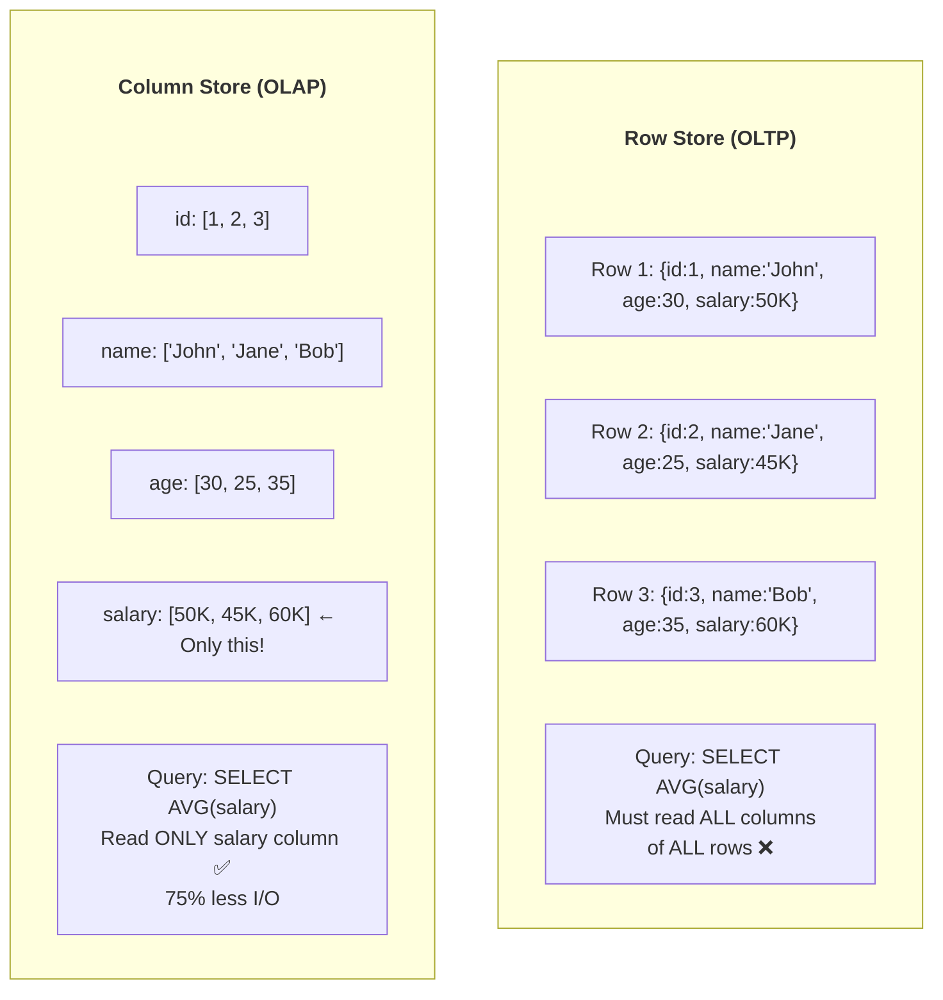
```mermaid
graph TB
    subgraph RowStore[" "]
        RowStore_title["Row Store (OLTP)"]
        style RowStore_title fill:none,stroke:none,color:#333,font-weight:bold
        Row1["Row 1: {id:1, name:'John', age:30, salary:50K}"]
        Row2["Row 2: {id:2, name:'Jane', age:25, salary:45K}"]
        Row3["Row 3: {id:3, name:'Bob',  age:35, salary:60K}"]
        
        Note1["Query: SELECT AVG(salary)<br/>Must read ALL columns<br/>of ALL rows ❌"]
    end

    subgraph ColStore[" "]
        ColStore_title["Column Store (OLAP)"]
        style ColStore_title fill:none,stroke:none,color:#333,font-weight:bold
        CId["id:     [1, 2, 3]"]
        CName["name:   ['John', 'Jane', 'Bob']"]
        CAge["age:    [30, 25, 35]"]
        CSal["salary: [50K, 45K, 60K] ← Only this!"]
        
        Note2["Query: SELECT AVG(salary)<br/>Read ONLY salary column ✅<br/>75% less I/O"]
    end
```

### C-Store Architecture

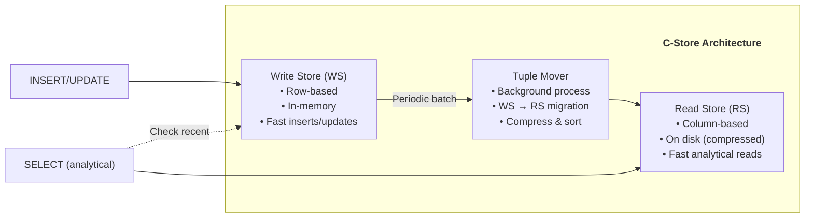
```mermaid
graph LR
    subgraph CStore[" "]
        CStore_title["C-Store Architecture"]
        style CStore_title fill:none,stroke:none,color:#333,font-weight:bold
        WS["Write Store (WS)<br/>• Row-based<br/>• In-memory<br/>• Fast inserts/updates"]
        RS["Read Store (RS)<br/>• Column-based<br/>• On disk (compressed)<br/>• Fast analytical reads"]
        TM["Tuple Mover<br/>• Background process<br/>• WS → RS migration<br/>• Compress & sort"]
    end

    Writes["INSERT/UPDATE"] --> WS
    WS -->|"Periodic batch"| TM
    TM --> RS
    Reads["SELECT (analytical)"] --> RS
    Reads -.->|"Check recent"| WS
```

### Column Compression Techniques

| Technique | Best For | Example |
|-----------|----------|---------|
| **Run-Length Encoding** | Sorted, repeated values | [A,A,A,B,B] → [(A,3),(B,2)] |
| **Dictionary** | Low cardinality | ['red','blue','red'] → {0:'red',1:'blue'} → [0,1,0] |
| **Bit-packing** | Small integers | Values 0-15 → 4 bits each |
| **Delta encoding** | Sorted sequences | [100,101,103,106] → [100,1,2,3] |
| **Null suppression** | Sparse data | Skip null storage |

### Impact on Modern Tools
- **Vertica** — Commercial C-Store (Stonebraker founded)
- **Amazon Redshift** — Based on ParAccel (C-Store influenced)
- **All columnar DBs** — Snowflake, BigQuery, ClickHouse
- **Parquet, ORC** — Columnar file formats

---

## 4. MONETDB/X100 - 2005

### Paper Info
- **Title:** MonetDB/X100: Hyper-Pipelining Query Execution
- **Authors:** Peter Boncz, Marcin Zukowski, Niels Nes
- **Conference:** CIDR 2005
- **Link:** https://www.cidrdb.org/cidr2005/papers/P19.pdf

### Key Contributions
- Vectorized query execution
- CPU cache optimization
- Batch processing for modern CPUs
- Eliminate interpretation overhead

### Tuple-at-a-time vs Vectorized

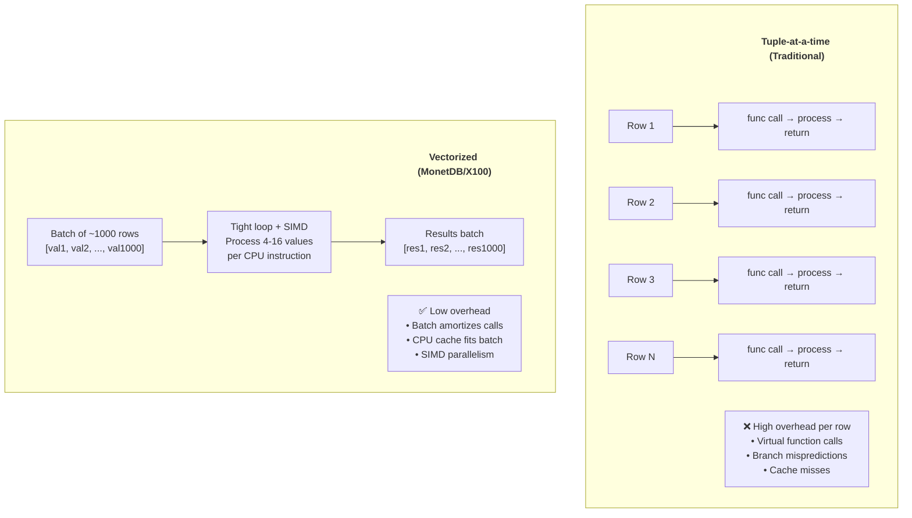
```mermaid
graph TB
    subgraph Tuple[" "]
        Tuple_title["Tuple-at-a-time (Traditional)"]
        style Tuple_title fill:none,stroke:none,color:#333,font-weight:bold
        T1["Row 1"] --> Op1["func call → process → return"]
        T2["Row 2"] --> Op2["func call → process → return"]
        T3["Row 3"] --> Op3["func call → process → return"]
        TN["Row N"] --> OpN["func call → process → return"]
        
        Note1["❌ High overhead per row<br/>• Virtual function calls<br/>• Branch mispredictions<br/>• Cache misses"]
    end

    subgraph Vec[" "]
        Vec_title["Vectorized (MonetDB/X100)"]
        style Vec_title fill:none,stroke:none,color:#333,font-weight:bold
        Batch["Batch of ~1000 rows<br/>[val1, val2, ..., val1000]"]
        SIMD["Tight loop + SIMD<br/>Process 4-16 values<br/>per CPU instruction"]
        Result["Results batch<br/>[res1, res2, ..., res1000]"]
        
        Batch --> SIMD --> Result
        
        Note2["✅ Low overhead<br/>• Batch amortizes calls<br/>• CPU cache fits batch<br/>• SIMD parallelism"]
    end
```

### Why Vectorization Works

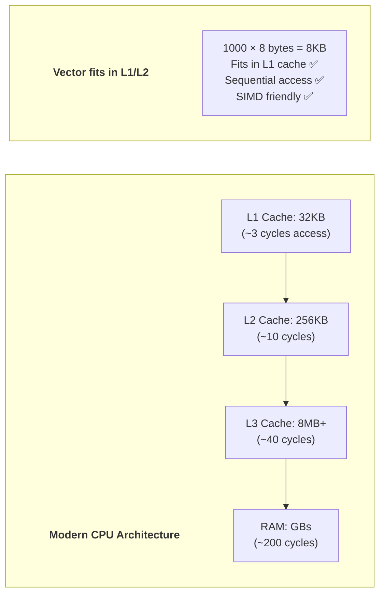
```mermaid
graph LR
    subgraph CPU[" "]
        CPU_title["Modern CPU Architecture"]
        style CPU_title fill:none,stroke:none,color:#333,font-weight:bold
        L1["L1 Cache: 32KB<br/>(~3 cycles access)"]
        L2["L2 Cache: 256KB<br/>(~10 cycles)"]
        L3["L3 Cache: 8MB+<br/>(~40 cycles)"]
        RAM["RAM: GBs<br/>(~200 cycles)"]
        
        L1 --> L2 --> L3 --> RAM
    end
    
    subgraph VecFit[" "]
        VecFit_title["Vector fits in L1/L2"]
        style VecFit_title fill:none,stroke:none,color:#333,font-weight:bold
        V1["1000 × 8 bytes = 8KB<br/>Fits in L1 cache ✅<br/>Sequential access ✅<br/>SIMD friendly ✅"]
    end
```

### Impact on Modern Tools
- **DuckDB** — Direct descendant, in-process OLAP vectorized engine
- **ClickHouse** — Vectorized execution engine
- **Apache Arrow** — Columnar format designed for vectorized processing
- **Velox (Meta)** — Vectorized execution library
- **All modern OLAP** — Vectorized processing is now standard

---

## 5. DATA VAULT MODELING - 2000s

### Paper/Book Info
- **Title:** Building a Scalable Data Warehouse with Data Vault 2.0
- **Author:** Dan Linstedt, Michael Olschimke
- **Publisher:** Morgan Kaufmann, 2015
- **Link:** https://danlinstedt.com/about/books/

### Key Contributions
- Hub-Link-Satellite model
- Business key focus
- Full historical tracking
- Parallel loading capability

### Data Vault Components

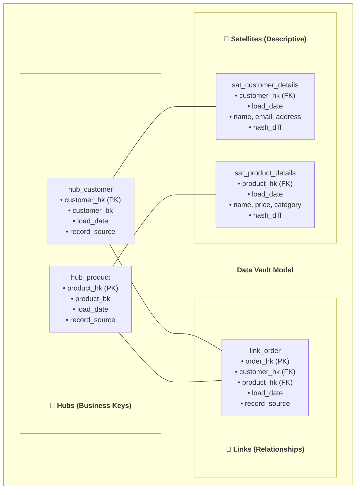
```mermaid
graph TB
    subgraph DataVault[" "]
        DataVault_title["Data Vault Model"]
        style DataVault_title fill:none,stroke:none,color:#333,font-weight:bold
        subgraph Hubs[" "]
            Hubs_title["🔑 Hubs (Business Keys)"]
            style Hubs_title fill:none,stroke:none,color:#333,font-weight:bold
            H1["hub_customer<br/>• customer_hk (PK)<br/>• customer_bk<br/>• load_date<br/>• record_source"]
            H2["hub_product<br/>• product_hk (PK)<br/>• product_bk<br/>• load_date<br/>• record_source"]
        end

        subgraph Links[" "]
            Links_title["🔗 Links (Relationships)"]
            style Links_title fill:none,stroke:none,color:#333,font-weight:bold
            L1["link_order<br/>• order_hk (PK)<br/>• customer_hk (FK)<br/>• product_hk (FK)<br/>• load_date<br/>• record_source"]
        end

        subgraph Satellites[" "]
            Satellites_title["📝 Satellites (Descriptive)"]
            style Satellites_title fill:none,stroke:none,color:#333,font-weight:bold
            S1["sat_customer_details<br/>• customer_hk (FK)<br/>• load_date<br/>• name, email, address<br/>• hash_diff"]
            S2["sat_product_details<br/>• product_hk (FK)<br/>• load_date<br/>• name, price, category<br/>• hash_diff"]
        end
    end

    H1 --- L1
    H2 --- L1
    H1 --- S1
    H2 --- S2
```

### Data Vault Pipeline


```mermaid
graph LR
    subgraph Stage[" "]
        Stage_title["Stage Layer"]
        style Stage_title fill:none,stroke:none,color:#333,font-weight:bold
        Raw["Raw data from sources<br/>(as-is, hash keys added)"]
    end

    subgraph RawVault[" "]
        RawVault_title["Raw Vault"]
        style RawVault_title fill:none,stroke:none,color:#333,font-weight:bold
        RV["Hubs + Links + Satellites<br/>• No business logic<br/>• Audit trail<br/>• Parallel loadable"]
    end

    subgraph BizVault[" "]
        BizVault_title["Business Vault"]
        style BizVault_title fill:none,stroke:none,color:#333,font-weight:bold
        BV["Derived data<br/>• Business rules applied<br/>• Calculated fields<br/>• Same-as links"]
    end

    subgraph InfoMart[" "]
        InfoMart_title["Information Marts"]
        style InfoMart_title fill:none,stroke:none,color:#333,font-weight:bold
        IM["Star schemas for BI<br/>• Dimensional models<br/>• Aggregations<br/>• User-facing"]
    end

    Stage --> RawVault --> BizVault --> InfoMart
```

### When Data Vault vs Kimball

| Scenario | Recommended |
|----------|-------------|
| Many source systems, complex integrations | Data Vault |
| Small team, quick BI delivery | Kimball |
| Regulatory / audit requirements | Data Vault |
| Simple star schema sufficient | Kimball |
| Agile, iterative development | Data Vault (parallel loads) |
| Legacy BI tools (need star schema) | Kimball (or DV + marts) |

### Impact on Modern Tools
- **dbt** — Data Vault packages (dbtvault, automate-dv)
- **Snowflake, Databricks** — Commonly implemented
- **Enterprise DW** — Alternative to Kimball for complex sources

---

## 6. AMAZON REDSHIFT - 2012

### Paper Info
- **Title:** Amazon Redshift and the Case for Simpler Data Warehouses
- **Authors:** Anurag Gupta, Deepak Agarwal, et al.
- **Conference:** SIGMOD 2015
- **Link:** https://dl.acm.org/doi/10.1145/2723372.2742795

### Key Contributions
- Cloud-native data warehouse
- Columnar storage + MPP (Massively Parallel Processing)
- Automatic workload management
- Zone maps for data skipping

### Architecture

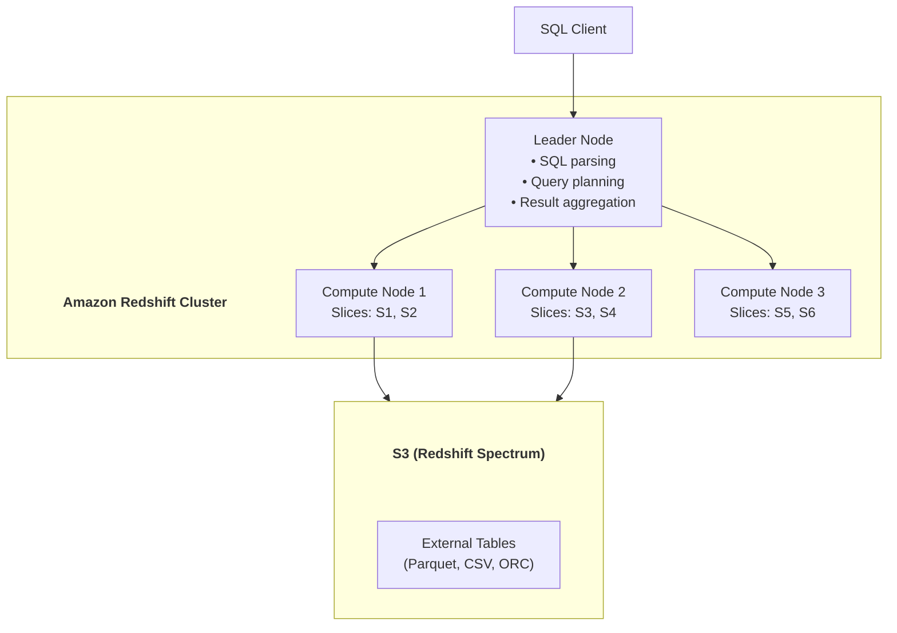
```mermaid
graph TB
    subgraph Redshift[" "]
        Redshift_title["Amazon Redshift Cluster"]
        style Redshift_title fill:none,stroke:none,color:#333,font-weight:bold
        Leader["Leader Node<br/>• SQL parsing<br/>• Query planning<br/>• Result aggregation"]
        
        C1["Compute Node 1<br/>Slices: S1, S2"]
        C2["Compute Node 2<br/>Slices: S3, S4"]
        C3["Compute Node 3<br/>Slices: S5, S6"]
    end

    subgraph S3[" "]
        S3_title["S3 (Redshift Spectrum)"]
        style S3_title fill:none,stroke:none,color:#333,font-weight:bold
        External["External Tables<br/>(Parquet, CSV, ORC)"]
    end

    Client["SQL Client"] --> Leader
    Leader --> C1
    Leader --> C2
    Leader --> C3
    C1 --> S3
    C2 --> S3
```

### Distribution Styles

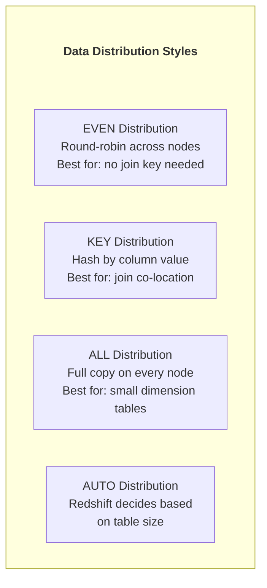
```mermaid
graph TB
    subgraph DistStyles[" "]
        DistStyles_title["Data Distribution Styles"]
        style DistStyles_title fill:none,stroke:none,color:#333,font-weight:bold
        Even["EVEN Distribution<br/>Round-robin across nodes<br/>Best for: no join key needed"]
        Key["KEY Distribution<br/>Hash by column value<br/>Best for: join co-location"]
        All["ALL Distribution<br/>Full copy on every node<br/>Best for: small dimension tables"]
        Auto["AUTO Distribution<br/>Redshift decides based<br/>on table size"]
    end
```

### Zone Maps (Data Skipping)

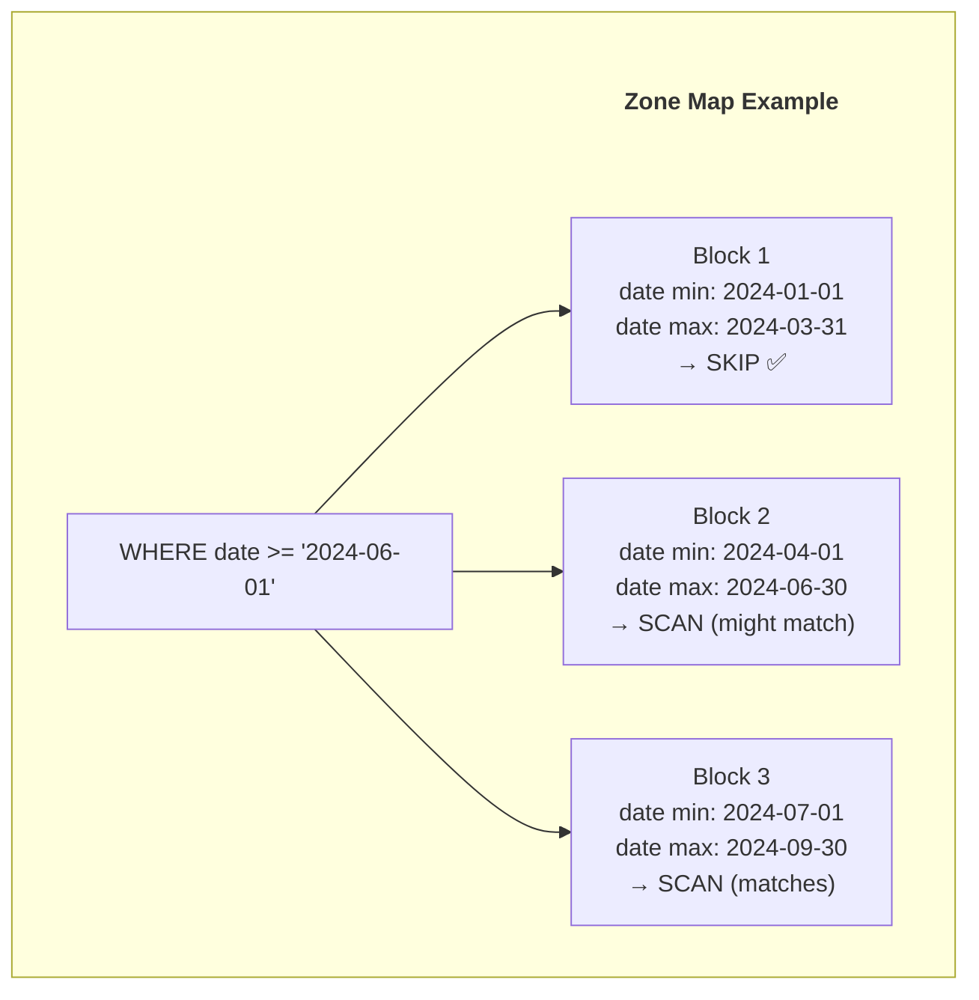
```mermaid
graph TB
    subgraph ZoneMaps[" "]
        ZoneMaps_title["Zone Map Example"]
        style ZoneMaps_title fill:none,stroke:none,color:#333,font-weight:bold
        Query["WHERE date >= '2024-06-01'"]
        
        B1["Block 1<br/>date min: 2024-01-01<br/>date max: 2024-03-31<br/>→ SKIP ✅"]
        B2["Block 2<br/>date min: 2024-04-01<br/>date max: 2024-06-30<br/>→ SCAN (might match)"]
        B3["Block 3<br/>date min: 2024-07-01<br/>date max: 2024-09-30<br/>→ SCAN (matches)"]
    end
    
    Query --> B1
    Query --> B2
    Query --> B3
```

### Impact on Modern Tools
- **Amazon Redshift** — First major cloud MPP warehouse
- Influenced **Snowflake**, **BigQuery** design approaches
- Established cloud data warehousing as standard practice

---

## 7. SNOWFLAKE ELASTIC DATA WAREHOUSE - 2016

### Paper Info
- **Title:** The Snowflake Elastic Data Warehouse
- **Authors:** Benoit Dageville, Thierry Cruanes, et al.
- **Conference:** SIGMOD 2016
- **Link:** https://dl.acm.org/doi/10.1145/2882903.2903741
- **PDF:** https://event.cwi.nl/lsde/papers/p215-dageville-snowflake.pdf

### Key Contributions
- Separation of storage and compute
- Virtual warehouses (independent compute clusters)
- Multi-cluster shared data architecture
- Automatic scaling, suspension, and concurrency

### Architecture

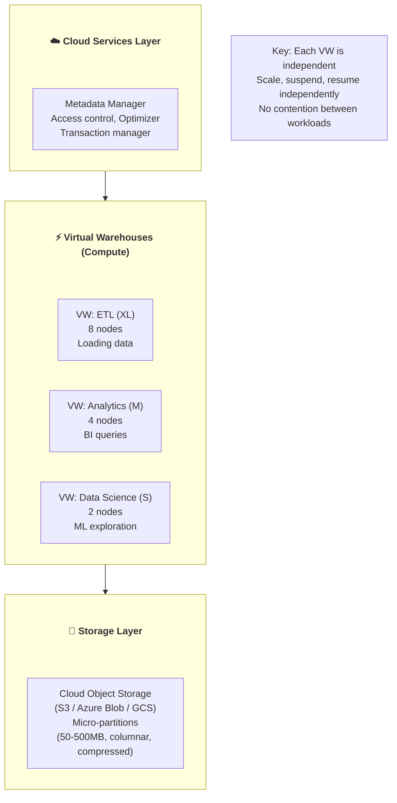
```mermaid
graph TB
    subgraph CloudServices[" "]
        CloudServices_title["☁️ Cloud Services Layer"]
        style CloudServices_title fill:none,stroke:none,color:#333,font-weight:bold
        Meta["Metadata Manager<br/>Access control, Optimizer<br/>Transaction manager"]
    end

    subgraph Compute[" "]
        Compute_title["⚡ Virtual Warehouses (Compute)"]
        style Compute_title fill:none,stroke:none,color:#333,font-weight:bold
        VW1["VW: ETL (XL)<br/>8 nodes<br/>Loading data"]
        VW2["VW: Analytics (M)<br/>4 nodes<br/>BI queries"]
        VW3["VW: Data Science (S)<br/>2 nodes<br/>ML exploration"]
    end

    subgraph Storage[" "]
        Storage_title["💾 Storage Layer"]
        style Storage_title fill:none,stroke:none,color:#333,font-weight:bold
        S3["Cloud Object Storage<br/>(S3 / Azure Blob / GCS)<br/>Micro-partitions<br/>(50-500MB, columnar, compressed)"]
    end

    CloudServices --> Compute
    Compute --> Storage

    Note1["Key: Each VW is independent<br/>Scale, suspend, resume independently<br/>No contention between workloads"]
```

### Micro-Partitions

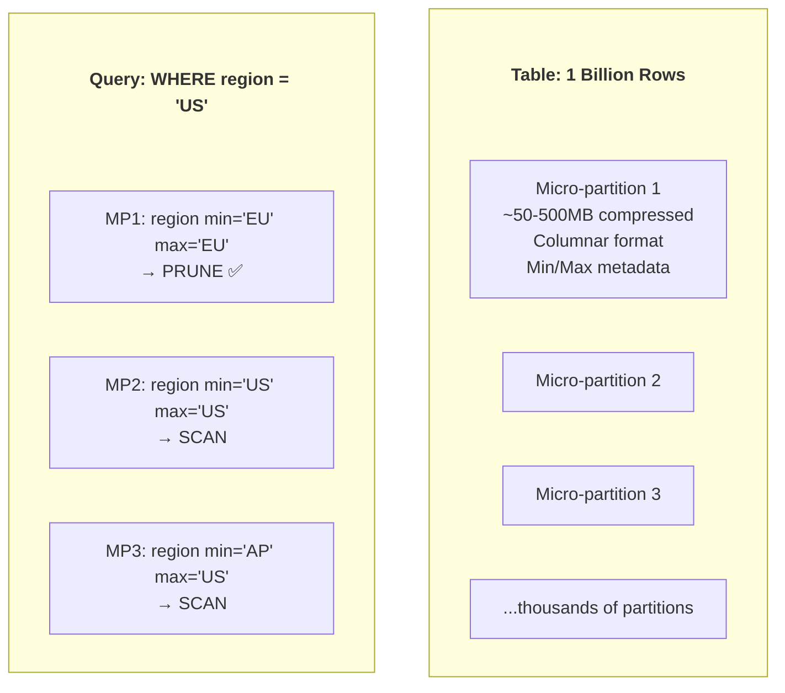
```mermaid
graph TB
    subgraph Table[" "]
        Table_title["Table: 1 Billion Rows"]
        style Table_title fill:none,stroke:none,color:#333,font-weight:bold
        MP1["Micro-partition 1<br/>~50-500MB compressed<br/>Columnar format<br/>Min/Max metadata"]
        MP2["Micro-partition 2"]
        MP3["Micro-partition 3"]
        MPN["...thousands of partitions"]
    end

    subgraph Pruning[" "]
        Pruning_title["Query: WHERE region = 'US'"]
        style Pruning_title fill:none,stroke:none,color:#333,font-weight:bold
        P1["MP1: region min='EU' max='EU'<br/>→ PRUNE ✅"]
        P2["MP2: region min='US' max='US'<br/>→ SCAN"]
        P3["MP3: region min='AP' max='US'<br/>→ SCAN"]
    end
```

### Key Innovations

| Feature | Description |
|---------|-------------|
| **Storage-Compute Separation** | Scale independently; pay for what you use |
| **Multi-cluster Warehouses** | Auto-scale compute for concurrency |
| **Zero-copy Cloning** | Clone databases/tables instantly (metadata only) |
| **Time Travel** | Access historical data up to 90 days |
| **Data Sharing** | Share live data across accounts (no copy) |
| **Automatic Clustering** | Auto-organize micro-partitions |

### Impact on Modern Tools
- **Snowflake** — Market leader in cloud data warehousing
- Storage-compute separation now **industry standard**
- Influenced **Databricks Lakehouse**, **BigQuery** evolution

---

## 8. SPARK SQL - 2015

### Paper Info
- **Title:** Spark SQL: Relational Data Processing in Spark
- **Authors:** Michael Armbrust, Reynold S. Xin, et al.
- **Conference:** SIGMOD 2015
- **Link:** https://dl.acm.org/doi/10.1145/2723372.2742797
- **PDF:** https://people.csail.mit.edu/matei/papers/2015/sigmod_spark_sql.pdf

### Key Contributions
- DataFrame abstraction for structured data
- Catalyst optimizer (extensible, rule + cost-based)
- Data source API for pluggable connectors
- Unified batch and streaming API

### Catalyst Optimizer Pipeline

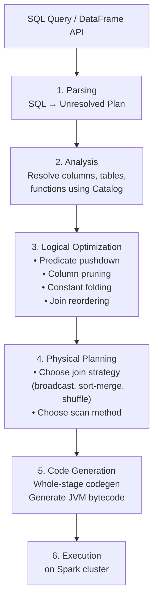
```mermaid
graph TB
    SQL["SQL Query / DataFrame API"] --> Parse["1. Parsing<br/>SQL → Unresolved Plan"]
    Parse --> Analyze["2. Analysis<br/>Resolve columns, tables,<br/>functions using Catalog"]
    Analyze --> Optimize["3. Logical Optimization<br/>• Predicate pushdown<br/>• Column pruning<br/>• Constant folding<br/>• Join reordering"]
    Optimize --> Physical["4. Physical Planning<br/>• Choose join strategy<br/>  (broadcast, sort-merge, shuffle)<br/>• Choose scan method"]
    Physical --> CodeGen["5. Code Generation<br/>Whole-stage codegen<br/>Generate JVM bytecode"]
    CodeGen --> Execute["6. Execution<br/>on Spark cluster"]
```

### Catalyst Optimization Rules

| Rule | Before | After |
|------|--------|-------|
| **Predicate Pushdown** | `scan → filter` | `scan(with filter)` |
| **Column Pruning** | `scan(all cols) → project` | `scan(needed cols)` |
| **Constant Folding** | `1 + 2 + col` | `3 + col` |
| **Boolean Simplification** | `true AND x` | `x` |
| **Join Reordering** | `big ⋈ small ⋈ medium` | `small ⋈ medium ⋈ big` |

### Impact on Modern Tools
- **Apache Spark** — Standard for big data processing
- **Databricks** — Commercial Spark platform
- **Delta Lake** — Built on Spark
- **Photon (Databricks)** — Vectorized C++ engine extending Catalyst

---

## 9. PRESTO (TRINO) - 2019

### Paper Info
- **Title:** Presto: SQL on Everything
- **Authors:** Raghav Sethi, Martin Traverso, et al.
- **Conference:** ICDE 2019
- **Link:** https://trino.io/Presto_SQL_on_Everything.pdf

### Key Contributions
- Federated query engine (SQL on anything)
- Pluggable connector architecture
- In-memory pipelined execution
- Low-latency interactive queries

### Architecture

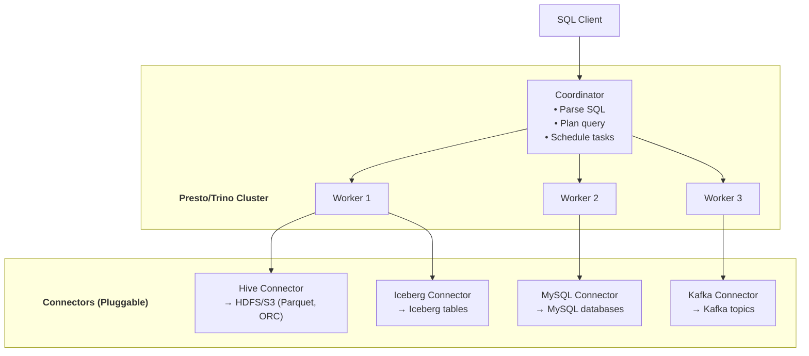
```mermaid
graph TB
    subgraph Presto[" "]
        Presto_title["Presto/Trino Cluster"]
        style Presto_title fill:none,stroke:none,color:#333,font-weight:bold
        Coord["Coordinator<br/>• Parse SQL<br/>• Plan query<br/>• Schedule tasks"]
        
        W1["Worker 1"]
        W2["Worker 2"]
        W3["Worker 3"]
    end

    subgraph Connectors[" "]
        Connectors_title["Connectors (Pluggable)"]
        style Connectors_title fill:none,stroke:none,color:#333,font-weight:bold
        HC["Hive Connector<br/>→ HDFS/S3 (Parquet, ORC)"]
        MC["MySQL Connector<br/>→ MySQL databases"]
        KC["Kafka Connector<br/>→ Kafka topics"]
        IC["Iceberg Connector<br/>→ Iceberg tables"]
    end

    Client["SQL Client"] --> Coord
    Coord --> W1
    Coord --> W2
    Coord --> W3
    W1 --> HC
    W2 --> MC
    W3 --> KC
    W1 --> IC
```

### Federated Query Example

```sql
-- Join data from 3 different systems in one query!
SELECT
    c.name,
    c.email,
    o.total_orders,
    e.recent_events
FROM mysql.app.customers c
JOIN (
    SELECT customer_id, COUNT(*) AS total_orders
    FROM hive.warehouse.orders
    GROUP BY customer_id
) o ON c.id = o.customer_id
JOIN (
    SELECT user_id, COUNT(*) AS recent_events
    FROM kafka.events.user_activity
    GROUP BY user_id
) e ON c.id = e.user_id
ORDER BY o.total_orders DESC
LIMIT 100;
```

### Impact on Modern Tools
- **Trino** (formerly PrestoSQL) — Open-source fork by original creators
- **AWS Athena** — Managed Presto/Trino service
- **Starburst** — Enterprise Trino
- Federated query pattern adopted widely

---

## 10. APACHE ARROW - 2016

### Paper/Documentation Info
- **Title:** Apache Arrow: A Cross-Language Development Platform for In-Memory Data
- **Authors:** Apache Arrow Community (Wes McKinney et al.)
- **Website:** https://arrow.apache.org/
- **Format Spec:** https://arrow.apache.org/docs/format/Columnar.html

### Key Contributions
- Standardized columnar memory format
- Zero-copy data sharing between systems
- Cross-language compatibility (C++, Python, Java, Rust, etc.)
- SIMD-optimized compute kernels

### Arrow Memory Layout

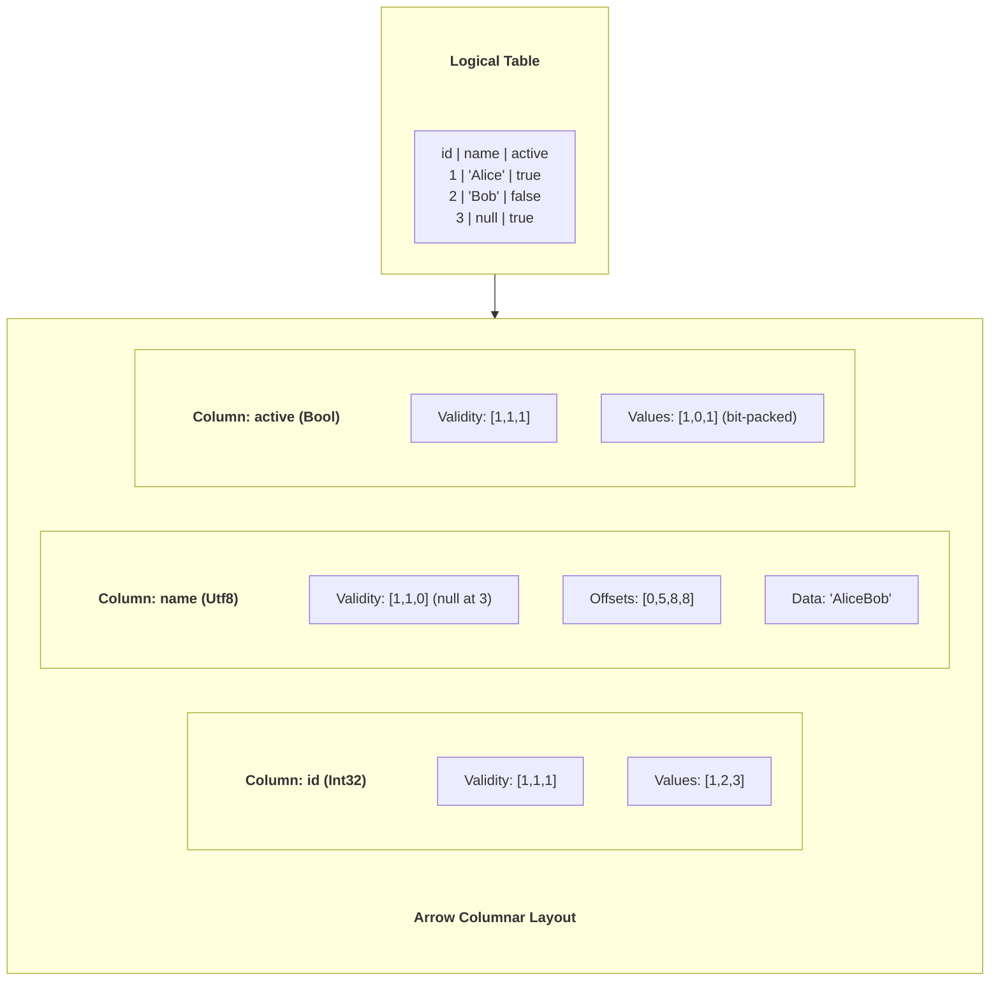
```mermaid
graph TB
    subgraph Logical[" "]
        Logical_title["Logical Table"]
        style Logical_title fill:none,stroke:none,color:#333,font-weight:bold
        LT["id | name    | active<br/>1  | 'Alice' | true<br/>2  | 'Bob'   | false<br/>3  | null    | true"]
    end

    subgraph Arrow[" "]
        Arrow_title["Arrow Columnar Layout"]
        style Arrow_title fill:none,stroke:none,color:#333,font-weight:bold
        subgraph IntCol[" "]
            IntCol_title["Column: id (Int32)"]
            style IntCol_title fill:none,stroke:none,color:#333,font-weight:bold
            IV["Validity: [1,1,1]"]
            ID["Values: [1,2,3]"]
        end
        subgraph StrCol[" "]
            StrCol_title["Column: name (Utf8)"]
            style StrCol_title fill:none,stroke:none,color:#333,font-weight:bold
            SV["Validity: [1,1,0] (null at 3)"]
            SO["Offsets: [0,5,8,8]"]
            SD["Data: 'AliceBob'"]
        end
        subgraph BoolCol[" "]
            BoolCol_title["Column: active (Bool)"]
            style BoolCol_title fill:none,stroke:none,color:#333,font-weight:bold
            BV["Validity: [1,1,1]"]
            BD["Values: [1,0,1] (bit-packed)"]
        end
    end

    Logical --> Arrow
```

### Zero-Copy Ecosystem

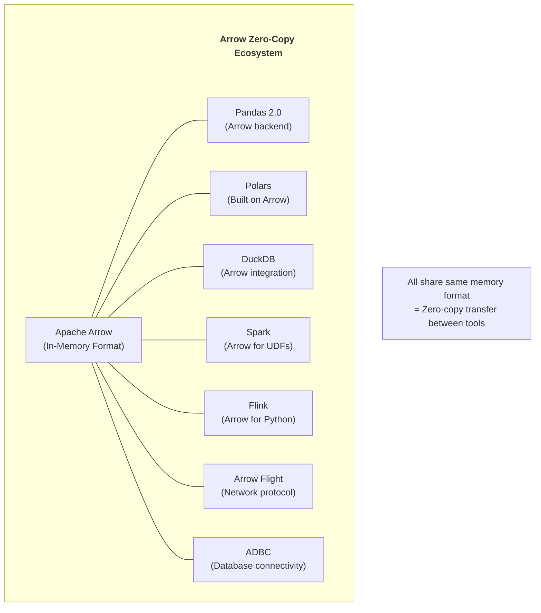
```mermaid
graph TB
    subgraph ArrowEco[" "]
        ArrowEco_title["Arrow Zero-Copy Ecosystem"]
        style ArrowEco_title fill:none,stroke:none,color:#333,font-weight:bold
        Arrow["Apache Arrow<br/>(In-Memory Format)"]
        
        Pandas["Pandas 2.0<br/>(Arrow backend)"]
        Polars["Polars<br/>(Built on Arrow)"]
        DuckDB["DuckDB<br/>(Arrow integration)"]
        Spark["Spark<br/>(Arrow for UDFs)"]
        Flink["Flink<br/>(Arrow for Python)"]
        Flight["Arrow Flight<br/>(Network protocol)"]
        ADBC["ADBC<br/>(Database connectivity)"]
    end

    Arrow --- Pandas
    Arrow --- Polars
    Arrow --- DuckDB
    Arrow --- Spark
    Arrow --- Flink
    Arrow --- Flight
    Arrow --- ADBC

    Note1["All share same memory format<br/>= Zero-copy transfer between tools"]
```

### Impact on Modern Tools
- **Pandas 2.0** — Arrow backend (PyArrow) for better performance
- **Polars** — Built entirely on Arrow
- **DuckDB** — Native Arrow integration
- **Spark, Flink** — Arrow for Python UDFs (no serialization)
- **Arrow Flight** — High-performance data transfer protocol
- **ADBC** — Arrow Database Connectivity (next-gen ODBC/JDBC)

---

## 11. TỔNG KẾT & EVOLUTION

### Timeline

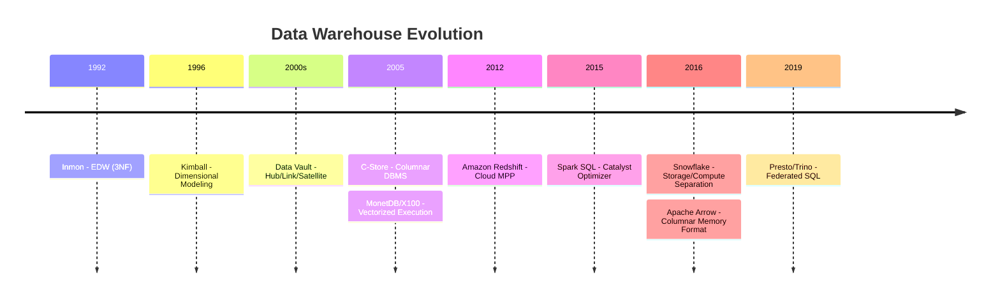
```mermaid
timeline
    title Data Warehouse Evolution
    1992 : Inmon - EDW (3NF)
    1996 : Kimball - Dimensional Modeling
    2000s : Data Vault - Hub/Link/Satellite
    2005 : C-Store - Columnar DBMS
         : MonetDB/X100 - Vectorized Execution
    2012 : Amazon Redshift - Cloud MPP
    2015 : Spark SQL - Catalyst Optimizer
    2016 : Snowflake - Storage/Compute Separation
         : Apache Arrow - Columnar Memory Format
    2019 : Presto/Trino - Federated SQL
```

### Evolution Flow

```mermaid
graph TB
    Row["Row Stores (1970s)<br/>Oracle, PostgreSQL"] --> Col["Column Stores (2005)<br/>C-Store, MonetDB"]
    Col --> CloudDW["Cloud DW (2012+)<br/>Redshift, BigQuery, Snowflake"]
    CloudDW --> Lakehouse["Lakehouse (2020+)<br/>Databricks, open formats"]
    
    Kimball["Kimball (1996)<br/>Dimensional"] --> Modern["Modern DW Modeling"]
    Inmon["Inmon (1992)<br/>3NF EDW"] --> Modern
    DV["Data Vault (2000s)<br/>Hub-Link-Sat"] --> Modern
    
    Arrow["Arrow (2016)<br/>Memory format"] --> ZeroCopy["Zero-copy<br/>Ecosystem"]
    Vec["Vectorization (2005)<br/>MonetDB"] --> ModernEngines["Modern Engines<br/>DuckDB, Velox"]
```

### Summary Table

| Paper/Book | Year | Key Innovation | Modern Tools |
|------------|------|----------------|--------------|
| Inmon DW | 1992 | EDW architecture | Enterprise DW |
| Kimball Toolkit | 1996 | Dimensional modeling | All DW, dbt |
| Data Vault | 2000s | Hub-Link-Satellite | dbt, Enterprise |
| C-Store | 2005 | Columnar DBMS | Vertica, Redshift |
| MonetDB/X100 | 2005 | Vectorized execution | DuckDB, ClickHouse |
| Redshift | 2012 | Cloud MPP | Redshift |
| Spark SQL | 2015 | Catalyst optimizer | Spark, Databricks |
| Snowflake | 2016 | Storage-compute separation | Snowflake |
| Arrow | 2016 | Columnar memory format | Pandas, Polars, DuckDB |
| Presto | 2019 | Federated queries | Trino, Athena |

---

## 📦 Verified Resources

| Resource | Link | Note |
|----------|------|------|
| Kimball Group | [kimballgroup.com](https://www.kimballgroup.com/) | Dimensional modeling |
| Data Vault Alliance | [datavaultalliance.com](https://datavaultalliance.com/) | DV methodology |
| Apache Arrow | [arrow.apache.org](https://arrow.apache.org/) | Format spec + tools |
| Trino Documentation | [trino.io](https://trino.io/docs/current/) | Presto fork docs |
| DDIA Book | [dataintensive.net](https://dataintensive.net/) | Comprehensive reference |

---

## 🔗 Liên Kết Nội Bộ

- [[01_Distributed_Systems_Papers|Distributed Systems Papers]] — Infrastructure papers
- [[06_Database_Internals_Papers|Database Internals]] — Storage engine papers
- [[09_Query_Optimization_Papers|Query Optimization]] — Optimizer papers
- [[../fundamentals/03_Data_Warehousing_Concepts|Data Warehousing Concepts]]
- [[../tools/02_Delta_Lake_Complete_Guide|Delta Lake]] — Open table format

---

*Document Version: 2.0*
*Last Updated: February 2026*
*Coverage: Kimball, Inmon, C-Store, MonetDB, Data Vault, Redshift, Snowflake, Spark SQL, Presto, Arrow*
