# Modern Table Format Papers

## Những Paper Nền Tảng Cho Apache Iceberg, Delta Lake, và Apache Hudi

---

## Mục Lục

1. [Apache Iceberg](#1-apache-iceberg---2017)
2. [Delta Lake](#2-delta-lake---2020)
3. [Apache Hudi](#3-apache-hudi---2017)
4. [Lakehouse: Unified Architecture](#4-lakehouse-unified-architecture---2021)
5. [Apache Paimon](#5-apache-paimon---2023)
6. [Table Format Comparison](#6-table-format-comparison)
7. [Underlying File Formats](#7-underlying-file-formats) *(→ chi tiết: [[10_Serialization_Format_Papers]])*
8. [Academic Foundations](#8-academic-foundations) *(→ chi tiết: [[06_Database_Internals_Papers]])*
9. [Industry Adoption & Case Studies](#9-industry-adoption--case-studies)
10. [Future Directions](#10-future-directions)
11. [Summary Table](#11-summary-table)

---

## 1. APACHE ICEBERG - 2017

### Paper/Documentation Info

- **Title:** Iceberg: A Modern Table Format for Big Data
- **Authors:** Ryan Blue, Daniel Weeks, et al. (Netflix)
- **Original Blog:** https://netflixtechblog.com/iceberg-at-netflix-12d1c3c4d872 (2018)
- **Spec:** https://iceberg.apache.org/spec/
- **Conference Talk:** https://www.youtube.com/watch?v=mf8Hb0coI6o (Spark Summit 2018)
- **GitHub:** https://github.com/apache/iceberg

### Key Contributions
- Hidden partitioning — users don't need to know partition layout
- Schema evolution without data rewrite
- Time travel via snapshot isolation
- Partition evolution — change partitioning without rewriting data
- File-level tracking through manifest files
- Engine-agnostic design — works with Spark, Flink, Trino, Presto, Dremio, StarRocks

### Iceberg Architecture

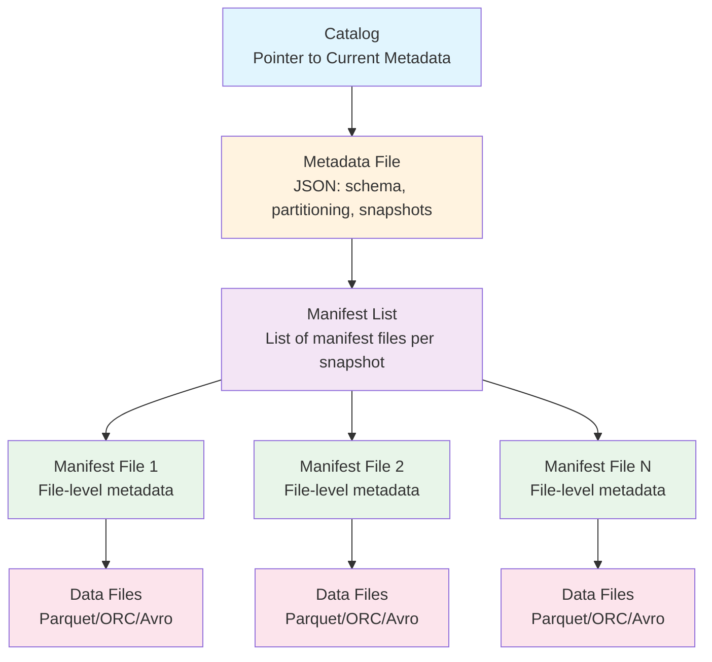

### Hidden Partitioning

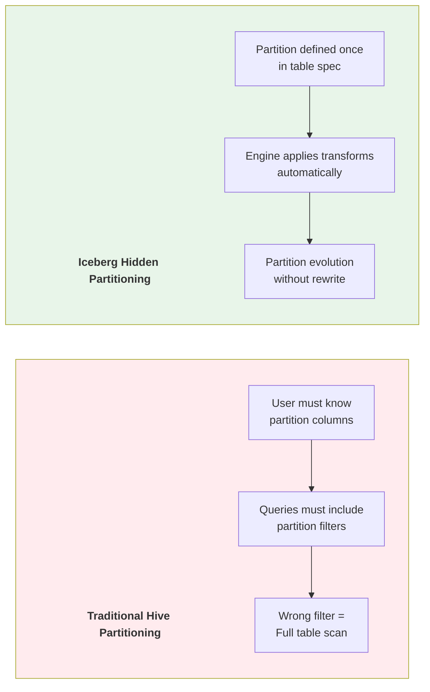

**Partition Transforms Examples:**

```sql
-- Iceberg partition transforms
CREATE TABLE events (
    event_time TIMESTAMP,
    user_id BIGINT,
    event_type STRING,
    payload STRING
) PARTITIONED BY (
    days(event_time),      -- Day-level partitioning
    bucket(16, user_id)    -- Hash bucketing
);

-- Query: user doesn't need to know partition layout
SELECT * FROM events WHERE event_time > '2024-01-01';
-- Iceberg automatically prunes partitions

-- Partition evolution: change without rewrite
ALTER TABLE events
REPLACE PARTITION FIELD days(event_time) WITH hours(event_time);
-- Old data keeps old partitioning, new data uses hourly
```

### Snapshot Isolation & Time Travel

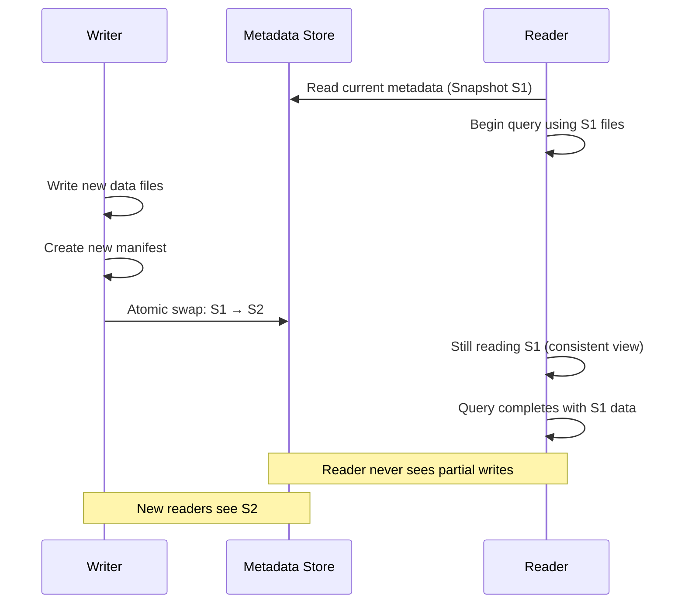

**Time Travel Queries:**

```sql
-- Read specific snapshot
SELECT * FROM events TIMESTAMP AS OF '2024-06-15 10:00:00';

-- Read specific snapshot ID
SELECT * FROM events VERSION AS OF 123456789;

-- View snapshot history
SELECT * FROM events.snapshots;

-- Rollback to previous version
CALL system.rollback_to_snapshot('db.events', 123456789);

-- Cherry-pick operation from another snapshot
CALL system.cherrypick_snapshot('db.events', 987654321);
```

### Manifest File Internals

Each manifest file tracks:
- File path and format (Parquet/ORC/Avro)
- Partition data for that file
- Record count per file
- Column-level min/max statistics
- Null value counts
- NaN value counts (for float/double)
- File size in bytes

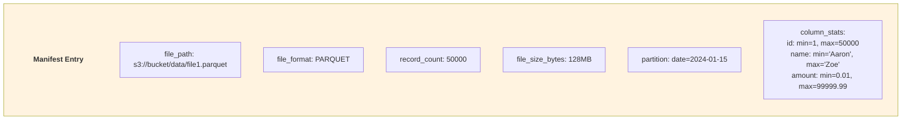

### Schema Evolution Rules

| Operation | Supported | Requires Rewrite |
|-----------|-----------|-------------------|
| Add column | ✅ Yes | No |
| Drop column | ✅ Yes | No |
| Rename column | ✅ Yes | No |
| Reorder columns | ✅ Yes | No |
| Widen type (int→long) | ✅ Yes | No |
| Narrow type (long→int) | ❌ No | N/A |
| Change required→optional | ✅ Yes | No |
| Change optional→required | ❌ No | N/A |

### Iceberg v2 Features (2023+)

- **Row-level Deletes:** Position deletes and equality deletes
- **Merge-on-Read:** Delete files tracked separately
- **Branching & Tagging:** Git-like operations on table versions
- **Sort Orders:** Table-level sort for optimized reads

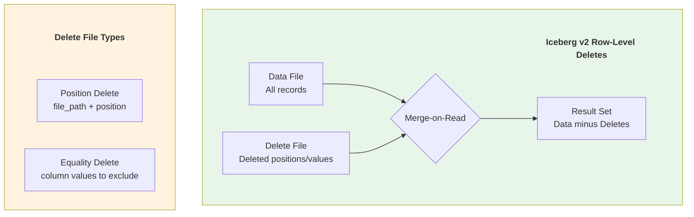

### Design Decisions Summary
- **File-level granularity** — Track individual files, not directories
- **Optimistic concurrency** — Atomic metadata swaps via compare-and-swap
- **Engine-agnostic** — No dependency on specific compute engine
- **Statistics-rich** — Column-level min/max for predicate pushdown
- **Immutable snapshots** — Each snapshot is a complete table state

### Production Usage
- **Netflix** — Petabyte-scale, thousands of tables, origin of Iceberg
- **Apple** — One of the largest Iceberg deployments
- **Airbnb** — Migrated from Hive to Iceberg
- **LinkedIn** — Large-scale data lake management
- **Stripe** — Financial data processing
- **Snowflake** — Native Iceberg Tables support
- **AWS** — Athena, Glue, EMR all support Iceberg

### Limitations & Evolution (Sự thật phũ phàng)
- Iceberg metadata tree mạnh nhưng có thể phình to ở table commit cực dày.
- Row-level deletes tiện nhưng merge-on-read cost tăng nếu delete files tích tụ.
- **Evolution:** metadata compaction, branch/tag workflow, engine-specific optimizers cho delete planning.

### War Stories & Troubleshooting
- Lỗi phổ biến: query chậm dần do **small files + quá nhiều manifests**.
- Fix nhanh: chạy rewrite data files + rewrite manifests theo lịch, enforce target file size từ ingestion.

### Metrics & Order of Magnitude
- File size mục tiêu thường 128-512MB giúp cân bằng parallelism và metadata overhead.
- Manifest count tăng theo số commit/file; planning latency tăng rõ khi không compact.
- Hidden partitioning giảm lỗi query do quên filter partition column.

### Micro-Lab
```sql
-- Kiểm tra snapshot và số lượng file để phát hiện metadata bloat
SELECT snapshot_id, committed_at FROM db.events.snapshots ORDER BY committed_at DESC LIMIT 5;
SELECT COUNT(*) AS data_files FROM db.events.files;
```


---
> 💡 **Gemini Feedback**
> **Góc nhìn Thực chiến (Senior to Junior)**
1. **Limitations & Evolution (Sự thật phũ phàng):** Iceberg giải quyết được bài toán ACID bằng cách đẻ ra một cây gia phả metadata khổng lồ (Snapshot -> Manifest List -> Manifest File). Sự thật phũ phàng là nếu em cứ Insert/Update liên tục (ví dụ từ luồng streaming) mà không bảo trì, thư mục metadata sẽ chứa hàng triệu file JSON/Avro li ti. Khi query, thay vì quét data, hệ thống bị nghẽn mạng chỉ vì phải tải file metadata về đọc.
 
2. **War Stories & Troubleshooting:** Lỗi **"Slow Planning Time"**. Trino gửi câu lệnh `SELECT` xuống Iceberg, và bị treo lửng lơ mất 5 phút trước khi thực sự quét dòng data đầu tiên. Nguyên nhân: Junior không cài đặt job dọn dẹp, Iceberg phải đọc 10.000 file manifest để lập kế hoạch. Cách fix: Bắt buộc phải lên lịch chạy `expire_snapshots` và `rewrite_data_files` (Compaction) hàng ngày hoặc hàng tuần.

3. **Metrics & Order of Magnitude:** Kích thước file Parquet chuẩn trong Iceberg nên được ép ở mức 128MB đến 512MB. Dưới 10MB là rác (small files), trên 1GB thì engine tốn quá nhiều RAM để đọc một cục.

4. **Micro-Lab:** Chạy câu lệnh thần thánh này trên Spark/Trino để dọn dẹp lịch sử Iceberg, cứu vớt dung lượng ổ cứng: `CALL catalog.system.expire_snapshots('my_db.my_table', TIMESTAMP '2026-03-01 00:00:00.000');`

---

## 2. DELTA LAKE - 2020

### Paper Info
- **Title:** Delta Lake: High-Performance ACID Table Storage over Cloud Object Stores
- **Authors:** Michael Armbrust, Tathagata Das, et al. (Databricks)
- **Conference:** VLDB 2020
- **Link:** https://www.vldb.org/pvldb/vol13/p3411-armbrust.pdf
- **GitHub:** https://github.com/delta-io/delta

### Key Contributions
- ACID transactions on cloud object stores (S3, ADLS, GCS)
- JSON-based transaction log with checkpoint compaction
- Time travel via log versioning
- Schema enforcement and evolution
- Z-ordering for multi-dimensional data skipping
- Structured Streaming integration

### Delta Lake Architecture

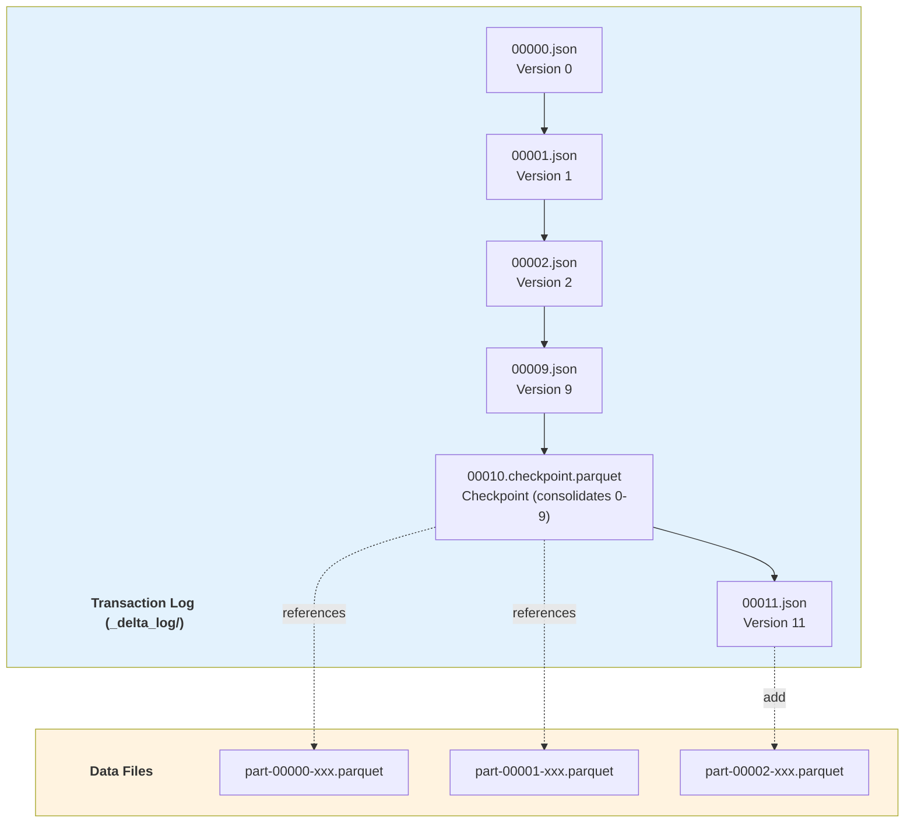

### Transaction Log Actions

```json
// ADD action - register new data file
{
  "add": {
    "path": "part-00001-xxx.parquet",
    "size": 1234567,
    "partitionValues": {"date": "2024-01-15"},
    "modificationTime": 1705312800000,
    "dataChange": true,
    "stats": {
      "numRecords": 1000,
      "minValues": {"id": 1, "amount": 0.01},
      "maxValues": {"id": 1000, "amount": 99999.99},
      "nullCount": {"id": 0, "amount": 5}
    }
  }
}

// REMOVE action - logically delete data file
{
  "remove": {
    "path": "part-00000-old.parquet",
    "deletionTimestamp": 1705312800000,
    "dataChange": true
  }
}

// METADATA action - schema/partition changes
{
  "metaData": {
    "schemaString": "{...}",
    "partitionColumns": ["date"],
    "configuration": {
      "delta.autoOptimize.optimizeWrite": "true"
    }
  }
}

// PROTOCOL action - version requirements
{
  "protocol": {
    "minReaderVersion": 2,
    "minWriterVersion": 5,
    "readerFeatures": ["columnMapping"],
    "writerFeatures": ["columnMapping", "deletionVectors"]
  }
}
```

### Checkpoint Mechanism

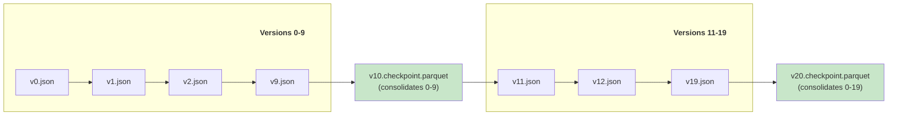

### Optimistic Concurrency Control

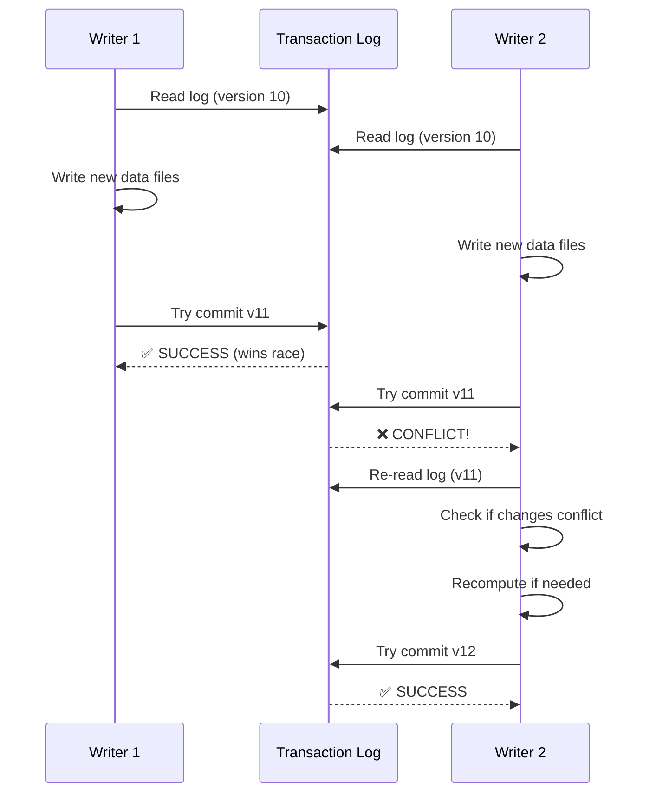

### Z-Ordering & Data Skipping

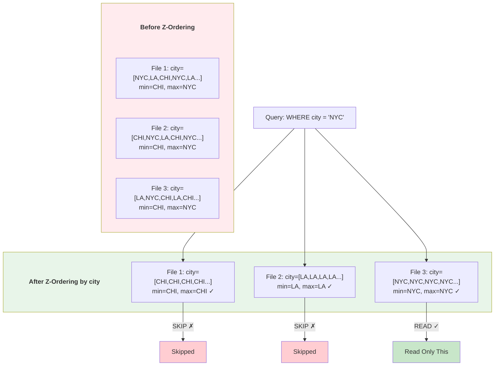

**Z-Order SQL Commands:**

```sql
-- Z-order optimization
OPTIMIZE my_table ZORDER BY (city, date);

-- Liquid Clustering (Delta 3.0+, replaces Z-order)
CREATE TABLE my_table (...) CLUSTER BY (city, date);

-- Auto-optimize settings
ALTER TABLE my_table SET TBLPROPERTIES (
    'delta.autoOptimize.optimizeWrite' = 'true',
    'delta.autoOptimize.autoCompact' = 'true',
    'delta.targetFileSize' = '134217728'  -- 128MB
);

-- Vacuum old files
VACUUM my_table RETAIN 168 HOURS;  -- Keep 7 days

-- Describe history
DESCRIBE HISTORY my_table;
```

### Deletion Vectors (Delta 3.0+)

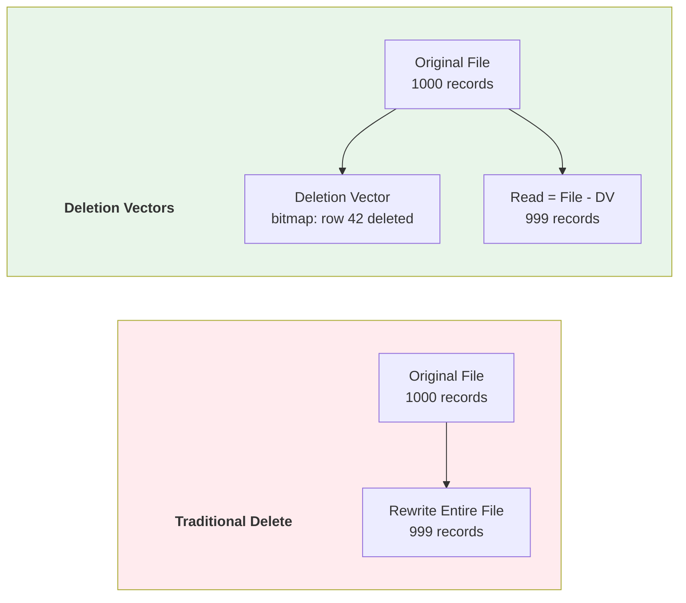

### Delta UniForm (Universal Format)

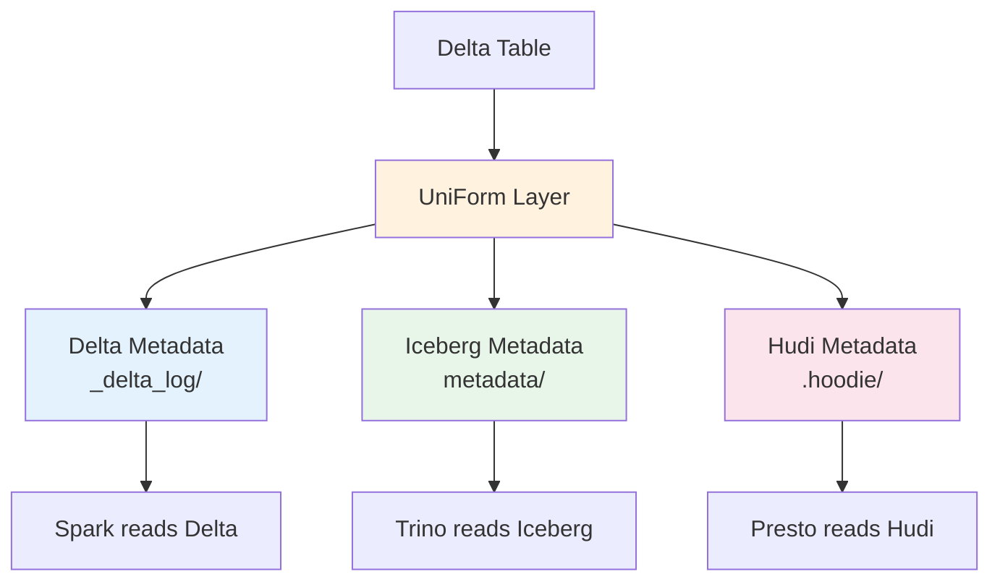

### Key Design Decisions
- **JSON log + Parquet checkpoints** — Human-readable, debuggable, cloud-native
- **Spark-first integration** — Deep integration with Structured Streaming
- **Unity Catalog** — Centralized governance, lineage, access control
- **Open source** — Delta Lake is Apache 2.0 licensed via Linux Foundation

### Production Usage
- **Databricks** — All customers run on Delta Lake
- **Microsoft Fabric** — Delta as default format
- **Starbucks, Comcast, Shell** — Large Delta deployments
- **Over 10,000 organizations** — Use Delta Lake in production

### Limitations & Evolution (Sự thật phũ phàng)
- JSON log đơn giản nhưng có thể chậm replay nếu checkpoint cadence không hợp lý.
- Upsert-heavy workloads dễ phát sinh small files và compaction debt.
- **Evolution:** deletion vectors, liquid clustering, optimized writes/autotune.

### War Stories & Troubleshooting
- Lỗi phổ biến: `MERGE` chạy lâu + VACUUM không hiệu quả do retention/config sai.
- Fix nhanh: tách merge theo partition window, bật optimizeWrite/autoCompact, rà soát retention policy.

### Metrics & Order of Magnitude
- `MERGE` cost phụ thuộc mạnh vào file pruning và clustering quality.
- Checkpoint định kỳ giảm thời gian reconstruct table state khi đọc transaction log.
- Z-order/liquid clustering tốt có thể giảm bytes scanned nhiều lần cho query selective.

### Micro-Lab
```sql
-- Quan sát lịch sử commit để debug write amplification
DESCRIBE HISTORY my_table;

-- Kiểm tra số file hiện tại (Spark SQL/Delta metadata view tùy môi trường)
SELECT COUNT(*) FROM delta.`/path/to/my_table`;
```

---

> 💡 **Gemini Feedback**
> **Góc nhìn Thực chiến (Senior to Junior)**
1. **Limitations & Evolution (Sự thật phũ phàng):** Delta Lake ra đời từ Databricks, và một thời gian dài bản Open Source (OSS) bị "thiến" rất nhiều tính năng xịn so với bản trả phí (Ví dụ: Z-Ordering, OPTIMIZE từng bị giấu đi). Thư mục `_delta_log` chứa hàng ngàn file JSON sinh ra theo mỗi transaction. Nếu em đọc Delta table bằng một engine không hỗ trợ tốt (như Athena bản cũ), nó sẽ parse JSON chậm đến phát khóc.
 
2. **War Stories & Troubleshooting:** Lỗi **"Concurrent Append Exception"**. Khi em cấu hình 2 luồng Spark Streaming cùng ghi vào 1 bảng Delta Lake và chúng vô tình đụng độ nhau ở cùng một file/phân vùng, Delta sẽ bắn ra lỗi xung đột (Conflict) và ngắt job. Delta chỉ hỗ trợ tốt thao tác ghi từ nhiều nguồn (Multi-cluster writes) nếu em dùng tính năng trả phí trên Databricks, còn OSS thì em phải tự retries ở tầng code app.
   
3. **Metrics & Order of Magnitude:** Khi chạy lệnh `OPTIMIZE ... ZORDER BY`, em đang yêu cầu Spark đọc toàn bộ data lên RAM, sort lại theo không gian đa chiều, và ghi xuống đĩa. Job này ngốn CPU khủng khiếp. Nếu chạy trên máy local (như con HP Z440), hãy cẩn thận kẻo cháy CPU, chỉ nên Z-Order trên các cột thường xuyên dùng trong mệnh đề `WHERE`.

4. **Micro-Lab:** Dùng Spark SQL để dọn rác (Vacuum) các file data vật lý đã bị xóa logic ở các transaction cũ (chỉ giữ lại 7 ngày): `VACUUM my_table RETAIN 168 HOURS;`

---

## 3. APACHE HUDI - 2017

### Paper/Documentation Info
- **Title:** Hudi: Hadoop Upserts Deletes and Incrementals
- **Authors:** Vinoth Chandar et al. (Uber)
- **Original Blog:** https://www.uber.com/blog/hoodie/ (2017)
- **RFC:** https://hudi.apache.org/tech-specs/
- **GitHub:** https://github.com/apache/hudi

### Key Contributions
- Efficient upserts on data lakes (first to solve this at scale)
- Copy-on-Write vs Merge-on-Read table types
- Incremental processing — native CDC support
- Timeline-based metadata and versioning
- Indexing for fast record-level lookups
- Concurrency control with multiple lock providers

### Hudi Timeline Architecture

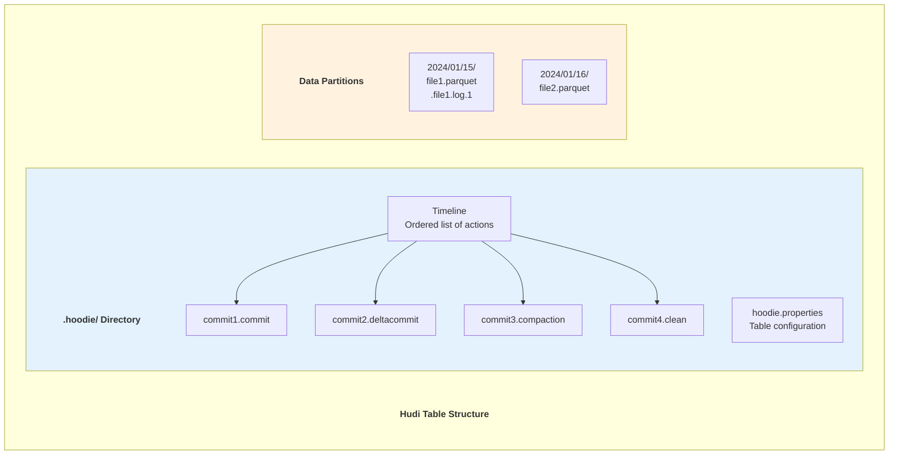

### Table Types: COW vs MOR

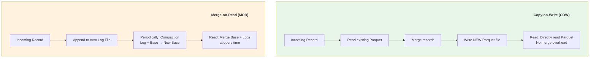

**Detailed Comparison:**

| Aspect | Copy-on-Write (COW) | Merge-on-Read (MOR) |
|--------|---------------------|---------------------|
| Write latency | Higher (full file rewrite) | Lower (append to log) |
| Read latency | Lower (no merge needed) | Higher (merge at read) |
| Storage overhead | Higher (rewrites) | Lower (delta logs) |
| Write amplification | Higher | Lower |
| Best for | Read-heavy workloads | Write-heavy workloads |
| Compaction | Not needed | Required (inline/async) |
| Snapshot query | Direct read | Base + logs merge |
| Read-optimized query | Same as snapshot | Base only (stale) |

### Indexing System

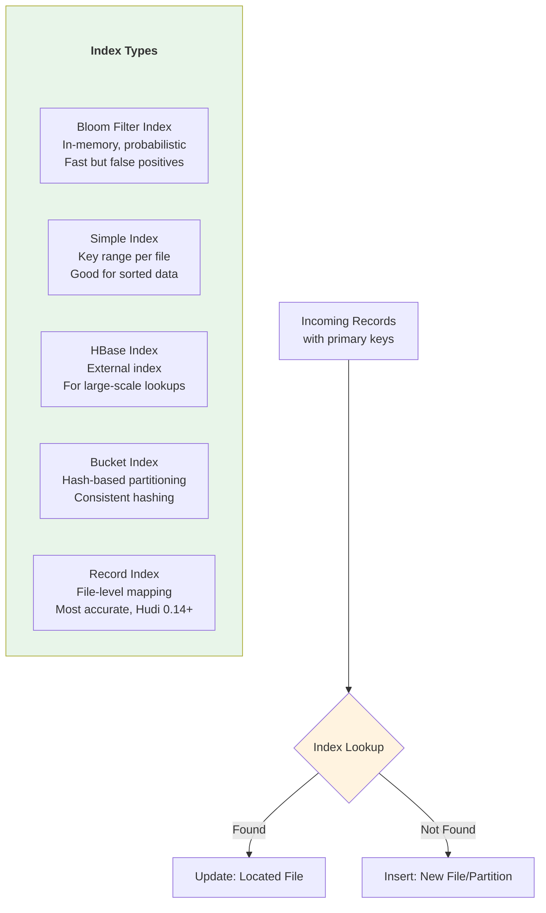

### Incremental Queries

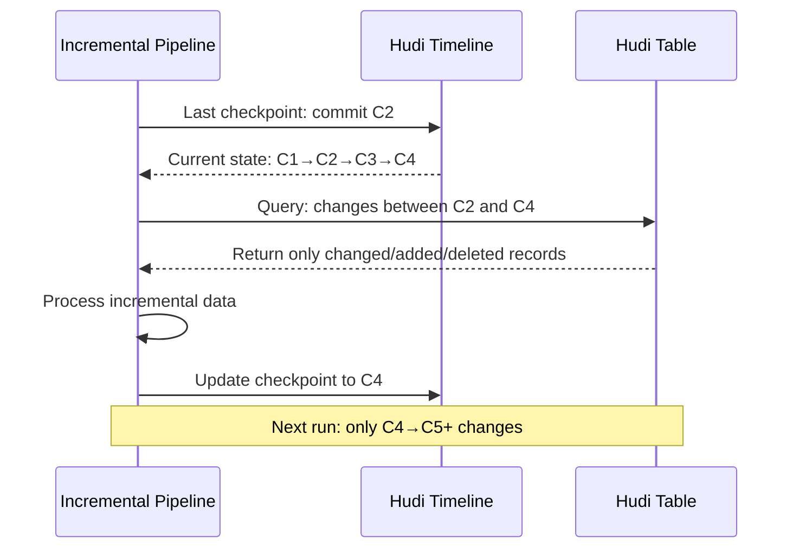

**Incremental Query Types:**

```sql
-- Snapshot Query: full table at latest commit
SELECT * FROM hudi_table;

-- Incremental Query: changes since specific commit
SELECT * FROM hudi_table
WHERE _hoodie_commit_time > '20240115100000';

-- Time Travel Query
SELECT * FROM hudi_table TIMESTAMP AS OF '2024-01-15 10:00:00';

-- Read Optimized Query (MOR only): base files only
SELECT * FROM hudi_table_ro;  -- _ro suffix

-- Real-time Query (MOR only): base + log files
SELECT * FROM hudi_table_rt;  -- _rt suffix
```

### Compaction & Clustering

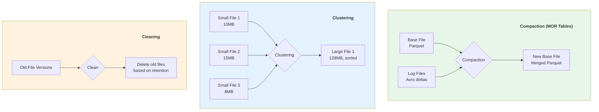

### Hudi Multi-Modal Index (0.14+)

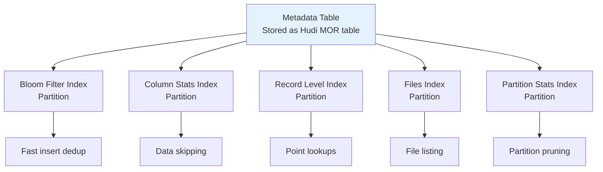

### Key Design Decisions
- **Upsert-first** — Designed from ground up for mutable data
- **Incremental processing** — Native CDC and incremental queries
- **Flexible storage types** — COW vs MOR per use case
- **Rich indexing** — Multiple index types for different access patterns
- **Timeline metadata** — All operations tracked chronologically

### Production Usage
- **Uber** — Origin of Hudi, runs petabyte-scale
- **Amazon/AWS** — EMR native Hudi support, used internally
- **ByteDance** — TikTok's data infrastructure
- **Robinhood** — Financial data with strict correctness requirements
- **Disney+ Hotstar** — Streaming analytics

### Limitations & Evolution (Sự thật phũ phàng)
- Hudi rất mạnh cho upsert nhưng ops tuning (index + compaction + cleaning) khá nặng.
- MOR cho write latency tốt nhưng query path phức tạp hơn COW.
- **Evolution:** metadata table, record index, async services tách rời để giảm pressure.

### War Stories & Troubleshooting
- Lỗi phổ biến: compaction backlog làm read latency tăng theo thời gian.
- Fix nhanh: tăng compaction parallelism, đặt SLA cho log file count, theo dõi timeline lag.

### Metrics & Order of Magnitude
- COW thường read nhanh hơn, MOR thường write nhanh hơn (trade-off theo workload).
- Changelog replay và index lookup là cost trọng yếu của recovery/upsert.
- File sizing + clustering ảnh hưởng trực tiếp query p95.

### Micro-Lab
```sql
-- Incremental pull để verify CDC behavior
SELECT *
FROM hudi_table
WHERE _hoodie_commit_time > '20260320090000';
```

---

> 💡 **Gemini Feedback**
> **Góc nhìn Thực chiến (Senior to Junior)**
1. **Limitations & Evolution (Sự thật phũ phàng):** Hudi là ông vua của thao tác Upsert (Update/Insert) nặng nề, nhưng đi kèm là **"Config Hell"** (Địa ngục cấu hình). Để tune Hudi chạy mượt, em phải thiết lập vài chục tham số (bloom filter, record key, index type, compaction rule). Nó quá nặng nề và phức tạp nếu em chỉ làm các batch job đơn giản.

2. **War Stories & Troubleshooting:** Chết chìm vì **MOR (Merge-On-Read)**. Hudi có chế độ MOR: khi Update, nó chỉ ghi file log nhỏ để ghi đè (cho nhanh), lúc nào có người query thì nó mới tự join log với file gốc ở trên RAM. Một ngày đẹp trời, luồng Compaction (gom log vào gốc) bị sập ngầm. Khi user chạy query `SELECT`, Hudi phải lấy hàng triệu file log ra Merge-On-Read on-the-fly, RAM nổ tung và query timeout vô phương cứu chữa.

3. **Metrics & Order of Magnitude:** Tốc độ Upsert của Hudi nhanh hơn Iceberg nhờ thiết kế Index (Bloom Filter/HBase). Tuy nhiên độ trễ khi read ở chế độ MOR sẽ chậm hơn từ 2x-5x so với COW (Copy-On-Write) do overhead lúc gộp dữ liệu.

4. **Micro-Lab:** Khi cấu hình ghi Hudi trên Spark, luôn nhớ phải định nghĩa khóa chính và cột thời gian để nó biết đường Upsert: `df.write.format("hudi").option("hoodie.datasource.write.recordkey.field", "uuid").option("hoodie.datasource.write.precombine.field", "ts").save(path)`

---


## 4. LAKEHOUSE: UNIFIED ARCHITECTURE - 2021

### Paper Info
- **Title:** Lakehouse: A New Generation of Open Platforms that Unify Data Warehousing and Advanced Analytics
- **Authors:** Michael Armbrust, Ali Ghodsi, et al. (Databricks)
- **Conference:** CIDR 2021
- **Link:** https://www.cidrdb.org/cidr2021/papers/cidr2021_paper17.pdf

### Key Contributions
- Unified data warehouse + data lake architecture
- ACID transactions on open file formats
- Direct access for ML/DS workloads without ETL
- SQL performance comparable to traditional warehouses on open formats
- Elimination of data silos between analytics and ML

### Evolution of Data Architectures

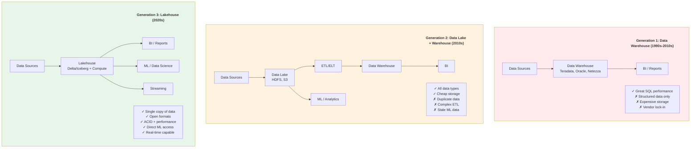

### Lakehouse Requirements

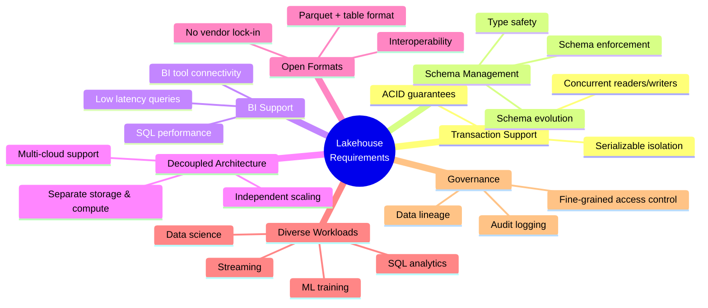

### Lakehouse vs Traditional Architectures

| Capability | Data Warehouse | Data Lake | Lakehouse |
|-----------|---------------|-----------|-----------|
| Data types | Structured | All | All |
| ACID transactions | ✅ Yes | ❌ No | ✅ Yes |
| Schema enforcement | ✅ Yes | ❌ No | ✅ Yes |
| BI performance | ⭐ Excellent | ❌ Poor | ⭐ Good-Excellent |
| ML/DS access | ❌ Limited | ✅ Direct | ✅ Direct |
| Storage cost | 💰💰💰 High | 💰 Low | 💰 Low |
| Data freshness | ⏰ Batch ETL | ✅ Real-time | ✅ Real-time |
| Open formats | ❌ Proprietary | ✅ Yes | ✅ Yes |
| Governance | ✅ Mature | ❌ Limited | ✅ Growing |

### Medallion Architecture (Lakehouse Pattern)

```mermaid
graph LR
    Sources[Raw Data Sources] --> Bronze
    
    subgraph Bronze[" "]
        Bronze_title["🥉 Bronze Layer"]
        style Bronze_title fill:none,stroke:none,color:#333,font-weight:bold
        B1[Raw ingestion]
        B2[Append-only]
        B3[Schema-on-read]
        B4[Full history]
    end

    Bronze --> Silver

    subgraph Silver[" "]
        Silver_title["🥈 Silver Layer"]
        style Silver_title fill:none,stroke:none,color:#333,font-weight:bold
        S1[Cleaned & validated]
        S2[Deduped]
        S3[Standardized schema]
        S4[Business logic applied]
    end

    Silver --> Gold

    subgraph Gold[" "]
        Gold_title["🥇 Gold Layer"]
        style Gold_title fill:none,stroke:none,color:#333,font-weight:bold
        G1[Business-level aggregates]
        G2[Feature tables]
        G3[Report-ready datasets]
        G4[Star/snowflake schemas]
    end

    Gold --> BI[BI Dashboards]
    Gold --> ML[ML Models]
    Gold --> API[APIs]

    style Bronze fill:#d7ccc8
    style Silver fill:#cfd8dc
    style Gold fill:#fff9c4
```

### Impact on Industry
- **Databricks** — Lakehouse Platform, coined the term
- **Snowflake** — "Data Cloud" with Iceberg support
- **Google BigQuery** — BigLake unifying storage
- **AWS** — Lake Formation + Athena approach
- **Microsoft Fabric** — OneLake lakehouse architecture
- **Apache Spark** — Primary compute engine for lakehouses

### Limitations & Evolution (Sự thật phũ phàng)
- Lakehouse hứa hẹn “one platform” nhưng governance/multi-engine compatibility vẫn là bài toán khó.
- Team dễ đánh đổi chuẩn hóa dữ liệu để lấy tốc độ delivery ngắn hạn.
- **Evolution:** data contracts, semantic layer, federated governance tự động hóa policy.

### War Stories & Troubleshooting
- Lỗi phổ biến: Bronze/Silver/Gold drift semantics giữa team gây trust issue.
- Fix nhanh: định nghĩa contract cho mỗi layer, test chất lượng bắt buộc trước promote layer.

### Metrics & Order of Magnitude
- Freshness SLA theo layer thường chênh nhau rõ (Bronze gần real-time, Gold theo batch/window).
- Cost optimize thành công thường đến từ pruning + file compaction + workload isolation.
- Data quality incident MTTR là KPI vận hành quan trọng ngang với latency.

### Micro-Lab
```sql
-- Gate đơn giản trước khi promote Silver -> Gold
SELECT COUNT(*) AS bad_rows
FROM silver.orders
WHERE order_id IS NULL OR amount < 0;
```

---

> 💡 **Gemini Feedback**
> **Góc nhìn Thực chiến (Senior to Junior)**
1. **Limitations & Evolution (Sự thật phũ phàng):** Lakehouse thực chất là một khái niệm Marketing thông minh do Databricks đẻ ra để giành miếng bánh với Snowflake (Warehouse). Nó không thần thánh đến mức "Xóa bỏ hoàn toàn Warehouse". Em vĩnh viễn không thể cắm trực tiếp 10.000 user đang xài BI Dashboard vào Lakehouse được, vì cơ chế Query Engine của Lakehouse (dù có xài Photon) vẫn chưa tối ưu Concurrency (đồng thời) tốt như một Warehouse chuyên dụng thực thụ.
 
2. **War Stories & Troubleshooting:** Các công ty bị ảo tưởng sức mạnh, cố gắng dùng Lakehouse làm cơ sở dữ liệu xử lý giao dịch (OLTP) như kiểu Postgres. Kết quả là hệ thống sập toàn tập vì Storage Object (S3) có API rate limit cực thấp, không sinh ra để nhận vài vạn cú ping đọc/ghi vài byte mỗi giây. Lakehouse chỉ dành cho Analytics (OLAP).

---
## 5. APACHE PAIMON - 2023

### Documentation Info
- **Title:** Apache Paimon: A Streaming Data Lake Platform
- **Authors:** Originally developed at Alibaba as Flink Table Store
- **Website:** https://paimon.apache.org/
- **GitHub:** https://github.com/apache/paimon

### Key Contributions
- Streaming-first lake format (tight Flink integration)
- Built-in changelog support for CDC
- LSM-tree based storage for high write throughput
- Merge engines for different update semantics
- Partial update and aggregation merge support

### Paimon Architecture

```mermaid
graph TD
    subgraph Writers[" "]
        Writers_title["Write Path"]
        style Writers_title fill:none,stroke:none,color:#333,font-weight:bold
        FJ[Flink Job<br/>Streaming writes] --> BK[Bucket Writer<br/>Per-partition bucketing]
        BK --> LSM[LSM Tree<br/>Sorted String Tables]
    end

    subgraph Storage[" "]
        Storage_title["Storage Layer"]
        style Storage_title fill:none,stroke:none,color:#333,font-weight:bold
        LSM --> L0[Level 0<br/>Unsorted, latest writes]
        L0 --> L1[Level 1<br/>Sorted, merged]
        L1 --> LN[Level N<br/>Fully compacted]
    end

    subgraph Readers[" "]
        Readers_title["Read Path"]
        style Readers_title fill:none,stroke:none,color:#333,font-weight:bold
        LN --> SS[Snapshot Scan<br/>Latest state]
        LSM --> CL[Changelog Scan<br/>Incremental changes]
    end

    style Writers fill:#e3f2fd
    style Storage fill:#fff3e0
    style Readers fill:#e8f5e9
```

### Merge Engines

| Engine | Description | Use Case |
|--------|------------|----------|
| Deduplicate | Keep latest record by key | General upsert |
| Partial Update | Merge partial columns | Wide table updates |
| Aggregation | Pre-aggregate on write | Metrics/counters |
| First Row | Keep first occurrence | Deduplication |

```sql
-- Paimon table with primary key and merge engine
CREATE TABLE user_events (
    user_id BIGINT,
    event_type STRING,
    event_count BIGINT,
    last_event_time TIMESTAMP,
    PRIMARY KEY (user_id) NOT ENFORCED
) WITH (
    'merge-engine' = 'aggregation',
    'fields.event_count.aggregate-function' = 'sum',
    'fields.last_event_time.aggregate-function' = 'last_value'
);
```

### Paimon vs Other Formats

| Feature | Paimon | Iceberg | Delta | Hudi |
|---------|--------|---------|-------|------|
| Streaming writes | ⭐ Native | Good | Good | Good |
| Changelog support | ⭐ Built-in | External | External | External |
| Merge engines | ⭐ Multiple | N/A | N/A | Limited |
| Flink integration | ⭐ Tight | Good | Limited | Good |
| Spark support | Good | ⭐ Excellent | ⭐ Excellent | Good |
| Community size | Growing | ⭐ Large | ⭐ Large | Large |
| Maturity | Newer | Mature | Mature | Mature |

### Limitations & Evolution (Sự thật phũ phàng)
- Paimon rất hợp streaming-first nhưng ecosystem còn trẻ hơn Iceberg/Delta/Hudi.
- Multi-engine interoperability chưa rộng bằng các format trưởng thành.
- **Evolution:** connector maturity, metadata/index improvements, broader lakehouse integration.

### War Stories & Troubleshooting
- Lỗi phổ biến: compaction pressure cao khi ingest burst + key cardinality lớn.
- Fix nhanh: tune bucket count/merge engine, tách stream theo domain key, kiểm soát commit frequency.

### Metrics & Order of Magnitude
- LSM-based write path thường cho throughput ingest cao hơn ở workload update liên tục.
- Compaction backlog là leading indicator cho read latency degradation.
- Bucket sizing ảnh hưởng trực tiếp đến skew và parallelism.

### Micro-Lab
```sql
-- Sanity check changelog merge result
SELECT user_id, SUM(event_count) AS total
FROM user_events
GROUP BY user_id
ORDER BY total DESC
LIMIT 10;
```

---

> 💡 **Gemini Feedback**
> **Góc nhìn Thực chiến (Senior to Junior)**
1. **Limitations & Evolution (Sự thật phũ phàng):** Paimon sinh sau đẻ muộn, khắc phục điểm yếu của Iceberg ở mảng Streaming Upsert bằng cách nhúng thẳng cấu trúc **LSM-Tree** (giống hệt RocksDB/Cassandra) xuống S3/HDFS. Yếu điểm của Paimon là nó "bị khóa" khá chặt vào hệ sinh thái Flink. Nếu em xài Spark thì hỗ trợ không được mượt bằng Iceberg.
 
2. **War Stories & Troubleshooting:** Đặc sản của LSM-Tree là **Read Amplification** (Khuếch đại khi đọc). Nếu em thiết kế cấu hình Paimon dở, các file Level 0 (nhận luồng write) phình to mà không kịp đẩy xuống Level 1, Level 2. Khi query một record, hệ thống phải lục lọi hàng trăm file ở tất cả các Level, ổ đĩa I/O kêu gào thảm thiết và tốc độ rùa bò.

3. **Metrics & Order of Magnitude:** Nhờ LSM-Tree, tốc độ Ingestion (nạp data real-time) của Paimon khi có thay đổi bản ghi (CDC) đang giữ ngôi vương, vượt mặt cả Hudi và Iceberg ở quy mô siêu lớn. Phù hợp nhất cho kiến trúc Streaming Lakehouse.

4. **Micro-Lab:** Nếu có dùng Flink SQL, hãy thử tạo bảng Paimon với bucket mặc định để test hiệu năng ghi: `CREATE TABLE my_paimon_table (id INT, val STRING, PRIMARY KEY (id) NOT ENFORCED) WITH ('connector' = 'paimon', 'bucket' = '4');`

---

## 6. TABLE FORMAT COMPARISON

### Feature Comparison Matrix

```mermaid
graph TD
    subgraph Comparison[" "]
        Comparison_title["Table Format Ecosystem"]
        style Comparison_title fill:none,stroke:none,color:#333,font-weight:bold
        IC[Apache Iceberg<br/>Engine-agnostic<br/>Partition evolution<br/>Rich metadata]
        DL[Delta Lake<br/>Spark-first<br/>Z-ordering<br/>UniForm]
        HU[Apache Hudi<br/>Upsert-first<br/>COW/MOR<br/>Incremental]
        PA[Apache Paimon<br/>Stream-first<br/>LSM storage<br/>Merge engines]
    end

    IC --- Common{{"Common Features:<br/>ACID, Time Travel,<br/>Schema Evolution,<br/>Open Formats"}}
    DL --- Common
    HU --- Common
    PA --- Common

    style IC fill:#e3f2fd
    style DL fill:#e8f5e9
    style HU fill:#fce4ec
    style PA fill:#fff3e0
    style Common fill:#f5f5f5
```

### Detailed Technical Comparison

| Feature | Iceberg | Delta Lake | Hudi | Paimon |
|---------|---------|------------|------|--------|
| **Core** | | | | |
| ACID Transactions | ✅ | ✅ | ✅ | ✅ |
| Time Travel | ✅ Snapshots | ✅ Log versions | ✅ Timeline | ✅ Snapshots |
| Schema Evolution | ✅ Full | ✅ Full | ✅ Full | ✅ Full |
| **Partitioning** | | | | |
| Hidden Partitioning | ✅ Yes | ❌ No | ❌ No | ✅ Yes |
| Partition Evolution | ✅ Yes | ❌ Rewrite | ⚠️ Limited | ⚠️ Limited |
| Partition Transforms | ✅ Rich | ❌ Basic | ❌ Basic | ⚠️ Limited |
| **Read/Write** | | | | |
| Merge-on-Read | ✅ v2 | ✅ DV (v3) | ✅ Native | ✅ LSM |
| Copy-on-Write | ✅ | ✅ | ✅ | ❌ |
| Row-level Deletes | ✅ Delete files | ✅ Deletion vectors | ✅ Native | ✅ LSM |
| **Optimization** | | | | |
| Compaction | ✅ | ✅ OPTIMIZE | ✅ Inline/Async | ✅ Auto |
| Z-ordering | ✅ v2 | ✅ Native | ❌ | ❌ |
| Liquid Clustering | ❌ | ✅ v3 | ❌ | ❌ |
| **Streaming** | | | | |
| Streaming Support | ✅ Good | ✅ Excellent | ✅ Good | ⭐ Native |
| Incremental Read | ✅ | ✅ | ✅ Native | ✅ Changelog |
| CDC Support | ⚠️ External | ⚠️ External | ✅ Native | ⭐ Native |
| **Ecosystem** | | | | |
| Spark | ⭐ Excellent | ⭐ Native | ✅ Good | ✅ Good |
| Flink | ✅ Good | ⚠️ Limited | ✅ Good | ⭐ Native |
| Trino/Presto | ✅ Native | ✅ Good | ✅ Good | ⚠️ Limited |
| Hive | ✅ | ⚠️ | ✅ | ✅ |

### Metadata Structure Comparison

```mermaid
graph TD
    subgraph IcebergMD[" "]
        IcebergMD_title["Iceberg Metadata"]
        style IcebergMD_title fill:none,stroke:none,color:#333,font-weight:bold
        IC1[Catalog] --> IC2[metadata.json]
        IC2 --> IC3[manifest-list.avro]
        IC3 --> IC4[manifest-1.avro]
        IC3 --> IC5[manifest-2.avro]
        IC4 --> IC6[data files]
        IC5 --> IC7[data files]
    end

    subgraph DeltaMD[" "]
        DeltaMD_title["Delta Lake Metadata"]
        style DeltaMD_title fill:none,stroke:none,color:#333,font-weight:bold
        DL1["_delta_log/"]
        DL1 --> DL2["*.json<br/>(per version)"]
        DL1 --> DL3["*.checkpoint.parquet<br/>(every 10 versions)"]
        DL2 --> DL4[data files]
        DL3 --> DL4
    end

    subgraph HudiMD[" "]
        HudiMD_title["Hudi Metadata"]
        style HudiMD_title fill:none,stroke:none,color:#333,font-weight:bold
        HU1[".hoodie/"]
        HU1 --> HU2[hoodie.properties]
        HU1 --> HU3["timeline/<br/>*.commit, *.deltacommit"]
        HU3 --> HU4[data files]
        HU4 --> HU5["+ log files (MOR)"]
    end

    subgraph PaimonMD[" "]
        PaimonMD_title["Paimon Metadata"]
        style PaimonMD_title fill:none,stroke:none,color:#333,font-weight:bold
        PA1["manifest/"]
        PA1 --> PA2[snapshot files]
        PA2 --> PA3[manifest files]
        PA3 --> PA4["data files<br/>(LSM sorted)"]
    end

    style IcebergMD fill:#e3f2fd
    style DeltaMD fill:#e8f5e9
    style HudiMD fill:#fce4ec
    style PaimonMD fill:#fff3e0
```

### Concurrency Control Comparison

```mermaid
graph TD
    subgraph IcebergCC[" "]
        IcebergCC_title["Iceberg"]
        style IcebergCC_title fill:none,stroke:none,color:#333,font-weight:bold
        IOL[Optimistic Locking]
        IOL --> ICS[Compare-and-Swap<br/>on metadata pointer]
        ICS --> IR[Retry with new snapshot]
    end

    subgraph DeltaCC[" "]
        DeltaCC_title["Delta Lake"]
        style DeltaCC_title fill:none,stroke:none,color:#333,font-weight:bold
        DOL[Optimistic Locking]
        DOL --> DCR[Conflict Resolution Rules<br/>Append-append OK<br/>Disjoint-write OK]
        DCR --> DR[Recompute if needed]
    end

    subgraph HudiCC[" "]
        HudiCC_title["Hudi"]
        style HudiCC_title fill:none,stroke:none,color:#333,font-weight:bold
        HOL["Optimistic OR Pessimistic"]
        HOL --> HLP["Lock Providers:<br/>Zookeeper<br/>DynamoDB<br/>HiveMetastore<br/>FileSystem"]
    end

    style IcebergCC fill:#e3f2fd
    style DeltaCC fill:#e8f5e9
    style HudiCC fill:#fce4ec
```

### When to Use Each Format

```mermaid
graph TD
    Start{What's your<br/>primary need?} -->|"Engine agnostic"| IC[Apache Iceberg]
    Start -->|"Databricks/Spark"| DL[Delta Lake]
    Start -->|"Heavy upserts/CDC"| HU[Apache Hudi]
    Start -->|"Streaming-first"| PA[Apache Paimon]

    IC -->|"Multi-engine:<br/>Spark+Trino+Flink"| IC_USE["✅ Best choice"]
    IC -->|"Partition evolution<br/>needed"| IC_USE
    IC -->|"Netflix/Apple/Airbnb<br/>patterns"| IC_USE

    DL -->|"Already on<br/>Databricks"| DL_USE["✅ Best choice"]
    DL -->|"Spark is primary<br/>engine"| DL_USE
    DL -->|"Microsoft Fabric"| DL_USE

    HU -->|"Frequent updates<br/>& deletes"| HU_USE["✅ Best choice"]
    HU -->|"Incremental<br/>processing"| HU_USE
    HU -->|"CDC from databases"| HU_USE

    PA -->|"Flink is primary<br/>engine"| PA_USE["✅ Best choice"]
    PA -->|"Need built-in<br/>changelog"| PA_USE
    PA -->|"Pre-aggregation<br/>on write"| PA_USE

    style IC fill:#e3f2fd
    style DL fill:#e8f5e9
    style HU fill:#fce4ec
    style PA fill:#fff3e0
```

---

## 7. UNDERLYING FILE FORMATS

Iceberg, Delta Lake, Hudi và Paimon là metadata/transaction layer nằm trên các serialization formats; lựa chọn format đúng quyết định trực tiếp scan cost, update path và interoperability giữa engines.

### Apache Parquet

Parquet là default storage format cho hầu hết lakehouse/table formats vì tối ưu cho analytical scan và predicate pruning ở tầng execution. Trong thực chiến, hầu hết tuning về file sizing/compaction đều nhằm phát huy tốt đặc tính của Parquet.

> 📖 **Chi tiết kỹ thuật (file structure, Dremel encoding, predicate pushdown, compression codecs):** xem [[10_Serialization_Format_Papers#3-apache-parquet---2013]]

---

### Apache ORC

ORC thường xuất hiện trong hệ sinh thái Hive hoặc workloads legacy cần tương thích sâu với stack cũ. Với đa số kiến trúc table format hiện đại đa-engine, ORC là phương án ngữ cảnh đặc thù hơn là mặc định.

> 📖 **Chi tiết kỹ thuật (stripe structure, 3-level indexes, ACID, ORC vs Parquet):** xem [[10_Serialization_Format_Papers#4-apache-orc---2013]]

---

### Apache Avro

Avro chủ yếu đóng vai trò metadata/log serialization trong table format internals (ví dụ manifest/log files), nơi schema evolution ổn định rất quan trọng. Nó ít khi là lựa chọn chính cho analytical data files nhưng rất quan trọng cho compatibility ở control plane.

> 📖 **Chi tiết kỹ thuật (schema evolution rules, encoding, Schema Registry):** xem [[10_Serialization_Format_Papers#1-apache-avro---2009]]

---

### Apache Arrow

Arrow không thay thế table files trên object storage, nhưng là lớp in-memory exchange quan trọng để giảm overhead khi data đi qua nhiều engines/runtime (SQL engine, Python, BI, UDF). Trong kiến trúc lakehouse production, Arrow giúp tăng tốc interoperability và data serving path.

> 📖 **Chi tiết kỹ thuật (memory layout, zero-copy, Arrow Flight, IPC formats):** xem [[10_Serialization_Format_Papers#5-apache-arrow---2016]]

---

## 8. ACADEMIC FOUNDATIONS

Table formats xây trên 3 nền tảng lý thuyết chính. Hiểu chúng giải thích **WHY** table formats hoạt động như vậy.

### LSM-Tree → Tại sao Paimon nhanh khi write

Apache Paimon sử dụng LSM-Tree storage — buffer writes trong memory, flush sorted runs ra disk, compact periodically. Đây là lý do Paimon có write throughput cao hơn Iceberg/Delta cho streaming workloads.

> 📖 **Chi tiết kỹ thuật (write path, read path, compaction strategies, amplification factors):** xem [[06_Database_Internals_Papers#1-lsm-tree---1996]]

### MVCC → Tại sao Time Travel hoạt động

Tất cả table formats (Iceberg snapshots, Delta versions, Hudi timeline) đều implement MVCC ở table-level: mỗi commit tạo version mới, readers đọc consistent snapshot, writers không block readers.

> 📖 **Chi tiết kỹ thuật (version chains, visibility rules, PostgreSQL/InnoDB implementation):** xem [[06_Database_Internals_Papers#3-mvcc---1981]]

### B-Tree vs LSM-Tree → Tại sao có COW và MOR

Sự khác biệt giữa B-Tree (in-place update, read-optimized) và LSM-Tree (append-only, write-optimized) map trực tiếp sang table format patterns: **COW** = B-Tree thinking (rewrite file), **MOR** = LSM thinking (append log, merge later).

> 📖 **Chi tiết kỹ thuật (B-Tree operations, LSM amplification, so sánh chi tiết):** xem [[06_Database_Internals_Papers#2-b-tree---19701979]]

### Copy-on-Write vs Redirect-on-Write

| Aspect | Copy-on-Write | Redirect-on-Write |
|--------|--------------|-------------------|
| Mechanism | Copy entire page/file on update | Write new version, update pointer |
| I/O pattern | Higher write amplification | More metadata updates |
| Read performance | Consistent | May need indirection |
| Space overhead | Temporary (old + new) | Pointer management |
| Used by | Iceberg COW, ZFS, WAFL | Btrfs, some DB storage |
| Table format parallel | Iceberg/Delta COW mode | Hudi MOR, Delta DV |

### Bloom Filters in Table Formats

```mermaid
graph TD
    Q[Query: WHERE id = 42] --> BF{Bloom Filter<br/>Check}
    BF -->|"Definitely NOT in file"| Skip["SKIP file<br/>No false negatives ✓"]
    BF -->|"MAYBE in file"| Read["Read file<br/>Possible false positive"]
    Read --> Check{Record exists?}
    Check -->|Yes| Found["✅ Found"]
    Check -->|No| FP["False positive<br/>(wasted read)"]

    Note1["False Positive Rate:<br/>1% typical, tunable<br/>Trade-off: memory vs accuracy"]

    style Skip fill:#e8f5e9
    style FP fill:#ffebee
    style Found fill:#c8e6c9
```

---

## 9. INDUSTRY ADOPTION & CASE STUDIES

### Format Adoption by Major Companies

```mermaid
graph TD
    subgraph IcebergAdopters[" "]
        IcebergAdopters_title["Iceberg Adopters"]
        style IcebergAdopters_title fill:none,stroke:none,color:#333,font-weight:bold
        Netflix["Netflix<br/>(Creator, PB-scale)"]
        Apple["Apple<br/>(Largest deployment)"]
        Airbnb["Airbnb<br/>(Migration from Hive)"]
        LinkedIn["LinkedIn"]
        Stripe["Stripe"]
        Adobe["Adobe"]
        Expedia["Expedia"]
    end

    subgraph DeltaAdopters[" "]
        DeltaAdopters_title["Delta Lake Adopters"]
        style DeltaAdopters_title fill:none,stroke:none,color:#333,font-weight:bold
        Databricks["Databricks<br/>(Creator)"]
        Microsoft["Microsoft Fabric"]
        Starbucks["Starbucks"]
        Comcast["Comcast"]
        Shell["Shell"]
        Conde["Condé Nast"]
    end

    subgraph HudiAdopters[" "]
        HudiAdopters_title["Hudi Adopters"]
        style HudiAdopters_title fill:none,stroke:none,color:#333,font-weight:bold
        Uber["Uber<br/>(Creator)"]
        Amazon["Amazon/AWS"]
        ByteDance["ByteDance/TikTok"]
        Robinhood["Robinhood"]
        Disney["Disney+ Hotstar"]
        GS["Goldman Sachs"]
    end

    style IcebergAdopters fill:#e3f2fd
    style DeltaAdopters fill:#e8f5e9
    style HudiAdopters fill:#fce4ec
```

### Netflix Case Study (Iceberg)

| Metric | Before Iceberg | After Iceberg |
|--------|---------------|---------------|
| Partition listing | Minutes (S3 LIST) | Milliseconds |
| Schema evolution | Manual migration | Zero-downtime |
| Time travel | Not available | Instant |
| Query planning | O(partitions) | O(manifests) |
| Data files tracked | Directory listing | Manifest files |

### Uber Case Study (Hudi)

| Challenge | Hudi Solution |
|-----------|--------------|
| Late-arriving data | Upsert with record-level index |
| GDPR compliance | Efficient deletes via MOR |
| Real-time analytics | Incremental queries |
| Data freshness | 10-15 minute latency (was hours) |
| Scale | 500PB+ data managed |

### Databricks Case Study (Delta)

| Achievement | Detail |
|-------------|--------|
| Largest table | 10+ PB single table |
| Concurrent users | 1000+ concurrent queries |
| Streaming latency | Sub-minute ingestion |
| Z-ordering benefit | 10-100x query speedup |
| Cost reduction | 50-90% vs traditional DW |

---

## 10. FUTURE DIRECTIONS

### Convergence Trends

```mermaid
graph TD
    subgraph Current[" "]
        Current_title["Current State (2024-2025)"]
        style Current_title fill:none,stroke:none,color:#333,font-weight:bold
        IC[Iceberg] --> REST[REST Catalog Standard]
        DL[Delta] --> UF[UniForm<br/>Multi-format support]
        HU[Hudi] --> MU[Multi-Modal Index]
        PA[Paimon] --> ST[Streaming-first]
    end

    subgraph Future[" "]
        Future_title["Future Trends"]
        style Future_title fill:none,stroke:none,color:#333,font-weight:bold
        CONV[Format Convergence<br/>UniForm, Polaris]
        PERF[Performance Parity<br/>All formats approaching DW speed]
        GOVERN[Unified Governance<br/>Cross-format catalogs]
        AI[AI/ML Integration<br/>Feature stores on lake formats]
        REAL[Real-time Lakehouse<br/>Sub-second latency]
    end

    Current --> Future

    style Current fill:#e3f2fd
    style Future fill:#e8f5e9
```

### Open Table Format (OTF) Interoperability

| Initiative | Description | Status |
|-----------|-------------|--------|
| Delta UniForm | Delta tables readable as Iceberg/Hudi | GA (Delta 3.0) |
| Apache XTable | Convert between Iceberg/Delta/Hudi metadata | Incubating |
| Polaris Catalog | Open REST catalog for Iceberg | Open sourced by Snowflake |
| Unity Catalog | Multi-format catalog by Databricks | Open sourced |
| Gravitino | Multi-format metadata management | Apache incubating |

### Catalog Standards

```mermaid
graph TD
    subgraph Catalogs[" "]
        Catalogs_title["Table Format Catalogs"]
        style Catalogs_title fill:none,stroke:none,color:#333,font-weight:bold
        REST["REST Catalog<br/>(Iceberg standard)"]
        HMS["Hive Metastore<br/>(Legacy standard)"]
        GLUE["AWS Glue Catalog"]
        UC["Unity Catalog<br/>(Databricks)"]
        POLARIS["Polaris Catalog<br/>(Snowflake)"]
        GRAV["Gravitino<br/>(Apache)"]
    end

    subgraph Formats[" "]
        Formats_title["Supported Formats"]
        style Formats_title fill:none,stroke:none,color:#333,font-weight:bold
        REST --> ICF[Iceberg]
        HMS --> ICF & DLF[Delta] & HUF[Hudi]
        GLUE --> ICF & DLF & HUF
        UC --> ICF & DLF & HUF
        POLARIS --> ICF
        GRAV --> ICF & DLF & HUF
    end

    style Catalogs fill:#e3f2fd
    style Formats fill:#e8f5e9
```

### Research Areas

1. **Sub-second Lakehouse Queries** — Caching, indexing, materialized views
2. **Automated Table Maintenance** — Self-tuning compaction, clustering, statistics
3. **Cross-table Transactions** — Multi-table ACID across formats
4. **Serverless Table Formats** — Fully managed, zero-ops table storage
5. **AI-native Formats** — Optimized for embedding vectors, tensors
6. **Edge Computing** — Lightweight table formats for IoT
7. **Quantum-safe** — Post-quantum encryption for sensitive data at rest

---

## 11. SUMMARY TABLE

| Format/Tech | Year | Company | Key Innovation | Primary Use Case |
|------------|------|---------|----------------|------------------|
| Avro | 2009 | Apache | Row-based serialization, schema evolution | Kafka, messaging |
| Parquet | 2013 | Twitter/Cloudera | Columnar file format, Dremel encoding | Analytics, data lakes |
| ORC | 2013 | Hortonworks | Stripe-based columnar, built-in indexes | Hive warehouse |
| Hudi | 2017 | Uber | Upserts, MOR, incremental processing | CDC, mutable data |
| Iceberg | 2017 | Netflix | Hidden partitioning, manifest tracking | Multi-engine lakes |
| Delta Lake | 2020 | Databricks | ACID on lakes, Z-ordering, JSON log | Spark lakehouse |
| Lakehouse | 2021 | Databricks | Unified DW + Lake architecture | Industry pattern |
| Paimon | 2023 | Alibaba | Streaming-first, LSM storage | Flink streaming |

---

## REFERENCES

### Papers
1. Armbrust, M., et al. "Delta Lake: High-Performance ACID Table Storage over Cloud Object Stores." VLDB 2020.
2. Armbrust, M., et al. "Lakehouse: A New Generation of Open Platforms." CIDR 2021.
3. Blue, R., et al. "Iceberg: A Modern Table Format for Big Data." Netflix Tech Blog, 2018.
4. Chandar, V., et al. "Hudi: Hadoop Upserts Deletes and Incrementals." Uber Engineering, 2017.
5. Melnik, S., et al. "Dremel: Interactive Analysis of Web-Scale Datasets." VLDB 2010.
6. O'Neil, P., et al. "The Log-Structured Merge-Tree (LSM-Tree)." Acta Informatica, 1996.

### Official Documentation
- Apache Iceberg Spec: https://iceberg.apache.org/spec/
- Delta Lake Protocol: https://github.com/delta-io/delta/blob/master/PROTOCOL.md
- Apache Hudi RFC: https://hudi.apache.org/tech-specs/
- Apache Parquet Format: https://parquet.apache.org/docs/file-format/
- Apache ORC Specification: https://orc.apache.org/specification/
- Apache Avro Specification: https://avro.apache.org/docs/current/specification/
- Apache Paimon Docs: https://paimon.apache.org/docs/master/

### GitHub Repositories
- Apache Iceberg: https://github.com/apache/iceberg
- Delta Lake: https://github.com/delta-io/delta
- Apache Hudi: https://github.com/apache/hudi
- Apache Paimon: https://github.com/apache/paimon
- Apache Parquet: https://github.com/apache/parquet-format
- Apache ORC: https://github.com/apache/orc
- Apache Avro: https://github.com/apache/avro
- Apache XTable: https://github.com/apache/incubator-xtable

---

## 💡 Nhận định từ thực tế (Senior Advice)

1. **Paper rất hay, nhưng triển khai thực tế rất rác:**
   Giới hàn lâm viết paper về Iceberg hay Delta Lake tạo ra kỳ vọng rằng bạn chỉ cần đổi format Parquet sang Iceberg là query tự động nhanh gấp 10 lần. **Thực tế:** Nếu bạn không lên lịch dọn dẹp (Vacuum/Expire Snapshots) và Gom file nhỏ (Compaction), Iceberg folder của bạn sẽ sinh ra hàng triệu file metadata li ti `metadata.json`, làm nghẽn cổ chai S3 NameNode và chọc mù mắt Trino. Bạn phải mua tool hoặc tự viết job maintain Lakehouse hằng ngày.
2. **Hãy theo dõi Apache XTable (OneTable):**
   Cuộc chiến định dạng (Format Wars) đang khiến End-user đau đớn (Team A thích Databricks nên ép dùng Delta, Team B thích Snowflake nên ép dùng Iceberg). Dự án Apache XTable sinh ra để dịch metadata qua lại giữa 3 định dạng trên mà không copy data. Nó là mỏ vàng tương lai.

---

<mark style="background: #BBFABBA6;">💡 **Gemini Message**</mark>
>**Apache XTable:** Một tín hiệu dự báo cho tương lai rẽ hướng của ngành data.

Và điều này dẫn thẳng đến câu hỏi thứ hai của em: **Tại sao từ 2023 (với Paimon) đến nay (2026) không có thêm Table Format nào mới?**

Lý do là vì **"Cuộc chiến định dạng (Format Wars) đã kết thúc"**. Không ai rảnh rỗi đi phát minh thêm một cái Table Format mới nữa, bởi vì thị trường đã bão hòa và các công nghệ hiện tại (Iceberg, Delta) đã giải quyết được 95% bài toán.

Từ 2023 đến 2026, toàn bộ giới Data Engineering chuyển sự tập trung sang 3 mặt trận hoàn toàn mới:

**1. Kỷ nguyên của sự hòa bình (Interoperability)** Giai đoạn trước, công ty chia phe: Team dùng Databricks thì ép xài Delta, team xài Snowflake/Athena thì ép xài Iceberg. Sự chia rẽ này làm data bị kẹt (Lock-in). Đến giai đoạn này, các công cụ dịch thuật Metadata như **Apache XTable (trước là OneTable)** hay **Databricks UniForm** xưng vương.

- _Góc nhìn thực chiến:_ Bây giờ em có thể viết data bằng Spark dưới định dạng Delta Lake, nhưng XTable sẽ tự động sinh ra một file metadata của Iceberg song song. Nhờ đó, một tool khác chỉ hỗ trợ Iceberg vẫn có thể đọc hiểu dữ liệu Delta gốc mà **không cần copy data ra làm hai bản**. Đây là kỹ thuật tiết kiệm chi phí lưu trữ cực kỳ kinh khủng.


**2. Cuộc chiến Sổ Hộ Khẩu (The Catalog Wars)** Định dạng file không còn quan trọng, thứ quan trọng bây giờ là **Catalog** – hệ thống quản lý danh bạ của toàn bộ các bảng. Dữ liệu nằm ở S3, nhưng ai sẽ là người cấp quyền truy cập, ai quản lý version, ai biết bảng nào nằm ở thư mục nào?

- Đây là lý do năm 2024, Databricks bỏ ra tới **1.3 tỷ USD** chỉ để mua lại Tabular (công ty mẹ của Iceberg).

- Các công ty lớn đồng loạt tung ra các chuẩn Catalog mã nguồn mở: Snowflake tung ra **Polaris Catalog**, Databricks mở mã nguồn **Unity Catalog**. Trận chiến bây giờ là hệ sinh thái quản trị (Governance), chứ không phải là nhồi nhét data vào file nữa. Khi xây dựng các hệ thống quản lý dữ liệu cá nhân, thay vì loay hoay tự viết code quản lý metadata, em có thể cắm trực tiếp Unity Catalog OSS hoặc Polaris vào là có ngay một hệ thống quản trị chuẩn Enterprise.


**3. Table Format cho Unstructured Data & GenAI** Khi AI lên ngôi, các Table Format truyền thống (vốn dĩ sinh ra cho dữ liệu có cấu trúc dạng bảng) bắt đầu bộc lộ sự chậm chạp.

- Ngành data từ 2024-2026 tập trung vào việc làm sao nhét được hàng triệu file text, PDF, hình ảnh, và đặc biệt là **Vector Embeddings** vào trong Data Lakehouse để phục vụ cho luồng truy xuất của AI Agents.

- Những định dạng mới như **Lance format** (nhanh hơn Parquet 100 lần khi quét vector) nổi lên. Iceberg và Delta cũng đang vội vã nâng cấp để không chỉ theo dõi file Parquet, mà còn theo dõi sự thay đổi của các file AI này.


Tóm lại, nếu 2017-2023 là kỷ nguyên **"Xây kho chứa đồ"** (tạo ra các format), thì 2024-2026 là kỷ nguyên **"Viết phần mềm quản lý nhà kho"** (Catalog) và **"Làm đường ray kết nối các nhà kho với nhau"** (XTable). Không có format mới, chỉ có sự tiện lợi và tiêu chuẩn hóa được đẩy lên mức tối đa!

---
*Document Version: 2.0*
*Last Updated: February 2026*
