# Modern Table Format Papers

## Những Paper Nền Tảng Cho Apache Iceberg, Delta Lake, và Apache Hudi

---

## Mục Lục

1. [Apache Iceberg](#1-apache-iceberg---2017)
2. [Delta Lake](#2-delta-lake---2020)
3. [Apache Hudi](#3-apache-hudi---2017)
4. [Lakehouse: Unified Architecture](#4-lakehouse-unified-architecture---2021)
5. [Apache Paimon](#5-apache-paimon---2023)
6. [Table Format Comparison](#6-table-format-comparison)
7. [Apache Parquet](#7-apache-parquet---2013)
8. [Apache ORC](#8-apache-orc---2013)
9. [Apache Avro](#9-apache-avro---2009)
10. [Academic Foundations](#10-academic-foundations)
11. [Industry Adoption & Case Studies](#11-industry-adoption--case-studies)
12. [Future Directions](#12-future-directions)
13. [Summary Table](#summary-table)

---

## 1. APACHE ICEBERG - 2017

### Paper/Documentation Info
- **Title:** Iceberg: A Modern Table Format for Big Data
- **Authors:** Ryan Blue, Daniel Weeks, et al. (Netflix)
- **Original Blog:** https://netflixtechblog.com/iceberg-at-netflix-12d1c3c4d872 (2018)
- **Spec:** https://iceberg.apache.org/spec/
- **Conference Talk:** https://www.youtube.com/watch?v=mf8Hb0coI6o (Spark Summit 2018)
- **GitHub:** https://github.com/apache/iceberg

### Key Contributions
- Hidden partitioning — users don't need to know partition layout
- Schema evolution without data rewrite
- Time travel via snapshot isolation
- Partition evolution — change partitioning without rewriting data
- File-level tracking through manifest files
- Engine-agnostic design — works with Spark, Flink, Trino, Presto, Dremio, StarRocks

### Iceberg Architecture

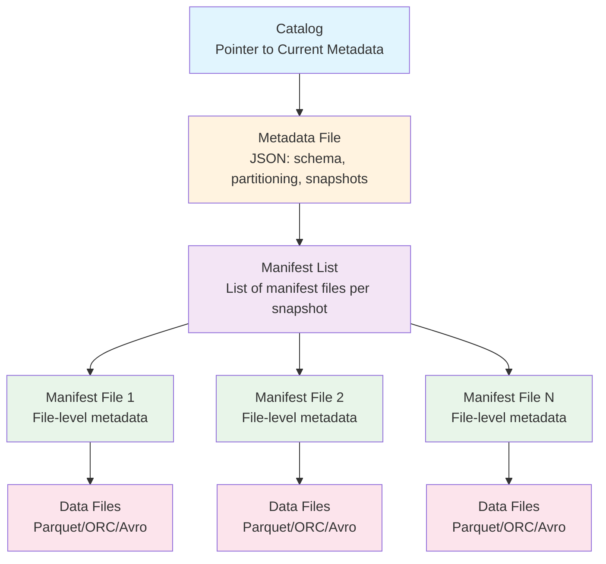

### Hidden Partitioning

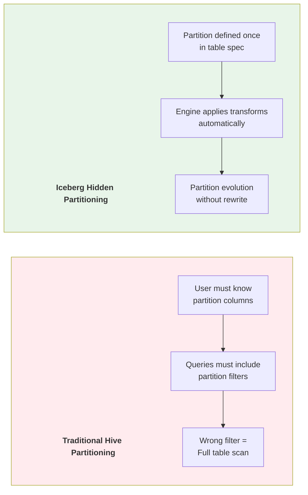

**Partition Transforms Examples:**

```sql
-- Iceberg partition transforms
CREATE TABLE events (
    event_time TIMESTAMP,
    user_id BIGINT,
    event_type STRING,
    payload STRING
) PARTITIONED BY (
    days(event_time),      -- Day-level partitioning
    bucket(16, user_id)    -- Hash bucketing
);

-- Query: user doesn't need to know partition layout
SELECT * FROM events WHERE event_time > '2024-01-01';
-- Iceberg automatically prunes partitions

-- Partition evolution: change without rewrite
ALTER TABLE events
REPLACE PARTITION FIELD days(event_time) WITH hours(event_time);
-- Old data keeps old partitioning, new data uses hourly
```

### Snapshot Isolation & Time Travel

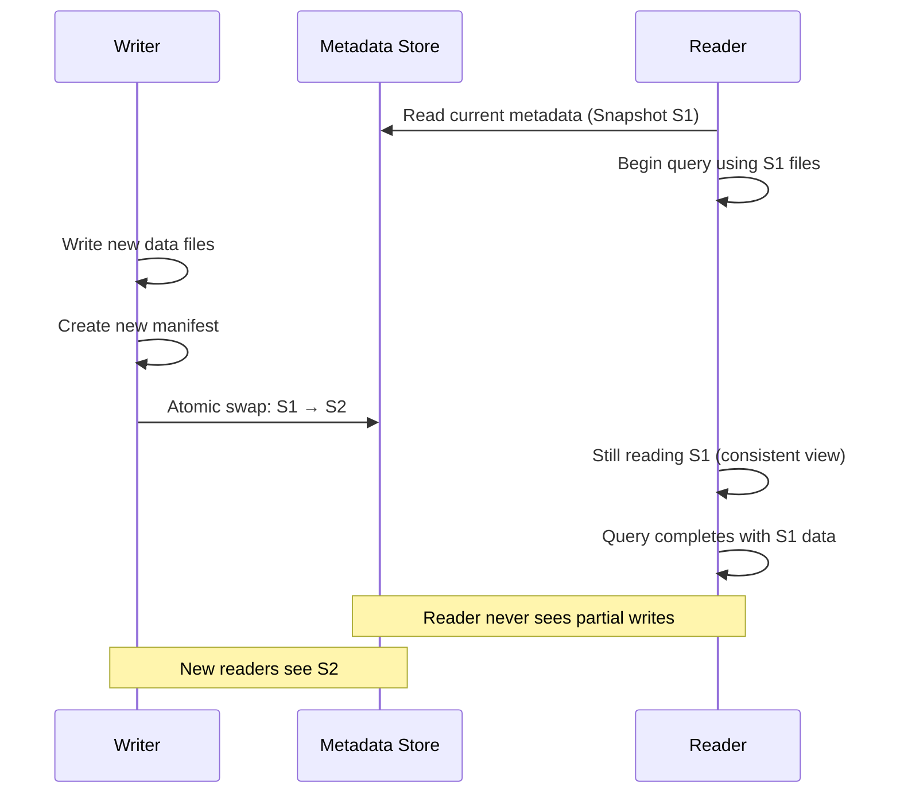

**Time Travel Queries:**

```sql
-- Read specific snapshot
SELECT * FROM events TIMESTAMP AS OF '2024-06-15 10:00:00';

-- Read specific snapshot ID
SELECT * FROM events VERSION AS OF 123456789;

-- View snapshot history
SELECT * FROM events.snapshots;

-- Rollback to previous version
CALL system.rollback_to_snapshot('db.events', 123456789);

-- Cherry-pick operation from another snapshot
CALL system.cherrypick_snapshot('db.events', 987654321);
```

### Manifest File Internals

Each manifest file tracks:
- File path and format (Parquet/ORC/Avro)
- Partition data for that file
- Record count per file
- Column-level min/max statistics
- Null value counts
- NaN value counts (for float/double)
- File size in bytes

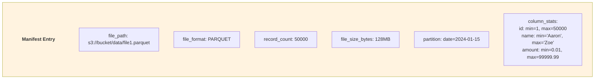

### Schema Evolution Rules

| Operation | Supported | Requires Rewrite |
|-----------|-----------|-------------------|
| Add column | ✅ Yes | No |
| Drop column | ✅ Yes | No |
| Rename column | ✅ Yes | No |
| Reorder columns | ✅ Yes | No |
| Widen type (int→long) | ✅ Yes | No |
| Narrow type (long→int) | ❌ No | N/A |
| Change required→optional | ✅ Yes | No |
| Change optional→required | ❌ No | N/A |

### Iceberg v2 Features (2023+)

- **Row-level Deletes:** Position deletes and equality deletes
- **Merge-on-Read:** Delete files tracked separately
- **Branching & Tagging:** Git-like operations on table versions
- **Sort Orders:** Table-level sort for optimized reads

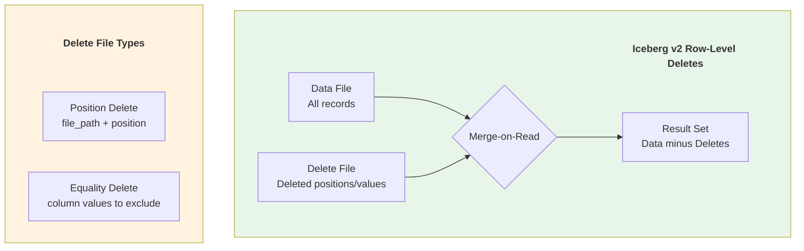

### Design Decisions Summary
- **File-level granularity** — Track individual files, not directories
- **Optimistic concurrency** — Atomic metadata swaps via compare-and-swap
- **Engine-agnostic** — No dependency on specific compute engine
- **Statistics-rich** — Column-level min/max for predicate pushdown
- **Immutable snapshots** — Each snapshot is a complete table state

### Production Usage
- **Netflix** — Petabyte-scale, thousands of tables, origin of Iceberg
- **Apple** — One of the largest Iceberg deployments
- **Airbnb** — Migrated from Hive to Iceberg
- **LinkedIn** — Large-scale data lake management
- **Stripe** — Financial data processing
- **Snowflake** — Native Iceberg Tables support
- **AWS** — Athena, Glue, EMR all support Iceberg

---

## 2. DELTA LAKE - 2020

### Paper Info
- **Title:** Delta Lake: High-Performance ACID Table Storage over Cloud Object Stores
- **Authors:** Michael Armbrust, Tathagata Das, et al. (Databricks)
- **Conference:** VLDB 2020
- **Link:** https://www.vldb.org/pvldb/vol13/p3411-armbrust.pdf
- **GitHub:** https://github.com/delta-io/delta

### Key Contributions
- ACID transactions on cloud object stores (S3, ADLS, GCS)
- JSON-based transaction log with checkpoint compaction
- Time travel via log versioning
- Schema enforcement and evolution
- Z-ordering for multi-dimensional data skipping
- Structured Streaming integration

### Delta Lake Architecture

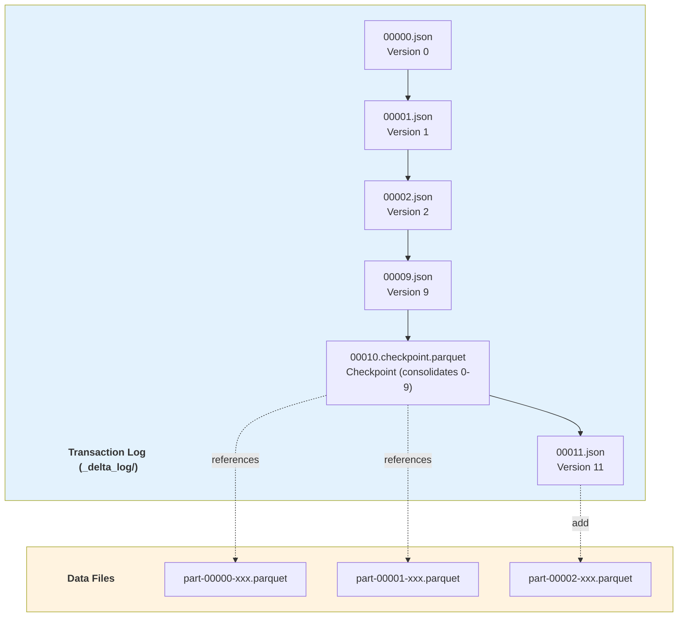

### Transaction Log Actions

```json
// ADD action - register new data file
{
  "add": {
    "path": "part-00001-xxx.parquet",
    "size": 1234567,
    "partitionValues": {"date": "2024-01-15"},
    "modificationTime": 1705312800000,
    "dataChange": true,
    "stats": {
      "numRecords": 1000,
      "minValues": {"id": 1, "amount": 0.01},
      "maxValues": {"id": 1000, "amount": 99999.99},
      "nullCount": {"id": 0, "amount": 5}
    }
  }
}

// REMOVE action - logically delete data file
{
  "remove": {
    "path": "part-00000-old.parquet",
    "deletionTimestamp": 1705312800000,
    "dataChange": true
  }
}

// METADATA action - schema/partition changes
{
  "metaData": {
    "schemaString": "{...}",
    "partitionColumns": ["date"],
    "configuration": {
      "delta.autoOptimize.optimizeWrite": "true"
    }
  }
}

// PROTOCOL action - version requirements
{
  "protocol": {
    "minReaderVersion": 2,
    "minWriterVersion": 5,
    "readerFeatures": ["columnMapping"],
    "writerFeatures": ["columnMapping", "deletionVectors"]
  }
}
```

### Checkpoint Mechanism

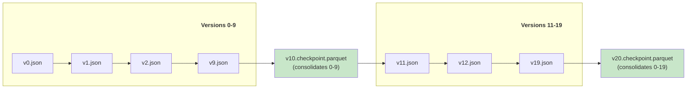

### Optimistic Concurrency Control

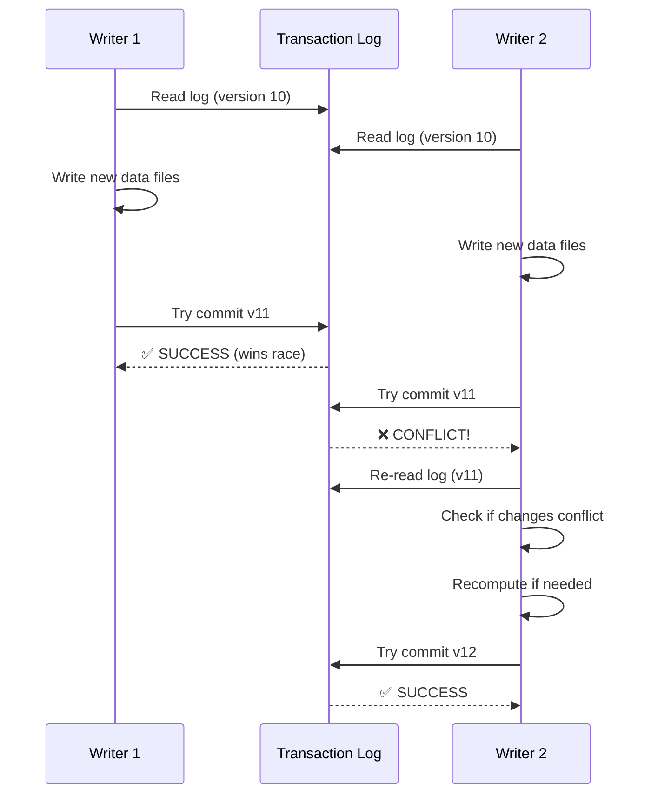

### Z-Ordering & Data Skipping

```mermaid
graph TD
    subgraph Before[" "]
        Before_title["Before Z-Ordering"]
        style Before_title fill:none,stroke:none,color:#333,font-weight:bold
        F1B["File 1: city=[NYC,LA,CHI,NYC,LA...]<br/>min=CHI, max=NYC"]
        F2B["File 2: city=[CHI,NYC,LA,CHI,NYC...]<br/>min=CHI, max=NYC"]
        F3B["File 3: city=[LA,NYC,CHI,LA,CHI...]<br/>min=CHI, max=NYC"]
    end

    subgraph After[" "]
        After_title["After Z-Ordering by city"]
        style After_title fill:none,stroke:none,color:#333,font-weight:bold
        F1A["File 1: city=[CHI,CHI,CHI,CHI...]<br/>min=CHI, max=CHI ✓"]
        F2A["File 2: city=[LA,LA,LA,LA...]<br/>min=LA, max=LA ✓"]
        F3A["File 3: city=[NYC,NYC,NYC,NYC...]<br/>min=NYC, max=NYC ✓"]
    end

    Q["Query: WHERE city = 'NYC'"] --> F1A
    Q --> F2A
    Q --> F3A

    F1A -->|"SKIP ✗"| Skip1[Skipped]
    F2A -->|"SKIP ✗"| Skip2[Skipped]
    F3A -->|"READ ✓"| Read1[Read Only This]

    style Before fill:#ffebee
    style After fill:#e8f5e9
    style Read1 fill:#c8e6c9
    style Skip1 fill:#ffcdd2
    style Skip2 fill:#ffcdd2
```

**Z-Order SQL Commands:**

```sql
-- Z-order optimization
OPTIMIZE my_table ZORDER BY (city, date);

-- Liquid Clustering (Delta 3.0+, replaces Z-order)
CREATE TABLE my_table (...) CLUSTER BY (city, date);

-- Auto-optimize settings
ALTER TABLE my_table SET TBLPROPERTIES (
    'delta.autoOptimize.optimizeWrite' = 'true',
    'delta.autoOptimize.autoCompact' = 'true',
    'delta.targetFileSize' = '134217728'  -- 128MB
);

-- Vacuum old files
VACUUM my_table RETAIN 168 HOURS;  -- Keep 7 days

-- Describe history
DESCRIBE HISTORY my_table;
```

### Deletion Vectors (Delta 3.0+)

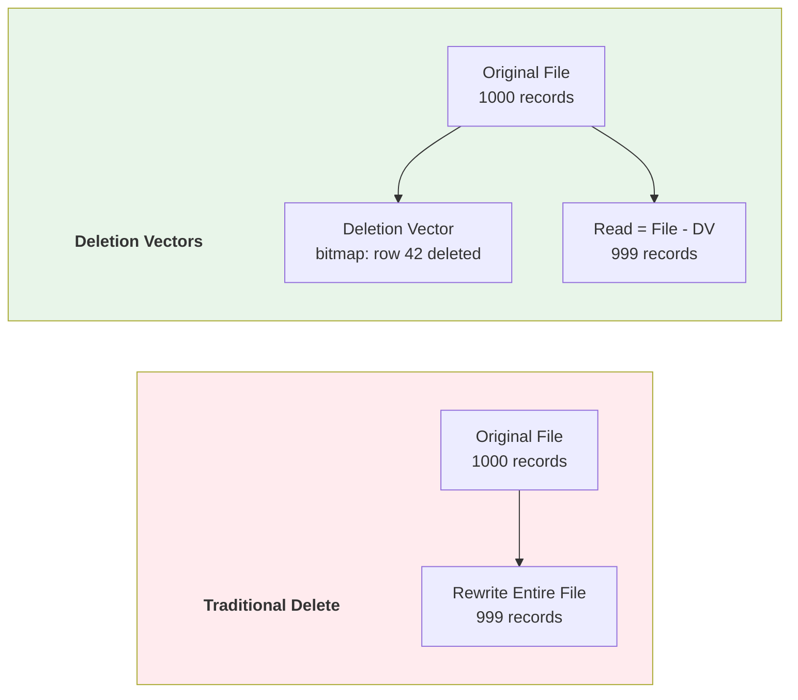

### Delta UniForm (Universal Format)

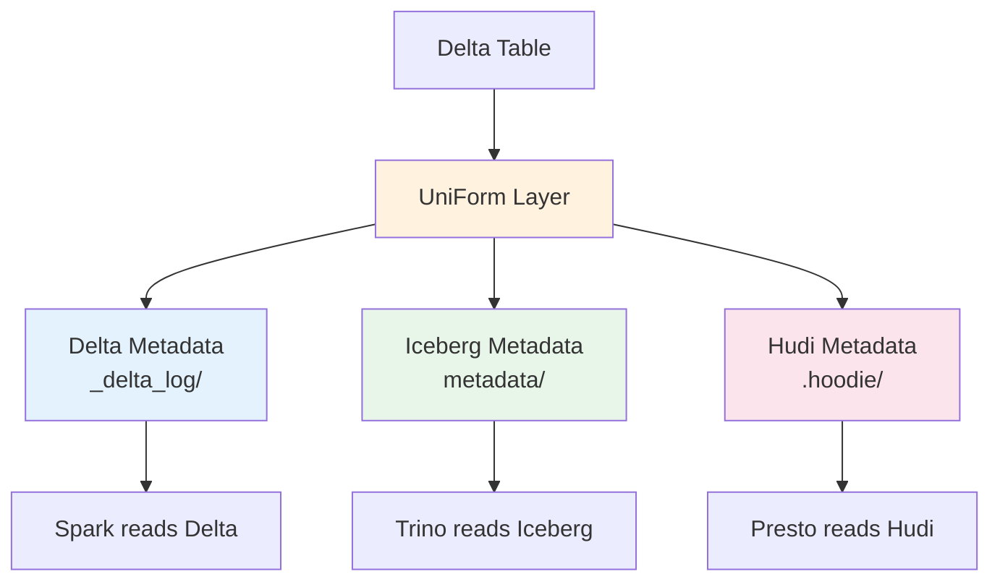

### Key Design Decisions
- **JSON log + Parquet checkpoints** — Human-readable, debuggable, cloud-native
- **Spark-first integration** — Deep integration with Structured Streaming
- **Unity Catalog** — Centralized governance, lineage, access control
- **Open source** — Delta Lake is Apache 2.0 licensed via Linux Foundation

### Production Usage
- **Databricks** — All customers run on Delta Lake
- **Microsoft Fabric** — Delta as default format
- **Starbucks, Comcast, Shell** — Large Delta deployments
- **Over 10,000 organizations** — Use Delta Lake in production

---

## 3. APACHE HUDI - 2017

### Paper/Documentation Info
- **Title:** Hudi: Hadoop Upserts Deletes and Incrementals
- **Authors:** Vinoth Chandar et al. (Uber)
- **Original Blog:** https://www.uber.com/blog/hoodie/ (2017)
- **RFC:** https://hudi.apache.org/tech-specs/
- **GitHub:** https://github.com/apache/hudi

### Key Contributions
- Efficient upserts on data lakes (first to solve this at scale)
- Copy-on-Write vs Merge-on-Read table types
- Incremental processing — native CDC support
- Timeline-based metadata and versioning
- Indexing for fast record-level lookups
- Concurrency control with multiple lock providers

### Hudi Timeline Architecture

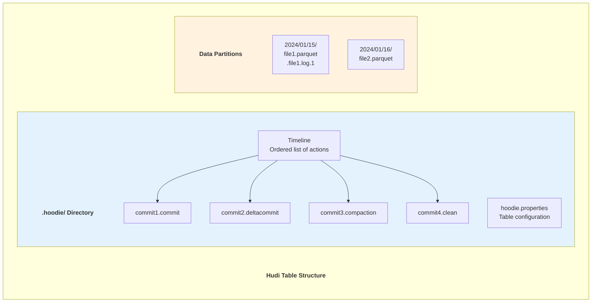

### Table Types: COW vs MOR

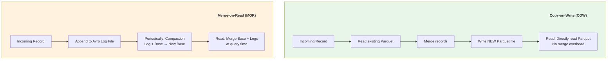

**Detailed Comparison:**

| Aspect | Copy-on-Write (COW) | Merge-on-Read (MOR) |
|--------|---------------------|---------------------|
| Write latency | Higher (full file rewrite) | Lower (append to log) |
| Read latency | Lower (no merge needed) | Higher (merge at read) |
| Storage overhead | Higher (rewrites) | Lower (delta logs) |
| Write amplification | Higher | Lower |
| Best for | Read-heavy workloads | Write-heavy workloads |
| Compaction | Not needed | Required (inline/async) |
| Snapshot query | Direct read | Base + logs merge |
| Read-optimized query | Same as snapshot | Base only (stale) |

### Indexing System

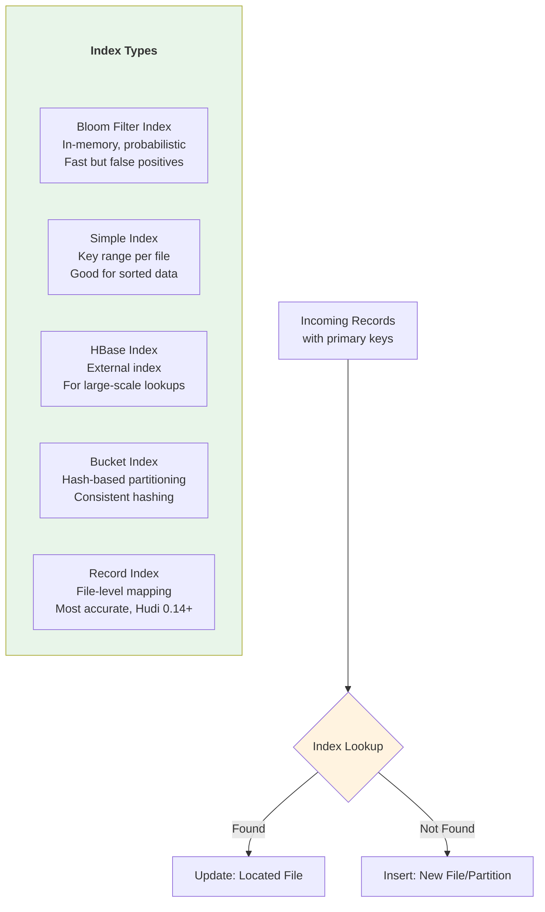

### Incremental Queries

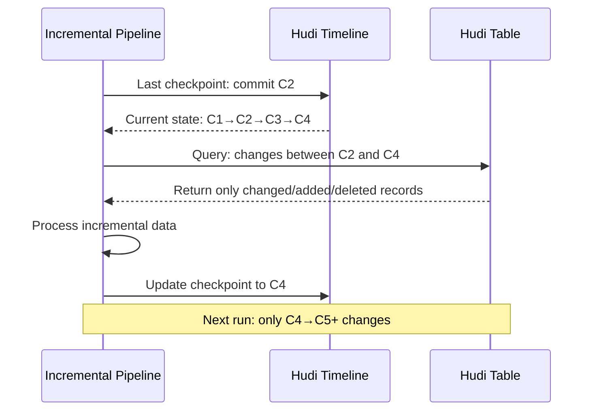

**Incremental Query Types:**

```sql
-- Snapshot Query: full table at latest commit
SELECT * FROM hudi_table;

-- Incremental Query: changes since specific commit
SELECT * FROM hudi_table
WHERE _hoodie_commit_time > '20240115100000';

-- Time Travel Query
SELECT * FROM hudi_table TIMESTAMP AS OF '2024-01-15 10:00:00';

-- Read Optimized Query (MOR only): base files only
SELECT * FROM hudi_table_ro;  -- _ro suffix

-- Real-time Query (MOR only): base + log files
SELECT * FROM hudi_table_rt;  -- _rt suffix
```

### Compaction & Clustering

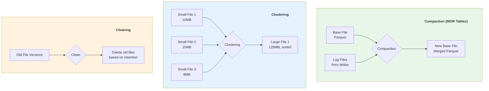

### Hudi Multi-Modal Index (0.14+)

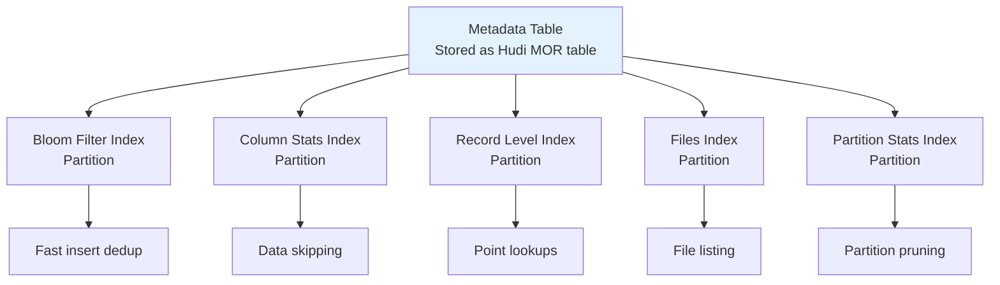

### Key Design Decisions
- **Upsert-first** — Designed from ground up for mutable data
- **Incremental processing** — Native CDC and incremental queries
- **Flexible storage types** — COW vs MOR per use case
- **Rich indexing** — Multiple index types for different access patterns
- **Timeline metadata** — All operations tracked chronologically

### Production Usage
- **Uber** — Origin of Hudi, runs petabyte-scale
- **Amazon/AWS** — EMR native Hudi support, used internally
- **ByteDance** — TikTok's data infrastructure
- **Robinhood** — Financial data with strict correctness requirements
- **Disney+ Hotstar** — Streaming analytics

---

## 4. LAKEHOUSE: UNIFIED ARCHITECTURE - 2021

### Paper Info
- **Title:** Lakehouse: A New Generation of Open Platforms that Unify Data Warehousing and Advanced Analytics
- **Authors:** Michael Armbrust, Ali Ghodsi, et al. (Databricks)
- **Conference:** CIDR 2021
- **Link:** https://www.cidrdb.org/cidr2021/papers/cidr2021_paper17.pdf

### Key Contributions
- Unified data warehouse + data lake architecture
- ACID transactions on open file formats
- Direct access for ML/DS workloads without ETL
- SQL performance comparable to traditional warehouses on open formats
- Elimination of data silos between analytics and ML

### Evolution of Data Architectures

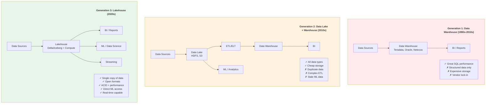

### Lakehouse Requirements

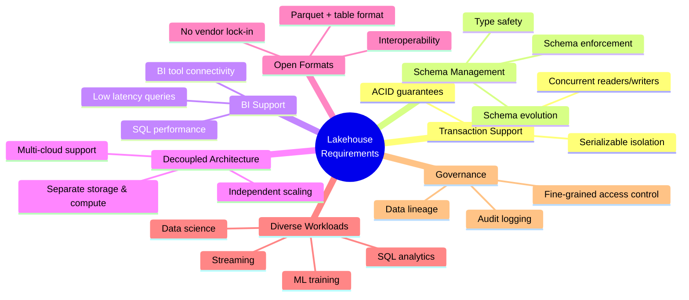

### Lakehouse vs Traditional Architectures

| Capability | Data Warehouse | Data Lake | Lakehouse |
|-----------|---------------|-----------|-----------|
| Data types | Structured | All | All |
| ACID transactions | ✅ Yes | ❌ No | ✅ Yes |
| Schema enforcement | ✅ Yes | ❌ No | ✅ Yes |
| BI performance | ⭐ Excellent | ❌ Poor | ⭐ Good-Excellent |
| ML/DS access | ❌ Limited | ✅ Direct | ✅ Direct |
| Storage cost | 💰💰💰 High | 💰 Low | 💰 Low |
| Data freshness | ⏰ Batch ETL | ✅ Real-time | ✅ Real-time |
| Open formats | ❌ Proprietary | ✅ Yes | ✅ Yes |
| Governance | ✅ Mature | ❌ Limited | ✅ Growing |

### Medallion Architecture (Lakehouse Pattern)

```mermaid
graph LR
    Sources[Raw Data Sources] --> Bronze
    
    subgraph Bronze[" "]
        Bronze_title["🥉 Bronze Layer"]
        style Bronze_title fill:none,stroke:none,color:#333,font-weight:bold
        B1[Raw ingestion]
        B2[Append-only]
        B3[Schema-on-read]
        B4[Full history]
    end

    Bronze --> Silver

    subgraph Silver[" "]
        Silver_title["🥈 Silver Layer"]
        style Silver_title fill:none,stroke:none,color:#333,font-weight:bold
        S1[Cleaned & validated]
        S2[Deduped]
        S3[Standardized schema]
        S4[Business logic applied]
    end

    Silver --> Gold

    subgraph Gold[" "]
        Gold_title["🥇 Gold Layer"]
        style Gold_title fill:none,stroke:none,color:#333,font-weight:bold
        G1[Business-level aggregates]
        G2[Feature tables]
        G3[Report-ready datasets]
        G4[Star/snowflake schemas]
    end

    Gold --> BI[BI Dashboards]
    Gold --> ML[ML Models]
    Gold --> API[APIs]

    style Bronze fill:#d7ccc8
    style Silver fill:#cfd8dc
    style Gold fill:#fff9c4
```

### Impact on Industry
- **Databricks** — Lakehouse Platform, coined the term
- **Snowflake** — "Data Cloud" with Iceberg support
- **Google BigQuery** — BigLake unifying storage
- **AWS** — Lake Formation + Athena approach
- **Microsoft Fabric** — OneLake lakehouse architecture
- **Apache Spark** — Primary compute engine for lakehouses

---

## 5. APACHE PAIMON - 2023

### Documentation Info
- **Title:** Apache Paimon: A Streaming Data Lake Platform
- **Authors:** Originally developed at Alibaba as Flink Table Store
- **Website:** https://paimon.apache.org/
- **GitHub:** https://github.com/apache/paimon

### Key Contributions
- Streaming-first lake format (tight Flink integration)
- Built-in changelog support for CDC
- LSM-tree based storage for high write throughput
- Merge engines for different update semantics
- Partial update and aggregation merge support

### Paimon Architecture

```mermaid
graph TD
    subgraph Writers[" "]
        Writers_title["Write Path"]
        style Writers_title fill:none,stroke:none,color:#333,font-weight:bold
        FJ[Flink Job<br/>Streaming writes] --> BK[Bucket Writer<br/>Per-partition bucketing]
        BK --> LSM[LSM Tree<br/>Sorted String Tables]
    end

    subgraph Storage[" "]
        Storage_title["Storage Layer"]
        style Storage_title fill:none,stroke:none,color:#333,font-weight:bold
        LSM --> L0[Level 0<br/>Unsorted, latest writes]
        L0 --> L1[Level 1<br/>Sorted, merged]
        L1 --> LN[Level N<br/>Fully compacted]
    end

    subgraph Readers[" "]
        Readers_title["Read Path"]
        style Readers_title fill:none,stroke:none,color:#333,font-weight:bold
        LN --> SS[Snapshot Scan<br/>Latest state]
        LSM --> CL[Changelog Scan<br/>Incremental changes]
    end

    style Writers fill:#e3f2fd
    style Storage fill:#fff3e0
    style Readers fill:#e8f5e9
```

### Merge Engines

| Engine | Description | Use Case |
|--------|------------|----------|
| Deduplicate | Keep latest record by key | General upsert |
| Partial Update | Merge partial columns | Wide table updates |
| Aggregation | Pre-aggregate on write | Metrics/counters |
| First Row | Keep first occurrence | Deduplication |

```sql
-- Paimon table with primary key and merge engine
CREATE TABLE user_events (
    user_id BIGINT,
    event_type STRING,
    event_count BIGINT,
    last_event_time TIMESTAMP,
    PRIMARY KEY (user_id) NOT ENFORCED
) WITH (
    'merge-engine' = 'aggregation',
    'fields.event_count.aggregate-function' = 'sum',
    'fields.last_event_time.aggregate-function' = 'last_value'
);
```

### Paimon vs Other Formats

| Feature | Paimon | Iceberg | Delta | Hudi |
|---------|--------|---------|-------|------|
| Streaming writes | ⭐ Native | Good | Good | Good |
| Changelog support | ⭐ Built-in | External | External | External |
| Merge engines | ⭐ Multiple | N/A | N/A | Limited |
| Flink integration | ⭐ Tight | Good | Limited | Good |
| Spark support | Good | ⭐ Excellent | ⭐ Excellent | Good |
| Community size | Growing | ⭐ Large | ⭐ Large | Large |
| Maturity | Newer | Mature | Mature | Mature |

---

## 6. TABLE FORMAT COMPARISON

### Feature Comparison Matrix

```mermaid
graph TD
    subgraph Comparison[" "]
        Comparison_title["Table Format Ecosystem"]
        style Comparison_title fill:none,stroke:none,color:#333,font-weight:bold
        IC[Apache Iceberg<br/>Engine-agnostic<br/>Partition evolution<br/>Rich metadata]
        DL[Delta Lake<br/>Spark-first<br/>Z-ordering<br/>UniForm]
        HU[Apache Hudi<br/>Upsert-first<br/>COW/MOR<br/>Incremental]
        PA[Apache Paimon<br/>Stream-first<br/>LSM storage<br/>Merge engines]
    end

    IC --- Common{{"Common Features:<br/>ACID, Time Travel,<br/>Schema Evolution,<br/>Open Formats"}}
    DL --- Common
    HU --- Common
    PA --- Common

    style IC fill:#e3f2fd
    style DL fill:#e8f5e9
    style HU fill:#fce4ec
    style PA fill:#fff3e0
    style Common fill:#f5f5f5
```

### Detailed Technical Comparison

| Feature | Iceberg | Delta Lake | Hudi | Paimon |
|---------|---------|------------|------|--------|
| **Core** | | | | |
| ACID Transactions | ✅ | ✅ | ✅ | ✅ |
| Time Travel | ✅ Snapshots | ✅ Log versions | ✅ Timeline | ✅ Snapshots |
| Schema Evolution | ✅ Full | ✅ Full | ✅ Full | ✅ Full |
| **Partitioning** | | | | |
| Hidden Partitioning | ✅ Yes | ❌ No | ❌ No | ✅ Yes |
| Partition Evolution | ✅ Yes | ❌ Rewrite | ⚠️ Limited | ⚠️ Limited |
| Partition Transforms | ✅ Rich | ❌ Basic | ❌ Basic | ⚠️ Limited |
| **Read/Write** | | | | |
| Merge-on-Read | ✅ v2 | ✅ DV (v3) | ✅ Native | ✅ LSM |
| Copy-on-Write | ✅ | ✅ | ✅ | ❌ |
| Row-level Deletes | ✅ Delete files | ✅ Deletion vectors | ✅ Native | ✅ LSM |
| **Optimization** | | | | |
| Compaction | ✅ | ✅ OPTIMIZE | ✅ Inline/Async | ✅ Auto |
| Z-ordering | ✅ v2 | ✅ Native | ❌ | ❌ |
| Liquid Clustering | ❌ | ✅ v3 | ❌ | ❌ |
| **Streaming** | | | | |
| Streaming Support | ✅ Good | ✅ Excellent | ✅ Good | ⭐ Native |
| Incremental Read | ✅ | ✅ | ✅ Native | ✅ Changelog |
| CDC Support | ⚠️ External | ⚠️ External | ✅ Native | ⭐ Native |
| **Ecosystem** | | | | |
| Spark | ⭐ Excellent | ⭐ Native | ✅ Good | ✅ Good |
| Flink | ✅ Good | ⚠️ Limited | ✅ Good | ⭐ Native |
| Trino/Presto | ✅ Native | ✅ Good | ✅ Good | ⚠️ Limited |
| Hive | ✅ | ⚠️ | ✅ | ✅ |

### Metadata Structure Comparison

```mermaid
graph TD
    subgraph IcebergMD[" "]
        IcebergMD_title["Iceberg Metadata"]
        style IcebergMD_title fill:none,stroke:none,color:#333,font-weight:bold
        IC1[Catalog] --> IC2[metadata.json]
        IC2 --> IC3[manifest-list.avro]
        IC3 --> IC4[manifest-1.avro]
        IC3 --> IC5[manifest-2.avro]
        IC4 --> IC6[data files]
        IC5 --> IC7[data files]
    end

    subgraph DeltaMD[" "]
        DeltaMD_title["Delta Lake Metadata"]
        style DeltaMD_title fill:none,stroke:none,color:#333,font-weight:bold
        DL1["_delta_log/"]
        DL1 --> DL2["*.json<br/>(per version)"]
        DL1 --> DL3["*.checkpoint.parquet<br/>(every 10 versions)"]
        DL2 --> DL4[data files]
        DL3 --> DL4
    end

    subgraph HudiMD[" "]
        HudiMD_title["Hudi Metadata"]
        style HudiMD_title fill:none,stroke:none,color:#333,font-weight:bold
        HU1[".hoodie/"]
        HU1 --> HU2[hoodie.properties]
        HU1 --> HU3["timeline/<br/>*.commit, *.deltacommit"]
        HU3 --> HU4[data files]
        HU4 --> HU5["+ log files (MOR)"]
    end

    subgraph PaimonMD[" "]
        PaimonMD_title["Paimon Metadata"]
        style PaimonMD_title fill:none,stroke:none,color:#333,font-weight:bold
        PA1["manifest/"]
        PA1 --> PA2[snapshot files]
        PA2 --> PA3[manifest files]
        PA3 --> PA4["data files<br/>(LSM sorted)"]
    end

    style IcebergMD fill:#e3f2fd
    style DeltaMD fill:#e8f5e9
    style HudiMD fill:#fce4ec
    style PaimonMD fill:#fff3e0
```

### Concurrency Control Comparison

```mermaid
graph TD
    subgraph IcebergCC[" "]
        IcebergCC_title["Iceberg"]
        style IcebergCC_title fill:none,stroke:none,color:#333,font-weight:bold
        IOL[Optimistic Locking]
        IOL --> ICS[Compare-and-Swap<br/>on metadata pointer]
        ICS --> IR[Retry with new snapshot]
    end

    subgraph DeltaCC[" "]
        DeltaCC_title["Delta Lake"]
        style DeltaCC_title fill:none,stroke:none,color:#333,font-weight:bold
        DOL[Optimistic Locking]
        DOL --> DCR[Conflict Resolution Rules<br/>Append-append OK<br/>Disjoint-write OK]
        DCR --> DR[Recompute if needed]
    end

    subgraph HudiCC[" "]
        HudiCC_title["Hudi"]
        style HudiCC_title fill:none,stroke:none,color:#333,font-weight:bold
        HOL["Optimistic OR Pessimistic"]
        HOL --> HLP["Lock Providers:<br/>Zookeeper<br/>DynamoDB<br/>HiveMetastore<br/>FileSystem"]
    end

    style IcebergCC fill:#e3f2fd
    style DeltaCC fill:#e8f5e9
    style HudiCC fill:#fce4ec
```

### When to Use Each Format

```mermaid
graph TD
    Start{What's your<br/>primary need?} -->|"Engine agnostic"| IC[Apache Iceberg]
    Start -->|"Databricks/Spark"| DL[Delta Lake]
    Start -->|"Heavy upserts/CDC"| HU[Apache Hudi]
    Start -->|"Streaming-first"| PA[Apache Paimon]

    IC -->|"Multi-engine:<br/>Spark+Trino+Flink"| IC_USE["✅ Best choice"]
    IC -->|"Partition evolution<br/>needed"| IC_USE
    IC -->|"Netflix/Apple/Airbnb<br/>patterns"| IC_USE

    DL -->|"Already on<br/>Databricks"| DL_USE["✅ Best choice"]
    DL -->|"Spark is primary<br/>engine"| DL_USE
    DL -->|"Microsoft Fabric"| DL_USE

    HU -->|"Frequent updates<br/>& deletes"| HU_USE["✅ Best choice"]
    HU -->|"Incremental<br/>processing"| HU_USE
    HU -->|"CDC from databases"| HU_USE

    PA -->|"Flink is primary<br/>engine"| PA_USE["✅ Best choice"]
    PA -->|"Need built-in<br/>changelog"| PA_USE
    PA -->|"Pre-aggregation<br/>on write"| PA_USE

    style IC fill:#e3f2fd
    style DL fill:#e8f5e9
    style HU fill:#fce4ec
    style PA fill:#fff3e0
```

---

## 7. APACHE PARQUET - 2013

### Paper/Documentation Info
- **Title:** Dremel made simple with Parquet (based on Dremel paper)
- **Authors:** Julien Le Dem (Twitter), Nong Li (Cloudera)
- **Spec:** https://parquet.apache.org/docs/file-format/
- **GitHub:** https://github.com/apache/parquet-format
- **Based on:** Google Dremel paper (2010)

### Key Contributions
- Columnar file format for Hadoop ecosystem
- Efficient nested data encoding (Dremel encoding)
- Predicate pushdown via column statistics
- Multiple compression codecs per column
- Schema stored in file footer

### Parquet File Structure

```mermaid
graph TD
    subgraph ParquetFile[" "]
        ParquetFile_title["Parquet File"]
        style ParquetFile_title fill:none,stroke:none,color:#333,font-weight:bold
        Magic1["Magic Number: PAR1"]
        
        subgraph RG1[" "]
            RG1_title["Row Group 1 (typically 128MB)"]
            style RG1_title fill:none,stroke:none,color:#333,font-weight:bold
            CC1A["Column Chunk A<br/>(compressed pages)"]
            CC1B["Column Chunk B<br/>(compressed pages)"]
            CC1C["Column Chunk C<br/>(compressed pages)"]
        end

        subgraph RG2[" "]
            RG2_title["Row Group 2"]
            style RG2_title fill:none,stroke:none,color:#333,font-weight:bold
            CC2A["Column Chunk A"]
            CC2B["Column Chunk B"]
            CC2C["Column Chunk C"]
        end

        subgraph Footer[" "]
            Footer_title["File Footer"]
            style Footer_title fill:none,stroke:none,color:#333,font-weight:bold
            Schema["Schema (Thrift)"]
            RGMeta["Row Group Metadata:<br/>- Column stats (min/max)<br/>- Offsets<br/>- Encodings<br/>- Compression info"]
            FooterLen["Footer Length (4 bytes)"]
        end

        Magic2["Magic Number: PAR1"]
    end

    Magic1 --> RG1 --> RG2 --> Footer --> Magic2

    style RG1 fill:#e3f2fd
    style RG2 fill:#e3f2fd
    style Footer fill:#fff3e0
```

### Column Chunk Detail

```mermaid
graph TD
    subgraph ColumnChunk[" "]
        ColumnChunk_title["Column Chunk"]
        style ColumnChunk_title fill:none,stroke:none,color:#333,font-weight:bold
        subgraph DP[" "]
            DP_title["Data Pages"]
            style DP_title fill:none,stroke:none,color:#333,font-weight:bold
            P1["Page 1<br/>Repetition levels<br/>Definition levels<br/>Values (encoded)"]
            P2["Page 2<br/>..."]
        end

        subgraph DictP[" "]
            DictP_title["Dictionary Page (optional)"]
            style DictP_title fill:none,stroke:none,color:#333,font-weight:bold
            Dict["Dictionary:<br/>'NYC'=0, 'LA'=1, 'CHI'=2<br/>Values: [0,1,2,0,0,1,2...]"]
        end

        subgraph Encoding[" "]
            Encoding_title["Encoding Types"]
            style Encoding_title fill:none,stroke:none,color:#333,font-weight:bold
            PLAIN["PLAIN: raw values"]
            DICT["DICTIONARY: dictionary + indices"]
            RLE["RLE: run-length encoding"]
            DELTA["DELTA: delta encoding for ints"]
        end
    end

    style DP fill:#e8f5e9
    style DictP fill:#fff3e0
    style Encoding fill:#f3e5f5
```

### Nested Data Encoding (Dremel)

```
-- Schema
message AddressBook {
  required string owner;
  repeated group contacts {
    required string name;
    optional string phone;
  }
}

-- Data
{ owner: "Alice",
  contacts: [
    {name: "Bob", phone: "111"},
    {name: "Carol"}  -- no phone
  ]
}
{ owner: "Dave",
  contacts: []  -- no contacts
}

-- Encoding (Definition & Repetition Levels)
owner:    values=[Alice, Dave],     r=[0,0], d=[0,0]
name:     values=[Bob, Carol],      r=[0,1], d=[1,1]
phone:    values=[111],             r=[0,1,0], d=[2,1,0]
          (111 for Bob, NULL for Carol, no contacts for Dave)
```

### Key Features
- **Predicate Pushdown:** Column stats enable skipping row groups
- **Column Pruning:** Read only needed columns
- **Compression:** Snappy, Gzip, LZ4, ZSTD per column
- **Encoding:** Dictionary, RLE, Delta, Byte Stream Split
- **Page-level CRC:** Data integrity verification

### Parquet Performance Tips

| Tip | Impact |
|-----|--------|
| Row group size ~128MB | Balance parallelism vs overhead |
| Dictionary encoding for low-cardinality | 10-100x compression |
| ZSTD compression | Best ratio/speed balance |
| Sort by filter columns | Better min/max statistics |
| Avoid too many small files | Metadata overhead |
| Use column pruning | Read only needed columns |

---

## 8. APACHE ORC - 2013

### Documentation Info
- **Website:** https://orc.apache.org/
- **Spec:** https://orc.apache.org/specification/
- **GitHub:** https://github.com/apache/orc

### Key Contributions
- Stripe-based columnar format
- Built-in lightweight indexes
- ACID support in Hive 3.x
- Self-describing file format
- Predicate pushdown with bloom filters

### ORC File Structure

```mermaid
graph TD
    subgraph ORCFile[" "]
        ORCFile_title["ORC File"]
        style ORCFile_title fill:none,stroke:none,color:#333,font-weight:bold
        subgraph S1[" "]
            S1_title["Stripe 1 (typically 250MB)"]
            style S1_title fill:none,stroke:none,color:#333,font-weight:bold
            SI1["Stream / Index Data<br/>Min/max per column per 10K rows"]
            SD1["Row Data<br/>Columnar encoded"]
            SF1["Stripe Footer<br/>Stream locations"]
        end

        subgraph S2[" "]
            S2_title["Stripe 2"]
            style S2_title fill:none,stroke:none,color:#333,font-weight:bold
            SI2["Index Data"]
            SD2["Row Data"]
            SF2["Stripe Footer"]
        end

        subgraph FF[" "]
            FF_title["File Footer"]
            style FF_title fill:none,stroke:none,color:#333,font-weight:bold
            TypeInfo["Type Information<br/>(full schema)"]
            StripeInfo["Stripe Information<br/>(offset, length, row count)"]
            Stats["File-level Statistics<br/>(per column min/max/sum/count)"]
        end

        PS["Postscript<br/>(compression, version)"]
    end

    S1 --> S2 --> FF --> PS

    style S1 fill:#e3f2fd
    style S2 fill:#e3f2fd
    style FF fill:#fff3e0
    style PS fill:#fce4ec
```

### ORC vs Parquet

| Feature | ORC | Parquet |
|---------|-----|---------|
| Origin | Hortonworks/Hive | Twitter/Cloudera |
| Default in | Hive | Spark, Impala |
| Unit | Stripe (250MB default) | Row Group (128MB) |
| Indexes | Built-in (3 levels) | Column stats only |
| ACID | Native (Hive 3.x) | Via table format |
| Nested data | Flattened | Dremel encoding |
| Bloom filters | Built-in | Optional |
| Compression | ZLIB, Snappy, LZ4, ZSTD | Snappy, Gzip, LZ4, ZSTD |
| Ecosystem | Hive, Presto | Spark, most engines |
| Update support | ACID base/delta files | Via table format |

### ORC Indexes (Three Levels)

```mermaid
graph TD
    subgraph FileLevel[" "]
        FileLevel_title["Level 1: File-Level"]
        style FileLevel_title fill:none,stroke:none,color:#333,font-weight:bold
        FL["File Footer Statistics<br/>Per-column: min, max, sum, count<br/>→ Skip entire file if no match"]
    end

    subgraph StripeLevel[" "]
        StripeLevel_title["Level 2: Stripe-Level"]
        style StripeLevel_title fill:none,stroke:none,color:#333,font-weight:bold
        SL["Stripe Footer Statistics<br/>Per-column per stripe<br/>→ Skip individual stripes"]
    end

    subgraph RowLevel[" "]
        RowLevel_title["Level 3: Row Index (10K rows)"]
        style RowLevel_title fill:none,stroke:none,color:#333,font-weight:bold
        RL["Row Index Entries<br/>Per-column per 10K rows<br/>→ Seek within stripe"]
    end

    FL --> SL --> RL

    Q["Query: WHERE amount > 1000"] --> FL
    FL -->|"File max=500"| Skip1["SKIP entire file"]
    FL -->|"File max=5000"| SL
    SL -->|"Stripe max=200"| Skip2["SKIP stripe"]
    SL -->|"Stripe max=5000"| RL
    RL -->|"Row group max=100"| Skip3["SKIP 10K rows"]
    RL -->|"Row group max=5000"| Read["READ these rows"]

    style FileLevel fill:#e8f5e9
    style StripeLevel fill:#e3f2fd
    style RowLevel fill:#fff3e0
```

---

## 9. APACHE AVRO - 2009

### Documentation Info
- **Website:** https://avro.apache.org/
- **Spec:** https://avro.apache.org/docs/current/specification/
- **GitHub:** https://github.com/apache/avro
- **Created by:** Doug Cutting (Hadoop creator)

### Key Contributions
- Row-based binary serialization format
- Schema evolution with full/transitive compatibility
- Rich data types including unions and enums
- Dynamic typing — schema stored with data
- Used as serialization format in Kafka, Hudi logs, etc.

### Avro File Structure

```mermaid
graph TD
    subgraph AvroFile[" "]
        AvroFile_title["Avro Data File (.avro)"]
        style AvroFile_title fill:none,stroke:none,color:#333,font-weight:bold
        Header["File Header<br/>Magic bytes: 'Obj1'<br/>Schema (JSON)<br/>Sync marker (16 bytes)"]
        
        subgraph Block1[" "]
            Block1_title["Data Block 1"]
            style Block1_title fill:none,stroke:none,color:#333,font-weight:bold
            Count1["Object Count"]
            Size1["Block Size"]
            Data1["Serialized Objects<br/>(binary encoded)"]
            Sync1["Sync Marker"]
        end

        subgraph Block2[" "]
            Block2_title["Data Block 2"]
            style Block2_title fill:none,stroke:none,color:#333,font-weight:bold
            Count2["Object Count"]
            Size2["Block Size"]
            Data2["Serialized Objects"]
            Sync2["Sync Marker"]
        end
    end

    Header --> Block1 --> Block2

    style Header fill:#e3f2fd
    style Block1 fill:#e8f5e9
    style Block2 fill:#e8f5e9
```

### Schema Evolution Rules

```mermaid
graph TD
    subgraph Compatible[" "]
        Compatible_title["Schema Evolution Rules"]
        style Compatible_title fill:none,stroke:none,color:#333,font-weight:bold
        Add["Add field with default<br/>→ COMPATIBLE ✅"]
        Remove["Remove field with default<br/>→ COMPATIBLE ✅"]
        Rename["Rename field (with aliases)<br/>→ COMPATIBLE ✅"]
        Widen["Widen type (int→long)<br/>→ COMPATIBLE ✅"]
        AddNoDefault["Add required field<br/>→ BREAKING ❌"]
        RemoveNoDefault["Remove required field<br/>→ BREAKING ❌"]
    end

    subgraph Levels[" "]
        Levels_title["Compatibility Levels"]
        style Levels_title fill:none,stroke:none,color:#333,font-weight:bold
        BW["BACKWARD: new schema reads old data"]
        FW["FORWARD: old schema reads new data"]
        FULL["FULL: both directions"]
        TRANS["TRANSITIVE: across all versions"]
    end

    style Compatible fill:#e8f5e9
    style Levels fill:#e3f2fd
```

**Avro Schema Example:**

```json
{
  "type": "record",
  "name": "User",
  "namespace": "com.example",
  "fields": [
    {"name": "id", "type": "long"},
    {"name": "name", "type": "string"},
    {"name": "email", "type": ["null", "string"], "default": null},
    {"name": "age", "type": ["null", "int"], "default": null},
    {
      "name": "address",
      "type": {
        "type": "record",
        "name": "Address",
        "fields": [
          {"name": "street", "type": "string"},
          {"name": "city", "type": "string"},
          {"name": "zip", "type": "string"}
        ]
      }
    }
  ]
}
```

### Avro vs Parquet vs ORC

| Feature | Avro | Parquet | ORC |
|---------|------|---------|-----|
| Layout | Row-based | Columnar | Columnar |
| Best for | Write-heavy, serialization | Analytics, reads | Hive analytics |
| Schema evolution | ⭐ Excellent | ✅ Good | ✅ Good |
| Compression ratio | Good | ⭐ Excellent | ⭐ Excellent |
| Read performance | Good (full row) | ⭐ (column pruning) | ⭐ (column pruning) |
| Write performance | ⭐ Fast | Good | Good |
| Splittable | ✅ Yes | ✅ Yes | ✅ Yes |
| Schema in file | ✅ Yes | ✅ Yes | ✅ Yes |
| Nested data | ✅ Union types | ✅ Dremel | ✅ Flattened |
| Use case | Kafka, messaging, logs | Data lake analytics | Hive warehouse |

---

## 10. ACADEMIC FOUNDATIONS

### Log-Structured Storage

**Key Papers:**
- **LSM-Tree (1996):** Patrick O'Neil et al. — "The Log-Structured Merge-Tree"
  - Foundation for write-optimized storage
  - Used by RocksDB, LevelDB, Cassandra, HBase
  - Core idea: buffer writes in memory, flush sorted runs to disk, merge periodically

### LSM-Tree Architecture

```mermaid
graph TD
    subgraph WritePath[" "]
        WritePath_title["Write Path"]
        style WritePath_title fill:none,stroke:none,color:#333,font-weight:bold
        W[Write Request] --> WAL[Write-Ahead Log<br/>Durability]
        WAL --> MT[MemTable<br/>In-memory sorted structure]
        MT -->|"Full"| Flush[Flush to Disk]
    end

    subgraph Levels[" "]
        Levels_title["Storage Levels"]
        style Levels_title fill:none,stroke:none,color:#333,font-weight:bold
        Flush --> L0["Level 0 SSTable<br/>Unsorted, latest"]
        L0 -->|"Compaction"| L1["Level 1 SSTable<br/>Sorted, merged"]
        L1 -->|"Compaction"| L2["Level 2 SSTable<br/>Larger, sorted"]
        L2 -->|"Compaction"| LN["Level N SSTable<br/>Largest, fully sorted"]
    end

    subgraph ReadPath[" "]
        ReadPath_title["Read Path"]
        style ReadPath_title fill:none,stroke:none,color:#333,font-weight:bold
        R[Read Request] --> MT
        MT -->|"Miss"| L0
        L0 -->|"Miss"| L1
        L1 -->|"Miss"| L2
        L2 -->|"Miss"| LN
    end

    style WritePath fill:#e8f5e9
    style Levels fill:#fff3e0
    style ReadPath fill:#e3f2fd
```

### LSM Compaction Strategies

| Strategy | Description | Used By |
|----------|------------|---------|
| Size-Tiered | Merge similar-sized SSTables | Cassandra (default) |
| Leveled | Fixed-size levels, merge into next | RocksDB (default) |
| FIFO | Drop oldest when size limit reached | Time-series data |
| Universal | Hybrid approach | RocksDB (option) |

### MVCC (Multi-Version Concurrency Control)

**Concept:**
- Maintain multiple versions of data for isolation
- Readers don't block writers, writers don't block readers
- Foundation for time travel in all table formats

```mermaid
sequenceDiagram
    participant T1 as Transaction 1 (Read)
    participant Store as Data Store
    participant T2 as Transaction 2 (Write)

    T1->>Store: Begin read at version 5
    T1->>Store: See consistent snapshot v5

    T2->>Store: Begin write
    T2->>Store: Create new files
    T2->>Store: Commit as version 6

    T1->>Store: Still reading version 5
    Note over T1,Store: Unaffected by v6 commit

    T1->>Store: Read completes with v5 data

    participant T3 as Transaction 3 (New Read)
    T3->>Store: Begin read → sees version 6
```

### B-Tree vs LSM-Tree

```mermaid
graph LR
    subgraph BTree[" "]
        BTree_title["B-Tree"]
        style BTree_title fill:none,stroke:none,color:#333,font-weight:bold
        BT1["✅ Fast reads O(log n)"]
        BT2["✅ Good for point lookups"]
        BT3["❌ Write amplification"]
        BT4["❌ Random I/O on writes"]
        BT5["Used by: PostgreSQL, MySQL"]
    end

    subgraph LSMTree[" "]
        LSMTree_title["LSM-Tree"]
        style LSMTree_title fill:none,stroke:none,color:#333,font-weight:bold
        LSM1["✅ Fast writes (sequential)"]
        LSM2["✅ Better write throughput"]
        LSM3["❌ Read amplification"]
        LSM4["❌ Space amplification"]
        LSM5["Used by: RocksDB, Cassandra"]
    end

    style BTree fill:#e3f2fd
    style LSMTree fill:#e8f5e9
```

### Copy-on-Write vs Redirect-on-Write

| Aspect | Copy-on-Write | Redirect-on-Write |
|--------|--------------|-------------------|
| Mechanism | Copy entire page/file on update | Write new version, update pointer |
| I/O pattern | Higher write amplification | More metadata updates |
| Read performance | Consistent | May need indirection |
| Space overhead | Temporary (old + new) | Pointer management |
| Used by | Iceberg COW, ZFS, WAFL | Btrfs, some DB storage |
| Table format parallel | Iceberg/Delta COW mode | Hudi MOR, Delta DV |

### Bloom Filters in Table Formats

```mermaid
graph TD
    Q[Query: WHERE id = 42] --> BF{Bloom Filter<br/>Check}
    BF -->|"Definitely NOT in file"| Skip["SKIP file<br/>No false negatives ✓"]
    BF -->|"MAYBE in file"| Read["Read file<br/>Possible false positive"]
    Read --> Check{Record exists?}
    Check -->|Yes| Found["✅ Found"]
    Check -->|No| FP["False positive<br/>(wasted read)"]

    Note1["False Positive Rate:<br/>1% typical, tunable<br/>Trade-off: memory vs accuracy"]

    style Skip fill:#e8f5e9
    style FP fill:#ffebee
    style Found fill:#c8e6c9
```

---

## 11. INDUSTRY ADOPTION & CASE STUDIES

### Format Adoption by Major Companies

```mermaid
graph TD
    subgraph IcebergAdopters[" "]
        IcebergAdopters_title["Iceberg Adopters"]
        style IcebergAdopters_title fill:none,stroke:none,color:#333,font-weight:bold
        Netflix["Netflix<br/>(Creator, PB-scale)"]
        Apple["Apple<br/>(Largest deployment)"]
        Airbnb["Airbnb<br/>(Migration from Hive)"]
        LinkedIn["LinkedIn"]
        Stripe["Stripe"]
        Adobe["Adobe"]
        Expedia["Expedia"]
    end

    subgraph DeltaAdopters[" "]
        DeltaAdopters_title["Delta Lake Adopters"]
        style DeltaAdopters_title fill:none,stroke:none,color:#333,font-weight:bold
        Databricks["Databricks<br/>(Creator)"]
        Microsoft["Microsoft Fabric"]
        Starbucks["Starbucks"]
        Comcast["Comcast"]
        Shell["Shell"]
        Conde["Condé Nast"]
    end

    subgraph HudiAdopters[" "]
        HudiAdopters_title["Hudi Adopters"]
        style HudiAdopters_title fill:none,stroke:none,color:#333,font-weight:bold
        Uber["Uber<br/>(Creator)"]
        Amazon["Amazon/AWS"]
        ByteDance["ByteDance/TikTok"]
        Robinhood["Robinhood"]
        Disney["Disney+ Hotstar"]
        GS["Goldman Sachs"]
    end

    style IcebergAdopters fill:#e3f2fd
    style DeltaAdopters fill:#e8f5e9
    style HudiAdopters fill:#fce4ec
```

### Netflix Case Study (Iceberg)

| Metric | Before Iceberg | After Iceberg |
|--------|---------------|---------------|
| Partition listing | Minutes (S3 LIST) | Milliseconds |
| Schema evolution | Manual migration | Zero-downtime |
| Time travel | Not available | Instant |
| Query planning | O(partitions) | O(manifests) |
| Data files tracked | Directory listing | Manifest files |

### Uber Case Study (Hudi)

| Challenge | Hudi Solution |
|-----------|--------------|
| Late-arriving data | Upsert with record-level index |
| GDPR compliance | Efficient deletes via MOR |
| Real-time analytics | Incremental queries |
| Data freshness | 10-15 minute latency (was hours) |
| Scale | 500PB+ data managed |

### Databricks Case Study (Delta)

| Achievement | Detail |
|-------------|--------|
| Largest table | 10+ PB single table |
| Concurrent users | 1000+ concurrent queries |
| Streaming latency | Sub-minute ingestion |
| Z-ordering benefit | 10-100x query speedup |
| Cost reduction | 50-90% vs traditional DW |

---

## 12. FUTURE DIRECTIONS

### Convergence Trends

```mermaid
graph TD
    subgraph Current[" "]
        Current_title["Current State (2024-2025)"]
        style Current_title fill:none,stroke:none,color:#333,font-weight:bold
        IC[Iceberg] --> REST[REST Catalog Standard]
        DL[Delta] --> UF[UniForm<br/>Multi-format support]
        HU[Hudi] --> MU[Multi-Modal Index]
        PA[Paimon] --> ST[Streaming-first]
    end

    subgraph Future[" "]
        Future_title["Future Trends"]
        style Future_title fill:none,stroke:none,color:#333,font-weight:bold
        CONV[Format Convergence<br/>UniForm, Polaris]
        PERF[Performance Parity<br/>All formats approaching DW speed]
        GOVERN[Unified Governance<br/>Cross-format catalogs]
        AI[AI/ML Integration<br/>Feature stores on lake formats]
        REAL[Real-time Lakehouse<br/>Sub-second latency]
    end

    Current --> Future

    style Current fill:#e3f2fd
    style Future fill:#e8f5e9
```

### Open Table Format (OTF) Interoperability

| Initiative | Description | Status |
|-----------|-------------|--------|
| Delta UniForm | Delta tables readable as Iceberg/Hudi | GA (Delta 3.0) |
| Apache XTable | Convert between Iceberg/Delta/Hudi metadata | Incubating |
| Polaris Catalog | Open REST catalog for Iceberg | Open sourced by Snowflake |
| Unity Catalog | Multi-format catalog by Databricks | Open sourced |
| Gravitino | Multi-format metadata management | Apache incubating |

### Catalog Standards

```mermaid
graph TD
    subgraph Catalogs[" "]
        Catalogs_title["Table Format Catalogs"]
        style Catalogs_title fill:none,stroke:none,color:#333,font-weight:bold
        REST["REST Catalog<br/>(Iceberg standard)"]
        HMS["Hive Metastore<br/>(Legacy standard)"]
        GLUE["AWS Glue Catalog"]
        UC["Unity Catalog<br/>(Databricks)"]
        POLARIS["Polaris Catalog<br/>(Snowflake)"]
        GRAV["Gravitino<br/>(Apache)"]
    end

    subgraph Formats[" "]
        Formats_title["Supported Formats"]
        style Formats_title fill:none,stroke:none,color:#333,font-weight:bold
        REST --> ICF[Iceberg]
        HMS --> ICF & DLF[Delta] & HUF[Hudi]
        GLUE --> ICF & DLF & HUF
        UC --> ICF & DLF & HUF
        POLARIS --> ICF
        GRAV --> ICF & DLF & HUF
    end

    style Catalogs fill:#e3f2fd
    style Formats fill:#e8f5e9
```

### Research Areas

1. **Sub-second Lakehouse Queries** — Caching, indexing, materialized views
2. **Automated Table Maintenance** — Self-tuning compaction, clustering, statistics
3. **Cross-table Transactions** — Multi-table ACID across formats
4. **Serverless Table Formats** — Fully managed, zero-ops table storage
5. **AI-native Formats** — Optimized for embedding vectors, tensors
6. **Edge Computing** — Lightweight table formats for IoT
7. **Quantum-safe** — Post-quantum encryption for sensitive data at rest

---

## SUMMARY TABLE

| Format/Tech | Year | Company | Key Innovation | Primary Use Case |
|------------|------|---------|----------------|------------------|
| Avro | 2009 | Apache | Row-based serialization, schema evolution | Kafka, messaging |
| Parquet | 2013 | Twitter/Cloudera | Columnar file format, Dremel encoding | Analytics, data lakes |
| ORC | 2013 | Hortonworks | Stripe-based columnar, built-in indexes | Hive warehouse |
| Hudi | 2017 | Uber | Upserts, MOR, incremental processing | CDC, mutable data |
| Iceberg | 2017 | Netflix | Hidden partitioning, manifest tracking | Multi-engine lakes |
| Delta Lake | 2020 | Databricks | ACID on lakes, Z-ordering, JSON log | Spark lakehouse |
| Lakehouse | 2021 | Databricks | Unified DW + Lake architecture | Industry pattern |
| Paimon | 2023 | Alibaba | Streaming-first, LSM storage | Flink streaming |

---

## REFERENCES

### Papers
1. Armbrust, M., et al. "Delta Lake: High-Performance ACID Table Storage over Cloud Object Stores." VLDB 2020.
2. Armbrust, M., et al. "Lakehouse: A New Generation of Open Platforms." CIDR 2021.
3. Blue, R., et al. "Iceberg: A Modern Table Format for Big Data." Netflix Tech Blog, 2018.
4. Chandar, V., et al. "Hudi: Hadoop Upserts Deletes and Incrementals." Uber Engineering, 2017.
5. Melnik, S., et al. "Dremel: Interactive Analysis of Web-Scale Datasets." VLDB 2010.
6. O'Neil, P., et al. "The Log-Structured Merge-Tree (LSM-Tree)." Acta Informatica, 1996.

### Official Documentation
- Apache Iceberg Spec: https://iceberg.apache.org/spec/
- Delta Lake Protocol: https://github.com/delta-io/delta/blob/master/PROTOCOL.md
- Apache Hudi RFC: https://hudi.apache.org/tech-specs/
- Apache Parquet Format: https://parquet.apache.org/docs/file-format/
- Apache ORC Specification: https://orc.apache.org/specification/
- Apache Avro Specification: https://avro.apache.org/docs/current/specification/
- Apache Paimon Docs: https://paimon.apache.org/docs/master/

### GitHub Repositories
- Apache Iceberg: https://github.com/apache/iceberg
- Delta Lake: https://github.com/delta-io/delta
- Apache Hudi: https://github.com/apache/hudi
- Apache Paimon: https://github.com/apache/paimon
- Apache Parquet: https://github.com/apache/parquet-format
- Apache ORC: https://github.com/apache/orc
- Apache Avro: https://github.com/apache/avro
- Apache XTable: https://github.com/apache/incubator-xtable

---

*Document Version: 2.0*
*Last Updated: February 2026*
