# Consensus & Coordination Papers

## Những Paper Nền Tảng Cho Distributed Consensus và Coordination

---

## Mục Lục

1. [Paxos](#1-paxos---19982001)
2. [Raft](#2-raft---2014)
3. [ZAB (ZooKeeper Atomic Broadcast)](#3-zab-zookeeper-atomic-broadcast---2008)
4. [Viewstamped Replication](#4-viewstamped-replication---19882012)
5. [PBFT](#5-pbft-practical-byzantine-fault-tolerance---1999)
6. [Chubby / ZooKeeper](#6-chubby--zookeeper---20062010)
7. [etcd / Raft in Practice](#7-etcd--raft-in-practice---2013)
8. [KRaft (Kafka Raft)](#8-kraft-kafka-raft---2020)
9. [EPaxos & Flexible Paxos](#9-epaxos--flexible-paxos)
10. [Consensus Comparison & Cheat Sheet](#10-consensus-comparison--cheat-sheet)
11. [Practical Patterns](#11-practical-patterns)
12. [Summary Table](#summary-table)

---

## 1. PAXOS - 1998/2001

### Paper Info
- **Title:** The Part-Time Parliament (Original, 1998)
- **Author:** Leslie Lamport
- **Link:** https://lamport.azurewebsites.net/pubs/lamport-paxos.pdf

- **Title:** Paxos Made Simple (2001)
- **Author:** Leslie Lamport
- **Link:** https://lamport.azurewebsites.net/pubs/paxos-simple.pdf

- **Other Variants:**
  - "Paxos Made Live" (Google, 2007): https://research.google/pubs/pub33002/
  - "Paxos Made Moderately Complex" (van Renesse, 2015)

### Key Contributions
- First mathematically proven consensus algorithm
- Safety guaranteed under all conditions (never returns wrong value)
- Liveness under partial synchrony (progress when network is stable)
- Foundation for ALL consensus protocols that followed
- Proved FLP impossibility result can be circumvented with timeouts

### Paxos Roles

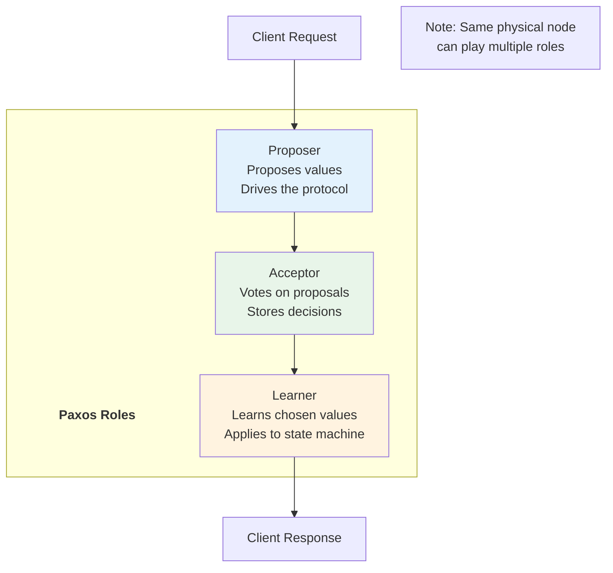
```mermaid
graph TD
    subgraph Roles[" "]
        Roles_title["Paxos Roles"]
        style Roles_title fill:none,stroke:none,color:#333,font-weight:bold
        P[Proposer<br/>Proposes values<br/>Drives the protocol]
        A[Acceptor<br/>Votes on proposals<br/>Stores decisions]
        L[Learner<br/>Learns chosen values<br/>Applies to state machine]
    end

    Client[Client Request] --> P
    P --> A
    A --> L
    L --> Response[Client Response]

    Note1["Note: Same physical node<br/>can play multiple roles"]

    style P fill:#e3f2fd
    style A fill:#e8f5e9
    style L fill:#fff3e0
```

### Basic Paxos (Single-Decree)

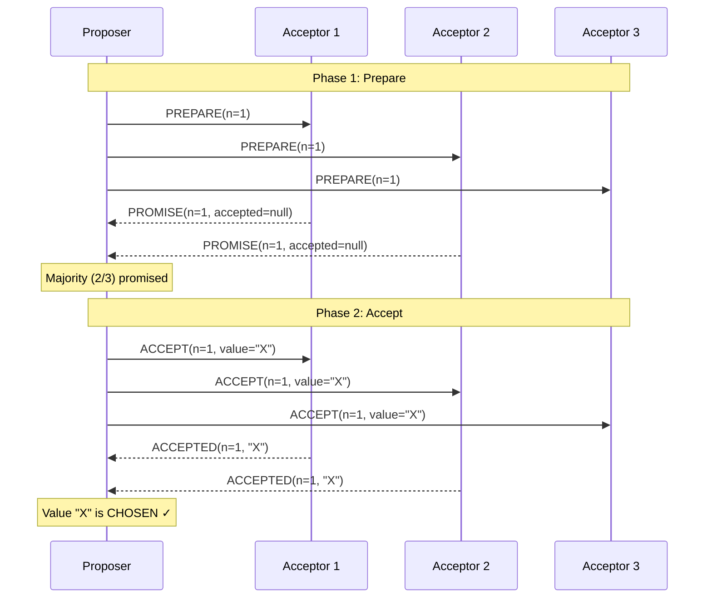
```mermaid
sequenceDiagram
    participant P as Proposer
    participant A1 as Acceptor 1
    participant A2 as Acceptor 2
    participant A3 as Acceptor 3

    Note over P,A3: Phase 1: Prepare

    P->>A1: PREPARE(n=1)
    P->>A2: PREPARE(n=1)
    P->>A3: PREPARE(n=1)

    A1-->>P: PROMISE(n=1, accepted=null)
    A2-->>P: PROMISE(n=1, accepted=null)
    Note over P: Majority (2/3) promised

    Note over P,A3: Phase 2: Accept

    P->>A1: ACCEPT(n=1, value="X")
    P->>A2: ACCEPT(n=1, value="X")
    P->>A3: ACCEPT(n=1, value="X")

    A1-->>P: ACCEPTED(n=1, "X")
    A2-->>P: ACCEPTED(n=1, "X")
    Note over P: Value "X" is CHOSEN ✓
```

### Paxos Phase Details

**Phase 1a — Prepare:**
- Proposer selects a proposal number `n` (globally unique, monotonically increasing)
- Sends `PREPARE(n)` to a majority of acceptors
- Meaning: "I want to propose with ballot number n"

**Phase 1b — Promise:**
- Acceptor receives `PREPARE(n)`:
  - If `n` > any previous prepare: reply `PROMISE(n, previously_accepted_value)`
  - Otherwise: ignore or send NACK
- Promise means: "I won't accept any proposal with number < n"

**Phase 2a — Accept:**
- Proposer receives promises from majority:
  - If any promise included an already-accepted value: use that value
  - Otherwise: use proposer's own value
- Send `ACCEPT(n, value)` to majority

**Phase 2b — Accepted:**
- Acceptor receives `ACCEPT(n, value)`:
  - If acceptor hasn't promised a higher number: accept and notify learners
  - Otherwise: reject

### Handling Conflicts (Dueling Proposers)

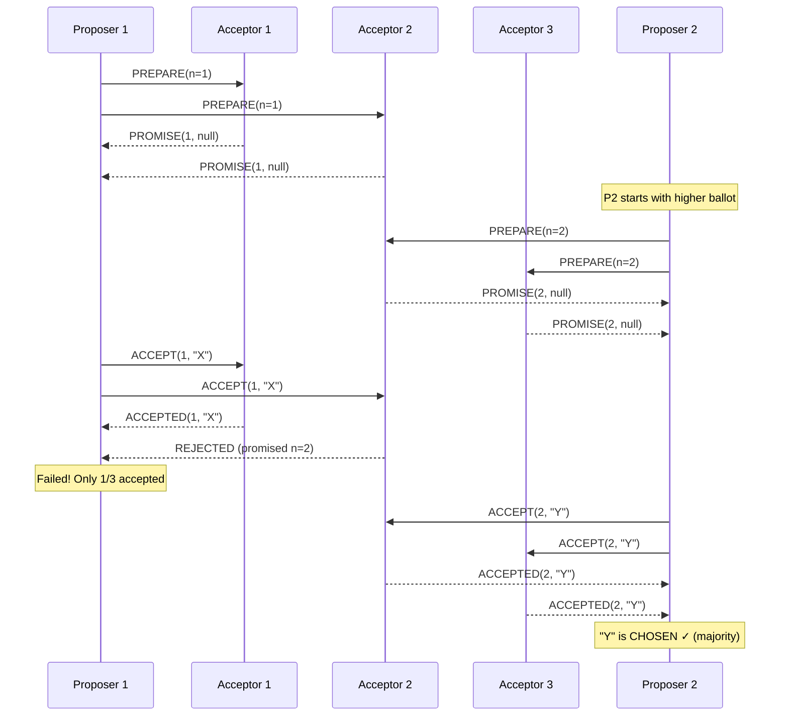
```mermaid
sequenceDiagram
    participant P1 as Proposer 1
    participant A1 as Acceptor 1
    participant A2 as Acceptor 2
    participant A3 as Acceptor 3
    participant P2 as Proposer 2

    P1->>A1: PREPARE(n=1)
    P1->>A2: PREPARE(n=1)
    A1-->>P1: PROMISE(1, null)
    A2-->>P1: PROMISE(1, null)

    Note over P2: P2 starts with higher ballot
    P2->>A2: PREPARE(n=2)
    P2->>A3: PREPARE(n=2)
    A2-->>P2: PROMISE(2, null)
    A3-->>P2: PROMISE(2, null)

    P1->>A1: ACCEPT(1, "X")
    P1->>A2: ACCEPT(1, "X")
    A1-->>P1: ACCEPTED(1, "X")
    A2-->>P1: REJECTED (promised n=2)

    Note over P1: Failed! Only 1/3 accepted

    P2->>A2: ACCEPT(2, "Y")
    P2->>A3: ACCEPT(2, "Y")
    A2-->>P2: ACCEPTED(2, "Y")
    A3-->>P2: ACCEPTED(2, "Y")

    Note over P2: "Y" is CHOSEN ✓ (majority)
```

### Multi-Paxos Optimization

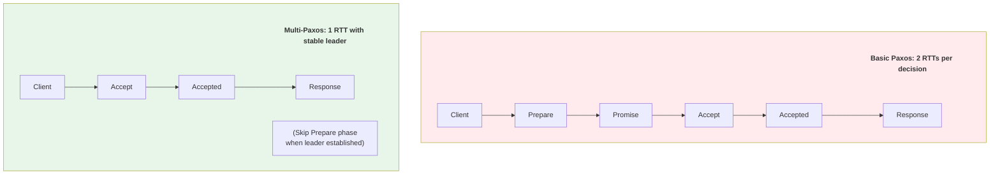
```mermaid
graph TD
    subgraph BasicPaxos[" "]
        BasicPaxos_title["Basic Paxos: 2 RTTs per decision"]
        style BasicPaxos_title fill:none,stroke:none,color:#333,font-weight:bold
        BP1[Client] --> BP2[Prepare]
        BP2 --> BP3[Promise]
        BP3 --> BP4[Accept]
        BP4 --> BP5[Accepted]
        BP5 --> BP6[Response]
    end

    subgraph MultiPaxos[" "]
        MultiPaxos_title["Multi-Paxos: 1 RTT with stable leader"]
        style MultiPaxos_title fill:none,stroke:none,color:#333,font-weight:bold
        MP1[Client] --> MP2[Accept]
        MP2 --> MP3[Accepted]
        MP3 --> MP4[Response]
        MP5["(Skip Prepare phase<br/>when leader established)"]
    end

    style BasicPaxos fill:#ffebee
    style MultiPaxos fill:#e8f5e9
```

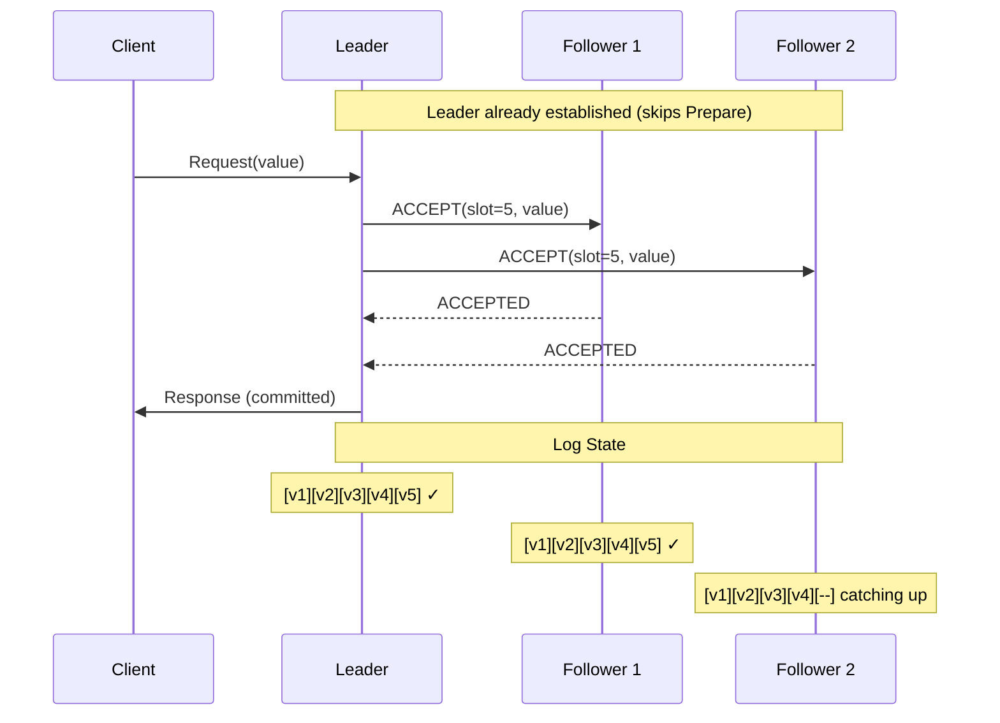
```mermaid
sequenceDiagram
    participant C as Client
    participant L as Leader
    participant F1 as Follower 1
    participant F2 as Follower 2

    Note over L,F2: Leader already established (skips Prepare)

    C->>L: Request(value)
    L->>F1: ACCEPT(slot=5, value)
    L->>F2: ACCEPT(slot=5, value)
    F1-->>L: ACCEPTED
    F2-->>L: ACCEPTED
    L->>C: Response (committed)

    Note over L,F2: Log State
    Note over L: [v1][v2][v3][v4][v5] ✓
    Note over F1: [v1][v2][v3][v4][v5] ✓
    Note over F2: [v1][v2][v3][v4][--] catching up
```

### Paxos Invariants (Safety Properties)

| Property | Description |
|----------|-------------|
| P1 | An acceptor can accept a proposal with number n iff it has not responded to a prepare with number > n |
| P2 | If a proposal with value v is chosen, every higher-numbered proposal accepted has value v |
| P2a | If a proposal (n, v) is chosen, every higher-numbered proposal accepted by any acceptor has value v |
| P2b | If a proposal (n, v) is chosen, every higher-numbered proposal issued by any proposer has value v |
| P2c | For any v and n, if a proposal (n, v) is issued, then there is a set S of majority acceptors such that either no acceptor in S has accepted any proposal < n, or v is the value of the highest-numbered proposal among all proposals < n accepted by acceptors in S |

### Impact on Modern Systems
- **Google Spanner** — Uses Multi-Paxos for global consensus
- **Google Chubby** — Paxos-based distributed lock
- **Apache Cassandra** — Lightweight transactions use Paxos
- **Amazon DynamoDB** — Paxos variant for leader election
- **Foundation** — Every consensus protocol derives from or improves upon Paxos

---

## 2. RAFT - 2014

### Paper Info
- **Title:** In Search of an Understandable Consensus Algorithm
- **Authors:** Diego Ongaro, John Ousterhout (Stanford)
- **Conference:** USENIX ATC 2014
- **Link:** https://raft.github.io/raft.pdf
- **Interactive Visualization:** https://raft.github.io/
- **Thesis:** https://web.stanford.edu/~ouster/cgi-bin/papers/OngaroPhD.pdf

### Key Contributions
- Consensus algorithm designed for **understandability** (vs Paxos complexity)
- Strong leader approach — simplifies reasoning
- Clear decomposition into sub-problems (election, replication, safety)
- Membership changes via joint consensus
- Proved equivalent to Multi-Paxos in safety and liveness

### Raft Node States

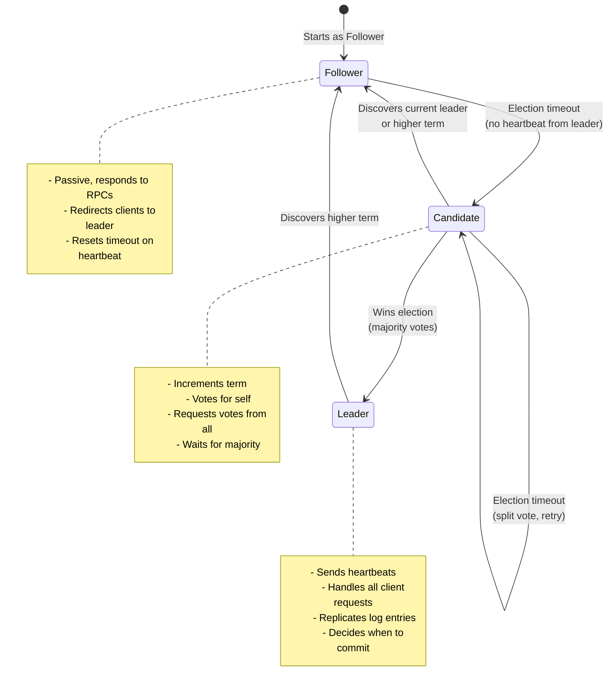
```mermaid
stateDiagram-v2
    [*] --> Follower: Starts as Follower

    Follower --> Candidate: Election timeout<br/>(no heartbeat from leader)
    Candidate --> Follower: Discovers current leader<br/>or higher term
    Candidate --> Candidate: Election timeout<br/>(split vote, retry)
    Candidate --> Leader: Wins election<br/>(majority votes)
    Leader --> Follower: Discovers higher term

    note right of Follower
        - Passive, responds to RPCs
        - Redirects clients to leader
        - Resets timeout on heartbeat
    end note

    note right of Candidate
        - Increments term
        - Votes for self
        - Requests votes from all
        - Waits for majority
    end note

    note right of Leader
        - Sends heartbeats
        - Handles all client requests
        - Replicates log entries
        - Decides when to commit
    end note
```

### Leader Election

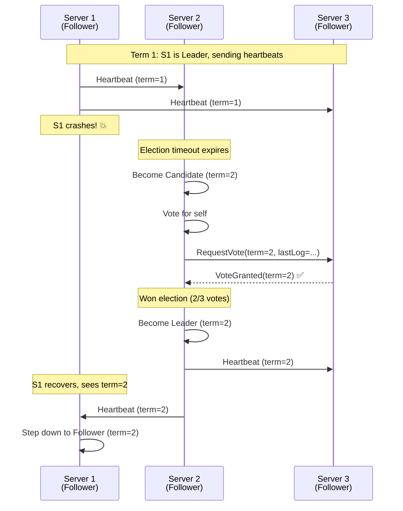
```mermaid
sequenceDiagram
    participant S1 as Server 1<br/>(Follower)
    participant S2 as Server 2<br/>(Follower)
    participant S3 as Server 3<br/>(Follower)

    Note over S1,S3: Term 1: S1 is Leader, sending heartbeats

    S1->>S2: Heartbeat (term=1)
    S1->>S3: Heartbeat (term=1)

    Note over S1: S1 crashes! 💥

    Note over S2: Election timeout expires
    S2->>S2: Become Candidate (term=2)
    S2->>S2: Vote for self

    S2->>S3: RequestVote(term=2, lastLog=...)
    S3-->>S2: VoteGranted(term=2) ✅

    Note over S2: Won election (2/3 votes)
    S2->>S2: Become Leader (term=2)

    S2->>S3: Heartbeat (term=2)
    Note over S1: S1 recovers, sees term=2
    S2->>S1: Heartbeat (term=2)
    S1->>S1: Step down to Follower (term=2)
```

### Log Replication

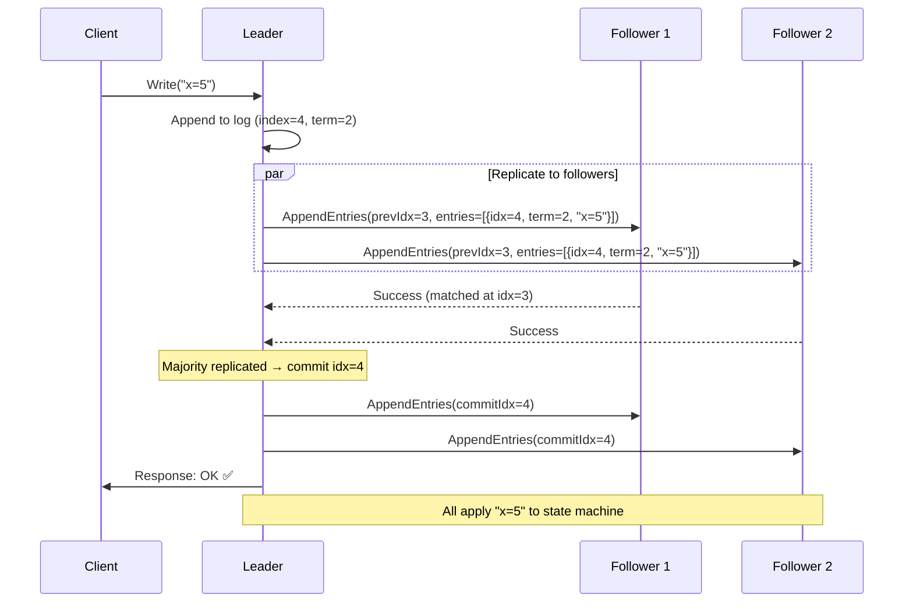
```mermaid
sequenceDiagram
    participant C as Client
    participant L as Leader
    participant F1 as Follower 1
    participant F2 as Follower 2

    C->>L: Write("x=5")
    L->>L: Append to log (index=4, term=2)

    par Replicate to followers
        L->>F1: AppendEntries(prevIdx=3, entries=[{idx=4, term=2, "x=5"}])
        L->>F2: AppendEntries(prevIdx=3, entries=[{idx=4, term=2, "x=5"}])
    end

    F1-->>L: Success (matched at idx=3)
    F2-->>L: Success

    Note over L: Majority replicated → commit idx=4

    L->>F1: AppendEntries(commitIdx=4)
    L->>F2: AppendEntries(commitIdx=4)

    L->>C: Response: OK ✅

    Note over L,F2: All apply "x=5" to state machine
```

### Log Consistency

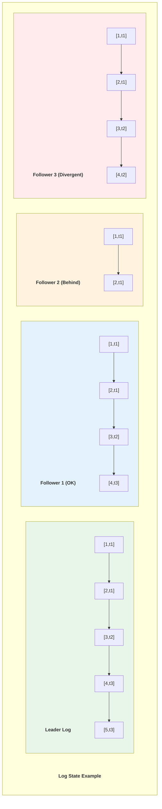
```mermaid
graph TD
    subgraph LogState[" "]
        LogState_title["Log State Example"]
        style LogState_title fill:none,stroke:none,color:#333,font-weight:bold
        subgraph Leader[" "]
            Leader_title["Leader Log"]
            style Leader_title fill:none,stroke:none,color:#333,font-weight:bold
            L1["[1,t1]"] --> L2["[2,t1]"] --> L3["[3,t2]"] --> L4["[4,t3]"] --> L5["[5,t3]"]
        end

        subgraph F1Log[" "]
            F1Log_title["Follower 1 (OK)"]
            style F1Log_title fill:none,stroke:none,color:#333,font-weight:bold
            F1A["[1,t1]"] --> F1B["[2,t1]"] --> F1C["[3,t2]"] --> F1D["[4,t3]"]
        end

        subgraph F2Log[" "]
            F2Log_title["Follower 2 (Behind)"]
            style F2Log_title fill:none,stroke:none,color:#333,font-weight:bold
            F2A["[1,t1]"] --> F2B["[2,t1]"]
        end

        subgraph F3Log[" "]
            F3Log_title["Follower 3 (Divergent)"]
            style F3Log_title fill:none,stroke:none,color:#333,font-weight:bold
            F3A["[1,t1]"] --> F3B["[2,t1]"] --> F3C["[3,t2]"] --> F3D["[4,t2]"]
        end
    end

    style Leader fill:#e8f5e9
    style F1Log fill:#e3f2fd
    style F2Log fill:#fff3e0
    style F3Log fill:#ffebee
```

**Log Repair Process:**
1. Leader sends AppendEntries with `prevLogIndex` and `prevLogTerm`
2. Follower checks if it has matching entry at `prevLogIndex`
3. If mismatch: Follower responds with failure, leader decrements `nextIndex`
4. Leader retries with earlier entries until match found
5. Follower deletes conflicting entries and appends leader's entries

### Safety Properties

| Property | Guarantee |
|----------|-----------|
| Election Safety | At most one leader per term |
| Leader Append-Only | Leader never overwrites or deletes entries |
| Log Matching | If two logs have entry with same index and term, all preceding entries are identical |
| Leader Completeness | If entry committed in term t, it appears in all leaders for terms > t |
| State Machine Safety | If server applies entry at index i, no other server applies different entry at i |

### Cluster Membership Changes

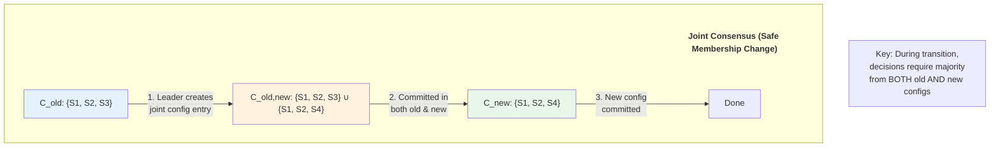
```mermaid
graph TD
    subgraph JointConsensus[" "]
        JointConsensus_title["Joint Consensus (Safe Membership Change)"]
        style JointConsensus_title fill:none,stroke:none,color:#333,font-weight:bold
        Cold["C_old: {S1, S2, S3}"]
        Joint["C_old,new: {S1, S2, S3} ∪ {S1, S2, S4}"]
        Cnew["C_new: {S1, S2, S4}"]

        Cold -->|"1. Leader creates<br/>joint config entry"| Joint
        Joint -->|"2. Committed in<br/>both old & new"| Cnew
        Cnew -->|"3. New config<br/>committed"| Done[Done]
    end

    Note1["Key: During transition,<br/>decisions require majority<br/>from BOTH old AND new configs"]

    style Cold fill:#e3f2fd
    style Joint fill:#fff3e0
    style Cnew fill:#e8f5e9
```

### Raft vs Paxos Comparison

| Aspect | Paxos | Raft |
|--------|-------|------|
| Understandability | Complex, hard to implement | Designed for clarity |
| Leader | Optional (leaderless Paxos exists) | Required (strong leader) |
| Log replication | Separate problem | Built into algorithm |
| Membership change | Complex reconfiguration | Joint consensus |
| Implementation variants | Many (Multi-Paxos, Fast, EPaxos...) | Single canonical algorithm |
| Performance optimization | More flexible | Less flexible |
| Teaching | Difficult | Widely taught |
| Formal proof | Yes | Yes (equivalent to Paxos) |
| Industry adoption | Google, AWS | etcd, CockroachDB, TiKV |

### Impact on Modern Systems
- **etcd** — Kubernetes' backing store, canonical Raft implementation
- **Consul** — HashiCorp service mesh and service discovery
- **CockroachDB** — Distributed SQL using per-range Raft
- **TiKV** — Distributed KV store (TiDB's storage engine)
- **RethinkDB** — Used Raft for replication
- **Hashicorp Nomad** — Raft for state management
- **Most modern distributed systems** — Prefer Raft over Paxos for new implementations

---

## 3. ZAB (ZooKeeper Atomic Broadcast) - 2008

### Paper Info
- **Title:** Zab: High-performance broadcast for primary-backup systems
- **Authors:** Flavio P. Junqueira, Benjamin C. Reed, Marco Serafini
- **Conference:** DSN 2011
- **Link:** https://ieeexplore.ieee.org/document/5958223
- **PDF:** https://marcoserafini.github.io/papers/zab.pdf

### Key Contributions
- Primary-backup replication protocol for ZooKeeper
- Total order broadcast — all updates applied in same order everywhere
- Optimized for high throughput (batching)
- Crash recovery with state transfer
- FIFO ordering per client session

### ZAB Protocol Phases

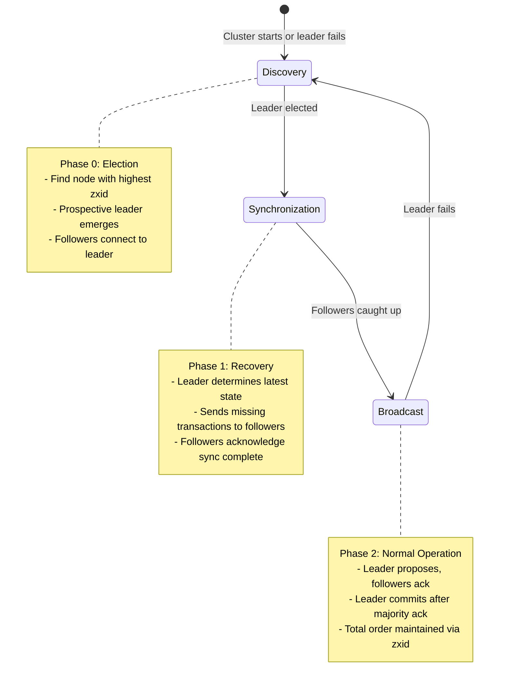
```mermaid
stateDiagram-v2
    [*] --> Discovery: Cluster starts or leader fails

    Discovery --> Synchronization: Leader elected
    Synchronization --> Broadcast: Followers caught up
    Broadcast --> Discovery: Leader fails

    note right of Discovery
        Phase 0: Election
        - Find node with highest zxid
        - Prospective leader emerges
        - Followers connect to leader
    end note

    note right of Synchronization
        Phase 1: Recovery
        - Leader determines latest state
        - Sends missing transactions to followers
        - Followers acknowledge sync complete
    end note

    note right of Broadcast
        Phase 2: Normal Operation
        - Leader proposes, followers ack
        - Leader commits after majority ack
        - Total order maintained via zxid
    end note
```

### ZXID (ZooKeeper Transaction ID)

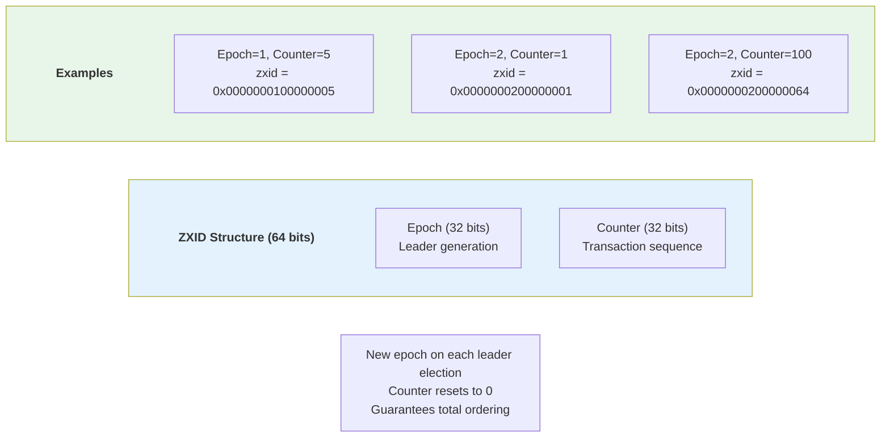
```mermaid
graph LR
    subgraph ZXID[" "]
        ZXID_title["ZXID Structure (64 bits)"]
        style ZXID_title fill:none,stroke:none,color:#333,font-weight:bold
        Epoch["Epoch (32 bits)<br/>Leader generation"]
        Counter["Counter (32 bits)<br/>Transaction sequence"]
    end

    subgraph Examples[" "]
        Examples_title["Examples"]
        style Examples_title fill:none,stroke:none,color:#333,font-weight:bold
        E1["Epoch=1, Counter=5<br/>zxid = 0x0000000100000005"]
        E2["Epoch=2, Counter=1<br/>zxid = 0x0000000200000001"]
        E3["Epoch=2, Counter=100<br/>zxid = 0x0000000200000064"]
    end

    Note1["New epoch on each leader election<br/>Counter resets to 0<br/>Guarantees total ordering"]

    style ZXID fill:#e3f2fd
    style Examples fill:#e8f5e9
```

### Broadcast Protocol

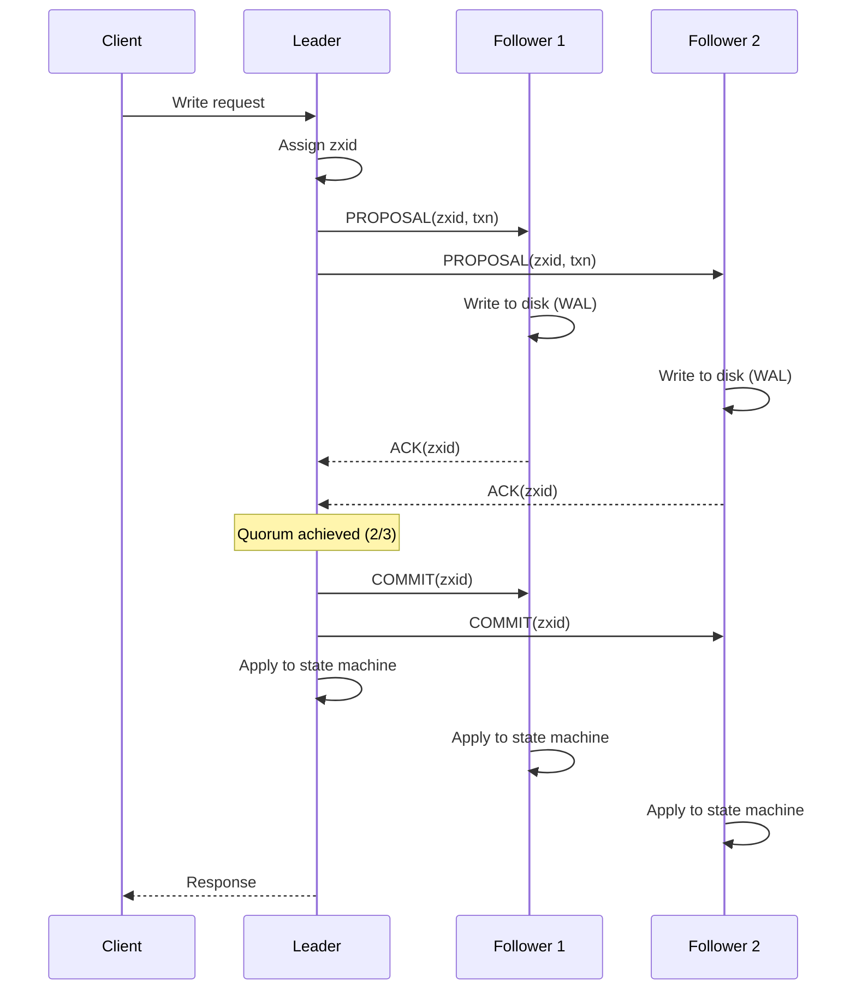
```mermaid
sequenceDiagram
    participant C as Client
    participant L as Leader
    participant F1 as Follower 1
    participant F2 as Follower 2

    C->>L: Write request

    L->>L: Assign zxid
    L->>F1: PROPOSAL(zxid, txn)
    L->>F2: PROPOSAL(zxid, txn)

    F1->>F1: Write to disk (WAL)
    F2->>F2: Write to disk (WAL)

    F1-->>L: ACK(zxid)
    F2-->>L: ACK(zxid)

    Note over L: Quorum achieved (2/3)

    L->>F1: COMMIT(zxid)
    L->>F2: COMMIT(zxid)

    L->>L: Apply to state machine
    F1->>F1: Apply to state machine
    F2->>F2: Apply to state machine

    L-->>C: Response
```

### Ordering Guarantees

| Guarantee | Description | Mechanism |
|-----------|-------------|-----------|
| Primary Order | If leader broadcasts a before b, all deliver a before b | ZXID ordering |
| FIFO Order | Per-client session ordering | Session + sequence numbers |
| Causal Order | If a causally precedes b, a delivered before b | Session semantics |
| Total Order | All servers see same sequence of updates | ZAB protocol |
| Local Order | Each server applies in FIFO from leader | Single leader |

### ZAB vs Raft

| Feature | ZAB | Raft |
|---------|-----|------|
| Designed for | ZooKeeper specifically | General consensus |
| Leader election | Highest zxid wins | Most up-to-date log |
| Log gaps | Not allowed (no gaps) | Allowed (filled by leader) |
| Idempotency | Via zxid | Via log index + term |
| Throughput | Higher (batching) | Lower (per-entry) |
| Implementation | ZooKeeper only | Many implementations |
| Read consistency | Linearizable reads via sync | Leader reads |

### Impact on Modern Systems
- **Apache ZooKeeper** — Core consensus protocol
- **Apache Kafka (pre-3.0)** — ZooKeeper for coordination
- **Apache HBase** — ZooKeeper for master election
- **Apache HDFS** — ZooKeeper for NameNode HA
- **Apache Solr** — ZooKeeper for cluster coordination

---

## 4. VIEWSTAMPED REPLICATION - 1988/2012

### Paper Info
- **Title:** Viewstamped Replication Revisited (2012 revision)
- **Authors:** Barbara Liskov, James Cowling
- **Original:** Brian Oki, Barbara Liskov (1988)
- **Link:** https://pmg.csail.mit.edu/papers/vr-revisited.pdf

### Key Contributions
- Early replicated state machine approach (before Paxos publication)
- View changes for leader election (inspired Raft's term concept)
- Simpler mental model than original Paxos
- Influenced design of Raft, PBFT, and other protocols
- State transfer for recovery

### Viewstamped Replication Protocol

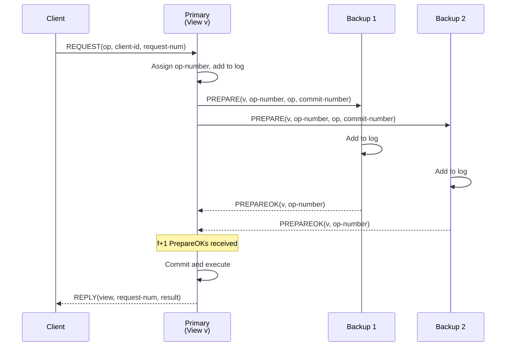
```mermaid
sequenceDiagram
    participant C as Client
    participant P as Primary<br/>(View v)
    participant B1 as Backup 1
    participant B2 as Backup 2

    C->>P: REQUEST(op, client-id, request-num)

    P->>P: Assign op-number, add to log

    P->>B1: PREPARE(v, op-number, op, commit-number)
    P->>B2: PREPARE(v, op-number, op, commit-number)

    B1->>B1: Add to log
    B2->>B2: Add to log

    B1-->>P: PREPAREOK(v, op-number)
    B2-->>P: PREPAREOK(v, op-number)

    Note over P: f+1 PrepareOKs received

    P->>P: Commit and execute
    P-->>C: REPLY(view, request-num, result)
```

### View Change Protocol

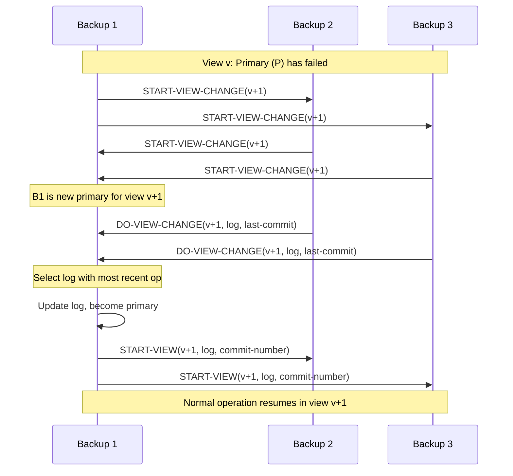
```mermaid
sequenceDiagram
    participant B1 as Backup 1
    participant B2 as Backup 2
    participant B3 as Backup 3

    Note over B1,B3: View v: Primary (P) has failed

    B1->>B2: START-VIEW-CHANGE(v+1)
    B1->>B3: START-VIEW-CHANGE(v+1)
    B2->>B1: START-VIEW-CHANGE(v+1)
    B3->>B1: START-VIEW-CHANGE(v+1)

    Note over B1: B1 is new primary for view v+1

    B2->>B1: DO-VIEW-CHANGE(v+1, log, last-commit)
    B3->>B1: DO-VIEW-CHANGE(v+1, log, last-commit)

    Note over B1: Select log with most recent op
    B1->>B1: Update log, become primary

    B1->>B2: START-VIEW(v+1, log, commit-number)
    B1->>B3: START-VIEW(v+1, log, commit-number)

    Note over B1,B3: Normal operation resumes in view v+1
```

### Key Concepts

| Concept | Description |
|---------|-------------|
| View | Configuration with designated primary (like Raft's term) |
| View number | Monotonically increasing, determines which primary |
| Op-number | Sequence number for operations (like log index) |
| Commit-number | Highest committed op-number |
| View change | Process to elect new primary when old one fails |
| State transfer | Recovery mechanism for crashed/lagging replicas |

### Influence on Later Protocols

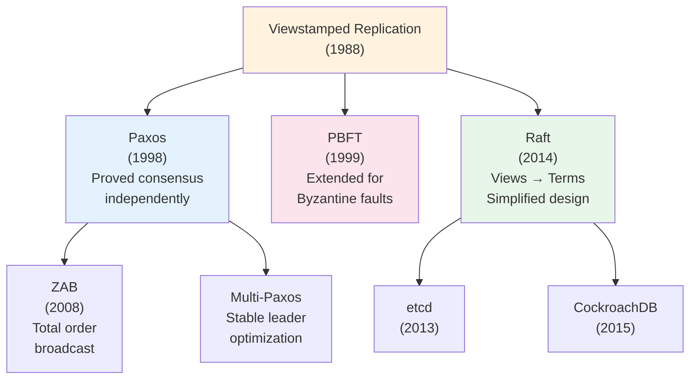
```mermaid
graph TD
    VR["Viewstamped Replication<br/>(1988)"] --> Paxos["Paxos<br/>(1998)<br/>Proved consensus<br/>independently"]
    VR --> PBFT["PBFT<br/>(1999)<br/>Extended for<br/>Byzantine faults"]
    VR --> Raft["Raft<br/>(2014)<br/>Views → Terms<br/>Simplified design"]
    Paxos --> ZAB["ZAB<br/>(2008)<br/>Total order<br/>broadcast"]
    Paxos --> MultiPaxos["Multi-Paxos<br/>Stable leader<br/>optimization"]
    Raft --> etcd["etcd<br/>(2013)"]
    Raft --> CockroachDB["CockroachDB<br/>(2015)"]

    style VR fill:#fff3e0
    style Paxos fill:#e3f2fd
    style Raft fill:#e8f5e9
    style PBFT fill:#fce4ec
```

---

## 5. PBFT (Practical Byzantine Fault Tolerance) - 1999

### Paper Info
- **Title:** Practical Byzantine Fault Tolerance
- **Authors:** Miguel Castro, Barbara Liskov
- **Conference:** OSDI 1999
- **Link:** https://pmg.csail.mit.edu/papers/osdi99.pdf

### Key Contributions
- First practical algorithm to tolerate malicious (Byzantine) nodes
- Requires 3f+1 nodes to tolerate f Byzantine failures
- Three-phase protocol: Pre-prepare → Prepare → Commit
- Foundation for blockchain consensus
- View changes for faulty primary

### Fault Model Comparison

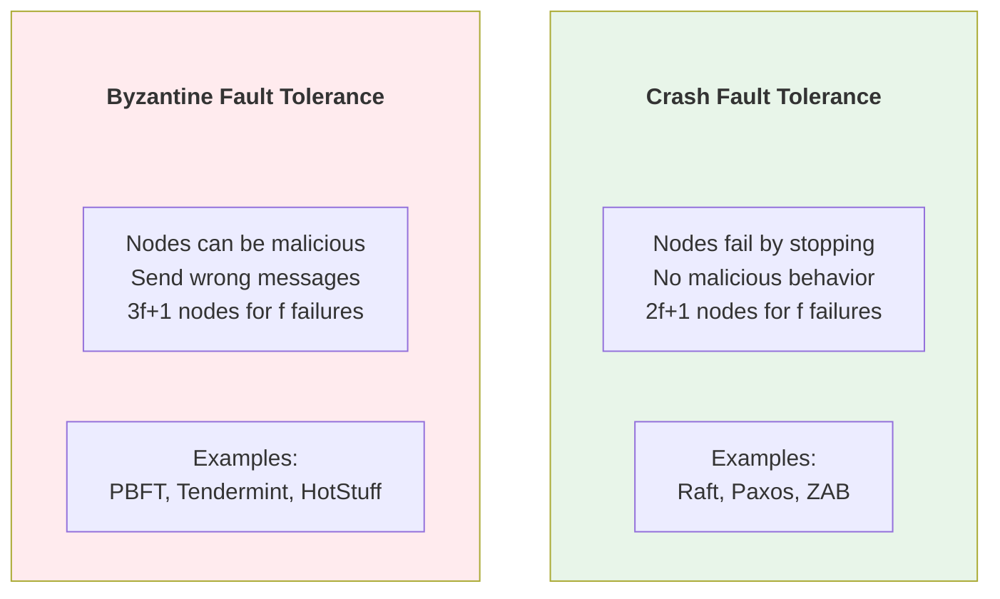
```mermaid
graph TD
    subgraph CFT[" "]
        CFT_title["Crash Fault Tolerance"]
        style CFT_title fill:none,stroke:none,color:#333,font-weight:bold
        CFTD["Nodes fail by stopping<br/>No malicious behavior<br/>2f+1 nodes for f failures"]
        CFTEx["Examples:<br/>Raft, Paxos, ZAB"]
    end

    subgraph BFT[" "]
        BFT_title["Byzantine Fault Tolerance"]
        style BFT_title fill:none,stroke:none,color:#333,font-weight:bold
        BFTD["Nodes can be malicious<br/>Send wrong messages<br/>3f+1 nodes for f failures"]
        BFTEx["Examples:<br/>PBFT, Tendermint, HotStuff"]
    end

    style CFT fill:#e8f5e9
    style BFT fill:#ffebee
```

### PBFT Protocol

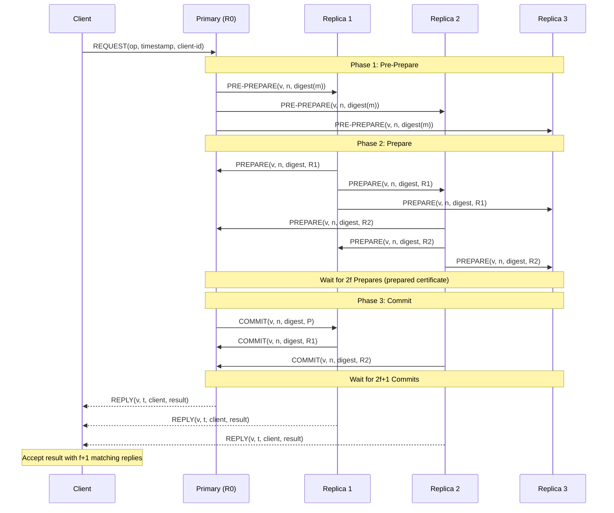
```mermaid
sequenceDiagram
    participant C as Client
    participant P as Primary (R0)
    participant R1 as Replica 1
    participant R2 as Replica 2
    participant R3 as Replica 3

    C->>P: REQUEST(op, timestamp, client-id)

    Note over P,R3: Phase 1: Pre-Prepare
    P->>R1: PRE-PREPARE(v, n, digest(m))
    P->>R2: PRE-PREPARE(v, n, digest(m))
    P->>R3: PRE-PREPARE(v, n, digest(m))

    Note over P,R3: Phase 2: Prepare
    R1->>P: PREPARE(v, n, digest, R1)
    R1->>R2: PREPARE(v, n, digest, R1)
    R1->>R3: PREPARE(v, n, digest, R1)
    R2->>P: PREPARE(v, n, digest, R2)
    R2->>R1: PREPARE(v, n, digest, R2)
    R2->>R3: PREPARE(v, n, digest, R2)

    Note over P,R3: Wait for 2f Prepares (prepared certificate)

    Note over P,R3: Phase 3: Commit
    P->>R1: COMMIT(v, n, digest, P)
    R1->>P: COMMIT(v, n, digest, R1)
    R2->>P: COMMIT(v, n, digest, R2)

    Note over P,R3: Wait for 2f+1 Commits

    P-->>C: REPLY(v, t, client, result)
    R1-->>C: REPLY(v, t, client, result)
    R2-->>C: REPLY(v, t, client, result)

    Note over C: Accept result with f+1 matching replies
```

### Why 3f+1 Nodes?

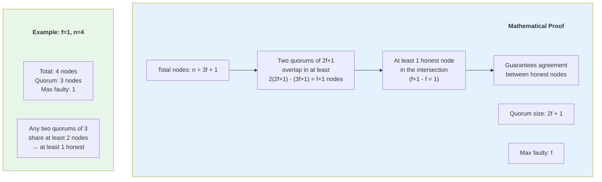
```mermaid
graph TD
    subgraph Math[" "]
        Math_title["Mathematical Proof"]
        style Math_title fill:none,stroke:none,color:#333,font-weight:bold
        N["Total nodes: n = 3f + 1"]
        Q["Quorum size: 2f + 1"]
        F["Max faulty: f"]
        
        N --> I["Two quorums of 2f+1<br/>overlap in at least<br/>2(2f+1) - (3f+1) = f+1 nodes"]
        I --> H["At least 1 honest node<br/>in the intersection<br/>(f+1 - f = 1)"]
        H --> S["Guarantees agreement<br/>between honest nodes"]
    end

    subgraph Example[" "]
        Example_title["Example: f=1, n=4"]
        style Example_title fill:none,stroke:none,color:#333,font-weight:bold
        E1["Total: 4 nodes<br/>Quorum: 3 nodes<br/>Max faulty: 1"]
        E2["Any two quorums of 3<br/>share at least 2 nodes<br/>→ at least 1 honest"]
    end

    style Math fill:#e3f2fd
    style Example fill:#e8f5e9
```

### PBFT Message Complexity

| Metric | Basic Paxos | Raft | PBFT |
|--------|-------------|------|------|
| Nodes for f failures | 2f+1 | 2f+1 | 3f+1 |
| Message complexity | O(n) | O(n) | O(n²) |
| Communication rounds | 2 | 1 (with leader) | 3 |
| Fault type | Crash | Crash | Byzantine |
| View change | O(n) | O(n) | O(n³) |
| Practical limit | Large clusters | Large clusters | ~20 nodes |

### Impact on Modern Systems
- **Hyperledger Fabric** — BFT-based enterprise blockchain
- **Tendermint** — BFT consensus for Cosmos blockchain
- **HotStuff** — Used in Meta's Diem/Libra (now defunct)
- **Blockchain systems** — Foundation for BFT consensus
- **Critical systems** — Flight control, financial settlement

---

## 6. CHUBBY / ZOOKEEPER - 2006/2010

### Paper Info (Chubby)
- **Title:** The Chubby lock service for loosely-coupled distributed systems
- **Author:** Mike Burrows (Google)
- **Conference:** OSDI 2006
- **Link:** https://research.google/pubs/pub27897/

### Paper Info (ZooKeeper)
- **Title:** ZooKeeper: Wait-free coordination for Internet-scale systems
- **Authors:** Patrick Hunt, Mahadev Konar, Flavio P. Junqueira, Benjamin C. Reed
- **Conference:** USENIX ATC 2010
- **Link:** https://www.usenix.org/legacy/event/atc10/tech/full_papers/Hunt.pdf
- **GitHub:** https://github.com/apache/zookeeper

### Key Contributions
- **Chubby:** Coordination as a service for Google's infrastructure
- **ZooKeeper:** Open-source coordination service inspired by Chubby
- Hierarchical namespace (filesystem-like)
- Ephemeral nodes for liveness detection
- Sequential nodes for ordering
- Watch mechanism for event notification

### ZooKeeper Architecture

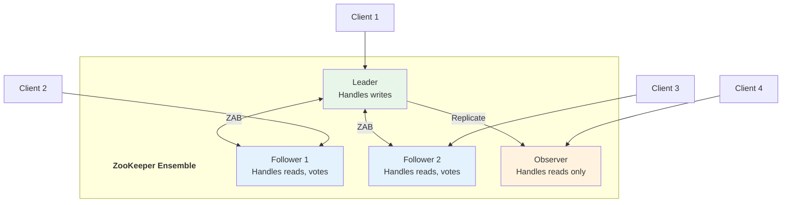
```mermaid
graph TD
    subgraph ZKEnsemble[" "]
        ZKEnsemble_title["ZooKeeper Ensemble"]
        style ZKEnsemble_title fill:none,stroke:none,color:#333,font-weight:bold
        L[Leader<br/>Handles writes]
        F1[Follower 1<br/>Handles reads, votes]
        F2[Follower 2<br/>Handles reads, votes]
        O1[Observer<br/>Handles reads only]

        L <-->|ZAB| F1
        L <-->|ZAB| F2
        L -->|Replicate| O1
    end

    C1[Client 1] --> L
    C2[Client 2] --> F1
    C3[Client 3] --> F2
    C4[Client 4] --> O1

    style L fill:#e8f5e9
    style F1 fill:#e3f2fd
    style F2 fill:#e3f2fd
    style O1 fill:#fff3e0
```

### ZooKeeper Data Model

```
ZooKeeper Namespace:

/
├── /services
│   ├── /services/api-server
│   │   ├── /services/api-server/node1  (EPHEMERAL)
│   │   ├── /services/api-server/node2  (EPHEMERAL)
│   │   └── /services/api-server/node3  (EPHEMERAL)
│   └── /services/database
│       ├── /services/database/primary  (EPHEMERAL)
│       └── /services/database/replica1 (EPHEMERAL)
├── /config
│   ├── /config/db-connection
│   └── /config/feature-flags
├── /locks
│   ├── /locks/resource-1
│   │   ├── /locks/resource-1/lock-0000000001 (EPHEMERAL_SEQUENTIAL)
│   │   └── /locks/resource-1/lock-0000000002 (EPHEMERAL_SEQUENTIAL)
│   └── /locks/resource-2
└── /election
    ├── /election/candidate-0000000001 (EPHEMERAL_SEQUENTIAL)
    ├── /election/candidate-0000000002 (EPHEMERAL_SEQUENTIAL)
    └── /election/candidate-0000000003 (EPHEMERAL_SEQUENTIAL)
```

### Node Types

```mermaid
graph TD
    subgraph NodeTypes[" "]
        NodeTypes_title["ZooKeeper Node Types"]
        style NodeTypes_title fill:none,stroke:none,color:#333,font-weight:bold
        P[Persistent<br/>Survives session end<br/>Must be explicitly deleted<br/>Use: config, metadata]
        E[Ephemeral<br/>Deleted when session ends<br/>No children allowed<br/>Use: service registration, locks]
        PS[Persistent Sequential<br/>Auto-incrementing suffix<br/>Persistent<br/>Use: ordered logs]
        ES[Ephemeral Sequential<br/>Auto-incrementing suffix<br/>Deleted on session end<br/>Use: locks, leader election]
    end

    style P fill:#e8f5e9
    style E fill:#fce4ec
    style PS fill:#e3f2fd
    style ES fill:#fff3e0
```

### Common Patterns

#### Leader Election

```mermaid
sequenceDiagram
    participant N1 as Node 1
    participant ZK as ZooKeeper
    participant N2 as Node 2
    participant N3 as Node 3

    N1->>ZK: create("/election/n_", EPHEMERAL_SEQUENTIAL)
    ZK-->>N1: /election/n_0000000001

    N2->>ZK: create("/election/n_", EPHEMERAL_SEQUENTIAL)
    ZK-->>N2: /election/n_0000000002

    N3->>ZK: create("/election/n_", EPHEMERAL_SEQUENTIAL)
    ZK-->>N3: /election/n_0000000003

    N1->>ZK: getChildren("/election")
    Note over N1: I'm lowest (0001) → I'm Leader! 👑

    N2->>ZK: getChildren("/election")
    N2->>ZK: watch("/election/n_0000000001")
    Note over N2: Not lowest → Watch my predecessor

    Note over N1: Node 1 crashes! 💥
    ZK->>ZK: Delete ephemeral n_0000000001

    ZK->>N2: Watch triggered! n_0000000001 deleted
    N2->>ZK: getChildren("/election")
    Note over N2: I'm now lowest (0002) → I'm Leader! 👑
```

#### Distributed Lock

```mermaid
sequenceDiagram
    participant C1 as Client 1
    participant ZK as ZooKeeper
    participant C2 as Client 2

    C1->>ZK: create("/locks/mylock/lock_", EPHEMERAL_SEQUENTIAL)
    ZK-->>C1: /locks/mylock/lock_0000000001

    C2->>ZK: create("/locks/mylock/lock_", EPHEMERAL_SEQUENTIAL)
    ZK-->>C2: /locks/mylock/lock_0000000002

    C1->>ZK: getChildren("/locks/mylock")
    Note over C1: I'm lowest → Lock acquired! 🔒

    C2->>ZK: getChildren("/locks/mylock")
    C2->>ZK: watch("/locks/mylock/lock_0000000001")
    Note over C2: Not lowest → Wait for predecessor

    Note over C1: Work with resource...
    C1->>ZK: delete("/locks/mylock/lock_0000000001")
    Note over C1: Lock released! 🔓

    ZK->>C2: Watch triggered!
    C2->>ZK: getChildren("/locks/mylock")
    Note over C2: I'm lowest → Lock acquired! 🔒
```

#### Service Discovery

```mermaid
graph TD
    subgraph Registration[" "]
        Registration_title["Service Registration"]
        style Registration_title fill:none,stroke:none,color:#333,font-weight:bold
        S1[Service Instance 1] -->|"create EPHEMERAL"| ZK1["/services/api/host1:8080"]
        S2[Service Instance 2] -->|"create EPHEMERAL"| ZK2["/services/api/host2:8080"]
        S3[Service Instance 3] -->|"create EPHEMERAL"| ZK3["/services/api/host3:8080"]
    end

    subgraph Discovery[" "]
        Discovery_title["Service Discovery"]
        style Discovery_title fill:none,stroke:none,color:#333,font-weight:bold
        LB[Load Balancer] -->|"getChildren + watch"| SVC["/services/api/"]
        SVC --> ZK1
        SVC --> ZK2
        SVC --> ZK3
    end

    subgraph FailureDetection[" "]
        FailureDetection_title["Failure Detection"]
        style FailureDetection_title fill:none,stroke:none,color:#333,font-weight:bold
        S2 -->|"crashes"| Dead["Session expires"]
        Dead -->|"ZK deletes ephemeral"| ZK2
        ZK2 -->|"Watch notification"| LB
        LB -->|"Remove from pool"| Updated["Updated: host1, host3"]
    end

    style Registration fill:#e8f5e9
    style Discovery fill:#e3f2fd
    style FailureDetection fill:#ffebee
```

### ZooKeeper Guarantees

| Guarantee | Description |
|-----------|-------------|
| Sequential Consistency | Updates applied in order from each client |
| Atomicity | Updates succeed or fail entirely |
| Single System Image | Client sees same view regardless of server |
| Reliability | Once applied, update persists until overwritten |
| Timeliness | Client view is up-to-date within bounded time |
| Wait-free reads | Reads served locally (may be stale) |
| Linearizable writes | All writes go through leader |

### ZooKeeper Limitations & Alternatives

| Limitation | Alternative |
|-----------|-------------|
| Small data model (1MB per znode) | etcd (larger values) |
| Java-only server | etcd (Go), Consul (Go) |
| Complex client libraries | Consul (HTTP API) |
| Scalability (~60K znodes) | etcd (larger scale) |
| Operational complexity | Consul (easier ops) |

### Impact on Modern Systems
- **Apache Kafka (pre-3.0)** — Topic metadata, broker coordination
- **Apache HBase** — Master election, region assignment
- **Apache HDFS** — NameNode HA
- **Apache Solr/SolrCloud** — Cluster coordination
- **Apache Druid** — Cluster coordination
- **Curator** — High-level ZooKeeper recipes library

---

## 7. ETCD / RAFT IN PRACTICE - 2013

### Documentation/Paper
- **Title:** etcd: A Distributed Reliable Key-Value Store
- **Source:** CoreOS (now Red Hat/IBM)
- **Website:** https://etcd.io/
- **GitHub:** https://github.com/etcd-io/etcd
- **Raft library:** https://github.com/etcd-io/raft

### Key Contributions
- Reference implementation of Raft consensus
- Kubernetes' primary backing store
- Simple key-value API (gRPC + HTTP)
- Watch mechanism for real-time notifications
- Lease-based session management
- MVCC with revision history

### etcd Architecture

```mermaid
graph TD
    subgraph Cluster[" "]
        Cluster_title["etcd Cluster (Raft)"]
        style Cluster_title fill:none,stroke:none,color:#333,font-weight:bold
        N1[etcd Node 1<br/>Leader]
        N2[etcd Node 2<br/>Follower]
        N3[etcd Node 3<br/>Follower]
        N1 <-->|"Raft log<br/>replication"| N2
        N1 <-->|"Raft log<br/>replication"| N3
    end

    subgraph Internal[" "]
        Internal_title["Internal Architecture"]
        style Internal_title fill:none,stroke:none,color:#333,font-weight:bold
        GRPC[gRPC Server] --> Auth[Auth Module]
        Auth --> KV[KV Store]
        KV --> MVCC[MVCC<br/>bbolt/BoltDB]
        KV --> Raft_Module[Raft Module]
        Raft_Module --> WAL[Write-Ahead Log]
        Raft_Module --> Snap[Snapshot]
    end

    Client[Client / kubectl] -->|"gRPC/HTTP"| GRPC

    style Cluster fill:#e3f2fd
    style Internal fill:#e8f5e9
```

### etcd API Operations

```bash
# Key-Value Operations
etcdctl put /config/db "host=localhost:5432"
etcdctl get /config/db
etcdctl get /config/ --prefix    # Range query
etcdctl del /config/db

# Watch for Changes
etcdctl watch /services --prefix
# Output when changes happen:
# PUT /services/api/node1 "host:8080"
# DELETE /services/api/node1

# Lease (TTL-based key expiration)
etcdctl lease grant 60                    # 60-second lease
# lease 694d81c7c6e6bf6a granted with TTL(60s)
etcdctl put /services/api/node1 "alive" --lease=694d81c7c6e6bf6a
# Key auto-deleted after 60s unless lease renewed

etcdctl lease keep-alive 694d81c7c6e6bf6a  # Renew lease

# Transaction (Compare-and-Swap)
etcdctl txn <<EOF
compares:
  value("/config/version") = "1"
success requests:
  put /config/version "2"
  put /config/db "new-host:5432"
failure requests:
  get /config/version
EOF

# Cluster Membership
etcdctl member list
etcdctl member add etcd4 --peer-urls=http://etcd4:2380
etcdctl member remove <member-id>

# Snapshot for backup
etcdctl snapshot save /backup/etcd.db
etcdctl snapshot restore /backup/etcd.db
```

### etcd in Kubernetes

```mermaid
graph TD
    subgraph K8s[" "]
        K8s_title["Kubernetes Control Plane"]
        style K8s_title fill:none,stroke:none,color:#333,font-weight:bold
        API[kube-apiserver] -->|"All cluster state<br/>stored in etcd"| ETCD[etcd Cluster]

        subgraph StoredData[" "]
            StoredData_title["What etcd Stores"]
            style StoredData_title fill:none,stroke:none,color:#333,font-weight:bold
            Pods[Pod definitions]
            Svc[Service endpoints]
            Cfg[ConfigMaps & Secrets]
            NS[Namespaces]
            RBAC[RBAC rules]
            CRD[Custom Resources]
        end

        ETCD --> StoredData
    end

    subgraph Watch[" "]
        Watch_title["Watch-based Architecture"]
        style Watch_title fill:none,stroke:none,color:#333,font-weight:bold
        API -->|"Watch /registry/pods"| ETCD
        ETCD -->|"Notify on change"| API
        API -->|"Notify"| Sched[kube-scheduler]
        API -->|"Notify"| CM[controller-manager]
        API -->|"Notify"| Kubelet[kubelet]
    end

    style K8s fill:#e3f2fd
    style Watch fill:#e8f5e9
```

### etcd vs ZooKeeper vs Consul

| Feature | etcd | ZooKeeper | Consul |
|---------|------|-----------|--------|
| Consensus | Raft | ZAB | Raft |
| Language | Go | Java | Go |
| Data model | Flat key-value | Hierarchical (znodes) | Key-value + services |
| API | gRPC + HTTP | Custom protocol | HTTP + DNS |
| Watch | gRPC streaming | Watcher callbacks | Long polling + blocking |
| Max value size | 1.5 MB | 1 MB | 512 KB |
| Linearizable reads | Yes (option) | Via sync() | Yes (option) |
| Service discovery | No (via K8s) | Via recipes | Built-in |
| Health checks | Lease-based | Ephemeral nodes | Built-in health checks |
| ACL | RBAC | ACL | ACL + Intentions |
| UI | No (3rd party) | No (3rd party) | Built-in UI |
| Primary use | Kubernetes | Hadoop ecosystem | Service mesh |

### Impact on Modern Systems
- **Kubernetes** — All cluster state stored in etcd
- **CoreDNS** — Service discovery backed by etcd
- **Flannel, Calico** — Network configuration in etcd
- **Rook** — Storage orchestration using etcd
- **Vitess** — MySQL clustering with etcd

---

## 8. KRAFT (Kafka Raft) - 2020

### Documentation
- **KIP-500:** https://cwiki.apache.org/confluence/display/KAFKA/KIP-500
- **Blog:** https://www.confluent.io/blog/kafka-without-zookeeper-a-sneak-peek/
- **GitHub:** https://github.com/apache/kafka (metadata module)

### Key Contributions
- Kafka without ZooKeeper dependency
- Raft-based internal metadata quorum
- Simplified operations and deployment
- Better scalability for large clusters
- Event-driven metadata propagation

### Architecture: Before vs After

```mermaid
graph TD
    subgraph Before[" "]
        Before_title["Before: Kafka + ZooKeeper"]
        style Before_title fill:none,stroke:none,color:#333,font-weight:bold
        ZK[ZooKeeper Ensemble<br/>3-5 nodes<br/>External dependency]
        B1_old[Broker 1]
        B2_old[Broker 2]
        B3_old[Broker 3]

        ZK <-->|"Metadata<br/>Broker registration<br/>Topic config<br/>Controller election"| B1_old
        ZK <-->|"Metadata"| B2_old
        ZK <-->|"Metadata"| B3_old
    end

    subgraph After[" "]
        After_title["After: Kafka KRaft"]
        style After_title fill:none,stroke:none,color:#333,font-weight:bold
        CQ[Controller Quorum<br/>3 Raft controllers<br/>Built into Kafka]
        B1_new[Broker 1]
        B2_new[Broker 2]
        B3_new[Broker 3]

        CQ <-->|"Metadata log<br/>Raft replication"| B1_new
        CQ <-->|"Metadata log"| B2_new
        CQ <-->|"Metadata log"| B3_new

        Note_New["Controllers can run<br/>on same nodes as brokers<br/>(combined mode)"]
    end

    style Before fill:#ffebee
    style After fill:#e8f5e9
```

### KRaft Metadata Log

```mermaid
graph LR
    subgraph MetadataLog[" "]
        MetadataLog_title["Metadata Log (__cluster_metadata topic)"]
        style MetadataLog_title fill:none,stroke:none,color:#333,font-weight:bold
        E1["Offset 0<br/>RegisterBroker(1)"]
        E2["Offset 1<br/>RegisterBroker(2)"]
        E3["Offset 2<br/>CreateTopic(test)"]
        E4["Offset 3<br/>AssignPartitions"]
        E5["Offset 4<br/>FenceBroker(1)"]
        E6["Offset 5<br/>UnfenceBroker(1)"]
        E1 --> E2 --> E3 --> E4 --> E5 --> E6
    end

    subgraph Snapshot[" "]
        Snapshot_title["Periodic Snapshots"]
        style Snapshot_title fill:none,stroke:none,color:#333,font-weight:bold
        S1["Snapshot at offset 100<br/>Full metadata state"]
        S2["New brokers load<br/>snapshot + replay from 100"]
    end

    style MetadataLog fill:#e3f2fd
    style Snapshot fill:#e8f5e9
```

### KRaft Benefits

| Benefit | ZooKeeper Mode | KRaft Mode |
|---------|---------------|------------|
| Dependencies | Kafka + ZooKeeper | Kafka only |
| Operational complexity | High (2 systems) | Lower (1 system) |
| Partition limit | ~200K partitions | Millions of partitions |
| Metadata propagation | Async, eventually consistent | Event-driven, faster |
| Recovery time | Minutes (re-read ZK) | Seconds (log replay) |
| Security model | Two separate auth systems | Single unified auth |
| Controller failover | Seconds to minutes | Sub-second |
| Resource usage | Extra ZK nodes | Shared or dedicated |

### KRaft Deployment Modes

```mermaid
graph TD
    subgraph Combined[" "]
        Combined_title["Combined Mode (Small clusters)"]
        style Combined_title fill:none,stroke:none,color:#333,font-weight:bold
        CB1["Node 1<br/>Controller + Broker"]
        CB2["Node 2<br/>Controller + Broker"]
        CB3["Node 3<br/>Controller + Broker"]
        CB1 <--> CB2 <--> CB3
    end

    subgraph Dedicated[" "]
        Dedicated_title["Dedicated Mode (Large clusters)"]
        style Dedicated_title fill:none,stroke:none,color:#333,font-weight:bold
        DC1["Controller 1"]
        DC2["Controller 2"]
        DC3["Controller 3"]
        DB1["Broker 1"]
        DB2["Broker 2"]
        DB3["Broker 3"]
        DB4["Broker 4"]
        DB5["Broker 5"]

        DC1 <--> DC2 <--> DC3
        DC1 --> DB1 & DB2 & DB3 & DB4 & DB5
    end

    style Combined fill:#e8f5e9
    style Dedicated fill:#e3f2fd
```

### KRaft Configuration

```properties
# server.properties for KRaft mode
process.roles=broker,controller  # Combined mode
# process.roles=controller       # Dedicated controller
# process.roles=broker           # Dedicated broker

node.id=1
controller.quorum.voters=1@controller1:9093,2@controller2:9093,3@controller3:9093
controller.listener.names=CONTROLLER
listeners=PLAINTEXT://:9092,CONTROLLER://:9093

# No more zookeeper.connect!
```

### Impact on Modern Systems
- **Apache Kafka 3.3+** — KRaft mode GA (production-ready)
- **Apache Kafka 4.0** — ZooKeeper support removed
- **Confluent Platform** — KRaft fully supported
- **All new Kafka deployments** — Should use KRaft

---

## 9. EPAXOS & FLEXIBLE PAXOS

### EPaxos (Egalitarian Paxos) - 2013

**Paper Info:**
- **Title:** There Is More Consensus in Egalitarian Parliaments
- **Authors:** Iulian Moraru, David G. Andersen, Michael Kaminsky
- **Conference:** SOSP 2013
- **Link:** https://www.cs.cmu.edu/~dga/papers/epaxos-sosp2013.pdf

### EPaxos Key Ideas

```mermaid
graph TD
    subgraph MultiPaxos[" "]
        MultiPaxos_title["Multi-Paxos: Single Leader"]
        style MultiPaxos_title fill:none,stroke:none,color:#333,font-weight:bold
        MP_L[Leader]
        MP_F1[Follower 1]
        MP_F2[Follower 2]
        MP_L -->|"All commands<br/>go through leader"| MP_F1
        MP_L -->|"Bottleneck!"| MP_F2
    end

    subgraph EPaxos[" "]
        EPaxos_title["EPaxos: Leaderless"]
        style EPaxos_title fill:none,stroke:none,color:#333,font-weight:bold
        EP1[Replica 1<br/>Commands A, D]
        EP2[Replica 2<br/>Commands B, E]
        EP3[Replica 3<br/>Commands C, F]
        EP1 <-->|"1 RTT if<br/>no conflict"| EP2
        EP2 <-->|"2 RTTs if<br/>conflict"| EP3
        EP1 <-->|"Any replica<br/>can lead"| EP3
    end

    style MultiPaxos fill:#ffebee
    style EPaxos fill:#e8f5e9
```

| Feature | Multi-Paxos | EPaxos |
|---------|-------------|--------|
| Leader | Single (bottleneck) | Any replica |
| Non-conflicting commands | 1 RTT (via leader) | 1 RTT (fast path) |
| Conflicting commands | 1 RTT (via leader) | 2 RTTs (slow path) |
| Load balancing | Leader overloaded | Naturally balanced |
| Geo-distributed | Leader latency | Closest replica |
| Complexity | Moderate | High |
| Recovery | Leader-based | Complex dependency graphs |

### Flexible Paxos - 2016

**Paper Info:**
- **Title:** Flexible Paxos: Quorum intersection revisited
- **Authors:** Heidi Howard, Dahlia Malkhi, Alexander Spiegelman
- **Link:** https://arxiv.org/abs/1608.06696

```mermaid
graph TD
    subgraph ClassicPaxos[" "]
        ClassicPaxos_title["Classic Paxos Quorums"]
        style ClassicPaxos_title fill:none,stroke:none,color:#333,font-weight:bold
        CP["n=5 nodes<br/>Phase 1 quorum: 3<br/>Phase 2 quorum: 3<br/>Requirement: Q1 + Q2 > n"]
    end

    subgraph FlexPaxos[" "]
        FlexPaxos_title["Flexible Paxos Quorums"]
        style FlexPaxos_title fill:none,stroke:none,color:#333,font-weight:bold
        FP1["Option 1:<br/>Phase 1 quorum: 4<br/>Phase 2 quorum: 2<br/>Fast writes!"]
        FP2["Option 2:<br/>Phase 1 quorum: 2<br/>Phase 2 quorum: 4<br/>Fast elections!"]
        FP3["Key insight:<br/>Only need Q1 ∩ Q2 ≥ 1<br/>Not Q1 = Q2 = majority"]
    end

    style ClassicPaxos fill:#e3f2fd
    style FlexPaxos fill:#e8f5e9
```

**Flexible Paxos insight:** Phase 1 (Prepare) quorum and Phase 2 (Accept) quorum don't need to both be majorities. They only need to intersect. This enables optimizing for either reads or writes.

---

## 10. CONSENSUS COMPARISON & CHEAT SHEET

### Protocol Timeline

```mermaid
timeline
    title Evolution of Consensus Protocols
    1988 : Viewstamped Replication (Liskov)
    1998 : Paxos (Lamport)
    1999 : PBFT (Castro, Liskov)
    2006 : Chubby (Google)
    2008 : ZAB (ZooKeeper)
    2010 : ZooKeeper paper
    2013 : etcd + EPaxos
    2014 : Raft (Ongaro)
    2016 : Flexible Paxos
    2020 : KRaft (Kafka)
```

### Comprehensive Comparison

| Protocol | Year | Fault Type | Nodes | Rounds | Leader | Throughput | Complexity |
|----------|------|-----------|-------|--------|--------|------------|------------|
| Paxos | 1998 | Crash | 2f+1 | 2 (basic) | Optional | Medium | High |
| Multi-Paxos | 1998 | Crash | 2f+1 | 1 (stable) | Required | High | High |
| VR | 1988 | Crash | 2f+1 | 1 | Required | High | Medium |
| PBFT | 1999 | Byzantine | 3f+1 | 3 | Required | Low | Very High |
| ZAB | 2008 | Crash | 2f+1 | 1 | Required | High | Medium |
| Raft | 2014 | Crash | 2f+1 | 1 | Required | Medium | Low |
| EPaxos | 2013 | Crash | 2f+1 | 1-2 | None | High | Very High |
| KRaft | 2020 | Crash | 2f+1 | 1 | Required | High | Low |

### Decision Flowchart

```mermaid
graph TD
    Start{What do you need?} -->|"Simple coordination<br/>service"| Q1{Scale?}
    Start -->|"Embedded consensus<br/>in your app"| Q2{Language?}
    Start -->|"Byzantine tolerance"| BFT["PBFT / Tendermint"]
    Start -->|"Kafka metadata"| KRaft["KRaft (Kafka 3.3+)"]

    Q1 -->|"Hadoop ecosystem"| ZK["ZooKeeper"]
    Q1 -->|"Kubernetes/Cloud-native"| ETCD["etcd"]
    Q1 -->|"Service mesh"| Consul["Consul"]

    Q2 -->|"Go"| RaftGo["etcd/raft library"]
    Q2 -->|"Java"| RaftJava["Apache Ratis"]
    Q2 -->|"Rust"| RaftRust["openraft"]
    Q2 -->|"C++"| PaxosCpp["Paxos implementation"]

    style Start fill:#fff3e0
    style BFT fill:#fce4ec
    style ZK fill:#e8f5e9
    style ETCD fill:#e3f2fd
    style Consul fill:#f3e5f5
```

### Quorum Formulas

| Fault Type | Failures Tolerated | Nodes Required | Quorum Size | Example |
|-----------|-------------------|----------------|-------------|---------|
| Crash (CFT) | f | 2f + 1 | f + 1 | f=1: 3 nodes, quorum=2 |
| Crash (CFT) | f | 2f + 1 | f + 1 | f=2: 5 nodes, quorum=3 |
| Byzantine (BFT) | f | 3f + 1 | 2f + 1 | f=1: 4 nodes, quorum=3 |
| Byzantine (BFT) | f | 3f + 1 | 2f + 1 | f=2: 7 nodes, quorum=5 |

---

## 11. PRACTICAL PATTERNS

### Pattern 1: Distributed Lock with Fencing

```mermaid
sequenceDiagram
    participant C1 as Client 1
    participant Lock as Lock Service
    participant R as Resource (DB)

    C1->>Lock: Acquire lock
    Lock-->>C1: Lock granted, fencing token=34

    C1->>R: Write (fencing token=34)
    R->>R: Check: 34 ≥ last token (33)
    R-->>C1: OK ✅

    Note over C1: Client 1 pauses (GC, network)

    participant C2 as Client 2
    C2->>Lock: Acquire lock (C1's expired)
    Lock-->>C2: Lock granted, fencing token=35

    C2->>R: Write (fencing token=35)
    R-->>C2: OK ✅

    Note over C1: Client 1 wakes up, thinks it has lock
    C1->>R: Write (fencing token=34)
    R->>R: Check: 34 < last token (35)
    R-->>C1: REJECTED ❌ (stale token)
```

### Pattern 2: Leader Election with Lease

```mermaid
graph TD
    subgraph LeaseElection[" "]
        LeaseElection_title["Leader Election with Lease"]
        style LeaseElection_title fill:none,stroke:none,color:#333,font-weight:bold
        L[Leader<br/>Holds lease]
        L -->|"Renew lease<br/>every T/3"| LS[Lease Service<br/>etcd / ZK]
        LS -->|"Lease TTL = T"| L

        F1[Follower 1<br/>Watch lease]
        F2[Follower 2<br/>Watch lease]

        LS -->|"Watch notification"| F1
        LS -->|"Watch notification"| F2
    end

    subgraph Failover[" "]
        Failover_title["On Leader Failure"]
        style Failover_title fill:none,stroke:none,color:#333,font-weight:bold
        LF["Leader fails<br/>Lease expires after T"]
        LF --> Race["Followers race<br/>to create new lease"]
        Race --> NL["Winner becomes<br/>new Leader"]
    end

    style LeaseElection fill:#e8f5e9
    style Failover fill:#fff3e0
```

### Pattern 3: Configuration Management

```mermaid
sequenceDiagram
    participant Admin as Admin
    participant ZK as ZooKeeper/etcd
    participant S1 as Service 1
    participant S2 as Service 2
    participant S3 as Service 3

    Admin->>ZK: Update config:<br/>/config/db = "newhost:5432"

    par Watch notifications
        ZK->>S1: Config changed!
        ZK->>S2: Config changed!
        ZK->>S3: Config changed!
    end

    S1->>ZK: Read /config/db → "newhost:5432"
    S2->>ZK: Read /config/db → "newhost:5432"
    S3->>ZK: Read /config/db → "newhost:5432"

    S1->>S1: Apply new config
    S2->>S2: Apply new config
    S3->>S3: Apply new config
```

### Pattern 4: Sequence/ID Generation

```mermaid
graph TD
    subgraph SeqGen[" "]
        SeqGen_title["Distributed Sequence Generator"]
        style SeqGen_title fill:none,stroke:none,color:#333,font-weight:bold
        ZK[ZooKeeper]
        
        N1[Node 1] -->|"create PERSISTENT_SEQUENTIAL<br/>/ids/id_"| ZK
        ZK -->|"/ids/id_0000000001"| N1

        N2[Node 2] -->|"create PERSISTENT_SEQUENTIAL<br/>/ids/id_"| ZK
        ZK -->|"/ids/id_0000000002"| N2

        N3[Node 3] -->|"create PERSISTENT_SEQUENTIAL<br/>/ids/id_"| ZK
        ZK -->|"/ids/id_0000000003"| N3
    end

    Note1["Globally unique, monotonically increasing<br/>But not gap-free<br/>For gap-free: use range allocation"]

    style SeqGen fill:#e3f2fd
```

### Anti-Patterns to Avoid

| Anti-Pattern | Problem | Solution |
|-------------|---------|----------|
| Using consensus for large data | Consensus is for small metadata | Store data in object store, metadata in ZK/etcd |
| Too many watches | Watch storm on popular znodes | Use hierarchical watches, batch updates |
| Relying on lock without fencing | GC pauses can cause split-brain | Always use fencing tokens |
| Large ZK/etcd clusters | Consensus overhead grows | 3 or 5 nodes, use observers for reads |
| Storing secrets in ZK/etcd | Not designed for secret management | Use Vault, AWS Secrets Manager |
| Synchronous calls to consensus | Latency on critical path | Cache locally, async updates |

---

## SUMMARY TABLE

| Protocol | Year | Author(s) | Key Innovation | Modern Usage |
|----------|------|-----------|----------------|--------------|
| VR | 1988 | Liskov, Oki | Viewstamped replication | Academic foundation |
| Paxos | 1998 | Lamport | First proven consensus | Spanner, Cassandra |
| PBFT | 1999 | Castro, Liskov | Byzantine fault tolerance | Blockchain, critical systems |
| Chubby | 2006 | Burrows (Google) | Lock service | Inspired ZooKeeper |
| ZAB | 2008 | Junqueira et al. | Total order broadcast | ZooKeeper |
| ZooKeeper | 2010 | Hunt et al. | Coordination service | Kafka (legacy), HBase, HDFS |
| etcd | 2013 | CoreOS | Raft KV store | Kubernetes |
| EPaxos | 2013 | Moraru et al. | Leaderless consensus | Research, CockroachDB ideas |
| Raft | 2014 | Ongaro, Ousterhout | Understandable consensus | etcd, Consul, TiKV |
| Flexible Paxos | 2016 | Howard et al. | Flexible quorums | Research, optimized systems |
| KRaft | 2020 | Apache Kafka | Kafka self-management | Kafka 3.3+ / 4.0 |

---

## REFERENCES

### Papers
1. Lamport, L. "The Part-Time Parliament." ACM TOCS, 1998.
2. Lamport, L. "Paxos Made Simple." ACM SIGACT News, 2001.
3. Ongaro, D. and Ousterhout, J. "In Search of an Understandable Consensus Algorithm." USENIX ATC, 2014.
4. Junqueira, F. et al. "Zab: High-performance broadcast for primary-backup systems." DSN, 2011.
5. Castro, M. and Liskov, B. "Practical Byzantine Fault Tolerance." OSDI, 1999.
6. Burrows, M. "The Chubby lock service." OSDI, 2006.
7. Hunt, P. et al. "ZooKeeper: Wait-free coordination." USENIX ATC, 2010.
8. Moraru, I. et al. "There Is More Consensus in Egalitarian Parliaments." SOSP, 2013.
9. Howard, H. et al. "Flexible Paxos: Quorum intersection revisited." 2016.
10. Liskov, B. and Cowling, J. "Viewstamped Replication Revisited." MIT TR, 2012.

### Implementations
- etcd: https://github.com/etcd-io/etcd
- Apache ZooKeeper: https://github.com/apache/zookeeper
- Apache Ratis (Java Raft): https://github.com/apache/ratis
- openraft (Rust Raft): https://github.com/datafuselabs/openraft
- Consul: https://github.com/hashicorp/consul
- Apache Kafka (KRaft): https://github.com/apache/kafka

---

*Document Version: 2.0*
*Last Updated: February 2026*
