# Database Internals Papers

## Những Paper Nền Tảng Về Storage Engines và Database Systems

---

## Mục Lục

1. [LSM-Tree](#1-lsm-tree---1996)
2. [B-Tree](#2-b-tree---19701979)
3. [MVCC](#3-mvcc---1981)
4. [ARIES Recovery](#4-aries-recovery-algorithm---1992)
5. [Two-Phase Locking](#5-two-phase-locking-2pl---1976)
6. [SSI](#6-ssi-serializable-snapshot-isolation---2008)
7. [Column Store Internals](#7-column-stores-internals---2012)
8. [Log-Structured File Systems](#8-log-structured-file-systems---1992)
9. [Buffer Pool Management](#9-buffer-pool-management)
10. [Query Processing & Joins](#10-query-processing--joins)
11. [Comparison & Trade-offs](#11-comparison--trade-offs)
12. [Summary Table](#summary-table)

---

## 1. LSM-TREE (Log-Structured Merge-Tree) - 1996

### Paper Info
- **Title:** The Log-Structured Merge-Tree (LSM-Tree)
- **Authors:** Patrick O'Neil, Edward Cheng, Dieter Gawlick, Elizabeth O'Neil
- **Journal:** Acta Informatica, 1996
- **Link:** https://www.cs.umb.edu/~poneil/lsmtree.pdf

### Key Contributions
- Write-optimized storage structure converting random writes to sequential
- Batch writes to disk via in-memory buffer
- Multi-level compaction for space reclamation
- Foundation for modern key-value stores (RocksDB, LevelDB, Cassandra)

### LSM-Tree Architecture

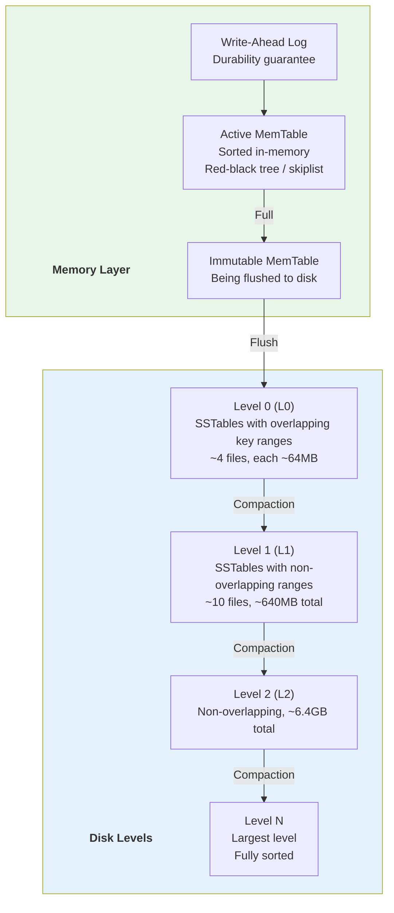
```mermaid
graph TD
    subgraph Memory[" "]
        Memory_title["Memory Layer"]
        style Memory_title fill:none,stroke:none,color:#333,font-weight:bold
        WAL[Write-Ahead Log<br/>Durability guarantee]
        MT[Active MemTable<br/>Sorted in-memory<br/>Red-black tree / skiplist]
        IMT[Immutable MemTable<br/>Being flushed to disk]
    end

    subgraph Disk[" "]
        Disk_title["Disk Levels"]
        style Disk_title fill:none,stroke:none,color:#333,font-weight:bold
        L0["Level 0 (L0)<br/>SSTables with overlapping key ranges<br/>~4 files, each ~64MB"]
        L1["Level 1 (L1)<br/>SSTables with non-overlapping ranges<br/>~10 files, ~640MB total"]
        L2["Level 2 (L2)<br/>Non-overlapping, ~6.4GB total"]
        LN["Level N<br/>Largest level<br/>Fully sorted"]
    end

    WAL --> MT
    MT -->|"Full"| IMT
    IMT -->|"Flush"| L0
    L0 -->|"Compaction"| L1
    L1 -->|"Compaction"| L2
    L2 -->|"Compaction"| LN

    style Memory fill:#e8f5e9
    style Disk fill:#e3f2fd
```

### Write Path

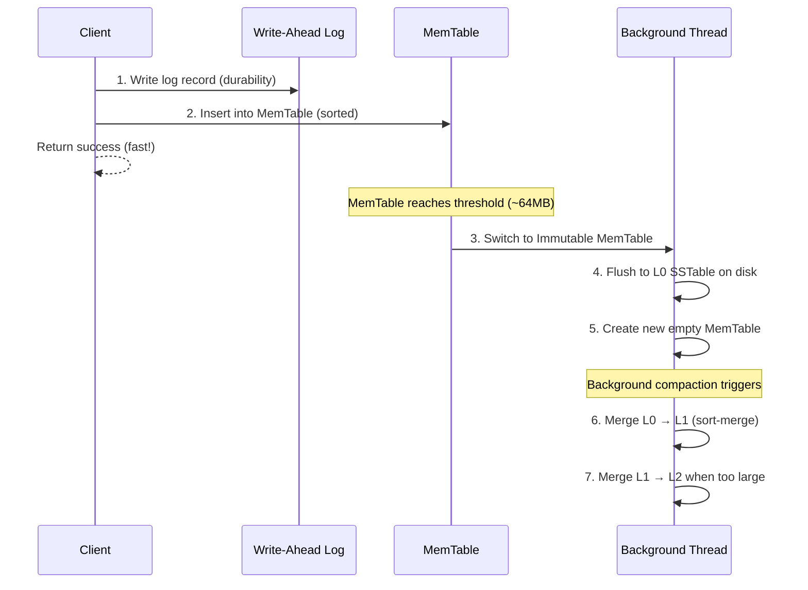
```mermaid
sequenceDiagram
    participant C as Client
    participant WAL as Write-Ahead Log
    participant MT as MemTable
    participant BG as Background Thread

    C->>WAL: 1. Write log record (durability)
    C->>MT: 2. Insert into MemTable (sorted)
    C-->>C: Return success (fast!)

    Note over MT: MemTable reaches threshold (~64MB)

    MT->>BG: 3. Switch to Immutable MemTable
    BG->>BG: 4. Flush to L0 SSTable on disk
    BG->>BG: 5. Create new empty MemTable

    Note over BG: Background compaction triggers
    BG->>BG: 6. Merge L0 → L1 (sort-merge)
    BG->>BG: 7. Merge L1 → L2 when too large
```

### SSTable Structure

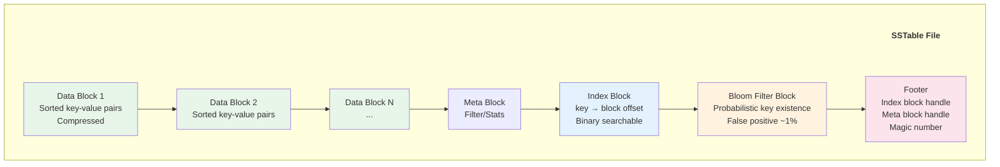
```mermaid
graph TD
    subgraph SSTable[" "]
        SSTable_title["SSTable File"]
        style SSTable_title fill:none,stroke:none,color:#333,font-weight:bold
        DB1[Data Block 1<br/>Sorted key-value pairs<br/>Compressed]
        DB2[Data Block 2<br/>Sorted key-value pairs]
        DBN[Data Block N<br/>...]
        
        MB[Meta Block<br/>Filter/Stats]
        
        IB[Index Block<br/>key → block offset<br/>Binary searchable]
        
        BF[Bloom Filter Block<br/>Probabilistic key existence<br/>False positive ~1%]
        
        Footer[Footer<br/>Index block handle<br/>Meta block handle<br/>Magic number]
    end

    DB1 --> DB2 --> DBN --> MB --> IB --> BF --> Footer

    style DB1 fill:#e8f5e9
    style DB2 fill:#e8f5e9
    style DBN fill:#e8f5e9
    style IB fill:#e3f2fd
    style BF fill:#fff3e0
    style Footer fill:#fce4ec
```

### Read Path

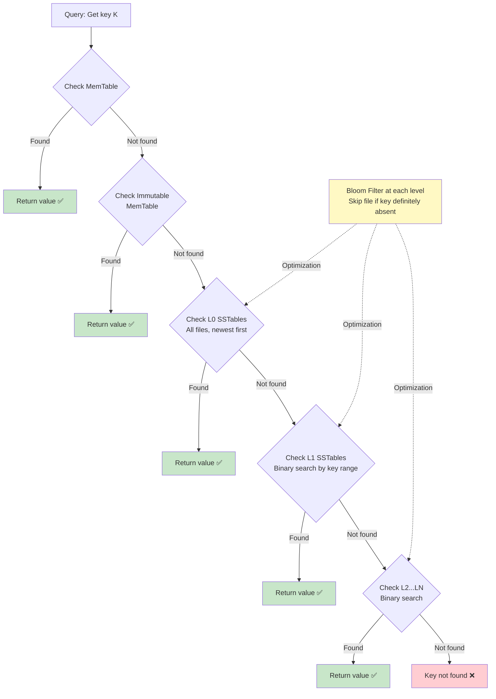
```mermaid
flowchart TD
    Q[Query: Get key K] --> MT{Check MemTable}
    MT -->|Found| R1[Return value ✅]
    MT -->|Not found| IMT{Check Immutable<br/>MemTable}
    IMT -->|Found| R2[Return value ✅]
    IMT -->|Not found| L0{Check L0 SSTables<br/>All files, newest first}
    L0 -->|Found| R3[Return value ✅]
    L0 -->|Not found| L1{Check L1 SSTables<br/>Binary search by key range}
    L1 -->|Found| R4[Return value ✅]
    L1 -->|Not found| L2{Check L2...LN<br/>Binary search}
    L2 -->|Found| R5[Return value ✅]
    L2 -->|Not found| NF[Key not found ❌]

    BF["Bloom Filter at each level<br/>Skip file if key definitely absent"]
    BF -.->|"Optimization"| L0
    BF -.->|"Optimization"| L1
    BF -.->|"Optimization"| L2

    style R1 fill:#c8e6c9
    style R2 fill:#c8e6c9
    style R3 fill:#c8e6c9
    style R4 fill:#c8e6c9
    style R5 fill:#c8e6c9
    style NF fill:#ffcdd2
    style BF fill:#fff9c4
```

### Compaction Strategies

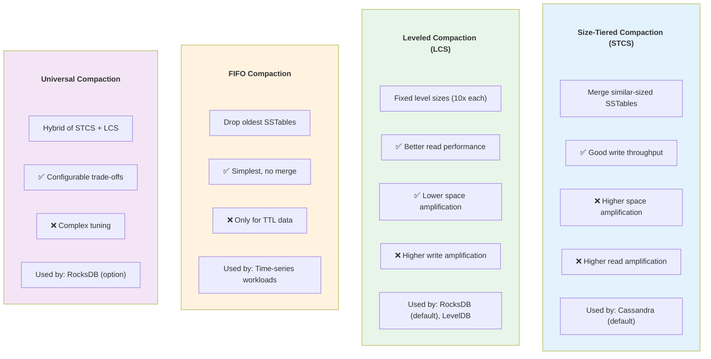
```mermaid
graph TD
    subgraph STCS[" "]
        STCS_title["Size-Tiered Compaction (STCS)"]
        style STCS_title fill:none,stroke:none,color:#333,font-weight:bold
        ST1["Merge similar-sized SSTables"]
        ST2["✅ Good write throughput"]
        ST3["❌ Higher space amplification"]
        ST4["❌ Higher read amplification"]
        ST5["Used by: Cassandra (default)"]
    end

    subgraph LCS[" "]
        LCS_title["Leveled Compaction (LCS)"]
        style LCS_title fill:none,stroke:none,color:#333,font-weight:bold
        LC1["Fixed level sizes (10x each)"]
        LC2["✅ Better read performance"]
        LC3["✅ Lower space amplification"]
        LC4["❌ Higher write amplification"]
        LC5["Used by: RocksDB (default), LevelDB"]
    end

    subgraph FIFO[" "]
        FIFO_title["FIFO Compaction"]
        style FIFO_title fill:none,stroke:none,color:#333,font-weight:bold
        FI1["Drop oldest SSTables"]
        FI2["✅ Simplest, no merge"]
        FI3["❌ Only for TTL data"]
        FI4["Used by: Time-series workloads"]
    end

    subgraph Universal[" "]
        Universal_title["Universal Compaction"]
        style Universal_title fill:none,stroke:none,color:#333,font-weight:bold
        UN1["Hybrid of STCS + LCS"]
        UN2["✅ Configurable trade-offs"]
        UN3["❌ Complex tuning"]
        UN4["Used by: RocksDB (option)"]
    end

    style STCS fill:#e3f2fd
    style LCS fill:#e8f5e9
    style FIFO fill:#fff3e0
    style Universal fill:#f3e5f5
```

### Amplification Factors

| Factor | Definition | LSM-Tree | B-Tree |
|--------|-----------|----------|--------|
| Write Amplification | Bytes written to storage / bytes written by user | 10-30x (compaction) | 2-3x (WAL + page) |
| Read Amplification | I/Os per read | Up to N levels | O(log n) |
| Space Amplification | Storage used / actual data size | 1.1-2x | ~1x |

### Impact on Modern Systems
- **LevelDB** — Google's LSM implementation, basis for many KV stores
- **RocksDB** — Facebook's enhanced LevelDB, used by MyRocks, TiKV, CockroachDB
- **Apache Cassandra** — LSM-based distributed database
- **Apache HBase** — LSM storage on HDFS
- **Apache Kafka** — Log-structured commit log
- **ScyllaDB** — High-performance Cassandra-compatible, LSM-based
- **Apache Paimon** — LSM-based lake format for streaming

---

## 2. B-TREE - 1970/1979

### Paper Info
- **Title:** Organization and Maintenance of Large Ordered Indexes
- **Authors:** Rudolf Bayer, Edward McCreight
- **Journal:** Acta Informatica, 1972
- **Link:** https://infolab.usc.edu/csci585/Spring2010/den_546/Btree.pdf

- **Title:** The Ubiquitous B-Tree
- **Author:** Douglas Comer
- **Journal:** ACM Computing Surveys, 1979
- **Link:** https://dl.acm.org/doi/10.1145/356770.356776

### Key Contributions
- Self-balancing tree optimized for disk storage
- Logarithmic time operations (search, insert, delete)
- Efficient range queries
- Foundation for all relational database indexes
- B+ Tree variant: data only in leaves, internal nodes for routing

### B-Tree Structure

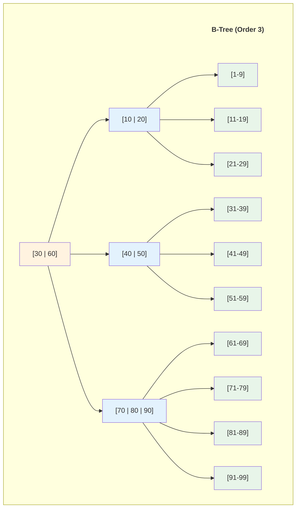
```mermaid
graph TD
    subgraph BTree[" "]
        BTree_title["B-Tree (Order 3)"]
        style BTree_title fill:none,stroke:none,color:#333,font-weight:bold
        Root["[30 | 60]"]
        Root --> N1["[10 | 20]"]
        Root --> N2["[40 | 50]"]
        Root --> N3["[70 | 80 | 90]"]

        N1 --> L1["[1-9]"]
        N1 --> L2["[11-19]"]
        N1 --> L3["[21-29]"]

        N2 --> L4["[31-39]"]
        N2 --> L5["[41-49]"]
        N2 --> L6["[51-59]"]

        N3 --> L7["[61-69]"]
        N3 --> L8["[71-79]"]
        N3 --> L9["[81-89]"]
        N3 --> L10["[91-99]"]
    end

    style Root fill:#fff3e0
    style N1 fill:#e3f2fd
    style N2 fill:#e3f2fd
    style N3 fill:#e3f2fd
    style L1 fill:#e8f5e9
    style L2 fill:#e8f5e9
    style L3 fill:#e8f5e9
    style L4 fill:#e8f5e9
    style L5 fill:#e8f5e9
    style L6 fill:#e8f5e9
    style L7 fill:#e8f5e9
    style L8 fill:#e8f5e9
    style L9 fill:#e8f5e9
    style L10 fill:#e8f5e9
```

### B+ Tree (Most Common Variant)

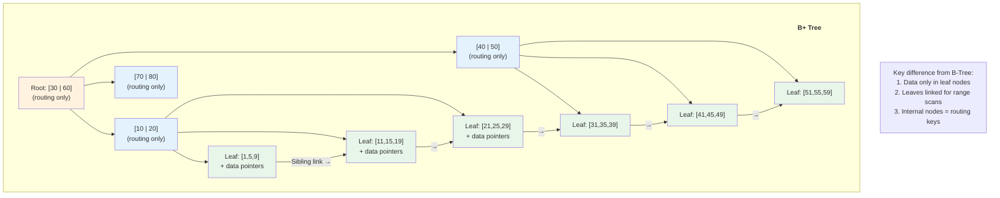
```mermaid
graph TD
    subgraph BPlusTree[" "]
        BPlusTree_title["B+ Tree"]
        style BPlusTree_title fill:none,stroke:none,color:#333,font-weight:bold
        R["Root: [30 | 60]<br/>(routing only)"]
        I1["[10 | 20]<br/>(routing only)"]
        I2["[40 | 50]<br/>(routing only)"]
        I3["[70 | 80]<br/>(routing only)"]

        R --> I1
        R --> I2
        R --> I3

        L1["Leaf: [1,5,9]<br/>+ data pointers"]
        L2["Leaf: [11,15,19]<br/>+ data pointers"]
        L3["Leaf: [21,25,29]<br/>+ data pointers"]
        L4["Leaf: [31,35,39]"]
        L5["Leaf: [41,45,49]"]
        L6["Leaf: [51,55,59]"]

        I1 --> L1
        I1 --> L2
        I1 --> L3
        I2 --> L4
        I2 --> L5
        I2 --> L6

        L1 -->|"Sibling link →"| L2
        L2 -->|"→"| L3
        L3 -->|"→"| L4
        L4 -->|"→"| L5
        L5 -->|"→"| L6
    end

    Note1["Key difference from B-Tree:<br/>1. Data only in leaf nodes<br/>2. Leaves linked for range scans<br/>3. Internal nodes = routing keys"]

    style R fill:#fff3e0
    style I1 fill:#e3f2fd
    style I2 fill:#e3f2fd
    style I3 fill:#e3f2fd
    style L1 fill:#e8f5e9
    style L2 fill:#e8f5e9
    style L3 fill:#e8f5e9
    style L4 fill:#e8f5e9
    style L5 fill:#e8f5e9
    style L6 fill:#e8f5e9
```

### B-Tree Operations

```mermaid
flowchart TD
    subgraph Search[" "]
        Search_title["Search: O(log_B n)"]
        style Search_title fill:none,stroke:none,color:#333,font-weight:bold
        S1[Start at root] --> S2[Binary search within node]
        S2 --> S3{Found key?}
        S3 -->|Yes| S4[Return value]
        S3 -->|No| S5[Follow child pointer]
        S5 --> S2
    end

    subgraph Insert[" "]
        Insert_title["Insert: O(log_B n)"]
        style Insert_title fill:none,stroke:none,color:#333,font-weight:bold
        I1[Find target leaf] --> I2{Leaf has space?}
        I2 -->|Yes| I3[Insert key in sorted order]
        I2 -->|No| I4[Split leaf node]
        I4 --> I5[Push median key to parent]
        I5 --> I6{Parent has space?}
        I6 -->|Yes| I7[Done]
        I6 -->|No| I8[Split parent<br/>Propagate up]
    end

    subgraph Delete[" "]
        Delete_title["Delete: O(log_B n)"]
        style Delete_title fill:none,stroke:none,color:#333,font-weight:bold
        D1[Find key in leaf] --> D2[Remove key]
        D2 --> D3{Node underflow?}
        D3 -->|No| D4[Done]
        D3 -->|Yes| D5{Sibling has extra?}
        D5 -->|Yes| D6[Redistribute]
        D5 -->|No| D7[Merge with sibling]
    end

    style Search fill:#e8f5e9
    style Insert fill:#e3f2fd
    style Delete fill:#fff3e0
```

### B-Tree vs LSM-Tree

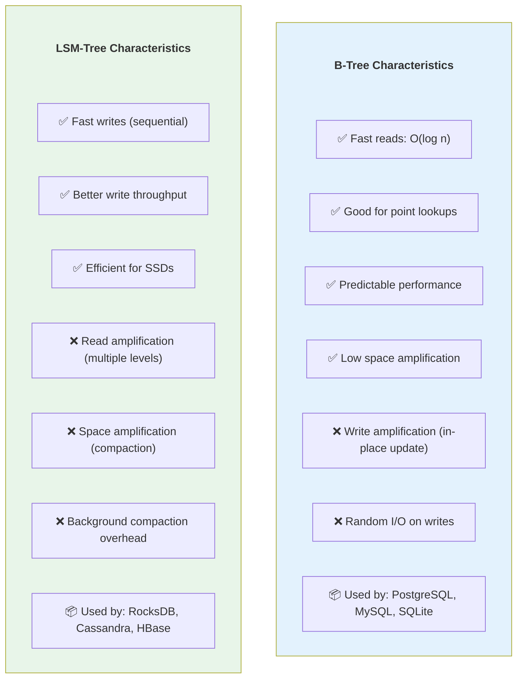
```mermaid
graph TD
    subgraph BTreeChar[" "]
        BTreeChar_title["B-Tree Characteristics"]
        style BTreeChar_title fill:none,stroke:none,color:#333,font-weight:bold
        BT1["✅ Fast reads: O(log n)"]
        BT2["✅ Good for point lookups"]
        BT3["✅ Predictable performance"]
        BT4["✅ Low space amplification"]
        BT5["❌ Write amplification (in-place update)"]
        BT6["❌ Random I/O on writes"]
        BT7["📦 Used by: PostgreSQL, MySQL, SQLite"]
    end

    subgraph LSMChar[" "]
        LSMChar_title["LSM-Tree Characteristics"]
        style LSMChar_title fill:none,stroke:none,color:#333,font-weight:bold
        LSM1["✅ Fast writes (sequential)"]
        LSM2["✅ Better write throughput"]
        LSM3["✅ Efficient for SSDs"]
        LSM4["❌ Read amplification (multiple levels)"]
        LSM5["❌ Space amplification (compaction)"]
        LSM6["❌ Background compaction overhead"]
        LSM7["📦 Used by: RocksDB, Cassandra, HBase"]
    end

    style BTreeChar fill:#e3f2fd
    style LSMChar fill:#e8f5e9
```

| Metric | B-Tree | LSM-Tree |
|--------|--------|----------|
| Write pattern | In-place update | Append-only |
| Read latency | Predictable O(log n) | Variable (level-dependent) |
| Write throughput | Lower (random I/O) | Higher (sequential I/O) |
| Space amplification | ~1x | 1.1-2x |
| Write amplification | 2-3x | 10-30x |
| Read amplification | 1x | N levels |
| Range scans | Excellent (B+ leaf links) | Good (merge sorted runs) |
| Concurrency | Latch per page | Lock-free writes |
| Recovery | WAL + redo | WAL + redo |

### Impact on Modern Systems
- **PostgreSQL** — B-Tree as default index, also supports GiST, GIN, BRIN
- **MySQL InnoDB** — Clustered B+ Tree for primary key
- **SQLite** — B-Tree as sole storage structure
- **All RDBMS** — Standard index type since 1970s

---

## 3. MVCC (Multi-Version Concurrency Control) - 1981

### Paper Info
- **Title:** Naming and Synchronization in a Decentralized Computer System
- **Author:** David P. Reed (PhD Thesis, MIT, 1978)
- **Link:** http://publications.csail.mit.edu/lcs/pubs/pdf/MIT-LCS-TR-205.pdf

- **Book:** Concurrency Control and Recovery in Database Systems
- **Authors:** Philip A. Bernstein, Vassos Hadzilacos, Nathan Goodman (1987)
- **Link:** https://www.microsoft.com/en-us/research/wp-content/uploads/2016/05/ccontrol.pdf

### Key Contributions
- Multiple versions of data for concurrent access without blocking
- Readers never block writers, writers never block readers
- Snapshot isolation — each transaction sees consistent view
- Foundation for all modern database ACID transactions
- Eliminates read-write contention

### MVCC Concept

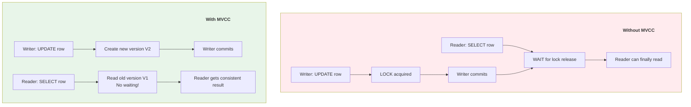
```mermaid
graph TD
    subgraph Without[" "]
        Without_title["Without MVCC"]
        style Without_title fill:none,stroke:none,color:#333,font-weight:bold
        W1[Writer: UPDATE row] --> Lock[LOCK acquired]
        R1[Reader: SELECT row] --> Wait[WAIT for lock release]
        Lock --> Commit1[Writer commits]
        Commit1 --> Wait
        Wait --> Read1[Reader can finally read]
    end

    subgraph With[" "]
        With_title["With MVCC"]
        style With_title fill:none,stroke:none,color:#333,font-weight:bold
        W2[Writer: UPDATE row] --> NewVer[Create new version V2]
        R2[Reader: SELECT row] --> OldVer[Read old version V1<br/>No waiting!]
        NewVer --> Commit2[Writer commits]
        OldVer --> Result[Reader gets consistent result]
    end

    style Without fill:#ffebee
    style With fill:#e8f5e9
```

### Version Chain

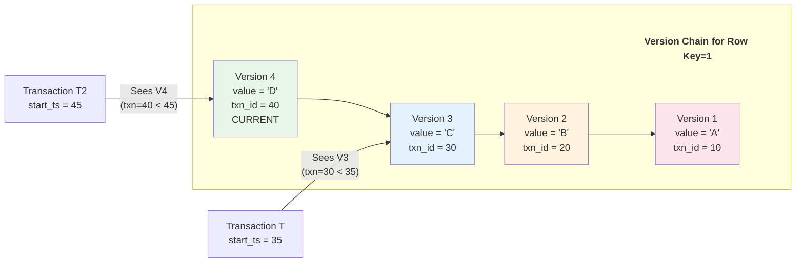
```mermaid
graph LR
    subgraph VersionChain[" "]
        VersionChain_title["Version Chain for Row Key=1"]
        style VersionChain_title fill:none,stroke:none,color:#333,font-weight:bold
        V4["Version 4<br/>value = 'D'<br/>txn_id = 40<br/>CURRENT"]
        V3["Version 3<br/>value = 'C'<br/>txn_id = 30"]
        V2["Version 2<br/>value = 'B'<br/>txn_id = 20"]
        V1["Version 1<br/>value = 'A'<br/>txn_id = 10"]

        V4 --> V3 --> V2 --> V1
    end

    T35["Transaction T<br/>start_ts = 35"]
    T35 -->|"Sees V3<br/>(txn=30 < 35)"| V3

    T45["Transaction T2<br/>start_ts = 45"]
    T45 -->|"Sees V4<br/>(txn=40 < 45)"| V4

    style V4 fill:#e8f5e9
    style V3 fill:#e3f2fd
    style V2 fill:#fff3e0
    style V1 fill:#fce4ec
```

### Visibility Rules

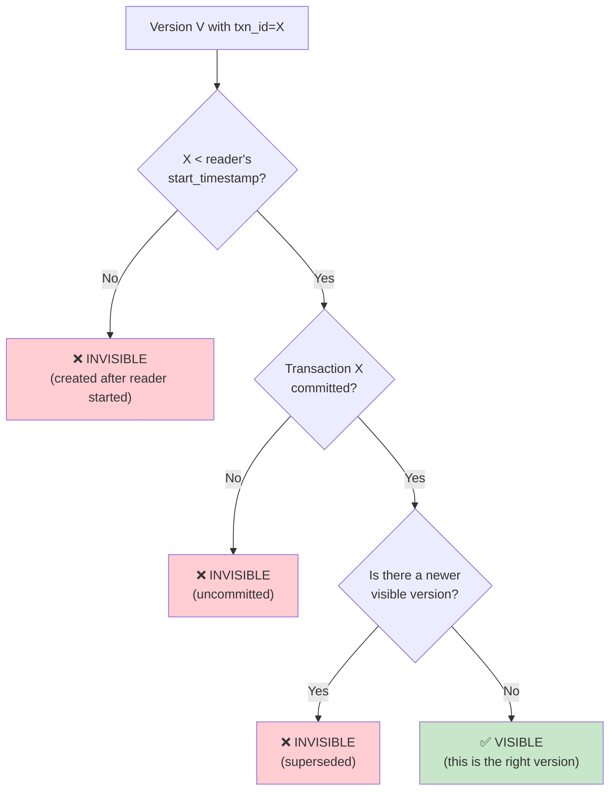
```mermaid
flowchart TD
    Start[Version V with txn_id=X] --> Q1{X < reader's<br/>start_timestamp?}
    Q1 -->|No| Invisible["❌ INVISIBLE<br/>(created after reader started)"]
    Q1 -->|Yes| Q2{Transaction X<br/>committed?}
    Q2 -->|No| Invisible2["❌ INVISIBLE<br/>(uncommitted)"]
    Q2 -->|Yes| Q3{Is there a newer<br/>visible version?}
    Q3 -->|Yes| Invisible3["❌ INVISIBLE<br/>(superseded)"]
    Q3 -->|No| Visible["✅ VISIBLE<br/>(this is the right version)"]

    style Visible fill:#c8e6c9
    style Invisible fill:#ffcdd2
    style Invisible2 fill:#ffcdd2
    style Invisible3 fill:#ffcdd2
```

### Snapshot Isolation

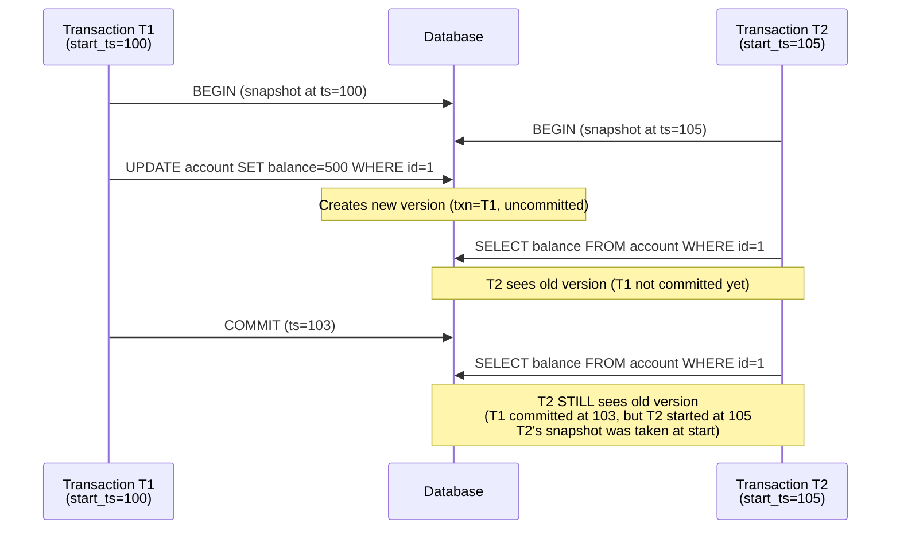
```mermaid
sequenceDiagram
    participant T1 as Transaction T1<br/>(start_ts=100)
    participant DB as Database
    participant T2 as Transaction T2<br/>(start_ts=105)

    T1->>DB: BEGIN (snapshot at ts=100)
    T2->>DB: BEGIN (snapshot at ts=105)

    T1->>DB: UPDATE account SET balance=500 WHERE id=1
    Note over DB: Creates new version (txn=T1, uncommitted)

    T2->>DB: SELECT balance FROM account WHERE id=1
    Note over T2,DB: T2 sees old version (T1 not committed yet)

    T1->>DB: COMMIT (ts=103)

    T2->>DB: SELECT balance FROM account WHERE id=1
    Note over T2,DB: T2 STILL sees old version<br/>(T1 committed at 103, but T2 started at 105<br/>T2's snapshot was taken at start)
```

### PostgreSQL MVCC Implementation

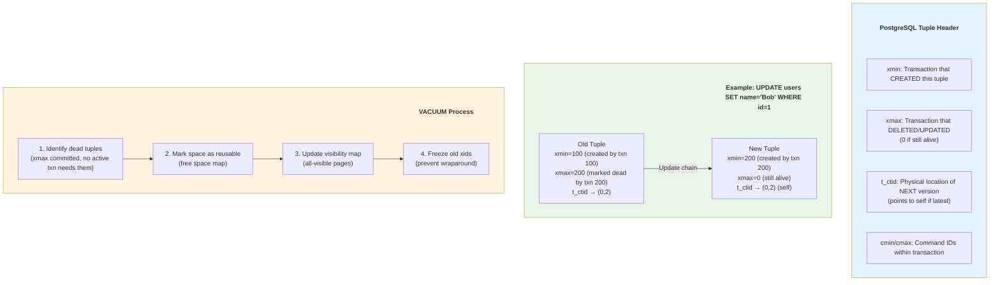
```mermaid
graph TD
    subgraph TupleHeader[" "]
        TupleHeader_title["PostgreSQL Tuple Header"]
        style TupleHeader_title fill:none,stroke:none,color:#333,font-weight:bold
        XMIN["xmin: Transaction that CREATED this tuple"]
        XMAX["xmax: Transaction that DELETED/UPDATED<br/>(0 if still alive)"]
        CTID["t_ctid: Physical location of NEXT version<br/>(points to self if latest)"]
        CMIN["cmin/cmax: Command IDs within transaction"]
    end

    subgraph Example[" "]
        Example_title["Example: UPDATE users SET name='Bob' WHERE id=1"]
        style Example_title fill:none,stroke:none,color:#333,font-weight:bold
        OldTuple["Old Tuple<br/>xmin=100 (created by txn 100)<br/>xmax=200 (marked dead by txn 200)<br/>t_ctid → (0,2)"]
        NewTuple["New Tuple<br/>xmin=200 (created by txn 200)<br/>xmax=0 (still alive)<br/>t_ctid → (0,2) (self)"]
        OldTuple -->|"Update chain"| NewTuple
    end

    subgraph Vacuum[" "]
        Vacuum_title["VACUUM Process"]
        style Vacuum_title fill:none,stroke:none,color:#333,font-weight:bold
        V1["1. Identify dead tuples<br/>(xmax committed, no active txn needs them)"]
        V2["2. Mark space as reusable<br/>(free space map)"]
        V3["3. Update visibility map<br/>(all-visible pages)"]
        V4["4. Freeze old xids<br/>(prevent wraparound)"]
        V1 --> V2 --> V3 --> V4
    end

    style TupleHeader fill:#e3f2fd
    style Example fill:#e8f5e9
    style Vacuum fill:#fff3e0
```

### MVCC in Different Databases

| Database | MVCC Approach | Old Versions Storage | Cleanup |
|----------|--------------|---------------------|---------|
| PostgreSQL | In-place (heap) | Same table (dead tuples) | VACUUM |
| MySQL InnoDB | Undo logs | Separate undo tablespace | Purge thread |
| Oracle | Undo segments | Separate undo tablespace | Automatic |
| SQL Server | tempdb | tempdb version store | Automatic |
| CockroachDB | Intent keys | MVCC keys in RocksDB | GC |
| Iceberg/Delta | Snapshots | Separate data files | Expire/VACUUM |

### Impact on Modern Systems
- **PostgreSQL** — Extensive MVCC with VACUUM
- **MySQL InnoDB** — MVCC with undo log rollback segments
- **Oracle** — Rollback segments for MVCC
- **Iceberg, Delta Lake, Hudi** — Table-level MVCC (snapshot isolation)
- **CockroachDB, TiDB** — Distributed MVCC
- **Spanner** — TrueTime-based MVCC

---

## 4. ARIES (Recovery Algorithm) - 1992

### Paper Info
- **Title:** ARIES: A Transaction Recovery Method Supporting Fine-Granularity Locking and Partial Rollbacks Using Write-Ahead Logging
- **Authors:** C. Mohan, Don Haderle, Bruce Lindsay, et al. (IBM Research)
- **Journal:** ACM Transactions on Database Systems, 1992
- **Link:** https://cs.stanford.edu/people/chr101/aries.pdf

### Key Contributions
- Write-Ahead Logging (WAL) — foundation of crash recovery
- Steal/No-Force buffer management for performance
- Three-phase recovery: Analysis → Redo → Undo
- Compensation Log Records (CLR) for idempotent recovery
- Industry standard for database recovery for 30+ years

### Write-Ahead Logging (WAL)

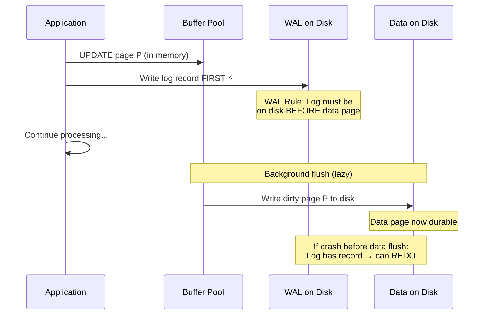
```mermaid
sequenceDiagram
    participant App as Application
    participant BP as Buffer Pool
    participant Log as WAL on Disk
    participant Disk as Data on Disk

    App->>BP: UPDATE page P (in memory)
    App->>Log: Write log record FIRST ⚡
    Note over Log: WAL Rule: Log must be<br/>on disk BEFORE data page

    App->>App: Continue processing...

    Note over BP,Disk: Background flush (lazy)
    BP->>Disk: Write dirty page P to disk
    Note over Disk: Data page now durable

    Note over Log,Disk: If crash before data flush:<br/>Log has record → can REDO
```

### WAL Record Structure

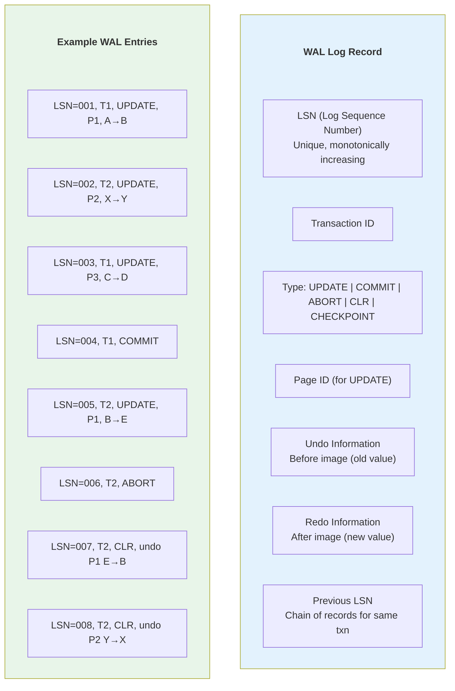
```mermaid
graph TD
    subgraph WALRecord[" "]
        WALRecord_title["WAL Log Record"]
        style WALRecord_title fill:none,stroke:none,color:#333,font-weight:bold
        LSN["LSN (Log Sequence Number)<br/>Unique, monotonically increasing"]
        TxnID["Transaction ID"]
        Type["Type: UPDATE | COMMIT | ABORT | CLR | CHECKPOINT"]
        PageID["Page ID (for UPDATE)"]
        UndoInfo["Undo Information<br/>Before image (old value)"]
        RedoInfo["Redo Information<br/>After image (new value)"]
        PrevLSN["Previous LSN<br/>Chain of records for same txn"]
    end

    subgraph Example[" "]
        Example_title["Example WAL Entries"]
        style Example_title fill:none,stroke:none,color:#333,font-weight:bold
        E1["LSN=001, T1, UPDATE, P1, A→B"]
        E2["LSN=002, T2, UPDATE, P2, X→Y"]
        E3["LSN=003, T1, UPDATE, P3, C→D"]
        E4["LSN=004, T1, COMMIT"]
        E5["LSN=005, T2, UPDATE, P1, B→E"]
        E6["LSN=006, T2, ABORT"]
        E7["LSN=007, T2, CLR, undo P1 E→B"]
        E8["LSN=008, T2, CLR, undo P2 Y→X"]
    end

    style WALRecord fill:#e3f2fd
    style Example fill:#e8f5e9
```

### Buffer Management Policies

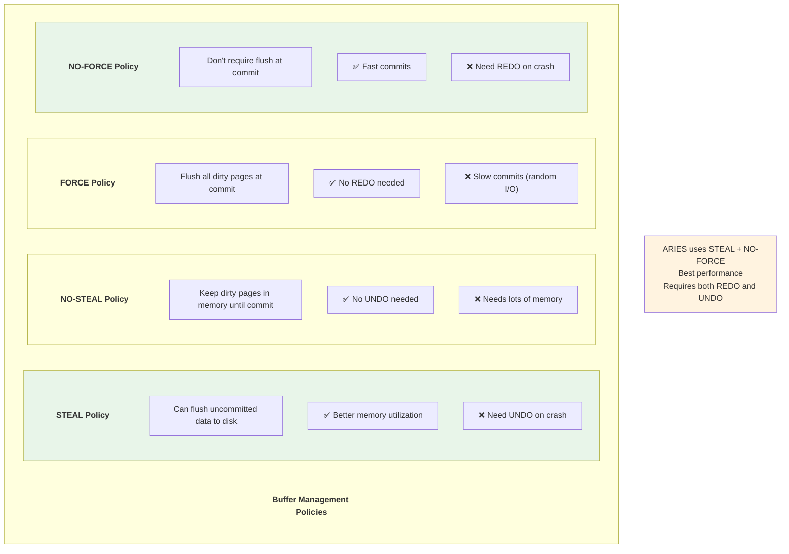
```mermaid
graph TD
    subgraph Policies[" "]
        Policies_title["Buffer Management Policies"]
        style Policies_title fill:none,stroke:none,color:#333,font-weight:bold
        subgraph Steal[" "]
            Steal_title["STEAL Policy"]
            style Steal_title fill:none,stroke:none,color:#333,font-weight:bold
            S1["Can flush uncommitted data to disk"]
            S2["✅ Better memory utilization"]
            S3["❌ Need UNDO on crash"]
        end

        subgraph NoSteal[" "]
            NoSteal_title["NO-STEAL Policy"]
            style NoSteal_title fill:none,stroke:none,color:#333,font-weight:bold
            NS1["Keep dirty pages in memory until commit"]
            NS2["✅ No UNDO needed"]
            NS3["❌ Needs lots of memory"]
        end

        subgraph Force[" "]
            Force_title["FORCE Policy"]
            style Force_title fill:none,stroke:none,color:#333,font-weight:bold
            F1["Flush all dirty pages at commit"]
            F2["✅ No REDO needed"]
            F3["❌ Slow commits (random I/O)"]
        end

        subgraph NoForce[" "]
            NoForce_title["NO-FORCE Policy"]
            style NoForce_title fill:none,stroke:none,color:#333,font-weight:bold
            NF1["Don't require flush at commit"]
            NF2["✅ Fast commits"]
            NF3["❌ Need REDO on crash"]
        end
    end

    ARIES["ARIES uses STEAL + NO-FORCE<br/>Best performance<br/>Requires both REDO and UNDO"]

    style Steal fill:#e8f5e9
    style NoForce fill:#e8f5e9
    style ARIES fill:#fff3e0
```

### Three-Phase Recovery

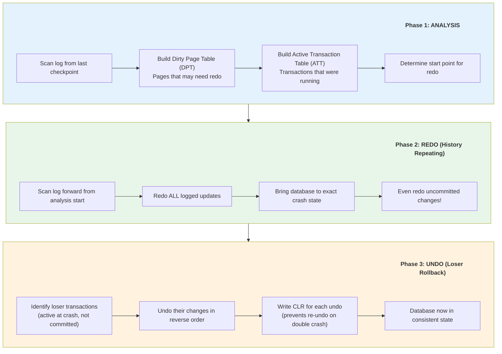
```mermaid
graph TD
    subgraph Phase1[" "]
        Phase1_title["Phase 1: ANALYSIS"]
        style Phase1_title fill:none,stroke:none,color:#333,font-weight:bold
        A1["Scan log from last checkpoint"]
        A2["Build Dirty Page Table (DPT)<br/>Pages that may need redo"]
        A3["Build Active Transaction Table (ATT)<br/>Transactions that were running"]
        A4["Determine start point for redo"]
        A1 --> A2 --> A3 --> A4
    end

    subgraph Phase2[" "]
        Phase2_title["Phase 2: REDO (History Repeating)"]
        style Phase2_title fill:none,stroke:none,color:#333,font-weight:bold
        R1["Scan log forward from analysis start"]
        R2["Redo ALL logged updates"]
        R3["Bring database to exact crash state"]
        R4["Even redo uncommitted changes!"]
        R1 --> R2 --> R3 --> R4
    end

    subgraph Phase3[" "]
        Phase3_title["Phase 3: UNDO (Loser Rollback)"]
        style Phase3_title fill:none,stroke:none,color:#333,font-weight:bold
        U1["Identify loser transactions<br/>(active at crash, not committed)"]
        U2["Undo their changes in reverse order"]
        U3["Write CLR for each undo<br/>(prevents re-undo on double crash)"]
        U4["Database now in consistent state"]
        U1 --> U2 --> U3 --> U4
    end

    Phase1 --> Phase2 --> Phase3

    style Phase1 fill:#e3f2fd
    style Phase2 fill:#e8f5e9
    style Phase3 fill:#fff3e0
```

### Checkpointing

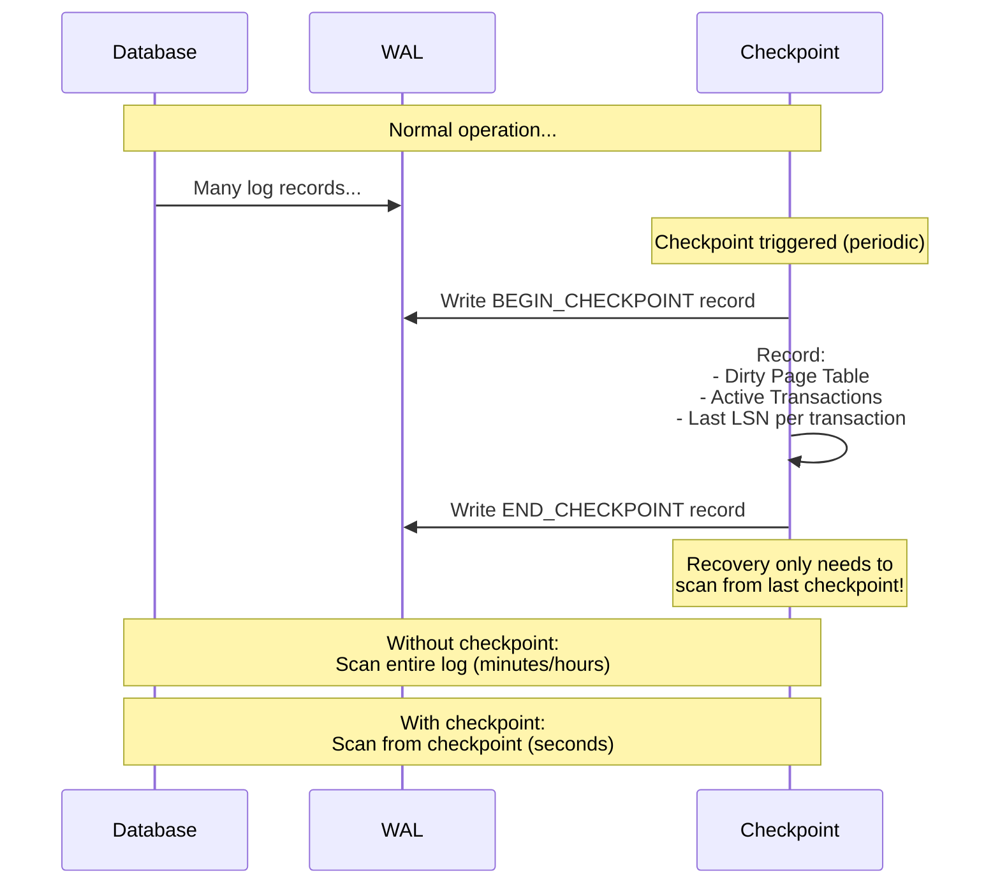
```mermaid
sequenceDiagram
    participant DB as Database
    participant Log as WAL
    participant CP as Checkpoint

    Note over DB,CP: Normal operation...
    DB->>Log: Many log records...

    Note over CP: Checkpoint triggered (periodic)
    CP->>Log: Write BEGIN_CHECKPOINT record
    CP->>CP: Record:<br/>- Dirty Page Table<br/>- Active Transactions<br/>- Last LSN per transaction
    CP->>Log: Write END_CHECKPOINT record

    Note over CP: Recovery only needs to<br/>scan from last checkpoint!

    Note over DB,CP: Without checkpoint:<br/>Scan entire log (minutes/hours)
    Note over DB,CP: With checkpoint:<br/>Scan from checkpoint (seconds)
```

### Impact on Modern Systems
- **PostgreSQL** — WAL-based recovery, pg_wal directory
- **MySQL InnoDB** — Redo log + undo log (ARIES-inspired)
- **Oracle** — Redo logs + flashback (ARIES-based)
- **SQLite** — WAL mode for concurrent readers
- **SQL Server** — Transaction log recovery
- **All modern RDBMS** — ARIES principles are universal

---

## 5. TWO-PHASE LOCKING (2PL) - 1976

### Paper Info
- **Title:** The Notions of Consistency and Predicate Locks in a Database System
- **Authors:** K. P. Eswaran, J. N. Gray, R. A. Lorie, I. L. Traiger (IBM)
- **Journal:** Communications of the ACM, 1976
- **Link:** https://dl.acm.org/doi/10.1145/360363.360369

### Key Contributions
- Proved that 2PL guarantees serializability
- Two-phase protocol: growing phase → shrinking phase
- Lock compatibility matrix (shared vs exclusive)
- Foundation for all database isolation levels
- Deadlock detection via wait-for graph

### Two-Phase Locking Protocol

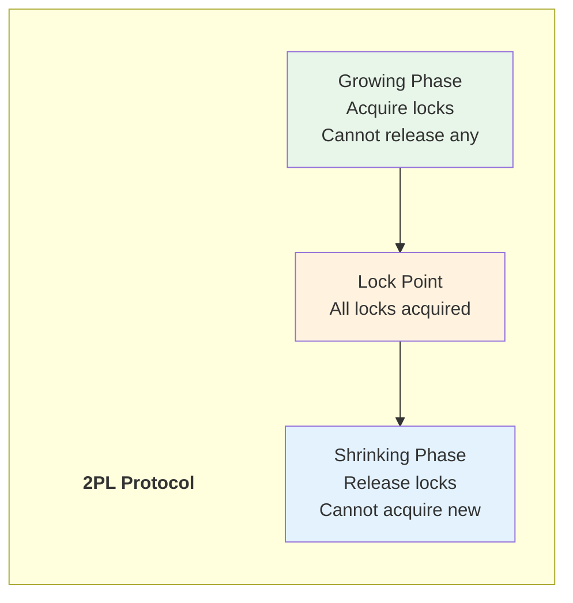
```mermaid
graph LR
    subgraph Protocol[" "]
        Protocol_title["2PL Protocol"]
        style Protocol_title fill:none,stroke:none,color:#333,font-weight:bold
        Growing["Growing Phase<br/>Acquire locks<br/>Cannot release any"]
        LockPoint["Lock Point<br/>All locks acquired"]
        Shrinking["Shrinking Phase<br/>Release locks<br/>Cannot acquire new"]

        Growing --> LockPoint --> Shrinking
    end

    style Growing fill:#e8f5e9
    style LockPoint fill:#fff3e0
    style Shrinking fill:#e3f2fd
```

```mermaid
xychart-beta
    title "2PL Lock Lifecycle"
    x-axis ["T1", "T2", "T3", "T4", "Lock Point", "T5", "T6", "T7", "T8"]
    y-axis "Locks Held" 0 --> 5
    line [1, 2, 3, 4, 4, 3, 2, 1, 0]
```

### Lock Types & Compatibility

```mermaid
graph TD
    subgraph LockTypes[" "]
        LockTypes_title["Lock Types"]
        style LockTypes_title fill:none,stroke:none,color:#333,font-weight:bold
        S["Shared Lock (S)<br/>Read access<br/>Multiple holders OK"]
        X["Exclusive Lock (X)<br/>Write access<br/>Single holder only"]
        IS["Intent Shared (IS)<br/>Plan to lock child S"]
        IX["Intent Exclusive (IX)<br/>Plan to lock child X"]
    end

    style S fill:#e8f5e9
    style X fill:#ffebee
    style IS fill:#e3f2fd
    style IX fill:#fff3e0
```

| Requested → | S | X | IS | IX |
|-------------|---|---|----|----|
| **S** held | ✅ OK | ❌ Wait | ✅ OK | ❌ Wait |
| **X** held | ❌ Wait | ❌ Wait | ❌ Wait | ❌ Wait |
| **IS** held | ✅ OK | ❌ Wait | ✅ OK | ✅ OK |
| **IX** held | ❌ Wait | ❌ Wait | ✅ OK | ✅ OK |

### Deadlock Detection

```mermaid
graph TD
    subgraph Deadlock[" "]
        Deadlock_title["Deadlock Example"]
        style Deadlock_title fill:none,stroke:none,color:#333,font-weight:bold
        T1["T1: holds Lock(A)<br/>wants Lock(B)"]
        T2["T2: holds Lock(B)<br/>wants Lock(A)"]
        T1 -->|"waits for"| T2
        T2 -->|"waits for"| T1
    end

    subgraph WFG[" "]
        WFG_title["Wait-For Graph"]
        style WFG_title fill:none,stroke:none,color:#333,font-weight:bold
        W1["T1"] -->|"waits"| W2["T2"]
        W2 -->|"waits"| W1
        Cycle["CYCLE DETECTED!<br/>→ Abort one transaction"]
    end

    subgraph Resolution[" "]
        Resolution_title["Resolution Strategies"]
        style Resolution_title fill:none,stroke:none,color:#333,font-weight:bold
        Det["Detection: Wait-for graph<br/>Find cycles periodically"]
        Prev["Prevention: Lock ordering<br/>Always acquire in same order"]
        TO["Timeout: Abort after N seconds"]
        WW["Wound-Wait / Wait-Die<br/>Priority-based strategies"]
    end

    style Deadlock fill:#ffebee
    style WFG fill:#fff3e0
    style Resolution fill:#e8f5e9
```

### 2PL Variants

| Variant | Description | Advantage |
|---------|-------------|-----------|
| Basic 2PL | Release locks anytime in shrinking phase | Highest concurrency |
| Strict 2PL | Hold all X locks until commit | Prevents dirty reads |
| Rigorous 2PL | Hold ALL locks until commit | Prevents cascading aborts |
| Conservative 2PL | Acquire all locks before starting | No deadlocks (but lower concurrency) |

### Impact on Modern Systems
- **All RDBMS** — 2PL-based locking mechanisms
- **PostgreSQL** — Row-level locking with 2PL
- **MySQL InnoDB** — Strict 2PL + MVCC hybrid
- **Oracle** — Mostly MVCC, locks for writes
- **Distributed databases** — 2PC + 2PL for distributed transactions

---

## 6. SSI (Serializable Snapshot Isolation) - 2008

### Paper Info
- **Title:** Serializable Isolation for Snapshot Databases
- **Authors:** Michael J. Cahill, Uwe Röhm, Alan D. Fekete
- **Conference:** SIGMOD 2008
- **Link:** https://dl.acm.org/doi/10.1145/1376616.1376690
- **PDF:** https://courses.cs.washington.edu/courses/cse544/08au/papers/ssi.pdf

### Key Contributions
- True serializability without 2PL locking overhead
- Optimistic approach: detect anomalies, not prevent them
- Detects write skew (the main SI anomaly)
- PostgreSQL SERIALIZABLE isolation level (since 9.1)
- CockroachDB serializable isolation

### Write Skew Anomaly

```mermaid
sequenceDiagram
    participant T1 as Transaction T1
    participant DB as Database
    participant T2 as Transaction T2

    Note over DB: Constraint: At least 1 doctor on call
    Note over DB: Alice=on_call, Bob=on_call

    T1->>DB: SELECT * WHERE on_call=true
    Note over T1: Sees: Alice ✓, Bob ✓ (2 on call, safe to remove 1)

    T2->>DB: SELECT * WHERE on_call=true
    Note over T2: Sees: Alice ✓, Bob ✓ (2 on call, safe to remove 1)

    T1->>DB: UPDATE SET on_call=false WHERE doctor='Alice'
    T2->>DB: UPDATE SET on_call=false WHERE doctor='Bob'

    T1->>DB: COMMIT ✅
    T2->>DB: COMMIT ✅

    Note over DB: ❌ VIOLATION: No doctors on call!
    Note over DB: Each saw 2 on call, each removed 1
    Note over DB: But together they removed both!
```

### SSI Detection Mechanism

```mermaid
graph TD
    subgraph Detection[" "]
        Detection_title["SSI Anomaly Detection"]
        style Detection_title fill:none,stroke:none,color:#333,font-weight:bold
        RW1["rw-dependency:<br/>T1 reads X, T2 writes X<br/>(T2 overwrote what T1 read)"]
        RW2["rw-dependency:<br/>T2 reads Y, T1 writes Y<br/>(T1 overwrote what T2 read)"]

        Dangerous["Dangerous Structure:<br/>Two consecutive rw-dependencies<br/>T1 →rw→ T2 →rw→ T1<br/>= Potential cycle!"]

        RW1 --> Dangerous
        RW2 --> Dangerous
        Dangerous --> Abort["ABORT one transaction<br/>(typically the committing one)"]
    end

    subgraph SIREAD[" "]
        SIREAD_title["SIREAD Locks"]
        style SIREAD_title fill:none,stroke:none,color:#333,font-weight:bold
        SL1["Track what each txn READ<br/>(predicate-level)"]
        SL2["When txn WRITES:<br/>check if conflicts with SIREAD"]
        SL3["Non-blocking: only for detection<br/>Never causes waiting"]
    end

    style Detection fill:#ffebee
    style SIREAD fill:#e8f5e9
```

### SSI vs 2PL vs SI

| Aspect | 2PL (S2PL) | Snapshot Isolation | SSI |
|--------|-----------|-------------------|-----|
| Serializability | ✅ Yes | ❌ No (write skew) | ✅ Yes |
| Read blocking | ❌ Readers wait for writers | ✅ No blocking | ✅ No blocking |
| Performance | Lower (lock contention) | High | High (slight overhead) |
| Deadlocks | Possible | None | None |
| False aborts | None | N/A | Possible (conservative) |
| Implementation | Lock manager | MVCC | MVCC + SIREAD |
| Used by | MySQL (default) | PostgreSQL (RC/RR) | PostgreSQL (SERIALIZABLE) |

### Impact on Modern Systems
- **PostgreSQL 9.1+** — SERIALIZABLE isolation level
- **CockroachDB** — Default serializable isolation
- **YugabyteDB** — SSI-based serializable
- **Foundation** — Proving SI + detection = serializability

---

## 7. COLUMN STORES INTERNALS - 2012

### Paper Info
- **Title:** The Design and Implementation of Modern Column-Oriented Database Systems
- **Authors:** Daniel Abadi, Peter Boncz, Stavros Harizopoulos, et al.
- **Journal:** Foundations and Trends in Databases, 2012
- **Link:** https://stratos.seas.harvard.edu/files/stratos/files/columnstoresfntdbs.pdf

### Key Contributions
- Comprehensive survey of column store techniques
- Compression techniques exploiting column homogeneity
- Vectorized vs compiled execution models
- Late materialization strategy
- Foundation for modern OLAP databases

### Row Store vs Column Store

```mermaid
graph TD
    subgraph RowStore[" "]
        RowStore_title["Row Store (PostgreSQL, MySQL)"]
        style RowStore_title fill:none,stroke:none,color:#333,font-weight:bold
        RS["Row 1: [id=1, name='Alice', age=30, city='NYC']<br/>Row 2: [id=2, name='Bob', age=25, city='LA']<br/>Row 3: [id=3, name='Carol', age=35, city='CHI']"]
        RSNote["✅ Fast for: SELECT * FROM users WHERE id=1<br/>❌ Slow for: SELECT AVG(age) FROM users"]
    end

    subgraph ColStore[" "]
        ColStore_title["Column Store (DuckDB, ClickHouse)"]
        style ColStore_title fill:none,stroke:none,color:#333,font-weight:bold
        C1["id column: [1, 2, 3]"]
        C2["name column: ['Alice', 'Bob', 'Carol']"]
        C3["age column: [30, 25, 35]"]
        C4["city column: ['NYC', 'LA', 'CHI']"]
        CSNote["✅ Fast for: SELECT AVG(age) FROM users<br/>(reads only age column)<br/>❌ Slower for: SELECT * WHERE id=1"]
    end

    style RowStore fill:#e3f2fd
    style ColStore fill:#e8f5e9
```

### Compression Techniques

```mermaid
graph TD
    subgraph RLE[" "]
        RLE_title["Run-Length Encoding"]
        style RLE_title fill:none,stroke:none,color:#333,font-weight:bold
        RLEIn["Input: [A,A,A,A,B,B,C,C,C]"]
        RLEOut["Output: [(A,4),(B,2),(C,3)]"]
        RLENote["Best for: sorted, low cardinality"]
    end

    subgraph Dict[" "]
        Dict_title["Dictionary Encoding"]
        style Dict_title fill:none,stroke:none,color:#333,font-weight:bold
        DictD["Dict: {0:'USA', 1:'UK', 2:'DE'}"]
        DictIn["Input: ['USA','UK','USA','DE']"]
        DictOut["Output: [0, 1, 0, 2]"]
        DictNote["Best for: low cardinality strings"]
    end

    subgraph BitPack[" "]
        BitPack_title["Bit-Packing"]
        style BitPack_title fill:none,stroke:none,color:#333,font-weight:bold
        BPIn["Values: [1,2,3,4] (need 3 bits each)"]
        BPOut["Pack: 4 values in 12 bits<br/>Instead of 4 × 32 bits"]
        BPNote["Best for: small integers"]
    end

    subgraph Delta[" "]
        Delta_title["Delta Encoding"]
        style Delta_title fill:none,stroke:none,color:#333,font-weight:bold
        DeltaIn["Input: [100, 102, 105, 107, 112]"]
        DeltaOut["Output: [100, +2, +3, +2, +5]"]
        DeltaNote["Best for: sorted, timestamps"]
    end

    style RLE fill:#e8f5e9
    style Dict fill:#e3f2fd
    style BitPack fill:#fff3e0
    style Delta fill:#f3e5f5
```

### Late Materialization

```mermaid
graph TD
    subgraph Early[" "]
        Early_title["Early Materialization"]
        style Early_title fill:none,stroke:none,color:#333,font-weight:bold
        E1["1. Fetch ALL columns for matching rows"]
        E2["2. Build complete tuples"]
        E3["3. Filter/process tuples"]
        E4["❌ Reads unnecessary columns"]
        E1 --> E2 --> E3
    end

    subgraph Late[" "]
        Late_title["Late Materialization"]
        style Late_title fill:none,stroke:none,color:#333,font-weight:bold
        L1["1. Process filter column only (age)"]
        L2["2. Get position list [1, 3, 7]"]
        L3["3. Fetch output column (name)<br/>at positions [1, 3, 7] only"]
        L4["✅ Minimal data read"]
        L1 --> L2 --> L3
    end

    Q["Query: SELECT name FROM users WHERE age > 30"]
    Q --> Early
    Q --> Late

    style Early fill:#ffebee
    style Late fill:#e8f5e9
```

### Vectorized Execution

```mermaid
graph TD
    subgraph TupleAtATime[" "]
        TupleAtATime_title["Tuple-at-a-Time (Volcano Model)"]
        style TupleAtATime_title fill:none,stroke:none,color:#333,font-weight:bold
        TAT1["for each row:"]
        TAT2["  if row.age > 30:"]
        TAT3["    output row.name"]
        TAT4["❌ Function call per row<br/>❌ Branch mispredictions<br/>❌ Poor CPU cache usage"]
    end

    subgraph Vectorized[" "]
        Vectorized_title["Vectorized Execution"]
        style Vectorized_title fill:none,stroke:none,color:#333,font-weight:bold
        VE1["age_vec = load('age', 1024)  // batch"]
        VE2["mask = age_vec > 30  // SIMD!"]
        VE3["positions = mask.to_positions()"]
        VE4["name_vec = load('name', positions)"]
        VE5["✅ SIMD instructions<br/>✅ Better cache locality<br/>✅ Fewer function calls"]
    end

    subgraph Compiled[" "]
        Compiled_title["Compiled Execution"]
        style Compiled_title fill:none,stroke:none,color:#333,font-weight:bold
        CE1["Generate machine code for query"]
        CE2["JIT compile with LLVM"]
        CE3["Execute native code"]
        CE4["✅ No interpretation overhead<br/>✅ Optimal register usage<br/>❌ Compilation latency"]
    end

    style TupleAtATime fill:#ffebee
    style Vectorized fill:#e8f5e9
    style Compiled fill:#e3f2fd
```

### Impact on Modern Systems
- **DuckDB** — Vectorized columnar, in-process OLAP
- **ClickHouse** — Vectorized columnar, distributed
- **Apache Arrow** — Columnar in-memory format
- **Parquet, ORC** — Columnar file formats
- **Snowflake, BigQuery, Redshift** — Cloud columnar warehouses
- **Databricks Photon** — Vectorized C++ engine

---

## 8. LOG-STRUCTURED FILE SYSTEMS - 1992

### Paper Info
- **Title:** The Design and Implementation of a Log-Structured File System
- **Authors:** Mendel Rosenblum, John K. Ousterhout (Berkeley)
- **Conference:** SOSP 1991, ACM TOCS 1992
- **Link:** https://people.eecs.berkeley.edu/~brewer/cs262/LFS.pdf

### Key Contributions
- Sequential writes for maximum disk throughput
- Log as primary storage structure
- Segment-based garbage collection
- Foundation for LSM-trees and append-only systems
- Key insight: use write buffer to convert random I/O to sequential

### LFS vs Traditional FS

```mermaid
graph TD
    subgraph Traditional[" "]
        Traditional_title["Traditional File System"]
        style Traditional_title fill:none,stroke:none,color:#333,font-weight:bold
        TW1["Write inode → Seek to inode block"]
        TW2["Write data → Seek to data block"]
        TW3["Update bitmap → Seek to bitmap"]
        TW4["❌ Multiple random seeks per write"]
        TW1 --> TW2 --> TW3
    end

    subgraph LogStructured[" "]
        LogStructured_title["Log-Structured FS"]
        style LogStructured_title fill:none,stroke:none,color:#333,font-weight:bold
        LW1["Buffer writes in memory"]
        LW2["Write entire buffer sequentially"]
        LW3["Single I/O for multiple updates"]
        LW4["✅ Maximum sequential throughput"]
        LW1 --> LW2 --> LW3
    end

    style Traditional fill:#ffebee
    style LogStructured fill:#e8f5e9
```

### Segment Structure

```mermaid
graph LR
    subgraph Segment[" "]
        Segment_title["Log Segment (e.g., 512KB)"]
        style Segment_title fill:none,stroke:none,color:#333,font-weight:bold
        SH["Segment<br/>Header"]
        B1["Data Block<br/>(file A)"]
        I1["Inode<br/>(file A)"]
        B2["Data Block<br/>(file B)"]
        I2["Inode<br/>(file B)"]
        SS["Segment<br/>Summary"]
    end

    SH --> B1 --> I1 --> B2 --> I2 --> SS

    Note1["All written sequentially<br/>in one disk I/O"]

    style Segment fill:#e3f2fd
```

### Garbage Collection

```mermaid
graph TD
    subgraph GC[" "]
        GC_title["Segment Cleaning"]
        style GC_title fill:none,stroke:none,color:#333,font-weight:bold
        S1["Segment: [Live][Dead][Live][Dead][Dead][Live]"]
        S1 --> Read["1. Read segment"]
        Read --> Copy["2. Copy live blocks to new segment"]
        Copy --> Free["3. Free old segment"]
        Free --> New["New segment: [Live][Live][Live]"]
    end

    subgraph Challenge[" "]
        Challenge_title["GC Challenges"]
        style Challenge_title fill:none,stroke:none,color:#333,font-weight:bold
        C1["When to clean?<br/>→ Clean when free segments low"]
        C2["Which segments to clean?<br/>→ Cost-benefit: oldest + most dead"]
        C3["How to identify live blocks?<br/>→ Segment summary block"]
    end

    style GC fill:#e8f5e9
    style Challenge fill:#fff3e0
```

### Impact on Modern Systems
- **LSM-Trees** — Same append-only, compaction concepts
- **Apache Kafka** — Log-structured commit log
- **Modern SSDs** — Log-structured internally (FTL)
- **Copy-on-write filesystems** — ZFS, Btrfs
- **Database WAL** — Sequential write optimization

---

## 9. BUFFER POOL MANAGEMENT

### Key Concepts

Buffer pool is the in-memory cache of database pages. Managing it efficiently is critical for performance.

### Page Replacement Policies

```mermaid
graph TD
    subgraph LRU[" "]
        LRU_title["LRU (Least Recently Used)"]
        style LRU_title fill:none,stroke:none,color:#333,font-weight:bold
        LRU1["Evict page not accessed for longest time"]
        LRU2["✅ Simple, effective for many workloads"]
        LRU3["❌ Vulnerable to scan pollution<br/>(sequential scan evicts useful pages)"]
    end

    subgraph Clock[" "]
        Clock_title["CLOCK (Approximation of LRU)"]
        style Clock_title fill:none,stroke:none,color:#333,font-weight:bold
        CL1["Circular buffer with reference bit"]
        CL2["On access: set reference bit = 1"]
        CL3["On eviction: scan, clear bits, evict bit=0"]
        CL4["✅ O(1) amortized, cache-friendly"]
    end

    subgraph LRU2[" "]
        LRU2_title["LRU-2 / 2Q"]
        style LRU2_title fill:none,stroke:none,color:#333,font-weight:bold
        L21["Two queues: probationary + protected"]
        L22["First access → probationary"]
        L23["Second access → protected"]
        L24["✅ Resistant to scan pollution"]
    end

    subgraph ARC[" "]
        ARC_title["ARC (Adaptive Replacement Cache)"]
        style ARC_title fill:none,stroke:none,color:#333,font-weight:bold
        ARC1["Self-tuning between LRU and LFU"]
        ARC2["Adapts to workload dynamically"]
        ARC3["✅ Best overall performance"]
        ARC4["Used by: ZFS, IBM DB2"]
    end

    style LRU fill:#e3f2fd
    style Clock fill:#e8f5e9
    style LRU2 fill:#fff3e0
    style ARC fill:#f3e5f5
```

### Buffer Pool in PostgreSQL

```mermaid
graph TD
    subgraph PGBufferPool[" "]
        PGBufferPool_title["PostgreSQL Buffer Pool"]
        style PGBufferPool_title fill:none,stroke:none,color:#333,font-weight:bold
        Query[SQL Query] --> BM{Buffer Manager}
        BM -->|"Page in pool?"| Hit["Buffer Hit ✅<br/>(no disk I/O)"]
        BM -->|"Page not in pool"| Miss["Buffer Miss<br/>Read from disk"]
        Miss --> Evict{Need to evict?}
        Evict -->|"Dirty page"| Flush["Write to disk first"]
        Evict -->|"Clean page"| Replace["Replace in pool"]
        Flush --> Replace
        Replace --> Read["Read new page<br/>from disk"]
    end

    subgraph Metrics[" "]
        Metrics_title["Key Metrics"]
        style Metrics_title fill:none,stroke:none,color:#333,font-weight:bold
        HR["Buffer Hit Ratio<br/>Target: > 99%"]
        Shared["shared_buffers<br/>Typically 25% of RAM"]
        EFF["effective_cache_size<br/>OS page cache + shared_buffers"]
    end

    style PGBufferPool fill:#e3f2fd
    style Metrics fill:#e8f5e9
```

---

## 10. QUERY PROCESSING & JOINS

### Join Algorithms

```mermaid
graph TD
    subgraph NLJ[" "]
        NLJ_title["Nested Loop Join"]
        style NLJ_title fill:none,stroke:none,color:#333,font-weight:bold
        NL1["For each row in R:<br/>  For each row in S:<br/>    If match: output"]
        NL2["O(n × m) comparisons"]
        NL3["✅ Works for any join"]
        NL4["❌ Slowest for large tables"]
        NL5["Best when: inner table small<br/>or indexed"]
    end

    subgraph HJ[" "]
        HJ_title["Hash Join"]
        style HJ_title fill:none,stroke:none,color:#333,font-weight:bold
        HJ1["1. Build hash table on smaller table"]
        HJ2["2. Probe with larger table"]
        HJ3["O(n + m) average"]
        HJ4["✅ Fast for equi-joins"]
        HJ5["❌ Memory for hash table"]
        HJ6["Best when: equi-join, one table fits memory"]
    end

    subgraph SMJ[" "]
        SMJ_title["Sort-Merge Join"]
        style SMJ_title fill:none,stroke:none,color:#333,font-weight:bold
        SM1["1. Sort both tables on join key"]
        SM2["2. Merge sorted streams"]
        SM3["O(n log n + m log m)"]
        SM4["✅ Good for sorted data"]
        SM5["✅ Handles non-equi joins"]
        SM6["Best when: data already sorted"]
    end

    style NLJ fill:#ffebee
    style HJ fill:#e8f5e9
    style SMJ fill:#e3f2fd
```

### Join Algorithm Selection

| Scenario | Best Algorithm | Reason |
|----------|---------------|--------|
| Small inner table | Nested Loop + Index | Index lookup fast |
| Large equi-join | Hash Join | O(n+m) with hashing |
| Pre-sorted data | Sort-Merge | Avoid sort cost |
| Inequality join | Nested Loop / Sort-Merge | Hash won't work |
| Very large tables | Grace Hash Join | Partition to disk |
| Memory-constrained | Sort-Merge | External sort |

### Query Execution Models

```mermaid
graph TD
    subgraph Volcano[" "]
        Volcano_title["Volcano / Iterator Model"]
        style Volcano_title fill:none,stroke:none,color:#333,font-weight:bold
        V1["Each operator implements:<br/>open(), next(), close()"]
        V2["Pull-based: parent calls child.next()"]
        V3["Tuple-at-a-time processing"]
        V4["✅ Simple, composable<br/>❌ High per-tuple overhead"]
    end

    subgraph Vectorized[" "]
        Vectorized_title["Vectorized Model"]
        style Vectorized_title fill:none,stroke:none,color:#333,font-weight:bold
        VE1["Operators process batches (1024+ rows)"]
        VE2["Pull-based: parent calls child.next_batch()"]
        VE3["SIMD-friendly operations"]
        VE4["✅ Better CPU utilization<br/>Used by: DuckDB, ClickHouse"]
    end

    subgraph Push[" "]
        Push_title["Push-Based Model"]
        style Push_title fill:none,stroke:none,color:#333,font-weight:bold
        P1["Data pushed from source to consumers"]
        P2["Code generation / JIT compilation"]
        P3["Minimal function calls"]
        P4["✅ Best for compiled queries<br/>Used by: HyPer, Spark (Tungsten)"]
    end

    style Volcano fill:#ffebee
    style Vectorized fill:#e8f5e9
    style Push fill:#e3f2fd
```

---

## 11. COMPARISON & TRADE-OFFS

### Storage Engine Decision Matrix

```mermaid
graph TD
    Start{Workload Type?} -->|"Read-heavy OLTP"| BTree["B-Tree<br/>PostgreSQL, MySQL"]
    Start -->|"Write-heavy"| LSM["LSM-Tree<br/>RocksDB, Cassandra"]
    Start -->|"Analytics OLAP"| Column["Column Store<br/>DuckDB, ClickHouse"]
    Start -->|"Mixed HTAP"| Hybrid["Hybrid<br/>TiDB, CockroachDB"]

    BTree --> BTNote["Fast point reads<br/>Good range scans<br/>Moderate writes"]
    LSM --> LSMNote["High write throughput<br/>Space efficient (compaction)<br/>Read amplification"]
    Column --> ColNote["Fast aggregations<br/>Compression<br/>Column pruning"]
    Hybrid --> HybNote["Row store for OLTP<br/>Column store replica for OLAP<br/>Fresh analytics"]

    style BTree fill:#e3f2fd
    style LSM fill:#e8f5e9
    style Column fill:#fff3e0
    style Hybrid fill:#f3e5f5
```

### Isolation Levels Summary

| Level | Dirty Read | Non-repeatable Read | Phantom Read | Write Skew | Implementation |
|-------|-----------|-------------------|--------------|------------|----------------|
| Read Uncommitted | Possible | Possible | Possible | Possible | No read locks |
| Read Committed | ❌ | Possible | Possible | Possible | Short read locks |
| Repeatable Read | ❌ | ❌ | Possible | Possible | Long read locks / SI |
| Serializable (2PL) | ❌ | ❌ | ❌ | ❌ | Full 2PL |
| Serializable (SSI) | ❌ | ❌ | ❌ | ❌ | SI + dependency tracking |

### Recovery Methods Comparison

| Method | WAL | Shadow Paging | Logging |
|--------|-----|--------------|---------|
| Approach | Log before modify | Copy-on-write pages | Redo/undo log |
| Performance | ✅ High | ❌ Costly copies | ✅ High |
| Recovery speed | Moderate (log scan) | Fast (atomic switch) | Moderate |
| Space overhead | Log space | Double storage | Log space |
| Used by | PostgreSQL, MySQL, Oracle | SQLite (old mode), CouchDB | Most RDBMS |

---

## SUMMARY TABLE

| Paper | Year | Author(s) | Key Innovation | Modern Systems |
|-------|------|-----------|----------------|----------------|
| B-Tree | 1970 | Bayer, McCreight | Balanced tree index | All RDBMS |
| 2PL | 1976 | Eswaran, Gray et al. | Serializable locking | All RDBMS |
| MVCC | 1978 | Reed | Multi-version isolation | PostgreSQL, InnoDB, Iceberg |
| LFS | 1992 | Rosenblum, Ousterhout | Log-structured storage | Kafka, LSM, SSDs |
| ARIES | 1992 | Mohan et al. | WAL three-phase recovery | All RDBMS |
| LSM-Tree | 1996 | O'Neil et al. | Write-optimized storage | RocksDB, Cassandra, HBase |
| SSI | 2008 | Cahill et al. | Serializable snapshots | PostgreSQL, CockroachDB |
| Column Stores | 2012 | Abadi, Boncz et al. | OLAP internals survey | DuckDB, ClickHouse, Arrow |

---

## REFERENCES

### Papers
1. O'Neil, P. et al. "The Log-Structured Merge-Tree (LSM-Tree)." Acta Informatica, 1996.
2. Bayer, R. and McCreight, E. "Organization and Maintenance of Large Ordered Indexes." 1972.
3. Comer, D. "The Ubiquitous B-Tree." ACM Computing Surveys, 1979.
4. Mohan, C. et al. "ARIES: A Transaction Recovery Method." ACM TODS, 1992.
5. Eswaran, K. et al. "The Notions of Consistency and Predicate Locks." CACM, 1976.
6. Cahill, M. et al. "Serializable Isolation for Snapshot Databases." SIGMOD, 2008.
7. Abadi, D. et al. "The Design and Implementation of Modern Column-Oriented Database Systems." 2012.
8. Rosenblum, M. and Ousterhout, J. "The Design and Implementation of a Log-Structured File System." 1992.
9. Reed, D. "Naming and Synchronization in a Decentralized Computer System." PhD Thesis, MIT, 1978.
10. Bernstein, P. et al. "Concurrency Control and Recovery in Database Systems." 1987.

### Books
- Kleppmann, M. "Designing Data-Intensive Applications." O'Reilly, 2017.
- Petrov, A. "Database Internals." O'Reilly, 2019.
- Ramakrishnan, R. "Database Management Systems." McGraw-Hill, 2003.

---

*Document Version: 2.0*
*Last Updated: February 2026*
