# Data Quality & Governance Papers

## Những Paper Nền Tảng Về Data Quality, Lineage, và Governance

---

## Mục Lục

1. [Data Quality Concepts](#1-data-quality-concepts---2006)
2. [Data Lineage & Provenance](#2-data-lineage--provenance---2009)
3. [The Five Safes Framework](#3-the-five-safes-framework---2017)
4. [FAIR Data Principles](#4-fair-data-principles---2016)
5. [GDPR & Privacy by Design](#5-gdpr--privacy-by-design---20102016)
6. [Data Mesh Principles](#6-data-mesh-principles---2019)
7. [OpenLineage](#7-openlineage---2021)
8. [Great Expectations](#8-great-expectations---2019)
9. [Data Contracts](#9-data-contracts---2022)
10. [Data Observability](#10-data-observability---2021)
11. [Implementation Patterns](#11-implementation-patterns)
12. [Summary Table](#summary-table)
<mark style="background: #ADCCFFA6;">Feedback and Message at the end</mark>
---

## 1. DATA QUALITY CONCEPTS - 2006

### Book/Paper Info
- **Title:** Data Quality: Concepts, Methodologies and Techniques
- **Authors:** Carlo Batini, Monica Scannapieco
- **Publisher:** Springer, 2006
- **Link:** https://www.springer.com/gp/book/9783540331728

### Key Contributions
- Comprehensive data quality dimensions framework
- Quality assessment and measurement methodologies
- Data cleansing techniques and process models
- Quality improvement lifecycle strategies

### Data Quality Dimensions

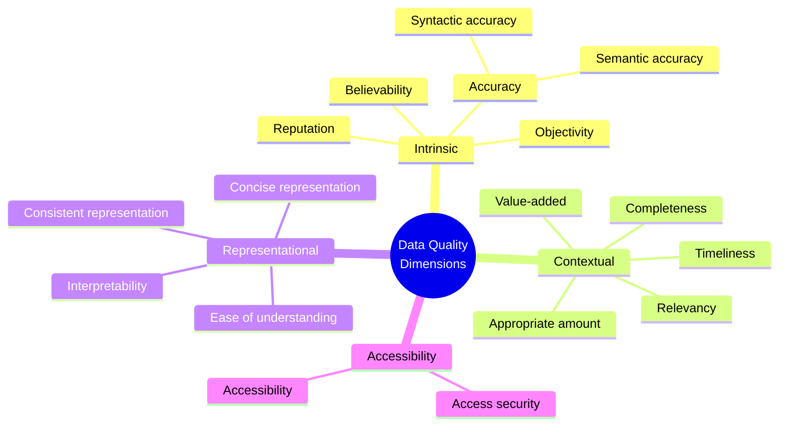

### Detailed Dimensions

| Dimension | Description | Example | Measurement |
|-----------|-------------|---------|-------------|
| Accuracy | Data correctly represents reality | Email format valid AND belongs to user | % records matching source |
| Completeness | No missing values where expected | All orders have customer_id | % non-null values |
| Consistency | No contradictions within/across data | Same customer name in orders & billing | % matching cross-references |
| Timeliness | Data is current enough for its use | Stock price < 15 min old | Age of most recent record |
| Validity | Data conforms to rules/formats | Date in YYYY-MM-DD format | % passing validation rules |
| Uniqueness | No duplicate records | One record per customer | 1 - (duplicates / total) |
| Integrity | Referential relationships maintained | Every order FK → valid customer | % valid foreign keys |

### Data Quality Assessment Process

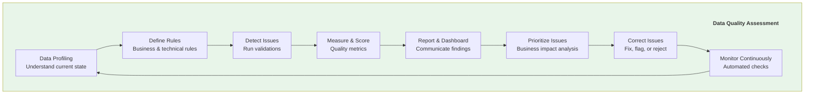

### Data Profiling Techniques

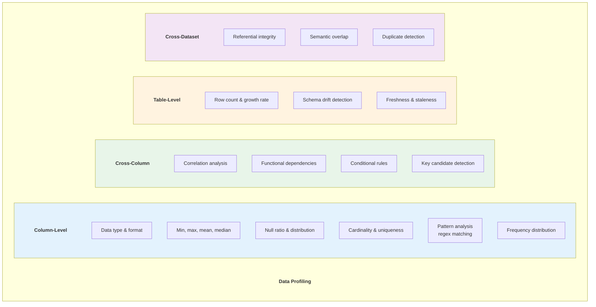

### Data Cleansing Pipeline

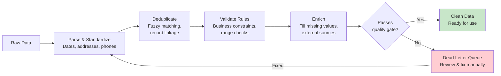

### Impact on Modern Tools
- **Great Expectations** — Quality dimensions as expectations
- **dbt tests** — Validation rules in SQL
- **Soda Core** — Data quality checks
- **Monte Carlo, Bigeye** — Data observability platforms
- **Apache Griffin** — Open-source quality framework

### Limitations & Evolution (Sự thật phũ phàng)
- Quality framework mạnh nhưng dễ biến thành checklist “tick-box”.
- Rule thủ công nhiều sẽ gây maintenance burden khi schema thay đổi nhanh.
- **Evolution:** data contracts + observability + ML anomaly detection để giảm rule debt.

### War Stories & Troubleshooting
- Triệu chứng: pipeline pass test nhưng dashboard vẫn sai business meaning.
- Cách xử lý: bổ sung semantic/business tests, owner rõ ràng cho từng critical metric.

### Metrics & Order of Magnitude
- % critical tables có quality gates là KPI nền tảng.
- Incident rate theo domain và MTTR phản ánh maturity thực tế.
- False-positive alert rate cao làm team mất niềm tin vào hệ thống quality.

### Micro-Lab
```sql
-- Quality gate cơ bản trước publish
SELECT COUNT(*) AS bad_rows
FROM staging.orders
WHERE order_id IS NULL OR amount < 0;
```

---

## 2. DATA LINEAGE & PROVENANCE - 2009

### Paper Info
- **Title:** Provenance in Databases: Why, How, and Where
- **Authors:** James Cheney, Laura Chiticariu, Wang-Chiew Tan
- **Journal:** Foundations and Trends in Databases, 2009
- **Link:** https://homepages.inf.ed.ac.uk/jcheney/publications/provdbsurvey.pdf

### Key Contributions
- Formal taxonomy of data provenance
- Three types: Why-provenance, How-provenance, Where-provenance
- Lineage computation methods across transformations
- Foundation for modern data lineage tools

### Provenance Types

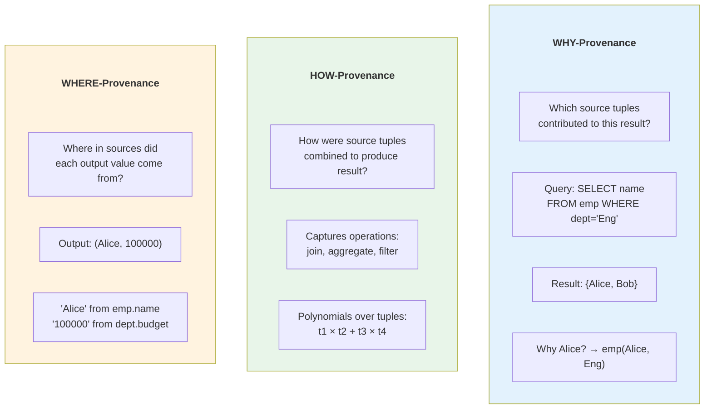

### Lineage Graph

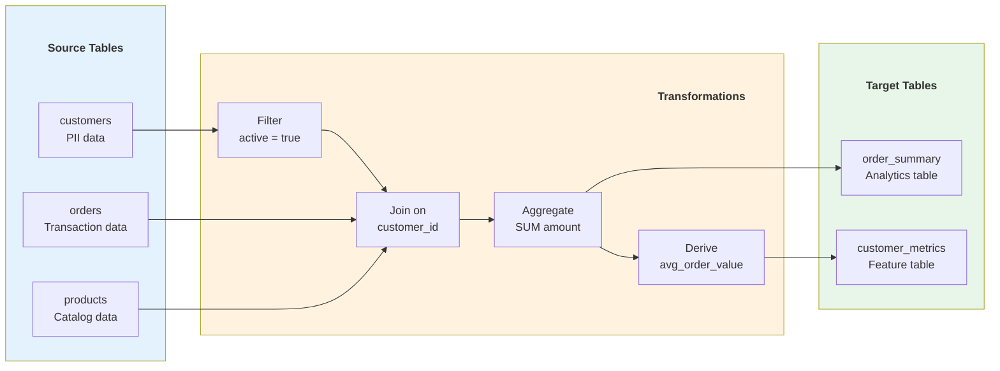

### Lineage Granularity Levels

| Level | Description | Example | Tools |
|-------|-------------|---------|-------|
| Table-level | Which tables fed this table | orders → order_summary | dbt, Airflow |
| Column-level | Which columns derived this column | orders.amount → summary.total | DataHub, Atlan |
| Row-level | Which rows contributed to this row | Customer 123's orders → their summary | Custom implementation |
| Cell-level | Which cell produced this cell | orders[123].amount → summary[123].total | Research, auditing |

### Lineage Collection Methods

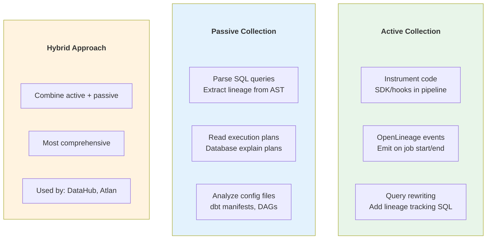

### Impact on Modern Tools
- **Apache Atlas** — Hadoop ecosystem lineage
- **DataHub** — LinkedIn's metadata + lineage platform
- **Marquez** — OpenLineage reference implementation
- **Atlan** — Active metadata + lineage
- **dbt** — Transformation lineage in DAG
- **Unity Catalog** — Databricks lineage tracking

### Limitations & Evolution (Sự thật phũ phàng)
- Lineage thô (table-level) chưa đủ cho impact analysis nghiêm túc.
- SQL động/UDF/custom code làm lineage coverage bị khuyết.
- **Evolution:** OpenLineage events + parser hybrid + runtime metadata capture.

### War Stories & Troubleshooting
- Triệu chứng: incident xảy ra nhưng không truy ngược được upstream nhanh.
- Cách xử lý: chuẩn hóa namespace dataset, bắt buộc emit lineage tại orchestrator layer.

### Metrics & Order of Magnitude
- Lineage coverage (%) theo pipeline là KPI quan trọng.
- Time-to-impact-analysis nên giảm từ giờ xuống phút cho bảng critical.
- Số node không owner trong lineage graph là risk indicator.

### Micro-Lab
```python
# Kiểm tra DAG phụ thuộc trực tiếp (toy example)
deps = {"gold.orders": ["silver.orders", "dim.customers"]}
print("upstreams of gold.orders:", deps.get("gold.orders", []))
```

---

## 3. THE FIVE SAFES FRAMEWORK - 2017

### Paper Info
- **Title:** The Five Safes: A Framework for Planning, Designing and Evaluating Data Access Solutions
- **Authors:** Felix Ritchie
- **Source:** UK Data Service
- **Link:** https://www2.uwe.ac.uk/faculties/BBS/BUS/Research/BCEF/Data%20Service%20slides.pdf

### Key Contributions
- Comprehensive framework for data access risk assessment
- Balance between data utility and protection
- Multi-dimensional risk evaluation
- Foundation for data governance policies

### The Five Safes

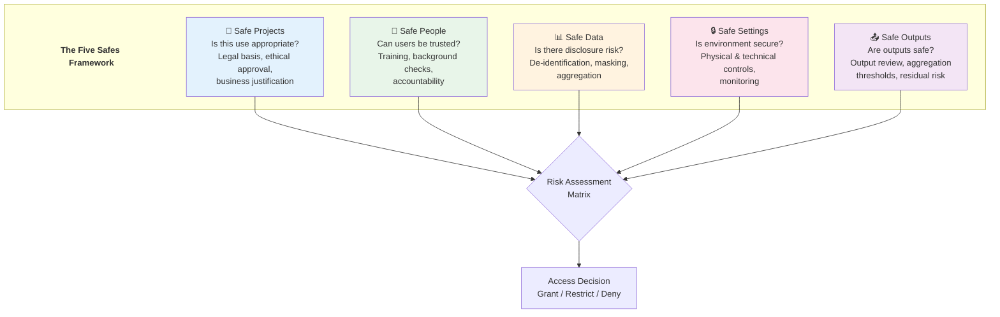

### Risk Assessment Matrix

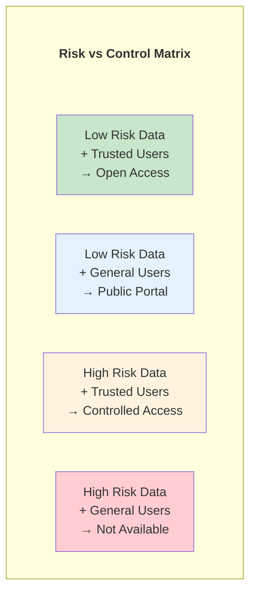

### Limitations & Evolution (Sự thật phũ phàng)
- Five Safes mạnh ở governance nhưng định lượng operational controls không luôn rõ.
- Dễ hiểu sai thành compliance paperwork thay vì continuous risk control.
- **Evolution:** policy-as-code, risk scoring tự động, audit trail theo thời gian thực.

### War Stories & Troubleshooting
- Triệu chứng: yêu cầu dữ liệu bị kẹt giữa legal, security, data team.
- Cách xử lý: chuẩn hóa intake template + SLA review + escalation path.

### Metrics & Order of Magnitude
- Lead time phê duyệt data access là chỉ số then chốt.
- Tỷ lệ request bị từ chối do thiếu thông tin phản ánh chất lượng quy trình đầu vào.
- % datasets có classification + owner đầy đủ là baseline governance.

### Micro-Lab
```yaml
# Minimal access request schema
request:
    purpose: "fraud analytics"
    data_sensitivity: "confidential"
    retention_days: 90
```

---

## 4. FAIR DATA PRINCIPLES - 2016

### Paper Info
- **Title:** The FAIR Guiding Principles for Scientific Data Management and Stewardship
- **Authors:** Mark D. Wilkinson et al.
- **Journal:** Scientific Data (Nature), 2016
- **Link:** https://www.nature.com/articles/sdata201618
- **DOI:** https://doi.org/10.1038/sdata.2016.18

### Key Contributions
- Findable, Accessible, Interoperable, Reusable principles
- Machine-actionable data requirements
- Metadata and documentation standards
- Widely adopted by research institutions and enterprises

### FAIR Principles Detail

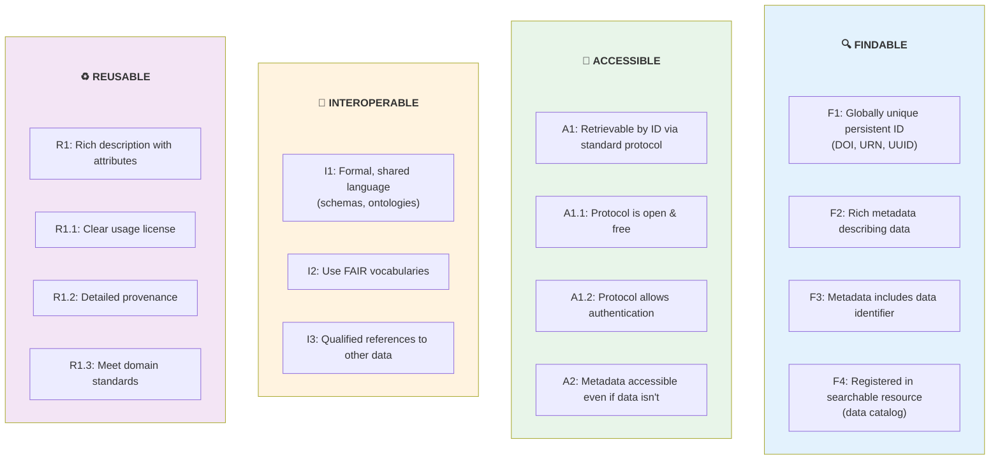

### FAIR Data Architecture

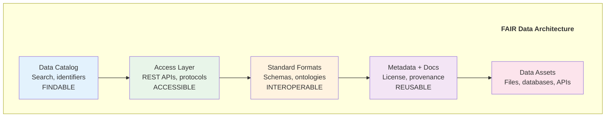

### FAIR Assessment Checklist

| Principle | Check | Implementation |
|-----------|-------|---------------|
| F1 | Has persistent unique ID? | UUID, DOI, URI |
| F2 | Has rich metadata? | Schema registry, catalog |
| F3 | Metadata references data ID? | Catalog entries link to datasets |
| F4 | Is searchable? | Data catalog with search |
| A1 | Standard access protocol? | REST API, S3, JDBC |
| A2 | Metadata survives data deletion? | Tombstone records |
| I1 | Standard schema? | Avro, Protobuf, JSON Schema |
| I2 | Common vocabularies? | Industry ontologies |
| R1.1 | Has license? | Creative Commons, proprietary |
| R1.2 | Has provenance? | Lineage graph, audit log |
| R1.3 | Domain standards? | HL7, FHIR, ISO 8601 |

### Limitations & Evolution (Sự thật phũ phàng)
- FAIR adoption dễ thiên về metadata hình thức hơn là usability thực.
- Interoperability thực tế khó vì ontology/semantic standards phân mảnh.
- **Evolution:** semantic layer + contract-driven metadata + automated catalog sync.

### War Stories & Troubleshooting
- Triệu chứng: dataset “findable” nhưng người dùng vẫn không dùng được.
- Cách xử lý: bắt buộc ví dụ truy cập, owner/contact rõ, freshness SLA hiển thị trong catalog.

### Metrics & Order of Magnitude
- Search-to-use conversion là KPI thực dụng cho “Findable”.
- % datasets có schema + lineage + license đầy đủ phản ánh quality metadata.
- Time-to-first-query từ catalog cho user mới là chỉ số UX quan trọng.

### Micro-Lab
```sql
-- Kiểm tra metadata completeness đơn giản
SELECT dataset_name
FROM catalog.datasets
WHERE owner IS NULL OR schema_version IS NULL OR data_classification IS NULL;
```

---

## 5. GDPR & PRIVACY BY DESIGN - 2010/2016

### Documentation Info
- **Title:** Privacy by Design: The 7 Foundational Principles
- **Author:** Ann Cavoukian (Ontario Privacy Commissioner)
- **Year:** 2010
- **Link:** https://www.ipc.on.ca/wp-content/uploads/resources/7foundationalprinciples.pdf

- **GDPR Official Text**
- **Year:** 2016 (enforced May 2018)
- **Link:** https://gdpr-info.eu/

### Key Contributions
- Proactive privacy approach built into system design
- Default privacy settings (opt-in, not opt-out)
- End-to-end data lifecycle security
- Foundation for GDPR and global privacy regulations
- Data subject rights framework

### Privacy by Design Principles

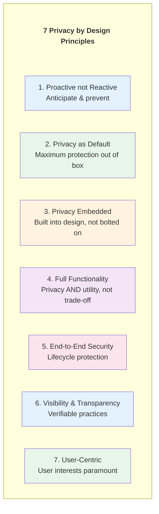

### GDPR Data Subject Rights

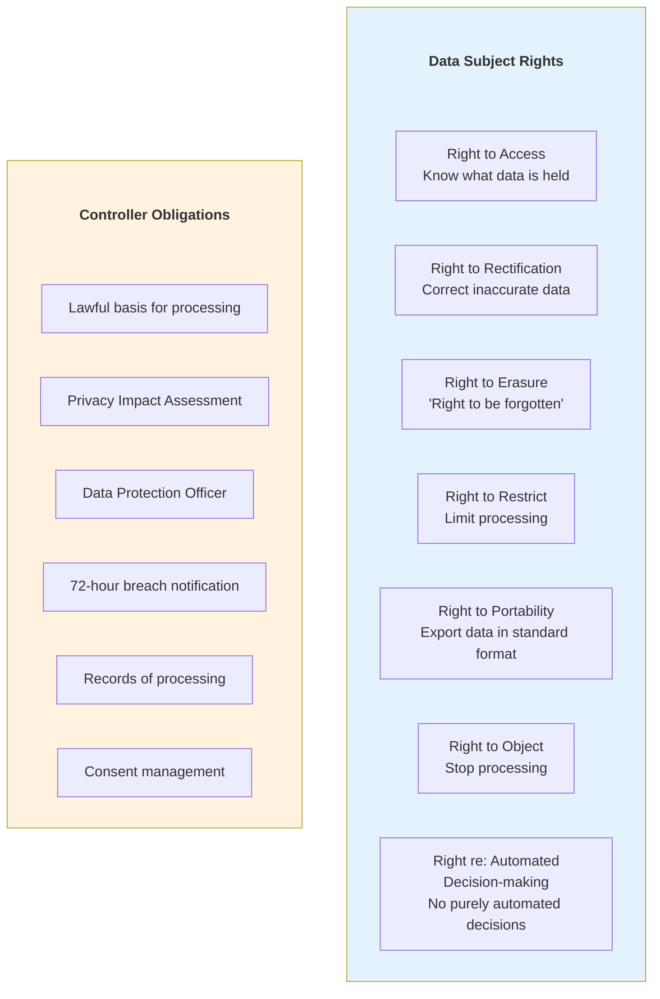

### Technical Implementation

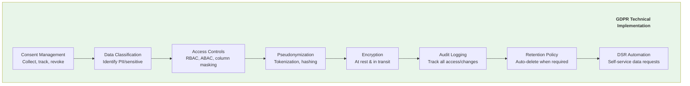

### Data Classification Levels

| Level | Description | Example | Controls |
|-------|-------------|---------|----------|
| Public | No restriction | Product catalog | None required |
| Internal | Business only | Revenue figures | Authentication |
| Confidential | Limited access | Customer data | RBAC + encryption |
| Restricted | Strictly controlled | SSN, health records | MFA + masking + audit |
| PII | Personal identifiers | Email, phone | GDPR compliance required |
| Sensitive PII | High-risk personal | Biometrics, health | Maximum protection |

### Impact on Modern Tools
- **Data catalogs** — PII tagging, classification
- **Unity Catalog** — Fine-grained access control
- **Apache Ranger** — Policy-based access management
- **Immuta** — Automated data masking
- **OneTrust, BigID** — Privacy compliance platforms

### Limitations & Evolution (Sự thật phũ phàng)
- Privacy controls mạnh nhưng friction cao nếu áp dụng cứng nhắc.
- Data subject requests (DSR) dễ tắc nghẽn khi metadata/lineage yếu.
- **Evolution:** dynamic masking, consent-aware access, DSR automation end-to-end.

### War Stories & Troubleshooting
- Triệu chứng: không xác định hết hệ thống chứa PII khi có yêu cầu xóa dữ liệu.
- Cách xử lý: map lineage PII bắt buộc, retention policy machine-enforced.

### Metrics & Order of Magnitude
- DSR completion time và % đúng hạn là KPI compliance cốt lõi.
- Coverage PII tagging theo domain phản ánh mức readiness.
- Số policy violations theo tháng giúp ưu tiên remediation.

### Micro-Lab
```sql
-- PII policy audit quick check
SELECT table_name, column_name
FROM governance.column_catalog
WHERE is_pii = true AND masking_policy IS NULL;
```

---

## 6. DATA MESH PRINCIPLES - 2019

### Paper/Article Info
- **Title:** How to Move Beyond a Monolithic Data Lake to a Distributed Data Mesh
- **Author:** Zhamak Dehghani (ThoughtWorks)
- **Source:** Martin Fowler's blog, 2019
- **Link:** https://martinfowler.com/articles/data-monolith-to-mesh.html
- **Book:** "Data Mesh: Delivering Data-Driven Value at Scale" (O'Reilly, 2022)

### Key Contributions
- Decentralized, domain-oriented data ownership
- Data as a product mindset
- Self-serve data infrastructure as a platform
- Federated computational governance
- Paradigm shift from centralized data teams to distributed ownership

### Data Mesh Principles

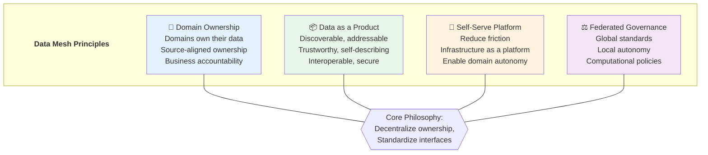

### Centralized vs Data Mesh

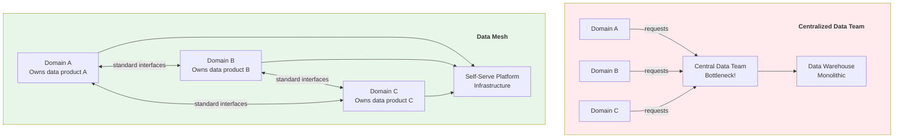

### Data Product Anatomy

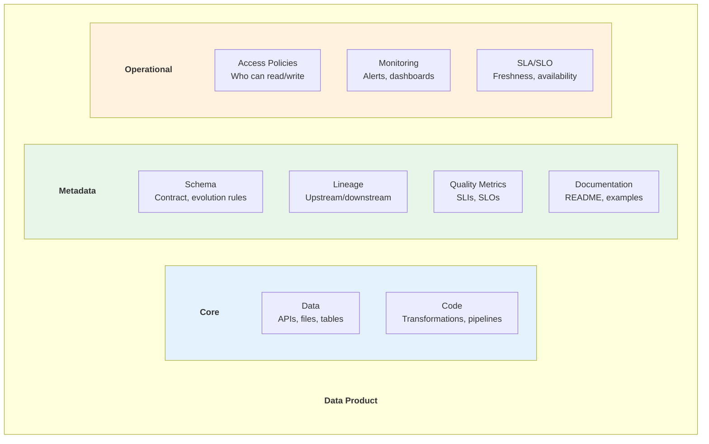

### Data Product Quality Characteristics

| Characteristic | Description | Measure |
|---------------|-------------|---------|
| Discoverable | Easy to find in catalog | Listed in catalog with tags |
| Addressable | Unique, stable identifier | URI, table name |
| Trustworthy | Quality guarantees | SLOs, quality metrics |
| Self-describing | Schema + docs included | Auto-generated docs |
| Interoperable | Standard interfaces | Common schemas, APIs |
| Secure | Proper access controls | RBAC, encryption |
| Natively accessible | Multiple access patterns | SQL, API, file export |
| Valuable on its own | Independent utility | Standalone usage possible |

### Impact on Modern Tools
- **Data catalogs (DataHub, Atlan)** — Product discovery
- **dbt** — Domain-oriented transformations
- **Platform engineering** — Self-serve infrastructure
- **Governance tools** — Federated policy enforcement

### Limitations & Evolution (Sự thật phũ phàng)
- Data Mesh thất bại nhanh nếu platform chưa self-serve đủ tốt.
- Domain ownership không rõ ràng dễ tạo “new silos”.
- **Evolution:** product scorecards, platform APIs chuẩn, federated governance automation.

### War Stories & Troubleshooting
- Triệu chứng: nhiều “data product” nhưng không có consumer thật.
- Cách xử lý: bắt buộc define consumer, SLA và oncall trước khi gọi là data product.

### Metrics & Order of Magnitude
- % data products có SLO + owner + contract là metric bắt buộc.
- Adoption (active consumers/product) quan trọng hơn số lượng product tạo mới.
- Mean time to onboard một data product mới phản ánh chất lượng platform.

### Micro-Lab
```yaml
data_product:
    name: customer_360
    owner: domain-customer
    slo_freshness_minutes: 30
    consumers: ["risk_team", "crm_team"]
```

---

## 7. OPENLINEAGE - 2021

### Documentation Info
- **Title:** OpenLineage: Open standard for metadata and lineage collection
- **Source:** OpenLineage Project (Linux Foundation / Astronomer)
- **Website:** https://openlineage.io/
- **Spec:** https://openlineage.io/spec/
- **GitHub:** https://github.com/OpenLineage/OpenLineage

### Key Contributions
- Standard, vendor-neutral lineage API specification
- Cross-platform lineage collection
- Event-based lineage emission model
- Facets system for extensible metadata
- Growing ecosystem of integrations

### OpenLineage Event Model

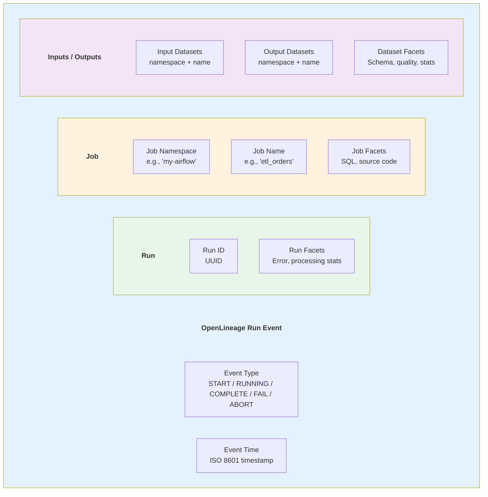

### OpenLineage Event Example

```json
{
  "eventType": "COMPLETE",
  "eventTime": "2025-01-15T10:30:00.000Z",
  "run": {
    "runId": "550e8400-e29b-41d4-a716-446655440000",
    "facets": {
      "processing_engine": {
        "version": "3.5.0",
        "name": "spark"
      }
    }
  },
  "job": {
    "namespace": "production-airflow",
    "name": "etl_daily_orders",
    "facets": {
      "sql": {
        "query": "INSERT INTO analytics.order_summary SELECT ..."
      }
    }
  },
  "inputs": [
    {
      "namespace": "postgres://prod-db:5432",
      "name": "public.orders",
      "facets": {
        "schema": {
          "fields": [
            {"name": "order_id", "type": "BIGINT"},
            {"name": "amount", "type": "DECIMAL(10,2)"},
            {"name": "created_at", "type": "TIMESTAMP"}
          ]
        }
      }
    }
  ],
  "outputs": [
    {
      "namespace": "s3://data-lake",
      "name": "analytics.order_summary",
      "facets": {
        "outputStatistics": {
          "rowCount": 150000,
          "size": 52428800
        }
      }
    }
  ]
}
```

### OpenLineage Integration Architecture

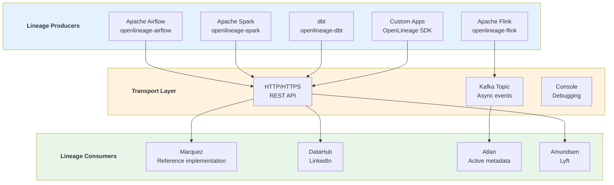

### OpenLineage Facets

| Facet Category | Facet | Description |
|---------------|-------|-------------|
| **Dataset** | Schema | Column names, types, descriptions |
| | DataSource | Connection details |
| | DataQuality | Quality metrics, assertions |
| | Statistics | Row count, byte size |
| | Symlinks | Alternative dataset identifiers |
| **Job** | SQL | Query text |
| | SourceCode | Code location (git) |
| | Documentation | Job description |
| **Run** | ErrorMessage | Failure details |
| | ExternalQuery | External system query ID |
| | Processing Engine | Spark version, etc. |
| | Parent | Parent run (sub-DAG) |

### Impact on Modern Tools
- **Marquez** — Reference implementation (open source)
- **Apache Airflow** — Built-in OpenLineage provider
- **Apache Spark** — OpenLineage agent
- **dbt** — OpenLineage integration
- **DataHub, Atlan** — OpenLineage consumer support

### Limitations & Evolution (Sự thật phũ phàng)
- Chuẩn mở tốt nhưng adoption không đồng đều giữa công cụ.
- Facets đa dạng có thể gây inconsistency nếu governance lỏng.
- **Evolution:** canonical facet conventions, schema registry cho lineage events.

### War Stories & Troubleshooting
- Triệu chứng: lineage graph bị đứt đoạn do thiếu event ở job critical.
- Cách xử lý: enforce emission trong CI/CD và check completeness theo pipeline.

### Metrics & Order of Magnitude
- Event delivery success rate là chỉ số vận hành số 1.
- % jobs phát đủ START/COMPLETE events phản ánh coverage thực tế.
- Lag từ job end đến lineage visibility ảnh hưởng trực tiếp incident response.

### Micro-Lab
```json
{
    "eventType": "COMPLETE",
    "job": {"namespace": "prod-airflow", "name": "daily_orders"},
    "inputs": [{"namespace": "warehouse", "name": "raw.orders"}],
    "outputs": [{"namespace": "lake", "name": "silver.orders"}]
}
```

---

## 8. GREAT EXPECTATIONS - 2019

### Documentation Info
- **Title:** Great Expectations: Always know what to expect from your data
- **Source:** GX (Great Expectations) Labs
- **Website:** https://docs.greatexpectations.io/
- **GitHub:** https://github.com/great-expectations/great_expectations

### Key Contributions
- Expectation-based data testing framework
- Automated data documentation
- Validation at scale with multiple backends
- Human-readable, shareable assertions
- Pipeline integration for data quality gates

### Great Expectations Architecture

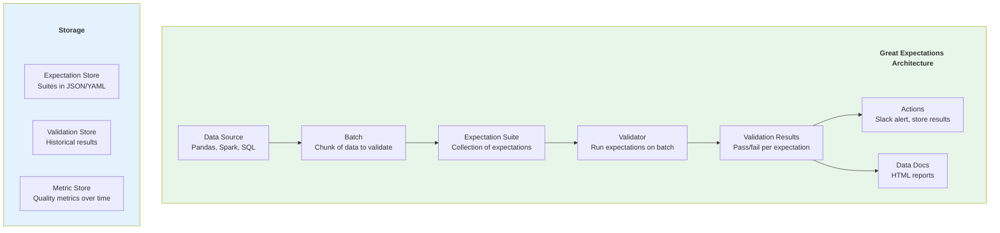

### Expectation Types

```mermaid
mindmap
    root((Expectations))
        Column-Level
            expect_column_values_to_not_be_null
            expect_column_values_to_be_unique
            expect_column_values_to_be_in_set
            expect_column_values_to_match_regex
            expect_column_mean_to_be_between
            expect_column_max_to_be_between
            expect_column_values_to_be_of_type
        Table-Level
            expect_table_row_count_to_be_between
            expect_table_columns_to_match_set
            expect_table_column_count_to_equal
        Multi-Column
            expect_column_pair_values_to_be_equal
            expect_multicolumn_values_to_be_unique
            expect_compound_columns_to_be_unique
        Distribution
            expect_column_kl_divergence_to_be_less_than
            expect_column_chisquare_test_p_value_to_be_greater_than
```

### Code Example

```python
import great_expectations as gx

# Create context
context = gx.get_context()

# Connect to data source
datasource = context.sources.add_pandas("my_source")
asset = datasource.add_dataframe_asset("orders")

# Build expectation suite
suite = context.add_expectation_suite("orders_quality_suite")

# Add expectations
suite.add_expectation(
    gx.expectations.ExpectColumnValuesToNotBeNull(column="order_id")
)
suite.add_expectation(
    gx.expectations.ExpectColumnValuesToBeUnique(column="order_id")
)
suite.add_expectation(
    gx.expectations.ExpectColumnValuesToBeBetween(
        column="amount", min_value=0, max_value=100000
    )
)
suite.add_expectation(
    gx.expectations.ExpectColumnValuesToBeInSet(
        column="status",
        value_set=["pending", "shipped", "delivered", "cancelled"]
    )
)
suite.add_expectation(
    gx.expectations.ExpectTableRowCountToBeBetween(
        min_value=1000, max_value=10000000
    )
)

# Validate
batch = asset.build_batch_request()
results = context.run_checkpoint(
    checkpoint_name="orders_checkpoint",
    batch_request=batch,
    expectation_suite_name="orders_quality_suite"
)

# Results: pass/fail per expectation with statistics
print(results.success)  # True/False
```

### GX vs dbt Tests vs Soda

| Feature | Great Expectations | dbt Tests | Soda Core |
|---------|-------------------|-----------|-----------|
| Language | Python | SQL/YAML | SodaCL (YAML) |
| Execution | Standalone / pipeline | Within dbt run | Standalone / pipeline |
| Data Docs | ✅ Rich HTML | ❌ No | ✅ Soda Cloud |
| Custom checks | Python expectations | SQL macros | Custom SodaCL |
| Profiling | ✅ Built-in | ❌ No | ✅ Yes |
| Alerting | Slack, email, custom | CI/CD failure | Soda Cloud alerts |
| Best for | Comprehensive testing | dbt pipelines | Quick checks |

### Impact on Modern Tools
- **Great Expectations** — Industry standard for data testing
- **dbt tests** — Inspired similar declarative approach
- **Soda Core** — Alternative with SodaCL language
- **Data quality gates** — CI/CD for data pipelines

### Limitations & Evolution (Sự thật phũ phàng)
- GX mạnh cho explicit rules nhưng rule explosion xảy ra nhanh ở hệ lớn.
- Test nặng có thể kéo dài pipeline runtime.
- **Evolution:** profiling bootstrap, risk-based test tiers, selective execution by criticality.

### War Stories & Troubleshooting
- Triệu chứng: suite pass ở dev nhưng fail ngẫu nhiên ở prod do data volatility.
- Cách xử lý: tách hard constraints vs statistical checks, thêm tolerance window theo domain.

### Metrics & Order of Magnitude
- Test runtime budget và flaky test rate là hai chỉ số cần khóa chặt.
- Critical expectation pass rate phải được theo dõi theo release.
- % datasets có owner cho expectation suite giúp giảm orphan checks.

### Micro-Lab
```python
import pandas as pd
df = pd.DataFrame({"order_id": [1, 2, 2], "amount": [10, -1, 20]})
assert df["order_id"].is_unique is False
assert (df["amount"] >= 0).all() is False
```

---

## 9. DATA CONTRACTS - 2022

### Article/Book Info
- **Title:** Driving Data Quality with Data Contracts
- **Author:** Andrew Jones (GoCardless)
- **Blog:** https://andrew-jones.com/blog/data-contracts/
- **Book:** "Data Contracts" by Andrew Jones (O'Reilly, 2023)
- **GitHub:** https://github.com/bitol-io/open-data-contract-standard (ODCS)

### Key Contributions
- Formal agreement between data producers and consumers
- Schema + SLAs + quality guarantees as code
- Shift-left data quality (catch at source)
- Breaking silos between data producers and consumers

### Data Contract Anatomy

```mermaid
graph TD
    subgraph Contract[" "]
        Contract_title["Data Contract"]
        style Contract_title fill:none,stroke:none,color:#333,font-weight:bold
        subgraph Schema[" "]
            Schema_title["Schema"]
            style Schema_title fill:none,stroke:none,color:#333,font-weight:bold
            SC1[Field definitions]
            SC2[Data types]
            SC3[Nullable constraints]
            SC4[Evolution rules]
        end

        subgraph Quality[" "]
            Quality_title["Quality Guarantees"]
            style Quality_title fill:none,stroke:none,color:#333,font-weight:bold
            Q1[Completeness thresholds]
            Q2[Freshness SLA]
            Q3[Accuracy rules]
            Q4[Volume expectations]
        end

        subgraph SLA[" "]
            SLA_title["Service Level"]
            style SLA_title fill:none,stroke:none,color:#333,font-weight:bold
            SL1[Availability: 99.9%]
            SL2[Latency: < 5 min]
            SL3[Support contact]
            SL4[Incident process]
        end

        subgraph Semantics[" "]
            Semantics_title["Semantics"]
            style Semantics_title fill:none,stroke:none,color:#333,font-weight:bold
            SE1[Field descriptions]
            SE2[Business definitions]
            SE3[Allowed values]
            SE4[Relationships]
        end
    end

    Producer[Data Producer<br/>Commits to contract] -->|"provides"| Contract
    Contract -->|"guarantees to"| Consumer[Data Consumer<br/>Relies on contract]

    style Schema fill:#e3f2fd
    style Quality fill:#e8f5e9
    style SLA fill:#fff3e0
    style Semantics fill:#f3e5f5
```

### Data Contract Example (YAML)

```yaml
# data_contract.yaml
dataContractSpecification: 0.9.3
id: urn:datacontract:orders:v2
info:
  title: Orders Data Contract
  version: 2.0.0
  description: Daily order data from e-commerce platform
  owner: team-commerce
  contact:
    name: Commerce Data Team
    email: data-commerce@company.com

servers:
  production:
    type: s3
    location: s3://data-lake/gold/orders/
    format: parquet

models:
  orders:
    description: Individual order records
    fields:
      order_id:
        type: string
        required: true
        unique: true
        description: Unique order identifier (UUID)
      customer_id:
        type: string
        required: true
        description: Reference to customer
      amount:
        type: decimal
        required: true
        minimum: 0
        description: Order total in USD
      status:
        type: string
        required: true
        enum: [pending, confirmed, shipped, delivered, cancelled]
      created_at:
        type: timestamp
        required: true
        description: Order creation time (UTC)

quality:
  type: SodaCL
  specification:
    checks for orders:
      - row_count > 0
      - freshness(created_at) < 24h
      - missing_percent(order_id) = 0
      - invalid_percent(status) = 0
      - duplicate_percent(order_id) = 0

sla:
  availability: 99.9%
  freshness: 1 hour
  support: business-hours
```

### Data Contract Workflow

```mermaid
sequenceDiagram
    participant Producer as Data Producer
    participant Contract as Data Contract
    participant CI as CI/CD Pipeline
    participant Consumer as Data Consumer

    Producer->>Contract: Define contract (schema + SLA)
    Consumer->>Contract: Review & agree to contract

    Producer->>CI: Push data changes
    CI->>CI: Validate against contract
    CI->>CI: Schema compatibility check
    CI->>CI: Quality assertions

    alt Contract satisfied
        CI-->>Producer: ✅ Deploy changes
        CI-->>Consumer: Notify: new data available
    else Contract violated
        CI-->>Producer: ❌ Reject changes
        CI-->>Consumer: No impact (protected)
    end
```

### Limitations & Evolution (Sự thật phũ phàng)
- Data contracts chỉ hiệu quả khi producer thực sự chịu trách nhiệm SLA.
- Versioning kém có thể gây breaking change dây chuyền.
- **Evolution:** contract registry, semantic versioning bắt buộc, contract tests trong CI.

### War Stories & Troubleshooting
- Triệu chứng: producer thêm cột/đổi type “nhỏ” nhưng consumer vỡ production.
- Cách xử lý: backward-compatibility check bắt buộc trước merge.

### Metrics & Order of Magnitude
- Contract breach rate theo team giúp định vị điểm yếu ownership.
- Mean time to detect schema break nên ở mức phút, không phải giờ.
- % pipelines có contract enforcement gate là KPI rollout chính.

### Micro-Lab
```yaml
compatibility:
    mode: backward
checks:
    - no_required_field_removed
    - no_type_narrowing
```

---

## 10. DATA OBSERVABILITY - 2021

### Article/Book Info
- **Title:** Data Observability
- **Source:** Barr Moses (Monte Carlo), industry concept
- **Blog:** https://www.montecarlodata.com/blog-what-is-data-observability/
- **Concept Origin:** SRE observability principles applied to data

### Key Contributions
- Five pillars of data health monitoring
- Proactive anomaly detection for data pipelines
- ML-based data quality monitoring (no manual rules)
- Reduced data downtime and incident response time
- Extension of software observability to data systems

### Five Pillars of Data Observability

```mermaid
graph TD
    subgraph Pillars[" "]
        Pillars_title["Five Pillars of Data Observability"]
        style Pillars_title fill:none,stroke:none,color:#333,font-weight:bold
        Fresh["🕐 Freshness<br/>Is data up-to-date?<br/>When was table last updated?"]
        Volume["📊 Volume<br/>Is data complete?<br/>Expected number of rows?"]
        Distrib["📈 Distribution<br/>Are values within range?<br/>Statistical anomalies?"]
        Schema["📋 Schema<br/>Has structure changed?<br/>Column added/removed/renamed?"]
        Lineage["🔗 Lineage<br/>What's upstream/downstream?<br/>What broke what?"]
    end

    Fresh --> Alert1["Alert: Table not updated in 6h"]
    Volume --> Alert2["Alert: Row count dropped 90%"]
    Distrib --> Alert3["Alert: NULL rate spiked to 40%"]
    Schema --> Alert4["Alert: Column 'price' type changed"]
    Lineage --> Alert5["Trace: Impact of broken source"]

    style Pillars fill:#e8f5e9
```

### Data Observability vs Data Quality

```mermaid
graph LR
    subgraph DQ[" "]
        DQ_title["Data Quality (Proactive)"]
        style DQ_title fill:none,stroke:none,color:#333,font-weight:bold
        DQ1["Define rules upfront"]
        DQ2["Test on known expectations"]
        DQ3["Fail pipeline on violation"]
        DQ4["GX, dbt tests, Soda"]
    end

    subgraph DO[" "]
        DO_title["Data Observability (Reactive + Proactive)"]
        style DO_title fill:none,stroke:none,color:#333,font-weight:bold
        DO1["ML detects anomalies"]
        DO2["No rules needed (unsupervised)"]
        DO3["Alert on unexpected changes"]
        DO4["Monte Carlo, Bigeye, Metaplane"]
    end

    Complementary["Both are complementary!<br/>Quality = testing<br/>Observability = monitoring"]

    DQ --- Complementary
    DO --- Complementary

    style DQ fill:#e3f2fd
    style DO fill:#e8f5e9
```

### Data Observability Architecture

```mermaid
graph TD
    subgraph Sources[" "]
        Sources_title["Data Infrastructure"]
        style Sources_title fill:none,stroke:none,color:#333,font-weight:bold
        DW[Data Warehouse<br/>Snowflake, BigQuery]
        DL[Data Lake<br/>S3, ADLS]
        ETL[ETL Tools<br/>Airflow, dbt]
        BI[BI Tools<br/>Looker, Tableau]
    end

    subgraph Platform[" "]
        Platform_title["Observability Platform"]
        style Platform_title fill:none,stroke:none,color:#333,font-weight:bold
        Collector[Metadata Collector<br/>Query logs, catalog, stats]
        ML[ML Models<br/>Anomaly detection<br/>Pattern learning]
        Rules[Custom Rules<br/>Business-specific thresholds]
        Incidents[Incident Manager<br/>Alert, triage, resolve]
        Dashboard[Dashboard<br/>Health overview]
    end

    subgraph Alerts[" "]
        Alerts_title["Alert Channels"]
        style Alerts_title fill:none,stroke:none,color:#333,font-weight:bold
        Slack[Slack / Teams]
        PD[PagerDuty]
        Email[Email]
        Jira[Jira Ticket]
    end

    Sources --> Collector
    Collector --> ML
    Collector --> Rules
    ML --> Incidents
    Rules --> Incidents
    Incidents --> Alerts
    Incidents --> Dashboard

    style Sources fill:#e3f2fd
    style Platform fill:#e8f5e9
    style Alerts fill:#fff3e0
```

### Data Observability Tools

| Tool | Type | Approach | Pricing |
|------|------|----------|---------|
| Monte Carlo | Platform | ML anomaly detection | Enterprise |
| Bigeye | Platform | ML + custom rules | Enterprise |
| Metaplane | Platform | ML-based monitoring | Mid-market |
| Soda | Open source + cloud | SodaCL rules | Free + paid |
| Great Expectations | Open source | Expectation tests | Free |
| Elementary | Open source | dbt-native | Free |
| Datafold | Platform | Data diff + monitoring | Enterprise |

### Limitations & Evolution (Sự thật phũ phàng)
- Observability giảm mù thông tin nhưng không thay thế data quality contracts/tests.
- ML anomaly detection dễ tạo alert fatigue nếu baseline không chuẩn.
- **Evolution:** incident triage tự động, root-cause assist bằng lineage + query logs.

### War Stories & Troubleshooting
- Triệu chứng: quá nhiều alert “không hành động được”, team bỏ qua cảnh báo thật.
- Cách xử lý: severity tiers, suppression windows, owner routing theo domain.

### Metrics & Order of Magnitude
- Precision/recall của alerting cần đo như một mô hình.
- MTTD và MTTR cho data incidents là KPI vận hành cốt lõi.
- % incidents có upstream root cause xác định trong 1 giờ phản ánh maturity.

### Micro-Lab
```sql
-- Freshness monitor đơn giản
SELECT table_name, max_loaded_at,
       EXTRACT(EPOCH FROM (NOW() - max_loaded_at))/60 AS lag_minutes
FROM observability.table_freshness
ORDER BY lag_minutes DESC
LIMIT 20;
```

---

## 11. IMPLEMENTATION PATTERNS

### Data Governance Architecture

```mermaid
graph TD
    subgraph Governance[" "]
        Governance_title["Data Governance Architecture"]
        style Governance_title fill:none,stroke:none,color:#333,font-weight:bold
        subgraph People[" "]
            People_title["People"]
            style People_title fill:none,stroke:none,color:#333,font-weight:bold
            CDO[Chief Data Officer]
            DS[Data Stewards<br/>Per domain]
            DO[Data Owners<br/>Business leaders]
        end

        subgraph Process[" "]
            Process_title["Process"]
            style Process_title fill:none,stroke:none,color:#333,font-weight:bold
            Policy[Data Policies<br/>Standards, guidelines]
            Class[Classification<br/>Public → Restricted]
            Access[Access Management<br/>Request → Approve]
            Quality[Quality Management<br/>Monitor → Improve]
        end

        subgraph Technology[" "]
            Technology_title["Technology"]
            style Technology_title fill:none,stroke:none,color:#333,font-weight:bold
            Catalog[Data Catalog<br/>DataHub, Unity Catalog]
            Lineage_Tool[Lineage Tracking<br/>OpenLineage, Marquez]
            QualityTool[Quality Tools<br/>GX, Soda, dbt tests]
            Privacy[Privacy Tools<br/>Masking, anonymization]
        end
    end

    CDO --> Policy
    DS --> Quality
    DO --> Access
    Policy --> Catalog
    Class --> Privacy
    Quality --> QualityTool
    Access --> Catalog

    style People fill:#e3f2fd
    style Process fill:#fff3e0
    style Technology fill:#e8f5e9
```

### Data Quality in the Pipeline

```mermaid
flowchart LR
    subgraph Source[" "]
        Source_title["Source"]
        style Source_title fill:none,stroke:none,color:#333,font-weight:bold
        S1[Data Contract<br/>Schema + SLA]
    end

    subgraph Ingest[" "]
        Ingest_title["Ingest"]
        style Ingest_title fill:none,stroke:none,color:#333,font-weight:bold
        I1[Schema validation]
        I2[Format checks]
    end

    subgraph Transform[" "]
        Transform_title["Transform"]
        style Transform_title fill:none,stroke:none,color:#333,font-weight:bold
        T1[dbt tests<br/>not_null, unique]
        T2[Business rule<br/>validation]
    end

    subgraph Serve[" "]
        Serve_title["Serve"]
        style Serve_title fill:none,stroke:none,color:#333,font-weight:bold
        SV1[Great Expectations<br/>Suite validation]
        SV2[Data observability<br/>Anomaly detection]
    end

    subgraph Consume[" "]
        Consume_title["Consume"]
        style Consume_title fill:none,stroke:none,color:#333,font-weight:bold
        C1[Dashboard<br/>quality indicators]
        C2[API<br/>quality metadata]
    end

    Source --> Ingest --> Transform --> Serve --> Consume

    style Source fill:#e3f2fd
    style Ingest fill:#e8f5e9
    style Transform fill:#fff3e0
    style Serve fill:#f3e5f5
    style Consume fill:#fce4ec
```

### Governance Maturity Model

| Level | Name | Characteristics |
|-------|------|----------------|
| 1 | Ad Hoc | No governance, reactive fixes |
| 2 | Aware | Basic policies, manual processes |
| 3 | Managed | Defined processes, some automation |
| 4 | Measured | KPIs, quality metrics, SLAs |
| 5 | Optimized | Automated, self-service, continuous improvement |

---

## SUMMARY TABLE

| Paper/Standard | Year | Author(s) | Key Innovation | Modern Tools |
|---------------|------|-----------|----------------|--------------|
| Data Quality Book | 2006 | Batini, Scannapieco | Quality dimensions framework | GX, Soda |
| Provenance Survey | 2009 | Cheney et al. | Lineage taxonomy (why/how/where) | DataHub, Atlas |
| Privacy by Design | 2010 | Cavoukian | 7 privacy principles | GDPR tools |
| FAIR Principles | 2016 | Wilkinson et al. | Data reusability standard | Data catalogs |
| GDPR | 2016 | EU | Privacy regulation | OneTrust, BigID |
| Five Safes | 2017 | Ritchie | Access risk framework | Governance tools |
| Data Mesh | 2019 | Dehghani | Decentralized data ownership | Platform engineering |
| Great Expectations | 2019 | GX Labs | Expectation-based testing | Data pipelines |
| OpenLineage | 2021 | Linux Foundation | Standard lineage API | Marquez, Airflow |
| Data Observability | 2021 | Moses et al. | 5 pillars of data health | Monte Carlo, Bigeye |
| Data Contracts | 2022 | Jones | Schema + SLA as code | ODCS, Soda |

---

## REFERENCES

### Papers & Articles
1. Batini, C. and Scannapieco, M. "Data Quality: Concepts, Methodologies and Techniques." Springer, 2006.
2. Cheney, J. et al. "Provenance in Databases: Why, How, and Where." Foundations and Trends in Databases, 2009.
3. Wilkinson, M. et al. "The FAIR Guiding Principles." Scientific Data, 2016.
4. Dehghani, Z. "How to Move Beyond a Monolithic Data Lake to a Distributed Data Mesh." 2019.
5. Cavoukian, A. "Privacy by Design: The 7 Foundational Principles." 2010.
6. Jones, A. "Data Contracts." O'Reilly, 2023.

### Tools & Specifications
- OpenLineage: https://openlineage.io/
- Great Expectations: https://github.com/great-expectations/great_expectations
- Apache Atlas: https://github.com/apache/atlas
- DataHub: https://github.com/datahub-project/datahub
- Marquez: https://github.com/MarquezProject/marquez
- Soda Core: https://github.com/sodadata/soda-core
- Open Data Contract Standard: https://github.com/bitol-io/open-data-contract-standard

---
> 💡 **Gemini Feedback**
### 1. DATA QUALITY CONCEPTS (2006) & 8. GREAT EXPECTATIONS (2019)

_(Gộp chung góc nhìn của Lý thuyết và Thực hành)_

> **Góc nhìn Thực chiến (Senior to Junior)**
> 
> 1. **Limitations & Evolution (Sự thật phũ phàng):** Great Expectations (GX) hay các tool Data Quality thường quảng cáo là sẽ "chặn đứng dữ liệu bẩn". Sự thật là nếu em bật chế độ chặn cứng (Strict Halt) trên mọi pipeline, hệ thống của em sẽ... ngừng hoạt động 90% thời gian vì dữ liệu ngoài đời thực luôn có rác. Khó nhất không phải là viết rule, mà là quy hoạch rule nào mang tính cảnh báo (Warning), rule nào mang tính sống còn (Fatal).
>     
> 2. **War Stories & Troubleshooting:** Căn bệnh **"Cảnh báo rác" (Alert Fatigue)**. Kỹ sư set up rule gửi tin nhắn Slack mỗi khi có data Null. Tháng đầu tiên, mọi người hốt hoảng vào check. Tháng thứ 2, ngày nào cũng có 500 cái tin nhắn báo lỗi, team Data chai sạn cảm xúc và bắt đầu "Mute" luôn kênh Slack đó. Cuối cùng, một lỗi Null nghiêm trọng làm sai lệch báo cáo tài chính cũng bị bỏ qua vì trôi tin nhắn.
>     
> 3. **Metrics & Order of Magnitude:** Đừng bắt data phải sạch 100%. Các công ty lớn thường chỉ áp dụng rule kiểm tra chất lượng khắc nghiệt cho **Tier 1 Data** (chiếm khoảng 10-15% tổng dữ liệu, liên quan trực tiếp đến tiền hoặc ML model cốt lõi).
>     
> 4. **Micro-Lab:** Khởi tạo thử môi trường Great Expectations trên Python để thấy việc cấu hình data testing giống hệt như unit test trong software: `pip install great_expectations && great_expectations init`
>     

### 2. DATA LINEAGE & PROVENANCE (2009) & 7. OPENLINEAGE (2021)

> **Góc nhìn Thực chiến (Senior to Junior)**
> 
> 1. **Limitations & Evolution (Sự thật phũ phàng):** Trước khi OpenLineage ra đời, các công ty phải tự viết tool đi "đọc trộm" các file SQL (SQL Parsing) bằng Regex để vẽ ra sơ đồ dòng chảy dữ liệu (Lineage). Cách này cực kỳ dễ gãy và sai bét nhè khi các file SQL trở nên quá phức tạp (nested subqueries). OpenLineage thay đổi cuộc chơi bằng cách bắt các engine (như Spark, Airflow) tự nguyện "khai báo" chúng đang đọc/ghi cái gì khi đang chạy (Runtime push).
>     
> 2. **War Stories & Troubleshooting:** Lỗi **"Hiệu ứng cánh bướm"**. Một bạn Junior bên team Backend quyết định xóa cột `is_active` trong một bảng database phụ vì tưởng không ai xài. Hai ngày sau, nguyên một cái Dashboard báo cáo doanh thu của CEO bị trắng xóa, và một con AI model tự động mua quảng cáo bị chạy sai logic đốt mất hàng nghìn đô. Data Lineage sinh ra chính là để trả lời câu hỏi: _"Nếu tôi đổi cột này, thằng nào ở hạ nguồn sẽ chết?"_.
>     
> 3. **Micro-Lab:** Nếu em có xài dbt, lệnh đơn giản nhất để xem lineage tự động sinh ra là `dbt docs generate` và `dbt docs serve`. Nó sẽ tự vẽ ra một đồ thị y hệt mạng nhện biểu diễn quan hệ các bảng.
>     

### 5. GDPR & PRIVACY BY DESIGN (2010/2016)

> **Góc nhìn Thực chiến (Senior to Junior)**
> 
> 1. **Limitations & Evolution (Sự thật phũ phàng):** Luật GDPR yêu cầu quyền "Được lãng quên" (Right to be forgotten) - khi user yêu cầu xóa data, em phải xóa SẠCH SẼ. Nhưng nếu em xài kiến trúc Data Lake đắp chiếu data trên S3 thành hàng ngàn file Parquet, việc tìm ra đúng 1 dòng chứa email của user đó để xóa là một nhiệm vụ bất khả thi và tốn hàng ngàn đô la tiền quét I/O. (Đó là lý do Iceberg/Delta với tính năng `DELETE` row-level ra đời để cứu rỗi các hệ thống này).
>     
> 2. **War Stories & Troubleshooting:** Tình huống rò rỉ **PII (Personally Identifiable Information - Thông tin định danh cá nhân)** kinh điển: Data Engineer cẩn thận mã hóa số điện thoại trong Database, nhưng quên mất là cái ứng dụng web lại in nguyên số điện thoại đó dưới dạng text rõ ràng (plaintext) vào file log. Toàn bộ file log đó được ELK/Splunk gom về Data Lake và ai trong công ty cũng đọc được.
>     
> 3. **Micro-Lab:** LUÔN LUÔN tạo thói quen hash (băm) dữ liệu cá nhân ngay từ cửa ngõ trước khi đưa vào kho phân tích. Trong PostgreSQL: `SELECT encode(digest('user@email.com', 'sha256'), 'hex');` (Cần extension pgcrypto).
>     

### 6. DATA MESH PRINCIPLES (2019)

> **Góc nhìn Thực chiến (Senior to Junior)**
> 
> 1. **Limitations & Evolution (Sự thật phũ phàng):** Data Mesh KHÔNG PHẢI LÀ MỘT PHẦN MỀM. Em không thể mua Data Mesh, cũng không thể cài nó lên server. Nó là một sự thay đổi về tổ chức con người. Rất nhiều công ty startup quy mô 10-20 người đua đòi làm Data Mesh, kết quả là đẻ ra hàng đống quy trình cồng kềnh bóp nghẹt tốc độ phát triển. Chỉ áp dụng Mesh khi em có trên 3-5 team độc lập, mỗi team có vài chục kỹ sư.
>     
> 2. **War Stories & Troubleshooting:** Khi chia data về cho các phòng ban (Domain) tự quản theo chuẩn Data Mesh, team Marketing và team Sale bắt đầu "đánh nhau". Team Sale định nghĩa "Khách hàng" là người đã trả tiền, Team Marketing định nghĩa "Khách hàng" là người để lại email. Khi tổng hợp báo cáo chéo nhau (Federated Query), con số vênh nhau hàng triệu đô la. Công nghệ (Trino/Presto) chạy rất mượt, nhưng hệ thống vẫn thất bại vì con người không thống nhất được định nghĩa kinh doanh.
>     

### 9. DATA CONTRACTS (2022)

> **Góc nhìn Thực chiến (Senior to Junior)**
> 
> 1. **Limitations & Evolution (Sự thật phũ phàng):** Data Contracts ra đời để giải quyết "mối thù truyền kiếp" giữa Software Engineer (SWE - người tạo ra data) và Data Engineer (DE - người hốt rác). Trước đây, SWE tự do đổi tên cột trong API/Database, làm DE vỡ mật vì code sập ngầm. Data Contract ép SWE phải ký một "hợp đồng" (schema JSON/YAML), nếu code backend push lên mà vi phạm hợp đồng (ví dụ đổi int thành string), hệ thống CI/CD sẽ báo tịt và cấm deploy.
>     
> 2. **War Stories & Troubleshooting:** Backend sửa key JSON từ `user_id` thành `userId`. Pipeline chạy qua không báo lỗi gì (do JSON linh hoạt), data insert vào Snowflake thì cột `user_id` bị Null toàn bộ. Ba ngày sau team phân tích mới phát hiện ra. Chốt lại: Rác sinh ra từ đâu, phải chặn ngay ở cửa đó. Không thể bắt DE đi gánh hậu quả dọn rác cho SWE được.
>     
> 3. **Micro-Lab:** Thử đọc spec của Open Data Contract Standard (ODCS) để xem một "hợp đồng dữ liệu" ngoài đời thực chứa những gì: quyền sở hữu (owner), SLA (độ trễ), và lược đồ (schema).
>     

### 10. DATA OBSERVABILITY (2021)

> **Góc nhìn Thực chiến (Senior to Junior)**
> 
> 1. **Limitations & Evolution (Sự thật phũ phàng):** Khác với Data Quality (kiểm tra data đúng hay sai), Data Observability (Khả năng quan sát) giải quyết một loại lỗi đáng sợ hơn: **Silent Failure (Lỗi câm)**. Database không sập, Airflow báo xanh (Success), không có exception nào văng ra. NHƯNG tự nhiên bảng dữ liệu hôm nay chỉ có 10 dòng thay vì 1 triệu dòng như mọi ngày. Data Quality rule (check null, check schema) vẫn pass 100%. Nếu không có tool bắt dị thường về mặt "Khối lượng" (Volume Anomaly), em sẽ không thể nhận ra hệ thống đang chết lâm sàng.
>     
> 2. **War Stories & Troubleshooting:** Đã từng có một hệ thống chạy mượt mà 6 tháng. Đột nhiên một sáng thứ 2, thuật toán ML dự đoán giá cả bị ngáo, trả về kết quả 0 đồng cho mọi sản phẩm. Nhìn vào hệ thống Data Observability mới thấy: Lượng data (Volume) của 3 ngày cuối tuần trước bị rớt thẳng đứng (drop to zero) do một con API của đối tác thứ 3 hết hạn chứng chỉ SSL. Airflow job vẫn chạy, nhưng không kéo được data nào, ghi một cục rỗng vào kho.
>     
> 3. **Metrics & Order of Magnitude:** 5 cột trụ của Data Observability mà em phải thuộc lòng: **Freshness** (Data có mới không?), **Volume** (Khối lượng có đều không?), **Schema** (Có ai đổi cột không?), **Distribution** (Phân bổ giá trị có dị thường không?), và **Lineage** (Nó ảnh hưởng đến ai?). Dựa vào 5 thông số này, các tool nhúng thuật toán Machine Learning vào để tự phát hiện sự cố thay vì bắt kỹ sư viết rule bằng tay.
>

---

<mark style="background: #BBFABBA6;">💡 **Gemini Message**</mark>
Lý do của sự chững lại này là vì từ 2022 đến nay (2026), ngành Data Governance không đẻ ra thêm "Khái niệm/Triết lý" mới nào nữa. Những trụ cột như _Chất lượng, Dòng chảy (Lineage), Hợp đồng (Contracts), và Khả năng quan sát (Observability)_ đã là điểm tới hạn của lý thuyết.

Tuy nhiên, **cách chúng ta thực thi những lý thuyết đó** từ 2022 đến 2026 đã thay đổi một cách chóng mặt, chủ yếu do 2 cú sốc: **Sự bùng nổ của GenAI** và **Khủng hoảng chi phí Cloud (FinOps)**.

Dưới đây là 4 xu hướng vận hành Quản trị Dữ liệu mới nhất trong 4 năm qua mà em cần cập nhật ngay để setup cái Data-Keeper chạy mượt mà trên con HP Z440 mà không bị ngộp trong rác:

### 1. Kỷ nguyên Write-Audit-Publish (WAP Pattern) - "Git cho Dữ liệu" (2023 - 2026)

- **Sự thật phũ phàng:** Dù có áp dụng Data Contracts hay Observability, dữ liệu bẩn vẫn lọt vào bảng Production, làm sai Dashboard trước khi kỹ sư kịp sửa.
    
- **Kẻ thay đổi cuộc chơi:** Mẫu thiết kế **WAP (Write - Audit - Publish)** kết hợp với các tool như **lakeFS** hoặc **Project Nessie** (như Git dành cho Data Lake).
    
- **💡 Góc nhìn thực chiến:** Bây giờ, thay vì ghi trực tiếp data vào bảng `users_prod`, hệ thống sẽ ghi vào một nhánh ẩn (Branch: `staging`). Sau đó, tool Data Quality (Audit) sẽ chạy trên nhánh đó. Nếu data pass 100% test, nó mới gõ lệnh `MERGE` (Publish) vào production. Nếu tịt, nhánh đó bị drop, hệ thống báo động, và người dùng cuối vĩnh viễn không bao giờ nhìn thấy data bẩn. Đây là tiêu chuẩn vàng của năm 2026.
    

### 2. Quản trị Dữ liệu Phi cấu trúc & RAG (Unstructured Governance) (2024 - 2026)

- **Sự thật phũ phàng:** Các tool như Great Expectations hay dbt tests sinh ra để kiểm tra bảng SQL (check Null, check số dương). Nhưng khi em xây dựng hệ thống AI Agent, data của em là file PDF, log chat, và Vector Embeddings. Làm sao để "check Null" một cái Vector 1536 chiều?
    
- **Kẻ thay đổi cuộc chơi:** Các Framework quản trị PII (Dữ liệu cá nhân) cho LLM (như Presidio hoặc NeMo Guardrails).
    
- **💡 Góc nhìn thực chiến:** Nỗi đau lớn nhất hiện tại là user vô tình ném mã thẻ tín dụng hoặc mật khẩu vào file text, sau đó hệ thống RAG nhai luôn file đó và đưa vào Vector Database. Khi hỏi AI, nó đọc lại luôn mật khẩu cho người khác nghe. Governance bây giờ là phải đánh chặn và "bôi đen" (masking/redaction) PII ngay trong luồng Streaming trước khi nó chạm vào mô hình AI.
    

### 3. "AI tự dọn rác" (Active/Healing Governance) (2024 - nay)

- **Sự thật phũ phàng:** Viết rule bằng tay cực kỳ buồn ngủ. Kỹ sư phải ngồi gõ hàng ngàn dòng YAML file để định nghĩa `column_A_must_not_be_null`. Bảng data thay đổi một chút là đi sửa YAML ốm đòn.
    
- **Kẻ thay đổi cuộc chơi:** Tích hợp LLM thẳng vào Data Observability.
    
- **💡 Góc nhìn thực chiến:** Các hệ thống hiện đại không bắt em viết rule nữa. Chúng tự động quét metadata hằng ngày, dùng AI để học (Profiling) và tự sinh ra rule. Thậm chí, khi phát hiện cột `ngày_sinh` bị định dạng sai từ `DD/MM/YYYY` sang `MM/DD/YYYY`, AI sẽ tự động đề xuất luôn đoạn code SQL (hoặc dbt macro) để tự nắn lại data (Data Healing) thay vì chỉ gào thét gửi tin nhắn báo lỗi lên Slack.
    

### 4. FinOps: Quản trị Hóa đơn Compute (Cost Governance) (2023 - 2026)

- **Sự thật phũ phàng:** Từ 2023, kinh tế khó khăn, các Big Tech không vung tiền cho Cloud nữa. Câu hỏi chuyển từ "Data có đúng không?" sang **"Cái bảng data này tốn bao nhiêu tiền để chạy mỗi ngày, và ai là người xài nó?"**.
    
- **Kẻ thay đổi cuộc chơi:** Tính năng Cost Observability được nhồi vào mọi công cụ.
    
- **💡 Góc nhìn thực chiến:** Quản trị bây giờ bao gồm việc gỡ bỏ các bảng "Zombie" (được update hằng ngày tốn CPU nhưng 6 tháng nay không có user nào query vào). Hệ thống Lineage không chỉ vẽ sơ đồ, mà nó còn tính luôn: Báo cáo Marketing này gọi vào bảng A, bảng A tốn 50$ tiền compute/tháng, vậy suy ra phí duy trì báo cáo này là 50$.
    

**Chốt lại cho em:** Từ 2022 đến nay, ngành Governance chuyển từ **Thụ động (Cảnh báo lỗi)** sang **Chủ động (Ngăn chặn bằng WAP & AI Tự sửa)** và mở rộng biên giới sang **FinOps & LLM Security**. Khi thiết kế nền tảng cá nhân của mình, em không cần ôm đồm cài các tool Enterprise nặng nề. Chỉ cần thiết lập một luồng kiểm tra nhẹ nhàng bằng DuckDB/dbt ngay từ khâu đầu vào, áp dụng cơ chế không lưu đè (WAP) là hệ thống đã có độ "lì lợm" ngang ngửa các công ty công nghệ lớn rồi!

---
*Document Version: 2.0*
*Last Updated: February 2026*
