# Machine Learning Data & Feature Store Papers

## Những Paper Nền Tảng Về ML Data Management và Feature Engineering

---

## Mục Lục

1. [Hidden Technical Debt in ML Systems](#1-hidden-technical-debt-in-ml-systems---2015)
2. [Feast: Feature Store for ML](#2-feast-feature-store-for-ml---2020)
3. [TFX & TF.Transform](#3-tfx--tftransform---2017)
4. [Data Versioning - DVC & LakeFS](#4-data-versioning---dvc--lakefs)
5. [MLflow](#5-mlflow---2018)
6. [Kubeflow Pipelines](#6-kubeflow-pipelines---2018)
7. [Training Data at Scale](#7-training-data-at-scale)
8. [Model Monitoring & Observability](#8-model-monitoring--observability)
9. [Data-Centric AI](#9-data-centric-ai---2021)
10. [ML Data Maturity Model](#10-ml-data-maturity-model)
11. [Summary Table](#summary-table)

---

## 1. HIDDEN TECHNICAL DEBT IN ML SYSTEMS - 2015

### Paper Info
- **Title:** Hidden Technical Debt in Machine Learning Systems
- **Authors:** D. Sculley, Gary Holt, et al. (Google)
- **Conference:** NeurIPS 2015
- **Link:** https://papers.nips.cc/paper/2015/hash/86df7dcfd896fcaf2674f757a2463eba-Abstract.html
- **PDF:** https://proceedings.neurips.cc/paper/2015/file/86df7dcfd896fcaf2674f757a2463eba-Paper.pdf

### Key Contributions
- ML system complexity extends far beyond model code
- Identified categories of technical debt unique to ML
- Pipeline jungles anti-pattern
- Foundation paper for the entire MLOps movement

### ML System Components

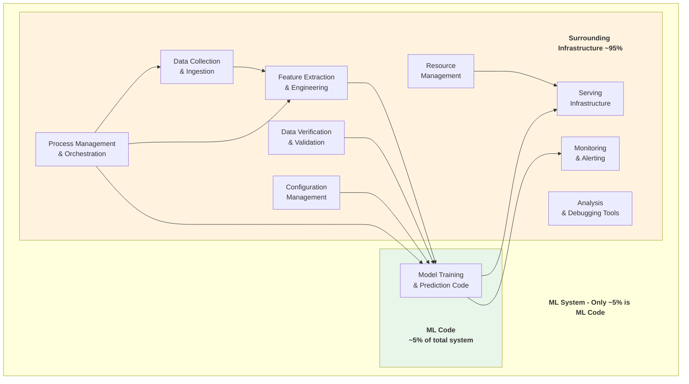

### Technical Debt Categories

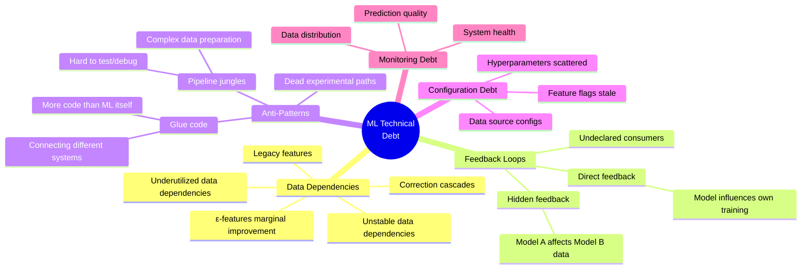

### Data Dependency Debt

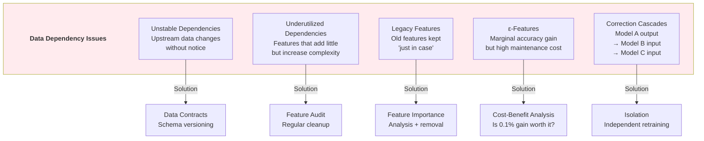

### Pipeline Jungle Anti-Pattern

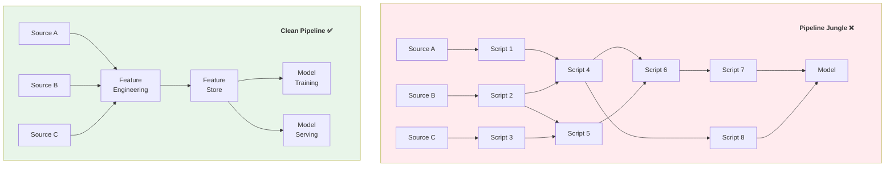

### Impact on Modern Tools
- **MLOps** — Entire field spawned from this paper
- **Feature Stores** — Address data dependencies
- **ML Monitoring (Evidently, WhyLabs)** — Track feedback loops
- **dbt for ML** — Clean data pipelines
- **MLflow, W&B** — Experiment management

---

## 2. FEAST: FEATURE STORE FOR ML - 2020

### Paper Info
- **Title:** Feast: An Open Source Feature Store for Machine Learning
- **Authors:** Willem Pienaar, Rui Qiu, et al. (Gojek/Tecton)
- **Source:** VLDB Workshop 2021
- **Website:** https://feast.dev/
- **Docs:** https://docs.feast.dev/
- **GitHub:** https://github.com/feast-dev/feast

### Key Contributions
- Open source feature store architecture
- Online/offline feature serving with consistency
- Point-in-time correctness (prevents data leakage)
- Feature registry and discovery
- Bridge between data engineering and ML

### Feature Store Architecture

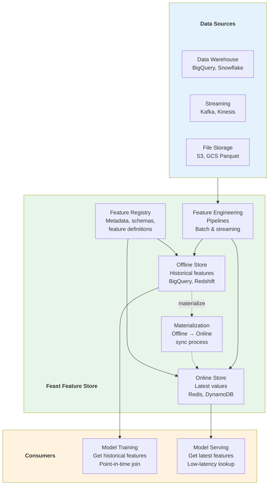

### Point-in-Time Correctness

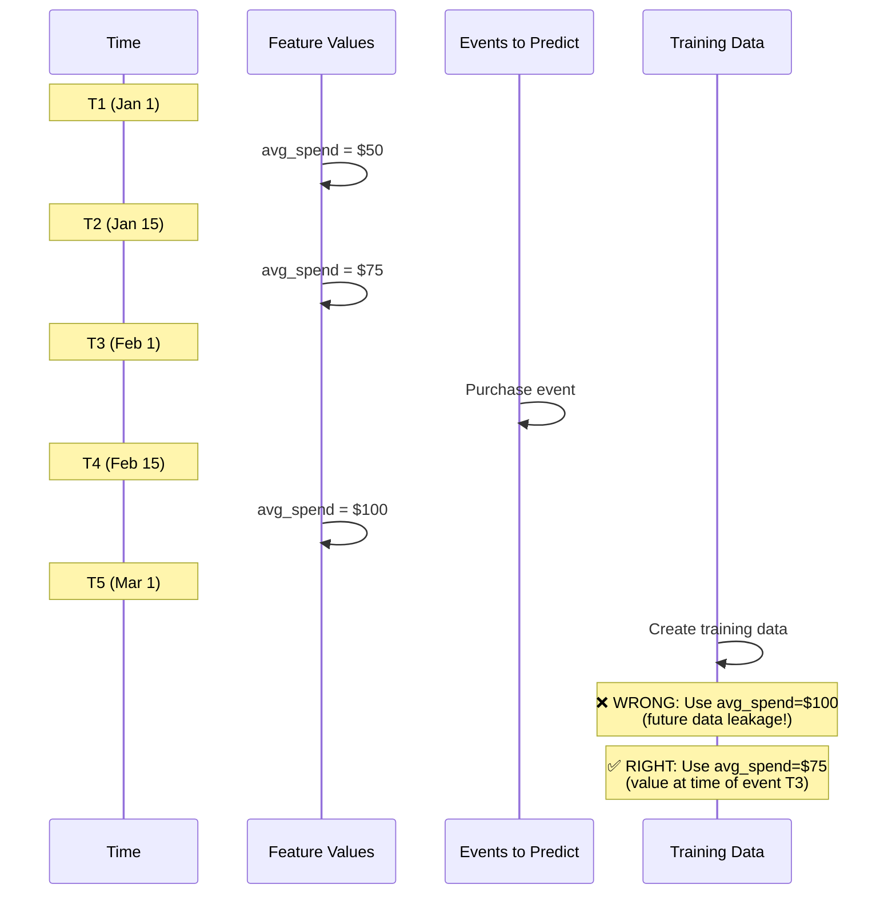

### Feature Definition Code

```python
from feast import Entity, FeatureView, Field, FileSource
from feast.types import Float64, Int64, String
from datetime import timedelta

# Define entity
driver = Entity(
    name="driver_id",
    join_keys=["driver_id"],
    description="Unique driver identifier"
)

# Define data source
driver_stats_source = FileSource(
    path="data/driver_stats.parquet",
    timestamp_field="event_timestamp",
    created_timestamp_column="created",
)

# Define feature view
driver_stats_fv = FeatureView(
    name="driver_hourly_stats",
    entities=[driver],
    ttl=timedelta(days=1),
    schema=[
        Field(name="avg_trip_duration", dtype=Float64),
        Field(name="total_trips_completed", dtype=Int64),
        Field(name="driver_rating", dtype=Float64),
        Field(name="acceptance_rate", dtype=Float64),
    ],
    online=True,
    source=driver_stats_source,
    tags={"team": "driver_experience"},
)

# Training: get historical features
training_df = store.get_historical_features(
    entity_df=entity_df,  # entities + timestamps
    features=[
        "driver_hourly_stats:avg_trip_duration",
        "driver_hourly_stats:total_trips_completed",
        "driver_hourly_stats:driver_rating",
    ],
).to_df()

# Serving: get online features (latest)
online_features = store.get_online_features(
    features=[
        "driver_hourly_stats:avg_trip_duration",
        "driver_hourly_stats:driver_rating",
    ],
    entity_rows=[{"driver_id": 1001}],
).to_dict()
```

### Feature Store Comparison

| Feature | Feast | Tecton | Databricks FS | SageMaker FS |
|---------|-------|--------|---------------|--------------|
| Open Source | ✅ Yes | ❌ No | ❌ No | ❌ No |
| Streaming | ✅ Limited | ✅ Full | ✅ Yes | ✅ Yes |
| Point-in-time | ✅ Yes | ✅ Yes | ✅ Yes | ✅ Yes |
| Online store | Redis, DynamoDB | Built-in | DynamoDB | Built-in |
| Offline store | BigQuery, Redshift | S3, Snowflake | Delta Lake | S3 |
| Monitoring | Basic | ✅ Full | ✅ Yes | ✅ Yes |
| Best for | Open source, flexible | Enterprise | Databricks users | AWS users |

---

## 3. TFX & TF.TRANSFORM - 2017

### Paper/Documentation Info
- **Title:** TFX: A TensorFlow-Based Production-Scale Machine Learning Platform
- **Authors:** Denis Baylor, Eric Breck, et al. (Google)
- **Conference:** KDD 2017
- **Link:** https://www.tensorflow.org/tfx/guide
- **TFDV Paper:** https://research.google/pubs/pub47967/
- **GitHub:** https://github.com/tensorflow/tfx

### Key Contributions
- End-to-end ML pipeline framework
- Schema-based data validation (TFDV)
- Consistent feature transformation (tf.Transform)
- Training-serving skew prevention
- Production ML deployment patterns from Google

### TFX Pipeline Architecture

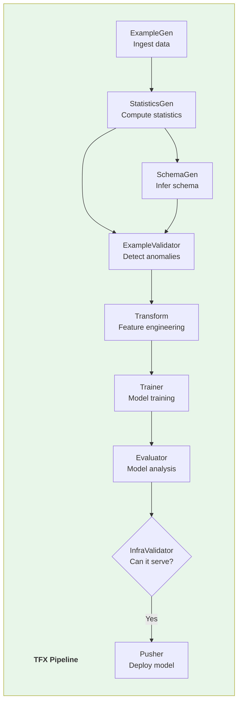

### Data Validation (TFDV)

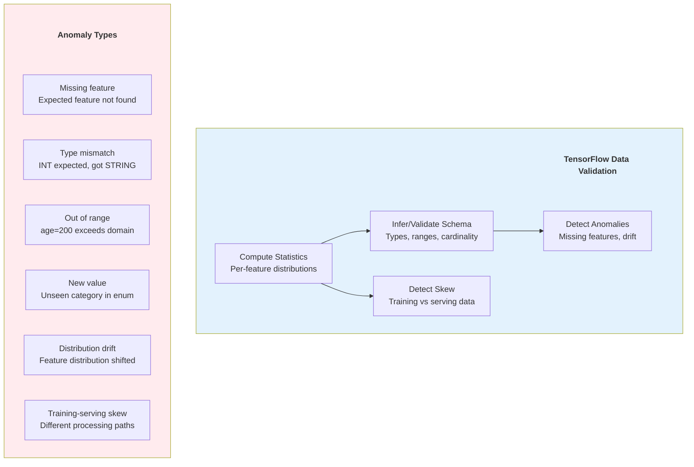

### Transform Consistency

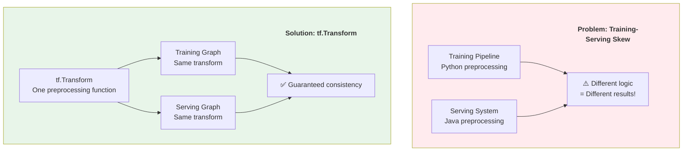

---

## 4. DATA VERSIONING - DVC & LAKEFS

### Documentation Info
- **DVC (Data Version Control)**
  - **Website:** https://dvc.org/
  - **Docs:** https://dvc.org/doc
  - **GitHub:** https://github.com/iterative/dvc

- **LakeFS**
  - **Website:** https://lakefs.io/
  - **Docs:** https://docs.lakefs.io/
  - **GitHub:** https://github.com/treeverse/lakeFS

### Key Contributions
- Git-like versioning for data and models
- Reproducible ML experiments
- Data branching and merging
- Immutable data snapshots

### DVC Architecture

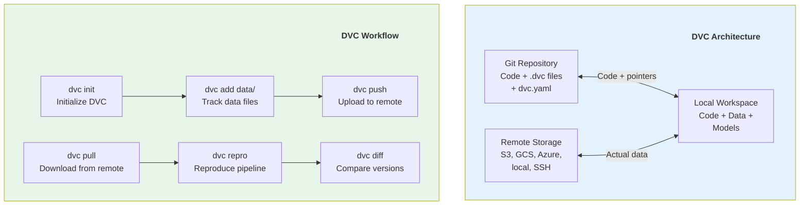

### LakeFS Branching Model

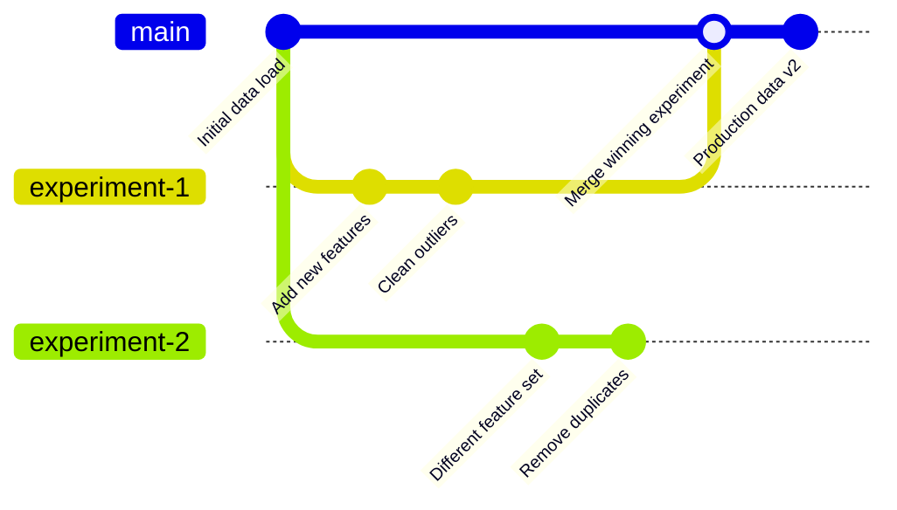

### DVC Pipeline Definition

```yaml
# dvc.yaml
stages:
  prepare:
    cmd: python src/prepare.py
    deps:
      - data/raw.csv
      - src/prepare.py
    params:
      - prepare.split_ratio
    outs:
      - data/prepared/train.csv
      - data/prepared/test.csv

  featurize:
    cmd: python src/featurize.py
    deps:
      - data/prepared/train.csv
      - src/featurize.py
    params:
      - featurize.max_features
      - featurize.ngram_range
    outs:
      - data/features/train.pkl
      - data/features/test.pkl

  train:
    cmd: python src/train.py
    deps:
      - data/features/train.pkl
      - src/train.py
    params:
      - train.learning_rate
      - train.n_estimators
    outs:
      - models/model.pkl
    metrics:
      - metrics/train.json:
          cache: false
    plots:
      - metrics/confusion_matrix.csv:
          x: predicted
          y: actual

  evaluate:
    cmd: python src/evaluate.py
    deps:
      - data/features/test.pkl
      - models/model.pkl
      - src/evaluate.py
    metrics:
      - metrics/eval.json:
          cache: false
```

### DVC vs LakeFS vs Table Formats

| Feature | DVC | LakeFS | Delta Lake / Iceberg |
|---------|-----|--------|---------------------|
| Granularity | Files | Objects (S3) | Tables |
| Branching | Git branches | Git-like branches | Time travel |
| Storage | Dedup via hashing | Copy-on-write | Metadata logs |
| Interface | CLI | S3-compatible API | SQL / Spark |
| Best for | ML experiments | Data lake versioning | Analytics tables |

---

## 5. MLFLOW - 2018

### Paper/Documentation Info
- **Title:** Accelerating the Machine Learning Lifecycle with MLflow
- **Authors:** Databricks Team
- **Source:** IEEE Data Engineering Bulletin
- **Website:** https://mlflow.org/
- **Paper:** http://sites.computer.org/debull/A18dec/p39.pdf
- **GitHub:** https://github.com/mlflow/mlflow

### Key Contributions
- Standardized experiment tracking
- Model registry with lifecycle management
- Reproducible ML runs with projects
- Multi-framework model packaging

### MLflow Components

```mermaid
graph TD
    subgraph MLflow[" "]
        MLflow_title["MLflow Platform"]
        style MLflow_title fill:none,stroke:none,color:#333,font-weight:bold
        subgraph Tracking[" "]
            Tracking_title["1. Tracking"]
            style Tracking_title fill:none,stroke:none,color:#333,font-weight:bold
            T1[Log Parameters<br/>learning_rate, epochs]
            T2[Log Metrics<br/>accuracy, loss, F1]
            T3[Log Artifacts<br/>plots, data samples]
            T4[Compare Runs<br/>UI dashboard]
        end

        subgraph Projects[" "]
            Projects_title["2. Projects"]
            style Projects_title fill:none,stroke:none,color:#333,font-weight:bold
            P1[MLproject file<br/>Define environment]
            P2[Conda / Docker<br/>Reproducible env]
            P3[Entry points<br/>Parameterized runs]
        end

        subgraph Models[" "]
            Models_title["3. Models"]
            style Models_title fill:none,stroke:none,color:#333,font-weight:bold
            M1[MLmodel format<br/>Multi-framework]
            M2[Flavors<br/>sklearn, pytorch, tf]
            M3[Deployment<br/>REST, Spark, Docker]
        end

        subgraph Registry[" "]
            Registry_title["4. Model Registry"]
            style Registry_title fill:none,stroke:none,color:#333,font-weight:bold
            R1[Register models<br/>Version management]
            R2[Stage transitions<br/>Staging → Production]
            R3[Annotations<br/>Description, tags]
        end
    end

    Tracking --> Projects
    Projects --> Models
    Models --> Registry

    style Tracking fill:#e3f2fd
    style Projects fill:#e8f5e9
    style Models fill:#fff3e0
    style Registry fill:#f3e5f5
```

### Model Registry Lifecycle

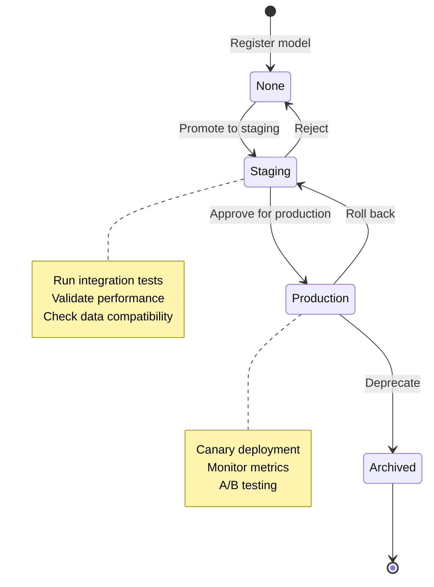

### MLflow Code Example

```python
import mlflow
import mlflow.sklearn
from sklearn.ensemble import RandomForestClassifier
from sklearn.metrics import accuracy_score, f1_score

# Set experiment
mlflow.set_experiment("customer-churn-prediction")

with mlflow.start_run(run_name="rf_v2") as run:
    # Log parameters
    params = {
        "n_estimators": 200,
        "max_depth": 10,
        "min_samples_split": 5,
        "random_state": 42,
    }
    mlflow.log_params(params)

    # Train model
    model = RandomForestClassifier(**params)
    model.fit(X_train, y_train)

    # Evaluate
    y_pred = model.predict(X_test)
    accuracy = accuracy_score(y_test, y_pred)
    f1 = f1_score(y_test, y_pred, average="weighted")

    # Log metrics
    mlflow.log_metric("accuracy", accuracy)
    mlflow.log_metric("f1_score", f1)

    # Log feature importance
    import matplotlib.pyplot as plt
    fig, ax = plt.subplots()
    ax.barh(feature_names, model.feature_importances_)
    mlflow.log_figure(fig, "feature_importance.png")

    # Log model
    mlflow.sklearn.log_model(
        model,
        "model",
        registered_model_name="churn-predictor"
    )

    # Log input data signature
    from mlflow.models import infer_signature
    signature = infer_signature(X_train, y_pred)
    mlflow.sklearn.log_model(model, "model", signature=signature)

    print(f"Run ID: {run.info.run_id}")
    print(f"Accuracy: {accuracy:.4f}, F1: {f1:.4f}")
```

### MLflow vs Alternatives

| Feature | MLflow | Weights & Biases | Neptune | Comet ML |
|---------|--------|-------------------|---------|----------|
| Open source | ✅ Yes | ❌ No | ❌ No | ❌ No |
| Experiment tracking | ✅ | ✅ Rich UI | ✅ | ✅ |
| Model registry | ✅ | ✅ | ✅ | ✅ |
| Collaboration | Basic | ✅ Teams | ✅ | ✅ |
| Hyperparameter tuning | Via Optuna | ✅ Sweeps | Via Optuna | ✅ |
| System monitoring | ❌ | ✅ | ❌ | ✅ |
| Self-hosted | ✅ | ✅ | ❌ | ❌ |
| Integration | Databricks native | Framework-agnostic | Framework-agnostic | Framework-agnostic |

---

## 6. KUBEFLOW PIPELINES - 2018

### Documentation Info
- **Title:** Kubeflow: Machine Learning Toolkit for Kubernetes
- **Source:** Google / Kubeflow Community
- **Website:** https://www.kubeflow.org/
- **Pipelines:** https://www.kubeflow.org/docs/components/pipelines/
- **GitHub:** https://github.com/kubeflow/kubeflow

### Key Contributions
- Kubernetes-native ML workflow orchestration
- Reusable, composable pipeline components
- End-to-end ML platform on K8s
- Notebook-to-production path

### Kubeflow Architecture

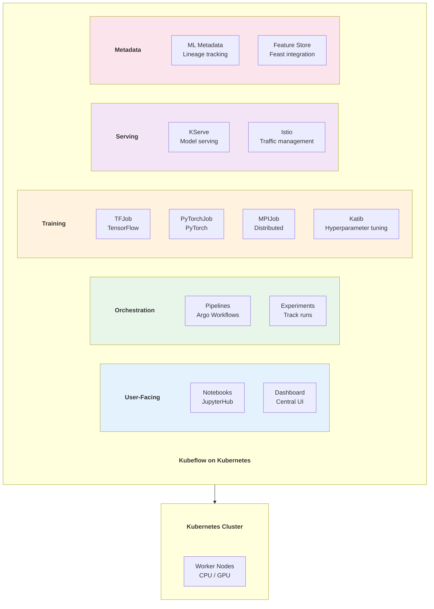

### Kubeflow Pipeline Definition

```python
from kfp import dsl
from kfp.dsl import Input, Output, Dataset, Model, Metrics

@dsl.component(
    base_image="python:3.10",
    packages_to_install=["pandas", "scikit-learn"]
)
def load_and_prepare_data(
    data_path: str,
    output_train: Output[Dataset],
    output_test: Output[Dataset],
    test_size: float = 0.2,
):
    """Load data and split into train/test."""
    import pandas as pd
    from sklearn.model_selection import train_test_split

    df = pd.read_csv(data_path)
    train, test = train_test_split(df, test_size=test_size)
    train.to_csv(output_train.path, index=False)
    test.to_csv(output_test.path, index=False)

@dsl.component(
    base_image="python:3.10",
    packages_to_install=["pandas", "scikit-learn", "mlflow"]
)
def train_model(
    train_data: Input[Dataset],
    model_output: Output[Model],
    metrics_output: Output[Metrics],
    n_estimators: int = 100,
    max_depth: int = 10,
):
    """Train a Random Forest model."""
    import pandas as pd
    from sklearn.ensemble import RandomForestClassifier
    import pickle

    df = pd.read_csv(train_data.path)
    X, y = df.drop("target", axis=1), df["target"]

    model = RandomForestClassifier(
        n_estimators=n_estimators, max_depth=max_depth
    )
    model.fit(X, y)

    with open(model_output.path, "wb") as f:
        pickle.dump(model, f)

    metrics_output.log_metric("train_accuracy", model.score(X, y))

@dsl.pipeline(name="ml-training-pipeline")
def ml_pipeline(
    data_path: str = "gs://bucket/data.csv",
    n_estimators: int = 100,
):
    load_task = load_and_prepare_data(data_path=data_path)
    train_task = train_model(
        train_data=load_task.outputs["output_train"],
        n_estimators=n_estimators,
    )
```

---

## 7. TRAINING DATA AT SCALE

### Paper Info
- **Title:** Data Collection and Quality Challenges in Deep Learning: A Data-Centric AI Perspective
- **Authors:** Various (data-centric AI movement, Andrew Ng)
- **Source:** NeurIPS Data-Centric AI Workshop 2021
- **Link:** https://datacentricai.org/

### Key Contributions
- Data-centric vs model-centric AI
- Label quality matters more than model architecture
- Systematic data improvement techniques
- Active learning for efficient labeling

### Data-Centric vs Model-Centric AI

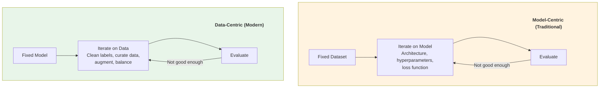

### Data Quality Issues in ML

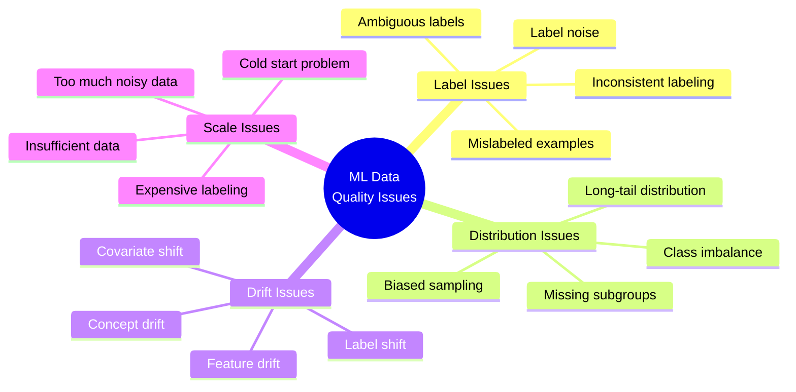

### Data Improvement Techniques

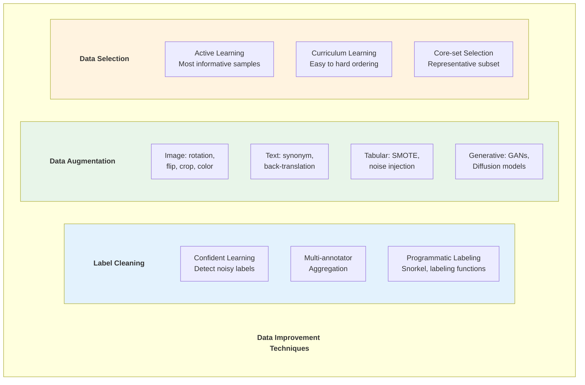

### Data Flywheel

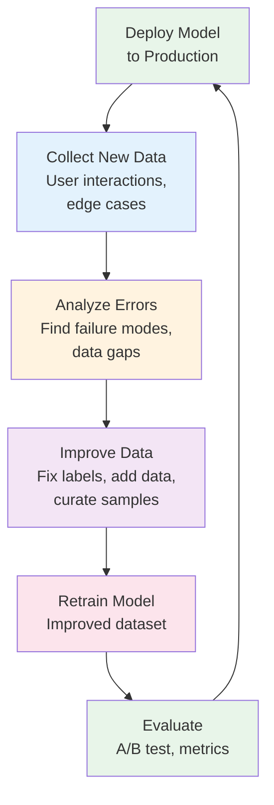

---

## 8. MODEL MONITORING & OBSERVABILITY

### Paper/Article Info
- **Title:** Monitoring Machine Learning Models in Production
- **Source:** Google Cloud MLOps Guide
- **Link:** https://cloud.google.com/architecture/mlops-continuous-delivery-and-automation-pipelines-in-machine-learning

### Key Contributions
- Production ML monitoring pillars
- Data drift detection methods
- Model degradation patterns
- Feedback loop management

### ML Monitoring Architecture

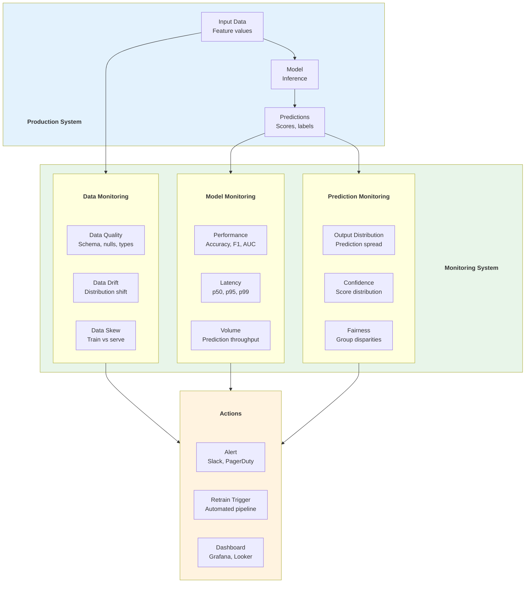

### Drift Detection Methods

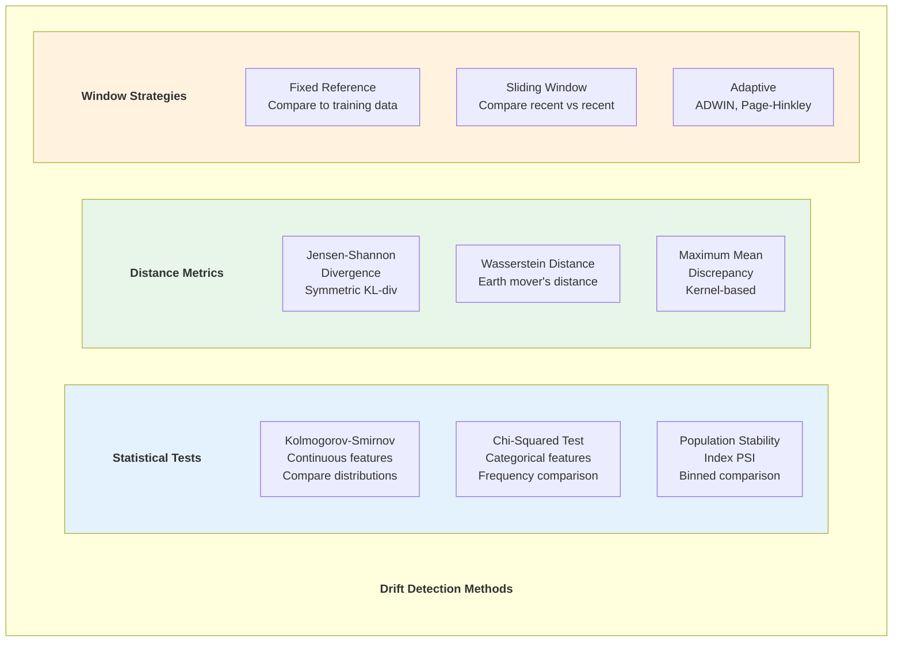

### ML Monitoring Tools Comparison

| Tool | Type | Approach | Key Features |
|------|------|----------|-------------|
| Evidently AI | Open source | Statistical tests | Data reports, dashboards |
| WhyLabs | Platform | Profiling + anomaly | WhyLogs, integrations |
| Arize | Platform | Embedding analysis | Production troubleshooting |
| Fiddler | Platform | Explainability | Model explanation + monitoring |
| NannyML | Open source | Performance estimation | CBPE, DLE algorithms |
| Seldon | Platform | K8s-native | Alibi Detect, Tempo |

---

## 9. DATA-CENTRIC AI - 2021

### Article Info
- **Title:** Data-Centric AI Competition
- **Author:** Andrew Ng
- **Source:** Landing AI
- **Link:** https://https://www.deeplearning.ai/data-centric-ai/

### Key Contributions
- Shift focus from model to data quality
- Systematic data improvement methodology
- Benchmark for data improvement
- New AI development paradigm

### Data-Centric AI Principles

```mermaid
graph TD
    subgraph Principles[" "]
        Principles_title["Data-Centric AI Principles"]
        style Principles_title fill:none,stroke:none,color:#333,font-weight:bold
        P1["Consistency over Volume<br/>1000 clean labels > 10000 noisy"]
        P2["Systematic Error Analysis<br/>Categorize failures, fix root cause"]
        P3["Label Quality First<br/>Agreement metrics, label review"]
        P4["Iterative Improvement<br/>Data → Model → Analyze → Repeat"]
        P5["Data Augmentation<br/>Strategic, not random"]
    end

    subgraph Workflow[" "]
        Workflow_title["Data-Centric Workflow"]
        style Workflow_title fill:none,stroke:none,color:#333,font-weight:bold
        W1[Collect initial data] --> W2[Train baseline model]
        W2 --> W3[Error analysis<br/>Categorize failures]
        W3 --> W4[Improve data<br/>Fix labels, add examples]
        W4 --> W5[Retrain & evaluate]
        W5 -->|"Better?"| W6[Deploy]
        W5 -->|"Not better"| W3
    end

    style Principles fill:#e8f5e9
    style Workflow fill:#e3f2fd
```

### Tools for Data-Centric AI

| Tool | Category | Description |
|------|----------|-------------|
| Cleanlab | Label cleaning | Find and fix label errors |
| Snorkel | Programmatic labeling | Labeling functions, weak supervision |
| Label Studio | Annotation | Open source labeling platform |
| Aquarium Learning | Error analysis | Visual error categorization |
| Scale AI | Labeling | Enterprise annotation service |
| Labelbox | Platform | Full annotation lifecycle |
| Prodigy | Annotation | Active learning annotation |
| Argilla | NLP annotation | Open source NLP labeling |

---

## 10. ML DATA MATURITY MODEL

### Maturity Levels

```mermaid
graph BT
    L1["Level 1: Ad Hoc<br/>- Manual data prep<br/>- No versioning<br/>- Local experiments<br/>- Spreadsheet tracking"]
    L2["Level 2: Tracked<br/>- MLflow / W&B tracking<br/>- Basic data versioning (DVC)<br/>- Shared notebooks<br/>- Manual feature engineering"]
    L3["Level 3: Reproducible<br/>- Pipeline orchestration (Kubeflow/Airflow)<br/>- Feature store (Feast)<br/>- Model registry<br/>- Automated testing"]
    L4["Level 4: Automated<br/>- CI/CD for ML (MLOps)<br/>- Automated retraining<br/>- Model monitoring (Evidently)<br/>- Data quality gates"]
    L5["Level 5: Optimized<br/>- Continuous training<br/>- Data flywheel<br/>- A/B testing infrastructure<br/>- Automated data improvement"]

    L1 --> L2 --> L3 --> L4 --> L5

    style L1 fill:#ffebee
    style L2 fill:#fff3e0
    style L3 fill:#e3f2fd
    style L4 fill:#e8f5e9
    style L5 fill:#c8e6c9
```

### MLOps Maturity Levels (Google)

```mermaid
graph LR
    subgraph L0[" "]
        L0_title["Level 0: Manual"]
        style L0_title fill:none,stroke:none,color:#333,font-weight:bold
        M0[Manual training<br/>Manual deployment<br/>No monitoring]
    end

    subgraph L1ML[" "]
        L1ML_title["Level 1: ML Pipeline"]
        style L1ML_title fill:none,stroke:none,color:#333,font-weight:bold
        M1[Automated training<br/>Continuous training<br/>Pipeline orchestration]
    end

    subgraph L2ML[" "]
        L2ML_title["Level 2: CI/CD + ML"]
        style L2ML_title fill:none,stroke:none,color:#333,font-weight:bold
        M2[Automated CI/CD<br/>Automated testing<br/>Automated monitoring<br/>Full automation]
    end

    L0 -->|"Automate training"| L1ML
    L1ML -->|"Automate CI/CD"| L2ML

    style L0 fill:#ffebee
    style L1ML fill:#fff3e0
    style L2ML fill:#e8f5e9
```

---

## SUMMARY TABLE

| Paper/Tool | Year | Author(s) | Key Innovation | Modern Tools |
|-----------|------|-----------|----------------|--------------|
| Hidden Tech Debt | 2015 | Google (Sculley) | ML systems complexity beyond code | MLOps movement |
| TFX/TFDV | 2017 | Google (Baylor) | Data validation + transform consistency | TFX, GX |
| MLflow | 2018 | Databricks | Experiment tracking + model registry | MLflow, W&B |
| DVC | 2018 | Iterative | Git for data + models | DVC, LakeFS |
| Kubeflow | 2018 | Google | K8s-native ML orchestration | Kubeflow, Vertex AI |
| Feast | 2020 | Gojek/Tecton | Open source feature store | Feast, Tecton |
| Data-Centric AI | 2021 | Andrew Ng | Data quality > model complexity | Cleanlab, Snorkel |
| ML Monitoring | 2020+ | Industry | Production ML observability | Evidently, Arize |

---

## REFERENCES

### Papers
1. Sculley, D. et al. "Hidden Technical Debt in Machine Learning Systems." NeurIPS, 2015.
2. Baylor, D. et al. "TFX: A TensorFlow-Based Production-Scale Machine Learning Platform." KDD, 2017.
3. Zaharia, M. et al. "Accelerating the Machine Learning Lifecycle with MLflow." IEEE DEBS, 2018.
4. Pienaar, W. et al. "Feast: An Open Source Feature Store for ML." VLDB Workshop, 2021.

### Tools & Documentation
- MLflow: https://github.com/mlflow/mlflow
- Feast: https://github.com/feast-dev/feast
- DVC: https://github.com/iterative/dvc
- LakeFS: https://github.com/treeverse/lakeFS
- Kubeflow: https://github.com/kubeflow/kubeflow
- Evidently AI: https://github.com/evidentlyai/evidently
- Cleanlab: https://github.com/cleanlab/cleanlab

---

*Document Version: 2.0*
*Last Updated: February 2026*
