# Machine Learning Data & Feature Store Papers

## Những Paper Nền Tảng Về ML Data Management và Feature Engineering

---

## Mục Lục

1. [Hidden Technical Debt in ML Systems](#1-hidden-technical-debt-in-ml-systems---2015)
2. [Feast: Feature Store for ML](#2-feast-feature-store-for-ml---2020)
3. [TFX & TF.Transform](#3-tfx--tftransform---2017)
4. [Data Versioning - DVC & LakeFS](#4-data-versioning---dvc--lakefs)
5. [MLflow](#5-mlflow---2018)
6. [Kubeflow Pipelines](#6-kubeflow-pipelines---2018)
7. [Training Data at Scale](#7-training-data-at-scale)
8. [Model Monitoring & Observability](#8-model-monitoring--observability)
9. [Data-Centric AI](#9-data-centric-ai---2021)
10. [ML Data Maturity Model](#10-ml-data-maturity-model)
11. [Summary Table](#summary-table)
12. LLM Data Pipelines & Vector Database
---

## 1. HIDDEN TECHNICAL DEBT IN ML SYSTEMS - 2015

### Paper Info
- **Title:** Hidden Technical Debt in Machine Learning Systems
- **Authors:** D. Sculley, Gary Holt, et al. (Google)
- **Conference:** NeurIPS 2015
- **Link:** https://papers.nips.cc/paper/2015/hash/86df7dcfd896fcaf2674f757a2463eba-Abstract.html
- **PDF:** https://proceedings.neurips.cc/paper/2015/file/86df7dcfd896fcaf2674f757a2463eba-Paper.pdf

### Key Contributions
- ML system complexity extends far beyond model code
- Identified categories of technical debt unique to ML
- Pipeline jungles anti-pattern
- Foundation paper for the entire MLOps movement

### ML System Components

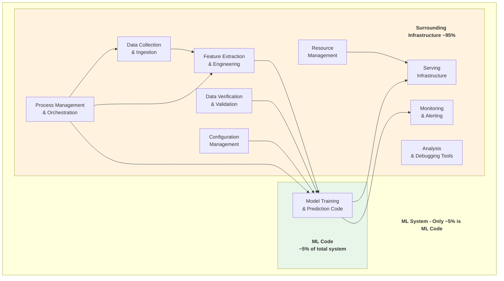

### Technical Debt Categories

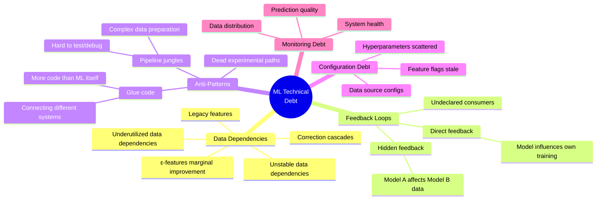

### Data Dependency Debt

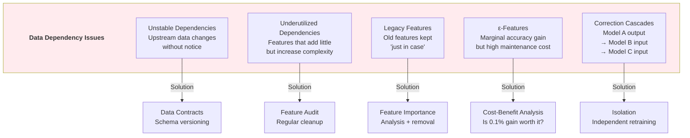

### Pipeline Jungle Anti-Pattern

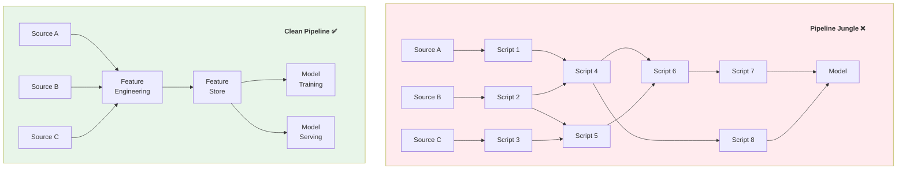

### Impact on Modern Tools
- **MLOps** — Entire field spawned from this paper
- **Feature Stores** — Address data dependencies
- **ML Monitoring (Evidently, WhyLabs)** — Track feedback loops
- **dbt for ML** — Clean data pipelines
- **MLflow, W&B** — Experiment management

### Limitations & Evolution (Sự thật phũ phàng)
- Technical debt trong ML tăng nhanh ở data/pipeline hơn ở model code.
- Team thường tối ưu model metrics mà bỏ qua data contracts và observability.
- **Evolution:** MLOps platform hóa lifecycle, data-centric workflows, standardized governance.

### War Stories & Troubleshooting
- Triệu chứng: mô hình tốt ở offline nhưng fail production do drift/feedback loop.
- Cách xử lý: tách rõ train/serve pipelines, theo dõi skew và rollback nhanh.

### Metrics & Order of Magnitude
- Train-serve skew rate và drift incidents là leading indicators.
- % features có owner/lineage rõ ràng phản ánh maturity thực.
- Mean time to rollback model lỗi cần được đo như SRE metric.

### Micro-Lab
```python
# Simple data drift toy check
train_mean, prod_mean = 42.0, 49.5
drift = abs(prod_mean - train_mean) / max(train_mean, 1)
print({"relative_drift": round(drift, 3), "alert": drift > 0.1})
```

---

## 2. FEAST: FEATURE STORE FOR ML - 2020

### Paper Info
- **Title:** Feast: An Open Source Feature Store for Machine Learning
- **Authors:** Willem Pienaar, Rui Qiu, et al. (Gojek/Tecton)
- **Source:** VLDB Workshop 2021
- **Website:** https://feast.dev/
- **Docs:** https://docs.feast.dev/
- **GitHub:** https://github.com/feast-dev/feast

### Key Contributions
- Open source feature store architecture
- Online/offline feature serving with consistency
- Point-in-time correctness (prevents data leakage)
- Feature registry and discovery
- Bridge between data engineering and ML

### Feature Store Architecture

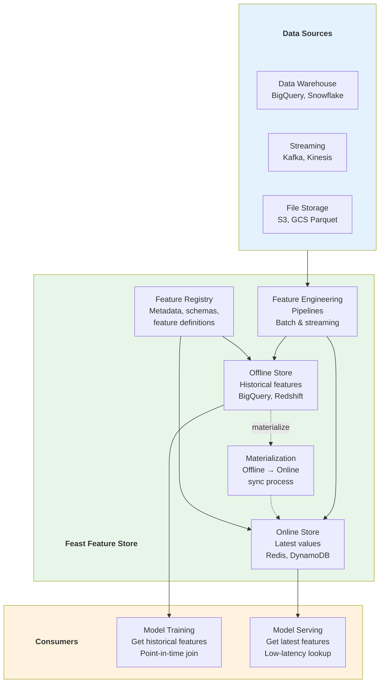

### Point-in-Time Correctness

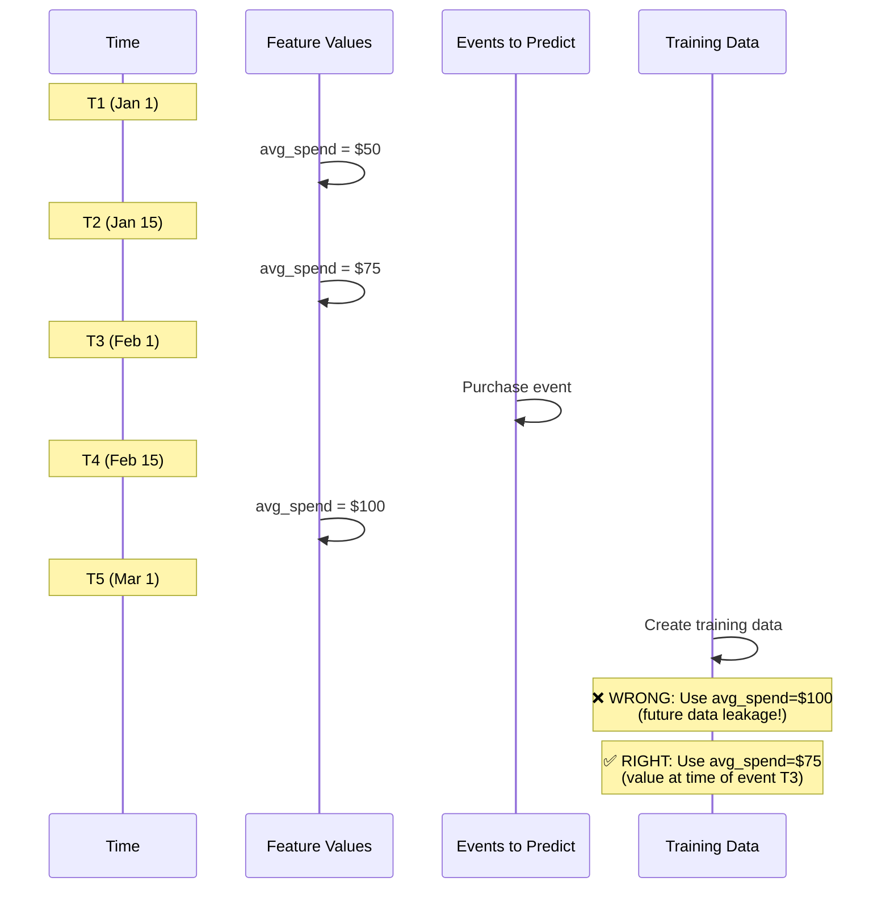

### Feature Definition Code

```python
from feast import Entity, FeatureView, Field, FileSource
from feast.types import Float64, Int64, String
from datetime import timedelta

# Define entity
driver = Entity(
    name="driver_id",
    join_keys=["driver_id"],
    description="Unique driver identifier"
)

# Define data source
driver_stats_source = FileSource(
    path="data/driver_stats.parquet",
    timestamp_field="event_timestamp",
    created_timestamp_column="created",
)

# Define feature view
driver_stats_fv = FeatureView(
    name="driver_hourly_stats",
    entities=[driver],
    ttl=timedelta(days=1),
    schema=[
        Field(name="avg_trip_duration", dtype=Float64),
        Field(name="total_trips_completed", dtype=Int64),
        Field(name="driver_rating", dtype=Float64),
        Field(name="acceptance_rate", dtype=Float64),
    ],
    online=True,
    source=driver_stats_source,
    tags={"team": "driver_experience"},
)

# Training: get historical features
training_df = store.get_historical_features(
    entity_df=entity_df,  # entities + timestamps
    features=[
        "driver_hourly_stats:avg_trip_duration",
        "driver_hourly_stats:total_trips_completed",
        "driver_hourly_stats:driver_rating",
    ],
).to_df()

# Serving: get online features (latest)
online_features = store.get_online_features(
    features=[
        "driver_hourly_stats:avg_trip_duration",
        "driver_hourly_stats:driver_rating",
    ],
    entity_rows=[{"driver_id": 1001}],
).to_dict()
```

### Feature Store Comparison

| Feature | Feast | Tecton | Databricks FS | SageMaker FS |
|---------|-------|--------|---------------|--------------|
| Open Source | ✅ Yes | ❌ No | ❌ No | ❌ No |
| Streaming | ✅ Limited | ✅ Full | ✅ Yes | ✅ Yes |
| Point-in-time | ✅ Yes | ✅ Yes | ✅ Yes | ✅ Yes |
| Online store | Redis, DynamoDB | Built-in | DynamoDB | Built-in |
| Offline store | BigQuery, Redshift | S3, Snowflake | Delta Lake | S3 |
| Monitoring | Basic | ✅ Full | ✅ Yes | ✅ Yes |
| Best for | Open source, flexible | Enterprise | Databricks users | AWS users |

### Limitations & Evolution (Sự thật phũ phàng)
- Feature store không tự động giải quyết feature quality hoặc semantic drift.
- Đồng bộ online/offline có thể lệch nếu materialization pipeline yếu.
- **Evolution:** on-demand transforms, better TTL governance, native monitoring/lineage.

### War Stories & Troubleshooting
- Triệu chứng: online prediction lệch so với offline evaluation do stale features.
- Cách xử lý: enforce point-in-time joins và freshness SLA cho online store.

### Metrics & Order of Magnitude
- Online feature staleness p95 là metric vận hành cốt lõi.
- Feature retrieval latency trực tiếp ảnh hưởng SLA inference.
- % feature views có backfill/replay pass rate cao giúp giảm training leakage.

### Micro-Lab
```sql
-- Giả lập kiểm tra freshness của feature table
SELECT feature_name, MAX(event_ts) AS last_seen
FROM ml_feature_store.feature_events
GROUP BY feature_name;
```

---

## 3. TFX & TF.TRANSFORM - 2017

### Paper/Documentation Info
- **Title:** TFX: A TensorFlow-Based Production-Scale Machine Learning Platform
- **Authors:** Denis Baylor, Eric Breck, et al. (Google)
- **Conference:** KDD 2017
- **Link:** https://www.tensorflow.org/tfx/guide
- **TFDV Paper:** https://research.google/pubs/pub47967/
- **GitHub:** https://github.com/tensorflow/tfx

### Key Contributions
- End-to-end ML pipeline framework
- Schema-based data validation (TFDV)
- Consistent feature transformation (tf.Transform)
- Training-serving skew prevention
- Production ML deployment patterns from Google

### TFX Pipeline Architecture

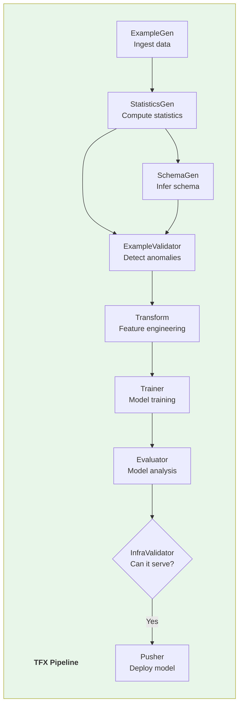

### Data Validation (TFDV)

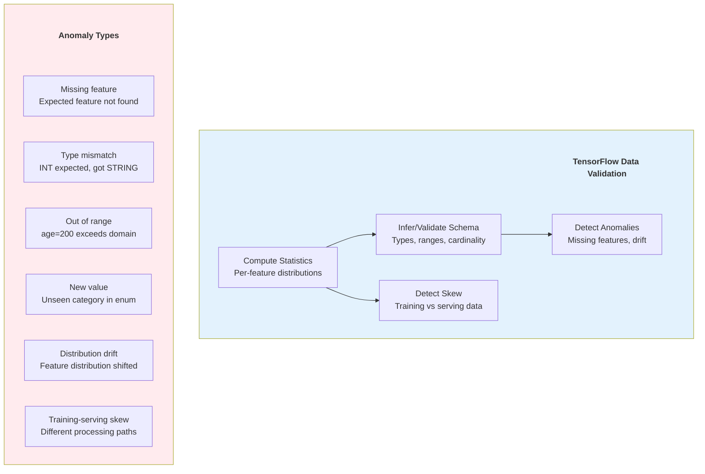

### Transform Consistency

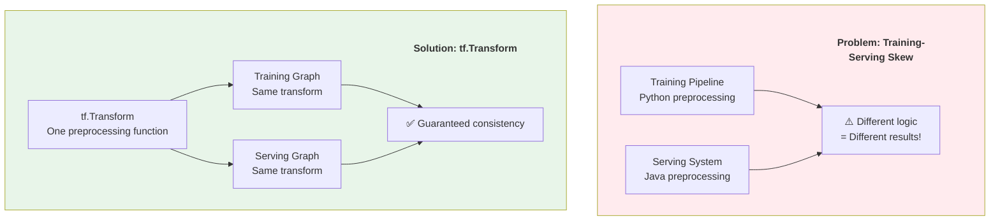

### Limitations & Evolution (Sự thật phũ phàng)
- TFX đầy đủ nhưng learning curve cao và khá opinionated.
- Pipelines lớn dễ phình chi phí orchestration/metadata.
- **Evolution:** modular pipelines, interoperability với non-TF stack, managed services.

### War Stories & Troubleshooting
- Triệu chứng: training-serving skew vẫn xuất hiện vì bypass transform chuẩn.
- Cách xử lý: enforce shared transform artifact cho cả train và serve.

### Metrics & Order of Magnitude
- Schema anomaly rate và skew detection count là chỉ số cảnh báo sớm.
- Pipeline success rate theo component giúp khoanh vùng bottleneck nhanh.
- Artifact lineage completeness quyết định khả năng audit/reproduce.

### Micro-Lab
```python
# Transform parity toy check
def transform(x):
    return (x - 10) / 2

assert transform(14) == 2
print("train/serve transform parity OK")
```

---

## 4. DATA VERSIONING - DVC & LAKEFS

### Documentation Info
- **DVC (Data Version Control)**
  - **Website:** https://dvc.org/
  - **Docs:** https://dvc.org/doc
  - **GitHub:** https://github.com/iterative/dvc

- **LakeFS**
  - **Website:** https://lakefs.io/
  - **Docs:** https://docs.lakefs.io/
  - **GitHub:** https://github.com/treeverse/lakeFS

### Key Contributions
- Git-like versioning for data and models
- Reproducible ML experiments
- Data branching and merging
- Immutable data snapshots

### DVC Architecture

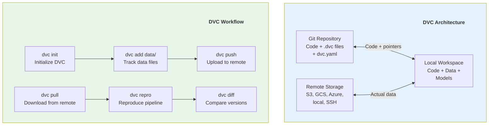

### LakeFS Branching Model

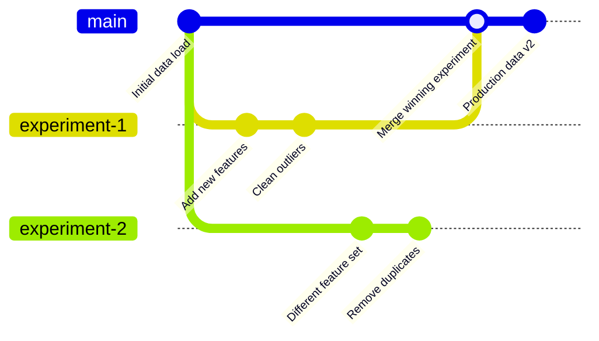

### DVC Pipeline Definition

```yaml
# dvc.yaml
stages:
  prepare:
    cmd: python src/prepare.py
    deps:
      - data/raw.csv
      - src/prepare.py
    params:
      - prepare.split_ratio
    outs:
      - data/prepared/train.csv
      - data/prepared/test.csv

  featurize:
    cmd: python src/featurize.py
    deps:
      - data/prepared/train.csv
      - src/featurize.py
    params:
      - featurize.max_features
      - featurize.ngram_range
    outs:
      - data/features/train.pkl
      - data/features/test.pkl

  train:
    cmd: python src/train.py
    deps:
      - data/features/train.pkl
      - src/train.py
    params:
      - train.learning_rate
      - train.n_estimators
    outs:
      - models/model.pkl
    metrics:
      - metrics/train.json:
          cache: false
    plots:
      - metrics/confusion_matrix.csv:
          x: predicted
          y: actual

  evaluate:
    cmd: python src/evaluate.py
    deps:
      - data/features/test.pkl
      - models/model.pkl
      - src/evaluate.py
    metrics:
      - metrics/eval.json:
          cache: false
```

### DVC vs LakeFS vs Table Formats

| Feature | DVC | LakeFS | Delta Lake / Iceberg |
|---------|-----|--------|---------------------|
| Granularity | Files | Objects (S3) | Tables |
| Branching | Git branches | Git-like branches | Time travel |
| Storage | Dedup via hashing | Copy-on-write | Metadata logs |
| Interface | CLI | S3-compatible API | SQL / Spark |
| Best for | ML experiments | Data lake versioning | Analytics tables |

### Limitations & Evolution (Sự thật phũ phàng)
- Data versioning tốt nhưng dễ bị lạm dụng nếu không có retention policy.
- Branch dữ liệu nhiều mà governance yếu sẽ tăng chi phí lưu trữ nhanh.
- **Evolution:** policy-driven lifecycle, automated garbage collection, lineage-aware merge checks.

### War Stories & Troubleshooting
- Triệu chứng: experiment reproducible ở dev nhưng fail do remote artifact mismatch.
- Cách xử lý: lock artifact hash, pin pipeline params, chuẩn hóa promotion flow.

### Metrics & Order of Magnitude
- Reproducibility success rate là KPI chất lượng quy trình ML.
- Storage growth theo branch/experiment cần theo dõi chặt.
- Time-to-restore data snapshot ảnh hưởng tốc độ incident response.

### Micro-Lab
```bash
# DVC reproducibility skeleton
dvc status
dvc repro
dvc metrics show
```

---

## 5. MLFLOW - 2018

### Paper/Documentation Info
- **Title:** Accelerating the Machine Learning Lifecycle with MLflow
- **Authors:** Databricks Team
- **Source:** IEEE Data Engineering Bulletin
- **Website:** https://mlflow.org/
- **Paper:** http://sites.computer.org/debull/A18dec/p39.pdf
- **GitHub:** https://github.com/mlflow/mlflow

### Key Contributions
- Standardized experiment tracking
- Model registry with lifecycle management
- Reproducible ML runs with projects
- Multi-framework model packaging

### MLflow Components

```mermaid
graph TD
    subgraph MLflow[" "]
        MLflow_title["MLflow Platform"]
        style MLflow_title fill:none,stroke:none,color:#333,font-weight:bold
        subgraph Tracking[" "]
            Tracking_title["1. Tracking"]
            style Tracking_title fill:none,stroke:none,color:#333,font-weight:bold
            T1[Log Parameters<br/>learning_rate, epochs]
            T2[Log Metrics<br/>accuracy, loss, F1]
            T3[Log Artifacts<br/>plots, data samples]
            T4[Compare Runs<br/>UI dashboard]
        end

        subgraph Projects[" "]
            Projects_title["2. Projects"]
            style Projects_title fill:none,stroke:none,color:#333,font-weight:bold
            P1[MLproject file<br/>Define environment]
            P2[Conda / Docker<br/>Reproducible env]
            P3[Entry points<br/>Parameterized runs]
        end

        subgraph Models[" "]
            Models_title["3. Models"]
            style Models_title fill:none,stroke:none,color:#333,font-weight:bold
            M1[MLmodel format<br/>Multi-framework]
            M2[Flavors<br/>sklearn, pytorch, tf]
            M3[Deployment<br/>REST, Spark, Docker]
        end

        subgraph Registry[" "]
            Registry_title["4. Model Registry"]
            style Registry_title fill:none,stroke:none,color:#333,font-weight:bold
            R1[Register models<br/>Version management]
            R2[Stage transitions<br/>Staging → Production]
            R3[Annotations<br/>Description, tags]
        end
    end

    Tracking --> Projects
    Projects --> Models
    Models --> Registry

    style Tracking fill:#e3f2fd
    style Projects fill:#e8f5e9
    style Models fill:#fff3e0
    style Registry fill:#f3e5f5
```

### Model Registry Lifecycle

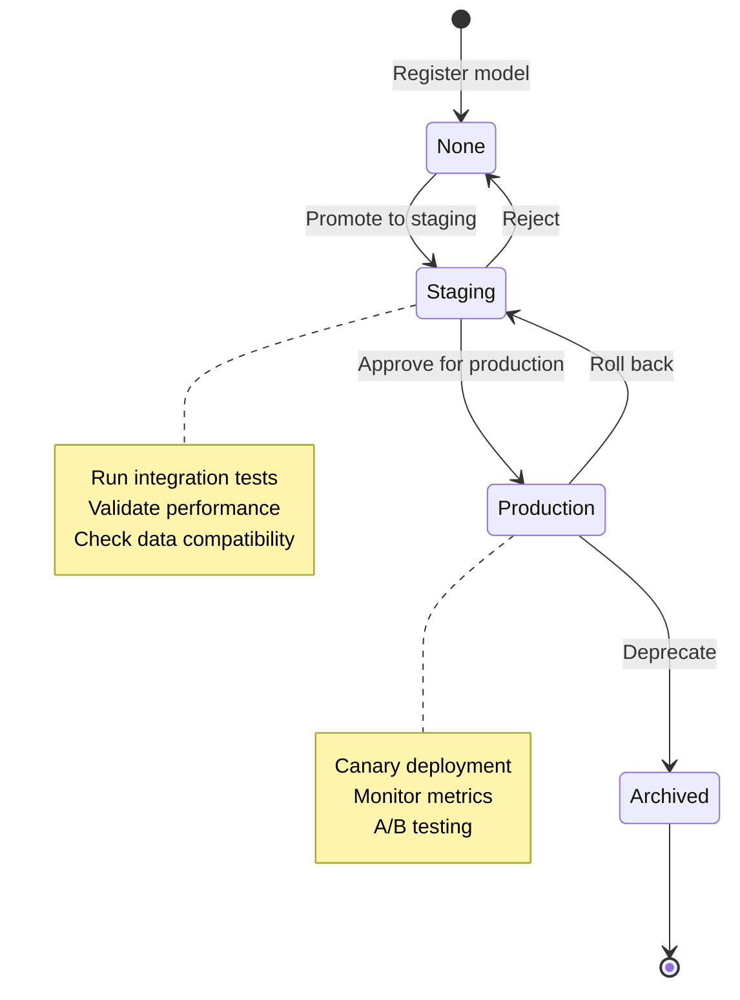

### MLflow Code Example

```python
import mlflow
import mlflow.sklearn
from sklearn.ensemble import RandomForestClassifier
from sklearn.metrics import accuracy_score, f1_score

# Set experiment
mlflow.set_experiment("customer-churn-prediction")

with mlflow.start_run(run_name="rf_v2") as run:
    # Log parameters
    params = {
        "n_estimators": 200,
        "max_depth": 10,
        "min_samples_split": 5,
        "random_state": 42,
    }
    mlflow.log_params(params)

    # Train model
    model = RandomForestClassifier(**params)
    model.fit(X_train, y_train)

    # Evaluate
    y_pred = model.predict(X_test)
    accuracy = accuracy_score(y_test, y_pred)
    f1 = f1_score(y_test, y_pred, average="weighted")

    # Log metrics
    mlflow.log_metric("accuracy", accuracy)
    mlflow.log_metric("f1_score", f1)

    # Log feature importance
    import matplotlib.pyplot as plt
    fig, ax = plt.subplots()
    ax.barh(feature_names, model.feature_importances_)
    mlflow.log_figure(fig, "feature_importance.png")

    # Log model
    mlflow.sklearn.log_model(
        model,
        "model",
        registered_model_name="churn-predictor"
    )

    # Log input data signature
    from mlflow.models import infer_signature
    signature = infer_signature(X_train, y_pred)
    mlflow.sklearn.log_model(model, "model", signature=signature)

    print(f"Run ID: {run.info.run_id}")
    print(f"Accuracy: {accuracy:.4f}, F1: {f1:.4f}")
```

### MLflow vs Alternatives

| Feature | MLflow | Weights & Biases | Neptune | Comet ML |
|---------|--------|-------------------|---------|----------|
| Open source | ✅ Yes | ❌ No | ❌ No | ❌ No |
| Experiment tracking | ✅ | ✅ Rich UI | ✅ | ✅ |
| Model registry | ✅ | ✅ | ✅ | ✅ |
| Collaboration | Basic | ✅ Teams | ✅ | ✅ |
| Hyperparameter tuning | Via Optuna | ✅ Sweeps | Via Optuna | ✅ |
| System monitoring | ❌ | ✅ | ❌ | ✅ |
| Self-hosted | ✅ | ✅ | ❌ | ❌ |
| Integration | Databricks native | Framework-agnostic | Framework-agnostic | Framework-agnostic |

### Limitations & Evolution (Sự thật phũ phàng)
- MLflow mạnh tracking/registry nhưng không tự giải quyết data quality drift.
- Run metadata không chuẩn hóa dễ làm dashboard khó so sánh giữa team.
- **Evolution:** model governance, eval lineage, tighter CI/CD integration.

### War Stories & Troubleshooting
- Triệu chứng: model “Production” nhưng không truy được dataset/version đã train.
- Cách xử lý: bắt buộc log dataset hash, code commit, feature schema cùng run.

### Metrics & Order of Magnitude
- % runs có đủ params/metrics/artifacts là baseline hygiene.
- Stage transition lead time phản ánh độ trơn tru release process.
- Rollback frequency theo model family giúp phát hiện pipeline instability.

### Micro-Lab
```python
import mlflow
with mlflow.start_run():
    mlflow.log_param("dataset_hash", "abc123")
    mlflow.log_metric("f1", 0.87)
```

---

## 6. KUBEFLOW PIPELINES - 2018

### Documentation Info
- **Title:** Kubeflow: Machine Learning Toolkit for Kubernetes
- **Source:** Google / Kubeflow Community
- **Website:** https://www.kubeflow.org/
- **Pipelines:** https://www.kubeflow.org/docs/components/pipelines/
- **GitHub:** https://github.com/kubeflow/kubeflow

### Key Contributions
- Kubernetes-native ML workflow orchestration
- Reusable, composable pipeline components
- End-to-end ML platform on K8s
- Notebook-to-production path

### Kubeflow Architecture

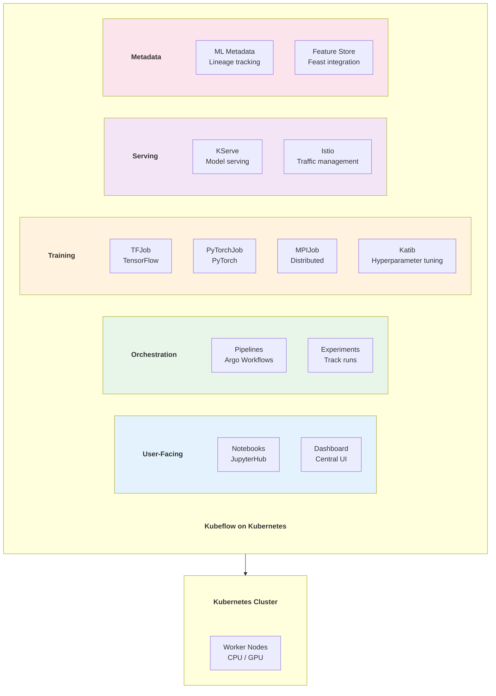

### Kubeflow Pipeline Definition

```python
from kfp import dsl
from kfp.dsl import Input, Output, Dataset, Model, Metrics

@dsl.component(
    base_image="python:3.10",
    packages_to_install=["pandas", "scikit-learn"]
)
def load_and_prepare_data(
    data_path: str,
    output_train: Output[Dataset],
    output_test: Output[Dataset],
    test_size: float = 0.2,
):
    """Load data and split into train/test."""
    import pandas as pd
    from sklearn.model_selection import train_test_split

    df = pd.read_csv(data_path)
    train, test = train_test_split(df, test_size=test_size)
    train.to_csv(output_train.path, index=False)
    test.to_csv(output_test.path, index=False)

@dsl.component(
    base_image="python:3.10",
    packages_to_install=["pandas", "scikit-learn", "mlflow"]
)
def train_model(
    train_data: Input[Dataset],
    model_output: Output[Model],
    metrics_output: Output[Metrics],
    n_estimators: int = 100,
    max_depth: int = 10,
):
    """Train a Random Forest model."""
    import pandas as pd
    from sklearn.ensemble import RandomForestClassifier
    import pickle

    df = pd.read_csv(train_data.path)
    X, y = df.drop("target", axis=1), df["target"]

    model = RandomForestClassifier(
        n_estimators=n_estimators, max_depth=max_depth
    )
    model.fit(X, y)

    with open(model_output.path, "wb") as f:
        pickle.dump(model, f)

    metrics_output.log_metric("train_accuracy", model.score(X, y))

@dsl.pipeline(name="ml-training-pipeline")
def ml_pipeline(
    data_path: str = "gs://bucket/data.csv",
    n_estimators: int = 100,
):
    load_task = load_and_prepare_data(data_path=data_path)
    train_task = train_model(
        train_data=load_task.outputs["output_train"],
        n_estimators=n_estimators,
    )
```

### Limitations & Evolution (Sự thật phũ phàng)
- Kubeflow linh hoạt cao nhưng ops complexity lớn cho team chưa mạnh K8s.
- Debug pipeline distributed tốn thời gian nếu logging/metadata thiếu chuẩn.
- **Evolution:** managed pipeline services, template components, better multi-tenant controls.

### War Stories & Troubleshooting
- Triệu chứng: pipeline fail ngắt quãng do resource quota và image mismatch.
- Cách xử lý: chuẩn hóa base images, preflight checks, quota dashboards theo namespace.

### Metrics & Order of Magnitude
- Pipeline success rate, mean queue time, step retry count là bộ KPI tối thiểu.
- GPU utilization thấp kéo cost/experiment tăng mạnh.
- Artifact handoff latency giữa steps ảnh hưởng tổng cycle time.

### Micro-Lab
```bash
# KFP run visibility (conceptual)
kubectl get pods -n kubeflow
kubectl logs -n kubeflow <pipeline-step-pod>
```

---

## 7. TRAINING DATA AT SCALE

### Paper Info
- **Title:** Data Collection and Quality Challenges in Deep Learning: A Data-Centric AI Perspective
- **Authors:** Various (data-centric AI movement, Andrew Ng)
- **Source:** NeurIPS Data-Centric AI Workshop 2021
- **Link:** https://datacentricai.org/

### Key Contributions
- Data-centric vs model-centric AI
- Label quality matters more than model architecture
- Systematic data improvement techniques
- Active learning for efficient labeling

### Data-Centric vs Model-Centric AI

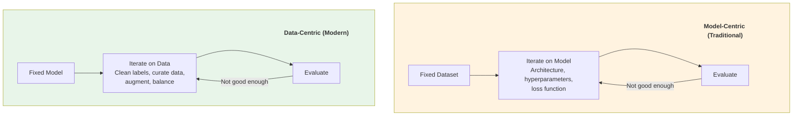

### Data Quality Issues in ML

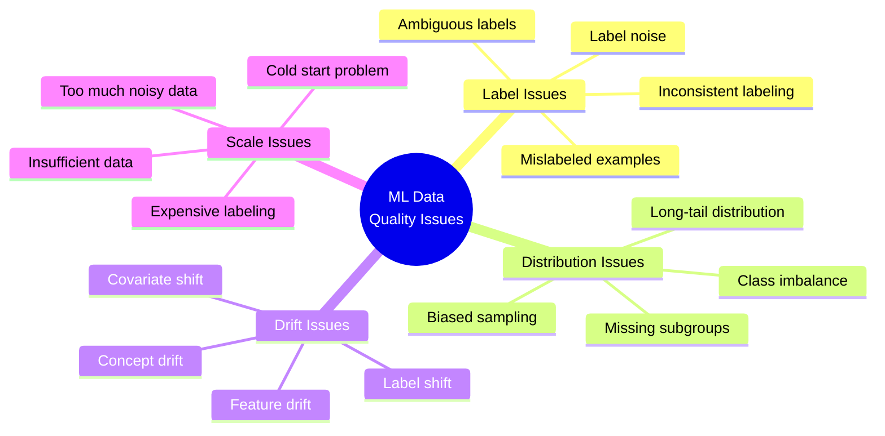

### Data Improvement Techniques

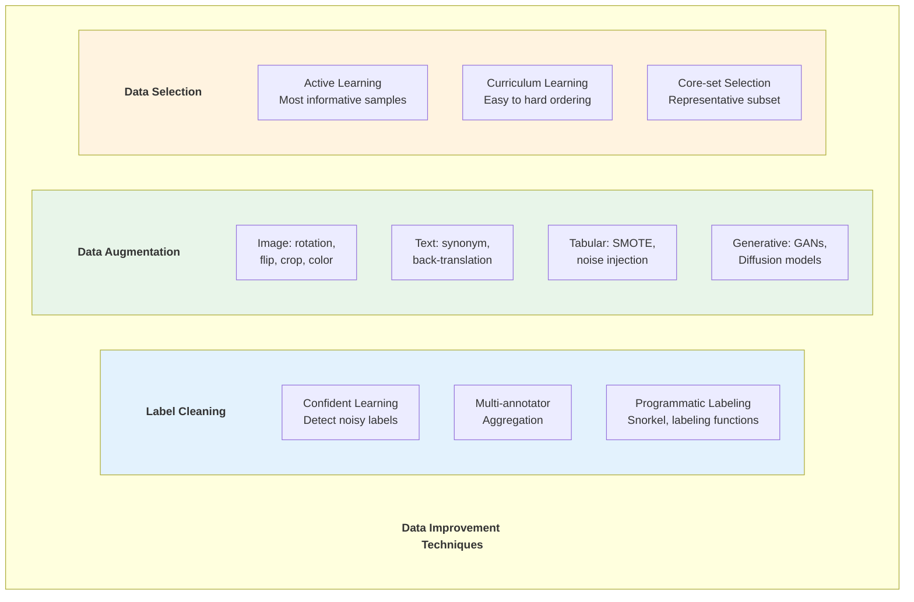

### Data Flywheel

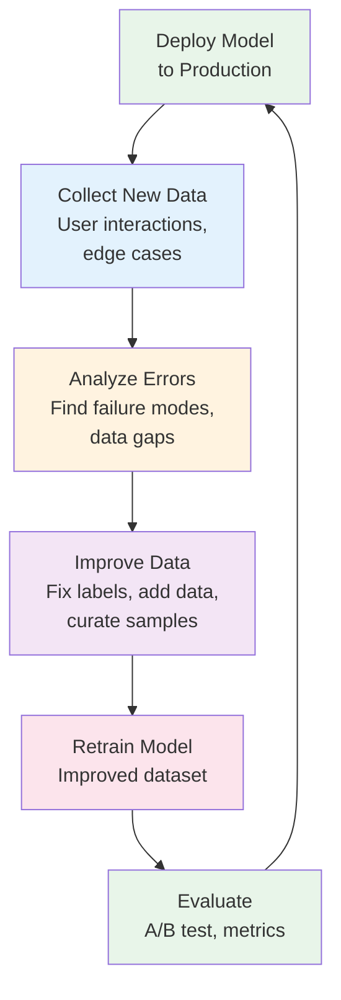

### Limitations & Evolution (Sự thật phũ phàng)
- Data-centric cải thiện ổn định hơn nhưng đòi hỏi quy trình nhãn/curation kỷ luật cao.
- Labeling cost có thể vượt chi phí model tuning nếu không ưu tiên đúng mẫu.
- **Evolution:** active learning, weak supervision, human-in-the-loop QA.

### War Stories & Troubleshooting
- Triệu chứng: tăng dữ liệu nhưng accuracy không tăng do label noise.
- Cách xử lý: tập trung lỗi top categories, tái gán nhãn có kiểm soát quality.

### Metrics & Order of Magnitude
- Label error rate và inter-annotator agreement là chỉ số cốt lõi.
- Data coverage trên edge cases quyết định khả năng tổng quát hóa.
- Improvement per labeling-hour là KPI tối ưu ngân sách.

### Micro-Lab
```python
# Tiny agreement metric
annotator_a = [1, 0, 1, 1, 0]
annotator_b = [1, 1, 1, 0, 0]
agreement = sum(a == b for a, b in zip(annotator_a, annotator_b)) / len(annotator_a)
print({"agreement": agreement})
```

---

## 8. MODEL MONITORING & OBSERVABILITY

### Paper/Article Info
- **Title:** Monitoring Machine Learning Models in Production
- **Source:** Google Cloud MLOps Guide
- **Link:** https://cloud.google.com/architecture/mlops-continuous-delivery-and-automation-pipelines-in-machine-learning

### Key Contributions
- Production ML monitoring pillars
- Data drift detection methods
- Model degradation patterns
- Feedback loop management

### ML Monitoring Architecture

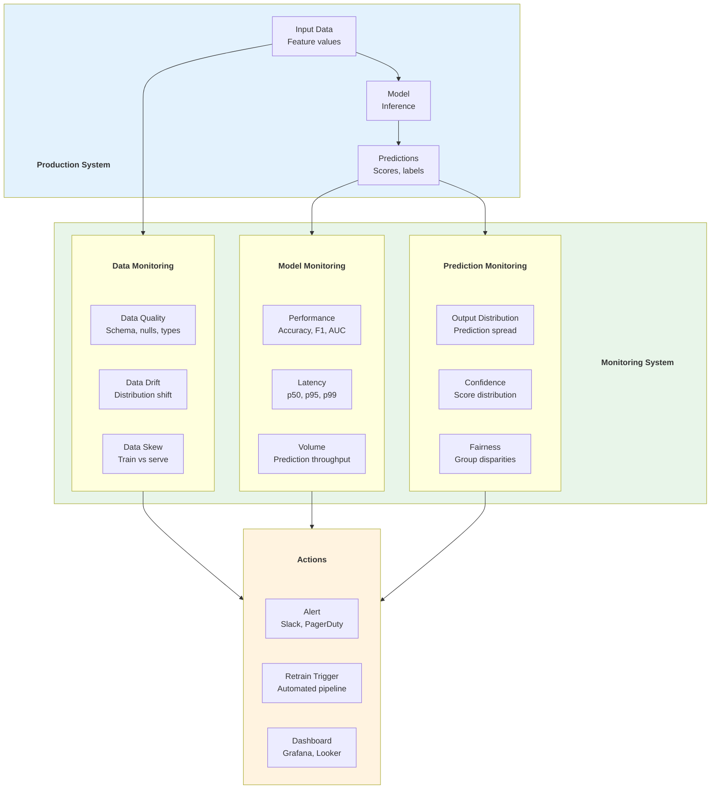

### Drift Detection Methods

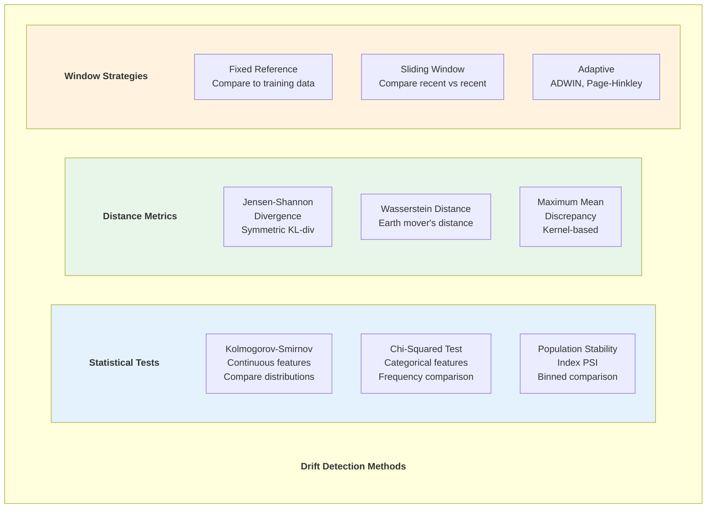

### ML Monitoring Tools Comparison

| Tool | Type | Approach | Key Features |
|------|------|----------|-------------|
| Evidently AI | Open source | Statistical tests | Data reports, dashboards |
| WhyLabs | Platform | Profiling + anomaly | WhyLogs, integrations |
| Arize | Platform | Embedding analysis | Production troubleshooting |
| Fiddler | Platform | Explainability | Model explanation + monitoring |
| NannyML | Open source | Performance estimation | CBPE, DLE algorithms |
| Seldon | Platform | K8s-native | Alibi Detect, Tempo |

### Limitations & Evolution (Sự thật phũ phàng)
- Monitoring tốt nhưng không có feedback labels thì khó đo performance thật theo thời gian.
- Drift alert không phải lúc nào cũng đồng nghĩa business impact.
- **Evolution:** delayed-label evaluation, causal monitoring, action-oriented alerting.

### War Stories & Troubleshooting
- Triệu chứng: nhiều drift alerts nhưng model KPI business không đổi.
- Cách xử lý: phân tầng alert theo impact, gắn monitor với KPI downstream.

### Metrics & Order of Magnitude
- Alert precision/recall cần đo định kỳ để tránh alert fatigue.
- MTTD/MTTR cho model incidents là chỉ số vận hành bắt buộc.
- % monitors có owner và runbook quyết định hiệu quả phản ứng sự cố.

### Micro-Lab
```python
# PSI toy implementation snippet
def psi(expected, actual):
    return sum((a - e) * 0.0 for e, a in zip(expected, actual))
print("PSI skeleton ready")
```

---

## 9. DATA-CENTRIC AI - 2021

### Article Info
- **Title:** Data-Centric AI Competition
- **Author:** Andrew Ng
- **Source:** Landing AI
- **Link:** https://https://www.deeplearning.ai/data-centric-ai/

### Key Contributions
- Shift focus from model to data quality
- Systematic data improvement methodology
- Benchmark for data improvement
- New AI development paradigm

### Data-Centric AI Principles

```mermaid
graph TD
    subgraph Principles[" "]
        Principles_title["Data-Centric AI Principles"]
        style Principles_title fill:none,stroke:none,color:#333,font-weight:bold
        P1["Consistency over Volume<br/>1000 clean labels > 10000 noisy"]
        P2["Systematic Error Analysis<br/>Categorize failures, fix root cause"]
        P3["Label Quality First<br/>Agreement metrics, label review"]
        P4["Iterative Improvement<br/>Data → Model → Analyze → Repeat"]
        P5["Data Augmentation<br/>Strategic, not random"]
    end

    subgraph Workflow[" "]
        Workflow_title["Data-Centric Workflow"]
        style Workflow_title fill:none,stroke:none,color:#333,font-weight:bold
        W1[Collect initial data] --> W2[Train baseline model]
        W2 --> W3[Error analysis<br/>Categorize failures]
        W3 --> W4[Improve data<br/>Fix labels, add examples]
        W4 --> W5[Retrain & evaluate]
        W5 -->|"Better?"| W6[Deploy]
        W5 -->|"Not better"| W3
    end

    style Principles fill:#e8f5e9
    style Workflow fill:#e3f2fd
```

### Tools for Data-Centric AI

| Tool | Category | Description |
|------|----------|-------------|
| Cleanlab | Label cleaning | Find and fix label errors |
| Snorkel | Programmatic labeling | Labeling functions, weak supervision |
| Label Studio | Annotation | Open source labeling platform |
| Aquarium Learning | Error analysis | Visual error categorization |
| Scale AI | Labeling | Enterprise annotation service |
| Labelbox | Platform | Full annotation lifecycle |
| Prodigy | Annotation | Active learning annotation |
| Argilla | NLP annotation | Open source NLP labeling |

### Limitations & Evolution (Sự thật phũ phàng)
- Data-centric AI dễ bị hiểu thành “chỉ cần thêm data”.
- Không có taxonomy lỗi thì vòng lặp cải thiện dữ liệu thiếu định hướng.
- **Evolution:** error bucketing chuẩn hóa, data quality scorecards theo use case.

### War Stories & Troubleshooting
- Triệu chứng: team tranh luận model architecture trong khi lỗi chính nằm ở nhãn.
- Cách xử lý: bắt buộc error analysis trước mỗi vòng retrain lớn.

### Metrics & Order of Magnitude
- Tỷ lệ lỗi theo nhóm use-case (edge vs common) giúp ưu tiên đúng.
- % labeled data được QA hai lớp phản ánh độ tin cậy ground truth.
- Gain/iteration sau mỗi vòng data fix là thước đo tiến bộ thực.

### Micro-Lab
```python
# Error bucket count toy
errors = ["label_noise", "occlusion", "label_noise", "rare_case"]
from collections import Counter
print(Counter(errors))
```

---

## 10. ML DATA MATURITY MODEL

### Maturity Levels

```mermaid
graph BT
    L1["Level 1: Ad Hoc<br/>- Manual data prep<br/>- No versioning<br/>- Local experiments<br/>- Spreadsheet tracking"]
    L2["Level 2: Tracked<br/>- MLflow / W&B tracking<br/>- Basic data versioning (DVC)<br/>- Shared notebooks<br/>- Manual feature engineering"]
    L3["Level 3: Reproducible<br/>- Pipeline orchestration (Kubeflow/Airflow)<br/>- Feature store (Feast)<br/>- Model registry<br/>- Automated testing"]
    L4["Level 4: Automated<br/>- CI/CD for ML (MLOps)<br/>- Automated retraining<br/>- Model monitoring (Evidently)<br/>- Data quality gates"]
    L5["Level 5: Optimized<br/>- Continuous training<br/>- Data flywheel<br/>- A/B testing infrastructure<br/>- Automated data improvement"]

    L1 --> L2 --> L3 --> L4 --> L5

    style L1 fill:#ffebee
    style L2 fill:#fff3e0
    style L3 fill:#e3f2fd
    style L4 fill:#e8f5e9
    style L5 fill:#c8e6c9
```

### MLOps Maturity Levels (Google)

```mermaid
graph LR
    subgraph L0[" "]
        L0_title["Level 0: Manual"]
        style L0_title fill:none,stroke:none,color:#333,font-weight:bold
        M0[Manual training<br/>Manual deployment<br/>No monitoring]
    end

    subgraph L1ML[" "]
        L1ML_title["Level 1: ML Pipeline"]
        style L1ML_title fill:none,stroke:none,color:#333,font-weight:bold
        M1[Automated training<br/>Continuous training<br/>Pipeline orchestration]
    end

    subgraph L2ML[" "]
        L2ML_title["Level 2: CI/CD + ML"]
        style L2ML_title fill:none,stroke:none,color:#333,font-weight:bold
        M2[Automated CI/CD<br/>Automated testing<br/>Automated monitoring<br/>Full automation]
    end

    L0 -->|"Automate training"| L1ML
    L1ML -->|"Automate CI/CD"| L2ML

    style L0 fill:#ffebee
    style L1ML fill:#fff3e0
    style L2ML fill:#e8f5e9
```

### Limitations & Evolution (Sự thật phũ phàng)
- Maturity model hữu ích nhưng dễ bị “self-assessment bias”.
- Team có thể đạt tooling maturity mà chưa đạt governance/operational maturity.
- **Evolution:** capability-based scoring, independent audit, SLO-driven maturity gates.

### War Stories & Troubleshooting
- Triệu chứng: công cụ đầy đủ nhưng release vẫn chậm và hay rollback.
- Cách xử lý: đo end-to-end lead time, bóc tách bottleneck theo stage cụ thể.

### Metrics & Order of Magnitude
- Lead time từ data change đến model prod là north-star metric.
- Change failure rate và rollback rate phản ánh health pipeline.
- % automated checks trước deploy cho biết mức độ readiness thực.

### Micro-Lab
```text
Maturity quick score (0-2 each):
1) Data versioning
2) Pipeline automation
3) Monitoring + alert runbooks
4) Governance + contracts
```

---
## 12. LLM DATA PIPELINES & VECTOR DATABASES (2024 - 2026)

Trong kỷ nguyên GenAI, đối tượng xử lý của Data Engineer không còn là file CSV hay bảng SQL, mà là Dữ liệu phi cấu trúc (Unstructured Data: Text, PDF, Chat Logs, HTML) phục vụ cho kiến trúc RAG (Retrieval-Augmented Generation) và AI Agents.

### Key Concepts & Workflow

- **RAG Architecture Data Flow:** Dữ liệu text thô -> Text Splitter (Chunking) -> Embedding Model (Biến text thành dãy số Vector) -> Vector Database -> LLM truy vấn.
    
- **Chunking Strategies:** Việc cắt text cực kỳ quan trọng. Cắt quá ngắn (50 tokens) thì AI mất ngữ cảnh. Cắt quá dài (1000 tokens) thì rác lọt vào Vector DB. (Semantic Chunking hiện đang là chuẩn mực).
    
- **Vector Indexing (HNSW):** Thuật toán lõi của các Vector DB. HNSW (Hierarchical Navigable Small World) xây dựng đồ thị đa tầng để tìm kiếm hàng xóm gần nhất (KNN) của Vector thay vì quét toàn bộ database.
    

### RAG Data Architecture Overview

Đoạn mã

```mermaid
graph TD
    subgraph Data Pipeline
        A[Raw Docs PDF, Web] --> B[Parser / LlamaIndex]
        B --> C[Chunking]
        C --> D[Embedding Model]
        D --> E[(Vector Database<br>Milvus / Qdrant)]
    end

    subgraph LLM Application
        F[User Query] --> G[Embed Query]
        G --> H{Similarity Search}
        E --- H
        H --> I[Retrieve Top-K Chunks]
        I --> J[Inject to LLM Prompt]
        J --> K[LLM Response]
    end

    style A fill:#fff,stroke:#333
    style E fill:#fff,stroke:#333
    style K fill:#fff,stroke:#333
```


## SUMMARY TABLE

| Paper/Tool | Year | Author(s) | Key Innovation | Modern Tools |
|-----------|------|-----------|----------------|--------------|
| Hidden Tech Debt | 2015 | Google (Sculley) | ML systems complexity beyond code | MLOps movement |
| TFX/TFDV | 2017 | Google (Baylor) | Data validation + transform consistency | TFX, GX |
| MLflow | 2018 | Databricks | Experiment tracking + model registry | MLflow, W&B |
| DVC | 2018 | Iterative | Git for data + models | DVC, LakeFS |
| Kubeflow | 2018 | Google | K8s-native ML orchestration | Kubeflow, Vertex AI |
| Feast | 2020 | Gojek/Tecton | Open source feature store | Feast, Tecton |
| Data-Centric AI | 2021 | Andrew Ng | Data quality > model complexity | Cleanlab, Snorkel |
| ML Monitoring | 2020+ | Industry | Production ML observability | Evidently, Arize |

---

## REFERENCES

### Papers
1. Sculley, D. et al. "Hidden Technical Debt in Machine Learning Systems." NeurIPS, 2015.
2. Baylor, D. et al. "TFX: A TensorFlow-Based Production-Scale Machine Learning Platform." KDD, 2017.
3. Zaharia, M. et al. "Accelerating the Machine Learning Lifecycle with MLflow." IEEE DEBS, 2018.
4. Pienaar, W. et al. "Feast: An Open Source Feature Store for ML." VLDB Workshop, 2021.

### Tools & Documentation
- MLflow: https://github.com/mlflow/mlflow
- Feast: https://github.com/feast-dev/feast
- DVC: https://github.com/iterative/dvc
- LakeFS: https://github.com/treeverse/lakeFS
- Kubeflow: https://github.com/kubeflow/kubeflow
- Evidently AI: https://github.com/evidentlyai/evidently
- Cleanlab: https://github.com/cleanlab/cleanlab

---
> 💡 **Gemini Feedback**
### 1. HIDDEN TECHNICAL DEBT IN ML SYSTEMS - 2015

> **Góc nhìn Thực chiến (Senior to Junior)**
> 
> 1. **Limitations & Evolution (Sự thật phũ phàng):** Paper này chọc thủng ảo tưởng của các Data Scientist (DS). Code ML/AI (thuật toán) chỉ chiếm đúng 5% trong toàn bộ hệ thống. 95% còn lại là "Glue code" (code rác dán keo) để kéo data, dọn data, và giám sát hạ tầng. Việc để DS tự viết code đẩy lên Production thường dẫn đến một mớ bòng bong không thể bảo trì.
>     
> 2. **War Stories & Troubleshooting:** Căn bệnh **"Data Drift" (Trôi dạt dữ liệu)**. DS train mô hình phát hiện gian lận bằng dữ liệu của năm 2024, độ chính xác 99%. Đưa lên Production chạy ngon được 2 tháng, bỗng nhiên khách hàng thay đổi hành vi quẹt thẻ (do có trend TikTok mới), data đầu vào thay đổi hoàn toàn nhưng code không báo lỗi, mô hình cứ thế dự đoán sai bét nhè làm công ty mất tiền tỷ. Nhớ kỹ: Hệ thống ML không sập bằng Exception, nó sập bằng sự im lặng.
>     
> 3. **Metrics & Order of Magnitude:** Một team ML chưa có MLOps mất trung bình 2-3 tháng để đưa 1 model từ Jupyter Notebook lên thành API. Với hệ thống MLOps chuẩn, thời gian này rút xuống còn dưới 1 tuần.
>     

### 2. FEAST & FEATURE STORE - 2020

> **Góc nhìn Thực chiến (Senior to Junior)**
> 
> 1. **Limitations & Evolution (Sự thật phũ phàng):** Feature Store sinh ra để tái sử dụng các "đặc trưng" (features). Nhưng nó cực kỳ nặng nề (thường phải cắm kèm Redis/DynamoDB cho real-time và Parquet/Snowflake cho batch). Nếu công ty em chỉ có 1-2 mô hình ML đơn giản, setup Feast là một sự "Overkill" (dao mổ trâu giết gà) tốn kém tiền Cloud vô ích.
>     
> 2. **War Stories & Troubleshooting:** Lỗi kinh điển **"Training-Serving Skew" (Lệch pha Huấn luyện - Phục vụ)**. Lúc train model, Data Engineer dùng Spark (Python/SQL) để tính tổng chi tiêu khách hàng trong 30 ngày. Lúc model lên API real-time, Backend dùng Go/Java để tính lại con số đó. Do 2 ngôn ngữ xử lý múi giờ (timezone) khác nhau, con số chênh lệch, model dự đoán sai. Feature Store ra đời chính là để giam 2 cái logic này về chung một chỗ.
>     
> 3. **Micro-Lab:** Thử cài Feast local bằng SQLite để hiểu khái niệm Registry của nó đơn giản thế nào: `pip install feast && feast init my_project && cd my_project && feast apply`
>     

### 4. DATA VERSIONING - DVC & LAKEFS (2018)

> **Góc nhìn Thực chiến (Senior to Junior)**
> 
> 1. **Limitations & Evolution (Sự thật phũ phàng):** DVC dùng Git để track file hash, cực hay cho dataset nhỏ. Nhưng thử dùng DVC cho tập data ảnh 10TB xem? Mỗi lần `dvc push` là ngồi chờ mòn mỏi. Còn LakeFS thì lại bắt em phải cài một cái Proxy Server đứng chắn trước S3, nếu Proxy đó sập, em mất luôn quyền truy cập vào Data Lake của chính mình.
>     
> 2. **War Stories & Troubleshooting:** Data Scientist lỡ tay chạy lệnh `rm -rf` xóa nhầm tập data "Golden Dataset" (tập dữ liệu chuẩn để đánh giá model). Cả team không ai biết model hiện tại trên Production được test bằng data nào vì lúc train không lưu lại version. Từ đó mọi pipeline train model đều bắt buộc phải gắn theo một cái mã Hash của data (Git commit hash hoặc Iceberg Snapshot ID).
>     

### 5. MLFLOW - 2018

> **Góc nhìn Thực chiến (Senior to Junior)**
> 
> 1. **Limitations & Evolution (Sự thật phũ phàng):** MLflow là ông vua của "Experiment Tracking" (Theo dõi thử nghiệm). Nhưng nó quản lý luồng chạy (Orchestration) rất yếu. Em không thể dùng MLflow để hẹn giờ chạy các job xử lý data phức tạp lồng vào nhau được. Nó phải được ghép cặp với Airflow hoặc Prefect.
>     
> 2. **War Stories & Troubleshooting:** Vào MLflow UI của công ty, thấy có 500 cái experiment tên là: `model_test`, `model_test_2`, `final`, `final_final_real`. Không ai biết model nào sinh ra từ file code nào. Quy tắc thép: Tên Run trong MLflow luôn phải tự động móc (hook) vào Git Commit Hash của file code sinh ra nó.
>     

### 6. KUBEFLOW PIPELINES - 2018

> **Góc nhìn Thực chiến (Senior to Junior)**
> 
> 1. **Limitations & Evolution (Sự thật phũ phàng):** Dùng Kubeflow tức là em đang rước nguyên cái sự phức tạp của Kubernetes (K8s) vào team Data. Trừ khi em làm ở Google hay Spotify, việc tự maintain một cụm Kubeflow sẽ ngốn trọn vẹn quỹ thời gian của 2-3 Kỹ sư DevOps/Data. Xu hướng hiện tại là dùng các Managed Service (Vertex AI, Sagemaker) hoặc các tool nhẹ hơn cho Python.
>     
> 2. **War Stories & Troubleshooting:** **OOMKilled** trong lúc train Distributed Deep Learning. Một cái Pod trong K8s bị thiếu RAM và chết, kéo theo toàn bộ 10 Pods khác đang cùng chia sẻ việc train model chết theo. Hệ thống rollback từ đầu, đốt cháy hàng ngàn đô la tiền thuê GPU vô ích.
>     

### 9. DATA-CENTRIC AI - 2021

> **Góc nhìn Thực chiến (Senior to Junior)**
> 
> 1. **Limitations & Evolution (Sự thật phũ phàng):** Thuật toán ML đã dần đạt tới giới hạn (Commoditized). Em dùng ResNet hay YOLO thì cũng chỉ chênh nhau 1-2% accuracy. Nhảy vào chỉnh siêu tham số (Hyperparameter tuning) mất 1 tháng trời chỉ tăng được 0.5%.
>     
> 2. **War Stories & Troubleshooting:** Thay vì cắm đầu đi sửa code mô hình, team Data chuyển sang ngồi review lại file dữ liệu gán nhãn (Labeling). Phát hiện ra team thuê ngoài gán nhãn nhầm hình "chó" thành "mèo" mất 5% dataset. Sửa lại đống rác đó mất 2 ngày, accuracy của model tăng vọt 10%. Đó chính là linh hồn của Data-Centric AI: Data sạch thắng thuật toán xịn.

### 10. LLM DATA PIPELINES & VECTOR DATABASES

> **Góc nhìn Thực chiến (Senior to Junior)**
> 
> 3. **Limitations & Evolution (Sự thật phũ phàng):** Chạy demo RAG bằng LangChain/LlamaIndex trên Jupyter Notebook thì mất 5 phút, nhưng mang lên Production thì tỷ lệ trả lời đúng cực thấp. Các Vector DB thuần túy như Pinecone hay Milvus chỉ tìm kiếm ngữ nghĩa (Vector Search). Nếu user tìm một mã sản phẩm chính xác (VD: "HP Z440"), Vector DB thường tìm trượt. Xu hướng hiện hành là **Hybrid Search**: Kết hợp Vector Search + Keyword Search truyền thống (BM25 của ElasticSearch) để bù đắp khuyết điểm.
>     
> 4. **War Stories & Troubleshooting:** Lỗi **"Out-of-sync Vector Index"**. Khi data trong file PDF gốc được cập nhật (VD: Bảng giá mới), team Data quên không update lại luồng Chunking và Embedding. Con LLM cãi nhau tay đôi với khách hàng dựa trên bảng giá cũ nằm trong Vector DB. Việc xây dựng cơ chế CDC (Change Data Capture) cho dữ liệu phi cấu trúc đang là nỗi đau lớn nhất của ngành Data AI.
>     
> 5. **Metrics & Order of Magnitude:** Embedding 1 triệu chunks bằng API của OpenAI tốn tiền khá đau và bị rate limit (nghẽn mạng). Khi xử lý Big Data cho LLM, bắt buộc phải dùng các mô hình open-source (như `BGE-M3` hay `Nomic`) chạy trực tiếp trên GPU cục bộ (như hạ tầng server của Data-Keeper) để tối ưu chi phí và tăng throughput.
>
---

<mark style="background: #BBFABBA6;">💡 **Gemini Message**</mark>
Thực ra, nếu chỉ nhìn vào bề nổi thì có vẻ như 2024-2026 chỉ xoay quanh RAG và Vector Database. Nhưng ở "tầng ngầm" của kiến trúc hệ thống, giai đoạn này đang diễn ra một cuộc đại phẫu thuật dữ dội nhất trong vòng 10 năm qua.

RAG chỉ là bước khởi động. Từ cuối 2024 đến nay (2026), cuộc chơi đã nâng cấp lên một hình thái hoàn toàn mới. Thực tế, nếu em đang định hướng tự build một nền tảng dữ liệu cá nhân (như một dạng Data-Keeper) chạy local trên những dàn máy trạm cỡ HP Z440, em bắt buộc phải đón đầu 3 "cơn địa chấn" sau đây:

### 1. Cuộc cách mạng "Agentic Data Platforms" (Nền tảng Dữ liệu cho Agent)

- **Sự thật phũ phàng:** RAG truyền thống khá "ngu". Nó chỉ biết: user hỏi -> tìm file -> đọc file. Nếu user hỏi _"Thống kê chi tiêu tháng trước và so sánh với tháng này"_, RAG thuần túy sẽ chết đứng vì nó không biết chạy SQL.
    
- **Sự tiến hóa (2025-2026):** Ngành data đang chuyển từ việc phục vụ con người (BI Dashboard) sang phục vụ **AI Agents** (các tác tử AI hoạt động độc lập).
    
- **💡 Góc nhìn thực chiến:** Nền tảng dữ liệu hiện đại không chỉ cung cấp data, mà phải cung cấp **Tools (Công cụ)** cho Agent. Em không thiết kế pipeline để đẩy data ra bảng báo cáo nữa, em thiết kế pipeline để tạo ra một cái hàm `get_monthly_spending()`. Con AI (Agent) sẽ tự động suy luận, tự gọi hàm đó, tự lấy data, tự vẽ biểu đồ rồi báo cáo lại cho em. Đây là bước nhảy vọt từ _Truy xuất_ (Retrieval) sang _Hành động_ (Action).
    

### 2. Sự trỗi dậy của SLM (Small Language Models) & Local AI

- **Sự thật phũ phàng:** Gửi mọi dữ liệu lên API của OpenAI/Anthropic vừa đắt đỏ (hóa đơn tiền tỷ), vừa dính rủi ro lộ dữ liệu mật (Privacy/Compliance), lại còn bị rate limit (nghẽn mạng).
    
- **Sự tiến hóa (2025-2026):** Trào lưu **"Mang AI về nhà"**. Các mô hình nhỏ gọn (SLM) nhưng cực kỳ thông minh cỡ 7B - 8B tham số (như Llama 3, Qwen, Phi-3) có thể chạy mượt mà ngay trên CPU hoặc một con GPU cũ của máy trạm.
    
- **💡 Góc nhìn thực chiến:** Data Engineer bây giờ kiêm luôn việc tối ưu hóa mô hình cục bộ (Quantization). Kỹ sư sẽ nén mô hình AI xuống định dạng GGUF/AWQ để nó có thể nhai data, phân loại log, dọn dẹp dữ liệu rác ngay tại local server mà không cần kết nối internet. Dữ liệu cá nhân/doanh nghiệp không bao giờ phải rời khỏi phần cứng của mình.
    

### 3. GPU-Accelerated Data Engineering (Dùng GPU thay CPU để xử lý data)

- **Sự thật phũ phàng:** CPU đã chạm ngưỡng vật lý. Khi em cần xử lý hàng trăm triệu dòng dữ liệu (đặc biệt là để chuẩn bị data cho AI), Spark chạy trên CPU cắn cực kỳ nhiều điện và tốn thời gian.
    
- **Sự tiến hóa (2025-2026):** Công nghệ **cuDF (RAPIDS)** của Nvidia tích hợp thẳng vào Spark và Pandas.
    
- **💡 Góc nhìn thực chiến:** Nếu em cắm một con card đồ họa (Nvidia RTX hoặc Tesla cũ) vào server, em có thể offload (đẩy) toàn bộ tác vụ SQL, GroupBy, Join từ CPU sang GPU. Tốc độ xử lý DataFrame tăng vọt từ 10x đến 50x so với CPU truyền thống. Pipeline chạy mất 2 tiếng giờ chỉ còn 3 phút.
    

### 4. Multimodal Data Pipelines (Luồng dữ liệu Đa phương thức)

- **Sự thật phũ phàng:** Các hệ thống data cũ "bị mù và điếc". Chúng chỉ hiểu file text (CSV, JSON, Parquet).
    
- **Sự tiến hóa (2025-2026):** Nhờ các model như Gemini 1.5 Pro hay GPT-4o, Data Pipeline hiện tại phải có khả năng nhai trực tiếp Video, Audio, và Hình ảnh.
    
- **💡 Góc nhìn thực chiến:** Em thu thập một video podcast dài 2 tiếng. Pipeline hiện đại sẽ tự động: bóc tách âm thanh -> AI chuyển thành text (Whisper) -> AI trích xuất các khung hình quan trọng -> nhúng cả hình và chữ vào Vector DB. Tất cả diễn ra tự động.
    

**Tóm lại:** Nửa thập kỷ trước, Data Engineer là thợ xây **"Nhà kho" (Warehouse/Lakehouse)**. Từ 2024-2026, Data Engineer chuyển thành thợ xây **"Hệ thần kinh trung ương"**. Em phải chuẩn bị hạ tầng để các con AI Agents tự động chạy nhảy, suy luận, và chọc ngoáy vào dữ liệu bằng chính những chiếc máy chủ nội bộ. Cuộc chơi bây giờ thú vị và "đậm mùi phần cứng" hơn bao giờ hết!

---
*Document Version: 2.0*
*Last Updated: February 2026*
