# Query Optimization Papers

## Những Paper Nền Tảng Về Query Optimization và Execution Engine

---

## Mục Lục

1. [System R Optimizer](#1-system-r-optimizer---1979)
2. [Volcano/Cascades Optimizer](#2-volcanocascades-optimizer---1995)
3. [Apache Calcite](#3-apache-calcite---2018)
4. [Vectorized Execution](#4-vectorized-execution---2005)
5. [Compiled Query Execution](#5-compiled-query-execution---2011)
6. [ORCA - Modular Optimizer](#6-orca---modular-optimizer---2014)
7. [HyPer/Umbra - Modern OLAP](#7-hyperumbra---modern-olap---2016)
8. [Adaptive Query Execution](#8-adaptive-query-execution---2020)
9. [Summary](#summary-query-optimization-evolution)

---

## 1. SYSTEM R OPTIMIZER - 1979

### Paper Info
- **Title:** Access Path Selection in a Relational Database Management System
- **Authors:** Patricia Selinger, Morton Astrahan, et al. (IBM)
- **Conference:** ACM SIGMOD 1979
- **Link:** https://dl.acm.org/doi/10.1145/582095.582099
- **PDF:** https://courses.cs.duke.edu/compsci516/cps216/spring03/papers/selinger-etal-1979.pdf

### Key Contributions
- First cost-based query optimizer
- Dynamic programming for join ordering
- Access path selection framework
- Foundation for ALL modern query optimizers

### Query Optimization Pipeline

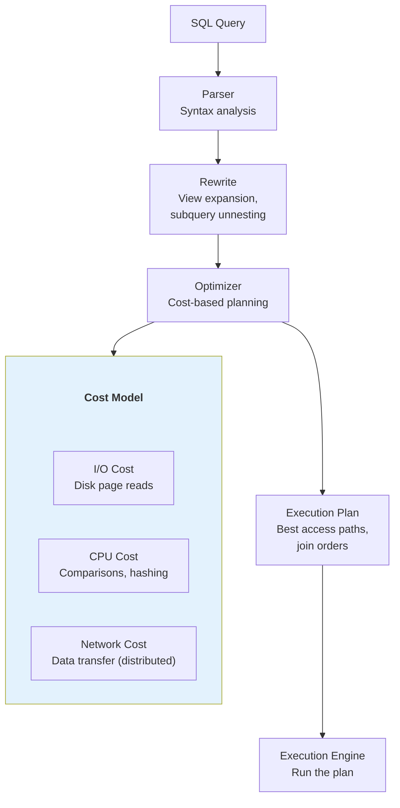

### Access Path Selection

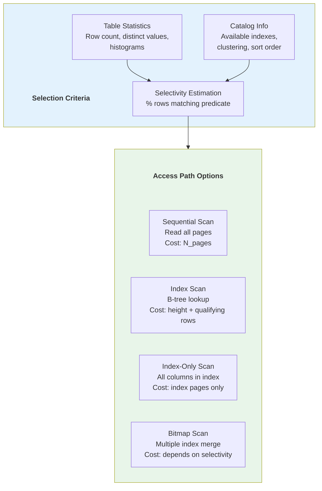

### Join Methods

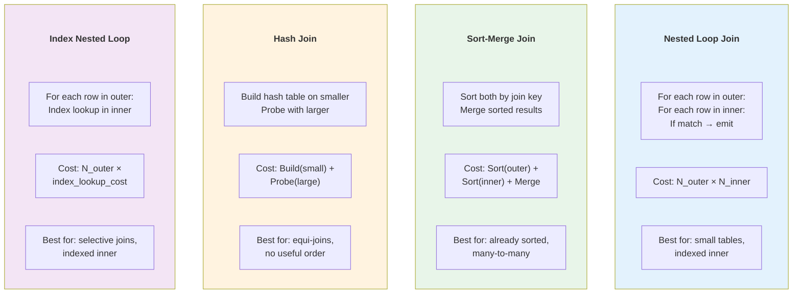

### Dynamic Programming for Join Ordering

```mermaid
graph TD
    subgraph DP[" "]
        DP_title["Dynamic Programming Approach"]
        style DP_title fill:none,stroke:none,color:#333,font-weight:bold
        subgraph Level1[" "]
            Level1_title["Level 1: Single Tables"]
            style Level1_title fill:none,stroke:none,color:#333,font-weight:bold
            A["{A}<br/>Best access path"]
            B["{B}<br/>Best access path"]
            C["{C}<br/>Best access path"]
            D["{D}<br/>Best access path"]
        end

        subgraph Level2[" "]
            Level2_title["Level 2: 2-Table Joins"]
            style Level2_title fill:none,stroke:none,color:#333,font-weight:bold
            AB["{A,B}<br/>Best join plan"]
            AC["{A,C}<br/>Best join plan"]
            BC["{B,C}<br/>Best join plan"]
            AD["{A,D}<br/>..."]
        end

        subgraph Level3[" "]
            Level3_title["Level 3: 3-Table Joins"]
            style Level3_title fill:none,stroke:none,color:#333,font-weight:bold
            ABC["{A,B,C}<br/>Best of: AB⋈C, AC⋈B, BC⋈A"]
            ABD["{A,B,D}<br/>..."]
        end

        subgraph Level4[" "]
            Level4_title["Level 4: Final"]
            style Level4_title fill:none,stroke:none,color:#333,font-weight:bold
            ABCD["{A,B,C,D}<br/>Optimal plan!"]
        end

        Level1 --> Level2 --> Level3 --> Level4
    end

    Note["Complexity: O(2^N) vs O(N!)"]

    style Level1 fill:#e3f2fd
    style Level2 fill:#e8f5e9
    style Level3 fill:#fff3e0
    style Level4 fill:#f3e5f5
```

### Selectivity Estimation

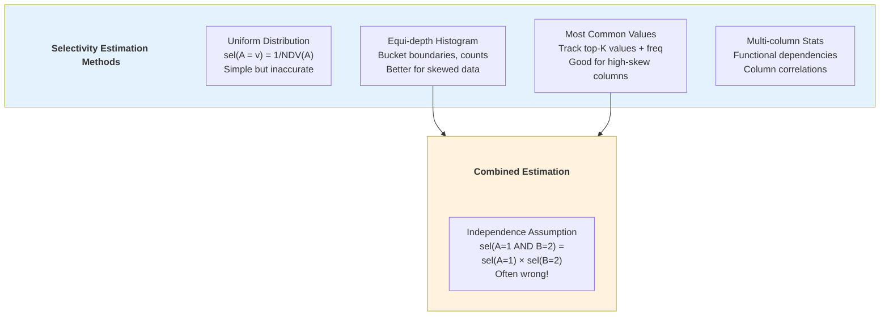

### Impact on Modern Systems
- **PostgreSQL** — Cost-based optimizer with histograms
- **MySQL** — Cost model with index statistics
- **Oracle** — Advanced cost-based optimizer
- **ALL modern RDBMS** — Direct descendant of System R

---

## 2. VOLCANO/CASCADES OPTIMIZER - 1995

### Paper Info
- **Title:** The Volcano Optimizer Generator: Extensibility and Efficient Search
- **Authors:** Goetz Graefe
- **Conference:** IEEE ICDE 1993
- **Link:** https://ieeexplore.ieee.org/document/344061

- **Title:** The Cascades Framework for Query Optimization
- **Authors:** Goetz Graefe
- **Source:** IEEE Data Engineering Bulletin 1995
- **PDF:** https://www.cse.iitb.ac.in/infolab/Data/Courses/CS632/Papers/Cascades-graefe.pdf

### Key Contributions
- Rule-based, extensible optimization framework
- Top-down search with memoization (MEMO structure)
- Separation of logical and physical algebra
- Foundation for SQL Server, CockroachDB, Greenplum optimizers

### Cascades Architecture

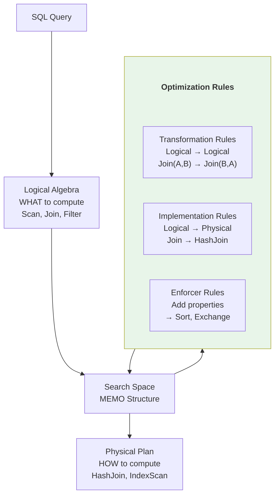

### MEMO Structure

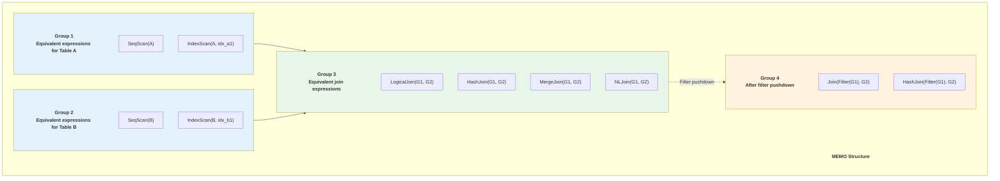

### Transformation Rules

```mermaid
graph LR
    subgraph TR[" "]
        TR_title["Transformation Rules"]
        style TR_title fill:none,stroke:none,color:#333,font-weight:bold
        subgraph Commute[" "]
            Commute_title["Commutativity"]
            style Commute_title fill:none,stroke:none,color:#333,font-weight:bold
            JC1["Join(A, B)"] -->|"≡"| JC2["Join(B, A)"]
        end

        subgraph Assoc[" "]
            Assoc_title["Associativity"]
            style Assoc_title fill:none,stroke:none,color:#333,font-weight:bold
            JA1["Join(Join(A,B), C)"] -->|"≡"| JA2["Join(A, Join(B,C))"]
        end

        subgraph Push[" "]
            Push_title["Predicate Pushdown"]
            style Push_title fill:none,stroke:none,color:#333,font-weight:bold
            PP1["Filter(Join(A,B),<br/>pred_on_A)"] -->|"≡"| PP2["Join(Filter(A,pred),<br/>B)"]
        end

        subgraph Merge[" "]
            Merge_title["Project Merge"]
            style Merge_title fill:none,stroke:none,color:#333,font-weight:bold
            PM1["Project(Project(A,<br/>cols1), cols2)"] -->|"≡"| PM2["Project(A, cols2)"]
        end
    end

    style Commute fill:#e3f2fd
    style Assoc fill:#e8f5e9
    style Push fill:#fff3e0
    style Merge fill:#f3e5f5
```

### Top-Down vs Bottom-Up

| Aspect | Bottom-Up (System R) | Top-Down (Cascades) |
|--------|---------------------|---------------------|
| Direction | Build plans from leaves up | Start from root, decompose |
| Pruning | Limited (branch-and-bound) | Aggressive (upper bounds) |
| Properties | Post-computation | Requested properties passed down |
| Extensibility | Hard to add new operators | Rule-based, easy to extend |
| Memory | Enumerate all subsets | Lazy, demand-driven |
| Used by | PostgreSQL, MySQL | SQL Server, CockroachDB |

### Impact on Modern Systems
- **SQL Server** — Uses Cascades framework
- **Greenplum/ORCA** — Open source Cascades implementation
- **CockroachDB** — Cascades-style optimizer
- **Apache Calcite** — Rule-based optimizer inspired by Cascades

---

## 3. APACHE CALCITE - 2018

### Paper Info
- **Title:** Apache Calcite: A Foundational Framework for Optimized Query Processing Over Heterogeneous Data Sources
- **Authors:** Edmon Begoli, Jesús Camacho-Rodríguez, Julian Hyde, et al.
- **Conference:** SIGMOD 2018
- **Link:** https://dl.acm.org/doi/10.1145/3183713.3190662
- **Code:** https://calcite.apache.org/
- **GitHub:** https://github.com/apache/calcite

### Key Contributions
- Federated query processing across heterogeneous sources
- Extensible, modular optimization framework
- Standard SQL parser and validator
- Adapter architecture for multiple data sources

### Calcite Architecture

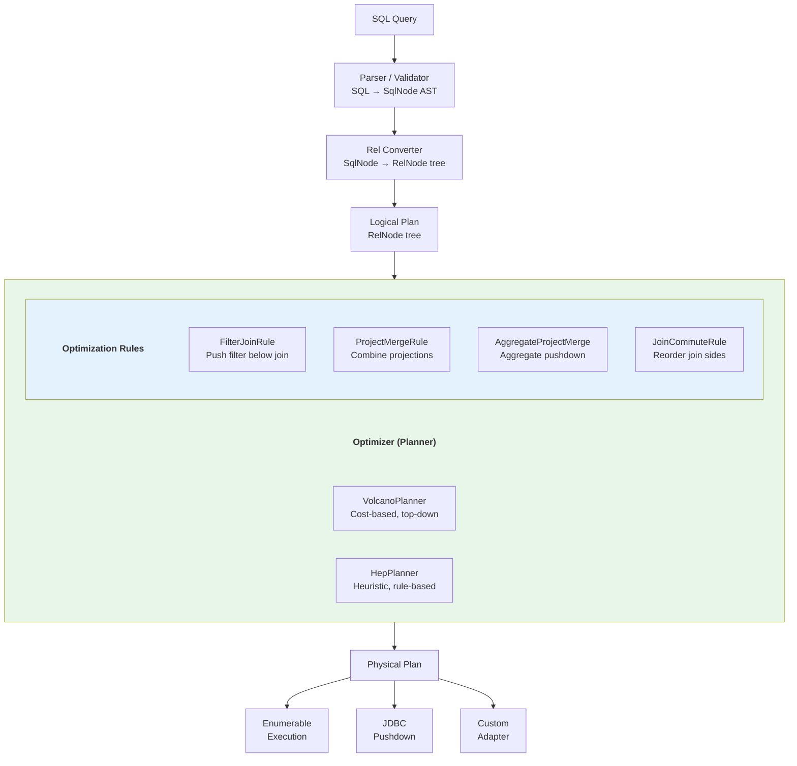

### Adapter Pattern

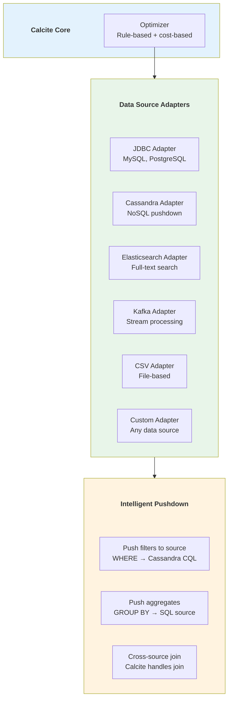

### Systems Using Calcite

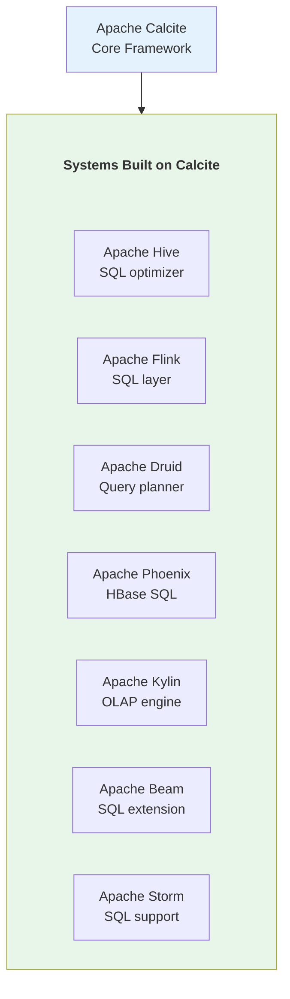

### Calcite SQL Support

| Feature | Support | Notes |
|---------|---------|-------|
| Standard SQL | SQL:2011 | Most of the standard |
| Window Functions | ✅ | ROW_NUMBER, RANK, etc. |
| CTEs | ✅ | WITH clause |
| Lateral Joins | ✅ | LATERAL, UNNEST |
| JSON Functions | ✅ | JSON_VALUE, JSON_QUERY |
| Geospatial | ✅ | Via extensions |
| Streaming SQL | ✅ | STREAM keyword |
| DDL | Partial | Via extensions |

---

## 4. VECTORIZED EXECUTION - 2005

### Paper Info
- **Title:** MonetDB/X100: Hyper-Pipelining Query Execution
- **Authors:** Peter Boncz, Marcin Zukowski, Niels Nes (CWI Amsterdam)
- **Conference:** CIDR 2005
- **Link:** https://www.cidrdb.org/cidr2005/papers/P19.pdf

### Key Contributions
- Vectorized query execution model
- CPU cache optimization for analytics
- SIMD utilization for columnar processing
- Column-at-a-time processing in batches

### Tuple vs Vectorized Execution

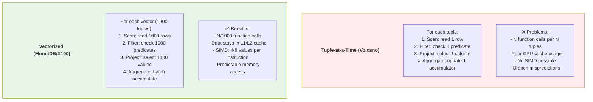

### Vectorized Filter Operation

```mermaid
flowchart LR
    subgraph Input[" "]
        Input_title["Input Vector (1024 values)"]
        style Input_title fill:none,stroke:none,color:#333,font-weight:bold
        IV["[10, 25, 5, 30, 15, 40, 8, 22, ...]"]
    end

    subgraph SIMD[" "]
        SIMD_title["SIMD Comparison (> 20)"]
        style SIMD_title fill:none,stroke:none,color:#333,font-weight:bold
        Compare["Compare 4 values simultaneously<br/>__m256d cmp = _mm256_cmp_pd(...)"]
    end

    subgraph SelectionVector[" "]
        SelectionVector_title["Selection Vector"]
        style SelectionVector_title fill:none,stroke:none,color:#333,font-weight:bold
        SV["[1, 3, 5, 7, ...]<br/>Indices of qualifying rows"]
    end

    subgraph Output[" "]
        Output_title["Output Vector"]
        style Output_title fill:none,stroke:none,color:#333,font-weight:bold
        OV["[25, 30, 40, 22, ...]<br/>Only qualifying values"]
    end

    Input --> SIMD --> SelectionVector --> Output

    style SIMD fill:#e3f2fd
```

### Performance Impact

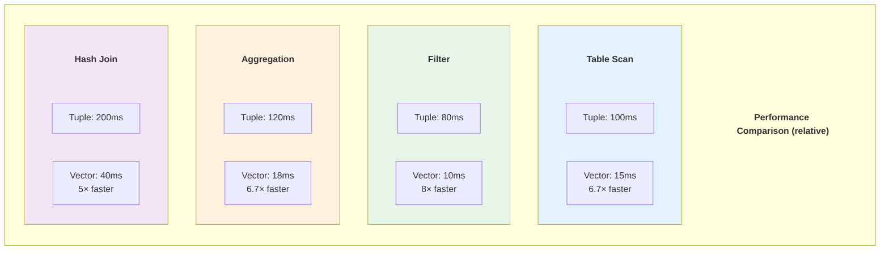

### Modern Vectorized Engines

| Engine | Year | Type | Key Features |
|--------|------|------|-------------|
| MonetDB/X100 | 2005 | Research | Original vectorized engine |
| ClickHouse | 2016 | OLAP DB | Vectorized + columnar |
| DuckDB | 2019 | Embedded OLAP | Full vectorized engine |
| Velox | 2022 | Execution library | Meta's vectorized library |
| DataFusion | 2019 | Query engine | Arrow-native vectorized |
| Polars | 2020 | DataFrame | Vectorized Rust engine |

### Impact on Modern Systems
- **DuckDB** — Full vectorized engine, inspired by this paper
- **ClickHouse** — Vectorized columnar processing
- **Velox (Meta)** — Reusable vectorized execution library
- **DataFusion** — Apache Arrow's vectorized query engine
- **Polars** — Vectorized DataFrame operations

---

## 5. COMPILED QUERY EXECUTION - 2011

### Paper Info
- **Title:** Efficiently Compiling Efficient Query Plans for Modern Hardware
- **Authors:** Thomas Neumann
- **Conference:** VLDB 2011
- **Link:** https://www.vldb.org/pvldb/vol4/p539-neumann.pdf

### Key Contributions
- Query compilation to native machine code via LLVM
- Data-centric (push-based) execution model
- Eliminates interpretation overhead completely
- Keeps data in CPU registers throughout pipeline

### Pull vs Push Execution

```mermaid
graph TD
    subgraph Pull[" "]
        Pull_title["Pull Model (Volcano Iterator)"]
        style Pull_title fill:none,stroke:none,color:#333,font-weight:bold
        PR[Root: next()] -->|"call"| PJ[Join: next()]
        PJ -->|"call"| PS1[Scan A: next()]
        PS1 -->|"return tuple"| PJ
        PJ -->|"call"| PS2[Scan B: next()]
        PS2 -->|"return tuple"| PJ
        PJ -->|"return tuple"| PR
        PullNote["❌ Virtual function calls per tuple<br/>❌ Data moves through function stack"]
    end

    subgraph Push[" "]
        Push_title["Push Model (Compiled)"]
        style Push_title fill:none,stroke:none,color:#333,font-weight:bold
        CS1[Scan A: produce] -->|"push tuple"| CJ[Join: consume/produce]
        CS2[Scan B: produce] -->|"push tuple"| CJ
        CJ -->|"push tuple"| CR[Root: consume]
        PushNote["✅ Tight loop, data in registers<br/>✅ Compiled to native code"]
    end

    style Pull fill:#ffebee
    style Push fill:#e8f5e9
```

### Compilation Pipeline

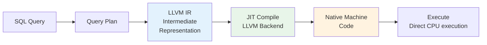

### Pipeline Breakers

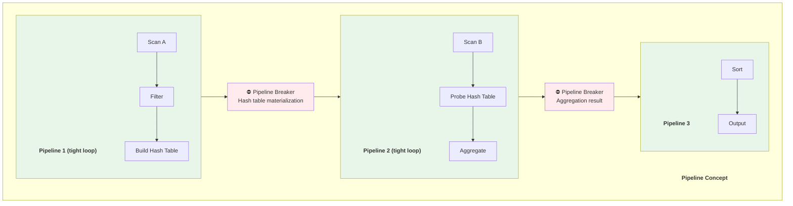

### Morsel-Driven Parallelism

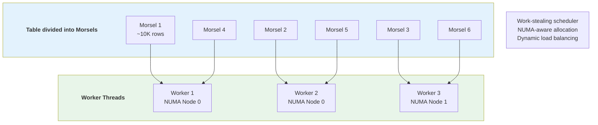

### Vectorized vs Compiled Comparison

| Aspect | Vectorized | Compiled |
|--------|-----------|----------|
| Interpretation overhead | Reduced (per vector) | Eliminated (native code) |
| CPU cache usage | Good (vector fits L1) | Excellent (registers) |
| SIMD | Explicit | Compiler can auto-vectorize |
| Compilation time | None | ~ms per query |
| Debuggability | Easier | Harder (generated code) |
| Flexibility | More flexible | Rigid once compiled |
| Used by | DuckDB, ClickHouse | HyPer, PostgreSQL JIT |

### Impact on Modern Systems
- **HyPer/Umbra** — Original implementation
- **PostgreSQL JIT** — LLVM compilation for expressions
- **Spark Whole-Stage Codegen** — Java code generation
- **Databricks Photon** — Compiled C++ engine

---

## 6. ORCA - MODULAR OPTIMIZER - 2014

### Paper Info
- **Title:** Orca: A Modular Query Optimizer Architecture for Big Data
- **Authors:** Mohamed Soliman, Lyublena Antova, et al. (Pivotal/Greenplum)
- **Conference:** SIGMOD 2014
- **Link:** https://dl.acm.org/doi/10.1145/2588555.2595637

### Key Contributions
- Standalone, database-independent optimizer
- DXL (Data Exchange Language) for optimizer communication
- MPP-aware optimization (distribution, motion)
- Comprehensive testing framework (Minidump tests)

### ORCA Architecture

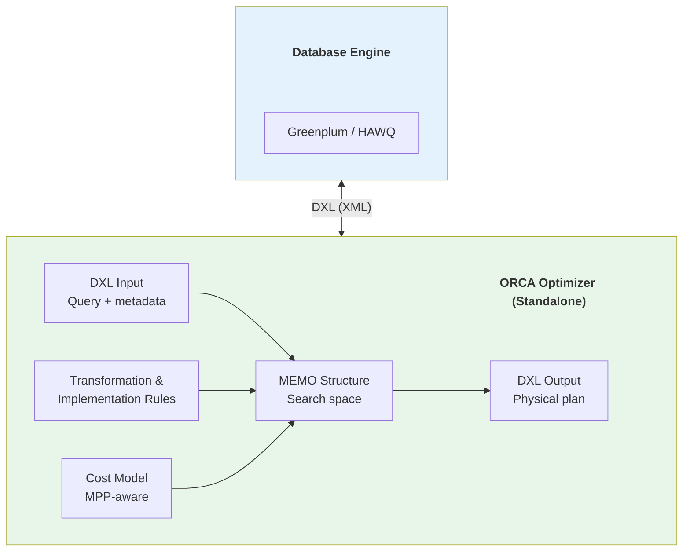

### MPP Distribution Planning

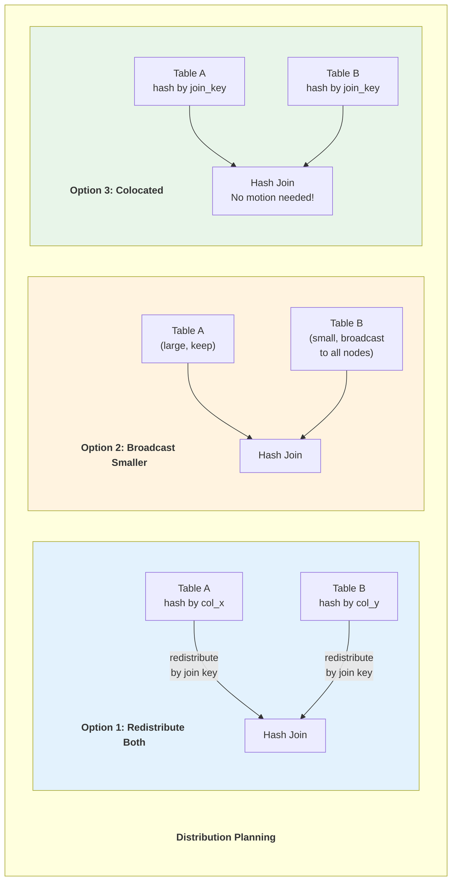

### Motion Operators

```mermaid
graph TD
    subgraph Motions[" "]
        Motions_title["MPP Motion Operators"]
        style Motions_title fill:none,stroke:none,color:#333,font-weight:bold
        Gather["Gather Motion<br/>All segments → coordinator<br/>For: final result return"]
        Redistribute["Redistribute Motion<br/>Hash by key to segments<br/>For: join key alignment"]
        Broadcast["Broadcast Motion<br/>Copy to all segments<br/>For: small dimension tables"]
        Explicit["Explicit Redistribute<br/>Specific partition routing<br/>For: partition-wise joins"]
    end

    style Gather fill:#e3f2fd
    style Redistribute fill:#e8f5e9
    style Broadcast fill:#fff3e0
    style Explicit fill:#f3e5f5
```

---

## 7. HYPER/UMBRA - MODERN OLAP - 2016

### Paper Info
- **Title:** HyPer: A Hybrid OLTP&OLAP Main Memory Database System
- **Authors:** Alfons Kemper, Thomas Neumann
- **Conference:** IEEE ICDE 2011
- **Link:** https://15721.courses.cs.cmu.edu/spring2024/papers/01-modern/hyper-icde2011.pdf

- **Title:** Umbra: A Disk-Based System with In-Memory Performance
- **Authors:** Thomas Neumann, Michael Freitag
- **Conference:** CIDR 2020
- **Link:** https://db.in.tum.de/~freitag/papers/p29-neumann-cidr20.pdf

### Key Contributions
- Hybrid OLTP/OLAP on single system
- Fork-based snapshot isolation (zero-copy MVCC)
- Compiled query execution with morsel-driven parallelism
- Umbra: disk-based with in-memory performance

### HyPer Architecture

```mermaid
graph TD
    subgraph HyPer[" "]
        HyPer_title["HyPer: Hybrid OLTP & OLAP"]
        style HyPer_title fill:none,stroke:none,color:#333,font-weight:bold
        subgraph OLTP[" "]
            OLTP_title["OLTP (Hot Path)"]
            style OLTP_title fill:none,stroke:none,color:#333,font-weight:bold
            TXN[Transactions<br/>INSERT, UPDATE, DELETE]
            WAL[Write-Ahead Log]
        end

        subgraph Shared[" "]
            Shared_title["Shared Memory (Copy-on-Write)"]
            style Shared_title fill:none,stroke:none,color:#333,font-weight:bold
            Data[In-Memory Data<br/>Columnar storage]
        end

        subgraph OLAP[" "]
            OLAP_title["OLAP (Cold Path)"]
            style OLAP_title fill:none,stroke:none,color:#333,font-weight:bold
            Query[Analytical Queries<br/>SELECT, JOIN, AGG]
            Compiled[Compiled Execution<br/>LLVM JIT]
        end

        TXN --> WAL
        TXN -->|"modify"| Data
        Data -->|"fork() snapshot"| Query
        Query --> Compiled
    end

    style OLTP fill:#ffebee
    style Shared fill:#e3f2fd
    style OLAP fill:#e8f5e9
```

### Fork-Based Snapshot Isolation

```mermaid
sequenceDiagram
    participant OLTP as OLTP Process
    participant Memory as Shared Memory (CoW)
    participant OLAP as OLAP Process

    Note over OLTP,OLAP: T0: Normal OLTP operations
    OLTP->>Memory: Write page 1, 2, 3

    Note over OLTP,OLAP: T1: OLAP query arrives
    Memory->>OLAP: fork() — virtual memory snapshot
    Note over OLAP: Gets consistent snapshot at T1<br/>Zero-copy! (only page table copied)

    Note over OLTP,OLAP: T2: OLTP modifies page 2
    OLTP->>Memory: Write page 2 → Copy-on-Write<br/>OLTP gets new page 2'<br/>OLAP still sees old page 2

    Note over OLTP,OLAP: T3: OLAP query completes
    OLAP->>OLAP: Exit process<br/>(only modified pages were copied)
```

### Umbra Improvements Over HyPer

```mermaid
graph TD
    subgraph Improvements[" "]
        Improvements_title["Umbra Key Improvements"]
        style Improvements_title fill:none,stroke:none,color:#333,font-weight:bold
        BM["Variable-Size Pages<br/>512KB-1MB vs fixed 4KB<br/>Fewer TLB misses"]
        PS["Pointer Swizzling<br/>In-memory: direct pointers<br/>On-disk: page IDs<br/>Transparent conversion"]
        Latch["Optimistic Latching<br/>Version counter latch<br/>Retry on conflict<br/>No lock manager"]
        Adapt["Adaptive Execution<br/>Interpret first (fast start)<br/>JIT compile hot queries<br/>Best of both worlds"]
        String["String Handling<br/>Short strings inline (≤12B)<br/>Long strings indirect<br/>Cache-friendly"]
    end

    style Improvements fill:#e8f5e9
```

### Impact on Modern Systems
- **DuckDB** — Similar execution techniques
- **SingleStore** — Hybrid OLTP/OLAP
- **TiDB** — HTAP inspiration
- **PostgreSQL JIT** — LLVM compilation concept from HyPer

---

## 8. ADAPTIVE QUERY EXECUTION - 2020

### Paper/Documentation Info
- **Title:** Adaptive Query Execution in Apache Spark
- **Source:** Databricks / Apache Spark 3.0
- **Link:** https://spark.apache.org/docs/latest/sql-performance-tuning.html#adaptive-query-execution
- **Blog:** https://www.databricks.com/blog/2020/05/29/adaptive-query-execution-speeding-up-spark-sql-at-runtime.html

### Key Contributions
- Runtime query plan optimization
- Dynamic partition coalescing
- Automatic broadcast join detection
- Skew join handling at runtime

### AQE Overview

```mermaid
flowchart TD
    Query[SQL Query] --> StaticPlan[Static Query Plan<br/>Based on catalog stats]

    subgraph AQE[" "]
        AQE_title["Adaptive Query Execution"]
        style AQE_title fill:none,stroke:none,color:#333,font-weight:bold
        Stage1[Execute Stage 1<br/>Collect runtime stats] --> Reopt1[Re-optimize<br/>Using actual data sizes]
        Reopt1 --> Stage2[Execute Stage 2<br/>Collect runtime stats]
        Stage2 --> Reopt2[Re-optimize<br/>Using actual data sizes]
        Reopt2 --> StageN[Execute remaining<br/>stages]
    end

    StaticPlan --> AQE

    subgraph Optimizations[" "]
        Optimizations_title["Runtime Optimizations"]
        style Optimizations_title fill:none,stroke:none,color:#333,font-weight:bold
        Coalesce["Partition Coalescing<br/>Merge small partitions"]
        BroadcastSwitch["Switch to Broadcast Join<br/>If one side is small"]
        SkewJoin["Skew Join Handling<br/>Split skewed partitions"]
    end

    AQE --> Optimizations

    style AQE fill:#e8f5e9
    style Optimizations fill:#e3f2fd
```

### Dynamic Partition Coalescing

```mermaid
graph TD
    subgraph Before[" "]
        Before_title["Before AQE: 200 partitions"]
        style Before_title fill:none,stroke:none,color:#333,font-weight:bold
        P1["P1: 100MB"]
        P2["P2: 1MB"]
        P3["P3: 2MB"]
        P4["P4: 150MB"]
        P5["P5: 0.5MB"]
        P6["P6: 3MB"]
        P7["...many tiny partitions"]
    end

    subgraph After[" "]
        After_title["After AQE: Coalesced"]
        style After_title fill:none,stroke:none,color:#333,font-weight:bold
        CP1["P1: 100MB<br/>(kept as-is)"]
        CP2["P2+P3+P5+P6: 6.5MB<br/>(merged small partitions)"]
        CP3["P4: 150MB<br/>(kept as-is)"]
    end

    Before -->|"AQE coalesces<br/>small partitions"| After

    style Before fill:#ffebee
    style After fill:#e8f5e9
```

### Skew Join Handling

```mermaid
graph TD
    subgraph Problem[" "]
        Problem_title["Skew Problem"]
        style Problem_title fill:none,stroke:none,color:#333,font-weight:bold
        A1["Table A Partition 1<br/>key=1: 1M rows<br/>⚠️ SKEWED!"]
        A2["Table A Partition 2<br/>key=2: 1K rows"]
        B1["Table B Partition 1<br/>key=1: 100 rows"]
        B2["Table B Partition 2<br/>key=2: 100 rows"]

        A1 -->|"Join takes 99%<br/>of total time!"| J1[Join]
        B1 --> J1
        A2 --> J2[Join]
        B2 --> J2
    end

    subgraph Solution[" "]
        Solution_title["AQE Skew Join Solution"]
        style Solution_title fill:none,stroke:none,color:#333,font-weight:bold
        SA1["A key=1, split 1<br/>500K rows"]
        SA2["A key=1, split 2<br/>500K rows"]
        SA3["A key=2<br/>1K rows"]
        SB1["B key=1<br/>replicated to both"]
        SB2["B key=2"]

        SA1 --> SJ1[Join]
        SB1 --> SJ1
        SA2 --> SJ2[Join]
        SB1 --> SJ2
        SA3 --> SJ3[Join]
        SB2 --> SJ3
    end

    style Problem fill:#ffebee
    style Solution fill:#e8f5e9
```

### AQE Configuration

```sql
-- Enable Adaptive Query Execution (default: true in Spark 3.2+)
SET spark.sql.adaptive.enabled = true;

-- Auto-coalesce shuffle partitions
SET spark.sql.adaptive.coalescePartitions.enabled = true;
SET spark.sql.adaptive.coalescePartitions.minPartitionSize = 64MB;
SET spark.sql.adaptive.advisoryPartitionSizeInBytes = 128MB;

-- Auto-broadcast join
SET spark.sql.adaptive.autoBroadcastJoinThreshold = 30MB;

-- Skew join optimization
SET spark.sql.adaptive.skewJoin.enabled = true;
SET spark.sql.adaptive.skewJoin.skewedPartitionFactor = 5;
SET spark.sql.adaptive.skewJoin.skewedPartitionThresholdInBytes = 256MB;
```

### Impact on Modern Systems
- **Apache Spark 3.x** — Built-in AQE
- **Databricks** — Enhanced AQE
- **Trino** — Adaptive features
- **Presto** — Runtime optimization
- **Concept adopted** — by most distributed query engines

---

## SUMMARY: QUERY OPTIMIZATION EVOLUTION

```mermaid
timeline
    title Query Optimization Evolution
    section Foundations (1970-1990)
        System R : Cost-based optimization
                 : Dynamic programming for join ordering
                 : Access path selection
    section Frameworks (1990-2010)
        Volcano/Cascades : Rule-based extensible optimization
                        : Top-down search with MEMO
                        : Used by SQL Server
    section Modern Execution (2005-2015)
        MonetDB X100 : Vectorized execution
        HyPer : Compiled execution via LLVM
        ORCA : Standalone MPP optimizer
    section Big Data Era (2015-present)
        Apache Calcite : Federated query processing
        Spark AQE : Adaptive runtime optimization
        Umbra : Disk-based with in-memory perf
```

### Technique Comparison

```mermaid
graph TD
    subgraph Comparison[" "]
        Comparison_title["Execution Engine Comparison"]
        style Comparison_title fill:none,stroke:none,color:#333,font-weight:bold
        subgraph TAT[" "]
            TAT_title["Tuple-at-a-Time"]
            style TAT_title fill:none,stroke:none,color:#333,font-weight:bold
            TAT1["CPU Cache: Poor"]
            TAT2["SIMD: No"]
            TAT3["Parallelism: Limited"]
            TAT4["Overhead: High"]
        end

        subgraph Vec[" "]
            Vec_title["Vectorized"]
            style Vec_title fill:none,stroke:none,color:#333,font-weight:bold
            V1["CPU Cache: Good"]
            V2["SIMD: Yes"]
            V3["Parallelism: Good"]
            V4["Overhead: Medium"]
        end

        subgraph Comp[" "]
            Comp_title["Compiled"]
            style Comp_title fill:none,stroke:none,color:#333,font-weight:bold
            C1["CPU Cache: Excellent"]
            C2["SIMD: Auto-vectorize"]
            C3["Parallelism: Excellent"]
            C4["Overhead: Low (after JIT)"]
        end
    end

    style TAT fill:#ffebee
    style Vec fill:#e3f2fd
    style Comp fill:#e8f5e9
```

### Optimizer Comparison

| Optimizer | Type | Search Strategy | Used By |
|-----------|------|----------------|---------|
| System R | Bottom-up | Dynamic programming | PostgreSQL |
| Cascades | Top-down | Rule-based + cost | SQL Server, CockroachDB |
| Calcite | Top-down | Rule-based + cost | Hive, Flink, Druid |
| ORCA | Top-down | Cascades variant | Greenplum |
| Spark CBO | Bottom-up + adaptive | Stats + runtime | Apache Spark |

---

## LEARNING PATH

### Beginner
1. **System R paper** — Understand cost-based fundamentals
2. **Apache Calcite docs** — Modern implementation, easy to experiment

### Intermediate
3. **Volcano/Cascades** — Optimization frameworks
4. **MonetDB/X100** — Vectorized execution
5. **Spark AQE** — Practical adaptive optimization

### Advanced
6. **HyPer compiled execution** — LLVM JIT compilation
7. **ORCA distributed optimization** — MPP-aware planning
8. **Umbra modern techniques** — State of the art

---

## REFERENCES

### Papers
1. Selinger, P. et al. "Access Path Selection in a Relational Database Management System." SIGMOD, 1979.
2. Graefe, G. "The Cascades Framework for Query Optimization." IEEE DEBS, 1995.
3. Boncz, P. et al. "MonetDB/X100: Hyper-Pipelining Query Execution." CIDR, 2005.
4. Neumann, T. "Efficiently Compiling Efficient Query Plans for Modern Hardware." VLDB, 2011.
5. Soliman, M. et al. "Orca: A Modular Query Optimizer Architecture for Big Data." SIGMOD, 2014.
6. Begoli, E. et al. "Apache Calcite: A Foundational Framework for Optimized Query Processing." SIGMOD, 2018.
7. Neumann, T. and Freitag, M. "Umbra: A Disk-Based System with In-Memory Performance." CIDR, 2020.

### Resources
- Apache Calcite: https://calcite.apache.org/
- CMU Database Course: https://15721.courses.cs.cmu.edu/
- DuckDB Internals: https://duckdb.org/internals/overview

---

*Document Version: 2.0*
*Last Updated: February 2026*
