# Serialization & Data Format Papers

## Những Paper Nền Tảng Về Serialization Formats và Data Encoding

---

## Mục Lục

1. [Apache Avro](#1-apache-avro---2009)
2. [Protocol Buffers](#2-protocol-buffers---2008)
3. [Apache Parquet](#3-apache-parquet---2013)
4. [Apache ORC](#4-apache-orc---2013)
5. [Apache Arrow](#5-apache-arrow---2016)
6. [FlatBuffers](#6-flatbuffers---2014)
7. [JSON / BSON / MessagePack](#7-json--bson--messagepack)
8. [Comparison Summary](#comparison-summary)
9. [Evolution and Trends](#evolution-and-trends)

---

## 1. APACHE AVRO - 2009

### Documentation Info
- **Title:** Apache Avro Specification
- **Authors:** Doug Cutting, et al. (Apache Foundation)
- **Source:** Apache Foundation
- **Link:** https://avro.apache.org/docs/current/specification/
- **Repo:** https://github.com/apache/avro

### Key Contributions
- Schema evolution with backward/forward compatibility
- Dynamic typing with schema resolution
- Compact binary encoding without field tags
- Built-in RPC framework
- Default serialization format for Kafka

### Avro Schema and Encoding

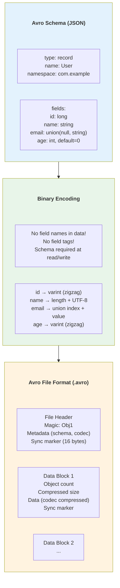

### Schema Evolution

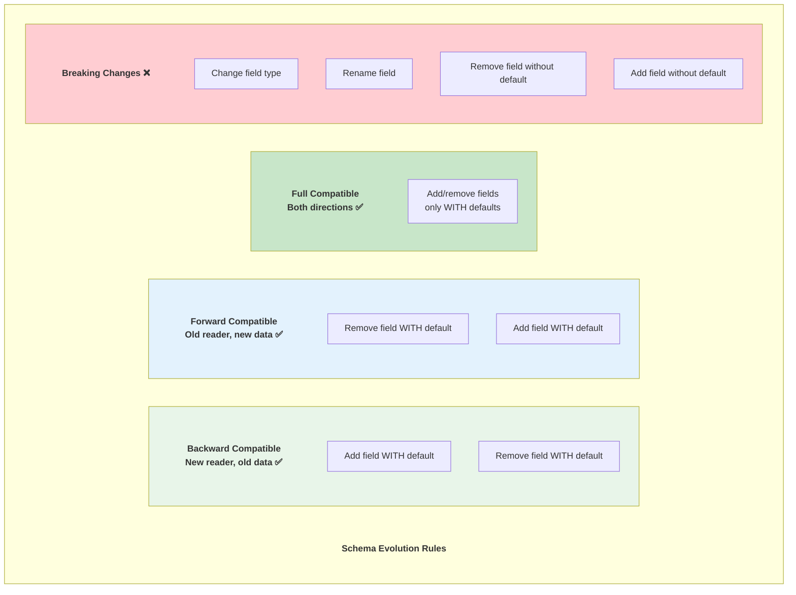

### Schema Resolution

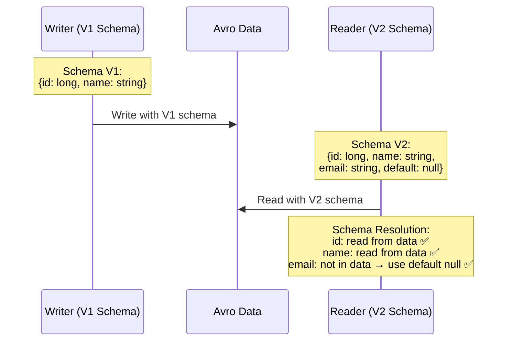

### Schema Registry Pattern

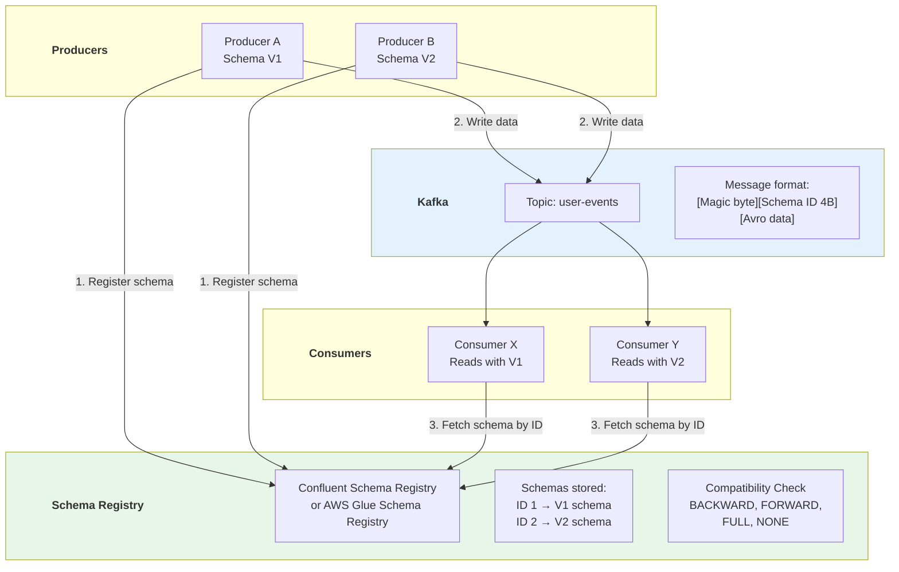

### Impact on Modern Systems
- **Apache Kafka** — Default serialization with Schema Registry
- **Apache Spark** — Native Avro support
- **Hadoop ecosystem** — Standard file format
- **Data pipelines** — Schema evolution for streaming

### Limitations & Evolution (Sự thật phũ phàng)
- Avro nhỏ gọn nhưng phụ thuộc schema management kỷ luật cao.
- Schema evolution sai policy dễ gây consumer break âm thầm.
- **Evolution:** stricter compatibility gates, registry governance, contract-driven schemas.

### War Stories & Troubleshooting
- Triệu chứng: consumer đọc null/default bất ngờ sau deploy schema mới.
- Cách xử lý: enforce backward/full compatibility trong CI trước khi publish schema.

### Metrics & Order of Magnitude
- Schema registration failure rate là chỉ số sớm của governance issue.
- % topics có subject/version ownership rõ ràng phản ánh maturity.
- Consumer deserialization error rate cần theo dõi theo phiên bản schema.

### Micro-Lab
```bash
# Schema Registry compatibility check (conceptual)
curl -s http://schema-registry:8081/config/user-events-value
```

---
> 💡 **Gemini Feedback**
> **Góc nhìn Thực chiến (Senior to Junior)**
1. **Limitations & Evolution (Sự thật phũ phàng):** Avro sinh ra cho streaming (đặc biệt là hệ sinh thái Kafka). Điểm yếu của nó là file Avro phải luôn kẹp theo một cái Schema (JSON) ở phần Header. Nếu em lưu hàng triệu file Avro nhỏ trên đĩa, em sẽ lãng phí dung lượng cực lớn chỉ để lưu đi lưu lại cái Schema đó. Đó là lý do **Schema Registry** (như Confluent Schema Registry) ra đời: tách schema ra một máy chủ riêng, file data chỉ cần lưu ID của schema.
    
2. **War Stories & Troubleshooting:** Ác mộng **"Incompatible Schema"**. Junior đổi kiểu dữ liệu cột `user_id` từ `int` sang `string` ở phía Backend và push lên Schema Registry. Ngay lập tức, toàn bộ hệ thống Kafka Consumer (đang code bằng Java dùng Avro Object cũ) ném ra lỗi `SerializationException` và sập toàn tập. Bài học: Luôn phải tuân thủ nghiêm ngặt quy tắc Backward/Forward Compatibility khi sửa Schema Avro.
    
3. **Metrics & Order of Magnitude:** Avro nén rất tốt cho dữ liệu ghi tuần tự (Row-based). Đọc/ghi 1 triệu dòng Avro nhanh hơn JSON từ 3-5 lần, nhưng nếu mang đi chạy query phân tích (OLAP) thì Avro thua xa Parquet vì engine phải đọc toàn bộ dòng thay vì đọc từng cột.
    
4. **Micro-Lab:** Thử cài công cụ `avro-tools` (jar file) và tự tay extract (giải nén) cái Schema JSON bị giấu bên trong một file `.avro` bằng lệnh: `java -jar avro-tools.jar getschema data.avro`

---
## 2. PROTOCOL BUFFERS - 2008

### Paper/Documentation Info
- **Title:** Protocol Buffers
- **Authors:** Google (Kenton Varda, et al.)
- **Source:** Google Developers
- **Link:** https://protobuf.dev/
- **Spec:** https://protobuf.dev/programming-guides/encoding/
- **GitHub:** https://github.com/protocolbuffers/protobuf

### Key Contributions
- Efficient binary encoding with field numbering
- Strong typing with code generation
- Backward/forward compatible evolution
- Foundation for gRPC
- Google's internal standard for all data exchange

### Protobuf Schema and Encoding

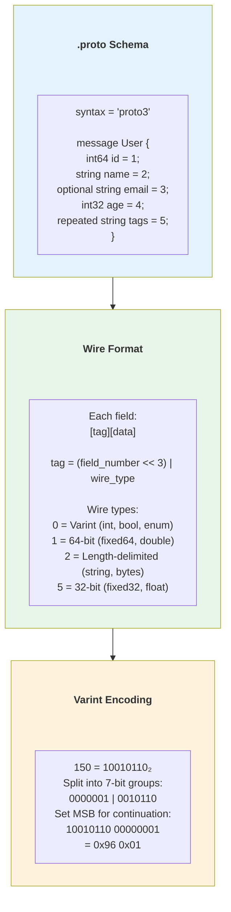

### Protobuf vs Avro

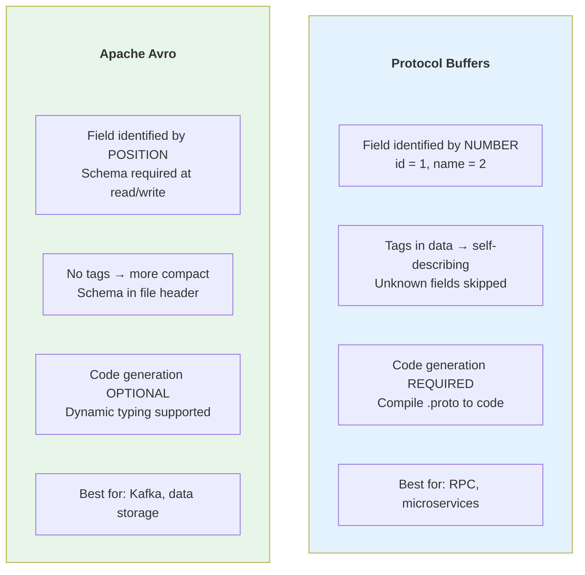

### Evolution Rules

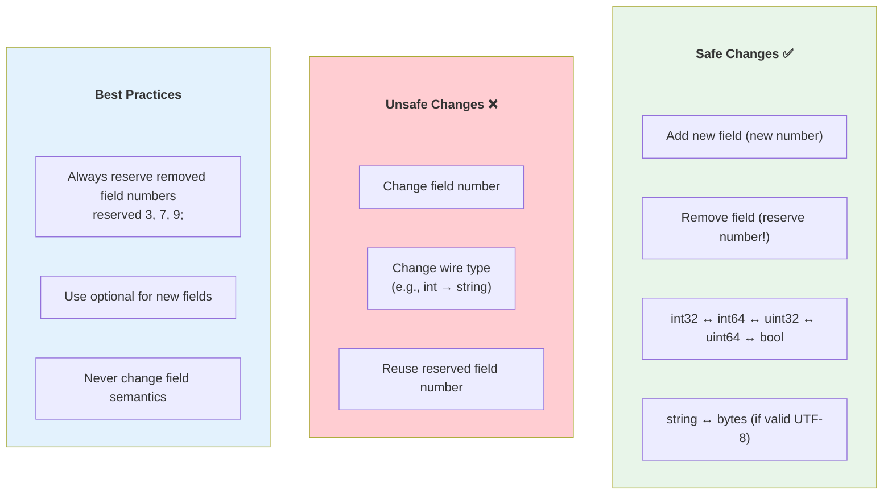

### Impact on Modern Systems
- **gRPC** — Built on Protobuf for RPC
- **Google services** — Internal standard (Stubby → gRPC)
- **Microservices** — Common choice for service-to-service
- **Buf** — Modern Protobuf tooling (linting, breaking change detection)

### Limitations & Evolution (Sự thật phũ phàng)
- Protobuf nhanh nhưng schema discipline (field numbers/reserved) là bắt buộc.
- Breaking changes dễ lọt nếu thiếu review automation.
- **Evolution:** Buf-based lint/breaking checks, API governance, proto package versioning.

### War Stories & Troubleshooting
- Triệu chứng: client cũ fail parse sau thay đổi seemingly nhỏ.
- Cách xử lý: reserve field numbers khi xóa, không đổi wire type/field number.

### Metrics & Order of Magnitude
- Breaking-check failures/release là KPI chất lượng schema evolution.
- Binary payload size p95 ảnh hưởng trực tiếp network latency/cost.
- Decode error rate theo client version giúp phát hiện rollout issues.

### Micro-Lab
```proto
message User {
    int64 id = 1;
    string name = 2;
    reserved 3;
}
```

---
> 💡 **Gemini Feedback**
> **Góc nhìn Thực chiến (Senior to Junior)**
1. **Limitations & Evolution (Sự thật phũ phàng):** Protobuf cực đỉnh cho giao tiếp Microservices (thông qua gRPC). Nhưng tuyệt đối **ĐỪNG** dùng Protobuf để lưu trữ dữ liệu phân tích trong Data Lake. Nó không phải là định dạng Columnar, cũng không tự mang theo schema bên trong (như Avro). Nếu em mất cái file `.proto` gốc, cục data Protobuf của em sẽ vĩnh viễn biến thành một đống byte vô nghĩa không thể giải mã.
    
2. **War Stories & Troubleshooting:** Lỗi "Đổi số thứ tự (Tag ID)". Trong file `.proto`, mỗi field có một con số (VD: `string name = 1;`). Một ngày đẹp trời, Junior xóa field `name`, và lấy số `1` đó gán cho cột `age`. Hệ thống cũ đọc data mới sẽ lấy tuổi (số) nhét vào cột tên (chữ). Bùm! Data hỏng ngầm mà không hề có lỗi văng ra. Nguyên tắc máu: Đã xóa field thì phải dùng từ khóa `RESERVED` cho cái số đó.

---
## 3. APACHE PARQUET - 2013

### Paper/Documentation Info
- **Title:** Apache Parquet
- **Authors:** Julien Le Dem (Twitter), Nong Li (Cloudera), et al.
- **Source:** Apache Foundation
- **Link:** https://parquet.apache.org/docs/
- **Format Spec:** https://github.com/apache/parquet-format
- **GitHub:** https://github.com/apache/parquet-java

### Key Contributions
- Columnar storage format for analytics
- Nested data support via Dremel encoding
- Efficient compression per column
- Predicate pushdown via statistics
- THE standard format for data lakes

### Parquet File Structure

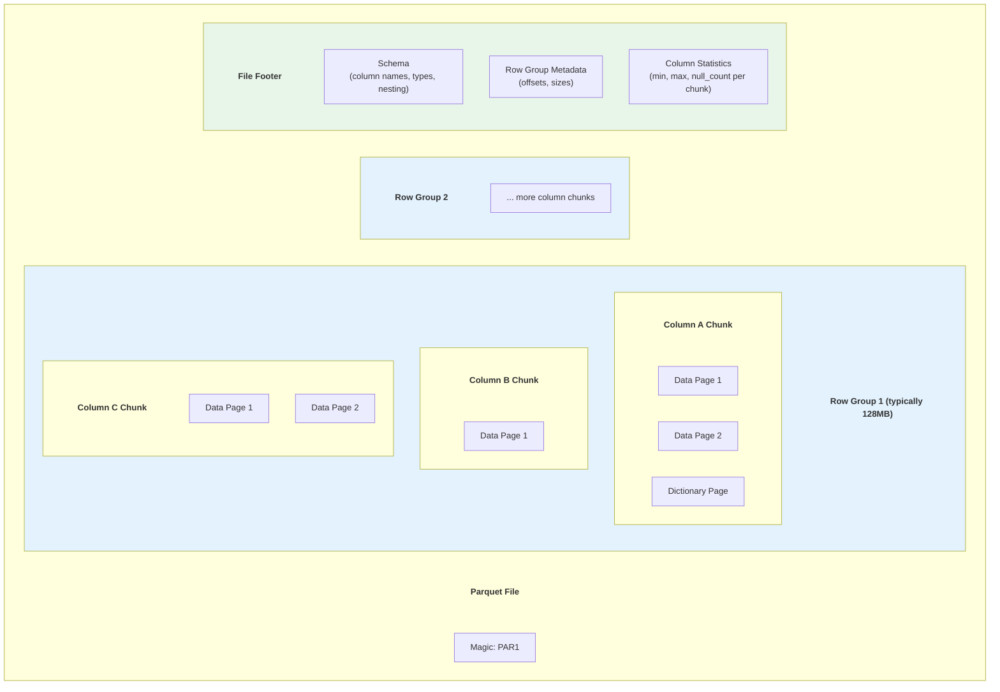

### Dremel Encoding (Nested Data)

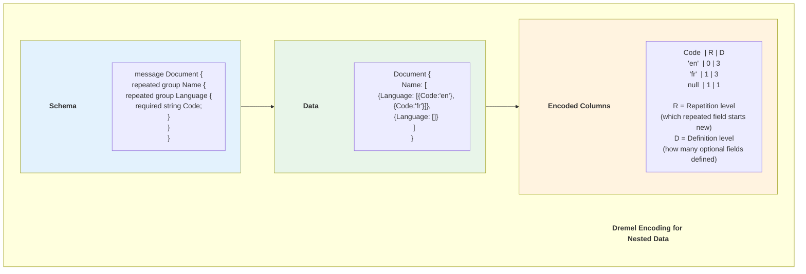

### Predicate Pushdown

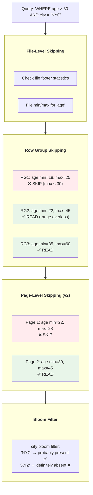

### Parquet Encodings

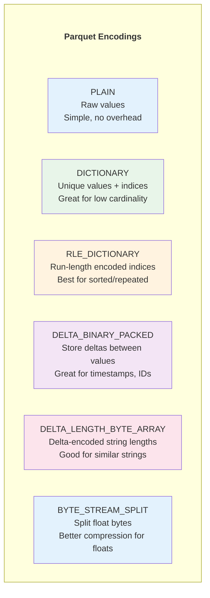

### Compression Options

| Codec | Speed | Ratio | Best For | Used By |
|-------|-------|-------|----------|---------|
| SNAPPY | ⚡⚡⚡ Fast | Medium | Real-time analytics | Spark default |
| GZIP | ⚡ Slow | High | Storage optimization | Cold storage |
| LZ4 | ⚡⚡⚡⚡ Fastest | Low-Medium | Hot data | Real-time |
| ZSTD | ⚡⚡ Balanced | High | General purpose | Modern default |
| BROTLI | ⚡ Slowest | Highest | Maximum compression | Archival |

### Impact on Modern Systems
- **Data Lakes** — THE dominant storage format
- **Spark, Hive, Presto/Trino** — Standard analytics format
- **Table formats** — Iceberg, Delta Lake, Hudi all use Parquet
- **DuckDB, Polars** — Native Parquet support
- **Pandas/PyArrow** — Default columnar file format

### Limitations & Evolution (Sự thật phũ phàng)
- Parquet cực mạnh analytic nhưng small files + metadata fragmentation phá hiệu năng.
- Nested schema phức tạp có thể gây khó debug và read overhead.
- **Evolution:** page index/bloom filters tốt hơn, file compaction chuẩn hóa theo workload.

### War Stories & Troubleshooting
- Triệu chứng: query scan bytes tăng đột biến dù filter có vẻ selective.
- Cách xử lý: kiểm tra min/max stats quality, row-group sizing, partition strategy.

### Metrics & Order of Magnitude
- Average file size và row-group size là 2 knobs hiệu năng quan trọng.
- Bytes scanned / bytes returned phản ánh hiệu quả pruning.
- Small-file count là leading indicator của incident hiệu năng.

### Micro-Lab
```python
import pyarrow.parquet as pq
meta = pq.read_metadata("data/orders.parquet")
print(meta.num_rows, meta.num_row_groups)
```

---

> 💡 **Gemini Feedback**
> **Góc nhìn Thực chiến (Senior to Junior)**
1. **Limitations & Evolution (Sự thật phũ phàng):** Parquet là vua của Data Warehouse, nhưng nó rất "chảnh" về mặt bộ nhớ. Khi engine (như Spark) tạo ra file Parquet, nó phải giữ toàn bộ một Row Group (khoảng 100MB - 1GB) trên RAM để nén cột trước khi ghi xuống đĩa. Nếu máy em ít RAM mà em ép nó ghi Parquet, tiến trình sẽ dính OOM (Out of Memory) lập tức.
    
2. **War Stories & Troubleshooting:** Lỗi **"Nested Hell" (Địa ngục lồng nhau)**. JSON có lồng nhau (Nested) vô tội vạ cũng không sao. Nhưng nếu em ép Parquet lưu một cấu trúc JSON lồng nhau 10 tầng (struct trong array trong struct), thuật toán phân mảnh Dremel bên dưới của Parquet sẽ tạo ra hàng ngàn cột ảo vật lý. Khi đọc, CPU phải ráp hàng ngàn cột đó lại, làm thời gian truy vấn chậm đi gấp 100 lần so với việc em làm phẳng (Flatten) data ngay từ đầu.
    
3. **Metrics & Order of Magnitude:** Nhờ các thuật toán mã hóa như RLE (Run-Length Encoding) hay Dictionary Encoding, Parquet có thể nén một cột chứa 1 triệu chữ "Vietnam" thành... vỏn vẹn vài Kilobyte (vì nó chỉ lưu chữ "Vietnam" 1 lần trong từ điển và đánh index).
    
4. **Micro-Lab:** Cài `parquet-tools` bằng Python (`pip install parquet-tools`) và soi cấu trúc vật lý của một file Parquet bất kỳ: `parquet-tools inspect data.parquet` (Em sẽ thấy các khái niệm Row Group và Column Chunk).

---
## 4. APACHE ORC - 2013

### Paper/Documentation Info
- **Title:** Apache ORC (Optimized Row Columnar)
- **Authors:** Owen O'Malley, et al. (Hortonworks)
- **Source:** Apache Foundation
- **Link:** https://orc.apache.org/
- **Spec:** https://orc.apache.org/specification/
- **GitHub:** https://github.com/apache/orc

### Key Contributions
- Optimized columnar format for Hive
- Built-in lightweight indexes (min/max per stripe, row group)
- ACID transaction support for Hive
- Bloom filters for efficient lookups

### ORC File Structure

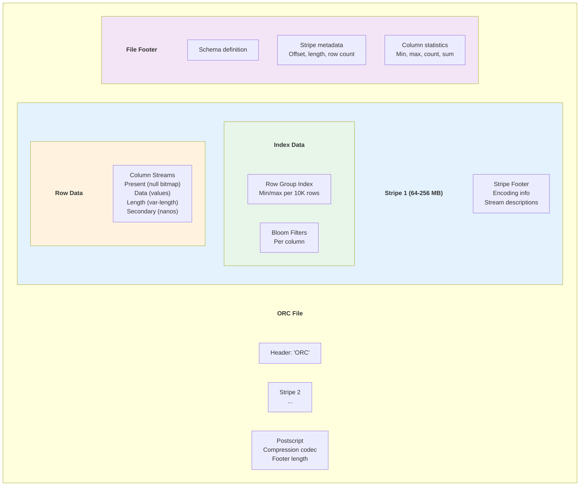

### ORC vs Parquet

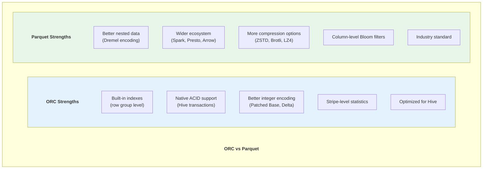

### ORC ACID Support

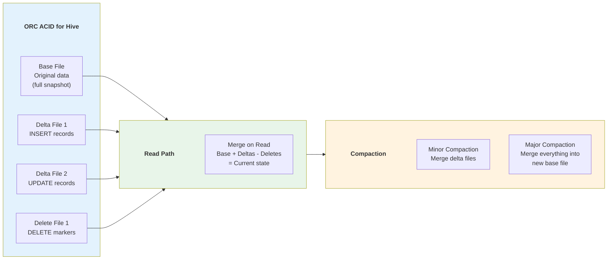

### Impact on Modern Systems
- **Apache Hive** — Primary format, ACID support
- **Presto/Trino** — Supported format
- **Apache Spark** — Supported format
- **Declining usage** — Parquet becoming more dominant

### Limitations & Evolution (Sự thật phũ phàng)
- ORC tối ưu tốt cho hệ Hive-centric nhưng ecosystem hẹp hơn Parquet.
- ACID merge-on-read path có thể tăng read complexity.
- **Evolution:** better interoperability và tooling, nhưng thị phần nghiêng về Parquet.

### War Stories & Troubleshooting
- Triệu chứng: query regression khi delta files tích tụ quá nhiều.
- Cách xử lý: lập lịch compaction đều, theo dõi stripe/index stats integrity.

### Metrics & Order of Magnitude
- Stripe count/file và bloom filter usefulness ảnh hưởng trực tiếp read latency.
- Delta/base ratio cao là cảnh báo compaction debt.
- Compression ratio theo cột cho biết khả năng tối ưu storage.

### Micro-Lab
```sql
-- Hive-style sanity checks (conceptual)
SHOW TBLPROPERTIES my_orc_table;
ANALYZE TABLE my_orc_table COMPUTE STATISTICS;
```

---
> 💡 **Gemini Feedback**
> **Góc nhìn Thực chiến (Senior to Junior)**
1. **Limitations & Evolution (Sự thật phũ phàng):** ORC sinh ra cùng thời với Parquet, nhưng bị "trói chặt" vào hệ sinh thái Hive/Hadoop của Hortonworks. Trong khi Parquet có mặt ở khắp nơi (Python, Rust, C++), thì thư viện đọc ORC ở ngoài hệ sinh thái Java/JVM lại khá nghèo nàn và hay dính bug. Hiện tại (2026), Parquet đã chiến thắng áp đảo trong cuộc chiến định dạng, em nên ưu tiên Parquet cho mọi dự án mới.
    
2. **War Stories & Troubleshooting:** Lần nâng cấp cụm Hadoop, team nhận ra Spark đọc file ORC cũ do Hive ghi bị sai lệch timezone, khiến mọi cột Timestamp bị lùi lại 7 tiếng (do sai số UTC). Xử lý metadata timezone trong ORC giữa các engine luôn là một cơn nhức đầu.

---
## 5. APACHE ARROW - 2016

### Paper/Documentation Info
- **Title:** Apache Arrow: A Cross-Language Development Platform for In-Memory Analytics
- **Authors:** Wes McKinney, Jacques Nadeau, et al.
- **Source:** Apache Foundation
- **Link:** https://arrow.apache.org/
- **Format Spec:** https://arrow.apache.org/docs/format/Columnar.html
- **GitHub:** https://github.com/apache/arrow

### Key Contributions
- Standardized in-memory columnar format
- Zero-copy data sharing across languages
- SIMD-friendly memory layout
- Cross-language interoperability (C++, Python, Java, Rust, Go, etc.)
- Foundation for modern analytics engines

### Arrow Memory Layout

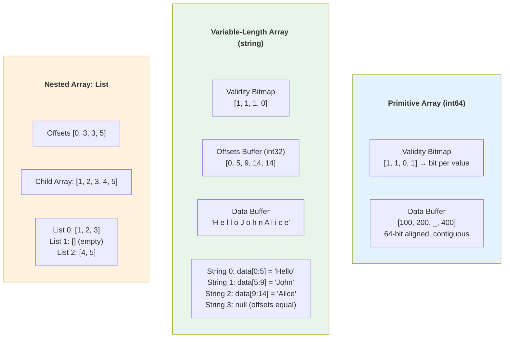

### Zero-Copy Across Languages

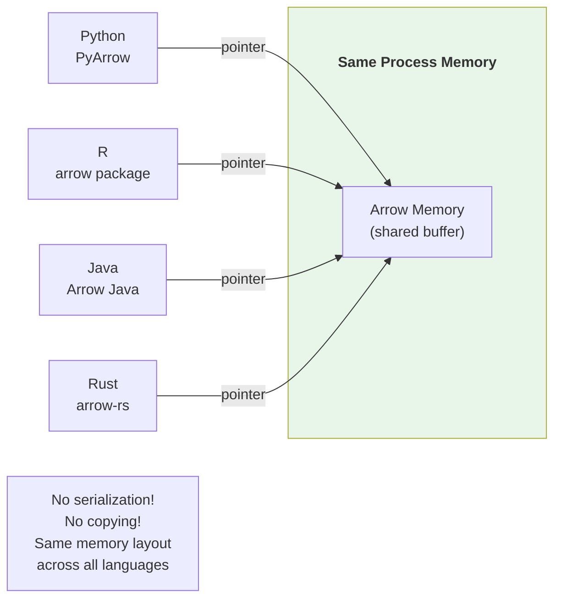

### Arrow Flight

```mermaid
graph TD
    subgraph Flight[" "]
        Flight_title["Arrow Flight Protocol"]
        style Flight_title fill:none,stroke:none,color:#333,font-weight:bold
        subgraph Client[" "]
            Client_title["Client"]
            style Client_title fill:none,stroke:none,color:#333,font-weight:bold
            C1[GetFlightInfo<br/>Query metadata]
            C2[DoGet<br/>Stream data FROM server]
            C3[DoPut<br/>Stream data TO server]
            C4[DoExchange<br/>Bidirectional streaming]
        end

        subgraph Transport[" "]
            Transport_title["Transport"]
            style Transport_title fill:none,stroke:none,color:#333,font-weight:bold
            gRPC[gRPC + Arrow IPC<br/>High-performance<br/>binary streaming]
        end

        subgraph Server[" "]
            Server_title["Server"]
            style Server_title fill:none,stroke:none,color:#333,font-weight:bold
            S1[Flight Server<br/>Serves Arrow data]
            S2[Multiple endpoints<br/>Parallel streams]
        end

        Client <-->|"Arrow IPC batches<br/>over gRPC"| Transport <--> Server
    end

    subgraph Perf[" "]
        Perf_title["Performance"]
        style Perf_title fill:none,stroke:none,color:#333,font-weight:bold
        PF["10-100× faster than JDBC/ODBC<br/>No serialization overhead<br/>Columnar streaming<br/>Parallel endpoints"]
    end

    style Flight fill:#e3f2fd
    style Perf fill:#e8f5e9
```

### Arrow IPC Formats

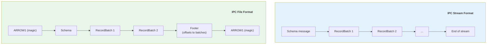

### Impact on Modern Systems
- **Pandas 2.0** — Arrow backend (PyArrow)
- **DuckDB** — Native Arrow integration
- **Polars** — Built on Arrow (arrow-rs)
- **DataFusion** — Arrow-native query engine
- **Spark** — Arrow for pandas UDFs
- **Flink** — Arrow for Python UDFs
- **Snowflake, Databricks** — Arrow Flight for data transfer

### Limitations & Evolution (Sự thật phũ phàng)
- Arrow in-memory mạnh nhưng không thay thế trực tiếp format lưu trữ lâu dài.
- Memory pressure và alignment issues có thể gây crash/perf surprises.
- **Evolution:** Flight SQL, better streaming semantics, cross-engine zero-copy pathways.

### War Stories & Troubleshooting
- Triệu chứng: pandas UDF nhanh chậm thất thường do batch sizing/memory copies ngầm.
- Cách xử lý: tune batch size, kiểm tra zero-copy path có thật sự được dùng.

### Metrics & Order of Magnitude
- Serialization/deserialization avoided bytes là KPI chính của Arrow adoption.
- Batch size p95 và transfer throughput quyết định hiệu năng Flight.
- Memory fragmentation trong long-running jobs cần theo dõi sát.

### Micro-Lab
```python
import pyarrow as pa
arr = pa.array([1, 2, None, 4])
print(arr.type, len(arr), arr.null_count)
```

---
> 💡 **Gemini Feedback**
> **Góc nhìn Thực chiến (Senior to Junior)**
1. **Limitations & Evolution (Sự thật phũ phàng):** Sai lầm kinh điển nhất: **Coi Arrow là định dạng để lưu ổ cứng**. Arrow là cấu trúc bộ nhớ (In-memory). Nếu em lưu cấu trúc Arrow xuống đĩa (Arrow IPC format), dung lượng file sẽ to hơn Parquet rất nhiều vì nó không dùng các phép nén tốn CPU (như gzip/snappy). Nó được thiết kế để ném data qua lại giữa các tiến trình trên RAM mà không cần parse.
    
2. **War Stories & Troubleshooting:** Tình trạng **Serialization Overhead**. Trước khi có Arrow, dùng hàm Python (UDF) trong Spark là địa ngục. Data từ JVM (Java) đẩy sang Python phải bị dịch ra (deserialize) thành chuỗi byte, Python đọc xong lại dịch ngược lại JVM. Quá trình dịch này tốn 80% thời gian chạy job. Từ khi Arrow xuất hiện, JVM truyền thẳng con trỏ bộ nhớ (pointer) của cục data Arrow sang cho Python đọc luôn (Zero-copy). Job đang chạy 2 tiếng rút xuống còn 5 phút!
    
3. **Micro-Lab:** Thử import thư viện `pyarrow` trong Python, tạo một Table và ghi nó ra file dạng Parquet để thấy sự kết hợp hoàn hảo giữa _Arrow (RAM)_ và _Parquet (Disk)_: `import pyarrow as pa, pyarrow.parquet as pq`

---
## 6. FLATBUFFERS - 2014

### Documentation Info
- **Title:** FlatBuffers
- **Authors:** Wouter van Oortmerssen (Google)
- **Source:** Google
- **Link:** https://google.github.io/flatbuffers/
- **GitHub:** https://github.com/google/flatbuffers

### Key Contributions
- Zero-copy access to serialized data (no parsing!)
- Memory-mapped file friendly
- Random access to any field
- Optimized for game engines and mobile

### FlatBuffers vs Protobuf

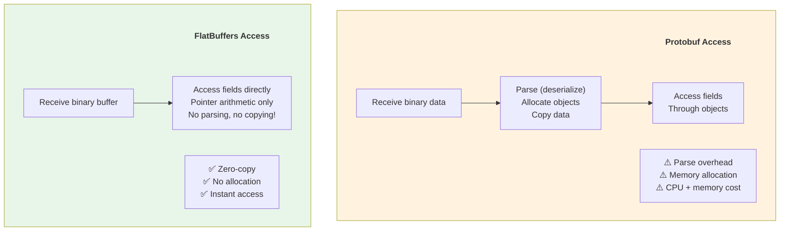

### Buffer Layout

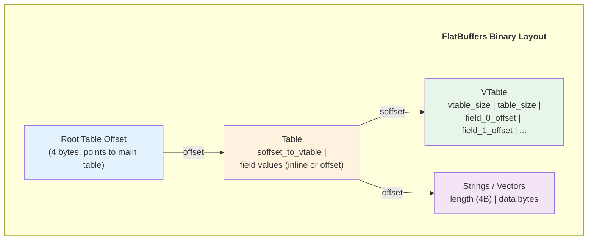

### Use Cases

| Use Case | Why FlatBuffers? |
|----------|-----------------|
| Game engines | Real-time, zero-copy, memory constraints |
| Mobile apps | Battery efficiency, fast startup |
| Network protocols | Low-latency, no parsing overhead |
| Memory-mapped files | Direct access, no deserialization |
| IoT / Embedded | Minimal CPU and memory requirements |

### Limitations & Evolution (Sự thật phũ phàng)
- FlatBuffers cực nhanh read nhưng schema tooling/community nhỏ hơn Protobuf.
- Update in-place phức tạp; thường phù hợp immutable payloads.
- **Evolution:** better ecosystem support, codegen improvements, niche high-performance adoption.

### War Stories & Troubleshooting
- Triệu chứng: team gặp khó khi debug payload vì binary layout khó đọc trực tiếp.
- Cách xử lý: chuẩn hóa test vectors + schema review + generated accessor tests.

### Metrics & Order of Magnitude
- Parse latency gần như bằng 0 là lợi thế lớn ở real-time workloads.
- Payload size và random-access latency là 2 KPI chính.
- Schema change frequency cao có thể làm cost maintenance tăng.

### Micro-Lab
```text
FlatBuffers quick validation:
1) Generate code from .fbs
2) Serialize object
3) Read field trực tiếp từ buffer không parse full object
```

---

## 7. JSON / BSON / MESSAGEPACK

### Documentation Info
- **JSON:** https://www.json.org/ (RFC 8259)
- **BSON:** https://bsonspec.org/
- **MessagePack:** https://msgpack.org/

### Format Comparison

```mermaid
graph TD
    subgraph JSON_F[" "]
        JSON_F_title["JSON"]
        style JSON_F_title fill:none,stroke:none,color:#333,font-weight:bold
        J1["Human readable ✅"]
        J2["Self-describing ✅"]
        J3["Verbose ❌ (field names repeated)"]
        J4["No binary data ❌ (base64 needed)"]
        J5["Universal support ✅"]
    end

    subgraph BSON_F[" "]
        BSON_F_title["BSON (Binary JSON)"]
        style BSON_F_title fill:none,stroke:none,color:#333,font-weight:bold
        B1["Binary format"]
        B2["Additional types (Date, Binary, ObjectId)"]
        B3["Used by MongoDB"]
        B4["Slightly larger than JSON!"]
        B5["Fast traversal (length-prefixed)"]
    end

    subgraph MsgPack_F[" "]
        MsgPack_F_title["MessagePack"]
        style MsgPack_F_title fill:none,stroke:none,color:#333,font-weight:bold
        M1["Binary JSON (compact)"]
        M2["25-50% smaller than JSON"]
        M3["Fast serialization"]
        M4["Wide language support"]
        M5["Used in: Redis, Fluentd"]
    end

    style JSON_F fill:#e3f2fd
    style BSON_F fill:#e8f5e9
    style MsgPack_F fill:#fff3e0
```

### Size Comparison

```mermaid
graph LR
    subgraph Sizes[" "]
        Sizes_title["Size Comparison for Same Data"]
        style Sizes_title fill:none,stroke:none,color:#333,font-weight:bold
        JSON_S["JSON<br/>46 bytes"]
        BSON_S["BSON<br/>45 bytes"]
        MsgPack_S["MessagePack<br/>25 bytes"]
        Protobuf_S["Protobuf<br/>12 bytes"]
        Avro_S["Avro<br/>10 bytes"]
    end

    JSON_S -.->|"similar"| BSON_S
    BSON_S -.->|"-45%"| MsgPack_S
    MsgPack_S -.->|"-52%"| Protobuf_S
    Protobuf_S -.->|"-17%"| Avro_S

    style JSON_S fill:#ffcdd2
    style BSON_S fill:#fff3e0
    style MsgPack_S fill:#e3f2fd
    style Protobuf_S fill:#e8f5e9
    style Avro_S fill:#c8e6c9
```

### When to Use What

```mermaid
graph TD
    Start{What's your use case?}

    Start -->|"Human readable<br/>config, REST API"| JSON_Use["Use JSON<br/>Universal, debuggable"]
    Start -->|"MongoDB"| BSON_Use["Use BSON<br/>Native MongoDB format"]
    Start -->|"Compact JSON<br/>logs, caching"| MP_Use["Use MessagePack<br/>Fast, smaller, flexible"]
    Start -->|"RPC, microservices"| PB_Use["Use Protobuf + gRPC<br/>Strong typing, fast"]
    Start -->|"Kafka, streaming"| AV_Use["Use Avro<br/>Schema evolution, compact"]
    Start -->|"Analytics storage"| PQ_Use["Use Parquet<br/>Columnar, compressed"]
    Start -->|"In-memory analytics"| AR_Use["Use Arrow<br/>Zero-copy, cross-language"]
    Start -->|"Game engine, mobile"| FB_Use["Use FlatBuffers<br/>Zero-copy, instant access"]

    style JSON_Use fill:#e3f2fd
    style BSON_Use fill:#e8f5e9
    style MP_Use fill:#fff3e0
    style PB_Use fill:#f3e5f5
    style AV_Use fill:#fce4ec
    style PQ_Use fill:#e3f2fd
    style AR_Use fill:#e8f5e9
    style FB_Use fill:#fff3e0
```

### Limitations & Evolution (Sự thật phũ phàng)
- JSON tiện nhưng verbose; BSON có type tốt hơn nhưng lock-in Mongo use cases.
- MessagePack cân bằng tốt nhưng tooling/visibility có thể kém JSON cho debugging.
- **Evolution:** binary JSON variants, schema overlays, hybrid logging strategies.

### War Stories & Troubleshooting
- Triệu chứng: API latency tăng do payload JSON quá lớn và parse tốn CPU.
- Cách xử lý: nén, giảm field không cần thiết, cân nhắc MessagePack/Protobuf cho internal APIs.

### Metrics & Order of Magnitude
- Payload size p95 và parse CPU time/request là KPI hiệu quả serialization.
- Network egress cost thường giảm đáng kể khi chuyển text sang binary format.
- Error rate do schema drift cao khi chỉ dùng JSON không schema contracts.

### Micro-Lab
```python
import json, msgpack
obj = {"id": 1, "name": "alice", "active": True}
print(len(json.dumps(obj).encode()), len(msgpack.packb(obj)))
```

---
>Gemni Feedback
>6. FLATBUFFERS - 2014 & 7. JSON/BSON/MESSAGEPACK

> **Góc nhìn Thực chiến (Senior to Junior)**
> 
> 7. **Limitations & Evolution (Sự thật phũ phàng):** Khác biệt cốt lõi: JSON bắt em phải "parse" (đọc text, dò từng dấu ngoặc, gán vào object) mới lấy được data. Việc này đốt CPU khủng khiếp nếu file nặng vài trăm MB. FlatBuffers ra đời để giải quyết việc này (thường dùng trong lập trình Game/Mobile): Cứ ném cục byte đó vào RAM, muốn lấy trường `name`, con trỏ sẽ nhảy đúng đến byte số X để lấy data mà không cần parse bất cứ thứ gì (Zero-parse).
>     
> 8. **War Stories & Troubleshooting:** Một startup dùng JSON để lưu log hệ thống 1TB mỗi ngày trên S3. Khi cắm Athena/Trino vào query `SELECT count(*)`, bill AWS trả về mấy ngàn đô la một tháng vì engine phải quét và parse toàn bộ 1TB text để tìm một dòng. Bài học: JSON chỉ để dùng cho API và lúc test, đừng bao giờ ném JSON vào Data Lake production.
>     

---
### 9. Evolution and Trends (Cập nhật kỷ nguyên GenAI 2024-2026)

Ngoài sự hội tụ của Parquet và Arrow, kỷ nguyên AI tạo ra sức ép mới lên các định dạng dữ liệu vật lý.

> 💡 **Gemini Feedback**
> **Góc nhìn Thực chiến (Senior to Junior)**
> 
> 1. **Sự trỗi dậy của LANCE Format (2024):** > - **Sự thật phũ phàng:** Parquet cực kỳ xịn cho dữ liệu bảng (chữ, số). Nhưng khi AI bùng nổ, data biến thành **Vector Embeddings** (mảng chứa hàng ngàn số thực) và hình ảnh/tensor. Đọc các mảng số thực khổng lồ này bằng Parquet tốn quá nhiều CPU.
>     
>     - **Kẻ thay đổi cuộc chơi:** Định dạng **Lance** (được viết bằng Rust). Nó là một chuẩn Columnar Format mới thiết kế riêng cho Machine Learning và AI. Tốc độ quét Vector Search (KNN) của Lance nhanh hơn Parquet từ 100 đến 1000 lần. Nếu dự án Data-Keeper của em có lưu trữ memory cho AI Agent, hãy cân nhắc Lance.
>         
> 2. **Giao tiếp qua Arrow Flight RPC (2023-2026):**
>     
>     - **Sự thật phũ phàng:** Em có database xịn, data ở định dạng Arrow trên RAM. Nhưng khi truyền kết quả qua mạng (Network) cho user, em lại bị ép dùng giao thức HTTP/REST, lại phải chuyển data thành JSON! Toàn bộ công sức tối ưu bị vứt sọt rác.
>         
>     - **Sự tiến hóa:** **Arrow Flight**. Một giao thức RPC mới truyền thẳng khối bộ nhớ Arrow qua dây mạng. Tốc độ truyền tải data đạt mức gigabyte/giây, bỏ qua hoàn toàn bước Serialize/Deserialize. Các database hiện đại thế hệ mới đều đang mặc định thay thế REST API bằng Arrow Flight cho các tác vụ lấy dữ liệu lớn. Tốc độ nhanh hơn kết nối JDBC/ODBC truyền thống cả chục lần!

---
## COMPARISON SUMMARY

### Format Feature Matrix

```mermaid
graph TD
    subgraph Matrix[" "]
        Matrix_title["Feature Comparison"]
        style Matrix_title fill:none,stroke:none,color:#333,font-weight:bold
        subgraph Row[" "]
            Row_title["Row-Oriented"]
            style Row_title fill:none,stroke:none,color:#333,font-weight:bold
            JSON2["JSON: Human readable, verbose"]
            Avro2["Avro: Schema evolution, Kafka"]
            PB2["Protobuf: Compact, typed, gRPC"]
            FB2["FlatBuffers: Zero-copy access"]
            MP2["MessagePack: Binary JSON"]
        end

        subgraph Col[" "]
            Col_title["Column-Oriented"]
            style Col_title fill:none,stroke:none,color:#333,font-weight:bold
            Parquet2["Parquet: Analytics storage king"]
            ORC2["ORC: Hive-optimized, ACID"]
            Arrow2["Arrow: In-memory standard"]
        end
    end

    style Row fill:#e3f2fd
    style Col fill:#e8f5e9
```

### Comprehensive Comparison Table

| Feature | JSON | MsgPack | Avro | Protobuf | FlatBuffers | Parquet | ORC | Arrow |
|---------|------|---------|------|----------|-------------|---------|-----|-------|
| Schema | ❌ No | ❌ No | ✅ Yes | ✅ Yes | ✅ Yes | ✅ Yes | ✅ Yes | ✅ Yes |
| Self-describing | ✅ | ✅ | ❌ | Partial | ❌ | Partial | Partial | ✅ |
| Compactness | Poor | Good | Great | Great | Good | Best | Best | Good |
| Zero-copy | ❌ | ❌ | ❌ | ❌ | ✅ | ❌ | ❌ | ✅ |
| Columnar | ❌ | ❌ | ❌ | ❌ | ❌ | ✅ | ✅ | ✅ |
| Schema evolution | ❌ | ❌ | ✅ | ✅ | ✅ | ❌ | ❌ | ❌ |
| Compression | External | ❌ | Per-file | External | ❌ | Per-column | Per-stripe | ❌ |
| Nested data | ✅ | ✅ | ✅ | ✅ | ✅ | ✅ (Dremel) | ✅ | ✅ |

### Use Case Mapping

| Use Case | Best Format | Why |
|----------|-------------|-----|
| Config files | JSON, YAML | Human readable |
| REST APIs | JSON | Universal support |
| gRPC services | Protobuf | Strong typing, fast |
| Kafka messages | Avro | Schema evolution |
| Analytics storage | Parquet | Columnar, compressed |
| In-memory compute | Arrow | Zero-copy, cross-language |
| Game/mobile | FlatBuffers | Zero-copy, instant access |
| MongoDB | BSON | Native format |
| Logging | JSON / MessagePack | Flexible, searchable |
| ML model serving | Protobuf / Arrow | Fast, typed |

---

## EVOLUTION AND TRENDS

### Timeline

```mermaid
timeline
    title Serialization Format Evolution
    section Text Era
        2001 : XML - verbose, text-based
        2006 : JSON - simpler, universal
    section Binary Era
        2008 : Protocol Buffers - binary, schema
        2009 : Apache Avro - schema evolution
        2011 : MessagePack - binary JSON
    section Columnar Era
        2013 : Apache Parquet - columnar storage
        2013 : Apache ORC - Hive optimized
        2014 : FlatBuffers - zero-copy
    section In-Memory Era
        2016 : Apache Arrow - in-memory columnar
        2020 : Arrow Flight - high-perf transport
```

### Current Trends

```mermaid
graph TD
    subgraph Trends[" "]
        Trends_title["Current Trends (2025+)"]
        style Trends_title fill:none,stroke:none,color:#333,font-weight:bold
        T1["Columnar Everywhere<br/>Parquet for storage<br/>Arrow for compute"]
        T2["Schema Registries<br/>Confluent, AWS Glue<br/>Centralized schema management"]
        T3["Zero-Copy / Memory-Mapped<br/>Arrow Flight for transport<br/>FlatBuffers for access"]
        T4["Arrow as Lingua Franca<br/>Cross-system data exchange<br/>Python↔Rust↔Java↔Go"]
        T5["Format Convergence<br/>Parquet + Arrow + Flight<br/>= Complete data platform"]
    end

    style Trends fill:#e8f5e9
```

---
<mark style="background: #ABF7F7A6;">>Gemini Message</mark>
Đúng là **Lance** (cho Vector) và **Arrow Flight** (cho Network) là hai ngôi sao sáng nhất, mang tính "lật đổ" nhất trong mảng Data Analytics giai đoạn 2024-2026. Tuy nhiên, thế giới Serialization (Tuần tự hóa dữ liệu) không chỉ có mỗi phân tích dữ liệu.

Nếu em đang xây dựng Data-Keeper thành một hệ thống toàn diện (có cả AI, có cả giám sát hệ thống), thì từ 2024 đến nay có **3 chuẩn format mới** đã âm thầm thống trị mà em bắt buộc phải biết. Em hãy copy phần này và dán nối tiếp vào cái Section mới ở cuối **File 10** nhé:

---

> **Góc nhìn Thực chiến (Senior to Junior)**
> 
> **3. SafeTensors (Kẻ kết liễu Python Pickle trong thế giới AI):**
> 
> - **Sự thật phũ phàng:** Trào lưu tải LLM (Large Language Models) open-source về chạy local bùng nổ. Nhưng định dạng file mô hình cũ (`.pkl` / `PyTorch Pickle`) là một thảm họa bảo mật. Pickle có thể chứa mã độc (Remote Code Execution - RCE). Hacker up một model chứa mã độc lên HuggingFace, Junior tải về chạy trên máy, thế là bay màu toàn bộ server.
>     
> - **Kẻ thay đổi cuộc chơi:** Định dạng **SafeTensors** (do HuggingFace đẻ ra).
>     
> - **Góc nhìn thực chiến:** SafeTensors là định dạng serialization _chỉ chứa dữ liệu toán học_ (tensors), tuyệt đối không chứa code thực thi. Hơn nữa, nó hỗ trợ _Zero-copy_ (giống Arrow), load thẳng một cục tạ model 8GB từ ổ cứng SSD lên RAM/VRAM của GPU mà không cần parse qua CPU. Tốc độ khởi động model nhanh gấp hàng chục lần. Bất cứ khi nào tải model AI về con máy trạm để chạy, **chỉ tải đuôi `.safetensors`, tuyệt đối tránh xa đuôi `.bin` hay `.pkl`**.
>     
> 
> **4. OTLP (OpenTelemetry Protocol - Thống nhất định dạng Log/Metric):**
> 
> - **Sự thật phũ phàng:** Ngày xưa, log sinh ra ở format của Splunk, metrics ở format của Prometheus, traces ở format của Jaeger. Hệ thống giám sát (Observability) là một bãi rác các định dạng cắn xé lẫn nhau.
>     
> - **Sự tiến hóa:** Kỷ nguyên 2024-2026 đánh dấu sự thống trị tuyệt đối của **OpenTelemetry (OTel)**. Toàn bộ ngành công nghiệp ép nhau xài chung một chuẩn serialization duy nhất gọi là OTLP (dựa trên Protobuf).
>     
> - **Góc nhìn thực chiến:** Khi code cái Data-Keeper, đừng bao giờ tự chế ra format JSON để in log nữa. Hãy dùng thư viện OpenTelemetry, serialize mọi thông số CPU, RAM, Log lỗi ra chuẩn OTLP và bắn về một hub trung tâm. Nếu sau này em muốn đổi từ Elasticsearch sang Grafana hay Datadog, em không phải sửa một dòng code nào ở phía app, vì tất cả đã nói chung một ngôn ngữ.
>     
> 
> **5. Parquet Modular Encryption (Mã hóa phân mảnh - 2024+):**
> 
> - **Sự thật phũ phàng:** Luật bảo mật ngày càng gắt. Trước đây để bảo vệ file Parquet, người ta mã hóa toàn bộ ổ đĩa S3. Nhưng nếu Data Analyst có quyền vào S3, họ đọc được hết, kể cả số thẻ tín dụng. Nếu mã hóa cả file Parquet, thì lúc Query một cột không nhạy cảm, CPU vẫn phải hì hục giải mã cả file, cực kỳ tốn kém.
>     
> - **Sự tiến hóa:** Tính năng **Modular Encryption** được đưa vào lõi của Parquet.
>     
> - **Góc nhìn thực chiến:** Bây giờ em có thể mã hóa _riêng rẽ từng cột_ bằng các chìa khóa (KMS Key) khác nhau ngay bên trong 1 file Parquet. User A có khóa của cột `Doanh_thu` thì chỉ đọc được doanh thu. User B có khóa cột `SĐT` thì chỉ đọc được SĐT. Engine đọc data bỏ qua luôn việc giải mã các cột không có quyền. Đây là tính năng cứu cánh cho các hệ thống Data Lake dùng chung cho toàn công ty.


**Chốt lại:** Nếu 2013-2016 là cuộc chiến định dạng cho **Hadoop/Data Warehouse** (Parquet vs ORC), thì 2024-2026 là sự ra đời của các chuẩn serialization chuyên biệt hóa: **Lance** (cho Vector), **SafeTensors** (cho Model Weights), **Flight RPC** (cho Băng thông mạng) và **OTLP** (cho Giám sát hệ thống). Nắm được bộ tứ này là em đã hoàn toàn làm chủ được "ngôn ngữ giao tiếp" của các hệ thống tối tân nhất hiện nay rồi! Chúc em ráp cái Data-Keeper thành công rực rỡ nhé!

---
## REFERENCES

### Specifications
1. Apache Avro: https://avro.apache.org/docs/current/specification/
2. Protocol Buffers: https://protobuf.dev/programming-guides/encoding/
3. Apache Parquet: https://github.com/apache/parquet-format
4. Apache ORC: https://orc.apache.org/specification/
5. Apache Arrow: https://arrow.apache.org/docs/format/Columnar.html
6. FlatBuffers: https://google.github.io/flatbuffers/flatbuffers_internals.html

### Papers
- Melnik, S. et al. "Dremel: Interactive Analysis of Web-Scale Datasets." VLDB, 2010.
- McKinney, W. "Apache Arrow and the Future of Data Frames." 2020.

### Tools & Libraries
- Apache Arrow: https://github.com/apache/arrow
- Apache Parquet: https://github.com/apache/parquet-java
- Confluent Schema Registry: https://github.com/confluentinc/schema-registry
- Buf (Protobuf): https://github.com/bufbuild/buf
- Apache Avro: https://github.com/apache/avro

---

*Document Version: 2.1*
*Last Updated: March 2026*

## 🔗 Liên Kết Nội Bộ

- [[03_Data_Warehouse_Papers|Data Warehouse Papers]] — Context: Arrow trong DW ecosystem
- [[04_Table_Format_Papers|Table Format Papers]] — Context: Parquet/ORC/Avro trong Iceberg/Delta/Hudi
- [[06_Database_Internals_Papers|Database Internals]] — LSM-Tree, B-Tree, MVCC fundamentals

