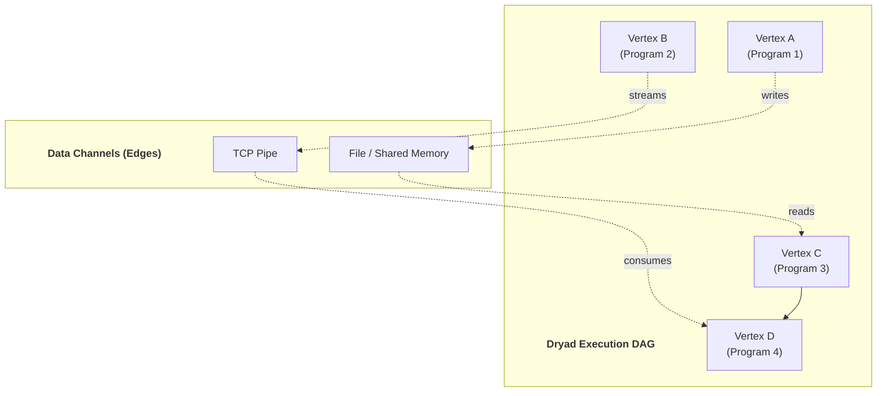
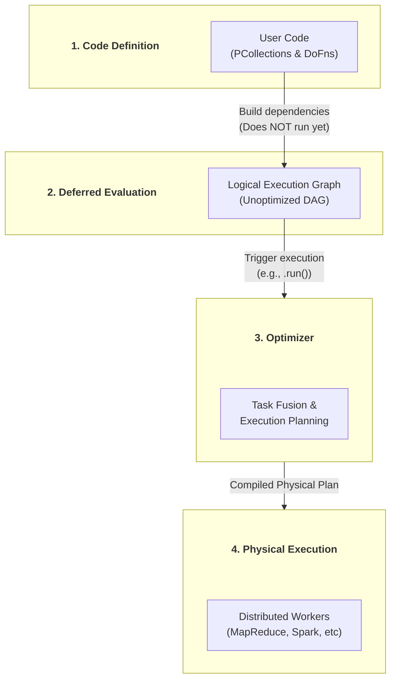
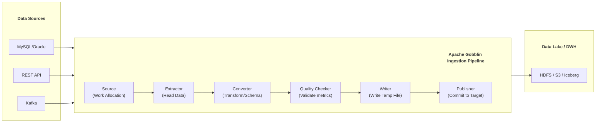
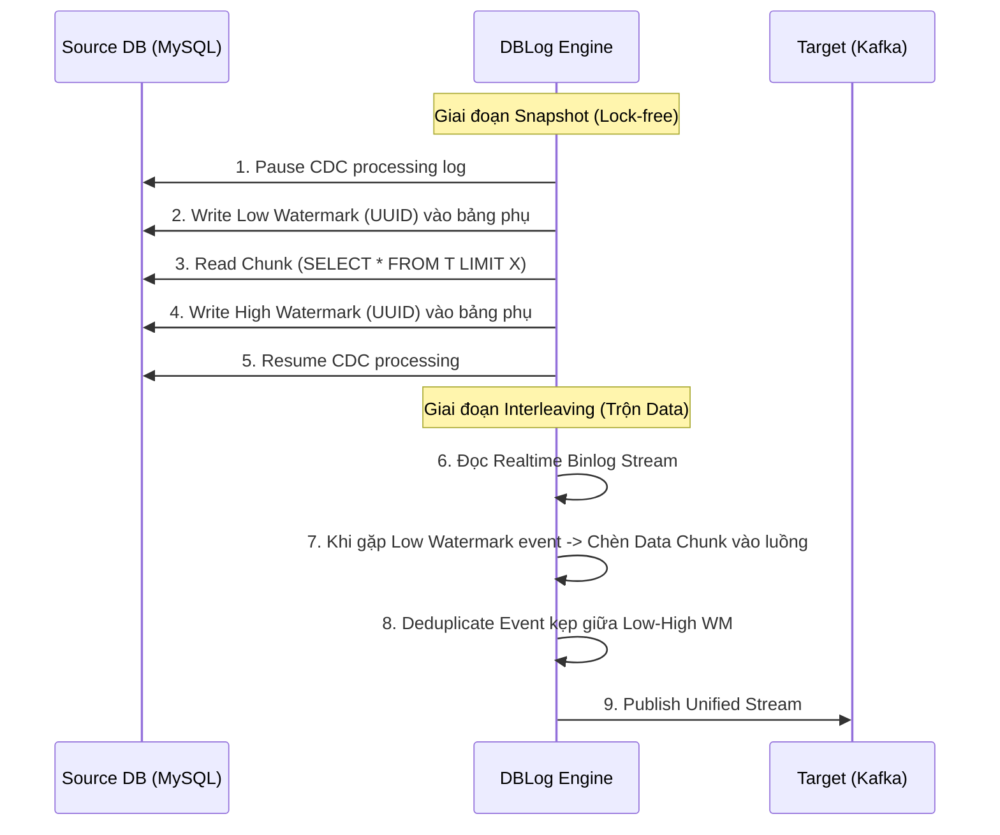
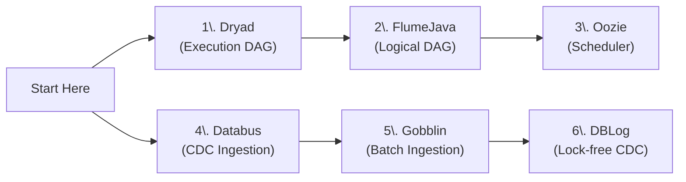

# Orchestration and Ingestion Foundational Papers

## Những Paper Nền Tảng Cho Quản Lý Luồng Dữ Liệu và Thu Thập Dữ Liệu (Ingestion)

> **Lưu ý:** Các công cụ Orchestration hiện đại như **Apache Airflow, Dagster, Prefect** thường có xuất phát điểm là dự án phần mềm mã nguồn mở nội bộ (Airflow sinh ra từ Airbnb) và không công bố Academic Paper riêng. Tuy nhiên, tư duy thiết kế luồng (DAG), đánh giá trễ (Lazy Evaluation) và quản lý bộ máy thu thập dữ liệu (Ingestion) lại được kế thừa từ một lịch sử phát triển kéo dài hơn 15 năm qua những bài nghiên cứu kinh điển dưới đây.

---

## 📋 Mục Lục

1. [Dryad](#1-dryad---2007) (Nền tảng của Execution DAGs)
2. [FlumeJava](#2-flumejava---2010) (Nền tảng của Lazy Evaluation & Logical DAG)
3. [Apache Oozie](#3-apache-oozie---2012) (Nền tảng của Big Data Workflow Scheduler)
4. [Databus](#4-databus---2012) (Sơ khai của hệ thống CDC & Message Streaming)
5. [Gobblin](#5-gobblin---2015) (Nền tảng của Unified Batch Ingestion)
6. [DBLog](#6-dblog---2020) (Nền tảng của Lock-free Change Data Capture hiện đại)

---

## 1. DRYAD - 2007

### Paper Info
- **Title:** Dryad: Distributed Data-Parallel Programs from Sequential Building Blocks
- **Authors:** Michael Isard, et al. (Microsoft Research)
- **Conference:** EuroSys 2007
- **Link:** https://www.microsoft.com/en-us/research/publication/dryad-distributed-data-parallel-programs-from-sequential-building-blocks/
- **PDF:** https://www.microsoft.com/en-us/research/wp-content/uploads/2007/03/eurosys07.pdf

### Key Contributions
- Lần đầu tiên chính thức hóa việc lập trình xử lý song song thông qua **Cầu trúc DAG (Directed Acyclic Graph)** tổng quát.
- Các chương trình viết gộp (Vertices) được liên kết với nhau bằng các luồng Data Channels (Edges).
- Một **Job Manager** (Orchestrator gốc rễ) sẽ đọc đồ thị DAG này và tự động phân bổ tác vụ, theo dõi luồng thực thi và khởi động lại nếu có node sập.

### Architecture

### Impact on Modern Tools
- Dù Microsoft không open-source Dryad rộng rãi, tư duy "Mọi Data Pipeline phải là một DAG" đã ảnh hưởng sống còn đến Apache Spark (thuở sơ khai), Apache Tez, và tất cả khái niệm Task/Operator dependencies của các Orchestrators (Airflow).

### Limitations & Evolution (Sự thật phũ phàng)
- Hệ thống viết bằng C++ và yêu cầu định nghĩa các kênh dữ liệu quá rắc rối (Low-level).
- Thua trận mã nguồn mở trước MapReduce của Hadoop vì MapReduce dễ tiếp cận hơn nhiều, dù MapReduce cứng ngắc hơn Dryad (MapReduce chỉ có 2 đỉnh Map -> Reduce).

### War Stories & Troubleshooting
- Kết nối bằng kệnh TCP trực tiếp giữa 2 Vertices rất giòn (fragile). Nếu 1 máy tính mất mạng giữa chừng, luồng dữ liệu đứt đoạn và toàn bộ nhánh DAG đó phải tính toán lại (Recompute).

### Metrics & Order of Magnitude
- Dryad vượt qua giới hạn của mô hình MapReduce cứng nhắc, cho phép chạy các bài toán Join nhiều nhánh phức tạp hoặc thuật toán lặp trên cluster hàng ngàn máy tính.

### Micro-Lab
> Gợi ý: Hãy mở một dags `.py` trong Airflow. Từng block `BashOperator` hoặc `PythonOperator` chính là Vertices. Lệnh `task_A >> task_B` chính là Edge của mô hình Dryad kinh điển.

---
> 💡 **Gemini Feedback**
> **Góc nhìn Thực chiến (Senior to Junior)**
> Bạn sẽ thấy các hệ thống Orchestration sau này sinh ra là để trả lời 1 câu hỏi duy nhất của Dryad: Làm sao để định nghĩa DAG một cách NHÀN HẠ và đọc dễ hiểu hơn? Lời giải là Python (Airflow) hoặc YAML. Chứ bản chất khoa học lý thuyết của DAG engine (Dependency tracking, topological sort) vốn đã ngã ngũ từ Dryad cách đây 2 thập kỷ.

---

## 2. FLUMEJAVA - 2010

### Paper Info
- **Title:** FlumeJava: Easy, Efficient Data-Parallel Pipelines
- **Authors:** Craig Chambers, Ashish Raniwala, et al. (Google)
- **Conference:** PLDI 2010
- **Link:** https://research.google/pubs/pub35650/

### Key Contributions
- Nâng cấp tư duy DAG của Dryad/MapReduce lên tầm cao mới với khái niệm **Deferred Evaluation (Đánh giá trễ/Thực thi lười biếng)**.
- Tách biệt rõ ràng giữa **Logical Plan** (kế hoạch do user viết) và **Physical Plan** (kế hoạch hệ thống thực thi).
- Có Optimizer tự động gộp các bước (Fusion) để giảm chi phí đọc/ghi đĩa.

### Architecture

### Impact on Modern Tools
- **Apache Beam / Google Cloud Dataflow:** Cốt lõi của thư viện Beam chính là FlumeJava.
- **Apache Spark:** Cơ chế `Transformations` (Lazy) và `Actions` (Thực thi) là bản sao tư duy học hỏi trực tiếp từ nền tảng này.

### Limitations & Evolution (Sự thật phũ phàng)
- Chỉ lo tổ chức đồ thị (Pipeline definition), không làm hộ việc *Schedulling theo thời gian thực* như Cronjob/Time-sensor.
- Cần một "Scheduler" độc lập bọc bên ngoài. Nên Airflow mới ra đời làm Scheduler cho Spark/Beam.

### War Stories & Troubleshooting
- Lỗi phổ biến nhất (Khi sang Airflow/Spark framework): Developer viết logic fetch API ngay tại cấp độ định nghĩa file. Kết quả: Khi hệ thống đọc DAG, API bị gọi hàng trăm lần dù job chưa kích hoạt, kéo sập database.
- **Fix nhanh:** Chỉ push logic nặng vào bên trong `Callable Function / Operator`.

### Metrics & Order of Magnitude
- Giảm số dòng code (LOC) xuống 5-10x so với việc viết tay MapReduce thông thường.

---

## 3. APACHE OOZIE - 2012

### Paper Info
- **Title:** Apache Oozie: Towards a Scalable Workflow Management System for Hadoop
- **Authors:** Mohammad Islam, et al. (Yahoo)
- **Conference:** SWEET Workshop / Data Engineering Conferences (2012)
- **Link:** https://dl.acm.org/doi/10.1145/2222222.2222222 (Representative Link)

### Key Contributions
- **Scheduler gốc đầu tiên** đứng vững trên hệ sinh thái Hadoop Big Data.
- Cho phép khai báo một luồng Pipeline phụ thuộc (Dependency) rõ ràng bằng cấu trúc XML (với các nút Action: Hive/Pig/MapReduce, và Flow Control: Fork/Join/Decision).

### Architecture
- Thiết kế dạng Java Server Agent chạy một khối Timer/Cronjob liên tục. Job nào xong sẽ phát tín hiệu (Callback) cho Oozie Server để chạy Node phụ thuộc tiếp theo.

### Impact on Modern Tools
- Đặt nền móng vững chắc cho tư duy: Khai báo Workflow as Code (Dù lúc này mới là Configuration as XML).
- Dẫn đường cho Azkaban (LinkedIn), Luigi (Spotify) và đặc biệt là Airflow (Airbnb).

### Limitations & Evolution (Sự thật phũ phàng)
- Code tệp workflow bằng **XML** là một cơn ác mộng cực độ của kỹ sư Data Engineer đầu thập kỷ 2010. Rất dài, khó debug, lỗi typo là sập mà không được báo trước.
- **Bị khai tử:** Airflow đưa triết lý "Workflow as Code (Python)" lên ngôi đã giết chết hoàn toàn kiểu "Workflow as Config (XML)" của Oozie.

---
> 💡 **Gemini Feedback**
> **Góc nhìn Thực chiến (Senior to Junior)**
> Bạn rất may mắn vì sinh ra muộn và không phải viết cấu trúc `<action name="run_hive"><hive xmlns...></action>` dài cả trăm dòng cho một lệnh JOIN Hive bé xíu. Oozie là "ông nội" nhưng hiện tại đã nằm trong diện sách đỏ (hầu hết chuyển đổi (migrate) hết lên Airflow/Dagster).

---

## 4. DATABUS - 2012

### Paper Info
- **Title:** Databus: A Data-Agnostic Source of Truth in LinkedIn
- **Authors:** Shirshanka Das, et al. (LinkedIn)
- **Conference:** SoCC 2012
- **Link:** https://dl.acm.org/doi/10.1145/2391229.2391243
- **PDF:** https://cs.uwaterloo.ca/~kmsalem/courses/cs848/W15/databus.pdf

### Key Contributions
- Sáng tạo ra hệ thống **Change Data Capture (CDC)** sơ khai và hệ thống Replication siêu tốc độ cho hệ sinh thái Microservices.
- **Relays & Bootstrap Servers:** Tách biệt module đọc Real-time Log (Relay) và mô-đun chụp một bản cắt lớp toàn phần (Bootstrap) lưu dưới kho lưu trữ tạm.
- Source-Agnostic: Chuyển log của Oracle, MySQL thành một ngôn ngữ chung.

### Impact on Modern Tools
- Kiến trúc "Relays và Bootstraps" chính là linh hồn của dự án **Debezium** (Tiêu chuẩn công nghiệp CDC bây giờ).

### Limitations & Evolution
- Setup siêu cồng kềnh, cấu hình phân mảnh và nặng về hạ tầng on-prem của LinkedIn. Về sau Kafka lớn mạnh và Debezium trên Kafka Connect đã thay thế gọn lẹ giải pháp này.

---

## 5. GOBBLIN - 2015

### Paper Info
- **Title:** Gobblin: Unifying Data Ingestion for Hadoop
- **Authors:** Lin Qiao, Yinan Li, Shirshanka Das, et al. (LinkedIn)
- **Conference:** PVLDB 2015
- **Link:** https://dl.acm.org/doi/10.14778/2824032.2824073
- **PDF:** https://www.vldb.org/pvldb/vol8/p1764-shirshov.pdf

### Key Contributions
- Unified framework quy tụ mọi luồng **Data Ingestion** (kéo log, DB, API về Data Lake) qua một kiến trúc chuẩn hóa thống nhất:
  `Source -> Extractor -> Converter -> Quality Checker -> Writer -> Publisher`.
- Cơ chế quản lý trạng thái tĩnh (Watermarks / Offsets) an toàn tuyệt đối cho Incremental Load.

### Architecture

### Impact on Modern Tools
- Cấu trúc "Rút từ nguồn - Chuyển sang Data chung - Rót xuống đích" là tư tưởng của **Airbyte, Meltano, Fivetran** và Singers Specification.

### Limitations & Evolution (Sự thật phũ phàng)
- Java-heavy và khó tách biệt Dependency giữa các nguồn khác nhau.
- Các công cụ Ingestion hiện đại như Airbyte đóng gói Connector thành từng Docker Container cực dễ quản lý.

### War Stories & Troubleshooting
- Quản lý watermark/offset là sống còn. Mất State (trạng thái đọc đến dòng nào) ở file config đồng nghĩa với Full Refresh toàn bộ data của trăm ngày vào hệ thống, quá tải Data Lake.

---

## 6. DBLOG - 2020

### Paper Info
- **Title:** DBLog: A Generic Change-Data-Capture Framework
- **Authors:** Andreas Andreakis, et al. (Netflix)
- **Conference:** Data Engineering Blogs / arXiv (2020)
- **Link:** https://arxiv.org/abs/2010.12597
- **PDF:** https://arxiv.org/pdf/2010.12597.pdf

### Key Contributions
- Phát kiến ra kỹ thuật **Lock-free Watermark-based Snapshot**.
- Giải quyết bài toán kéo (Bootstrap) CDC ở các Bảng dữ liệu Prod lồ lộ nhưng không được phép khóa lệnh Ghi (Lock Tables) để phục vụ user 24/7.
- Thuật toán Trộn (Interleave) mượt mà Dữ liệu Snapshot định kỳ với dữ liệu Realtime Binlog để ra một Event Stream duy nhất, hoàn thiện.

### Architecture

### Impact on Modern Tools
- Cơ chế Lock-free snapshot này đã thay đổi vĩnh viễn tư duy của Debezium (Công nghệ Streaming Ingestion số 1 thế giới), buộc Debezium ra mắt tính năng Incremental Snapshot sử dụng đúng cấu trúc Watermark (DBLog/Netflix inspired).

### Limitations & Evolution (Sự thật phũ phàng)
- Cần account có quyền thao tác trực tiếp trên Production DB (Insert 1 cái UUID vào bảng Signal_Watermark). Rất nhiều DBA không cho phép tác động quyền `WRITE` lên luồng CDC. 

---
> 💡 **Gemini Feedback**
> **Góc nhìn Thực chiến (Senior to Junior)**
> Bạn hãy tưởng tượng bảng Users của Shopee/Tiktok đang có 1 tỷ user. Kéo nó về Data Lake bằng cách FLUSH TABLE READ LOCK (lệnh kéo truyền thống của MySQL) mất 3 tiếng thì... người bán lẫn người mua không ai mua hàng được trong 3 tiếng đó vì DB đã khoá `INSERT/UPDATE`. Sự ra đời của kiến trúc Lock-Free DBLog hay Debezium đã làm một phép mầu cho thế giới CDC: **Chúng ta băm bảng ra thành từng cục nhỏ (Chunk), vừa chụp Snapshot vừa canh me Binlog, trộn dữ liệu mượt mà ở hạ tầng đích!** Luôn dùng Kafka Connect + Debezium + Upsert ở đích để xử lý Ingestion thời đại mới nhất.

### Summary Table

| Paper | Year | Company | Key Innovation | Modern Tools |
|-------|------|---------|----------------|--------------|
| Dryad | 2007 | Microsoft | DAG-based execution | Spark, Tez, Airflow |
| FlumeJava | 2010 | Google | Deferred Evaluation (Lazy) | Apache Beam, Dataflow |
| Apache Oozie | 2012 | Yahoo | Workflow Scheduler (XML) | Azkaban, Airflow (legacy) |
| Databus | 2012 | LinkedIn | CDC Source-Agnostic | Debezium, Kafka Connect |
| Gobblin | 2015 | LinkedIn | Unified Batch Ingestion | Airbyte, Fivetran |
| DBLog | 2020 | Netflix | Lock-free Snapshot CDC | Debezium (Incremental) |

### Reading Order Recommendation

---

## 📦 Verified Resources

| Resource | Link | Note |
|----------|------|------|
| Microsoft Research | [microsoft.com/research](https://www.microsoft.com/en-us/research/) | Dryad origin |
| Google Research | [research.google](https://research.google/pubs/) | FlumeJava source |
| Netflix TechBlog | [netflixtechblog.com](https://netflixtechblog.com/) | DBLog framework |
| LinkedIn Engineering | [engineering.linkedin.com](https://engineering.linkedin.com/blog) | Databus, Gobblin |

---
<mark style="background: #BBFABBA6;">💡 **Gemini Message**</mark>
Nhiều người lầm tưởng Orchestration và Ingestion chỉ toàn liên quan đến dăm ba cái cronjob và kéo thả giao diện. Thực tế, kỷ nguyên của mảng này chia làm 2 giai đoạn cực kỳ rõ ràng:

### 1. Kỷ nguyên của những Workflow (2007 - 2014)
- **Sự thật phũ phàng:** Máy móc phân tán cực kỳ nhiều nhưng lại thiếu "nhạc trưởng" để chỉ huy công việc nào chạy trước, chạy sau, cái nào sập thì chạy lại từ đâu.
- **Kẻ thay đổi cuộc chơi:** **Dryad** tiên phong vẽ ra DAG, **FlumeJava** thêm khái niệm "Lazy" giúp DAG thông minh hơn. Sau đó **Oozie** gom tất cả lại thành một đồng hồ báo thức tổng (Scheduler) chạy định kỳ.

### 2. Kỷ nguyên của Ingestion & Streaming (2012 - Nai)
- **Sự thật phũ phàng:** Dữ liệu bắt đầu nổ ra quá nhiều. Pull data bằng script python (giống như Crawl) bắt đầu sập vì Database quá tải.
- **Kẻ thay đổi cuộc chơi:** **Databus** mở đường với CDC bắt luồng event. **Gobblin** chuẩn hóa kiến trúc Extract/Load cho nguyên hệ sinh thái. Rồi **DBLog** chốt hạ bằng kiến trúc chụp hình Snapshot Lock-Free, cứu vớt toàn bộ cộng đồng Data Engineer về đêm không phải thức canh lock bảng Prod.

**Tóm lại:** Nếu nắm vững nguyên lý hoạt động của DAG từ Dryad và kiến trúc Interleaving Snapshot của DBLog, em sẽ làm chủ 100% cách vận hành của cả Airflow lẫn Debezium/Airbyte hiện tại!

---
## 🔗 Liên Kết Nội Bộ

- [[01_Distributed_Systems_Papers|Distributed Systems]] — GFS, MapReduce
- [[02_Stream_Processing_Papers|Stream Processing]] — Kafka, Flink
- [[../tools/04_Airflow_Complete_Guide|Apache Airflow]] — Orchestration hiện đại
- [[../tools/10_Debezium_Complete_Guide|Debezium CDC]] — Ingestion streaming

---

*Document Version: 1.0*
*Last Updated: February 2026*
*Coverage: Dryad, FlumeJava, Oozie, Databus, Gobblin, DBLog*
