# Execution Engine Papers

## Những Paper Nền Tảng Cho Các Engine Thực Thi Dữ Liệu Phân Tán

> **Lưu ý:** File này tập trung vào **execution internals** — cách engine schedule, shuffle, quản lý memory và thực thi query. Các khía cạnh khác (optimizer, streaming model, file format) đã được cover ở các file chuyên biệt và được liên kết bằng Obsidian links.

---

## 📋 Mục Lục

1. [MapReduce Execution Model](#1-mapreduce-execution-model---2004)
2. [Apache Tez](#2-apache-tez---2015)
3. [Apache Spark Core](#3-apache-spark-core---2012)
4. [Dremel / BigQuery](#4-dremel--bigquery---2010)
5. [Impala](#5-impala---2015)
6. [Presto / Trino](#6-presto--trino---2019)
7. [Flink Runtime](#7-flink-runtime---2017)
8. [Ray](#8-ray---2018)
9. [DuckDB](#9-duckdb---2019)
10. [ClickHouse](#10-clickhouse---2024)
11. [Photon & Velox](#11-photon--velox---2022)
12. [Apache DataFusion](#12-apache-datafusion---2024)
13. [Emerging Engines](#13-emerging-engines)
14. [Tổng Kết & Evolution](#14-tổng-kết--evolution)

---

## 1. MAPREDUCE EXECUTION MODEL - 2004

> 📖 **Overview & impact:** xem [[01_Distributed_Systems_Papers#2-mapreduce---2004]]. Section này focus vào **execution internals**.

### Paper Info
- **Title:** MapReduce: Simplified Data Processing on Large Clusters
- **Authors:** Jeffrey Dean, Sanjay Ghemawat (Google)
- **Conference:** OSDI 2004
- **Link:** https://research.google/pubs/pub62/
- **PDF:** https://static.googleusercontent.com/media/research.google.com/en//archive/mapreduce-osdi04.pdf

### Execution Architecture

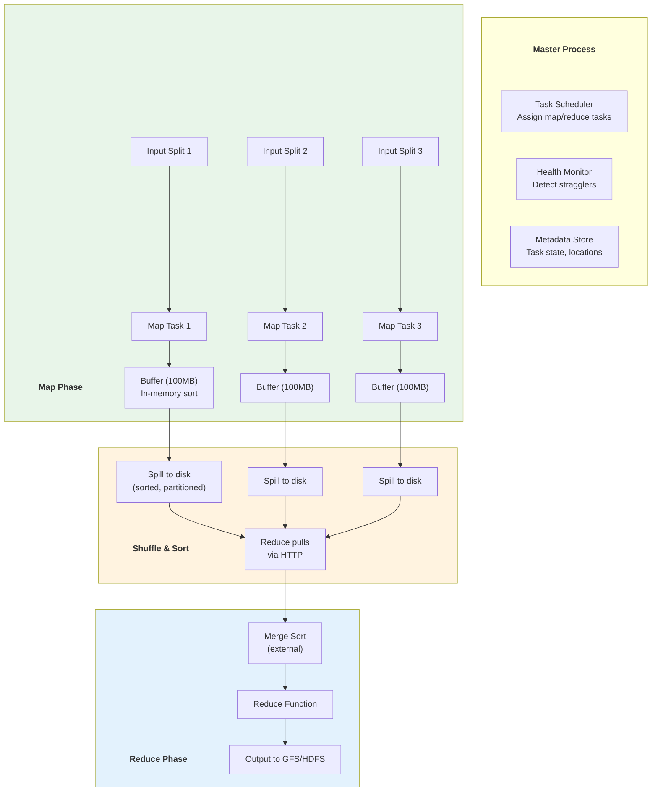
```mermaid
graph TD
    subgraph Master[" "]
        Master_title["Master Process"]
        style Master_title fill:none,stroke:none,color:#333,font-weight:bold
        Sched["Task Scheduler<br/>Assign map/reduce tasks"]
        Monitor["Health Monitor<br/>Detect stragglers"]
        Meta["Metadata Store<br/>Task state, locations"]
    end

    subgraph MapPhase[" "]
        MapPhase_title["Map Phase"]
        style MapPhase_title fill:none,stroke:none,color:#333,font-weight:bold
        Split1["Input Split 1"] --> M1["Map Task 1"]
        Split2["Input Split 2"] --> M2["Map Task 2"]
        Split3["Input Split 3"] --> M3["Map Task 3"]
        M1 --> Buf1["Buffer (100MB)<br/>In-memory sort"]
        M2 --> Buf2["Buffer (100MB)"]
        M3 --> Buf3["Buffer (100MB)"]
    end

    subgraph Shuffle[" "]
        Shuffle_title["Shuffle & Sort"]
        style Shuffle_title fill:none,stroke:none,color:#333,font-weight:bold
        Buf1 --> Spill1["Spill to disk<br/>(sorted, partitioned)"]
        Buf2 --> Spill2["Spill to disk"]
        Buf3 --> Spill3["Spill to disk"]
        Spill1 --> Pull["Reduce pulls<br/>via HTTP"]
        Spill2 --> Pull
        Spill3 --> Pull
    end

    subgraph ReducePhase[" "]
        ReducePhase_title["Reduce Phase"]
        style ReducePhase_title fill:none,stroke:none,color:#333,font-weight:bold
        Pull --> Merge["Merge Sort<br/>(external)"]
        Merge --> R1["Reduce Function"]
        R1 --> Out["Output to GFS/HDFS"]
    end

    style MapPhase fill:#e8f5e9
    style Shuffle fill:#fff3e0
    style ReducePhase fill:#e3f2fd
```

### Shuffle Sort Deep Dive

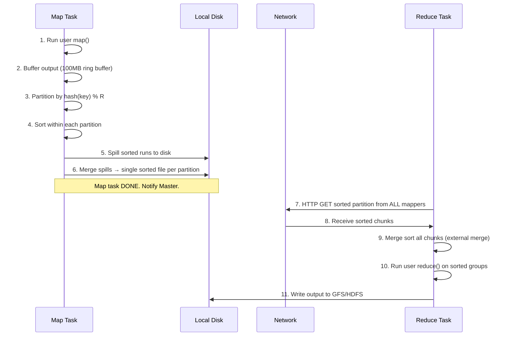
```mermaid
sequenceDiagram
    participant Map as Map Task
    participant Disk as Local Disk
    participant Net as Network
    participant Reduce as Reduce Task

    Map->>Map: 1. Run user map()
    Map->>Map: 2. Buffer output (100MB ring buffer)
    Map->>Map: 3. Partition by hash(key) % R
    Map->>Map: 4. Sort within each partition
    Map->>Disk: 5. Spill sorted runs to disk
    Map->>Disk: 6. Merge spills → single sorted file per partition

    Note over Map,Disk: Map task DONE. Notify Master.

    Reduce->>Net: 7. HTTP GET sorted partition from ALL mappers
    Net->>Reduce: 8. Receive sorted chunks
    Reduce->>Reduce: 9. Merge sort all chunks (external merge)
    Reduce->>Reduce: 10. Run user reduce() on sorted groups
    Reduce->>Disk: 11. Write output to GFS/HDFS
```

### Key Execution Features

| Feature | Mechanism | Why |
|---------|-----------|-----|
| **Combiner** | Mini-reduce on map side | Giảm 10-100x network I/O cho word-count-like jobs |
| **Speculative Execution** | Chạy backup task cho stragglers | Task chậm nhất quyết định job latency |
| **Locality** | Schedule map gần data | GFS chunk → map trên cùng node → zero network |
| **Partitioner** | hash(key) % R mặc định | Đảm bảo cùng key tới cùng reducer |

### Impact on Modern Tools
- **Hadoop MapReduce** — Direct open-source implementation
- **Shuffle concept** — Still used in Spark, Flink, Tez
- **Speculative execution** — Adopted by Spark, Tez

### Limitations & Evolution (Sự thật phũ phàng)
- **GHI XUỐNG ĐĨA SAU MỖI BƯỚC.** Map xong ghi đĩa. Shuffle qua network. Reduce đọc lại từ đĩa. Một job 3 bước = 6 lần I/O đĩa. Chạy iterative ML algorithm 100 vòng = 600 lần I/O. Đây là lý do MapReduce bị Spark giết.
- Rigid 2-phase model: Map → Reduce. Muốn JOIN 3 bảng? Chain 2-3 MapReduce jobs thủ công.

### War Stories & Troubleshooting
- Lỗi kinh điển: **Reduce slot starvation** — tất cả reduces chờ map cuối cùng (straggler). Fix: speculative execution + bật `mapreduce.job.speculative.execution`.
- **GC pressure:** Buffer 100MB × nhiều tasks = OOM. Tune `io.sort.mb` và `io.sort.factor`.

### Metrics & Order of Magnitude
- Shuffle chiếm 30-70% tổng thời gian MapReduce job.
- Combiner có thể giảm shuffle data 10-100x cho aggregation workloads.
- Speculative execution thêm ~5% tải cluster nhưng giảm tail latency 30-50%.

### Micro-Lab
```bash
# Đo shuffle size trên Hadoop
hadoop job -status <job_id> | grep "Shuffle Bytes"
# So sánh Map Output bytes vs Reduce Input bytes
# Nếu tỷ lệ > 5x → cần Combiner
```

---
> 💡 **Gemini Feedback**
> **Góc nhìn Thực chiến (Senior to Junior)**
> MapReduce là "assembly language" của Big Data. Em không cần viết MapReduce job nữa (Spark/Flink đã thay), nhưng **PHẢI hiểu shuffle**. Vì khi Spark job chậm, 90% vấn đề nằm ở shuffle. Shuffle trong Spark chỉ là shuffle của MapReduce được optimize thêm — cùng bản chất: partition, sort, merge, network transfer.

---

## 2. APACHE TEZ - 2015

### Paper Info
- **Why no academic paper?** Polars là một dự án open-source xuất phát từ nhu cầu thực tiễn của Richie Vink (2020) viết bằng Rust, thay vì xuất phát từ các lab nghiên cứu đại học như Spark (AMPLab Berkeley). Tài liệu chuẩn nhất là User Guide của Polars.
- **Creator:** Ritchie Vink
- **Released:** 2020
- **Title:** Apache Tez: A Unifying Framework for Modeling and Building Data Processing Applications
- **Authors:** Bikas Saha, Hitesh Shah, et al.
- **Conference:** SIGMOD 2015
- **Link:** https://dl.acm.org/doi/10.1145/2723372.2742790

### Key Contributions
- Generalized DAG execution thay cho rigid Map→Reduce
- Container reuse trên YARN (không cần restart JVM mỗi task)
- Runtime DAG reconfiguration (thay đổi plan giữa chừng)
- Giết chết multi-job chaining của MapReduce

### DAG vs MapReduce

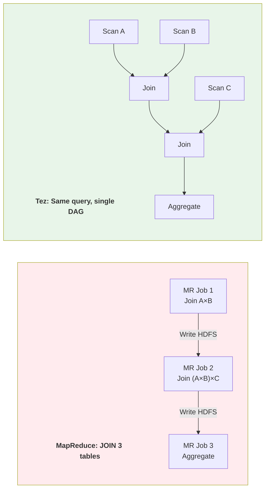
```mermaid
graph LR
    subgraph MR[" "]
        MR_title["MapReduce: JOIN 3 tables"]
        style MR_title fill:none,stroke:none,color:#333,font-weight:bold
        MR1["MR Job 1<br/>Join A×B"] -->|"Write HDFS"| MR2["MR Job 2<br/>Join (A×B)×C"]
        MR2 -->|"Write HDFS"| MR3["MR Job 3<br/>Aggregate"]
    end

    subgraph Tez[" "]
        Tez_title["Tez: Same query, single DAG"]
        style Tez_title fill:none,stroke:none,color:#333,font-weight:bold
        T1["Scan A"] --> TJ1["Join"]
        T2["Scan B"] --> TJ1
        TJ1 --> TJ2["Join"]
        T3["Scan C"] --> TJ2
        TJ2 --> TA["Aggregate"]
    end

    style MR fill:#ffebee
    style Tez fill:#e8f5e9
```

### Container Reuse

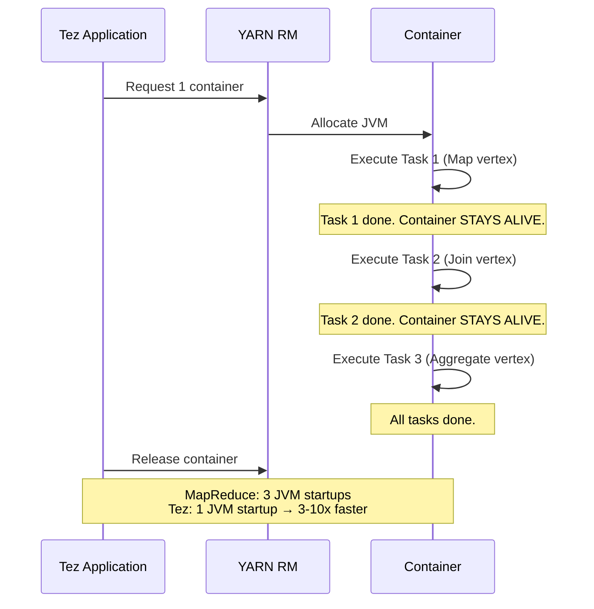
```mermaid
sequenceDiagram
    participant App as Tez Application
    participant YARN as YARN RM
    participant Container as Container

    App->>YARN: Request 1 container
    YARN->>Container: Allocate JVM
    Container->>Container: Execute Task 1 (Map vertex)
    Note over Container: Task 1 done. Container STAYS ALIVE.
    Container->>Container: Execute Task 2 (Join vertex)
    Note over Container: Task 2 done. Container STAYS ALIVE.
    Container->>Container: Execute Task 3 (Aggregate vertex)
    Note over Container: All tasks done.
    App->>YARN: Release container

    Note over App,Container: MapReduce: 3 JVM startups<br/>Tez: 1 JVM startup → 3-10x faster
```

### Impact on Modern Tools
- **Hive on Tez** — 3-10x faster than Hive on MapReduce
- **Pig on Tez** — Same performance gains
- **Spark** — Adopted similar DAG concepts independently
- **Concept lives on** in every modern engine's task scheduling

### Limitations & Evolution (Sự thật phũ phàng)
- Vẫn gắn chặt với **YARN** → không chạy được trên Kubernetes native.
- Khi Spark 2.x mature (2016-2017) với API tốt hơn, Tez dần bị bỏ quên. Hive cũng chuyển sang Hive LLAP (long-lived daemons) thay vì Tez containers.
- **Bài học:** Execution engine tốt nhưng thiếu developer experience sẽ thua engine có API hay (Spark).

### War Stories & Troubleshooting
- Lỗi phổ biến: container bị kill vì **YARN memory limit** nhưng Tez log không rõ ràng. Fix: tăng `tez.am.resource.memory.mb` và bật `tez.task.generate.counters.per.io`.

### Metrics & Order of Magnitude
- Container reuse giảm JVM startup overhead từ 10-30s/task xuống gần 0.
- Hive on Tez thường nhanh hơn 3-10x so với Hive on MapReduce cho complex joins.
- Intermediate data giữ trong memory thay vì HDFS giảm I/O 2-5x.

### Micro-Lab
```sql
-- So sánh Hive on MR vs Tez
SET hive.execution.engine=mr;
SELECT COUNT(*) FROM large_table JOIN dim ON ...;
-- Ghi lại thời gian

SET hive.execution.engine=tez;
SELECT COUNT(*) FROM large_table JOIN dim ON ...;
-- So sánh: expect 3-10x improvement
```

---
> 💡 **Gemini Feedback**
> **Góc nhìn Thực chiến (Senior to Junior)**
> Tez là "thế hệ chuyển tiếp" — nó chứng minh rằng DAG execution > rigid MapReduce, nhưng rồi Spark làm điều tương tự với API đẹp hơn 100 lần. Bài học quan trọng nhất từ Tez: **Container reuse** — đây là concept mà Spark cũng dùng (executor reuse), Flink cũng dùng (TaskManager long-lived). Khi em thấy Spark executor khởi động chậm, hãy nhớ đến Tez.

---

## 3. APACHE SPARK CORE - 2012

> 📖 **Spark SQL & Catalyst optimizer:** xem [[09_Query_Optimization_Papers]]. **Spark Streaming:** xem [[02_Stream_Processing_Papers#6-spark-streaming---2013]]. Section này focus vào **core execution engine**.

### Paper Info
- **Title:** Resilient Distributed Datasets: A Fault-Tolerant Abstraction for In-Memory Cluster Computing
- **Authors:** Matei Zaharia, Mosharaf Chowdhury, et al. (UC Berkeley)
- **Conference:** NSDI 2012
- **Link:** https://www.usenix.org/conference/nsdi12/technical-sessions/presentation/zaharia
- **PDF:** https://www.usenix.org/system/files/conference/nsdi12/nsdi12-final138.pdf

### Key Contributions
- **RDD** — Immutable, partitioned, fault-tolerant in-memory collection
- **Lineage-based recovery** thay cho data replication (GFS/HDFS style)
- **DAG scheduler** với narrow/wide dependency awareness
- **In-memory computing** — 10-100x faster than MapReduce cho iterative workloads

### DAG Scheduler Architecture

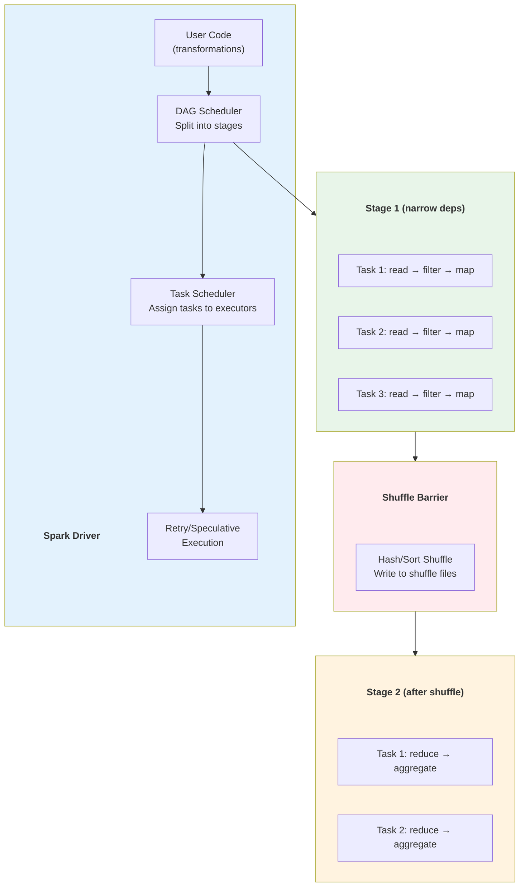
```mermaid
graph TD
    subgraph Driver[" "]
        Driver_title["Spark Driver"]
        style Driver_title fill:none,stroke:none,color:#333,font-weight:bold
        Code["User Code<br/>(transformations)"] --> DAG["DAG Scheduler<br/>Split into stages"]
        DAG --> TaskSched["Task Scheduler<br/>Assign tasks to executors"]
        TaskSched --> Retry["Retry/Speculative<br/>Execution"]
    end

    subgraph Stage1[" "]
        Stage1_title["Stage 1 (narrow deps)"]
        style Stage1_title fill:none,stroke:none,color:#333,font-weight:bold
        T1["Task 1: read → filter → map"]
        T2["Task 2: read → filter → map"]
        T3["Task 3: read → filter → map"]
    end

    subgraph ShuffleBarrier[" "]
        ShuffleBarrier_title["Shuffle Barrier"]
        style ShuffleBarrier_title fill:none,stroke:none,color:#333,font-weight:bold
        Shuffle["Hash/Sort Shuffle<br/>Write to shuffle files"]
    end

    subgraph Stage2[" "]
        Stage2_title["Stage 2 (after shuffle)"]
        style Stage2_title fill:none,stroke:none,color:#333,font-weight:bold
        R1["Task 1: reduce → aggregate"]
        R2["Task 2: reduce → aggregate"]
    end

    DAG --> Stage1
    Stage1 --> ShuffleBarrier
    ShuffleBarrier --> Stage2

    style Driver fill:#e3f2fd
    style Stage1 fill:#e8f5e9
    style ShuffleBarrier fill:#ffebee
    style Stage2 fill:#fff3e0
```

### Narrow vs Wide Dependencies

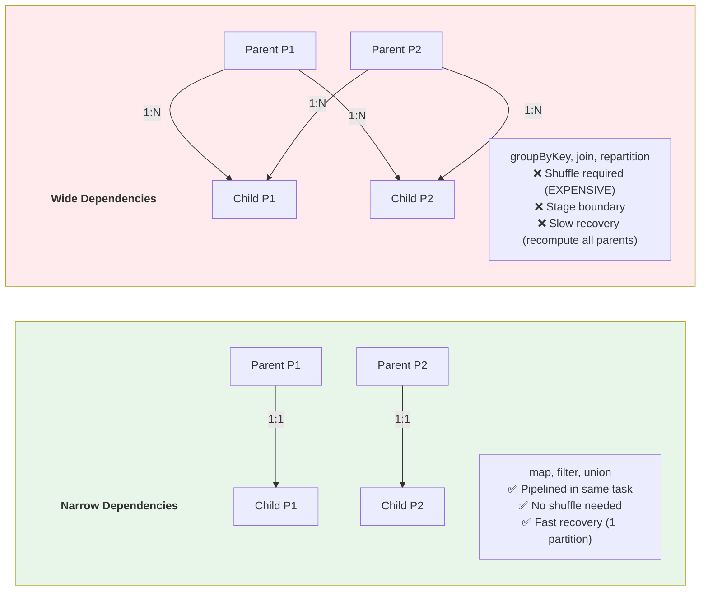
```mermaid
graph LR
    subgraph Narrow[" "]
        Narrow_title["Narrow Dependencies"]
        style Narrow_title fill:none,stroke:none,color:#333,font-weight:bold
        NP1["Parent P1"] -->|"1:1"| NC1["Child P1"]
        NP2["Parent P2"] -->|"1:1"| NC2["Child P2"]
        NNote["map, filter, union<br/>✅ Pipelined in same task<br/>✅ No shuffle needed<br/>✅ Fast recovery (1 partition)"]
    end

    subgraph Wide[" "]
        Wide_title["Wide Dependencies"]
        style Wide_title fill:none,stroke:none,color:#333,font-weight:bold
        WP1["Parent P1"] -->|"1:N"| WC1["Child P1"]
        WP1 -->|"1:N"| WC2["Child P2"]
        WP2["Parent P2"] -->|"1:N"| WC1
        WP2 -->|"1:N"| WC2
        WNote["groupByKey, join, repartition<br/>❌ Shuffle required (EXPENSIVE)<br/>❌ Stage boundary<br/>❌ Slow recovery (recompute all parents)"]
    end

    style Narrow fill:#e8f5e9
    style Wide fill:#ffebee
```

### Tungsten Memory Management

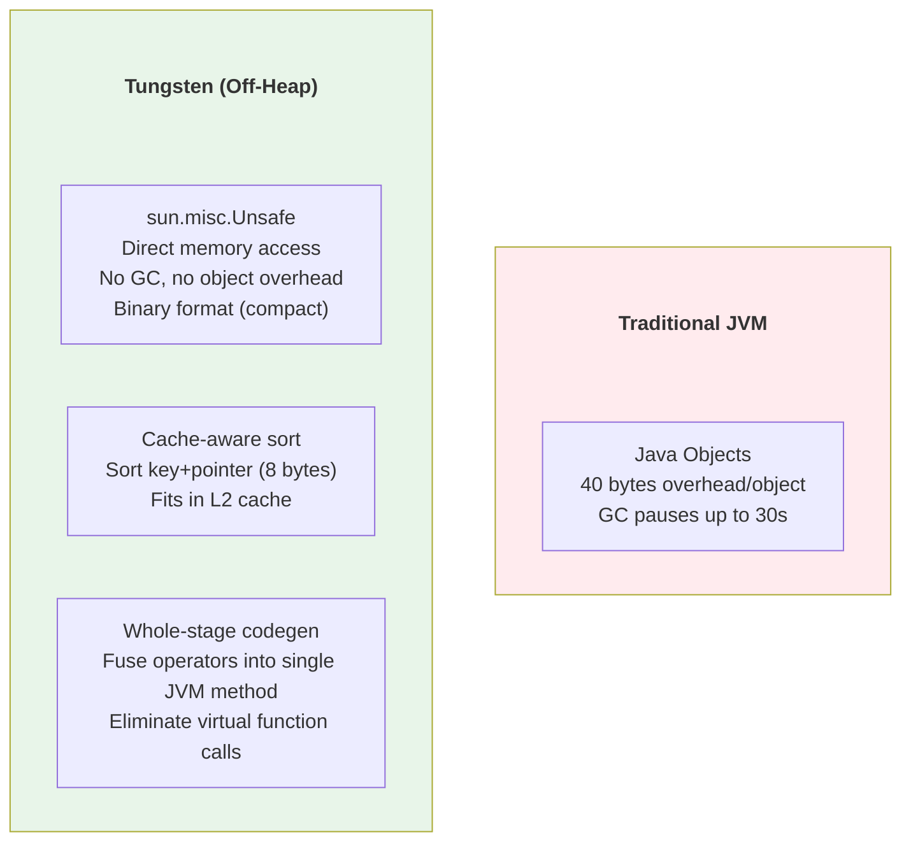
```mermaid
graph TD
    subgraph JVM[" "]
        JVM_title["Traditional JVM"]
        style JVM_title fill:none,stroke:none,color:#333,font-weight:bold
        Obj["Java Objects<br/>40 bytes overhead/object<br/>GC pauses up to 30s"]
    end

    subgraph Tungsten[" "]
        Tungsten_title["Tungsten (Off-Heap)"]
        style Tungsten_title fill:none,stroke:none,color:#333,font-weight:bold
        Unsafe["sun.misc.Unsafe<br/>Direct memory access<br/>No GC, no object overhead<br/>Binary format (compact)"]
        Sort["Cache-aware sort<br/>Sort key+pointer (8 bytes)<br/>Fits in L2 cache"]
        CodeGen["Whole-stage codegen<br/>Fuse operators into single JVM method<br/>Eliminate virtual function calls"]
    end

    style JVM fill:#ffebee
    style Tungsten fill:#e8f5e9
```

### Shuffle Evolution

| Version | Shuffle Type | Mechanism |
|---------|-------------|-----------|
| Spark 0.x | Hash Shuffle | 1 file per map×reduce pair → OOM with many partitions |
| Spark 1.2+ | Sort Shuffle | 1 sorted file per map task → scalable |
| Spark 2.0+ | Tungsten Sort | Off-heap sort, binary format, zero-copy |
| Spark 3.0+ | Push-based | Pre-merge on shuffle service → reduce fetch overhead |

### Impact on Modern Tools
- **Databricks** — Commercial Spark platform
- **EMR, Dataproc, HDInsight** — Managed Spark clouds
- **PySpark/SparkR** — Data science standard
- **Delta Lake, Iceberg** — Built on Spark execution

### Limitations & Evolution (Sự thật phũ phàng)
- **JVM overhead là thật.** Dù Tungsten tối ưu, Spark vẫn chạy trên JVM. Python UDF qua PySpark phải serialize/deserialize qua Arrow → latency. Đây là lý do Photon (C++) và Velox (C++) ra đời.
- **Shuffle là nút thắt vĩnh cửu.** Spark shuffle vẫn ghi đĩa. Push-based shuffle (3.2+) giúp nhưng không triệt để.
- **Small file problem:** Spark tạo 1 file per partition per task → dễ sinh triệu file nhỏ trên S3.

### War Stories & Troubleshooting
- **Data Skew:** 1 partition chứa 80% data → 1 task chạy 10 giờ, 199 tasks chạy 2 phút. Fix: `spark.sql.adaptive.skewJoin.enabled=true` (AQE) hoặc salting key.
- **OOM trên executor:** Thường do broadcast join quá lớn hoặc shuffle spill. Check `spark.executor.memoryOverhead`.
- **Shuffle spill:** Khi thấy "spill to disk" trong Spark UI → tăng `spark.executor.memory` hoặc tăng partition count.

### Metrics & Order of Magnitude
- Spark 10-100x nhanh hơn MapReduce cho iterative workloads (ML, graph).
- Shuffle data = bottleneck #1. Mỗi GB shuffle ≈ 3-5s overhead (disk + network).
- AQE (Spark 3.0+) tự động fix skew và coalesce, giảm manual tuning 80%.

### Micro-Lab
```python
# Kiểm tra shuffle size trong Spark
spark.sql("SELECT key, COUNT(*) FROM big_table GROUP BY key").explain(True)
# Xem Physical Plan → Exchange (shuffle) node
# Check Spark UI → Stages tab → Shuffle Read/Write size

# Test AQE impact
spark.conf.set("spark.sql.adaptive.enabled", "true")
spark.conf.set("spark.sql.adaptive.skewJoin.enabled", "true")
# Re-run query và so sánh shuffle metrics
```

---
> 💡 **Gemini Feedback**
> **Góc nhìn Thực chiến (Senior to Junior)**
> 3 thứ em PHẢI master về Spark execution:
> 1. **Đọc Spark UI** — Stages tab cho biết shuffle size, task duration skew, spill metrics
> 2. **Hiểu khi nào shuffle xảy ra** — JOIN, GROUP BY, REPARTITION, DISTINCT đều trigger shuffle
> 3. **AQE là bạn thân** — Bật `spark.sql.adaptive.enabled=true` rồi quên đi 80% tuning thủ công
>
> Rule of thumb: Nếu 1 stage có 200 tasks mà 1 task chạy lâu gấp 10x → đó là data skew. Nếu tất cả tasks chậm đều nhau → thiếu resource hoặc shuffle quá lớn.

---

## 4. DREMEL / BIGQUERY - 2010

> 📖 **Dremel overview & columnar format:** xem [[01_Distributed_Systems_Papers#7-dremel---2010]] và [[10_Serialization_Format_Papers#3-apache-parquet---2013]]. Section này focus vào **execution tree model**.

### Paper Info
- **Title:** Dremel: Interactive Analysis of Web-Scale Datasets
- **Authors:** Sergey Melnik, Andrey Gubarev, et al. (Google)
- **Conference:** VLDB 2010
- **Link:** https://research.google/pubs/pub36632/
- **Retrospective:** "Dremel: A Decade of Interactive SQL Analysis at Web Scale" — SIGMOD Record 2020

### Key Contributions
- **Multi-level serving tree** — query phân tán qua tree of servers
- **Columnar nested data** — repetition/definition levels → Parquet
- **Serverless execution** — không cần provision cluster
- Chứng minh interactive analytics trên petabytes là khả thi

### Serving Tree Execution

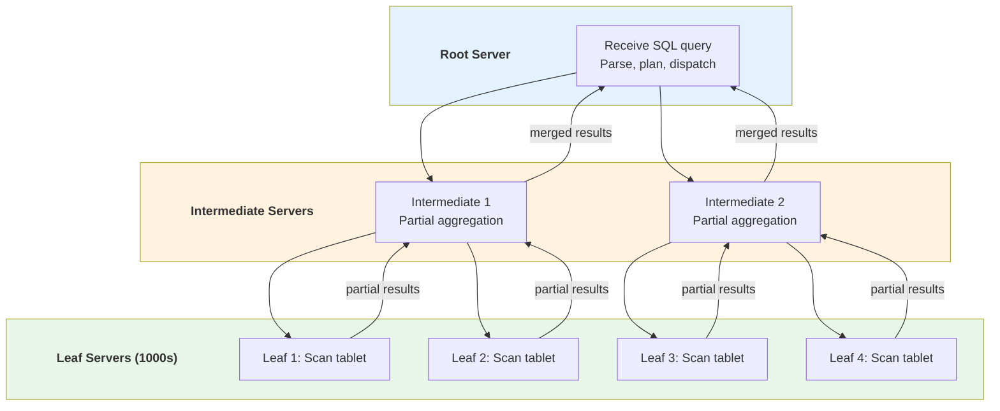
```mermaid
graph TD
    subgraph Root[" "]
        Root_title["Root Server"]
        style Root_title fill:none,stroke:none,color:#333,font-weight:bold
        RootNode["Receive SQL query<br/>Parse, plan, dispatch"]
    end

    subgraph Mid[" "]
        Mid_title["Intermediate Servers"]
        style Mid_title fill:none,stroke:none,color:#333,font-weight:bold
        I1["Intermediate 1<br/>Partial aggregation"]
        I2["Intermediate 2<br/>Partial aggregation"]
    end

    subgraph Leaf[" "]
        Leaf_title["Leaf Servers (1000s)"]
        style Leaf_title fill:none,stroke:none,color:#333,font-weight:bold
        L1["Leaf 1: Scan tablet"]
        L2["Leaf 2: Scan tablet"]
        L3["Leaf 3: Scan tablet"]
        L4["Leaf 4: Scan tablet"]
    end

    RootNode --> I1
    RootNode --> I2
    I1 --> L1
    I1 --> L2
    I2 --> L3
    I2 --> L4

    L1 -->|"partial results"| I1
    L2 -->|"partial results"| I1
    L3 -->|"partial results"| I2
    L4 -->|"partial results"| I2
    I1 -->|"merged results"| RootNode
    I2 -->|"merged results"| RootNode

    style Root fill:#e3f2fd
    style Mid fill:#fff3e0
    style Leaf fill:#e8f5e9
```

### Slot-based Execution (BigQuery)

| Concept | Description |
|---------|-------------|
| **Slot** | Unit of compute = 1 vCPU + memory. BigQuery tự scale |
| **Shuffle** | In-memory distributed shuffle (không ghi đĩa!) |
| **Capacitor** | Columnar format nội bộ (evolution of Dremel format) |
| **Borg** | Cluster manager cấp slot → xem [[01_Distributed_Systems_Papers#10-borg---2015]] |

### Impact on Modern Tools
- **Google BigQuery** — Commercial Dremel
- **Apache Parquet** — Dremel's columnar encoding → industry standard
- **Apache Drill** — Open-source Dremel-inspired
- **Impala, Presto** — Influenced by serving tree concept

### Limitations & Evolution (Sự thật phũ phàng)
- **Serverless = mất kiểm soát cost.** Query scan 5TB data? $25 mỗi query. Team 50 người chạy ad-hoc cả ngày → hóa đơn $50K/tháng.
- Không phù hợp cho low-latency serving (p99 > 1s). Dùng cho analytics, không phải API backend.
- **Evolution:** BigQuery BI Engine (in-memory acceleration), BigQuery Omni (multi-cloud).

### War Stories & Troubleshooting
- Lỗi kinh điển: **SELECT * FROM huge_table** quên WHERE clause → scan toàn bộ columnar storage → bill sốc.
- Fix: Dùng `--dry_run` để estimate cost trước. Set `maximum_bytes_billed` quota per user.

### Metrics & Order of Magnitude
- BigQuery scan throughput: ~1TB/s trên multi-thousand slots.
- Dremel serving tree cho phép sub-second query trên petabyte dataset.
- In-memory shuffle (không ghi đĩa) = nhanh hơn Spark shuffle 5-10x cho ad-hoc queries.

### Micro-Lab
```sql
-- BigQuery: estimate cost trước khi chạy
SELECT * FROM `project.dataset.table`
WHERE date = '2024-01-01'
-- Check "This query will process X GB" trước khi Run
-- Rule: $5/TB scanned (on-demand pricing)
```

---
> 💡 **Gemini Feedback**
> **Góc nhìn Thực chiến (Senior to Junior)**
> Dremel/BigQuery dạy em 1 bài học lớn: **Execution engine mạnh nhất là engine em không cần quản lý.** Serverless là tương lai, nhưng serverless cũng có giá — và giá đó nằm trong bill hàng tháng. Khi start-up, BigQuery rẻ hơn self-host Spark. Khi scale lên 100TB/ngày, self-host Spark/Trino trên K8s rẻ hơn BigQuery 3-5x.

---

## 5. IMPALA - 2015

### Paper Info
- **Title:** Impala: A Modern, Open-Source SQL Engine for Hadoop
- **Authors:** Marcel Kornacker, Alexander Behm, et al.
- **Conference:** CIDR 2015
- **Link:** http://cidrdb.org/cidr2015/Papers/CIDR15_Paper28.pdf

### Key Contributions
- **First open-source Dremel-like MPP** trên Hadoop
- **LLVM runtime code generation** — compile query thành native code
- **No intermediate disk writes** — pipeline execution hoàn toàn in-memory
- Long-lived daemon processes (không có JVM startup overhead)

### Architecture

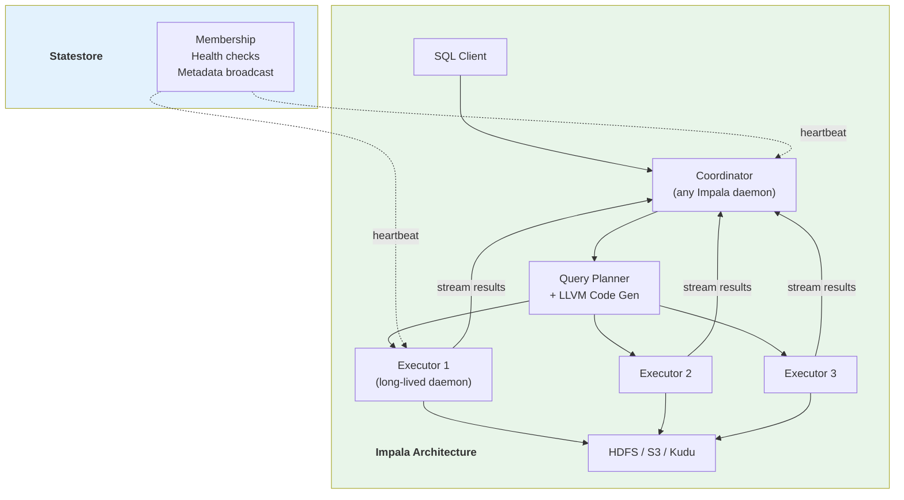
```mermaid
graph TD
    subgraph Impala[" "]
        Impala_title["Impala Architecture"]
        style Impala_title fill:none,stroke:none,color:#333,font-weight:bold

        Client["SQL Client"] --> Coord["Coordinator<br/>(any Impala daemon)"]
        Coord --> Plan["Query Planner<br/>+ LLVM Code Gen"]
        Plan --> Exec1["Executor 1<br/>(long-lived daemon)"]
        Plan --> Exec2["Executor 2"]
        Plan --> Exec3["Executor 3"]

        Exec1 --> HDFS["HDFS / S3 / Kudu"]
        Exec2 --> HDFS
        Exec3 --> HDFS

        Exec1 -->|"stream results"| Coord
        Exec2 -->|"stream results"| Coord
        Exec3 -->|"stream results"| Coord
    end

    subgraph StateStore[" "]
        SS_title["Statestore"]
        style SS_title fill:none,stroke:none,color:#333,font-weight:bold
        SS["Membership<br/>Health checks<br/>Metadata broadcast"]
    end

    SS -.->|"heartbeat"| Coord
    SS -.->|"heartbeat"| Exec1

    style Impala fill:#e8f5e9
    style StateStore fill:#e3f2fd
```

### LLVM Code Generation

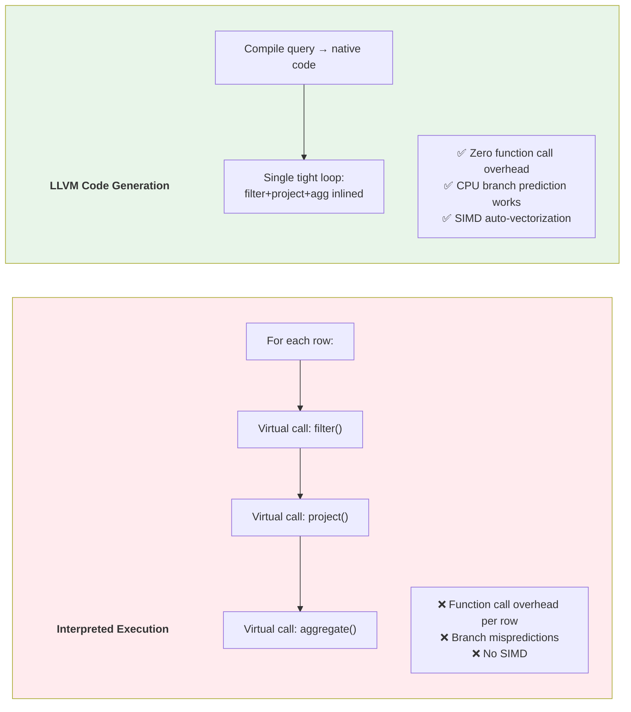
```mermaid
graph LR
    subgraph Traditional[" "]
        Trad_title["Interpreted Execution"]
        style Trad_title fill:none,stroke:none,color:#333,font-weight:bold
        TI1["For each row:"] --> TI2["Virtual call: filter()"]
        TI2 --> TI3["Virtual call: project()"]
        TI3 --> TI4["Virtual call: aggregate()"]
        TI5["❌ Function call overhead per row<br/>❌ Branch mispredictions<br/>❌ No SIMD"]
    end

    subgraph LLVM[" "]
        LLVM_title["LLVM Code Generation"]
        style LLVM_title fill:none,stroke:none,color:#333,font-weight:bold
        L1["Compile query → native code"]
        L1 --> L2["Single tight loop:<br/>filter+project+agg inlined"]
        L3["✅ Zero function call overhead<br/>✅ CPU branch prediction works<br/>✅ SIMD auto-vectorization"]
    end

    style Traditional fill:#ffebee
    style LLVM fill:#e8f5e9
```

### Impact on Modern Tools
- **Apache Kudu** — Storage engine co-developed with Impala
- **HyPer/Umbra** — Took code-gen further → xem [[09_Query_Optimization_Papers]]
- **DuckDB** — Similar compilation approach
- **Presto** — Competed directly, won in connector flexibility

### Limitations & Evolution (Sự thật phũ phàng)
- Gắn chặt Hadoop ecosystem (HDFS/Hive Metastore). Khi cloud lên ngôi, Impala tụt hậu vì thiếu S3/GCS native connector tốt.
- Không có Docker/K8s support native → khó deploy trên cloud-native infra.
- Cloudera (owner) dần focus vào Hive LLAP thay Impala.

### War Stories & Troubleshooting
- **Memory fragmentation:** Impala dùng custom memory allocator. Query phức tạp có thể fragment memory → báo OOM dù vẫn còn RAM. Fix: restart daemon hoặc set `MEM_LIMIT` per query.

### Metrics & Order of Magnitude
- LLVM codegen giảm CPU instruction count 5-10x so với interpreted execution.
- Impala query latency thường < 1s cho scan queries trên warm data (in HDFS cache).
- Long-lived daemons: zero startup cost vs Spark executor 10-30s startup.

### Micro-Lab
```sql
-- Impala: xem codegen có bật không
SET EXPLAIN_LEVEL=3;
EXPLAIN SELECT COUNT(*) FROM big_table WHERE id > 1000;
-- Tìm "Codegen: enabled" trong explain output
-- Nếu bị disabled → check query complexity
```

---
> 💡 **Gemini Feedback**
> **Góc nhìn Thực chiến (Senior to Junior)**
> Impala dạy em 2 bài học: (1) **Code generation là tương lai** — từ Impala LLVM, tới HyPer, Photon, Velox, tất cả đều compile query thành native code. (2) **Ecosystem lock-in giết sản phẩm** — Impala tốt nhưng gắn chặt Hadoop, khi cloud lên thì thua Presto/Trino (connector-agnostic). Bài học cho DE: ĐỪNG BAO GIỜ gắn chặt pipeline vào 1 vendor.

---

## 6. PRESTO / TRINO - 2019

### Paper Info
- **Title:** Presto: SQL on Everything
- **Authors:** Raghav Sethi, Martin Traverso, et al. (Facebook)
- **Conference:** ICDE 2019
- **Link:** https://trino.io/Presto_SQL_on_Everything.pdf

### Key Contributions
- **Connector model** — query bất kỳ data source qua plugin
- **Pipeline execution** — không materialize intermediate results xuống đĩa
- **Memory-based shuffle** — zero disk I/O cho shuffle
- **Federated query** — JOIN across Hive, MySQL, Kafka, Elasticsearch trong 1 query

### Coordinator/Worker Architecture

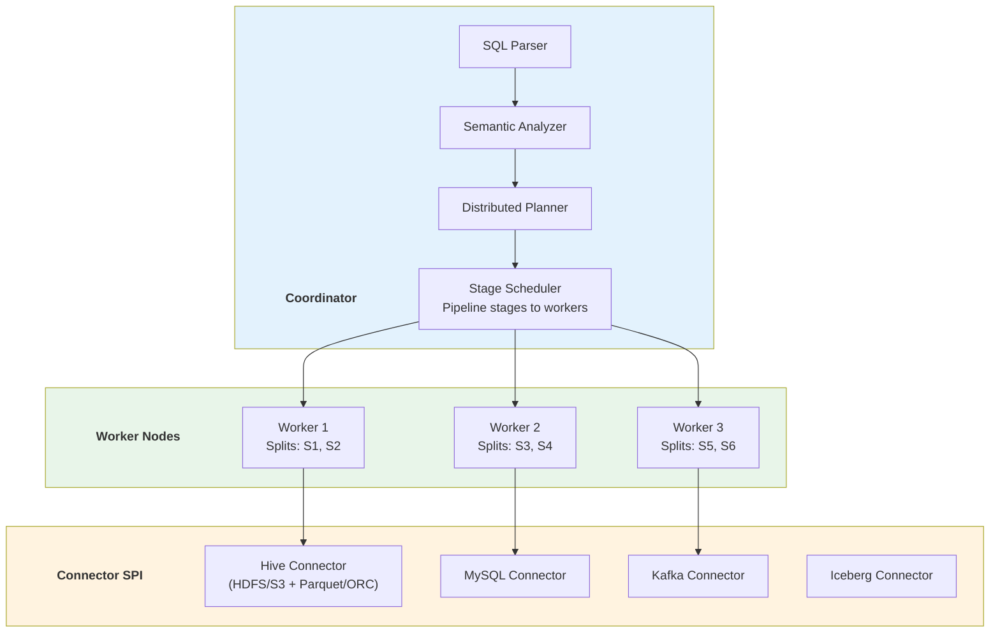
```mermaid
graph TD
    subgraph Coordinator[" "]
        Coord_title["Coordinator"]
        style Coord_title fill:none,stroke:none,color:#333,font-weight:bold
        Parser["SQL Parser"] --> Analyzer["Semantic Analyzer"]
        Analyzer --> Planner["Distributed Planner"]
        Planner --> Scheduler["Stage Scheduler<br/>Pipeline stages to workers"]
    end

    subgraph Workers[" "]
        Workers_title["Worker Nodes"]
        style Workers_title fill:none,stroke:none,color:#333,font-weight:bold
        W1["Worker 1<br/>Splits: S1, S2"]
        W2["Worker 2<br/>Splits: S3, S4"]
        W3["Worker 3<br/>Splits: S5, S6"]
    end

    subgraph Connectors[" "]
        Conn_title["Connector SPI"]
        style Conn_title fill:none,stroke:none,color:#333,font-weight:bold
        C1["Hive Connector<br/>(HDFS/S3 + Parquet/ORC)"]
        C2["MySQL Connector"]
        C3["Kafka Connector"]
        C4["Iceberg Connector"]
    end

    Scheduler --> W1
    Scheduler --> W2
    Scheduler --> W3
    W1 --> C1
    W2 --> C2
    W3 --> C3

    style Coordinator fill:#e3f2fd
    style Workers fill:#e8f5e9
    style Connectors fill:#fff3e0
```

### Pipeline vs Blocking Execution

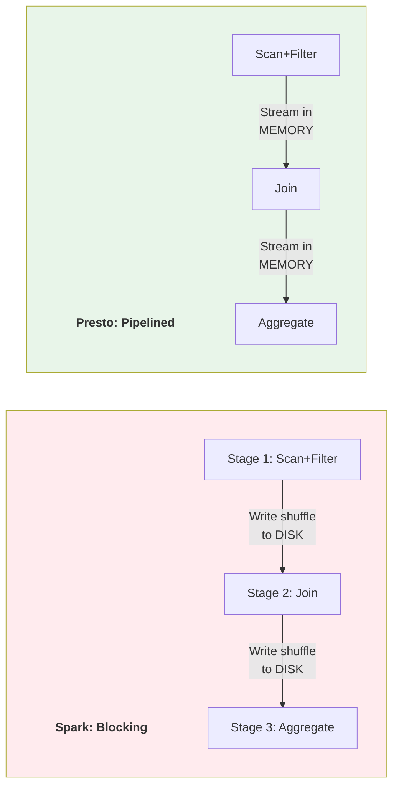
```mermaid
graph LR
    subgraph Spark[" "]
        Spark_title["Spark: Blocking"]
        style Spark_title fill:none,stroke:none,color:#333,font-weight:bold
        SS1["Stage 1: Scan+Filter"] -->|"Write shuffle<br/>to DISK"| SS2["Stage 2: Join"]
        SS2 -->|"Write shuffle<br/>to DISK"| SS3["Stage 3: Aggregate"]
    end

    subgraph Presto[" "]
        Presto_title["Presto: Pipelined"]
        style Presto_title fill:none,stroke:none,color:#333,font-weight:bold
        PS1["Scan+Filter"] -->|"Stream in<br/>MEMORY"| PS2["Join"]
        PS2 -->|"Stream in<br/>MEMORY"| PS3["Aggregate"]
    end

    style Spark fill:#ffebee
    style Presto fill:#e8f5e9
```

### Memory Management

| Pool | Purpose | Behavior |
|------|---------|----------|
| **General** | Query execution (hash joins, aggregations) | 60% of heap |
| **Reserved** | System overhead, buffers | 40% of heap |
| **Spill** | Overflow to disk (optional, disabled by default) | Only for specific operators |

### Impact on Modern Tools
- **Trino** — Fork by original creators (Presto → PrestoSQL → Trino)
- **AWS Athena** — Serverless Presto/Trino
- **Starburst** — Commercial Trino distribution
- **dbt + Trino** — Modern analytics stack

### Limitations & Evolution (Sự thật phũ phàng)
- **Không spill mặc định = OOM thường xuyên.** Large join mà data không fit memory → query fail. Phải set `spill-enabled=true` nhưng performance giảm 2-5x khi spill.
- **Single coordinator = SPOF.** Coordinator chết → mọi query fail. Chưa có native HA cho coordinator.
- Fork war: Presto (Meta) vs Trino (community) gây confusion trong ecosystem.

### War Stories & Troubleshooting
- **OOM killer đạn lạc:** Query A dùng 90% memory → Query B (nhỏ) bị kill. Fix: set `query.max-memory-per-node` và dùng resource groups.
- **Split sizing:** Quá ít splits → under-parallelism. Quá nhiều splits → coordinator overwhelmed. Sweet spot: 1 split ≈ 64-256MB.

### Metrics & Order of Magnitude
- Presto interactive query latency: 1-10s cho queries dưới 1TB.
- Pipeline execution: 2-5x nhanh hơn Spark cho short queries (không ghi shuffle).
- Connector overhead: ~100ms per connector initialization. Federated join chậm hơn co-located data 3-5x.

### Micro-Lab
```sql
-- Trino: kiểm tra memory usage per query
SELECT query_id, peak_memory_bytes / 1024 / 1024 AS peak_mb, state
FROM system.runtime.queries
ORDER BY peak_memory_bytes DESC LIMIT 10;

-- Check split distribution
EXPLAIN ANALYZE SELECT COUNT(*) FROM hive.db.large_table;
-- Xem "Splits:" trong output
```

---
> 💡 **Gemini Feedback**
> **Góc nhìn Thực chiến (Senior to Junior)**
> Presto/Trino = engine tốt nhất cho **ad-hoc analytics** trên data lake. Nhanh hơn Spark cho small-medium queries vì pipeline execution (không ghi đĩa). Nhưng cho large ETL jobs (5TB+ data), Spark thắng vì có fault tolerance (lineage recovery) — Presto query fail = chạy lại từ đầu.
>
> **Rule of thumb:** Query < 100GB data → Trino. ETL job > 1TB data → Spark. Streaming → Flink.

---

## 7. FLINK RUNTIME - 2017

> 📖 **Flink streaming model & ABS checkpointing:** xem [[02_Stream_Processing_Papers#3-flink-lightweight-asynchronous-snapshots---2015]]. Section này focus vào **runtime execution internals**.

### Paper Info
- **Title:** State Management in Apache Flink: Consistent Stateful Distributed Stream Processing
- **Authors:** Paris Carbone, Stephan Ewen, et al.
- **Conference:** PVLDB 2017
- **Link:** https://www.vldb.org/pvldb/vol10/p1718-carbone.pdf

### Key Contributions
- **TaskManager/JobManager** architecture với fine-grained resource management
- **Managed memory** — off-heap memory tránh GC, tự quản lý allocation
- **Credit-based flow control** — network backpressure không block threads
- **State backends** — pluggable (RocksDB cho large state, Heap cho low-latency)

### Runtime Architecture

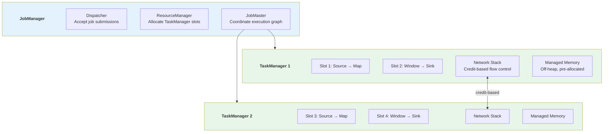
```mermaid
graph TD
    subgraph JM[" "]
        JM_title["JobManager"]
        style JM_title fill:none,stroke:none,color:#333,font-weight:bold
        Dispatcher["Dispatcher<br/>Accept job submissions"]
        RM["ResourceManager<br/>Allocate TaskManager slots"]
        JMaster["JobMaster<br/>Coordinate execution graph"]
    end

    subgraph TM1[" "]
        TM1_title["TaskManager 1"]
        style TM1_title fill:none,stroke:none,color:#333,font-weight:bold
        Slot1["Slot 1: Source → Map"]
        Slot2["Slot 2: Window → Sink"]
        NetStack1["Network Stack<br/>Credit-based flow control"]
        MemPool1["Managed Memory<br/>Off-heap, pre-allocated"]
    end

    subgraph TM2[" "]
        TM2_title["TaskManager 2"]
        style TM2_title fill:none,stroke:none,color:#333,font-weight:bold
        Slot3["Slot 3: Source → Map"]
        Slot4["Slot 4: Window → Sink"]
        NetStack2["Network Stack"]
        MemPool2["Managed Memory"]
    end

    JMaster --> TM1
    JMaster --> TM2
    NetStack1 <-->|"credit-based"| NetStack2

    style JM fill:#e3f2fd
    style TM1 fill:#e8f5e9
    style TM2 fill:#e8f5e9
```

### State Backend Comparison

| Backend | Storage | Best For | Throughput | State Size |
|---------|---------|----------|------------|------------|
| **HashMapStateBackend** | JVM Heap | Low-latency, small state | High | < 1GB |
| **EmbeddedRocksDBStateBackend** | RocksDB (disk) | Large state, fault tolerance | Medium | TB-scale |

### Impact on Modern Tools
- **Confluent** — Flink as managed service
- **Amazon Kinesis Data Analytics** — Managed Flink
- **Apache Paimon** — Streaming data lake → xem [[04_Table_Format_Papers]]
- **Flink SQL** — Streaming SQL standard

### Limitations & Evolution (Sự thật phũ phàng)
- **RocksDB state backend = compaction storms.** Write-heavy state gây LSM compaction tăng đột biến, checkpoint timeout. Đây là nguyên nhân #1 của production incidents.
- **JVM metaspace leak** khi load/unload nhiều UDF → TaskManager restart.

### War Stories & Troubleshooting
- **Checkpoint timeout:** State quá lớn (100GB+), upload lên S3 chậm. Fix: incremental checkpoints + tăng checkpoint interval.
- **Backpressure debugging:** Flink UI → Backpressure tab. Nếu operator X có backpressure HIGH → X chậm hoặc downstream blocked.
- **TaskManager OOM:** Managed memory cấu hình sai. Check `taskmanager.memory.process.size` vs `taskmanager.memory.managed.fraction`.

### Metrics & Order of Magnitude
- Flink xử lý hàng triệu events/s per TaskManager với latency ms-level.
- Checkpoint nhỏ (< 1GB): 1-5s. Checkpoint lớn (100GB+): 1-5 phút.
- RocksDB compaction có thể dùng 30-50% CPU background → reserve headroom.

### Micro-Lab
```bash
# Flink: kiểm tra checkpoint health
curl http://jobmanager:8081/jobs/<job-id>/checkpoints
# Xem: duration, size, alignment_buffered
# Alert nếu duration > 60s liên tục

# Xem backpressure
curl http://jobmanager:8081/jobs/<job-id>/vertices/<vertex-id>/backpressure
```

---
> 💡 **Gemini Feedback**
> **Góc nhìn Thực chiến (Senior to Junior)**
> Flink runtime có 2 thứ em PHẢI nắm: (1) **Checkpoint = heartbeat of your streaming job.** Checkpoint fail = job không consistent. Monitor checkpoint duration như monitor CPU. (2) **Backpressure = traffic jam.** Khi downstream operator chậm, Flink tự động slow-down upstream thay vì drop data. Đọc backpressure metrics = đọc x-ray của toàn bộ pipeline.

---

## 8. RAY - 2018

### Paper Info
- **Title:** Ray: A Distributed Framework for Emerging AI Applications
- **Authors:** Philipp Moritz, Robert Nishihara, et al. (UC Berkeley)
- **Conference:** OSDI 2018
- **Link:** https://www.usenix.org/conference/osdi18/presentation/moritz
- **PDF:** https://www.usenix.org/system/files/osdi18-moritz.pdf

### Key Contributions
- **Task + Actor model** — stateless functions + stateful actors trong cùng framework
- **Dynamic task graph** — DAG tạo runtime (khác Spark: DAG tạo trước khi chạy)
- **Object store** — Shared memory dùng Apache Arrow format
- **Hierarchical scheduler** — Local scheduler + Global scheduler cho low-latency dispatch

### Architecture

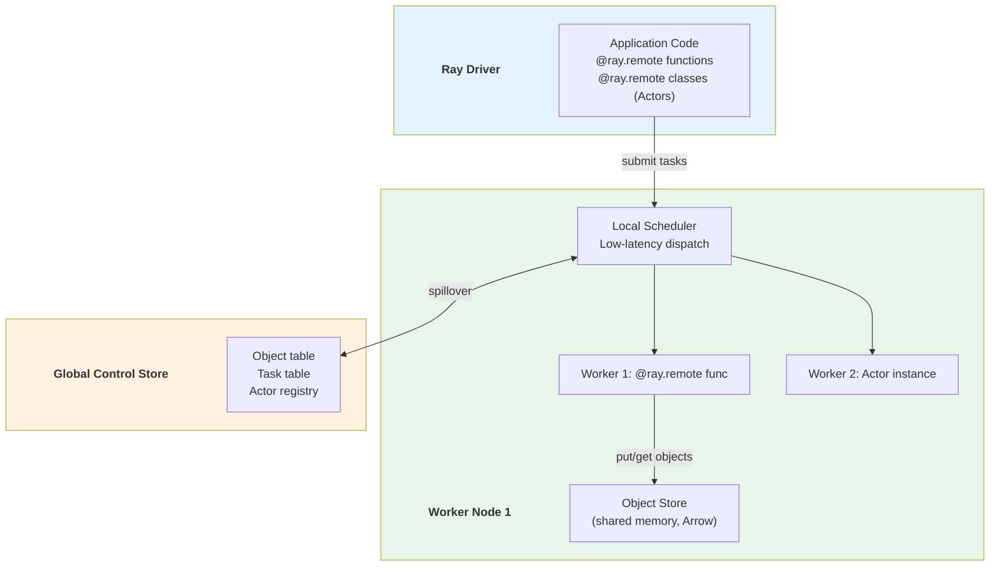
```mermaid
graph TD
    subgraph Driver[" "]
        Driver_title["Ray Driver"]
        style Driver_title fill:none,stroke:none,color:#333,font-weight:bold
        App["Application Code<br/>@ray.remote functions<br/>@ray.remote classes (Actors)"]
    end

    subgraph Node1[" "]
        Node1_title["Worker Node 1"]
        style Node1_title fill:none,stroke:none,color:#333,font-weight:bold
        LS1["Local Scheduler<br/>Low-latency dispatch"]
        ObjStore1["Object Store<br/>(shared memory, Arrow)"]
        W1["Worker 1: @ray.remote func"]
        W2["Worker 2: Actor instance"]
    end

    subgraph GCS[" "]
        GCS_title["Global Control Store"]
        style GCS_title fill:none,stroke:none,color:#333,font-weight:bold
        GCSNode["Object table<br/>Task table<br/>Actor registry"]
    end

    App -->|"submit tasks"| LS1
    LS1 --> W1
    LS1 --> W2
    W1 -->|"put/get objects"| ObjStore1
    LS1 <-->|"spillover"| GCSNode

    style Driver fill:#e3f2fd
    style Node1 fill:#e8f5e9
    style GCS fill:#fff3e0
```

### Task vs Actor

| Model | Description | Use Case |
|-------|-------------|----------|
| **Task** | Stateless function, auto-retry | Data processing, hyperparameter tuning |
| **Actor** | Stateful object, single-threaded | Model serving, environment simulation |

### Impact on Modern Tools
- **Ray Train** — Distributed ML training (PyTorch, TensorFlow)
- **Ray Serve** — Model serving with auto-scaling
- **Ray Data** — Dataset processing (replacing Spark for ML pipelines)
- **Anyscale** — Commercial Ray platform

### Limitations & Evolution (Sự thật phũ phàng)
- **Không phải thay thế Spark cho SQL workloads.** Ray tốt cho Python-native ML workloads, nhưng SQL support yếu.
- Object store dùng shared memory → consume RAM lớn. GC objects không kịp → OOM.
- Learning curve: Task vs Actor vs ObjectRef mental model khác xa Spark RDD.

### War Stories & Troubleshooting
- **Object store full:** Quá nhiều intermediate results trong shared memory. Fix: `ray.internal.free(object_ref)` hoặc tăng object store size.
- **Actor leak:** Actors không được dọn → resource leak theo thời gian. Dùng `ray.kill(actor)` explicit.

### Metrics & Order of Magnitude
- Ray task scheduling overhead: ~1ms (vs Spark task: ~10-50ms).
- Object store throughput: ~10GB/s (shared memory, zero-copy via Arrow).
- Ray Train: scale ML training near-linearly trên 100+ GPUs.

### Micro-Lab
```python
import ray

ray.init()

# Task: stateless function
@ray.remote
def square(x):
    return x * x

# Actor: stateful
@ray.remote
class Counter:
    def __init__(self):
        self.n = 0
    def increment(self):
        self.n += 1
        return self.n

# Execute
futures = [square.remote(i) for i in range(1000)]
results = ray.get(futures)  # ~100ms for 1000 tasks

counter = Counter.remote()
ray.get([counter.increment.remote() for _ in range(100)])
```

---
> 💡 **Gemini Feedback**
> **Góc nhìn Thực chiến (Senior to Junior)**
> Ray là câu trả lời cho "Tôi muốn scale Python code lên 100 máy mà KHÔNG cần học Spark." Nếu workload chính là Python ML (training, tuning, serving), Ray là lựa chọn tốt hơn Spark. Nhưng nếu workload là SQL ETL trên Parquet/Iceberg → Spark/Trino vẫn thắng. **Đừng dùng Ray thay Spark, dùng Ray bổ sung Spark** trong ML pipeline.

---

## 9. DUCKDB - 2019

### Paper Info
- **Title:** DuckDB: an Embeddable Analytical Database
- **Authors:** Mark Raasveldt, Hannes Mühleisen
- **Conference:** SIGMOD 2019
- **Link:** https://dl.acm.org/doi/10.1145/3299869.3320212

### Key Contributions
- **In-process OLAP** — SQLite for analytics (không cần server)
- **Vectorized + push-based execution** — process data in batches (vectors)
- **Morsel-driven parallelism** — fine-grained intra-query parallelism
- **Extension system** — extensible qua dynamic libraries (httpfs, iceberg, postgres)

### Architecture

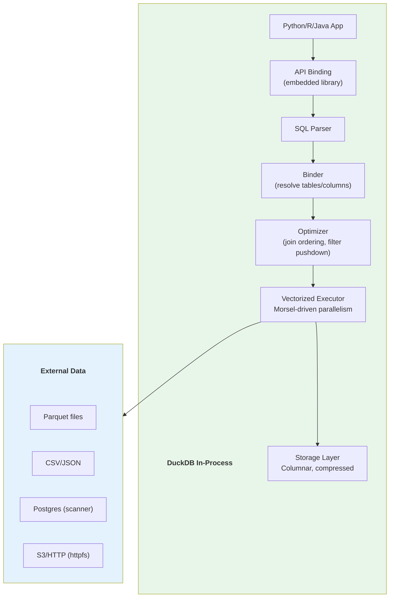
```mermaid
graph TD
    subgraph DuckDB[" "]
        DuckDB_title["DuckDB In-Process"]
        style DuckDB_title fill:none,stroke:none,color:#333,font-weight:bold
        App["Python/R/Java App"] --> Bind["API Binding<br/>(embedded library)"]
        Bind --> Parser["SQL Parser"]
        Parser --> Binder["Binder<br/>(resolve tables/columns)"]
        Binder --> Optimizer["Optimizer<br/>(join ordering, filter pushdown)"]
        Optimizer --> Executor["Vectorized Executor<br/>Morsel-driven parallelism"]
        Executor --> Storage["Storage Layer<br/>Columnar, compressed"]
    end

    subgraph External[" "]
        Ext_title["External Data"]
        style Ext_title fill:none,stroke:none,color:#333,font-weight:bold
        Parquet["Parquet files"]
        CSV["CSV/JSON"]
        PG["Postgres (scanner)"]
        S3["S3/HTTP (httpfs)"]
    end

    Executor --> External

    style DuckDB fill:#e8f5e9
    style External fill:#e3f2fd
```

### Vectorized Push-based Execution

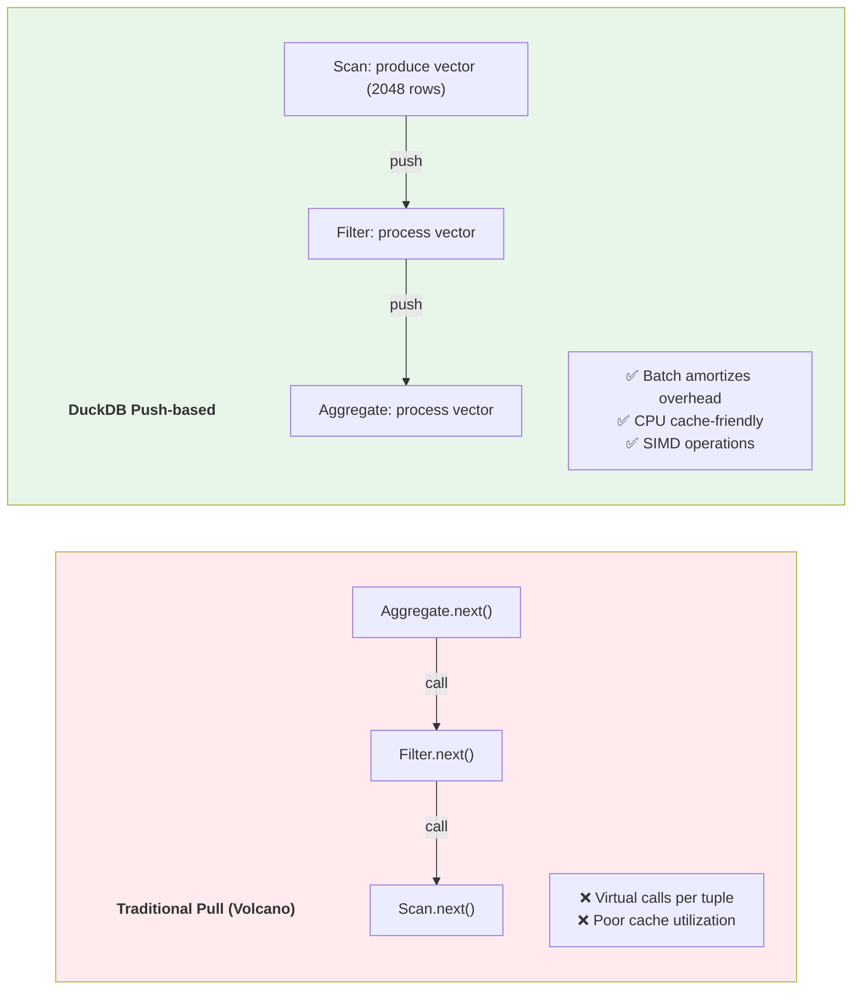
```mermaid
graph LR
    subgraph Pull[" "]
        Pull_title["Traditional Pull (Volcano)"]
        style Pull_title fill:none,stroke:none,color:#333,font-weight:bold
        P1["Aggregate.next()"] -->|"call"| P2["Filter.next()"]
        P2 -->|"call"| P3["Scan.next()"]
        P4["❌ Virtual calls per tuple<br/>❌ Poor cache utilization"]
    end

    subgraph Push[" "]
        Push_title["DuckDB Push-based"]
        style Push_title fill:none,stroke:none,color:#333,font-weight:bold
        S1["Scan: produce vector (2048 rows)"] -->|"push"| S2["Filter: process vector"]
        S2 -->|"push"| S3["Aggregate: process vector"]
        S4["✅ Batch amortizes overhead<br/>✅ CPU cache-friendly<br/>✅ SIMD operations"]
    end

    style Pull fill:#ffebee
    style Push fill:#e8f5e9
```

### Why DE Loves DuckDB

| Use Case | Command |
|----------|---------|
| Query Parquet directly | `SELECT * FROM 'data/*.parquet' WHERE col > 10` |
| Quick EDA on CSV | `SELECT COUNT(*), AVG(price) FROM 'sales.csv'` |
| Local dev/test | Replace Spark for <100GB datasets |
| CI/CD data tests | Validate data files in pipeline |

### Impact on Modern Tools
- **MotherDuck** — Cloud DuckDB (serverless)
- **dbt-duckdb** — Local development adapter
- **Polars** — Similar vectorized approach in Rust
- **WASM DuckDB** — Analytics in browser

### Limitations & Evolution (Sự thật phũ phàng)
- **Single node only.** Không scale horizontally. 100GB trên laptop = OK. 10TB = phải dùng Spark/Trino.
- In-memory processing → limited by node RAM. Spill-to-disk có nhưng chậm hơn distributed engine.
- **Không phải thay thế production data warehouse.** DuckDB cho dev, testing, small analytics.

### War Stories & Troubleshooting
- **OOM on large Parquet:** DuckDB cố load toàn bộ vào memory. Fix: `SET memory_limit='4GB'` và dùng partitioned reads.
- **CSV parsing errors:** DuckDB tự detect schema → sai type. Fix: explicit `read_csv('file.csv', columns={'id': 'INTEGER', ...})`.

### Metrics & Order of Magnitude
- DuckDB scan throughput: 1-10GB/s trên single core (vectorized).
- Query 1GB Parquet file: ~1-3s (vs Spark: 10-30s vì startup overhead).
- Morsel size: 2048 tuples → fits L2 cache perfectly.

### Micro-Lab
```python
import duckdb

# Query Parquet trực tiếp — không cần Spark
result = duckdb.sql("""
    SELECT date_trunc('month', created_at) AS month,
           COUNT(*) AS orders,
           SUM(amount) AS revenue
    FROM 'orders_2024/*.parquet'
    GROUP BY 1
    ORDER BY 1
""").df()  # Returns pandas DataFrame

# So sánh tốc độ: DuckDB vs pandas
# DuckDB thường nhanh hơn pandas 10-100x cho aggregation
```

---
> 💡 **Gemini Feedback**
> **Góc nhìn Thực chiến (Senior to Junior)**
> DuckDB thay đổi workflow DE hàng ngày. Thay vì spin up Spark cluster để test 1 query trên 5GB data → `duckdb.sql("SELECT ... FROM '*.parquet'")` trong 2 giây. Nếu em chưa dùng DuckDB cho local development, em đang lãng phí 30 phút mỗi ngày chờ Spark startup.

---

## 10. CLICKHOUSE - 2024

### Paper Info
- **Title:** ClickHouse — Lightning Fast Analytics for Everyone
- **Authors:** Alexey Milovidov, et al.
- **Conference:** PVLDB 2024
- **Link:** https://www.vldb.org/pvldb/vol17/p3731-schulze.pdf

### Key Contributions
- **MergeTree engine** — LSM-inspired columnar storage with background merges
- **Vectorized query pipeline** — column-oriented processing with SIMD
- **Primary index** — sparse index on sorted data (khác B-tree)
- **Materialized views** — real-time aggregation pipelines

### MergeTree Architecture

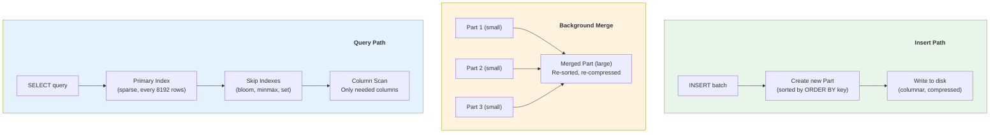
```mermaid
graph TD
    subgraph Insert[" "]
        Insert_title["Insert Path"]
        style Insert_title fill:none,stroke:none,color:#333,font-weight:bold
        Data["INSERT batch"] --> Part["Create new Part<br/>(sorted by ORDER BY key)"]
        Part --> Disk["Write to disk<br/>(columnar, compressed)"]
    end

    subgraph Merge[" "]
        Merge_title["Background Merge"]
        style Merge_title fill:none,stroke:none,color:#333,font-weight:bold
        P1["Part 1 (small)"]
        P2["Part 2 (small)"]
        P3["Part 3 (small)"]
        P1 --> Merged["Merged Part (large)<br/>Re-sorted, re-compressed"]
        P2 --> Merged
        P3 --> Merged
    end

    subgraph Query[" "]
        Query_title["Query Path"]
        style Query_title fill:none,stroke:none,color:#333,font-weight:bold
        SQL["SELECT query"] --> PrimaryIdx["Primary Index<br/>(sparse, every 8192 rows)"]
        PrimaryIdx --> Skip["Skip Indexes<br/>(bloom, minmax, set)"]
        Skip --> Scan["Column Scan<br/>Only needed columns"]
    end

    style Insert fill:#e8f5e9
    style Merge fill:#fff3e0
    style Query fill:#e3f2fd
```

### Impact on Modern Tools
- **Altinity** — Managed ClickHouse
- **ClickHouse Cloud** — Serverless ClickHouse
- **Grafana + ClickHouse** — Observability standard
- **Kafka + ClickHouse** — Real-time analytics pipeline

### Limitations & Evolution (Sự thật phũ phàng)
- **UPDATE/DELETE rất đắt.** MergeTree là append-only. Mutation = rewrite toàn bộ part. Không phải OLTP database.
- **JOIN chậm.** ClickHouse optimize cho scan+aggregate, không phải complex joins. Large join = đẩy pre-join ra ngoài (ETL).
- **No ACID transactions.** Insert có thể partial (1 replica ghi, 1 chưa). Dùng `insert_quorum` cho strong consistency nhưng chậm hơn.

### War Stories & Troubleshooting
- **Too many parts:** Insert quá thường xuyên (mỗi giây) → hàng ngàn parts → merge backlog → query chậm. Fix: batch inserts (1 insert/s thay vì 100/s), tăng `max_insert_block_size`.
- **Partition key sai:** `PARTITION BY toDate(timestamp)` cho data 10 năm = 3650 partitions → chậm. Dùng `toYYYYMM()`.

### Metrics & Order of Magnitude
- ClickHouse scan throughput: 1-2 tỷ rows/s trên single server (vectorized).
- Compression ratio: 5-10x trên columnar data.
- Real-time ingestion: handle 500K rows/s sustained per shard.

### Micro-Lab
```sql
-- ClickHouse: kiểm tra merge health
SELECT table, count() AS parts, sum(rows) AS total_rows,
       sum(bytes_on_disk) / 1024 / 1024 AS mb_on_disk
FROM system.parts
WHERE active AND database = 'default'
GROUP BY table;
-- Alert nế parts > 300 per table → merge backlog

-- Check query performance
SELECT query, read_rows, read_bytes, result_rows, elapsed
FROM system.query_log
WHERE type = 'QueryFinish'
ORDER BY elapsed DESC LIMIT 5;
```

---
> 💡 **Gemini Feedback**
> **Góc nhìn Thực chiến (Senior to Junior)**
> ClickHouse = best-in-class cho **scan-heavy analytics** (dashboards, metrics, logs). Nhưng ĐỪNG dùng cho OLTP hay complex joins. Pattern phổ biến nhất: `Kafka → ClickHouse → Grafana` cho observability. ClickHouse quét 1 tỷ rows trong 1 giây — không engine nào khác làm được trên single node.

---

## 11. PHOTON & VELOX - 2022

### Photon Paper Info
- **Title:** Photon: A Fast Query Engine for Lakehouse Systems
- **Authors:** Alexander Behm, et al. (Databricks)
- **Conference:** SIGMOD 2022 (Best Industry Paper)
- **Link:** https://www.databricks.com/blog/2022/05/20/photon-runtime-query-engine.html

### Velox Paper Info
- **Title:** Velox: Meta's Unified Execution Engine
- **Authors:** Pedro Pedreira, et al. (Meta)
- **Conference:** VLDB 2022
- **Link:** https://engineering.fb.com/2023/03/09/open-source/velox-open-source-execution-engine/

### Key Contributions (Both)
- **Native C++ execution** — thoát khỏi JVM overhead hoàn toàn
- **Vectorized processing** — SIMD-optimized, cache-friendly
- **Drop-in replacement** — Photon thay Spark JVM engine, Velox thay Presto JVM engine
- **Adaptive execution** — runtime specialization based on data types

### C++ vs JVM Performance

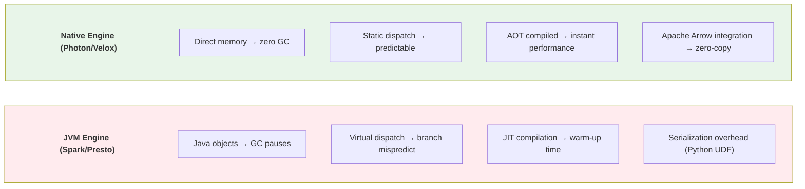
```mermaid
graph LR
    subgraph JVM[" "]
        JVM_title["JVM Engine (Spark/Presto)"]
        style JVM_title fill:none,stroke:none,color:#333,font-weight:bold
        J1["Java objects → GC pauses"]
        J2["Virtual dispatch → branch mispredict"]
        J3["JIT compilation → warm-up time"]
        J4["Serialization overhead (Python UDF)"]
    end

    subgraph Native[" "]
        Native_title["Native Engine (Photon/Velox)"]
        style Native_title fill:none,stroke:none,color:#333,font-weight:bold
        N1["Direct memory → zero GC"]
        N2["Static dispatch → predictable"]
        N3["AOT compiled → instant performance"]
        N4["Apache Arrow integration → zero-copy"]
    end

    style JVM fill:#ffebee
    style Native fill:#e8f5e9
```

### Photon vs Velox

| Aspect | Photon | Velox |
|--------|--------|-------|
| **Owner** | Databricks (proprietary) | Meta (open-source) |
| **Goal** | Replace Spark JVM engine | Reusable library for any engine |
| **Integration** | Databricks Runtime only | Presto (Prestissimo), Spark (Gluten) |
| **Scope** | Full query execution | Execution library (no parser/optimizer) |
| **Performance** | ~2-3x Spark native | ~2-5x Presto native |

### Gluten Project (Spark + Velox)

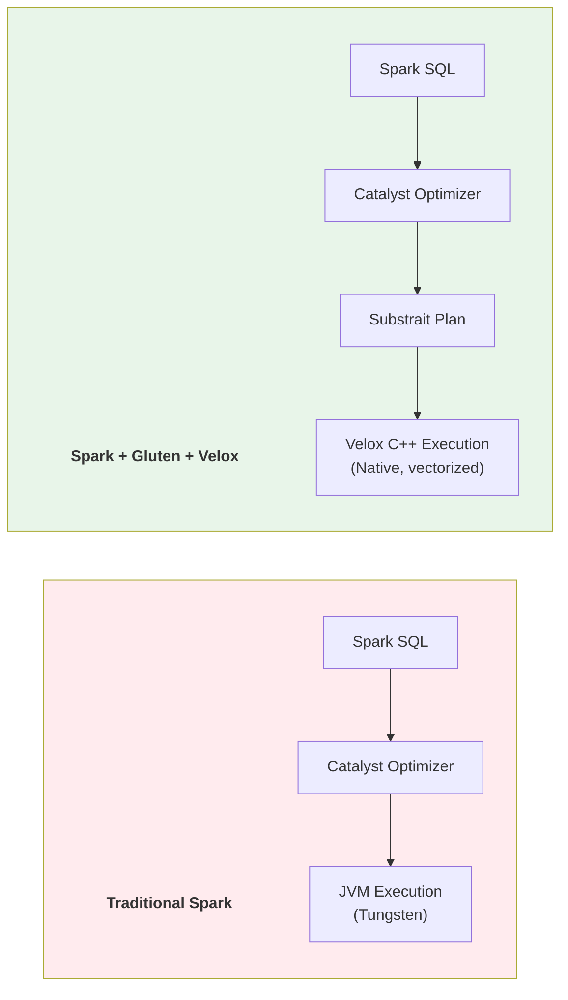
```mermaid
graph LR
    subgraph Traditional[" "]
        Trad_title["Traditional Spark"]
        style Trad_title fill:none,stroke:none,color:#333,font-weight:bold
        SparkSQL1["Spark SQL"] --> Catalyst1["Catalyst Optimizer"]
        Catalyst1 --> JVMExec["JVM Execution<br/>(Tungsten)"]
    end

    subgraph Gluten[" "]
        Gluten_title["Spark + Gluten + Velox"]
        style Gluten_title fill:none,stroke:none,color:#333,font-weight:bold
        SparkSQL2["Spark SQL"] --> Catalyst2["Catalyst Optimizer"]
        Catalyst2 --> Substrait["Substrait Plan"]
        Substrait --> VeloxExec["Velox C++ Execution<br/>(Native, vectorized)"]
    end

    style Traditional fill:#ffebee
    style Gluten fill:#e8f5e9
```

### Impact on Modern Tools
- **Databricks Runtime** — Photon enabled by default
- **Prestissimo** — Presto C++ worker using Velox
- **Gluten** — Apache project bridging Spark ↔ Velox
- **Substrait** — Cross-engine query plan format

### Limitations & Evolution (Sự thật phũ phàng)
- Photon là **closed-source** → vendor lock-in vào Databricks.
- Velox chưa cover 100% Spark SQL semantics → Gluten fallback về JVM cho unsupported operators.
- C++ development velocity chậm hơn Java/Scala → ít contributors.

### War Stories & Troubleshooting
- **Gluten fallback:** Query chạy qua Velox nhưng 1 operator không support → fallback JVM → performance penalty. Check Spark UI cho "Columnar to Row" transitions.

### Metrics & Order of Magnitude
- Photon: 2-3x throughput improvement trên Databricks (TPC-DS benchmarks).
- Velox: 2-5x improvement cho Presto queries (Meta production).
- Memory usage giảm 30-50% nhờ tránh JVM object overhead.

### Micro-Lab
```python
# Databricks: check if Photon is active
spark.conf.get("spark.databricks.photon.enabled")  # "true"

# Check Photon vs non-Photon performance
# Spark UI → SQL tab → look for "Photon" in operator names
# If operator name starts with "Photon" → running natively
```

---
> 💡 **Gemini Feedback**
> **Góc nhìn Thực chiến (Senior to Junior)**
> Photon/Velox đại diện cho xu hướng lớn nhất 2022-2026: **Native engine thay thế JVM.** Nếu em dùng Databricks → Photon tự động bật. Nếu self-host Spark → theo dõi dự án Gluten. Tương lai: mọi engine sẽ có native C++/Rust backend, JVM chỉ còn là API layer.

---

## 12. APACHE DATAFUSION - 2024

### Paper Info
- **Title:** Apache Arrow DataFusion: A Fast, Embeddable, Modular Analytic Query Engine
- **Authors:** Andrew Lamb, et al.
- **Conference:** SIGMOD 2024 (Companion)
- **Link:** https://dl.acm.org/doi/10.1145/3626246.3653368
- **GitHub:** https://github.com/apache/datafusion

### Key Contributions
- **Modular query engine in Rust** — dùng làm "building block" cho các hệ thống khác
- **Built on Apache Arrow** — zero-copy, columnar in-memory format
- **Extensible at every layer** — custom catalogs, optimizers, physical plans, UDFs
- **Embeddable** — nhúng vào app như DuckDB, nhưng modular hơn

### Architecture

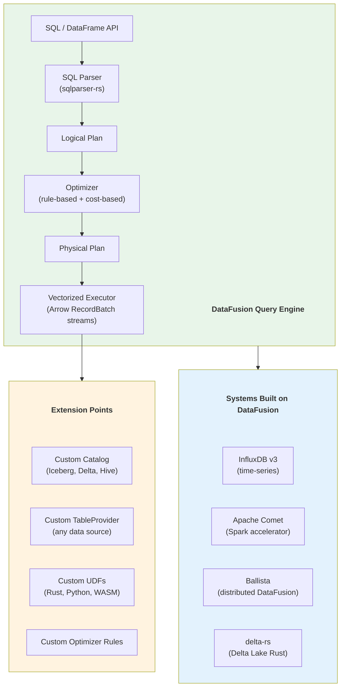
```mermaid
graph TD
    subgraph DataFusion[" "]
        DF_title["DataFusion Query Engine"]
        style DF_title fill:none,stroke:none,color:#333,font-weight:bold
        SQL["SQL / DataFrame API"] --> Parser["SQL Parser<br/>(sqlparser-rs)"]
        Parser --> LogPlan["Logical Plan"]
        LogPlan --> Optimizer["Optimizer<br/>(rule-based + cost-based)"]
        Optimizer --> PhysPlan["Physical Plan"]
        PhysPlan --> Executor["Vectorized Executor<br/>(Arrow RecordBatch streams)"]
    end

    subgraph Extension[" "]
        Ext_title["Extension Points"]
        style Ext_title fill:none,stroke:none,color:#333,font-weight:bold
        Cat["Custom Catalog<br/>(Iceberg, Delta, Hive)"]
        TableProv["Custom TableProvider<br/>(any data source)"]
        UDF["Custom UDFs<br/>(Rust, Python, WASM)"]
        OptRule["Custom Optimizer Rules"]
    end

    subgraph Built[" "]
        Built_title["Systems Built on DataFusion"]
        style Built_title fill:none,stroke:none,color:#333,font-weight:bold
        Influx["InfluxDB v3<br/>(time-series)"]
        Comet["Apache Comet<br/>(Spark accelerator)"]
        Ballista["Ballista<br/>(distributed DataFusion)"]
        Delta["delta-rs<br/>(Delta Lake Rust)"]
    end

    Executor --> Extension
    DataFusion --> Built

    style DataFusion fill:#e8f5e9
    style Extension fill:#fff3e0
    style Built fill:#e3f2fd
```

### DataFusion vs DuckDB vs Velox

| Aspect | DataFusion | DuckDB | Velox |
|--------|-----------|--------|-------|
| **Language** | Rust | C++ | C++ |
| **Design** | Modular library (embed into your system) | Standalone DB (embed into your app) | Execution library (embed into Presto/Spark) |
| **Arrow native** | ✅ Core format | ⚠️ Uses internally, converts | ✅ Core format |
| **Extensibility** | Extreme (every layer pluggable) | Medium (extensions) | Medium (operator-level) |
| **Distributed** | Via Ballista | ❌ Single node | Via host engine |
| **Best Use** | Building custom analytics tools | Ad-hoc analytics, dev/test | Accelerate existing engines |

### Impact on Modern Tools
- **InfluxDB v3** — Rewrote query engine entirely on DataFusion
- **Apache Comet** — Spark accelerator using DataFusion (alternative to Velox/Gluten)
- **Ballista** — Distributed SQL on DataFusion
- **GlareDB, Arroyo, Seafowl** — New analytics startups built on DataFusion
- **ADBC (Arrow Database Connectivity)** — Standard interface replacing ODBC/JDBC

### Limitations & Evolution (Sự thật phũ phàng)
- **Chưa phải production-ready standalone DB.** DataFusion là engine/library — em cần tự build storage layer, catalog, auth lên trên.
- **Distributed story chưa mature.** Ballista vẫn đang phát triển, chưa sánh được Spark/Trino.
- **Ecosystem nhỏ hơn Spark.** Ít connectors, ít tooling, ít người dùng → ít StackOverflow answers.

### War Stories & Troubleshooting
- **Memory planning:** DataFusion dùng Arrow RecordBatch → cần tune `batch_size` (default 8192). Quá lớn → OOM. Quá nhỏ → overhead.
- **Custom optimizer rules:** Viết sai rule có thể tạo invalid plan → panic. Luôn test với `assert_optimized_plan_eq`.

### Metrics & Order of Magnitude
- DataFusion single-node TPC-H: competitive với DuckDB (within 2x).
- Arrow zero-copy IPC: transfer data giữa processes ở tốc độ memory bandwidth (~10GB/s).
- Rust memory safety: zero GC pauses, zero null pointer exceptions (compile-time guarantee).

### Micro-Lab
```rust
use datafusion::prelude::*;

#[tokio::main]
async fn main() -> datafusion::error::Result<()> {
    let ctx = SessionContext::new();

    // Query Parquet trực tiếp
    ctx.register_parquet("orders", "orders_2024/*.parquet", ParquetReadOptions::default()).await?;

    let df = ctx.sql("SELECT date_trunc('month', created_at) AS month,
                             COUNT(*) AS orders, SUM(amount) AS revenue
                      FROM orders GROUP BY 1 ORDER BY 1").await?;
    df.show().await?;
    Ok(())
}
```

```python
# Python binding: cũng dùng được
import datafusion
ctx = datafusion.SessionContext()
ctx.register_parquet("orders", "orders_2024/*.parquet")
df = ctx.sql("SELECT COUNT(*) FROM orders")
df.show()
```

---
> 💡 **Gemini Feedback**
> **Góc nhìn Thực chiến (Senior to Junior)**
> DataFusion là **"React of query engines"** — nó không phải sản phẩm hoàn chỉnh, mà là bộ components để em build sản phẩm riêng. Nếu em đang build một data tool (CLI, SaaS, internal platform) và cần query engine, DataFusion là lựa chọn tốt nhất 2024-2026. Nhưng nếu em chỉ cần chạy query → DuckDB. Nếu cần scale lên cluster → Spark/Trino. DataFusion cho **builders**, không cho **users**.

---

## 13. EMERGING ENGINES

### Apache Doris / StarRocks

Hai engine MPP OLAP gốc Trung Quốc, đang phổ biến nhanh ở Vietnam/SEA. StarRocks fork từ Doris năm 2020, sau đó phát triển song song.

| Aspect | Apache Doris | StarRocks |
|--------|-------------|-----------|
| **Architecture** | FE (Java) + BE (C++) | FE (Java) + CN (C++) |
| **Storage** | Column-oriented, local + shared | Column-oriented, shared-nothing/shared-data |
| **Query Engine** | Vectorized, MPP | Vectorized, CBO optimizer mạnh |
| **Lakehouse** | Multi-catalog (Hive/Iceberg/Hudi) | External catalog + materialized views |
| **Best For** | Real-time dashboard, high concurrency | Complex joins, lakehouse analytics |
| **Formal Paper** | Không (tech docs) | Không (tech docs) |

### Polars — DataFrame Engine (2020+)

Rust-based DataFrame engine đang thay thế pandas trong nhiều DE workflows.

| Aspect | Polars | pandas | DuckDB |
|--------|--------|--------|--------|
| **Language** | Rust (Python/R bindings) | Python (C/Cython) | C++ (Python binding) |
| **Execution** | Lazy + Streaming | Eager (immediate) | Lazy (SQL-based) |
| **Parallelism** | Multi-threaded native | Single-threaded (GIL) | Multi-threaded native |
| **Memory** | Arrow-native, zero-copy | NumPy-based, copies | Custom columnar |
| **API Style** | Method chaining (fluent) | Dict-like indexing | SQL queries |
| **Best For** | ETL scripts, feature eng | Legacy code, prototyping | Ad-hoc analytics |

```python
# Polars: 10-100x faster than pandas
import polars as pl

df = (
    pl.scan_parquet("orders_2024/*.parquet")  # Lazy!
    .filter(pl.col("amount") > 100)
    .group_by(pl.col("created_at").dt.month())
    .agg([
        pl.count().alias("orders"),
        pl.col("amount").sum().alias("revenue"),
    ])
    .sort("created_at")
    .collect()  # Execute optimized plan
)
```

**Tại sao quan trọng:** Polars đang thay thế pandas trong production pipelines. Nếu DE viết Python ETL → Polars là default 2025-2026 thay vì pandas.

### Apache Pinot & Apache Druid — Real-time OLAP (2011/2013+)

Hai engine real-time OLAP tiên phong, trước ClickHouse.

| Aspect | Apache Pinot | Apache Druid | ClickHouse |
|--------|-------------|-------------|-----------|
| **Origin** | LinkedIn (2013) | Metamarkets (2011) | Yandex (2016) |
| **Architecture** | Controller + Server + Broker | Master + Historical + Broker | Standalone shards |
| **Ingestion** | Real-time (Kafka) + Batch | Real-time + Batch | INSERT batch + Kafka engine |
| **Index Types** | Inverted, sorted, star-tree | Bitmap, inverted | Primary (sparse), skip indexes |
| **Query Language** | SQL (multi-stage, Calcite) | SQL (native + Calcite) | SQL (native, ClickHouse dialect) |
| **Best For** | User-facing analytics (high QPS) | Time-series dashboards | Internal analytics, observability |
| **Concurrency** | Tens of thousands QPS | Thousands QPS | Hundreds QPS |
| **Formal Paper** | SIGMOD 2018 (Industry) | Không (tech docs) | PVLDB 2024 |

**Key Difference:** Pinot/Druid optimize cho **user-facing analytics** (hàng chục ngàn concurrent queries từ end-users), trong khi ClickHouse optimize cho **internal analytics** (ít concurrent nhưng scan cực nhanh).

```sql
-- Pinot: user-facing real-time analytics
-- LinkedIn dùng Pinot cho "Who viewed your profile"
-- Uber dùng Pinot cho driver/rider dashboards
SELECT city, COUNT(*) AS trips, AVG(fare) AS avg_fare
FROM rides
WHERE timestamp > ago('PT1H')  -- Last 1 hour
GROUP BY city
ORDER BY trips DESC
LIMIT 10
-- Trả về trong < 100ms với 10K concurrent users
```

### Streaming Databases: Materialize & RisingWave

> 📖 **Context:** xem [[02_Stream_Processing_Papers]] — Gemini Message section về Streaming Databases.

- **Why no academic paper?** Mặc dù dựa trên toán học về Incremental View Maintenance (IVM), Materialize và RisingWave là các commercial/open-source startups. Không có một "đại paper" (macro-paper) bao trùm toàn bộ hệ thống như Flink/Spark mà thay bằng các whitepapers về mô hình Timely/Differential Dataflow.

| Aspect | Materialize | RisingWave |
|--------|-------------|------------|
| **Foundation** | Timely/Differential Dataflow (Naiad) | Cloud-native, Rust |
| **Key Idea** | Incremental materialized views via SQL | Streaming + storage + serving unified |
| **Interface** | PostgreSQL wire protocol | PostgreSQL wire protocol |
| **Best For** | Real-time dashboards, event-driven | Streaming ETL, event processing |

**Tại sao quan trọng:** Streaming DBs giải quyết bài toán "Flink giỏi tính nhưng không phải database" — em đẩy data từ Kafka vào, tạo `MATERIALIZED VIEW`, cắm API đọc trực tiếp. Không cần thêm Redis/Postgres ở giữa.

---

## 14. TỔNG KẾT & EVOLUTION

### Timeline

```mermaid
timeline
    title Execution Engine Evolution
    2004 : MapReduce (Google)
         : Disk-based batch processing
    2010 : Dremel (Google)
         : Interactive columnar analytics
    2011 : Druid (Metamarkets)
         : Real-time OLAP pioneer
    2012 : Spark RDD (Berkeley)
         : In-memory DAG execution
    2013 : Pinot (LinkedIn)
         : User-facing real-time analytics
    2015 : Tez (Apache)
         : Generalized DAG on YARN
         : Impala (Cloudera)
         : LLVM code generation
    2017 : Flink Runtime
         : Stateful stream execution
    2018 : Ray (Berkeley)
         : Task+Actor for AI/ML
    2019 : Presto/Trino (Facebook)
         : Federated SQL anywhere
         : DuckDB
         : In-process OLAP
    2020 : Polars
         : Rust DataFrame engine
    2022 : Photon (Databricks)
         : Native C++ for Lakehouse
         : Velox (Meta)
         : Unified execution library
    2024 : ClickHouse paper
         : Real-time OLAP standard
         : DataFusion paper (SIGMOD)
         : Rust modular query engine
```

### Engine Comparison Matrix

| Engine | Type | Scale | Latency | Fault Tolerance | Best For |
|--------|------|-------|---------|----------------|----------|
| **MapReduce** | Batch | Cluster | Minutes | Full restart | Legacy, simple ETL |
| **Tez** | Batch DAG | Cluster | Minutes | Container reuse | Hive queries (legacy) |
| **Spark** | Batch/Stream | Cluster | Seconds-Min | Lineage recovery | ETL, ML, large joins |
| **Dremel/BQ** | Interactive | Serverless | Seconds | Transparent | Ad-hoc analytics |
| **Impala** | Interactive | Cluster | Sub-second | Query restart | Hadoop analytics (legacy) |
| **Presto/Trino** | Interactive | Cluster | Seconds | Query restart | Federated, ad-hoc |
| **Flink** | Streaming | Cluster | Milliseconds | Checkpoint | Real-time, stateful |
| **Ray** | Task/Actor | Cluster | Milliseconds | Task retry | ML training/serving |
| **DuckDB** | Embedded | Single node | Milliseconds | N/A | Dev, testing, small data |
| **ClickHouse** | OLAP | Cluster | Sub-second | Replication | Dashboards, observability |
| **Photon/Velox** | Native exec | Cluster | Seconds | Host engine | Accelerate Spark/Presto |

### Decision Guide

```mermaid
flowchart TD
    Start["What's your workload?"] --> Q1{Data size?}
    Q1 -->|"< 100GB"| DuckDB["🦆 DuckDB<br/>Local, instant"]
    Q1 -->|"100GB - 10TB"| Q2{Latency requirement?}
    Q1 -->|"> 10TB"| Q3{Batch or Streaming?}

    Q2 -->|"Interactive (< 10s)"| Trino["🔍 Trino/Presto<br/>Federated SQL"]
    Q2 -->|"Batch OK"| Spark["⚡ Spark<br/>ETL + ML"]

    Q3 -->|"Batch"| Spark
    Q3 -->|"Streaming"| Flink["🌊 Flink<br/>Stateful streaming"]
    Q3 -->|"Real-time OLAP"| CH["🏎️ ClickHouse<br/>Scan-heavy analytics"]

    Spark -->|"Need ML?"| Ray["🔬 Ray<br/>ML training/serving"]
    Spark -->|"On Databricks?"| Photon["💎 Photon<br/>Auto-accelerated"]
```

### Reading Order Recommendation

```mermaid
graph LR
    Start["Start Here"] --> MR["1\. MapReduce<br/>(foundation)"]
    MR --> Tez["2\. Tez<br/>(DAG evolution)"]
    Tez --> Spark["3\. Spark<br/>(in-memory)"]
    Spark --> Presto["4\. Presto<br/>(interactive SQL)"]
    Presto --> Flink["5\. Flink<br/>(streaming)"]
    Flink --> DuckDB["6\. DuckDB<br/>(embedded)"]
    DuckDB --> CH["7\. ClickHouse<br/>(real-time OLAP)"]
    CH --> Photon["8\. Photon/Velox<br/>(native future)"]
```

### Summary Table

| Paper | Year | Company | Key Innovation | Modern Tools |
|-------|------|---------|----------------| -------------|
| MapReduce | 2004 | Google | Shuffle-based distributed execution | Hadoop, Spark shuffle |
| Dremel | 2010 | Google | Serving tree, serverless analytics | BigQuery, Parquet |
| Druid | 2011 | Metamarkets | Real-time OLAP pioneer, bitmap indexes | Apache Druid |
| Spark RDD | 2012 | Berkeley | In-memory DAG + lineage | Databricks, EMR, Dataproc |
| Pinot | 2013 | LinkedIn | User-facing analytics, star-tree index | Uber Eats, Stripe |
| Tez | 2015 | Apache | Generalized DAG, container reuse | Hive on Tez |
| Impala | 2015 | Cloudera | LLVM codegen, long-lived daemons | Kudu, code-gen concept |
| Flink State | 2017 | TU Berlin | Managed state + backpressure | Confluent, Paimon |
| Ray | 2018 | Berkeley | Task+Actor for AI/ML | Anyscale, Ray Train/Serve |
| Presto | 2019 | Facebook | Connector model, pipelined exec | Trino, AWS Athena |
| DuckDB | 2019 | CWI | In-process vectorized OLAP | MotherDuck, dbt-duckdb |
| Polars | 2020 | Ritchie Vink | Rust lazy DataFrame engine | Polars Cloud |
| Photon | 2022 | Databricks | Native C++ Lakehouse engine | Databricks Runtime |
| Velox | 2022 | Meta | Unified C++ execution library | Prestissimo, Gluten |
| ClickHouse | 2024 | ClickHouse Inc | MergeTree + vectorized OLAP | ClickHouse Cloud, Grafana |
| DataFusion | 2024 | Apache | Rust modular query engine on Arrow | InfluxDB v3, Comet, Ballista |

---

## 📦 Verified Resources

| Resource | Link | Note |
|----------|------|------|
| Google Research Papers | [research.google](https://research.google/pubs/) | MapReduce, Dremel |
| UC Berkeley AMPLab | [amplab.cs.berkeley.edu](https://amplab.cs.berkeley.edu/) | Spark, Ray origin |
| Trino Foundation | [trino.io](https://trino.io/) | Presto/Trino docs |
| DuckDB Foundation | [duckdb.org](https://duckdb.org/) | DuckDB docs + research |
| ClickHouse | [clickhouse.com/docs](https://clickhouse.com/docs) | ClickHouse docs |
| DataFusion | [datafusion.apache.org](https://datafusion.apache.org/) | DataFusion docs |
| Polars | [docs.pola.rs](https://docs.pola.rs/) | Polars user guide |
| Apache Pinot | [pinot.apache.org](https://pinot.apache.org/) | Pinot docs |
| Velox GitHub | [facebookincubator/velox](https://github.com/facebookincubator/velox) | Velox source |
| Papers We Love | [papers-we-love](https://github.com/papers-we-love/papers-we-love) | 90k⭐ Community |

---
<mark style="background: #BBFABBA6;">💡 **Gemini Message**</mark>
Execution Engine là mảnh ghép cuối cùng nối liền toàn bộ hệ sinh thái Data Engineering. Nếu em nắm vững storage (file 06, 10), format (file 04, 10), optimizer (file 09), thì engine chính là "cánh tay" thực thi mọi thứ đó. Lịch sử 20 năm chia thành 4 kỷ nguyên cực kỳ rõ ràng:

### 1. Kỷ nguyên Disk-based (2004 - 2012)
- **Sự thật phũ phàng:** MapReduce ghi đĩa sau MỌI bước. Chạy ML algorithm lặp 100 vòng = 600 lần I/O. Chậm đến mức đáng xấu hổ.
- **Kẻ thay đổi cuộc chơi:** **Apache Spark** (2012) chứng minh rằng giữ data trong RAM + lineage recovery = 10-100x nhanh hơn. Tez cũng cố gắng nhưng thua về API.

### 2. Kỷ nguyên Interactive SQL (2010 - 2019)
- **Sự thật phũ phàng:** Chạy query trên Hive/MapReduce mất 30 phút. Analyst ngồi chờ, uống 3 ly cà phê, quên luôn câu hỏi ban đầu.
- **Kẻ thay đổi cuộc chơi:** **Dremel** (2010) chứng minh sub-second query trên petabytes. **Impala** mang code-gen vào open-source. Rồi **Presto/Trino** (2019) giải quyết nốt bài toán "tôi muốn query mọi thứ từ 1 chỗ" với connector model.

### 3. Kỷ nguyên Vectorized (2019 - 2024)
- **Sự thật phũ phàng:** JVM engines (Spark, Flink, Presto) đã optimize hết mức có thể. GC pauses, object overhead, virtual dispatch là bottleneck cố hữu mà JVM không thể vượt qua.
- **Kẻ thay đổi cuộc chơi:** **DuckDB** (2019) và **ClickHouse** (2024) chứng minh rằng vectorized + columnar + C++ = quét tỷ rows/giây trên single node. Không cần cluster 100 máy nữa. Áo giáp thời Trung Cổ bị súng thần công xuyên thủng.

### 4. Kỷ nguyên Native Engine (2022 - 2026)
- **Sự thật phũ phàng:** Spark và Presto không thể viết lại từ đầu bằng C++ — quá nhiều code, quá nhiều user.
- **Kẻ thay đổi cuộc chơi:** **Photon** và **Velox** (2022) giải quyết bằng cách thay "ruột" JVM bằng C++ engine nhưng giữ nguyên API bên ngoài. Em vẫn viết PySpark/SQL y hệt, nhưng underneath là C++ chạy. Đây là tương lai: **Mọi engine sẽ có native backend, JVM chỉ còn là cái vỏ.**

**Tóm lại:** Nếu em hiểu rõ 4 kỷ nguyên này, em sẽ hiểu tại sao industry đang chuyển hướng, và quan trọng hơn — em sẽ chọn đúng engine cho đúng bài toán thay vì cứ dùng Spark cho mọi thứ!

---
## 🔗 Liên Kết Nội Bộ

- [[01_Distributed_Systems_Papers|Distributed Systems]] — MapReduce, Dremel, Borg overview
- [[02_Stream_Processing_Papers|Stream Processing]] — Flink streaming model, Dataflow, Kafka
- [[03_Data_Warehouse_Papers|Data Warehouse]] — Spark SQL, Presto, Arrow context
- [[04_Table_Format_Papers|Table Formats]] — Iceberg, Delta, Paimon (built on these engines)
- [[06_Database_Internals_Papers|Database Internals]] — LSM-Tree (ClickHouse), B-Tree, MVCC
- [[09_Query_Optimization_Papers|Query Optimization]] — Catalyst, Calcite, AQE, HyPer/Umbra
- [[10_Serialization_Format_Papers|Serialization Formats]] — Parquet, Arrow (data layer for engines)
- [[11_Orchestration_and_Ingestion_Papers|Orchestration]] — Dryad DAG, FlumeJava lazy eval
- [[06_Apache_Spark_Complete_Guide|Apache Spark Guide]] — Spark deep dive
- [[04_Apache_Flink_Complete_Guide|Apache Flink Guide]] — Flink deep dive

---

*Document Version: 1.1*
*Last Updated: April 2026*
*Coverage: MapReduce, Tez, Spark, Dremel/BigQuery, Impala, Presto/Trino, Flink Runtime, Ray, DuckDB, ClickHouse, Photon, Velox, DataFusion, Polars, Pinot/Druid, Doris/StarRocks, Materialize/RisingWave*
