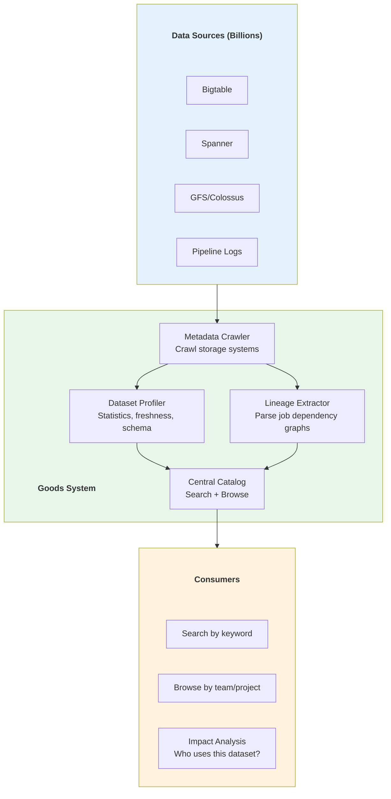
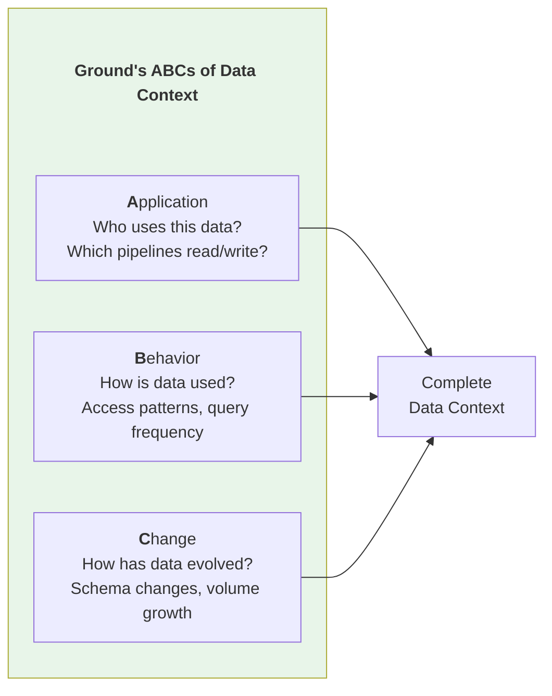
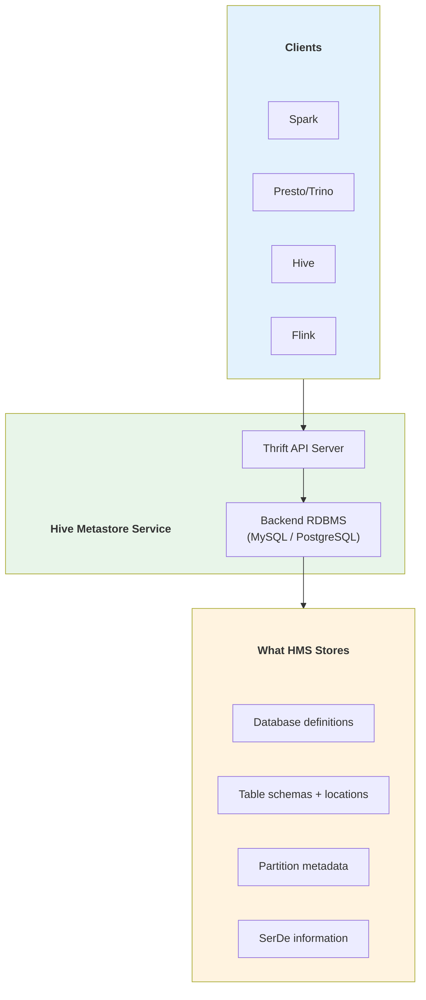
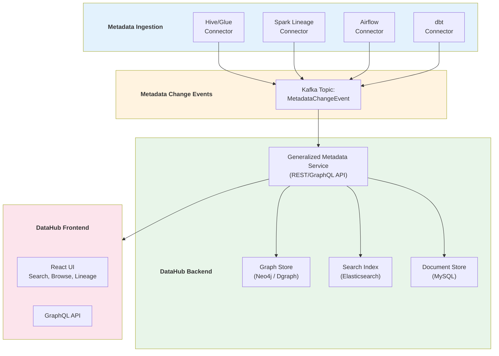
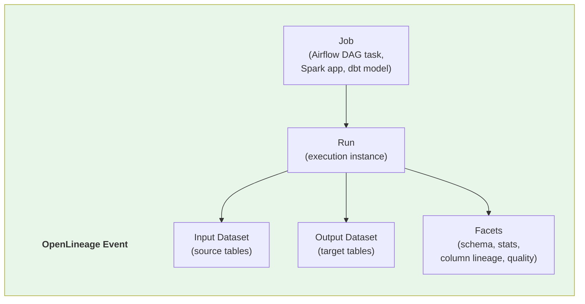
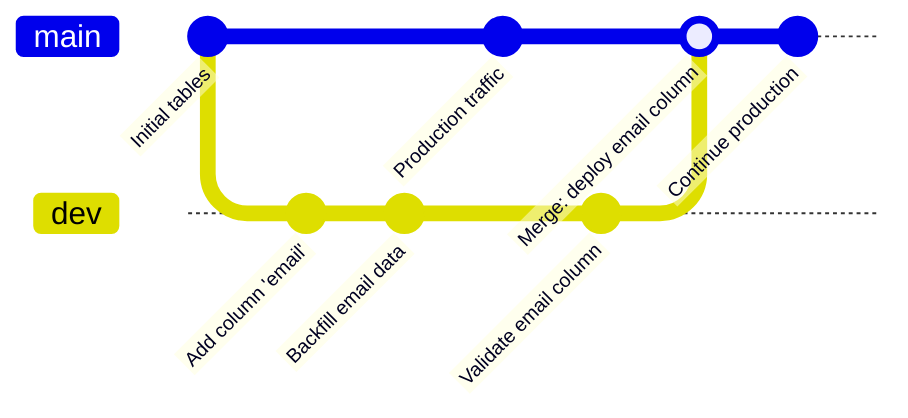
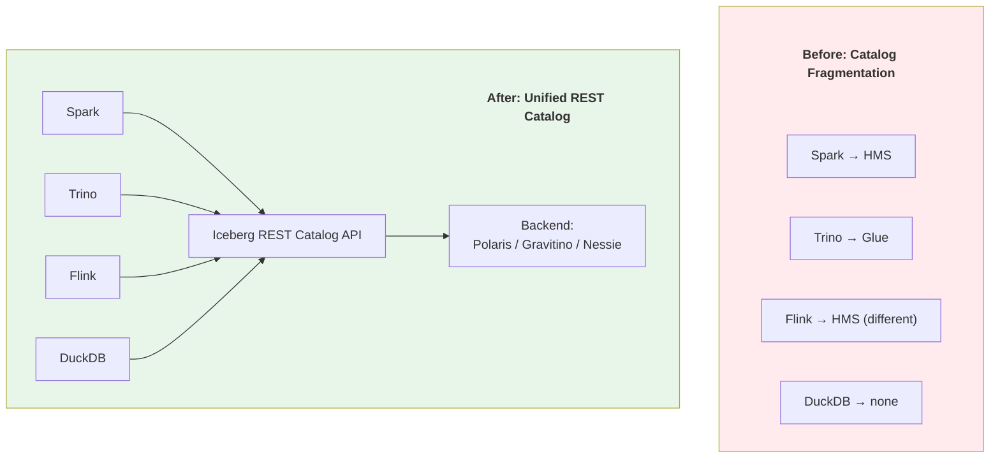
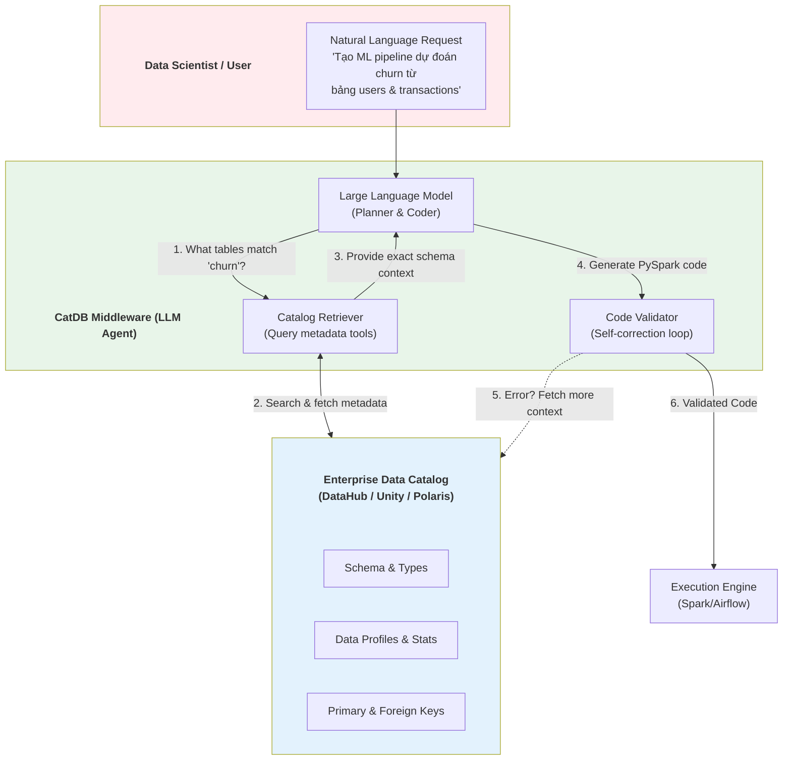
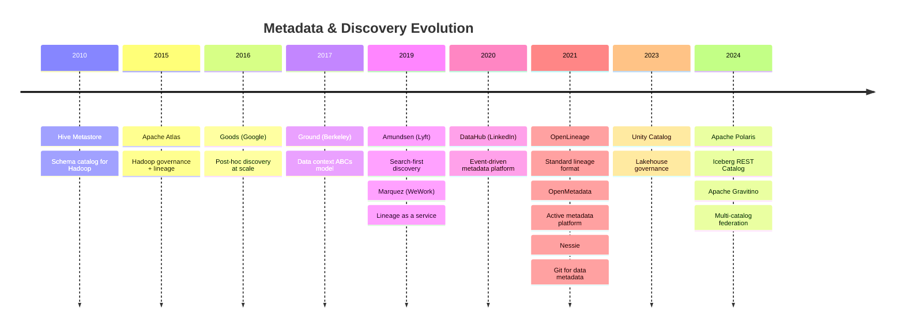
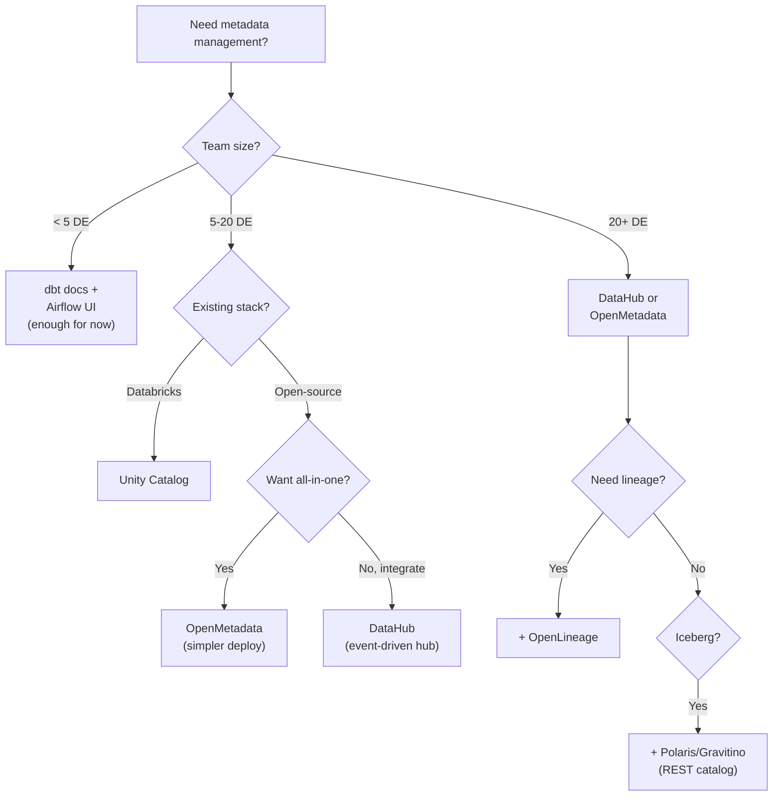

# Metadata & Data Discovery Papers

## Hệ Thần Kinh Của Data Platform — Từ Catalog Đến Lineage

> **Lưu ý:** File này tập trung vào **metadata management, data discovery, catalog systems, và data lineage** — "hệ thần kinh" kết nối mọi layer khác. Data Quality/Governance (policy, contracts) đã cover ở [[07_Data_Quality_Governance_Papers]].

---

## 📋 Mục Lục

1. [Goods — Google Dataset Management](#1-goods---2016)
2. [Ground — Data Context Service](#2-ground---2017)
3. [Hive Metastore](#3-hive-metastore)
4. [DataHub — LinkedIn](#4-datahub---2020)
5. [Amundsen — Lyft](#5-amundsen---2019)
6. [OpenLineage & Marquez](#6-openlineage--marquez---2021)
7. [Unity Catalog — Databricks](#7-unity-catalog---2023)
8. [OpenMetadata](#8-openmetadata---2021)
9. [Nessie & Catalog Versioning](#9-nessie--catalog-versioning---2021)
10. [Apache Polaris & Gravitino](#10-apache-polaris--gravitino---2024)
11. [CatDB — Catalog-driven LLMs](#11-catdb---2025)
12. [Emerging Trends](#12-emerging-trends-2025-2026)
13. [Tổng Kết & Evolution](#13-tổng-kết--evolution)

---

## 1. GOODS - 2016

### Paper Info
- **Title:** Goods: Organizing Google's Datasets
- **Authors:** Alon Halevy, Flip Korn, Natalya F. Noy, et al. (Google)
- **Conference:** SIGMOD 2016
- **Link:** https://research.google/pubs/pub45390/
- **PDF:** https://static.googleusercontent.com/media/research.google.com/en//pubs/archive/45390.pdf

### Key Contributions
- **Post-hoc metadata discovery** — crawl metadata từ hàng tỷ datasets mà KHÔNG yêu cầu owners đăng ký manual
- **Schema fingerprinting** — nhận diện datasets tương tự qua schema similarity
- **Provenance tracking** — tự động extract lineage từ job logs
- **Dataset profiles** — tự động tính statistics, freshness, ownership

### Architecture



### Impact on Modern Tools
- **Google Data Catalog** — Commercial evolution
- **DataHub/Amundsen** — Open-source versions của same concept
- **Concept "post-hoc crawl"** — Adopted by most modern catalogs

### Limitations & Evolution (Sự thật phũ phàng)
- **Post-hoc = luôn chậm hơn thực tế.** Crawler chạy batch → metadata cũ vài giờ. Dataset bị xóa nhưng catalog vẫn hiển thị.
- Ownership detection bằng heuristic (ai viết job cuối cùng?) → sai 20-30%.
- Google scale only — không open-source.

### War Stories & Troubleshooting
- Lỗi kinh điển: **Stale metadata** — dataset đã bị xóa 3 tuần nhưng catalog vẫn hiện. Team mới dùng → pipeline fail. Fix: thêm freshness check + tombstone markers.

### Metrics & Order of Magnitude
- Google Goods index 26+ tỷ datasets (2016).
- Crawler scan toàn bộ metadata Google mỗi 24h.
- 50%+ datasets không có owner rõ ràng → đây là lý do post-hoc approach cần thiết.

### Micro-Lab
```python
# Concept: tự build "mini-Goods" cho data lake
# Scan S3/GCS bucket, extract schema, build catalog
import boto3
import pyarrow.parquet as pq

def crawl_s3_bucket(bucket, prefix=""):
    """Post-hoc metadata discovery cho S3"""
    s3 = boto3.client('s3')
    datasets = []
    for obj in s3.list_objects_v2(Bucket=bucket, Prefix=prefix)['Contents']:
        if obj['Key'].endswith('.parquet'):
            schema = pq.read_schema(f"s3://{bucket}/{obj['Key']}")
            datasets.append({
                'path': obj['Key'],
                'schema': str(schema),
                'size_mb': obj['Size'] / 1024 / 1024,
                'last_modified': obj['LastModified'],
            })
    return datasets
```

---
> 💡 **Gemini Feedback**
> **Góc nhìn Thực chiến (Senior to Junior)**
> Goods dạy bài học #1 về metadata: **Nếu em yêu cầu mọi người tự đăng ký dataset, 70% sẽ không làm.** Post-hoc crawl là cách duy nhất để catalog có coverage cao. Mọi catalog hiện đại (DataHub, OpenMetadata) đều dùng approach này — crawl first, curate later.

---

## 2. GROUND - 2017

### Paper Info
- **Title:** Ground: A Data Context Service
- **Authors:** Joseph M. Hellerstein, Vikram Sreekanti, et al. (UC Berkeley)
- **Conference:** CIDR 2017
- **Link:** http://cidrdb.org/cidr2017/papers/p111-hellerstein-cidr17.pdf

### Key Contributions
- **"ABCs" of data context** — Applications, Behavior, Change
- **Versioned metadata** — metadata thay đổi theo thời gian, cần version control
- **Graph-based model** — metadata là graph (nodes + edges + versions)
- **Context vs Schema** — schema chỉ là 1 phần, context bao gồm ai dùng, khi nào, tại sao

### The ABCs Model



### Impact on Modern Tools
- **Concept "data context"** — influenced OpenMetadata, Atlan
- **Versioned metadata** — Nessie, lakeFS adopted similar concepts
- **Graph model** — DataHub, Apache Atlas use graph storage

### Limitations & Evolution (Sự thật phũ phàng)
- Ground là **academic prototype** — chưa bao giờ production-ready.
- Nhưng IDEAS của Ground sống mãi: versioned metadata, ABCs model, graph-based context.

### Metrics & Order of Magnitude
- Paper predicts: số lượng metadata entities > số lượng data entities 10-100x.
- Context changes faster than data — schema evolves monthly, usage patterns change daily.

---
> 💡 **Gemini Feedback**
> **Góc nhìn Thực chiến (Senior to Junior)**
> Ground dạy: **Metadata không chỉ là schema.** Ai dùng dataset này? Bao nhiêu query/ngày? Schema thay đổi lần cuối khi nào? Đây mới là "context" thực sự. Khi em evaluate catalog tool, hỏi: "Nó có track ABCs không?"

---

## 3. HIVE METASTORE

### Background
- **Why no academic paper?** HMS không phải research project được công bố tại VLDB/SIGMOD. Nó là một component thực dụng được kỹ sư Facebook viết (2010) nhằm ánh xạ file HDFS thành SQL tables.
- **Origin:** Apache Hive project (Facebook, 2010)
- **Role:** De facto standard catalog cho Hadoop ecosystem suốt 10+ năm
- **Spec:** Thrift-based API, backed by RDBMS (MySQL/PostgreSQL)

### Architecture



### What HMS Stores vs What It Doesn't

| ✅ HMS Stores | ❌ HMS Doesn't Store |
|--------------|---------------------|
| Database/table names | Data lineage |
| Column names + types | Access audit logs |
| Partition locations | Usage statistics |
| SerDe class names | Ownership/stewardship |
| Table parameters | Data quality metrics |
| Storage format | Column-level descriptions |

### Impact on Modern Tools
- **Iceberg, Delta, Hudi** — All started with HMS as default catalog
- **Spark, Presto, Flink** — All integrate with HMS natively
- **AWS Glue Data Catalog** — HMS-compatible API

### Limitations & Evolution (Sự thật phũ phàng)
- **Single point of failure.** HMS là 1 process + 1 RDBMS. RDBMS chết = tất cả Spark/Trino jobs fail.
- **Không có fine-grained access control.** HMS biết table A tồn tại nhưng không kiểm soát ai được đọc column nào.
- **Partition scaling nightmare.** Table có 1 triệu partitions → HMS query mất 30 phút. Đây là lý do Iceberg tạo manifest files thay vì list partitions.
- **No lineage, no profiling, no discovery.** HMS chỉ là "phone book" — biết tên nhưng không biết gì thêm.

### War Stories & Troubleshooting
- **HMS lock contention:** Nhiều Spark jobs concurrent ALTER TABLE → deadlock trên MySQL backend. Fix: tăng `hive.metastore.db.type=mysql` connection pool hoặc migrate sang PostgreSQL.
- **Partition explosion:** `ALTER TABLE ADD PARTITION` cho 100K partitions mỗi ngày → HMS RDBMS disk full. Fix: dùng Iceberg (manifest-based) thay vì HMS partition tracking.

### Metrics & Order of Magnitude
- HMS xử lý metadata cho hàng triệu tables/partitions ở các big tech.
- List partitions trên table 1M partitions: 10-30 phút (HMS) vs < 1s (Iceberg manifest).
- HMS availability yêu cầu RDBMS HA (Master-Replica) + load balancer.

### Micro-Lab
```sql
-- Hive: kiểm tra HMS health
SHOW DATABASES;
DESCRIBE FORMATTED my_table;
-- Xem: Location, InputFormat, SerDe, Partition Keys

-- Spark: truy cập HMS
spark.sql("SHOW TABLES IN my_database").show()
spark.catalog.listTables("my_database")
```

---
> 💡 **Gemini Feedback**
> **Góc nhìn Thực chiến (Senior to Junior)**
> HMS là "Windows XP của metadata" — cũ, giới hạn, nhưng MỌI THỨ vẫn phụ thuộc vào nó. Khi em join team mới, câu đầu tiên hỏi: "Metastore dùng gì? HMS standalone hay Glue?" Vì mọi pipeline đều bắt đầu từ đây. Và bắt đầu plan migration sang Iceberg REST Catalog / Unity Catalog / Polaris ngay khi có thể.

---

## 4. DATAHUB - 2020

### Paper Info
- **Title:** DataHub: A Generalized Metadata Search & Discovery Tool
- **Authors:** Mars Lan, et al. (LinkedIn)
- **Conference:** VLDB 2020
- **Link:** https://engineering.linkedin.com/blog/2019/data-hub
- **GitHub:** https://github.com/datahub-project/datahub (9K+ ⭐)

### Key Contributions
- **3rd-generation metadata platform** — WhereHows → DataHub
- **Event-driven architecture** — push metadata qua Kafka (real-time, không batch crawl)
- **Generalized metadata model** — entity + aspect + relationship
- **Graph-based lineage** — automatic lineage from ingestion framework

### Architecture



### Entity-Aspect Model

| Concept | Description | Example |
|---------|-------------|---------|
| **Entity** | Core data asset | Dataset, Dashboard, Pipeline |
| **Aspect** | Metadata about entity | Schema, Ownership, Tags |
| **Relationship** | Link between entities | Dataset → Dashboard (lineage) |

### Impact on Modern Tools
- **Acryl Data** — Commercial DataHub (SaaS)
- **LF AI & Data Foundation** — Open governance
- **dbt integration** — Auto-ingest dbt models/lineage
- **Airflow integration** — DAG → lineage auto-capture

### Limitations & Evolution (Sự thật phũ phàng)
- **Deployment complexity.** DataHub = 5+ microservices (GMS, Frontend, Kafka, ES, Neo4j/MySQL). Self-host = DevOps burden.
- **Column-level lineage** vẫn đang develop (2024-2025). Table-level lineage mature, column-level chưa hoàn chỉnh.
- Neo4j dependency cho graph → scaling challenges ở 100K+ entities.

### War Stories & Troubleshooting
- **Elasticsearch OOM:** Index 500K+ datasets → ES heap exhaustion. Fix: tune `index.refresh_interval`, tăng ES heap.
- **Kafka lag:** Ingestion connector emit quá nhiều events → consumer lag. Fix: batch ingestion thay vì real-time cho initial bootstrap.

### Metrics & Order of Magnitude
- LinkedIn DataHub index 1M+ datasets, 100K+ pipelines.
- Search latency: p50 < 200ms, p99 < 1s.
- Lineage graph: millions of edges (dataset → pipeline → dataset).

### Micro-Lab
```bash
# DataHub: deploy local (Docker Compose)
python3 -m pip install 'acryl-datahub[datahub-rest]'
datahub docker quickstart

# Ingest metadata from Hive
datahub ingest -c recipe.yaml
# recipe.yaml:
# source:
#   type: hive
#   config:
#     host_port: "hive-metastore:9083"
# sink:
#   type: datahub-rest
#   config:
#     server: "http://localhost:8080"
```

---
> 💡 **Gemini Feedback**
> **Góc nhìn Thực chiến (Senior to Junior)**
> DataHub = best open-source metadata platform 2024-2026 cho team > 10 DE. Nếu team nhỏ (3-5 người), dùng dbt docs + Airflow UI có thể đủ. Nhưng khi em có 100+ tables, 50+ pipelines, 10+ people → cần DataHub hoặc OpenMetadata. Lineage tự động = tiết kiệm hàng trăm giờ debugging "dữ liệu này đến từ đâu?"

---

## 5. AMUNDSEN - 2019

### Background
- **Why no academic paper?** Không có paper khoa học gốc vì đây là project mã nguồn mở sinh ra từ internal engineering của Lyft nhằm giải quyết bài toán Data Discovery thực tế của họ.
- **Title:** Amundsen — Lyft's Data Discovery & Metadata Engine
- **Authors:** Lyft Data Platform team
- **Released:** 2019 (open-sourced)
- **GitHub:** https://github.com/amundsen-io/amundsen (4K+ ⭐)
- **Note:** Merged into Linux Foundation, less actively developed since 2023

### Key Contributions
- **Search-first discovery** — tìm data bằng search, không bằng browse
- **Popularity ranking** — dataset được query nhiều = rank cao hơn
- **User annotations** — human context (descriptions, tags) bổ sung cho auto-metadata
- **PageRank cho datasets** — áp dụng graph ranking cho data discovery

### Amundsen vs DataHub

| Aspect | Amundsen | DataHub |
|--------|----------|---------|
| **Architecture** | Microservices (metadata, search, frontend) | Event-driven (Kafka + GMS) |
| **Graph Store** | Neo4j (required) | Neo4j or MySQL (flexible) |
| **Search** | Elasticsearch | Elasticsearch |
| **Lineage** | Basic (table-level) | Advanced (column-level WIP) |
| **Community (2025)** | Declining (merged to LF) | Active (Acryl Data backing) |
| **Best For** | Simple search/discovery | Full metadata platform |

### Impact & Lessons
- **Popularity-based ranking** — concept adopted by DataHub, OpenMetadata
- **"Search > Browse"** — UX lesson: data practitioners prefer search over catalog browsing

### Limitations & Evolution (Sự thật phũ phàng)
- Amundsen dần bị DataHub thay thế vì DataHub có event-driven architecture linh hoạt hơn, community mạnh hơn, và commercial backing (Acryl).
- **Bài học:** Open-source project cần commercial sponsor để survive long-term.

---
> 💡 **Gemini Feedback**
> **Góc nhìn Thực chiến (Senior to Junior)**
> Amundsen quan trọng vì 1 insight: **Data discovery = search problem, không phải browsing problem.** Khi team có 1000 tables, không ai muốn click qua 50 folders. Họ muốn gõ "revenue" và thấy ngay `fact_revenue` table. Mọi catalog sau này đều copy UX pattern này.

---

## 6. OPENLINEAGE & MARQUEZ - 2021

### Background
- **Why no academic paper?** OpenLineage là một chuẩn công nghiệp (industry open standard) do Linux Foundation điều phối, không phải một phát minh thuật toán để xuất bản báo cáo học thuật.
- **OpenLineage:** Open standard for data lineage (LF AI & Data Foundation)
- **Marquez:** Reference implementation, originally WeWork (2019)
- **Spec:** https://openlineage.io/
- **GitHub (Marquez):** https://github.com/MarquezProject/marquez (1.7K+ ⭐)

### Key Contributions
- **Standard lineage event format** — JSON schema cho Job → Dataset → Run
- **Cross-engine lineage** — Spark, Airflow, dbt, Flink emit cùng 1 format
- **Column-level lineage specification** — xem [[07_Data_Quality_Governance_Papers]]
- **Real-time lineage** — event emitted at runtime, không phải batch crawl

### OpenLineage Event Model



### Integrations

| Engine | Integration | Mechanism |
|--------|------------|-----------|
| **Apache Spark** | SparkListener | Emit events from Spark plan |
| **Apache Airflow** | AirflowPlugin | Emit per-task events |
| **dbt** | dbt-ol plugin | Parse manifest.json |
| **Apache Flink** | FlinkListener | Emit from Flink jobs |
| **Great Expectations** | GE integration | Data quality facets |

### Impact on Modern Tools
- **Adopted by:** DataHub, OpenMetadata, Google Cloud, Atlan
- **Marquez** — Reference server for visualizing lineage
- **Spline** — Specialized Spark lineage tool (alternative approach)

### Limitations & Evolution (Sự thật phũ phàng)
- OpenLineage integration chưa 100% mature cho mọi engine. Spark integration tốt nhất. Flink, Trino còn WIP.
- **Column-level lineage** phụ thuộc vào engine emit đủ info → nhiều edge cases bị miss.

### Micro-Lab
```python
# Airflow: bật OpenLineage
# airflow.cfg:
# [openlineage]
# transport = {"type": "http", "url": "http://marquez:5000/api/v1/lineage"}

# Kiểm tra lineage sau khi DAG chạy:
curl http://marquez:5000/api/v1/namespaces/my_namespace/jobs
# → Xem inputs/outputs cho mỗi job
```

---
> 💡 **Gemini Feedback**
> **Góc nhìn Thực chiến (Senior to Junior)**
> OpenLineage = **JDBC of lineage** — 1 standard cho mọi engine. Nếu em chọn catalog/lineage tool năm 2025-2026, ưu tiên tool support OpenLineage. Vì khi đổi from Airflow sang Dagster, lineage format vẫn giống nhau. Lock-in vào proprietary lineage format = technical debt.

---

## 7. UNITY CATALOG - 2023

### Background
- **Why no academic paper?** Ban đầu là sản phẩm nội bộ (proprietary) của Databricks giải quyết bài toán Lakehouse governance, sau đó open-source để tạo standard.
- **Owner:** Databricks
- **Released:** 2023 (open-sourced June 2024)
- **GitHub:** https://github.com/unitycatalog/unitycatalog (2.5K+ ⭐)
- **Role:** Unified governance layer cho Lakehouse

### Key Contributions
- **3-level namespace:** `catalog.schema.table` (thay vì HMS 2-level `database.table`)
- **Fine-grained access control:** RBAC + ABAC at catalog/schema/table/column level
- **Automatic lineage:** Capture từ Spark/SQL execution plans
- **AI asset management:** Manage models, features, functions cùng tables
- **Open-source (2024):** Multi-engine support (Spark, Trino, DuckDB)

### HMS vs Unity Catalog

| Aspect | Hive Metastore | Unity Catalog |
|--------|---------------|---------------|
| **Namespace** | 2-level (db.table) | 3-level (catalog.schema.table) |
| **Access Control** | None (needs Ranger) | Built-in RBAC/ABAC |
| **Lineage** | None | Automatic |
| **Audit** | None | Built-in audit logs |
| **AI Assets** | None | Models, features, functions |
| **Multi-cloud** | No | Yes (via open-source) |
| **Open-source** | Yes | Yes (since 2024) |

### Impact on Modern Tools
- **Databricks Runtime** — Native integration
- **Apache Spark** — Open Unity Catalog connector
- **Delta Lake** — Managed qua Unity Catalog
- **MLflow** — Model registry in Unity Catalog

### Limitations & Evolution (Sự thật phũ phàng)
- Open-source Unity Catalog (2024) chưa có parity với managed version. Nhiều features (lineage, audit) chỉ available trên Databricks.
- Nếu không dùng Databricks → evaluate Apache Polaris hoặc OpenMetadata thay thế.

---
> 💡 **Gemini Feedback**
> **Góc nhìn Thực chiến (Senior to Junior)**
> Unity Catalog = **HMS replacement cho Databricks users.** 3-level namespace (`catalog.schema.table`) giải quyết bài toán "dev/staging/prod isolation" mà HMS không làm được. Nếu em dùng Databricks → đây là must-use. Nếu multi-engine → evaluate Polaris/Gravitino.

---

## 8. OPENMETADATA - 2021

### Background
- **Why no academic paper?** Là một open-source project thuần túy tập trung vào "active metadata" UI/UX thay vì core system algorithms.
- **Owner:** Collate (commercial), open-source
- **GitHub:** https://github.com/open-metadata/OpenMetadata (5K+ ⭐)
- **Focus:** Active metadata platform — metadata drives automation

### Key Contributions
- **Schema-first API** — API-first design, every entity has JSON Schema
- **No-code data quality** — built-in profiling + test framework
- **Collaboration** — conversations, tasks, announcements trên data assets
- **Active metadata** — metadata triggers actions (alerts, quality checks)

### OpenMetadata vs DataHub

| Aspect | OpenMetadata | DataHub |
|--------|-------------|---------|
| **Philosophy** | All-in-one platform | Metadata hub (integrate with others) |
| **Data Quality** | Built-in profiler + tests | External (Great Expectations) |
| **Collaboration** | Native (tasks, threads) | Basic (tags, descriptions) |
| **Lineage** | Auto + manual | Auto (event-driven) |
| **Deployment** | Simpler (fewer services) | Complex (Kafka, Neo4j, ES) |
| **Best For** | Teams wanting single tool | Teams with existing tools |

### Limitations & Evolution (Sự thật phũ phàng)
- "All-in-one" = master of none? Data quality built-in nhưng không mạnh bằng Great Expectations dedicated.
- Younger project → ít production references so với DataHub.

---
> 💡 **Gemini Feedback**
> **Góc nhìn Thực chiến (Senior to Junior)**
> OpenMetadata tốt hơn DataHub cho team nhỏ (< 20 DE) vì deploy đơn giản hơn và tích hợp data quality sẵn. DataHub tốt hơn cho enterprise (> 50 DE) với existing Kafka infra. Lựa chọn phụ thuộc vào team size và existing stack.

---

## 9. NESSIE & CATALOG VERSIONING - 2021

### Background
- **Why no academic paper?** Là project open-source mượn ý tưởng "Git" mang sang metadata của Iceberg. Sức mạnh nằm ở engineering design thay vì khoa học máy tính hàn lâm.
- **Project:** Project Nessie (Dremio)
- **GitHub:** https://github.com/projectnessie/nessie (900+ ⭐)
- **Concept:** "Git for Data" — version control cho metadata

### Key Contributions
- **Git-like branching cho tables** — branch, tag, merge, commit trên metadata
- **Multi-table transactions** — atomic commit across multiple Iceberg tables
- **Time travel via commit hash** — reproduce exact state at any point
- **Review workflow** — dev branch → review → merge to main

### How Nessie Works



### Nessie vs lakeFS

| Aspect | Nessie | lakeFS |
|--------|--------|--------|
| **What it versions** | Metadata only (pointers) | Data + metadata (copies) |
| **Storage overhead** | Near zero | Can be significant |
| **Table format** | Iceberg native | Format-agnostic |
| **Best For** | Schema evolution, multi-table txn | Data versioning, reproducibility |

### Impact on Modern Tools
- **Dremio** — Built-in Nessie catalog
- **Apache Iceberg** — Nessie as catalog backend
- **Apache Polaris** — Influenced by Nessie concepts

### Limitations & Evolution (Sự thật phũ phàng)
- Nessie chỉ version **metadata** — không version data itself. Branch mới vẫn point tới cùng data files.
- Merge conflicts trên data (khác code) rất khó resolve automatically.

---
> 💡 **Gemini Feedback**
> **Góc nhìn Thực chiến (Senior to Junior)**
> Nessie giải quyết bài toán "tôi muốn test schema change mà không phá production." Tạo branch → thay đổi schema → validate → merge. Giống Git workflow cho code, nhưng cho data. Nếu team dùng Iceberg → evaluate Nessie ngay.

---

## 10. APACHE POLARIS & GRAVITINO - 2024

### Background
- **Why no academic paper?** Đây là hai bản implementation (ngôn ngữ thực thi) của chuẩn Iceberg REST Catalog Spec, được Snowflake và Datastrato open-source chứ không phải academic papers.
- **Apache Polaris:** Snowflake-donated Iceberg REST Catalog (open-sourced 2024)
- **Apache Gravitino:** Datastrato-donated unified metadata lake (open-sourced 2024)
- **Iceberg REST Catalog Spec:** Standard API cho Iceberg table management

### Why This Matters



### Polaris vs Gravitino

| Aspect | Apache Polaris | Apache Gravitino |
|--------|---------------|-----------------|
| **Origin** | Snowflake | Datastrato |
| **Focus** | Iceberg REST Catalog impl | Multi-catalog federation |
| **Table Formats** | Iceberg only | Iceberg, Hudi, Delta, Paimon |
| **Catalog Types** | Single catalog | Federate multiple catalogs |
| **Access Control** | Built-in RBAC | Pluggable AuthZ |
| **Best For** | Pure Iceberg shops | Mixed-format environments |

### Impact on Modern Tools
- **Iceberg REST Catalog** = industry standard replacing HMS
- Snowflake, Databricks, Dremio, Tabular all support REST spec
- Enables **true multi-engine interop** — same tables, any engine

### Limitations & Evolution (Sự thật phũ phàng)
- Cả hai mới Apache Incubating (2024) → production maturity chưa cao.
- REST catalog spec vẫn evolving → breaking changes possible.
- Choose wisely: Polaris for pure Iceberg, Gravitino for multi-format.

---
> 💡 **Gemini Feedback**
> **Góc nhìn Thực chiến (Senior to Junior)**
> Iceberg REST Catalog sẽ **giết HMS** trong 3-5 năm. Mọi engine mới đều implement REST spec. Nếu em đang build data platform mới năm 2025-2026 → dùng Polaris hoặc Gravitino thay vì HMS. Nếu đang có HMS → plan migration.

---

## 11. CATDB - 2025

### Paper Info
- **Title:** CatDB: Data-catalog-guided, LLM-based Generation of Data-centric ML Pipelines
- **Authors:** E. Fathollahzadeh, et al.
- **Conference:** PVLDB 2025 (Vol 18) / SIGMOD 2025
- **Link:** https://github.com/CoDS-GCS/CatDB
- **PDF:** https://www.vldb.org/pvldb/vol18/p2639-fathollahzadeh.pdf

### Key Contributions
- **Catalog as Vector DB/Context:** Biến metadata catalog thành context store (Ground Truth) để feed vào LLMs.
- **RAG for Pipeline Generation:** Dùng AI Agent truy vấn Catalog (schema, constraints, lineage) để sinh ra Data-centric ML Pipelines (Pyspark, SQL).
- **Self-Correction:** Nếu AI sinh code lỗi, Agent tự động query lại Catalog để sửa (ví dụ: phát hiện dataType mismatch).
- **Anti-Hallucination:** Ngăn chặn triệt để tình trạng AI tự bịa ra bảng/cột bằng cách dùng schema metadata làm hard constraint.

### Architecture (The "Agent + Catalog" Paradigm)



### Impact & Paradigm Shift
- **Trước đây (Catalog for Humans):** Catalog cho con người tìm kiếm bằng mắt. LLM không có quyền truy cập → Sinh code dễ sai.
- **Với CatDB (Catalog for AI):** Catalog trở thành RAG-backend. Metadata (không phải raw data) là nguyên liệu để AI viết code chuẩn 100%. Mở ra kỷ nguyên DE không cần viết boilerplate pipeline.

### Limitations & Evolution (Sự thật phũ phàng)
- CatDB phụ thuộc hoàn toàn vào **độ sạch của Catalog**. Nếu catalog rác (stale metadata, thiếu constraints), AI sẽ sinh ra rác. "Garbage in, hallucinate out."
- Độ phức tạp cao: Cần LLM đủ xịn để hiểu context lớn, chi phí token API cao.

---
> 💡 **Gemini Feedback**
> **Góc nhìn Thực chiến (Senior to Junior)**
> CatDB là đại diện ưu tú nhất cho năm 2025/2026. Ở các big tech, người ta nhận ra rằng: Nuôi một con AI làm Data Engineer thì **bước số 1 không phải là dạy nó code Spark, mà là cho nó đọc Data Catalog.** Không có Catalog, AI chỉ viết được code hello-world. Có Catalog tốt, AI viết được pipeline join 10 bảng phức tạp mà không sai 1 chữ.

---

## 12. EMERGING TRENDS (2025-2026)

### AI-Driven Lineage Inference (Tự suy luận Lineage bằng AI)
- **Thách thức cũ:** Các hệ thống như OpenLineage bắt buộc phải can thiệp (instrument) vào execution engine (Spark, Flink). Nếu engine là hệ thống đóng thì lineage bị đứt đoạn.
- **Giải pháp mới:** Ứng dụng AI/Transformer-based models (VD: AIDB @ VLDB 2025) để **tự suy luận (infer) missing lineage links**. AI đoán được Cột A → Cột B thông qua pattern metadata (tên cột, semantic similarity) mà không cần lấy execution plan thực tế, giảm dependency xuống mức 0.

### Từ Data Catalog đến AI Governance Platform (Databricks, DataHub)
- Các dự án open-source đã gom chung quản trị Data và AI.
- Catalog giờ đây quản lý cả LLM Prompts, Feature Vectors (Embeddings), ML Models, và Business Metrics (metric layer) vào chung một UI. 

---

## 13. TỔNG KẾT & EVOLUTION

### Timeline



### Evolution Map

| Generation | Era | Representative | Key Idea |
|-----------|-----|---------------|----------|
| **Gen 1** | 2010-2015 | Hive Metastore, Atlas | Schema registry, basic governance |
| **Gen 2** | 2016-2019 | Goods, Amundsen | Discovery, search, post-hoc crawl |
| **Gen 3** | 2020-2023 | DataHub, OpenMetadata | Event-driven, active metadata |
| **Gen 4** | 2024-2026 | Polaris, Gravitino, Unity | Unified catalog, REST API, AI-powered |

### Decision Guide



### Summary Table

| System | Year | Company | Type | Key Innovation |
|--------|------|---------|------|---------------|
| Hive Metastore | 2010 | Apache | Schema catalog | De facto standard, 2-level namespace |
| Atlas | 2015 | Hortonworks | Governance | Hadoop-native classification + lineage |
| Goods | 2016 | Google | Discovery | Post-hoc crawl of billions of datasets |
| Ground | 2017 | Berkeley | Context service | ABCs model, versioned metadata |
| Amundsen | 2019 | Lyft | Discovery | Search-first, popularity ranking |
| Marquez | 2019 | WeWork | Lineage server | OpenLineage reference impl |
| DataHub | 2020 | LinkedIn | Metadata platform | Event-driven, entity-aspect model |
| OpenLineage | 2021 | LF AI | Lineage standard | Cross-engine lineage format |
| OpenMetadata | 2021 | Collate | Active metadata | All-in-one with quality + collab |
| Nessie | 2021 | Dremio | Catalog versioning | Git-like branching for metadata |
| Unity Catalog | 2023 | Databricks | Governance | 3-level namespace, AI assets |
| Polaris | 2024 | Snowflake | REST Catalog | Iceberg REST standard impl |
| Gravitino | 2024 | Datastrato | Multi-catalog | Federate across formats |

---

## 📦 Verified Resources

| Resource | Link | Note |
|----------|------|------|
| DataHub Project | [datahubproject.io](https://datahubproject.io/) | DataHub docs |
| OpenMetadata | [open-metadata.org](https://open-metadata.org/) | OpenMetadata docs |
| OpenLineage | [openlineage.io](https://openlineage.io/) | Lineage standard |
| Marquez | [marquezproject.ai](https://marquezproject.ai/) | Lineage server |
| Project Nessie | [projectnessie.org](https://projectnessie.org/) | Catalog versioning |
| Apache Polaris | [polaris.apache.org](https://polaris.apache.org/) | REST Catalog |
| Unity Catalog OSS | [github.com/unitycatalog](https://github.com/unitycatalog/unitycatalog) | Open Unity Catalog |
| Goods Paper | [research.google](https://research.google/pubs/pub45390/) | SIGMOD 2016 |

---
<mark style="background: #BBFABBA6;">💡 **Gemini Message**</mark>
Metadata là "hệ thần kinh" mà team nào cũng cần nhưng ít team đầu tư đúng mức. Nếu storage là "cơ bắp", execution là "tim", thì metadata là "não" — nó quyết định data nằm đâu, ai sở hữu, dùng cho gì, và thay đổi khi nào.

### 1. Kỷ nguyên Phone Book (2010 - 2016)
- **Sự thật phũ phàng:** Hive Metastore chỉ biết "table A ở HDFS path X, schema có 5 columns." Hỏi "ai dùng table này?" → không biết. "Data quality ra sao?" → không biết. "Sửa column này ảnh hưởng gì?" → không biết. Về cơ bản là danh bạ không có Google Maps.
- **Kẻ thay đổi cuộc chơi:** **Goods** (2016) chứng minh rằng có thể CRAWL metadata tự động mà không cần owners tự đăng ký — mở đường cho mọi catalog hiện đại.

### 2. Kỷ nguyên Discovery (2017 - 2020)
- **Sự thật phũ phàng:** Team 50 data engineers, 10.000 tables, mà không ai biết "monthly_revenue" nằm ở đâu. Mọi người hỏi nhau trên Slack. "Ai biết table revenue ở schema nào?" → 30 phút chờ reply.
- **Kẻ thay đổi cuộc chơi:** **Amundsen** (2019) và **DataHub** (2020) biến data discovery thành search problem — gõ keyword, thấy kết quả ngay, kèm owner, usage stats, lineage.

### 3. Kỷ nguyên Active Metadata (2021 - 2024)
- **Sự thật phũ phàng:** Có catalog rồi nhưng nobody uses it. Catalog chỉ có metadata 6 tháng trước vì không ai cập nhật. Lineage manual vẽ bằng tay, outdated ngay sau lần deploy tiếp.
- **Kẻ thay đổi cuộc chơi:** **OpenLineage** (2021) standardize lineage format → auto-capture từ Spark/Airflow/dbt. **OpenMetadata** push concept "active metadata" — metadata không chỉ để đọc mà còn trigger automations.

### 4. Kỷ nguyên Unified Catalog (2024 - 2026)
- **Sự thật phũ phàng:** Mỗi engine (Spark, Trino, Flink, DuckDB) dùng 1 catalog riêng → cùng 1 table nhưng 4 định nghĩa khác nhau. Schema drift giữa engines = debugging nightmare.
- **Kẻ thay đổi cuộc chơi:** **Iceberg REST Catalog** + **Polaris/Gravitino** (2024) tạo 1 catalog chuẩn cho MỌI engine. HMS sẽ chết trong 3-5 năm. Tương lai: 1 catalog → N engines → 0 schema drift.

**Tóm lại:** Em không cần đầu tư vào metadata ngay ngày đầu. Nhưng khi team > 5 người và tables > 100 → metadata platform là khoản đầu tư quan trọng thứ 2 sau pipeline orchestration!

---
## 🔗 Liên Kết Nội Bộ

- [[01_Distributed_Systems_Papers|Distributed Systems]] — Zookeeper (coordination for metadata)
- [[04_Table_Format_Papers|Table Formats]] — Iceberg, Delta, Hudi (managed by catalogs)
- [[07_Data_Quality_Governance_Papers|Data Quality]] — Governance, contracts, quality tests
- [[09_Query_Optimization_Papers|Query Optimization]] — Catalyst, Calcite (use catalog stats)
- [[10_Serialization_Format_Papers|Serialization Formats]] — Parquet, Arrow (schema in metadata)
- [[11_Orchestration_and_Ingestion_Papers|Orchestration]] — Airflow, dbt (lineage sources)
- [[12_Execution_Engine_Papers|Execution Engines]] — Spark, Trino, Flink (catalog consumers)

---

*Document Version: 1.0*
*Last Updated: April 2026*
*Coverage: Goods, Ground, Hive Metastore, DataHub, Amundsen, OpenLineage/Marquez, Unity Catalog, OpenMetadata, Nessie, Polaris/Gravitino*
