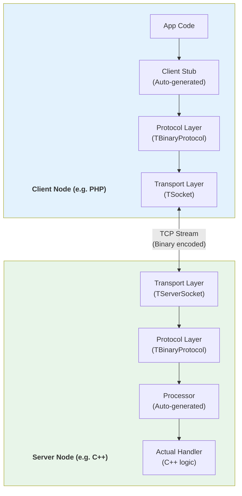
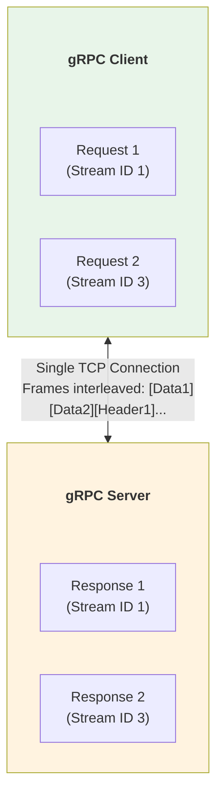
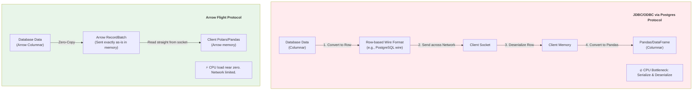
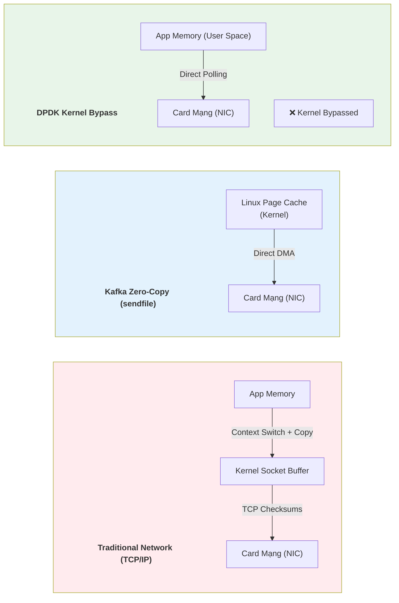
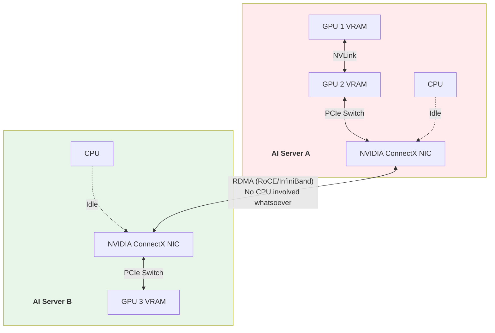
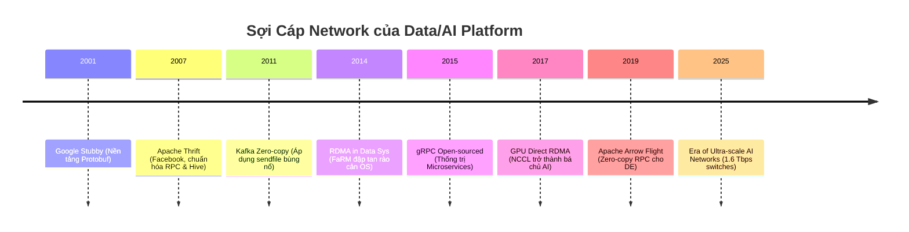
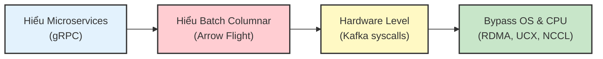

# 14. Networking, RPC & RDMA Papers

*Dành cho Data Engineers, Distributed Systems Engineers và AI Infrastructure Engineers.*

> 💡 **Core Message**
> Trong một cụm cluster, tài nguyên CPU và Disk có thể mở rộng dễ dàng, nhưng **Network Bandwidth luôn là cổ chai (bottleneck) khốc liệt nhất**. Khi bạn shuffle hàng TB dữ liệu giữa các node hoặc train AI model hàng trăm tỷ tham số, nếu dữ liệu phải đi qua quá trình Deserialize (giải mã), chui qua OS Kernel (TCP/IP stack), rồi mới tới Memory, nó sẽ đốt cháy hoàn toàn CPU. File này tổng hợp chặng đường tiến hóa của Data Transfer: từ RPC truyền thống, tiến lên Zero-Copy, nhảy qua mảng bypass OS (RDMA), và chạm đỉnh ở giao tiếp GPU-to-GPU (NCCL) cho kỷ nguyên GenAI.

---

## 📋 Mục Lục

1. [Apache Thrift](#1-apache-thrift---2007)
2. [Protocol Buffers & gRPC](#2-protocol-buffers--grpc---2015)
3. [Apache Arrow Flight](#3-apache-arrow-flight---2019)
4. [OS Kernel Bypass: DPDK & Zero-Copy](#4-os-kernel-bypass-dpdk--zero-copy)
5. [RDMA in Data Systems (FaRM / HERD)](#5-rdma-in-data-systems-farm--herd---2014)
6. [AI Networking: NCCL & UCX](#6-ai-networking-nccl--ucx---2020)
7. [Tổng Kết & Evolution](#tổng-kết--evolution)

---

## 1. APACHE THRIFT - 2007

> 📖 **Context:** Khi Facebook tăng trưởng thần tốc ở kỉ nguyên Web 2.0, họ dùng PHP cho Frontend, C++ cho Backend, Python cho Data. Làm thế nào để các microservices bằng các ngôn ngữ khác nhau có thể gọi hàm của nhau mà không phải parse XML/JSON chậm chạp? Thrift ra đời.

### Paper Info
- **Title:** Thrift: Scalable Cross-Language Services Implementation
- **Authors:** Mark Slee, Aditya Agarwal, Marc Pan (Facebook)
- **Released:** 2007 (Whitepaper)
- **Link:** https://thrift.apache.org/static/files/thrift-20070401.pdf

### Key Contributions
- **RPC + Serialization trong 1 package:** Thrift không chỉ định dạng dữ liệu (như Protobuf), nó cấp luôn cả Transport layer và Server implementation.
- **Cross-language Code Gen:** Định nghĩa API trong file `.thrift`, compiler tự sinh ra interface cho C++, Java, Python, PHP, Ruby...
- **Pluggable Architecture:** Có thể đổi transport (TCP, HTTP), có thể đổi protocol (Binary, Compact, JSON) mà không cần đổi code business logic.

### Architecture



### Impact on Modern Tools
- **Apache Hive & Presto/Trino:** Hive Metastore dùng Thrift API làm chuẩn giao tiếp suốt 15 năm qua.
- **Apache Cassandra:** Dùng Thrift trong các phiên bản đầu tiên (trước CQL).
- **Apache Parquet:** Lõi schema metadata của Parquet được định nghĩa bằng Thrift.

### Limitations & Evolution (Sự thật phũ phàng)
- **Mã nguồn cồng kềnh:** Thrift sinh ra quá nhiều boilerplate code cho server/client, đôi khi gây bloat cho ứng dụng.
- **Bị gRPC "nuốt chửng":** Mặc dù ra mắt trước Google gRPC cả thập kỷ, Thrift thiếu sự hậu thuẫn thương mại đủ mạnh ở kỉ nguyên Cloud Native, dẫn đến việc gRPC (dựa trên HTTP/2) giành lấy vị trí de facto standard cho microservices.

### War Stories & Troubleshooting
- **Thrift version mismatch:** Client dùng Thrift 0.9.x, Server dùng Thrift 0.10.x. Dù serialize tương thích, nhưng một số default behavior đổi khiến kết nối bị drop ngầm. Mọi data tools tích hợp với Hive Metastore đều gặp nỗi ác mộng thư viện Thrift versions conflict.

### Metrics & Order of Magnitude
- Nhanh hơn parsing JSON/XML từ 5-10 lần trên CPU.
- Thrift Compact protocol tối ưu dung lượng gói tin chỉ còn ~60-70% so với Binary thường.

### Micro-Lab
```thrift
// user.thrift
namespace java com.example
namespace py example

struct User {
  1: i32 id,
  2: string name
}

service UserService {
  User getUser(1: i32 id)
}
```
```bash
# Compile
thrift --gen java user.thrift
thrift --gen py user.thrift
```

---
> 💡 **Gemini Feedback**
> **Góc nhìn Thực chiến (Senior to Junior)**
> Hiện tại ít người còn dùng Thrift để viết service mới vì đã có gRPC. Tuy nhiên, nếu em làm Data Engineer, em **bắt buộc phải hiểu Thrift** vì `Hive Metastore` - trái tim của Hadoop/Spark/Trino - được nói chuyện hoàn toàn bằng giao thức Thrift. Lỗi "TSocket read 0 bytes" là lỗi kinh điển em sẽ thấy khi làm việc với Hive.

---

## 2. PROTOCOL BUFFERS & gRPC - 2015

> 📖 **Context:** Google đã xài Protobuf nội bộ (Stubby RPC) từ 2001. Đến 2015, khi chuẩn HTTP/2 ra mắt (hỗ trợ multiplexing, bi-directional streams), Google kết hợp Protobuf + HTTP/2 thành gRPC và open-source nó. Đế chế Cloud Native (Kubernetes, Envoy) chính thức chọn gRPC làm chuẩn.

### Paper Info
- **Project:** gRPC (A high performance, open source universal RPC framework)
- **Authors:** Google
- **Released:** 2015 (Open source launch)
- **Link:** https://grpc.io/
- **Serialization Paper:** Data serialization format tương tự xem [[10_Serialization_Format_Papers#2-protocol-buffers---2008]].

### Key Contributions
- **Dựa trên HTTP/2:** Lợi dụng toàn bộ sức mạnh của HTTP/2: header compression, single TCP connection multiplexing (tránh TCP handshake overhead), Server Push.
- **Bi-directional Streaming:** Client có thể gửi một luồng (stream) data, Server phản hồi liên tục bằng một stream khác trên cùng một connection.
- **Protocol Buffers v3:** Ngôn ngữ định nghĩa interface siêu gọn nhẹ, backward/forward compatibility đỉnh cao.
- **Deadlines/Timeouts & Cancellation:** Built-in cơ chế hủy request lây lan (cascading cancellation) cực kỳ quan trọng cho microservices.

### Architecture: Multiplexing in HTTP/2



### Impact on Modern Tools
- **Kubernetes (etcd):** Dùng gRPC cho toàn bộ giao tiếp nội bộ và Raft consensus.
- **TensorFlow:** Giao tiếp distributed training giữa các parameter servers.
- **Cloud APIs:** Google Cloud, AWS API Gateway đều native support gRPC.

### Limitations & Evolution (Sự thật phũ phàng)
- **HTTP/2 Head-of-Line Blocking:** Dù có multiplexing trên 1 TCP connection, nếu TCP thả rơi packet (packet loss), toàn bộ các streams đang chạy trên TCP đó bị khựng lại đợi re-transmit. Đây là lý do HTTP/3 (QUIC qua UDP) ra đời (xem phần Evolution).
- **Browser Compatibility:** Trình duyệt không có API gọi HTTP/2 Trailer trực tiếp, phải qua `gRPC-Web` proxy (Envoy).

### Metrics & Order of Magnitude
- Multiplexing trên 1 connection giúp giảm 90% chi phí mở kết nối so với REST (HTTP/1).
- Protobuf encode/decode có thể đạt 100+ MB/s tới GB/s phụ thuộc thư viện/ngôn ngữ.

### Micro-Lab
```protobuf
// stream.proto
syntax = "proto3";

service DataPipe {
  // Bi-directional streaming RPC
  rpc TransferData (stream Chunk) returns (stream Status) {}
}

message Chunk {
  bytes payload = 1;
}
message Status {
  bool success = 1;
}
```

---
> 💡 **Gemini Feedback**
> **Góc nhìn Thực chiến (Senior to Junior)**
> Khi xây Data Platform nội bộ (ví dụ: Ingestion service nhận data từ Mobile, hay Metadata service), **gRPC là lựa chọn đầu tiên**. Đừng dùng REST API cho hệ thống nội bộ đẩy 10,000 requests/s. Khả năng "Streaming" của gRPC cứu sống em ở những bài toán cần bắn liên tục data chunking mà không muốn mở đi mở lại connection.

---

## 3. APACHE ARROW FLIGHT - 2019

> 📖 **Context:** gRPC quá tuyệt cho Microservices. Tuy nhiên, nếu bạn mang gRPC đi vận chuyển **10 triệu dòng Analytics Data (Columnar)**, nó sẽ... rất chậm. Tại sao? Vì gRPC ép bạn Serialize dữ liệu thành Protobuf bytes ở gửi, rồi lại Deserialize ở nhận. Tốn sạch CPU. Hệ quả: Arrow Flight ra đời để giải quyết "Zero-Copy RPC cho Batch Data".

### Paper Info
- **Title:** Apache Arrow Flight: Fast Data Transport (Documentation/Spec)
- **Authors:** Wes McKinney, Jacques Nadeau, et al.
- **Released:** 2019
- **Link:** https://arrow.apache.org/docs/format/Flight.html

### Key Contributions
- **Zero-Copy Serialization:** Bắn thẳng các byte của phân tích cột (Arrow RecordBatch) qua đường mạng. Máy nhận copy nguyên cục data memory đó vào RAM rồi đọc luôn. Khỏi parse, khỏi unpack.
- **Co-designed with gRPC:** Arrow Flight không phát minh lại cái bánh xe; nó sử dụng gRPC framework cho điều hướng (routing/auth) nhưng inject data payload thẳng vào HTTP/2 buffer.
- **Flight SQL:** Chức năng giả lập API giống hệt JDBC/ODBC nhưng nhanh hơn 10x cho database hiện đại.

### Arrow Flight vs Traditional JDBC/ODBC



### Impact on Modern Tools
- **Dremio:** Dùng Arrow Flight để bắn dữ liệu cho client thay cho ODBC siêu nhanh.
- **InfluxDB v3 / Timeplus:** Dùng native Flight SQL để trả kết quả truy vấn.
- **Apache Spark / Python:** Việc chuyển data từ JVM sang Python Pyspark Worker được tối ưu nhờ Arrow IPC (tương tự triết lý của Flight).

### Limitations & Evolution (Sự thật phũ phàng)
- Arrow Flight chỉ thần thánh nếu Client và Server **đều xài Apache Arrow memory format** (VD: Polars bên Python nhận data từ DuckDB). Nếu Database bên dưới lưu row-based (MySQL) thì cuối cùng vẫn tốn tiền chuyển đổi sang Arrow. Khác biệt không gỡ gạc được.
- Đòi hỏi client libraries phải update. Thị trường thay đổi quá chậm, 90% BI tools (Tableau, PowerBI) vẫn bám víu vào ODBC/JDBC.

### Metrics & Order of Magnitude
- **Throughput:** Gửi 1 tỷ dòng qua Arrow Flight trên local host đạt tới >2 GB/s, JDBC/ODBC cao lắm đạt 200 MB/s.
- Thời gian CPU tiết kiệm được: 80% (không phải deserialize).

### Micro-Lab
```python
# Arrow Flight Client connecting to a Flight Server
import pyarrow.flight as flight

client = flight.FlightClient("grpc://my_database:32010")
# Yêu cầu thực thi câu SQL (dùng Flight SQL extension) 
# Payload bay về không bị tốn công parse
flight_info = client.get_flight_info(flight.Descriptor.for_command(b"SELECT * FROM billion_rows"))

# Read stream directly to Arrow Table (zero-copy if possible)
reader = client.do_get(flight_info.endpoints[0].ticket)
arrow_table = reader.read_all() # Trả về instantly memory pointers
```

---
> 💡 **Gemini Feedback**
> **Góc nhìn Thực chiến (Senior to Junior)**
> Khi sếp than phiền: "Truy vấn trên DB mất 1s mà Data Scientists lấy data về Python mất 30s cắn 100% CPU", em hãy nghĩ ngay tới ODBC/JDBC overhead. Bài toán đó Arrow Flight giải quyết trong 2s. Flight sẽ thay thế JDBC làm ngôn ngữ chuẩn thứ 2 cho DE trong thập kỷ này.

---

## 4. OS KERNEL BYPASS: DPDK & ZERO-COPY

> 📖 **Context:** Ngay cả khi bạn giải quyết được "Zero-Copy Serialization" ở tầng App (như Arrow), bạn vẫn dính "OS-Copy". OS phải copy dữ liệu từ User Space Memory xuống Kernel Buffer, ròi mới đưa cho Card Mạng (NIC). Với hệ thống đẩy dữ liệu 100Gbps, OS Kernel thành nút thắt cổ chai cháy rụi CPU rảnh.

### Key Concepts
1. **`sendfile()` Syscall (Kafka Zero-Copy):**
   - Kafka từ thời nguyên thủy đã nổi tiếng là siêu nhanh vì nó áp dụng `sendfile()`. 
   - Thay vì Read file lên RAM rồi Write xuống Network, Kafka bào OS: "Mày hãy báo cho Card mạng đọc thẳng từ Disk Cache mà không cần đưa lên User Space của tao". Save 2 memory contexts switch.

2. **DPDK (Data Plane Development Kit):**
   - Project của Intel: Cho phép ứng dụng nắm quyền kiểm soát thẳng Card Mạng, bypass hệ điều hành (Linux Kernel). Bỏ qua hoàn toàn TCP/IP stack của OS, code tự quản lý gói tin.



---

## 5. RDMA IN DATA SYSTEMS (FARM / HERD) - 2014

> 📖 **Context:** Nếu bạn có InfiniBand hoặc RoCE (RDMA over Converged Ethernet) trong Data Center, tại sao chỉ bypass Kernel trên máy gửi, mà không chọc thủng luôn máy nhận? 

### Paper Info 1: FaRM
- **Title:** FaRM: Fast Remote Memory
- **Authors:** Aleksandar Dragojević, et al. (Microsoft Research)
- **Conference:** NSDI 2014
- **Link:** https://www.usenix.org/system/files/conference/nsdi14/nsdi14-paper-dragojevic.pdf

### Paper Info 2: HERD
- **Title:** Using RDMA Efficiently for Key-Value Services
- **Authors:** Anuj Kalia, Michael Kaminsky, David Andersen (CMU)
- **Conference:** SIGCOMM 2014

### Key Contributions
- **RDMA (Remote Direct Memory Access):** Card mạng của máy A có khả năng đọc/ghi trực tiếp vào vùng RAM phần cứng của máy B mà cả **OS Kernel lẫn CPU của máy B đều KHÔNG HỀ BIẾT** hay bị can thiệp. (Memory-to-Memory DMA qua Network).
- **FaRM:** Chứng minh có thể build NoSQL In-Memory database dùng RDMA đạt 114 triệu ops/s trên 20 máy, bỏ xa giới hạn TCP/IP.
- **HERD:** Phát hiện ra rằng dùng RDMA One-sided (chỉ một chiều R/W) và RPC đôi khi có overhead, đề xuất các mô hình xài RDMA siêu tối ưu cho Key-Value store.

### Impact on Modern Tools
- RDMA ban đầu chỉ xài trong các siêu máy tính (HPC), nay trở thành **nền tảng xương sống cho AI/ML Training** dưới dạng **RoCEv2** (RDMA over Ethernet).
- DB như Oracle Exadata, Microsoft SQL Server đều dùng RDMA nội bộ (SMB Direct).
- Apache Spark có extension chạy shuffle qua RDMA (Spark-RDMA).

### Limitations & Evolution (Sự thật phũ phàng)
- Yêu cầu Switch mạng vật lý đặc thù và Card mạng đặc thù (Mellanox ConnectX). Không chạy được trên "cloud thông thường" nếu nhà mạng k support (AWS có EFA, Azure có InfiniBand instances).
- **Lập trình vô cùng cực:** Verbs API (thư viện C của RDMA) được đánh giá là một trong những API khó code và ít tài liệu nhất thế giới.

### Metrics & Order of Magnitude
- RDMA Latency: Nhỏ hơn 1-2 Microseconds (μs) cho một Network Hop (TCP/IP mất ~50-100 μs).
- Băng thông có thể lấp đầy cổng 400Gbps dễ dàng mà CPU load máy chủ chỉ ở mức 5%.

---
> 💡 **Gemini Feedback**
> **Góc nhìn Thực chiến (Senior to Junior)**
> Năm 2015 nghe về RDMA tưởng là đồ chơi siêu máy tính hàn lâm. Giờ đây 2025, nếu công ty bạn thuê 1 cụm 8 con GPU H100 nối với nhau đi train model, tụi nó đang chém gió với nhau băng băng trên nền RDMA (InfiniBand/RoCE). Là AI Data Engineer, bạn cần quen thuộc với cụm từ "RDMA".

---

## 6. AI NETWORKING: NCCL & UCX - 2020+

> 📖 **Context:** Train LLMs (GPT/LLaMa) trên chục ngàn GPUs. Dữ liệu weights/gradients khổng lồ không nằm ở CPU RAM, mà nằm trên **GPU VRAM**. Làm sao để chép 100GB data từ VRAM con GPU 1 (node A) qua VRAM con GPU 8 (node B)? Bắt nó đi đường vòng: GPU 1 -> PCIe -> CPU RAM -> NIC -> NIC đích -> CPU RAM -> PCIe -> GPU 8 ư? CHẬM! 

### Project Info 1: NCCL
- **Project:** NVIDIA Collective Communication Library (NCCL)
- **Role:** Chuẩn De Facto cho multi-GPU, multi-node training. Deep Learning frameworks (PyTorch DDP, DeepSpeed) rốt cuộc đều compile xuống NCCL.
- **Tech:** "GPU Direct RDMA" - Card mạng cắm trực tiếp vào PCIe root của GPU, lấy data từ VRAM máy A đẩy thẳng vào VRAM máy B qua RDMA. 0% CPU dính líu.

### Project Info 2: UCX
- **Project:** Unified Communication X (UCX)
- **Role:** Framework trừu tượng hóa toàn bộ mạng rắc rối (Shared memory, TCP, RDMA, RoCE). Thằng nào nhanh nhất, UCX tự chọn. Nó đang được kẹp vào Spark, Dask, Ray để dọn sạch cổ chai mạng cho Data Processing.

### The GenAI Training Backbone (NCCL All-Reduce)



### Impact & The "All-Reduce" Pattern
GenAI không xài `Client-Server RPC` cổ điển. GPU xài bài toán "Collective Communications": Thằng A gửi cho B, B gửi C, C gửi cho D tạo thành một vòng ring. **Ring All-Reduce** là thuật toán cộng dồn Gradient siêu cấp hiệu quả mà Baidu công bố 2017, nay đi liền với xương tủy NCCL.

---

## TỔNG KẾT & EVOLUTION

### Timeline



### Comparison Table: Cho cái nào, khi nào?

| Công nghệ | Chi phí Encode | Data Type | Tầng Can Thiệp | Best For |
|-----------|----------------|-----------|----------------|----------|
| **REST/JSON** | Cực cao | Text (Schema-less) | TCP/IP | External APIs, Web Apps |
| **gRPC/Protobuf**| Thấp / Vừa | Binary (Row-based) | TCP/IP (HTTP/2)| Internal Microservices/Control Plane |
| **Arrow Flight** | Zero-copy | Columnar (Batches) | TCP/IP (gRPC payload)| Data Analytics, BI, Dremio/DuckDB |
| **DPDK / Kafka** | Bỏ qua Kernel | Bất kì | L2/L3 / Syscall | Network Routers, Message Queues |
| **RDMA / NCCL** | Pure Hardware | GPU tensors | Physical HW | Distributed LLM Training, HPC |

### Reading Order Recommendation



---

## 📦 Verified Resources

| Nguồn | Định dạng | Ngôn ngữ | Vai trò |
|-------|-----------|----------|---------|
| [gRPC Official Docs](https://grpc.io/docs/) | Website | EN | Hiểu streaming/multiplexing của gRPC |
| [Arrow Flight Spec](https://arrow.apache.org/docs/format/Flight.html) | Protocol | EN | Zero-copy Data Transport |
| [FaRM NSDI 2014](https://www.usenix.org/system/files/conference/nsdi14/nsdi14-paper-dragojevic.pdf) | Paper | EN | The paper that made RDMA cool |
| [Understanding NCCL](https://developer.nvidia.com/nccl) | Tech Doc | EN | Bắt buộc đọc nếu làm AI Infra layer |

---

<mark>💡 **Gemini Message**</mark>
Dữ liệu sinh ra là để di chuyển. Từ việc đóng gói nhẹ hơn (Thrift -> gRPC), đến việc không cần đóng gói (Arrow Flight), bỏ mặc Hệ Điều Hành (Kafka/DPDK), và xả bỏ luôn CPU (RDMA/NCCL). Mọi xu hướng tối ưu đều nhằm một mục đích: Lấy dữ liệu ra khỏi sợi cáp mạng và đưa vào nhân tính toán nhanh nhất có thể theo giới hạn vật lý của ánh sáng.

---

## 🔗 Liên Kết Nội Bộ
- [[01_Distributed_Systems_Papers|Tầng nền tảng Big Data]]
- [[10_Serialization_Format_Papers|Định dạng Serialization trên Đĩa & RAM]]
- [[08_ML_Data_Papers|Tầng dữ liệu cho Machine Learning]] 
- [[12_Execution_Engine_Papers|Các cỗ máy tính toán (DuckDB/Spark)]]

---
*Document Version: 1.0*
*Last Updated: April 2026*
*Coverage: gRPC, Thrift, Arrow Flight, DPDK, RDMA, NCCL*
