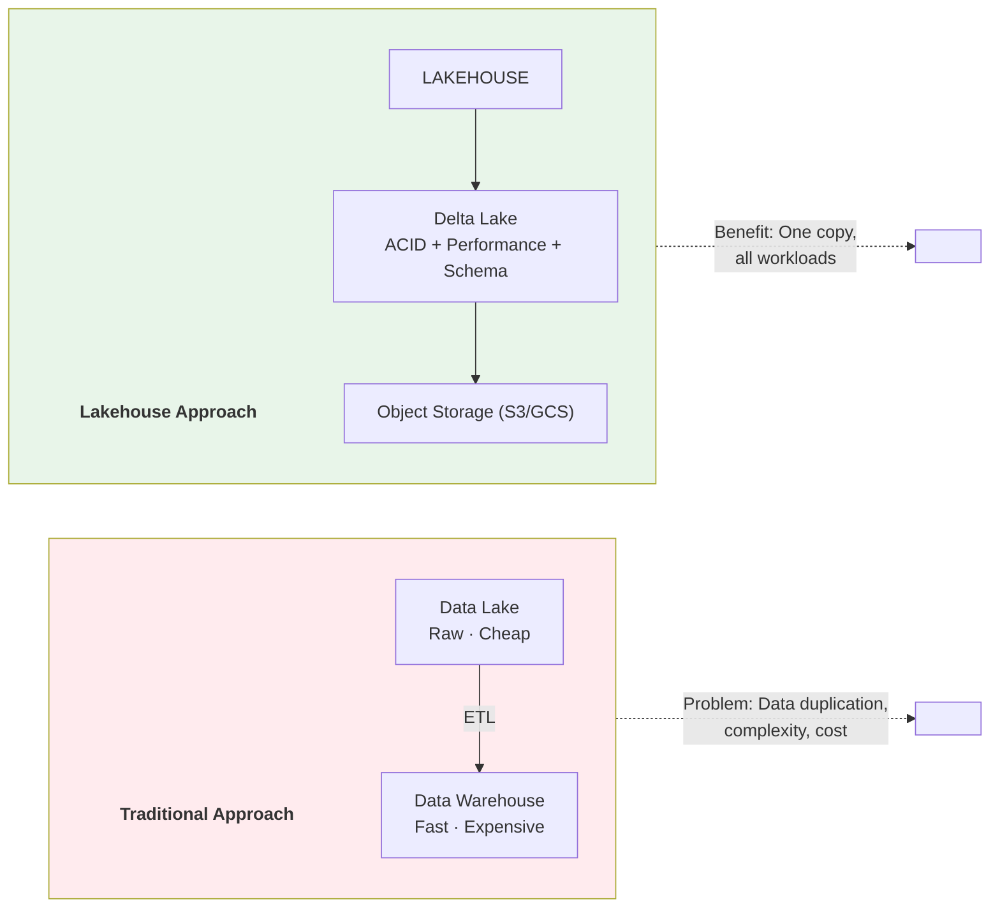
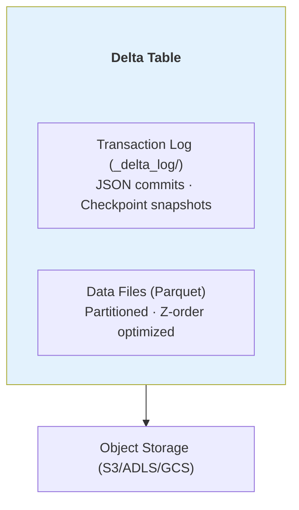
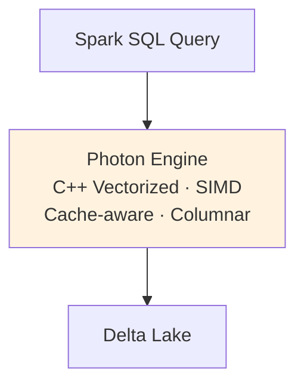
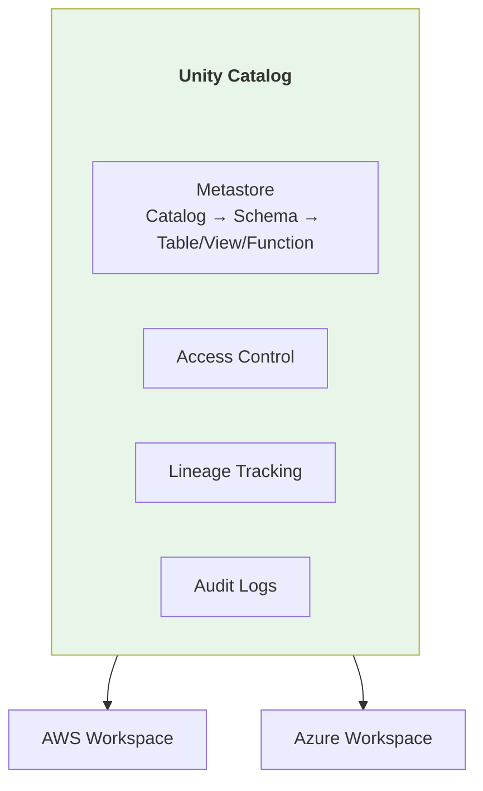
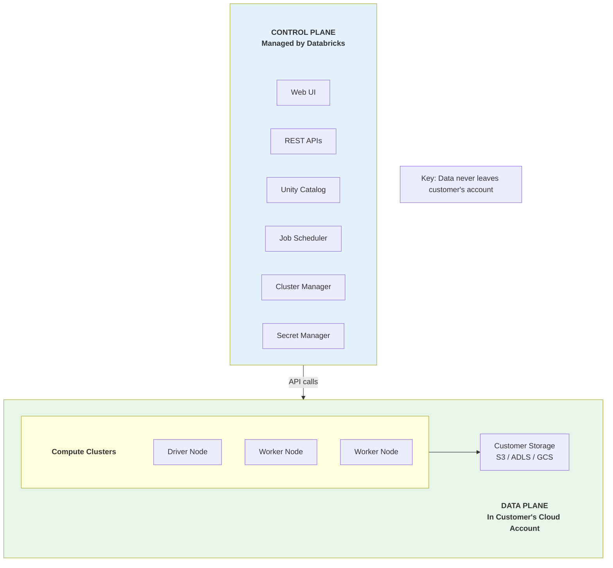
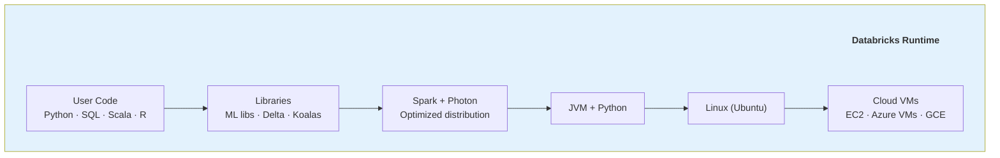

# 🧱 Databricks Platform Deep Dive

> Unified Analytics Platform - Lakehouse Architecture Pioneer

---

## 📋 Mục Lục

1. [Tổng Quan](#-tổng-quan)
2. [Core Services](#-core-services)
3. [Kiến Trúc Bên Trong](#-kiến-trúc-bên-trong)
4. [So Sánh Với Open Source](#-so-sánh-với-open-source)
5. [Pricing Model](#-pricing-model)
6. [Khi Nào Nên Dùng](#-khi-nào-nên-dùng)

---

## 🎯 Tổng Quan

### Company Background

```d
Founded: 2013
Founders: Apache Spark creators (UC Berkeley)
Valuation: $43B (2023)
Employees: 5,000+

Key Innovations:
- Lakehouse Architecture (coined the term)
- Delta Lake (open sourced)
- MLflow (open sourced)
- Unity Catalog
- Photon Engine
```

### Platform Philosophy



---

## 🔧 Core Services

### 1. Delta Lake

**What:**
ACID transactions layer on top of data lake storage.

**Features:**
```d
Core Capabilities:
- ACID transactions
- Schema enforcement & evolution
- Time travel (version history)
- Unified batch + streaming
- MERGE/UPDATE/DELETE support

Performance:
- Data skipping
- Z-ordering
- Optimize command
- Auto-compaction
```

**Architecture:**


### 2. Photon Engine

**What:**
C++ native vectorized query engine (thay thế Spark SQL engine).

**Performance:**
```d
Benchmark vs Spark SQL:
- 2-8x faster for SQL workloads
- 3x faster for ETL
- Optimized for Delta Lake
```



### 3. Unity Catalog

**What:**
Unified governance layer for all data assets.

**Features:**
```
Governance:
- Centralized access control
- Fine-grained permissions (row/column)
- Data lineage
- Audit logging

Discovery:
- Data catalog
- Search across workspaces
- Tags and documentation
- Data quality metrics

Sharing:
- Delta Sharing (open protocol)
- Cross-cloud sharing
- External sharing without copy
```

**Architecture:**


### 4. Databricks SQL (DBSQL)

**What:**
Serverless SQL warehouse for BI and analytics.

**Features:**
```
Performance:
- Photon-powered
- Auto-scaling
- Query caching
- Intelligent workload management

BI Integration:
- Native connectors (Tableau, Power BI, Looker)
- JDBC/ODBC
- REST API

Serverless:
- No cluster management
- Pay per query
- Instant startup
```

### 5. MLflow & Model Serving

**What:**
End-to-end ML lifecycle management.

**Components:**
```
MLflow (Open Source):
+------------------+
| Tracking         | - Log experiments
+------------------+
| Projects         | - Reproducible runs
+------------------+
| Models           | - Model packaging
+------------------+
| Registry         | - Model versioning
+------------------+

Databricks Additions:
+------------------+
| Model Serving    | - Real-time endpoints
+------------------+
| Feature Store    | - Feature management
+------------------+
| AutoML           | - Automated training
+------------------+
| Lakehouse AI     | - LLM integration
+------------------+
```

### 6. Workflows

**What:**
Orchestration for data and ML pipelines.

**Features:**
```
Job Types:
- Notebooks
- Python scripts
- SQL queries
- dbt projects
- JAR files

Scheduling:
- Cron-based
- Trigger-based
- Multi-task DAGs

Monitoring:
- Run history
- Alerts
- Metrics
```

### 7. Delta Live Tables (DLT)

**What:**
Declarative ETL framework.

**Concept:**
```python
# Traditional ETL (imperative)
df = spark.read.parquet("raw/")
df_clean = df.filter(df.status == "valid")
df_clean.write.mode("overwrite").parquet("clean/")

# DLT (declarative)
@dlt.table
def clean_data():
    return dlt.read("raw").filter("status = 'valid'")

# DLT handles:
# - Incremental processing
# - Error handling
# - Data quality
# - Lineage
```

**Features:**
```
Automatic:
- Incremental processing
- Schema inference
- Dependency resolution
- Retry logic

Quality:
- Expectations (data quality rules)
- Quarantine bad records
- Quality metrics

Monitoring:
- Pipeline graph
- Data quality dashboard
- Event logs
```

---

## 🏗️ Kiến Trúc Bên Trong

### Control Plane vs Data Plane



### Cluster Architecture

```
                    CLUSTER TYPES

1. All-Purpose Clusters:
   - Interactive development
   - Multiple users
   - Long-running
   - Expensive

2. Job Clusters:
   - Automated workloads
   - Created per job
   - Terminated after job
   - Cost-effective

3. SQL Warehouses:
   - BI queries
   - Serverless option
   - Auto-suspend

4. Serverless Compute:
   - Instant startup
   - No cluster config
   - Pay per use
```

### Runtime Stack



**Runtime Versions:**
- **Standard:** Spark + common libraries
- **ML:** + TensorFlow, PyTorch, scikit-learn
- **Genomics:** + bioinformatics tools
- **GPU:** + CUDA, cuDF

---

## ⚖️ So Sánh Với Open Source

### Delta Lake: OSS vs Databricks

| Feature | OSS Delta | Databricks |
|---------|-----------|------------|
| ACID transactions | ✅ | ✅ |
| Time travel | ✅ | ✅ |
| Schema evolution | ✅ | ✅ |
| Z-ordering | ✅ | ✅ (Auto) |
| Auto-optimize | ❌ | ✅ |
| Liquid clustering | ❌ | ✅ |
| Predictive I/O | ❌ | ✅ |
| Delta Sharing (server) | ❌ | ✅ |

### Spark: OSS vs Databricks Runtime

| Feature | OSS Spark | Databricks |
|---------|-----------|------------|
| Core Spark | ✅ | ✅ |
| Photon Engine | ❌ | ✅ (2-8x faster) |
| Adaptive Query Execution | ✅ | ✅ (Enhanced) |
| Dynamic file pruning | ✅ | ✅ (Better) |
| Optimized shuffle | ❌ | ✅ |
| Auto-tuning | ❌ | ✅ |
| Managed dependencies | ❌ | ✅ |

### MLflow: OSS vs Databricks

| Feature | OSS MLflow | Databricks |
|---------|------------|------------|
| Experiment tracking | ✅ | ✅ |
| Model registry | ✅ | ✅ |
| Model serving | Manual | ✅ (Managed) |
| Feature Store | ❌ | ✅ |
| AutoML | ❌ | ✅ |
| GPU clusters | Manual | ✅ (Easy) |
| Unity Catalog integration | ❌ | ✅ |

### What You Pay For

```
OSS Equivalent Stack:
+------------------+
| Spark (self-managed)
| Delta Lake (OSS)
| MLflow (self-managed)
| Hive Metastore
| Airflow (orchestration)
| Custom governance
| Custom monitoring
+------------------+
Effort: High
Cost: Cloud compute + Ops team

Databricks:
+------------------+
| Databricks Runtime
| Photon Engine
| Unity Catalog
| Managed MLflow
| Workflows
| SQL Warehouses
| Support
+------------------+
Effort: Low
Cost: DBU pricing + Cloud compute
```

---

## 💰 Pricing Model

### DBU (Databricks Unit)

```
DBU = Abstract compute unit
Price varies by:
- Cloud (AWS, Azure, GCP)
- Workload type
- Commitment level

Approximate DBU rates (2025):
+------------------------+------------+
| Workload               | $/DBU      |
+------------------------+------------+
| Jobs Compute           | $0.15      |
| All-Purpose Compute    | $0.40      |
| SQL (Classic)          | $0.22      |
| SQL (Pro)              | $0.55      |
| SQL (Serverless)       | $0.70      |
| Serverless Compute     | $0.70      |
+------------------------+------------+

Plus: Cloud infrastructure cost (EC2, etc.)
```

### Cost Optimization Tips

```
1. Use Job Clusters (not All-Purpose)
   - 60% cheaper
   - Auto-terminate

2. Right-size clusters
   - Monitor utilization
   - Use autoscaling

3. Spot instances
   - 60-80% cheaper
   - Good for fault-tolerant jobs

4. SQL Serverless
   - Pay per query
   - Good for bursty workloads

5. Photon
   - Faster = fewer DBUs
   - Usually worth the cost

6. Auto-stop
   - Set idle timeout
   - Prevent zombie clusters
```

### Example Monthly Cost

```
Scenario: Mid-size analytics team

Compute:
- 3 All-Purpose clusters (8hr/day)
  = 3 × 8 × 22 × 2 DBU × $0.40 = $4,224

- 10 Job clusters (2hr/day)
  = 10 × 2 × 22 × 4 DBU × $0.15 = $2,640

- SQL Warehouse (8hr/day)
  = 8 × 22 × 2 DBU × $0.55 = $1,936

DBU Total: ~$8,800/month

Cloud (AWS):
- EC2 instances: ~$5,000/month
- S3 storage: ~$500/month

Total: ~$14,300/month
```

---

## ✅ Khi Nào Nên Dùng

### Ideal Use Cases

```
✅ Unified analytics (SQL + ML + Streaming)
✅ Large-scale data processing
✅ ML/AI workloads
✅ Team collaboration needed
✅ Want managed Spark
✅ Already using Delta Lake
✅ Need governance (Unity Catalog)
```

### When to Consider Alternatives

```
❌ Small data (< 100GB) → Use PostgreSQL, DuckDB
❌ Pure SQL analytics → Consider Snowflake
❌ Tight budget → Self-managed Spark
❌ Simple ETL only → Consider Fivetran + dbt
❌ Real-time only → Consider Confluent + Flink
```

### Migration Considerations

```
From Hadoop/On-prem:
+ Easier than you think
+ Lift-and-shift Spark code
+ Delta Lake migration tools
- Need cloud expertise

From Snowflake:
+ Better for ML/Python workloads
+ More control over compute
- Different SQL dialect
- Learning curve

From AWS EMR:
+ Similar Spark, better UX
+ Unity Catalog vs Lake Formation
+ Photon performance
- Higher DBU cost
```

---

## 🔗 Liên Kết

- [Snowflake](02_Snowflake.md)
- [Google Cloud Data](./03_Google_Cloud.md)
- [AWS Data Services](./04_AWS_Data.md)
- [Tools: Delta Lake](02_Delta_Lake_Complete_Guide.md)
- [Tools: Spark](06_Apache_Spark_Complete_Guide.md)

---

*Cập nhật: February 2026*
