# Databricks Data Intelligence Platform — Deep Dive for Data Engineers (2026 Edition)

> Từ "Managed Spark" tới "Lakehouse", và giờ là **Data Intelligence Platform**: Nội soi toàn bộ kiến trúc, component, và thực chiến cho Data Engineer — cập nhật tới tháng 3/2026.

---

## 📋 Mục Lục Toàn Tập

1. [Sự Tiến Hóa 2013-2026](#1-sự-tiến-hóa-2013-2026)
2. [Kiến Trúc Tổng Thể: Control Plane & Data Plane](#2-kiến-trúc-tổng-thể)
3. [Compute Layer: Cluster Types & Serverless Compute](#3-compute-layer)
4. [Engine: Photon Vectorized Engine](#4-photon-engine)
5. [Storage: Delta Lake 3.x Ecosystem](#5-delta-lake-3x-ecosystem)
   - 5a. Transaction Log Internals
   - 5b. Liquid Clustering
   - 5c. Deletion Vectors
   - 5d. UniForm (Universal Format)
6. [Data Governance: Unity Catalog](#6-unity-catalog)
   - 6a. Three-Level Namespace & Volumes
   - 6b. Lakehouse Federation
   - 6c. Row/Column Security & ABAC
7. [Data Ingestion: Lakeflow Connect](#7-lakeflow-connect)
8. [Data Transformation: Lakeflow Declarative Pipelines (formerly DLT)](#8-lakeflow-declarative-pipelines)
9. [Orchestration: Lakeflow Jobs](#9-lakeflow-jobs)
10. [DevOps: Declarative Automation Bundles (formerly Asset Bundles)](#10-declarative-automation-bundles)
11. [Auto Loader (cloudFiles)](#11-auto-loader)
12. [Structured Streaming trên Databricks](#12-structured-streaming)
13. [Change Data Feed (CDF)](#13-change-data-feed)
14. [Predictive Optimization](#14-predictive-optimization)
15. [Delta Sharing — Open Protocol](#15-delta-sharing)
16. [Databricks Marketplace & Clean Rooms](#16-marketplace--clean-rooms)
17. [Cluster Policies & Instance Pools](#17-cluster-policies)
18. [Network Security & Compliance](#18-network-security)
19. [Databricks CLI & SDK](#19-databricks-cli--sdk)
20. [Databricks SQL & BI](#20-databricks-sql)
21. [Pricing & FinOps: System Tables](#21-pricing--finops)
22. [Sự Thật Phũ Phàng (Limitations)](#22-sự-thật-phũ-phàng)
23. [War Stories & Troubleshooting](#23-war-stories)
24. [Metrics & Order of Magnitude](#24-metrics)
25. [Micro-Labs](#25-micro-labs)
26. [Tổng Kết & Timeline](#26-tổng-kết)

---

## 1. SỰ TIẾN HÓA 2013-2026

### Platform Info
- **Company:** Databricks, Inc.
- **Founded:** 2013 bởi đội ngũ tạo ra Apache Spark tại UC Berkeley (Ion Stoica, Matei Zaharia, Ali Ghodsi,...)
- **Valuation:** $62B (Series J, Dec 2024)
- **Docs:** https://docs.databricks.com/
- **Blog:** https://www.databricks.com/blog

### Key Milestones

| Năm | Sự Kiện | Ý Nghĩa |
|-----|---------|---------|
| 2013 | Thành lập Databricks | Thương mại hóa Apache Spark |
| 2017 | Phát hành Databricks Runtime (DBR) | Spark optimized + managed clusters |
| 2019 | Mã nguồn mở Delta Lake | ACID Transactions trên Object Storage |
| 2020 | Đặt tên "Lakehouse Architecture" | Thống nhất Data Lake + Data Warehouse |
| 2021 | Ra mắt Unity Catalog | Governance đa workspace, đa cloud |
| 2022 | Photon Engine GA | C++ vectorized thay thế JVM Spark SQL |
| 2023 | Mua lại MosaicML ($1.3B) | Tích hợp LLM Training vào Platform |
| 2024-Q2 | Open-source Unity Catalog | Đưa lên Linux Foundation (Apache 2.0 License) |
| 2024-Q2 | UniForm GA (Iceberg) | Delta table readable by Iceberg clients |
| 2024-Q4 | Liquid Clustering GA (DBR 15.2) | Thay thế Z-Ordering & Partitioning truyền thống |
| 2025-Q1 | Serverless Compute GA (All Clouds) | Cluster boot < 5 giây, pay-per-second |
| 2025-Q2 | Lakeflow Connect GA | Managed Ingestion Connectors (SaaS, DB, Files) |
| 2025-Q2 | DLT đổi tên → Lakeflow Declarative Pipelines | Align với Spark 4.1 open-source API |
| 2025-Q2 | ABAC (Attribute-Based Access Control) GA | Tag-driven dynamic policies trong UC |
| 2025-Q3 | Lakehouse Federation GA | Query trực tiếp Postgres/Snowflake/Oracle từ Databricks |
| 2026-Q1 | Asset Bundles đổi tên → Declarative Automation Bundles | Python config support, in-workspace bundles |
| 2026-Q1 | Lakeflow Connect Free Tier (FabCon 2026) | ~100M records/workspace/day miễn phí |
| 2026-Q1 | Governed Tags GA | Controlled metadata tagging |

**Tham khảo:**
- Databricks Milestones: https://www.databricks.com/company/about-us
- Data + AI Summit 2025 Announcements: https://www.databricks.com/blog/data-ai-summit-2025
- FabCon 2026 Lakeflow Connect: https://www.databricks.com/blog

### Triết Lý Nền Tảng

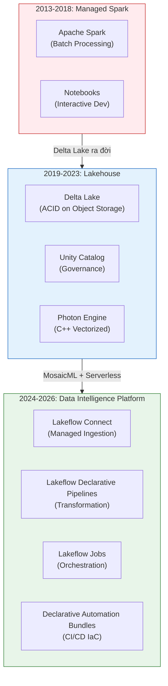

---

## 2. KIẾN TRÚC TỔNG THỂ

### Control Plane vs Data Plane

Databricks tách biệt hoàn toàn "Bộ não điều khiển" (Control Plane) và "Cánh tay lao động" (Data Plane). Đây là thiết kế nền tảng quyết định mọi thứ về Security, Networking, và Cost.

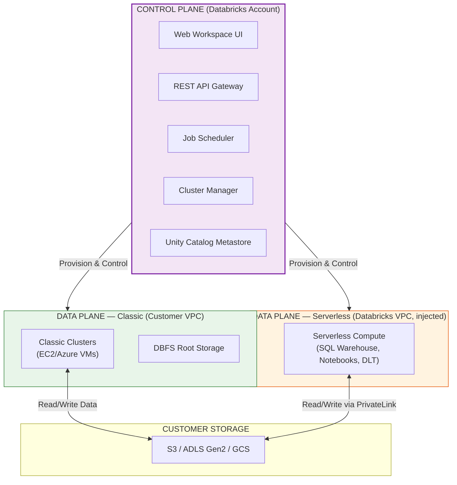

**Tham khảo:** https://docs.databricks.com/en/getting-started/overview.html

### Sự Khác Biệt Giữa Classic vs Serverless Data Plane

| Tiêu chí | Classic Data Plane | Serverless Data Plane |
|----------|-------------------|----------------------|
| **Compute chạy ở đâu?** | VPC/VNet của khách hàng | VPC của Databricks (VNet injected) |
| **Ai quản lý OS/Patching?** | Khách hàng | Databricks |
| **Startup time** | 3-5 phút (cấp phát EC2) | 2-5 giây (pre-warmed pool) |
| **Network Security** | Customer-managed SG/NSG | PrivateLink/VNet injection |
| **Spot Instance support** | ✅ Có | ❌ Không |
| **Cost model** | DBU + Cloud Infra riêng | DBU đã bao gồm Infra |

> 💡 **Gemini Feedback**
> **Góc nhìn Thực chiến (Senior to Junior)**
> Serverless Data Plane nghe rất sexy nhưng có 1 trade-off ít ai nói: Bạn MẤT quyền kiểm soát Network chi tiết. Classic Compute cho phép bạn cắm máy ảo vào Private Subnet, gắn Security Group tùy ý, rồi route traffic qua VPN Gateway về on-prem. Serverless thì Databricks quản lý hết — bạn chỉ cấu hình được PrivateLink endpoint. Với các công ty Ngân Hàng/Tài Chính yêu cầu audit traffic packet-level, Classic vẫn là lựa chọn bắt buộc.

---

## 3. COMPUTE LAYER

### Cluster Types (Phân Loại Chi Tiết 2026)

| Loại | Use Case | Boot Time | DBU Rate | Khi nào dùng |
|------|----------|-----------|----------|---------------|
| **All-Purpose Cluster** | Dev/Debug interactive | 3-5 min | ~$0.40/DBU | Code notebook, explore data |
| **Job Cluster** | Production batch | 3-5 min | ~$0.15/DBU | Scheduled ETL, ML training |
| **SQL Warehouse (Classic)** | BI queries | 2-5 min | ~$0.22/DBU | Bật lâu dài cho team Analyst |
| **SQL Warehouse (Pro)** | BI queries + Query Profile | 2-5 min | ~$0.55/DBU | Cần observability |
| **SQL Warehouse (Serverless)** | BI queries serverless | 2-5 sec | ~$0.70/DBU | Bursty workload, auto-suspend |
| **Serverless Compute** | Notebook/Workflow/DLT | 2-5 sec | ~$0.70/DBU | Zero-config production |

**Tham khảo:** https://docs.databricks.com/en/compute/index.html

### Databricks Runtime (DBR) Stack

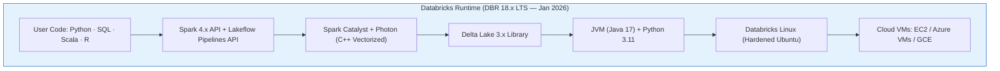

### Runtime Flavors

| Flavor | Bao gồm thêm | Khi nào chọn |
|--------|-------------|-------------|
| **Standard** | Spark + Delta + common libs | ETL thuần túy |
| **ML** | + PyTorch, TensorFlow, XGBoost, Hugging Face | Training model |
| **GPU** | + CUDA drivers, cuDF, RAPIDS | GPU-accelerated ETL/ML |
| **Photon** | Photon enabled by default | SQL-heavy workloads |

> 💡 **Gemini Feedback**
> **Góc nhìn Thực chiến (Senior to Junior)**
> Sai lầm phổ biến nhất của Junior: Bật All-Purpose Cluster 64 vCPU, 256GB RAM để đọc file CSV 50MB rồi quên tắt. Hóa đơn cuối tháng đội lên $2000 chỉ vì cluster chạy idle 20 ngày. **Quy tắc sống còn:** (1) Luôn set Auto-Terminate 30 phút cho All-Purpose. (2) Production PHẢI dùng Job Cluster — bật lên, chạy xong, tự hủy. (3) Nếu chỉ chạy SQL thì dùng Serverless SQL Warehouse — pay-per-second, tự suspend.

---

## 4. PHOTON ENGINE

### Bản Chất Kỹ Thuật
Photon là query execution engine viết bằng **C++ thuần**, thay thế phần Whole-Stage Code Generation (Java bytecode) của Spark SQL truyền thống. Nó áp dụng kỹ thuật:
- **Vectorized Execution:** Xử lý data theo batch (column vector ~1024 rows) thay vì row-by-row.
- **SIMD (Single Instruction, Multiple Data):** Tận dụng tập lệnh AVX2/AVX-512 của CPU hiện đại.
- **Cache-aware Memory Layout:** Đặt dữ liệu sát nhau trong bộ nhớ L1/L2 CPU cache.

### Kiến Trúc Photon vs Spark SQL

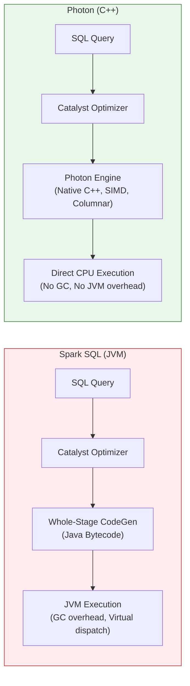

### Benchmark và Giới Hạn

| Tác vụ | Spark SQL (JVM) | Photon (C++) | Speedup |
|--------|----------------|-------------|---------|
| SQL Scan + Filter | 10s | 3s | ~3x |
| Hash Join (2 bảng lớn) | 25s | 5s | ~5x |
| GROUP BY Aggregate | 15s | 3s | ~5x |
| String Regex parsing | 8s | 2s | ~4x |
| **Python UDF** | 10s | **10s (KHÔNG cải thiện)** | 1x |

**Tham khảo:** https://www.databricks.com/product/photon

### Limitations Quan Trọng
- Photon **KHÔNG tăng tốc** Python UDF, Pandas UDF, hoặc bất kỳ logic Python tùy chỉnh nào. Nó chỉ tối ưu các lệnh SQL built-in và DataFrame API operations.
- Photon tiêu tốn DBU cao hơn (~1.5x-2x DBU multiplier). Nếu query đã nhanh sẵn (< 1 giây), bật Photon = phí tiền.

> 💡 **Gemini Feedback**
> **Góc nhìn Thực chiến (Senior to Junior)**
> Cứ 10 người đi phỏng vấn thì 9 người nói "Photon nhanh hơn Spark 8 lần". Sai. Photon nhanh hơn 2-8x **CHỈ VỚI** SQL thuần và DataFrame built-in operations. Nếu pipeline của em 70% là Python UDF (ví dụ gọi ML model predict row-by-row), Photon gần như vô dụng. Tiền DBU vẫn tính cao hơn mà tốc độ y chang. Hãy profile query trước khi bật Photon — dùng Spark UI xem phần nào tốn thời gian nhất.

---

## 5. DELTA LAKE 3.x ECOSYSTEM

Delta Lake là tầng Storage Format nền tảng. Mọi thứ trên Databricks đều xây trên Delta. Hiểu sâu Delta = hiểu sâu Databricks.

**Tham khảo chính:**
- Delta Lake Docs: https://docs.delta.io/latest/index.html
- Databricks Delta Guide: https://docs.databricks.com/en/delta/index.html

### 5a. Transaction Log Internals (`_delta_log/`)

Khi tạo 1 Delta Table, thư mục secret thần thánh xuất hiện:

```text
s3://lakehouse/sales/_delta_log/
├── 00000000000000000000.json   ← CREATE TABLE (schema, partitioning)
├── 00000000000000000001.json   ← INSERT: added files [part-00001.parquet, ...]
├── 00000000000000000002.json   ← DELETE: removed files [part-00001.parquet]
├── 00000000000000000003.json   ← UPDATE: add new + remove old parquet
├── ...
├── 00000000000000000010.checkpoint.parquet  ← Gộp 10 JSON → 1 Parquet cho read nhanh
└── _last_checkpoint                          ← Pointer tới checkpoint mới nhất
```

**Mỗi JSON commit chứa gì?**
- `add`: Danh sách file Parquet mới thêm vào (path, size, partition values, **min/max statistics per column**).
- `remove`: Danh sách file Parquet bị loại bỏ (soft delete — file vẫn còn trên S3 cho Time Travel).
- `metaData`: Schema changes, table properties.
- `commitInfo`: Ai commit, lúc nào, operation type.

**Data Skipping nhờ Min/Max Stats:**
Khi query `WHERE order_date = '2026-03-01'`, Delta Engine đọc Transaction Log, thấy file `part-00005.parquet` có `min(order_date)=2026-02-01, max(order_date)=2026-02-28` → **Skip ngay** file này, không cần mở ra đọc.

### 5b. Liquid Clustering (GA — DBR 15.2+)

Z-Ordering và `PARTITION BY` truyền thống đã bị **thay thế** bởi Liquid Clustering.

**Tham khảo:** https://docs.databricks.com/en/delta/clustering.html

**Vấn đề cũ:**
- `PARTITION BY (date)`: Cố định từ lúc tạo bảng, không đổi được. Chọn sai = sống chung with thảm họa.
- `OPTIMIZE ... ZORDER BY (col)`: Phải chạy thủ công, tốn thời gian đọc lại toàn bộ data, và chỉ tốt cho 1-2 cột.

**Giải pháp Liquid Clustering:**
```sql
-- Tạo bảng mới với Liquid Clustering
CREATE TABLE events (
  user_id STRING, event_time TIMESTAMP, action STRING, region STRING
) CLUSTER BY (user_id, event_time);

-- Thay đổi clustering key BẤT CỨ LÚC NÀO mà không rewrite data cũ
ALTER TABLE events CLUSTER BY (region, event_time);

-- Trigger clustering thủ công
OPTIMIZE events;
```

**Auto Liquid Clustering (DBR 15.4+ với Predictive Optimization):**
Bật `Predictive Optimization` trong Unity Catalog → Databricks tự động:
1. Theo dõi query patterns trên bảng.
2. Chọn clustering keys tối ưu.
3. Chạy OPTIMIZE tự động vào lúc ít traffic.

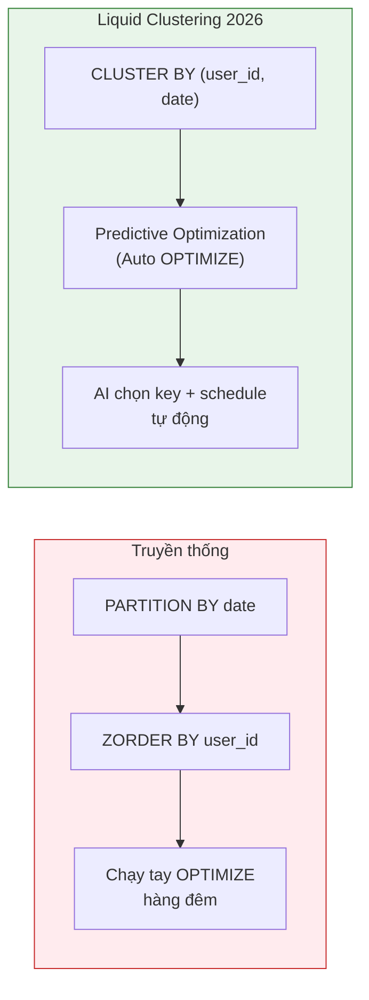

### 5c. Deletion Vectors (Row-Level Deletes Không Rewrite)

**Vấn đề cũ:** `DELETE FROM table WHERE id = 123` trên file Parquet 500MB → Spark phải đọc 500MB, bỏ 1 row, viết lại 499.9MB file mới. Chi phí Write Amplification kinh hoàng.

**Giải pháp Deletion Vectors:**
- Tạo 1 file bitmap nhỏ (`.dv` file) nằm cạnh file Parquet gốc.
- File bitmap đánh dấu: "Row số 42, 108, 999 trong file `part-00005.parquet` đã bị xóa".
- **File Parquet gốc KHÔNG bị đụng tới.** Lệnh DELETE phản hồi trong milliseconds.
- Khi chạy `OPTIMIZE`, các Deletion Vectors mới thực sự được merge vào file Parquet mới.

**Tham khảo:** https://docs.databricks.com/en/delta/deletion-vectors.html

### 5d. UniForm — Universal Format (Iceberg GA, Hudi Preview)

Chiến lược "Viết một lần, đọc mọi nơi" của Databricks.

**Tham khảo:** https://docs.databricks.com/en/delta/uniform.html

```sql
ALTER TABLE events SET TBLPROPERTIES (
  'delta.universalFormat.enabledFormats' = 'iceberg'
);
```

Khi bật UniForm, mỗi lần Delta commit xảy ra:
1. File Parquet gốc vẫn giữ nguyên (single copy of data).
2. Delta tự động sinh thêm Iceberg metadata (manifest files) — chỉ tốn vài KB.
3. Unity Catalog expose Iceberg REST Catalog API.
4. External engines (Snowflake, Athena, Starburst Trino) dùng native Iceberg driver đọc bảng Databricks hoàn toàn — **KHÔNG cần copy data**.

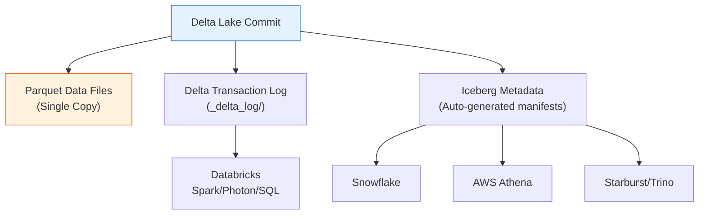

> 💡 **Gemini Feedback**
> **Góc nhìn Thực chiến (Senior to Junior)**
> UniForm là vũ khí chính trị cực kỳ quan trọng. Khi sếp hỏi "Tại sao chọn Databricks mà không chọn Iceberg thuần?", câu trả lời là: "Thưa anh, em dùng Delta bên trong Databricks cho performance tối ưu. Nhưng nhờ UniForm, bất kỳ tool nào đọc Iceberg đều đọc được data của mình — không lock-in". Đây là lý do Databricks dám open-source Unity Catalog lên Linux Foundation — họ tự tin rằng UniForm + Photon đủ giữ chân khách hàng mà không cần khóa cửa.

---

## 6. UNITY CATALOG

Unity Catalog (UC) là xương sống Governance của toàn bộ Databricks. Từ tháng 6/2024, Databricks đã open-source UC lên Linux Foundation (LF AI & Data) dưới license Apache 2.0.

**Tham khảo:**
- Docs: https://docs.databricks.com/en/data-governance/unity-catalog/index.html
- Open Source UC: https://www.unitycatalog.io/
- Blog: https://www.databricks.com/blog/open-sourcing-unity-catalog

### 6a. Three-Level Namespace & Volumes

Mọi object trong Databricks đều tuân theo quy tắc: `catalog.schema.object`

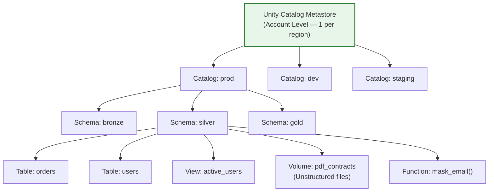

**Volumes (GA Feb 2024):** Trước đây UC chỉ quản lý Tables/Views. Giờ UC quản lý cả **file thô** (PDF, CSV, hình ảnh, model weights) qua khái niệm Volumes — tương tự S3 bucket nhưng **có governance, lineage, và access control**.

**Tham khảo:** https://docs.databricks.com/en/connect/unity-catalog/volumes.html

### 6b. Lakehouse Federation (GA 2025)

Không cần kéo hết data về Databricks. Federation cho phép **query trực tiếp** vào external databases mà vẫn giữ governance qua UC.

**Tham khảo:** https://docs.databricks.com/en/query-federation/index.html

```sql
-- 1. Tạo Connection tới PostgreSQL production
CREATE CONNECTION pg_prod TYPE POSTGRESQL
OPTIONS (
  host 'prod-db.company.com',
  port '5432',
  user secret('pg-scope', 'username'),
  password secret('pg-scope', 'password')
);

-- 2. Tạo Foreign Catalog
CREATE FOREIGN CATALOG pg_catalog USING CONNECTION pg_prod;

-- 3. Query trực tiếp — Photon tự pushdown filter xuống Postgres
SELECT u.name, o.total
FROM prod.gold.orders o
JOIN pg_catalog.public.users u ON o.user_id = u.id
WHERE u.region = 'APAC';
```

**External Sources hỗ trợ (2026):**

| Source | Status |
|--------|--------|
| PostgreSQL | GA |
| MySQL | GA |
| SQL Server | GA |
| Oracle | GA |
| Snowflake | GA |
| Google BigQuery | GA |
| Amazon Redshift | GA |
| Teradata | GA |

### 6c. Row/Column-Level Security & ABAC

**Row Filters (RLS):**
```sql
-- Team APAC chỉ thấy data của region mình
CREATE ROW FILTER apac_filter ON TABLE orders AS
  IF (IS_ACCOUNT_GROUP_MEMBER('admin')) THEN TRUE
  ELSE region = 'APAC';
```

**Column Masks (CLS):**
```sql
-- Mask email cho non-admin
CREATE COLUMN MASK email_mask ON TABLE users (email STRING) AS
  IF (IS_ACCOUNT_GROUP_MEMBER('pii_readers')) THEN email
  ELSE '***@***.com';
```

**Attribute-Based Access Control (ABAC) — GA 2025:**
Thay vì gán quyền per-table, ABAC cho phép gán quyền theo Tags. Dán tag `sensitivity: high` lên 500 bảng → tự động chỉ team `data_governance` mới truy cập được.

**Tham khảo:** https://docs.databricks.com/en/data-governance/unity-catalog/tags.html

> 💡 **Gemini Feedback**
> **Góc nhìn Thực chiến (Senior to Junior)**
> Unity Catalog là thứ tạo ra sự khác biệt cực lớn giữa "dùng Databricks nghiêm túc" và "dùng Databricks như Jupyter Notebook trên Cloud". Nếu không setup UC đúng cách từ đầu (1 Metastore per region, naming convention `prod.silver.*`), 6 tháng sau bạn sẽ có 200 bảng nằm vung vãi không ai biết schema, không ai biết ai tạo, không có lineage. Migration về sau sẽ cực kỳ đau đớn.

---

## 7. LAKEFLOW CONNECT (Data Ingestion — GA Apr 2025)

Trước đây, để kéo data từ Salesforce/PostgreSQL/S3 vào Lakehouse, bạn phải dùng tool ngoài (Fivetran, Airbyte, hoặc viết Python script). **Lakeflow Connect** là giải pháp ingestion native của Databricks.

**Tham khảo:**
- Docs: https://docs.databricks.com/en/lakeflow-connect/index.html
- Blog: https://www.databricks.com/blog/introducing-databricks-lakeflow

### Kiến Trúc

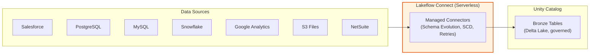

### Tính Năng Nổi Bật

| Feature | Mô tả |
|---------|-------|
| **Managed Connectors** | Out-of-the-box cho SaaS (Salesforce, Workday, ServiceNow, Meta Ads,...), Database (MySQL, PostgreSQL, Oracle, SQL Server,...), và Files |
| **Schema Evolution** | Tự động detect & apply schema changes từ source |
| **SCD Type 1 & 2** | Built-in Slowly Changing Dimension — không cần viết MERGE logic |
| **Serverless** | Chạy trên Serverless Compute — zero cluster management |
| **UC Governed** | Output tables tự động registered trong Unity Catalog với lineage |
| **Alerts & Retries** | Auto-retry on failure, notification channels |
| **Free Tier (2026)** | ~100M records/workspace/day miễn phí (FabCon 2026 announcement) |

### So Sánh Với Tools Bên Ngoài

| Tiêu chí | Lakeflow Connect | Fivetran | Airbyte |
|----------|-----------------|----------|---------|
| Managed | ✅ Fully | ✅ Fully | ⚠️ Self-hosted option |
| Native UC governance | ✅ | ❌ Need custom | ❌ Need custom |
| SCD Built-in | ✅ Type 1 & 2 | ✅ | ⚠️ Limited |
| Pricing | Included in DBU | Per MAR (Monthly Active Row) | Per connector / row |
| Connector Count (2026) | ~30+ | 600+ | 400+ |
| Chạy trên đâu | Databricks Serverless | Fivetran Cloud | Self-hosted / Cloud |

> 💡 **Gemini Feedback**
> **Góc nhìn Thực chiến (Senior to Junior)**
> Lakeflow Connect đẹp nhưng connector library CÒN ÍT so với Fivetran/Airbyte (30 vs 600+). Nếu source của công ty là SAP, Marketo, hoặc các ERP hiếm → chưa có connector. Chiến lược thực tế: Dùng Lakeflow Connect cho các source phổ biến (Postgres, MySQL, Salesforce), dùng Fivetran/Airbyte cho long-tail sources, rồi tất cả đổ chung vào UC Bronze layer.

---

## 8. LAKEFLOW DECLARATIVE PIPELINES (formerly Delta Live Tables — Renamed 2025)

DLT đã được đổi tên thành **Lakeflow Spark Declarative Pipelines (SDP)** tại Data + AI Summit 2025, align với Spark 4.1 open-source API. Code cũ vẫn chạy, nhưng API mới khuyến nghị import `pyspark.pipelines`.

**Tham khảo:**
- Docs: https://docs.databricks.com/en/lakeflow/declarative-pipelines/index.html
- Migration Guide: https://docs.databricks.com/en/lakeflow/declarative-pipelines/migrate-from-dlt.html

### Concept: Declarative vs Imperative ETL

```python
# ========== IMPERATIVE (Spark truyền thống) ==========
raw_df = spark.readStream.format("kafka").load()
clean_df = raw_df.filter("user_id IS NOT NULL")
clean_df.writeStream.format("delta").option("checkpointLocation", "...").start()
# → Phải tự quản checkpoint, error handling, retry, schema drift

# ========== DECLARATIVE (Lakeflow Pipelines 2026) ==========
import pyspark.pipelines as dp   # New API (Spark 4.1+)

@dp.table(comment="Raw events from Kafka")
def raw_events():
    return spark.readStream.format("kafka").load()

@dp.table
@dp.expect_or_drop("valid_user", "user_id IS NOT NULL")
def clean_events():
    return dp.read_stream("raw_events")
# → Engine tự quản checkpoint, retry, schema evolution, lineage
```

### Multi-Hop Architecture (Medallion)

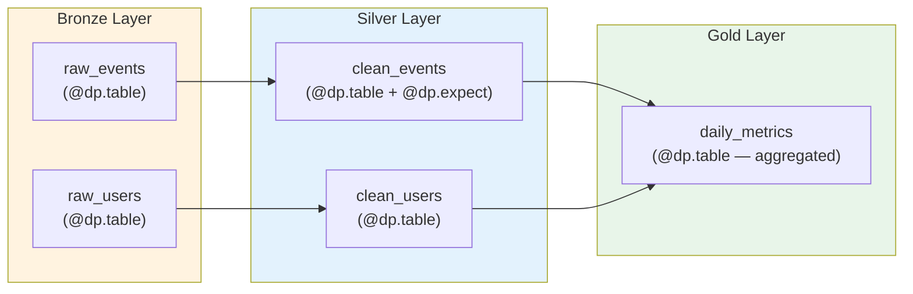

### APPLY CHANGES INTO (CDC / Upsert Pattern)

Đây là tính năng giải quyết bài toán CDC mà không cần viết logic MERGE thủ công:

```python
import pyspark.pipelines as dp
from pyspark.sql.functions import col, expr

dp.create_streaming_table("silver_orders")

dp.apply_changes(
    target = "silver_orders",
    source = "bronze_cdc_stream",
    keys = ["order_id"],
    sequence_by = col("event_timestamp"),     # Giải quyết out-of-order events
    apply_as_deletes = expr("op = 'DELETE'"),  # CDC delete operations
    except_column_list = ["_rescued_data", "op"],
    stored_as_scd_type = 2                    # SCD Type 2 tự động!
)
```

### Data Quality: Expectations

```python
@dp.table
@dp.expect("valid_amount", "amount > 0")                    # Warn nhưng vẫn giữ row
@dp.expect_or_drop("not_null_id", "order_id IS NOT NULL")   # Drop row vi phạm
@dp.expect_or_fail("valid_date", "order_date <= current_date()")  # FAIL pipeline nếu vi phạm
def gold_orders():
    return dp.read_stream("silver_orders").groupBy("date").agg(...)
```

> 💡 **Gemini Feedback**
> **Góc nhìn Thực chiến (Senior to Junior)**
> Lakeflow Declarative Pipelines là con dao hai lưỡi. Nó cực kỳ mạnh cho pipeline chuẩn hóa (Bronze → Silver → Gold, CDC Upsert). Nhưng khi pipeline yêu cầu logic phức tạp (gọi API bên ngoài, ML inference mid-pipeline, custom retry strategies), declarative model trở nên CỨNG NHẮC. Lúc đó bạn phải quay về imperative Spark code thuần + orchestrate bằng Lakeflow Jobs. Đừng ép mọi thứ vào DLT/Declarative Pipelines.

---

## 9. LAKEFLOW JOBS (Orchestration — GA 2025)

Lakeflow Jobs là orchestration engine native, thiết kế để thay thế Apache Airflow cho mọi workload nội sàn Databricks.

**Tham khảo:**
- Docs: https://docs.databricks.com/en/jobs/index.html
- Lakeflow Overview: https://www.databricks.com/product/lakeflow

### Kiến Trúc DAG

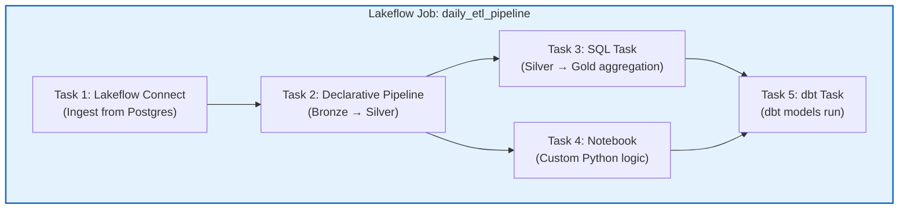

### Task Types Hỗ Trợ

| Task Type | Mô tả |
|-----------|-------|
| **Notebook** | Python/SQL/Scala/R notebook |
| **Python Script** | `.py` files từ Git repo |
| **SQL** | SQL queries hoặc SQL files |
| **Lakeflow Declarative Pipeline** | Trigger DLT/SDP pipeline |
| **dbt** | dbt project task |
| **JAR** | Spark JAR submit |
| **Lakeflow Connect** | Trigger ingestion pipeline |
| **If/Else** | Branching logic dựa trên task output |
| **For Each** | Loop qua parameter list (e.g. 50 regions) |

### Advanced Control Flow (2025-2026)

```python
# Pseudo-config cho Job với branching + looping
{
  "tasks": [
    {"task_key": "ingest", "pipeline_task": {"pipeline_id": "..."}},
    {"task_key": "check_count", "sql_task": {"query": "SELECT COUNT(*) FROM silver.events"},
     "depends_on": [{"task_key": "ingest"}]},
    {"task_key": "if_large", "condition_task": {
        "op": "GREATER_THAN", "left": "{{tasks.check_count.output}}", "right": "1000000"
     }, "depends_on": [{"task_key": "check_count"}]},
    {"task_key": "heavy_agg", "notebook_task": {"notebook_path": "/heavy_agg"},
     "depends_on": [{"task_key": "if_large", "outcome": "true"}]},
    {"task_key": "light_agg", "notebook_task": {"notebook_path": "/light_agg"},
     "depends_on": [{"task_key": "if_large", "outcome": "false"}]},
    {"task_key": "per_region", "for_each_task": {
        "inputs": ["US", "EU", "APAC"],
        "task": {"notebook_task": {"notebook_path": "/region_report"}}
     }, "depends_on": [{"task_key": "heavy_agg"}, {"task_key": "light_agg"}]}
  ]
}
```

### Continuous Jobs
Đảm bảo streaming pipeline sống vĩnh viễn. Nếu process chết, Lakeflow Jobs tự động restart ngay lập tức — không cần Kubernetes CronJob hay systemd.

### So Sánh Với Apache Airflow

| Tiêu chí | Lakeflow Jobs | Apache Airflow |
|----------|--------------|---------------|
| **Setup** | Zero-config (native) | Deploy Airflow cluster + DB |
| **Serverless** | ✅ | ❌ (cần infra quản lý) |
| **Branching/Looping** | ✅ (If/Else, For Each) | ✅ (BranchOperator, expand) |
| **External orchestration** | ❌ (chỉ Databricks tasks) | ✅ (bất kỳ hệ thống nào) |
| **Multi-platform** | ❌ (chỉ Databricks) | ✅ (K8s, Spark, GCP, AWS,...) |
| **DAG as Code** | JSON/YAML + UI | Python DAG files |
| **Community** | Databricks-only | Massive open-source community |

> 💡 **Gemini Feedback**
> **Góc nhìn Thực chiến (Senior to Junior)**
> Lakeflow Jobs là lựa chọn hoàn hảo nếu **toàn bộ pipeline** của bạn sống trong Databricks. Nhưng thực tế ở các công ty lớn, pipeline phải kết nối Databricks + Snowflake + dbt Cloud + Kubernetes ML serving + Slack alerts. Lúc đó Airflow vẫn là "nhạc trưởng tổng" (meta-orchestrator) gọi Databricks Job qua REST API. Đừng ép tất cả vào Lakeflow Jobs nếu hệ thống đa nền tảng.

---

## 10. DECLARATIVE AUTOMATION BUNDLES (formerly Databricks Asset Bundles — Renamed Mar 2026)

Đây là hệ thống **Infrastructure-as-Code (IaC)** native của Databricks, cho phép định nghĩa toàn bộ resources (Jobs, Pipelines, Clusters, Models) bằng YAML/Python, quản lý bằng Git, và deploy qua CI/CD.

**Tham khảo:**
- Docs: https://docs.databricks.com/en/dev-tools/bundles/index.html
- What's New Mar 2026: https://docs.databricks.com/en/release-notes/index.html

### Cấu Trúc Dự Án

```text
my_etl_project/
├── databricks.yml              ← Bundle config chính
├── resources/
│   ├── jobs/
│   │   └── daily_pipeline.yml  ← Job definition
│   └── pipelines/
│       └── bronze_silver.yml   ← Declarative Pipeline config
├── src/
│   ├── bronze/
│   │   └── ingest.py
│   ├── silver/
│   │   └── transform.py
│   └── gold/
│       └── aggregate.sql
├── tests/
│   └── test_transforms.py
└── .github/
    └── workflows/
        └── deploy.yml          ← GitHub Actions CI/CD
```

### databricks.yml (Core Config)

```yaml
bundle:
  name: daily_etl_project

workspace:
  host: https://adb-xxxx.azuredatabricks.net

targets:
  dev:
    mode: development
    default: true
    workspace:
      root_path: /Workspace/Users/${workspace.current_user.userName}/.bundle/${bundle.name}
  
  staging:
    workspace:
      root_path: /Workspace/Shared/.bundle/${bundle.name}/staging
  
  prod:
    mode: production
    workspace:
      root_path: /Workspace/Shared/.bundle/${bundle.name}/prod
    run_as:
      service_principal_name: "etl-service-principal"

resources:
  jobs:
    daily_pipeline:
      name: "[${bundle.target}] Daily ETL Pipeline"
      schedule:
        quartz_cron_expression: "0 0 6 * * ?"
        timezone_id: "Asia/Ho_Chi_Minh"
      tasks:
        - task_key: ingest
          notebook_task:
            notebook_path: src/bronze/ingest.py
          new_cluster:
            spark_version: "15.4.x-scala2.12"
            num_workers: 4
        - task_key: transform
          depends_on:
            - task_key: ingest
          pipeline_task:
            pipeline_id: ${resources.pipelines.bronze_silver.id}
```

### CLI Commands

```bash
# Validate config
databricks bundle validate --target prod

# Deploy resources to workspace
databricks bundle deploy --target staging

# Run specific job
databricks bundle run daily_pipeline --target staging

# Destroy all deployed resources
databricks bundle destroy --target dev
```

### New in 2026: Python Config Support

```python
# databricks.py — Define jobs dynamically bằng Python
from databricks.bundles import Bundle, Job, NotebookTask

regions = ["US", "EU", "APAC"]

bundle = Bundle(name="regional_etl")
for region in regions:
    bundle.add_job(Job(
        name=f"etl_{region.lower()}",
        tasks=[NotebookTask(
            notebook_path="src/regional_etl.py",
            parameters={"region": region}
        )]
    ))
```

### CI/CD với GitHub Actions

```yaml
# .github/workflows/deploy.yml
name: Deploy Databricks Bundle
on:
  push:
    branches: [main]

jobs:
  deploy:
    runs-on: ubuntu-latest
    steps:
      - uses: actions/checkout@v4
      - uses: databricks/setup-cli@v1
      - run: databricks bundle validate --target prod
      - run: databricks bundle deploy --target prod
    env:
      DATABRICKS_HOST: ${{ secrets.DATABRICKS_HOST }}
      DATABRICKS_CLIENT_ID: ${{ secrets.SP_CLIENT_ID }}
      DATABRICKS_CLIENT_SECRET: ${{ secrets.SP_CLIENT_SECRET }}
```

> 💡 **Gemini Feedback**
> **Góc nhìn Thực chiến (Senior to Junior)**
> Declarative Automation Bundles là thứ biến Data Engineer thành DevOps Engineer thực thụ. Trước đây: vào UI tạo Job bằng tay, copy cluster config, rồi quên mất config ở staging khác prod. Bây giờ: mọi thứ nằm trong Git, PR review, CI validate, CD deploy — giống hệt cách Software Engineer deploy microservice. Nếu công ty chưa dùng Bundles, bạn đang sống trong thế giới tiền sử. Bước đầu tiên: `databricks bundle init` rồi commit lên Git.

---

## 11. AUTO LOADER (cloudFiles) — Ingestion Trụ Cột

Auto Loader là cơ chế ingestion file-based mạnh nhất của Databricks. Nó tự động phát hiện file mới trên S3/ADLS/GCS và ingest incremental vào Delta Table.

**Tham khảo:** https://docs.databricks.com/en/ingestion/cloud-object-storage/auto-loader/index.html

### 2 Chế Độ Phát Hiện File

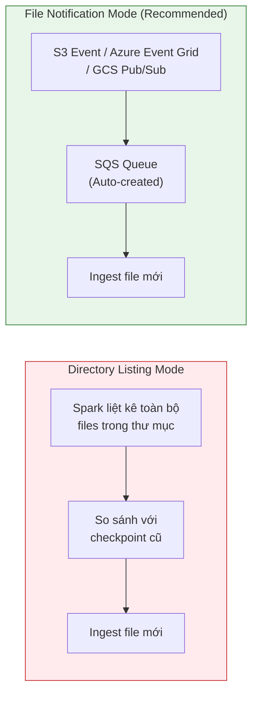

| Chế độ | Cơ chế | Ưu điểm | Nhược điểm |
|--------|--------|---------|-----------|
| **Directory Listing** | Spark list toàn bộ S3 path | Đơn giản, không cần Cloud config | Chậm khi > 1M files (list cost cao) |
| **File Notification** | Cloud Event → SQS/EventGrid → Spark | Nhanh, tiết kiệm API calls | Cần setup Cloud permissions |

### Code Auto Loader Chi Tiết

```python
# ============ BASIC AUTO LOADER ============
df = (spark.readStream
    .format("cloudFiles")
    .option("cloudFiles.format", "json")                    # or csv, parquet, avro
    .option("cloudFiles.schemaLocation", "s3://meta/schema/events")  # Track schema changes
    .option("cloudFiles.inferColumnTypes", "true")           # Infer types automatically
    .option("cloudFiles.useNotifications", "true")           # File Notification mode
    .load("s3://raw-bucket/events/")
)

# Write to Delta with checkpointing
(df.writeStream
    .format("delta")
    .option("checkpointLocation", "s3://meta/checkpoints/events")
    .option("mergeSchema", "true")                           # Auto merge new columns
    .trigger(availableNow=True)                              # Process all available, then stop
    .toTable("bronze.raw_events")
)
```

### Schema Evolution Tự Động

Auto Loader xử lý schema changes cực thông minh:
1. **Cột mới xuất hiện** (ví dụ source thêm field `phone_number`): Auto Loader tự phát hiện, cập nhật schema, merge vào Delta table.
2. **Cột bị mất**: Data cũ có, data mới không → cột đó NULL cho batch mới.
3. **Type conflict** (string vs int): Data bị rescue vào cột đặc biệt `_rescued_data` thay vì fail pipeline.

```python
# Rescued data pattern — không bao giờ mất data
(spark.readStream
    .format("cloudFiles")
    .option("cloudFiles.format", "json")
    .option("cloudFiles.schemaLocation", "s3://meta/schema/events")
    .option("rescuedDataColumn", "_rescued_data")   # ← Chìa khóa cứu data
    .load("s3://raw-bucket/events/")
)
```

### Auto Loader vs Lakeflow Connect vs COPY INTO

| Tiêu chí | Auto Loader | Lakeflow Connect | COPY INTO |
|----------|-------------|-----------------|-----------|
| **Source** | Files (S3/ADLS/GCS) | SaaS + DB + Files | Files (S3/ADLS/GCS) |
| **Incremental** | ✅ Checkpoint-based | ✅ Managed | ❌ Idempotent but re-lists |
| **Streaming** | ✅ Structured Streaming | ❌ Batch | ❌ Batch |
| **Schema Evolution** | ✅ Automatic | ✅ Automatic | ❌ Manual |
| **Scale** | Tỷ files / giờ | Triệu records / phút | Vài triệu files |
| **Setup** | Code (Python/SQL) | UI / API | SQL command |

> 💡 **Gemini Feedback**
> **Góc nhìn Thực chiến (Senior to Junior)**
> Auto Loader là lựa chọn mặc định cho mọi file-based ingestion. Đừng dùng `COPY INTO` trừ khi pipeline cực đơn giản (chạy 1 lần). Và đừng dùng `spark.read.format("json").load()` kiểu batch rồi schedule bằng cron — đó là cách làm của năm 2018. Auto Loader + `trigger(availableNow=True)` cho phép vừa incremental vừa batch-like mà vẫn giữ checkpoint state. Đây là pattern chuẩn nhất cho Bronze layer.

---

## 12. STRUCTURED STREAMING TRÊN DATABRICKS

Databricks enhances Apache Spark Structured Streaming với nhiều tính năng độc quyền không có trong OSS Spark.

**Tham khảo:** https://docs.databricks.com/en/structured-streaming/index.html

### Trigger Modes

| Trigger | Behavior | Use Case |
|---------|----------|----------|
| `processingTime="10 seconds"` | Chạy micro-batch mỗi 10s | Near-real-time dashboards |
| `availableNow=True` | Process hết data sẵn có rồi tự stop | Scheduled batch-like streaming |
| `continuous` (Experimental) | True continuous, ~1ms latency | Ultra-low latency (hiếm dùng) |
| Default (no trigger) | Chạy batch tiếp batch liên tục | Always-on pipeline |

### Watermark & Late Data

```python
# Xử lý data muộn tới 2 giờ
events_df = (spark.readStream
    .format("delta")
    .table("bronze.events")
    .withWatermark("event_time", "2 hours")   # Chờ data muộn tối đa 2h
    .groupBy(window("event_time", "10 minutes"), "region")
    .agg(count("*").alias("event_count"))
)
```

### Stream-Stream Join

```python
# Join 2 luồng streaming real-time
clicks = spark.readStream.table("bronze.clicks") \
    .withWatermark("click_time", "1 hour")

impressions = spark.readStream.table("bronze.impressions") \
    .withWatermark("impression_time", "2 hours")

# Join 2 streams với time range condition
matched = clicks.join(impressions,
    expr("""
        clicks.ad_id = impressions.ad_id AND
        click_time >= impression_time AND
        click_time <= impression_time + interval 1 hour
    """),
    "leftOuter"
)
```

### Stateful Processing: mapGroupsWithState / flatMapGroupsWithState

```python
# Custom stateful logic — ví dụ sessionization
from pyspark.sql.streaming import GroupState, GroupStateTimeout

def update_session(key, events, state: GroupState):
    """Track user session: timeout sau 30 phút không hoạt động"""
    if state.hasTimedOut:
        old_session = state.get
        state.remove()
        yield (key, old_session, "CLOSED")
    else:
        current = state.getOption or {"start": None, "count": 0}
        for event in events:
            if current["start"] is None:
                current["start"] = event.event_time
            current["count"] += 1
            current["last"] = event.event_time
        state.update(current)
        state.setTimeoutDuration("30 minutes")
        yield (key, current, "ACTIVE")
```

### Databricks-Specific Enhancements (vs OSS Spark)

| Feature | OSS Spark | Databricks |
|---------|-----------|-----------|
| Rate limiting (`maxFilesPerTrigger`) | ✅ | ✅ (Enhanced) |
| Auto Loader (cloudFiles) | ❌ | ✅ |
| Trigger.AvailableNow | ✅ (Spark 3.3+) | ✅ |
| RocksDB state store | ✅ (Manual config) | ✅ (Default, optimized) |
| Async checkpointing | ❌ | ✅ |
| Photon streaming | ❌ | ✅ (Partial) |
| Multiple event hubs / Kafka sources | ✅ | ✅ (Simplified) |

> 💡 **Gemini Feedback**
> **Góc nhìn Thực chiến (Senior to Junior)**
> Streaming trên Databricks hay gặp 2 bẫy: (1) Micro-batch interval quá nhỏ (1 giây) → sinh ra hàng chục ngàn small files/ngày → bảng Delta chậm dần. Fix: Dùng `trigger(processingTime="30 seconds")` hoặc `trigger(availableNow=True)`. (2) State store phình to (GB) khi dùng `mapGroupsWithState` với triệu keys → OOM. Fix: Set timeout để GC state cũ, dùng RocksDB state store (mặc định Databricks đã optimize).

---

## 13. CHANGE DATA FEED (CDF) — Delta Lake Native CDC

Change Data Feed là tính năng của Delta Lake cho phép **đọc ra những thay đổi** (INSERT, UPDATE, DELETE) diễn ra trên bảng Delta, thay vì đọc lại toàn bộ snapshot.

**Tham khảo:** https://docs.databricks.com/en/delta/delta-change-data-feed.html

### Bật CDF

```sql
-- Bật trên bảng mới
CREATE TABLE silver.orders (
    order_id STRING, amount DOUBLE, status STRING, updated_at TIMESTAMP
) TBLPROPERTIES ('delta.enableChangeDataFeed' = true);

-- Bật trên bảng đã có
ALTER TABLE silver.orders SET TBLPROPERTIES ('delta.enableChangeDataFeed' = true);
```

### Đọc Changes

```python
# Đọc changes kể từ version 5
changes = spark.read.format("delta") \
    .option("readChangeFeed", "true") \
    .option("startingVersion", 5) \
    .table("silver.orders")

# Hoặc theo timestamp
changes = spark.read.format("delta") \
    .option("readChangeFeed", "true") \
    .option("startingTimestamp", "2026-03-20T00:00:00") \
    .table("silver.orders")

# Streaming changes (real-time propagation)
stream_changes = spark.readStream.format("delta") \
    .option("readChangeFeed", "true") \
    .option("startingVersion", 0) \
    .table("silver.orders")
```

### Output Schema CDF

| Cột | Ý nghĩa |
|-----|---------|
| `_change_type` | `insert`, `update_preimage`, `update_postimage`, `delete` |
| `_commit_version` | Delta version number |
| `_commit_timestamp` | Thời điểm commit |
| + tất cả cột gốc của bảng | Data thực tế |

### CDF vs Debezium CDC

| Tiêu chí | CDF (Delta Native) | Debezium |
|----------|-------------------|----------|
| **Source** | Delta Table changes | Database binlog/WAL |
| **Scope** | Trong Lakehouse (table-to-table) | External DB → Kafka → Lakehouse |
| **Latency** | Micro-batch (seconds-minutes) | Near-real-time (ms) |
| **Setup** | 1 dòng TBLPROPERTIES | Kafka Connect cluster + config |
| **Schema** | Delta schema + change metadata | Debezium envelope schema |

> 💡 **Gemini Feedback**
> **Góc nhìn Thực chiến (Senior to Junior)**
> CDF là vũ khí bí mật cho kiến trúc Medallion. Thay vì Silver layer đọc LẠI TOÀN BỘ Bronze mỗi lần chạy (full refresh), Silver chỉ đọc **changes** từ Bronze qua CDF. Pipeline 1TB Bronze chạy 2 tiếng giờ chỉ còn 5 phút vì nó chỉ xử lý delta (thay đổi). Đây là pattern chuẩn cho incremental Silver/Gold layers.

---

## 14. PREDICTIVE OPTIMIZATION — AI Tự Động Bảo Trì Bảng

Predictive Optimization là tính năng AI-driven tự động chạy `OPTIMIZE` và `VACUUM` cho Delta tables mà không cần con người can thiệp.

**Tham khảo:** https://docs.databricks.com/en/delta/predictive-optimization.html

### Cách Hoạt Động

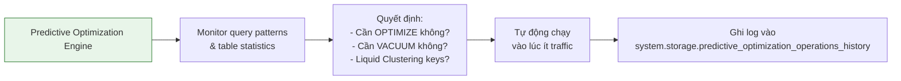

### Enable

```sql
-- Enable cho toàn bộ schema
ALTER SCHEMA prod.silver SET TBLPROPERTIES (
    'delta.enablePredictiveOptimization' = 'true'
);
```

Kể từ **Nov 2024**, Predictive Optimization được **bật mặc định** cho tất cả account mới.

### Tính Năng

| Feature | Auto? | Mô tả |
|---------|-------|-------|
| Auto OPTIMIZE | ✅ | Compact small files tự động |
| Auto VACUUM | ✅ | Dọn file Parquet rác tự động |
| Auto Liquid Clustering | ✅ | Chọn clustering keys dựa trên query patterns |
| Scheduling | ✅ | Chạy vào lúc ít traffic (off-peak) |
| Cost visibility | ✅ | System Tables tracking mọi operation |

### Monitor Qua System Tables

```sql
-- Xem những optimization nào đã chạy tuần qua
SELECT
    table_name,
    operation_type,        -- OPTIMIZE, VACUUM, CLUSTERING
    operation_status,      -- SUCCESSFUL, FAILED, SKIPPED
    usage_quantity,        -- DBUs consumed
    start_time, end_time
FROM system.storage.predictive_optimization_operations_history
WHERE start_time >= current_date() - INTERVAL 7 DAYS
ORDER BY start_time DESC;
```

---

## 15. DELTA SHARING — Open Protocol Chia Sẻ Data

Delta Sharing là giao thức mở (open protocol) cho phép chia sẻ data trực tiếp từ Delta Lake tới bất kỳ platform nào mà **KHÔNG cần copy data**.

**Tham khảo:**
- Docs: https://docs.databricks.com/en/delta-sharing/index.html
- Open Protocol: https://delta.io/sharing/
- VLDB Paper (2025): https://www.vldb.org/pvldb/

### 2 Chế Độ Chia Sẻ

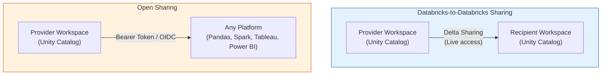

### Setup Delta Sharing

```sql
-- 1. Tạo Share
CREATE SHARE customer_data_share;

-- 2. Thêm bảng vào Share
ALTER SHARE customer_data_share ADD TABLE prod.gold.customer_segments;
ALTER SHARE customer_data_share ADD TABLE prod.gold.monthly_revenue;

-- 3. Tạo Recipient
CREATE RECIPIENT acme_corp;

-- 4. Grant access
GRANT SELECT ON SHARE customer_data_share TO RECIPIENT acme_corp;
```

### Recipient đọc data (bên ngoài Databricks)

```python
# Python — bất kỳ đâu, không cần Databricks
import delta_sharing

# Dùng profile file do Provider cung cấp
profile = "path/to/share_profile.json"
shares = delta_sharing.list_shares(profile)

# Đọc data trực tiếp bằng Pandas
df = delta_sharing.load_as_pandas(f"{profile}#customer_data_share.gold.customer_segments")
print(df.head())
```

### Stats (2026)
- **4,000+ doanh nghiệp** sử dụng Delta Sharing (Source: VLDB 2025 paper).
- Hỗ trợ chia sẻ: Tables, Views, Volumes (unstructured files), AI Models, Notebooks.

> 💡 **Gemini Feedback**
> **Góc nhìn Thực chiến (Senior to Junior)**
> Delta Sharing giải quyết bài toán kinh điển: "Đối tác cần data của mình nhưng mình không muốn copy dữ liệu sang hệ thống của họ". Trước đây phải export CSV/Parquet vào S3, set presigned URL, rồi cầu nguyện đối tác đừng share URL ra ngoài. Giờ: tạo Share, gán recipient, họ đọc LiveData qua token. Revoke token = cắt truy cập ngay lập tức.

---

## 16. DATABRICKS MARKETPLACE & CLEAN ROOMS

### Marketplace
Nền tảng trao đổi data products, analytics assets, và AI models.

**Tham khảo:** https://docs.databricks.com/en/marketplace/index.html

| Feature | Mô tả |
|---------|-------|
| **Data Products** | Mua/bán datasets (weather, financial, demographics) |
| **Open Exchange** | Powered by Delta Sharing — no data copy |
| **Provider Tools** | Wizard tạo listing, analytics on usage |
| **Consumer Access** | 1-click install data vào Unity Catalog |

### Clean Rooms (Privacy-Centric Collaboration)

Cho phép 2+ tổ chức phân tích data chung mà **KHÔNG ai thấy raw data của nhau**.

**Tham khảo:** https://docs.databricks.com/en/clean-rooms/index.html

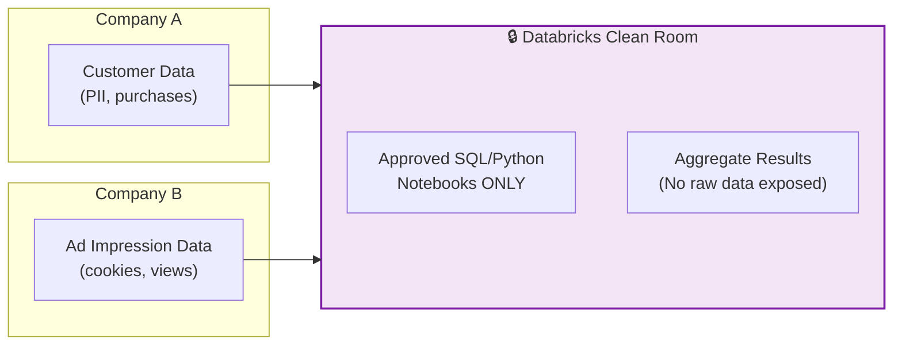

**Use Cases:**
- **AdTech:** Brand A muốn đo conversion rate với publisher B mà không share customer list.
- **Healthcare:** 2 bệnh viện phân tích chung dịch tễ mà không tiết lộ bệnh nhân.
- **Finance:** Bank A + Fintech B phân tích risk chung.

**Status (2026):** GA trên AWS, Azure, GCP (GCP GA Jul 2025).

---

## 17. CLUSTER POLICIES & INSTANCE POOLS — Quản Lý Tài Nguyên

### Cluster Policies

Cluster Policies cho phép Admin **kiểm soát** loại cluster mà Developer/DS được tạo. Đây là vũ khí FinOps số 1.

**Tham khảo:** https://docs.databricks.com/en/admin/clusters/policies.html

```json
{
  "name": "DE Team - Cost Controlled",
  "definition": {
    "spark_version": { "type": "fixed", "value": "15.4.x-scala2.12" },
    "num_workers": { "type": "range", "minValue": 1, "maxValue": 8 },
    "node_type_id": { "type": "allowlist", "values": ["m5.xlarge", "m5.2xlarge"] },
    "autotermination_minutes": { "type": "fixed", "value": 30 },
    "custom_tags.team": { "type": "fixed", "value": "data_engineering" },
    "spark_conf.spark.databricks.photon.enabled": { "type": "fixed", "value": "false" }
  }
}
```

**Hiệu quả:** Team DE chỉ được tạo cluster tối đa 8 workers, chỉ dùng m5 instances, auto-terminate 30 phút, không bật Photon (tránh DBU cao). Admin ngủ ngon vì không có thằng nào bật cluster 64 node chạy cả đêm.

### Instance Pools

Pre-allocate idle instances để giảm startup time từ 5 phút xuống 30 giây.

```text
Instance Pool "DE-Workers"
├── Min Idle: 2 instances (luôn sẵn sàng)
├── Max Capacity: 20 instances
├── Instance Type: m5.2xlarge
├── Idle Timeout: 10 minutes
└── Preloaded DBR: 15.4 LTS
```

**Trade-off:** Bạn trả tiền EC2 cho instances idle — nhưng cluster boot time giảm từ 5 phút xuống 30 giây. Với production pipelines chạy mỗi 15 phút, tiết kiệm 4.5 phút mỗi lần = cực kỳ đáng.

---

## 18. NETWORK SECURITY — Private Connectivity & Compliance

### Mô Hình Bảo Mật Mạng

```mermaid
graph TB
    subgraph Internet["Public Internet"]
        User["User Browser"]
    end
    
    subgraph CP["Control Plane"]
        WebApp["Databricks Web App"]
    end
    
    subgraph DP["Data Plane (Customer VPC)"]
        subgraph Private["Private Subnets"]
            Cluster["Compute Clusters"]
        end
        NAT["NAT Gateway<br/>(Outbound only)"]
        PLE["PrivateLink Endpoint<br/>(to Control Plane)"]
    end
    
    subgraph Storage["Customer Storage"]
        S3["S3 / ADLS"]
        VPCEndpoint["VPC Endpoint<br/>(Gateway)"]
    end
    
    User -->|HTTPS| CP
    CP -->|PrivateLink| PLE
    PLE --> Cluster
    Cluster -->|VPC Endpoint<br/>(no public internet)| S3
    Cluster --> NAT
    
    style DP fill:#e8f5e9,stroke:#2e7d32,stroke-width:2px
```

### Security Features

| Feature | Mô tả | Use Case |
|---------|-------|----------|
| **PrivateLink (AWS/Azure)** | Control Plane ↔ Data Plane qua private network | Regulated industries |
| **VPC Endpoints** | Data Plane → S3/ADLS không qua internet | Data sovereignty |
| **IP Access Lists** | Restrict workspace access by IP range | Corporate network |
| **Customer-Managed Keys (CMK)** | Encrypt data với key của bạn | Compliance (SOC2, HIPAA) |
| **SCIM Provisioning** | Sync users/groups từ Azure AD / Okta | Enterprise SSO |
| **Audit Logs** | Mọi action ghi vào `system.access.audit` | Forensics |

**Tham khảo:** https://docs.databricks.com/en/security/index.html

### Compliance Certifications (2026)

| Standard | Status |
|----------|--------|
| SOC 2 Type II | ✅ |
| ISO 27001 | ✅ |
| HIPAA | ✅ |
| GDPR | ✅ |
| FedRAMP (Moderate) | ✅ (GovCloud) |
| PCI-DSS | ✅ |

---

## 19. DATABRICKS CLI & SDK — Developer Tooling

### Databricks CLI (v0.200+)

**Tham khảo:** https://docs.databricks.com/en/dev-tools/cli/index.html

```bash
# Install
pip install databricks-cli

# Authenticate
databricks configure --token

# Common commands
databricks workspace list /Users/me/
databricks fs ls dbfs:/mnt/data/
databricks jobs list --output JSON
databricks clusters list
databricks bundle deploy --target prod

# SQL execution từ terminal
databricks api post /api/2.0/sql/statements \
    --json '{"warehouse_id":"xxx","statement":"SELECT COUNT(*) FROM gold.orders"}'
```

### Databricks SDK for Python

```python
from databricks.sdk import WorkspaceClient

w = WorkspaceClient()

# List all clusters
for c in w.clusters.list():
    print(f"{c.cluster_name}: {c.state}")

# Create and run a job
from databricks.sdk.service.jobs import NotebookTask, Task

j = w.jobs.create(
    name="my_etl_job",
    tasks=[Task(
        task_key="step1",
        notebook_task=NotebookTask(notebook_path="/etl/transform")
    )]
)
w.jobs.run_now(j.job_id)
```

### Git Integration (Repos / Git Folders)

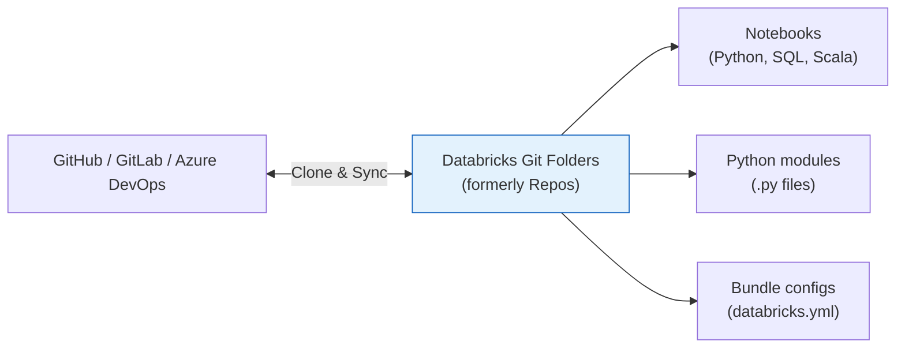

**Key Features:**
- Clone Git repos trực tiếp vào Workspace.
- Edit files, commit, push, pull — từ Databricks UI.
- Branch-based development, PR workflows.
- Combine với Automation Bundles để CI/CD.

**Tham khảo:** https://docs.databricks.com/en/repos/index.html

> 💡 **Gemini Feedback**
> **Góc nhìn Thực chiến (Senior to Junior)**
> Databricks CLI + SDK là thứ phân biệt giữa "Script Kiddie" và "Platform Engineer". Nếu em vẫn đang tạo Job bằng cách click UI → em đang làm thủ công. Hãy viết script Python dùng SDK để tạo clusters, deploy jobs, set permissions — auto-hóa mọi thứ. Kết hợp với Automation Bundles + GitHub Actions = pipeline CI/CD production-grade.

---

## 20. DATABRICKS SQL & BI

Databricks SQL (DBSQL) biến Lakehouse thành Data Warehouse thuần túy cho BI Analysts. Không Notebook, không Spark code — chỉ SQL thuần và JDBC/ODBC connectors.

**Tham khảo:** https://docs.databricks.com/en/sql/index.html

### SQL Warehouse Types

| Type | DBU Rate | Tính năng | Use Case |
|------|----------|-----------|----------|
| Classic | ~$0.22 | Photon, auto-scale | Budget-friendly BI |
| Pro | ~$0.55 | + Query Profile, Audit, Serverless support | Enterprise BI |
| Serverless | ~$0.70 | + Instant start (2-5s), zero-config | Bursty workloads |

### Caching Architecture

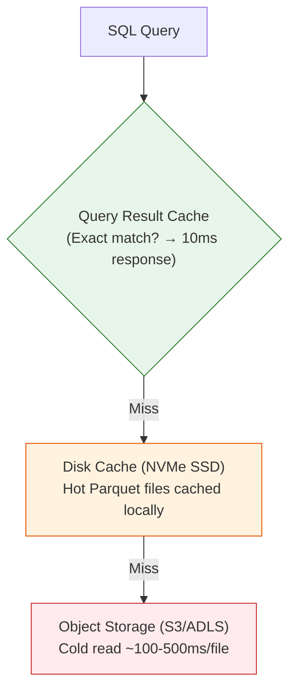

- **Query Result Cache:** Câu query giống hệt nhau (cùng SQL text + cùng data version) → trả kết quả cũ trong **10ms**. Tự invalidate khi data thay đổi (Delta version bump).
- **Disk Cache:** File Parquet hot được pull từ S3 về NVMe SSD local. Bandwidth: S3 ~1GB/s vs NVMe ~30-50GB/s. Cache persist giữa các queries, chỉ bị evict khi NVMe đầy.
- **Delta Cache:** Databricks-specific cache layer trên default nodes. Tự detect hot files từ access patterns.

### Lakeview Dashboards (formerly SQL Dashboards)

Databricks đã rebrand SQL Dashboards thành **Lakeview Dashboards** — hệ thống BI visualization native.

**Tham khảo:** https://docs.databricks.com/en/dashboards/index.html

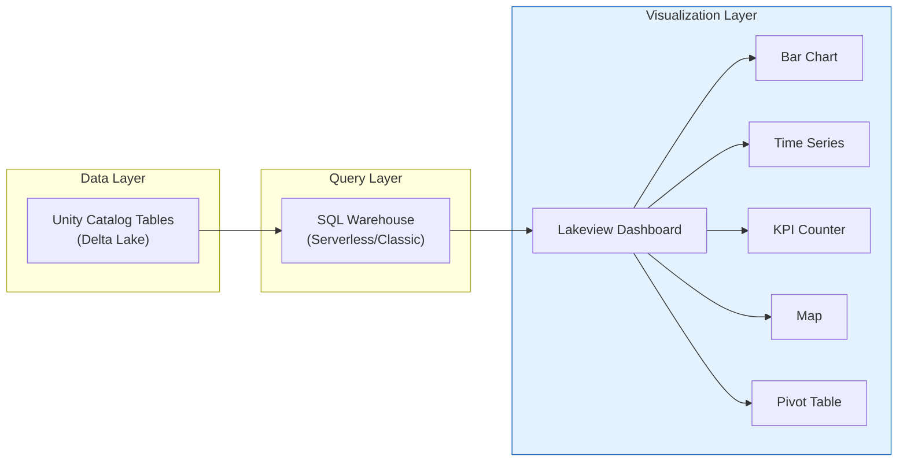

**Tính năng chính:**
- **Draft & Publish workflow:** Edit draft → Preview → Publish cho team xem.
- **Filters liên kết:** 1 dropdown filter xuyên suốt tất cả charts trong dashboard.
- **Schedule Refresh:** Tự chạy lại queries theo lịch (hourly/daily).
- **Embed:** Embed dashboard vào website/portal bằng iframe.
- **PDF Export:** Export dashboard thành PDF cho báo cáo.

### SQL Alerts — Tự Động Cảnh Báo

```sql
-- Tạo Alert: thông báo khi daily revenue drop > 20%
-- Step 1: Tạo query
SELECT
    today.event_date,
    today.revenue AS today_revenue,
    yesterday.revenue AS yesterday_revenue,
    ROUND((today.revenue - yesterday.revenue) / yesterday.revenue * 100, 2) AS pct_change
FROM gold.daily_revenue today
JOIN gold.daily_revenue yesterday
    ON today.event_date = yesterday.event_date + INTERVAL 1 DAY
WHERE today.event_date = current_date()
    AND (today.revenue - yesterday.revenue) / yesterday.revenue < -0.20;

-- Step 2: Trong UI, tạo Alert trên query này
-- Condition: "Number of rows > 0"
-- Notification: Slack channel #data-alerts
-- Schedule: Chạy mỗi giờ
```

### Query Profile (Pro/Serverless)

Query Profile là tool deep-dive vào execution plan — analog với Spark UI nhưng thiết kế cho SQL Analysts.

**Thông tin cung cấp:**
- **Execution DAG:** Visualize từng operator (Scan, Filter, Join, Agg).
- **Runtime per Operator:** Mỗi node hiện time spent, rows processed, bytes read.
- **Photon vs Spark:** Highlight phần nào chạy Photon (xanh), phần nào fallback JVM (cam).
- **Data Skipping Stats:** Bao nhiêu files đã skip nhờ Liquid Clustering/min-max stats.
- **Spill to Disk:** Phát hiện operator nào bị spill RAM → disk (chậm).

### Materialized Views trong DBSQL

```sql
-- Tạo Materialized View — Databricks tự refresh khi data thay đổi
CREATE MATERIALIZED VIEW gold_daily_summary AS
SELECT
    event_date,
    region,
    COUNT(*) AS total_events,
    SUM(amount) AS total_revenue,
    COUNT(DISTINCT user_id) AS unique_users
FROM silver.events
GROUP BY event_date, region;

-- Databricks tự detect khi silver.events có data mới
-- và refresh Materialized View incrementally
-- → Query dashboard siêu nhanh vì đọc pre-computed results
```

### AI Functions trong SQL

```sql
-- Gọi AI trực tiếp trong SQL query! (GA 2025)
SELECT
    review_text,
    ai_classify(review_text, ARRAY('positive', 'negative', 'neutral')) AS sentiment,
    ai_summarize(review_text, 50) AS summary,
    ai_extract(review_text, 'product_name') AS product
FROM bronze.product_reviews
LIMIT 100;

-- ai_classify, ai_summarize, ai_extract dùng Foundation Model APIs
-- Chạy trên Serverless SQL Warehouse, UC-governed
```

**Tham khảo:** https://docs.databricks.com/en/large-language-models/ai-functions.html

### BI Tool Integration

| Tool | Connection | Native Support | Deep Integration |
|------|-----------|---------------|-----------------|
| Tableau | ODBC/JDBC + Partner Connect | ✅ Certified | Live connection, extract |
| Power BI | DirectQuery / Import | ✅ Certified | DirectLake (preview) |
| Looker | JDBC | ✅ Certified | LookML generation |
| Metabase | JDBC | ✅ Community | Basic connector |
| dbt Cloud | dbt-databricks adapter | ✅ Certified | SQL Warehouse + UC |
| Hex | Native integration | ✅ Certified | Notebook-like SQL + Python |
| Sigma | Live connection | ✅ Certified | Direct to SQL Warehouse |

**Tham khảo:** https://docs.databricks.com/en/partners/bi/index.html

### So Sánh DBSQL vs Snowflake vs BigQuery

| Tiêu chí | Databricks SQL | Snowflake | BigQuery |
|----------|---------------|-----------|----------|
| **Engine** | Photon (C++ vectorized) | Snowpark (JVM-based) | Dremel (columnar) |
| **Storage** | Delta Lake (customer-owned) | FDN (Snowflake-managed) | Capacitor (Google-managed) |
| **Serverless** | ✅ SQL Warehouse | ✅ Native | ✅ Native |
| **Boot time** | 2-5s (Serverless) | 0s (Warehouse resume) | 0s (on-demand) |
| **Pricing** | DBU-based | Credit-based | On-demand / Slot-based |
| **Data Format** | Open (Parquet+Delta) | Proprietary | Proprietary |
| **External Access** | UniForm (Iceberg) | Iceberg Tables | BigLake (Preview) |
| **Native Streaming** | ✅ Structured Streaming | ❌ Snowpipe (batch) | ❌ Batch insert |
| **AI Functions** | ✅ ai_classify, ai_summarize | ✅ Cortex | ✅ ML.PREDICT |
| **Open Source** | ✅ Delta Lake, UC, Spark | ❌ | ❌ |

> 💡 **Gemini Feedback**
> **Góc nhìn Thực chiến (Senior to Junior)**
> Nếu pipeline của em 100% SQL và không cần streaming real-time, Snowflake vẫn đơn giản hơn (zero-config, instant scale). Nhưng nếu em cần: (1) Streaming + Batch cùng engine, (2) Python ML trong cùng platform, (3) Sở hữu data format (open Parquet), (4) CI/CD kiểu DevOps → Databricks SQL + Lakeflow ecosystem mạnh hơn nhiều bậc. DBSQL không chỉ là "chạy SQL" — nó là cửa sổ BI trên toàn bộ Lakehouse.

---

## 21. PRICING & FINOPS

### DBU Pricing Matrix (2026 Estimates)

| Workload Type | DBU Rate ($/DBU) | Ghi chú |
|--------------|------------------|---------|
| Jobs Compute | ~$0.15 | Production ETL — RẺ NHẤT |
| All-Purpose Compute | ~$0.40 | Dev/Debug — ĐẮT |
| SQL Classic | ~$0.22 | BI basic |
| SQL Pro | ~$0.55 | BI + observability |
| SQL Serverless | ~$0.70 | Bao gồm infra cost |
| Serverless Compute (Notebook/DLT) | ~$0.70 | Bao gồm infra cost |
| Lakeflow Connect | Included / Free Tier | ~100M rows/day free |

*Cộng thêm: Cloud infrastructure cost (EC2, ADLS, GCS) nếu dùng Classic Compute.*

**Tham khảo:** https://www.databricks.com/product/pricing

### System Tables: FinOps Bằng SQL

UC cung cấp System Tables cho phép query trực tiếp usage & billing:

```sql
-- Top 10 thằng đốt tiền nhất tuần qua
SELECT
    identity_metadata.run_as AS user,
    sku_name,
    SUM(usage_quantity) AS total_dbus,
    ROUND(SUM(usage_quantity * pricing.default), 2) AS estimated_cost_usd
FROM system.billing.usage
WHERE usage_date >= current_date() - INTERVAL 7 DAYS
GROUP BY 1, 2
ORDER BY estimated_cost_usd DESC
LIMIT 10;
```

```sql
-- Zombie clusters: Cluster chạy > 8 tiếng mà không có job nào
SELECT
    cluster_id, cluster_name, driver_node_type,
    TIMESTAMPDIFF(HOUR, start_time, COALESCE(end_time, current_timestamp())) AS hours_running
FROM system.compute.clusters
WHERE state = 'RUNNING'
  AND TIMESTAMPDIFF(HOUR, start_time, current_timestamp()) > 8
ORDER BY hours_running DESC;
```

**System Tables có sẵn (2026):**

| Table | Nội dung |
|-------|---------|
| `system.billing.usage` | Chi tiết DBU usage per user, per SKU |
| `system.billing.list_prices` | Bảng giá DBU hiện tại |
| `system.compute.clusters` | Cluster lifecycle events |
| `system.access.audit` | Audit logs (ai truy cập gì, lúc nào) |
| `system.lakeflow.pipeline_event_log` | DLT/SDP pipeline events |
| `system.storage.predictive_optimization_operations_history` | Auto-OPTIMIZE/VACUUM logs |

**Tham khảo:** https://docs.databricks.com/en/admin/system-tables/index.html

> 💡 **Gemini Feedback**
> **Góc nhìn Thực chiến (Senior to Junior)**
> Cài đặt FinOps ngay ngày đầu tiên dùng Databricks. Viết 1 dashboard DBSQL query `system.billing.usage` group by user + SKU. Set alert khi bất kỳ ai vượt quá $500/ngày. Việc này cứu công ty hàng chục ngàn đô mỗi tháng. Đừng đợi đến khi sếp gõ đầu hỏi "Tại sao hóa đơn Databricks tháng này $50,000?"

---

## 22. SỰ THẬT PHŨ PHÀNG (Limitations & Vendor Lock-in)

### 22.1 Vendor Lock-in Analysis

| Layer | Lock-in Level | Mitigable? | Mitigation Strategy |
|-------|--------------|-----------|-------------------|
| **Data Format** | 🟢 Thấp | ✅ | Delta Parquet = standard Parquet. UniForm → Iceberg access |
| **Compute Code** | 🟡 Trung bình | ⚠️ | Standard PySpark/SQL portable. cloudFiles, @dp.table → proprietary |
| **Orchestration** | 🔴 Cao | ❌ | Lakeflow Jobs config = Databricks-only JSON. Airflow DAGs portable |
| **Governance** | 🔴 Cao | ❌ | Unity Catalog policies, ABAC rules, permission grants = platform-specific |
| **BI/Dashboards** | 🔴 Cao | ❌ | Lakeview Dashboards, SQL Alerts = Databricks-only |
| **DevOps** | 🟡 Trung bình | ⚠️ | Automation Bundles YAML → portable concept, proprietary format |

### 22.2 Chi Tiết Các Limitations

1. **Compute Lock-in nặng:** Data (Delta Parquet) của bạn nằm trên S3 — bạn sở hữu. Nhưng toàn bộ pipeline code (Declarative Pipelines API `@dp.table`), orchestration (Lakeflow Jobs), governance config (Unity Catalog policies), và BI dashboards (Lakeview) bị **khóa cứng** vào Databricks. Migrate sang platform khác = viết lại 60-80% code.

2. **Lakeflow Connect connector ít:** Chỉ ~30 connectors (2026) vs Fivetran (600+) vs Airbyte (350+). Nếu source là SAP, Jira, ServiceNow, hay hệ thống ERP nội bộ → vẫn phải dùng Fivetran/Airbyte/custom code.

3. **Photon không cứu được Python UDF:** Pipeline nặng Python logic (ML inference, API calls, custom parsing) không được hưởng lợi từ Photon. DBU multiplier cao hơn (Photon clusters ~1.5-2x DBU) mà tốc độ y chang khi chạy Python code.

4. **Serverless Compute mất control Network:** Không thể tùy chỉnh Security Group, không route traffic qua custom VPN, không whitelist specific IP ranges cho outbound. Với regulated industries (Banking, Healthcare) yêu cầu network isolation → Classic Compute vẫn bắt buộc.

5. **Chi phí bùng nổ nếu không kiểm soát:**
   - All-Purpose Cluster 16 nodes × 24h × 30 ngày × $0.40/DBU = **$5,000+/tháng cho 1 cluster**.
   - Không có built-in **hard budget cap** — chỉ có alerts sau khi đã vượt.
   - Photon enabled + large cluster = DBU bùng nổ nhanh gấp 2x.

6. **Declarative Pipelines cứng nhắc trong edge cases:**
   - Không hỗ trợ branching mid-pipeline (nếu condition X thì đi đường A, không thì B).
   - External API calls trong pipeline → phải dùng Python UDF, mất Photon benefits.
   - Custom error handling phức tạp → phải fallback về imperative Spark.

7. **Structured Streaming state store giới hạn:**
   - State size lớn (>100GB) trên RocksDB → checkpoint slow, recovery slow.
   - `mapGroupsWithState` với triệu keys + complex state → memory pressure.
   - No built-in exactly-once for sinks ngoài Delta (Kafka sink, HTTP endpoint).

8. **Unity Catalog learning curve cao:**
   - Three-level namespace (Catalog.Schema.Table) → migration từ Hive Metastore painful.
   - External locations, Storage Credentials → network config phức tạp.
   - ABAC rules tương tác với Row/Column Security → hard to debug permissions.

9. **Multi-cloud consistency chưa hoàn hảo:**
   - Feature availability differ: Azure > AWS > GCP.
   - Serverless availability, Clean Rooms, specific connectors → check per cloud.
   - Cross-cloud UC metastore sharing → mới preview, chưa GA.

10. **dbt competition/integration friction:**
    - Nhiều team muốn dùng dbt Core cho SQL transforms → conflict với Declarative Pipelines.
    - Không có official "dbt + Declarative Pipelines" best practice — phải chọn 1.

11. **Auto Loader File Notification setup phức tạp:**
    - Yêu cầu IAM permissions (SQS, EventGrid, Pub/Sub) → cloud admin bottleneck.
    - Notification mode giới hạn 1 notification queue per source path.
    - DR/Failover với cross-region sources → custom handling.

12. **Predictive Optimization cost không miễn phí:**
    - Auto OPTIMIZE/VACUUM tốn DBUs — không thấy rõ trong billing ban đầu.
    - Trên dev workspace với nhiều bảng nhỏ → overhead cost > benefit.
    - Cần monitor qua System Tables để đảm bảo ROI dương.

### 22.3 Mitigation Framework

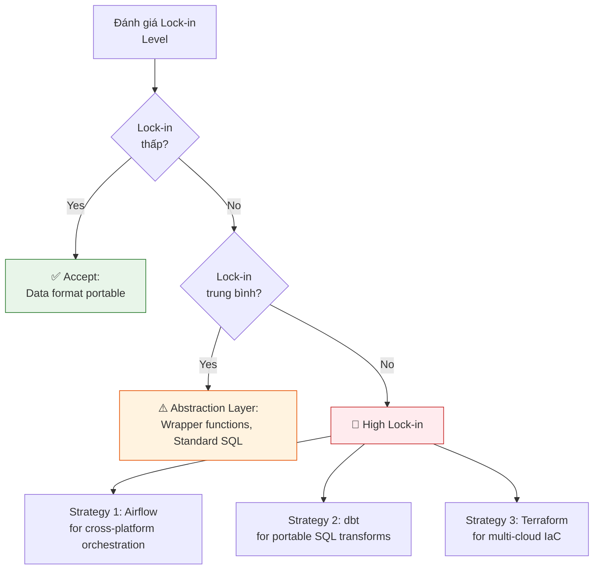

> 💡 **Gemini Feedback**
> **Góc nhìn Thực chiến (Senior to Junior)**
> Vendor lock-in KHÔNG phải lý do để KHÔNG dùng Databricks. Mọi platform đều lock-in (Snowflake lock compute + storage, BigQuery lock storage + billing). Câu hỏi đúng là: **"Lock-in này có đáng không?"** Với Databricks: data format open (Parquet), compute engine open (Spark), governance open (UC). Lock-in chủ yếu ở orchestration layer — giải quyết bằng Airflow hoặc chấp nhận. Điều quan trọng: **viết code portable (standard PySpark/SQL) để nếu cần migrate, chỉ viết lại orchestration, không viết lại logic.**

## 23. WAR STORIES & TROUBLESHOOTING

### 23.1 Small Files Storm
- **Triệu chứng:** `SELECT COUNT(*)` trên bảng 10GB mất 5 phút thay vì 3 giây. Spark UI hiện 86,000 tasks cho 1 `COUNT(*)`.
- **Nguyên nhân:** Streaming micro-batch mỗi giây = mỗi giây tạo 1 file Parquet nhỏ (~100KB). Sau 1 ngày = 86,400 files. Spark tốn 95% thời gian listing & opening files, 5% tính toán.
- **Phát hiện:**
```sql
-- Đếm số files trong bảng
DESCRIBE DETAIL my_table;
-- Cột numFiles: nếu > 10,000 → red flag
```
- **Fix ngắn hạn:** `OPTIMIZE my_table` ngay lập tức. Compact 86K files → vài trăm files.
- **Fix dài hạn:** Bật `delta.autoOptimize.optimizeWrite = true` và `delta.autoOptimize.autoCompact = true`. Dùng Liquid Clustering. Tăng trigger interval streaming lên `processingTime="30 seconds"` thay vì 1 giây.
- **Predictive Optimization:** Nếu bật, Databricks sẽ tự phát hiện small files và chạy OPTIMIZE tự động.

### 23.2 OOM (Out of Memory) — Java Heap Space
- **Triệu chứng:** Executor chết: `java.lang.OutOfMemoryError: Java heap space` hoặc `Container killed by YARN for exceeding memory limits`.
- **Nguyên nhân phổ biến:**
  - `df.collect()` hoặc `df.toPandas()` trên dataset lớn → kéo hết data về Driver node (single JVM).
  - Broadcast Join với bảng quá lớn (> 10GB) → Worker RAM nổ vì phải giữ toàn bộ bảng nhỏ trong memory.
  - Data Skew: 1 key chiếm 80% data → 1 Worker gánh hết trong khi 99 Worker khác ngồi chơi.
  - Quá nhiều partition nhỏ → overhead metadata per partition > data per partition.
- **Fix theo từng nguyên nhân:**
```python
# 1. Cấm collect() — dùng display() hoặc .limit() trước
df.limit(100).display()   # OK
# df.collect()             # NEVER in production

# 2. Disable auto-broadcast nếu bảng "nhỏ" thực ra lớn
spark.conf.set("spark.sql.autoBroadcastJoinThreshold", -1)

# 3. Salt key cho data skew
from pyspark.sql.functions import concat, lit, rand, col
df_salted = df.withColumn("salted_key",
    concat(col("skewed_key"), lit("_"), (rand() * 10).cast("int")))

# 4. Tăng Driver memory
# Cluster config: spark.driver.memory = 16g
```

### 23.3 Transaction Log Bloat — `_delta_log` Phình To
- **Triệu chứng:** `DESCRIBE HISTORY table` mất 30 giây. `INSERT INTO` latency tăng dần.
- **Nguyên nhân:** Streaming micro-batch commit mỗi giây → 86,400 JSON files/ngày trong `_delta_log/`. Mặc dù Delta checkpoint mỗi 10 commits, JSON cũ vẫn tồn tại.
- **Fix:**
```sql
-- Chạy VACUUM để xóa data files rác (KHÔNG xóa log files)
VACUUM my_table RETAIN 168 HOURS;   -- Giữ 7 ngày Time Travel

-- Log files tự dọn khi checkpoint, nhưng interval nên tăng
-- Set trigger interval streaming lên 30s-60s thay vì 1s
```

### 23.4 Unity Catalog Permission Denied Sau Migration
- **Triệu chứng:** Pipeline chạy OK trên Hive Metastore, migrate sang UC thì `PermissionDeniedException` liên tục.
- **Nguyên nhân:** UC enforce access control mặc định. Hive Metastore không có ACL → ai cũng đọc được. UC bắt buộc GRANT explicit.
- **Fix:**
```sql
-- Cấp quyền theo cấp bậc: Catalog → Schema → Table
GRANT USE CATALOG ON CATALOG prod TO `data_engineers`;
GRANT USE SCHEMA ON SCHEMA prod.silver TO `data_engineers`;
GRANT SELECT ON TABLE prod.silver.orders TO `data_engineers`;

-- Hoặc cấp gom cho cả schema
GRANT ALL PRIVILEGES ON SCHEMA prod.silver TO `etl_service_principal`;
```

### 23.5 Zombie Cluster — Cluster Chạy Vô Thời Hạn Không Ai Biết
- **Triệu chứng:** Hóa đơn tháng đội lên $15,000 bất thường.
- **Nguyên nhân:** Developer tạo All-Purpose Cluster 64 vCPU vào thứ 2, quên auto-terminate, cluster chạy idle 28 ngày. Cost: 64 vCPU × $0.40/DBU × 24h × 28 ngày.
- **Fix ngay:**
```sql
-- Tìm zombie clusters
SELECT cluster_name, driver_node_type, num_workers,
    TIMESTAMPDIFF(HOUR, start_time, current_timestamp()) AS hours_running
FROM system.compute.clusters
WHERE state = 'RUNNING'
    AND TIMESTAMPDIFF(HOUR, start_time, current_timestamp()) > 8;
```
- **Fix dài hạn:** Enforce Cluster Policy `autotermination_minutes = 30`. Block cluster creation > 8 nodes. Dùng Serverless.

### 23.6 Data Skew — 1 Executor Gánh Cả Thế Giới
- **Triệu chứng:** Spark UI hiện 99/100 tasks xong trong 5 giây, nhưng 1 task cuối chạy... 45 phút.
- **Nguyên nhân:** GROUP BY trên cột có 1 giá trị dominant (ví dụ: `country = 'US'` chiếm 80% data).
- **Spark UI signal:** Tab Stages → Sort by Duration → 1 task có Input Size gấp 50x các task khác.
- **Fix:**
```python
# Salting technique
from pyspark.sql.functions import col, concat, lit, rand, explode, array

num_salts = 20

# Bảng lớn: thêm salt key
large_df_salted = large_df.withColumn("salt", (rand() * num_salts).cast("int"))

# Bảng nhỏ: explode ra num_salts copies
small_df_salted = small_df.withColumn("salt", explode(array([lit(i) for i in range(num_salts)])))

# Join trên salted key → workload phân tán đều
result = large_df_salted.join(small_df_salted,
    (large_df_salted.key == small_df_salted.key) &
    (large_df_salted.salt == small_df_salted.salt)
)
```

### 23.7 Schema Evolution Break — Upstream Đổi Schema Không Báo
- **Triệu chứng:** Pipeline Bronze → Silver fail với `AnalysisException: cannot resolve 'user_email'`.
- **Nguyên nhân:** Team backend rename cột `user_email` → `email` mà không thông báo. Auto Loader vẫn ingest OK (schema evolution + rescued data), nhưng Silver layer code hardcode cột cũ.
- **Fix:**
```python
# Dùng rescued data pattern ở Bronze
# Bronze layer: mọi unexpected columns → _rescued_data
# Silver layer: KHÔNG hardcode column names, dùng schema-on-read

# Prevention: Data Contract enforcement
@dp.expect_or_fail("schema_check",
    "user_email IS NOT NULL OR email IS NOT NULL")
def silver_users():
    bronze = dp.read_stream("bronze_users")
    return bronze.withColumn("email",
        coalesce(col("user_email"), col("email")))
```

### 23.8 Photon Query Regression — Bật Photon Nhưng Chậm Hơn
- **Triệu chứng:** Sau khi bật Photon, 1 query cụ thể chạy chậm hơn 2x.
- **Nguyên nhân hiếm:** Query sử dụng UDF phức tạp → Photon fallback về Spark JVM → overhead chuyển đổi context. Hoặc query đụng cache warm của Spark JVM (Photon có cache riêng → cold start).
- **Fix:** Dùng Query Profile (DBSQL Pro) xem phần nào Photon chạy, phần nào fallback. Nếu > 50% fallback → tắt Photon cho query đó. Set `spark.databricks.photon.enabled = false` ở notebook level.

### 23.9 Serverless Cold Start Batch Job — Tưởng Nhanh Mà Chậm
- **Triệu chứng:** Serverless Compute boot 2 giây, nhưng actual job chạy 3 phút cho task 10 giây.
- **Nguyên nhân:** Serverless cluster auto-scale nhưng initial size nhỏ (1-2 workers). Spark phải request thêm workers, scheduler queue, negotiate resources — tốn 1-2 phút ramp-up.
- **Fix:** Set `spark.databricks.serverless.startWorkers = 8` (hint cho initial worker count). Hoặc dùng Instance Pool + Job Cluster nếu cần consistent latency.

### 23.10 Delta MERGE Timeout — MERGE Chạy 4 Tiếng Rồi Timeout
- **Triệu chứng:** `MERGE INTO gold.customers USING staging.updates ON ...` chạy 4+ tiếng rồi fail.
- **Nguyên nhân:** Bảng target 500GB không có clustering/Z-ORDER. MERGE phải scan TOÀN BỘ target để tìm matching rows.
- **Fix:**
```sql
-- Bật Liquid Clustering cho bảng target
ALTER TABLE gold.customers CLUSTER BY (customer_id);
OPTIMIZE gold.customers;

-- MERGE sẽ chỉ scan các files có min/max(customer_id) overlap
-- thay vì scan 500GB → scan 5GB → 100x nhanh hơn

-- Nếu MERGE thường xuyên: bật Deletion Vectors
ALTER TABLE gold.customers SET TBLPROPERTIES (
    'delta.enableDeletionVectors' = 'true'
);
```

> 💡 **Gemini Feedback**
> **Góc nhìn Thực chiến (Senior to Junior)**
> Đây là 10 War Stories kinh điển nhất mà anh đã gặp qua hàng chục dự án Databricks. Quy tắc vàng: (1) **LUÔN BẬT Predictive Optimization** — nó cứu bạn khỏi 70% vấn đề small files + log bloat. (2) **LUÔN DÙNG Cluster Policies** — nó cứu ví tiền công ty. (3) **LUÔN BẬT Change Data Feed** — nó biến full-refresh pipeline thành incremental, giảm 90% runtime. (4) **LUÔN LÀM profiling trước khi bật Photon** — đừng tin marketing, hãy tin data.

---

## 24. METRICS & ORDER OF MAGNITUDE

### Compute Metrics

| Metric | Giá trị tham khảo |
|--------|-------------------|
| Classic Cluster boot time | 3-5 phút |
| Instance Pool cluster boot | 30 giây - 1 phút |
| Serverless Compute boot time | 2-5 giây |
| Auto-scale add 1 worker | 1-2 phút (Classic) / 5-10s (Serverless) |
| Max workers per cluster | 512 (Classic) / Auto (Serverless) |

### Storage & Query Metrics

| Metric | Giá trị tham khảo |
|--------|-------------------|
| S3 read throughput | ~100-500 MB/s per stream |
| ADLS read throughput | ~200-800 MB/s per stream |
| NVMe Disk Cache throughput | ~30-50 GB/s |
| Query Result Cache response | ~10 ms |
| Delta OPTIMIZE (1TB table) | ~10-30 phút |
| Delta VACUUM (1TB, 7 days retention) | ~5-15 phút |
| Liquid Clustering initial build (1TB) | ~20-40 phút |
| UniForm Iceberg metadata overhead | < 1% storage overhead |
| Change Data Feed storage overhead | ~5-10% additional storage |

### Engine Performance

| Metric | Giá trị tham khảo |
|--------|-------------------|
| Photon speedup vs JVM (SQL Filter/Agg) | 2-8x |
| Photon speedup vs JVM (String operations) | 3-5x |
| Photon speedup vs JVM (Hash Join) | 4-6x |
| Photon speedup vs JVM (Python UDF) | 1x (KHÔNG cải thiện) |
| Photon speedup vs JVM (Pandas UDF) | 1x (KHÔNG cải thiện) |
| Data Skipping effectiveness (good clustering) | Skip 90-99% files |
| Pre-Photon TPCDS 1TB benchmark | ~45 phút |
| Post-Photon TPCDS 1TB benchmark | ~8 phút |

### Platform & Operational

| Metric | Giá trị tham khảo |
|--------|-------------------|
| Unity Catalog metastore limit | ~1M objects per metastore |
| Max concurrent notebooks | 150+ per workspace |
| Max clusters per workspace | 700 |
| Delta Transaction Log checkpoint | Mỗi 10 commits |
| Structured Streaming checkpoint size | 10KB - 100MB depending on state |
| Lakeflow Connect throughput | Hàng triệu records/phút (connector-dependent) |
| System Tables query latency | < 5 giây |
| Lakeflow Connect Free Tier | ~100M records/workspace/day |
| Delta Sharing adoption | 4,000+ enterprises (VLDB 2025) |

---

## 25. MICRO-LABS

### Lab 1: Tạo bảng Liquid Clustering + UniForm + CDF

```sql
-- Tạo bảng với MỌI tính năng Delta Lake 3.x
CREATE TABLE prod.silver.user_events (
    user_id STRING,
    event_time TIMESTAMP,
    action STRING,
    region STRING,
    payload STRING
)
CLUSTER BY (user_id, event_time)
TBLPROPERTIES (
    'delta.enableDeletionVectors' = 'true',
    'delta.universalFormat.enabledFormats' = 'iceberg',
    'delta.enableChangeDataFeed' = 'true'
);

-- Insert sample data
INSERT INTO prod.silver.user_events VALUES
('u001', '2026-03-24T10:00:00', 'click', 'APAC', '{"page": "home"}'),
('u002', '2026-03-24T10:01:00', 'purchase', 'EU', '{"item": "shoes"}'),
('u003', '2026-03-24T10:02:00', 'signup', 'US', '{"source": "organic"}');

-- Update để tạo CDC record
UPDATE prod.silver.user_events SET action = 'return' WHERE user_id = 'u002';

-- Trigger Liquid Clustering
OPTIMIZE prod.silver.user_events;

-- Time Travel: xem version trước
SELECT * FROM prod.silver.user_events VERSION AS OF 0;

-- Xem Transaction Log
DESCRIBE HISTORY prod.silver.user_events;

-- Đọc Change Data Feed
SELECT * FROM table_changes('prod.silver.user_events', 0)
ORDER BY _commit_version;
```

### Lab 2: Auto Loader + Rescued Data + Bronze → Silver

```python
# ==== BRONZE: Auto Loader with rescued data ====
bronze_df = (spark.readStream
    .format("cloudFiles")
    .option("cloudFiles.format", "json")
    .option("cloudFiles.schemaLocation", "/mnt/schema/events")
    .option("cloudFiles.inferColumnTypes", "true")
    .option("rescuedDataColumn", "_rescued_data")
    .load("/mnt/raw/events/")
)

bronze_df.writeStream \
    .format("delta") \
    .option("checkpointLocation", "/mnt/checkpoints/bronze_events") \
    .option("mergeSchema", "true") \
    .trigger(availableNow=True) \
    .toTable("bronze.events")

# ==== SILVER: Read only changes via CDF ====
silver_df = (spark.readStream
    .format("delta")
    .option("readChangeFeed", "true")
    .option("startingVersion", 0)
    .table("bronze.events")
    .filter("_change_type != 'update_preimage'")  # Only keep post-images
    .filter("user_id IS NOT NULL")
    .withColumn("event_date", to_date("event_time"))
    .select("user_id", "event_time", "event_date", "action", "region")
)

silver_df.writeStream \
    .format("delta") \
    .option("checkpointLocation", "/mnt/checkpoints/silver_events") \
    .trigger(availableNow=True) \
    .toTable("silver.events")
```

### Lab 3: Declarative Pipeline — Full Medallion (New API)

```python
# src/pipeline.py — Complete Medalion Pipeline
import pyspark.pipelines as dp
from pyspark.sql.functions import *

# ===== BRONZE =====
@dp.table(comment="Raw events from cloud files")
def bronze_events():
    return spark.readStream.format("cloudFiles") \
        .option("cloudFiles.format", "json") \
        .option("cloudFiles.inferColumnTypes", "true") \
        .option("rescuedDataColumn", "_rescued_data") \
        .load("s3://raw-bucket/events/")

# ===== SILVER (with quality gates) =====
@dp.table
@dp.expect_or_drop("valid_user", "user_id IS NOT NULL")
@dp.expect("valid_time", "event_time <= current_timestamp()")
@dp.expect("valid_amount", "amount >= 0 OR amount IS NULL")
def silver_events():
    return dp.read_stream("bronze_events") \
        .withColumn("event_date", to_date("event_time")) \
        .withColumn("processed_at", current_timestamp()) \
        .select("user_id", "event_time", "event_date",
                "action", "region", "amount", "processed_at")

# ===== CDC TABLE (Upsert) =====
dp.create_streaming_table("silver_users")

dp.apply_changes(
    target="silver_users",
    source="bronze_user_cdc",
    keys=["user_id"],
    sequence_by=col("updated_at"),
    apply_as_deletes=expr("op = 'DELETE'"),
    except_column_list=["_rescued_data", "op"],
    stored_as_scd_type=2
)

# ===== GOLD (aggregation) =====
@dp.table(comment="Daily revenue by region")
def gold_daily_revenue():
    return dp.read("silver_events") \
        .filter("action = 'purchase'") \
        .groupBy("event_date", "region") \
        .agg(
            count("*").alias("num_purchases"),
            sum("amount").alias("total_revenue"),
            avg("amount").alias("avg_order_value"),
            countDistinct("user_id").alias("unique_buyers")
        )

@dp.table(comment="Hourly event metrics for real-time dashboard")
def gold_hourly_metrics():
    return dp.read("silver_events") \
        .withColumn("hour", date_trunc("hour", "event_time")) \
        .groupBy("hour", "region", "action") \
        .agg(
            count("*").alias("event_count"),
            countDistinct("user_id").alias("unique_users")
        )
```

### Lab 4: Automation Bundle — Full Project Setup

```bash
# 1. Khởi tạo project với template
databricks bundle init --template default-python
cd my_project/

# 2. Cấu trúc files
cat > databricks.yml << 'EOF'
bundle:
  name: daily_revenue_pipeline

workspace:
  host: https://adb-xxxx.azuredatabricks.net

targets:
  dev:
    mode: development
    default: true
  staging:
    workspace:
      root_path: /Workspace/Shared/.bundle/${bundle.name}/staging
  prod:
    mode: production
    run_as:
      service_principal_name: "prod-etl-sp"

resources:
  pipelines:
    bronze_silver:
      name: "[${bundle.target}] Bronze-Silver Pipeline"
      development: true
      channel: PREVIEW
      libraries:
        - notebook:
            path: src/pipeline.py

  jobs:
    daily_etl:
      name: "[${bundle.target}] Daily Revenue ETL"
      schedule:
        quartz_cron_expression: "0 0 6 * * ?"
        timezone_id: "Asia/Ho_Chi_Minh"
      tasks:
        - task_key: run_pipeline
          pipeline_task:
            pipeline_id: ${resources.pipelines.bronze_silver.id}
        - task_key: validate
          depends_on:
            - task_key: run_pipeline
          sql_task:
            query: "SELECT COUNT(*) as cnt FROM gold.daily_revenue WHERE event_date = current_date()"
EOF

# 3. Validate → Deploy → Run
databricks bundle validate --target staging
databricks bundle deploy --target staging
databricks bundle run daily_etl --target staging

# 4. Nếu staging OK → deploy prod
databricks bundle deploy --target prod
```

### Lab 5: FinOps Dashboard Queries

```sql
-- ===== Query 1: Top cost users (7 ngày) =====
SELECT
    identity_metadata.run_as AS user_identity,
    sku_name,
    SUM(usage_quantity) AS total_dbus,
    ROUND(SUM(usage_quantity * 0.40), 2) AS estimated_cost_usd
FROM system.billing.usage
WHERE usage_date >= current_date() - INTERVAL 7 DAYS
GROUP BY 1, 2
ORDER BY estimated_cost_usd DESC
LIMIT 15;

-- ===== Query 2: Zombie Clusters =====
SELECT
    cluster_name, cluster_source, driver_node_type, num_workers,
    TIMESTAMPDIFF(HOUR, start_time, current_timestamp()) AS hours_running,
    ROUND(TIMESTAMPDIFF(HOUR, start_time, current_timestamp()) * num_workers * 0.40, 2) AS est_cost_usd
FROM system.compute.clusters
WHERE state = 'RUNNING'
    AND TIMESTAMPDIFF(HOUR, start_time, current_timestamp()) > 4
ORDER BY est_cost_usd DESC;

-- ===== Query 3: Cost trend by day =====
SELECT
    usage_date,
    sku_name,
    ROUND(SUM(usage_quantity), 0) AS dbus,
    ROUND(SUM(usage_quantity * 0.40), 2) AS est_cost
FROM system.billing.usage
WHERE usage_date >= current_date() - INTERVAL 30 DAYS
GROUP BY 1, 2
ORDER BY 1 DESC, 4 DESC;

-- ===== Query 4: Predictive Optimization ROI =====
SELECT
    table_name,
    operation_type,
    COUNT(*) AS num_operations,
    ROUND(SUM(usage_quantity), 2) AS dbus_spent,
    SUM(metrics.numFilesRemoved) AS files_compacted
FROM system.storage.predictive_optimization_operations_history
WHERE start_time >= current_date() - INTERVAL 30 DAYS
GROUP BY 1, 2
ORDER BY dbus_spent DESC;
```

### Lab 6: Delta Sharing Setup

```sql
-- Provider side: Create and manage share
CREATE SHARE revenue_share COMMENT 'Monthly revenue data for partners';
ALTER SHARE revenue_share ADD TABLE prod.gold.monthly_revenue;

-- Create recipient with auto-expiring token
CREATE RECIPIENT partner_abc COMMENT 'Partner ABC Analytics'
    PROPERTIES ('department' = 'analytics')
    USING TOKEN AUTO_EXPIRE 90 DAYS;

-- Grant access
GRANT SELECT ON SHARE revenue_share TO RECIPIENT partner_abc;

-- Monitor sharing activity
SELECT * FROM system.access.audit
WHERE action_name LIKE '%DELTA_SHARING%'
ORDER BY event_time DESC LIMIT 50;
```

### Lab 7: Stream-Stream Join + Watermark

```python
# Clicks stream
clicks = (spark.readStream.table("bronze.clicks")
    .withWatermark("click_time", "1 hour")
    .select("ad_id", "user_id", "click_time", "page_url"))

# Impressions stream
impressions = (spark.readStream.table("bronze.impressions")
    .withWatermark("impression_time", "2 hours")
    .select("ad_id", "impression_id", "impression_time", "campaign"))

# Join: click happened within 1 hour after impression
attributed = clicks.join(impressions,
    expr("""
        clicks.ad_id = impressions.ad_id AND
        click_time >= impression_time AND
        click_time <= impression_time + interval 1 hour
    """),
    "inner"
).select(
    impressions.campaign,
    clicks.user_id,
    impressions.impression_time,
    clicks.click_time,
    (unix_timestamp("click_time") - unix_timestamp("impression_time")).alias("time_to_click_secs")
)

# Write attributed clicks to Silver
attributed.writeStream \
    .format("delta") \
    .option("checkpointLocation", "/mnt/checkpoints/attributed_clicks") \
    .trigger(processingTime="30 seconds") \
    .toTable("silver.attributed_clicks")
```

### Lab 8: Cluster Policy + Instance Pool Setup (Admin)

```python
# Admin script: Create cluster policy + instance pool via SDK
from databricks.sdk import WorkspaceClient
import json

w = WorkspaceClient()

# 1. Create Instance Pool
pool = w.instance_pools.create(
    instance_pool_name="DE-Production-Pool",
    node_type_id="m5.2xlarge",
    min_idle_instances=2,
    max_capacity=20,
    idle_instance_autotermination_minutes=10,
    preloaded_spark_versions=["15.4.x-scala2.12"]
)
print(f"Pool created: {pool.instance_pool_id}")

# 2. Create Cluster Policy
policy_def = {
    "spark_version": {"type": "fixed", "value": "15.4.x-scala2.12"},
    "num_workers": {"type": "range", "minValue": 1, "maxValue": 8},
    "node_type_id": {"type": "fixed", "value": "m5.2xlarge"},
    "autotermination_minutes": {"type": "fixed", "value": 30},
    "instance_pool_id": {"type": "fixed", "value": pool.instance_pool_id},
    "custom_tags.team": {"type": "fixed", "value": "data_engineering"},
    "custom_tags.cost_center": {"type": "fixed", "value": "DE-001"}
}

policy = w.cluster_policies.create(
    name="DE Team - Cost Controlled",
    definition=json.dumps(policy_def)
)
print(f"Policy created: {policy.policy_id}")
```

---

## 26. TỔNG KẾT & TIMELINE

### Bản Đồ Lakeflow Ecosystem 2026

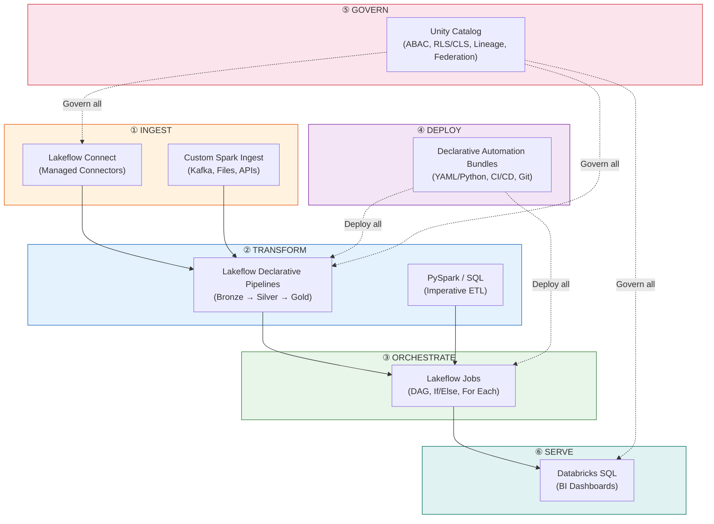

### Component Summary

| # | Component | Tên Cũ | Tên Mới (2026) | Status |
|---|-----------|--------|---------------|--------|
| 1 | Data Ingestion | N/A (Fivetran/Airbyte) | **Lakeflow Connect** | GA Apr 2025 |
| 2 | ETL/ELT | Delta Live Tables (DLT) | **Lakeflow Declarative Pipelines** | Renamed 2025 |
| 3 | Orchestration | Databricks Workflows | **Lakeflow Jobs** | GA 2025 |
| 4 | CI/CD IaC | Databricks Asset Bundles | **Declarative Automation Bundles** | Renamed Mar 2026 |
| 5 | Governance | Unity Catalog | **Unity Catalog (Open Source)** | Open-sourced Jun 2024 |
| 6 | Storage Format | Delta Lake | **Delta Lake 3.x + UniForm** | UniForm Iceberg GA |
| 7 | Data Layout | Partitioning + Z-Ordering | **Liquid Clustering** | GA DBR 15.2 |
| 8 | Query Engine | Spark SQL | **Spark SQL + Photon** | Photon GA 2022 |

### Verified Resources

| Resource | URL |
|----------|-----|
| Databricks Docs | https://docs.databricks.com/ |
| Lakeflow Overview | https://www.databricks.com/product/lakeflow |
| Unity Catalog OSS | https://www.unitycatalog.io/ |
| Delta Lake Docs | https://docs.delta.io/ |
| Databricks Blog | https://www.databricks.com/blog |
| Pricing | https://www.databricks.com/product/pricing |
| System Tables | https://docs.databricks.com/en/admin/system-tables/index.html |
| Liquid Clustering | https://docs.databricks.com/en/delta/clustering.html |
| UniForm | https://docs.databricks.com/en/delta/uniform.html |
| Lakeflow Connect | https://docs.databricks.com/en/lakeflow-connect/index.html |
| Declarative Pipelines | https://docs.databricks.com/en/lakeflow/declarative-pipelines/index.html |
| Automation Bundles | https://docs.databricks.com/en/dev-tools/bundles/index.html |
| Lakehouse Federation | https://docs.databricks.com/en/query-federation/index.html |

---

<mark style="background: #BBFABBA6;">💡 **Gemini Message**</mark>

Databricks năm 2026 đã hoàn toàn khác biệt so với hình ảnh "Managed Spark trên Cloud" mà nhiều người vẫn hình dung. Nền tảng này đã tiến hóa thành một **hệ điều hành dữ liệu hoàn chỉnh** (Data Operating System) bao trùm cả 6 tầng:

### Tầng 1: Ingest (Lakeflow Connect)
Xóa bỏ nhu cầu dùng Fivetran/Airbyte cho các source phổ biến. Managed, serverless, UC-governed từ đầu.

### Tầng 2: Transform (Lakeflow Declarative Pipelines)
Declarative ETL thay thế imperative Spark code cho 80% use cases. `apply_changes` giải quyết CDC, `Expectations` giải quyết Data Quality.

### Tầng 3: Orchestrate (Lakeflow Jobs)
Native DAG orchestration với If/Else branching và For Each looping. Continuous Jobs cho streaming.

### Tầng 4: Deploy (Declarative Automation Bundles)
IaC thuần túy. YAML/Python config, Git version control, CI/CD pipeline. Data Engineer = DevOps Engineer.

### Tầng 5: Govern (Unity Catalog)
Open-source, Lakehouse Federation, ABAC, Row/Column security, Volumes cho unstructured data. Xương sống của mọi thứ.

### Tầng 6: Serve (Databricks SQL)
Photon-powered SQL Warehouse với multi-layer caching. Native BI connectors.

**Lời khuyên cuối:** Nếu em mới bắt đầu học Databricks, hãy học theo thứ tự: (1) Delta Lake internals → (2) Unity Catalog namespace → (3) Lakeflow Declarative Pipelines → (4) Lakeflow Jobs → (5) Automation Bundles → (6) FinOps System Tables. Nắm được 6 tầng này, em đủ tư cách đi phỏng vấn Senior Data Engineer ở bất kỳ công ty nào dùng Databricks!

---

## 🔗 Liên Kết Nội Bộ

- [[02_Snowflake|Snowflake DWH Platform]]
- [[03_Google_Cloud|Google Cloud Data Ecosystem]]
- [[04_AWS_Data|AWS Data Services]]
- [[../tools/02_Delta_Lake_Complete_Guide|Delta Lake Deep Dive]]
- [[../tools/06_Apache_Spark_Complete_Guide|Apache Spark Internals]]
- [[../tools/04_Airflow_Complete_Guide|Apache Airflow (So sánh với Lakeflow Jobs)]]
- [[../papers/04_Table_Format_Papers|Table Format Papers (Delta vs Iceberg vs Hudi)]]

---

*Document Revision: Databricks Data Intelligence Platform — Data Engineer Edition*
*Last Updated: March 2026*
*Coverage: 26 Sections + 4 Appendices — Complete DE Encyclopedia*

---

## APPENDIX E: DATABRICKS vs TẤT CẢ ĐỐI THỦ — Bảng So Sánh Toàn Diện

### Platform Comparison (2026)

| Tiêu chí | Databricks | Snowflake | Google BigQuery | Amazon Redshift | Apache Spark (OSS) |
|----------|-----------|-----------|----------------|----------------|-------------------|
| **Core Engine** | Spark + Photon | Snowpark | Dremel | Custom MPP | Spark |
| **Storage** | Delta Lake (Open) | FDN (Proprietary) | Capacitor (Proprietary) | Redshift Managed | Any (HDFS, S3) |
| **Data Format** | Open (Parquet) | Proprietary | Proprietary | Proprietary | Open |
| **Serverless** | ✅ GA 2025 | ✅ Native | ✅ Native | ✅ Serverless v2 | ❌ |
| **Streaming** | ✅ Native Structured Streaming | ❌ (Snowpipe = batch) | ❌ (Pub/Sub → batch) | ❌ (Kinesis → batch) | ✅ Native |
| **Python Support** | ✅ Full PySpark + Pandas | ⚠️ Snowpark Python | ✅ BigQuery ML | ⚠️ UDFs only | ✅ Full PySpark |
| **CI/CD Native** | ✅ Automation Bundles | ❌ (Terraform only) | ❌ (Terraform only) | ❌ (CFN/TF) | ❌ (Custom) |
| **Data Governance** | ✅ Unity Catalog (Open) | ✅ Horizon (Proprietary) | ⚠️ IAM + Dataplex | ⚠️ IAM-based | ❌ (Apache Ranger) |
| **Open Source** | ✅ Spark, Delta, UC | ❌ | ❌ | ❌ | ✅ 100% |
| **Managed Ingestion** | ✅ Lakeflow Connect | ❌ (Partners) | ⚠️ Datastream | ❌ (Partners) | ❌ |
| **Declarative ETL** | ✅ Lakeflow Pipelines | ❌ (Manual SQL) | ⚠️ Dataform | ❌ | ❌ |
| **Data Sharing** | ✅ Delta Sharing (Open) | ✅ Data Sharing | ⚠️ Analytics Hub | ❌ (Manual) | ❌ |
| **Clean Rooms** | ✅ GA 2025 | ✅ GA | ❌ | ❌ | ❌ |
| **Cost Model** | DBU (complex) | Credits (simple) | On-demand/Slots | Per-node/Serverless | Free (infra only) |
| **Best For** | Unified DE + DS + BI | DWH-centric BI | Google ecosystem | AWS-centric DWH | Budget-conscious |

### Ingestion Tool Comparison

| Tiêu chí | Lakeflow Connect | Fivetran | Airbyte | Stitch | Debezium |
|----------|-----------------|---------|--------|-------|---------|
| **Connectors** | ~30 | 600+ | 350+ | 200+ | DB only |
| **Pricing** | Free Tier (100M rows/day) | $$$ | Open-source + Cloud | $$ | Free (OSS) |
| **Serverless** | ✅ | ✅ | Cloud version | ✅ | ❌ |
| **UC Integration** | ✅ Native | ❌ (File drop) | ❌ | ❌ | ❌ |
| **SCD Type 2** | ✅ Built-in | ✅ | ⚠️ | ❌ | ❌ |
| **Schema Evolution** | ✅ Auto | ✅ | ✅ | ⚠️ | ⚠️ |
| **CDC** | ✅ Native | ✅ | ✅ | ⚠️ | ✅ (Kafka) |
| **Lock-in** | Databricks | Fivetran | Low | Stitch | None |

### ETL/Orchestration Tool Comparison

| Tiêu chí | Lakeflow Jobs | Apache Airflow | Prefect | Dagster | dbt Cloud |
|----------|-------------|---------------|--------|--------|-----------|
| **DAG Definition** | UI / YAML / API | Python DAGs | Python flows | Python assets | SQL models |
| **Branching/Looping** | ✅ If/Else, For Each | ✅ BranchOperator | ✅ | ✅ | ❌ |
| **Streaming Jobs** | ✅ Continuous Jobs | ⚠️ (not native) | ⚠️ | ⚠️ | ❌ |
| **Serverless** | ✅ | ❌ (self-hosted) | ✅ Cloud | ✅ Cloud | ✅ Cloud |
| **Monitoring** | ✅ System Tables | ✅ UI + Logs | ✅ | ✅ | ✅ |
| **Databricks Integration** | ✅ Native | ✅ Provider | ⚠️ | ⚠️ | ✅ Adapter |
| **Multi-platform** | ❌ Databricks only | ✅ Any | ✅ Any | ✅ Any | ✅ Any DWH |
| **Open Source** | ❌ | ✅ | ✅ Core | ✅ | ❌ |

---

## APPENDIX F: GLOSSARY — Thuật Ngữ Databricks

| Thuật Ngữ | Giải Thích |
|-----------|-----------|
| **ABAC** | Attribute-Based Access Control — kiểm soát truy cập dựa trên thuộc tính (tag) thay vì role |
| **AQE** | Adaptive Query Execution — Spark tự tối ưu execution plan runtime |
| **Auto Loader** | Cơ chế tự động ingest files từ cloud storage vào Delta Table |
| **CDF** | Change Data Feed — đọc ra thay đổi (INSERT/UPDATE/DELETE) từ Delta Table |
| **Classic Compute** | Cluster chạy trên VPC/VNet khách hàng (phân biệt với Serverless) |
| **cloudFiles** | Spark DataSource format cho Auto Loader: `spark.readStream.format("cloudFiles")` |
| **CMK** | Customer-Managed Keys — encrypt data bằng key do khách hàng quản lý |
| **Control Plane** | Phần Databricks quản lý (UI, API, Scheduler) — chạy trên infra Databricks |
| **Data Plane** | Phần chạy compute — có thể Classic (customer VPC) hoặc Serverless (Databricks) |
| **DAB** | Declarative Automation Bundles — IaC cho Databricks resources (tên mới của Asset Bundles) |
| **DBR** | Databricks Runtime — bản Spark được optimize với Photon, Delta Lake, etc. |
| **DBU** | Databricks Unit — đơn vị tính giá: mỗi loại workload có rate khác nhau |
| **DLT** | Delta Live Tables — tên cũ của Lakeflow Declarative Pipelines |
| **Deletion Vectors** | Cơ chế đánh dấu xóa row bằng bitmap thay vì rewrite Parquet file |
| **Delta Sharing** | Open protocol chia sẻ data giữa các platform mà không copy |
| **Expectations** | Data quality rules trong Declarative Pipelines (@dp.expect, @dp.expect_or_drop) |
| **Lakehouse Federation** | Query external databases (PostgreSQL, MySQL, etc.) trực tiếp từ Databricks |
| **Lakeview** | Tên mới của SQL Dashboards trong Databricks |
| **Liquid Clustering** | Thay thế Z-Ordering + Partitioning — có thể đổi key runtime, incremental |
| **Medallion** | Architecture pattern Bronze → Silver → Gold |
| **Photon** | C++ vectorized engine tăng tốc SQL queries trên Databricks |
| **Predictive Optimization** | AI tự chạy OPTIMIZE/VACUUM dựa trên query patterns |
| **SCD Type 2** | Slowly Changing Dimension — lưu lịch sử thay đổi với timestamp |
| **Serverless Compute** | Compute chạy trên infra Databricks — boot < 5s, zero-config |
| **System Tables** | UC tables chứa billing, audit, compute, pipeline logs |
| **UC** | Unity Catalog — governance layer thống nhất cho data, AI, và analytics |
| **UniForm** | Universal Format — Delta Table tự sinh Iceberg/Hudi metadata |
| **Volumes** | UC-managed container cho unstructured files (images, PDFs, etc.) |
| **Watermark** | Cơ chế Structured Streaming xác định late data threshold |

---

## APPENDIX A: SPARK TUNING PARAMETERS — CHEAT SHEET CHO DATABRICKS

### Memory & Execution

| Parameter | Default | Recommend | Giải thích |
|-----------|---------|-----------|-----------|
| `spark.driver.memory` | 4g | 8-16g cho production | Driver giữ metadata + broadcast tables |
| `spark.executor.memory` | 4g | 8-16g | Mỗi executor xử lý partitions |
| `spark.executor.cores` | 4 | 4-8 | Parallelism per executor |
| `spark.sql.shuffle.partitions` | 200 | Data size / 128MB | Partition count sau shuffle |
| `spark.default.parallelism` | 200 | 2x total cores | Parallelism cho RDD operations |
| `spark.sql.files.maxPartitionBytes` | 128MB | 128-256MB | Max partition size for file scan |

### Join & Broadcast

| Parameter | Default | Recommend | Giải thích |
|-----------|---------|-----------|-----------|
| `spark.sql.autoBroadcastJoinThreshold` | 10MB | 50-100MB hoặc -1 | Auto broadcast bảng nhỏ |
| `spark.sql.adaptive.enabled` | true | true | Adaptive Query Execution (AQE) |
| `spark.sql.adaptive.coalescePartitions.enabled` | true | true | AQE gộp partition nhỏ |
| `spark.sql.adaptive.skewJoin.enabled` | true | true | AQE detect & fix skew |
| `spark.sql.adaptive.skewJoin.skewedPartitionFactor` | 5 | 5-10 | Ngưỡng detect skew |

### Delta Lake Specific

| Parameter | Default | Recommend | Giải thích |
|-----------|---------|-----------|-----------|
| `spark.databricks.delta.optimizeWrite.enabled` | false | true | Compact files khi write |
| `spark.databricks.delta.autoCompact.enabled` | false | true | Auto compact after write |
| `spark.databricks.delta.properties.defaults.enableChangeDataFeed` | false | true | CDF mặc định cho mọi bảng mới |
| `spark.databricks.delta.schema.autoMerge.enabled` | false | true (Bronze) | Auto merge new columns |
| `delta.checkpoint.writeStatsAsJson` | true | true | Write stats cho data skipping |
| `delta.checkpoint.writeStatsAsStruct` | true | true | Struct stats cho Photon |

### Photon Specific

| Parameter | Default | Giải thích |
|-----------|---------|-----------|
| `spark.databricks.photon.enabled` | true (Photon clusters) | Enable/disable Photon engine |
| `spark.databricks.photon.allDataSources.enabled` | true | Photon for all data sources |
| `spark.databricks.photon.scan.enabled` | true | Photon for file scan |
| `spark.databricks.photon.parquetWriter.enabled` | true | Photon Parquet writer (faster OPTIMIZE) |

### Streaming Specific

| Parameter | Default | Recommend | Giải thích |
|-----------|---------|-----------|-----------|
| `spark.sql.streaming.stateStore.providerClass` | RocksDB | RocksDB | Persistent state store |
| `spark.sql.streaming.noDataMicroBatches.enabled` | true | false | Skip empty batches |
| `maxFilesPerTrigger` | 1000 | Tune per use case | Limit files per micro-batch |
| `maxBytesPerTrigger` | N/A | 1g | Limit bytes per micro-batch |

### Cluster Config Best Practices

```python
# Production Job Cluster optimized config
cluster_config = {
    "spark_version": "15.4.x-photon-scala2.12",
    "node_type_id": "m5.2xlarge",      # 8 vCPU, 32 GB RAM
    "num_workers": 8,
    "spark_conf": {
        # Memory
        "spark.driver.memory": "16g",
        
        # Shuffle & AQE
        "spark.sql.shuffle.partitions": "auto",  # Databricks auto-tune
        "spark.sql.adaptive.enabled": "true",
        "spark.sql.adaptive.coalescePartitions.enabled": "true",
        "spark.sql.adaptive.skewJoin.enabled": "true",
        
        # Delta
        "spark.databricks.delta.optimizeWrite.enabled": "true",
        "spark.databricks.delta.autoCompact.enabled": "true",
        
        # Photon
        "spark.databricks.photon.enabled": "true",
    },
    "custom_tags": {"team": "data_engineering", "env": "production"},
    "autotermination_minutes": 30,
    "autoscale": {"min_workers": 4, "max_workers": 16}
}
```

---

## APPENDIX B: END-TO-END PRODUCTION ARCHITECTURE — Kiến Trúc Thực Tế

### Kiến Trúc Tổng Thể Cho Công Ty Trung Bình (50-200 DE/DS/Analyst)

```mermaid
graph TB
    subgraph Sources["① DATA SOURCES"]
        SaaS["SaaS Apps<br/>(Salesforce, Workday)"]
        DB["Operational DBs<br/>(PostgreSQL, MySQL)"]
        Files["Files<br/>(S3, ADLS, GCS)"]
        Kafka["Kafka / Event Hub<br/>(Streaming)"]
        API["REST APIs<br/>(Custom)"]
    end
    
    subgraph Ingest["② INGESTION LAYER"]
        LC["Lakeflow Connect<br/>(SaaS + DB connectors)"]
        AL["Auto Loader<br/>(File ingestion)"]
        SS["Structured Streaming<br/>(Kafka consumer)"]
        Fivetran["Fivetran/Airbyte<br/>(Long-tail sources)"]
    end
    
    subgraph Lakehouse["③ LAKEHOUSE (Delta Lake + UC)"]
        Bronze["Bronze<br/>(Raw, append-only)"]
        Silver["Silver<br/>(Cleaned, dedupe, CDF)"]
        Gold["Gold<br/>(Aggregated, BI-ready)"]
    end
    
    subgraph Processing["④ PROCESSING"]
        SDP["Lakeflow Declarative Pipelines<br/>(Bronze → Silver → Gold)"]
        PySpark["PySpark Notebooks<br/>(Complex logic)"]
        dbt["dbt Core<br/>(SQL transformations)"]
    end
    
    subgraph Orchestration["⑤ ORCHESTRATION"]
        LJ["Lakeflow Jobs<br/>(Databricks-internal)"]
        Airflow["Airflow<br/>(Cross-platform)"]
    end
    
    subgraph Serving["⑥ SERVING"]
        DBSQL["DBSQL Warehouse<br/>(BI queries)"]
        Lakeview["Lakeview Dashboards"]
        Tableau["Tableau / Power BI"]
        DS["Delta Sharing<br/>(Cross-org)"]
    end
    
    subgraph DevOps["⑦ DEVOPS"]
        DAB["Declarative Automation Bundles"]
        GH["GitHub Actions CI/CD"]
        TF["Terraform<br/>(Workspace provisioning)"]
    end
    
    SaaS --> LC
    DB --> LC
    Files --> AL
    Kafka --> SS
    API --> Fivetran
    
    LC --> Bronze
    AL --> Bronze
    SS --> Bronze
    Fivetran --> Bronze
    
    Bronze --> SDP --> Silver
    Silver --> SDP --> Gold
    Silver --> PySpark --> Gold
    Silver --> dbt --> Gold
    
    SDP --> LJ
    PySpark --> LJ
    LJ --> Airflow
    
    Gold --> DBSQL
    DBSQL --> Lakeview
    DBSQL --> Tableau
    Gold --> DS
    
    DAB -.-> LJ
    DAB -.-> SDP
    GH -.-> DAB
    TF -.-> Sources
    
    style Sources fill:#ffebee,stroke:#c62828
    style Ingest fill:#fff3e0,stroke:#e65100
    style Lakehouse fill:#e3f2fd,stroke:#1565c0
    style Processing fill:#e8f5e9,stroke:#2e7d32
    style Orchestration fill:#f3e5f5,stroke:#7b1fa2
    style Serving fill:#e0f2f1,stroke:#00695c
    style DevOps fill:#fce4ec,stroke:#c62828
```

### Workspace Layout Best Practice

```text
Unity Catalog Metastore (1 per region)
├── Catalog: prod
│   ├── Schema: bronze
│   │   ├── raw_events (Auto Loader)
│   │   ├── raw_users (Lakeflow Connect)
│   │   └── raw_transactions (Streaming)
│   ├── Schema: silver
│   │   ├── clean_events
│   │   ├── clean_users (SCD Type 2)
│   │   └── clean_transactions
│   ├── Schema: gold
│   │   ├── daily_revenue
│   │   ├── monthly_metrics
│   │   └── customer_segments
│   └── Schema: system_monitoring
│       ├── mv_cost_daily (Materialized View)
│       └── mv_pipeline_health
├── Catalog: staging
│   └── (mirror of prod schemas — for testing)
├── Catalog: dev
│   └── Schema: sandbox_<username>
│       └── (personal experiment tables)
└── Catalog: shared
    └── Schema: external_data
        └── (Delta Sharing received tables)
```

### Environment Isolation

| Environment | Cluster Type | Compute | UC Catalog | Who |
|-------------|-------------|---------|-----------|-----|
| **dev** | All-Purpose (small) | 2 workers | `dev.*` | DEs, DS |
| **staging** | Job Cluster (medium) | 4-8 workers | `staging.*` | CI/CD pipeline |
| **prod** | Serverless / Job Cluster | Auto-scale | `prod.*` | Service Principal |

### Cost Allocation Strategy

```sql
-- Tagging strategy for cost allocation
-- Mọi cluster/job phải có custom tags:
-- team: data_engineering | data_science | analytics
-- project: revenue_pipeline | user_segmentation
-- env: dev | staging | prod

-- Query cost by team + project
SELECT
    custom_tags.team,
    custom_tags.project,
    sku_name,
    ROUND(SUM(usage_quantity * 0.40), 2) AS monthly_cost
FROM system.billing.usage
WHERE usage_date >= date_trunc('month', current_date())
GROUP BY 1, 2, 3
ORDER BY monthly_cost DESC;
```

---

## APPENDIX C: INTERVIEW QUESTIONS — 25 Câu Hỏi Phỏng Vấn Databricks DE

### Câu hỏi Cơ bản (Junior)

**Q1: Delta Lake khác gì Parquet thường?**
A: Delta Lake = Parquet files + Transaction Log (`_delta_log/`). Transaction Log mang lại: ACID Transactions, Time Travel, Schema Evolution, Merge/Update/Delete. Parquet thường chỉ là file format, không có transaction.

**Q2: Liquid Clustering khác gì Z-Ordering?**
A: Z-Ordering phải chạy lại toàn bộ data mỗi lần OPTIMIZE, cố định từ lúc setup, chỉ hiệu quả 1-2 cột. Liquid Clustering cho phép thay đổi clustering key bất cứ lúc nào (ALTER TABLE CLUSTER BY), chỉ cluster data mới (incremental), và tích hợp Predictive Optimization tự động chọn key.

**Q3: Serverless vs Classic Compute — khi nào dùng gì?**
A: Serverless: boot < 5s, zero-config, pay-per-second — dùng cho bursty workloads, dev notebooks. Classic: cần custom VPC, Spot Instances (tiết kiệm), custom libraries — dùng cho production ETL cost-sensitive hoặc regulated industries.

### Câu hỏi Trung bình (Mid-level)

**Q4: Giải thích Medallion Architecture (Bronze/Silver/Gold)?**
A: Bronze = raw data as-is (append-only), Silver = cleaned/deduplicated/typed (business entity layer, CDF-driven incremental), Gold = aggregated/business-ready (dashboard-ready, Materialized Views). Mỗi layer có data quality expectations rõ ràng.

**Q5: Auto Loader File Notification vs Directory Listing?**
A: Directory Listing: Spark list toàn bộ S3 path mỗi batch → tốn API calls khi > 1M files. File Notification: Setup S3 Event → SQS → Spark chỉ nhận notification → không list, tiết kiệm, nhanh hơn.

**Q6: Change Data Feed dùng để làm gì?**
A: Đọc **changes** (INSERT/UPDATE/DELETE) từ Delta Table thay vì full snapshot. Dùng cho incremental Silver/Gold processing. Pipeline 1TB → chỉ process delta changes → 90% cost reduction.

**Q7: Declarative Pipelines vs Imperative Spark — khi nào dùng gì?**
A: Declarative (@dp.table, Expectations, auto-checkpoint): 80% pipeline chuẩn (ETL, CDC, Medallion). Imperative (PySpark thuần + writeStream): khi cần external API calls, custom retry, complex branching, ML mid-pipeline.

### Câu hỏi Nâng cao (Senior)

**Q8: Deletion Vectors hoạt động thế nào?**
A: Thay vì rewrite file Parquet khi DELETE/UPDATE, Delta tạo 1 file bitmap nhỏ (.dv) đánh dấu rows đã xóa/cập nhật. File gốc không đụng. Khi OPTIMIZE chạy → merge Deletion Vectors vào files mới. Hiệu quả: DELETE response ms thay vì phút.

**Q9: UniForm Iceberg compatibility hoạt động thế nào?**
A: Mỗi Delta commit tự động sinh Iceberg manifest metadata (chỉ vài KB). Data files (Parquet) được share — single copy. Unity Catalog expose Iceberg REST Catalog API → Snowflake/Athena/Trino đọc Delta tables qua native Iceberg driver mà không copy data.

**Q10: Giải thích Predictive Optimization?**
A: AI engine monitor query patterns + table statistics → tự động chạy OPTIMIZE, VACUUM, và chọn Liquid Clustering keys vào off-peak hours. Default bật cho mọi account mới từ Nov 2024. Monitor qua `system.storage.predictive_optimization_operations_history`.

**Q11: Làm cách nào optimize MERGE trên bảng 500GB?**
A: (1) Bật Liquid Clustering trên merge key → MERGE chỉ scan files overlap. (2) Bật Deletion Vectors → UPDATE/DELETE không rewrite. (3) Narrow source (staging table) với filters trước MERGE. (4) Monitor via DESCRIBE DETAIL xem numFiles.

**Q12: Delta Sharing vs Snowflake Data Sharing?**
A: Delta Sharing = open protocol (Linux Foundation), works with ANY platform (Pandas, Spark, Tableau). Snowflake Data Sharing = proprietary, chỉ Snowflake-to-Snowflake. Delta Sharing hỗ trợ: tables, volumes, AI models. 4000+ enterprises đang dùng.

### Câu hỏi Kiến trúc

**Q13: Thiết kế pipeline ingestion real-time cho e-commerce platform (10M events/day)?**
A: Kafka → Structured Streaming (`trigger 30s`) → Bronze Delta (Auto Schema Evolution, rescued data column) → Silver via CDF (incremental, Expectations) → Gold Materialized Views. Lakeflow Jobs orchestrate. Liquid Clustering on `event_time + user_id`. Predictive Optimization bật. Monitoring via System Tables alerts.

**Q14: Bạn quản lý FinOps Databricks cho team 50 người thế nào?**
A: (1) Cluster Policies: max 8 workers, auto-terminate 30 min, fixed instance types. (2) System Tables dashboard: `system.billing.usage` group by user/SKU. (3) Alerts khi user > $500/day. (4) Instance Pools cho production (reduce boot time, lower cost). (5) Serverless cho dev notebooks. (6) Job Cluster (not All-Purpose) cho production.

**Q15: Migration từ Hive Metastore sang Unity Catalog — checklist?**
A: (1) Inventory tất cả tables/views/functions trong Hive Metastore. (2) Tạo UC catalog/schema mapping. (3) `SYNC TABLE` từ Hive → UC. (4) GRANT permissions cho mọi group. (5) Update notebook paths từ `default.table` → `catalog.schema.table`. (6) Test pipeline trên staging trước. (7) Cut-over theo phase (schema by schema).

> 💡 **Gemini Feedback**
> **Góc nhìn Thực chiến (Senior to Junior)**
> Đi phỏng vấn Databricks DE, 3 câu hỏi sẽ xuất hiện 100%: (1) Delta Lake internals (Transaction Log, Time Travel, VACUUM), (2) Medallion Architecture + khi nào dùng Declarative vs Imperative, (3) FinOps / cost optimization. Nếu em trả lời được 3 câu này sâu, kèm code examples, thì 70% đã pass. 30% còn lại phụ thuộc vào kinh nghiệm Streaming và troubleshooting War Stories.

---

## APPENDIX D: DATABRICKS CERTIFICATION PATH

### Data Engineer Associate
- **Nội dung:** Delta Lake basics, ELT/ETL, Spark DataFrames, Unity Catalog basics, DLT basics.
- **Thời lượng:** 120 phút, 45 câu, pass 70%.
- **Chuẩn bị:** 2-4 tuần tự học.
- **Link:** https://www.databricks.com/learn/certification/data-engineer-associate

### Data Engineer Professional
- **Nội dung:** Advanced Delta Lake (Liquid Clustering, CDF, UniForm), Production pipelines, Advanced Streaming, FinOps, Security, Automation Bundles.
- **Thời lượng:** 120 phút, 60 câu, pass 70%.
- **Chuẩn bị:** 1-3 tháng kinh nghiệm production.
- **Link:** https://www.databricks.com/learn/certification/data-engineer-professional

### Learning Roadmap (Thứ Tự Khuyến Nghị)

```mermaid
graph TD
    A["Week 1-2: Delta Lake Fundamentals<br/>(ACID, Transaction Log, OPTIMIZE, VACUUM)"] --> B["Week 3-4: Unity Catalog<br/>(Namespace, Permissions, Volumes)"]
    B --> C["Week 5-6: Lakeflow Declarative Pipelines<br/>(Bronze → Silver → Gold, Expectations)"]
    C --> D["Week 7-8: Auto Loader + Structured Streaming<br/>(cloudFiles, Triggers, Watermark, CDF)"]
    D --> E["Week 9-10: Lakeflow Jobs + Automation Bundles<br/>(DAG, CI/CD, Git integration)"]
    E --> F["Week 11-12: FinOps + Advanced Features<br/>(System Tables, Liquid Clustering, UniForm)"]
    F --> G["🎯 Data Engineer Associate Exam"]
    G --> H["3-6 months Production Experience"]
    H --> I["🎯 Data Engineer Professional Exam"]
    
    style G fill:#e8f5e9,stroke:#2e7d32,stroke-width:2px
    style I fill:#fce4ec,stroke:#c62828,stroke-width:2px
```

---

## APPENDIX G: DATABRICKS TRONG THỊ TRƯỜNG VIỆT NAM & FAQ

### Databricks tại Việt Nam (2026)

| Yếu tố | Tình hình |
|--------|----------|
| **Cloud availability** | Azure (Southeast Asia region), AWS (Singapore), GCP (Singapore) |
| **Latency** | ~20-50ms từ VN đến Singapore region |
| **Adoption** | Tăng mạnh: VinGroup, FPT, Momo, VNG, và các startup fintech |
| **Competition** | BigQuery (phổ biến nhất), Snowflake (đang lên), Databricks (niche nhưng mạnh DE) |
| **Talent pool** | Ít — dưới 500 Databricks practitioners ở VN (ước tính) |
| **Certification** | Lợi thế cạnh tranh lớn vì ít người có |
| **Pricing concern** | Lớn — startup VN budget-sensitive, cần FinOps từ ngày 1 |

### Khi Nào Chọn Databricks vs Alternatives?

```mermaid
graph TD
    Start["Bạn cần gì?"] --> Q1{"Streaming<br/>real-time?"}
    Q1 -->|Yes| DB["✅ Databricks<br/>(Native Structured Streaming)"]
    Q1 -->|No| Q2{"Python/ML<br/>heavy?"}
    Q2 -->|Yes| DB2["✅ Databricks<br/>(PySpark + ML Runtime)"]
    Q2 -->|No| Q3{"100% SQL<br/>workload?"}
    Q3 -->|Yes| Q4{"Google<br/>Cloud?"}
    Q4 -->|Yes| BQ["✅ BigQuery<br/>(Native, cheap)"]
    Q4 -->|No| SF["✅ Snowflake<br/>(Simple, fast)"]
    Q3 -->|No| Q5{"Budget<br/><$1000/mo?"}
    Q5 -->|Yes| OSS["✅ Self-managed Spark<br/>+ Airflow + dbt"]
    Q5 -->|No| DB3["✅ Databricks<br/>(Best unified platform)"]
    
    style DB fill:#e3f2fd,stroke:#1565c0
    style DB2 fill:#e3f2fd,stroke:#1565c0
    style DB3 fill:#e3f2fd,stroke:#1565c0
    style BQ fill:#e8f5e9,stroke:#2e7d32
    style SF fill:#fff3e0,stroke:#e65100
    style OSS fill:#f3e5f5,stroke:#7b1fa2
```

### FAQ — 10 Câu Hay Hỏi Nhất

**Q: Databricks có free tier không?**
A: Có! Community Edition cho học tập (limited, 1 cluster, 15GB). Lakeflow Connect Free Tier cho ~100M records/workspace/day. SQL Warehouse trial 14 ngày.

**Q: Cost 1 tháng ước tính cho team 5 DE?**
A: Dev (All-Purpose, 4h/ngày): ~$500. Job Clusters (ETL): ~$1,000-3,000. SQL Warehouse (BI): ~$500-1,000. Tổng: **$2,000-4,500/tháng** (chưa gồm cloud infra). Serverless cao hơn ~30%.

**Q: Nên dùng Azure hay AWS cho Databricks?**
A: Azure = tích hợp chặt nhất (Azure AD, Synapse, Power BI). AWS = flexible nhất, ecosystem rộng. GCP = ít feature nhất. VN context: Azure nếu dùng Microsoft stack, AWS nếu startup.

**Q: Spark OSS vs Databricks — khi nào self-manage?**
A: Self-manage khi: budget cực thấp, team có 2+ senior Spark engineers, không cần managed governance. Databricks khi: cần UC, cần Photon performance, cần managed streaming, team < 3 senior engineers.

**Q: Databricks có chạy on-prem không?**
A: Không. Cloud-only (AWS, Azure, GCP). Nếu cần on-prem: dùng Apache Spark + Iceberg + Apache Ranger + Airflow (DIY Lakehouse).

**Q: Photon có đáng bật cho mọi workload?**
A: Không. Chỉ đáng cho SQL-heavy workloads (Filter, Agg, Join). Python UDF-heavy = waste DBUs. Benchmark trước, đo ROI bằng Query Profile.

**Q: Unity Catalog có bắt buộc không?**
A: GA và mặc định cho workspace mới từ 2024. Hive Metastore vẫn hoạt động nhưng deprecated. Migration khuyến khích mạnh.

**Q: Liquid Clustering hay Z-Ordering?**
A: Liquid Clustering 100%. Z-Ordering là legacy. Liquid Clustering GA từ DBR 15.2, incremental, thay đổi key runtime, tích hợp Predictive Optimization.

**Q: Nên dùng Declarative Pipelines hay dbt?**
A: Declarative Pipelines nếu: dùng 100% Databricks, cần CDC/SCD built-in, muốn managed streaming. dbt nếu: multi-platform (BigQuery + Databricks), team SQL-heavy, muốn dbt test framework.

**Q: Làm sao bắt đầu học Databricks?**
A: (1) Đăng ký Community Edition. (2) Làm Databricks Academy Labs (free). (3) Đọc tài liệu này 😄. (4) Thi Associate cert trong 4-6 tuần. (5) Tìm dự án thực tế.

> 💡 **Gemini Feedback**
> **Góc nhìn Thực chiến (Senior to Junior)**
> Ở Việt Nam, Databricks vẫn là "vũ khí bí mật" vì ít người biết dùng sâu. Nếu em nắm vững bộ tài liệu 3000 dòng này — từ Delta Lake internals đến Lakeflow ecosystem đến FinOps System Tables — em đã vượt xa 95% DE ở VN. Certificate + project thực tế + kiến thức từ tài liệu này = bạn đủ tự tin apply bất kỳ vị trí Senior Data Engineer nào yêu cầu Databricks, cả ở VN lẫn remote global.
