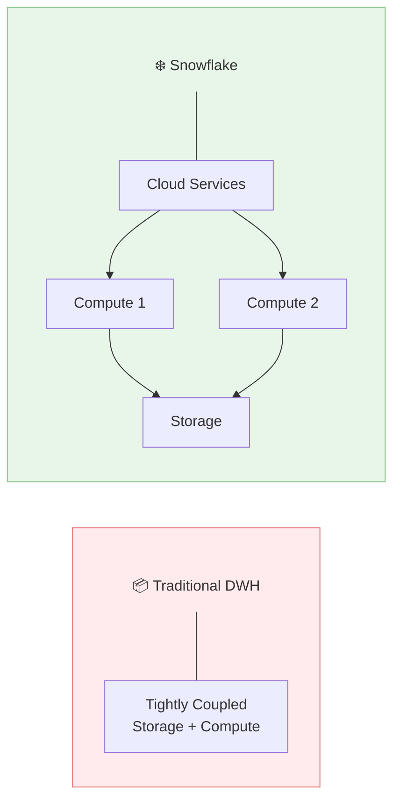
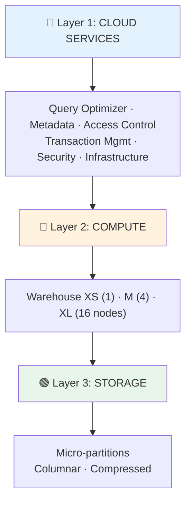
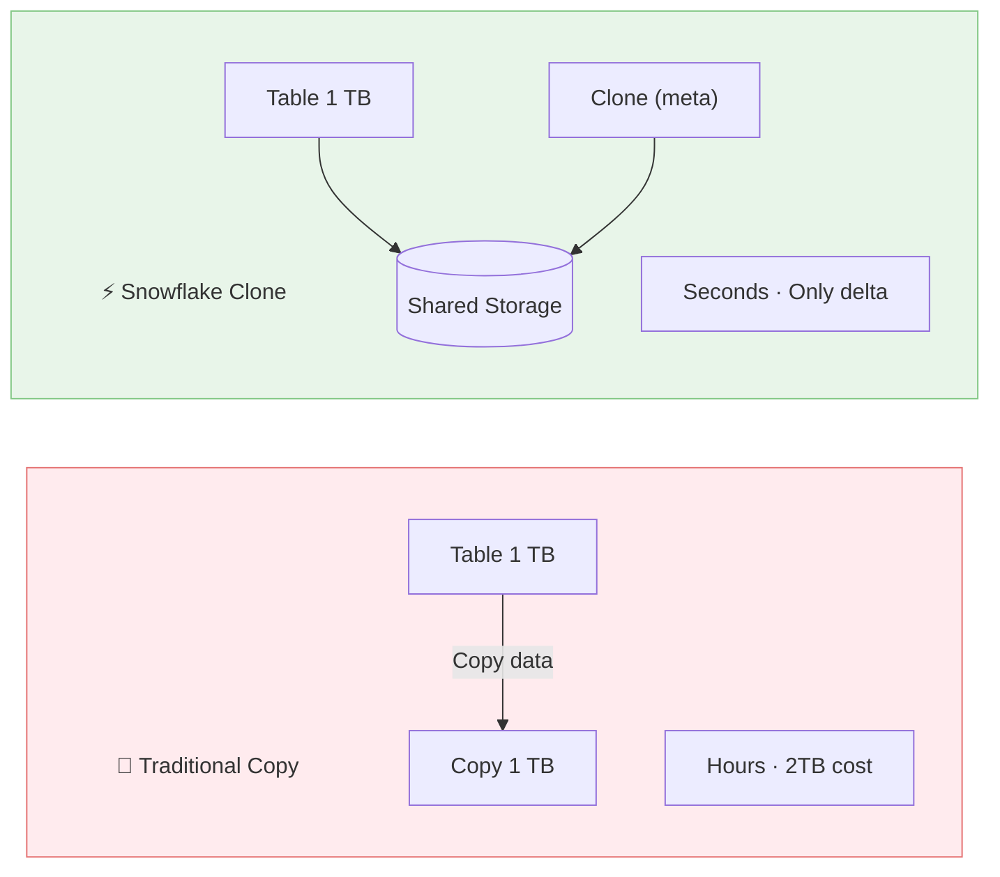

# ❄️ Snowflake Platform Deep Dive

> The Data Cloud - Cloud-Native Data Warehouse & Platform

---

## 📋 Mục Lục

1. [Tổng Quan](#-tổng-quan)
2. [Core Architecture](#-core-architecture)
3. [Services & Features](#-services--features)
4. [So Sánh Với Open Source](#-so-sánh-với-open-source)
5. [Pricing Model](#-pricing-model)
6. [Khi Nào Nên Dùng](#-khi-nào-nên-dùng)

---

## 🎯 Tổng Quan

### Company Background

```
Founded: 2012
IPO: 2020 (largest software IPO ever)
Market Cap: ~$60B (2024)
Employees: 7,000+

Key Innovations:
- Separation of storage and compute
- Multi-cluster shared data architecture
- Zero-copy cloning
- Time travel
- Data sharing
- Snowpark
```

### Platform Philosophy



---

## 🏗️ Core Architecture

### Three-Layer Architecture



### Micro-Partitions

```
                    MICRO-PARTITIONS

Traditional Partitioning:
+--------+--------+--------+--------+
| Jan    | Feb    | Mar    | Apr    |
| Data   | Data   | Data   | Data   |
+--------+--------+--------+--------+
User must define partition key

Snowflake Micro-Partitions:
+--+--+--+--+--+--+--+--+--+--+--+--+
|μP|μP|μP|μP|μP|μP|μP|μP|μP|μP|μP|μP|
+--+--+--+--+--+--+--+--+--+--+--+--+
Each micro-partition:
- 50-500 MB compressed
- Automatic clustering
- Column statistics stored
- Used for pruning

Benefits:
- No partition management
- Automatic optimization
- Fine-grained pruning
```

### Query Processing

```
                    QUERY EXECUTION FLOW

1. Query Submitted
   +------------------+
   | SELECT * FROM t  |
   | WHERE date > X   |
   +--------+---------+
            |
            v
2. Cloud Services Layer
   +------------------+
   | Parse & Optimize |
   | Check permissions|
   | Generate plan    |
   +--------+---------+
            |
            v
3. Metadata Check
   +------------------+
   | Which micro-     |
   | partitions?      |
   | Prune 95% data   |
   +--------+---------+
            |
            v
4. Virtual Warehouse
   +------------------+
   | Execute on nodes |
   | Local SSD cache  |
   | Return results   |
   +------------------+
```

---

## 🔧 Services & Features

### 1. Virtual Warehouses

```
Warehouse Sizes:
```

| Size | Credits/hr | Servers | Use Case |
|------|------------|---------|----------|
| X-Small | 1 | 1 node | Dev/Test |
| Small | 2 | 2 nodes | Light BI |
| Medium | 4 | 4 nodes | Standard |
| Large | 8 | 8 nodes | Heavy |
| X-Large | 16 | 16 nodes | Very Heavy |
| 2XL | 32 | 32 nodes | Massive |
| 6XL | 512 | 512 nodes | Extreme |

```

Multi-cluster Warehouses:
+------------------------------------------+
|           Multi-cluster Warehouse         |
|  +--------+  +--------+  +--------+      |
|  |Cluster1|  |Cluster2|  |Cluster3|      |
|  +--------+  +--------+  +--------+      |
|                                          |
|  Auto-scale based on query queue         |
|  Economy mode: Minimize clusters         |
|  Standard mode: Minimize queue time      |
+------------------------------------------+
```

### 2. Time Travel & Fail-safe

```
                    DATA PROTECTION

Point in Time:
Day 0    Day 1    Day 2    ...    Day 90
  |        |        |               |
  +--------+--------+---------------+
           Time Travel (1-90 days)
                                    |
                                    +--------+
                                    Fail-safe
                                    (7 days)
                                    Snowflake
                                    internal only

Use Cases:
- Query historical data: SELECT * AT (TIMESTAMP => ...)
- Restore dropped table: UNDROP TABLE
- Clone point-in-time: CREATE TABLE CLONE ... AT (...)
```

### 3. Zero-Copy Cloning



### 4. Data Sharing


**Sharing Types:**
1. Direct Share (same region)
2. Listing (Marketplace)
3. Data Exchange (private)

**Use Cases:**
- Share with customers
- Data monetization
- Cross-org collaboration

### 5. Snowpark

```
                    SNOWPARK

Traditional:
Python/Scala code → Extract data → Process locally → Load back

Snowpark:
Python/Scala code → Runs inside Snowflake → No data movement

+--------------------------------------------------+
|                   Snowflake                       |
|  +--------------------------------------------+  |
|  |              Snowpark                       |  |
|  |  +--------+  +--------+  +--------+        |  |
|  |  | Python |  | Scala  |  | Java   |        |  |
|  |  +--------+  +--------+  +--------+        |  |
|  |                                            |  |
|  |  - DataFrame API (like Pandas/Spark)       |  |
|  |  - UDFs (User Defined Functions)           |  |
|  |  - Stored Procedures                       |  |
|  |  - ML training inside Snowflake            |  |
|  +--------------------------------------------+  |
+--------------------------------------------------+

Example:
from snowflake.snowpark import Session
from snowflake.snowpark.functions import col

df = session.table("sales")
result = df.filter(col("amount") > 100).group_by("region").sum("amount")
result.write.save_as_table("regional_sales")
```

### 6. Streams & Tasks

```
CDC với Streams:
+--------+     +--------+     +--------+
| Source | --> | Stream | --> | Target |
| Table  |     |(Changes)|    | Table  |
+--------+     +--------+     +--------+

CREATE STREAM sales_stream ON TABLE sales;
-- Stream captures INSERT, UPDATE, DELETE

Orchestration với Tasks:
+--------+     +--------+     +--------+
| Task A | --> | Task B | --> | Task C |
| (root) |     | (child)|     | (child)|
+--------+     +--------+     +--------+

CREATE TASK process_sales
  WAREHOUSE = compute_wh
  SCHEDULE = '1 minute'
AS
  MERGE INTO target USING sales_stream ...
```

### 7. Iceberg Tables (Preview)

```
Native Iceberg Support:
+------------------------------------------+
|              Snowflake                    |
|  +------------------------------------+  |
|  |     Iceberg Tables (External)      |  |
|  |     - Read Iceberg from S3         |  |
|  |     - Query with Snowflake         |  |
|  |     - Interop with Spark           |  |
|  +------------------------------------+  |
+------------------------------------------+
            |
            v
+------------------------------------------+
|         External Iceberg Data            |
|         (S3, managed elsewhere)          |
+------------------------------------------+

Benefit: Use Snowflake as query engine
for Iceberg tables managed by Spark/Flink
```

### 8. Cortex AI

```
                    SNOWFLAKE CORTEX

Built-in AI Functions:
+------------------------------------------+
|  CORTEX.COMPLETE()  - LLM completion     |
|  CORTEX.SUMMARIZE() - Text summarization |
|  CORTEX.SENTIMENT() - Sentiment analysis |
|  CORTEX.TRANSLATE() - Translation        |
|  CORTEX.EMBED()     - Embeddings         |
+------------------------------------------+

Example:
SELECT 
    review_text,
    CORTEX.SENTIMENT(review_text) as sentiment,
    CORTEX.SUMMARIZE(review_text) as summary
FROM customer_reviews;

ML Functions:
- Forecasting
- Anomaly detection  
- Classification
- Regression
```

---

## ⚖️ So Sánh Với Open Source

### Snowflake vs Self-Managed Stack

| Snowflake | Open Source |
|-----------|-------------|
| Virtual Warehouse | Trino/Spark cluster |
| Storage | S3 + Hive Metastore |
| Time Travel | Iceberg/Delta Lake |
| Data Sharing | Custom solution |
| Security | Ranger/Custom |
| Streams | Kafka + CDC |
| Tasks | Airflow |
| Snowpark | Spark |

### Feature Comparison

| Feature | Snowflake | OSS Stack |
|---------|-----------|----------|
| Zero management | ✅ | ❌ |
| Separation storage/compute | ✅ | Partial |
| Auto-scaling | ✅ | Manual |
| Time travel | ✅ (native) | Via Iceberg |
| Zero-copy clone | ✅ | Via Iceberg |
| Data sharing | ✅ (native) | Complex |
| Semi-structured (JSON) | ✅ (native) | Varies |
| SQL performance | ✅ | Depends |
| ML integration | ✅ (Cortex) | Separate |
| Governance | ✅ | Custom |

### When OSS Wins

```
1. Cost at Scale
   - Very large scale (PB+) with predictable workloads
   - Snowflake credits add up

2. Custom Requirements
   - Need specific processing logic
   - Unique security requirements

3. Multi-engine Needs
   - Spark + Flink + other engines
   - Snowflake is primarily SQL

4. Avoiding Lock-in
   - Want portability
   - Multi-cloud without Snowflake regions
```

---

## 💰 Pricing Model

### Credit-Based Pricing

```
1 Credit ≈ 1 hour of X-Small warehouse

Credit Prices (approximate 2025):
+------------------+------------+
| Edition          | $/Credit   |
+------------------+------------+
| Standard         | $2.00      |
| Enterprise       | $3.00      |
| Business Critical| $4.00      |
+------------------+------------+

Plus: Storage ($23/TB/month compressed)
Plus: Data Transfer (egress fees)
```

### Warehouse Credit Consumption

```
+--------+----------------+
| Size   | Credits/Hour   |
+--------+----------------+
| X-Small| 1              |
| Small  | 2              |
| Medium | 4              |
| Large  | 8              |
| X-Large| 16             |
| 2XL    | 32             |
| 3XL    | 64             |
| 4XL    | 128            |
+--------+----------------+

Note: Minimum 60-second billing
Auto-suspend saves credits
```

### Cost Optimization Tips

```
1. Right-size warehouses
   - Monitor query times
   - Smaller is often enough

2. Auto-suspend aggressively
   - 1-5 minutes for dev
   - 5-15 minutes for BI

3. Multi-cluster for concurrency
   - Not bigger warehouses

4. Use result caching
   - Free within 24 hours

5. Cluster keys for large tables
   - Reduces scan time

6. Monitor with Resource Monitors
   - Set credit limits
   - Alerts before overrun
```

### Example Monthly Cost

```
Scenario: Mid-size analytics team

Compute:
- BI dashboards (Medium, 8hr/day)
  = 4 credits × 8hr × 22 days = 704 credits

- Ad-hoc queries (Small, 4hr/day)
  = 2 credits × 4hr × 22 days = 176 credits

- ETL jobs (Large, 2hr/day)
  = 8 credits × 2hr × 22 days = 352 credits

Total Credits: 1,232 credits

At Enterprise ($3/credit):
Compute: $3,696/month

Storage (10 TB compressed):
Storage: $230/month

Total: ~$3,926/month
```

---

## ✅ Khi Nào Nên Dùng

### Ideal Use Cases

```
✅ SQL-centric workloads
✅ BI and reporting
✅ Data sharing requirements
✅ Variable/unpredictable workloads
✅ Multi-cloud strategy
✅ Minimal ops team
✅ Semi-structured data (JSON, Parquet)
✅ Need instant scale-up
```

### When to Consider Alternatives

```
❌ Heavy ML/Python workloads → Databricks
❌ Real-time streaming → Kafka/Flink
❌ Very tight budget → Self-managed
❌ Complex transformations → Spark
❌ Graph analytics → Neo4j, Neptune
❌ Simple OLTP → PostgreSQL, MySQL
```

### Comparison Decision Matrix

```
                    | Snowflake | Databricks | BigQuery
--------------------+-----------+------------+----------
SQL Analytics       | ⭐⭐⭐⭐⭐    | ⭐⭐⭐       | ⭐⭐⭐⭐⭐
ML/Python           | ⭐⭐⭐       | ⭐⭐⭐⭐⭐    | ⭐⭐⭐
Streaming           | ⭐⭐         | ⭐⭐⭐⭐     | ⭐⭐⭐
Ease of Use         | ⭐⭐⭐⭐⭐    | ⭐⭐⭐⭐     | ⭐⭐⭐⭐
Cost (small scale)  | ⭐⭐⭐⭐     | ⭐⭐⭐       | ⭐⭐⭐⭐⭐
Cost (large scale)  | ⭐⭐⭐       | ⭐⭐⭐⭐     | ⭐⭐⭐
Governance          | ⭐⭐⭐⭐⭐    | ⭐⭐⭐⭐     | ⭐⭐⭐⭐
Multi-cloud         | ⭐⭐⭐⭐⭐    | ⭐⭐⭐⭐     | ⭐⭐
```

---

## 🔗 Liên Kết

- [Databricks](01_Databricks.md)
- [Google Cloud Data](./03_Google_Cloud.md)
- [AWS Data Services](./04_AWS_Data.md)
- [Fundamentals: Data Warehousing](03_Data_Warehousing_Concepts.md)

---

*Cập nhật: February 2026*
