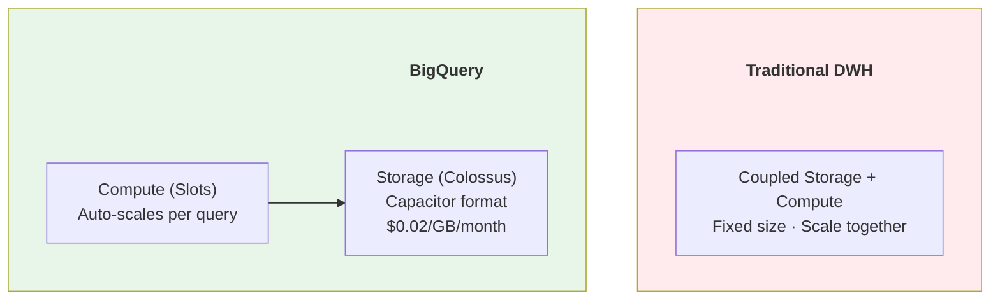
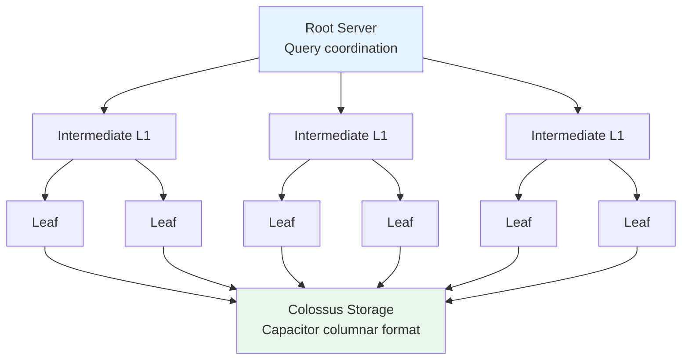
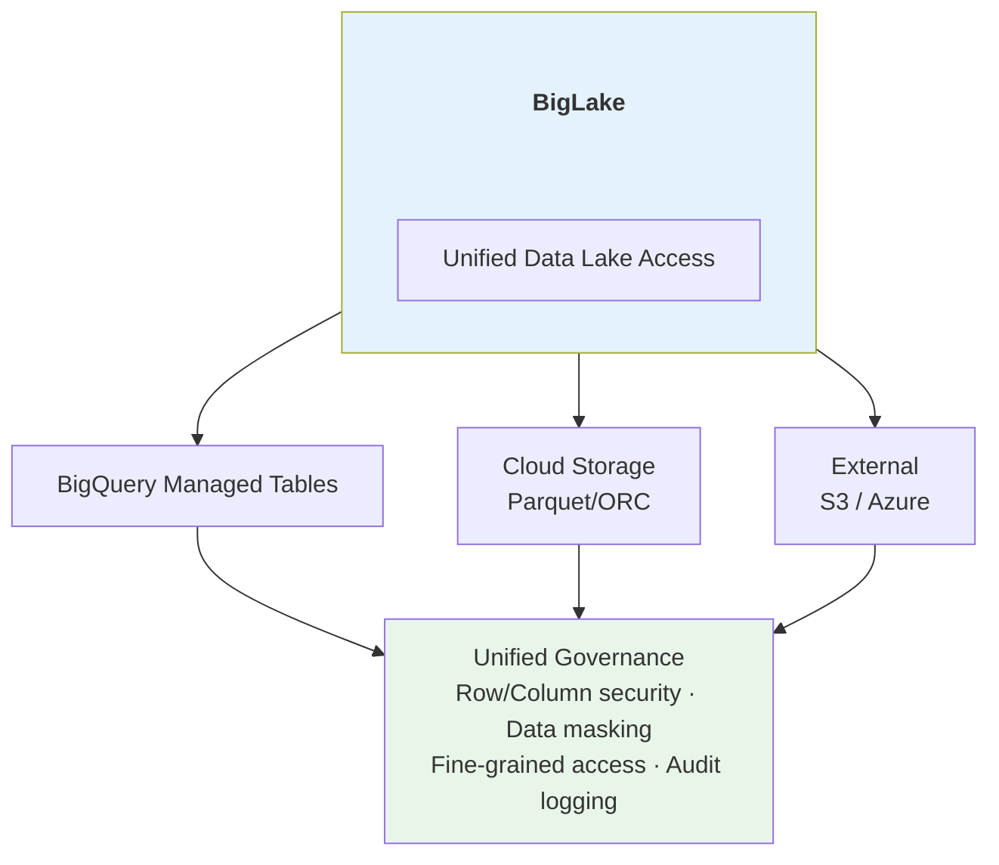

# 🔷 Google BigQuery Deep Dive

> Serverless, Highly Scalable Data Warehouse - The Pioneer of Separation of Storage and Compute

---

## 📋 Mục Lục

1. [Tổng Quan](#-tổng-quan)
2. [Kiến Trúc Chi Tiết](#-kiến-trúc-chi-tiết)
3. [Core Features](#-core-features)
4. [BigQuery ML](#-bigquery-ml)
5. [BigLake](#-biglake)
6. [Hands-on Examples](#-hands-on-examples)
7. [Pricing Model](#-pricing-model)
8. [Best Practices](#-best-practices)
9. [So Sánh Với Các Platform Khác](#-so-sánh-với-các-platform-khác)

---

## 🎯 Tổng Quan

### Company Background

```
Service: Google Cloud Platform
Launched: 2010 (Public 2012)
Type: Serverless Data Warehouse

Key Innovations:
- First true serverless data warehouse
- Dremel engine (columnar, distributed)
- Separation of storage and compute
- Slot-based compute model
- Streaming inserts + batch
```

### Platform Philosophy



---

## 🏗️ Kiến Trúc Chi Tiết

### Dremel Engine



**Features:**
- Tree-based query distribution
- Columnar scanning
- In-situ processing (no data movement)
- Shuffle with distributed memory

### Storage Architecture

```
                    STORAGE LAYERS

+----------------------------------------------------------+
|                    BigQuery Datasets                      |
|  +------------------+  +------------------+               |
|  | Dataset A        |  | Dataset B        |               |
|  | +------------+   |  | +------------+   |               |
|  | | Table 1    |   |  | | Table 1    |   |               |
|  | | Table 2    |   |  | | Table 2    |   |               |
|  | +------------+   |  | +------------+   |               |
|  +------------------+  +------------------+               |
+----------------------------------------------------------+
                           |
                           v
+----------------------------------------------------------+
|                    Capacitor Format                       |
|                                                          |
|  Column-oriented storage with:                           |
|  - Dictionary encoding                                   |
|  - Run-length encoding                                   |
|  - Delta encoding                                        |
|  - Nested/repeated fields (STRUCT, ARRAY)               |
+----------------------------------------------------------+
                           |
                           v
+----------------------------------------------------------+
|                    Colossus (GFS)                         |
|                                                          |
|  - Distributed file system                               |
|  - Triple replication                                    |
|  - Erasure coding                                        |
|  - Automatic sharding                                    |
+----------------------------------------------------------+
```

### Query Execution

```
                    QUERY LIFECYCLE

1. Query Submission
   Client ──► BigQuery API ──► Query Planner

2. Query Planning
   +------------------+
   | Parse SQL        |
   +--------+---------+
            |
   +--------v---------+
   | Semantic Analysis|
   | (Schema lookup)  |
   +--------+---------+
            |
   +--------v---------+
   | Query Optimizer  |
   | (Cost-based)     |
   +--------+---------+
            |
   +--------v---------+
   | Execution Plan   |
   | (DAG of stages)  |
   +------------------+

3. Slot Allocation
   Query ──► Slot Scheduler ──► Available Slots

4. Distributed Execution
   Slots process in parallel across Dremel tree

5. Result Assembly
   Leaf ──► Intermediate ──► Root ──► Client
```

---

## 🔧 Core Features

### 1. Partitioning & Clustering

```
                    PARTITIONING

Time-unit Partitioning:
+----------------------------------------------------------+
| sales_data                                                |
| PARTITION BY DATE(transaction_time)                       |
|                                                          |
| +------------+ +------------+ +------------+ +----------+ |
| | 2024-01-01 | | 2024-01-02 | | 2024-01-03 | |   ...    | |
| | Partition  | | Partition  | | Partition  | |          | |
| +------------+ +------------+ +------------+ +----------+ |
+----------------------------------------------------------+

Integer Range Partitioning:
+----------------------------------------------------------+
| user_events                                               |
| PARTITION BY RANGE_BUCKET(user_id, GENERATE_ARRAY(0,100)) |
|                                                          |
| +------------+ +------------+ +------------+ +----------+ |
| | 0-100      | | 100-200    | | 200-300    | |   ...    | |
| +------------+ +------------+ +------------+ +----------+ |
+----------------------------------------------------------+

                    CLUSTERING

+----------------------------------------------------------+
| sales_data                                                |
| CLUSTER BY region, product_category                       |
|                                                          |
| Within each partition:                                   |
| +------------------------------------------------------+ |
| | region=APAC, category=Electronics | sorted together  | |
| | region=APAC, category=Fashion     | sorted together  | |
| | region=EU, category=Electronics   | sorted together  | |
| +------------------------------------------------------+ |
+----------------------------------------------------------+

Benefits:
- Query pruning (read less data)
- Co-located data for joins
- Auto-reclustering (managed)
```

### 2. Materialized Views

```sql
-- Create materialized view
CREATE MATERIALIZED VIEW my_dataset.sales_summary
PARTITION BY sale_date
CLUSTER BY region
OPTIONS (
  enable_refresh = true,
  refresh_interval_minutes = 30
)
AS
SELECT
  DATE(sale_time) AS sale_date,
  region,
  product_category,
  COUNT(*) AS transaction_count,
  SUM(amount) AS total_sales,
  AVG(amount) AS avg_sale
FROM my_dataset.sales
GROUP BY 1, 2, 3;

-- Automatic query rewriting
-- Original query:
SELECT region, SUM(amount) FROM sales GROUP BY region;

-- BigQuery automatically rewrites to:
SELECT region, SUM(total_sales) FROM sales_summary GROUP BY region;
```

### 3. Streaming Inserts

```
                    STREAMING ARCHITECTURE

+----------------------------------------------------------+
|                   Streaming Buffer                        |
|                                                          |
|  +------------+  +------------+  +------------+          |
|  | Stream 1   |  | Stream 2   |  | Stream N   |          |
|  | (in-mem)   |  | (in-mem)   |  | (in-mem)   |          |
|  +-----+------+  +-----+------+  +-----+------+          |
|        |               |               |                  |
|        +-------+-------+-------+-------+                  |
|                |                                          |
|        +-------v-------+                                  |
|        | Background    |                                  |
|        | Consolidation |                                  |
|        | (every few    |                                  |
|        |  minutes)     |                                  |
|        +-------+-------+                                  |
|                |                                          |
|        +-------v-------+                                  |
|        | Columnar      |                                  |
|        | Storage       |                                  |
|        +---------------+                                  |
+----------------------------------------------------------+

Insert modes:
- insertAll API (streaming, ~$0.01/200MB)
- LOAD job (batch, free)
- Storage Write API (streaming, lower cost)
```

### 4. Time Travel & Snapshots

```sql
-- Query data from 1 hour ago
SELECT * FROM my_dataset.my_table
FOR SYSTEM_TIME AS OF TIMESTAMP_SUB(CURRENT_TIMESTAMP(), INTERVAL 1 HOUR);

-- Query data at specific timestamp
SELECT * FROM my_dataset.my_table
FOR SYSTEM_TIME AS OF '2024-01-15 10:00:00 UTC';

-- Create snapshot (for longer retention)
CREATE SNAPSHOT TABLE my_dataset.my_table_snapshot
CLONE my_dataset.my_table
FOR SYSTEM_TIME AS OF '2024-01-15 10:00:00 UTC';

-- Default time travel window: 7 days
-- Can extend to 7 days (max)
ALTER TABLE my_dataset.my_table
SET OPTIONS (max_time_travel_hours = 168);
```

---

## 🤖 BigQuery ML

### Supported Models

```
                    BQML MODEL TYPES

+----------------------------------------------------------+
| Supervised Learning                                       |
| +------------------------+  +---------------------------+ |
| | LINEAR_REG            |  | LOGISTIC_REG              | |
| | BOOSTED_TREE_REGRESSOR|  | BOOSTED_TREE_CLASSIFIER   | |
| | DNN_REGRESSOR         |  | DNN_CLASSIFIER            | |
| | AUTOML_REGRESSOR      |  | AUTOML_CLASSIFIER         | |
| +------------------------+  +---------------------------+ |
+----------------------------------------------------------+
| Unsupervised Learning                                     |
| +------------------------+  +---------------------------+ |
| | KMEANS                |  | PCA                       | |
| | AUTOENCODER           |  | MATRIX_FACTORIZATION      | |
| +------------------------+  +---------------------------+ |
+----------------------------------------------------------+
| Time Series                                               |
| +------------------------+                                |
| | ARIMA_PLUS            |                                |
| | (AutoML forecasting)  |                                |
| +------------------------+                                |
+----------------------------------------------------------+
| Deep Learning (Vertex AI)                                 |
| +------------------------+  +---------------------------+ |
| | TensorFlow            |  | PyTorch (import)          | |
| | (custom models)       |  |                           | |
| +------------------------+  +---------------------------+ |
+----------------------------------------------------------+
```

### BQML Example

```sql
-- 1. Create training data view
CREATE OR REPLACE VIEW my_dataset.training_data AS
SELECT
  user_id,
  total_purchases,
  avg_order_value,
  days_since_last_purchase,
  page_views_30d,
  IF(purchased_next_30d, 1, 0) AS label
FROM my_dataset.user_features;

-- 2. Train model
CREATE OR REPLACE MODEL my_dataset.purchase_prediction
OPTIONS (
  model_type = 'BOOSTED_TREE_CLASSIFIER',
  input_label_cols = ['label'],
  data_split_method = 'AUTO_SPLIT',
  num_parallel_tree = 50,
  max_iterations = 100
) AS
SELECT * FROM my_dataset.training_data;

-- 3. Evaluate model
SELECT * FROM ML.EVALUATE(MODEL my_dataset.purchase_prediction);

-- 4. Feature importance
SELECT * FROM ML.FEATURE_IMPORTANCE(MODEL my_dataset.purchase_prediction);

-- 5. Predict
SELECT
  user_id,
  predicted_label,
  predicted_label_probs
FROM ML.PREDICT(
  MODEL my_dataset.purchase_prediction,
  (SELECT * FROM my_dataset.scoring_data)
);

-- 6. Export to Vertex AI
EXPORT MODEL my_dataset.purchase_prediction
OPTIONS (uri = 'gs://my-bucket/models/purchase_prediction/');
```

---

## 🌊 BigLake

### Architecture



### BigLake Tables

```sql
-- Create BigLake table on Cloud Storage
CREATE EXTERNAL TABLE my_dataset.external_events
WITH CONNECTION `project.region.connection_id`
OPTIONS (
  format = 'PARQUET',
  uris = ['gs://my-bucket/events/*.parquet'],
  hive_partition_uri_prefix = 'gs://my-bucket/events/',
  require_hive_partition_filter = true
);

-- Apply row-level security
CREATE ROW ACCESS POLICY region_filter
ON my_dataset.external_events
GRANT TO ('user:analyst@company.com')
FILTER USING (region = 'US');

-- Apply column-level security (data masking)
ALTER TABLE my_dataset.external_events
ALTER COLUMN email
SET DATA TYPE STRING
OPTIONS (
  description = 'User email - masked for non-admins'
);

CREATE FUNCTION my_dataset.mask_email(email STRING)
RETURNS STRING
AS (
  CASE
    WHEN SESSION_USER() IN ('admin@company.com')
    THEN email
    ELSE CONCAT(SUBSTR(email, 1, 2), '***@***.com')
  END
);
```

### Iceberg Support

```sql
-- Create BigLake table backed by Iceberg
CREATE EXTERNAL TABLE my_dataset.iceberg_table
WITH CONNECTION `project.region.connection_id`
OPTIONS (
  format = 'ICEBERG',
  uris = ['gs://my-bucket/iceberg/table/']
);

-- Iceberg features available:
-- - Time travel
-- - Schema evolution
-- - Hidden partitioning
-- - Snapshot isolation
```

---

## 💻 Hands-on Examples

### Query Patterns

```sql
-- Window functions
SELECT
  user_id,
  transaction_date,
  amount,
  SUM(amount) OVER (
    PARTITION BY user_id
    ORDER BY transaction_date
    ROWS BETWEEN UNBOUNDED PRECEDING AND CURRENT ROW
  ) AS running_total,
  AVG(amount) OVER (
    PARTITION BY user_id
    ORDER BY transaction_date
    ROWS BETWEEN 6 PRECEDING AND CURRENT ROW
  ) AS rolling_7d_avg
FROM transactions;

-- ARRAY and STRUCT operations
SELECT
  user_id,
  ARRAY_AGG(STRUCT(product_id, quantity, price)) AS order_items,
  ARRAY_LENGTH(ARRAY_AGG(product_id)) AS item_count
FROM order_details
GROUP BY user_id;

-- Unnesting arrays
SELECT
  user_id,
  item.product_id,
  item.quantity
FROM orders,
UNNEST(order_items) AS item;

-- Approximate aggregations (faster, efficient)
SELECT
  region,
  APPROX_COUNT_DISTINCT(user_id) AS unique_users,
  APPROX_QUANTILES(amount, 100)[OFFSET(50)] AS median_amount
FROM transactions
GROUP BY region;
```

### Python Client

```python
from google.cloud import bigquery
import pandas as pd

# Initialize client
client = bigquery.Client(project='my-project')

# Run query
query = """
SELECT
    DATE(event_time) AS event_date,
    event_type,
    COUNT(*) AS event_count
FROM `my-project.my_dataset.events`
WHERE event_time >= TIMESTAMP_SUB(CURRENT_TIMESTAMP(), INTERVAL 7 DAY)
GROUP BY 1, 2
ORDER BY 1, 2
"""

# To DataFrame
df = client.query(query).to_dataframe()

# Load data to BigQuery
job_config = bigquery.LoadJobConfig(
    source_format=bigquery.SourceFormat.PARQUET,
    write_disposition=bigquery.WriteDisposition.WRITE_APPEND,
)

load_job = client.load_table_from_uri(
    'gs://my-bucket/data/*.parquet',
    'my-project.my_dataset.my_table',
    job_config=job_config
)
load_job.result()  # Wait for completion

# Streaming insert
rows_to_insert = [
    {"user_id": "u1", "event": "click", "timestamp": "2024-01-15T10:00:00"},
    {"user_id": "u2", "event": "view", "timestamp": "2024-01-15T10:00:01"},
]
errors = client.insert_rows_json('my-project.my_dataset.events', rows_to_insert)
```

### dbt Integration

```yaml
# profiles.yml
my_project:
  target: dev
  outputs:
    dev:
      type: bigquery
      method: oauth
      project: my-gcp-project
      dataset: my_dataset
      location: US
      threads: 4
      timeout_seconds: 300

# models/staging/stg_orders.sql
{{ config(
    materialized='incremental',
    partition_by={
      "field": "order_date",
      "data_type": "date",
      "granularity": "day"
    },
    cluster_by=["customer_id", "product_category"]
) }}

SELECT
    order_id,
    customer_id,
    DATE(order_timestamp) AS order_date,
    product_category,
    amount
FROM {{ source('raw', 'orders') }}

WHERE order_timestamp > (SELECT MAX(order_timestamp) FROM {{ this }})

```

---

## 💰 Pricing Model

### Compute Pricing

```
                    PRICING OPTIONS

1. On-Demand Pricing:
   +--------------------------------------------------+
   | Pay per query (bytes scanned)                    |
   | $6.25 per TB (US multi-region)                   |
   | First 1 TB/month FREE                            |
   +--------------------------------------------------+
   Best for: Sporadic queries, development

2. Capacity Pricing (Editions):
   +--------------------------------------------------+
   | Standard Edition:   $0.04/slot-hour              |
   | Enterprise Edition: $0.06/slot-hour              |
   | Enterprise Plus:    $0.10/slot-hour              |
   +--------------------------------------------------+
   
   Autoscaling:
   - Baseline slots (always on)
   - Autoscale slots (burst capacity)
   - Max slots (cap)
   
   Commitments:
   - Flex: No commitment, per-second billing
   - Monthly: ~20% discount
   - Annual: ~40% discount

3. Storage Pricing:
   +--------------------------------------------------+
   | Active storage:    $0.02/GB/month                |
   | Long-term storage: $0.01/GB/month (90+ days)     |
   | (Auto-transition, no access pattern change)      |
   +--------------------------------------------------+
```

### Cost Optimization

```
Strategies:

1. Partition + Cluster
   - Reduce bytes scanned
   - Auto-reclustering (no maintenance)

2. Materialized Views
   - Pre-computed results
   - Automatic refresh
   - Query rewriting

3. BI Engine
   - In-memory acceleration
   - $0.0416/GB-hour
   - Up to 100GB per project

4. Slot Reservations
   - Predictable cost
   - Better for heavy workloads
   - Autoscaling for peaks

5. Query Best Practices
   - SELECT only needed columns
   - Use LIMIT for exploration
   - Avoid SELECT *
   - Use approximate functions
```

### Example Cost Calculation

```
Scenario: Analytics Team (Medium)

On-Demand:
- 50 TB scanned/month
- Cost: 50 × $6.25 = $312.50/month

Capacity (Standard Edition):
- Baseline: 100 slots
- Autoscale max: 200 slots
- Usage: 720 hours × 150 avg slots
- Cost: 720 × 150 × $0.04 = $4,320/month

Recommendation:
- < 50 TB/month → On-demand
- > 50 TB/month → Consider capacity
- Unpredictable → On-demand + budget alerts
- Heavy, predictable → Capacity + commitments
```

---

## ✅ Best Practices

### Schema Design

```
1. Use STRUCT for related fields:
   user: STRUCT<
     id STRING,
     name STRING,
     email STRING,
     address STRUCT<city STRING, country STRING>
   >

2. Use ARRAY for repeated data:
   tags: ARRAY<STRING>
   order_items: ARRAY<STRUCT<product_id STRING, qty INT64>>

3. Denormalize when possible:
   - Fewer JOINs = faster queries
   - Storage is cheap
   - But balance with update patterns

4. Use appropriate types:
   - TIMESTAMP for time (not STRING)
   - INT64 for integers
   - NUMERIC for exact decimals
   - Use partitioning column type carefully
```

### Query Optimization

```sql
-- 1. Partition filter (required for large tables)
SELECT * FROM events
WHERE event_date = '2024-01-15'  -- Partition prune

-- 2. Cluster filter
SELECT * FROM events
WHERE event_date = '2024-01-15'
AND user_id = 'u123'  -- Cluster prune

-- 3. Avoid expensive operations
-- Bad:
SELECT * FROM events
WHERE DATE(event_timestamp) = '2024-01-15'  -- No partition prune!

-- Good:
SELECT * FROM events
WHERE event_timestamp >= '2024-01-15'
AND event_timestamp < '2024-01-16'

-- 4. Use TABLESAMPLE for exploration
SELECT * FROM large_table
TABLESAMPLE SYSTEM (1 PERCENT)
```

### Data Ingestion

```
+----------------------------------------------------------+
| Method           | Latency    | Cost      | Best For     |
+------------------+------------+-----------+--------------+
| Load Job         | Minutes    | Free      | Batch ETL    |
| Streaming Insert | Seconds    | $0.01/200MB| Real-time   |
| Storage Write API| Seconds    | 1/2 streaming| High volume|
| BigQuery DTS     | Minutes    | Free      | SaaS sources |
| Dataflow         | Seconds    | Compute   | Complex ETL  |
+----------------------------------------------------------+
```

---

## ⚖️ So Sánh Với Các Platform Khác

```
Feature                  | BigQuery | Snowflake | Redshift | Databricks
-------------------------+----------+-----------+----------+-----------
Serverless               | ✅ Full  | ✅ Full   | ⚠️ Partial| ⚠️ Partial
Separation stor/compute  | ✅       | ✅        | ⚠️ RA3    | ✅
Streaming ingestion      | ✅       | ⚠️Snowpipe| ⚠️        | ✅ Spark
ML built-in              | ✅ BQML  | ✅ Snowpark| ✅ RS ML  | ✅ MLlib
Semi-structured          | ✅ Native| ✅ VARIANT | ⚠️ JSON   | ✅
Multi-cloud              | ❌ GCP   | ✅        | ❌ AWS    | ✅
Open format support      | ✅ BigLake| ⚠️ Iceberg| ⚠️ Spectrum| ✅
Pricing model            | Slots/TB | Credits   | Nodes    | DBUs
```

---

## 🔗 Liên Kết

- [Databricks](01_Databricks.md)
- [Snowflake](02_Snowflake.md)
- [AWS Redshift](04_Redshift.md)
- [Azure Synapse](05_Azure_Synapse.md)
- [Tools: Apache Spark](../tools/06_Apache_Spark_Complete_Guide.md)

---

*Cập nhật: January 2025*
