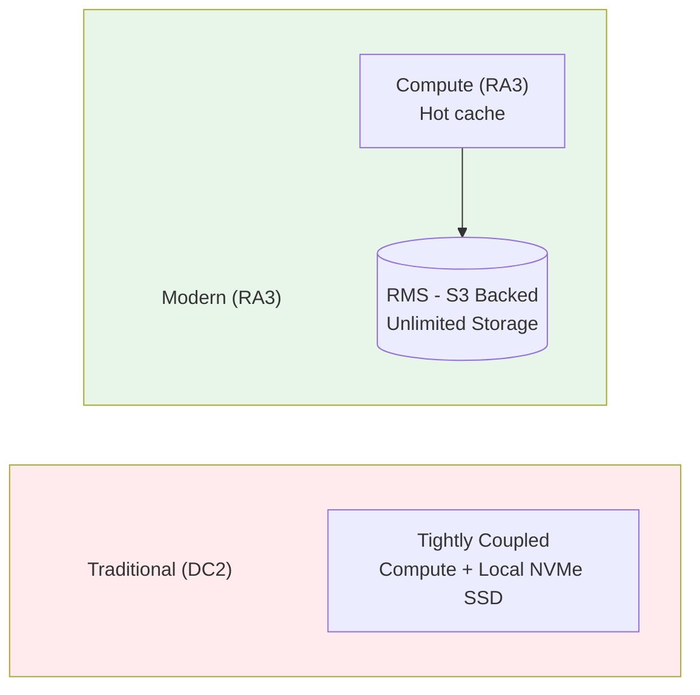
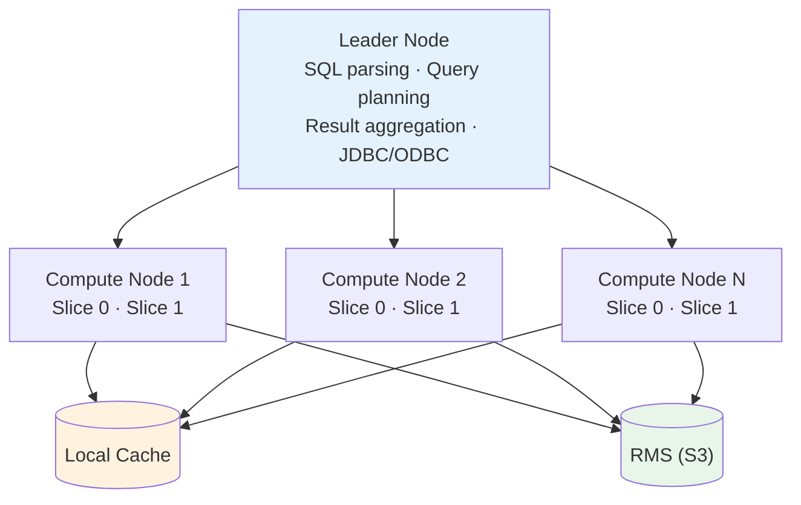

# 🔶 AWS Redshift Deep Dive

> Cloud Data Warehouse - Massively Parallel Processing for Analytics at Scale

---

## 📋 Mục Lục

1. [Tổng Quan](#-tổng-quan)
2. [Kiến Trúc Chi Tiết](#-kiến-trúc-chi-tiết)
3. [Node Types & Clusters](#-node-types--clusters)
4. [Core Features](#-core-features)
5. [Redshift Spectrum](#-redshift-spectrum)
6. [Redshift Serverless](#-redshift-serverless)
7. [Hands-on Examples](#-hands-on-examples)
8. [Performance Tuning](#-performance-tuning)
9. [Pricing Model](#-pricing-model)

---

## 🎯 Tổng Quan

### Service Background

```
Service: Amazon Web Services
Launched: 2012
Type: Managed Data Warehouse (MPP)

Key Innovations:
- Based on ParAccel (PostgreSQL fork)
- Columnar storage
- Massive parallel processing
- RA3 nodes (managed storage)
- Redshift Serverless (2022)
- Zero-ETL integrations (2023)
```

### Architecture Philosophy



---

## 🏗️ Kiến Trúc Chi Tiết

### Cluster Architecture



### Data Distribution

```
                    DISTRIBUTION STYLES

1. AUTO (Default - Recommended):
   Redshift chooses optimal distribution

2. KEY Distribution:
   Rows with same key → Same slice
   Best for: Join columns, high cardinality

3. ALL Distribution:
   Full copy on every node
   Best for: Small dimension tables (<2M rows)

4. EVEN Distribution:
   Round-robin across slices
   Best for: Staging tables, no clear key
```

### Sort Keys

```
1. COMPOUND Sort Key:
   - Order: col1, then col2, then col3
   - Effective for filters starting with col1

2. INTERLEAVED Sort Key:
   - Equal weight to all columns
   - Higher VACUUM cost

3. AUTO (Recommended):
   - Redshift chooses and maintains automatically
```

---

## 🔧 Node Types & Clusters

### Node Comparison

**DC2 (Dense Compute) - Legacy:**

| Node Type | vCPUs | Memory | Storage |
|-----------|-------|--------|--------|
| dc2.large | 2 | 15 GB | 160 GB |
| dc2.8xlarge | 32 | 244 GB | 2.56 TB |

**RA3 (Managed Storage) - Recommended:**

| Node Type | vCPUs | Memory | RMS |
|-----------|-------|--------|-----|
| ra3.xlplus | 4 | 32 GB | 32 TB |
| ra3.4xlarge | 12 | 96 GB | 128 TB |
| ra3.16xlarge | 48 | 384 GB | 128 TB |

**Serverless:** Auto-scaling RPU (8-512), $0.36/RPU-hour, Scales to 0 when idle

---

## 🔧 Core Features

### 1. Workload Management (WLM)

```sql
-- Query routing by user/group
SET query_group TO 'bi_queries';
SELECT * FROM sales;
RESET query_group;
```

### 2. Concurrency Scaling

```
- Auto-provision burst clusters
- 1 hour free credits/day
- Transparent to users
```

### 3. Data Sharing

```sql
-- Producer
CREATE DATASHARE sales_share;
ALTER DATASHARE sales_share ADD TABLE public.sales;
GRANT USAGE ON DATASHARE sales_share TO ACCOUNT '123456789012';

-- Consumer
CREATE DATABASE sales_db FROM DATASHARE sales_share
OF ACCOUNT '111122223333';
```

### 4. Materialized Views

```sql
CREATE MATERIALIZED VIEW daily_sales_mv
SORTKEY(sale_date)
AUTO REFRESH YES
AS
SELECT
    DATE(sale_timestamp) AS sale_date,
    region,
    SUM(amount) AS total_sales
FROM orders
GROUP BY 1, 2;
```

---

## 🌊 Redshift Spectrum

```sql
-- Create external schema
CREATE EXTERNAL SCHEMA spectrum_schema
FROM DATA CATALOG
DATABASE 'my_glue_database'
IAM_ROLE 'arn:aws:iam::123456789012:role/SpectrumRole';

-- Query S3 data
SELECT * FROM spectrum_schema.events
WHERE event_date >= '2024-01-01';
```

---

## ⚡ Redshift Serverless

```
Features:
- No cluster management
- Pay per RPU-second
- Auto-scales 8-512 RPU
- Scales to 0 when idle

When to use:
✅ Variable workloads
✅ Development/testing
✅ Zero management wanted
```

---

## 💻 Hands-on Examples

```sql
-- Create optimized table
CREATE TABLE sales (
    sale_id BIGINT IDENTITY(1,1),
    customer_id VARCHAR(50),
    sale_date DATE,
    amount DECIMAL(18,2)
)
DISTSTYLE KEY DISTKEY(customer_id)
SORTKEY(sale_date);

-- COPY from S3
COPY sales FROM 's3://bucket/sales/'
IAM_ROLE 'arn:aws:iam::123456789012:role/RedshiftRole'
FORMAT AS PARQUET;

-- UNLOAD to S3
UNLOAD ('SELECT * FROM sales')
TO 's3://bucket/export/'
IAM_ROLE 'arn:aws:iam::123456789012:role/RedshiftRole'
FORMAT PARQUET PARTITION BY (sale_date);
```

---

## ⚡ Performance Tuning

```sql
-- Analyze statistics
ANALYZE sales;

-- Vacuum (reclaim space, resort)
VACUUM sales;

-- Check query plan
EXPLAIN SELECT * FROM sales WHERE region = 'US';
```

### Best Practices

```
1. Distribution Keys: Use frequently joined columns
2. Sort Keys: Filter columns, use AUTO
3. Compression: Let COPY auto-choose
4. Data Loading: Use COPY, not INSERT
5. Maintenance: Enable auto vacuum/analyze
```

---

## 💰 Pricing Model

```
Provisioned On-Demand:
- dc2.large: $0.25/hour
- ra3.xlplus: $1.086/hour
- ra3.4xlarge: $3.26/hour
- RMS Storage: $0.024/GB/month

Reserved (1-3 years): 25-75% savings

Serverless:
- $0.36/RPU-hour
- Storage: $0.024/GB/month

Spectrum: $5/TB scanned
```

---

## 🔗 Liên Kết

- [Databricks](01_Databricks.md)
- [Snowflake](02_Snowflake.md)
- [Google BigQuery](03_BigQuery.md)
- [Azure Synapse](05_Azure_Synapse.md)

---

*Cập nhật: January 2025*
