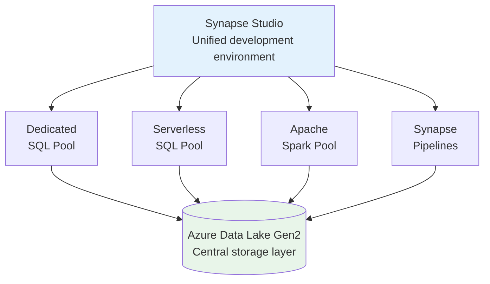
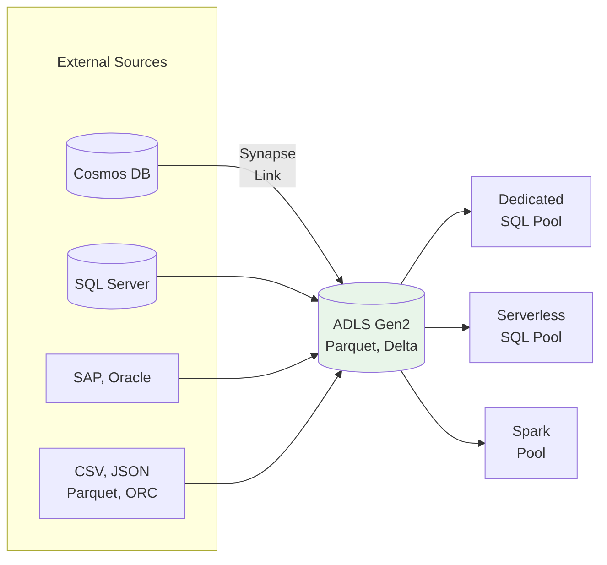
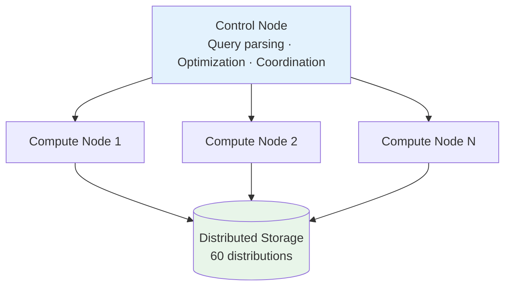
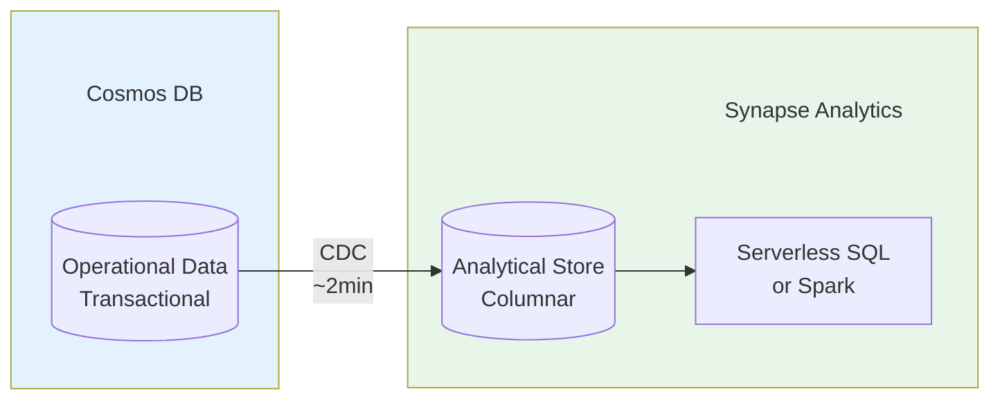

# 🔷 Azure Synapse Analytics Deep Dive

> Unified Analytics Platform - Data Warehouse + Big Data + Data Integration

---

## 📋 Mục Lục

1. [Tổng Quan](#-tổng-quan)
2. [Kiến Trúc Chi Tiết](#-kiến-trúc-chi-tiết)
3. [SQL Pools](#-sql-pools)
4. [Spark Pools](#-spark-pools)
5. [Data Integration](#-data-integration)
6. [Hands-on Examples](#-hands-on-examples)
7. [Pricing Model](#-pricing-model)

---

## 🎯 Tổng Quan

### Service Background

```
Service: Microsoft Azure
Launched: 2019 (GA 2020)
Type: Unified Analytics Service

Key Innovations:
- Unified workspace (SQL + Spark + Pipelines)
- Dedicated SQL pools (former SQL DW)
- Serverless SQL pools
- Synapse Link (CDC to analytics)
- Azure Purview integration
```

### Platform Architecture



---

## 🏗️ Kiến Trúc Chi Tiết

### Synapse Components

```
1. Synapse Studio
   - Web-based IDE
   - SQL editor + notebooks
   - Pipeline designer
   - Data explorer

2. SQL Pools
   - Dedicated: Provisioned MPP warehouse
   - Serverless: Query data lake directly

3. Spark Pools
   - Managed Apache Spark
   - Auto-scale nodes
   - .NET for Spark support

4. Pipelines
   - Data Factory integration
   - ETL/ELT orchestration
   - 90+ connectors

5. Synapse Link
   - Near real-time sync
   - Cosmos DB → Analytics
   - Dataverse → Analytics
```

### Storage Integration



---

## 🔧 SQL Pools

### Dedicated SQL Pool



**DWU (Data Warehouse Units):**

| DWU Level | Compute Nodes | Memory | Price/hr |
|-----------|---------------|--------|----------|
| DW100c | 1 | 60 GB | ~$1.20 |
| DW500c | 1 | 300 GB | ~$6.00 |
| DW1000c | 2 | 600 GB | ~$12.00 |
| DW6000c | 12 | 3.6 TB | ~$72.00 |
| DW30000c | 60 | 18 TB | ~$360.00 |

### Serverless SQL Pool

```
Features:
- Query ADLS directly (no data loading)
- Pay per TB scanned ($5/TB)
- Supports Parquet, CSV, JSON, Delta
- Automatic scaling
- No provisioning needed

Best for:
✅ Ad-hoc exploration
✅ Data lake querying
✅ Logical data warehouse
✅ Cost-effective BI
```

### SQL Examples

```sql
-- Dedicated Pool: Create distributed table
CREATE TABLE sales (
    sale_id INT NOT NULL,
    customer_id INT,
    sale_date DATE,
    amount DECIMAL(18,2)
)
WITH (
    DISTRIBUTION = HASH(customer_id),
    CLUSTERED COLUMNSTORE INDEX,
    PARTITION (sale_date RANGE RIGHT FOR VALUES
        ('2024-01-01', '2024-02-01', '2024-03-01'))
);

-- Serverless Pool: Query data lake
SELECT
    customer_id,
    SUM(amount) AS total_spend
FROM OPENROWSET(
    BULK 'https://storage.dfs.core.windows.net/container/sales/*.parquet',
    FORMAT = 'PARQUET'
) AS sales
GROUP BY customer_id;

-- Query Delta Lake
SELECT * FROM OPENROWSET(
    BULK 'https://storage.dfs.core.windows.net/container/delta_table/',
    FORMAT = 'DELTA'
) AS delta_data;

-- Create external table (logical view)
CREATE EXTERNAL TABLE ext_sales (
    sale_id INT,
    customer_id INT,
    sale_date DATE,
    amount DECIMAL(18,2)
)
WITH (
    LOCATION = 'sales/',
    DATA_SOURCE = my_data_source,
    FILE_FORMAT = ParquetFormat
);
```

---

## ⚡ Spark Pools

### Configuration

**Spark Pool Sizes:**

| Node Size | Cores | Memory | Use Case |
|-----------|-------|--------|----------|
| Small | 4 | 32 GB | Development, light ETL |
| Medium | 8 | 64 GB | Standard workloads |
| Large | 16 | 128 GB | Heavy processing |
| XLarge | 32 | 256 GB | ML training |
| XXLarge | 64 | 432 GB | Largest workloads |

**Features:**
- Auto-scale (3-200 nodes)
- Auto-pause (idle timeout)
- Package management
- Delta Lake support
- Spark 3.x

### Spark Examples

```python
# Read from ADLS
df = spark.read.parquet(
    "abfss://container@storage.dfs.core.windows.net/sales/"
)

# Transform
from pyspark.sql.functions import col, sum, avg

result = df \
    .filter(col("sale_date") >= "2024-01-01") \
    .groupBy("customer_id") \
    .agg(
        sum("amount").alias("total_spend"),
        avg("amount").alias("avg_order")
    )

# Write to Delta Lake
result.write \
    .format("delta") \
    .mode("overwrite") \
    .save("abfss://container@storage.dfs.core.windows.net/gold/customer_summary/")

# Read from Dedicated SQL Pool
df_sql = spark.read \
    .synapsesql("dedicated_pool.dbo.customers")

# Write to SQL Pool
result.write \
    .synapsesql("dedicated_pool.dbo.customer_summary", 
                Constants.INTERNAL)
```

---

## 🔄 Data Integration

### Synapse Pipelines

```
Features:
- Based on Azure Data Factory
- 90+ connectors
- Copy activity (data movement)
- Data flows (visual ETL)
- Mapping data flows
- Wrangling data flows
```

### Synapse Link



**Benefits:**
- No ETL required
- Near real-time (< 2 min latency)
- No impact on transactional workload
- Cost-effective analytics

---

## 💻 Hands-on Examples

### End-to-End Pipeline

```python
# Notebook: Bronze to Silver
from pyspark.sql.functions import *
from delta.tables import DeltaTable

# Read raw data
bronze_df = spark.read.json(
    "abfss://raw@storage.dfs.core.windows.net/events/"
)

# Clean and transform
silver_df = bronze_df \
    .withColumn("event_date", to_date("event_timestamp")) \
    .withColumn("load_time", current_timestamp()) \
    .filter(col("user_id").isNotNull()) \
    .dropDuplicates(["event_id"])

# Write as Delta (merge/upsert)
delta_path = "abfss://curated@storage.dfs.core.windows.net/events/"

if DeltaTable.isDeltaTable(spark, delta_path):
    delta_table = DeltaTable.forPath(spark, delta_path)
    delta_table.alias("target").merge(
        silver_df.alias("source"),
        "target.event_id = source.event_id"
    ).whenMatchedUpdateAll() \
     .whenNotMatchedInsertAll() \
     .execute()
else:
    silver_df.write.format("delta").save(delta_path)
```

### Serverless SQL for BI

```sql
-- Create database for logical warehouse
CREATE DATABASE analytics;
GO

-- Create credential
CREATE DATABASE SCOPED CREDENTIAL storage_cred
WITH IDENTITY = 'Managed Identity';

-- Create data source
CREATE EXTERNAL DATA SOURCE my_data_lake
WITH (
    LOCATION = 'https://storage.dfs.core.windows.net/curated',
    CREDENTIAL = storage_cred
);

-- Create view for BI tools
CREATE VIEW vw_daily_sales AS
SELECT
    sale_date,
    product_category,
    SUM(amount) AS revenue,
    COUNT(*) AS order_count
FROM OPENROWSET(
    BULK 'sales/*.parquet',
    DATA_SOURCE = 'my_data_lake',
    FORMAT = 'PARQUET'
) AS sales
GROUP BY sale_date, product_category;
```

---

## 💰 Pricing Model

### Pricing Components

```
Dedicated SQL Pool:
+----------------------------------------------------------+
| Compute (DWU-hours)                                      |
| - DW100c: ~$1.20/hour                                   |
| - DW1000c: ~$12.00/hour                                 |
| - Can pause when not in use                             |
|                                                          |
| Storage: $0.0135/GB/month                               |
+----------------------------------------------------------+

Serverless SQL Pool:
+----------------------------------------------------------+
| $5.00 per TB processed                                   |
| - First 1 TB/month free                                 |
| - Budget controls available                             |
+----------------------------------------------------------+

Spark Pool:
+----------------------------------------------------------+
| Node-hours (based on node size)                          |
| - Small: ~$0.22/hour                                    |
| - Medium: ~$0.44/hour                                   |
| - Large: ~$0.88/hour                                    |
| - Auto-pause reduces cost                               |
+----------------------------------------------------------+

Pipelines:
+----------------------------------------------------------+
| - Activity runs: $1.00 per 1000 runs                    |
| - Data movement: $0.25/DIU-hour                         |
| - Data flow: $0.27/vCore-hour                           |
+----------------------------------------------------------+
```

### Cost Optimization

```
1. Pause Dedicated Pool when idle
   - No compute cost while paused
   - Storage only

2. Use Serverless for ad-hoc queries
   - Pay per query
   - No provisioning

3. Auto-pause Spark Pools
   - Configure idle timeout
   - Scale to 0

4. Optimize data formats
   - Use Parquet (columnar)
   - Partition by query patterns

5. Result caching
   - Enabled by default
   - Reduces query costs
```

---

## 🔗 Liên Kết

- [Databricks](01_Databricks.md)
- [Snowflake](02_Snowflake.md)
- [Google BigQuery](03_BigQuery.md)
- [AWS Redshift](04_Redshift.md)
- [Tools: Apache Spark](../tools/06_Apache_Spark_Complete_Guide.md)

---

*Cập nhật: January 2025*
