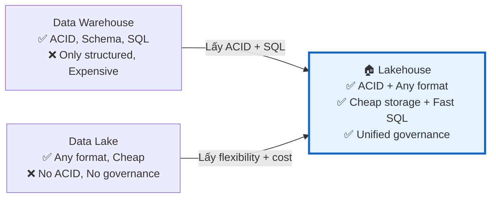
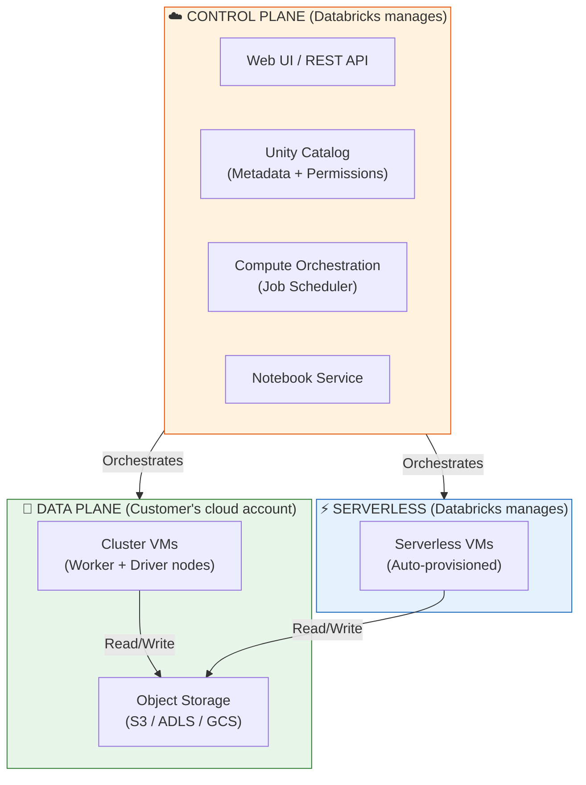

# §1 DATABRICKS INTELLIGENCE PLATFORM — Lakehouse Architecture & Compute

> **Exam Weight:** 10% (~4-5 câu) | **Difficulty:** Dễ-Trung bình
> **Exam Guide Sub-topics:** Value Proposition, Compute Selection, Platform Architecture

---

## TL;DR

**Databricks Data Intelligence Platform** = Lakehouse platform kết hợp ưu điểm Data Lake (lưu mọi format, giá rẻ) + Data Warehouse (ACID, schema, BI performance) trên một engine duy nhất, được quản lý bởi Unity Catalog.

---

## Nền Tảng Lý Thuyết

### Tại sao cần Lakehouse? — Bài toán lịch sử

Trước Lakehouse, thế giới data chia làm 2 trường phái:

**Data Warehouse (DWH)** — ví dụ: Oracle, Teradata, Redshift
- ✅ ACID transactions (dữ liệu luôn chính xác)
- ✅ Schema enforcement (cấu trúc rõ ràng)
- ✅ SQL performance cao (index, materialized views)
- ❌ Chỉ lưu structured data (bảng, cột)
- ❌ **Đắt** — storage + compute gắn liền, scale = mua thêm license
- ❌ Không hỗ trợ ML/AI workloads

**Data Lake** — ví dụ: HDFS, S3
- ✅ Lưu mọi loại data (JSON, CSV, Parquet, images, video)
- ✅ **Rẻ** — object storage giá $0.023/GB/tháng
- ✅ Schema-on-read (đọc lúc nào, schema lúc đó)
- ❌ Không có ACID → data corruption, inconsistency
- ❌ Không có governance → "data swamp" (ai cũng đổ data vào, không ai quản lý)
- ❌ BI performance kém (full scan mỗi query)

**Lakehouse** — "Best of Both Worlds":



**Databricks Lakehouse cụ thể hoạt động như thế nào?**
1. **Storage:** Data lưu trên S3/ADLS/GCS dưới dạng **Parquet files** (rẻ như Data Lake)
2. **ACID Layer:** **Delta Lake** thêm Transaction Log lên Parquet → biến thành bảng có ACID
3. **Compute:** **Spark + Photon** engine xử lý data (nhanh như DWH)
4. **Governance:** **Unity Catalog** quản lý permissions, lineage, audit (tốt hơn DWH)

→ Kết quả: Bạn có storage rẻ của Data Lake + tính năng enterprise của DWH + khả năng chạy ML/AI.

### Databricks Architecture — Control Plane vs Data Plane

Hiểu kiến trúc này là **nền tảng** cho mọi kiến thức Databricks:



**Giải thích đơn giản:**
- **Control Plane** = "bộ não" — Databricks hosted, chạy UI, scheduler, metadata. Bạn KHÔNG quản lý.
- **Data Plane** = "cơ bắp" — VMs chạy trong cloud account CỦA BẠN. Data cũng nằm trong storage CỦA BẠN.
- **Serverless** = "cơ bắp thuê ngoài" — VMs do Databricks quản lý, bạn chỉ trả $/giờ chạy.

**Tại sao cần phân biệt?** Vì nó ảnh hưởng đến:
- **Security:** Data lưu ở Data Plane = customer sở hữu → không bị vendor lock-in storage.
- **Networking:** Classic Compute = customer VPC (tùy chỉnh network). Serverless = Databricks VPC (ít control).
- **Cost:** Control Plane = free. Data Plane = customer trả cloud bill + DBU.

---

## So Sánh Với Open Source

| Databricks Component | OSS Equivalent | Khác biệt chính |
|----------------------|---------------|-----------------|
| Databricks Runtime (DBR) | Apache Spark | DBR = Spark + Photon (C++ engine) + optimizations riêng |
| SQL Warehouse | Hive / Presto / Trino | SQL Warehouse = Serverless, Photon-powered, auto-scale |
| Unity Catalog | Apache Ranger + Hive Metastore | UC = unified governance + 3-level namespace + lineage |
| Lakeflow Jobs | Apache Airflow | Native DAG orchestration, serverless, nhưng lock-in |
| Databricks Notebooks | Jupyter Notebook | Multi-language cells (Python + SQL + Scala + R), collaboration |
| Delta Lake | Apache Iceberg / Hudi | ACID + Time Travel + Liquid Clustering + UniForm |

---

## Cú Pháp / Keywords Cốt Lõi

### Compute Types — Khi Nào Dùng Cái Nào?

Đây là phần đề thi hỏi **rất trực tiếp**: cho scenario, chọn compute đúng.

| Compute Type | Boot Time | Ai manage? | Use Case | DBU Rate |
|-------------|-----------|-----------|----------|----------|
| **All-Purpose Cluster** | 3-5 phút | Customer | Dev, exploration, ad-hoc | Cao nhất |
| **Job Cluster** | 3-5 phút | Auto-create/terminate | Scheduled ETL (production) | Trung bình |
| **SQL Warehouse (Classic)** | 1-3 phút | Databricks | BI queries, dashboards | ~$0.22/DBU |
| **SQL Warehouse (Serverless)** | 2-5 giây | Databricks | Bursty BI, zero-config | ~$0.70/DBU |
| **Serverless Compute** | 2-5 giây | Databricks | Notebooks + Jobs, zero-config | Premium |

**Cách nhớ:**
- **Dev/test** = All-Purpose (cần interactive, restart nhanh)
- **Production ETL** = Job Cluster (tự tạo → chạy → tự xóa = tiết kiệm)
- **BI/SQL** = SQL Warehouse (optimized cho SQL)
- **"Tôi không muốn manage gì hết"** = Serverless

### Serverless Compute — Supported Languages

```
✅ Supported: Python, SQL
❌ NOT Supported: R, Scala, Java
```

**Tại sao?** Serverless chạy trên JVM-free container runtime. R cần cài R runtime, Scala/Java cần JVM compilation — cả hai đều làm chậm cold start. Databricks chọn chỉ hỗ trợ Python + SQL để boot < 5 giây.

> 🚨 **ExamTopics Q180:** Đề hỏi "Which languages are supported by Serverless compute?" → Đáp án: **SQL + Python** (chọn 2). R, Scala, Java đều SAI.

---

## Use Case Trong Thực Tế

### Scenario-Based Decision Table

| Scenario | Compute đúng | Logic |
|----------|-------------|-------|
| DE viết notebook thử nghiệm | All-Purpose Cluster | Cần interactive, restart nhanh, iterate |
| Chạy ETL pipeline lúc 2AM hàng đêm | **Job Cluster** | Tự tạo → chạy → tự terminate = chỉ trả $ lúc chạy |
| 50 analysts chạy SQL dashboard sáng thứ 2 | **SQL Warehouse** (scale) | Multi-cluster scaling cho concurrent queries |
| SLA 99.9% + team không có DevOps | **Serverless** | Zero-config, auto-optimize, Databricks lo hết |
| Team nhỏ, query burst lúc sáng, idle trưa-tối | **Serverless SQL Warehouse** | Boot 2s, auto-stop khi idle |

> 🚨 **ExamTopics Q192:** Migrate to Serverless → bước đầu tiên = **low frequency BI + adhoc SQL** (đáp án D), KHÔNG phải Python ETL pipeline. Logic: bắt đầu từ workload ít risk nhất.

> 🚨 **ExamTopics Q191:** SLA cao + minimal ops overhead → **Serverless** (đáp án D). Logic: Serverless = Databricks manage mọi thứ.

---

## Cạm Bẫy Trong Đề Thi (Exam Traps)

### Trap 1: Control Plane vs Data Plane
- **Đáp án nhiễu:** "Virtual Machines nằm trong Control Plane" → **SAI**. VMs = Data Plane.
- **Đúng:** Control Plane = Unity Catalog + Compute Orchestration (ExamTopics Q74).
- **Cách nhớ:** Control Plane = "bộ não" (UI, scheduler, metadata). Data Plane = "cơ bắp" (VMs, storage). Bộ não KHÔNG chạy data.

### Trap 2: Serverless = hỗ trợ mọi ngôn ngữ
- **Đáp án nhiễu:** "Serverless hỗ trợ Scala" → **SAI**.
- **Đúng:** Chỉ **Python + SQL** (ExamTopics Q180).
- **Cách nhớ:** Serverless cần boot nhanh → chỉ interpreted languages (Python, SQL). Compiled languages (Scala, Java) = slower.

### Trap 3: Migrate to Serverless → bắt đầu từ đâu?
- **Đáp án nhiễu:** "Bắt đầu từ Python ETL pipeline phức tạp" → **SAI** (risk cao).
- **Đúng:** Bắt đầu từ **low-freq BI + SQL** vì ít risk nhất.
- **Cách nhớ:** Migration = start small, validate, then expand. SQL dashboards = simplest workload.

---

## 🔗 Tham Khảo

- **Deep Dive:** [[01_Databricks#2. KIẾN TRÚC TỔNG THỂ|01_Databricks.md — Section 2: Kiến Trúc Tổng Thể]]
- **Deep Dive:** [[01_Databricks#3. COMPUTE LAYER|01_Databricks.md — Section 3: Compute Layer]]
- **Official Docs:** https://docs.databricks.com/en/getting-started/concepts.html
- **Serverless:** https://docs.databricks.com/en/compute/serverless.html
