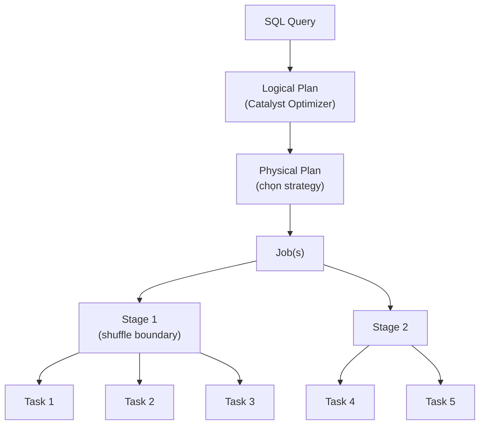

# §4 PERFORMANCE & SPARK UI — Troubleshooting, OOM, SQL Warehouses

> **Exam Weight:** 18% (shared) | **Difficulty:** Trung bình-Khó
> **Exam Guide Sub-topics:** Spark UI analysis, OOM, SQL Warehouse scaling, Alerts

---

## TL;DR

Đề thi kiểm tra khả năng đọc **Spark UI** để phát hiện performance issues, xử lý **OOM** errors, và cấu hình **SQL Warehouse** (scaling, Auto Stop, query scheduling). Cần biết **hành động đúng** cho mỗi triệu chứng.

---

## Nền Tảng Lý Thuyết

### Spark Job Execution — Hiểu Để Debug

Khi bạn chạy 1 Spark query, nó trải qua:



- **Job** = toàn bộ query
- **Stage** = nhóm tasks chạy parallel (chia bởi shuffle — dữ liệu phải di chuyển giữa nodes)
- **Task** = 1 partition data được xử lý bởi 1 core

### CPU Time vs Task Time — Spark UI Metrics

Spark UI hiển thị 2 metrics quan trọng:

| Metric | Meaning |
|--------|---------|
| **CPU Time** | Thời gian CPU thực sự tính toán |
| **Task Time** | Tổng thời gian task chạy (bao gồm wait, I/O, GC) |

```text
High CPU/Task ratio (e.g., 90%):
  CPU bận 90% thời gian → Cluster đang CPU-bound
  → Cần UPSIZE cluster hoặc tune executor/cores

Low CPU/Task ratio (e.g., 20%):
  CPU chỉ bận 20%, 80% idle/waiting
  → Data không phân bố đều (data skew)
  → Cần REPARTITION data
```

### OOM — Out of Memory Error

```text
"java.lang.OutOfMemoryError: Java heap space"
```

**Nguyên nhân:** JVM hết memory vì:
1. Data quá lớn cho cluster size hiện tại
2. Broadcast join tải toàn bộ table nhỏ vào memory → table "nhỏ" thực ra không nhỏ
3. collect() hoặc toPandas() pull toàn bộ data về driver

**Giải pháp:**

| Action | Hiệu quả | Logic |
|--------|----------|-------|
| ✅ Narrow filters (ít data hơn) | Cao | Giảm data input → giảm memory |
| ✅ Upsize workers + auto shuffle | Cao | Thêm RAM + Spark tự optimize shuffle |
| ❌ Cache dataset | **KHÔNG** | Cache = **dùng THÊM** memory → OOM tệ hơn |
| ❌ Upsize driver + deactivate shuffle | **KHÔNG** | OOM thường ở worker, deactivate shuffle = xấu |
| ❌ Fix shuffle partitions = 50 | **KHÔNG** | 50 partitions quá ít cho big data |

### SQL Warehouse — Cluster Size vs Scaling Range

**2 khái niệm khác nhau:**

```text
Cluster Size (Small → Medium → Large → X-Large):
  = Specs MỖI cluster instance (CPU, RAM)
  → Tăng khi: HEAVY queries (full table scan, complex JOIN)

Scaling Range (Min=1, Max=10):
  = SỐ LƯỢNG cluster instances
  → Tăng khi: MANY concurrent queries (50 analysts cùng lúc)
```

### Auto Stop — Tắt Khi Idle

SQL Warehouse có Auto Stop: tự tắt sau X phút không có query → tiết kiệm $.

### SQL Alerts — Notification Cho Anomalies

Alerts = monitor query results + gửi notification khi threshold vượt:

```text
Query: "SELECT count(*) FROM logs WHERE value IS NULL"
Alert: Khi result > 100 → gửi notification
Destination: Webhook (Slack), Email, PagerDuty
```

---

## Cú Pháp / Keywords Cốt Lõi

### Query Refresh Schedule

```text
Databricks SQL → Query page → Schedule → Set refresh:
• Every 1 day / 12 hours / 1 hour / etc.
• Set end date for schedule (stops after that date)
```

> 🚨 **ExamTopics Q55:** "Schedule query refresh daily" → **"From the query's page in DBSQL"** (đáp án C). KHÔNG phải từ SQL endpoint page.

> 🚨 **ExamTopics Q86:** "Stop query after 1 week" → **"Set refresh schedule to end on a certain date"** (đáp án C).

### SQL Alert Setup

> 🚨 **ExamTopics Q131:** "Notify team via webhook when NULL > 100" → **"Set up Alert with new webhook alert destination"** (đáp án C).

### Jobs UI Navigation

> 🚨 **ExamTopics Q129:** "Why notebook running slowly in Job?" → **"Runs tab → click active run"** (đáp án C).

---

## Cạm Bẫy Trong Đề Thi (Exam Traps)

### Trap 1: Cache KHÔNG fix OOM
- **Logic:** OOM = hết memory. Cache = dùng thêm memory. Thêm lửa vào đám cháy.
- **ExamTopics Q181:** Đáp án đúng = narrow filters + upsize workers (A, B).

### Trap 2: Cluster size vs Scaling range
- Many small queries slow → **tăng scaling range** (more instances cho concurrency).
- KHÔNG phải tăng cluster size (đó cho heavy single queries). ExamTopics Q130, đáp án B.

### Trap 3: CPU high = over-utilized, NOT under-utilized
- "High CPU time vs Task time" = CPU bận → **over-utilized** → upsize.
- "Low CPU time" = CPU idle → **under-utilized** → repartition. ExamTopics Q178, đáp án C.

---

## 🔗 Tham Khảo

- **Deep Dive:** [[01_Databricks#23. WAR STORIES|01_Databricks.md — Section 23]]
- **Deep Dive:** [[01_Databricks#APPENDIX A: SPARK TUNING|01_Databricks.md — Appendix A]]
- **SQL Warehouses:** https://docs.databricks.com/en/compute/sql-warehouse/index.html
