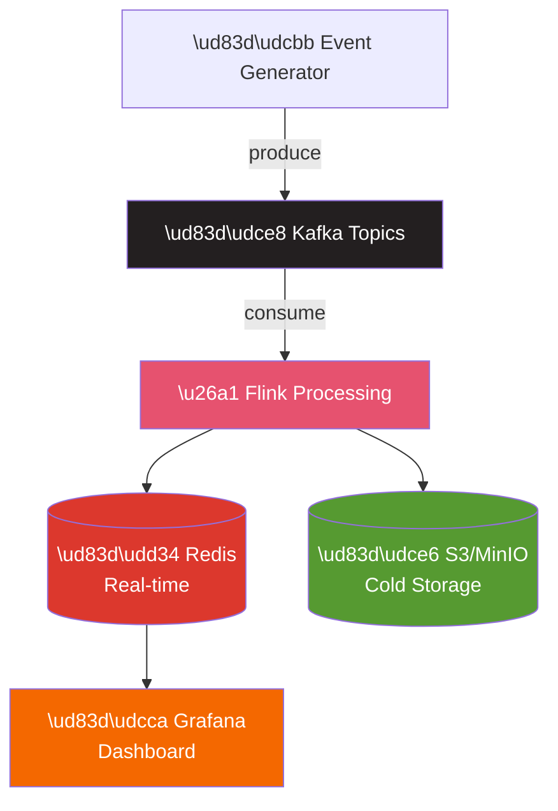

# ⚡ Project 02: Real-time Dashboard

> Build hệ thống analytics real-time với Kafka và streaming

---

## 📋 Project Overview

**Difficulty:** Intermediate
**Time Estimate:** 3-4 weeks
**Skills Learned:** Kafka, Flink/Spark Streaming, Redis, Real-time visualization

### Mục Tiêu

Build một hệ thống theo dõi website metrics real-time: page views, unique visitors, top pages.



> **Update frequency:** Every 10 seconds

---

## 🛠️ Tech Stack

- **Event Generation:** Python (simulates website events)
- **Message Queue:** Apache Kafka
- **Stream Processing:** Apache Flink (or Spark Streaming)
- **Hot Storage:** Redis
- **Cold Storage:** S3/MinIO
- **Visualization:** Grafana
- **Infrastructure:** Docker Compose

---

## 📂 Project Structure

```
realtime-analytics/
├── docker-compose.yml
├── README.md
│
├── event-generator/
│   ├── main.py
│   ├── event_producer.py
│   └── requirements.txt
│
├── flink-jobs/
│   ├── pom.xml (if Java)
│   ├── build.sbt (if Scala)
│   └── src/
│       └── PageViewAggregator.java
│
├── python-processor/
│   ├── main.py
│   ├── stream_processor.py
│   └── requirements.txt
│
├── redis/
│   └── redis.conf
│
└── grafana/
    └── dashboards/
        └── realtime.json
```

---

## 🚀 Step-by-Step Implementation

### Step 1: Setup Kafka Cluster

**docker-compose.yml:**
```yaml
version: '3.8'
services:
  zookeeper:
    image: confluentinc/cp-zookeeper:7.5.0
    environment:
      ZOOKEEPER_CLIENT_PORT: 2181

  kafka:
    image: confluentinc/cp-kafka:7.5.0
    depends_on:
      - zookeeper
    ports:
      - "9092:9092"
    environment:
      KAFKA_BROKER_ID: 1
      KAFKA_ZOOKEEPER_CONNECT: zookeeper:2181
      KAFKA_ADVERTISED_LISTENERS: PLAINTEXT://kafka:29092,PLAINTEXT_HOST://localhost:9092
      KAFKA_LISTENER_SECURITY_PROTOCOL_MAP: PLAINTEXT:PLAINTEXT,PLAINTEXT_HOST:PLAINTEXT
      KAFKA_OFFSETS_TOPIC_REPLICATION_FACTOR: 1

  redis:
    image: redis:7
    ports:
      - "6379:6379"

  minio:
    image: minio/minio
    ports:
      - "9000:9000"
      - "9001:9001"
    environment:
      MINIO_ROOT_USER: minioadmin
      MINIO_ROOT_PASSWORD: minioadmin
    command: server /data --console-address ":9001"

  grafana:
    image: grafana/grafana:latest
    ports:
      - "3000:3000"
```

### Step 2: Event Generator

**event-generator/event_producer.py:**
```python
from kafka import KafkaProducer
import json
import random
import time
from datetime import datetime
import uuid

class EventProducer:
    def __init__(self, bootstrap_servers='localhost:9092'):
        self.producer = KafkaProducer(
            bootstrap_servers=bootstrap_servers,
            value_serializer=lambda v: json.dumps(v).encode('utf-8'),
            key_serializer=lambda k: k.encode('utf-8') if k else None
        )
        
        self.pages = [
            '/home', '/products', '/cart', '/checkout', 
            '/about', '/contact', '/blog', '/pricing'
        ]
        self.countries = ['US', 'UK', 'DE', 'FR', 'JP', 'AU', 'CA', 'BR']
        self.devices = ['mobile', 'desktop', 'tablet']
        self.referrers = ['google', 'facebook', 'twitter', 'direct', 'email']
    
    def generate_event(self):
        """Generate a random page view event."""
        return {
            'event_id': str(uuid.uuid4()),
            'user_id': f'user_{random.randint(1, 10000)}',
            'session_id': f'session_{random.randint(1, 5000)}',
            'timestamp': datetime.utcnow().isoformat(),
            'event_type': 'page_view',
            'page_url': random.choice(self.pages),
            'country': random.choice(self.countries),
            'device': random.choice(self.devices),
            'referrer': random.choice(self.referrers)
        }
    
    def produce_events(self, topic='page_views', events_per_second=100):
        """Produce events at specified rate."""
        print(f"Starting event production: {events_per_second} events/sec")
        
        while True:
            for _ in range(events_per_second):
                event = self.generate_event()
                self.producer.send(
                    topic,
                    key=event['user_id'],
                    value=event
                )
            
            self.producer.flush()
            time.sleep(1)

if __name__ == '__main__':
    producer = EventProducer()
    producer.produce_events()
```

### Step 3: Stream Processing (Python với Faust)

**python-processor/stream_processor.py:**
```python
import faust
from datetime import timedelta
import redis
import json

# Faust app
app = faust.App(
    'realtime-analytics',
    broker='kafka://localhost:9092',
    value_serializer='json'
)

# Redis connection
redis_client = redis.Redis(host='localhost', port=6379, db=0)

# Define the event schema
class PageViewEvent(faust.Record):
    event_id: str
    user_id: str
    session_id: str
    timestamp: str
    event_type: str
    page_url: str
    country: str
    device: str
    referrer: str

# Topics
page_views_topic = app.topic('page_views', value_type=PageViewEvent)

# Tables for windowed aggregations
page_views_per_minute = app.Table(
    'page_views_per_minute',
    default=int,
).tumbling(timedelta(minutes=1), expires=timedelta(hours=1))

unique_visitors = app.Table(
    'unique_visitors',
    default=set,
).tumbling(timedelta(minutes=1), expires=timedelta(hours=1))

@app.agent(page_views_topic)
async def process_page_views(events):
    """Process page view events and update aggregations."""
    async for event in events:
        # Increment page view count
        page_views_per_minute[event.page_url] += 1
        
        # Track unique visitors
        unique_visitors['all'].add(event.user_id)
        unique_visitors[event.country].add(event.user_id)
        
        # Update Redis for real-time dashboard
        await update_redis(event)

async def update_redis(event):
    """Update Redis with real-time metrics."""
    pipe = redis_client.pipeline()
    
    # Increment total page views (10-second window)
    window_key = f"pageviews:10s:{int(time.time()) // 10}"
    pipe.incr(window_key)
    pipe.expire(window_key, 60)  # Keep for 1 minute
    
    # Update top pages
    pipe.zincrby('top_pages', 1, event.page_url)
    
    # Update unique visitors (HyperLogLog)
    pipe.pfadd('unique_visitors:1h', event.user_id)
    
    # By country
    pipe.zincrby('pageviews_by_country', 1, event.country)
    
    pipe.execute()

@app.timer(interval=10.0)
async def publish_metrics():
    """Publish aggregated metrics to Redis every 10 seconds."""
    metrics = {
        'total_page_views': redis_client.get('pageviews:total') or 0,
        'unique_visitors': redis_client.pfcount('unique_visitors:1h'),
        'top_pages': redis_client.zrevrange('top_pages', 0, 9, withscores=True),
        'by_country': redis_client.zrevrange('pageviews_by_country', 0, 9, withscores=True)
    }
    
    redis_client.set('dashboard:metrics', json.dumps(metrics))
    print(f"Published metrics: {metrics}")

if __name__ == '__main__':
    app.main()
```

### Step 4: Redis Data Model

```
Redis Keys:

Real-time Counters (10-second windows):
- pageviews:10s:{timestamp_bucket} -> Integer
- TTL: 60 seconds

Sorted Sets (for rankings):
- top_pages -> ZSET (page_url, count)
- pageviews_by_country -> ZSET (country, count)
- pageviews_by_device -> ZSET (device, count)

HyperLogLog (unique counts):
- unique_visitors:1h -> HLL
- unique_visitors:24h -> HLL

Latest Snapshot:
- dashboard:metrics -> JSON string
```

### Step 5: Grafana Dashboard

**Grafana Data Source: Redis**

Install Redis plugin và configure:
```
URL: redis://redis:6379
```

**Dashboard Panels:**

```
Panel 1: Total Page Views (Stat)
Query: GET dashboard:metrics
JSONPath: $.total_page_views

Panel 2: Unique Visitors (Stat)
Query: PFCOUNT unique_visitors:1h

Panel 3: Top Pages (Bar Chart)
Query: ZREVRANGE top_pages 0 9 WITHSCORES

Panel 4: Views by Country (Pie Chart)
Query: ZREVRANGE pageviews_by_country 0 9 WITHSCORES

Panel 5: Real-time Views (Time Series)
Query: GET pageviews:10s:*
```

---

## ✅ Completion Checklist

### Phase 1: Infrastructure
- [ ] Kafka cluster running
- [ ] Redis accessible
- [ ] MinIO (S3) accessible
- [ ] Grafana accessible

### Phase 2: Event Generation
- [ ] Event generator producing events
- [ ] Events visible in Kafka
- [ ] Rate controllable

### Phase 3: Stream Processing
- [ ] Processor consuming events
- [ ] Aggregations working
- [ ] Redis being updated

### Phase 4: Dashboard
- [ ] Grafana connected to Redis
- [ ] Real-time panels working
- [ ] Auto-refresh configured

### Phase 5: Cold Storage
- [ ] Events archived to S3/MinIO
- [ ] Partitioned by date
- [ ] Queryable with Trino/Athena

---

## 🎯 Learning Outcomes

**After completing:**
- Kafka producer/consumer patterns
- Stream processing concepts
- Windowed aggregations
- Real-time data architecture
- Redis data structures
- HyperLogLog for unique counts
- Grafana real-time dashboards

---

## 🚀 Extensions

**Level Up:**
1. Add conversion tracking (funnel analysis)
2. Implement sessionization
3. Add anomaly detection
4. A/B test tracking
5. Deploy to Kubernetes

---

## 🔗 Liên Kết

- [Previous: ETL Pipeline](01_ETL_Pipeline.md)
- [Next: Data Warehouse](03_Data_Warehouse.md)
- [Tools: Kafka](../tools/05_Apache_Kafka_Complete_Guide.md)

---

## 📦 Verified Resources Cho Project Này

**Docker Images (verified, dùng trong docker-compose.yml):**
- `confluentinc/cp-kafka:7.5.0` — [Docker Hub](https://hub.docker.com/r/confluentinc/cp-kafka)
- `confluentinc/cp-zookeeper:7.5.0` — [Docker Hub](https://hub.docker.com/r/confluentinc/cp-zookeeper)
- `redis:7` — [Docker Hub](https://hub.docker.com/_/redis)
- `minio/minio` — [Docker Hub](https://hub.docker.com/r/minio/minio)
- `grafana/grafana:latest` — [Docker Hub](https://hub.docker.com/r/grafana/grafana)

**Python Libraries:**
- `kafka-python` hoặc `confluent-kafka` — Kafka client
- `faust-streaming` — Stream processing framework (fork của Robinhood's Faust)
- `redis` — Redis client

**Tham khảo thêm:**
- [Confluent Kafka Tutorials](https://developer.confluent.io/tutorials/) — Official tutorials
- [apache/flink](https://github.com/apache/flink) — Nếu muốn dùng Flink thay Faust
- [DataTalksClub/data-engineering-zoomcamp](https://github.com/DataTalksClub/data-engineering-zoomcamp) — Module 6: Kafka streaming

---

*Cập nhật: February 2026*
