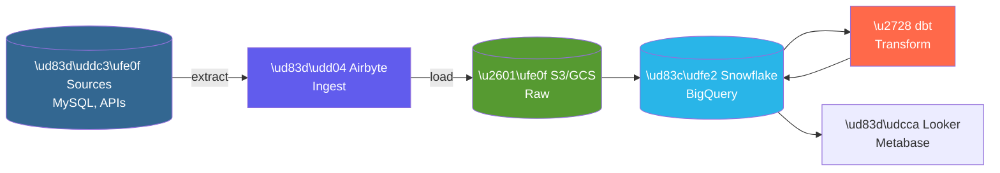

# 🏢 Project 03: Modern Data Warehouse

> Build data warehouse hoàn chỉnh với dbt và cloud data warehouse

---

## 📋 Project Overview

**Difficulty:** Intermediate → Advanced
**Time Estimate:** 4-6 weeks
**Skills Learned:** Data Modeling, dbt, Snowflake/BigQuery, Data Quality, BI

### Mục Tiêu

Build một data warehouse cho e-commerce với dimensional modeling, transformation với dbt, và analytics với BI tool.



> **Layers:** Raw → Staging → Intermediate → Marts

---

## 🛠️ Tech Stack

- **Sources:** MySQL (simulated e-commerce DB)
- **Ingestion:** Airbyte (hoặc Fivetran)
- **Storage:** S3/GCS
- **Warehouse:** Snowflake hoặc BigQuery
- **Transform:** dbt
- **Quality:** dbt tests + Great Expectations
- **BI:** Metabase hoặc Looker
- **Orchestration:** Airflow

---

## 📂 Project Structure

```
ecommerce-warehouse/
├── README.md
├── docker-compose.yml
│
├── source-db/
│   └── init.sql
│
├── airbyte/
│   └── connections/
│
├── dbt_project/
│   ├── dbt_project.yml
│   ├── profiles.yml
│   │
│   ├── models/
│   │   ├── staging/
│   │   │   ├── _staging.yml
│   │   │   ├── stg_orders.sql
│   │   │   ├── stg_customers.sql
│   │   │   ├── stg_products.sql
│   │   │   └── stg_order_items.sql
│   │   │
│   │   ├── intermediate/
│   │   │   ├── int_orders_enriched.sql
│   │   │   └── int_customer_orders.sql
│   │   │
│   │   └── marts/
│   │       ├── finance/
│   │       │   ├── fct_orders.sql
│   │       │   └── dim_customers.sql
│   │       │
│   │       └── marketing/
│   │           ├── customer_ltv.sql
│   │           └── product_performance.sql
│   │
│   ├── tests/
│   │   └── generic/
│   │
│   ├── macros/
│   │   └── generate_schema_name.sql
│   │
│   ├── seeds/
│   │   └── country_codes.csv
│   │
│   └── snapshots/
│       └── scd_customers.sql
│
├── airflow/
│   └── dags/
│       └── dbt_dag.py
│
└── metabase/
    └── dashboards/
```

---

## 🚀 Step-by-Step Implementation

### Step 1: Source Database Setup

**source-db/init.sql:**
```sql
-- Customers table
CREATE TABLE customers (
    customer_id INT PRIMARY KEY AUTO_INCREMENT,
    email VARCHAR(255) UNIQUE NOT NULL,
    first_name VARCHAR(100),
    last_name VARCHAR(100),
    country VARCHAR(2),
    created_at TIMESTAMP DEFAULT CURRENT_TIMESTAMP,
    updated_at TIMESTAMP DEFAULT CURRENT_TIMESTAMP ON UPDATE CURRENT_TIMESTAMP
);

-- Products table
CREATE TABLE products (
    product_id INT PRIMARY KEY AUTO_INCREMENT,
    name VARCHAR(255) NOT NULL,
    category VARCHAR(100),
    price DECIMAL(10, 2),
    cost DECIMAL(10, 2),
    created_at TIMESTAMP DEFAULT CURRENT_TIMESTAMP
);

-- Orders table
CREATE TABLE orders (
    order_id INT PRIMARY KEY AUTO_INCREMENT,
    customer_id INT NOT NULL,
    status ENUM('pending', 'paid', 'shipped', 'delivered', 'cancelled'),
    order_date TIMESTAMP NOT NULL,
    shipped_date TIMESTAMP,
    delivered_date TIMESTAMP,
    total_amount DECIMAL(10, 2),
    FOREIGN KEY (customer_id) REFERENCES customers(customer_id)
);

-- Order items table
CREATE TABLE order_items (
    order_item_id INT PRIMARY KEY AUTO_INCREMENT,
    order_id INT NOT NULL,
    product_id INT NOT NULL,
    quantity INT NOT NULL,
    unit_price DECIMAL(10, 2),
    FOREIGN KEY (order_id) REFERENCES orders(order_id),
    FOREIGN KEY (product_id) REFERENCES products(product_id)
);

-- Sample data
INSERT INTO customers (email, first_name, last_name, country) VALUES
('john@example.com', 'John', 'Doe', 'US'),
('jane@example.com', 'Jane', 'Smith', 'UK');
-- ... more sample data
```

### Step 2: dbt Project Setup

**dbt_project.yml:**
```yaml
name: 'ecommerce_warehouse'
version: '1.0.0'

profile: 'ecommerce'

model-paths: ["models"]
test-paths: ["tests"]
seed-paths: ["seeds"]
macro-paths: ["macros"]
snapshot-paths: ["snapshots"]

clean-targets:
  - "target"
  - "dbt_packages"

models:
  ecommerce_warehouse:
    staging:
      +materialized: view
      +schema: staging
    intermediate:
      +materialized: ephemeral
    marts:
      +materialized: table
      finance:
        +schema: finance
      marketing:
        +schema: marketing
```

### Step 3: Staging Models

**models/staging/stg_orders.sql:**
```sql
WITH source AS (
    SELECT * FROM {{ source('ecommerce', 'orders') }}
),

renamed AS (
    SELECT
        order_id,
        customer_id,
        status AS order_status,
        order_date,
        shipped_date,
        delivered_date,
        total_amount,
        
        -- Derived fields
        CASE 
            WHEN status = 'cancelled' THEN TRUE 
            ELSE FALSE 
        END AS is_cancelled,
        
        CASE
            WHEN status IN ('delivered', 'shipped') THEN TRUE
            ELSE FALSE
        END AS is_completed,
        
        DATEDIFF(day, order_date, delivered_date) AS days_to_deliver,
        
        -- Metadata
        CURRENT_TIMESTAMP() AS loaded_at
        
    FROM source
)

SELECT * FROM renamed
```

**models/staging/_staging.yml:**
```yaml
version: 2

sources:
  - name: ecommerce
    database: raw
    schema: ecommerce
    tables:
      - name: orders
        freshness:
          warn_after: {count: 12, period: hour}
          error_after: {count: 24, period: hour}
        loaded_at_field: _loaded_at
        
      - name: customers
      - name: products
      - name: order_items

models:
  - name: stg_orders
    description: "Staged orders with cleaned fields"
    columns:
      - name: order_id
        description: "Primary key"
        tests:
          - unique
          - not_null
          
      - name: customer_id
        tests:
          - not_null
          - relationships:
              to: ref('stg_customers')
              field: customer_id

      - name: order_status
        tests:
          - accepted_values:
              values: ['pending', 'paid', 'shipped', 'delivered', 'cancelled']
```

### Step 4: Intermediate Models

**models/intermediate/int_orders_enriched.sql:**
```sql
WITH orders AS (
    SELECT * FROM {{ ref('stg_orders') }}
),

customers AS (
    SELECT * FROM {{ ref('stg_customers') }}
),

order_items AS (
    SELECT * FROM {{ ref('stg_order_items') }}
),

order_item_agg AS (
    SELECT
        order_id,
        COUNT(*) AS total_items,
        SUM(quantity) AS total_quantity,
        SUM(unit_price * quantity) AS calculated_total
    FROM order_items
    GROUP BY order_id
),

enriched AS (
    SELECT
        o.order_id,
        o.customer_id,
        c.email AS customer_email,
        c.country AS customer_country,
        o.order_status,
        o.order_date,
        o.is_cancelled,
        o.is_completed,
        o.days_to_deliver,
        oia.total_items,
        oia.total_quantity,
        o.total_amount,
        
        -- First order flag
        CASE 
            WHEN o.order_date = c.first_order_date THEN TRUE
            ELSE FALSE
        END AS is_first_order
        
    FROM orders o
    LEFT JOIN customers c ON o.customer_id = c.customer_id
    LEFT JOIN order_item_agg oia ON o.order_id = oia.order_id
)

SELECT * FROM enriched
```

### Step 5: Mart Models

**models/marts/finance/fct_orders.sql:**
```sql
{{
    config(
        materialized='incremental',
        unique_key='order_id',
        cluster_by=['order_date']
    )
}}

WITH orders AS (
    SELECT * FROM {{ ref('int_orders_enriched') }}
    
    
    WHERE order_date > (SELECT MAX(order_date) FROM {{ this }})
    
),

order_items AS (
    SELECT * FROM {{ ref('stg_order_items') }}
),

products AS (
    SELECT * FROM {{ ref('stg_products') }}
),

order_profit AS (
    SELECT
        oi.order_id,
        SUM(oi.quantity * (oi.unit_price - p.cost)) AS gross_profit
    FROM order_items oi
    LEFT JOIN products p ON oi.product_id = p.product_id
    GROUP BY oi.order_id
),

final AS (
    SELECT
        -- Keys
        o.order_id,
        o.customer_id,
        
        -- Dimensions
        o.customer_country,
        o.order_status,
        o.is_first_order,
        o.is_cancelled,
        o.is_completed,
        
        -- Dates
        o.order_date,
        DATE_TRUNC('month', o.order_date) AS order_month,
        DATE_TRUNC('quarter', o.order_date) AS order_quarter,
        
        -- Metrics
        o.total_items,
        o.total_quantity,
        o.total_amount AS gross_revenue,
        op.gross_profit,
        o.days_to_deliver
        
    FROM orders o
    LEFT JOIN order_profit op ON o.order_id = op.order_id
)

SELECT * FROM final
```

**models/marts/marketing/customer_ltv.sql:**
```sql
WITH customers AS (
    SELECT * FROM {{ ref('stg_customers') }}
),

orders AS (
    SELECT * FROM {{ ref('fct_orders') }}
    WHERE NOT is_cancelled
),

customer_orders AS (
    SELECT
        customer_id,
        COUNT(*) AS total_orders,
        SUM(gross_revenue) AS lifetime_revenue,
        SUM(gross_profit) AS lifetime_profit,
        MIN(order_date) AS first_order_date,
        MAX(order_date) AS last_order_date,
        AVG(gross_revenue) AS avg_order_value
    FROM orders
    GROUP BY customer_id
),

final AS (
    SELECT
        c.customer_id,
        c.email,
        c.first_name,
        c.last_name,
        c.country,
        c.created_at AS signup_date,
        
        COALESCE(co.total_orders, 0) AS total_orders,
        COALESCE(co.lifetime_revenue, 0) AS lifetime_revenue,
        COALESCE(co.lifetime_profit, 0) AS lifetime_profit,
        co.first_order_date,
        co.last_order_date,
        co.avg_order_value,
        
        -- LTV segments
        CASE
            WHEN co.lifetime_revenue >= 1000 THEN 'High Value'
            WHEN co.lifetime_revenue >= 500 THEN 'Medium Value'
            WHEN co.lifetime_revenue > 0 THEN 'Low Value'
            ELSE 'No Purchase'
        END AS ltv_segment,
        
        -- Recency
        DATEDIFF(day, co.last_order_date, CURRENT_DATE()) AS days_since_last_order,
        
        -- RFM simple
        CASE
            WHEN DATEDIFF(day, co.last_order_date, CURRENT_DATE()) <= 30 THEN 'Active'
            WHEN DATEDIFF(day, co.last_order_date, CURRENT_DATE()) <= 90 THEN 'At Risk'
            WHEN DATEDIFF(day, co.last_order_date, CURRENT_DATE()) <= 180 THEN 'Lapsed'
            ELSE 'Churned'
        END AS customer_status
        
    FROM customers c
    LEFT JOIN customer_orders co ON c.customer_id = co.customer_id
)

SELECT * FROM final
```

### Step 6: SCD Type 2 Snapshot

**snapshots/scd_customers.sql:**
```sql


{{
    config(
        target_schema='snapshots',
        unique_key='customer_id',
        strategy='timestamp',
        updated_at='updated_at'
    )
}}

SELECT * FROM {{ source('ecommerce', 'customers') }}


```

### Step 7: Data Quality Tests

**tests/generic/test_order_amount.sql:**
```sql
-- Orders should have positive amounts


SELECT *
FROM {{ model }}
WHERE {{ column_name }} <= 0


```

**Additional tests in yml:**
```yaml
models:
  - name: fct_orders
    tests:
      - dbt_expectations.expect_table_row_count_to_be_between:
          min_value: 1000
          max_value: 1000000
    columns:
      - name: gross_revenue
        tests:
          - positive_amount
          - dbt_expectations.expect_column_values_to_be_between:
              min_value: 0
              max_value: 100000
```

---

## ✅ Completion Checklist

### Phase 1: Infrastructure
- [ ] Source database populated
- [ ] Airbyte/Fivetran configured
- [ ] Data warehouse accessible
- [ ] dbt project initialized

### Phase 2: Staging Layer
- [ ] All source tables staged
- [ ] Source freshness configured
- [ ] Basic tests passing

### Phase 3: Intermediate Layer
- [ ] Business logic extracted
- [ ] Joins working correctly
- [ ] Documentation complete

### Phase 4: Mart Layer
- [ ] Fact tables created
- [ ] Dimension tables created
- [ ] Incremental models working
- [ ] Tests comprehensive

### Phase 5: Analytics
- [ ] BI tool connected
- [ ] Dashboards created
- [ ] Self-service enabled

---

## 🎯 Learning Outcomes

**After completing:**
- Dimensional modeling (Kimball)
- dbt best practices
- Incremental processing
- SCD Type 2 handling
- Data quality testing
- Documentation with dbt

---

## 🔗 Liên Kết

- [Previous: Real-time Dashboard](02_Realtime_Dashboard.md)
- [Tools: dbt](../tools/07_dbt_Complete_Guide.md)
- [Fundamentals: Data Modeling](../fundamentals/01_Data_Modeling_Fundamentals.md)

---

## 📦 Verified Resources Cho Project Này

**Datasets (verified, miễn phí):**
- [dbt-labs/jaffle-shop](https://github.com/dbt-labs/jaffle-shop) — Canonical dbt demo project với e-commerce data
- [TPC-DS](https://www.tpc.org/tpcds/) — Decision support benchmark, generate data với `dsdgen`
- [NYC TLC Trip Data](https://www.nyc.gov/site/tlc/about/tlc-trip-record-data.page) — Parquet, phù hợp cho DWH practice

**Docker Images (verified):**
- `postgres:15` — [Docker Hub](https://hub.docker.com/_/postgres) (thay thế Snowflake cho local dev)
- `metabase/metabase:latest` — [Docker Hub](https://hub.docker.com/r/metabase/metabase) (BI tool miễn phí)
- `airbyte/server:latest` — [Docker Hub](https://hub.docker.com/r/airbyte/server) (data ingestion)

**Cloud Free Tiers:**
- [Snowflake Free Trial](https://signup.snowflake.com/) — 30 ngày, $400 credits
- [BigQuery Free Tier](https://cloud.google.com/bigquery/pricing#free-tier) — 1TB query/tháng miễn phí
- [DuckDB](https://duckdb.org/) — Miễn phí, chạy local, hỗ trợ dbt-duckdb

**Tham khảo thêm:**
- [dbt-labs/dbt-core](https://github.com/dbt-labs/dbt-core) — dbt framework
- [airbytehq/airbyte](https://github.com/airbytehq/airbyte) — Open-source EL(T), 300+ connectors
- [great-expectations/great_expectations](https://github.com/great-expectations/great_expectations) — Data quality framework

---

*Cập nhật: February 2026*
