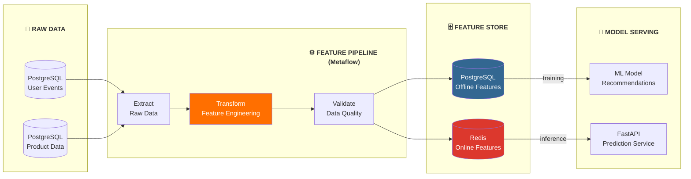

# 🤖 Project 05: ML Feature Engineering Pipeline

> Build pipeline chuẩn bị features cho ML models, từ raw data đến feature store

---

## 📋 Project Overview

**Difficulty:** Advanced
**Time Estimate:** 4-6 weeks
**Skills Learned:** Feature Engineering, ML Pipelines, Metaflow, Data Versioning

### Mục Tiêu

Build một feature engineering pipeline cho e-commerce recommendation: thu thập user behavior, tính features, serve cho ML model.



---

## 🛠️ Tech Stack

| Component | Tool | Lý Do Chọn |
|-----------|------|-------------|
| Pipeline Framework | Metaflow | Netflix created, human-centric, easy debugging |
| Feature Computation | Polars / Pandas | Fast feature engineering |
| Offline Store | PostgreSQL | Simple, reliable |
| Online Store | Redis | Low-latency serving |
| Data Quality | Great Expectations | Comprehensive validation |
| Model Serving | FastAPI | Fast, async, type-safe |
| Experiment Tracking | MLflow | Open-source, mature |

---

## 📂 Project Structure

```
ml-feature-pipeline/
├── docker-compose.yml
├── pyproject.toml              # uv / pip project config
├── README.md
│
├── features/
│   ├── __init__.py
│   ├── user_features.py        # User behavior features
│   ├── product_features.py     # Product features
│   └── interaction_features.py # User-product interactions
│
├── flows/
│   ├── feature_flow.py         # Metaflow flow chính
│   ├── training_flow.py        # Model training flow
│   └── backfill_flow.py        # Historical feature backfill
│
├── serving/
│   ├── app.py                  # FastAPI prediction service
│   └── feature_client.py       # Redis feature retrieval
│
├── quality/
│   ├── expectations/
│   │   └── user_features_suite.json
│   └── validate.py
│
├── scripts/
│   ├── seed_data.py
│   └── setup_stores.py
│
└── tests/
    ├── test_features.py
    └── test_serving.py
```

---

## 🚀 Step-by-Step Implementation

### Step 1: Infrastructure

**docker-compose.yml:**
```yaml
version: '3.8'

services:
  postgres:
    image: postgres:15
    environment:
      POSTGRES_USER: mlpipe
      POSTGRES_PASSWORD: mlpipe123
      POSTGRES_DB: feature_store
    volumes:
      - ./scripts/init.sql:/docker-entrypoint-initdb.d/init.sql
    ports:
      - "5432:5432"

  redis:
    image: redis:7
    ports:
      - "6379:6379"

  mlflow:
    image: ghcr.io/mlflow/mlflow:v2.9.0
    ports:
      - "5000:5000"
    command: mlflow server --host 0.0.0.0

volumes:
  postgres_data:
```

### Step 2: Feature Engineering

**features/user_features.py:**
```python
"""User behavior features for recommendation model."""
import polars as pl
from datetime import datetime, timedelta


def compute_user_features(
    events_df: pl.DataFrame,
    reference_date: datetime
) -> pl.DataFrame:
    """Compute user-level features from event data.
    
    Features:
    - total_views_7d: Page views in last 7 days
    - total_purchases_30d: Purchases in last 30 days
    - avg_session_duration: Average session length
    - favorite_category: Most viewed category
    - days_since_last_visit: Recency
    """
    
    # Filter to relevant time window
    cutoff_30d = reference_date - timedelta(days=30)
    cutoff_7d = reference_date - timedelta(days=7)
    
    recent_events = events_df.filter(
        pl.col("event_timestamp") >= cutoff_30d
    )
    
    user_features = (
        recent_events
        .group_by("user_id")
        .agg([
            # Activity features
            pl.col("event_id")
                .filter(pl.col("event_timestamp") >= cutoff_7d)
                .count()
                .alias("total_views_7d"),
            
            pl.col("event_id")
                .filter(pl.col("event_type") == "purchase")
                .count()
                .alias("total_purchases_30d"),
            
            # Engagement features
            pl.col("session_duration")
                .mean()
                .alias("avg_session_duration"),
            
            # Preference features
            pl.col("category")
                .mode()
                .first()
                .alias("favorite_category"),
            
            # Recency
            (reference_date - pl.col("event_timestamp").max())
                .dt.total_days()
                .alias("days_since_last_visit"),
        ])
    )
    
    return user_features
```

### Step 3: Metaflow Pipeline

**flows/feature_flow.py:**
```python
"""Feature engineering pipeline using Metaflow."""
from metaflow import FlowSpec, step, Parameter
import polars as pl
from datetime import datetime


class FeatureEngineeringFlow(FlowSpec):
    """Compute and store ML features for recommendation model."""
    
    reference_date = Parameter(
        'date',
        help='Reference date for feature computation',
        default=datetime.now().strftime('%Y-%m-%d')
    )
    
    @step
    def start(self):
        """Load raw data from PostgreSQL."""
        import psycopg2
        
        conn = psycopg2.connect(
            host="localhost", port=5432,
            dbname="feature_store",
            user="mlpipe", password="mlpipe123"
        )
        
        # Load events
        self.events = pl.read_database(
            "SELECT * FROM raw.user_events WHERE event_timestamp >= NOW() - INTERVAL '30 days'",
            connection=conn
        )
        
        # Load products
        self.products = pl.read_database(
            "SELECT * FROM raw.products",
            connection=conn
        )
        
        conn.close()
        print(f"Loaded {len(self.events)} events, {len(self.products)} products")
        self.next(self.compute_user_features, self.compute_product_features)
    
    @step
    def compute_user_features(self):
        """Compute user-level features."""
        from features.user_features import compute_user_features
        
        ref_date = datetime.strptime(self.reference_date, '%Y-%m-%d')
        self.user_features = compute_user_features(self.events, ref_date)
        print(f"Computed features for {len(self.user_features)} users")
        self.next(self.join_features)
    
    @step
    def compute_product_features(self):
        """Compute product-level features."""
        from features.product_features import compute_product_features
        
        self.product_features = compute_product_features(
            self.products, self.events
        )
        print(f"Computed features for {len(self.product_features)} products")
        self.next(self.join_features)
    
    @step
    def join_features(self, inputs):
        """Join all features and validate."""
        self.user_features = inputs.compute_user_features.user_features
        self.product_features = inputs.compute_product_features.product_features
        self.next(self.validate)
    
    @step
    def validate(self):
        """Validate feature quality with Great Expectations."""
        from quality.validate import validate_features
        
        validation_result = validate_features(self.user_features)
        if not validation_result.success:
            raise ValueError("Feature validation failed!")
        
        print("✅ All feature validations passed")
        self.next(self.store_features)
    
    @step
    def store_features(self):
        """Store features in offline (Postgres) and online (Redis) stores."""
        import psycopg2
        import redis
        import json
        
        # Offline store (PostgreSQL)
        conn = psycopg2.connect(
            host="localhost", port=5432,
            dbname="feature_store",
            user="mlpipe", password="mlpipe123"
        )
        self.user_features.write_database(
            "features.user_features",
            connection=conn,
            if_table_exists="replace"
        )
        conn.close()
        
        # Online store (Redis)
        r = redis.Redis(host='localhost', port=6379, db=0)
        for row in self.user_features.iter_rows(named=True):
            key = f"user:{row['user_id']}:features"
            r.set(key, json.dumps(row), ex=86400)  # TTL 24h
        
        print(f"Stored features: {len(self.user_features)} users")
        self.next(self.end)
    
    @step
    def end(self):
        """Pipeline complete."""
        print("✅ Feature engineering pipeline completed successfully")


if __name__ == '__main__':
    FeatureEngineeringFlow()
```

### Step 4: Feature Serving

**serving/app.py:**
```python
"""FastAPI prediction service with feature retrieval."""
from fastapi import FastAPI, HTTPException
import redis
import json
import numpy as np

app = FastAPI(title="Recommendation Service")
redis_client = redis.Redis(host='localhost', port=6379, db=0)


@app.get("/recommend/{user_id}")
async def get_recommendations(user_id: str, n: int = 5):
    """Get product recommendations for a user."""
    # Retrieve features from Redis
    features_raw = redis_client.get(f"user:{user_id}:features")
    if not features_raw:
        raise HTTPException(404, f"No features found for user {user_id}")
    
    features = json.loads(features_raw)
    
    # Simple scoring (replace with actual model)
    # In production: load model from MLflow
    score = (
        features.get('total_views_7d', 0) * 0.3 +
        features.get('total_purchases_30d', 0) * 0.5 +
        (1 / max(features.get('days_since_last_visit', 1), 1)) * 0.2
    )
    
    return {
        "user_id": user_id,
        "engagement_score": round(score, 3),
        "favorite_category": features.get('favorite_category'),
        "recommendations": [f"product_{i}" for i in range(n)]
    }


@app.get("/health")
async def health():
    return {"status": "healthy"}
```

---

## ✅ Completion Checklist

### Phase 1: Data & Infrastructure (Week 1-2)
- [ ] Docker Compose running (Postgres, Redis, MLflow)
- [ ] Sample data seeded (users, products, events)
- [ ] Metaflow installed (`pip install metaflow`)

### Phase 2: Feature Engineering (Week 3-4)
- [ ] User features computed
- [ ] Product features computed  
- [ ] Interaction features computed
- [ ] Great Expectations validation passing

### Phase 3: Pipeline (Week 4-5)
- [ ] Metaflow flow running end-to-end
- [ ] Features stored in Postgres (offline)
- [ ] Features stored in Redis (online)
- [ ] Backfill flow for historical data

### Phase 4: Serving (Week 5-6)
- [ ] FastAPI service running
- [ ] Feature retrieval from Redis working
- [ ] Model loading from MLflow
- [ ] API tests passing

---

## 🎯 Learning Outcomes

**After completing:**
- Feature engineering patterns (temporal, aggregation, embedding)
- Offline vs online feature stores
- ML pipeline orchestration with Metaflow
- Data quality validation for ML
- Real-time feature serving

---

## 📦 Verified Resources

**GitHub Repos:**
- [Netflix/metaflow](https://github.com/Netflix/metaflow) — 9.7k⭐, human-centric ML framework
- [great-expectations/great_expectations](https://github.com/great-expectations/great_expectations) — Data quality validation
- [mlflow/mlflow](https://github.com/mlflow/mlflow) — ML experiment tracking
- [pola-rs/polars](https://github.com/pola-rs/polars) — Fast DataFrame library

**Docker Images (verified):**
- `postgres:15` — [Docker Hub](https://hub.docker.com/_/postgres)
- `redis:7` — [Docker Hub](https://hub.docker.com/_/redis)
- `ghcr.io/mlflow/mlflow:v2.9.0` — [GitHub Packages](https://github.com/mlflow/mlflow/pkgs/container/mlflow)

**Datasets:**
- [Kaggle - E-commerce Events](https://www.kaggle.com/datasets) — User behavior data
- [dbt-labs/jaffle-shop](https://github.com/dbt-labs/jaffle-shop) — E-commerce seed data

---

## 🔗 Liên Kết

- [Previous: Data Platform](04_Data_Platform.md)
- [Next: CDC Pipeline](06_CDC_Pipeline.md)
- [Tools: Polars](../tools/12_Polars_Complete_Guide.md)
- [Use Case: Netflix (Metaflow)](../usecases/01_Netflix_Data_Platform.md)

---

*Cập nhật: February 2026*
