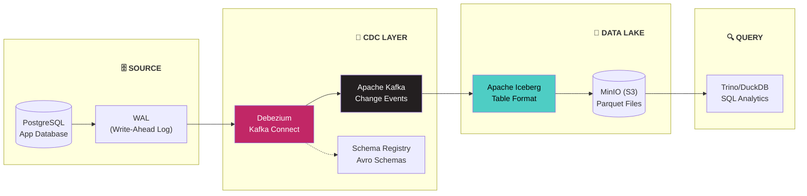

# 🔄 Project 06: Change Data Capture (CDC) Pipeline

> Build pipeline CDC từ database → Kafka → Data Lake (Iceberg) với Debezium

---

## 📋 Project Overview

**Difficulty:** Advanced
**Time Estimate:** 4-6 weeks
**Skills Learned:** CDC, Debezium, Kafka Connect, Apache Iceberg, Event-Driven Architecture

### Mục Tiêu

Build một CDC pipeline capture mọi thay đổi từ PostgreSQL, stream qua Kafka, và sink vào Apache Iceberg tables trên MinIO (S3-compatible).



---

## 🛠️ Tech Stack

| Component | Tool | Lý Do Chọn |
|-----------|------|-------------|
| Source DB | PostgreSQL 15 | Logical replication support |
| CDC Engine | Debezium 2.4 | Industry standard CDC, Kafka Connect based |
| Message Broker | Apache Kafka | Event streaming backbone |
| Schema Management | Confluent Schema Registry | Schema evolution, compatibility |
| Table Format | Apache Iceberg | ACID on data lake, Netflix created |
| Object Storage | MinIO | S3-compatible, self-hosted |
| Query Engine | Trino / DuckDB | SQL analytics trên Iceberg |

---

## 📂 Project Structure

```
cdc-pipeline/
├── docker-compose.yml           # Full infrastructure stack
├── .env.example
├── README.md
│
├── source-db/
│   ├── init.sql                 # Schema + sample data
│   └── postgresql.conf          # WAL config cho CDC
│
├── debezium/
│   ├── register-connector.json  # Debezium connector config
│   └── transforms/              # SMTs (Single Message Transforms)
│
├── kafka/
│   └── topics.sh                # Topic creation script
│
├── iceberg/
│   ├── spark-defaults.conf      # Spark + Iceberg config
│   └── sink_to_iceberg.py       # Kafka → Iceberg consumer
│
├── queries/
│   ├── trino_queries.sql        # Analytics queries
│   └── duckdb_queries.sql       # Local analytics
│
├── monitoring/
│   └── check_lag.py             # Kafka lag monitoring
│
└── tests/
    ├── test_cdc.py              # CDC integration tests
    └── test_consistency.py      # Source-sink consistency check
```

---

## 🚀 Step-by-Step Implementation

### Step 1: Infrastructure

**docker-compose.yml:**
```yaml
version: '3.8'

services:
  # ========== SOURCE DATABASE ==========
  postgres:
    image: postgres:15
    environment:
      POSTGRES_USER: cdc_user
      POSTGRES_PASSWORD: cdc_pass
      POSTGRES_DB: app_db
    volumes:
      - ./source-db/init.sql:/docker-entrypoint-initdb.d/init.sql
    ports:
      - "5432:5432"
    command:
      - "postgres"
      - "-c"
      - "wal_level=logical"          # Required for CDC
      - "-c"
      - "max_replication_slots=4"
      - "-c"
      - "max_wal_senders=4"

  # ========== KAFKA CLUSTER ==========
  zookeeper:
    image: confluentinc/cp-zookeeper:7.5.0
    environment:
      ZOOKEEPER_CLIENT_PORT: 2181

  kafka:
    image: confluentinc/cp-kafka:7.5.0
    depends_on:
      - zookeeper
    ports:
      - "9092:9092"
    environment:
      KAFKA_BROKER_ID: 1
      KAFKA_ZOOKEEPER_CONNECT: zookeeper:2181
      KAFKA_ADVERTISED_LISTENERS: PLAINTEXT://kafka:29092,PLAINTEXT_HOST://localhost:9092
      KAFKA_LISTENER_SECURITY_PROTOCOL_MAP: PLAINTEXT:PLAINTEXT,PLAINTEXT_HOST:PLAINTEXT
      KAFKA_OFFSETS_TOPIC_REPLICATION_FACTOR: 1

  schema-registry:
    image: confluentinc/cp-schema-registry:7.5.0
    depends_on:
      - kafka
    ports:
      - "8081:8081"
    environment:
      SCHEMA_REGISTRY_HOST_NAME: schema-registry
      SCHEMA_REGISTRY_KAFKASTORE_BOOTSTRAP_SERVERS: kafka:29092

  # ========== DEBEZIUM (CDC) ==========
  debezium:
    image: debezium/connect:2.4
    depends_on:
      - kafka
      - schema-registry
      - postgres
    ports:
      - "8083:8083"
    environment:
      BOOTSTRAP_SERVERS: kafka:29092
      GROUP_ID: debezium-cluster
      CONFIG_STORAGE_TOPIC: debezium_configs
      OFFSET_STORAGE_TOPIC: debezium_offsets
      STATUS_STORAGE_TOPIC: debezium_statuses
      KEY_CONVERTER: io.confluent.connect.avro.AvroConverter
      VALUE_CONVERTER: io.confluent.connect.avro.AvroConverter
      CONNECT_KEY_CONVERTER_SCHEMA_REGISTRY_URL: http://schema-registry:8081
      CONNECT_VALUE_CONVERTER_SCHEMA_REGISTRY_URL: http://schema-registry:8081

  # ========== OBJECT STORAGE ==========
  minio:
    image: minio/minio
    environment:
      MINIO_ROOT_USER: minioadmin
      MINIO_ROOT_PASSWORD: minioadmin
    command: server /data --console-address ":9001"
    ports:
      - "9000:9000"
      - "9001:9001"
    volumes:
      - minio_data:/data

  # ========== SPARK (for Iceberg) ==========
  spark:
    image: apache/spark:3.5.0
    depends_on:
      - minio
    ports:
      - "4040:4040"
      - "8888:8888"
    volumes:
      - ./iceberg:/opt/iceberg
    command: /bin/bash -c "sleep infinity"

volumes:
  minio_data:
```

### Step 2: Source Database

**source-db/init.sql:**
```sql
-- E-commerce application database

CREATE TABLE customers (
    id SERIAL PRIMARY KEY,
    name VARCHAR(255) NOT NULL,
    email VARCHAR(255) UNIQUE NOT NULL,
    tier VARCHAR(20) DEFAULT 'standard',
    created_at TIMESTAMP DEFAULT NOW(),
    updated_at TIMESTAMP DEFAULT NOW()
);

CREATE TABLE products (
    id SERIAL PRIMARY KEY,
    name VARCHAR(255) NOT NULL,
    category VARCHAR(100),
    price DECIMAL(10, 2) NOT NULL,
    stock INTEGER DEFAULT 0,
    updated_at TIMESTAMP DEFAULT NOW()
);

CREATE TABLE orders (
    id SERIAL PRIMARY KEY,
    customer_id INTEGER REFERENCES customers(id),
    total_amount DECIMAL(10, 2),
    status VARCHAR(20) DEFAULT 'pending',
    created_at TIMESTAMP DEFAULT NOW(),
    updated_at TIMESTAMP DEFAULT NOW()
);

-- Insert sample data
INSERT INTO customers (name, email, tier) VALUES
    ('Alice Johnson', 'alice@example.com', 'premium'),
    ('Bob Smith', 'bob@example.com', 'standard'),
    ('Charlie Brown', 'charlie@example.com', 'premium');

INSERT INTO products (name, category, price, stock) VALUES
    ('Laptop Pro', 'electronics', 1299.99, 50),
    ('Wireless Mouse', 'electronics', 29.99, 200),
    ('Coffee Maker', 'kitchen', 89.99, 100);

-- Publication for Debezium (logical replication)
ALTER TABLE customers REPLICA IDENTITY FULL;
ALTER TABLE products REPLICA IDENTITY FULL;
ALTER TABLE orders REPLICA IDENTITY FULL;

CREATE PUBLICATION dbz_publication FOR ALL TABLES;
```

### Step 3: Debezium Connector

**debezium/register-connector.json:**
```json
{
  "name": "ecommerce-connector",
  "config": {
    "connector.class": "io.debezium.connector.postgresql.PostgresConnector",
    "database.hostname": "postgres",
    "database.port": "5432",
    "database.user": "cdc_user",
    "database.password": "cdc_pass",
    "database.dbname": "app_db",
    "topic.prefix": "cdc",
    "table.include.list": "public.customers,public.products,public.orders",
    "plugin.name": "pgoutput",
    "publication.name": "dbz_publication",
    "slot.name": "debezium_slot",
    "snapshot.mode": "initial",
    "transforms": "unwrap",
    "transforms.unwrap.type": "io.debezium.transforms.ExtractNewRecordState",
    "transforms.unwrap.add.fields": "op,table,source.ts_ms",
    "transforms.unwrap.delete.handling.mode": "rewrite"
  }
}
```

Register connector:
```bash
curl -X POST http://localhost:8083/connectors \
  -H "Content-Type: application/json" \
  -d @debezium/register-connector.json
```

### Step 4: Kafka → Iceberg Consumer

**iceberg/sink_to_iceberg.py:**
```python
"""Consume Kafka CDC events and write to Iceberg tables."""
from pyspark.sql import SparkSession
from pyspark.sql.functions import from_json, col
from pyspark.sql.types import StructType, StringType, DoubleType, TimestampType


def create_spark_session():
    """Create Spark session with Iceberg support."""
    return (
        SparkSession.builder
        .appName("CDC-to-Iceberg")
        .config("spark.jars.packages", 
                "org.apache.iceberg:iceberg-spark-runtime-3.5_2.12:1.5.0,"
                "org.apache.spark:spark-sql-kafka-0-10_2.12:3.5.0")
        .config("spark.sql.catalog.iceberg", 
                "org.apache.iceberg.spark.SparkCatalog")
        .config("spark.sql.catalog.iceberg.type", "hadoop")
        .config("spark.sql.catalog.iceberg.warehouse", 
                "s3a://warehouse/")
        .config("spark.hadoop.fs.s3a.endpoint", "http://minio:9000")
        .config("spark.hadoop.fs.s3a.access.key", "minioadmin")
        .config("spark.hadoop.fs.s3a.secret.key", "minioadmin")
        .config("spark.hadoop.fs.s3a.path.style.access", "true")
        .getOrCreate()
    )


def process_cdc_stream():
    """Process CDC events from Kafka and write to Iceberg."""
    spark = create_spark_session()
    
    # Read from Kafka
    df = (
        spark.readStream
        .format("kafka")
        .option("kafka.bootstrap.servers", "kafka:29092")
        .option("subscribe", "cdc.public.customers,cdc.public.orders")
        .option("startingOffsets", "earliest")
        .load()
    )
    
    # Parse the CDC event
    parsed = df.select(
        col("topic"),
        col("timestamp").alias("kafka_timestamp"),
        from_json(col("value").cast("string"), get_schema()).alias("data")
    ).select("topic", "kafka_timestamp", "data.*")
    
    # Write to Iceberg with MERGE
    query = (
        parsed.writeStream
        .format("iceberg")
        .outputMode("append")
        .option("path", "iceberg.db.cdc_events")
        .option("checkpointLocation", "s3a://warehouse/checkpoints/cdc")
        .trigger(processingTime="30 seconds")
        .start()
    )
    
    query.awaitTermination()


if __name__ == "__main__":
    process_cdc_stream()
```

### Step 5: Verify & Query

**queries/trino_queries.sql:**
```sql
-- Verify CDC events landed in Iceberg
SELECT 
    __op AS operation,
    __table AS source_table,
    COUNT(*) AS event_count
FROM iceberg.db.cdc_events
GROUP BY __op, __table;

-- Time travel: see data as of 1 hour ago
SELECT * 
FROM iceberg.db.customers
FOR SYSTEM_TIME AS OF TIMESTAMP '2026-01-01 12:00:00';

-- Track all changes for a specific customer
SELECT *
FROM iceberg.db.cdc_events
WHERE source_table = 'customers'
  AND id = 1
ORDER BY kafka_timestamp;
```

### Step 6: Simulate Changes

```python
# scripts/simulate_changes.py
"""Simulate application changes to test CDC pipeline."""
import psycopg2
import time
import random

conn = psycopg2.connect(
    host="localhost", port=5432,
    dbname="app_db", user="cdc_user", password="cdc_pass"
)
conn.autocommit = True
cur = conn.cursor()

changes = [
    # INSERT
    "INSERT INTO customers (name, email) VALUES ('New User', 'new@example.com')",
    # UPDATE
    "UPDATE customers SET tier = 'premium' WHERE email = 'bob@example.com'",
    # UPDATE product stock
    "UPDATE products SET stock = stock - 1 WHERE id = 1",
    # INSERT order
    "INSERT INTO orders (customer_id, total_amount, status) VALUES (1, 1299.99, 'paid')",
    # DELETE (soft)
    "UPDATE orders SET status = 'cancelled' WHERE id = 1",
]

for sql in changes:
    print(f"Executing: {sql[:60]}...")
    cur.execute(sql)
    time.sleep(2)  # Wait for CDC to capture

cur.close()
conn.close()
print("✅ All changes simulated")
```

---

## ✅ Completion Checklist

### Phase 1: Infrastructure (Week 1-2)
- [ ] Docker Compose stack running (Postgres, Kafka, Debezium, MinIO)
- [ ] PostgreSQL WAL level = logical
- [ ] Kafka topics created
- [ ] Schema Registry accessible

### Phase 2: CDC Setup (Week 2-3)
- [ ] Debezium connector registered
- [ ] CDC events flowing in Kafka topics
- [ ] Schema registered in Schema Registry
- [ ] Verify: INSERT/UPDATE/DELETE captured

### Phase 3: Iceberg Sink (Week 3-4)
- [ ] Spark + Iceberg configured
- [ ] CDC events written to Iceberg tables
- [ ] Parquet files visible in MinIO
- [ ] Time travel queries working

### Phase 4: Analytics & Monitoring (Week 5-6)
- [ ] Trino/DuckDB querying Iceberg
- [ ] Kafka lag monitoring
- [ ] Source-sink consistency checks
- [ ] End-to-end latency < 30 seconds

---

## 🎯 Learning Outcomes

**After completing:**
- Change Data Capture concepts (WAL, logical replication)
- Debezium connector configuration
- Kafka Connect architecture
- Apache Iceberg table management
- Event-driven data architecture
- Schema evolution with Schema Registry
- Data lake ACID transactions

---

## 📦 Verified Resources

**GitHub Repos:**
- [apache/iceberg](https://github.com/apache/iceberg) — 8.5k⭐, Netflix created. Có `docker/` examples.
- [apache/kafka](https://github.com/apache/kafka) — 29k⭐, LinkedIn created.
- [apache/hudi](https://github.com/apache/hudi) — 6.1k⭐, Uber created. Có `docker/` và `hudi-notebooks/`.
- [debezium/debezium](https://github.com/debezium/debezium) — CDC platform chính thức.

**Docker Images (verified):**
- `postgres:15` — [Docker Hub](https://hub.docker.com/_/postgres)
- `confluentinc/cp-kafka:7.5.0` — [Docker Hub](https://hub.docker.com/r/confluentinc/cp-kafka)
- `confluentinc/cp-zookeeper:7.5.0` — [Docker Hub](https://hub.docker.com/r/confluentinc/cp-zookeeper)
- `confluentinc/cp-schema-registry:7.5.0` — [Docker Hub](https://hub.docker.com/r/confluentinc/cp-schema-registry)
- `debezium/connect:2.4` — [Docker Hub](https://hub.docker.com/r/debezium/connect)
- `minio/minio` — [Docker Hub](https://hub.docker.com/r/minio/minio)
- `apache/spark:3.5.0` — [Docker Hub](https://hub.docker.com/r/apache/spark)

**Tutorials:**
- [Debezium Tutorial](https://debezium.io/documentation/reference/2.4/tutorial.html) — Official getting started
- [Confluent CDC Tutorial](https://developer.confluent.io/tutorials/) — Kafka Connect patterns
- [DataTalksClub/data-engineering-zoomcamp](https://github.com/DataTalksClub/data-engineering-zoomcamp) — Module 6: Kafka

---

## 🔗 Liên Kết

- [Previous: ML Pipeline](05_ML_Pipeline.md)
- [Tools: Iceberg](../tools/01_Apache_Iceberg_Complete_Guide.md)
- [Tools: Kafka](../tools/05_Apache_Kafka_Complete_Guide.md)
- [Use Case: Uber (Hudi)](../usecases/02_Uber_Data_Platform.md)

---

*Cập nhật: February 2026*
