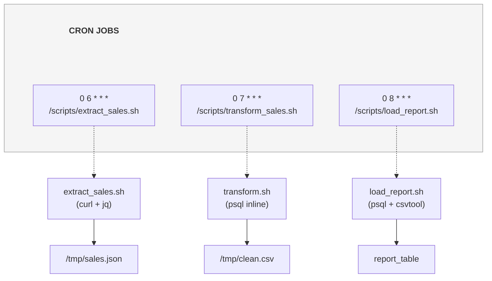
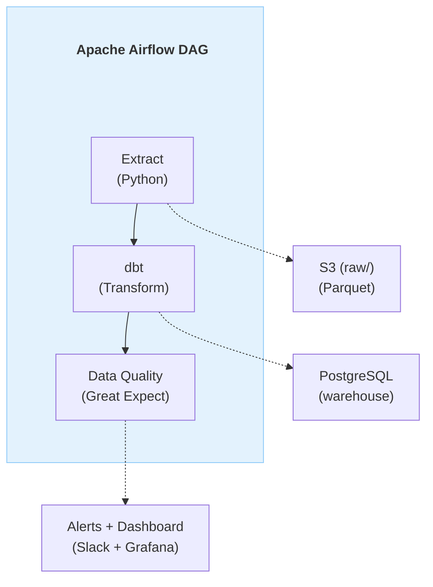
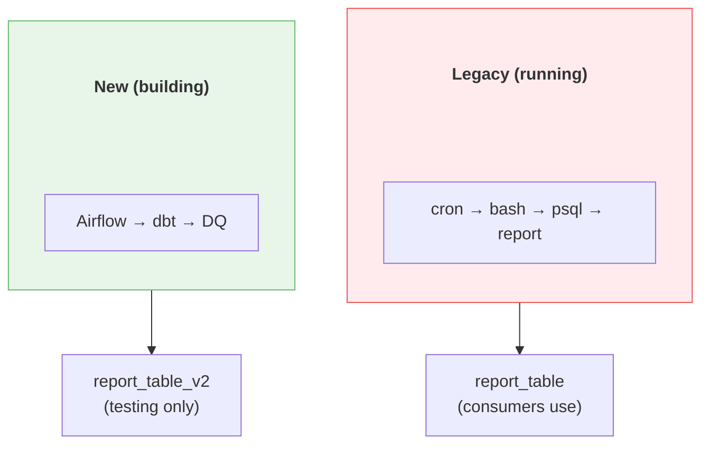

# 🔄 Project 08: Legacy Migration

> Scenario thực tế nhất: Chuyển từ cronjob bash scripts sang modern data stack

---

## 📋 Project Overview

**Difficulty:** Intermediate → Advanced
**Time Estimate:** 3-4 weeks
**Skills Learned:** Migration planning, backward compatibility, zero-downtime, stakeholder management

### Mục Tiêu

Migrate một legacy data pipeline (bash scripts + cron + raw SQL) sang modern stack (Airflow + dbt + proper testing) mà KHÔNG làm gián đoạn production.

> **50% công việc DE thực tế là migration.** Build mới thì dễ — migrate mà không break thì khó.

---

## 🎯 Scenario

### Legacy System (Hiện tại)

```
**Legacy Architecture:**

```

### Problems với Legacy

```
1. NO monitoring: "Did it run?" → Check /tmp/ file timestamps
2. NO error handling: Script fails silently
3. NO idempotency: Rerun = duplicate data
4. NO testing: "It works on my machine"
5. NO version control: Scripts edited directly on server
6. NO documentation: Original author left 2 years ago
7. Fragile: One typo in bash = everything breaks
8. Can't scale: Single server, sequential execution
```

### Target System (Modern)

```
**Modern Architecture:**

```

---

## 🛠️ Migration Plan

### Phase 0: Understand Legacy (Week 1, Days 1-2)

```markdown
Before touching ANYTHING:

1. □ Document what each script does (read every line)
2. □ Map all data flows (input → process → output)
3. □ Identify all downstream consumers (who uses this data?)
4. □ Record current SLAs (when must data be ready?)
5. □ Run legacy scripts manually, observe behavior
6. □ Capture current output as "ground truth"
```

```bash
# Document the legacy
# For each script, capture:
cat /scripts/extract_sales.sh    # What it does
crontab -l                        # When it runs
ls -la /tmp/sales*                # What it produces
psql -c "SELECT COUNT(*) FROM report_table"  # Current state
```

### Phase 1: Parallel Build (Week 1, Days 3-5)

```
Strategy: Build new system ALONGSIDE old system
NEVER turn off old system before new is verified


```

### Phase 2: Dual-Run Verification (Week 2)

```python
class MigrationVerifier:
    """Compare legacy and new pipeline outputs"""
    
    def verify_migration(self) -> dict:
        """Run both systems, compare results"""
        
        # Get legacy output
        legacy_df = pd.read_sql(
            "SELECT * FROM report_table WHERE date = CURRENT_DATE",
            legacy_conn
        )
        
        # Get new output
        new_df = pd.read_sql(
            "SELECT * FROM report_table_v2 WHERE date = CURRENT_DATE",
            new_conn
        )
        
        # Compare
        return {
            "row_count_match": len(legacy_df) == len(new_df),
            "legacy_rows": len(legacy_df),
            "new_rows": len(new_df),
            "column_match": set(legacy_df.columns) == set(new_df.columns),
            "value_diff": self._compare_values(legacy_df, new_df),
            "recommendation": "GO" if self._all_match(legacy_df, new_df) else "NO-GO"
        }
    
    def _compare_values(self, df1, df2) -> dict:
        """Compare values between two DataFrames"""
        diffs = {}
        for col in df1.columns:
            if df1[col].dtype in ['float64', 'int64']:
                diff = abs(df1[col].sum() - df2[col].sum())
                pct_diff = diff / df1[col].sum() * 100 if df1[col].sum() else 0
                if pct_diff > 0.01:  # >0.01% difference
                    diffs[col] = f"{pct_diff:.4f}% difference"
        return diffs
```

### Phase 3: Cutover (Week 3)

```markdown
Cutover Plan:

Pre-cutover:
□ 5 consecutive days of matching output
□ All downstream consumers notified
□ Rollback plan documented
□ On-call engineer assigned

Cutover Day:
□ Disable legacy cron jobs
□ Enable new Airflow DAG
□ Monitor first run closely
□ Verify downstream dashboards

Post-cutover:
□ Keep legacy scripts for 14 days (don't delete!)
□ Monitor daily for 1 week
□ Get sign-off from stakeholders
□ Archive legacy scripts to git
```

### Phase 4: Cleanup (Week 4)

```bash
# After 14 days of success:
# 1. Archive legacy scripts to git (history)
git add legacy_scripts/
git commit -m "Archive legacy scripts (migrated to Airflow)"

# 2. Remove cron entries
crontab -r  # or edit specific entries

# 3. Drop interim tables
psql -c "DROP TABLE report_table_v2;"
psql -c "ALTER TABLE report_table_new RENAME TO report_table;"

# 4. Update documentation
# README, runbooks, architecture diagrams
```

---

## ✅ Completion Checklist

### Migration Quality Gates

```
Gate 1: UNDERSTAND
□ Every legacy script documented
□ All data flows mapped
□ All consumers identified
□ Current SLAs recorded

Gate 2: BUILD
□ New pipeline implemented
□ Tests written
□ Monitoring added
□ Documentation complete

Gate 3: VERIFY
□ 5+ days dual-run with matching output
□ Performance equal or better
□ All edge cases handled (month-end, holidays)
□ Rollback tested

Gate 4: CUTOVER
□ Stakeholder approval
□ Cutover executed
□ Post-cutover monitoring clean
□ Legacy archived

Gate 5: CLEANUP
□ Legacy removed
□ Documentation updated
□ Postmortem written (lessons learned)
□ Knowledge transfer complete
```

---

## 🎯 Learning Outcomes

| Kỹ năng | Practice |
|---------|----------|
| **Migration planning** | Phase-by-phase execution |
| **Backward compatibility** | Dual-run verification |
| **Stakeholder communication** | Cutover notices, sign-off |
| **Risk management** | Rollback plans, gates |
| **Documentation** | Legacy analysis, new system docs |
| **Zero-downtime** | Parallel running, atomic swap |

---

## 🔗 Liên Kết

- [22_Schema_Evolution_Migration](../fundamentals/22_Schema_Evolution_Migration.md) - Migration patterns
- [05_Day2_Operations](../mindset/05_Day2_Operations.md) - Running production systems
- [08_Apache_Airflow_Complete_Guide](../tools/08_Apache_Airflow_Complete_Guide.md) - Target orchestrator

---

*Migration success = Nobody notices the change. That's the highest compliment.*
