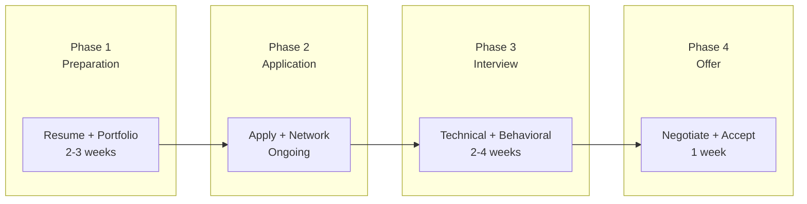

# 🎯 Job Search Strategy for Data Engineers

> Chiến lược tìm việc hiệu quả cho Data Engineer

---

## 📋 Mục Lục

1. [Job Search Framework](#-job-search-framework)
2. [Resume Optimization](#-resume-optimization)
3. [Portfolio Building](#-portfolio-building)
4. [Job Sources & Networking](#-job-sources--networking)
5. [Interview Process](#-interview-process)
6. [Salary Negotiation](#-salary-negotiation)

---

## 🔍 Job Search Framework

### The 4-Phase Approach



### Timeline Expectations

```
Junior Level:
├── Applications needed: 50-100
├── Time to offer: 1-3 months
└── Interview/Application ratio: ~10%

Mid Level:
├── Applications needed: 20-50
├── Time to offer: 1-2 months
└── Interview/Application ratio: ~20%

Senior Level:
├── Applications needed: 10-30
├── Time to offer: 1-2 months
└── Interview/Application ratio: ~30%

Note: Networking referrals increase ratios by 3-5x
```

---

## 📄 Resume Optimization

### DE Resume Structure

> **DE Resume Structure**
> 
> 1. **Header:** Name + Contact + LinkedIn + GitHub
> 2. **Summary:** 2-3 lines (skip if junior)
> 3. **Technical Skills:** Grouped by category (Languages, Cloud, Tools, etc.)
> 4. **Experience:** Most recent first
>    - Company - Role - Duration
>    - 3-5 bullet points with metrics (X-Y-Z format)
> 5. **Projects:** If junior/mid, highlight key DE projects
> 6. **Education & Certifications:** Relevant degrees and certs

### Strong Bullet Points (X-Y-Z Format)

```
Pattern: Accomplished [X] as measured by [Y] by doing [Z]

❌ BAD (vague):
"Built data pipelines using Spark"

✅ GOOD (specific + impact):
"Reduced pipeline runtime 60% (4h → 1.5h) by redesigning 
Spark jobs with broadcast joins and partition pruning, 
saving $15K/month in compute costs"

❌ BAD:
"Worked on data warehouse"

✅ GOOD:
"Designed star schema data warehouse supporting 50+ analysts, 
processing 10TB daily with 99.9% SLA uptime"
```

### Technical Skills Section

```
Data Processing:     Spark, Flink, Kafka, Airflow
Languages:           Python, SQL, Scala
Cloud:               AWS (Glue, EMR, Redshift), GCP (BigQuery)
Data Storage:        Snowflake, Delta Lake, Iceberg, PostgreSQL
Tools:               dbt, Git, Docker, Terraform
Concepts:            Data Modeling, ETL/ELT, Stream Processing
```

### ATS (Applicant Tracking System) Tips

```
DO:
├── Use standard section headers
├── Include keywords from job description
├── Use simple formatting (no tables/images)
├── Save as PDF but also keep .docx version
└── File name: "FirstName_LastName_DE_Resume.pdf"

DON'T:
├── Fancy graphics or charts
├── Headers/footers (some ATS can't read)
├── Abbreviations without full form first time
└── Walls of text without bullet points
```

---

## 💼 Portfolio Building

### Must-Have Projects

**1. End-to-End Data Pipeline**
```
What to build:
├── Source: Public API (weather, stocks, etc.)
├── Ingestion: Airflow scheduled extraction
├── Storage: S3/GCS → Delta Lake/Iceberg
├── Transform: dbt models (staging → marts)
├── Serve: Dashboard (Metabase/Superset)
└── Infra: Docker Compose or Terraform

Shows:
├── Full lifecycle understanding
├── Modern data stack knowledge
└── Infrastructure as code
```

**2. Real-time Streaming Project**
```
What to build:
├── Source: Kafka producer (simulated events)
├── Processing: Flink/Spark Streaming
├── Sink: Real-time dashboard
└── Alerts: Threshold-based notifications

Shows:
├── Streaming knowledge
├── Event-driven architecture
└── Operational awareness
```

**3. Data Quality / Testing Project**
```
What to build:
├── Data validation with Great Expectations
├── dbt tests (unique, not_null, custom)
├── Data contracts implementation
└── Quality dashboard

Shows:
├── Data quality mindset
├── Testing culture
└── Production-ready thinking
```

### GitHub Profile Optimization

```
Repository Checklist:
├── Clear README with:
│   ├── Problem statement
│   ├── Architecture diagram (Mermaid)
│   ├── Technologies used
│   ├── Setup instructions
│   └── Sample outputs/screenshots
├── Well-organized code structure
├── Comments and docstrings
└── .gitignore (no secrets!)

Profile:
├── Professional photo
├── Bio: "Data Engineer | Python, SQL, Spark"
├── Pin best 6 repos
└── Contribution graph active (green squares)
```

---

## 🌐 Job Sources & Networking

### Job Boards (Priority Order)

```
Tier 1 (Best ROI):
├── LinkedIn Jobs (set alerts)
├── Company career pages directly
├── AngelList/Wellfound (startups)
└── Referrals (highest conversion)

Tier 2:
├── Indeed
├── Glassdoor
├── Stack Overflow Jobs
└── DataJobs.com

Tier 3 (Spray & Pray):
├── Monster
├── ZipRecruiter
└── CareerBuilder
```

### Networking Strategy

```
Online:
├── LinkedIn
│   ├── Connect with DEs at target companies
│   ├── Engage with posts (comment thoughtfully)
│   ├── Share your projects/learnings
│   └── Message hiring managers directly
│
├── Twitter/X
│   ├── Follow DE influencers
│   ├── Share technical content
│   └── Build genuine relationships
│
└── Communities
    ├── DataTalksClub Slack
    ├── dbt Slack community
    ├── Reddit r/dataengineering
    └── Discord servers

Offline:
├── Meetups (Data Engineering, Cloud)
├── Conferences (Data Council, etc.)
└── Company-hosted events
```

### Cold Outreach Template

```
LinkedIn message to hiring manager:

Subject: Data Engineer role - [Company Name]

Hi [Name],

I noticed [Company] is hiring for a DE position. 
I've been doing [relevant work] for [X years], 
including [specific relevant experience].

I'm particularly excited about [specific thing about company].

Would you have 15 minutes for a quick call?

[Your portfolio/GitHub link]

Thanks,
[Your name]
```

---

## 🎤 Interview Process

### Typical DE Interview Flow

```
Stage 1: Recruiter Screen (30 min)
├── Background overview
├── Salary expectations
├── Visa/timeline questions
└── Basic motivation

Stage 2: Technical Screen (60 min)
├── SQL coding (live)
├── Python basics
├── DE concepts discussion
└── Sometimes take-home

Stage 3: Technical Deep Dive (2-4 hours)
├── SQL advanced (window functions, optimization)
├── Python/Spark coding
├── System design
└── Technical discussion with team

Stage 4: Behavioral/Culture (45-60 min)
├── STAR method questions
├── Team fit assessment
├── Values alignment
└── Your questions for them

Stage 5: Hiring Manager (30-45 min)
├── Career goals discussion
├── Team dynamics
├── Growth opportunities
└── Final Q&A
```

### Preparation Checklist

```
SQL (most important):
├── Window functions (ROW_NUMBER, LAG, etc.)
├── CTEs and subqueries
├── Query optimization
├── Sessionization problems
└── Practice: LeetCode, StrataScratch, DataLemur

Python:
├── Data processing (pandas basics)
├── File handling
├── API integration
├── Error handling
└── Practice: LeetCode (Easy-Medium only)

System Design:
├── Read DDIA chapters
├── Practice common scenarios:
│   ├── Design data pipeline for X
│   ├── Design real-time analytics
│   └── Design data warehouse
└── Review our System Design guide

Behavioral:
├── Prepare 5-6 STAR stories
├── Research company thoroughly
├── Prepare thoughtful questions
└── Review our Behavioral guide
```

---

## 💰 Salary Negotiation

### Research Market Rates

```
Sources:
├── Levels.fyi (best for tech)
├── Glassdoor
├── LinkedIn Salary
├── Blind app
└── Ask in communities (anonymously)

Vietnam Market (2025-2026):
├── Junior (0-2 yrs): $800-1,500/month
├── Mid (2-5 yrs): $1,500-3,000/month
├── Senior (5+ yrs): $3,000-5,000/month
├── Lead/Staff: $5,000+/month

Singapore (SGD):
├── Junior: $4,000-6,000/month
├── Mid: $6,000-10,000/month
├── Senior: $10,000-15,000/month
├── Lead/Staff: $15,000+/month

US (Remote/FAANG):
├── Junior: $100-150K/year
├── Mid: $150-220K/year (TC)
├── Senior: $200-350K/year (TC)
├── Staff: $350K+/year (TC)
```

### Negotiation Framework

```
1. Let them give number first
   "What's the budget for this role?"

2. If forced to give range:
   "Based on my research, I'm looking at $X-Y range,
   but I'm open to discussing based on total compensation"

3. After offer:
   "Thank you for the offer. I'm very excited about the role.
   Based on [reasons], I was hoping we could get to $X.
   Is there flexibility?"

4. If they can't move on base:
   ├── Signing bonus
   ├── Extra vacation days
   ├── Remote flexibility
   ├── Learning budget
   └── Review timing (6 months vs 1 year)
```

### What to Negotiate

```
Priority 1:
├── Base salary
├── Equity (RSUs, options)
└── Signing bonus

Priority 2:
├── Annual bonus target
├── Remote work policy
├── Vacation days
└── Start date flexibility

Priority 3:
├── Learning/conference budget
├── Equipment budget
├── Relocation assistance
└── Review cycle timing
```

---

## 📅 Weekly Job Search Schedule

```
If currently employed (10-15 hrs/week):
├── Monday (2h): Research companies, update tracker
├── Tuesday (2h): Apply to 5-10 jobs
├── Wednesday (1h): LinkedIn engagement
├── Thursday (2h): Interview prep/practice SQL
├── Friday (2h): Networking outreach
├── Weekend (4h): Portfolio work

If full-time searching (40 hrs/week):
├── Morning (8-12): Applications + follow-ups
├── Afternoon (1-5): Interview prep/study
├── Evening (7-9): Networking + portfolio
```

### Application Tracking

```
Use Notion/Excel to track:
├── Company
├── Role
├── Date applied
├── Source (LinkedIn, referral, etc.)
├── Status (Applied, Screening, Interview, Offer, Reject)
├── Next action
├── Salary range
└── Notes

Review weekly:
├── Conversion rates
├── What's working
└── Adjust strategy
```

---

## 🔗 Liên Kết

- [Career Levels](01_Career_Levels.md)
- [Skills Matrix](02_Skills_Matrix.md)
- [Learning Resources](03_Learning_Resources.md)
- [Certification Guide](04_Certification_Guide.md)
- [Interview Prep](../interview/)

---

*Cập nhật: February 2026*
