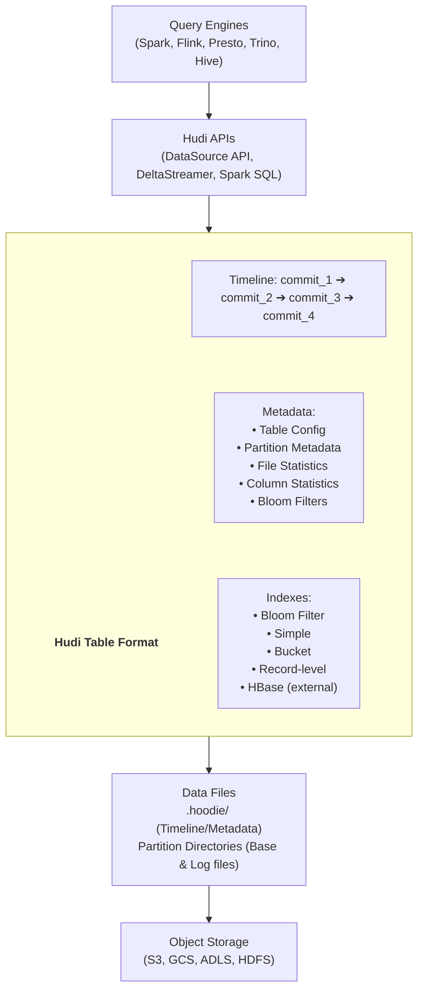
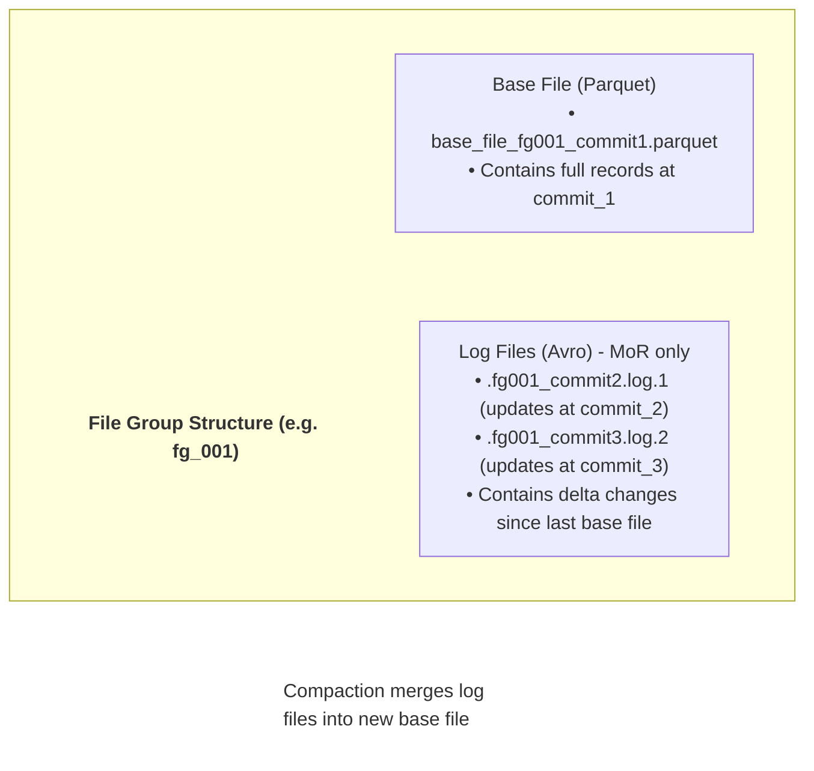
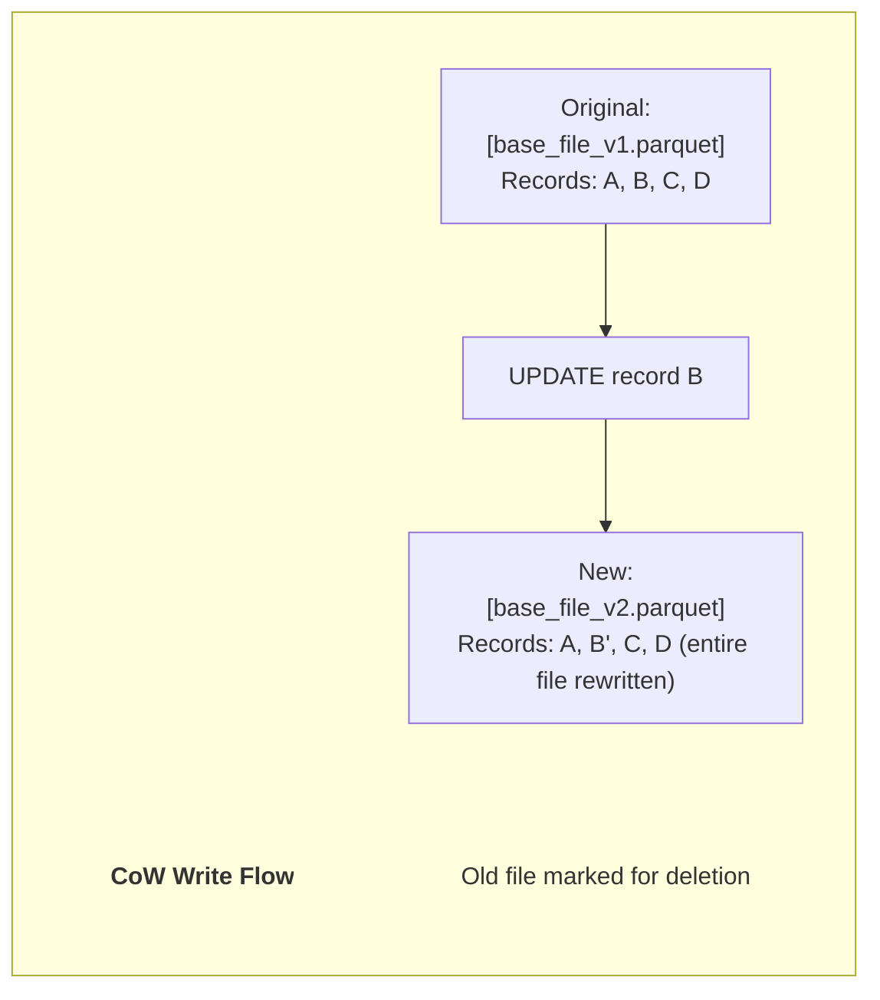
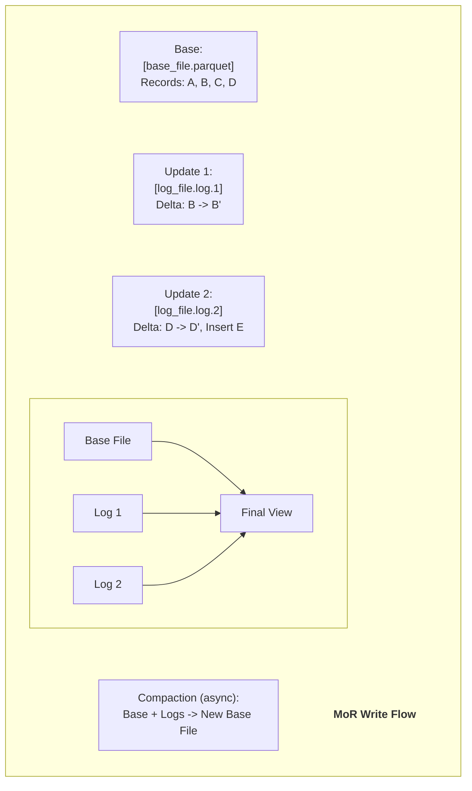
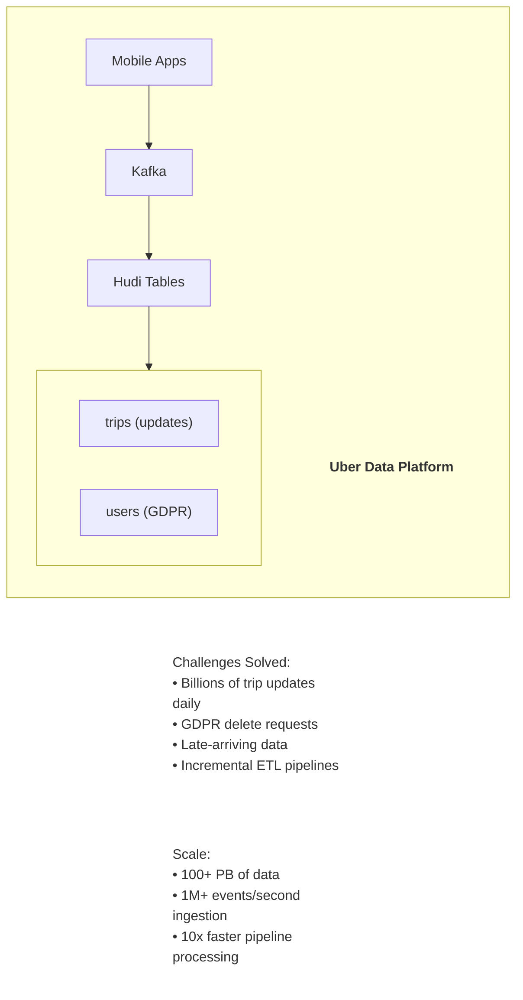
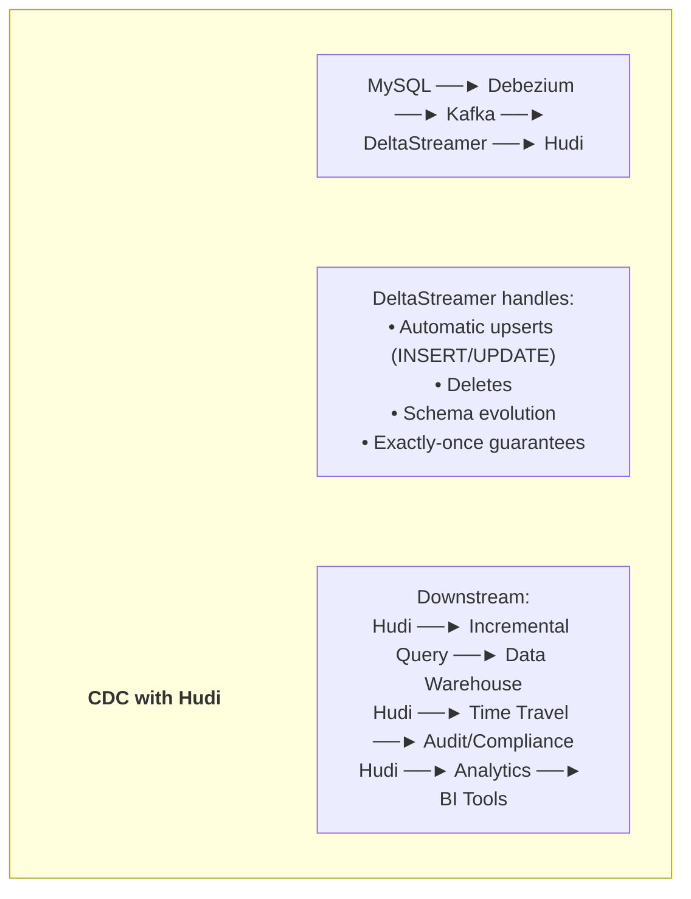

# 🔥 Apache Hudi - Complete Guide

> **"Apache Hudi brings transactions, record-level updates/deletes and change streams to data lakes"**

---

## 📑 Mục Lục

1. [Giới Thiệu & Lịch Sử](#-giới-thiệu--lịch-sử)
2. [Kiến Trúc Chi Tiết](#-kiến-trúc-chi-tiết)
3. [Table Types: CoW vs MoR](#-table-types-cow-vs-mor)
4. [Indexing Mechanisms](#-indexing-mechanisms)
5. [Hands-on Code Examples](#-hands-on-code-examples)
6. [Use Cases Thực Tế](#-use-cases-thực-tế)
7. [Best Practices](#-best-practices)
8. [Performance Tuning](#-performance-tuning)

---

## 🌟 Giới Thiệu & Lịch Sử

### Hudi là gì?

Apache Hudi (Hadoop Upserts Deletes and Incrementals) là một open-source data management framework được sử dụng để đơn giản hóa incremental data processing và data pipeline development. Hudi cho phép bạn manage data tại record-level trong data lake, enabling:

- **Upserts và Deletes**: Row-level updates và deletes
- **Incremental Processing**: Chỉ xử lý data thay đổi
- **Time Travel**: Query data tại bất kỳ thời điểm nào
- **ACID Transactions**: Đảm bảo data consistency

### Lịch Sử Phát Triển

**2016** - Uber bắt đầu phát triển Hudi (tên ban đầu: "Hoodie")
- Giải quyết vấn đề incremental updates trên data lake

**2017** - Open-sourced bởi Uber

**2019** - Donated cho Apache Software Foundation (Incubating)

**2020** - Graduated thành Top-Level Apache Project

**2021** - Version 0.9 - Multi-Modal Index, Spark 3 support

**2022** - Version 0.12 - Improved Flink integration

**2023** - Version 0.14 - Record-level Index, Performance improvements

**2024** - Version 1.0 - First stable major release

**2025** - Version 1.1 (November) - Non-blocking Concurrent Control, Dynamic Bloom Filter

### Tại sao Uber tạo ra Hudi?

**Vấn đề của Uber:**
- Hàng triệu trips mỗi ngày cần update
- GDPR compliance: cần delete user data
- ETL pipelines chậm với full reprocessing
- Late-arriving data cần backfill

**Giải pháp của Hudi:**
- Record-level upserts thay vì partition rewrites
- Efficient deletes cho compliance
- Incremental processing: 10x faster
- Native support cho late data

### Key Contributors

**Vinoth Chandar** - Creator, PMC Chair (Uber → Onehouse)

**Balaji Varadarajan** - Core Contributor (Uber)

**Pratyaksh Sharma** - Core Contributor

**Sivabalan Narayanan** - Core Contributor (LinkedIn)

**Companies Using Hudi:**
- Uber (Original creator)
- Amazon (AWS EMR native support)
- Alibaba
- ByteDance
- Robinhood
- Disney
- GE Aviation

---

## 🏗️ Kiến Trúc Chi Tiết

### Tổng Quan Kiến Trúc



### Timeline Architecture

Hudi sử dụng **Timeline** để track tất cả actions trên table:

> **Timeline Concepts**
> 
> * **Instant** = (timestamp, action, state)
> 
> **Actions:**
> * `COMMITS` - Write operation completed
> * `DELTA_COMMIT` - MoR table log file write
> * `CLEANS` - Background cleanup
> * `COMPACTION` - MoR log to base file
> * `ROLLBACK` - Failed commit rollback
> * `SAVEPOINT` - Savepoint for disaster recovery
> * `REPLACE` - Clustering operation
> 
> **States:**
> * `REQUESTED` - Action scheduled
> * `INFLIGHT` - Action in progress
> * `COMPLETED` - Action finished

### File Group Concept



---

## 📊 Table Types: CoW vs MoR

### Copy-on-Write (CoW)

**Concept:** Mỗi update tạo ra new version của file.



**Characteristics:**
- ✅ Reads are fast (no merge needed)
- ✅ Simple architecture
- ❌ Writes are slower (full file rewrite)
- ❌ Write amplification với frequent updates

**Best for:**
- Read-heavy workloads
- Infrequent updates
- Smaller datasets
- Analytics queries

### Merge-on-Read (MoR)

**Concept:** Updates ghi vào log files, merge khi read.



**Characteristics:**
- ✅ Writes are fast (append-only logs)
- ✅ Low write amplification
- ❌ Reads may be slower (merge overhead)
- ❌ More complex (compaction needed)

**Best for:**
- Write-heavy workloads
- Frequent updates
- Streaming ingestion
- Near real-time data

### Query Types for MoR

**Snapshot Query:**
- Reads latest data
- Merges base + log files
- Slightly slower

**Read-Optimized Query:**
- Reads only base files
- Faster but may miss recent updates
- Good for analytics

**Incremental Query:**
- Reads changes since a timestamp
- Perfect for CDC pipelines

### Choosing Between CoW and MoR

**Choose CoW when:**
- Analytics/BI workloads dominate
- Updates < 20% of total operations
- Can tolerate higher write latency
- Want simpler operations

**Choose MoR when:**
- Streaming/real-time ingestion
- Heavy update workloads
- Need fast writes
- Can schedule regular compaction

---

## 🔍 Indexing Mechanisms

### 1. Bloom Filter Index (Default)

> **Concept: Probabilistic structure for quick key lookups**
>
> For each file, maintains bloom filter of record keys.
> 
> **Write Flow:**
> 1. Compute hash of record key
> 2. Check bloom filter: "Could this key be in this file?"
> 3. If NO → skip file
> 4. If MAYBE → read file to confirm
> 
> **Pros:**
> ✅ Low memory footprint
> ✅ Good for high-cardinality keys
> ✅ Fast for point lookups
> 
> **Cons:**
> ❌ False positives possible
> ❌ Not good for range queries

**Configuration:**
```python
hoodie_options = {
    "hoodie.index.type": "BLOOM",
    "hoodie.bloom.index.filter.type": "DYNAMIC",
    "hoodie.bloom.index.filter.dynamic.max.entries": "100000"
}
```

### 2. Simple Index

> **Concept: In-memory join of incoming keys with existing file keys**
> 
> **Write Flow:**
> 1. Read all record keys from existing files
> 2. Join with incoming records
> 3. Determine which files to update
> 
> **Pros:**
> ✅ 100% accurate (no false positives)
> ✅ Good for small datasets
> 
> **Cons:**
> ❌ High memory usage
> ❌ Slow for large datasets

### 3. Bucket Index

> **Concept: Hash record keys to buckets (files)**
> 
> `bucket = hash(record_key) % num_buckets`
> 
> **Example (4 buckets):**
> * Key: user_001 → hash → bucket_2
> * Key: user_002 → hash → bucket_0
> * Key: user_003 → hash → bucket_2 (same bucket as 001)
> * Key: user_004 → hash → bucket_3
> 
> **Pros:**
> ✅ O(1) lookup - no index structure needed
> ✅ Consistent file sizes
> ✅ Perfect for streaming
> 
> **Cons:**
> ❌ Bucket count fixed at creation
> ❌ Hot spots possible with skewed keys

**Configuration:**
```python
hoodie_options = {
    "hoodie.index.type": "BUCKET",
    "hoodie.bucket.index.num.buckets": "256"
}
```

### 4. Record-level Index (New in 1.0+)

> **Concept: Dedicated index table mapping record keys to file locations**
> 
> **Record Index Table:**
> 
> | record_key | file_id | partition |
> |---|---|---|
> | user_001 | file_group_1 | date=2024-01-15 |
> | user_002 | file_group_2 | date=2024-01-15 |
> | user_003 | file_group_1 | date=2024-01-16 |
> 
> **Pros:**
> ✅ O(1) exact lookup
> ✅ Supports all operations efficiently
> ✅ Scales to billions of records
> 
> **Cons:**
> ❌ Additional storage for index
> ❌ Index maintenance overhead

---

## 💻 Hands-on Code Examples

### PySpark Setup

```python
from pyspark.sql import SparkSession

spark = SparkSession.builder \
    .appName("HudiExample") \
    .config("spark.jars.packages", 
            "org.apache.hudi:hudi-spark3.5-bundle_2.12:1.0.0") \
    .config("spark.sql.extensions", 
            "org.apache.spark.sql.hudi.HoodieSparkSessionExtension") \
    .config("spark.sql.catalog.spark_catalog", 
            "org.apache.spark.sql.hudi.catalog.HoodieCatalog") \
    .config("spark.serializer", 
            "org.apache.spark.serializer.KryoSerializer") \
    .getOrCreate()
```

### Create & Write Table (CoW)

```python
from pyspark.sql.types import *

# Sample data
data = [
    (1, "Alice", "Engineering", 100000, "2024-01-15"),
    (2, "Bob", "Marketing", 80000, "2024-01-15"),
    (3, "Charlie", "Engineering", 120000, "2024-01-16"),
]

schema = StructType([
    StructField("id", IntegerType(), False),
    StructField("name", StringType(), True),
    StructField("department", StringType(), True),
    StructField("salary", IntegerType(), True),
    StructField("date", StringType(), True)
])

df = spark.createDataFrame(data, schema)

# Hudi configuration
hudi_options = {
    "hoodie.table.name": "employees",
    "hoodie.datasource.write.table.type": "COPY_ON_WRITE",
    "hoodie.datasource.write.operation": "upsert",
    "hoodie.datasource.write.recordkey.field": "id",
    "hoodie.datasource.write.partitionpath.field": "date",
    "hoodie.datasource.write.precombine.field": "date",
    "hoodie.upsert.shuffle.parallelism": "2",
    "hoodie.insert.shuffle.parallelism": "2"
}

# Write
df.write.format("hudi") \
    .options(**hudi_options) \
    .mode("overwrite") \
    .save("/tmp/hudi/employees")
```

### Create MoR Table

```python
mor_options = {
    "hoodie.table.name": "events",
    "hoodie.datasource.write.table.type": "MERGE_ON_READ",
    "hoodie.datasource.write.operation": "upsert",
    "hoodie.datasource.write.recordkey.field": "event_id",
    "hoodie.datasource.write.partitionpath.field": "event_date",
    "hoodie.datasource.write.precombine.field": "event_time",
    # Compaction settings
    "hoodie.compact.inline": "true",
    "hoodie.compact.inline.max.delta.commits": "5"
}

events_df.write.format("hudi") \
    .options(**mor_options) \
    .mode("overwrite") \
    .save("/tmp/hudi/events")
```

### Read Data

```python
# Read latest snapshot
df = spark.read.format("hudi").load("/tmp/hudi/employees")
df.show()

# Read specific partitions
df = spark.read.format("hudi") \
    .load("/tmp/hudi/employees/date=2024-01-15")

# Time travel - read at specific time
df_past = spark.read.format("hudi") \
    .option("as.of.instant", "20240115100000") \
    .load("/tmp/hudi/employees")

# Time travel - read at specific commit
df_commit = spark.read.format("hudi") \
    .option("as.of.instant", "20240115100000000") \
    .load("/tmp/hudi/employees")
```

### Incremental Query

```python
# Read changes since a specific commit
incremental_df = spark.read.format("hudi") \
    .option("hoodie.datasource.query.type", "incremental") \
    .option("hoodie.datasource.read.begin.instanttime", "20240115100000") \
    .load("/tmp/hudi/employees")

incremental_df.show()

# Read changes between two commits
changes_df = spark.read.format("hudi") \
    .option("hoodie.datasource.query.type", "incremental") \
    .option("hoodie.datasource.read.begin.instanttime", "20240115100000") \
    .option("hoodie.datasource.read.end.instanttime", "20240115120000") \
    .load("/tmp/hudi/employees")
```

### Upsert Operations

```python
# New/updated data
updates = spark.createDataFrame([
    (1, "Alice Smith", "Engineering", 110000, "2024-01-15"),  # Update
    (4, "Diana", "Sales", 90000, "2024-01-17"),  # Insert
], schema)

# Upsert
updates.write.format("hudi") \
    .options(**hudi_options) \
    .mode("append") \
    .save("/tmp/hudi/employees")
```

### Delete Operations

```python
# Soft delete
delete_df = spark.createDataFrame([
    (2, "Bob", "Marketing", 80000, "2024-01-15"),
], schema)

delete_options = {
    **hudi_options,
    "hoodie.datasource.write.operation": "delete"
}

delete_df.write.format("hudi") \
    .options(**delete_options) \
    .mode("append") \
    .save("/tmp/hudi/employees")

# Hard delete with SQL
spark.sql("""
    DELETE FROM hudi.employees
    WHERE id = 2
""")
```

### SQL Interface

```sql
-- Create table
CREATE TABLE hudi.employees (
    id INT,
    name STRING,
    department STRING,
    salary INT,
    date STRING
)
USING hudi
TBLPROPERTIES (
    type = 'cow',
    primaryKey = 'id',
    preCombineField = 'date'
)
PARTITIONED BY (date);

-- Insert
INSERT INTO hudi.employees VALUES
(1, 'Alice', 'Engineering', 100000, '2024-01-15'),
(2, 'Bob', 'Marketing', 80000, '2024-01-15');

-- Update
UPDATE hudi.employees
SET salary = 110000
WHERE id = 1;

-- Merge
MERGE INTO hudi.employees t
USING updates s
ON t.id = s.id
WHEN MATCHED THEN UPDATE SET *
WHEN NOT MATCHED THEN INSERT *;

-- Time travel
SELECT * FROM hudi.employees
TIMESTAMP AS OF '2024-01-15 10:00:00';

-- Show commits
CALL show_commits('hudi.employees');
```

### DeltaStreamer - Continuous Ingestion

```bash
# Run DeltaStreamer from command line
spark-submit \
  --class org.apache.hudi.utilities.deltastreamer.HoodieDeltaStreamer \
  /path/to/hudi-utilities-bundle.jar \
  --table-type MERGE_ON_READ \
  --source-class org.apache.hudi.utilities.sources.JsonKafkaSource \
  --source-ordering-field timestamp \
  --target-base-path /tmp/hudi/events \
  --target-table events \
  --props /path/to/deltastreamer.properties \
  --schemaprovider-class org.apache.hudi.utilities.schema.FilebasedSchemaProvider \
  --continuous
```

```python
# deltastreamer.properties
hoodie.datasource.write.recordkey.field=event_id
hoodie.datasource.write.partitionpath.field=event_date
hoodie.datasource.write.precombine.field=timestamp
hoodie.deltastreamer.source.kafka.topic=events
bootstrap.servers=localhost:9092
auto.offset.reset=earliest
```

### Flink Integration

```java
// Flink SQL
CREATE TABLE events (
    event_id STRING,
    event_type STRING,
    event_time TIMESTAMP(3),
    PRIMARY KEY (event_id) NOT ENFORCED
)
PARTITIONED BY (event_date)
WITH (
    'connector' = 'hudi',
    'path' = 's3://bucket/hudi/events',
    'table.type' = 'MERGE_ON_READ',
    'read.streaming.enabled' = 'true',
    'read.streaming.check-interval' = '1'
);

-- Insert from Kafka
INSERT INTO events
SELECT * FROM kafka_events;
```

---

## 🎯 Use Cases Thực Tế

### 1. Uber - Original Use Case



### 2. CDC Pipeline



### 3. Near Real-Time Analytics

```python
# Streaming write to Hudi MoR
streaming_df = spark.readStream \
    .format("kafka") \
    .option("kafka.bootstrap.servers", "localhost:9092") \
    .option("subscribe", "events") \
    .load()

parsed_df = streaming_df.select(
    from_json(col("value").cast("string"), event_schema).alias("data")
).select("data.*")

# Write to Hudi with micro-batch
query = parsed_df.writeStream \
    .format("hudi") \
    .options(**mor_options) \
    .option("checkpointLocation", "/tmp/checkpoints/events") \
    .outputMode("append") \
    .start("/tmp/hudi/events")
```

---

## ✅ Best Practices

### 1. Table Type Selection

**Use CoW when:**
- Read-heavy workloads (read:write > 5:1)
- Batch processing dominates
- Simple operations preferred

**Use MoR when:**
- Write-heavy workloads
- Streaming ingestion
- Need fast writes with async compaction

### 2. Index Selection

**Bloom Filter** (default)
- Good for: High cardinality keys, point lookups
- Use when: Update ratio < 30%

**Bucket Index**
- Good for: Streaming, consistent sizing
- Use when: Can determine bucket count upfront

**Record-level Index**
- Good for: Large tables, any workload
- Use when: Scale > 100M records

```python
# Recommended for large tables
options = {
    "hoodie.index.type": "RECORD_INDEX",
    "hoodie.metadata.enable": "true"
}
```

### 3. Compaction (MoR)

```python
# Inline compaction
options = {
    "hoodie.compact.inline": "true",
    "hoodie.compact.inline.max.delta.commits": "5"
}

# Async compaction (recommended for production)
options = {
    "hoodie.compact.inline": "false",
    "hoodie.compact.schedule.inline": "true"
}

# Run compaction separately
spark.sql("""
    CALL run_compaction(
        table => 'hudi.events',
        op => 'SCHEDULE_AND_EXECUTE'
    )
""")
```

### 4. Clustering

```python
# Enable clustering for better read performance
options = {
    "hoodie.clustering.inline": "true",
    "hoodie.clustering.inline.max.commits": "4",
    "hoodie.clustering.plan.strategy.sort.columns": "user_id,event_date"
}
```

### 5. File Sizing

```python
# Optimal file sizes
options = {
    "hoodie.parquet.max.file.size": "134217728",  # 128MB
    "hoodie.parquet.small.file.limit": "104857600",  # 100MB
    "hoodie.copyonwrite.insert.split.size": "500000"  # records per file
}
```

---

## 🚀 Performance Tuning

### 1. Write Performance

```python
# Parallelism tuning
options = {
    "hoodie.upsert.shuffle.parallelism": "200",
    "hoodie.insert.shuffle.parallelism": "200",
    "hoodie.bulkinsert.shuffle.parallelism": "200"
}

# Use bulk insert for initial load
df.write.format("hudi") \
    .option("hoodie.datasource.write.operation", "bulk_insert") \
    .options(**options) \
    .save(path)
```

### 2. Read Performance

```python
# Enable metadata table
options = {
    "hoodie.metadata.enable": "true",
    "hoodie.metadata.index.column.stats.enable": "true"
}

# File listing optimization
options = {
    "hoodie.metadata.index.bloom.filter.enable": "true"
}
```

### 3. Compaction Optimization

```python
options = {
    # Compaction strategy
    "hoodie.compaction.strategy": 
        "org.apache.hudi.table.action.compact.strategy.BoundedIOCompactionStrategy",
    "hoodie.compaction.target.io": "500000",  # Max IO per compaction
    
    # Async compaction resources
    "hoodie.compact.inline.max.delta.commits": "10"
}
```

---

## 📚 Resources

### Official
- Apache Hudi Website: https://hudi.apache.org/
- GitHub: https://github.com/apache/hudi
- Documentation: https://hudi.apache.org/docs/overview

### Community
- Slack: https://join.slack.com/t/apache-hudi/
- Mailing List: dev@hudi.apache.org

### Learning
- Hudi Blog: https://hudi.apache.org/blog
- RFC Documents: https://cwiki.apache.org/confluence/display/HUDI

---

> **Document Version**: 1.0  
> **Last Updated**: December 31, 2025  
> **Hudi Version**: 1.1
