# 📨 Apache Kafka - Complete Guide

> **"Distributed Event Streaming Platform"**

---

## 📑 Mục Lục

1. [Giới Thiệu & Lịch Sử](#-giới-thiệu--lịch-sử)
2. [Kiến Trúc Chi Tiết](#-kiến-trúc-chi-tiết)
3. [Core Concepts](#-core-concepts)
4. [Kafka Connect](#-kafka-connect)
5. [Kafka Streams](#-kafka-streams)
6. [Hands-on Code Examples](#-hands-on-code-examples)
7. [Use Cases Thực Tế](#-use-cases-thực-tế)
8. [Best Practices](#-best-practices)
9. [Production Operations](#-production-operations)

---

## 🌟 Giới Thiệu & Lịch Sử

### Kafka là gì?

Apache Kafka là một **distributed event streaming platform** được thiết kế để handle high-throughput, fault-tolerant, real-time data feeds. Kafka hoạt động như một **distributed commit log** với khả năng xử lý hàng triệu events per second.

### Lịch Sử Phát Triển

**2010** - Phát triển tại LinkedIn bởi Jay Kreps, Jun Rao, Neha Narkhede
- Mục đích: giải quyết data pipeline complexity

**2011** - Open-sourced và donated cho Apache

**2012** - Graduated thành Apache Top-Level Project

**2014** - Confluent được thành lập
- Jay Kreps, Neha Narkhede, Jun Rao

**2016** - Kafka Streams released (0.10)
- Stream processing trong Kafka

**2017** - Kafka 1.0 release
- Exactly-once semantics

**2019** - Kafka 2.3 - Incremental rebalancing
- Better consumer group management

**2020** - KIP-500 bắt đầu: Remove ZooKeeper

**2022** - Kafka 3.0 - KRaft (Kafka Raft)
- ZooKeeper-less mode production ready

**2023** - Kafka 3.5 - ZooKeeper deprecated
- KRaft recommended

**2024** - Kafka 3.8 - Improved KRaft
- Better performance

**2025** - Kafka 4.1 (December) - ZooKeeper removed
- KRaft only
- Improved Tiered Storage
- Better Queue support

### Tại sao Kafka thắng?

**vs Traditional Message Queue (RabbitMQ, ActiveMQ):**
- Persistent storage (không mất data)
- Replay capability
- Higher throughput
- Better scalability

**vs Other Streaming (Pulsar):**
- Mature ecosystem
- Larger community
- Proven at scale
- Simpler architecture

### Các Thành Phần Ecosystem

**Core:**
- Kafka Broker - Message storage & serving
- KRaft Controller - Metadata management

**Processing:**
- Kafka Streams - Stream processing library
- ksqlDB - SQL interface for streaming

**Integration:**
- Kafka Connect - Data integration framework
- Schema Registry - Schema management

**Management:**
- Confluent Control Center
- Kafka UI (open-source)

---

## 🏗️ Kiến Trúc Chi Tiết

### High-Level Architecture

```mermaid
flowchart TD
    subgraph K_CLUSTER [" "]
        direction TB
        K_TITLE["Kafka Cluster"]
        style K_TITLE fill:none,stroke:none,font-weight:bold,color:#333
        
        subgraph KRAFT [" "]
            direction TB
            KR_TITLE["KRaft Controllers<br>(Metadata Management - replaces ZooKeeper)"]
            style KR_TITLE fill:none,stroke:none,font-weight:bold,color:#333
            
            subgraph CONTR [" "]
                direction LR
                C1["Controller<br>(Leader)"]
                C2["Controller<br>(Follower)"]
                C3["Controller<br>(Follower)"]
            end
            
            RESP["Responsibilities:<br>• Topic & partition metadata<br>• Broker membership<br>• Leader election"]
            style RESP fill:none,stroke:none,text-align:left
            
            CONTR ~~~ RESP
        end
        
        subgraph BROKERS [" "]
            direction LR
            B_TITLE["Kafka Brokers"]
            style B_TITLE fill:none,stroke:none,font-weight:bold,color:#333
            
            subgraph B1 [" "]
                direction TB
                BR1["Broker 1"]
                style BR1 fill:none,stroke:none,font-weight:bold
                T1_1["Topic-A P0(L)"]
                T1_2["Topic-A P1(F)"]
                T1_3["Topic-B P0(L)"]
                BR1 ~~~ T1_1 ~~~ T1_2 ~~~ T1_3
            end
            subgraph B2 [" "]
                direction TB
                BR2["Broker 2"]
                style BR2 fill:none,stroke:none,font-weight:bold
                T2_1["Topic-A P0(F)"]
                T2_2["Topic-A P1(F)"]
                T2_3["Topic-B P1(L)"]
                BR2 ~~~ T2_1 ~~~ T2_2 ~~~ T2_3
            end
            subgraph B3 [" "]
                direction TB
                BR3["Broker 3"]
                style BR3 fill:none,stroke:none,font-weight:bold
                T3_1["Topic-A P1(L)"]
                T3_2["Topic-A P0(F)"]
                T3_3["Topic-B P2(L)"]
                BR3 ~~~ T3_1 ~~~ T3_2 ~~~ T3_3
            end
        end
        
        KRAFT ~~~ BROKERS
        
        LEG["L = Leader<br>F = Follower"]
        style LEG fill:none,stroke:none,text-align:left
        BROKERS ~~~ LEG
    end
    
    PROD["Producers"]
    CONS["Consumers"]
    
    PROD --> K_CLUSTER
    K_CLUSTER --> CONS
```

### Topic & Partition Structure

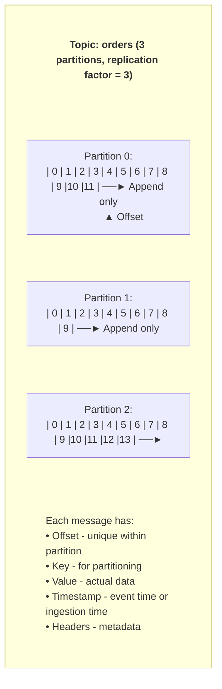

### Replication

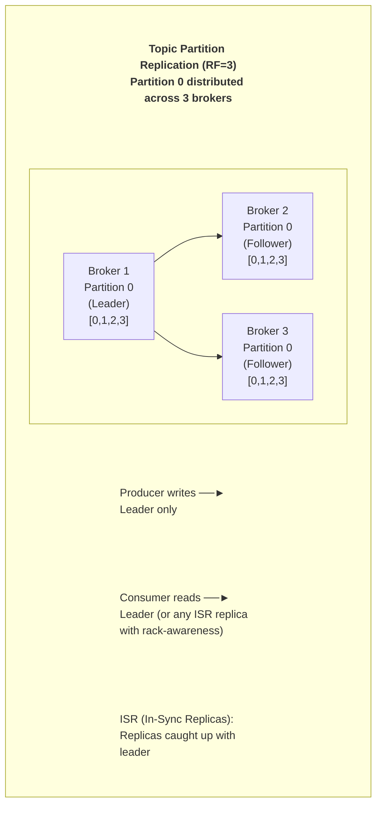

### Consumer Groups

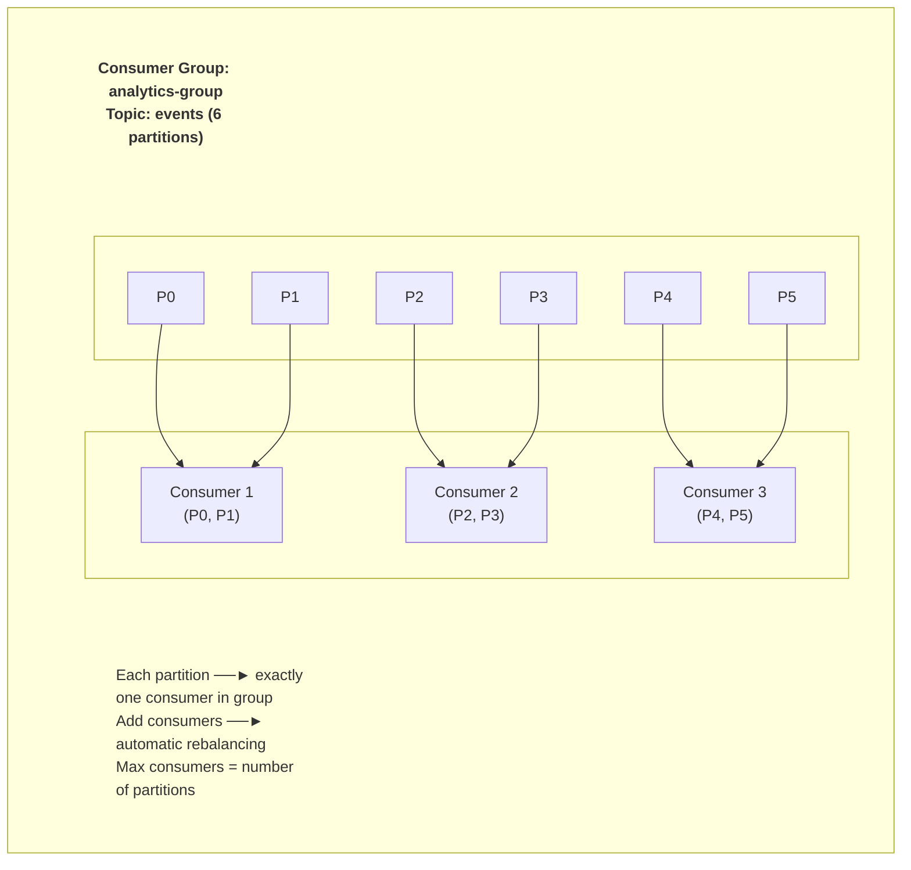

---

## 📚 Core Concepts

### 1. Message Format

```yaml
Record_Batch:
  Base_Offset: 1000
  Partition_Leader_Epoch: 5
  Magic: 2
  CRC: "checksum"
  Compression: "snappy"
  Timestamp_Type: "CreateTime"
  First_Timestamp: 1704067200000
  Records:
    - Offset: 1000
      Timestamp: 1704067200000
      Key: "user-123"
      Value: {"event": "click", "page": "/home"}
      Headers: 
        - ("source", "web")
        - ("version", "1")
    - Offset: 1001
      # ...
```

### 2. Producer Acknowledgments

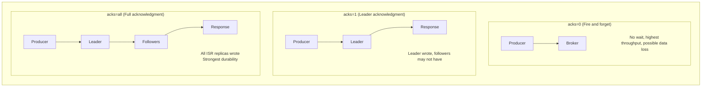

### 3. Delivery Semantics

**At-most-once:**
- Message may be lost
- Never duplicated
- Use: acks=0, no retries

**At-least-once:**
- Message never lost
- May be duplicated
- Use: acks=all, retries enabled

**Exactly-once:**
- Message delivered exactly once
- No loss, no duplicates
- Use: idempotent producer + transactions

```java
// Exactly-once producer config
props.put("enable.idempotence", "true");
props.put("acks", "all");
props.put("retries", Integer.MAX_VALUE);
props.put("transactional.id", "my-transactional-id");
```

### 4. Offset Management

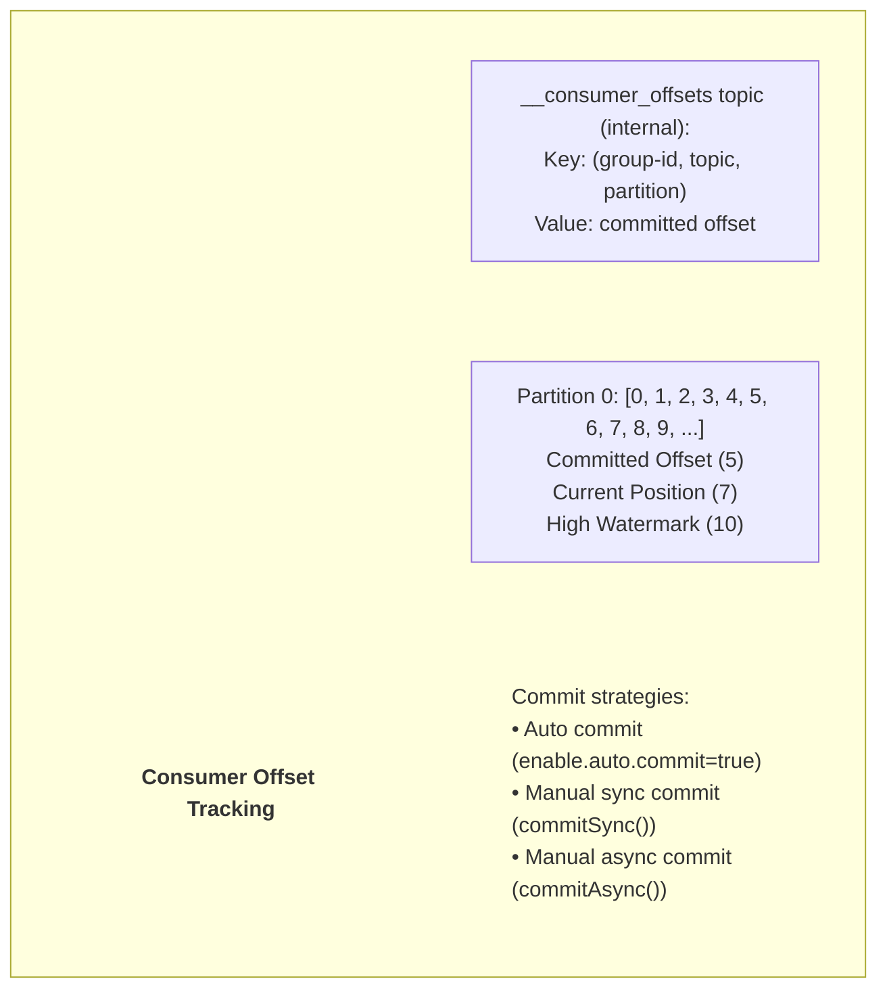

### 5. Tiered Storage (Kafka 3.6+)

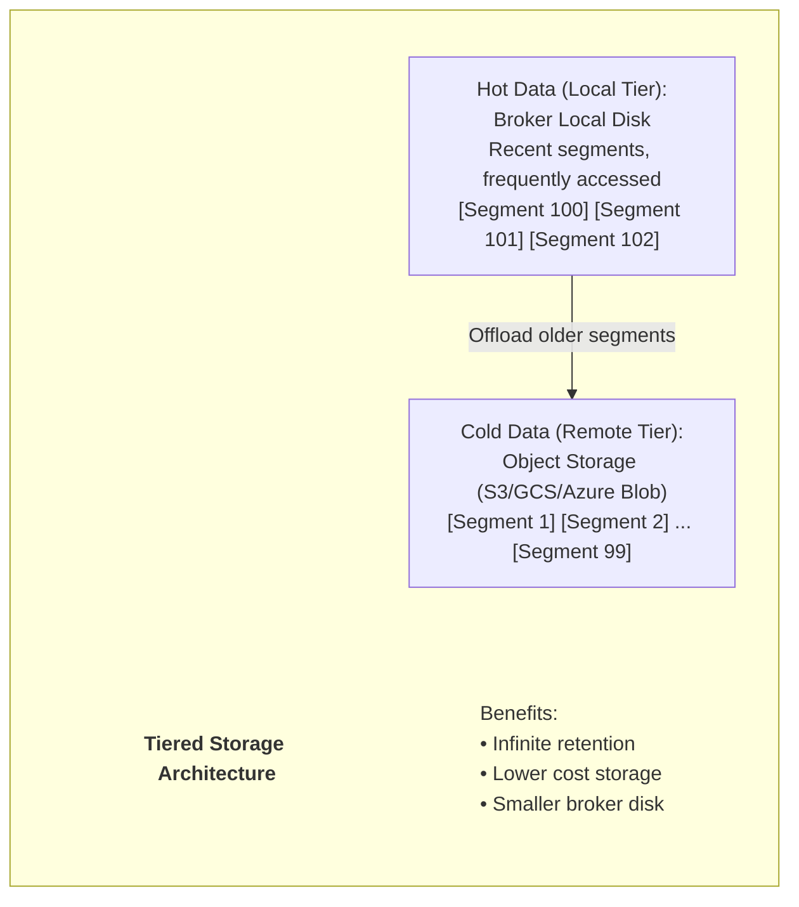

---

## 🔌 Kafka Connect

### Architecture

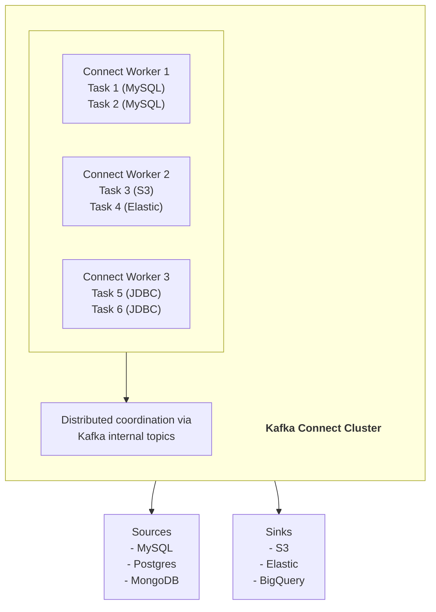

### Source Connector Example (Debezium CDC)

```json
{
  "name": "mysql-connector",
  "config": {
    "connector.class": "io.debezium.connector.mysql.MySqlConnector",
    "database.hostname": "mysql",
    "database.port": "3306",
    "database.user": "debezium",
    "database.password": "password",
    "database.server.id": "1",
    "database.server.name": "mysql-server",
    "database.include.list": "inventory",
    "table.include.list": "inventory.orders,inventory.customers",
    "database.history.kafka.bootstrap.servers": "kafka:9092",
    "database.history.kafka.topic": "schema-changes.inventory",
    "transforms": "route",
    "transforms.route.type": "org.apache.kafka.connect.transforms.RegexRouter",
    "transforms.route.regex": "([^.]+)\\.([^.]+)\\.([^.]+)",
    "transforms.route.replacement": "cdc.$3"
  }
}
```

### Sink Connector Example (S3)

```json
{
  "name": "s3-sink-connector",
  "config": {
    "connector.class": "io.confluent.connect.s3.S3SinkConnector",
    "tasks.max": "3",
    "topics": "events",
    "s3.bucket.name": "my-data-lake",
    "s3.region": "us-east-1",
    "flush.size": "10000",
    "rotate.interval.ms": "600000",
    "storage.class": "io.confluent.connect.s3.storage.S3Storage",
    "format.class": "io.confluent.connect.s3.format.parquet.ParquetFormat",
    "parquet.codec": "snappy",
    "partitioner.class": "io.confluent.connect.storage.partitioner.TimeBasedPartitioner",
    "path.format": "'year'=YYYY/'month'=MM/'day'=dd/'hour'=HH",
    "locale": "en-US",
    "timezone": "UTC",
    "partition.duration.ms": "3600000"
  }
}
```

---

## ⚡ Kafka Streams

### Overview

Kafka Streams là một **lightweight stream processing library** chạy như application thường, không cần cluster riêng.

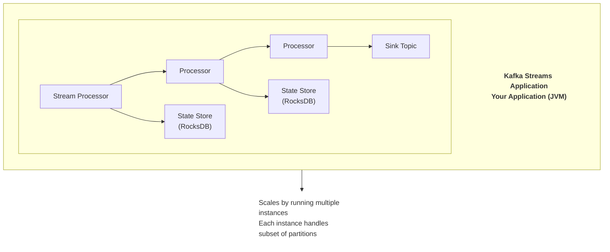

### DSL API

```java
StreamsBuilder builder = new StreamsBuilder();

// Read from input topic
KStream<String, String> source = builder.stream("input-topic");

// Transformations
KStream<String, Long> wordCounts = source
    .flatMapValues(value -> Arrays.asList(value.toLowerCase().split("\\W+")))
    .groupBy((key, word) -> word)
    .count()
    .toStream();

// Write to output topic
wordCounts.to("word-counts", Produced.with(Serdes.String(), Serdes.Long()));

// Build topology
KafkaStreams streams = new KafkaStreams(builder.build(), props);
streams.start();
```

### Stateful Operations

```java
// Aggregations with windowing
KTable<Windowed<String>, Long> hourlyClicks = clicks
    .groupByKey()
    .windowedBy(TimeWindows.ofSizeWithNoGrace(Duration.ofHours(1)))
    .count();

// Joins
KStream<String, EnrichedOrder> enrichedOrders = orders
    .join(
        customers,
        (order, customer) -> new EnrichedOrder(order, customer),
        JoinWindows.ofTimeDifferenceWithNoGrace(Duration.ofMinutes(5))
    );

// Interactive Queries
ReadOnlyKeyValueStore<String, Long> keyValueStore =
    streams.store(
        StoreQueryParameters.fromNameAndType("counts", QueryableStoreTypes.keyValueStore())
    );
Long count = keyValueStore.get("myKey");
```

---

## 💻 Hands-on Code Examples

### Python Producer

```python
from confluent_kafka import Producer
import json

# Configuration
config = {
    'bootstrap.servers': 'localhost:9092',
    'client.id': 'python-producer',
    'acks': 'all',
    'enable.idempotence': True,
    'retries': 10,
    'retry.backoff.ms': 100,
    'compression.type': 'snappy',
    'batch.size': 16384,
    'linger.ms': 5
}

producer = Producer(config)

def delivery_callback(err, msg):
    if err:
        print(f'Message delivery failed: {err}')
    else:
        print(f'Message delivered to {msg.topic()} [{msg.partition()}] @ offset {msg.offset()}')

# Send messages
for i in range(100):
    event = {
        'event_id': f'evt-{i}',
        'user_id': f'user-{i % 10}',
        'event_type': 'click',
        'timestamp': int(time.time() * 1000)
    }
    
    producer.produce(
        topic='events',
        key=event['user_id'],
        value=json.dumps(event),
        callback=delivery_callback
    )
    
    # Trigger delivery callbacks
    producer.poll(0)

# Wait for all messages to be delivered
producer.flush()
```

### Python Consumer

```python
from confluent_kafka import Consumer, KafkaError
import json

config = {
    'bootstrap.servers': 'localhost:9092',
    'group.id': 'python-consumer-group',
    'auto.offset.reset': 'earliest',
    'enable.auto.commit': False,
    'max.poll.interval.ms': 300000,
    'session.timeout.ms': 45000
}

consumer = Consumer(config)
consumer.subscribe(['events'])

try:
    while True:
        msg = consumer.poll(timeout=1.0)
        
        if msg is None:
            continue
        if msg.error():
            if msg.error().code() == KafkaError._PARTITION_EOF:
                continue
            else:
                print(f'Error: {msg.error()}')
                break
        
        # Process message
        event = json.loads(msg.value().decode('utf-8'))
        print(f"Received: {event}")
        
        # Manual commit
        consumer.commit(asynchronous=False)
        
finally:
    consumer.close()
```

### Java Producer with Transactions

```java
Properties props = new Properties();
props.put("bootstrap.servers", "localhost:9092");
props.put("key.serializer", "org.apache.kafka.common.serialization.StringSerializer");
props.put("value.serializer", "org.apache.kafka.common.serialization.StringSerializer");
props.put("acks", "all");
props.put("enable.idempotence", "true");
props.put("transactional.id", "my-transactional-producer");

KafkaProducer<String, String> producer = new KafkaProducer<>(props);

// Initialize transactions
producer.initTransactions();

try {
    producer.beginTransaction();
    
    for (int i = 0; i < 100; i++) {
        producer.send(new ProducerRecord<>("topic-a", "key-" + i, "value-" + i));
        producer.send(new ProducerRecord<>("topic-b", "key-" + i, "value-" + i));
    }
    
    producer.commitTransaction();
} catch (Exception e) {
    producer.abortTransaction();
    throw e;
}
```

### Flink + Kafka Integration

```python
# PyFlink Kafka source and sink
table_env.execute_sql("""
    CREATE TABLE kafka_source (
        event_id STRING,
        user_id STRING,
        event_type STRING,
        event_time TIMESTAMP(3),
        WATERMARK FOR event_time AS event_time - INTERVAL '5' SECOND
    ) WITH (
        'connector' = 'kafka',
        'topic' = 'events',
        'properties.bootstrap.servers' = 'localhost:9092',
        'properties.group.id' = 'flink-consumer',
        'scan.startup.mode' = 'earliest-offset',
        'format' = 'json'
    )
""")

table_env.execute_sql("""
    CREATE TABLE kafka_sink (
        user_id STRING,
        window_start TIMESTAMP(3),
        event_count BIGINT
    ) WITH (
        'connector' = 'kafka',
        'topic' = 'analytics',
        'properties.bootstrap.servers' = 'localhost:9092',
        'format' = 'json'
    )
""")

table_env.execute_sql("""
    INSERT INTO kafka_sink
    SELECT 
        user_id,
        TUMBLE_START(event_time, INTERVAL '5' MINUTE) AS window_start,
        COUNT(*) AS event_count
    FROM kafka_source
    GROUP BY 
        user_id,
        TUMBLE(event_time, INTERVAL '5' MINUTE)
""")
```

---

## 🎯 Use Cases Thực Tế

### 1. Event-Driven Architecture

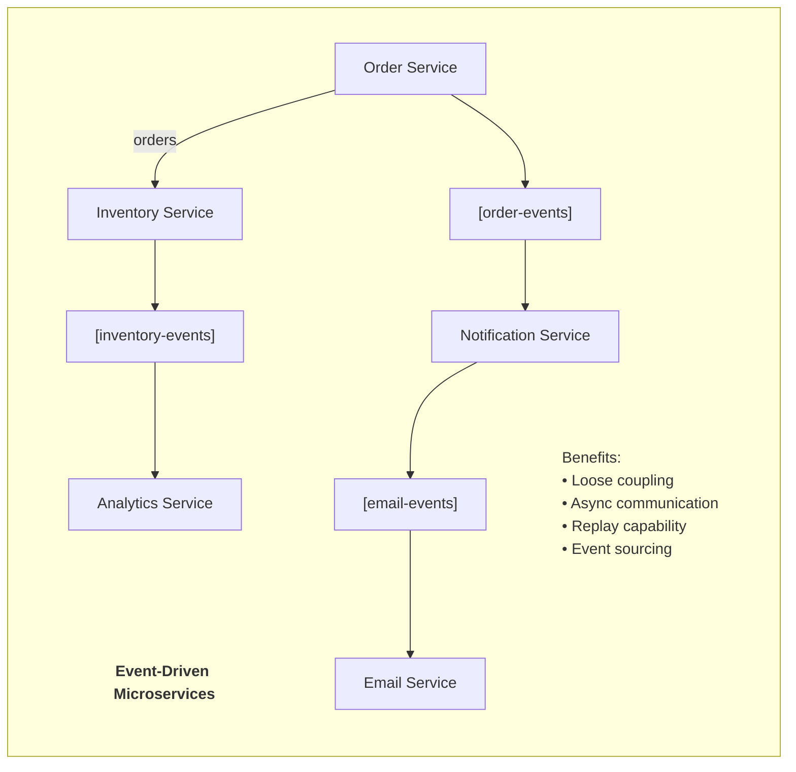

### 2. Real-time Data Pipeline

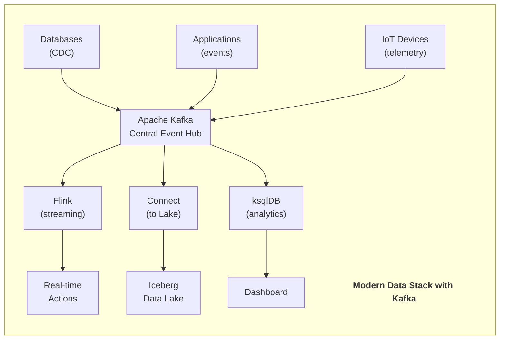

### 3. Log Aggregation

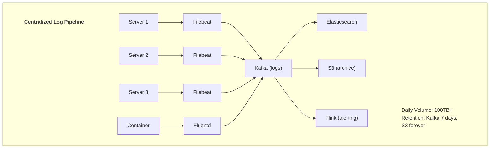

---

## ✅ Best Practices

### 1. Topic Design

**Naming Convention:**
```
<domain>.<entity>.<version>

Examples:
- orders.created.v1
- users.profile-updated.v1
- payments.processed.v1
```

**Partitioning Strategy:**
```
Partition count considerations:
• Start with: max(expected throughput / 10MB/s, consumer count)
• Each partition = one consumer max
• More partitions = more parallelism but more overhead
• Recommended: 6-12 partitions per broker

Partition key selection:
• User ID for user-centric data
• Order ID for order processing
• Session ID for session-based
• Random for maximum distribution
```

### 2. Producer Configuration

```python
# High throughput
config = {
    'batch.size': 32768,        # 32KB batches
    'linger.ms': 20,            # Wait up to 20ms to batch
    'compression.type': 'lz4',  # Fast compression
    'buffer.memory': 67108864,  # 64MB buffer
    'acks': '1'                 # Trade-off durability for speed
}

# High durability
config = {
    'acks': 'all',
    'enable.idempotence': True,
    'retries': 2147483647,
    'max.in.flight.requests.per.connection': 5,
    'compression.type': 'snappy'
}
```

### 3. Consumer Configuration

```python
# Performance tuning
config = {
    'fetch.min.bytes': 1048576,      # 1MB min fetch
    'fetch.max.wait.ms': 500,        # Wait up to 500ms
    'max.partition.fetch.bytes': 1048576,
    'max.poll.records': 500,
    'enable.auto.commit': False      # Manual commit for exactly-once
}
```

### 4. Replication & Durability

```
Recommended settings:
• replication.factor = 3
• min.insync.replicas = 2
• acks = all
• unclean.leader.election.enable = false

This ensures:
• Survive 1 broker failure
• No data loss on failover
• Strong durability guarantees
```

---

## 🏭 Production Operations

### Cluster Sizing

```
Broker count:
• Minimum: 3 (for fault tolerance)
• Production: 6-12 typically
• Scale based on: throughput, storage, partition count

Broker sizing (per broker):
• CPU: 8-16 cores
• Memory: 32-64 GB
• Disk: SSD recommended, 1-4 TB per broker
• Network: 10 Gbps

Calculation:
• Throughput: 10-100 MB/s per broker
• Storage: message_size × messages/day × retention_days × replication_factor
```

### Monitoring

**Key Metrics:**
```
Broker metrics:
• UnderReplicatedPartitions - Should be 0
• ActiveControllerCount - Should be 1
• OfflinePartitionsCount - Should be 0
• RequestHandlerAvgIdlePercent - Should be > 0.3

Producer metrics:
• record-error-rate
• request-latency-avg
• batch-size-avg

Consumer metrics:
• records-lag-max - Consumer lag
• fetch-rate
• commit-latency-avg
```

### KRaft Migration (from ZooKeeper)

```bash
# 1. Format storage
bin/kafka-storage.sh format -t $CLUSTER_ID -c config/kraft/server.properties

# 2. Start controller
bin/kafka-server-start.sh config/kraft/controller.properties

# 3. Migrate brokers one by one
# Update server.properties to use KRaft
# Restart broker

# 4. Remove ZooKeeper dependency
```

### Docker Compose Example

```yaml
version: '3.8'
services:
  kafka:
    image: confluentinc/cp-kafka:7.5.0
    hostname: kafka
    container_name: kafka
    ports:
      - "9092:9092"
      - "9101:9101"
    environment:
      KAFKA_NODE_ID: 1
      KAFKA_LISTENER_SECURITY_PROTOCOL_MAP: 'CONTROLLER:PLAINTEXT,PLAINTEXT:PLAINTEXT,PLAINTEXT_HOST:PLAINTEXT'
      KAFKA_ADVERTISED_LISTENERS: 'PLAINTEXT://kafka:29092,PLAINTEXT_HOST://localhost:9092'
      KAFKA_OFFSETS_TOPIC_REPLICATION_FACTOR: 1
      KAFKA_GROUP_INITIAL_REBALANCE_DELAY_MS: 0
      KAFKA_TRANSACTION_STATE_LOG_MIN_ISR: 1
      KAFKA_TRANSACTION_STATE_LOG_REPLICATION_FACTOR: 1
      KAFKA_JMX_PORT: 9101
      KAFKA_JMX_HOSTNAME: localhost
      KAFKA_PROCESS_ROLES: 'broker,controller'
      KAFKA_CONTROLLER_QUORUM_VOTERS: '1@kafka:29093'
      KAFKA_LISTENERS: 'PLAINTEXT://kafka:29092,CONTROLLER://kafka:29093,PLAINTEXT_HOST://0.0.0.0:9092'
      KAFKA_INTER_BROKER_LISTENER_NAME: 'PLAINTEXT'
      KAFKA_CONTROLLER_LISTENER_NAMES: 'CONTROLLER'
      KAFKA_LOG_DIRS: '/tmp/kraft-combined-logs'
      CLUSTER_ID: 'MkU3OEVBNTcwNTJENDM2Qk'
    volumes:
      - kafka-data:/var/lib/kafka/data

  kafka-ui:
    image: provectuslabs/kafka-ui:latest
    ports:
      - "8080:8080"
    environment:
      KAFKA_CLUSTERS_0_NAME: local
      KAFKA_CLUSTERS_0_BOOTSTRAPSERVERS: kafka:29092
    depends_on:
      - kafka

volumes:
  kafka-data:
```

---

## 📚 Resources

### Official
- Apache Kafka: https://kafka.apache.org/
- Confluent Platform: https://www.confluent.io/
- GitHub: https://github.com/apache/kafka

### Learning
- Kafka: The Definitive Guide (O'Reilly)
- Confluent Developer: https://developer.confluent.io/

### Community
- Confluent Community Slack
- Apache Kafka Users Mailing List

---

> **Document Version**: 1.0  
> **Last Updated**: December 31, 2025  
> **Kafka Version**: 4.1
