# ⚡ Apache Spark - Complete Guide

> **"Unified Analytics Engine for Big Data"**

---

## 📑 Mục Lục

1. [Giới Thiệu & Lịch Sử](#-giới-thiệu--lịch-sử)
2. [Kiến Trúc Chi Tiết](#-kiến-trúc-chi-tiết)
3. [Core Concepts](#-core-concepts)
4. [Spark SQL](#-spark-sql)
5. [Structured Streaming](#-structured-streaming)
6. [Spark Connect](#-spark-connect)
7. [Hands-on Code Examples](#-hands-on-code-examples)
8. [Use Cases Thực Tế](#-use-cases-thực-tế)
9. [Best Practices](#-best-practices)
10. [Production Operations](#-production-operations)

---

## 🌟 Giới Thiệu & Lịch Sử

### Spark là gì?

Apache Spark là một **unified analytics engine** cho large-scale data processing. Spark cung cấp high-level APIs trong Java, Scala, Python, R và SQL engine để chạy batch processing, stream processing, machine learning và graph computation.

### Lịch Sử Phát Triển

**2009** - Bắt đầu tại UC Berkeley AMPLab
- Matei Zaharia là lead developer
- Research project về in-memory cluster computing

**2010** - Open-sourced

**2013** - Donated cho Apache Software Foundation

**2014** - Became Apache Top-Level Project
- Spark 1.0 released
- Spark SQL introduced

**2015** - Spark 1.6 - Dataset API

**2016** - Spark 2.0 - Major overhaul
- Unified DataFrame and Dataset
- Structured Streaming introduced
- Tungsten execution engine

**2018** - Spark 2.4 - Pandas UDFs

**2020** - Spark 3.0 - Adaptive Query Execution
- Dynamic partition pruning
- ANSI SQL compliance improvements

**2022** - Spark 3.3 - Spark Connect (preview)
- Decoupled client-server architecture

**2023** - Spark 3.4-3.5 - Spark Connect GA
- Python improvements

**2024** - Spark 4.0 Preview
- Major API changes
- Better streaming
- Improved ML

**2025** - Spark 4.0 GA (December)
- Native Arrow support
- Enhanced Iceberg/Delta integration
- Spark Connect improvements
- Better Python integration

### Tại sao Spark thắng?

**vs Hadoop MapReduce:**
- 100x faster in-memory
- 10x faster on disk
- Better APIs (not just Map/Reduce)
- Interactive queries

**vs Flink:**
- Better batch processing
- Larger ecosystem
- More mature ML (MLlib)
- Easier to learn

### Spark Ecosystem

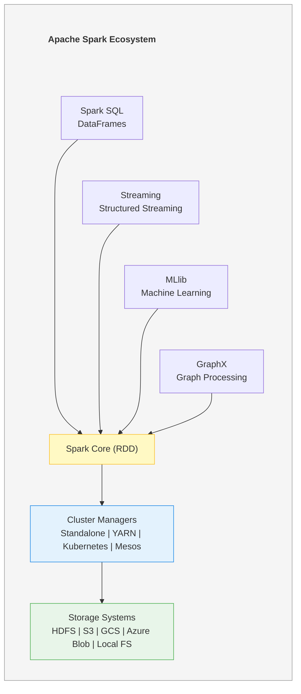

---

## 🏗️ Kiến Trúc Chi Tiết

### High-Level Architecture

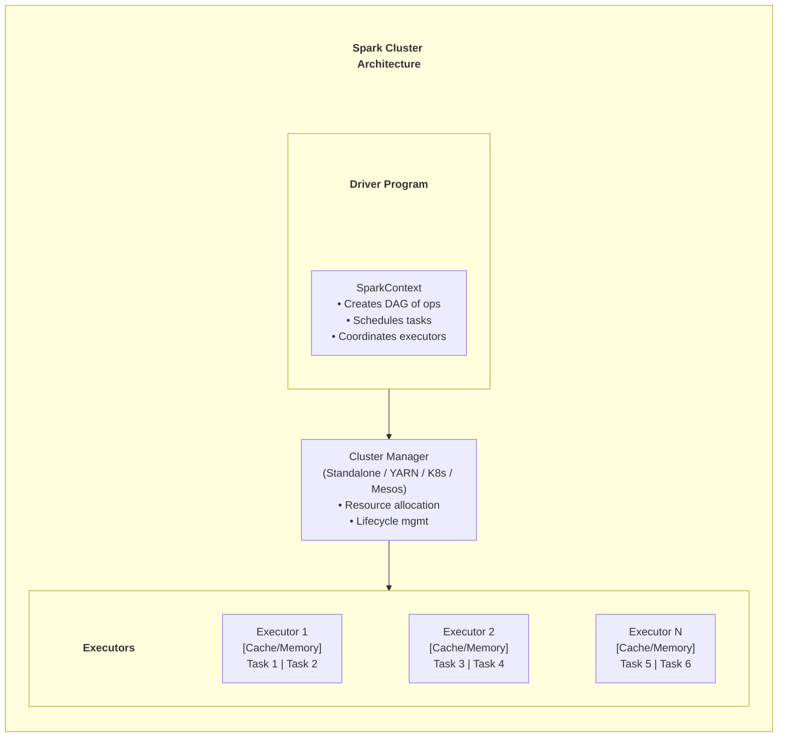

### Job Execution Flow

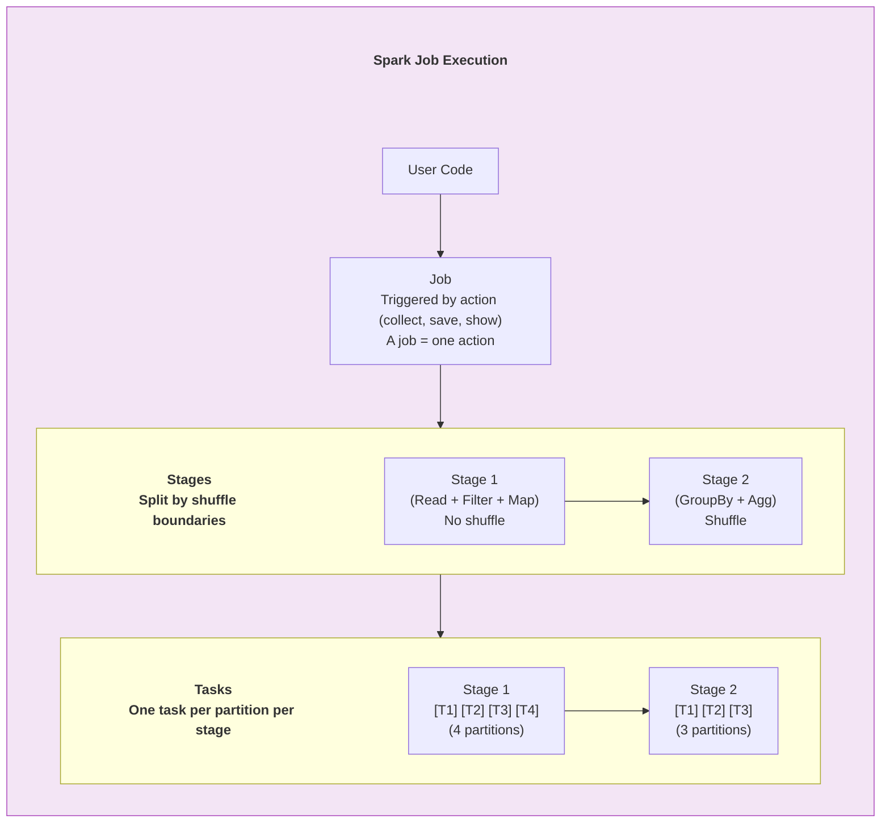

### Memory Management

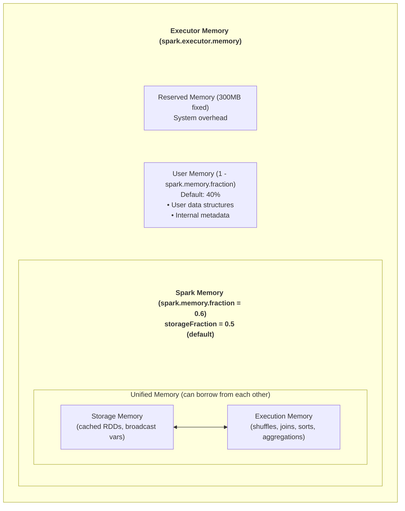

---

## 📚 Core Concepts

### 1. RDD (Resilient Distributed Dataset)


>RDD Properties:
• Immutable - Once created, cannot be changed
• Distributed - Partitioned across nodes
• Resilient - Can be recomputed from lineage

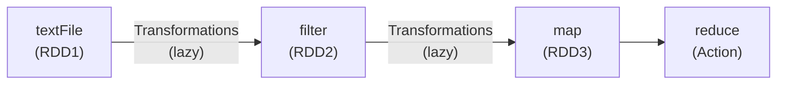

### 2. DataFrame & Dataset

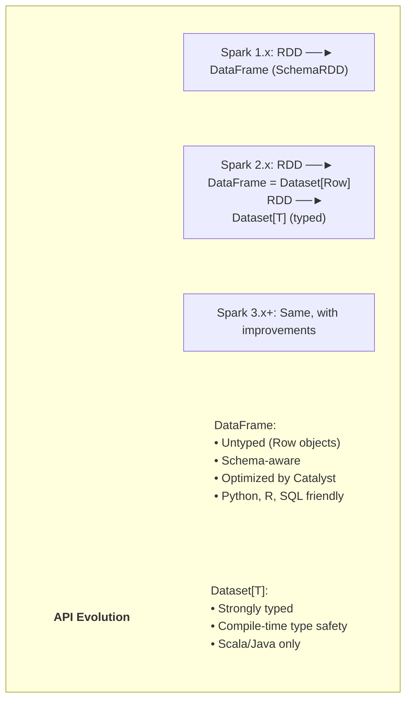

### 3. Catalyst Optimizer

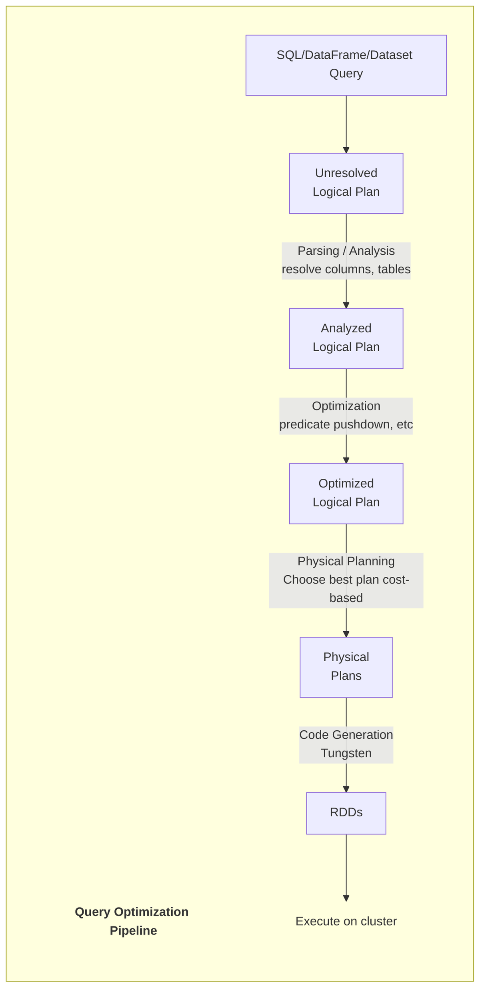

### 4. Adaptive Query Execution (AQE)

> **AQE Features (Spark 3.0+)**
> 
> 1. **Dynamic Coalescing of Shuffle Partitions**
>    * **Before:** 200 small partitions (default)
>    * **After:** Fewer, larger partitions based on data size
> 
> 2. **Switching Join Strategies at Runtime**
>    * **Plan:** Sort-Merge Join
>    * **Runtime:** Table is small → Switch to Broadcast Join
> 
> 3. **Skew Join Optimization**
>    * Detect skewed partitions → Split into smaller partitions
> 
> **Enable:**
> * `spark.sql.adaptive.enabled = true` (default in 3.2+)
> * `spark.sql.adaptive.coalescePartitions.enabled = true`
> * `spark.sql.adaptive.skewJoin.enabled = true`

---

## 🔍 Spark SQL

### DataFrame Operations

```python
from pyspark.sql import SparkSession
from pyspark.sql.functions import col, when, sum, avg, count, window

spark = SparkSession.builder \
    .appName("Spark SQL Example") \
    .config("spark.sql.adaptive.enabled", "true") \
    .getOrCreate()

# Read data
df = spark.read \
    .option("header", "true") \
    .option("inferSchema", "true") \
    .csv("s3://bucket/events/")

# Transformations
result = df \
    .filter(col("event_type") == "purchase") \
    .withColumn("revenue_category",
        when(col("amount") > 1000, "high")
        .when(col("amount") > 100, "medium")
        .otherwise("low")) \
    .groupBy("user_id", "revenue_category") \
    .agg(
        count("*").alias("purchase_count"),
        sum("amount").alias("total_revenue"),
        avg("amount").alias("avg_purchase")
    ) \
    .orderBy(col("total_revenue").desc())

# Show results
result.show()
```

### SQL Interface

```python
# Register temp view
df.createOrReplaceTempView("events")

# Run SQL query
result = spark.sql("""
    SELECT 
        user_id,
        DATE(event_time) AS event_date,
        COUNT(*) AS event_count,
        SUM(CASE WHEN event_type = 'purchase' THEN amount ELSE 0 END) AS revenue
    FROM events
    WHERE event_time >= '2024-01-01'
    GROUP BY user_id, DATE(event_time)
    HAVING COUNT(*) > 10
    ORDER BY revenue DESC
    LIMIT 100
""")
```

### Window Functions

```python
from pyspark.sql.window import Window

# Define window
user_window = Window.partitionBy("user_id").orderBy("event_time")

# Running totals
df_with_running = df \
    .withColumn("running_total", sum("amount").over(user_window)) \
    .withColumn("event_rank", row_number().over(user_window))

# Rolling average (last 7 days)
rolling_window = Window \
    .partitionBy("user_id") \
    .orderBy(col("event_time").cast("long")) \
    .rangeBetween(-7 * 86400, 0)

df_rolling = df \
    .withColumn("rolling_avg_7d", avg("amount").over(rolling_window))
```

---

## 🌊 Structured Streaming

### Architecture

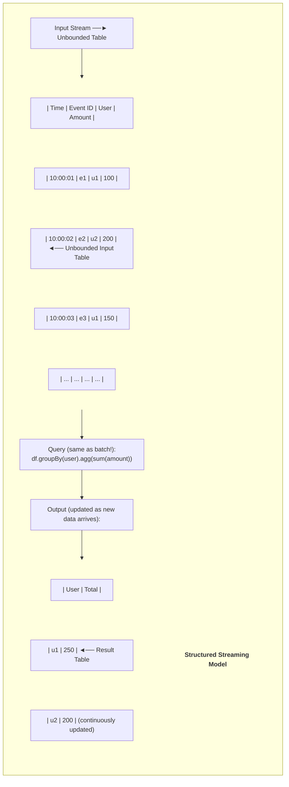

### Output Modes

> **Output Modes**
> 
> 1. **Complete Mode**
>    * Output entire result table
>    * Use for: Aggregations
>    
> 2. **Append Mode**
>    * Output only new rows
>    * Use for: Simple transformations, no aggregations
>    
> 3. **Update Mode**
>    * Output only updated rows
>    * Use for: Aggregations when only changes matter

### Streaming Example

```python
# Read from Kafka
events_stream = spark \
    .readStream \
    .format("kafka") \
    .option("kafka.bootstrap.servers", "localhost:9092") \
    .option("subscribe", "events") \
    .option("startingOffsets", "earliest") \
    .load()

# Parse JSON
from pyspark.sql.types import StructType, StructField, StringType, DoubleType, TimestampType

schema = StructType([
    StructField("event_id", StringType()),
    StructField("user_id", StringType()),
    StructField("event_type", StringType()),
    StructField("amount", DoubleType()),
    StructField("event_time", TimestampType())
])

parsed = events_stream \
    .select(from_json(col("value").cast("string"), schema).alias("data")) \
    .select("data.*") \
    .withWatermark("event_time", "10 minutes")

# Windowed aggregation
result = parsed \
    .groupBy(
        window("event_time", "5 minutes"),
        "user_id"
    ) \
    .agg(
        count("*").alias("event_count"),
        sum("amount").alias("total_amount")
    )

# Write to Iceberg
query = result \
    .writeStream \
    .format("iceberg") \
    .outputMode("append") \
    .option("checkpointLocation", "s3://bucket/checkpoints/hourly_stats") \
    .option("path", "iceberg_catalog.db.hourly_stats") \
    .trigger(processingTime="1 minute") \
    .start()

query.awaitTermination()
```

### Trigger Types

```python
# Process as fast as possible (default)
.trigger(processingTime="0 seconds")

# Fixed interval
.trigger(processingTime="1 minute")

# Process available data once (batch-like)
.trigger(once=True)

# Available now (Spark 3.3+)
.trigger(availableNow=True)

# Continuous processing (experimental, low latency)
.trigger(continuous="1 second")
```

---

## 🔗 Spark Connect

### Architecture (Spark 3.4+)

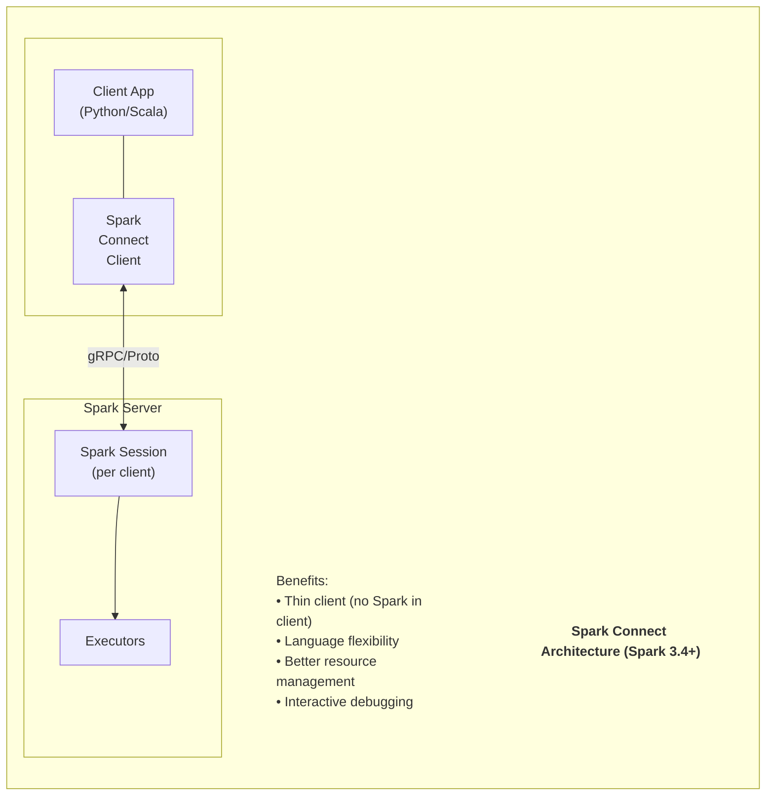

### Using Spark Connect

```python
# Client-side code (no Spark installation needed!)
from pyspark.sql import SparkSession

spark = SparkSession.builder \
    .remote("sc://spark-server:15002") \
    .getOrCreate()

# Same API as regular Spark
df = spark.read.parquet("s3://bucket/data/")
result = df.groupBy("category").count()
result.show()
```

---

## 💻 Hands-on Code Examples

### Complete ETL Pipeline

```python
from pyspark.sql import SparkSession
from pyspark.sql.functions import *
from pyspark.sql.types import *

# Initialize Spark with Iceberg
spark = SparkSession.builder \
    .appName("ETL Pipeline") \
    .config("spark.sql.extensions", "org.apache.iceberg.spark.extensions.IcebergSparkSessionExtensions") \
    .config("spark.sql.catalog.iceberg", "org.apache.iceberg.spark.SparkCatalog") \
    .config("spark.sql.catalog.iceberg.type", "hive") \
    .config("spark.sql.catalog.iceberg.warehouse", "s3://my-bucket/warehouse") \
    .config("spark.sql.adaptive.enabled", "true") \
    .config("spark.sql.adaptive.coalescePartitions.enabled", "true") \
    .getOrCreate()

# Read from multiple sources
orders = spark.read.parquet("s3://bucket/raw/orders/")
customers = spark.read.parquet("s3://bucket/raw/customers/")
products = spark.read.parquet("s3://bucket/raw/products/")

# Transformations
enriched_orders = orders \
    .join(customers, "customer_id", "left") \
    .join(products, "product_id", "left") \
    .withColumn("order_date", to_date("order_timestamp")) \
    .withColumn("order_month", date_format("order_date", "yyyy-MM")) \
    .withColumn("total_value", col("quantity") * col("unit_price")) \
    .withColumn("customer_segment",
        when(col("lifetime_value") > 10000, "premium")
        .when(col("lifetime_value") > 1000, "standard")
        .otherwise("new"))

# Aggregate
daily_summary = enriched_orders \
    .groupBy("order_date", "customer_segment", "product_category") \
    .agg(
        count("order_id").alias("order_count"),
        sum("total_value").alias("revenue"),
        countDistinct("customer_id").alias("unique_customers"),
        avg("total_value").alias("avg_order_value")
    )

# Write to Iceberg
daily_summary.writeTo("iceberg.analytics.daily_summary") \
    .partitionedBy("order_date") \
    .createOrReplace()
```

### Reading/Writing Table Formats

```python
# Read from Iceberg
iceberg_df = spark.read.format("iceberg").load("iceberg_catalog.db.table")

# Time travel
historical = spark.read \
    .format("iceberg") \
    .option("snapshot-id", "1234567890") \
    .load("iceberg_catalog.db.table")

# As of timestamp
as_of_df = spark.read \
    .format("iceberg") \
    .option("as-of-timestamp", "2024-01-01 00:00:00") \
    .load("iceberg_catalog.db.table")

# Read from Delta Lake
delta_df = spark.read.format("delta").load("s3://bucket/delta/table")

# Read from Hudi
hudi_df = spark.read.format("hudi").load("s3://bucket/hudi/table")

# Write to Delta Lake
df.write \
    .format("delta") \
    .mode("overwrite") \
    .partitionBy("date") \
    .save("s3://bucket/delta/output")

# Merge into Iceberg
spark.sql("""
    MERGE INTO iceberg_catalog.db.target t
    USING source s
    ON t.id = s.id
    WHEN MATCHED THEN UPDATE SET *
    WHEN NOT MATCHED THEN INSERT *
""")
```

### Machine Learning with MLlib

```python
from pyspark.ml import Pipeline
from pyspark.ml.feature import VectorAssembler, StandardScaler, StringIndexer
from pyspark.ml.classification import RandomForestClassifier
from pyspark.ml.evaluation import BinaryClassificationEvaluator

# Prepare data
data = spark.read.parquet("s3://bucket/ml/training_data/")

# Feature engineering
assembler = VectorAssembler(
    inputCols=["feature1", "feature2", "feature3"],
    outputCol="features_raw"
)

scaler = StandardScaler(
    inputCol="features_raw",
    outputCol="features"
)

indexer = StringIndexer(
    inputCol="label",
    outputCol="label_indexed"
)

# Model
rf = RandomForestClassifier(
    labelCol="label_indexed",
    featuresCol="features",
    numTrees=100
)

# Pipeline
pipeline = Pipeline(stages=[assembler, scaler, indexer, rf])

# Split data
train, test = data.randomSplit([0.8, 0.2], seed=42)

# Train
model = pipeline.fit(train)

# Evaluate
predictions = model.transform(test)
evaluator = BinaryClassificationEvaluator(labelCol="label_indexed")
auc = evaluator.evaluate(predictions)
print(f"AUC: {auc}")

# Save model
model.write().overwrite().save("s3://bucket/models/rf_model/")
```

---

## 🎯 Use Cases Thực Tế

### 1. Data Lake Analytics

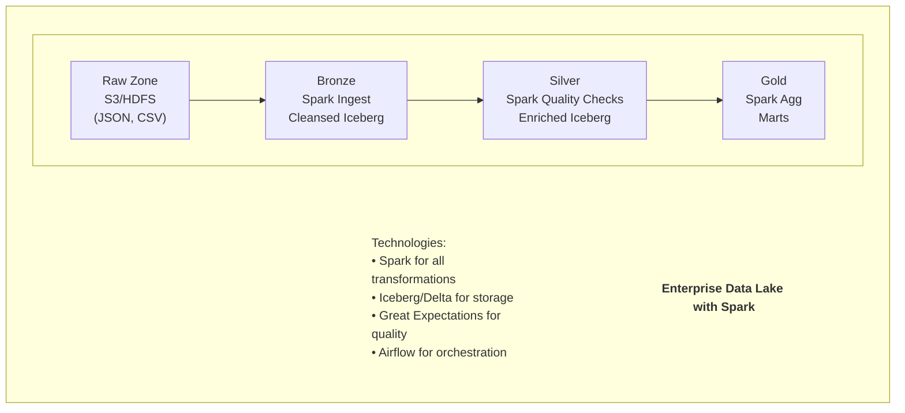

### 2. Real-time + Batch (Lambda Architecture)

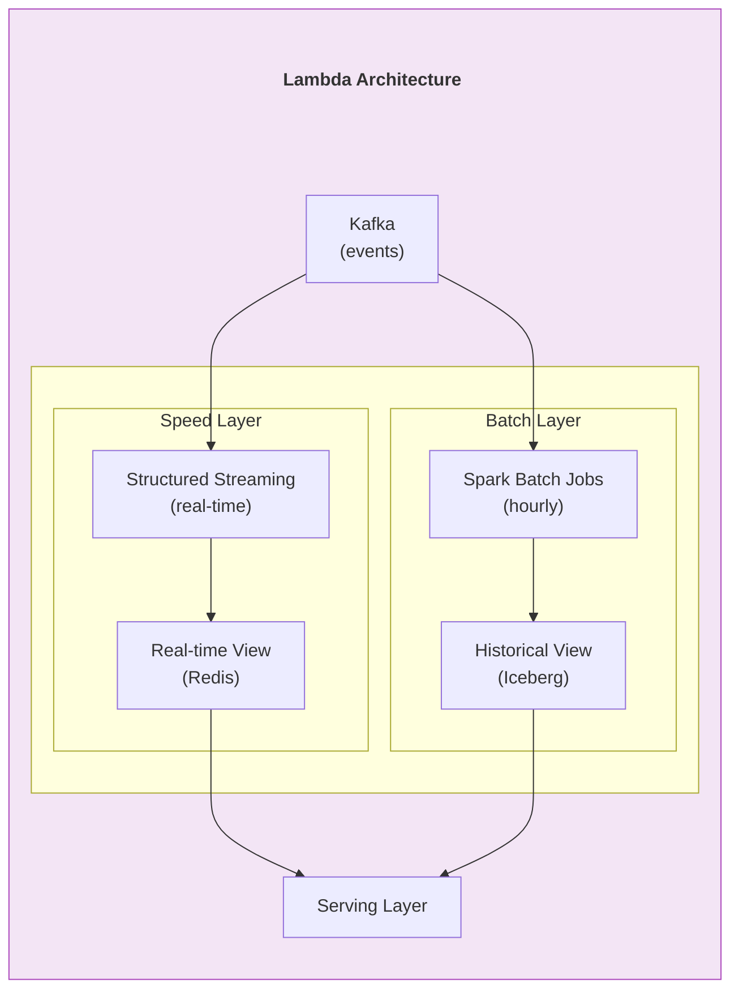

### 3. ML Feature Engineering at Scale

```python
# Feature engineering pipeline for millions of users
from pyspark.sql.window import Window

# User behavior features
user_window = Window.partitionBy("user_id")
time_window = Window.partitionBy("user_id").orderBy("event_time").rangeBetween(-7*86400, 0)

features = events \
    .withColumn("total_events_7d", count("*").over(time_window)) \
    .withColumn("total_purchase_7d", 
        sum(when(col("event_type") == "purchase", 1).otherwise(0)).over(time_window)) \
    .withColumn("total_revenue_7d",
        sum(when(col("event_type") == "purchase", col("amount")).otherwise(0)).over(time_window)) \
    .withColumn("avg_session_duration",
        avg("session_duration").over(user_window)) \
    .withColumn("days_since_first_visit",
        datediff(col("event_time"), min("event_time").over(user_window)))

# Latest features per user
latest_features = features \
    .withColumn("rn", row_number().over(
        Window.partitionBy("user_id").orderBy(col("event_time").desc()))) \
    .filter(col("rn") == 1) \
    .drop("rn")

# Write to feature store
latest_features.writeTo("iceberg.feature_store.user_features").createOrReplace()
```

---

## ✅ Best Practices

### 1. Partitioning

```python
# Optimal partition size: 128MB - 256MB
# Too few partitions = not enough parallelism
# Too many partitions = overhead

# Repartition when needed
df.repartition(100, "date")  # By column
df.coalesce(10)  # Reduce partitions (no shuffle)

# Check partition count
print(f"Partitions: {df.rdd.getNumPartitions()}")

# Configure default shuffle partitions
spark.conf.set("spark.sql.shuffle.partitions", "auto")  # AQE
# or fixed:
spark.conf.set("spark.sql.shuffle.partitions", "200")
```

### 2. Caching

```python
# Cache when reusing DataFrame multiple times
df.cache()  # or persist()
df.count()  # Trigger caching

# Use appropriate storage level
from pyspark import StorageLevel

df.persist(StorageLevel.MEMORY_AND_DISK)  # Default
df.persist(StorageLevel.MEMORY_ONLY)      # Fastest
df.persist(StorageLevel.DISK_ONLY)        # Large data
df.persist(StorageLevel.MEMORY_AND_DISK_SER)  # Serialized (smaller)

# Unpersist when done
df.unpersist()
```

### 3. Broadcast Joins

```python
# Small table joins - use broadcast
from pyspark.sql.functions import broadcast

# Explicit broadcast
result = large_df.join(broadcast(small_df), "key")

# Auto broadcast threshold
spark.conf.set("spark.sql.autoBroadcastJoinThreshold", "100MB")
```

### 4. Avoid Anti-Patterns

```python
# BAD: Using Python UDFs
@udf(returnType=StringType())
def my_udf(value):
    return value.upper()  # Slow!

# GOOD: Use built-in functions
df.withColumn("upper_value", upper(col("value")))

# BAD: Collecting large data to driver
all_data = df.collect()  # Memory explosion!

# GOOD: Process on cluster
df.write.parquet("output/")

# BAD: Too many small files
df.write.parquet("output/")  # Creates many files

# GOOD: Coalesce before writing
df.coalesce(10).write.parquet("output/")
```

---

## 🏭 Production Operations

### Cluster Configuration

```python
# Recommended configuration
spark = SparkSession.builder \
    .appName("Production Job") \
    .config("spark.executor.memory", "8g") \
    .config("spark.executor.cores", "4") \
    .config("spark.executor.instances", "10") \
    .config("spark.driver.memory", "4g") \
    .config("spark.sql.adaptive.enabled", "true") \
    .config("spark.sql.adaptive.coalescePartitions.enabled", "true") \
    .config("spark.sql.adaptive.skewJoin.enabled", "true") \
    .config("spark.serializer", "org.apache.spark.serializer.KryoSerializer") \
    .config("spark.sql.parquet.compression.codec", "snappy") \
    .getOrCreate()
```

### Kubernetes Deployment

```yaml
# spark-pi.yaml
apiVersion: "sparkoperator.k8s.io/v1beta2"
kind: SparkApplication
metadata:
  name: spark-etl-job
  namespace: spark-jobs
spec:
  type: Python
  pythonVersion: "3"
  mode: cluster
  image: "spark-custom:3.5.0"
  imagePullPolicy: Always
  mainApplicationFile: "s3://bucket/jobs/etl_job.py"
  sparkVersion: "3.5.0"
  restartPolicy:
    type: OnFailure
    onFailureRetries: 3
    onFailureRetryInterval: 10
  driver:
    cores: 2
    memory: "4g"
    serviceAccount: spark
  executor:
    cores: 4
    instances: 10
    memory: "8g"
  sparkConf:
    spark.sql.adaptive.enabled: "true"
    spark.kubernetes.executor.deleteOnTermination: "true"
```

### Monitoring


>Key Metrics to Monitor:
• Executor memory usage
• Shuffle read/write size
• Task duration
• GC time
• Shuffle spill (disk)
• Executor failures

>Tools:
• Spark UI (localhost:4040)
• Spark History Server
• Prometheus + Grafana
• Datadog / New Relic


---

## 📚 Resources

### Official
- Apache Spark: https://spark.apache.org/
- Documentation: https://spark.apache.org/docs/latest/
- GitHub: https://github.com/apache/spark

### Learning
- Learning Spark (O'Reilly)
- Spark: The Definitive Guide (O'Reilly)
- Databricks Academy

### Community
- Stack Overflow: [apache-spark]
- Spark User Mailing List

---

> **Document Version**: 1.0  
> **Last Updated**: December 31, 2025  
> **Spark Version**: 4.0
