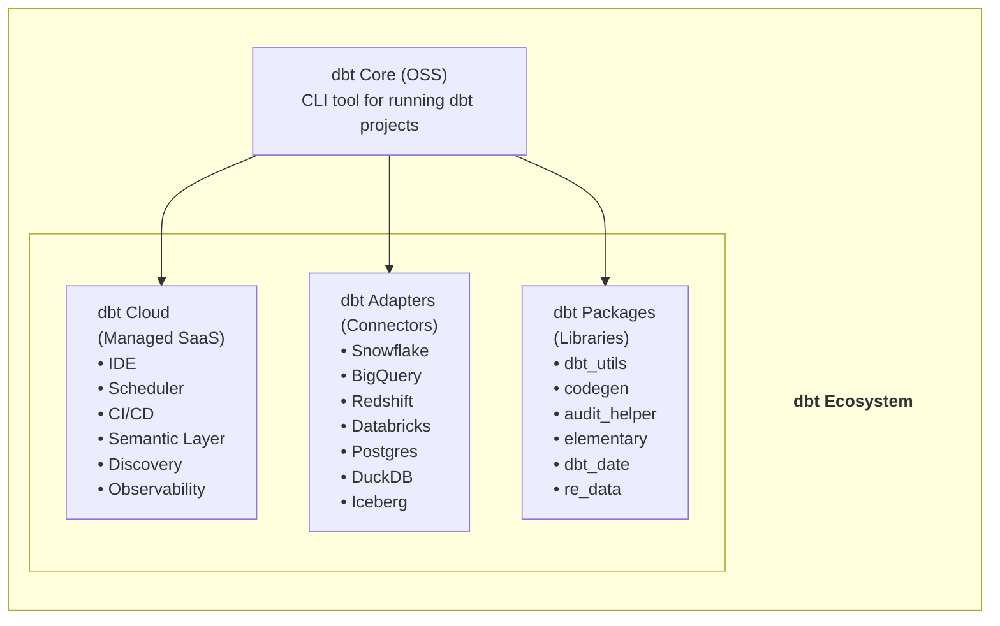
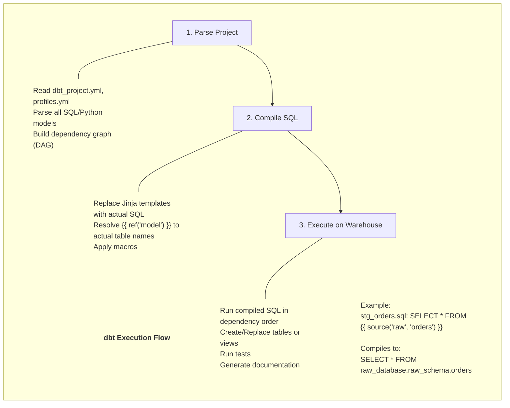
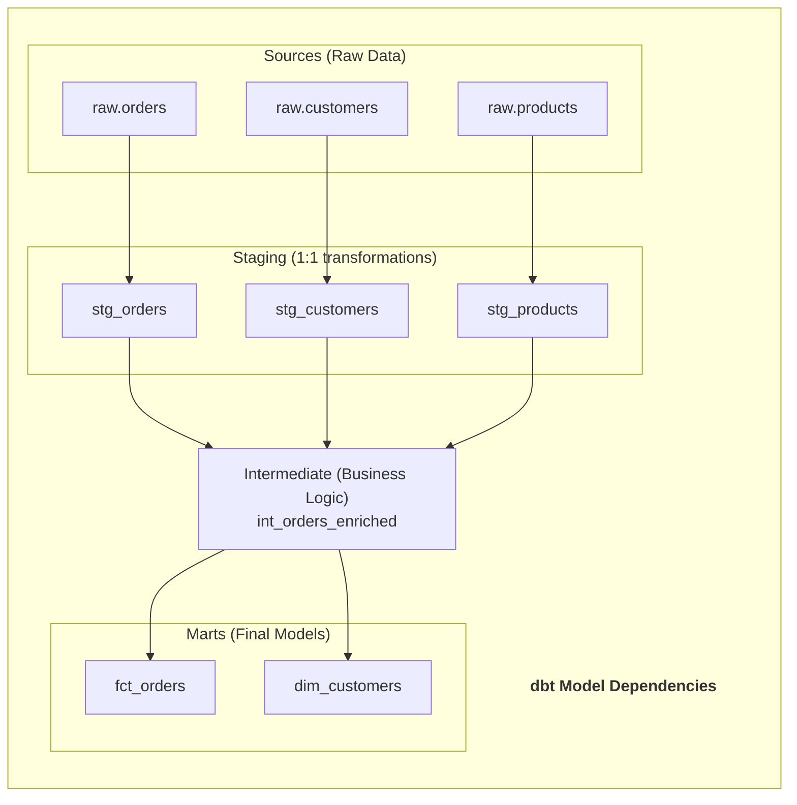
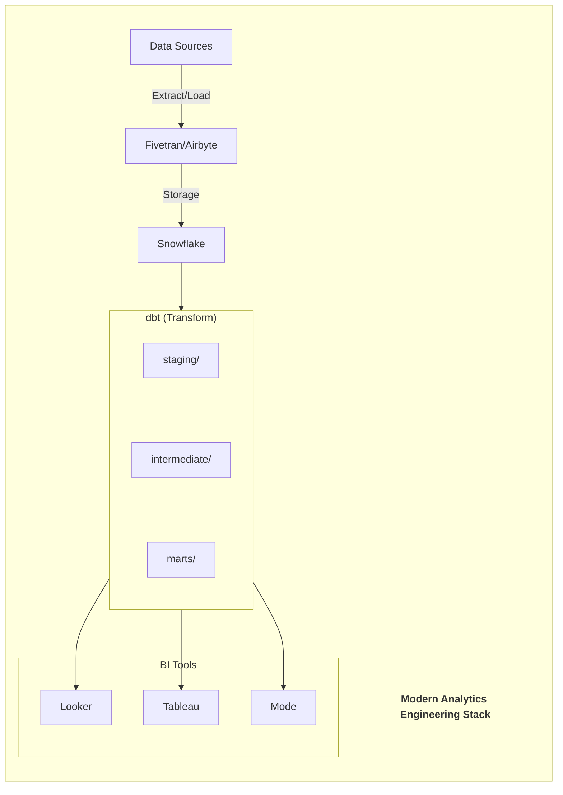
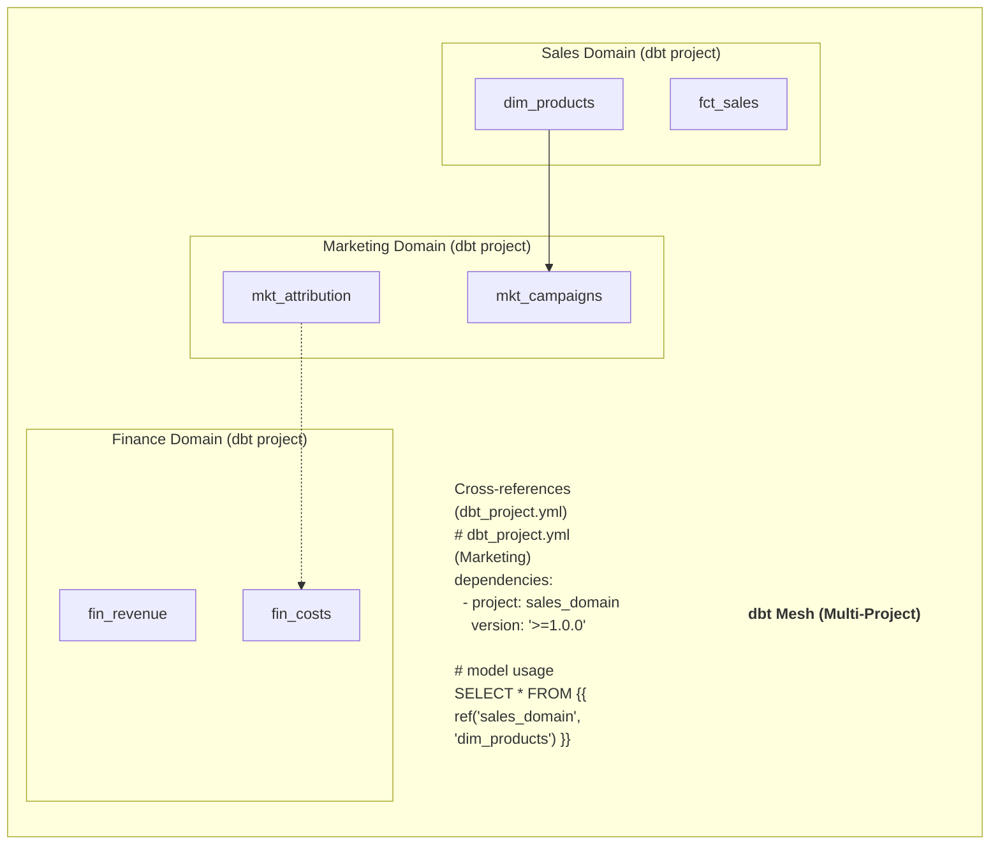

# 🔄 dbt (Data Build Tool) - Complete Guide

> **"Transform Data in Your Warehouse"**

---

## 📑 Mục Lục

1. [Giới Thiệu & Lịch Sử](#-giới-thiệu--lịch-sử)
2. [Kiến Trúc & Concepts](#-kiến-trúc--concepts)
3. [dbt Core vs dbt Cloud](#-dbt-core-vs-dbt-cloud)
4. [Models & Materializations](#-models--materializations)
5. [Testing & Documentation](#-testing--documentation)
6. [Advanced Features](#-advanced-features)
7. [Hands-on Code Examples](#-hands-on-code-examples)
8. [Use Cases Thực Tế](#-use-cases-thực-tế)
9. [Best Practices](#-best-practices)
10. [Production Operations](#-production-operations)

---

## 🌟 Giới Thiệu & Lịch Sử

### dbt là gì?

dbt (data build tool) là một **transformation workflow tool** cho phép data teams viết modular SQL queries và chạy chúng như một DAG (Directed Acyclic Graph). dbt tập trung vào bước "T" trong ELT (Extract, Load, Transform).

### Lịch Sử Phát Triển

**2016** - Fishtown Analytics (nay là dbt Labs) founded
- Tristan Handy và team
- Bắt đầu từ internal tool

**2016** - dbt Core v0.1 open-sourced
- Python-based CLI tool
- Support Redshift đầu tiên

**2017** - dbt Cloud launched
- Managed service

**2018** - Snowflake, BigQuery support
- Growing community

**2019** - dbt v0.14-0.15
- Snapshots introduced
- Better incremental models

**2020** - dbt v0.17-0.18
- Sources và exposures
- Better documentation

**2021** - $150M Series C funding
- dbt Semantic Layer announced
- Python models introduced

**2022** - dbt v1.0 GA
- Stable API
- dbt Metrics

**2023** - dbt v1.5-1.6
- Better Python integration
- Model contracts
- Unit testing

**2024** - dbt v1.7-1.8
- Semantic Layer improvements
- dbt Mesh
- Better observability

**2025** - dbt 2.0 (December)
- dbt Fusion Engine (faster)
- dbt Copilot (AI)
- dbt Canvas (visual)
- Enhanced Semantic Layer
- Native Iceberg/Delta support

### Tại sao dbt thắng?

**vs Stored Procedures:**
- Version controlled
- Testable
- Documented
- Modular

**vs Custom Python ETL:**
- Simpler (SQL-based)
- Built-in testing
- Auto-documentation
- DAG visualization

**vs Spark/Airflow:**
- Focused on transformations
- Lighter weight
- Faster iteration
- Better for analysts

### dbt Ecosystem





---

## 🏗️ Kiến Trúc & Concepts

### dbt Project Structure

```bash
my_dbt_project/
├── dbt_project.yml           # Project configuration
├── profiles.yml              # Connection profiles (usually in ~/.dbt/)
│
├── models/                   # SQL/Python models
│   ├── staging/              # Raw data transformations
│   │   ├── stg_orders.sql
│   │   ├── stg_customers.sql
│   │   └── staging.yml       # Model configs & tests
│   │
│   ├── intermediate/         # Business logic
│   │   └── int_orders_enriched.sql
│   │
│   └── marts/                # Final models for consumption
│       ├── core/
│       │   ├── dim_customers.sql
│       │   └── fct_orders.sql
│       └── marketing/
│           └── mkt_user_segments.sql
│
├── seeds/                    # CSV files loaded to warehouse
│   └── country_codes.csv
│
├── snapshots/                # Slowly changing dimensions
│   └── customers_snapshot.sql
│
├── macros/                   # Reusable SQL functions
│   └── generate_surrogate_key.sql
│
├── tests/                    # Custom tests
│   └── assert_positive_values.sql
│
├── analyses/                 # Ad-hoc queries (not materialized)
│   └── weekly_report.sql
│
└── target/                   # Compiled SQL (generated)
```

### How dbt Works





### DAG (Directed Acyclic Graph)


dbt Model Dependencies:



---

## ⚖️ dbt Core vs dbt Cloud

### Feature Comparison

**dbt Core (Open Source):**
- Free, self-hosted
- CLI-based
- Manual scheduling (Airflow, cron)
- No built-in IDE
- Community support

**dbt Cloud (Managed):**
- Paid tiers (Free tier available)
- Web-based IDE
- Built-in scheduler
- CI/CD integration
- Semantic Layer
- Discovery/Catalog
- Enterprise support

### When to Choose

**Choose dbt Core when:**
- Budget constraints
- Already have orchestration (Airflow)
- Need full control
- On-premise requirements

**Choose dbt Cloud when:**
- Want managed service
- Need Semantic Layer
- Team collaboration features
- Quick setup

---

## 📦 Models & Materializations

### Model Types

**1. Views (default)**
```sql
-- models/staging/stg_orders.sql
-- Materialized as VIEW

SELECT 
    id AS order_id,
    user_id AS customer_id,
    created_at AS order_date,
    status,
    total_amount
FROM {{ source('raw', 'orders') }}
WHERE status != 'cancelled'
```

**2. Tables**
```sql
-- models/marts/fct_orders.sql
{{ config(materialized='table') }}

SELECT 
    o.order_id,
    o.customer_id,
    c.customer_name,
    o.order_date,
    o.total_amount
FROM {{ ref('stg_orders') }} o
LEFT JOIN {{ ref('dim_customers') }} c 
    ON o.customer_id = c.customer_id
```

**3. Incremental**
```sql
-- models/marts/fct_events.sql
{{ config(
    materialized='incremental',
    unique_key='event_id',
    incremental_strategy='merge'
) }}

SELECT 
    event_id,
    user_id,
    event_type,
    event_timestamp,
    properties
FROM {{ source('raw', 'events') }}


    WHERE event_timestamp > (SELECT MAX(event_timestamp) FROM {{ this }})

```

**4. Ephemeral (CTEs)**
```sql
-- models/staging/stg_temp_calc.sql
{{ config(materialized='ephemeral') }}

-- This becomes a CTE in downstream models
SELECT 
    id,
    value * 1.1 AS adjusted_value
FROM {{ source('raw', 'values') }}
```

### Incremental Strategies


> **Strategy Options**
> 
> 1. **append**
>    * Simply `INSERT` new rows
>    * Use when: No updates, append-only
> 
> 2. **merge (default for most warehouses)**
>    * `MERGE` on unique_key
>    * Use when: Need to UPDATE existing rows
> 
> 3. **delete+insert**
>    * Delete matching rows, then insert
>    * Use when: Merge not available/efficient
> 
> 4. **insert_overwrite**
>    * Replace entire partitions
>    * Use when: Partition-level updates

### Snapshots (SCD Type 2)

```sql
-- snapshots/customers_snapshot.sql


{{
    config(
        target_database='analytics',
        target_schema='snapshots',
        unique_key='customer_id',
        strategy='timestamp',
        updated_at='updated_at'
    )
}}

SELECT 
    customer_id,
    name,
    email,
    subscription_tier,
    updated_at
FROM {{ source('raw', 'customers') }}


```

Result structure:
```
customer_id | name  | tier    | dbt_valid_from | dbt_valid_to   | dbt_scd_id
1           | Alice | free    | 2024-01-01     | 2024-06-15     | abc123
1           | Alice | premium | 2024-06-15     | NULL           | def456
```

---

## ✅ Testing & Documentation

### Built-in Tests

```yaml
# models/staging/staging.yml
version: 2

models:
  - name: stg_orders
    description: "Cleaned orders from source system"
    columns:
      - name: order_id
        description: "Primary key"
        tests:
          - unique
          - not_null
      
      - name: customer_id
        description: "Foreign key to customers"
        tests:
          - not_null
          - relationships:
              to: ref('dim_customers')
              field: customer_id
      
      - name: status
        description: "Order status"
        tests:
          - accepted_values:
              values: ['pending', 'completed', 'shipped', 'returned']
      
      - name: total_amount
        tests:
          - not_null
          # Custom test
          - dbt_utils.expression_is_true:
              expression: ">= 0"
```

### Custom Tests

```sql
-- tests/assert_order_amounts_match.sql
-- This test fails if any rows are returned

SELECT 
    order_id,
    sum_of_items,
    total_amount,
    ABS(sum_of_items - total_amount) AS diff
FROM {{ ref('fct_orders') }} o
JOIN (
    SELECT order_id, SUM(item_amount) AS sum_of_items
    FROM {{ ref('fct_order_items') }}
    GROUP BY order_id
) i ON o.order_id = i.order_id
WHERE ABS(sum_of_items - total_amount) > 0.01
```

### Generic Tests

```sql
-- tests/generic/test_is_positive.sql


SELECT *
FROM {{ model }}
WHERE {{ column_name }} < 0


```

Usage:
```yaml
columns:
  - name: quantity
    tests:
      - is_positive
```

### Unit Tests (dbt 1.8+)

```yaml
# models/marts/unit_tests.yml
unit_tests:
  - name: test_order_total_calculation
    model: fct_orders
    given:
      - input: ref('stg_orders')
        rows:
          - {order_id: 1, quantity: 2, unit_price: 10.00}
          - {order_id: 2, quantity: 3, unit_price: 5.00}
    expect:
      rows:
        - {order_id: 1, total_amount: 20.00}
        - {order_id: 2, total_amount: 15.00}
```

### Documentation

```yaml
# models/marts/schema.yml
version: 2

models:
  - name: fct_orders
    description: |
      # Fact Orders
      
      This model contains all completed orders with customer and product details.
      
      ## Business Logic
      - Only includes orders with status = 'completed'
      - Total amount includes tax and shipping
      
      ## Usage
      Join with `dim_customers` for customer attributes.
    
    meta:
      owner: "data-team@company.com"
      tier: "gold"
      pii: false
    
    columns:
      - name: order_id
        description: "Unique order identifier (surrogate key)"
      - name: customer_id
        description: "Reference to dim_customers"
```

Generate docs:
```bash
dbt docs generate
dbt docs serve
```

---

## 🚀 Advanced Features

### Macros

```sql
-- macros/generate_surrogate_key.sql

    {{ dbt_utils.generate_surrogate_key(columns) }}


-- macros/cents_to_dollars.sql

    ROUND({{ column_name }} / 100.0, 2)


-- Usage in model:
SELECT 
    {{ generate_surrogate_key(['order_id', 'line_item_id']) }} AS pk,
    {{ cents_to_dollars('amount_cents') }} AS amount_dollars
FROM {{ ref('stg_orders') }}
```

### Jinja & Control Flow

```sql
-- Dynamic column selection


SELECT 
    order_id,
    
    SUM(CASE WHEN payment_method = '{{ payment_method }}' 
        THEN amount ELSE 0 END) AS {{ payment_method }}_amount
    ,
    
FROM {{ ref('stg_payments') }}
GROUP BY order_id
```

### Hooks

```sql
-- dbt_project.yml
on-run-start:
  - "{{ log('Starting dbt run', info=True) }}"
  - "CREATE SCHEMA IF NOT EXISTS {{ target.schema }}_staging"

on-run-end:
  - "GRANT SELECT ON ALL TABLES IN SCHEMA {{ target.schema }} TO ROLE analyst"
  - "{{ log('dbt run completed', info=True) }}"

# Model-level hooks
models:
  my_project:
    marts:
      +post-hook:
        - "ANALYZE TABLE {{ this }}"
```

### Python Models (dbt 1.3+)

```python
# models/ml/customer_segments.py
import pandas as pd
from sklearn.cluster import KMeans

def model(dbt, session):
    # Reference upstream model
    customers_df = dbt.ref("fct_customer_metrics").to_pandas()
    
    # Feature engineering
    features = customers_df[['total_orders', 'total_revenue', 'avg_order_value']]
    
    # Clustering
    kmeans = KMeans(n_clusters=4, random_state=42)
    customers_df['segment'] = kmeans.fit_predict(features)
    
    # Map segment names
    segment_names = {0: 'low_value', 1: 'growing', 2: 'loyal', 3: 'champions'}
    customers_df['segment_name'] = customers_df['segment'].map(segment_names)
    
    return customers_df
```

### Semantic Layer (dbt Cloud)

```yaml
# models/semantic/metrics.yml
semantic_models:
  - name: orders
    defaults:
      agg_time_dimension: order_date
    model: ref('fct_orders')
    
    entities:
      - name: order_id
        type: primary
      - name: customer_id
        type: foreign
    
    dimensions:
      - name: order_date
        type: time
        type_params:
          time_granularity: day
      - name: status
        type: categorical
    
    measures:
      - name: order_count
        agg: count
        expr: order_id
      - name: total_revenue
        agg: sum
        expr: total_amount
      - name: average_order_value
        agg: average
        expr: total_amount

metrics:
  - name: revenue
    type: simple
    type_params:
      measure: total_revenue
    
  - name: revenue_growth
    type: derived
    type_params:
      expr: (current_revenue - previous_revenue) / previous_revenue
      metrics:
        - name: current_revenue
          filter: "{{ TimeDimension('order_date', 'month') }} = current_month"
        - name: previous_revenue
          filter: "{{ TimeDimension('order_date', 'month') }} = previous_month"
```

---

## 💻 Hands-on Code Examples

### Project Setup

```bash
# Install dbt
pip install dbt-snowflake  # or dbt-bigquery, dbt-postgres, etc.

# Initialize project
dbt init my_project
cd my_project

# Configure connection (profiles.yml)
# Usually at ~/.dbt/profiles.yml
```

```yaml
# ~/.dbt/profiles.yml
my_project:
  target: dev
  outputs:
    dev:
      type: snowflake
      account: myaccount.us-east-1
      user: "{{ env_var('SNOWFLAKE_USER') }}"
      password: "{{ env_var('SNOWFLAKE_PASSWORD') }}"
      role: TRANSFORMER
      database: ANALYTICS
      warehouse: TRANSFORMING
      schema: DEV_{{ env_var('USER') }}
      threads: 4
    
    prod:
      type: snowflake
      account: myaccount.us-east-1
      user: "{{ env_var('SNOWFLAKE_USER') }}"
      password: "{{ env_var('SNOWFLAKE_PASSWORD') }}"
      role: TRANSFORMER
      database: ANALYTICS
      warehouse: TRANSFORMING
      schema: PROD
      threads: 8
```

### Complete Model Examples

**Source Definition:**
```yaml
# models/staging/sources.yml
version: 2

sources:
  - name: raw
    database: raw_database
    schema: raw_schema
    freshness:
      warn_after: {count: 12, period: hour}
      error_after: {count: 24, period: hour}
    loaded_at_field: _loaded_at
    tables:
      - name: orders
        identifier: orders_table  # actual table name if different
      - name: customers
      - name: products
```

**Staging Model:**
```sql
-- models/staging/stg_orders.sql
WITH source AS (
    SELECT * FROM {{ source('raw', 'orders') }}
),

renamed AS (
    SELECT 
        -- Primary key
        id AS order_id,
        
        -- Foreign keys
        user_id AS customer_id,
        
        -- Timestamps
        created_at AS ordered_at,
        updated_at,
        
        -- Dimensions
        LOWER(status) AS status,
        shipping_method,
        
        -- Measures
        subtotal_cents,
        tax_cents,
        shipping_cents,
        (subtotal_cents + tax_cents + shipping_cents) AS total_cents,
        
        -- Metadata
        _loaded_at
        
    FROM source
)

SELECT * FROM renamed
```

**Intermediate Model:**
```sql
-- models/intermediate/int_orders_with_items.sql
{{ config(materialized='ephemeral') }}

WITH orders AS (
    SELECT * FROM {{ ref('stg_orders') }}
),

order_items AS (
    SELECT 
        order_id,
        COUNT(*) AS item_count,
        SUM(quantity) AS total_quantity,
        SUM(item_total_cents) AS items_total_cents
    FROM {{ ref('stg_order_items') }}
    GROUP BY order_id
)

SELECT 
    o.*,
    oi.item_count,
    oi.total_quantity,
    oi.items_total_cents
FROM orders o
LEFT JOIN order_items oi ON o.order_id = oi.order_id
```

**Mart Model:**
```sql
-- models/marts/core/fct_orders.sql
{{ config(
    materialized='incremental',
    unique_key='order_id',
    cluster_by=['ordered_at_date']
) }}

WITH orders AS (
    SELECT * FROM {{ ref('int_orders_with_items') }}
),

customers AS (
    SELECT * FROM {{ ref('dim_customers') }}
),

final AS (
    SELECT 
        -- Surrogate key
        {{ dbt_utils.generate_surrogate_key(['o.order_id']) }} AS order_key,
        
        -- Natural keys
        o.order_id,
        o.customer_id,
        c.customer_key,
        
        -- Timestamps
        o.ordered_at,
        DATE(o.ordered_at) AS ordered_at_date,
        
        -- Dimensions
        o.status,
        o.shipping_method,
        c.customer_segment,
        
        -- Measures (converted to dollars)
        {{ cents_to_dollars('o.subtotal_cents') }} AS subtotal,
        {{ cents_to_dollars('o.tax_cents') }} AS tax,
        {{ cents_to_dollars('o.shipping_cents') }} AS shipping,
        {{ cents_to_dollars('o.total_cents') }} AS total,
        o.item_count,
        o.total_quantity,
        
        -- Metadata
        CURRENT_TIMESTAMP() AS _dbt_updated_at
        
    FROM orders o
    LEFT JOIN customers c ON o.customer_id = c.customer_id
    
    
    WHERE o.updated_at > (SELECT MAX(_dbt_updated_at) FROM {{ this }})
    
)

SELECT * FROM final
```

### dbt Commands

```bash
# Run all models
dbt run

# Run specific model
dbt run --select fct_orders

# Run model and all upstream
dbt run --select +fct_orders

# Run model and all downstream
dbt run --select fct_orders+

# Run by tag
dbt run --select tag:daily

# Run by folder
dbt run --select marts.core

# Full refresh incremental
dbt run --select fct_orders --full-refresh

# Test
dbt test
dbt test --select fct_orders

# Generate docs
dbt docs generate
dbt docs serve

# Compile SQL (no execution)
dbt compile

# Seed data
dbt seed

# Snapshot
dbt snapshot

# Source freshness
dbt source freshness

# Debug connection
dbt debug
```

---

## 🎯 Use Cases Thực Tế

### 1. Analytics Engineering Stack





### 2. Data Mesh with dbt Mesh





### 3. CI/CD Pipeline

```yaml
# .github/workflows/dbt_ci.yml
name: dbt CI

on:
  pull_request:
    branches: [main]

jobs:
  dbt-test:
    runs-on: ubuntu-latest
    
    steps:
      - uses: actions/checkout@v3
      
      - name: Setup Python
        uses: actions/setup-python@v4
        with:
          python-version: '3.10'
      
      - name: Install dbt
        run: pip install dbt-snowflake
      
      - name: Run dbt
        env:
          SNOWFLAKE_USER: ${{ secrets.SNOWFLAKE_USER }}
          SNOWFLAKE_PASSWORD: ${{ secrets.SNOWFLAKE_PASSWORD }}
        run: |
          dbt deps
          dbt build --target ci --select state:modified+
      
      - name: Upload artifacts
        uses: actions/upload-artifact@v3
        with:
          name: dbt-artifacts
          path: target/
```

---

## ✅ Best Practices

### 1. Project Structure

```
Naming Conventions:
• stg_ for staging models (1:1 with source)
• int_ for intermediate models
• dim_ for dimension tables
• fct_ for fact tables
• agg_ for aggregate tables

Layer Organization:
• staging: Clean & rename source columns only
• intermediate: Join staging models, business logic
• marts: Final models organized by department/domain
```

### 2. Model Configurations

```yaml
# dbt_project.yml
models:
  my_project:
    staging:
      +materialized: view
      +schema: staging
    
    intermediate:
      +materialized: ephemeral
    
    marts:
      +materialized: table
      core:
        +schema: core
      marketing:
        +schema: marketing
```

### 3. Testing Strategy

> **Testing Levels**
> 
> 1. **Source Tests**
>    - Freshness checks
>    - Row count expectations
> 
> 2. **Staging Tests**
>    - `not_null` on PKs
>    - `unique` on PKs
>    - `accepted_values` for enums
> 
> 3. **Mart Tests**
>    - Relationships (FK integrity)
>    - Business logic validation
>    - `dbt_expectations` (advanced)
> 
> 4. **Unit Tests (dbt 1.8+)**
>    - Test specific transformations
>    - Edge cases


### 4. Performance Tips

```sql
-- Use ephemeral for intermediate CTEs
{{ config(materialized='ephemeral') }}

-- Cluster/partition large tables
{{ config(
    materialized='table',
    cluster_by=['date_column'],
    partition_by={
        "field": "date_column",
        "data_type": "date",
        "granularity": "day"
    }
) }}

-- Limit columns in SELECT
SELECT 
    only,
    needed,
    columns
FROM {{ ref('large_table') }}

-- Use incremental for large fact tables
{{ config(
    materialized='incremental',
    unique_key='id',
    on_schema_change='append_new_columns'
) }}
```

---

## 🏭 Production Operations

### Orchestration with Airflow

```python
from airflow import DAG
from airflow.operators.bash import BashOperator
from datetime import datetime

default_args = {
    'owner': 'data-team',
    'retries': 2
}

with DAG(
    'dbt_daily',
    default_args=default_args,
    schedule_interval='0 6 * * *',
    start_date=datetime(2024, 1, 1),
    catchup=False
) as dag:
    
    dbt_deps = BashOperator(
        task_id='dbt_deps',
        bash_command='cd /dbt && dbt deps'
    )
    
    dbt_run = BashOperator(
        task_id='dbt_run',
        bash_command='cd /dbt && dbt run --target prod'
    )
    
    dbt_test = BashOperator(
        task_id='dbt_test',
        bash_command='cd /dbt && dbt test --target prod'
    )
    
    dbt_deps >> dbt_run >> dbt_test
```

### Monitoring with Elementary

```yaml
# packages.yml
packages:
  - package: elementary-data/elementary
    version: 0.13.0
```

```sql
-- models/elementary/elementary_test_results.sql
{{ config(materialized='table') }}
SELECT * FROM {{ ref('elementary', 'test_results') }}
```

---

## 📚 Resources

### Official
- dbt Docs: https://docs.getdbt.com/
- dbt Cloud: https://cloud.getdbt.com/
- GitHub: https://github.com/dbt-labs/dbt-core

### Learning
- dbt Learn: https://courses.getdbt.com/
- dbt Community Slack
- Analytics Engineering Podcast

### Packages
- dbt Hub: https://hub.getdbt.com/

---

> **Document Version**: 1.0  
> **Last Updated**: December 31, 2025  
> **dbt Version**: 2.0
