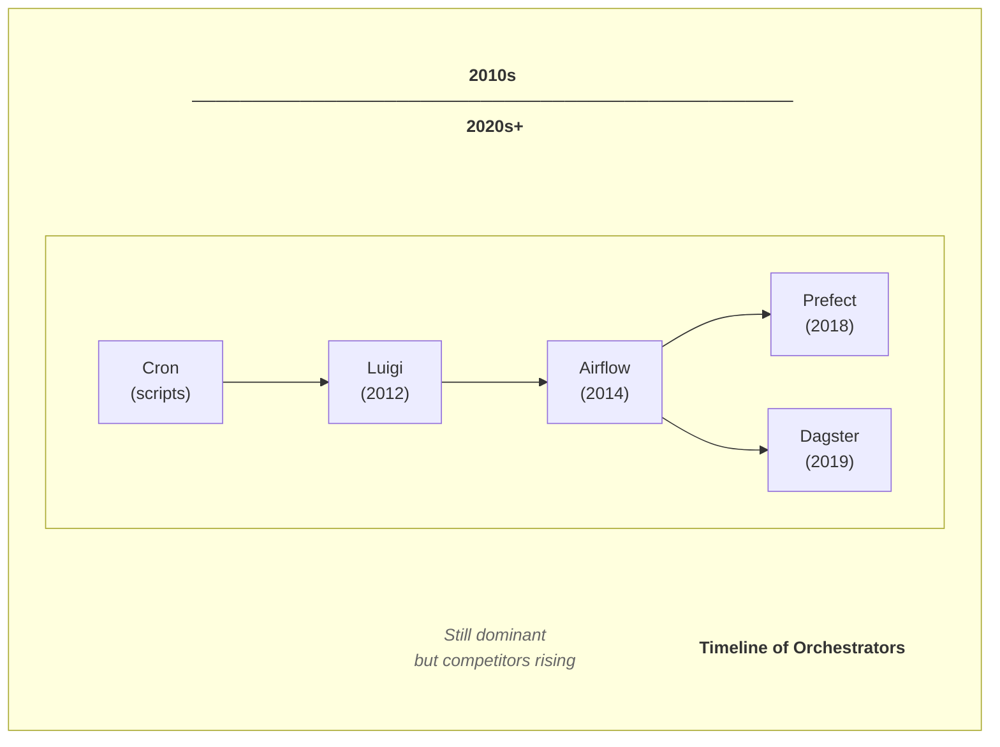
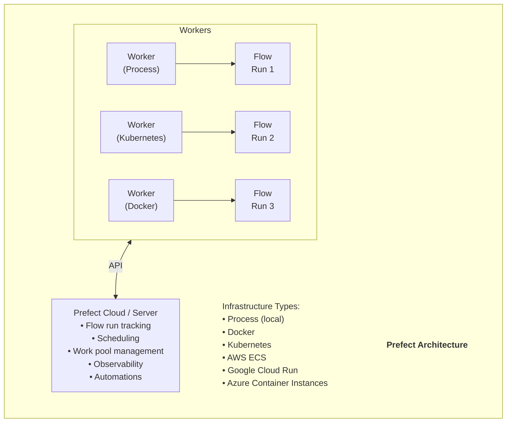
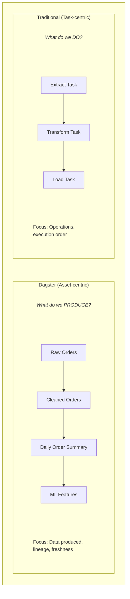
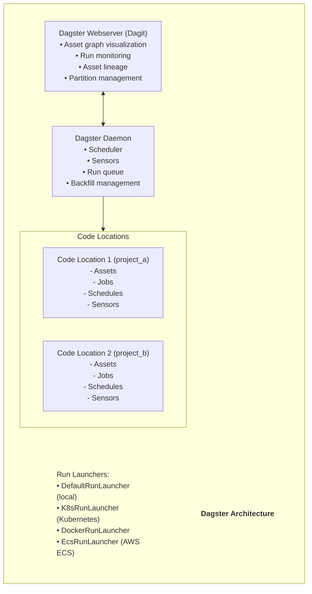

# 🔮 Prefect & Dagster - Modern Orchestrators Guide

> **"Next-Generation Workflow Orchestration"**

---

## 📑 Mục Lục

1. [Tổng Quan So Sánh](#-tổng-quan-so-sánh)
2. [Prefect Deep Dive](#-prefect-deep-dive)
3. [Dagster Deep Dive](#-dagster-deep-dive)
4. [Feature Comparison](#-feature-comparison)
5. [Code Examples](#-code-examples)
6. [When to Choose What](#-when-to-choose-what)
7. [Migration Guide](#-migration-guide)

---

## 🔄 Tổng Quan So Sánh

### Evolution of Orchestration



### Key Differences at a Glance

> **Airflow vs Prefect vs Dagster:**
> 
> * **Philosophy:**
>   * Airflow: Tasks first, data implicit
>   * Prefect: Tasks first, but simpler
>   * Dagster: Assets/Data first, tasks derived
> 
> * **Deployment:**
>   * Airflow: Self-hosted complex, managed options
>   * Prefect: Simple self-host, excellent cloud
>   * Dagster: Simple self-host, excellent cloud
> 
> * **Learning Curve:**
>   * Airflow: Steep (many concepts)
>   * Prefect: Gentle (Python-native)
>   * Dagster: Moderate (new paradigm)
> 
> * **Testing:**
>   * Airflow: Difficult
>   * Prefect: Easy (just Python)
>   * Dagster: Excellent (built-in)

---

## 🌊 Prefect Deep Dive

### Introduction & History

**Prefect là gì?**
Prefect là một **modern workflow orchestration framework** được thiết kế để "negative engineering" - giảm bớt boilerplate code và complexity khi xây dựng data pipelines. Founded by Jeremiah Lowin (former Airflow contributor).

**History:**
- **2018** - Prefect founded, Prefect 1.0 (Core + Cloud)
- **2020** - Prefect Server open-sourced
- **2022** - Prefect 2.0 (Orion) - Complete rewrite
- **2023** - Prefect 2.x improvements
- **2024** - Prefect 3.0 announced
- **2025** - Prefect 3.x GA với enhanced features

### Architecture



### Core Concepts

**1. Flows & Tasks:**
```python
from prefect import flow, task

@task
def extract():
    """A task is the smallest unit of work"""
    return [1, 2, 3]

@task
def transform(data: list) -> list:
    """Tasks can have retries, caching, etc."""
    return [x * 2 for x in data]

@task
def load(data: list):
    """Tasks report state to Prefect"""
    print(f"Loading {data}")

@flow
def etl_flow():
    """A flow is a container for tasks"""
    data = extract()
    transformed = transform(data)
    load(transformed)

# Run locally - it's just Python!
etl_flow()
```

**2. Deployments:**
```python
from prefect import flow
from prefect.deployments import Deployment
from prefect.infrastructure import KubernetesJob

@flow
def my_flow():
    pass

# Create deployment
deployment = Deployment.build_from_flow(
    flow=my_flow,
    name="production",
    infrastructure=KubernetesJob(
        namespace="prefect",
        image="my-registry/my-image:latest",
    ),
    work_pool_name="kubernetes-pool",
    schedule={"cron": "0 6 * * *"}
)
deployment.apply()
```

**3. Work Pools:**
```yaml
# Work Pool types:
# - Process: Local execution
# - Docker: Container execution
# - Kubernetes: K8s job execution
# - Cloud Run: GCP serverless
# - ECS: AWS container execution
```

**4. Blocks (Secrets & Config):**
```python
from prefect.blocks.system import Secret
from prefect_aws import S3Bucket

# Create and save block
secret_block = Secret(value="my-api-key")
secret_block.save("api-key")

# Load and use
secret = Secret.load("api-key")
api_key = secret.get()

# S3 Block
s3_block = S3Bucket.load("my-bucket")
s3_block.upload_from_path("local_file.csv", "remote_path/file.csv")
```

### Prefect Code Examples

**Complete ETL Pipeline:**
```python
from prefect import flow, task
from prefect.tasks import task_input_hash
from datetime import timedelta
import pandas as pd

@task(
    retries=3,
    retry_delay_seconds=60,
    cache_key_fn=task_input_hash,
    cache_expiration=timedelta(hours=1)
)
def extract_data(source: str) -> pd.DataFrame:
    """Extract with caching and retries"""
    # Simulated extraction
    return pd.DataFrame({"id": [1, 2, 3], "value": [100, 200, 300]})

@task(log_prints=True)
def transform_data(df: pd.DataFrame) -> pd.DataFrame:
    """Transform with logging"""
    df["value_doubled"] = df["value"] * 2
    print(f"Transformed {len(df)} rows")
    return df

@task(tags=["database", "critical"])
def load_data(df: pd.DataFrame, table: str):
    """Load with tags for filtering"""
    print(f"Loading {len(df)} rows to {table}")
    # db.write(df, table)

@flow(name="Daily ETL Pipeline")
def etl_pipeline(
    source: str = "s3://bucket/data",
    target_table: str = "analytics.daily_summary"
):
    """Main ETL flow with parameters"""
    raw_data = extract_data(source)
    transformed = transform_data(raw_data)
    load_data(transformed, target_table)
    
    return {"rows_processed": len(transformed)}

if __name__ == "__main__":
    # Run locally
    result = etl_pipeline()
    print(f"Result: {result}")
```

**Parallel Execution:**
```python
from prefect import flow, task
from prefect.futures import wait
import asyncio

@task
def process_partition(partition_id: int) -> dict:
    """Process a single partition"""
    import time
    time.sleep(1)  # Simulate work
    return {"partition": partition_id, "status": "complete"}

@flow
def parallel_processing():
    """Run tasks in parallel using .submit()"""
    # Submit tasks (non-blocking)
    futures = [process_partition.submit(i) for i in range(10)]
    
    # Wait for all to complete
    wait(futures)
    
    # Get results
    results = [f.result() for f in futures]
    return results

# Async flow
@flow
async def async_flow():
    """Native async support"""
    results = await asyncio.gather(
        process_partition(1),
        process_partition(2),
        process_partition(3)
    )
    return results
```

**Subflows:**
```python
from prefect import flow, task

@task
def task_a():
    return "A"

@task
def task_b():
    return "B"

@flow
def subflow_1():
    """First subflow"""
    return task_a()

@flow
def subflow_2():
    """Second subflow"""
    return task_b()

@flow
def parent_flow():
    """Parent flow orchestrating subflows"""
    result_1 = subflow_1()
    result_2 = subflow_2()
    return f"{result_1} + {result_2}"
```

---

## ⚗️ Dagster Deep Dive

### Introduction & History

**Dagster là gì?**
Dagster là một **data orchestrator for the whole development lifecycle** với focus vào software-defined assets. Created by Elementl, founded by Nick Schrock (creator of GraphQL).

**History:**
- **2019** - Dagster founded, first release
- **2020** - Growing adoption, asset-focused approach
- **2021** - Dagster Cloud launched
- **2022** - Software-Defined Assets (SDA) becomes primary abstraction
- **2023** - Asset-centric features mature
- **2024** - Enhanced observability, dbt integration
- **2025** - Dagster+ (enhanced cloud), native Iceberg support

### Philosophy: Assets vs Tasks



### Architecture



### Core Concepts

**1. Software-Defined Assets:**
```python
from dagster import asset, AssetExecutionContext
import pandas as pd

@asset(
    description="Raw orders from source system",
    group_name="raw",
    compute_kind="python",
)
def raw_orders() -> pd.DataFrame:
    """Load raw orders data"""
    return pd.read_csv("s3://bucket/orders.csv")

@asset(
    description="Cleaned orders with business rules applied",
    group_name="staging",
    deps=[raw_orders],  # Explicit dependency
)
def cleaned_orders(raw_orders: pd.DataFrame) -> pd.DataFrame:
    """Clean and validate orders"""
    df = raw_orders.dropna(subset=["order_id"])
    df = df[df["amount"] > 0]
    return df

@asset(
    description="Daily order aggregates",
    group_name="marts",
)
def daily_order_summary(cleaned_orders: pd.DataFrame) -> pd.DataFrame:
    """Aggregate orders by day"""
    return cleaned_orders.groupby("order_date").agg({
        "order_id": "count",
        "amount": "sum"
    }).reset_index()
```

**2. Resources (Dependency Injection):**
```python
from dagster import asset, ConfigurableResource, Definitions
import boto3

class S3Resource(ConfigurableResource):
    bucket_name: str
    
    def get_client(self):
        return boto3.client("s3")
    
    def read_file(self, key: str) -> bytes:
        client = self.get_client()
        response = client.get_object(Bucket=self.bucket_name, Key=key)
        return response["Body"].read()

@asset
def my_asset(s3: S3Resource) -> pd.DataFrame:
    """Asset that uses S3 resource"""
    data = s3.read_file("data/input.csv")
    return pd.read_csv(io.BytesIO(data))

# Define resources
defs = Definitions(
    assets=[my_asset],
    resources={
        "s3": S3Resource(bucket_name="my-bucket")
    }
)
```

**3. Partitions:**
```python
from dagster import asset, DailyPartitionsDefinition, AssetExecutionContext

daily_partitions = DailyPartitionsDefinition(start_date="2024-01-01")

@asset(partitions_def=daily_partitions)
def daily_events(context: AssetExecutionContext) -> pd.DataFrame:
    """Partitioned asset by date"""
    partition_date = context.partition_key
    
    # Load only this partition's data
    df = load_events_for_date(partition_date)
    
    context.log.info(f"Loaded {len(df)} events for {partition_date}")
    return df

# Run for specific partition
# dagster asset materialize -a daily_events --partition 2024-01-15
```

**4. Schedules & Sensors:**
```python
from dagster import (
    asset, 
    define_asset_job, 
    ScheduleDefinition,
    sensor,
    RunRequest,
    SensorEvaluationContext
)

# Job from assets
daily_job = define_asset_job(
    name="daily_pipeline",
    selection=["raw_orders", "cleaned_orders", "daily_order_summary"]
)

# Schedule
daily_schedule = ScheduleDefinition(
    job=daily_job,
    cron_schedule="0 6 * * *",  # 6 AM daily
)

# Sensor
@sensor(job=daily_job)
def new_file_sensor(context: SensorEvaluationContext):
    """Trigger when new files appear"""
    new_files = check_for_new_files()
    
    if new_files:
        yield RunRequest(
            run_key=f"file-{new_files[0]}",
            run_config={
                "ops": {
                    "raw_orders": {
                        "config": {"file_path": new_files[0]}
                    }
                }
            }
        )
```

**5. dbt Integration (dagster-dbt):**
```python
from dagster import asset, AssetExecutionContext
from dagster_dbt import DbtCliResource, dbt_assets

# Load dbt project
@dbt_assets(manifest="target/manifest.json")
def my_dbt_assets(context: AssetExecutionContext, dbt: DbtCliResource):
    yield from dbt.cli(["build"], context=context).stream()

# Downstream of dbt
@asset(deps=["fct_orders"])  # dbt model name
def ml_features(fct_orders: pd.DataFrame) -> pd.DataFrame:
    """Asset downstream of dbt model"""
    return create_features(fct_orders)
```

### Dagster Code Examples

**Complete Project Structure:**
```
my_dagster_project/
├── pyproject.toml
├── setup.py
│
├── my_project/
│   ├── __init__.py
│   ├── definitions.py      # Main definitions
│   │
│   ├── assets/
│   │   ├── __init__.py
│   │   ├── raw.py          # Raw layer assets
│   │   ├── staging.py      # Staging assets
│   │   └── marts.py        # Mart assets
│   │
│   ├── resources/
│   │   ├── __init__.py
│   │   ├── database.py     # DB resources
│   │   └── storage.py      # Storage resources
│   │
│   ├── jobs/
│   │   └── __init__.py
│   │
│   └── schedules/
│       └── __init__.py
│
└── tests/
    └── test_assets.py
```

**definitions.py:**
```python
from dagster import Definitions, load_assets_from_modules
from . import assets
from .resources import DatabaseResource, S3Resource

all_assets = load_assets_from_modules([assets])

defs = Definitions(
    assets=all_assets,
    resources={
        "database": DatabaseResource(
            host="localhost",
            port=5432,
            user="user",
            password="password",
        ),
        "s3": S3Resource(bucket_name="my-bucket"),
    },
    schedules=[daily_schedule],
    sensors=[new_file_sensor],
)
```

**Testing Assets:**
```python
from dagster import materialize
from my_project.assets import raw_orders, cleaned_orders

def test_cleaned_orders():
    """Test asset logic"""
    # Create test data
    test_raw = pd.DataFrame({
        "order_id": [1, 2, None, 4],
        "amount": [100, -50, 200, 300]
    })
    
    # Call asset function directly
    result = cleaned_orders(test_raw)
    
    # Assertions
    assert len(result) == 2  # Only valid rows
    assert result["amount"].min() > 0

def test_asset_pipeline():
    """Test full pipeline"""
    result = materialize(
        assets=[raw_orders, cleaned_orders],
        resources={"database": MockDatabase()}
    )
    assert result.success
```

---

## 📊 Feature Comparison

### Detailed Comparison

| Feature | Prefect | Dagster | Airflow |
| :--- | :--- | :--- | :--- |
| **Core Abstraction** | Tasks/Flows | Assets | Tasks/DAGs |
| **Testing** | Easy | Excellent | Difficult |
| **Local Development** | Excellent | Excellent | Moderate |
| **UI/Visualization** | Good | Excellent | Good |
| **Asset Lineage** | Basic | Excellent | Limited |
| **Partitioning** | Good | Excellent | Good |
| **Dynamic Tasks** | Excellent | Good | Good (2.3+) |
| **dbt Integration** | Good | Excellent | Good |
| **Kubernetes** | Excellent | Excellent | Excellent |
| **Cloud Offering** | Excellent | Excellent | Many options |
| **Community Size** | Growing | Growing | Large |
| **Learning Curve** | Low | Moderate | High |
| **Maturity** | Moderate | Moderate | High |

### Pricing (as of 2025)

**Prefect Cloud:**
- Free: 3 users, limited runs
- Pro: ~$500/month (team features)
- Enterprise: Custom pricing

**Dagster Cloud:**
- Free: Limited usage
- Standard: ~$100+/month based on usage
- Enterprise: Custom pricing

**Airflow Managed (e.g., Astronomer):**
- ~$500+/month for managed clusters

---

## 🤔 When to Choose What

### Choose Prefect When:

```
✅ Best for Prefect:
• You want simplest possible Python experience
• Migrating from Airflow but want less complexity
• Need quick local development
• Team is primarily Python developers
• Want excellent cloud with minimal setup
• Need dynamic, data-driven workflows

❌ Less ideal for:
• Asset-centric thinking is priority
• Need advanced lineage/catalog features
• Heavy dbt integration
```

### Choose Dagster When:

```
✅ Best for Dagster:
• Asset/data-first thinking
• Heavy dbt usage
• Need excellent data lineage
• Want built-in data quality
• Complex partitioning requirements
• Need testable pipelines
• Software engineering best practices

❌ Less ideal for:
• Simple task-based workflows
• Team unfamiliar with new paradigms
• Quick migrations from Airflow
```

### Choose Airflow When:

```
✅ Best for Airflow:
• Already invested in Airflow
• Need maximum operator variety
• Enterprise with existing integrations
• Large community/support needed
• Proven at massive scale

❌ Less ideal for:
• New projects without legacy
• Need modern DX
• Asset-centric workflows
• Easy local development
```

---

## 🔄 Migration Guide

### From Airflow to Prefect

```python
# Airflow
from airflow import DAG
from airflow.operators.python import PythonOperator
from datetime import datetime

def my_task(**context):
    return "result"

with DAG("my_dag", start_date=datetime(2024, 1, 1)) as dag:
    task = PythonOperator(
        task_id="my_task",
        python_callable=my_task,
    )

# Prefect equivalent
from prefect import flow, task

@task
def my_task():
    return "result"

@flow
def my_flow():
    result = my_task()
    return result
```

### From Airflow to Dagster

```python
# Airflow
from airflow import DAG
from airflow.operators.python import PythonOperator

def extract():
    return data

def transform(data):
    return transformed

def load(data):
    save(data)

with DAG("etl") as dag:
    t1 = PythonOperator(task_id="extract", python_callable=extract)
    t2 = PythonOperator(task_id="transform", python_callable=transform)
    t3 = PythonOperator(task_id="load", python_callable=load)
    t1 >> t2 >> t3

# Dagster equivalent (asset-centric)
from dagster import asset

@asset
def raw_data():
    return extract()

@asset
def transformed_data(raw_data):
    return transform(raw_data)

@asset
def loaded_data(transformed_data):
    save(transformed_data)
    return True
```

---

## 📚 Resources

### Prefect
- Website: https://www.prefect.io/
- Docs: https://docs.prefect.io/
- GitHub: https://github.com/PrefectHQ/prefect
- Slack Community: https://prefect.io/slack

### Dagster
- Website: https://dagster.io/
- Docs: https://docs.dagster.io/
- GitHub: https://github.com/dagster-io/dagster
- Slack Community: https://dagster.io/slack

### Comparisons
- "Choosing a Modern Orchestrator" blog posts
- Data Engineering communities (Reddit, Discord)

---

> **Document Version**: 1.0  
> **Last Updated**: December 31, 2025  
> **Prefect Version**: 3.x | **Dagster Version**: 1.6+
