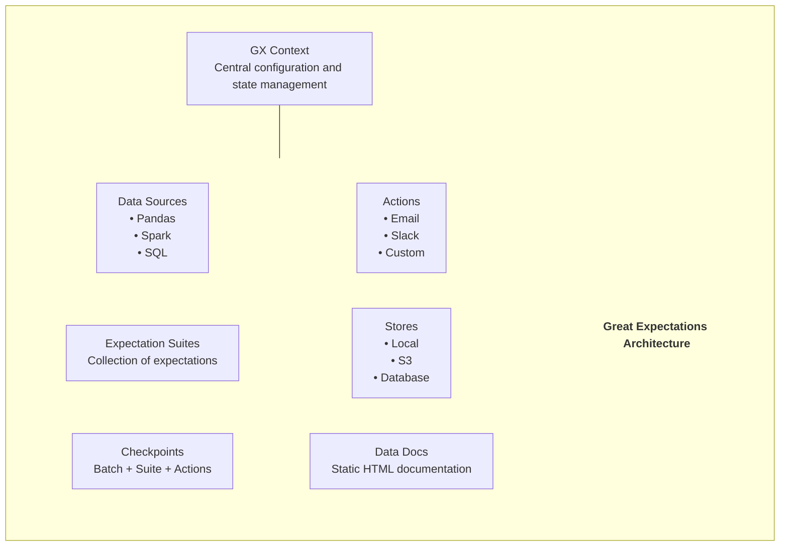
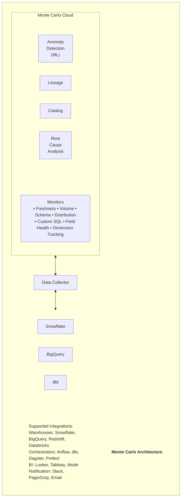
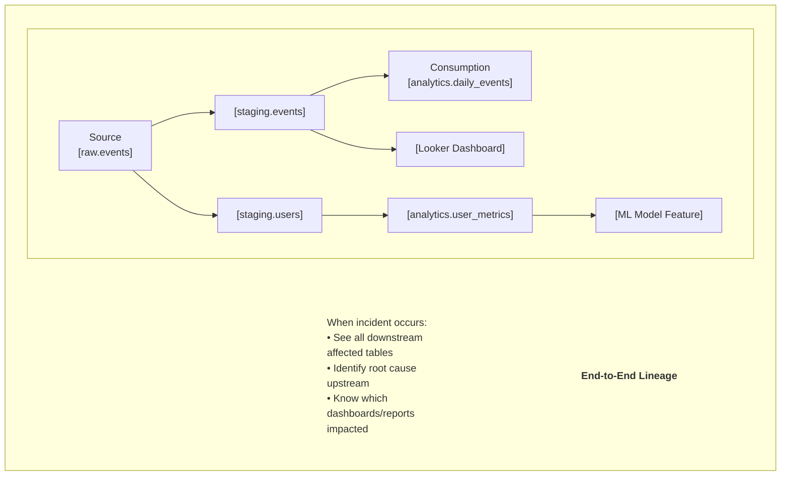
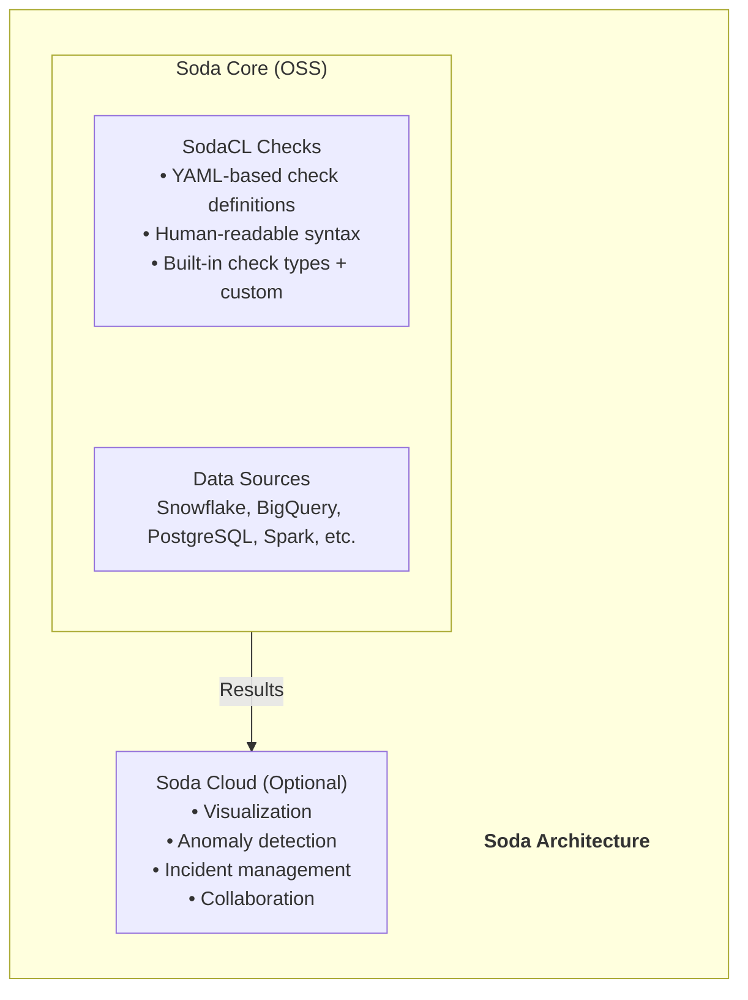
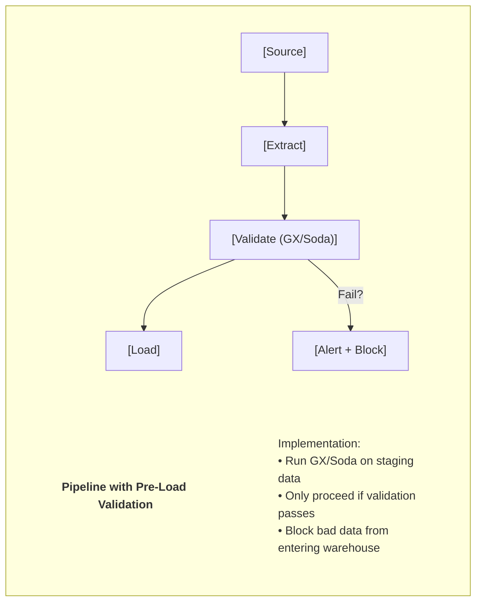
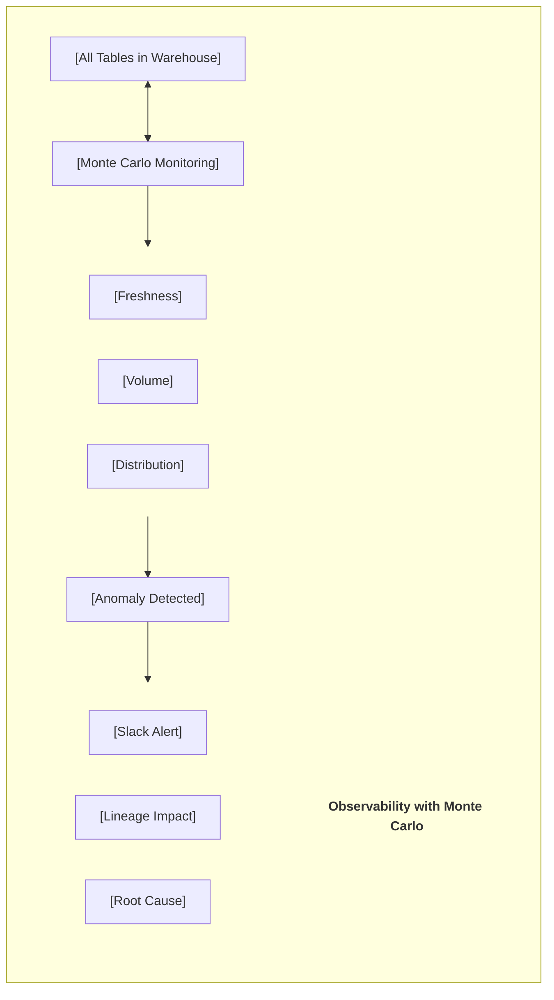

# 🔍 Data Quality Tools - Complete Guide

> **Great Expectations, Monte Carlo, Soda**

---

## 📑 Mục Lục

1. [Tổng Quan Data Quality](#-tổng-quan-data-quality)
2. [Great Expectations Deep Dive](#-great-expectations-deep-dive)
3. [Monte Carlo Deep Dive](#-monte-carlo-deep-dive)
4. [Soda Deep Dive](#-soda-deep-dive)
5. [Feature Comparison](#-feature-comparison)
6. [Implementation Patterns](#-implementation-patterns)
7. [When to Choose What](#-when-to-choose-what)

---

## 🎯 Tổng Quan Data Quality

### Data Quality Landscape


> **Data Quality Stack:**
> 
> * **Data Observability** (Proactive monitoring, anomaly detection)
>   * Monte Carlo, Bigeye, Anomalo, Metaplane
> 
> * **Data Testing/Validation** (Explicit assertions, unit tests for data)
>   * Great Expectations, Soda, dbt tests
> 
> * **Data Profiling** (Understanding data characteristics)
>   * All tools above + Pandas Profiling, ydata-profiling


### Key Data Quality Dimensions


> **Data Quality Dimensions:**
> 
> 1. **Accuracy**: Data reflects real-world correctly (Example: Email format is valid)
> 2. **Completeness**: All required data is present (Example: No null values in required fields)
> 3. **Consistency**: Data is uniform across systems (Example: Same customer ID format everywhere)
> 4. **Timeliness**: Data is up-to-date (Example: Data arrives within SLA)
> 5. **Uniqueness**: No duplicates exist (Example: One record per customer)
> 6. **Validity**: Data conforms to defined rules (Example: Age between 0 and 150)
> 7. **Volume**: Expected amount of data present (Example: Daily records count within range)


---

## 🦄 Great Expectations Deep Dive

### Introduction & History

**Great Expectations (GX) là gì?**
Great Expectations là một **open-source Python library** cho data validation, documentation, và profiling. Nó cho phép bạn viết "expectations" (assertions) về data và validate chúng.

**History:**
- **2018** - Created by Superconductive
- **2019** - Open-sourced, growing community
- **2020** - V3 API (modern API)
- **2021** - Superconductive raises funding
- **2023** - GX Cloud launched
- **2024** - Simplified API, better integrations
- **2025** - GX 1.0 stable, GX Cloud mature

### Architecture





### Core Concepts

**1. Expectations:**
```python
import great_expectations as gx

# Create context
context = gx.get_context()

# Connect to data
data_source = context.data_sources.add_pandas("my_pandas_ds")
data_asset = data_source.add_dataframe_asset("my_dataframe")

# Create expectation suite
suite = context.suites.add(
    gx.ExpectationSuite(name="orders_suite")
)

# Add expectations
suite.add_expectation(
    gx.expectations.ExpectColumnToExist(column="order_id")
)
suite.add_expectation(
    gx.expectations.ExpectColumnValuesToNotBeNull(column="order_id")
)
suite.add_expectation(
    gx.expectations.ExpectColumnValuesToBeUnique(column="order_id")
)
suite.add_expectation(
    gx.expectations.ExpectColumnValuesToBeBetween(
        column="amount",
        min_value=0,
        max_value=1000000
    )
)
```

**2. Common Expectations:**
```python
# Column existence
ExpectColumnToExist(column="name")

# Null checks
ExpectColumnValuesToNotBeNull(column="id")
ExpectColumnValuesToBeNull(column="deleted_at")

# Uniqueness
ExpectColumnValuesToBeUnique(column="email")

# Value ranges
ExpectColumnValuesToBeBetween(column="age", min_value=0, max_value=150)

# Value sets
ExpectColumnValuesToBeInSet(
    column="status",
    value_set=["pending", "completed", "cancelled"]
)

# String patterns
ExpectColumnValuesToMatchRegex(
    column="email",
    regex=r"^[a-zA-Z0-9_.+-]+@[a-zA-Z0-9-]+\.[a-zA-Z0-9-.]+$"
)

# Row count
ExpectTableRowCountToBeBetween(min_value=1000, max_value=1000000)

# Column pair relationships
ExpectColumnPairValuesToBeEqual(
    column_A="shipping_address",
    column_B="billing_address",
    ignore_row_if="billing_address_same"
)

# Custom SQL
ExpectQueryToReturnNoResults(
    sql_query="SELECT * FROM orders WHERE amount < 0"
)
```

**3. Checkpoints (Validation Runs):**
```python
# Create checkpoint
checkpoint = context.checkpoints.add(
    gx.Checkpoint(
        name="orders_checkpoint",
        validation_definitions=[
            gx.ValidationDefinition(
                name="validate_orders",
                data=batch_definition,
                suite=suite,
            )
        ],
        actions=[
            gx.checkpoint.actions.UpdateDataDocsAction(
                name="update_data_docs"
            ),
            gx.checkpoint.actions.SlackNotificationAction(
                name="slack_notify",
                slack_webhook="https://hooks.slack.com/...",
                notify_on="failure"
            )
        ]
    )
)

# Run checkpoint
result = checkpoint.run()
print(f"Success: {result.success}")
```

### GX Code Examples

**Complete Pipeline Integration:**
```python
import great_expectations as gx
import pandas as pd

def validate_orders_data(df: pd.DataFrame) -> bool:
    """Validate orders data before loading"""
    
    # Get or create context
    context = gx.get_context()
    
    # Define data source
    data_source = context.data_sources.add_pandas("orders_ds")
    data_asset = data_source.add_dataframe_asset("orders")
    batch_definition = data_asset.add_batch_definition_whole_dataframe("full_batch")
    
    # Create or get expectation suite
    suite_name = "orders_validation"
    try:
        suite = context.suites.get(suite_name)
    except:
        suite = context.suites.add(gx.ExpectationSuite(name=suite_name))
        
        # Schema expectations
        suite.add_expectation(gx.expectations.ExpectTableColumnsToMatchOrderedList(
            column_list=["order_id", "customer_id", "amount", "status", "created_at"]
        ))
        
        # Data quality expectations
        suite.add_expectation(gx.expectations.ExpectColumnValuesToNotBeNull(column="order_id"))
        suite.add_expectation(gx.expectations.ExpectColumnValuesToBeUnique(column="order_id"))
        suite.add_expectation(gx.expectations.ExpectColumnValuesToNotBeNull(column="customer_id"))
        suite.add_expectation(gx.expectations.ExpectColumnValuesToBeBetween(
            column="amount", min_value=0
        ))
        suite.add_expectation(gx.expectations.ExpectColumnValuesToBeInSet(
            column="status",
            value_set=["pending", "processing", "shipped", "delivered", "cancelled"]
        ))
    
    # Validate
    batch = batch_definition.get_batch(batch_parameters={"dataframe": df})
    validation_result = batch.validate(suite)
    
    # Generate documentation
    context.build_data_docs()
    
    return validation_result.success

# Usage in pipeline
if __name__ == "__main__":
    df = pd.read_parquet("s3://bucket/orders/")
    
    if validate_orders_data(df):
        print("✅ Data validation passed")
        # Proceed with loading
    else:
        print("❌ Data validation failed")
        raise ValueError("Data quality check failed")
```

**Airflow Integration:**
```python
from airflow.decorators import dag, task
from datetime import datetime
import great_expectations as gx

@dag(
    dag_id="gx_validation_pipeline",
    schedule_interval="@daily",
    start_date=datetime(2024, 1, 1),
)
def gx_validation_dag():
    
    @task
    def extract_data() -> dict:
        # Extract logic
        return {"path": "s3://bucket/data.parquet"}
    
    @task
    def validate_data(data_info: dict) -> bool:
        context = gx.get_context()
        
        # Run checkpoint
        result = context.checkpoints.get("my_checkpoint").run(
            batch_parameters={"path": data_info["path"]}
        )
        
        if not result.success:
            raise ValueError("Validation failed!")
        
        return result.success
    
    @task
    def load_data(validated: bool, data_info: dict):
        if validated:
            # Load to warehouse
            pass
    
    data = extract_data()
    is_valid = validate_data(data)
    load_data(is_valid, data)

gx_validation_dag()
```

---

## 🔭 Monte Carlo Deep Dive

### Introduction

**Monte Carlo là gì?**
Monte Carlo là một **data observability platform** tập trung vào automated monitoring, anomaly detection, và root cause analysis. Monte Carlo được coi là "Datadog for data" - giám sát data pipelines proactively.

**Key Differentiator:** Monte Carlo focuses on **automated, ML-based detection** thay vì explicit rules như Great Expectations.

**History:**
- **2019** - Founded by Barr Moses & Lior Gavish
- **2020** - Product launch
- **2021** - $135M Series C
- **2022** - Widespread enterprise adoption
- **2023** - Enhanced lineage, circuit breakers
- **2024** - AI-powered root cause analysis
- **2025** - Full data stack observability

### Architecture





### Core Concepts

**1. Automated Monitors:**

> **Monitor Types:**
> 
> * **Freshness Monitor**: Detects when data stops arriving ("Table hasn't been updated in 6 hours")
> * **Volume Monitor**: Detects unusual row count changes ("50% fewer rows than expected")
> * **Schema Monitor**: Detects column additions/removals ("Column 'user_id' was removed")
> * **Distribution Monitor (Field Health)**: Detects data distribution anomalies ("NULL rate increased from 1% to 15%", "Average value dropped 40%")
> * **Custom SQL Monitor**: Your own assertions ("SELECT COUNT(*) FROM orders WHERE amount < 0")
> * **Dimension Tracking**: Segment-level monitoring ("Region=APAC volume dropped 80%")


**2. Lineage:**




**3. Circuit Breakers:**
```python
# Monte Carlo SDK - Circuit Breaker
from monte_carlo_client import MonteCarloClient

mc = MonteCarloClient(api_key="...")

# Check if safe to proceed
def check_data_quality(table_id: str) -> bool:
    """Check Monte Carlo for active incidents"""
    incidents = mc.get_active_incidents(table_id=table_id)
    
    if incidents:
        print(f"Found {len(incidents)} active incidents")
        for incident in incidents:
            print(f"  - {incident.type}: {incident.description}")
        return False
    
    return True

# In pipeline
if check_data_quality("warehouse.analytics.orders"):
    # Safe to proceed
    run_downstream_jobs()
else:
    # Block pipeline
    raise Exception("Data quality issues detected")
```

### Monte Carlo Features

**Key Capabilities:**
- **ML-based anomaly detection**: No manual threshold setting
- **Auto-lineage**: Discovers table relationships automatically
- **Root Cause Analysis**: AI identifies likely source of issues
- **Incident Management**: Track, triage, resolve data incidents
- **Impact Analysis**: Know which downstream assets affected
- **SLA Monitoring**: Data freshness guarantees
- **Slack/Teams Integration**: Alerts in your workflow

---

## 🧪 Soda Deep Dive

### Introduction

**Soda là gì?**
Soda là một **data quality platform** với cả open-source library (Soda Core) và managed cloud (Soda Cloud). Soda focuses on "SodaCL" - một domain-specific language cho data quality.

**History:**
- **2020** - Soda founded
- **2021** - Soda SQL launched (open source)
- **2022** - Soda Core (rebrand), SodaCL language
- **2023** - Soda Cloud enhancements
- **2024** - Soda Agent, improved integrations
- **2025** - Advanced anomaly detection, Soda Cloud Plus

### Architecture





### SodaCL (Soda Checks Language)

**Basic Syntax:**
```yaml
# checks/orders.yml

checks for orders:
  # Row count
  - row_count > 0
  - row_count between 1000 and 10000
  
  # Missing/Null checks
  - missing_count(order_id) = 0
  - missing_percent(customer_id) < 1%
  
  # Duplicate checks
  - duplicate_count(order_id) = 0
  
  # Value checks
  - invalid_count(status) = 0:
      valid values: [pending, completed, shipped, cancelled]
  
  - min(amount) >= 0
  - max(amount) < 1000000
  
  # Schema check
  - schema:
      fail:
        when required column missing: [order_id, customer_id, amount]
        when wrong column type:
          order_id: integer
          amount: decimal
  
  # Freshness
  - freshness(created_at) < 1d
  
  # Custom SQL
  - failed rows:
      name: negative_amounts
      fail query: |
        SELECT * FROM orders WHERE amount < 0
```

**Advanced Checks:**
```yaml
checks for orders:
  # Distribution checks
  - avg(amount) between 50 and 150
  - stddev(amount) < 100
  
  # Percentile checks
  - percentile(amount, 0.95) < 500
  
  # Cross-column checks
  - values in (customer_id) must exist in customers (id)
  
  # Anomaly detection (requires Soda Cloud)
  - anomaly detection for row_count
  - anomaly detection for avg(amount)
  
  # Reference data check
  - reference check:
      name: customer_exists
      dataset: customers
      column: customer_id
      reference column: id
  
  # Record-level checks with samples
  - failed rows:
      name: invalid_emails
      fail condition: email NOT LIKE '%@%.%'
      samples limit: 10
```

### Soda Code Examples

**Configuration:**
```yaml
# configuration.yml

data_source orders_db:
  type: snowflake
  connection:
    account: xy12345
    username: ${SNOWFLAKE_USER}
    password: ${SNOWFLAKE_PASSWORD}
    database: analytics
    schema: production
    warehouse: compute_wh

soda_cloud:
  host: cloud.soda.io
  api_key_id: ${SODA_CLOUD_API_KEY_ID}
  api_key_secret: ${SODA_CLOUD_API_KEY_SECRET}
```

**Running Soda:**
```bash
# Install
pip install soda-core-snowflake

# Run checks
soda scan -d orders_db -c configuration.yml checks/orders.yml

# Run with variables
soda scan -d orders_db -c configuration.yml checks/orders.yml \
  -v date=2024-01-15
```

**Python Integration:**
```python
from soda.scan import Scan

def run_soda_checks(dataset: str, date: str) -> bool:
    """Run Soda checks programmatically"""
    
    scan = Scan()
    scan.set_data_source_name("orders_db")
    
    # Load configuration
    scan.add_configuration_yaml_file("configuration.yml")
    
    # Load checks
    scan.add_sodacl_yaml_file(f"checks/{dataset}.yml")
    
    # Add variables
    scan.add_variables({"date": date})
    
    # Execute
    scan.execute()
    
    # Get results
    results = scan.get_scan_results()
    
    print(f"Checks: {results['checks']}")
    print(f"Passed: {results['checks_pass']}")
    print(f"Failed: {results['checks_fail']}")
    
    return scan.has_check_fails() == False

# Usage
if run_soda_checks("orders", "2024-01-15"):
    print("✅ All checks passed")
else:
    print("❌ Some checks failed")
```

**Airflow Integration:**
```python
from airflow.decorators import dag, task
from soda.scan import Scan

@dag(dag_id="soda_pipeline", schedule="@daily")
def soda_pipeline():
    
    @task
    def run_soda_scan(ds: str):
        scan = Scan()
        scan.set_data_source_name("warehouse")
        scan.add_configuration_yaml_file("/opt/soda/configuration.yml")
        scan.add_sodacl_yaml_file("/opt/soda/checks/")
        scan.add_variables({"ds": ds})
        scan.execute()
        
        if scan.has_check_fails():
            raise ValueError("Soda checks failed!")
        
        return scan.get_scan_results()
    
    run_soda_scan()

soda_pipeline()
```

---

## 📊 Feature Comparison


| Feature | GX | Monte Carlo | Soda |
| :--- | :--- | :--- | :--- |
| **Open Source Core** | ✅ Yes | ❌ No | ✅ Yes |
| **Managed Cloud** | ✅ Yes | ✅ Yes | ✅ Yes |
| **Check Language** | Python | UI/SQL | SodaCL (YAML) |
| **ML Anomaly Detection** | Limited | ✅ Core | ✅ Cloud |
| **Auto Lineage** | ❌ No | ✅ Yes | Limited |
| **Root Cause Analysis** | ❌ No | ✅ Yes | Limited |
| **Schema Monitoring** | Manual | ✅ Auto | ✅ Manual |
| **Data Profiling** | ✅ Yes | ✅ Yes | ✅ Yes |
| **Documentation Gen** | ✅ Yes | ❌ No | ❌ No |
| **Spark Support** | ✅ Yes | ❌ Limited | ✅ Yes |
| **Local Testing** | ✅ Easy | ❌ Cloud | ✅ Easy |
| **Learning Curve** | Medium | Easy | Easy |

*Pricing (2025):*
* GX Cloud: Free tier → ~$500/month+
* Monte Carlo: Enterprise only (~$2K+/month)
* Soda Cloud: Free tier → ~$300/month+


---

## 🏗️ Implementation Patterns

### Pattern 1: Testing Before Load





### Pattern 2: Continuous Monitoring





### Pattern 3: Layered Quality


> **Combined Approach: Layered Quality**
> 
> * **Layer 1: Source Validation (Soda/GX)**
>   * Schema checks, basic null/uniqueness, format validation
> * **Layer 2: Transformation Testing (dbt tests)**
>   * Referential integrity, business logic validation, aggregation checks
> * **Layer 3: Continuous Monitoring (Monte Carlo)**
>   * Anomaly detection, freshness SLAs, distribution drift
> * **Layer 4: Business Validation (Custom)**
>   * KPI reconciliation, cross-system consistency


---

## 🤔 When to Choose What

### Choose Great Expectations When:


✅ Best for GX:
• Python-centric team
• Need detailed documentation generation
• Want fine-grained control over expectations
• Working with Spark at scale
• Budget-conscious (great OSS option)
• Need extensive customization

❌ Less ideal for:
• Non-technical data teams
• Want automated anomaly detection
• Need lineage features


### Choose Monte Carlo When:


✅ Best for Monte Carlo:
• Enterprise with budget
• Need automated observability
• Want ML-based anomaly detection
• Need end-to-end lineage
• Have large data estate
• Want minimal configuration

❌ Less ideal for:
• Small teams/startups
• Need local testing
• Want open-source only
• Need Spark integration


### Choose Soda When:


✅ Best for Soda:
• Want simple YAML-based checks
• Need both OSS and cloud option
• Data teams prefer no-code/low-code
• Want balanced features and price
• Need quick time-to-value

❌ Less ideal for:
• Need advanced lineage
• Complex custom validations
• Python-heavy workflows


---

## 📚 Resources

### Great Expectations
- Docs: https://docs.greatexpectations.io/
- GitHub: https://github.com/great-expectations/great_expectations

### Monte Carlo
- Website: https://www.montecarlodata.com/
- Blog: https://www.montecarlodata.com/blog/

### Soda
- Docs: https://docs.soda.io/
- GitHub: https://github.com/sodadata/soda-core

---

> **Document Version**: 1.0  
> **Last Updated**: December 31, 2025
