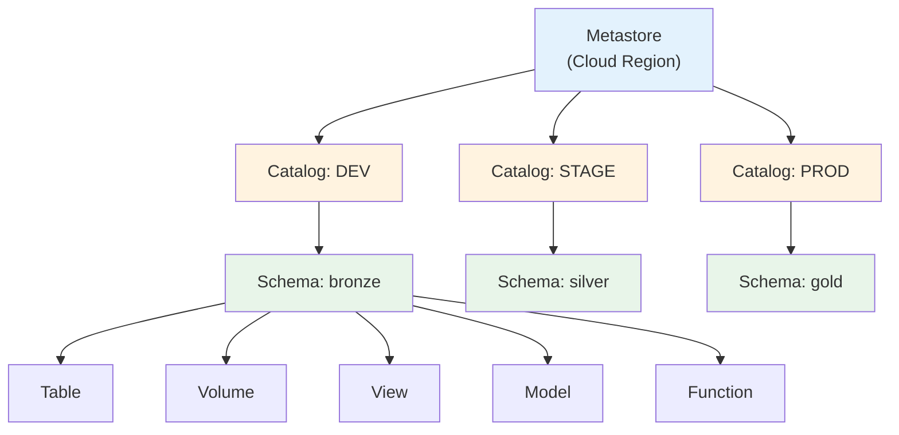
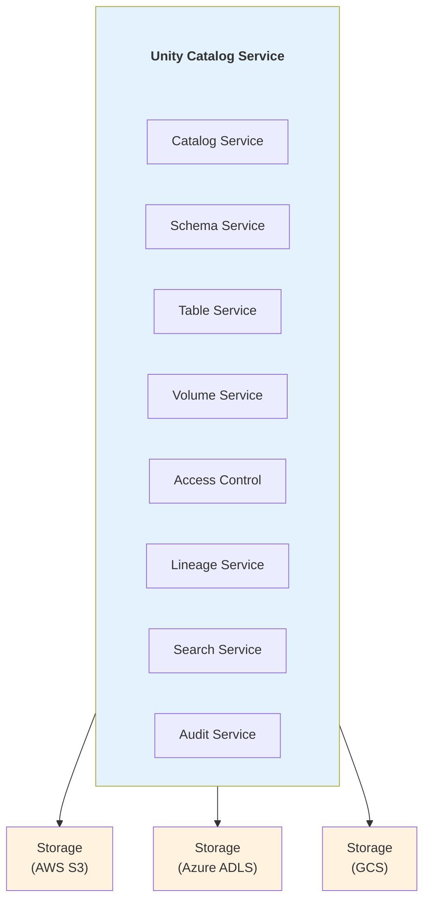
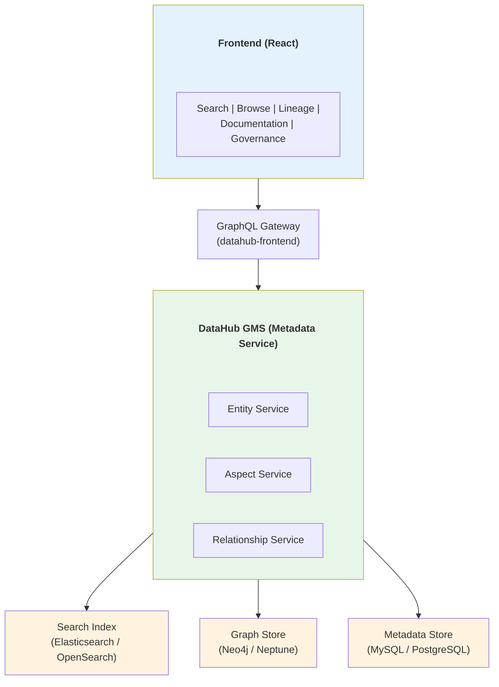
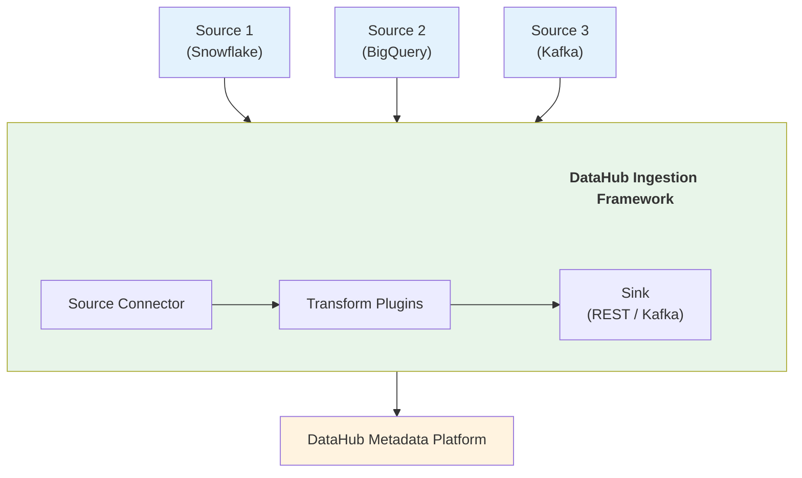
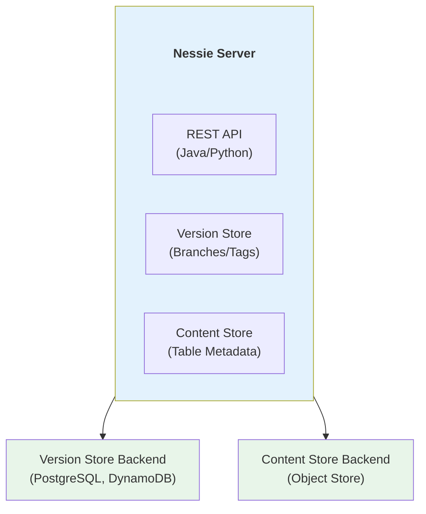
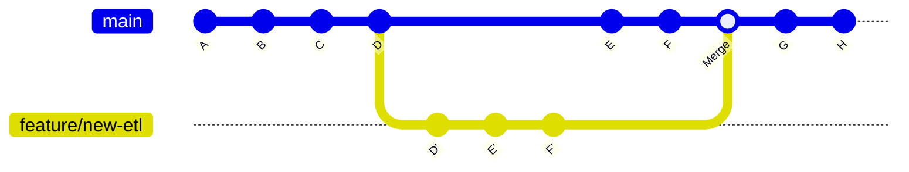
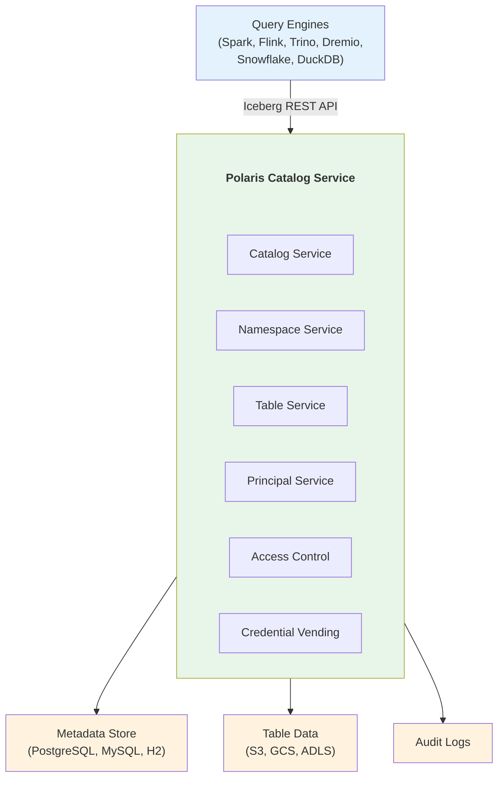
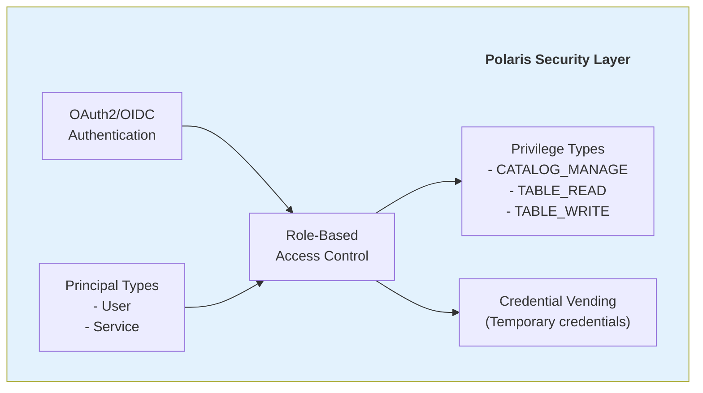
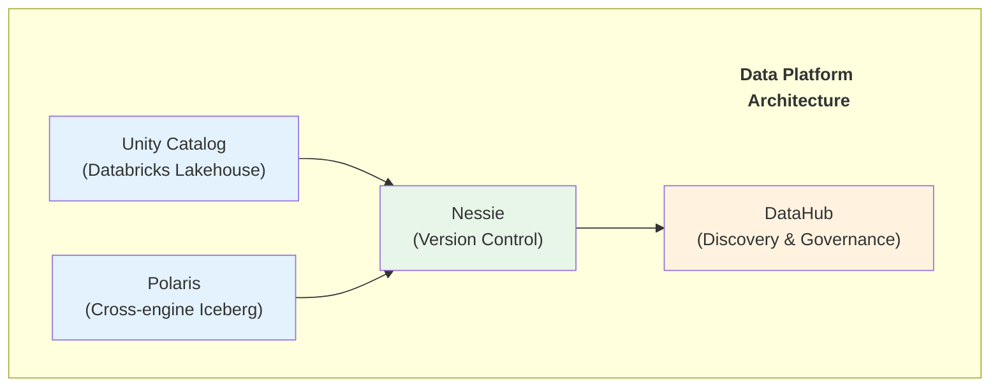
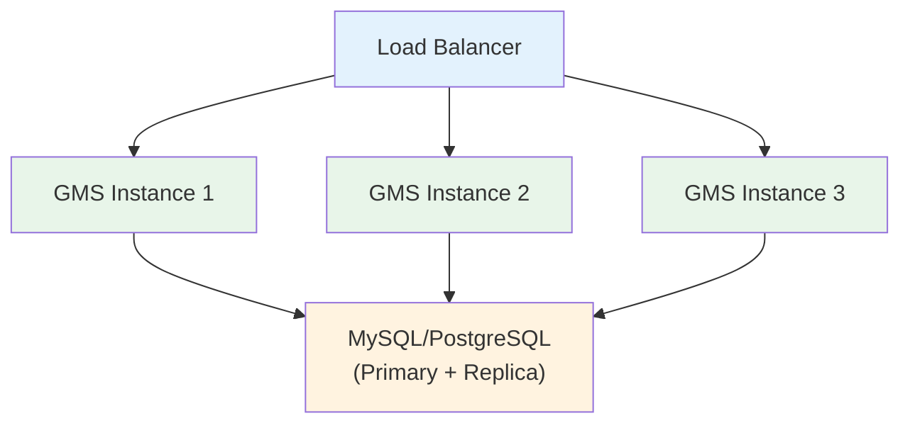

# Data Catalogs Complete Guide 2025

## Unity Catalog, DataHub, Apache Nessie & Apache Polaris

---

## PHẦN 1: TỔNG QUAN VỀ DATA CATALOGS

### 1.1 Data Catalog Là Gì?

Data Catalog là một hệ thống quản lý metadata tập trung, cung cấp:
- **Khả năng khám phá dữ liệu** - Tìm kiếm và duyệt các tài nguyên dữ liệu
- **Quản lý metadata** - Schema, thống kê, lineage, ownership
- **Quản trị dữ liệu** - Access control, policies, compliance
- **Collaboration** - Sharing, documentation, annotations

### 1.2 Tại Sao Data Catalogs Quan Trọng?

**Thách thức trong Modern Data Stack:**
- Dữ liệu phân tán trên nhiều hệ thống (Data Lakes, Warehouses, Databases)
- Thiếu visibility về dữ liệu nào tồn tại và ở đâu
- Khó khăn trong việc hiểu data lineage
- Compliance requirements (GDPR, CCPA) đòi hỏi data governance

**Giá trị của Data Catalogs:**
- Giảm thời gian tìm kiếm dữ liệu từ ngày xuống phút
- Cải thiện data quality qua documentation
- Tăng tốc onboarding cho data teams
- Đảm bảo compliance với data policies

### 1.3 Các Thế Hệ Data Catalogs

**Generation 1 (2010-2016):**
- Manual metadata entry
- Basic search functionality
- Ví dụ: Alation, Collibra

**Generation 2 (2016-2020):**
- Automated metadata extraction
- ML-powered discovery
- Ví dụ: DataHub (LinkedIn), Apache Atlas

**Generation 3 (2020-2025):**
- Unified governance
- Active metadata platforms
- Multi-engine support
- Ví dụ: Unity Catalog, Polaris, Nessie

---

## PHẦN 2: DATABRICKS UNITY CATALOG

### 2.1 Lịch Sử và Phát Triển

**Timeline:**

```
2020 Q1 - Databricks bắt đầu phát triển Unity Catalog
     |
2022 Q2 - Unity Catalog GA (General Availability)
     |
2023 Q1 - Unity Catalog Volumes (unstructured data)
     |
2023 Q3 - AI Functions integration
     |
2024 Q1 - Unity Catalog Open Source announcement
     |
2024 Q4 - Unity Catalog Open APIs
     |
2025 Q1 - Version 0.3.0 OSS, Feature Store integration
```

**Tại sao ra đời:**
- Databricks cần unified governance cho Lakehouse
- Hive Metastore không đủ cho multi-cloud, multi-workspace
- Thiếu fine-grained access control ở row/column level
- Cần lineage tự động cho AI/ML workloads

### 2.2 Kiến Trúc Unity Catalog

**Hierarchical Namespace:**



**Component Architecture:**



### 2.3 Core Concepts

**Securable Objects:**
- **Metastore** - Top-level container, one per cloud region
- **Catalog** - First level of namespace, groups schemas
- **Schema** - Second level, groups tables/views/volumes
- **Table** - Managed hoặc External tables
- **Volume** - Unstructured data (files, images, models)
- **View** - Virtual tables
- **Function** - User-defined functions
- **Model** - ML models (MLflow integration)

**Data Access:**
- **Row-Level Security** - Filter data dựa trên user attributes
- **Column Masking** - Dynamic data masking
- **Attribute-Based Access Control (ABAC)** - Tags và policies

### 2.4 Code Examples

**Setup và Basic Operations:**

```python
# Tạo Catalog
spark.sql("""
    CREATE CATALOG IF NOT EXISTS production
    COMMENT 'Production data catalog'
""")

# Tạo Schema
spark.sql("""
    CREATE SCHEMA IF NOT EXISTS production.gold
    COMMENT 'Gold layer with aggregated metrics'
    MANAGED LOCATION 's3://my-bucket/production/gold'
""")

# Tạo Table
spark.sql("""
    CREATE TABLE production.gold.daily_revenue (
        date DATE,
        region STRING,
        revenue DECIMAL(18,2),
        orders INT
    )
    USING delta
    PARTITIONED BY (date)
    COMMENT 'Daily revenue aggregated by region'
    TBLPROPERTIES (
        'delta.autoOptimize.optimizeWrite' = 'true',
        'delta.autoOptimize.autoCompact' = 'true',
        'quality.check.enabled' = 'true'
    )
""")
```

**Access Control:**

```sql
-- Grant quyền truy cập catalog
GRANT USE CATALOG ON CATALOG production TO `data-analysts`;

-- Grant quyền schema
GRANT USE SCHEMA ON SCHEMA production.gold TO `data-analysts`;
GRANT SELECT ON SCHEMA production.gold TO `data-analysts`;

-- Grant quyền table cụ thể
GRANT SELECT ON TABLE production.gold.daily_revenue 
    TO `finance-team`;

-- Revoke quyền
REVOKE SELECT ON TABLE production.gold.daily_revenue 
    FROM `contractors`;

-- Xem permissions
SHOW GRANTS ON TABLE production.gold.daily_revenue;
```

**Row-Level Security:**

```sql
-- Tạo function cho row filter
CREATE FUNCTION production.gold.region_filter(region STRING)
RETURN 
    CASE 
        WHEN is_member('global-access') THEN TRUE
        WHEN is_member('apac-team') AND region = 'APAC' THEN TRUE
        WHEN is_member('emea-team') AND region = 'EMEA' THEN TRUE
        ELSE FALSE
    END;

-- Apply row filter
ALTER TABLE production.gold.daily_revenue
SET ROW FILTER production.gold.region_filter ON (region);
```

**Column Masking:**

```sql
-- Tạo masking function
CREATE FUNCTION production.gold.mask_revenue(revenue DECIMAL(18,2))
RETURN 
    CASE 
        WHEN is_member('finance-team') THEN revenue
        ELSE NULL
    END;

-- Apply column mask
ALTER TABLE production.gold.daily_revenue
ALTER COLUMN revenue SET MASK production.gold.mask_revenue;
```

**Volumes (Unstructured Data):**

```python
# Tạo Managed Volume
spark.sql("""
    CREATE VOLUME production.gold.documents
    COMMENT 'PDF reports and documents'
""")

# Tạo External Volume
spark.sql("""
    CREATE EXTERNAL VOLUME production.gold.images
    LOCATION 's3://my-bucket/images/'
    COMMENT 'Product images'
""")

# Upload file
import shutil
shutil.copy('/local/report.pdf', 
            '/Volumes/production/gold/documents/2024/report.pdf')

# List files
files = dbutils.fs.ls('/Volumes/production/gold/documents/')
for f in files:
    print(f"{f.name} - {f.size} bytes")
```

**Lineage Tracking:**

```python
# Query lineage qua Databricks API
import requests

# Get table lineage
response = requests.get(
    f"{workspace_url}/api/2.0/lineage-tracking/table-lineage",
    headers={"Authorization": f"Bearer {token}"},
    params={
        "table_name": "production.gold.daily_revenue",
        "include_entity_lineage": True
    }
)

lineage = response.json()
print("Upstream tables:")
for upstream in lineage.get('upstreams', []):
    print(f"  - {upstream['tableInfo']['name']}")

print("\nDownstream tables:")
for downstream in lineage.get('downstreams', []):
    print(f"  - {downstream['tableInfo']['name']}")
```

**Tags và Classification:**

```sql
-- Tạo tag
CREATE TAG production.pii_data COMMENT 'Personally Identifiable Information';

-- Apply tag cho table
ALTER TABLE production.gold.customers
SET TAGS ('pii_data' = 'high');

-- Apply tag cho column
ALTER TABLE production.gold.customers
ALTER COLUMN email SET TAGS ('pii_data' = 'email');

-- Query tagged resources
SELECT * FROM system.information_schema.column_tags
WHERE tag_name = 'pii_data';
```

### 2.5 Unity Catalog Open Source

**Setup Unity Catalog OSS:**

```bash
# Clone repo
git clone https://github.com/unitycatalog/unitycatalog.git
cd unitycatalog

# Build
sbt package

# Start server
bin/start-uc-server

# Server runs at http://localhost:8080
```

**Python Client:**

```python
from unitycatalog.client import UnitycatalogClient

# Connect to server
client = UnitycatalogClient(
    server_uri="http://localhost:8080"
)

# List catalogs
catalogs = client.list_catalogs()
for catalog in catalogs:
    print(f"Catalog: {catalog.name}")

# Create catalog
client.create_catalog(
    name="my_catalog",
    comment="My first catalog"
)

# Create schema
client.create_schema(
    catalog_name="my_catalog",
    name="my_schema",
    comment="My first schema"
)

# Register table
client.create_table(
    catalog_name="my_catalog",
    schema_name="my_schema",
    name="my_table",
    table_type="EXTERNAL",
    data_source_format="DELTA",
    storage_location="s3://bucket/path/to/table"
)
```

---

## PHẦN 3: DATAHUB

### 3.1 Lịch Sử và Phát Triển

**Timeline:**

```
2019 Q1 - LinkedIn công bố WhereHows (predecessor)
     |
2019 Q3 - DataHub được phát triển như thế hệ kế tiếp
     |
2020 Q2 - DataHub Open Source release
     |
2021 Q1 - Acryl Data founded (commercial support)
     |
2022 Q3 - DataHub Cloud launch
     |
2023 Q2 - Structured Properties, Assertions
     |
2024 Q1 - AI Features, Chrome Extension
     |
2025 Q1 - Version 0.15.x, Enhanced AI Assistant
```

**Tại sao ra đời:**
- LinkedIn cần quản lý metadata cho hàng nghìn datasets
- Cần automated metadata ingestion từ nhiều nguồn
- Graph-based approach cho data discovery
- Open-source alternative cho commercial tools

### 3.2 Kiến Trúc DataHub

**High-Level Architecture:**



**Ingestion Architecture:**



### 3.3 Core Concepts

**Entity-Aspect Model:**
- **Entity** - A unique thing (Dataset, Dashboard, User, etc.)
- **Aspect** - Metadata about an entity (Schema, Ownership, Tags)
- **URN** - Unique Resource Name (identifier)

**Common Entities:**
- **Dataset** - Tables, topics, files
- **Chart** - Visualizations
- **Dashboard** - Collections of charts
- **Pipeline** - Data pipelines/DAGs
- **DataJob** - Individual tasks
- **MLModel** - Machine learning models
- **MLFeature** - ML features
- **GlossaryTerm** - Business terms
- **Domain** - Business domains

### 3.4 Code Examples

**Installation:**

```bash
# Docker Compose quickstart
python3 -m pip install --upgrade acryl-datahub

# Start DataHub
datahub docker quickstart

# UI available at http://localhost:9002
# Default credentials: datahub / datahub
```

**Ingestion từ Database:**

```yaml
# snowflake_ingestion.yaml
source:
  type: snowflake
  config:
    account_id: "myaccount.us-east-1"
    username: ${SNOWFLAKE_USER}
    password: ${SNOWFLAKE_PASSWORD}
    warehouse: COMPUTE_WH
    role: ACCOUNTADMIN
    
    # Databases to include
    database_pattern:
      allow:
        - "PRODUCTION_DB"
        - "STAGING_DB"
    
    # Schemas to include
    schema_pattern:
      allow:
        - ".*"
      deny:
        - "INFORMATION_SCHEMA"
        - ".*_TEMP"
    
    # Extract lineage
    include_table_lineage: true
    
    # Profile data
    profiling:
      enabled: true
      profile_table_level_only: false
    
    # Classification
    classification:
      enabled: true

sink:
  type: datahub-rest
  config:
    server: "http://localhost:8080"
```

**Run Ingestion:**

```bash
# Run ingestion
datahub ingest -c snowflake_ingestion.yaml

# Schedule với Airflow
datahub ingest deploy -c snowflake_ingestion.yaml \
    --schedule "0 2 * * *" \
    --name "snowflake-daily"
```

**Python SDK - Emit Metadata:**

```python
import datahub.emitter.mce_builder as builder
from datahub.emitter.rest_emitter import DatahubRestEmitter
from datahub.metadata.schema_classes import (
    DatasetPropertiesClass,
    SchemaFieldClass,
    SchemaMetadataClass,
    StringTypeClass,
    NumberTypeClass,
    DateTypeClass
)

# Create emitter
emitter = DatahubRestEmitter(
    gms_server="http://localhost:8080"
)

# Define dataset URN
dataset_urn = builder.make_dataset_urn(
    platform="mysql",
    name="production.orders",
    env="PROD"
)

# Add properties
properties = DatasetPropertiesClass(
    name="Orders Table",
    description="Customer orders with order details",
    customProperties={
        "team": "data-platform",
        "pii_level": "high",
        "retention_days": "365"
    },
    tags=["ecommerce", "transactions"]
)

# Add schema
schema = SchemaMetadataClass(
    schemaName="orders",
    platform=builder.make_data_platform_urn("mysql"),
    version=1,
    hash="abc123",
    fields=[
        SchemaFieldClass(
            fieldPath="order_id",
            type=SchemaFieldDataTypeClass(type=StringTypeClass()),
            nativeDataType="VARCHAR(50)",
            description="Unique order identifier",
            nullable=False
        ),
        SchemaFieldClass(
            fieldPath="customer_id",
            type=SchemaFieldDataTypeClass(type=StringTypeClass()),
            nativeDataType="VARCHAR(50)",
            description="Customer ID (FK to customers)",
            nullable=False
        ),
        SchemaFieldClass(
            fieldPath="amount",
            type=SchemaFieldDataTypeClass(type=NumberTypeClass()),
            nativeDataType="DECIMAL(18,2)",
            description="Order total amount",
            nullable=False
        ),
        SchemaFieldClass(
            fieldPath="order_date",
            type=SchemaFieldDataTypeClass(type=DateTypeClass()),
            nativeDataType="DATE",
            description="Date when order was placed",
            nullable=False
        )
    ]
)

# Emit metadata
emitter.emit_mce(builder.make_dataset_mce(
    dataset_urn=dataset_urn,
    properties=properties
))

emitter.emit_mce(builder.make_dataset_mce(
    dataset_urn=dataset_urn,
    schema=schema
))
```

**Add Lineage:**

```python
from datahub.metadata.schema_classes import (
    UpstreamClass,
    UpstreamLineageClass
)

# Define upstream and downstream datasets
upstream_urn = builder.make_dataset_urn("mysql", "staging.raw_orders", "PROD")
downstream_urn = builder.make_dataset_urn("mysql", "production.orders", "PROD")

# Create lineage
lineage = UpstreamLineageClass(
    upstreams=[
        UpstreamClass(
            dataset=upstream_urn,
            type="TRANSFORMED"
        )
    ]
)

# Emit lineage
emitter.emit_mce(builder.make_lineage_mce(
    downstream_urn,
    [upstream_urn]
))
```

**GraphQL Queries:**

```graphql
# Search for datasets
query SearchDatasets {
  search(
    input: {
      type: DATASET
      query: "orders"
      start: 0
      count: 10
    }
  ) {
    total
    searchResults {
      entity {
        ... on Dataset {
          urn
          name
          platform {
            name
          }
          properties {
            description
          }
        }
      }
    }
  }
}

# Get dataset lineage
query GetLineage($urn: String!) {
  dataset(urn: $urn) {
    urn
    name
    upstream: lineage(input: { direction: UPSTREAM, depth: 3 }) {
      entities {
        entity {
          ... on Dataset {
            urn
            name
          }
        }
      }
    }
    downstream: lineage(input: { direction: DOWNSTREAM, depth: 3 }) {
      entities {
        entity {
          ... on Dataset {
            urn
            name
          }
        }
      }
    }
  }
}
```

**Assertions (Data Quality):**

```python
from datahub.metadata.schema_classes import (
    AssertionInfoClass,
    AssertionTypeClass,
    DatasetAssertionInfoClass,
    DatasetAssertionScopeClass,
    AssertionResultClass,
    AssertionResultTypeClass
)

# Create assertion
assertion_urn = builder.make_assertion_urn("orders-not-null-check")

assertion_info = AssertionInfoClass(
    type=AssertionTypeClass.DATASET,
    datasetAssertion=DatasetAssertionInfoClass(
        dataset=dataset_urn,
        scope=DatasetAssertionScopeClass.DATASET_COLUMN,
        fields=[builder.make_schema_field_urn(dataset_urn, "order_id")],
        aggregation=AssertionStdAggregationClass.NULL_COUNT,
        operator=AssertionStdOperatorClass.EQUAL_TO,
        parameters=AssertionStdParametersClass(value="0")
    ),
    description="Order ID should never be null"
)

# Record assertion result
result = AssertionResultClass(
    type=AssertionResultTypeClass.SUCCESS,
    nativeResults={
        "null_count": "0",
        "total_rows": "1000000"
    }
)

emitter.emit_mce(builder.make_assertion_mce(
    assertion_urn=assertion_urn,
    assertion_info=assertion_info,
    result=result
))
```

---

## PHẦN 4: APACHE NESSIE

### 4.1 Lịch Sử và Phát Triển

**Timeline:**

```
2020 Q2 - Dremio bắt đầu phát triển Nessie
     |
2020 Q4 - Nessie open source release
     |
2021 Q2 - Integration với Apache Iceberg
     |
2022 Q1 - Nessie 0.30.x, improved performance
     |
2023 Q1 - Enhanced merge strategies
     |
2024 Q1 - Version 0.80.x, Content-addressable storage
     |
2025 Q1 - Version 0.100.x, Production ready features
```

**Tại sao ra đời:**
- Data Lake cần Git-like versioning cho data
- Cần cross-table transactions cho analytics
- Isolation cho parallel workloads
- Reproducibility cho ML experiments

### 4.2 Kiến Trúc Nessie

**Core Architecture:**



**Git-Like Model:**



### 4.3 Core Concepts

**Nessie Objects:**
- **Branch** - Mutable pointer to a commit
- **Tag** - Immutable pointer to a commit
- **Commit** - Snapshot of all tables at a point in time
- **Content** - Table/View/Namespace metadata

**Key Features:**
- **Multi-table transactions** - Atomic changes across tables
- **Time travel** - Query any point in history
- **Branching** - Isolation cho experiments
- **Merge** - Conflict resolution strategies

### 4.4 Code Examples

**Setup Nessie Server:**

```bash
# Docker
docker run -p 19120:19120 \
    -e QUARKUS_PROFILE=prod \
    ghcr.io/projectnessie/nessie:latest

# Or download and run
wget https://github.com/projectnessie/nessie/releases/download/nessie-0.100.0/nessie-quarkus-0.100.0-runner.jar
java -jar nessie-quarkus-0.100.0-runner.jar

# API available at http://localhost:19120/api/v1
```

**Python Client:**

```python
from pynessie import init
from pynessie.model import (
    Branch, 
    Tag, 
    CommitMeta,
    IcebergTable,
    ContentKey
)

# Connect to Nessie
client = init(endpoint="http://localhost:19120/api/v1")

# Get current reference
ref = client.get_reference("main")
print(f"Current branch: {ref.name}, hash: {ref.hash_}")

# List all branches
branches = client.list_references()
for branch in branches:
    print(f"  {branch.type}: {branch.name}")

# Create new branch
dev_branch = client.create_reference(
    Branch(name="dev", hash_=ref.hash_)
)
print(f"Created branch: {dev_branch.name}")

# Create tag
v1_tag = client.create_reference(
    Tag(name="v1.0", hash_=ref.hash_)
)
print(f"Created tag: {v1_tag.name}")
```

**Spark với Nessie + Iceberg:**

```python
from pyspark.sql import SparkSession

# Configure Spark với Nessie catalog
spark = SparkSession.builder \
    .appName("NessieExample") \
    .config("spark.jars.packages", 
            "org.apache.iceberg:iceberg-spark-runtime-3.5_2.12:1.6.0,"
            "org.projectnessie.nessie-integrations:nessie-spark-extensions-3.5_2.12:0.100.0") \
    .config("spark.sql.extensions", 
            "org.apache.iceberg.spark.extensions.IcebergSparkSessionExtensions,"
            "org.projectnessie.spark.extensions.NessieSparkSessionExtensions") \
    .config("spark.sql.catalog.nessie", 
            "org.apache.iceberg.spark.SparkCatalog") \
    .config("spark.sql.catalog.nessie.catalog-impl", 
            "org.apache.iceberg.nessie.NessieCatalog") \
    .config("spark.sql.catalog.nessie.uri", 
            "http://localhost:19120/api/v1") \
    .config("spark.sql.catalog.nessie.ref", "main") \
    .config("spark.sql.catalog.nessie.warehouse", 
            "s3://my-bucket/warehouse") \
    .getOrCreate()

# Create table on main branch
spark.sql("""
    CREATE TABLE nessie.db.customers (
        id STRING,
        name STRING,
        email STRING,
        created_at TIMESTAMP
    )
    USING iceberg
""")

# Insert data
spark.sql("""
    INSERT INTO nessie.db.customers VALUES
    ('c1', 'Alice', 'alice@example.com', current_timestamp()),
    ('c2', 'Bob', 'bob@example.com', current_timestamp())
""")
```

**Branch và Merge Operations:**

```python
# Switch to dev branch
spark.sql("USE REFERENCE dev IN nessie")

# Or create and switch
spark.sql("""
    CREATE BRANCH dev_feature 
    IN nessie 
    FROM main
""")

spark.sql("USE REFERENCE dev_feature IN nessie")

# Make changes on branch
spark.sql("""
    INSERT INTO nessie.db.customers VALUES
    ('c3', 'Charlie', 'charlie@example.com', current_timestamp())
""")

spark.sql("""
    UPDATE nessie.db.customers 
    SET email = 'alice.new@example.com' 
    WHERE id = 'c1'
""")

# View branch log
log = spark.sql("SHOW LOG dev_feature IN nessie")
log.show()

# Merge back to main
spark.sql("""
    MERGE BRANCH dev_feature 
    INTO main 
    IN nessie
""")

# Delete branch
spark.sql("DROP BRANCH dev_feature IN nessie")
```

**Time Travel:**

```python
# List commits
commits = spark.sql("SHOW LOG main IN nessie")
commits.show()

# Query at specific commit
spark.sql("USE REFERENCE main AT <commit_hash> IN nessie")
result = spark.sql("SELECT * FROM nessie.db.customers")
result.show()

# Query at specific time
spark.sql("""
    USE REFERENCE main 
    AT TIMESTAMP '2024-01-15 10:00:00' 
    IN nessie
""")

# Create tag for checkpoint
spark.sql("""
    CREATE TAG v1.0.0 
    IN nessie 
    FROM main
""")

# Query from tag
spark.sql("USE REFERENCE v1.0.0 IN nessie")
```

**Multi-Table Transactions:**

```python
# Python client cho complex operations
from pynessie import init
from pynessie.model import Operations, Put

client = init(endpoint="http://localhost:19120/api/v1")

# Start transaction (all operations in one commit)
operations = Operations(
    operations=[
        Put(
            key=ContentKey.of("db", "customers"),
            content=new_customers_metadata
        ),
        Put(
            key=ContentKey.of("db", "orders"),
            content=new_orders_metadata
        )
    ],
    commit_meta=CommitMeta(
        message="Update customers and orders together"
    )
)

# Commit atomically
client.commit(
    branch="main",
    operations=operations,
    expected_hash=ref.hash_
)
```

---

## PHẦN 5: APACHE POLARIS (Incubating)

### 5.1 Lịch Sử và Phát Triển

**Timeline:**

```
2024 Q1 - Snowflake announces Polaris Catalog
     |
2024 Q2 - Polaris donated to Apache Foundation
     |
2024 Q3 - Apache Polaris (Incubating) project starts
     |
2024 Q4 - First Apache release 0.1.0
     |
2025 Q1 - Version 0.2.0, Enhanced REST Catalog
```

**Tại sao ra đời:**
- Cần open standard cho Iceberg REST Catalog
- Cross-engine data sharing
- Vendor-neutral governance layer
- Unified access control cho Iceberg tables

### 5.2 Kiến Trúc Polaris

**High-Level Architecture:**



**Security Architecture:**



### 5.3 Core Concepts

**Polaris Objects:**
- **Catalog** - Top-level container, maps to storage location
- **Namespace** - Hierarchical organization within catalog
- **Table** - Iceberg table with metadata
- **Principal** - User or service identity
- **Role** - Collection of privileges
- **Grant** - Assignment of role to principal

**Access Control Model:**
- **Catalog Roles** - Defined within a catalog
- **Principal Roles** - Assigned to principals
- **Privilege Grants** - Specific permissions

### 5.4 Code Examples

**Setup Polaris Server:**

```bash
# Clone and build
git clone https://github.com/apache/polaris.git
cd polaris
./gradlew build

# Run with Docker Compose
docker-compose -f docker-compose-dev.yml up

# Or run standalone
./gradlew run

# API available at http://localhost:8181
```

**Configuration:**

```yaml
# polaris-server.yml
server:
  port: 8181

catalog:
  storage:
    type: s3
    s3:
      region: us-east-1
      bucket: polaris-catalog

metastore:
  type: postgresql
  postgresql:
    host: localhost
    port: 5432
    database: polaris
    username: polaris
    password: ${POLARIS_DB_PASSWORD}

security:
  oauth2:
    enabled: true
    issuer: https://auth.example.com
  credential-vending:
    enabled: true
    aws:
      role-arn: arn:aws:iam::123456789:role/polaris-access
```

**REST API - Catalog Management:**

```bash
# Create catalog
curl -X POST http://localhost:8181/api/management/v1/catalogs \
  -H "Content-Type: application/json" \
  -H "Authorization: Bearer ${TOKEN}" \
  -d '{
    "name": "production",
    "type": "INTERNAL",
    "properties": {
      "default-base-location": "s3://my-bucket/production"
    },
    "storageConfigInfo": {
      "storageType": "S3",
      "allowedLocations": ["s3://my-bucket/production/"]
    }
  }'

# List catalogs
curl http://localhost:8181/api/management/v1/catalogs \
  -H "Authorization: Bearer ${TOKEN}"

# Create namespace
curl -X POST http://localhost:8181/api/catalog/v1/production/namespaces \
  -H "Content-Type: application/json" \
  -H "Authorization: Bearer ${TOKEN}" \
  -d '{
    "namespace": ["analytics"],
    "properties": {
      "owner": "data-team"
    }
  }'
```

**Python Client:**

```python
from pyiceberg.catalog import load_catalog

# Configure Polaris catalog
catalog = load_catalog(
    "polaris",
    **{
        "uri": "http://localhost:8181/api/catalog",
        "type": "rest",
        "credential": "client_credentials",
        "oauth2-server-uri": "http://localhost:8181/api/catalog/v1/oauth/tokens",
        "warehouse": "production",
        "scope": "PRINCIPAL_ROLE:ALL"
    }
)

# List namespaces
namespaces = catalog.list_namespaces()
print("Namespaces:", namespaces)

# Create namespace
catalog.create_namespace("analytics.reporting")

# Create table
from pyiceberg.schema import Schema
from pyiceberg.types import (
    NestedField, 
    StringType, 
    LongType, 
    TimestampType
)

schema = Schema(
    NestedField(1, "event_id", StringType(), required=True),
    NestedField(2, "user_id", StringType(), required=True),
    NestedField(3, "event_type", StringType(), required=True),
    NestedField(4, "event_time", TimestampType(), required=True),
    NestedField(5, "properties", StringType())
)

table = catalog.create_table(
    identifier="analytics.reporting.events",
    schema=schema,
    location="s3://my-bucket/production/analytics/reporting/events",
    properties={
        "write.format.default": "parquet",
        "write.parquet.compression-codec": "zstd"
    }
)

print(f"Created table: {table.identifier}")
```

**Spark Integration:**

```python
from pyspark.sql import SparkSession

spark = SparkSession.builder \
    .appName("PolarisExample") \
    .config("spark.jars.packages", 
            "org.apache.iceberg:iceberg-spark-runtime-3.5_2.12:1.6.0") \
    .config("spark.sql.extensions", 
            "org.apache.iceberg.spark.extensions.IcebergSparkSessionExtensions") \
    .config("spark.sql.catalog.polaris", 
            "org.apache.iceberg.spark.SparkCatalog") \
    .config("spark.sql.catalog.polaris.catalog-impl", 
            "org.apache.iceberg.rest.RESTCatalog") \
    .config("spark.sql.catalog.polaris.uri", 
            "http://localhost:8181/api/catalog") \
    .config("spark.sql.catalog.polaris.credential", 
            "client_credentials") \
    .config("spark.sql.catalog.polaris.oauth2-server-uri", 
            "http://localhost:8181/api/catalog/v1/oauth/tokens") \
    .config("spark.sql.catalog.polaris.warehouse", 
            "production") \
    .config("spark.sql.catalog.polaris.scope", 
            "PRINCIPAL_ROLE:ALL") \
    .getOrCreate()

# Create table
spark.sql("""
    CREATE TABLE polaris.analytics.events (
        event_id STRING,
        user_id STRING,
        event_type STRING,
        event_time TIMESTAMP,
        properties STRING
    )
    USING iceberg
""")

# Insert data
spark.sql("""
    INSERT INTO polaris.analytics.events VALUES
    ('e1', 'u1', 'page_view', current_timestamp(), '{"page": "/home"}'),
    ('e2', 'u1', 'click', current_timestamp(), '{"button": "signup"}')
""")
```

**Access Control:**

```bash
# Create principal role
curl -X POST http://localhost:8181/api/management/v1/principal-roles \
  -H "Content-Type: application/json" \
  -H "Authorization: Bearer ${TOKEN}" \
  -d '{
    "name": "analyst-role",
    "properties": {
      "description": "Read access for analysts"
    }
  }'

# Create catalog role
curl -X POST http://localhost:8181/api/management/v1/catalogs/production/catalog-roles \
  -H "Content-Type: application/json" \
  -H "Authorization: Bearer ${TOKEN}" \
  -d '{
    "name": "data-reader",
    "properties": {
      "description": "Read-only access to tables"
    }
  }'

# Grant privileges to catalog role
curl -X PUT http://localhost:8181/api/management/v1/catalogs/production/catalog-roles/data-reader/grants \
  -H "Content-Type: application/json" \
  -H "Authorization: Bearer ${TOKEN}" \
  -d '{
    "grants": [
      {
        "type": "namespace",
        "namespace": ["analytics"],
        "privilege": "NAMESPACE_READ_PROPERTIES"
      },
      {
        "type": "table",
        "namespace": ["analytics"],
        "table": "*",
        "privilege": "TABLE_READ_DATA"
      }
    ]
  }'

# Assign catalog role to principal role
curl -X PUT http://localhost:8181/api/management/v1/principal-roles/analyst-role/catalog-roles/production \
  -H "Content-Type: application/json" \
  -H "Authorization: Bearer ${TOKEN}" \
  -d '{
    "catalogRoles": [
      {"name": "data-reader"}
    ]
  }'
```

---

## PHẦN 6: SO SÁNH CÁC DATA CATALOGS

### 6.1 Feature Comparison

**Core Capabilities:**

**Unity Catalog:**
- Primary Use Case: Databricks Lakehouse governance
- Table Formats: Delta Lake native, Iceberg support
- Multi-Cloud: Yes (AWS, Azure, GCP)
- Open Source: Yes (limited features)
- Lineage: Automatic, column-level
- Access Control: RBAC + ABAC, row/column level

**DataHub:**
- Primary Use Case: Metadata discovery and governance
- Table Formats: Format-agnostic (metadata only)
- Multi-Cloud: Yes (deploys anywhere)
- Open Source: Yes (full features)
- Lineage: Automatic + manual, column-level
- Access Control: RBAC, policies

**Nessie:**
- Primary Use Case: Git-like versioning for data
- Table Formats: Apache Iceberg
- Multi-Cloud: Yes
- Open Source: Yes (full features)
- Lineage: Through version history
- Access Control: Basic (external auth)

**Polaris:**
- Primary Use Case: Open Iceberg catalog standard
- Table Formats: Apache Iceberg only
- Multi-Cloud: Yes
- Open Source: Yes (Apache Incubating)
- Lineage: Not built-in
- Access Control: RBAC, credential vending

### 6.2 Architecture Patterns

**When to Use Each:**

**Unity Catalog:**
- Databricks-centric environments
- Need unified governance for tables, volumes, models
- Require fine-grained access control
- Want automatic lineage tracking
- Multi-cloud Lakehouse architecture

**DataHub:**
- Heterogeneous data ecosystem
- Need data discovery across many sources
- Want active metadata platform
- Require business glossary and documentation
- Data mesh implementations

**Nessie:**
- Need Git-like branching for data
- ML experiment isolation
- Multi-table transactions
- Data versioning and time travel
- CI/CD for data pipelines

**Polaris:**
- Cross-engine Iceberg access
- Vendor-neutral catalog
- Open standard compliance
- Multi-engine data sharing
- Cloud-native Iceberg deployments

### 6.3 Integration Patterns

**Multi-Catalog Architecture:**



**Integration Code:**

```python
# DataHub ingestion from Unity Catalog
# datahub_unity_ingestion.yaml
source:
  type: unity-catalog
  config:
    workspace_url: https://myworkspace.cloud.databricks.com
    token: ${DATABRICKS_TOKEN}
    include_metastore: true
    include_lineage: true

sink:
  type: datahub-rest
  config:
    server: http://datahub-gms:8080
```

```python
# Nessie + Polaris integration
# Use Nessie for versioning, expose via Polaris

from pynessie import init as nessie_init
from pyiceberg.catalog import load_catalog

# Connect to Nessie for versioning
nessie = nessie_init(endpoint="http://nessie:19120/api/v1")

# Create versioned table in Nessie
# Then register in Polaris for cross-engine access

polaris = load_catalog(
    "polaris",
    **{
        "uri": "http://polaris:8181/api/catalog",
        "type": "rest"
    }
)

# Register external table in Polaris
polaris.register_table(
    identifier="shared.analytics.events",
    metadata_location="s3://bucket/nessie/warehouse/events/metadata/v1.json"
)
```

---

## PHẦN 7: BEST PRACTICES

### 7.1 Catalog Strategy

**Choose Your Primary Catalog:**
- Single source of truth for metadata
- Consider your primary compute engine
- Plan for multi-engine future

**Naming Conventions:**
- Use consistent naming across environments
- Include environment prefix (dev, stage, prod)
- Use descriptive namespace hierarchy

**Example Hierarchy:**
```
catalog: production
├── namespace: raw
│   └── tables: raw data sources
├── namespace: bronze
│   └── tables: cleaned raw data
├── namespace: silver
│   └── tables: business entities
├── namespace: gold
│   └── tables: aggregated metrics
└── namespace: ml
    └── tables: feature tables
```

### 7.2 Access Control Best Practices

**Principle of Least Privilege:**
- Start with minimal permissions
- Grant access at namespace level when possible
- Use row-level security for sensitive data
- Implement column masking for PII

**Role Design:**
```
Roles:
├── data-reader
│   └── SELECT on all tables
├── data-analyst
│   └── SELECT, limited schemas
├── data-engineer
│   └── SELECT, INSERT, UPDATE, DELETE
├── data-admin
│   └── Full catalog management
└── ml-engineer
    └── ML namespace full access
```

### 7.3 Lineage and Documentation

**Document Everything:**
- Table descriptions
- Column descriptions
- Business context
- Data quality expectations
- SLAs and ownership

**Lineage Best Practices:**
- Enable automatic lineage tracking
- Document manual data movements
- Track column-level lineage for sensitive data
- Regular lineage audits

### 7.4 Performance Optimization

**Metadata Caching:**
- Use local caching for frequent queries
- Configure appropriate TTL
- Consider read replicas for catalog

**Query Optimization:**
- Minimize catalog API calls
- Batch metadata operations
- Use streaming updates when possible

---

## PHẦN 8: PRODUCTION DEPLOYMENT

### 8.1 High Availability Architecture

**Unity Catalog (Managed):**
- Automatically HA by Databricks
- Multi-region considerations for DR

**DataHub HA:**



**Nessie HA:**
```yaml
# Kubernetes deployment
apiVersion: apps/v1
kind: Deployment
metadata:
  name: nessie
spec:
  replicas: 3
  selector:
    matchLabels:
      app: nessie
  template:
    spec:
      containers:
      - name: nessie
        image: ghcr.io/projectnessie/nessie:latest
        env:
        - name: NESSIE_VERSION_STORE_TYPE
          value: "JDBC"
        - name: QUARKUS_DATASOURCE_JDBC_URL
          value: "jdbc:postgresql://postgres:5432/nessie"
```

### 8.2 Monitoring and Alerting

**Key Metrics:**
- API request latency
- Error rates
- Catalog size (tables, schemas)
- Active users/connections
- Ingestion pipeline health

**DataHub Metrics:**
```python
# Prometheus metrics export
from datahub.ingestion.run.pipeline import Pipeline

pipeline = Pipeline.create({
    "source": {...},
    "sink": {...},
    "reporting": [{
        "type": "prometheus",
        "config": {
            "pushgateway_url": "http://prometheus-pushgateway:9091"
        }
    }]
})
```

### 8.3 Backup and Recovery

**Metadata Backup:**
```bash
# DataHub backup
datahub backup create --output s3://backups/datahub/

# Nessie backup (export to file)
curl http://nessie:19120/api/v1/trees/main/entries \
  > nessie-backup-$(date +%Y%m%d).json

# Unity Catalog (managed by Databricks)
# Use Databricks APIs for export
```

---

## PHẦN 9: MIGRATION STRATEGIES

### 9.1 Migrating to Unity Catalog

**From Hive Metastore:**
```sql
-- Upgrade tables to Unity Catalog
CREATE OR REPLACE TABLE production.silver.customers
AS SELECT * FROM hive_metastore.default.customers;

-- Or use external location
CREATE TABLE production.silver.customers
USING delta
LOCATION 's3://bucket/path/customers';
```

### 9.2 Migrating to DataHub

**From Other Catalogs:**
```yaml
# Migration pipeline
source:
  type: unity-catalog  # or glue, hive, etc.
  config:
    workspace_url: ${DATABRICKS_URL}
    token: ${TOKEN}

transformers:
  - type: simple_add_dataset_ownership
    config:
      owner_urns:
        - urn:li:corpuser:datateam

sink:
  type: datahub-rest
  config:
    server: http://datahub:8080
```

### 9.3 Migrating to Polaris

**From Glue/Hive:**
```python
# Register existing Iceberg tables
from pyiceberg.catalog import load_catalog

polaris = load_catalog("polaris", **config)

# List tables from source
glue = load_catalog("glue", **glue_config)

for namespace in glue.list_namespaces():
    for table_id in glue.list_tables(namespace):
        table = glue.load_table(table_id)
        
        # Register in Polaris
        polaris.register_table(
            identifier=table_id,
            metadata_location=table.metadata_location
        )
```

---

## PHẦN 10: TROUBLESHOOTING

### 10.1 Common Issues

**Unity Catalog:**
- **Issue:** Permission denied errors
- **Solution:** Check catalog, schema, and table grants
- **Debug:**
```sql
SHOW GRANTS ON CATALOG production;
SHOW GRANTS ON SCHEMA production.gold;
SHOW GRANTS TO USER `user@example.com`;
```

**DataHub:**
- **Issue:** Ingestion fails silently
- **Solution:** Check GMS logs and source connectivity
- **Debug:**
```bash
datahub ingest -c config.yaml --debug
# Or check GMS logs
docker logs datahub-gms 2>&1 | grep ERROR
```

**Nessie:**
- **Issue:** Merge conflicts
- **Solution:** Use appropriate merge strategy
- **Debug:**
```python
# Check for conflicts before merge
conflicts = client.get_diff(
    from_ref="dev",
    to_ref="main"
)
for conflict in conflicts.diffs:
    print(f"Conflict: {conflict.key}")
```

**Polaris:**
- **Issue:** Credential vending fails
- **Solution:** Check IAM role configuration
- **Debug:**
```bash
curl -v http://polaris:8181/api/catalog/v1/production/namespaces \
  -H "Authorization: Bearer ${TOKEN}" 2>&1 | grep -i error
```

### 10.2 Performance Troubleshooting

**Slow Catalog Queries:**
- Check database connection pool
- Enable query caching
- Review index usage

**High Memory Usage:**
- Tune JVM heap settings
- Enable GC logging
- Monitor metadata cache size

---

## PHẦN 11: FUTURE TRENDS

### 11.1 Emerging Patterns

**AI-Powered Discovery:**
- Natural language search
- Automatic data classification
- Intelligent recommendations
- Semantic understanding of data

**Active Metadata:**
- Real-time lineage updates
- Automatic quality alerts
- Self-documenting catalogs

**Interoperability:**
- Standard REST APIs
- Cross-catalog federation
- Universal data contracts

### 11.2 Technology Evolution

**Unity Catalog:**
- Deeper AI/ML integration
- Cross-cloud synchronization
- Open source feature parity

**DataHub:**
- Enhanced AI assistant
- Improved real-time capabilities
- Better multi-tenant support

**Nessie:**
- Improved merge strategies
- Better conflict resolution
- Larger scale support

**Polaris:**
- Graduation from Apache Incubating
- More engine integrations
- Advanced security features

---

## PHẦN 12: RESOURCES

### 12.1 Official Documentation

**Unity Catalog:**
- Docs: https://docs.databricks.com/data-governance/unity-catalog/
- GitHub: https://github.com/unitycatalog/unitycatalog
- Blogs: https://www.databricks.com/blog/category/unity-catalog

**DataHub:**
- Docs: https://datahubproject.io/docs/
- GitHub: https://github.com/datahub-project/datahub
- Slack: https://datahubspace.slack.com

**Nessie:**
- Docs: https://projectnessie.org/
- GitHub: https://github.com/projectnessie/nessie
- Examples: https://github.com/projectnessie/nessie-demos

**Polaris:**
- Docs: https://polaris.apache.org/
- GitHub: https://github.com/apache/polaris
- ASF Mailing List: dev@polaris.apache.org

### 12.2 Community Resources

**Conferences:**
- Data + AI Summit
- Current (Kafka Summit)
- Subsurface (Dremio)

**Courses:**
- Databricks Academy
- Coursera Data Engineering
- Udacity Data Engineering

---

*Document Version: 1.0*
*Last Updated: February 2026*
*Coverage: Unity Catalog, DataHub, Apache Nessie, Apache Polaris*
