# 🔄 Fivetran & Airbyte - Complete ELT Guide

> Data Integration Platforms — Managed ELT for the Modern Data Stack

---

## 📋 Mục Lục

1. [Giới Thiệu ELT](#phần-1-giới-thiệu-elt)
2. [Fivetran Deep Dive](#phần-2-fivetran-deep-dive)
3. [Airbyte Deep Dive](#phần-3-airbyte-deep-dive)
4. [Comparison & Decision](#phần-4-comparison--decision)
5. [Connectors & Schema](#phần-5-connectors--schema)
6. [CDC & Sync Modes](#phần-6-cdc--sync-modes)
7. [Custom Connectors](#phần-7-custom-connectors)
8. [Infrastructure as Code](#phần-8-infrastructure-as-code)
9. [Monitoring & Operations](#phần-9-monitoring--operations)
10. [dbt Integration](#phần-10-dbt-integration)
11. [Alternatives](#phần-11-alternatives)
12. [Hands-on Labs](#phần-12-hands-on-labs)

---

## PHẦN 1: GIỚI THIỆU ELT

### 1.1 ETL vs ELT

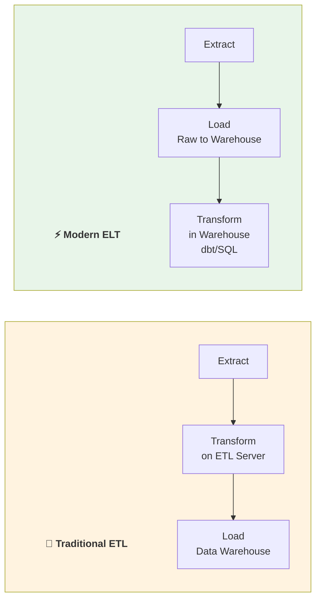

| Aspect | ETL | ELT |
|--------|-----|-----|
| **Transform Location** | ETL server (middleware) | In the warehouse |
| **Data Availability** | After transform completes | Immediately after load |
| **Schema Changes** | Manual, slow | Auto-detected |
| **Raw Data Access** | Often lost | Always preserved |
| **Transform Tool** | ETL tool logic | dbt, SQL |
| **Cost** | ETL compute + warehouse | Only warehouse compute |
| **Flexibility** | Low (predefined) | High (transform later) |
| **Modern Example** | Informatica, Talend | Fivetran + dbt, Airbyte + dbt |

**Why ELT won:**
- Cloud warehouses (Snowflake, BigQuery, Databricks) have massive compute
- Raw data preservation = re-transform without re-extract
- dbt made SQL-based transformations powerful and version-controlled
- Fivetran/Airbyte handle the "boring" EL part so engineers focus on T

### 1.2 The Modern Data Stack

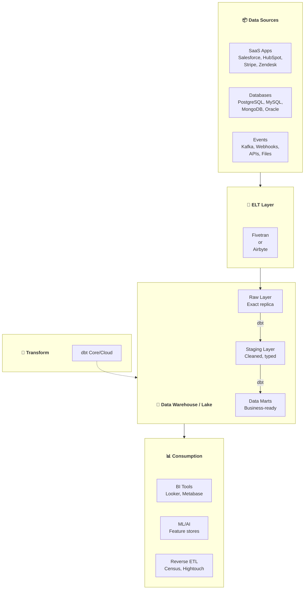

### 1.3 Market Overview

| Tool | Type | Pricing | Best For |
|------|------|---------|----------|
| **Fivetran** | Fully managed SaaS | Per MAR ($) | Enterprise, zero-maintenance |
| **Airbyte** | Open-source / Cloud | Free (OSS) or per credit | Startups, custom connectors |
| **Stitch** | Managed (Talend) | Per row | Simple, small scale |
| **Meltano** | Open-source CLI | Free | Singer-based, DevOps |
| **dlt** | Python library | Free | Pythonic, lightweight |
| **Sling** | CLI tool | Free / Pro | Fast file + DB sync |
| **Hevo Data** | Managed SaaS | Per event | Indian market, simple |
| **Matillion** | Managed SaaS | Per credit | Complex transformations |

---

## PHẦN 2: FIVETRAN DEEP DIVE

### 2.1 Architecture

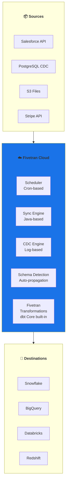

### 2.2 Key Features

| Feature | Description |
|---------|-------------|
| **300+ Connectors** | Pre-built, Fivetran-managed, guaranteed SLA |
| **Schema Detection** | Automatically detects + propagates schema changes |
| **Log-based CDC** | Reads database transaction logs (no polling!) |
| **Incremental Sync** | Only new/changed data synced after initial load |
| **5-minute Sync** | Near real-time sync frequencies |
| **Data Blocking** | Block columns/tables containing PII |
| **Column Hashing** | Hash PII columns automatically |
| **Auto-retry** | Failed syncs retry with exponential backoff |
| **Fivetran Transformations** | Built-in dbt Core for in-warehouse transforms |
| **Hybrid Deployment** | On-prem agent for private network access |

### 2.3 Connector Deep Dive

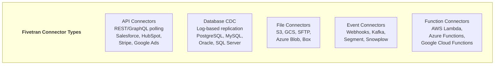

**Most Popular Connectors:**

| Category | Connectors |
|----------|------------|
| **CRM** | Salesforce, HubSpot, Pipedrive, Zoho |
| **Marketing** | Google Ads, Facebook Ads, LinkedIn Ads, Marketo |
| **Finance** | Stripe, Braintree, QuickBooks, NetSuite |
| **Support** | Zendesk, Intercom, Freshdesk, ServiceNow |
| **Product** | Amplitude, Mixpanel, Segment, Heap |
| **Database** | PostgreSQL, MySQL, SQL Server, Oracle, MongoDB |
| **Files** | S3, GCS, SFTP, Azure Blob, Google Sheets |
| **Engineering** | Jira, GitHub, GitLab, PagerDuty |

### 2.4 Sync Configuration

```json
{
  "connector_id": "abc123",
  "service": "postgres",
  "schema": "salesdb",
  "config": {
    "host": "db.company.com",
    "port": 5432,
    "database": "production",
    "user": "fivetran_reader",
    "password": "********",
    "update_method": "WAL",
    "replication_slot": "fivetran_slot",
    "publication_name": "fivetran_pub"
  },
  "schedule_type": "auto",
  "sync_frequency": 5,
  "paused": false,
  "schema_change_handling": "ALLOW_ALL",
  "data_blocking": {
    "blocked_columns": ["ssn", "credit_card"],
    "hashed_columns": ["email", "phone"]
  }
}
```

### 2.5 Schema Change Handling

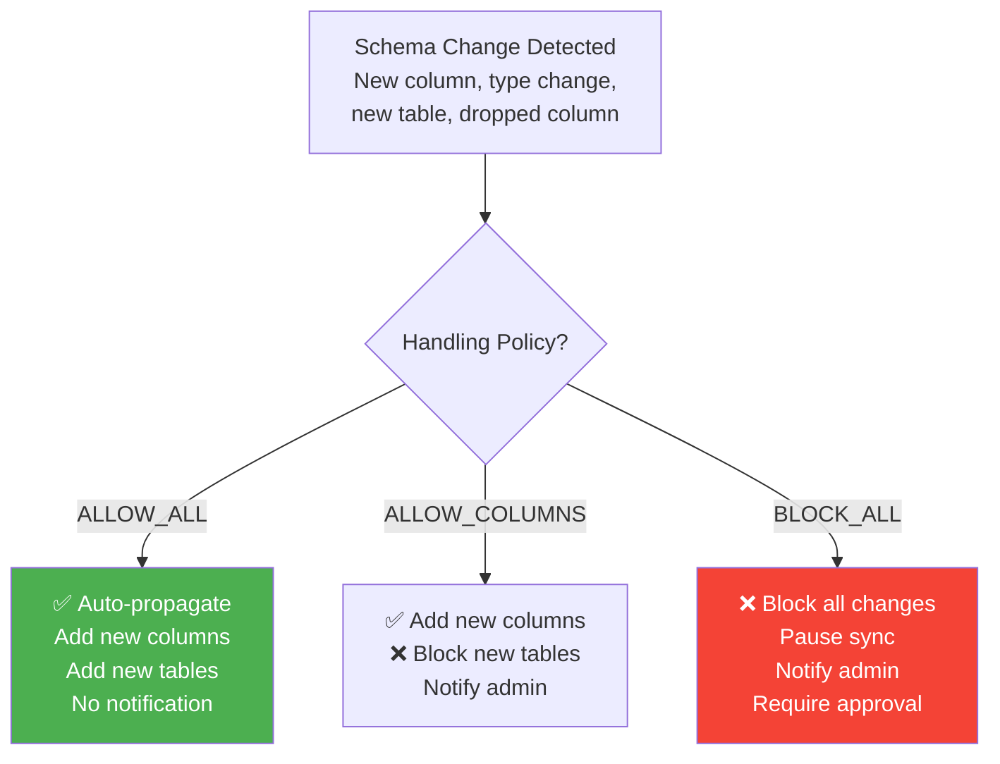

**Schema change scenarios:**

| Change | Fivetran Behavior |
|--------|------------------|
| **New column added** | Added to destination table |
| **Column type widened** | Destination type widened (e.g., INT → BIGINT) |
| **Column type narrowed** | Keeps wider type, no data loss |
| **Column dropped** | Column preserved in destination (soft delete) |
| **New table added** | Auto-synced if `ALLOW_ALL` policy |
| **Table dropped** | Table preserved in destination |
| **Column renamed** | Old column preserved + new column added |

### 2.6 Pricing Model

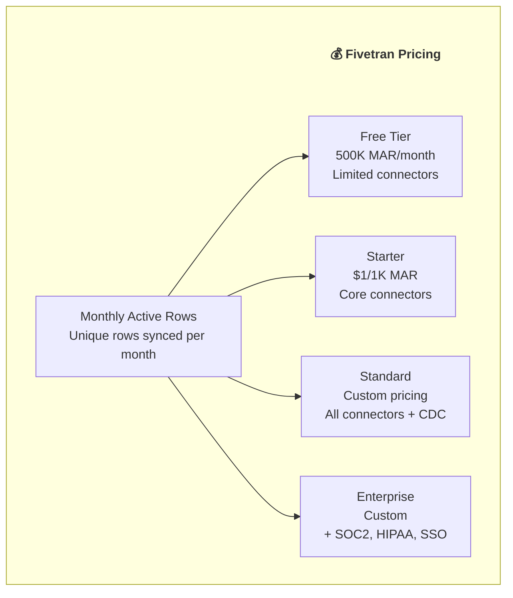

**Cost Optimization Tips:**
1. **Reduce sync frequency** — 6h instead of 5min for non-critical tables
2. **Block unnecessary tables** — Don't sync audit logs or temp tables
3. **Use incremental sync** — Avoid full re-syncs
4. **Archive historical data** — Don't re-sync old unchanged data
5. **Monitor MAR dashboard** — Identify high-MAR tables to optimize

---

## PHẦN 3: AIRBYTE DEEP DIVE

### 3.1 Architecture

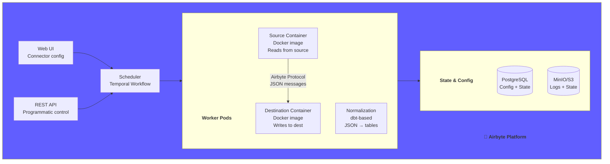

### 3.2 Key Features

| Feature | Description |
|---------|-------------|
| **350+ Connectors** | Community + Airbyte-maintained |
| **Open Source** | MIT license, self-host for free |
| **Docker-based** | Each connector = Docker image |
| **CDK** | Connector Development Kit (Python, Java, low-code) |
| **Normalization** | Auto-normalize JSON to typed tables |
| **State Management** | Cursor-based + CDC state persistence |
| **Schema Discovery** | Auto-detect source schemas |
| **Typing & Deduping** | New v2 destinations with typed tables |
| **Airbyte Cloud** | Managed version, pay per credit |
| **Airbyte Enterprise** | Self-hosted with enterprise features |

### 3.3 Airbyte Protocol (Core Concept)

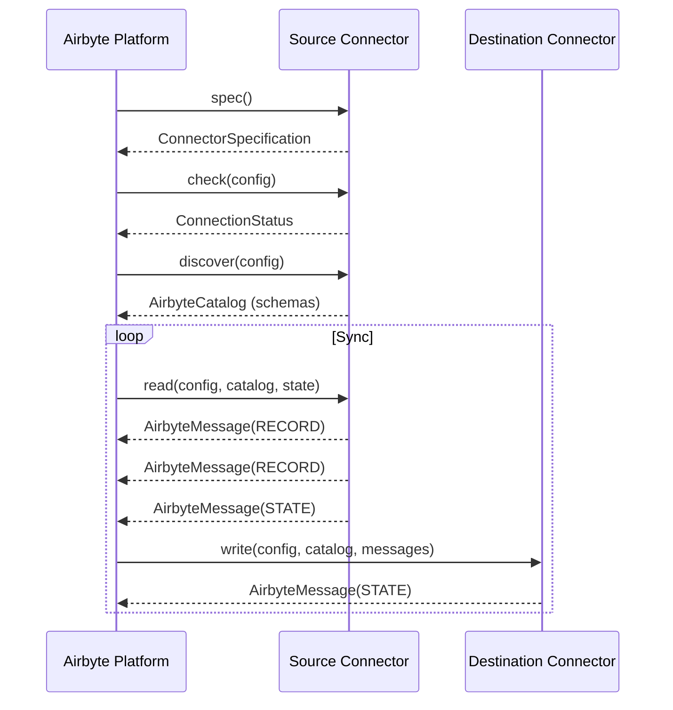

**Airbyte Protocol Messages:**

| Message Type | Description |
|-------------|-------------|
| `RECORD` | A data record (row) from source |
| `STATE` | Checkpoint state (cursor position, CDC offset) |
| `LOG` | Log message (info, warn, error) |
| `SPEC` | Connector configuration specification |
| `CATALOG` | Schema discovery result (streams, fields) |
| `CONNECTION_STATUS` | Connection test result |
| `CONTROL` | Control messages (rate limiting) |
| `TRACE` | Error traces with stack traces |

### 3.4 Self-Hosted Deployment

```bash
# Quick start with abctl (recommended)
curl -LsfS https://get.airbyte.com | bash -
abctl local install

# Or Docker Compose
git clone https://github.com/airbytehq/airbyte.git
cd airbyte
./run-ab-platform.sh

# Access UI
open http://localhost:8000
# Default: airbyte / password
```

```yaml
# docker-compose.yml (simplified core services)
services:
  # Core services
  airbyte-webapp:
    image: airbyte/webapp:latest
    ports:
      - "8000:8000"

  airbyte-server:
    image: airbyte/server:latest
    ports:
      - "8001:8001"

  airbyte-worker:
    image: airbyte/worker:latest
    volumes:
      - /var/run/docker.sock:/var/run/docker.sock  # For spawning connector containers

  airbyte-temporal:
    image: airbyte/temporal:latest

  airbyte-db:
    image: postgres:13
    environment:
      POSTGRES_USER: airbyte
      POSTGRES_PASSWORD: airbyte
      POSTGRES_DB: airbyte
```

### 3.5 Kubernetes Deployment

```bash
# Helm chart install
helm repo add airbyte https://airbytehq.github.io/helm-charts
helm repo update

helm install airbyte airbyte/airbyte \
    --namespace airbyte \
    --create-namespace \
    --values airbyte-values.yaml
```

```yaml
# airbyte-values.yaml
global:
  database:
    type: external
    host: postgres.internal
    port: 5432
    database: airbyte
    user: airbyte
    password: ${POSTGRES_PASSWORD}

  storage:
    type: s3
    bucket:
      log: airbyte-logs
      state: airbyte-state
    s3:
      region: us-east-1

webapp:
  resources:
    requests:
      memory: "512Mi"
      cpu: "250m"

worker:
  resources:
    requests:
      memory: "2Gi"
      cpu: "1"
    limits:
      memory: "4Gi"
      cpu: "2"
  containerOrchestrator:
    enabled: true  # Use separate pods for sync jobs
```

### 3.6 Pricing (Cloud)

| Plan | Price | Includes |
|------|-------|----------|
| **Free** | $0 | 2 connectors, 10 credits |
| **Growth** | $0.15/credit | Unlimited connectors |
| **Enterprise** | Custom | SSO, RBAC, SLA |
| **Self-Hosted OSS** | Free | All features, no support |
| **Self-Hosted Enterprise** | License | Enterprise features + support |

**1 credit ≈ 1 sync with ~10K records** (varies by connector complexity)

---

## PHẦN 4: COMPARISON & DECISION

### 4.1 Feature Comparison

| Feature | Fivetran | Airbyte |
|---------|----------|---------|
| **Pricing** | Per MAR (expensive) | Open-source / per credit |
| **Self-hosted** | ❌ (agent only) | ✅ Full self-host |
| **Connector Quality** | ✅ Enterprise-grade | ⚠️ Varies by connector |
| **Connector Count** | 300+ | 350+ |
| **CDC Support** | ✅ Log-based (managed) | ✅ Debezium-based |
| **Schema Changes** | ✅ Auto-propagation | ✅ Schema detection |
| **Normalization** | ✅ Built-in | ✅ dbt-based (v2 typing) |
| **Custom Connectors** | ⚠️ Lambda functions | ✅ CDK (Python/Java/YAML) |
| **Terraform** | ✅ Official provider | ✅ Official provider |
| **API** | ✅ REST API | ✅ REST + Python SDK |
| **Monitoring** | ✅ Dashboard + alerts | ✅ Dashboard + notifications |
| **SOC 2 / HIPAA** | ✅ Enterprise plan | ✅ Enterprise plan |
| **Data Blocking** | ✅ Column-level | ⚠️ Manual |
| **dbt Integration** | ✅ Built-in transforms | ✅ Normalization uses dbt |
| **Support** | ✅ Enterprise SLA | Community / Enterprise |

### 4.2 Decision Framework

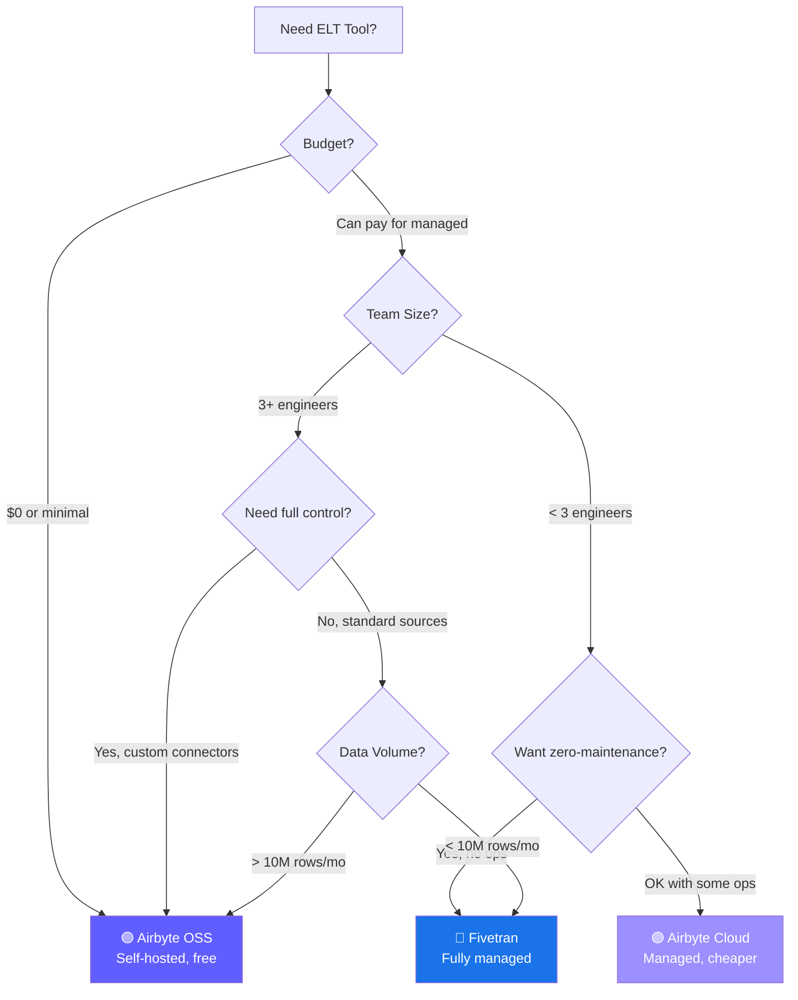

### 4.3 When to Use What

| Scenario | Recommendation | Why |
|----------|---------------|-----|
| Startup, no budget | **Airbyte OSS** | Free, self-host |
| Enterprise, many SaaS sources | **Fivetran** | Best SaaS connectors |
| Need custom connectors | **Airbyte** | CDK makes it easy |
| Real-time CDC at scale | **Fivetran** or **Debezium** | Most reliable CDC |
| Privacy-sensitive data | **Airbyte OSS** | Data stays in your infra |
| Minimal engineering overhead | **Fivetran** | Zero maintenance |
| High volume, cost-sensitive | **Airbyte OSS** | No per-row pricing |
| Python-native team | **dlt** or **Airbyte** | Python CDK |

---

## PHẦN 5: CONNECTORS & SCHEMA

### 5.1 Source Configuration Examples

**PostgreSQL (CDC) — Fivetran:**

```json
{
  "service": "postgres_rds",
  "config": {
    "host": "mydb.abcdef.us-east-1.rds.amazonaws.com",
    "port": 5432,
    "database": "production",
    "user": "fivetran_user",
    "password": "********",
    "update_method": "WAL",
    "replication_slot": "fivetran_slot",
    "publication_name": "fivetran_pub"
  }
}
```

**PostgreSQL (CDC) — Airbyte:**

```json
{
  "sourceDefinitionId": "decd338e-5647-4c0b-adf4-da0e75f5a750",
  "connectionConfiguration": {
    "host": "mydb.abcdef.us-east-1.rds.amazonaws.com",
    "port": 5432,
    "database": "production",
    "username": "airbyte_user",
    "password": "********",
    "schemas": ["public", "app"],
    "ssl_mode": {
      "mode": "require"
    },
    "replication_method": {
      "method": "CDC",
      "replication_slot": "airbyte_slot",
      "publication": "airbyte_pub",
      "initial_waiting_seconds": 300,
      "lsn_commit_behaviour": "After loading Data in the destination"
    }
  }
}
```

**PostgreSQL CDC Setup (Both tools need this):**

```sql
-- 1. Create replication user
CREATE USER fivetran_user WITH REPLICATION PASSWORD 'secure_password';
GRANT CONNECT ON DATABASE production TO fivetran_user;
GRANT USAGE ON SCHEMA public TO fivetran_user;
GRANT SELECT ON ALL TABLES IN SCHEMA public TO fivetran_user;
ALTER DEFAULT PRIVILEGES IN SCHEMA public 
    GRANT SELECT ON TABLES TO fivetran_user;

-- 2. Set wal_level (requires restart)
ALTER SYSTEM SET wal_level = 'logical';
-- Then restart PostgreSQL

-- 3. Create replication slot
SELECT pg_create_logical_replication_slot('fivetran_slot', 'pgoutput');

-- 4. Create publication
CREATE PUBLICATION fivetran_pub FOR ALL TABLES;
-- Or specific tables:
CREATE PUBLICATION fivetran_pub FOR TABLE orders, customers, products;

-- 5. Verify
SELECT * FROM pg_replication_slots;
SELECT * FROM pg_publication_tables;
```

### 5.2 Destination Schema Patterns

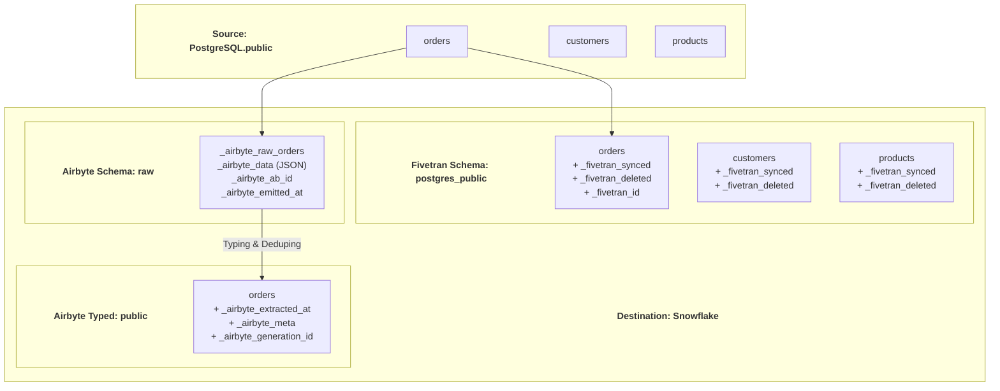

**Fivetran metadata columns:**
| Column | Type | Description |
|--------|------|-------------|
| `_fivetran_synced` | TIMESTAMP | When the row was last synced |
| `_fivetran_deleted` | BOOLEAN | Soft delete marker (CDC) |
| `_fivetran_id` | STRING | Unique row identifier |

**Airbyte v2 metadata columns:**
| Column | Type | Description |
|--------|------|-------------|
| `_airbyte_extracted_at` | TIMESTAMP | When extracted from source |
| `_airbyte_meta` | JSON | Sync metadata + errors |
| `_airbyte_generation_id` | BIGINT | Generation for dedup |
| `_airbyte_raw_id` | STRING | Unique record ID |

### 5.3 Schema Evolution

```sql
-- ============================================================
-- Fivetran: Auto schema propagation
-- ============================================================

-- Source adds column: ALTER TABLE orders ADD COLUMN discount DECIMAL(10,2);
-- Fivetran auto-adds: ALTER TABLE destination.orders ADD COLUMN discount NUMBER;
-- No manual intervention needed!

-- Source drops column: ALTER TABLE orders DROP COLUMN old_field;
-- Fivetran: Column preserved in destination (not dropped)


-- ============================================================
-- Airbyte: Schema change detection
-- ============================================================

-- When schema changes detected:
-- 1. "Propagate all changes" — auto-add/remove columns
-- 2. "Propagate new columns" — add only, never remove
-- 3. "Ignore changes" — keep existing schema
-- 4. "Pause sync" — wait for manual approval
```

---

## PHẦN 6: CDC & SYNC MODES

### 6.1 Sync Modes Overview

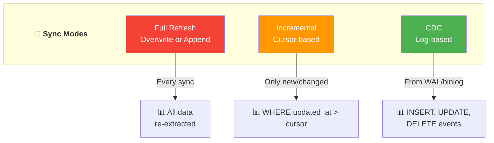

### 6.2 Full Refresh

```sql
-- ============================================================
-- Full Refresh: Overwrite
-- ============================================================
-- Every sync: TRUNCATE + INSERT all data
-- Use when: Small tables (< 100K rows), no reliable cursor
-- Example: dim_countries, config_settings

-- Fivetran: sync_mode = "FULL_TABLE"
-- Airbyte: sync_mode = "full_refresh", destination_sync_mode = "overwrite"


-- ============================================================
-- Full Refresh: Append
-- ============================================================
-- Every sync: INSERT all data (no delete old)
-- Use when: Snapshot history needed
-- Warning: Table grows every sync!

-- Airbyte: sync_mode = "full_refresh", destination_sync_mode = "append"
```

### 6.3 Incremental Sync (Cursor-Based)

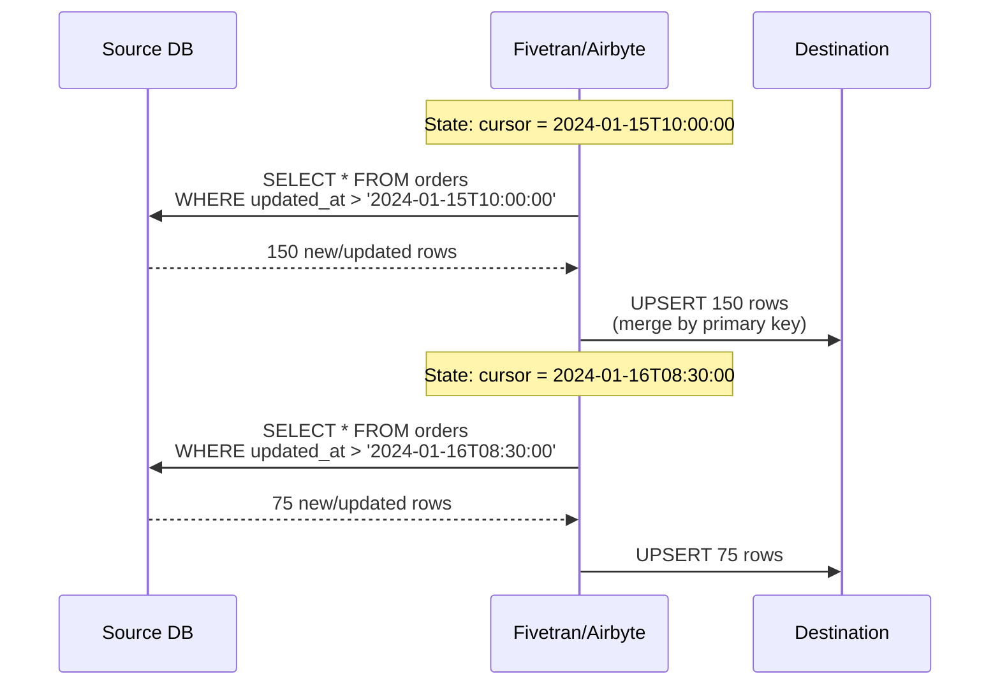

```sql
-- Requirements for cursor-based incremental:
-- 1. A cursor column (updated_at, id, etc.)
-- 2. Cursor column must be monotonically increasing
-- 3. Cursor column must be indexed for performance

-- ⚠️ Limitations:
-- Cannot detect DELETEs
-- Cannot detect updates that don't change cursor
-- Requires proper indexing on source

-- Best practices:
-- Add updated_at column with trigger:
CREATE OR REPLACE FUNCTION update_timestamp()
RETURNS TRIGGER AS $$
BEGIN
    NEW.updated_at = NOW();
    RETURN NEW;
END;
$$ LANGUAGE plpgsql;

CREATE TRIGGER set_updated_at
BEFORE UPDATE ON orders
FOR EACH ROW
EXECUTE FUNCTION update_timestamp();
```

### 6.4 CDC (Change Data Capture) — Log-Based

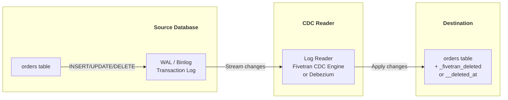

```sql
-- CDC captures ALL changes including DELETEs:

-- Source: INSERT INTO orders VALUES (1, 'product_a', 99.99);
-- CDC event: {"op": "INSERT", "after": {"id": 1, "product": "product_a", "amount": 99.99}}

-- Source: UPDATE orders SET amount = 89.99 WHERE id = 1;
-- CDC event: {"op": "UPDATE", "before": {"amount": 99.99}, "after": {"amount": 89.99}}

-- Source: DELETE FROM orders WHERE id = 1;
-- CDC event: {"op": "DELETE", "before": {"id": 1, "product": "product_a"}}
-- Destination: UPDATE orders SET _fivetran_deleted = true WHERE id = 1;
```

**CDC Comparison:**

| Aspect | Fivetran CDC | Airbyte CDC (Debezium) |
|--------|-------------|----------------------|
| **Engine** | Proprietary | Debezium (open-source) |
| **PostgreSQL** | WAL (pgoutput) | WAL (pgoutput/decoderbufs) |
| **MySQL** | Binlog | Binlog |
| **SQL Server** | CT/CDC | CDC |
| **MongoDB** | Change Streams | Change Streams |
| **Initial Snapshot** | Automatic | Configurable |
| **Heartbeat** | Automatic | Configurable |
| **Setup Complexity** | Low | Medium |

---

## PHẦN 7: CUSTOM CONNECTORS

### 7.1 Airbyte CDK (Connector Development Kit)

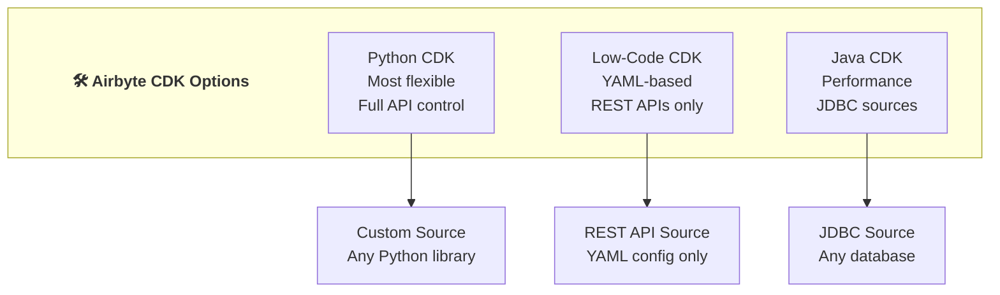

### 7.2 Python CDK Example

```python
"""
Custom Airbyte source connector using Python CDK
pip install airbyte-cdk
"""

from typing import Any, Iterable, Mapping, Optional
from airbyte_cdk import AirbyteLogger
from airbyte_cdk.sources import AbstractSource
from airbyte_cdk.sources.streams import Stream
from airbyte_cdk.sources.streams.http import HttpStream
from airbyte_cdk.models import SyncMode
import requests


class InternalApiStream(HttpStream):
    """Stream that reads from an internal REST API."""
    
    url_base = "https://api.internal.company.com/v2/"
    primary_key = "id"
    cursor_field = "updated_at"
    
    def __init__(self, api_key: str, **kwargs):
        super().__init__(**kwargs)
        self.api_key = api_key
    
    @property
    def name(self) -> str:
        return "transactions"
    
    def request_headers(self, **kwargs) -> Mapping[str, str]:
        return {
            "Authorization": f"Bearer {self.api_key}",
            "Content-Type": "application/json"
        }
    
    def path(self, **kwargs) -> str:
        return "transactions"
    
    def request_params(
        self,
        stream_state: Optional[Mapping[str, Any]] = None,
        **kwargs
    ) -> Mapping[str, Any]:
        params = {"page_size": 100}
        if stream_state and "updated_at" in stream_state:
            params["updated_after"] = stream_state["updated_at"]
        return params
    
    def parse_response(
        self, response: requests.Response, **kwargs
    ) -> Iterable[Mapping]:
        data = response.json()
        yield from data.get("results", [])
    
    def next_page_token(
        self, response: requests.Response
    ) -> Optional[Mapping[str, Any]]:
        data = response.json()
        if data.get("has_more"):
            return {"cursor": data["next_cursor"]}
        return None
    
    def get_json_schema(self) -> Mapping[str, Any]:
        return {
            "$schema": "http://json-schema.org/draft-07/schema#",
            "type": "object",
            "properties": {
                "id": {"type": "string"},
                "amount": {"type": "number"},
                "currency": {"type": "string"},
                "status": {"type": "string"},
                "customer_id": {"type": "string"},
                "updated_at": {"type": "string", "format": "date-time"}
            }
        }


class SourceInternalApi(AbstractSource):
    """Source connector for Internal API."""
    
    def check_connection(
        self, logger: AirbyteLogger, config: Mapping[str, Any]
    ) -> tuple[bool, Optional[str]]:
        try:
            response = requests.get(
                "https://api.internal.company.com/v2/health",
                headers={"Authorization": f"Bearer {config['api_key']}"}
            )
            response.raise_for_status()
            return True, None
        except Exception as e:
            return False, str(e)
    
    def streams(
        self, config: Mapping[str, Any]
    ) -> list[Stream]:
        return [
            InternalApiStream(api_key=config["api_key"]),
        ]
```

### 7.3 Low-Code CDK (YAML)

```yaml
# For simple REST APIs — no Python needed!
# source_internal_api/manifest.yaml

version: "0.79.0"

type: DeclarativeSource

check:
  type: CheckStream
  stream_names:
    - "transactions"

definitions:
  selector:
    type: RecordSelector
    extractor:
      type: DpathExtractor
      field_path: ["results"]

  requester:
    type: HttpRequester
    url_base: "https://api.internal.company.com/v2/"
    http_method: "GET"
    authenticator:
      type: BearerAuthenticator
      api_token: "{{ config['api_key'] }}"

  paginator:
    type: DefaultPaginator
    page_token_option:
      type: RequestOption
      inject_into: request_parameter
      field_name: cursor
    pagination_strategy:
      type: CursorPagination
      cursor_value: "{{ response.next_cursor }}"

  incremental_sync:
    type: DatetimeBasedCursor
    cursor_field: updated_at
    datetime_format: "%Y-%m-%dT%H:%M:%SZ"
    start_datetime:
      type: MinMaxDatetime
      datetime: "{{ config['start_date'] }}"
      datetime_format: "%Y-%m-%d"

  transactions_stream:
    type: DeclarativeStream
    name: "transactions"
    primary_key: "id"
    schema_loader:
      type: InlineSchemaLoader
      schema:
        $schema: http://json-schema.org/draft-07/schema#
        type: object
        properties:
          id:
            type: string
          amount:
            type: number
          customer_id:
            type: string
          updated_at:
            type: string
            format: date-time
    retriever:
      type: SimpleRetriever
      record_selector: "*ref(definitions.selector)"
      requester: "*ref(definitions.requester)"
      paginator: "*ref(definitions.paginator)"
    incremental_sync: "*ref(definitions.incremental_sync)"

streams:
  - "*ref(definitions.transactions_stream)"
```

### 7.4 Fivetran Function Connector

```python
"""
Fivetran Lambda/Cloud Function connector
Runs in AWS Lambda, Azure Functions, or GCP Cloud Functions
"""

import json
import requests
from datetime import datetime, timezone


def handler(request):
    """
    Fivetran calls this function with:
    - request.state: previous sync state
    - request.secrets: configured secrets
    
    Must return:
    - state: updated state
    - schema: table schemas
    - insert: records to insert
    - hasMore: if there are more records
    """
    
    # Get state from previous sync
    state = request.get("state", {})
    cursor = state.get("cursor", "2020-01-01T00:00:00Z")
    secrets = request.get("secrets", {})
    
    # Fetch data from API
    response = requests.get(
        "https://api.internal.company.com/v2/transactions",
        headers={"Authorization": f"Bearer {secrets['api_key']}"},
        params={
            "updated_after": cursor,
            "limit": 1000
        }
    )
    data = response.json()
    
    # Build response
    records = data.get("results", [])
    
    return {
        "state": {
            "cursor": records[-1]["updated_at"] if records else cursor
        },
        "schema": {
            "transactions": {
                "primary_key": ["id"]
            }
        },
        "insert": {
            "transactions": records
        },
        "hasMore": data.get("has_more", False)
    }
```

---

## PHẦN 8: INFRASTRUCTURE AS CODE

### 8.1 Terraform — Fivetran

```hcl
# Fivetran Terraform Provider
# https://github.com/fivetran/terraform-provider-fivetran

terraform {
  required_providers {
    fivetran = {
      source  = "fivetran/fivetran"
      version = "~> 1.0"
    }
  }
}

provider "fivetran" {
  api_key    = var.fivetran_api_key
  api_secret = var.fivetran_api_secret
}

# Create destination (Snowflake)
resource "fivetran_destination" "snowflake" {
  group_id               = fivetran_group.analytics.id
  service                = "snowflake"
  region                 = "US"
  time_zone_offset       = "-5"
  run_setup_tests        = true
  trust_certificates     = false
  trust_fingerprints     = false

  config {
    host     = var.snowflake_host
    port     = 443
    database = "RAW"
    auth     = "PASSWORD"
    user     = var.snowflake_user
    password = var.snowflake_password
    role     = "FIVETRAN_ROLE"
  }
}

# Create connector group
resource "fivetran_group" "analytics" {
  name = "analytics_pipeline"
}

# PostgreSQL CDC connector
resource "fivetran_connector" "postgres_production" {
  group_id         = fivetran_group.analytics.id
  service          = "postgres_rds"
  sync_frequency   = 5
  paused           = false
  pause_after_trial = false

  destination_schema {
    name   = "postgres_production"
    prefix = ""
  }

  config {
    host            = var.pg_host
    port            = 5432
    database        = "production"
    user            = "fivetran_user"
    password        = var.pg_password
    update_method   = "WAL"
    replication_slot = "fivetran_slot"
    publication_name = "fivetran_pub"
  }
}

# Salesforce connector
resource "fivetran_connector" "salesforce" {
  group_id       = fivetran_group.analytics.id
  service        = "salesforce"
  sync_frequency = 60

  destination_schema {
    name = "salesforce"
  }

  config {
    is_sandbox = false
  }
}

# Schema config (block specific columns)
resource "fivetran_connector_schema_config" "postgres_schema" {
  connector_id = fivetran_connector.postgres_production.id

  schema_change_handling = "ALLOW_COLUMNS"

  schema {
    name    = "public"
    enabled = true

    table {
      name    = "users"
      enabled = true

      column {
        name    = "ssn"
        enabled = false  # Block PII
      }
      column {
        name    = "email"
        hashed  = true  # Hash PII
      }
    }

    table {
      name    = "audit_logs"
      enabled = false  # Don't sync
    }
  }
}
```

### 8.2 Terraform — Airbyte

```hcl
# Airbyte Terraform Provider
# https://github.com/airbytehq/terraform-provider-airbyte

terraform {
  required_providers {
    airbyte = {
      source  = "airbytehq/airbyte"
      version = "~> 0.6"
    }
  }
}

provider "airbyte" {
  server_url = "http://localhost:8000/api/public/v1"
  # Or Airbyte Cloud:
  # bearer_auth = var.airbyte_api_key
}

# Create workspace
resource "airbyte_workspace" "analytics" {
  name = "Analytics Pipeline"
}

# PostgreSQL source
resource "airbyte_source_postgres" "production" {
  name         = "Production PostgreSQL"
  workspace_id = airbyte_workspace.analytics.workspace_id

  configuration = {
    host     = var.pg_host
    port     = 5432
    database = "production"
    username = "airbyte_user"
    password = var.pg_password
    schemas  = ["public", "app"]

    ssl_mode = {
      require = {}
    }

    replication_method = {
      read_changes_using_write_ahead_log_cdc = {
        replication_slot = "airbyte_slot"
        publication      = "airbyte_pub"
      }
    }
  }
}

# Snowflake destination
resource "airbyte_destination_snowflake" "warehouse" {
  name         = "Snowflake Warehouse"
  workspace_id = airbyte_workspace.analytics.workspace_id

  configuration = {
    host      = var.snowflake_host
    role      = "AIRBYTE_ROLE"
    warehouse = "LOADING_WH"
    database  = "RAW"
    schema    = "PUBLIC"
    username  = var.snowflake_user
    credentials = {
      password = {
        password = var.snowflake_password
      }
    }
  }
}

# Connection (source → destination)
resource "airbyte_connection" "postgres_to_snowflake" {
  name           = "PostgreSQL → Snowflake"
  source_id      = airbyte_source_postgres.production.source_id
  destination_id = airbyte_destination_snowflake.warehouse.destination_id

  schedule = {
    schedule_type = "cron"
    cron_expression = "0 */6 * * *"  # Every 6 hours
  }

  configurations = {
    streams = [
      {
        name      = "orders"
        sync_mode = "incremental_deduped_history"
        cursor_field = ["updated_at"]
        primary_key  = [["id"]]
      },
      {
        name      = "customers"
        sync_mode = "incremental_deduped_history"
        cursor_field = ["updated_at"]
        primary_key  = [["id"]]
      },
      {
        name      = "products"
        sync_mode = "full_refresh_overwrite"
      }
    ]
  }
}
```

### 8.3 Airbyte Python API (PyAirbyte)

```python
"""
PyAirbyte — Run Airbyte connectors locally in Python
pip install airbyte
"""

import airbyte as ab

# ============================================================
# Option 1: Use PyAirbyte for local extraction
# ============================================================

# Configure source
source = ab.get_source(
    "source-postgres",
    config={
        "host": "localhost",
        "port": 5432,
        "database": "mydb",
        "username": "reader",
        "password": "password",
        "schemas": ["public"],
        "replication_method": {"method": "Standard"}
    }
)

# Check connection
source.check()

# Discover available streams
source.select_all_streams()
# Or select specific:
# source.select_streams(["orders", "customers"])

# Read into cache (DuckDB by default)
cache = ab.get_default_cache()
result = source.read(cache=cache)

# Get as pandas DataFrame
orders_df = result["orders"].to_pandas()
print(orders_df.head())

# Get as SQL table (in DuckDB)
print(result["orders"].to_sql_table())


# ============================================================
# Option 2: Use Airbyte REST API
# ============================================================

import requests

AIRBYTE_URL = "http://localhost:8000/api/public/v1"
HEADERS = {
    "Authorization": "Bearer <api-key>",
    "Content-Type": "application/json"
}

# Trigger sync
response = requests.post(
    f"{AIRBYTE_URL}/connections/{connection_id}/sync",
    headers=HEADERS
)
job = response.json()
print(f"Job ID: {job['jobId']}, Status: {job['status']}")

# Check job status
response = requests.get(
    f"{AIRBYTE_URL}/jobs/{job['jobId']}",
    headers=HEADERS
)
status = response.json()
print(f"Status: {status['status']}, Bytes: {status.get('bytesSynced', 0)}")
```

---

## PHẦN 9: MONITORING & OPERATIONS

### 9.1 Monitoring Architecture

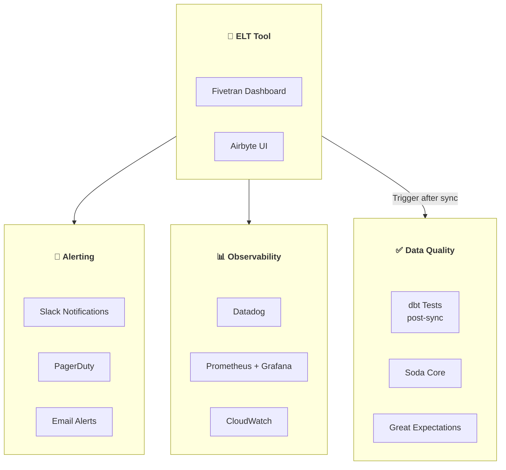

### 9.2 Fivetran Monitoring

```python
"""
Fivetran API — Monitor sync status
pip install requests
"""

import requests
from datetime import datetime, timedelta

FIVETRAN_API_KEY = "your_api_key"
FIVETRAN_API_SECRET = "your_api_secret"

def get_connector_status(connector_id: str) -> dict:
    """Get sync status for a Fivetran connector."""
    response = requests.get(
        f"https://api.fivetran.com/v1/connectors/{connector_id}",
        auth=(FIVETRAN_API_KEY, FIVETRAN_API_SECRET)
    )
    data = response.json()["data"]
    
    return {
        "name": data["schema"],
        "status": data["status"]["sync_state"],
        "last_sync": data["succeeded_at"],
        "setup_state": data["status"]["setup_state"],
        "update_state": data["status"]["update_state"],
        "is_historical_sync": data["status"]["is_historical_sync"]
    }

def check_stale_connectors(group_id: str, max_hours: int = 24):
    """Alert on connectors that haven't synced recently."""
    response = requests.get(
        f"https://api.fivetran.com/v1/groups/{group_id}/connectors",
        auth=(FIVETRAN_API_KEY, FIVETRAN_API_SECRET)
    )
    
    stale = []
    cutoff = datetime.utcnow() - timedelta(hours=max_hours)
    
    for connector in response.json()["data"]["items"]:
        last_sync = connector.get("succeeded_at")
        if last_sync:
            sync_time = datetime.fromisoformat(last_sync.replace("Z", "+00:00"))
            if sync_time.replace(tzinfo=None) < cutoff:
                stale.append({
                    "name": connector["schema"],
                    "last_sync": last_sync,
                    "hours_stale": (datetime.utcnow() - sync_time.replace(tzinfo=None)).total_seconds() / 3600
                })
    
    return stale
```

### 9.3 Airbyte Monitoring

```python
"""
Airbyte API monitoring
"""

import requests

AIRBYTE_URL = "http://localhost:8000/api/public/v1"
HEADERS = {"Authorization": "Bearer <api-key>"}

def get_connection_status(connection_id: str) -> dict:
    """Get sync status for an Airbyte connection."""
    response = requests.get(
        f"{AIRBYTE_URL}/connections/{connection_id}",
        headers=HEADERS
    )
    return response.json()

def get_recent_jobs(connection_id: str, limit: int = 5) -> list:
    """Get recent sync jobs."""
    response = requests.get(
        f"{AIRBYTE_URL}/jobs",
        headers=HEADERS,
        params={
            "connectionId": connection_id,
            "limit": limit,
            "orderBy": "createdAt|DESC"
        }
    )
    
    jobs = response.json()["data"]
    return [{
        "job_id": j["jobId"],
        "status": j["status"],
        "started": j.get("startTime"),
        "bytes_synced": j.get("bytesSynced", 0),
        "rows_synced": j.get("rowsSynced", 0),
        "duration_seconds": j.get("duration", 0)
    } for j in jobs]
```

### 9.4 Webhook Notifications

```python
"""
Send Slack alerts on sync failures
"""

import requests
import json

SLACK_WEBHOOK = "https://hooks.slack.com/services/T.../B.../xxx"

def send_sync_alert(connector_name: str, error: str, sync_time: str):
    """Send Slack alert for failed sync."""
    payload = {
        "blocks": [
            {
                "type": "header",
                "text": {
                    "type": "plain_text",
                    "text": f"🚨 Sync Failed: {connector_name}"
                }
            },
            {
                "type": "section",
                "fields": [
                    {"type": "mrkdwn", "text": f"*Connector:*\n{connector_name}"},
                    {"type": "mrkdwn", "text": f"*Time:*\n{sync_time}"},
                    {"type": "mrkdwn", "text": f"*Error:*\n```{error[:500]}```"}
                ]
            }
        ]
    }
    
    requests.post(SLACK_WEBHOOK, json=payload)
```

### 9.5 Key Metrics to Monitor

| Metric | Healthy | Warning | Critical |
|--------|---------|---------|----------|
| Sync success rate | > 99% | 95-99% | < 95% |
| Sync latency | < 30 min | 30-60 min | > 1 hour |
| Data freshness | < 1 hour | 1-6 hours | > 6 hours |
| Row count variance | < 5% | 5-20% | > 20% |
| Schema changes | Expected | Unexpected columns | Table drops |
| Replication lag (CDC) | < 1 min | 1-10 min | > 10 min |

---

## PHẦN 10: DBT INTEGRATION

### 10.1 ELT Pipeline Architecture

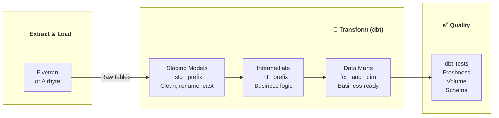

### 10.2 Fivetran + dbt Cloud Integration

```yaml
# Fivetran Transformations (built-in dbt)
# No separate dbt Cloud needed for basic transforms

# In Fivetran UI:
# 1. Connect dbt project (Git repo)
# 2. Set schedule: "After every sync"
# 3. Select models to run

# dbt_project.yml
name: 'analytics'
version: '1.0.0'
profile: 'fivetran'

models:
  analytics:
    staging:
      +materialized: view
      +schema: staging
    marts:
      +materialized: table
      +schema: analytics
```

### 10.3 Airbyte + dbt Pattern

```yaml
# dbt source definition for Airbyte-synced data
# models/staging/sources.yml

version: 2

sources:
  - name: airbyte_raw
    database: RAW
    schema: PUBLIC
    tables:
      - name: orders
        loaded_at_field: _airbyte_extracted_at
        freshness:
          warn_after: {count: 12, period: hour}
          error_after: {count: 24, period: hour}
      - name: customers
        loaded_at_field: _airbyte_extracted_at
        freshness:
          warn_after: {count: 24, period: hour}
          error_after: {count: 48, period: hour}
      - name: products
```

```sql
-- models/staging/stg_orders.sql
-- Clean Airbyte raw data

WITH source AS (
    SELECT * FROM {{ source('airbyte_raw', 'orders') }}
),

cleaned AS (
    SELECT
        -- Primary key
        id AS order_id,
        
        -- Foreign keys
        customer_id,
        product_id,
        
        -- Dimensions
        status,
        payment_method,
        
        -- Measures
        CAST(amount AS DECIMAL(10, 2)) AS order_amount,
        CAST(tax AS DECIMAL(10, 2)) AS tax_amount,
        CAST(amount AS DECIMAL(10, 2)) + CAST(tax AS DECIMAL(10, 2)) AS total_amount,
        
        -- Timestamps
        CAST(created_at AS TIMESTAMP) AS created_at,
        CAST(updated_at AS TIMESTAMP) AS updated_at,
        
        -- Airbyte metadata
        _airbyte_extracted_at AS synced_at
        
    FROM source
    -- Filter out Airbyte test records
    WHERE id IS NOT NULL
)

SELECT * FROM cleaned
```

### 10.4 Orchestration: Airbyte Sync → dbt Run

```python
"""
Airflow DAG: Airbyte sync → dbt run
"""

from airflow import DAG
from airflow.providers.airbyte.operators.airbyte import AirbyteTriggerSyncOperator
from airflow.providers.airbyte.sensors.airbyte import AirbyteJobSensor
from cosmos import DbtTaskGroup, ProjectConfig, ProfileConfig

with DAG("elt_pipeline", schedule_interval="@hourly") as dag:
    
    # Step 1: Trigger Airbyte sync
    trigger_sync = AirbyteTriggerSyncOperator(
        task_id="trigger_airbyte_sync",
        airbyte_conn_id="airbyte_default",
        connection_id="your-connection-id",
        asynchronous=True,
    )
    
    # Step 2: Wait for sync to complete
    wait_sync = AirbyteJobSensor(
        task_id="wait_for_sync",
        airbyte_conn_id="airbyte_default",
        airbyte_job_id=trigger_sync.output,
    )
    
    # Step 3: Run dbt transformations
    dbt_transforms = DbtTaskGroup(
        group_id="dbt_transforms",
        project_config=ProjectConfig("/path/to/dbt/project"),
        profile_config=ProfileConfig(
            profile_name="analytics",
            target_name="prod",
        ),
    )
    
    trigger_sync >> wait_sync >> dbt_transforms
```

---

## PHẦN 11: ALTERNATIVES

### 11.1 Comparison Matrix

| Tool | Type | License | Connectors | Best For |
|------|------|---------|------------|----------|
| **Fivetran** | Managed SaaS | Proprietary | 300+ | Enterprise, zero-ops |
| **Airbyte** | OSS / Cloud | MIT (Elastic 2.0) | 350+ | Flexibility, custom |
| **Meltano** | OSS CLI | MIT | 600+ (Singer) | DevOps-native |
| **dlt** | Python library | Apache 2.0 | 100+ | Pythonic, lightweight |
| **Sling** | CLI tool | Apache 2.0 | 30+ (DBs) | Fast DB-to-DB sync |
| **Stitch** | Managed SaaS | Proprietary (Talend) | 130+ | Simple, affordable |
| **Hevo** | Managed SaaS | Proprietary | 150+ | Indian market |

### 11.2 dlt (data load tool)

```python
"""
dlt — Python-first data loading
pip install dlt[snowflake]
"""

import dlt
from dlt.sources.rest_api import rest_api_source

# Simple API → Snowflake pipeline
@dlt.resource(write_disposition="merge", primary_key="id")
def github_issues():
    """Load GitHub issues incrementally."""
    url = "https://api.github.com/repos/dlt-hub/dlt/issues"
    response = requests.get(url, params={"state": "all", "per_page": 100})
    yield response.json()

pipeline = dlt.pipeline(
    pipeline_name="github_issues",
    destination="snowflake",
    dataset_name="github_data"
)

load_info = pipeline.run(github_issues())
print(load_info)
```

### 11.3 Meltano

```yaml
# meltano.yml
plugins:
  extractors:
    - name: tap-postgres
      variant: meltanolabs
      pip_url: meltanolabs-tap-postgres
      config:
        host: localhost
        port: 5432
        database: mydb
        user: meltano
        password: password
  
  loaders:
    - name: target-snowflake
      variant: meltanolabs
      pip_url: meltanolabs-target-snowflake
      config:
        account: myaccount.snowflakecomputing.com
        database: RAW
        schema: PUBLIC

# Run:
# meltano run tap-postgres target-snowflake
```

---

## PHẦN 12: HANDS-ON LABS

### Lab 1: Airbyte OSS — PostgreSQL → DuckDB

```bash
# Step 1: Install Airbyte locally
curl -LsfS https://get.airbyte.com | bash -
abctl local install

# Step 2: Access UI at http://localhost:8000

# Step 3: Create source (PostgreSQL)
# Host: host.docker.internal (for Docker Desktop)
# Port: 5432
# Database: mydb
# Username: reader
# Password: password

# Step 4: Create destination (Local JSON or DuckDB)

# Step 5: Create connection with schedule
# Sync mode: Incremental | Dedupe
# Cursor: updated_at
# Primary key: id
# Frequency: Every 1 hour

# Step 6: Run initial sync and verify data
```

### Lab 2: PyAirbyte — Quick Data Extraction

```python
"""
Extract data from any Airbyte source locally
pip install airbyte pandas
"""

import airbyte as ab

# Configure source
source = ab.get_source(
    "source-faker",  # Fake data generator for testing
    config={
        "count": 1000,
        "seed": 42
    }
)

# Discover and select streams
source.check()
source.select_all_streams()

# Read into local DuckDB cache
cache = ab.get_default_cache()
result = source.read(cache=cache)

# Explore data
users_df = result["users"].to_pandas()
purchases_df = result["purchases"].to_pandas()

print(f"Users: {len(users_df)}")
print(f"Purchases: {len(purchases_df)}")
print(users_df.head())

# Join and analyze
merged = purchases_df.merge(users_df, on="id", how="left")
print(merged.groupby("country")["price"].sum().sort_values(ascending=False))
```

### Lab 3: Fivetran Terraform Setup

```hcl
# main.tf — Full Fivetran setup with Terraform

terraform {
  required_providers {
    fivetran = {
      source  = "fivetran/fivetran"
      version = "~> 1.0"
    }
  }
}

provider "fivetran" {
  api_key    = var.fivetran_api_key
  api_secret = var.fivetran_api_secret
}

# Group
resource "fivetran_group" "lab" {
  name = "terraform-lab"
}

# Google Sheets source (simple test)
resource "fivetran_connector" "sheets" {
  group_id       = fivetran_group.lab.id
  service        = "google_sheets"
  sync_frequency = 360  # Every 6 hours

  destination_schema {
    name = "google_sheets"
  }

  config {
    sheet_id          = var.google_sheet_id
    named_range       = "Sheet1"
    authorization_method = "service_account"
    certificate       = var.gcp_service_account_json
  }
}

output "connector_id" {
  value = fivetran_connector.sheets.id
}
```

### Lab 4: Monitoring Script

```python
"""
End-to-end monitoring for ELT pipeline
"""

import requests
import json
from datetime import datetime, timedelta

class ELTMonitor:
    def __init__(self, tool: str, **kwargs):
        self.tool = tool
        if tool == "fivetran":
            self.api_key = kwargs["api_key"]
            self.api_secret = kwargs["api_secret"]
        elif tool == "airbyte":
            self.base_url = kwargs.get("base_url", "http://localhost:8000/api/public/v1")
            self.token = kwargs.get("token")
    
    def check_all_connections(self) -> list:
        """Return list of unhealthy connections."""
        unhealthy = []
        
        if self.tool == "fivetran":
            groups = self._fivetran_get("/v1/groups")
            for group in groups["data"]["items"]:
                connectors = self._fivetran_get(f"/v1/groups/{group['id']}/connectors")
                for conn in connectors["data"]["items"]:
                    status = conn["status"]
                    if status["sync_state"] != "scheduled":
                        unhealthy.append({
                            "name": conn["schema"],
                            "state": status["sync_state"],
                            "last_success": conn.get("succeeded_at")
                        })
        
        elif self.tool == "airbyte":
            connections = self._airbyte_get("/connections")
            for conn in connections["data"]:
                if conn["status"] != "active":
                    unhealthy.append({
                        "name": conn["name"],
                        "state": conn["status"]
                    })
        
        return unhealthy
    
    def _fivetran_get(self, path: str) -> dict:
        return requests.get(
            f"https://api.fivetran.com{path}",
            auth=(self.api_key, self.api_secret)
        ).json()
    
    def _airbyte_get(self, path: str) -> dict:
        headers = {}
        if self.token:
            headers["Authorization"] = f"Bearer {self.token}"
        return requests.get(
            f"{self.base_url}{path}",
            headers=headers
        ).json()


# Usage
monitor = ELTMonitor(
    tool="airbyte",
    base_url="http://localhost:8000/api/public/v1",
    token="your-api-key"
)

issues = monitor.check_all_connections()
if issues:
    print(f"⚠️ {len(issues)} unhealthy connections:")
    for issue in issues:
        print(f"  - {issue['name']}: {issue['state']}")
else:
    print("✅ All connections healthy!")
```

---

## 📦 Verified Resources

| Resource | Link | Note |
|----------|------|------|
| Fivetran Docs | [fivetran.com/docs](https://fivetran.com/docs) | Official docs |
| Fivetran Terraform | [fivetran/terraform-provider-fivetran](https://github.com/fivetran/terraform-provider-fivetran) | IaC provider |
| Airbyte GitHub | [airbytehq/airbyte](https://github.com/airbytehq/airbyte) | 18k⭐ Main repo |
| Airbyte Docs | [docs.airbyte.com](https://docs.airbyte.com/) | Official docs |
| Airbyte CDK | [airbytehq/airbyte-python-cdk](https://github.com/airbytehq/airbyte-python-cdk) | Connector dev |
| Airbyte Terraform | [airbytehq/terraform-provider-airbyte](https://github.com/airbytehq/terraform-provider-airbyte) | IaC provider |
| PyAirbyte | [PyPI: airbyte](https://pypi.org/project/airbyte/) | Python library |
| dlt | [dlt-hub/dlt](https://github.com/dlt-hub/dlt) | 4k⭐ Python ELT |
| Meltano | [meltano/meltano](https://github.com/meltano/meltano) | 2k⭐ Singer-based |
| Sling | [slingdata-io/sling-cli](https://github.com/slingdata-io/sling-cli) | Fast CLI sync |

---

## 🔗 Liên Kết Nội Bộ

- [[07_dbt_Complete_Guide|dbt]] — Transform layer after ELT
- [[05_Apache_Kafka_Complete_Guide|Apache Kafka]] — Event streaming source
- [[08_Apache_Airflow_Complete_Guide|Apache Airflow]] — Orchestrate ELT pipelines
- [[10_Data_Quality_Tools_Guide|Data Quality]] — Post-sync validation
- [[14_Trino_Presto_Complete_Guide|Trino]] — Query federated sources
- [[../fundamentals/08_Data_Integration_APIs|Data Integration]] — Concepts

---

*Last Updated: February 2026*
*Coverage: Fivetran, Airbyte, CDC, Custom Connectors, Terraform, Monitoring, dbt Integration*
