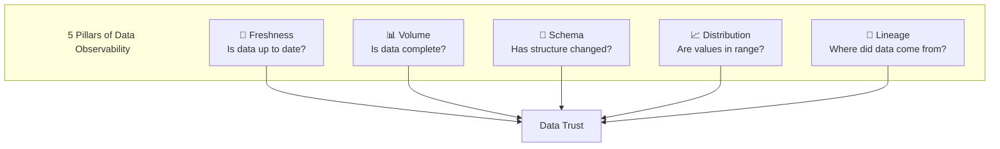
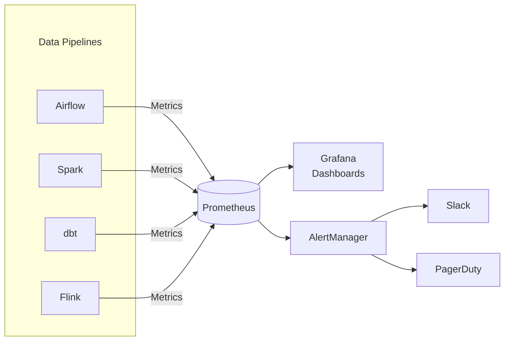

# 👁️ Observability & Monitoring Tools Guide

> Data Observability, Monitoring, và Alerting cho Data Pipelines

---

## 📋 Mục Lục

1. [Data Observability Overview](#-data-observability-overview)
2. [OpenTelemetry for Data](#-opentelemetry-for-data)
3. [Data Observability Platforms](#-data-observability-platforms)
4. [Metrics & Monitoring Stack](#-metrics--monitoring-stack)
5. [Alerting Strategies](#-alerting-strategies)
6. [Best Practices](#-best-practices)

---

## 🔭 Data Observability Overview

### What is Data Observability?



### Why Data Observability?

```
Traditional Monitoring:          Data Observability:
├── Is pipeline running? ✅      ├── Is pipeline running? ✅
├── Did job succeed? ✅          ├── Did job succeed? ✅
└── ??? (data quality unknown)   ├── Is data fresh? ✅
                                  ├── Is data complete? ✅
                                  ├── Are values correct? ✅
                                  └── What changed? ✅

"Pipeline succeeded" ≠ "Data is correct"
```

### Key Metrics to Track

| Category | Metric | Formula | Target |
|----------|--------|---------|--------|
| Freshness | Data delay | now() - max(updated_at) | < 1 hour |
| Volume | Row count change | (today - yesterday) / yesterday | ±20% |
| Completeness | Null rate | null_count / total_count | < 5% |
| Uniqueness | Duplicate rate | duplicate_count / total_count | 0% |
| Validity | Schema drift | changed_columns / total_columns | 0 |

---

## 📡 OpenTelemetry for Data

### What is OpenTelemetry?

```
OpenTelemetry = Unified standard for:
├── Traces: Request flow through systems
├── Metrics: Numerical measurements over time
└── Logs: Structured event records

For Data Pipelines:
├── Trace: End-to-end data flow
├── Metrics: Row counts, latency, error rates
└── Logs: Pipeline execution details
```

### Instrumenting Data Pipelines

**Python Example:**

```python
from opentelemetry import trace, metrics
from opentelemetry.sdk.trace import TracerProvider
from opentelemetry.sdk.metrics import MeterProvider
from opentelemetry.exporter.otlp.proto.grpc.trace_exporter import OTLPSpanExporter

# Setup tracer
trace.set_tracer_provider(TracerProvider())
tracer = trace.get_tracer("data-pipeline")

# Setup metrics
meter = metrics.get_meter("data-pipeline")
rows_processed = meter.create_counter(
    "pipeline.rows_processed",
    description="Number of rows processed"
)
processing_duration = meter.create_histogram(
    "pipeline.duration_seconds",
    description="Processing duration in seconds"
)

# Instrument pipeline
@tracer.start_as_current_span("transform_data")
def transform_data(df):
    span = trace.get_current_span()
    span.set_attribute("input_rows", len(df))
    
    # Processing logic
    result = df.transform(...)
    
    # Record metrics
    rows_processed.add(len(result), {"table": "orders"})
    span.set_attribute("output_rows", len(result))
    
    return result
```

**Airflow Integration:**

```python
from opentelemetry.instrumentation.airflow import AirflowInstrumentor

# Auto-instrument Airflow
AirflowInstrumentor().instrument()

# Now all DAG runs create traces automatically:
# DAG → Task → Operator
#   └── Spans for each level
```

### OpenTelemetry Exporters

```yaml
# otel-collector-config.yaml
receivers:
  otlp:
    protocols:
      grpc:
        endpoint: 0.0.0.0:4317
      http:
        endpoint: 0.0.0.0:4318

processors:
  batch:
    timeout: 10s

exporters:
  # Send to Datadog
  datadog:
    api:
      key: ${DD_API_KEY}
  
  # Send to Prometheus
  prometheus:
    endpoint: "0.0.0.0:9090"
  
  # Send to Jaeger for traces
  jaeger:
    endpoint: "jaeger:14250"

service:
  pipelines:
    traces:
      receivers: [otlp]
      processors: [batch]
      exporters: [jaeger, datadog]
    metrics:
      receivers: [otlp]
      processors: [batch]
      exporters: [prometheus, datadog]
```

---

## 🏢 Data Observability Platforms

### 1. Monte Carlo

**Overview:**
```
Type: Commercial SaaS
Focus: End-to-end data observability
Pricing: $$$$ (Enterprise)

Key Features:
├── ML-based anomaly detection
├── Auto-discovery of data assets
├── Lineage tracking (column-level)
├── Incident management
└── dbt, Airflow, Snowflake integrations
```

**Use Cases:**
```python
# Monte Carlo monitors automatically:
# 1. Freshness - alerts when data is stale
# 2. Volume - alerts when row count anomaly
# 3. Schema - alerts when columns change
# 4. Distribution - alerts when values shift
# 5. Custom SQL rules

# Example custom rule via API
monte_carlo_rule = {
    "name": "Revenue Sanity Check",
    "sql": """
        SELECT COUNT(*) 
        FROM orders 
        WHERE revenue < 0 OR revenue > 1000000
    """,
    "threshold": 0,
    "schedule": "0 * * * *"  # Hourly
}
```

### 2. Datadog Data Jobs Monitoring

**Overview:**
```
Type: Commercial SaaS (add-on to Datadog)
Focus: Pipeline monitoring + APM
Pricing: $$$ (per host + data)

Key Features:
├── Spark, Airflow, dbt integrations
├── Job-level dashboards
├── Correlate with infrastructure
├── APM-style tracing for pipelines
└── Built-in alerting
```

**Configuration:**

```python
# Airflow integration
# airflow.cfg
[metrics]
statsd_on = True
statsd_host = localhost
statsd_port = 8125
statsd_prefix = airflow

# Datadog Agent config
# /etc/datadog-agent/conf.d/airflow.d/conf.yaml
init_config:

instances:
  - url: http://localhost:8080
    username: admin
    password: admin
```

### 3. Elementary (Open Source)

**Overview:**
```
Type: Open Source (dbt native)
Focus: dbt-centric observability
Pricing: Free / $$ for cloud

Key Features:
├── Native dbt package
├── Anomaly detection models
├── Schema change tracking
├── Beautiful reports (HTML/Slack)
└── Lineage visualization
```

**Installation:**

```yaml
# packages.yml
packages:
  - package: elementary-data/elementary
    version: 0.14.0

# dbt_project.yml
models:
  elementary:
    +schema: elementary
```

```sql
-- Run tests
dbt test --select elementary

-- Generate report
edr report --profile-target prod
edr send-report --slack-channel #data-alerts
```

### 4. Great Expectations + Observability

```python
# Combine GE with custom observability
import great_expectations as gx
from opentelemetry import trace

tracer = trace.get_tracer("data-quality")

@tracer.start_as_current_span("run_expectations")
def validate_data(df, expectation_suite):
    context = gx.get_context()
    
    result = context.run_validation_operator(
        "action_list_operator",
        assets_to_validate=[df],
        expectation_suite_name=expectation_suite
    )
    
    # Record to span
    span = trace.get_current_span()
    span.set_attribute("success", result.success)
    span.set_attribute("failed_expectations", 
                       len(result.get_failed_validation_results()))
    
    # Send metrics
    if not result.success:
        send_alert(result)
    
    return result
```

### Tool Comparison

| Feature | Monte Carlo | Datadog | Elementary | Great Expectations |
|---------|-------------|---------|------------|-------------------|
| Price | $$$$ | $$$ | Free/$ | Free |
| Setup | Low | Medium | Low | Medium |
| ML Anomaly Detection | ✅ Strong | ✅ | ✅ Basic | ❌ Manual rules |
| Lineage | ✅ Column-level | ❌ | ✅ dbt only | ❌ |
| dbt Native | ✅ | ✅ | ✅ | Partial |
| Self-hosted | ❌ | ❌ | ✅ | ✅ |
| Best For | Enterprise | Multi-stack | dbt shops | Rule-based |

---

## 📊 Metrics & Monitoring Stack

### Prometheus + Grafana Stack



### Key Metrics to Expose

```python
# Custom Prometheus metrics for data pipeline
from prometheus_client import Counter, Histogram, Gauge

# Pipeline metrics
rows_processed = Counter(
    'pipeline_rows_processed_total',
    'Total rows processed',
    ['pipeline', 'table', 'status']
)

pipeline_duration = Histogram(
    'pipeline_duration_seconds',
    'Pipeline execution time',
    ['pipeline', 'stage'],
    buckets=[60, 300, 600, 1800, 3600]  # 1m, 5m, 10m, 30m, 1h
)

data_freshness = Gauge(
    'data_freshness_seconds',
    'Seconds since last update',
    ['table']
)

# Record metrics
rows_processed.labels(
    pipeline='daily_sales',
    table='fact_orders',
    status='success'
).inc(10000)

data_freshness.labels(table='fact_orders').set(
    time.time() - last_updated_timestamp
)
```

### Grafana Dashboard Panels

```json
{
  "dashboard": {
    "title": "Data Pipeline Health",
    "panels": [
      {
        "title": "Pipeline Success Rate (24h)",
        "type": "stat",
        "expr": "sum(rate(pipeline_runs_total{status='success'}[24h])) / sum(rate(pipeline_runs_total[24h])) * 100"
      },
      {
        "title": "Data Freshness by Table",
        "type": "table",
        "expr": "data_freshness_seconds"
      },
      {
        "title": "Row Count Anomalies",
        "type": "graph",
        "expr": "pipeline_rows_processed_total - avg_over_time(pipeline_rows_processed_total[7d])"
      }
    ]
  }
}
```

---

## 🚨 Alerting Strategies

### Alert Tiers

```
Tier 1 - Critical (Page immediately)
├── Pipeline complete failure
├── Data freshness > 4 hours
├── Source system unavailable
└── 100% data quality failure

Tier 2 - Warning (Slack alert)
├── Pipeline degraded performance
├── Data freshness > 1 hour
├── Volume anomaly > 50%
└── Schema change detected

Tier 3 - Info (Dashboard/email)
├── New table detected
├── Minor volume variance
├── Completed successfully
└── Scheduled maintenance
```

### Alerting Rules

```yaml
# prometheus-rules.yml
groups:
  - name: data-pipeline-alerts
    rules:
      # Critical: Pipeline hasn't run in 6 hours
      - alert: PipelineStale
        expr: time() - pipeline_last_success_timestamp > 21600
        for: 5m
        labels:
          severity: critical
        annotations:
          summary: "Pipeline {{ $labels.pipeline }} is stale"
          description: "No successful run in {{ $value | humanizeDuration }}"

      # Warning: Row count dropped significantly
      - alert: RowCountDrop
        expr: |
          (pipeline_rows_processed - 
           avg_over_time(pipeline_rows_processed[7d])) / 
          avg_over_time(pipeline_rows_processed[7d]) < -0.5
        for: 10m
        labels:
          severity: warning
        annotations:
          summary: "Row count dropped 50%+ for {{ $labels.table }}"

      # Critical: Data freshness exceeded SLA
      - alert: DataFreshnessViolation
        expr: data_freshness_seconds > 3600
        labels:
          severity: critical
        annotations:
          summary: "{{ $labels.table }} is {{ $value | humanizeDuration }} stale"
```

### Slack Alert Format

```python
def format_slack_alert(alert):
    """Format alert for Slack"""
    severity_emoji = {
        "critical": "🔴",
        "warning": "🟡",
        "info": "🔵"
    }
    
    return {
        "blocks": [
            {
                "type": "header",
                "text": {
                    "type": "plain_text",
                    "text": f"{severity_emoji[alert.severity]} {alert.title}"
                }
            },
            {
                "type": "section",
                "fields": [
                    {"type": "mrkdwn", "text": f"*Pipeline:*\n{alert.pipeline}"},
                    {"type": "mrkdwn", "text": f"*Table:*\n{alert.table}"},
                    {"type": "mrkdwn", "text": f"*Issue:*\n{alert.description}"},
                    {"type": "mrkdwn", "text": f"*Impact:*\n{alert.impact}"}
                ]
            },
            {
                "type": "actions",
                "elements": [
                    {
                        "type": "button",
                        "text": {"type": "plain_text", "text": "View Dashboard"},
                        "url": alert.dashboard_url
                    },
                    {
                        "type": "button",
                        "text": {"type": "plain_text", "text": "Runbook"},
                        "url": alert.runbook_url
                    }
                ]
            }
        ]
    }
```

---

## 🎯 Best Practices

### 1. Build Observability from Day 1

```
NOT this:
Pipeline → Ship → Users complain → Add monitoring

DO this:
Pipeline → Monitoring → Alerting → Ship → Confidence
```

### 2. Three Pillars for Every Pipeline

```python
# Every pipeline should have:
def run_pipeline():
    # 1. PRE-RUN CHECKS
    validate_sources()
    check_dependencies()
    
    try:
        # 2. EXECUTION WITH TELEMETRY
        with tracer.start_as_current_span("pipeline"):
            result = process_data()
            record_metrics(result)
        
        # 3. POST-RUN VALIDATION
        validate_output(result)
        update_freshness_timestamp()
        
    except Exception as e:
        record_failure(e)
        alert_team(e)
        raise
```

### 3. Start Simple, Scale Up

```
Phase 1: Basic (Week 1)
├── dbt tests
├── Row count checks
├── Slack alerts

Phase 2: Intermediate (Month 1)
├── Great Expectations
├── Prometheus metrics
├── Grafana dashboards

Phase 3: Advanced (Quarter 1)
├── OpenTelemetry traces
├── ML anomaly detection
├── Full lineage tracking
```

### 4. Runbooks for Every Alert

```markdown
# Alert: PipelineStale

## What it means
Pipeline hasn't completed successfully in X hours.

## Immediate actions
1. Check Airflow UI for failed tasks
2. Check source system availability
3. Check compute resources

## Common causes
- Source API rate limiting → Increase retry delay
- Memory OOM → Scale up executor
- Network timeout → Check VPN/firewall

## Escalation
If not resolved in 30 min → Page on-call lead
```

---

## 🔗 Liên Kết

- [Testing & CI/CD](../fundamentals/11_Testing_CICD.md)
- [Monitoring & Observability](../fundamentals/12_Monitoring_Observability.md)
- [Data Quality Tools](10_Data_Quality_Tools_Guide.md)
- [Problem Solving Mindset](../mindset/03_Problem_Solving.md)

---

*Cập nhật: February 2026*
