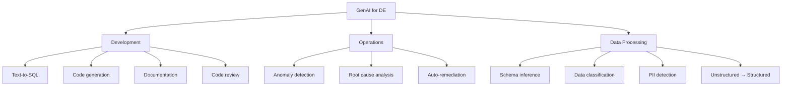

# 🤖 GenAI for Data Engineering

> AI không thay thế DE — nhưng DE biết dùng AI sẽ thay thế DE không biết

---

## 📋 Mục Lục

1. [GenAI Landscape cho DE](#genai-landscape-cho-de)
2. [Text-to-SQL](#text-to-sql)
3. [AI-Assisted Pipeline Development](#ai-assisted-pipeline-development)
4. [AI cho Data Quality](#ai-cho-data-quality)
5. [LLM trong Data Pipelines](#llm-trong-data-pipelines)
6. [Prompt Engineering cho DE](#prompt-engineering-cho-de)
7. [Risks & Limitations](#risks--limitations)

---

## GenAI Landscape cho DE



### Adoption Levels (2025-2026)

| Level | Adoption | Ví dụ |
|-------|----------|-------|
| **Mature** | 80%+ teams | Code completion (Copilot), documentation |
| **Growing** | 40-60% | Text-to-SQL, data quality anomaly detection |
| **Emerging** | 10-30% | Auto-generated pipelines, self-healing |
| **Experimental** | <10% | Fully autonomous data agents |

---

## Text-to-SQL

### Tại Sao Text-to-SQL Quan Trọng?

```
Business user: "Show me revenue by region for last quarter"

Without Text-to-SQL:
1. User creates Jira ticket
2. Wait 3 days for analyst
3. Analyst writes SQL
4. User says "actually I meant fiscal quarter"
5. Another 2 days
Total: 5 days

With Text-to-SQL:
1. User types question in natural language
2. AI generates SQL
3. User reviews and runs
Total: 5 minutes
```

### Implementation Approaches

```python
# Approach 1: LLM + Schema Context
import openai

class TextToSQL:
    def __init__(self, schema_context: str):
        self.schema = schema_context
        self.client = openai.OpenAI()
    
    def generate_sql(self, question: str) -> str:
        response = self.client.chat.completions.create(
            model="gpt-4",
            messages=[
                {"role": "system", "content": f"""
You are a SQL expert. Generate PostgreSQL queries based on this schema:

{self.schema}

Rules:
- Use CTEs for readability
- Include comments explaining logic
- Use appropriate JOINs (never cartesian)
- Handle NULLs explicitly
- Limit results to 1000 rows unless asked otherwise
"""},
                {"role": "user", "content": question}
            ],
            temperature=0,  # Deterministic
        )
        return response.choices[0].message.content

# Schema context (extracted from data catalog)
schema = """
Tables:
- orders(order_id, customer_id, total_amount, status, created_at, region)
- customers(customer_id, name, email, segment, created_at)
- products(product_id, name, category, price)
- order_items(order_id, product_id, quantity, unit_price)

Relationships:
- orders.customer_id → customers.customer_id
- order_items.order_id → orders.order_id
- order_items.product_id → products.product_id
"""

t2s = TextToSQL(schema)
sql = t2s.generate_sql("Top 10 customers by revenue last quarter")
```

### Safety Guardrails

```python
class SafeTextToSQL:
    """Text-to-SQL with safety checks"""
    
    BLOCKED_OPERATIONS = ["DROP", "DELETE", "TRUNCATE", "ALTER", "INSERT", "UPDATE"]
    MAX_ROWS = 10000
    
    def validate_sql(self, sql: str) -> dict:
        sql_upper = sql.upper()
        
        # Check for dangerous operations
        for op in self.BLOCKED_OPERATIONS:
            if op in sql_upper:
                return {"safe": False, "reason": f"Contains {op} operation"}
        
        # Ensure LIMIT exists
        if "LIMIT" not in sql_upper:
            sql += f"\nLIMIT {self.MAX_ROWS}"
        
        # Check for cartesian join (no ON clause)
        if "CROSS JOIN" in sql_upper or (
            "JOIN" in sql_upper and "ON" not in sql_upper
        ):
            return {"safe": False, "reason": "Possible cartesian join detected"}
        
        return {"safe": True, "sql": sql}
    
    def execute_safely(self, question: str) -> dict:
        sql = self.generate_sql(question)
        validation = self.validate_sql(sql)
        
        if not validation["safe"]:
            return {"error": validation["reason"], "sql": sql}
        
        # Execute with read-only connection
        result = self.read_only_conn.execute(validation["sql"])
        return {"data": result, "sql": sql}
```

---

## AI-Assisted Pipeline Development

### Code Generation with Copilot

```python
# AI excels at generating boilerplate pipeline code

# Prompt: "Create Airflow DAG that extracts from Salesforce API daily,
#          loads to S3 as Parquet, then runs dbt"

# AI generates:
from airflow.decorators import dag, task
from datetime import datetime

@dag(
    schedule="0 6 * * *",  # Daily 6 AM
    start_date=datetime(2024, 1, 1),
    catchup=False,
    tags=["salesforce", "etl"],
)
def salesforce_pipeline():
    
    @task()
    def extract_salesforce():
        """Extract accounts from Salesforce"""
        from simple_salesforce import Salesforce
        import pandas as pd
        
        sf = Salesforce(...)
        records = sf.query_all("SELECT Id, Name, Industry FROM Account")
        df = pd.DataFrame(records['records'])
        
        # Save to S3
        path = f"s3://data-lake/bronze/salesforce/accounts/{datetime.today()}.parquet"
        df.to_parquet(path)
        return path
    
    @task()
    def run_dbt(source_path: str):
        """Transform with dbt"""
        import subprocess
        subprocess.run(["dbt", "run", "--select", "salesforce"], check=True)
        return "dbt completed"
    
    path = extract_salesforce()
    run_dbt(path)

salesforce_pipeline()
```

### AI for Documentation

```python
# Generate docstrings and documentation automatically

def generate_pipeline_docs(pipeline_code: str) -> str:
    """Use AI to generate documentation from code"""
    prompt = f"""
    Analyze this data pipeline code and generate:
    1. High-level description (2-3 sentences)
    2. Data flow diagram (Mermaid)
    3. Input/Output specification
    4. Error handling summary
    5. SLA implications
    
    Code:
    {pipeline_code}
    """
    return call_llm(prompt)

# Generate dbt model descriptions
def generate_dbt_docs(sql: str, model_name: str) -> str:
    prompt = f"""
    Generate dbt YAML documentation for this SQL model:
    
    Model: {model_name}
    SQL: {sql}
    
    Include:
    - Model description
    - Column descriptions
    - Suggested tests (not_null, unique, accepted_values)
    """
    return call_llm(prompt)
```

---

## AI cho Data Quality

### Anomaly Detection

```python
# AI-powered anomaly detection for data quality

class AIDataQualityMonitor:
    """Detect anomalies in data metrics using statistical + AI methods"""
    
    def detect_anomalies(self, metric_name: str, values: list[float]) -> dict:
        """
        Combine statistical and AI methods for anomaly detection
        """
        results = {}
        
        # Method 1: Statistical (Z-score)
        mean = sum(values) / len(values)
        std = (sum((x - mean) ** 2 for x in values) / len(values)) ** 0.5
        latest = values[-1]
        z_score = (latest - mean) / std if std > 0 else 0
        
        results["z_score"] = {
            "value": z_score,
            "is_anomaly": abs(z_score) > 3,
            "direction": "high" if z_score > 0 else "low"
        }
        
        # Method 2: AI-powered (for complex patterns)
        if abs(z_score) > 2:  # Only use AI for borderline cases
            ai_analysis = self.ai_analyze(metric_name, values)
            results["ai_analysis"] = ai_analysis
        
        return results
    
    def ai_analyze(self, metric_name: str, values: list) -> dict:
        """Use LLM to analyze metric pattern"""
        prompt = f"""
        Analyze this time series for anomalies:
        Metric: {metric_name}
        Last 30 values: {values[-30:]}
        Latest value: {values[-1]}
        
        Consider:
        1. Is the latest value anomalous given historical pattern?
        2. Are there seasonal patterns?
        3. Is there a trend change?
        4. What's the likely root cause?
        
        Respond in JSON format.
        """
        return call_llm(prompt, response_format="json")
```

### PII Detection

```python
# AI-powered PII detection in data pipelines

class PiiDetector:
    """Detect PII in data columns using AI"""
    
    PATTERNS = {
        "email": r'[a-zA-Z0-9._%+-]+@[a-zA-Z0-9.-]+\.[a-zA-Z]{2,}',
        "phone_vn": r'(0|\+84)[0-9]{9,10}',
        "ccn": r'\d{4}[\s-]?\d{4}[\s-]?\d{4}[\s-]?\d{4}',
        "ip_address": r'\d{1,3}\.\d{1,3}\.\d{1,3}\.\d{1,3}',
    }
    
    def scan_dataframe(self, df, sample_size=1000):
        """Scan DataFrame for PII columns"""
        results = {}
        sample = df.head(sample_size)
        
        for col in sample.columns:
            col_sample = sample[col].dropna().astype(str).tolist()[:100]
            
            # Rule-based check first (fast)
            pii_type = self._check_patterns(col, col_sample)
            
            # AI check for ambiguous cases (column name heuristic)
            if not pii_type:
                pii_type = self._ai_check(col, col_sample[:10])
            
            if pii_type:
                results[col] = {
                    "pii_type": pii_type,
                    "action": self._recommend_action(pii_type),
                    "confidence": "high" if pii_type in self.PATTERNS else "medium"
                }
        
        return results
    
    def _recommend_action(self, pii_type: str) -> str:
        actions = {
            "email": "hash or mask (***@domain.com)",
            "phone": "mask (****1234)",
            "name": "tokenize or remove",
            "address": "generalize to city/region",
            "ccn": "DO NOT STORE — remove immediately",
            "ssn": "DO NOT STORE — remove immediately",
        }
        return actions.get(pii_type, "review manually")
```

---

## LLM trong Data Pipelines

### Unstructured → Structured Data

```python
# Extract structured data from unstructured text

class LLMExtractor:
    """Use LLM to extract structured data from text"""
    
    def extract_from_reviews(self, reviews: list[str]) -> list[dict]:
        """Extract sentiment, topics, and entities from product reviews"""
        results = []
        
        # Batch for efficiency
        for batch in chunk(reviews, batch_size=20):
            prompt = f"""
            Extract structured data from these product reviews.
            
            For each review, return JSON with:
            - sentiment: positive/negative/neutral
            - rating_inferred: 1-5
            - topics: list of discussed topics
            - entities: products, brands mentioned
            - language: detected language
            
            Reviews:
            {json.dumps(batch)}
            """
            
            batch_results = call_llm(prompt, response_format="json")
            results.extend(batch_results)
        
        return results
    
    def parse_invoices(self, invoice_texts: list[str]) -> list[dict]:
        """Extract structured invoice data from text/OCR output"""
        prompt = """
        Extract from this invoice text:
        - vendor_name
        - invoice_number
        - invoice_date (ISO format)
        - line_items: [{description, quantity, unit_price, total}]
        - subtotal
        - tax_amount
        - total_amount
        - currency
        """
        # Process each invoice
        return [call_llm(f"{prompt}\n\nInvoice:\n{text}") for text in invoice_texts]
```

### Data Classification

```python
# Automatic data classification for governance

class DataClassifier:
    """Classify data sensitivity using AI"""
    
    def classify_table(self, table_name: str, columns: list, sample_data: list) -> dict:
        prompt = f"""
        Classify data sensitivity for this table:
        
        Table: {table_name}
        Columns: {columns}
        Sample (5 rows): {sample_data[:5]}
        
        For each column, classify as:
        - PUBLIC: No restrictions
        - INTERNAL: Company employees only
        - CONFIDENTIAL: Need-to-know basis
        - RESTRICTED: PII, financial, regulated
        
        Also suggest:
        - Retention period
        - Masking strategy
        - Access control recommendations
        """
        return call_llm(prompt, response_format="json")
```

---

## Prompt Engineering cho DE

### Effective Prompts for Common Tasks

```python
de_prompts = {
    "debug_sql": """
    This SQL query is producing wrong results.
    
    Expected: {expected}
    Actual: {actual}
    
    Query:
    {sql}
    
    Schema:
    {schema}
    
    Sample data (5 rows each table):
    {sample_data}
    
    Find the bug and explain why it produces wrong results.
    """,
    
    "optimize_spark": """
    This Spark job takes {duration} to process {data_size}.
    Target: under {target_duration}.
    
    Code:
    {code}
    
    Spark UI metrics:
    - Shuffle read: {shuffle_read}
    - Shuffle write: {shuffle_write}
    - GC time: {gc_time}
    - Skew ratio: {skew_ratio}
    
    Suggest specific optimizations with code changes.
    """,
    
    "generate_dbt_test": """
    Generate comprehensive dbt tests for this model:
    
    Model: {model_name}
    SQL: {sql}
    Business context: {context}
    
    Include:
    1. Schema tests (not_null, unique, accepted_values)
    2. Data tests (custom SQL assertions)
    3. Freshness tests
    4. Relationship tests
    """,
}
```

---

## Risks & Limitations

### What AI Does Well vs Poorly for DE

| Task | AI Quality | Trust Level |
|------|-----------|-------------|
| Code completion | ⭐⭐⭐⭐⭐ | High — review before commit |
| Documentation | ⭐⭐⭐⭐ | High — edit for accuracy |
| Text-to-SQL (simple) | ⭐⭐⭐⭐ | Medium — validate results |
| Text-to-SQL (complex) | ⭐⭐ | Low — often wrong JOINs |
| Architecture design | ⭐⭐⭐ | Low — use as starting point only |
| Debugging | ⭐⭐⭐⭐ | Medium — great at finding patterns |
| Performance tuning | ⭐⭐⭐ | Medium — knows common patterns |
| Novel problem solving | ⭐⭐ | Low — needs human creativity |

### Security Concerns

```
⚠️ NEVER send to AI:
├── Production data (PII, financial)
├── API keys, credentials, tokens
├── Internal architecture details (security risk)
├── Customer-specific data
└── Compliance-sensitive queries

✅ SAFE to send:
├── Anonymized/synthetic data
├── Public schema definitions
├── Generic code patterns
├── Error messages (sanitized)
└── Performance metrics (aggregated)
```

### Hallucination Prevention

```python
# AI can generate plausible but WRONG SQL

# Prevention strategies:
prevention = {
    "always_validate": "Run generated SQL on test data first",
    "row_count_check": "Compare row counts with expected",
    "spot_check": "Manually verify 5-10 random rows",
    "unit_test": "Write test cases for AI-generated functions",
    "human_review": "PR review for AI-generated code",
    "version_pin": "Don't auto-update AI-generated pipelines",
}
```

---

## Checklist

- [ ] Biết dùng AI cho code generation (Copilot/Cursor)
- [ ] Implement Text-to-SQL với safety guardrails
- [ ] Dùng AI cho documentation generation
- [ ] Hiểu AI anomaly detection cho data quality
- [ ] Biết prompt engineering cho DE tasks
- [ ] Hiểu risks và limitations
- [ ] Có security policy cho AI tool usage

---

## Liên Kết

- [21_Debugging_Troubleshooting](../fundamentals/21_Debugging_Troubleshooting.md) - AI-assisted debugging
- [10_Data_Quality_Tools_Guide](10_Data_Quality_Tools_Guide.md) - DQ tools + AI
- [09_Security_Governance](../fundamentals/09_Security_Governance.md) - PII detection

---

*AI là công cụ mạnh nhất — nhưng vẫn cần DE giỏi để sử dụng đúng.*
