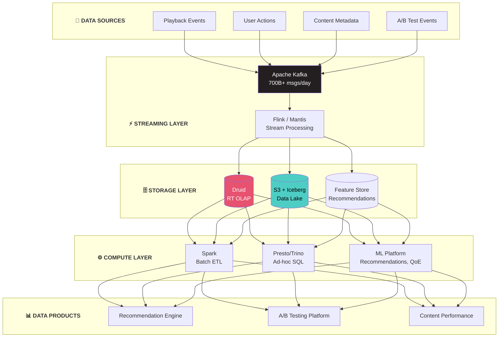

# Netflix Data Platform Architecture

## Kiến Trúc Data Platform Của Netflix - Streaming Giant

---

## 🏢 TỔNG QUAN CÔNG TY

- **Quy mô:** 230+ triệu subscribers toàn cầu
- **Data volume:** Petabytes dữ liệu mỗi ngày
- **Streaming:** 15% internet traffic toàn cầu
- **Open source contributions:** Nhiều tools trở thành industry standard

---

## 🏗️ TỔNG QUAN KIẾN TRÚC



---

## 🔧 TECH STACK CHI TIẾT

### 1. Streaming & Messaging

**Apache Kafka**
- Sử dụng: Central nervous system cho mọi event
- Scale: 700+ billion messages/day
- Use cases:
  - Playback events (start, pause, stop)
  - User interactions
  - Service-to-service communication

**Mantis**
- Netflix's stream processing platform
- Built on RxJava
- Use cases:
  - Real-time operational insights
  - Anomaly detection
  - Cost attribution

```
MANTIS ARCHITECTURE:

Job Cluster                    
┌─────────────────────────────────┐
│  ┌─────────┐     ┌─────────┐   │
│  │ Source  │────>│ Stage 1 │   │
│  │ (Kafka) │     │ (Filter)│   │
│  └─────────┘     └────┬────┘   │
│                       │         │
│                  ┌────v────┐   │
│                  │ Stage 2 │   │
│                  │(Aggregate)  │
│                  └────┬────┘   │
│                       │         │
│                  ┌────v────┐   │
│                  │  Sink   │   │
│                  │ (Output)│   │
│                  └─────────┘   │
└─────────────────────────────────┘
```

### 2. Storage Layer

**Apache Iceberg (Netflix Created)**
- Origin: Created by Netflix for table format
- Use case: Data lake table management
- Features:
  - Schema evolution
  - Hidden partitioning
  - Time travel

```
ICEBERG AT NETFLIX:

┌──────────────────────────────────┐
│          S3 (Storage)            │
│  ┌────────────────────────────┐  │
│  │   Parquet Data Files       │  │
│  │   (Petabytes)              │  │
│  └────────────────────────────┘  │
│  ┌────────────────────────────┐  │
│  │   Iceberg Metadata         │  │
│  │   - Manifests              │  │
│  │   - Snapshots              │  │
│  │   - Schema versions        │  │
│  └────────────────────────────┘  │
└──────────────────────────────────┘
           │
           v
┌──────────────────────────────────┐
│     Iceberg Catalog (Hive)       │
│  - Table locations               │
│  - Current snapshot pointer      │
└──────────────────────────────────┘
```

**S3 (Amazon)**
- Primary data lake storage
- Multi-petabyte scale
- Cost-effective for cold data

### 3. Query Engines

**Presto/Trino**
- Use case: Interactive analytics
- Scale: 1000s of queries/day
- Access: Self-service analytics

**Apache Spark**
- Use case: ETL, ML training
- Integration: Iceberg native support
- Scheduler: Custom + Meson

### 4. Real-time OLAP

**Apache Druid**
- Use case: Real-time dashboards
- Data: Sub-second query latency
- Metrics: Playback quality, errors

```
DRUID USE CASE:

Event Stream (Kafka)
         │
         v
┌─────────────────────┐
│   Druid Real-time   │
│   Ingestion         │
└──────────┬──────────┘
           │
           v
┌─────────────────────┐     ┌─────────────────────┐
│   Druid Historical  │<────│   Deep Storage (S3) │
│   Nodes             │     │                     │
└──────────┬──────────┘     └─────────────────────┘
           │
           v
┌─────────────────────┐
│   Druid Broker      │
│   (Query routing)   │
└──────────┬──────────┘
           │
           v
    ┌──────────────┐
    │  Dashboard   │
    │  (Grafana)   │
    └──────────────┘
```

---

## 🎯 KEY DATA PRODUCTS

### 1. Recommendation System

**WHAT - Mục tiêu:**
- Personalize content cho 230M+ users
- Giữ users engaged với relevant content
- Tăng watch time và retention
- Giảm churn rate

**HOW - Implementation:**

```
RECOMMENDATION PIPELINE:

User Viewing History              Content Catalog
         │                               │
         v                               v
┌─────────────────┐            ┌─────────────────┐
│ User Embeddings │            │Content Embeddings│
│ (Spark ML)      │            │ (Deep Learning) │
└────────┬────────┘            └────────┬────────┘
         │                               │
         └───────────────┬───────────────┘
                         │
                         v
            ┌────────────────────────┐
            │   Candidate Generation │
            │   (Nearest Neighbor)   │
            └────────────┬───────────┘
                         │
                         v
            ┌────────────────────────┐
            │   Ranking Model        │
            │   (Personalized)       │
            └────────────┬───────────┘
                         │
                         v
            ┌────────────────────────┐
            │   A/B Test Assignment  │
            └────────────┬───────────┘
                         │
                         v
                  User Home Page
```

**Technologies used:**
- Spark for batch feature engineering
- Custom ML platform (Metaflow)
- Cassandra for feature serving
- Kafka for real-time updates

**WHY - Lý do & Impact:**
- 80% of watched content comes from recommendations
- Estimated $1B+ annual value from personalization
- Reduced browse time = better user experience
- Higher engagement = lower churn

---

### 2. A/B Testing Platform

**WHAT - Mục tiêu:**
- Test mọi thay đổi trước khi deploy
- Measure impact với statistical rigor
- Enable rapid iteration
- Avoid shipping bad experiences

**HOW - Implementation:**

```
A/B TESTING FLOW:

┌─────────────────┐
│ Experiment      │
│ Configuration   │
│ (who, what, %)  │
└────────┬────────┘
         │
         v
┌─────────────────┐     ┌─────────────────┐
│ Allocation      │────>│ User Assignment │
│ Service         │     │ (consistent)    │
└─────────────────┘     └────────┬────────┘
                                 │
         ┌───────────────────────┤
         │                       │
         v                       v
┌─────────────┐          ┌─────────────┐
│ Treatment A │          │ Treatment B │
│ (Control)   │          │ (Variant)   │
└──────┬──────┘          └──────┬──────┘
       │                        │
       └────────────┬───────────┘
                    │
                    v
         ┌─────────────────┐
         │ Event Logging   │
         │ (Kafka)         │
         └────────┬────────┘
                  │
                  v
         ┌─────────────────┐
         │ Statistical     │
         │ Analysis        │
         │ (Spark/Python)  │
         └─────────────────┘
```

**WHY - Lý do & Impact:**
- 200+ experiments running simultaneously
- Data-driven decisions cho mọi feature
- Avoid costly mistakes (bad UX = churn)
- Democratize experimentation across teams

---

### 3. Quality of Experience (QoE)

**WHAT - Mục tiêu:**
- Monitor streaming quality real-time
- Detect issues before users complain
- Optimize video encoding decisions
- Maintain industry-best experience

**HOW - Implementation:**

**Metrics tracked:**
- Playback start time
- Rebuffer rate
- Video quality (resolution)
- Error rates

**Real-time monitoring:**
- Mantis for stream processing
- Druid for aggregation
- Grafana for visualization

**WHY - Lý do & Impact:**
- 1 second faster playback = measurable retention improvement
- Real-time alerting = faster incident response
- Quality optimization = CDN cost savings
- User satisfaction directly correlates with retention

---

## 🛠️ NETFLIX OPEN SOURCE CONTRIBUTIONS

```
NETFLIX OSS ECOSYSTEM:

Data & Analytics:
├── Apache Iceberg     - Table format (donated to Apache)
├── Mantis             - Stream processing
├── Metacat            - Federated metadata catalog
├── Genie              - Job execution service
└── Lipstick           - Pig/Hive visualization

Infrastructure:
├── Eureka             - Service discovery
├── Zuul               - API Gateway
├── Ribbon             - Load balancing
└── Hystrix            - Fault tolerance

ML/AI:
├── Metaflow           - ML workflow
└── Vector             - Feature store
```

---

## 📊 SCALE & NUMBERS

```
NETFLIX BY THE NUMBERS:

Data Volume:
- 700+ billion events/day through Kafka
- 100+ PB in S3 data lake
- 10,000+ Spark jobs/day

Infrastructure:
- 100,000+ EC2 instances
- 3 AWS regions (active-active)
- 1000s of microservices

Query Volume:
- Millions of Presto queries/day
- Sub-second latency for Druid
- 100+ PB scanned daily
```

---

## 🔑 KEY LESSONS

### 1. Build vs Buy Philosophy
- Build when it's core competency
- Open source when possible
- Contributed Iceberg, Metaflow to community

### 2. Schema Evolution is Critical
- Iceberg designed for schema changes
- Forward/backward compatibility required
- No downtime for schema updates

### 3. Unified Streaming Architecture
- Kafka as single source of truth
- Stream and batch from same source
- Real-time and historical queries

### 4. Self-Service Analytics
- SQL-first approach (Presto)
- Data discovery tools (Metacat)
- Automated data quality

---

## 🔗 OPEN-SOURCE REPOS (Verified)

Netflix là một trong những công ty đóng góp open-source nhiều nhất cho Data Engineering:

| Repo | Stars | Mô Tả |
|------|-------|--------|
| [apache/iceberg](https://github.com/apache/iceberg) | 8.5k⭐ | Open table format — **Netflix tạo ra** (Ryan Blue). Donated cho Apache. |
| [Netflix/maestro](https://github.com/Netflix/maestro) | 3.7k⭐ | Workflow orchestrator (WAAS) của Netflix. Java. Có docker-compose. |
| [Netflix/metaflow](https://github.com/Netflix/metaflow) | 9.7k⭐ | Human-centric ML/AI framework. Python. 3000+ projects tại Netflix. |

---

## 📚 REFERENCES

**Blog Posts (Verified URLs từ repo Maestro):**
- Netflix Tech Blog: https://netflixtechblog.com/
- Maestro — Netflix's Workflow Orchestrator: https://netflixtechblog.com/maestro-netflixs-workflow-orchestrator-ee13a06f9c78
- Orchestrating Data/ML Workflows at Scale: https://netflixtechblog.com/orchestrating-data-ml-workflows-at-scale-with-netflix-maestro-aaa2b41b800c
- Incremental Processing with Maestro and Iceberg: https://netflixtechblog.com/incremental-processing-using-netflix-maestro-and-apache-iceberg-b8ba072ddeeb

**Talks:**
- Data Platform at Netflix - QCon
- Building a Petabyte-Scale Data Lake

**Papers:**
- Apache Iceberg paper
- Mantis paper

---

*Document Version: 1.1*
*Last Updated: February 2026*
