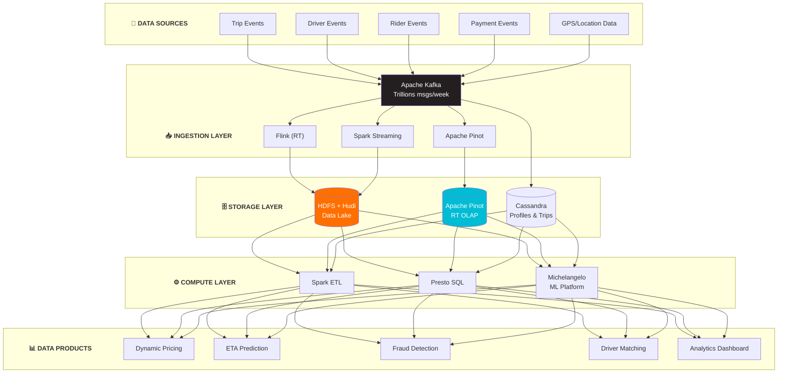

# Uber Data Platform Architecture

## Kiến Trúc Data Platform Của Uber - The Ride-sharing Giant

---

## 🏢 TỔNG QUAN CÔNG TY

- **Quy mô:** 130+ triệu monthly active users
- **Operations:** 70+ countries, 10,000+ cities
- **Data volume:** Trillions of events per week
- **Real-time requirements:** Pricing, ETA, matching - all need milliseconds response
- **Open source contributions:** Apache Hudi, Peloton, AresDB

---

## 🏗️ TỔNG QUAN KIẾN TRÚC



---

## 🔧 TECH STACK CHI TIẾT

### 1. Apache Hudi (Uber Created)

**Origin:** Uber tạo ra để giải quyết incremental data processing

```
HUDI TABLE ARCHITECTURE:

┌──────────────────────────────────────────────┐
│              HUDI TABLE                       │
│                                               │
│  ┌─────────────────────────────────────────┐ │
│  │            Timeline                      │ │
│  │  Commit1 -> Commit2 -> Commit3 -> ...   │ │
│  └─────────────────────────────────────────┘ │
│                                               │
│  ┌─────────────────────────────────────────┐ │
│  │         File Groups                      │ │
│  │  ┌─────────┐ ┌─────────┐ ┌─────────┐   │ │
│  │  │ FG1     │ │ FG2     │ │ FG3     │   │ │
│  │  │ base +  │ │ base +  │ │ base +  │   │ │
│  │  │ logs    │ │ logs    │ │ logs    │   │ │
│  │  └─────────┘ └─────────┘ └─────────┘   │ │
│  └─────────────────────────────────────────┘ │
│                                               │
│  Table Types:                                 │
│  - Copy-on-Write: merge on write             │
│  - Merge-on-Read: merge on query             │
└──────────────────────────────────────────────┘


INCREMENTAL PROCESSING:

Traditional:
Full table scan daily -> Hours of processing

With Hudi:
Only changed records -> Minutes of processing

Pipeline:
┌───────────┐     ┌───────────┐     ┌───────────┐
│ Raw Data  │────>│ Bronze    │────>│ Silver    │
│ (Kafka)   │     │ (Hudi)    │     │ (Hudi)    │
└───────────┘     └───────────┘     └───────────┘
     │                  │                  │
     │    Incremental   │    Incremental   │
     └──────────────────┴──────────────────┘
```

**Use cases at Uber:**
- Trip data (billions of records)
- Driver earnings
- Payment transactions
- All GDPR-compliant data (need updates/deletes)

### 2. Apache Pinot (Real-time OLAP)

**Origin:** LinkedIn created, Uber heavily uses

```
PINOT ARCHITECTURE AT UBER:

┌──────────────────────────────────────────────┐
│              PINOT CLUSTER                    │
│                                               │
│  ┌───────────────┐     ┌───────────────┐    │
│  │ Controller    │     │ Broker        │    │
│  │ (Cluster mgmt)│     │ (Query route) │    │
│  └───────────────┘     └───────┬───────┘    │
│                                │             │
│                    ┌───────────┴───────────┐│
│                    │                       ││
│               ┌────v────┐           ┌────v────┐
│               │ Server 1│           │ Server N│
│               │ (Data)  │           │ (Data)  │
│               └─────────┘           └─────────┘
│                                               │
│  Data Sources:                                │
│  ├── Kafka (real-time)                       │
│  └── HDFS/S3 (batch)                         │
└──────────────────────────────────────────────┘


REAL-TIME USE CASES:

1. Operations Dashboard:
   - Live trip counts
   - Active drivers per city
   - Current surge areas

2. Business Metrics:
   - Revenue per hour
   - Trips per market
   - Cancellation rates

Query latency: p99 < 100ms
```

### 3. Michelangelo (ML Platform)

```
MICHELANGELO ARCHITECTURE:

┌─────────────────────────────────────────────────────────────────┐
│                    MICHELANGELO                                  │
│                                                                  │
│  ┌──────────────┐     ┌──────────────┐     ┌──────────────┐    │
│  │ Feature Store│     │ Model        │     │ Model        │    │
│  │              │────>│ Training     │────>│ Registry     │    │
│  └──────────────┘     └──────────────┘     └──────────────┘    │
│         │                    │                    │             │
│         │                    │                    │             │
│  ┌──────v───────────────────v────────────────────v──────────┐  │
│  │                   Feature Pipeline                        │  │
│  │  ┌──────────┐  ┌──────────┐  ┌──────────┐                │  │
│  │  │ Batch    │  │ Real-time│  │ Streaming│                │  │
│  │  │ (Spark)  │  │ (Flink)  │  │ (Kafka)  │                │  │
│  │  └──────────┘  └──────────┘  └──────────┘                │  │
│  └──────────────────────────────────────────────────────────┘  │
│                              │                                  │
│                              v                                  │
│  ┌──────────────────────────────────────────────────────────┐  │
│  │                   Model Serving                           │  │
│  │  ┌────────────────┐  ┌────────────────────────────────┐  │  │
│  │  │ Online (RT)    │  │ Batch Prediction               │  │  │
│  │  │ - ETA          │  │ - Churn prediction             │  │  │
│  │  │ - Surge        │  │ - Driver incentives            │  │  │
│  │  │ - Fraud        │  │                                │  │  │
│  │  └────────────────┘  └────────────────────────────────┘  │  │
│  └──────────────────────────────────────────────────────────┘  │
└─────────────────────────────────────────────────────────────────┘


KEY ML MODELS:

1. ETA Prediction:
   - Input: pickup, dropoff, time, weather, traffic
   - Output: estimated arrival time
   - Latency: < 50ms
   - Updates: Real-time traffic features

2. Dynamic Pricing:
   - Input: demand, supply, historical patterns
   - Output: surge multiplier
   - Requirement: Fair, explainable

3. Fraud Detection:
   - Input: transaction patterns, device info
   - Output: fraud probability
   - Constraint: Low false positives

4. Driver-Rider Matching:
   - Input: locations, ratings, preferences
   - Output: optimal assignment
   - Optimization: Minimize total wait time
```

### 4. Data Quality (Uber's Approach)

```
DATA QUALITY PIPELINE:

┌─────────────────────────────────────────────────────────────────┐
│                    UBER DATA QUALITY                             │
│                                                                  │
│  Raw Data                                                        │
│     │                                                            │
│     v                                                            │
│  ┌──────────────────────────────────────────────────────────┐   │
│  │ Schema Validation                                         │   │
│  │ - Required fields present                                 │   │
│  │ - Types correct                                           │   │
│  └────────────────────────┬─────────────────────────────────┘   │
│                           │                                      │
│                           v                                      │
│  ┌──────────────────────────────────────────────────────────┐   │
│  │ Semantic Validation                                       │   │
│  │ - Business rules (fare > 0, distance > 0)                │   │
│  │ - Referential integrity                                   │   │
│  └────────────────────────┬─────────────────────────────────┘   │
│                           │                                      │
│                           v                                      │
│  ┌──────────────────────────────────────────────────────────┐   │
│  │ Statistical Validation                                    │   │
│  │ - Drift detection                                         │   │
│  │ - Outlier detection                                       │   │
│  │ - Volume anomalies                                        │   │
│  └────────────────────────┬─────────────────────────────────┘   │
│                           │                                      │
│                           v                                      │
│                    Quality Score                                 │
│                    (Metadata)                                    │
└─────────────────────────────────────────────────────────────────┘
```

---

## 🎯 KEY DATA PRODUCTS

### 1. Dynamic Pricing (Surge)

**WHAT - Mục tiêu:**
- Balance supply-demand real-time
- Incentivize drivers to high-demand areas
- Maximize ride completion rate
- Fair pricing cho cả riders và drivers

**HOW - Implementation:**

```
SURGE PRICING SYSTEM:

┌───────────────┐     ┌───────────────┐
│ Demand Signal │     │ Supply Signal │
│ (Trip requests)│     │ (Active drivers)│
└───────┬───────┘     └───────┬───────┘
        │                     │
        └─────────┬───────────┘
                  │
                  v
        ┌─────────────────┐
        │ Geospatial      │
        │ Aggregation     │
        │ (H3 hexagons)   │
        └────────┬────────┘
                 │
                 v
        ┌─────────────────┐
        │ ML Model        │
        │ (Surge calc)    │
        └────────┬────────┘
                 │
                 v
        ┌─────────────────┐
        │ Price Service   │
        └─────────────────┘

H3 Geospatial Index:
- Uber uses H3 for geospatial
- Hexagonal grid system
- Consistent area coverage
- Open sourced: https://h3geo.org/
```

**WHY - Lý do & Impact:**
- Higher ride completion rate during peak times
- Driver earnings optimized
- Rider wait times reduced
- Market-clearing prices = efficient marketplace

---

### 2. ETA Prediction

**WHAT - Mục tiêu:**
- Accurate pickup và dropoff time estimates
- Enable trip planning for riders
- Optimize driver routing
- Improve rider experience

**HOW - Implementation:**

```
ETA PIPELINE:

Historical Data                    Real-time Data
      │                                  │
      v                                  v
┌────────────┐                    ┌────────────┐
│ Historical │                    │ Live       │
│ Trip Times │                    │ Traffic    │
└─────┬──────┘                    └─────┬──────┘
      │                                 │
      └─────────────┬───────────────────┘
                    │
                    v
           ┌───────────────┐
           │ Feature       │
           │ Engineering   │
           │ - Road segments│
           │ - Time of day │
           │ - Weather     │
           └───────┬───────┘
                   │
                   v
           ┌───────────────┐
           │ DeepETA Model │
           │ (Graph Neural │
           │  Network)     │
           └───────┬───────┘
                   │
                   v
              Prediction
              (minutes)
```

**WHY - Lý do & Impact:**
- 10% improvement in ETA accuracy = measurable increase in bookings
- Better rider expectations = higher satisfaction
- Real-time routing = cost savings
- Foundation for dynamic pricing

---

### 3. Driver Matching

**WHAT - Mục tiêu:**
- Optimal driver-rider pairing
- Minimize total wait times
- Maximize driver utilization
- Fair distribution of rides

**HOW - Implementation:**

```
MATCHING ALGORITHM:

Request comes in:
     │
     v
┌────────────────────────────────────┐
│ Available Drivers Query            │
│ (Geospatial + Filters)             │
└─────────────────┬──────────────────┘
                  │
                  v
┌────────────────────────────────────┐
│ Scoring (for each candidate)       │
│ - ETA to pickup                    │
│ - Driver rating                    │
│ - Rider preferences                │
│ - Fairness constraints             │
└─────────────────┬──────────────────┘
                  │
                  v
┌────────────────────────────────────┐
│ Batched Matching                   │
│ (Optimize across multiple requests)│
└─────────────────┬──────────────────┘
                  │
                  v
            Assignment
```

**WHY - Lý do & Impact:**
- 20% reduction in average wait times
- Higher driver earnings (more trips/hour)
- Better ride completion rates
- Marketplace efficiency = lower prices for riders

---

## 🛠️ UBER OPEN SOURCE CONTRIBUTIONS

```
UBER OSS ECOSYSTEM:

Data Engineering:
├── Apache Hudi         - Incremental data processing
├── AresDB             - GPU-powered analytics
├── Cadence            - Workflow orchestration
└── uReplicator        - Kafka replication

ML/AI:
├── Horovod            - Distributed training
├── Ludwig             - No-code ML
├── Fiber              - Distributed computing
└── Petastorm          - Parquet for ML

Geospatial:
└── H3                 - Hexagonal geospatial index

Visualization:
├── Kepler.gl          - Geospatial visualization
└── Deck.gl            - Large-scale data viz
```

---

## 📊 SCALE & NUMBERS

```
UBER BY THE NUMBERS:

Data Volume:
- 100+ PB in HDFS
- Trillions of Kafka messages/week
- 10,000s of Hudi tables

Real-time:
- 1M+ ETA predictions/second
- 100K+ concurrent trips
- Sub-second pricing updates

Infrastructure:
- 10,000s of Spark jobs/day
- 1000s of Flink jobs
- 100s of Pinot tables
```

---

## 🔑 KEY LESSONS

### 1. Incremental Processing is Essential
- Hudi created because full table scans too slow
- 100x improvement in ETL time
- Essential for real-time data products

### 2. Real-time + Batch Must Coexist
- Lambda architecture in practice
- Same data served differently
- Consistency is challenging

### 3. ML at the Core
- Every major product uses ML
- Feature stores critical
- Model serving at scale is hard

### 4. Geospatial is Unique
- Created H3 for geospatial indexing
- Standard SQL not enough
- Custom data structures needed

---

## 🔗 OPEN-SOURCE REPOS (Verified)

Uber đóng góp mạnh cho open-source, đặc biệt trong lĩnh vực incremental processing:

| Repo | Stars | Mô Tả |
|------|-------|--------|
| [apache/hudi](https://github.com/apache/hudi) | 6.1k⭐ | Open data lakehouse platform — **Uber tạo ra** dưới tên "Hoodie". Có `docker/`, `hudi-notebooks/`, `hudi-examples/`. |
| [uber/h3](https://github.com/uber/h3) | 5k⭐ | Hexagonal hierarchical geospatial indexing system. |

> 💡 **Hands-on:** Repo `apache/hudi` có thư mục `docker/` với Docker Compose và `hudi-notebooks/` chứa Jupyter notebooks để thực hành.

---

## 📚 REFERENCES

**Engineering Blog:**
- Uber Engineering Blog: https://www.uber.com/blog/engineering/

**Key Articles:**
- Apache Hudi: https://hudi.apache.org/
- Michelangelo: https://www.uber.com/blog/michelangelo-machine-learning-platform/
- H3: https://h3geo.org/

**Talks:**
- Building Uber's Data Platform
- Apache Hudi at Uber Scale

---

*Document Version: 1.1*
*Last Updated: February 2026*
