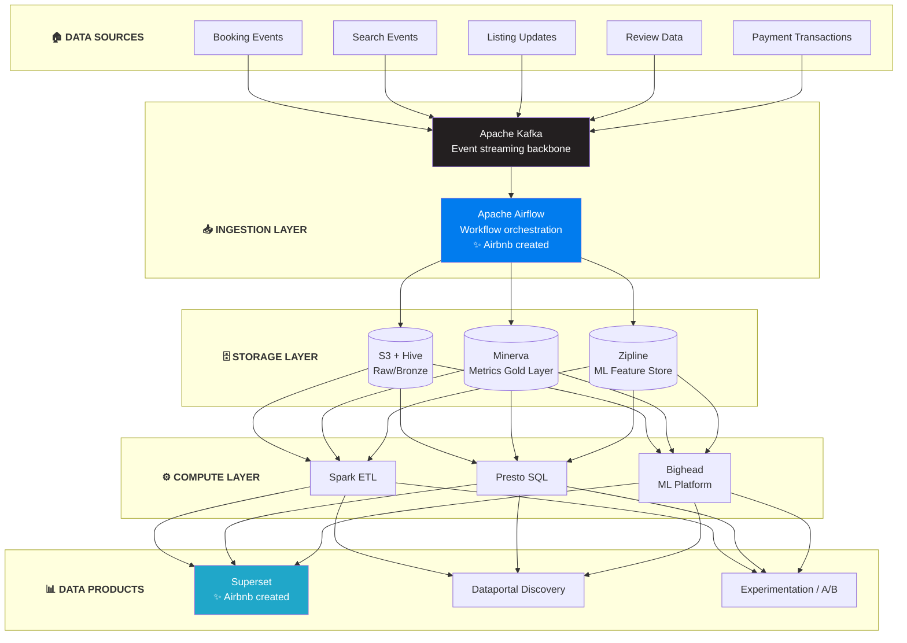

# Airbnb Data Platform Architecture

## Kiến Trúc Data Platform Của Airbnb - The Home-sharing Pioneer

---

## 🏢 TỔNG QUAN CÔNG TY

- **Quy mô:** 150+ triệu users, 7+ million listings
- **Operations:** 220+ countries and regions
- **Data challenges:** Highly seasonal, geographic, trust/safety critical
- **Open source contributions:** Airflow, Superset, Knowledge Repo

---

## 🏗️ TỔNG QUAN KIẾN TRÚC



---

## 🔧 TECH STACK CHI TIẾT

### 1. Apache Airflow (Airbnb Created)

**Origin:** Airbnb created in 2014, open-sourced 2015, Apache top-level 2019

```
AIRFLOW ARCHITECTURE:

┌─────────────────────────────────────────────────────────────────┐
│                        AIRFLOW                                   │
│                                                                  │
│  ┌──────────────┐     ┌──────────────┐     ┌──────────────┐    │
│  │ Web Server   │     │ Scheduler    │     │ Executor     │    │
│  │ (UI)         │     │ (DAG runs)   │     │ (Workers)    │    │
│  └──────────────┘     └──────┬───────┘     └──────┬───────┘    │
│                              │                     │            │
│                              v                     v            │
│                    ┌─────────────────────────────────────┐     │
│                    │           Metadata DB               │     │
│                    │        (PostgreSQL)                 │     │
│                    └─────────────────────────────────────┘     │
└─────────────────────────────────────────────────────────────────┘


DAG EXAMPLE (Airbnb style):

from airflow import DAG
from airflow.operators.python import PythonOperator
from datetime import datetime

with DAG(
    'daily_metrics',
    schedule_interval='@daily',
    start_date=datetime(2025, 1, 1),
) as dag:

    extract = PythonOperator(
        task_id='extract_bookings',
        python_callable=extract_bookings,
    )

    transform = PythonOperator(
        task_id='calculate_metrics',
        python_callable=calculate_metrics,
    )

    load = PythonOperator(
        task_id='load_to_warehouse',
        python_callable=load_data,
    )

    extract >> transform >> load


AIRFLOW AT AIRBNB:

Scale:
- 10,000s of DAGs
- 100,000s of tasks/day
- Manages all batch ETL

Key features used:
- Dynamic DAG generation
- Task dependencies
- Backfill capabilities
- SLA monitoring
```

### 2. Minerva (Metrics Layer)

```
MINERVA ARCHITECTURE:

┌─────────────────────────────────────────────────────────────────┐
│                        MINERVA                                   │
│               (Single source of truth for metrics)              │
│                                                                  │
│  ┌──────────────────────────────────────────────────────────┐   │
│  │                 Metric Definitions                        │   │
│  │  ┌─────────────────────────────────────────────────────┐ │   │
│  │  │ metric:                                              │ │   │
│  │  │   name: bookings                                     │ │   │
│  │  │   type: count                                        │ │   │
│  │  │   source: fact_reservations                          │ │   │
│  │  │   dimensions: [country, platform, room_type]         │ │   │
│  │  │   filters:                                           │ │   │
│  │  │     - status = 'confirmed'                           │ │   │
│  │  └─────────────────────────────────────────────────────┘ │   │
│  └──────────────────────────────────────────────────────────┘   │
│                              │                                   │
│                              v                                   │
│  ┌──────────────────────────────────────────────────────────┐   │
│  │              Computation Engine                           │   │
│  │  - Aggregates metrics on demand                          │   │
│  │  - Caches common queries                                 │   │
│  │  - Serves to Superset, APIs, notebooks                   │   │
│  └──────────────────────────────────────────────────────────┘   │
└─────────────────────────────────────────────────────────────────┘


KEY BENEFITS:

1. Single Source of Truth:
   - "Bookings" defined once
   - Everyone uses same definition
   - No dashboard discrepancies

2. Dimension Consistency:
   - Standard dimensions across metrics
   - Drill-down always works
   - Comparable across reports

3. Self-Service:
   - Business users can explore
   - No need to write SQL
   - Governed access
```

### 3. Apache Superset (Airbnb Created)

**Origin:** Airbnb created, now Apache top-level project

```
SUPERSET FEATURES:

┌─────────────────────────────────────────────────────────────────┐
│                        SUPERSET                                  │
│                                                                  │
│  ┌──────────────────────────────────────────────────────────┐   │
│  │                   Dashboard                               │   │
│  │  ┌─────────┐ ┌─────────┐ ┌─────────┐ ┌─────────┐        │   │
│  │  │ Chart 1 │ │ Chart 2 │ │ Chart 3 │ │ Chart 4 │        │   │
│  │  │ (Bar)   │ │ (Line)  │ │ (Pie)   │ │ (Map)   │        │   │
│  │  └─────────┘ └─────────┘ └─────────┘ └─────────┘        │   │
│  └──────────────────────────────────────────────────────────┘   │
│                                                                  │
│  Features:                                                       │
│  - SQL Lab (explore data)                                       │
│  - 40+ visualization types                                      │
│  - Semantic layer (metrics/dimensions)                          │
│  - Role-based access control                                    │
│  - Alerts and reports                                           │
│                                                                  │
│  Connectors:                                                     │
│  - Presto/Trino                                                 │
│  - PostgreSQL                                                   │
│  - MySQL                                                        │
│  - BigQuery                                                     │
│  - Druid                                                        │
└─────────────────────────────────────────────────────────────────┘
```

### 4. Zipline (Feature Store)

```
ZIPLINE ARCHITECTURE:

┌─────────────────────────────────────────────────────────────────┐
│                        ZIPLINE                                   │
│               (Declarative Feature Engineering)                 │
│                                                                  │
│  ┌──────────────────────────────────────────────────────────┐   │
│  │                Feature Definition                         │   │
│  │                                                           │   │
│  │  class HostFeatures(Feature):                             │   │
│  │      """Features for host."""                             │   │
│  │                                                           │   │
│  │      source = Source.HIVE_TABLE("fact_listings")          │   │
│  │      keys = ["host_id"]                                   │   │
│  │                                                           │   │
│  │      total_listings = Feature(                            │   │
│  │          expr=F.count("listing_id"),                      │   │
│  │          window=Window.UNBOUNDED                          │   │
│  │      )                                                    │   │
│  │                                                           │   │
│  │      avg_rating = Feature(                                │   │
│  │          expr=F.avg("rating"),                            │   │
│  │          window=Window.DAYS_90                            │   │
│  │      )                                                    │   │
│  └──────────────────────────────────────────────────────────┘   │
│                              │                                   │
│              ┌───────────────┴───────────────┐                  │
│              v                               v                  │
│  ┌──────────────────┐           ┌──────────────────┐           │
│  │ Offline Store    │           │ Online Store     │           │
│  │ (Hive/S3)        │           │ (Redis)          │           │
│  │ - Training       │           │ - Serving        │           │
│  └──────────────────┘           └──────────────────┘           │
└─────────────────────────────────────────────────────────────────┘


TRAINING vs SERVING:

Training (Offline):
- Historical features at specific timestamps
- Point-in-time correctness
- Large batch retrieval

Serving (Online):
- Latest feature values
- Low latency (<10ms)
- Key-value lookup
```

---

## 🎯 KEY DATA PRODUCTS

### 1. Search Ranking

**WHAT - Mục tiêu:**
- Match guests với relevant listings
- Maximize booking conversion
- Personalize results for each user
- Balance guest satisfaction và host fairness

**HOW - Implementation:**

```
SEARCH RANKING PIPELINE:

User Search Query
       │
       v
┌──────────────────────────────────────────┐
│ Query Understanding                       │
│ - Location parsing                        │
│ - Date normalization                      │
│ - Intent detection                        │
└─────────────────┬────────────────────────┘
                  │
                  v
┌──────────────────────────────────────────┐
│ Candidate Retrieval                       │
│ - Elasticsearch (listings)                │
│ - Geo filtering                           │
│ - Availability check                      │
└─────────────────┬────────────────────────┘
                  │
                  v
┌──────────────────────────────────────────┐
│ Ranking Model                             │
│ - Guest features (Zipline)                │
│ - Listing features (Zipline)              │
│ - Context features (real-time)            │
│ - GBDT/Neural ranking model               │
└─────────────────┬────────────────────────┘
                  │
                  v
┌──────────────────────────────────────────┐
│ Business Rules                            │
│ - Diversity (location, price)             │
│ - Fairness constraints                    │
│ - Superhost boost                         │
└─────────────────┬────────────────────────┘
                  │
                  v
         Search Results


FEATURES USED:

Guest features:
- Search history
- Booking history
- Price sensitivity

Listing features:
- Reviews and ratings
- Response rate
- Instant book available
- Photos quality score

Context features:
- Search location
- Check-in/out dates
- Number of guests
```

**WHY - Lý do & Impact:**
- 2x increase in booking conversion
- Better guest-listing matching
- Hosts get more qualified leads
- Foundation for entire marketplace

---

### 2. Dynamic Pricing (Smart Pricing)

**WHAT - Mục tiêu:**
- Help hosts optimize pricing
- Maximize host earnings
- Increase booking rates for hosts
- Data-driven pricing recommendations

**HOW - Implementation:**

```
SMART PRICING SYSTEM:

┌─────────────────────────────────────────────────────────────────┐
│                    SMART PRICING                                 │
│                                                                  │
│  Input Features:                                                 │
│  ├── Historical booking data                                    │
│  ├── Seasonal patterns                                          │
│  ├── Local events (concerts, conferences)                       │
│  ├── Competitor pricing                                         │
│  ├── Listing characteristics                                    │
│  └── Lead time to check-in                                      │
│                                                                  │
│  ┌──────────────────────────────────────────────────────────┐   │
│  │              ML Model (per listing)                       │   │
│  │  - Demand forecasting                                     │   │
│  │  - Price elasticity estimation                            │   │
│  │  - Optimal price calculation                              │   │
│  └──────────────────────────────────────────────────────────┘   │
│                              │                                   │
│                              v                                   │
│  ┌──────────────────────────────────────────────────────────┐   │
│  │              Price Recommendations                        │   │
│  │                                                           │   │
│  │   Mon  Tue  Wed  Thu  Fri  Sat  Sun                      │   │
│  │   $89  $89  $95  $95  $129 $149 $119                     │   │
│  │                                                           │   │
│  │   Events detected: [Conference: +20%]                    │   │
│  └──────────────────────────────────────────────────────────┘   │
└─────────────────────────────────────────────────────────────────┘
```

**WHY - Lý do & Impact:**
- 20% increase in host earnings for adopters
- Higher booking rates
- Reduced price anxiety for hosts
- Marketplace efficiency

---

### 3. Trust & Safety

**WHAT - Mục tiêu:**
- Protect guests và hosts
- Detect fraud before it happens
- Enable safe marketplace
- Maintain community trust

**HOW - Implementation:**

```
TRUST PLATFORM:

┌─────────────────────────────────────────────────────────────────┐
│                    TRUST & SAFETY                                │
│                                                                  │
│  ┌─────────────────┐     ┌─────────────────┐                   │
│  │ Identity        │     │ Risk Scoring    │                   │
│  │ Verification    │     │ (Booking)       │                   │
│  └────────┬────────┘     └────────┬────────┘                   │
│           │                       │                             │
│           v                       v                             │
│  ┌─────────────────────────────────────────────────────────┐   │
│  │              Real-time Risk Evaluation                   │   │
│  │                                                          │   │
│  │  Signals:                                                │   │
│  │  - Account age                                           │   │
│  │  - Verification status                                   │   │
│  │  - Payment method                                        │   │
│  │  - Device fingerprint                                    │   │
│  │  - Behavioral patterns                                   │   │
│  │  - Message content (NLP)                                 │   │
│  │                                                          │   │
│  │  Actions:                                                │   │
│  │  - Approve                                               │   │
│  │  - Require verification                                  │   │
│  │  - Manual review                                         │   │
│  │  - Block                                                 │   │
│  └─────────────────────────────────────────────────────────┘   │
└─────────────────────────────────────────────────────────────────┘

**WHY - Lý do & Impact:**
- 50%+ reduction in fraud losses
- Higher guest/host confidence
- Critical for marketplace trust
- Brand protection
   - Account takeover
   - Fake listings

2. Content Moderation:
   - Message screening
   - Photo validation
   - Review authenticity

3. Host Quality:
   - Response prediction
   - Cancellation risk
   - Superhost eligibility
```

### 4. Experimentation Platform (ERF)

```
EXPERIMENTATION FRAMEWORK:

┌─────────────────────────────────────────────────────────────────┐
│                    ERF (Experiment Reporting Framework)          │
│                                                                  │
│  ┌──────────────────────────────────────────────────────────┐   │
│  │              Experiment Setup                             │   │
│  │  - Name: "New Search Ranking v2"                         │   │
│  │  - Population: 10% of users                              │   │
│  │  - Variants: Control, Treatment                          │   │
│  │  - Primary metric: Booking conversion                    │   │
│  │  - Guardrail metrics: Cancellation rate, CS tickets     │   │
│  └──────────────────────────────────────────────────────────┘   │
│                              │                                   │
│                              v                                   │
│  ┌──────────────────────────────────────────────────────────┐   │
│  │              Assignment Service                           │   │
│  │  - Deterministic assignment (user_id hash)               │   │
│  │  - Consistent across sessions                            │   │
│  │  - Logging to Kafka                                      │   │
│  └──────────────────────────────────────────────────────────┘   │
│                              │                                   │
│                              v                                   │
│  ┌──────────────────────────────────────────────────────────┐   │
│  │              Analysis Pipeline (Spark)                    │   │
│  │  - Join assignments with outcomes                        │   │
│  │  - Statistical tests                                     │   │
│  │  - Segment analysis                                      │   │
│  │  - Novelty effect detection                              │   │
│  └──────────────────────────────────────────────────────────┘   │
│                              │                                   │
│                              v                                   │
│  ┌──────────────────────────────────────────────────────────┐   │
│  │              Dashboard (Superset)                         │   │
│  │  - Treatment effect: +2.3% bookings                      │   │
│  │  - Confidence: 95%                                       │   │
│  │  - Sample size: adequate                                 │   │
│  │  - Recommendation: SHIP IT                               │   │
│  └──────────────────────────────────────────────────────────┘   │
└─────────────────────────────────────────────────────────────────┘
```

---

## 🛠️ AIRBNB OPEN SOURCE CONTRIBUTIONS

```
AIRBNB OSS ECOSYSTEM:

Data Engineering:
├── Apache Airflow      - Workflow orchestration (Apache top-level)
├── Apache Superset     - Data visualization (Apache top-level)
├── Knowledge Repo      - Knowledge management
└── Aerosolve          - ML library

Frontend:
├── Visx               - Visualization components
├── React-dates        - Date picker
└── Lottie             - Animation library

Infrastructure:
├── Nerve              - Service discovery
└── Synapse            - Service registry
```

---

## 📊 SCALE & NUMBERS

```
AIRBNB BY THE NUMBERS:

Data Volume:
- 50+ PB in data warehouse
- 10,000s of Airflow DAGs
- 100,000s of Airflow tasks/day

Analytics:
- 1000s of metrics in Minerva
- 10,000s of Superset dashboards
- 100s of concurrent Presto queries

ML:
- 1000s of features in Zipline
- 100s of ML models in production
- 10,000s of experiments/year
```

---

## 🔑 KEY LESSONS

### 1. Workflow Orchestration Matters
- Airflow created because no good options existed
- Became industry standard
- DAGs as code is powerful paradigm

### 2. Metrics Layer is Critical
- Minerva ensures consistency
- "Single version of truth"
- Empowers self-service analytics

### 3. Feature Stores Enable ML at Scale
- Zipline manages feature complexity
- Same features for training and serving
- Point-in-time correctness essential

### 4. Democratize Data Access
- Superset for visualization
- SQL as universal language
- Governance through tools

---

## 🔗 OPEN-SOURCE REPOS (Verified)

Airbnb (qua Maxime Beauchemin) đóng góp 2 trong số các tools phổ biến nhất:

| Repo | Stars | Mô Tả |
|------|-------|--------|
| [apache/airflow](https://github.com/apache/airflow) | 44k⭐ | Workflow orchestration — **Airbnb tạo ra** (2014). Industry standard. Có Docker Compose & Helm chart chính thức. |
| [apache/superset](https://github.com/apache/superset) | 70k⭐ | Data visualization/BI — **Airbnb tạo ra** (Maxime Beauchemin). Có `docker-compose.yml` trong repo. |

> 💡 **Hands-on:** Cả 2 repos đều có Docker Compose setup cho local development. `apache/airflow` có thư mục `chart/` cho Helm deployment trên K8s.

---

## 📚 REFERENCES

**Engineering Blog:**
- Airbnb Tech Blog: https://medium.com/airbnb-engineering

**Key Articles:**
- Minerva: https://medium.com/airbnb-engineering/airbnb-metric-computation-with-minerva-part-1-the-design-philosophy-c14e07fabd21
- Zipline: https://medium.com/airbnb-engineering/zipline-airbnbs-declarative-feature-engineering-framework-b7c71bf32b0
- Superset: https://superset.apache.org/

**Talks:**
- How Airbnb Standardized Metric Computation at Scale
- Building Data Democracy at Airbnb

---

*Document Version: 1.1*
*Last Updated: February 2026*
