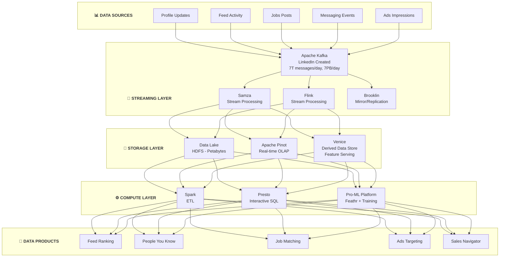

# LinkedIn Data Platform Architecture

## Kiến Trúc Data Platform Của LinkedIn - The Professional Network Giant

---

## 🏢 TỔNG QUAN CÔNG TY

- **Quy mô:** 900+ triệu members, 200+ countries
- **Data volume:** Trillions of events/day
- **Historical significance:** Birthplace of Apache Kafka
- **Open source contributions:** Kafka, Samza, Pinot, Gobblin, Datahub

---

## 🏗️ TỔNG QUAN KIẾN TRÚC



---

## 🔧 TECH STACK CHI TIẾT

### 1. Apache Kafka (LinkedIn Created)

**Origin:** Created by LinkedIn in 2010, open-sourced 2011, Apache 2012

```
KAFKA AT LINKEDIN:

┌─────────────────────────────────────────────────────────────────┐
│                    KAFKA ECOSYSTEM                               │
│                                                                  │
│  Scale (2024):                                                   │
│  - 7+ trillion messages/day                                     │
│  - 7+ PB of data/day                                            │
│  - 100K+ topics                                                 │
│  - 1000s of producers/consumers                                 │
│                                                                  │
│  Clusters:                                                       │
│  ┌──────────┐ ┌──────────┐ ┌──────────┐ ┌──────────┐           │
│  │ Tracking │ │ Metrics  │ │ Queuing  │ │ Change   │           │
│  │ Cluster  │ │ Cluster  │ │ Cluster  │ │ Capture  │           │
│  └──────────┘ └──────────┘ └──────────┘ └──────────┘           │
│                                                                  │
│  Key Innovations:                                                │
│  - Log compaction (for derived data)                            │
│  - Exactly-once semantics                                       │
│  - Kafka Streams                                                │
│  - Kafka Connect                                                │
│                                                                  │
└─────────────────────────────────────────────────────────────────┘


KAFKA USE CASES:

1. Activity Tracking:
   - Page views, clicks, searches
   - Used for analytics and ML

2. Metrics Pipeline:
   - Operational metrics
   - Business metrics

3. Data Integration:
   - Change data capture
   - Database replication

4. Commit Log:
   - Event sourcing
   - Derived data


WHY LINKEDIN CREATED KAFKA:

Problem (2009):
- Many data pipelines
- Point-to-point connections
- Inconsistent data
- Scaling issues

Solution (Kafka):
- Central commit log
- Publish-subscribe
- Horizontal scaling
- Durability + replay
```

### 2. Apache Samza (LinkedIn Created)

```
SAMZA ARCHITECTURE:

┌─────────────────────────────────────────────────────────────────┐
│                        SAMZA                                     │
│              (Stateful Stream Processing)                       │
│                                                                  │
│  ┌──────────────────────────────────────────────────────────┐   │
│  │                   Samza Job                               │   │
│  │                                                           │   │
│  │   Input                Task                  Output        │   │
│  │  (Kafka) ─────> ┌─────────────┐ ─────────> (Kafka)        │   │
│  │                 │ Process     │                           │   │
│  │                 │ + State     │                           │   │
│  │                 │ (RocksDB)   │                           │   │
│  │                 └─────────────┘                           │   │
│  │                                                           │   │
│  └──────────────────────────────────────────────────────────┘   │
│                                                                  │
│  Key Features:                                                   │
│  - Local state (RocksDB)                                        │
│  - State replication via Kafka                                  │
│  - Exactly-once processing                                      │
│  - Easy recovery                                                │
└─────────────────────────────────────────────────────────────────┘


SAMZA USE CASES:

1. Standardization:
   - Raw events -> standardized events
   - Schema validation

2. Aggregation:
   - Near-real-time metrics
   - Session aggregation

3. Derived Data:
   - Compute features
   - Update Venice
```

### 3. Apache Pinot (LinkedIn Created)

```
PINOT AT LINKEDIN:

┌─────────────────────────────────────────────────────────────────┐
│                        PINOT                                     │
│              (Real-time OLAP)                                   │
│                                                                  │
│  ┌──────────────────────────────────────────────────────────┐   │
│  │              Query Broker                                 │   │
│  │  - Query routing                                         │   │
│  │  - Result merging                                        │   │
│  └──────────────────────────┬───────────────────────────────┘   │
│                             │                                    │
│           ┌─────────────────┴─────────────────┐                 │
│           v                                   v                 │
│  ┌─────────────────┐               ┌─────────────────┐         │
│  │ Real-time Server│               │ Offline Server  │         │
│  │ (Kafka ingestion)               │ (HDFS segments) │         │
│  └─────────────────┘               └─────────────────┘         │
│                                                                  │
│  Use Cases at LinkedIn:                                          │
│  - Who Viewed My Profile (real-time)                            │
│  - Campaign analytics                                           │
│  - A/B test results                                             │
│  - Ads performance                                              │
│                                                                  │
│  Scale:                                                          │
│  - 100K+ queries/second                                         │
│  - Sub-second latency (p99 < 100ms)                             │
│  - 100s of tables                                               │
└─────────────────────────────────────────────────────────────────┘
```

### 4. Venice (Derived Data Store)

```
VENICE ARCHITECTURE:

┌─────────────────────────────────────────────────────────────────┐
│                        VENICE                                    │
│              (Read-after-write derived data)                    │
│                                                                  │
│  ┌──────────────────────────────────────────────────────────┐   │
│  │              Data Flow                                    │   │
│  │                                                           │   │
│  │   Batch (Spark)                    Stream (Samza)         │   │
│  │        │                                │                 │   │
│  │        v                                v                 │   │
│  │  ┌──────────┐                    ┌──────────┐            │   │
│  │  │ Full push│                    │ RT update│            │   │
│  │  └────┬─────┘                    └────┬─────┘            │   │
│  │       │                               │                   │   │
│  │       └───────────┬───────────────────┘                   │   │
│  │                   v                                       │   │
│  │          ┌───────────────┐                               │   │
│  │          │ Venice Server │  (RocksDB-based)              │   │
│  │          │ - Key-value   │                               │   │
│  │          │ - Versioned   │                               │   │
│  │          └───────────────┘                               │   │
│  └──────────────────────────────────────────────────────────┘   │
│                                                                  │
│  Use Cases:                                                      │
│  - Feature serving (ML)                                         │
│  - Derived data for applications                                │
│  - Cache bypass                                                 │
│                                                                  │
│  Properties:                                                     │
│  - Eventually consistent                                        │
│  - High read throughput                                         │
│  - Batch + streaming writes                                     │
└─────────────────────────────────────────────────────────────────┘
```

### 5. Datahub (Metadata Platform)

```
DATAHUB ARCHITECTURE:

┌─────────────────────────────────────────────────────────────────┐
│                        DATAHUB                                   │
│              (Unified Metadata Platform)                        │
│                                                                  │
│  ┌──────────────────────────────────────────────────────────┐   │
│  │              Metadata Sources                             │   │
│  │  ┌────────┐ ┌────────┐ ┌────────┐ ┌────────┐            │   │
│  │  │ Hive   │ │ Kafka  │ │ Spark  │ │ Airflow│            │   │
│  │  │ Tables │ │ Topics │ │ Jobs   │ │ DAGs   │            │   │
│  │  └───┬────┘ └───┬────┘ └───┬────┘ └───┬────┘            │   │
│  └──────┼──────────┼──────────┼──────────┼──────────────────┘   │
│         │          │          │          │                       │
│         v          v          v          v                       │
│  ┌──────────────────────────────────────────────────────────┐   │
│  │              Metadata Ingestion                           │   │
│  │  - Crawlers                                              │   │
│  │  - Push APIs                                             │   │
│  │  - Kafka events                                          │   │
│  └──────────────────────────┬───────────────────────────────┘   │
│                             v                                    │
│  ┌──────────────────────────────────────────────────────────┐   │
│  │              Metadata Store                               │   │
│  │  - Graph DB (relationships)                              │   │
│  │  - Search index (Elasticsearch)                          │   │
│  │  - Kafka (change log)                                    │   │
│  └──────────────────────────────────────────────────────────┘   │
│                             │                                    │
│                             v                                    │
│  ┌──────────────────────────────────────────────────────────┐   │
│  │              UI & APIs                                    │   │
│  │  - Search & discovery                                    │   │
│  │  - Lineage visualization                                 │   │
│  │  - Data quality scores                                   │   │
│  │  - Ownership management                                  │   │
│  └──────────────────────────────────────────────────────────┘   │
└─────────────────────────────────────────────────────────────────┘
```

### 6. Feathr (Feature Store)

```
FEATHR ARCHITECTURE:

┌─────────────────────────────────────────────────────────────────┐
│                        FEATHR                                    │
│              (Enterprise Feature Store)                         │
│                                                                  │
│  ┌──────────────────────────────────────────────────────────┐   │
│  │              Feature Definition (Python)                  │   │
│  │                                                           │   │
│  │  anchor = FeatureAnchor(                                  │   │
│  │      name="member_features",                              │   │
│  │      source=HdfsSource("/data/members"),                  │   │
│  │      features=[                                           │   │
│  │          Feature(name="connections_count",                │   │
│  │                  transform="connections",                 │   │
│  │                  type=INT32),                             │   │
│  │          Feature(name="profile_views_7d",                 │   │
│  │                  transform=WindowAgg("views", 7, "count"))│   │
│  │      ]                                                    │   │
│  │  )                                                        │   │
│  └──────────────────────────────────────────────────────────┘   │
│                             │                                    │
│              ┌──────────────┴──────────────┐                    │
│              v                             v                    │
│  ┌──────────────────┐          ┌──────────────────┐            │
│  │ Offline (Spark)  │          │ Online (Redis)   │            │
│  │ - Training data  │          │ - Serving        │            │
│  │ - Backfill       │          │ - Low latency    │            │
│  └──────────────────┘          └──────────────────┘            │
└─────────────────────────────────────────────────────────────────┘
```

---

## 🎯 KEY DATA PRODUCTS

### 1. Feed Ranking

**WHAT - Mục tiêu:**
- Show relevant content to 900M+ members
- Maximize engagement và value
- Balance creator và consumer interests
- Integrate organic và sponsored content

**HOW - Implementation:**

```
FEED RANKING SYSTEM:

Member opens LinkedIn
         │
         v
┌──────────────────────────────────────────┐
│ Candidate Generation                      │
│ - Posts from connections                  │
│ - Posts from followed companies           │
│ - Recommended content                     │
│ - Ads candidates                          │
└─────────────────┬────────────────────────┘
                  │
                  v
┌──────────────────────────────────────────┐
│ Feature Fetch (Venice + Pinot)           │
│ - Member features                         │
│ - Author features                         │
│ - Content features                        │
│ - Context features                        │
└─────────────────┬────────────────────────┘
                  │
                  v
┌──────────────────────────────────────────┐
│ Ranking Models                            │
│ - First pass: lightweight model           │
│ - Second pass: deep neural network        │
│ - Objectives: engagement + relevance      │
└─────────────────┬────────────────────────┘
                  │
                  v
┌──────────────────────────────────────────┐
│ Blending & Diversity                      │
│ - Mix organic + sponsored                 │
│ - Ensure diversity                        │
│ - Apply business rules                    │
└─────────────────┬────────────────────────┘
                  │
                  v
           Personalized Feed
```

**WHY - Lý do & Impact:**
- Core engagement driver for platform
- Higher feed relevance = longer session times
- Better content distribution for creators
- Foundation for advertising revenue

---

### 2. People You May Know (PYMK)

**WHAT - Mục tiêu:**
- Grow member networks
- Connect professionals với relevant people
- Increase platform stickiness
- Create network effects

**HOW - Implementation:**

```
PYMK SYSTEM:

┌─────────────────────────────────────────────────────────────────┐
│                    PEOPLE YOU MAY KNOW                           │
│                                                                  │
│  Graph Analysis:                                                 │
│  ┌──────────────────────────────────────────────────────────┐   │
│  │           LinkedIn Social Graph                           │   │
│  │           (900M+ nodes, billions of edges)               │   │
│  │                                                           │   │
│  │     You ──────┬────────────────┐                         │   │
│  │               │                │                         │   │
│  │              ┌┴┐              ┌┴┐                        │   │
│  │              │A│──────────────│B│ (2nd degree)           │   │
│  │              └─┘              └┬┘                        │   │
│  │                               │                          │   │
│  │                              ┌┴┐                         │   │
│  │                              │C│ (3rd degree)            │   │
│  │                              └─┘                         │   │
│  └──────────────────────────────────────────────────────────┘   │
│                                                                  │
│  Candidate Sources:                                              │
│  - 2nd degree connections                                       │
│  - Same company/school alumni                                   │
│  - Profile viewers                                              │
│  - Imported contacts                                            │
│                                                                  │
│  Ranking Signals:                                                │
│  - Connection strength (mutual connections)                     │
│  - Profile similarity (industry, skills)                        │
│  - Interaction history (profile views, searches)                │
│  - Recency                                                      │
└─────────────────────────────────────────────────────────────────┘
```

**WHY - Lý do & Impact:**
- #1 driver of new connections
- Larger networks = more engaged members
- Critical for platform growth
- Network effects = competitive moat

---

### 3. Job Recommendations

**WHAT - Mục tiêu:**
- Match members với relevant jobs
- Help recruiters find candidates
- Drive Premium subscriptions
- Enable career growth

**HOW - Implementation:**

```
JOB MATCHING SYSTEM:

┌─────────────────────────────────────────────────────────────────┐
│                    JOB RECOMMENDATIONS                           │
│                                                                  │
│  Member Profile                        Job Posting               │
│  ┌────────────────┐                   ┌────────────────┐        │
│  │ - Title        │                   │ - Title        │        │
│  │ - Skills       │                   │ - Required     │        │
│  │ - Experience   │                   │ - Preferred    │        │
│  │ - Location     │                   │ - Location     │        │
│  │ - Preferences  │                   │ - Company      │        │
│  └───────┬────────┘                   └───────┬────────┘        │
│          │                                    │                  │
│          └─────────────┬──────────────────────┘                  │
│                        │                                         │
│                        v                                         │
│          ┌──────────────────────────┐                           │
│          │ Matching Model           │                           │
│          │ - Semantic matching      │                           │
│          │ - Skill graph embedding  │                           │
│          │ - Location preference    │                           │
│          │ - Career trajectory      │                           │
│          └─────────────┬────────────┘                           │
│                        │                                         │
│                        v                                         │
│          ┌──────────────────────────┐                           │
│          │ Ranking                  │                           │
│          │ - Relevance score        │                           │
│          │ - Apply likelihood       │                           │
│          │ - Quality indicators     │                           │
│          └──────────────────────────┘                           │
└─────────────────────────────────────────────────────────────────┘
```

**WHY - Lý do & Impact:**
- Major revenue driver (Talent Solutions)
- Higher match quality = more hires
- Competitive advantage in job market
- Drives Premium member acquisition

---

## 🛠️ LINKEDIN OPEN SOURCE CONTRIBUTIONS

```
LINKEDIN OSS ECOSYSTEM:

Data Infrastructure:
├── Apache Kafka         - Distributed streaming
├── Apache Samza         - Stream processing  
├── Apache Pinot         - Real-time OLAP
├── Apache Gobblin       - Data ingestion
├── Venice              - Derived data store
├── Datahub             - Metadata platform (now Acryl)
├── Feathr              - Feature store
└── Brooklin            - Kafka mirroring

ML/AI:
├── Photon-ML           - ML library
└── li-apache-kafka-clients - Enhanced Kafka client

Infrastructure:
├── Ambry               - Blob store
├── Rest.li             - REST framework
└── Helix               - Cluster management
```

---

## 📊 SCALE & NUMBERS

```
LINKEDIN BY THE NUMBERS:

Kafka:
- 7+ trillion messages/day
- 7+ PB throughput/day
- 100K+ topics
- 4000+ Kafka brokers

Data Infrastructure:
- Exabytes in HDFS
- 100+ Pinot clusters
- 1000s of Spark jobs/day
- 10,000s of streaming jobs

Platform:
- 900M+ members
- 60M+ companies
- 40M+ job postings
- Billions of API calls/day
```

---

## 🔑 KEY LESSONS

### 1. Build for Scale from Day One
- Kafka designed for LinkedIn's needs
- Became universal infrastructure
- Horizontal scaling essential

### 2. Unified Streaming Architecture
- Kafka as central nervous system
- All data flows through Kafka
- Real-time and batch from same source

### 3. Invest in Metadata
- Datahub for discovery
- Critical at scale
- Enables self-service

### 4. Derived Data is Key
- Venice for serving features
- Pre-computed for low latency
- Eventual consistency OK

### 5. Open Source Strategy
- Build internally, open source
- Community improves product
- Attracts talent

---

## 🔗 OPEN-SOURCE REPOS (Verified)

LinkedIn là nguồn gốc của Kafka — nền tảng event streaming phổ biến nhất thế giới:

| Repo | Stars | Mô Tả |
|------|-------|--------|
| [apache/kafka](https://github.com/apache/kafka) | 29k⭐ | Distributed event streaming — **LinkedIn tạo ra** (Jay Kreps, Jun Rao, Neha Narkhede). |
| [datahub-project/datahub](https://github.com/datahub-project/datahub) | 11.5k⭐ | Data catalog & discovery — **LinkedIn tạo ra**. Có `docker/` dir cho Docker Compose quickstart. |
| [apache/pinot](https://github.com/apache/pinot) | 5.5k⭐ | Real-time OLAP datastore — **LinkedIn tạo ra**. |

> 💡 **Hands-on:** `datahub-project/datahub` có Docker Compose quickstart hoàn chỉnh và Helm charts cho K8s tại `datahub-kubernetes/`.

---

## 📚 REFERENCES

**Engineering Blog:**
- LinkedIn Engineering: https://engineering.linkedin.com/blog

**Key Articles:**
- Kafka at LinkedIn: https://engineering.linkedin.com/kafka
- Pinot: https://pinot.apache.org/
- Datahub: https://datahubproject.io/

**Papers:**
- Kafka paper: VLDB 2011
- Building LinkedIn's Real-time Activity Data Pipeline

---

*Document Version: 1.1*
*Last Updated: February 2026*
